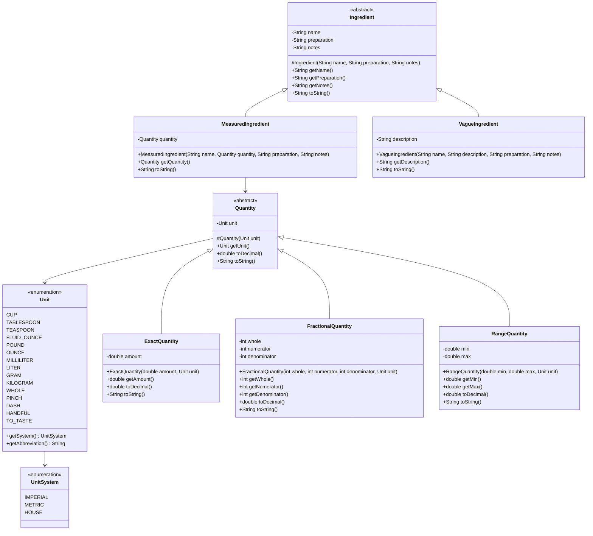

## Overview

Welcome to the **CookYourBooks** project! Over the course of the semester, you'll be building a comprehensive recipe management application that helps users digitize, organize, and work with their recipe collections. This application will eventually support importing recipes from various sources (including OCR from photos), storing them in a structured format, and providing both command-line and graphical interfaces for managing a personal recipe library.

In this first assignment, you'll lay the foundation by implementing the core domain model for **ingredients and quantities**. You'll create two class hierarchies that work together: one for representing different types of quantities (exact, fractional, and range), and another for representing ingredients (measured and vague). These classes will be the building blocks for everything else you create this semester, so it's important to get them right!

**Due:** Week 2, Thursday at 11:59 PM

## Learning Outcomes
By completing this assignment, you will demonstrate proficiency in the following skills:

- Designing and implementing well-structured Java classes with appropriate fields and methods
- Applying **inheritance** and **polymorphism** to model related concepts with two distinct class hierarchies
- Understanding when to use **composition vs inheritance** (e.g., `MeasuredIngredient` has-a `Quantity`)
- Creating and using **enums** with fields and methods for type-safe constants
- Implementing `toString()` methods for clear object representation
- Writing specifications with **preconditions and postconditions** using Javadoc
- Validating constructor inputs and throwing appropriate exceptions
- Writing comprehensive unit tests with JUnit 5
- Working with Java's type system and object-oriented principles

## AI policy for this assignment

**AI coding assistants (such as GitHub Copilot, ChatGPT, Claude, etc.) are NOT permitted for this assignment.**

This is your opportunity to demonstrate your understanding of fundamental Java concepts. You should write all code yourself without AI assistance. You may:
- Use official Java documentation
- Consult your textbook and course materials
- Ask questions in office hours or on the course discussion board
- Discuss high-level approaches with classmates (but write your own code)

## Technical Specifications

### Domain Concepts

In cooking, recipes require **ingredients** that may be specified in different ways:

- **Measured ingredients** have precise quantities (e.g., "2.5 cups flour", "3 whole eggs", "100 grams sugar")
- **Vague ingredients** lack precise measurements (e.g., "salt to taste", "a pinch of pepper", "water as needed")

Both types share the common property of having a name, but differ in how their quantity is expressed. This natural hierarchy makes them ideal candidates for inheritance, where we can write code that works with any ingredient regardless of how it's measured.

#### Units of Measurement

Recipes use various unit systems depending on regional conventions and the ingredient being measured:

- **Imperial units** (common in US recipes): cups, tablespoons, teaspoons, ounces, pounds
- **Metric units** (common internationally): milliliters, liters, grams, kilograms
- **House units** (chef-specific or informal): pinch, dash, handful, "to taste"

Some ingredients may also include **preparation notes** (e.g., "chopped", "diced", "room temperature") and **recipe-specific notes** (e.g., "we prefer Bianco DiNapoli tomatoes" or "order from Kalustyan's if unavailable locally"). These details are part of the ingredient's identity in the recipe context.

#### Quantities

Quantities in recipes can vary in precision:

- **Exact quantities** specify a single precise amount (e.g., "2.5 cups", "100 grams")
- **Fractional quantities** use common fractions (e.g., "1/2 cup", "2 1/3 tablespoons")
- **Range quantities** specify a range (e.g., "2-3 cups", "100-150 grams")

All quantities are tied to a specific unit and can represent the same amount in different ways (e.g., "0.5 cups" is equivalent to "1/2 cup").

### Class Design

You must implement the following classes in a package named `app.cookyourbooks`:



### Invariants and Contracts

#### `UnitSystem` (enum)

An enumeration representing the measurement system for units.

**Values:**
- `IMPERIAL` - US/British measurements (cups, tablespoons, ounces, pounds)
- `METRIC` - International System (milliliters, liters, grams, kilograms)
- `HOUSE` - Informal or chef-specific measurements (pinch, dash, handful, to taste)

#### `Unit` (enum)

An enumeration representing units of measurement for ingredients.

**Values:**
- Imperial: `CUP` ("cup", "cups"), `TABLESPOON` ("tbsp", "tbsp"), `TEASPOON` ("tsp", "tsp"), `FLUID_OUNCE` ("fl oz", "fl oz"), `OUNCE` ("oz", "oz"), `POUND` ("lb", "lb")
- Metric: `MILLILITER` ("ml", "ml"), `LITER` ("L", "L"), `GRAM` ("g", "g"), `KILOGRAM` ("kg", "kg")
- Imperial (count): `WHOLE` ("whole", "whole") - used for counting items like eggs
- House: `PINCH` ("pinch", "pinches"), `DASH` ("dash", "dashes"), `HANDFUL` ("handful", "handfuls"), `TO_TASTE` ("to taste", "to taste")

**Methods:**
- `public UnitSystem getSystem()` - Returns the unit system this unit belongs to
- `public String getAbbreviation()` - Returns the singular form for display
- `public String getPluralAbbreviation()` - Returns the plural form for display

**Implementation Notes:**
- Each enum constant must be defined with its system, singular abbreviation, and plural abbreviation
- Use a private constructor: `Unit(UnitSystem system, String abbreviation, String pluralAbbreviation)`
- Store system, abbreviation, and pluralAbbreviation as private final fields in the enum
- Example constant definition: `CUP(UnitSystem.IMPERIAL, "cup", "cups")`
- The getters simply return these stored values
- Note: Some units use the same form for both singular and plural (e.g., "tbsp", "ml")

#### `Quantity` (abstract class)

An abstract base class representing a quantity with an associated unit.

**Constructor:**
- `protected Quantity(@NonNull Unit unit)`
  - **Preconditions:** `unit` must not be null
  - **Throws:** `IllegalArgumentException` if unit is null
  - **Postconditions:** Creates a quantity with the given unit

**Methods:**
- `public Unit getUnit()` - Returns the unit (never null)
- `public abstract double toDecimal()` - Returns the numeric value as a decimal (for display/calculation purposes)
- `public abstract String toString()` - Returns a human-readable string representation

#### `ExactQuantity` (extends `Quantity`)

Represents a precise decimal quantity.

**Constructor:**
- `public ExactQuantity(double amount, @NonNull Unit unit)`
  - **Preconditions:**
    - `amount` must be strictly positive (> 0.0)
    - `unit` must not be null (validated by superclass)
  - **Throws:** `IllegalArgumentException` if amount is not positive or unit is null
  - **Postconditions:** Creates an exact quantity with the given amount and unit

**Methods:**
- `public double getAmount()` - Returns the amount (always > 0.0)
- `public double toDecimal()` - Returns the amount
- `public String toString()` - Returns a formatted string using appropriate singular/plural form:
  - If amount equals 1.0: `"{amount} {unit.getAbbreviation()}"` (e.g., "1 cup", "1 g")
  - Otherwise: `"{amount} {unit.getPluralAbbreviation()}"` (e.g., "2.5 cups", "100 g")
  - Note: Use exact comparison `amount == 1.0` for determining singular/plural

#### `FractionalQuantity` (extends `Quantity`)

Represents a quantity as a mixed number (whole + fraction).

**Constructor:**
- `public FractionalQuantity(int whole, int numerator, int denominator, @NonNull Unit unit)`
  - **Preconditions:**
    - `whole` must be non-negative (>= 0)
    - `numerator` must be non-negative (>= 0)
    - `denominator` must be positive (> 0)
    - At least one of `whole` or `numerator` must be positive (to ensure total quantity > 0)
    - `unit` must not be null (validated by superclass)
  - **Throws:** `IllegalArgumentException` if any precondition is violated
  - **Postconditions:** Creates a fractional quantity with the given parts and unit
  - **Note:** Fractions should not need to reduced to lowest terms.

**Methods:**
- `public int getWhole()` - Returns the whole part (>= 0)
- `public int getNumerator()` - Returns the numerator (>= 0)
- `public int getDenominator()` - Returns the denominator (> 0)
- `public double toDecimal()` - Returns the decimal equivalent: `whole + (numerator / (double) denominator)`
- `public String toString()` - Returns formatted string using appropriate singular/plural form:
  - If whole > 0 and numerator > 0: `"{whole} {numerator}/{denominator} {unit.getPluralAbbreviation()}"` (e.g., "2 1/3 cups")
  - If whole > 0 and numerator == 0: 
    - If whole equals 1: `"{whole} {unit.getAbbreviation()}"` (e.g., "1 cup")
    - Otherwise: `"{whole} {unit.getPluralAbbreviation()}"` (e.g., "2 cups")
  - If whole == 0 and numerator > 0:
    - If numerator equals 1 and denominator equals 1: `"{numerator} {unit.getAbbreviation()}"` (e.g., "1 cup")
    - Otherwise: `"{numerator}/{denominator} {unit.getAbbreviation()}"` (e.g., "1/2 cup")

#### `RangeQuantity` (extends `Quantity`)

Represents a range of quantities (e.g., "2-3 cups").

**Constructor:**
- `public RangeQuantity(double min, double max, @NonNull Unit unit)`
  - **Preconditions:**
    - `min` must be strictly positive (> 0.0)
    - `max` must be strictly greater than min (max > min)
    - `unit` must not be null (validated by superclass)
  - **Throws:** `IllegalArgumentException` if any precondition is violated
  - **Postconditions:** Creates a range quantity with the given min, max, and unit

**Methods:**
- `public double getMin()` - Returns the minimum amount (always > 0.0)
- `public double getMax()` - Returns the maximum amount (always > min)
- `public double toDecimal()` - Returns the midpoint: `(min + max) / 2.0`
- `public String toString()` - Returns formatted string using plural form (ranges are always plural):
  - Format: `"{min}-{max} {unit.getPluralAbbreviation()}"` (e.g., "2-3 cups", "100-150 g")

#### `Ingredient` (abstract class)

**Constructor:**
- `protected Ingredient(@NonNull String name, String preparation, String notes)`
  - **Preconditions:** 
    - `name` must not be null and must not be blank (empty or whitespace-only)
    - `preparation` may be null (indicates no special preparation)
    - `notes` may be null (indicates no special notes)
  - **Throws:** `IllegalArgumentException` if name is null or blank
  - **Postconditions:** Creates an ingredient with the given name, preparation, and notes (strings trimmed of leading/trailing whitespace if non-null)

**Methods:**
- `public String getName()` - Returns the ingredient name (never null)
- `public String getPreparation()` - Returns the preparation (may be null)
- `public String getNotes()` - Returns the notes (may be null)
- `public abstract String toString()` - Returns a human-readable string representation

#### `MeasuredIngredient` (extends `Ingredient`)

**Constructor:**
- `public MeasuredIngredient(@NonNull String name, @NonNull Quantity quantity, String preparation, String notes)`
  - **Preconditions:**
    - `name` must not be null or blank (validated by superclass)
    - `quantity` must not be null
    - `preparation` may be null (validated by superclass)
    - `notes` may be null (validated by superclass)
  - **Throws:** `IllegalArgumentException` if name is null/blank or quantity is null
  - **Postconditions:** Creates a measured ingredient with name, quantity, preparation, and notes

**Methods:**
- `public Quantity getQuantity()` - Returns the quantity (never null)
- `public String toString()` - Returns a formatted string that includes quantity, name, and optionally preparation:
  - If preparation is null or empty: `"{quantity.toString()} {name}"`
  - If preparation is non-null and non-empty: `"{quantity.toString()} {name}, {preparation}"`
  - Examples:
    - "2.5 cups flour, sifted"
    - "1/2 cup sugar"
    - "100 g butter"
    - "3 whole eggs, room temperature"

#### `VagueIngredient` (extends `Ingredient`)

**Constructor:**
- `public VagueIngredient(@NonNull String name, String description, String preparation, String notes)`
  - **Preconditions:** 
    - `name` must not be null or blank (validated by superclass)
    - `description` may be null
    - `preparation` may be null (validated by superclass)
    - `notes` may be null (validated by superclass)
  - **Throws:** `IllegalArgumentException` if name is null or blank
  - **Postconditions:** Creates a vague ingredient with name, description, preparation, and notes

**Methods:**
- `public String getDescription()` - Returns the description (may be null)
- `public String toString()` - Returns a formatted string combining name, description, and preparation according to these rules:
  1. Start with the name
  2. If description is non-null and non-empty, append ` ({description})`
  3. If preparation is non-null and non-empty, append `, {preparation}`
  - Specific formats:
    - Name only: `"{name}"` (e.g., "water")
    - Name + description: `"{name} ({description})"` (e.g., "salt (to taste)")
    - Name + preparation: `"{name}, {preparation}"` (e.g., "tomatoes, diced")
    - Name + description + preparation: `"{name} ({description}), {preparation}"` (e.g., "pepper (freshly ground), coarsely chopped")

### Design Requirements

- Use proper access modifiers: fields should be `private`, constructors `public` (except `Ingredient` and `Quantity` constructors which should be `protected`)
- Make all fields `final` to ensure immutability
- Follow Java naming conventions (classes are PascalCase, methods are camelCase)
- Add comprehensive Javadoc comments for all public classes, constructors, and methods
- Document all parameters, return values, exceptions, preconditions, and postconditions
- Trim all string inputs in constructors to remove leading/trailing whitespace
- Use proper encapsulation: no mutable objects should be exposed through getters

### Example Usage

```java
package app.cookyourbooks;

public class RecipeExample {
    public static void main(String[] args) {
        // Creating quantities
        Quantity flourQty = new ExactQuantity(2.5, Unit.CUP);
        Quantity sugarQty = new FractionalQuantity(0, 1, 2, Unit.CUP);
        Quantity butterQty = new FractionalQuantity(2, 1, 3, Unit.TABLESPOON);
        Quantity milkQty = new RangeQuantity(2, 3, Unit.CUP);
        Quantity eggsQty = new ExactQuantity(3, Unit.WHOLE);
        Quantity tomatoesQty = new ExactQuantity(800, Unit.GRAM);
        
        // Creating measured ingredients
        Ingredient flour = new MeasuredIngredient("flour", flourQty, "sifted", null);
        Ingredient sugar = new MeasuredIngredient("sugar", sugarQty, null, null);
        Ingredient butter = new MeasuredIngredient("butter", butterQty, null, null);
        Ingredient milk = new MeasuredIngredient("milk", milkQty, null, null);
        Ingredient eggs = new MeasuredIngredient("eggs", eggsQty, "room temperature", null);
        Ingredient tomatoes = new MeasuredIngredient("tomatoes", tomatoesQty, "diced", 
            "We prefer Bianco DiNapoli tomatoes");
        
        // Creating vague ingredients
        Ingredient salt = new VagueIngredient("salt", "to taste", null, null);
        Ingredient water = new VagueIngredient("water", null, null, null);
        Ingredient pepper = new VagueIngredient("black pepper", "freshly ground", null, 
            "Order from Kalustyan's if unavailable locally");
        
        // String representation
        System.out.println(flour);     // Output: 2.5 cups flour, sifted
        System.out.println(sugar);     // Output: 1/2 cup sugar
        System.out.println(butter);    // Output: 2 1/3 tbsp butter
        System.out.println(milk);      // Output: 2-3 cups milk
        System.out.println(eggs);      // Output: 3 whole eggs, room temperature
        System.out.println(tomatoes);  // Output: 800 g tomatoes, diced
        System.out.println(salt);      // Output: salt (to taste)
        System.out.println(water);     // Output: water
        
        // Quantity conversions
        System.out.println(sugarQty.toDecimal());  // Output: 0.5
        System.out.println(butterQty.toDecimal()); // Output: 2.333...
        System.out.println(milkQty.toDecimal());   // Output: 2.5 (midpoint)
        
        // Unit systems
        System.out.println(Unit.CUP.getSystem());          // Output: IMPERIAL
        System.out.println(Unit.GRAM.getSystem());         // Output: METRIC
        System.out.println(Unit.PINCH.getSystem());        // Output: HOUSE
        System.out.println(Unit.TABLESPOON.getAbbreviation()); // Output: tbsp
        
        // Exception handling
        try {
            Quantity invalid = new ExactQuantity(0, Unit.CUP);
        } catch (IllegalArgumentException e) {
            System.out.println("Error: " + e.getMessage());
            // Output: Error: amount must be positive
        }
    }
}
```

### Testing Requirements

You must write comprehensive unit tests for all classes. Your test suite should demonstrate correctness and robustness of your implementation. **Note:** Example tests will be provided in the starter code repository.

#### Required Test Categories

**1. Constructor Tests (All Classes)**
- Valid construction with typical inputs
- Valid construction with null optional fields (preparation, notes, description)
- Boundary cases:
  - Very small positive amounts (e.g., 0.001)
  - Large amounts
  - Edge cases for fractions (whole=0, numerator=0, etc.)
- Exception cases:
  - Null parameters where required should throw `IllegalArgumentException`
  - Blank name (empty or whitespace) should throw `IllegalArgumentException`
  - Zero or negative amounts should throw `IllegalArgumentException`
  - Invalid fraction components (negative numerator, zero/negative denominator)
  - Invalid range (min >= max, zero/negative min)

**2. `toDecimal()` Tests (Quantity Classes)**
- Correct conversion for `ExactQuantity`
- Correct conversion for `FractionalQuantity` (including mixed numbers and proper fractions)
- Correct midpoint calculation for `RangeQuantity`
- Precision handling for division in `FractionalQuantity`

**3. `toString()` Tests (All Classes)**
- Correct format for each quantity type with proper singular/plural forms:
  - `ExactQuantity`: "1 cup" (singular), "2.5 cups" (plural), "100 g"
  - `FractionalQuantity`: "1/2 cup", "1 cup" (singular), "2 cups" (plural), "2 1/3 cups"
  - `RangeQuantity`: "2-3 cups" (always plural)
- Correct format for ingredients:
  - With and without preparation
  - With and without description (for vague ingredients)
  - Proper integration of quantity's toString
  - All combinations of name, description, and preparation for VagueIngredient
- Proper use of singular and plural unit abbreviations

**4. Enum Tests (Unit and UnitSystem)**
- Verify `Unit.getSystem()` returns correct `UnitSystem` for each unit
- Verify `Unit.getAbbreviation()` returns correct singular abbreviation
- Verify `Unit.getPluralAbbreviation()` returns correct plural abbreviation
- Test a sample of units from each system (Imperial, Metric, House)
- Ensure all 14 units are properly defined

**5. Inheritance and Polymorphism Tests**
- Verify quantity subclasses can be assigned to `Quantity` references
- Verify ingredient subclasses can be assigned to `Ingredient` references
- Verify abstract methods work polymorphically

**6. Integration Tests**
- Test creating `MeasuredIngredient` with different quantity types
- Test that toString properly composes information from quantity and ingredient

#### Testing Best Practices

- Use JUnit 5 for all tests
- Use descriptive test method names (e.g., `testConstructorThrowsExceptionForNegativeAmount`)
- Use `@Test` annotation for each test method
- Use assertions: `assertEquals`, `assertThrows`, `assertNotNull`, `assertTrue`, `assertFalse`, `assertNull`
- Use `assertEquals` with delta for floating-point comparisons: `assertEquals(expected, actual, 0.0001)`
- Organize tests into test classes:
  - `UnitTest` - for Unit enum
  - `ExactQuantityTest`, `FractionalQuantityTest`, `RangeQuantityTest`
  - `MeasuredIngredientTest`, `VagueIngredientTest`
- Aim for at least 90% code coverage

#### What NOT to Test

**Do not write tests for simple getters.** Testing getters is redundant and wastes time—if a constructor test passes, the getters work. Focus your testing effort on:
- Constructor validation and edge cases
- Mathematical calculations (toDecimal)
- String formatting (toString)
- Enum behavior
- Exception handling

## Reflection
Add a file `REFLECTION.md` to your repository that includes a 1-5 sentence reflection on each of the following questions:

1. **Inheritance Design:** Why is it useful to have `MeasuredIngredient` and `VagueIngredient` both extend a common `Ingredient` class, rather than an interface? What advantages does this provide for future development? Similarly, why is the `Quantity` hierarchy beneficial?

2. **Composition vs Inheritance:** `MeasuredIngredient` uses composition (has-a relationship) with `Quantity`, while `ExactQuantity` uses inheritance (is-a relationship) with `Quantity`. Explain when composition is preferred over inheritance and vice versa, using examples from this assignment.

3. **Immutability:** Did you make your classes immutable (i.e., their state cannot change after construction)? Why or why not? What are the tradeoffs of immutable objects in a domain model like recipes?

4. **Type Safety:** How do the `Unit` and `UnitSystem` enums provide better type safety compared to using strings for units? Give a specific example of an error that enums prevent.

5. **Challenges:** What was the most challenging aspect of this assignment? What strategy did you use to overcome it?

## Quality Requirements

Your submission will be evaluated on:

- **Correctness (40%)**: Your code must compile, follow all specifications, and pass comprehensive tests
- **Testing (25%)**: Comprehensive test suite covering all required test categories with high coverage
- **Design (20%)**: Classes should be well-designed with appropriate use of inheritance, access modifiers, and validation
- **Documentation (10%)**: All public classes and methods should have clear Javadoc comments
- **Code Quality (5%)**: Code should be clean, readable, and follow Java conventions

Additional expectations:
- No compiler warnings
- No checkstyle violations (if provided)
- Consistent indentation and formatting
- Meaningful variable and method names
- Appropriate use of exceptions with descriptive error messages

## Grading Rubric

Your submission will be evaluated on correctness, design quality, testing, and code quality. This rubric is organized by the design principles covered in lectures 1-3.

### Correctness and Functionality (52 points)

| Component | Points | Criteria |
|-----------|--------|----------|
| **UnitSystem Enum** | 2 | All three values (IMPERIAL, METRIC, HOUSE) correctly defined |
| **Unit Enum** | 4 | All 14 units correctly defined with system, singular and plural abbreviations; getters work correctly |
| **Quantity Hierarchy** | 6 | Abstract base class with protected constructor, unit field, abstract toDecimal() and toString() |
| **ExactQuantity** | 6 | Correct toDecimal(), toString() with singular/plural logic, validation (amount > 0) |
| **FractionalQuantity** | 10 | Correct toDecimal() calculation, toString() with all formatting cases, validation (denominator > 0, whole >= 0, numerator >= 0, at least one positive) |
| **RangeQuantity** | 6 | Correct toDecimal() (midpoint), toString() always plural, validation (min > 0, max > min) |
| **Ingredient Hierarchy** | 4 | Abstract base class with protected constructor, fields (name, preparation, notes), string trimming |
| **MeasuredIngredient** | 8 | Composition with Quantity, toString() integrates quantity, validation (non-null quantity, non-blank name) |
| **VagueIngredient** | 6 | toString() handles all combinations of description/preparation, validation (non-blank name) |

### Inheritance and Polymorphism (12 points)
*Based on Lecture 2: Type hierarchies, interfaces, abstract classes, dynamic dispatch*

| Criteria | Points | Details |
|----------|--------|---------|
| **Appropriate use of inheritance** | 4 | Both hierarchies (Quantity and Ingredient) use abstract base classes appropriately; code is reused not duplicated |
| **Composition over inheritance** | 3 | MeasuredIngredient uses composition (has-a Quantity) rather than multiple inheritance; demonstrates understanding of when composition is preferred |
| **Access modifiers** | 3 | Proper use of `private` fields, `public` methods, `protected` constructors; no package-private declarations |
| **Method overriding** | 2 | toString() properly overridden in all subclasses; no @Override used on abstract base methods |

### Type Safety and Exceptions (10 points)
*Based on Lecture 2: Exception handling and parameter validation*

| Criteria | Points | Details |
|----------|--------|---------|
| **Parameter validation** | 5 | All constructor parameters validated with appropriate checks (null, blank, positive values, ranges) |
| **Appropriate exceptions** | 3 | IllegalArgumentException used consistently for invalid parameters with descriptive messages |
| **Null safety** | 2 | Proper handling of nullable parameters (preparation, notes, description); null checks where required |

### Documentation and Specification (8 points)
*Based on Lecture 1: Comments and Javadoc; Lecture 2: Method specifications*

| Criteria | Points | Details |
|----------|--------|---------|
| **Javadoc completeness** | 4 | All public classes, constructors, and methods have Javadoc; includes @param, @return, @throws as appropriate |
| **Specification clarity** | 2 | Javadoc clearly describes preconditions, postconditions, and exceptional behavior |
| **Code comments** | 2 | Complex logic has clear comments; no redundant comments on obvious code |

### Testing (18 points)
*Based on testing principles and comprehensive validation*

| Criteria | Points | Details |
|----------|--------|---------|
| **Constructor validation tests** | 5 | Tests for all valid cases, boundary cases, and exception cases; proper use of assertThrows |
| **Calculation tests** | 4 | toDecimal() tests with proper floating-point comparison (delta); edge cases covered |
| **String formatting tests** | 4 | toString() tests cover all formatting branches including singular/plural logic |
| **Enum tests** | 2 | Unit enum methods tested; sample from each UnitSystem verified |
| **Integration tests** | 3 | MeasuredIngredient properly composes with all Quantity types; polymorphism demonstrated |

### Total: 100 points

### Automatic Deductions

- **Code doesn't compile**: -50 points (must compile without errors)
- **Missing test suite**: -15 points
- **Compiler warnings**: -5 points per warning type (generics, unchecked operations, raw types)
- **Incorrect calculations**: -10 points (toDecimal, midpoint)
- **toString format violations**: -5 points per class with incorrect format
- **Missing validation**: -3 points per constructor missing required validation
- **Package structure violation**: -5 points (must use app.cookyourbooks)

## Submission

1. **Clone the repository from Pawtograder:** Clone it to your local machine
2. **Implement the enums:** Create the following files in `src/main/java/app/cookyourbooks/`:
   - `UnitSystem.java` - enumeration of measurement systems
   - `Unit.java` - enumeration of units with methods
3. **Implement the quantity classes:** Create these files in `src/main/java/app/cookyourbooks/`:
   - `Quantity.java` - abstract base class for quantities
   - `ExactQuantity.java` - concrete class for decimal quantities
   - `FractionalQuantity.java` - concrete class for fractional quantities
   - `RangeQuantity.java` - concrete class for range quantities
4. **Implement the ingredient classes:** Create these files in `src/main/java/app/cookyourbooks/`:
   - `Ingredient.java` - abstract base class for ingredients
   - `MeasuredIngredient.java` - concrete class for measured ingredients
   - `VagueIngredient.java` - concrete class for vague ingredients
5. **Write comprehensive tests:** Create test files in `src/test/java/app/cookyourbooks/`:
   - `UnitTest.java` - tests for the Unit enum
   - `ExactQuantityTest.java` - tests for ExactQuantity
   - `FractionalQuantityTest.java` - tests for FractionalQuantity
   - `RangeQuantityTest.java` - tests for RangeQuantity
   - `MeasuredIngredientTest.java` - tests for MeasuredIngredient
   - `VagueIngredientTest.java` - tests for VagueIngredient
6. **Add reflection:** Create `REFLECTION.md` in the root of the repository
7. **Verify your work:**
   - Run `./gradlew build` to ensure your code compiles
   - Run `./gradlew test` to verify all tests pass
   - Run `./gradlew javadoc` to ensure documentation is correct
8. **Commit and push:** Commit all your changes and push to GitHub

### Repository Structure

Your final repository should look like this:

```
assignment1-recipe-model/
├── src/
│   ├── main/
│   │   └── java/
│   │       └── app/
│   │           └── cookyourbooks/
│   │               ├── UnitSystem.java
│   │               ├── Unit.java
│   │               ├── Quantity.java
│   │               ├── ExactQuantity.java
│   │               ├── FractionalQuantity.java
│   │               ├── RangeQuantity.java
│   │               ├── Ingredient.java
│   │               ├── MeasuredIngredient.java
│   │               └── VagueIngredient.java
│   └── test/
│       └── java/
│           └── app/
│               └── cookyourbooks/
│                   ├── UnitTest.java
│                   ├── ExactQuantityTest.java
│                   ├── FractionalQuantityTest.java
│                   ├── RangeQuantityTest.java
│                   ├── MeasuredIngredientTest.java
│                   └── VagueIngredientTest.java
├── REFLECTION.md
├── build.gradle (provided)
└── README.md (provided)
```

**Important Notes:**
- The timestamp of your last push to GitHub determines if your submission is on time
- Make sure all tests pass before submitting
- Verify your code compiles without warnings or errors
- Double-check that all Javadoc is complete and properly formatted

Good luck, and happy coding!