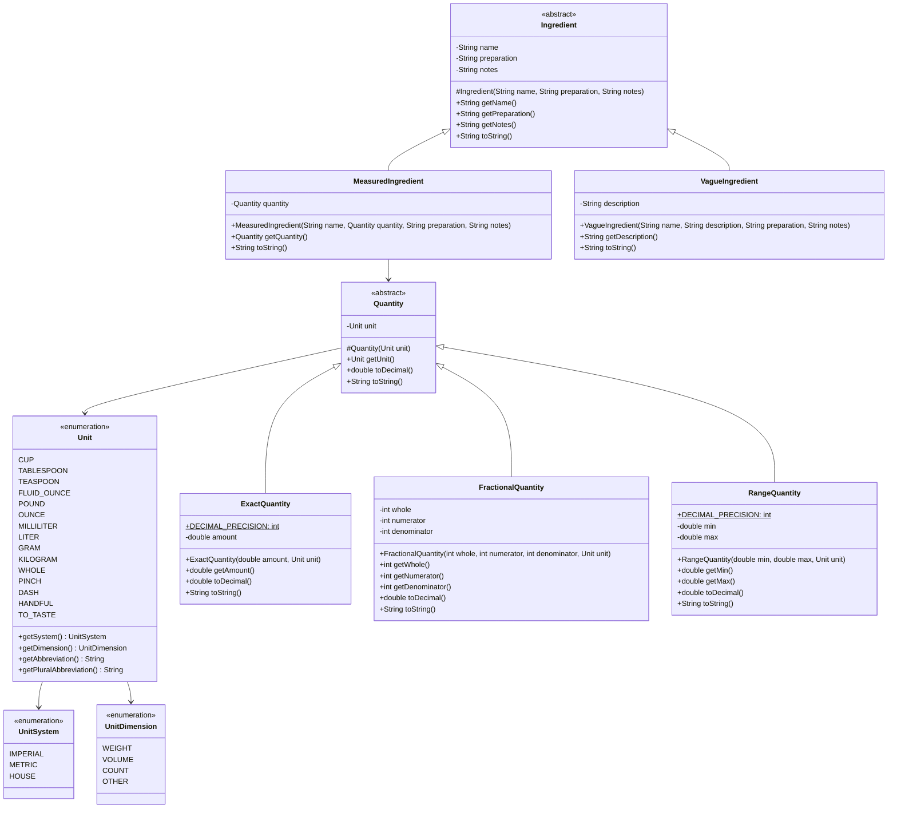

## Overview

Welcome to the **CookYourBooks** project! Over the course of the semester, you'll be building a comprehensive recipe management application that helps users digitize, organize, and work with their recipe collections. This application will eventually support importing recipes from various sources (including OCR from photos), storing them in a structured format, and providing both command-line and graphical interfaces for managing a personal recipe library.

In this first assignment, you'll lay the foundation by implementing the core domain model for **ingredients and quantities**. You'll create two class hierarchies that work together: one for representing different types of quantities (exact, fractional, and range), and another for representing ingredients (measured and vague). These classes will be the building blocks for everything else you create this semester, so it's important to get them right!

**Due:** Thursday, January 15, 2026 at 11:59 PM Boston Time

## Learning Outcomes
By completing this assignment, you will demonstrate proficiency in the following skills:

- Designing and implementing well-structured Java classes with appropriate fields and methods
- Applying **inheritance** and **polymorphism** to model related concepts with two distinct class hierarchies
- Understanding when to use **composition vs inheritance** (e.g., `MeasuredIngredient` has-a `Quantity`)
- Reading official language documentation and creating and using **enums** with fields and methods for type-safe constants
- Implementing `toString()` methods for clear object representation
- Writing specifications with **preconditions and postconditions** using Javadoc
- Validating constructor inputs and throwing appropriate exceptions
- Writing comprehensive unit tests with JUnit 5

## AI policy for this assignment

**AI coding assistants (such as GitHub Copilot, ChatGPT, Claude, etc.) should NOT be used for this assignment.** 

This is your opportunity to demonstrate your understanding of fundamental Java concepts. You should write all code yourself without *any* AI assistance. You may:
- Use official Java documentation
- Consult your textbook and course materials
- Ask questions in office hours or on the course discussion board
- Discuss high-level approaches with classmates (but write your own code)

As we are unable to enforce this policy, we stress that this policy is a strong guideline, and will not adjust your grade if you use AI to help you with this assignment. We ask that you report any AI usage in the [Reflection](#reflection) section of your submission to help us improve the course and this policy.

## Grading Overview
This assignment is worth 100 points. A fully automated grading script will be used to add points to your submission, and a manual grading process will be used to deduct points for subjective issues that can not be automatically graded.

A grade of "zero" will be awarded for submissions that do not compile or have code formatting issues. If this is a challenge for you, please reach out to the staff for assistance - we are happy to help make sure that your IDE is configured correctly to automatically flag (and potentially fix) these issues.

You should carefully read the [Grading Rubric](#grading-rubric) section below to understand how your submission will be graded.

## Technical Specifications

### Domain Concepts

In cooking, recipes require **ingredients** that may be specified in different ways:

- **Measured ingredients** have precise quantities (e.g., "2.5 cups flour", "3 whole eggs", "100 grams sugar")
- **Vague ingredients** lack precise measurements (e.g., "salt to taste", "a pinch of pepper", "water as needed")

Both types share the common property of having a name, but differ in how their quantity is expressed. This natural hierarchy makes them ideal candidates for inheritance, where we can write code that works with any ingredient regardless of how it's measured.

#### Units of Measurement

Recipes use various unit systems depending on regional conventions and the ingredient being measured:

- **Imperial units** (common in US recipes): cups, tablespoons, teaspoons, ounces, pounds
- **Metric units** (common internationally): milliliters, liters, grams, kilograms
- **House units** (chef-specific or informal): pinch, dash, handful, "to taste"

Some ingredients may also include **preparation notes** (e.g., "chopped", "diced", "room temperature") and **recipe-specific notes** (e.g., "we prefer Bianco DiNapoli tomatoes" or "order from Kalustyan's if unavailable locally"). These details are part of the ingredient's identity in the recipe context.

#### Quantities

Quantities in recipes can vary in precision:

- **Exact quantities** specify a single precise amount (e.g., "2.5 cups", "100 grams")
- **Fractional quantities** use common fractions (e.g., "1/2 cup", "2 1/3 tablespoons")
- **Range quantities** specify a range (e.g., "2-3 cups", "100-150 grams")

All quantities are tied to a specific unit and can represent the same amount in different ways (e.g., "0.5 cups" is equivalent to "1/2 cup").

### Class Design

You must implement the following classes in a package named `app.cookyourbooks.domain`:



### Invariants and Contracts
Utilize JSpecify's `@NonNull` annotations to express the non-nullness of parameters and return values.

Java Enums are a special type of class that represents a fixed set of constants. They are declared using the `enum` keyword and are instantiated using the `new` keyword. To learn more about Enums, you should refer directly to [the Java documentation](https://docs.oracle.com/javase/tutorial/java/javaOO/enum.html).

#### `UnitSystem` (enum)

An enumeration representing the measurement system for units. This is a simple enum (no fields or methods).

**Values:**
- `IMPERIAL` - US/British measurements (cups, tablespoons, ounces, pounds)
- `METRIC` - International System (milliliters, liters, grams, kilograms)
- `HOUSE` - Informal or chef-specific measurements (pinch, dash, handful, to taste)

#### `UnitDimension` (enum)

An enumeration representing the physical dimension of a unit. This is a simple enum (no fields or methods).

**Values:**
- `WEIGHT` - Units for measuring mass (grams, kilograms, ounces, pounds)
- `VOLUME` - Units for measuring volume (milliliters, liters, cups, tablespoons, teaspoons, fluid ounces)
- `COUNT` - Units for counting discrete items (whole)
- `OTHER` - Units that don't fit standard categories (house units like pinch, dash, handful, to taste)

#### `Unit` (enum)

An enumeration representing units of measurement for ingredients. Each enum constant must be defined with its system, dimension, singular abbreviation, and plural abbreviation.

You should use your judgement to determine how to implement the enum, relying primarily on [the Java documentation](https://docs.oracle.com/javase/tutorial/java/javaOO/enum.html). 

**Values:**
- Imperial (volume): `CUP` (IMPERIAL, VOLUME, "cup", "cups"), `TABLESPOON` (IMPERIAL, VOLUME, "tbsp", "tbsp"), `TEASPOON` (IMPERIAL, VOLUME, "tsp", "tsp"), `FLUID_OUNCE` (IMPERIAL, VOLUME, "fl oz", "fl oz")
- Imperial (weight): `OUNCE` (IMPERIAL, WEIGHT, "oz", "oz"), `POUND` (IMPERIAL, WEIGHT, "lb", "lb")
- Metric (volume): `MILLILITER` (METRIC, VOLUME, "ml", "ml"), `LITER` (METRIC, VOLUME, "L", "L")
- Metric (weight): `GRAM` (METRIC, WEIGHT, "g", "g"), `KILOGRAM` (METRIC, WEIGHT, "kg", "kg")
- House: `PINCH` (HOUSE, OTHER, "pinch", "pinches"), `DASH` (HOUSE, OTHER, "dash", "dashes"), `HANDFUL` (HOUSE, OTHER, "handful", "handfuls"), `TO_TASTE` (HOUSE, OTHER, "to taste", "to taste")
- House (count): `WHOLE` (IMPERIAL, COUNT, "whole", "whole") - used for counting items like eggs

**Methods:**
- `public UnitSystem getSystem()` - Returns the unit system this unit belongs to
- `public UnitDimension getDimension()` - Returns the physical dimension of this unit
- `public String getAbbreviation()` - Returns the singular form for display
- `public String getPluralAbbreviation()` - Returns the plural form for display

**Testing (`UnitTest.java`):**
Write tests to verify the `Unit` enum methods work correctly for a representative sample of units. We do not suggest that you spend time testing `UnitSystem` or `UnitDimension` directly.

#### `Quantity` (abstract class)

An abstract base class representing a quantity with an associated unit.

**Constructor:**
- `protected Quantity(@NonNull Unit unit)`
  - **Preconditions:** `unit` must not be null
  - **Throws:** `IllegalArgumentException` if unit is null
  - **Postconditions:** Creates a quantity with the given unit

**Methods:**
- `public Unit getUnit()` - Returns the unit (never null)
- `public abstract double toDecimal()` - Returns the numeric value as a decimal (for display/calculation purposes)
- `public abstract String toString()` - Returns a human-readable string representation

#### `ExactQuantity` (extends `Quantity`)

Represents a precise decimal quantity.

**Constructor:**
- `public ExactQuantity(double amount, @NonNull Unit unit)`
  - **Preconditions:**
    - `amount` must be strictly positive (> 0.0)
    - `unit` must not be null (validated by superclass)
  - **Throws:** `IllegalArgumentException` if amount is not positive or unit is null
  - **Postconditions:** Creates an exact quantity with the given amount and unit

**Constants:**
- `public static final int DECIMAL_PRECISION` - The maximum number of decimal places to display when formatting quantities (you should choose a reasonable value, such as 2 or 3)

**Methods:**
- `public double getAmount()` - Returns the amount (always > 0.0)
- `public double toDecimal()` - Returns the amount
- `public String toString()` - Returns a formatted string using appropriate singular/plural form:
  - Format the amount with at most `DECIMAL_PRECISION` decimal places, simplifying where possible (e.g., "2" instead of "2.0", "2.5" instead of "2.50")
  - If amount equals 1.0: `"{amount} {unit.getAbbreviation()}"` (e.g., "1 cup", "1 g")
  - Otherwise: `"{amount} {unit.getPluralAbbreviation()}"` (e.g., "2.5 cups", "100 g")
  - Note: Use exact comparison `amount == 1.0` for determining singular/plural (before formatting for display)

**Testing (`ExactQuantityTest.java`):**
Write tests to verify constructor validation (consider what values should be valid vs. invalid based on the preconditions), the `toDecimal()` calculation, and the `toString()` formatting rules including singular/plural logic. 

#### `FractionalQuantity` (extends `Quantity`)

Represents a quantity as a mixed number (whole + fraction).

**Constructor:**
- `public FractionalQuantity(int whole, int numerator, int denominator, @NonNull Unit unit)`
  - **Preconditions:**
    - `whole` must be non-negative (>= 0)
    - `numerator` must be non-negative (>= 0)
    - `denominator` must be positive (> 0)
    - At least one of `whole` or `numerator` must be positive (to ensure total quantity > 0)
    - `unit` must not be null (validated by superclass)
  - **Throws:** `IllegalArgumentException` if any precondition is violated
  - **Postconditions:** Creates a fractional quantity with the given parts and unit
  - **Note:** Fractions should not need to reduced to lowest terms.

**Methods:**
- `public int getWhole()` - Returns the whole part (>= 0)
- `public int getNumerator()` - Returns the numerator (>= 0)
- `public int getDenominator()` - Returns the denominator (> 0)
- `public double toDecimal()` - Returns the decimal equivalent: `whole + (numerator / (double) denominator)`
- `public String toString()` - Returns formatted string using appropriate singular/plural form:
  - If whole > 0 and numerator > 0: `"{whole} {numerator}/{denominator} {unit.getPluralAbbreviation()}"` (e.g., "2 1/3 cups")
  - If whole > 0 and numerator == 0: 
    - If whole equals 1: `"{whole} {unit.getAbbreviation()}"` (e.g., "1 cup")
    - Otherwise: `"{whole} {unit.getPluralAbbreviation()}"` (e.g., "2 cups")
  - If whole == 0 and numerator > 0:
    - If numerator equals 1 and denominator equals 1: `"{numerator} {unit.getAbbreviation()}"` (e.g., "1 cup")
    - Otherwise: `"{numerator}/{denominator} {unit.getAbbreviation()}"` (e.g., "1/2 cup")

**Testing (`FractionalQuantityTest.java`):**
Write tests to verify constructor validation for all three components (whole, numerator, denominator) based on the preconditions. Test the `toDecimal()` calculation and `toString()`. Remember to use a delta when comparing floating-point results.

#### `RangeQuantity` (extends `Quantity`)

Represents a range of quantities (e.g., "2-3 cups").

**Constructor:**
- `public RangeQuantity(double min, double max, @NonNull Unit unit)`
  - **Preconditions:**
    - `min` must be strictly positive (> 0.0)
    - `max` must be strictly greater than min (max > min)
    - `unit` must not be null (validated by superclass)
  - **Throws:** `IllegalArgumentException` if any precondition is violated
  - **Postconditions:** Creates a range quantity with the given min, max, and unit

**Constants:**
- `public static final int DECIMAL_PRECISION` - The maximum number of decimal places to display when formatting quantities (you should choose a reasonable value, such as 2 or 3)

**Methods:**
- `public double getMin()` - Returns the minimum amount (always > 0.0)
- `public double getMax()` - Returns the maximum amount (always > min)
- `public double toDecimal()` - Returns the midpoint: `(min + max) / 2.0`
- `public String toString()` - Returns formatted string using plural form (ranges are always plural):
  - Format both min and max with at most `DECIMAL_PRECISION` decimal places, simplifying where possible (e.g., "2-3 cups" instead of "2.0-3.0 cups")
  - Format: `"{min}-{max} {unit.getPluralAbbreviation()}"` (e.g., "2-3 cups", "100-150 g")

**Testing (`RangeQuantityTest.java`):**
Write tests to verify constructor validation for the relationship between min and max values based on the preconditions. Test the midpoint calculation in `toDecimal()` and `toString()`.

#### `Ingredient` (abstract class)

**Constructor:**
- `protected Ingredient(@NonNull String name, String preparation, String notes)`
  - **Preconditions:** 
    - `name` must not be null and must not be blank (empty or whitespace-only)
    - `preparation` may be null (indicates no special preparation)
    - `notes` may be null (indicates no special notes)
  - **Throws:** `IllegalArgumentException` if name is null or blank
  - **Postconditions:** Creates an ingredient with the given name, preparation, and notes (strings trimmed of leading/trailing whitespace if non-null)

**Methods:**
- `public String getName()` - Returns the ingredient name (never null)
- `public String getPreparation()` - Returns the preparation (may be null)
- `public String getNotes()` - Returns the notes (may be null)
- `public abstract String toString()` - Returns a human-readable string representation

#### `MeasuredIngredient` (extends `Ingredient`)

**Constructor:**
- `public MeasuredIngredient(@NonNull String name, @NonNull Quantity quantity, String preparation, String notes)`
  - **Preconditions:**
    - `name` must not be null or blank (validated by superclass)
    - `quantity` must not be null
    - `preparation` may be null (validated by superclass)
    - `notes` may be null (validated by superclass)
  - **Throws:** `IllegalArgumentException` if name is null/blank or quantity is null
  - **Postconditions:** Creates a measured ingredient with name, quantity, preparation, and notes

**Methods:**
- `public Quantity getQuantity()` - Returns the quantity (never null)
- `public String toString()` - Returns a formatted string that includes quantity, name, and optionally preparation:
  - If preparation is null or empty: `"{quantity.toString()} {name}"`
  - If preparation is non-null and non-empty: `"{quantity.toString()} {name}, {preparation}"`
  - Examples:
    - "2.5 cups flour, sifted"
    - "1/2 cup sugar"
    - "100 g butter"
    - "3 whole eggs, room temperature"
- `public boolean equals(Object o)` - Compares ingredients for equality based on name (case-insensitive), quantity, preparation, and notes
- `public int hashCode()` - Returns hash code based on name (lowercase), quantity, preparation, and notes

**Testing (`MeasuredIngredientTest.java`):**
Write tests to verify constructor validation for required vs. optional parameters, including string trimming behavior. Test `toString()` formatting with and without preparation.

#### `VagueIngredient` (extends `Ingredient`)

**Constructor:**
- `public VagueIngredient(@NonNull String name, String description, String preparation, String notes)`
  - **Preconditions:** 
    - `name` must not be null or blank (validated by superclass)
    - `description` may be null
    - `preparation` may be null (validated by superclass)
    - `notes` may be null (validated by superclass)
  - **Throws:** `IllegalArgumentException` if name is null or blank
  - **Postconditions:** Creates a vague ingredient with name, description, preparation, and notes

**Methods:**
- `public String getDescription()` - Returns the description (may be null)
- `public String toString()` - Returns a formatted string combining name, description, and preparation according to these rules:
  1. Start with the name
  2. If description is non-null and non-empty, append ` ({description})`
  3. If preparation is non-null and non-empty, append `, {preparation}`
  - Specific formats:
    - Name only: `"{name}"` (e.g., "water")
    - Name + description: `"{name} ({description})"` (e.g., "salt (to taste)")
    - Name + preparation: `"{name}, {preparation}"` (e.g., "tomatoes, diced")
    - Name + description + preparation: `"{name} ({description}), {preparation}"` (e.g., "pepper (freshly ground), coarsely chopped")

**Testing (`VagueIngredientTest.java`):**
Write tests to verify constructor validation and string trimming behavior. Test `toString()`.

### Design Requirements

- Use proper access modifiers: fields should be `private`, constructors `public` (except `Ingredient` and `Quantity` constructors which should be `protected`)
- Make all fields `final` to ensure immutability (except for the `DECIMAL_PRECISION` constants which should be `public static final`)
- Follow Java naming conventions (classes are PascalCase, methods are camelCase, constants are UPPER_SNAKE_CASE)
- Add comprehensive Javadoc comments for all public classes, constructors, and methods
- Document all parameters, return values, exceptions, preconditions, and postconditions
- Trim all string inputs in constructors to remove leading/trailing whitespace
- Use proper encapsulation: no mutable objects should be exposed through getters
- When formatting decimal quantities as strings, use the `DECIMAL_PRECISION` constant to limit decimal places and simplify output (e.g., "2" not "2.0")

### Testing Overview

Your test suite should demonstrate correctness and robustness of your implementation. **An important learning goal of this assignment is developing your ability to determine what constitutes appropriate testing.** Use the class specifications (especially the preconditions, postconditions, and method contracts) to guide your test design.

Brief testing guidance is provided after each class specification above. Each class has its own test file in the `app.cookyourbooks.domain` package:
- `UnitTest.java` - Tests for the Unit enum (and indirectly UnitSystem and UnitDimension)
- `ExactQuantityTest.java` - Tests for ExactQuantity
- `FractionalQuantityTest.java` - Tests for FractionalQuantity
- `RangeQuantityTest.java` - Tests for RangeQuantity
- `MeasuredIngredientTest.java` - Tests for MeasuredIngredient
- `VagueIngredientTest.java` - Tests for VagueIngredient

#### General Testing Guidelines

When designing tests, ask yourself:
- What are the **valid inputs** based on the preconditions? Test representative examples.
- What are the **invalid inputs** that should throw exceptions? Test boundary cases and violations.
- What are the **edge cases** (e.g., exactly 1.0, zero values, empty strings)? These often reveal bugs.
- What are the **different code paths** in complex methods like `toString()`? Each branch needs testing.
- For calculations, are the **mathematical results correct**? Use appropriate precision for floating-point comparisons. 

**Note on exception testing:** The specification does not prescribe specific error messages for `IllegalArgumentException`. Your tests should verify that the correct exception type is thrown (using `assertThrows`), but should not assert on the exception message content.

**Do not write tests for simple getters.** If a constructor test passes, the getters work. Focus on:
- Constructor validation (preconditions and exceptions)
- Calculations and logic (`toDecimal()`, midpoint)
- String formatting with all branches (`toString()`)

Use JUnit 5 with descriptive test method names, appropriate assertions (`assertEquals`, `assertThrows`, etc.), and aim for at least 90% code coverage.

## Reflection
Update the file `REFLECTION.md` in the root of your repository to include a 1-5 sentence reflection on each of the following questions:

1. **Inheritance Design:** Why is it useful to have `MeasuredIngredient` and `VagueIngredient` both extend a common `Ingredient` class, rather than an interface? What advantages does this provide for future development? Similarly, why is the `Quantity` hierarchy beneficial?

2. **Composition vs Inheritance:** `MeasuredIngredient` uses composition (has-a relationship) with `Quantity`, while `ExactQuantity` uses inheritance (is-a relationship) with `Quantity`. Explain when composition is preferred over inheritance and vice versa, using examples from this assignment.

3. **Immutability:** Did you make your classes immutable (i.e., their state cannot change after construction)? Why or why not? What are the tradeoffs of immutable objects in a domain model like recipes?

4. **Type Safety:** How do the `Unit` and `UnitSystem` enums provide better type safety compared to using strings for units? Give a specific example of an error that enums prevent.

5. **Challenges:** What was the most challenging aspect of this assignment? What strategy did you use to overcome it?

6. **AI Usage:** Did you use AI to help you with this assignment? If so, how did you use it? (Note that this information will be used to help improve the course, and **not** used to penalize you for using AI, as-per our [AI policy](#ai-policy-for-this-assignment).) 

### Reflection grading
Your reflection should include 1-5 sentences for each of the questions above. Answers should be answered to the best of your ability, and reference your code submission. Up to 2 points will be deducted for each question that is omitted or answered incompletely.

## Quality Requirements

Your submission should demonstrate:

- **Correctness**: Your code must compile, follow all specifications, and pass comprehensive tests (this is assessed by the automated grading script)
- **Testing**: Test suite that effectively detects bugs through meaningful test cases (the automated grading script assesses fault detection, but not overall test suite quality)
- **Design**: Classes should be well-designed with appropriate use of inheritance, encapsulation, and validation
- **Documentation**: All public classes and methods should have clear Javadoc comments
- **Code Quality**: Code should be clean, readable, and follow course style conventions

## Grading Rubric

### Automated Grading
Within the automated grading script, you will be awarded points for:
- 50 points for implementation correctness
- 50 points for test suite effectiveness

Your implementation's correctness is evaluated by running your code against the instructor's test suite. Your test suite's effectiveness is evaluated by running your test suite against the instructor's reference implementation and a suite of buggy implementations of the same unit that have been intentionally modified to contain bugs.

For each of the units that you are tasked with implementing, you will only receive marks for the implementation of that unit if you **also** have included at least one test for that unit that detects a plausible bug in the implementation of that unit **and** all of your tests pass on the reference implementation of that unit.

Marks for tests are awarded per-fault (detect 2/5 faults and get 2/5 of the points for that unit), while marks for implementation are awarded "all or nothing" (get 100% of the points for that unit if your implementation is correct, 0% if any test fails). The grading script is configured to provide you with up to one hint on each submission for a bug that your test suite did not detect. It is also configured to provide you with up to one hint on each submission for a bug in your implementation that was detected by the instructor's test suite. With a maximum of 5 submissions per 24 hours, you should plan your efforts carefully.

### Automated Grading (100 points)

#### Implementation Correctness (50 points)

Your code is tested against a comprehensive instructor test suite that verifies all specifications are met.

- `UnitSystem`: 2 points
- `UnitDimension`: 2 points
- `Unit`: 6 points
- `Quantity`: 4 points
- `ExactQuantity`: 6 points
- `FractionalQuantity`: 10 points
- `RangeQuantity`: 6 points
- `Ingredient`: 4 points
- `MeasuredIngredient`: 6 points
- `VagueIngredient`: 4 points

#### Test Suite Quality (50 points)

Your tests are evaluated using mutation testing—we introduce small bugs into correct implementations and check whether your tests catch them.

- `ExactQuantityTest.java`: 8 points
- `FractionalQuantityTest.java`: 12 points
- `RangeQuantityTest.java`: 10 points
- `MeasuredIngredientTest.java`: 10 points
- `VagueIngredientTest.java`: 10 points

**Note:** Your code must compile for any automated points to be awarded. Non-compiling submissions receive 0 points from automated grading.

### Manual Grading (Subtractive)
Manual grading will be *subtractive*. A maximum of 30 points can be deducted from your score by manual grading on your code and test suite. A maximum of 10 points may be deducted from your score by manual grading on your reflection.

Manual grading reviews code quality attributes. Points will be deducted for deficiencies in the following areas:

| Category | Max Deduction | Criteria |
|----------|---------------|----------|
| **Inheritance & Polymorphism** | -10 | Inappropriate use of inheritance; code duplication instead of reuse; incorrect use of abstract classes; missing or improper @Override annotations |
| **Encapsulation** | -6 | Non-private fields; mutable objects exposed through getters; missing `final` modifiers on fields; improper access modifiers on constructors |
| **Documentation** | -4 | Missing or incomplete Javadoc; missing @param, @return, @throws tags |
| **Test Quality** | -6 | Excessive trivial tests (e.g., testing simple getters); redundant tests; tests that don't verify meaningful behavior |
| **Code Style** | -4 | Poor naming; overly complex logic; missing string trimming; improper exception messages |

### Grade Calculation

Your final grade is calculated as:

```
Final Score = Automated Score − Manual Deductions
```

When you submit your assignment, the automated score will be shown. The manual deductions will only be applied after the assignment is graded by the staff.

## Submission

1. **Clone the repository from Pawtograder:** Clone it to your local machine
2. **Implement the enums:** Create the following files in `src/main/java/app/cookyourbooks/domain/`:
   - `UnitSystem.java` - enumeration of measurement systems
   - `UnitDimension.java` - enumeration of physical dimensions
   - `Unit.java` - enumeration of units with methods
3. **Implement the quantity classes:** Create these files in `src/main/java/app/cookyourbooks/domain/`:
   - `Quantity.java` - abstract base class for quantities
   - `ExactQuantity.java` - concrete class for decimal quantities
   - `FractionalQuantity.java` - concrete class for fractional quantities
   - `RangeQuantity.java` - concrete class for range quantities
4. **Implement the ingredient classes:** Create these files in `src/main/java/app/cookyourbooks/domain/`:
   - `Ingredient.java` - abstract base class for ingredients
   - `MeasuredIngredient.java` - concrete class for measured ingredients
   - `VagueIngredient.java` - concrete class for vague ingredients
5. **Write comprehensive tests:** Create test files in `src/test/java/app/cookyourbooks/domain/`:
   - `ExactQuantityTest.java` - tests for ExactQuantity
   - `FractionalQuantityTest.java` - tests for FractionalQuantity
   - `RangeQuantityTest.java` - tests for RangeQuantity
   - `MeasuredIngredientTest.java` - tests for MeasuredIngredient
   - `VagueIngredientTest.java` - tests for VagueIngredient
6. **Add reflection:** Create `REFLECTION.md` in the root of the repository
7. **Check your work:**
   - Run `./gradlew build` to ensure your code compiles
   - Run `./gradlew test` to verify all tests pass
   - Run `./gradlew javadoc` to ensure documentation is correct
8. **Commit and push:** Commit all your changes and push to GitHub

### Repository Structure

Your final repository should look like this:

```
assignment1-recipe-model/
├── src/
│   ├── main/
│   │   └── java/
│   │       └── app/
│   │           └── cookyourbooks/
│   │               └── domain/
│   │                   ├── UnitSystem.java
│   │                   ├── UnitDimension.java
│   │                   ├── Unit.java
│   │                   ├── Quantity.java
│   │                   ├── ExactQuantity.java
│   │                   ├── FractionalQuantity.java
│   │                   ├── RangeQuantity.java
│   │                   ├── Ingredient.java
│   │                   ├── MeasuredIngredient.java
│   │                   └── VagueIngredient.java
│   └── test/
│       └── java/
│           └── app/
│               └── cookyourbooks/
│                   └── domain/
│                       ├── UnitTest.java
│                       ├── ExactQuantityTest.java
│                       ├── FractionalQuantityTest.java
│                       ├── RangeQuantityTest.java
│                       ├── MeasuredIngredientTest.java
│                       └── VagueIngredientTest.java
├── REFLECTION.md
├── build.gradle (provided)
└── README.md (provided)
```

Good luck, and happy coding!