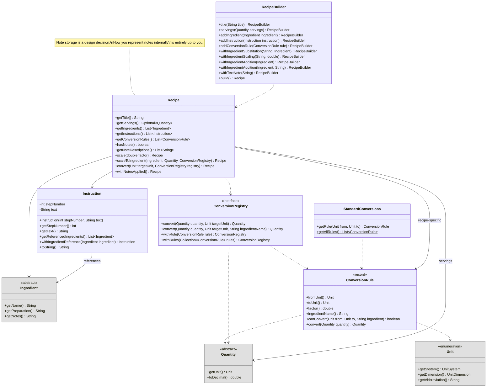

## Overview

In this assignment, you'll expand the CookYourBooks domain model by implementing **unit conversion**, **recipe scaling**, and the core **recipe structure**. Building on Assignment 1's `Quantity` and `Ingredient` hierarchies, you'll create a flexible conversion system that supports standard metric/imperial conversions, ingredient-specific density conversions (like "1 cup flour = 125 grams"), and custom "house" overrides.

The conversion system presents rich design challenges: How do you represent conversion rules? How do you compose them when multiple sources (global defaults, recipe-specific, house overrides) might apply? How do you design for extensibility without over-engineering? These questions don't have single right answers—your design decisions and their justifications matter as much as your working code.

You'll also implement the `Recipe`, `Instruction`, and `RecipeNote` classes that form the backbone of the application. Recipes can be **scaled** (to serve more or fewer people) and **converted** (to different unit systems), with the order of these operations being caller-controlled.

**Due:** Thursday, January 29, 2026 at 11:59 PM Boston Time

**Prerequisites:** This assignment builds on the A1 solution (provided). You should be familiar with the `Quantity`, `Ingredient`, and `Unit` hierarchies from Assignment 1.

## Learning Outcomes

By completing this assignment, you will demonstrate proficiency in:

- **Designing for changeability** by creating modular, loosely-coupled components ([L7: Coupling and Cohesion](/lecture-notes/l7-design-for-change))
- **Applying information hiding** to encapsulate design decisions that are likely to change ([L6: Modularity and Information Hiding](/lecture-notes/l6-immutability-abstraction))
- **Implementing immutable transformations** that return new objects rather than mutating existing ones
- **Designing method specifications** with clear preconditions and postconditions ([L4: Specifications and Contracts](/lecture-notes/l4-specs-contracts))
- **Implementing `equals()` and `hashCode()`** correctly for value objects
- **Making principled design decisions** and articulating their tradeoffs

## AI Policy for This Assignment

**AI coding assistants (such as GitHub Copilot, ChatGPT, Claude, etc.) should NOT be used for this assignment.**

This assignment focuses on design decisions that require understanding tradeoffs—something that benefits from working through the problem yourself. You may:
- Use official Java documentation
- Consult your textbook and course materials
- Ask questions in office hours or on the course discussion board
- Discuss high-level approaches with classmates (but write your own code)

Report any AI usage in the [Reflection](#reflection) section.

## Technical Specifications

### Domain Concepts

#### Unit Conversion

Unit conversion in cooking is more complex than simple mathematical ratios. Consider these scenarios:

1. **Standard conversions** follow fixed ratios: 1 cup = 236.588 mL, 1 pound = 453.592 grams
2. **Ingredient-specific conversions** account for density: 1 cup of flour ≠ 1 cup of honey in weight
3. **House overrides** reflect personal preferences or equipment: "In my kitchen, 1 oz = 30 mL" (rounded for convenience)

Your conversion system must support all three, with this **priority order** (highest to lowest):
1. **House conversions** - User-defined overrides that always take precedence
2. **Recipe-specific conversions** - Conversions defined within a particular recipe
3. **Global conversions** - Standard conversions available to all recipes

Conversions may span different dimensions when appropriate ingredient context is provided:
- Volume ↔ Volume (cups to mL): Always possible within same dimension
- Weight ↔ Weight (oz to grams): Always possible within same dimension
- Volume ↔ Weight (cups to grams): Requires ingredient-specific density information (e.g., "1 liter of water = 1 kilogram of water")
- Count ↔ Weight (whole eggs to grams): Requires ingredient-specific information

**Impossible conversions** (e.g., weight to volume without density information) should throw an `IllegalArgumentException`.

#### Recipe Scaling

Recipes can be scaled in two ways:

1. **By multiplier**: Scale all quantities by a factor (e.g., 2x doubles everything)
2. **By ingredient target**: Scale so that a specific ingredient reaches a target amount (e.g., "scale so I have 10 cups of flour" when the recipe calls for 2 cups → 5x multiplier)

**Order of operations matters.** Consider a recipe with "2 cups flour" that you want to:
- Scale by 2x → "4 cups flour"
- Convert to grams (at 125g/cup) → "500 grams flour"

vs.

- Convert to grams first → "250 grams flour"
- Scale by 2x → "500 grams flour"

With exact arithmetic, these are equivalent. But with rounding or fractional quantities, results may differ. **The caller chooses** whether to scale-then-convert or convert-then-scale.

#### Recipe Notes

A `RecipeNote` represents a modification or annotation to a recipe. Notes are **functional transformations**—when applied, they produce a new `Recipe` with the modification incorporated. Examples:

- "Double the garlic" → Scales a specific ingredient
- "Use olive oil instead of butter" → Substitutes an ingredient
- "Add 1 tsp vanilla" → Adds a new ingredient
- "Reduce baking time by 5 minutes at high altitude" → Modifies an instruction

### Class Design

You must implement the following classes. Classes from A1 are shown in gray for context.



### Invariants and Contracts

#### `ConversionRule` (record)

A record representing a single conversion rule between units. Uses Java's record feature for concise, immutable value objects.

```java
public record ConversionRule(
    @NonNull Unit fromUnit,
    @NonNull Unit toUnit,
    double factor,
    @Nullable String ingredientName
) { ... }
```

**Record Components:**
- `fromUnit` - The source unit for this conversion (never null)
- `toUnit` - The target unit for this conversion (never null)
- `factor` - The multiplication factor (e.g., 236.588 for cups→mL)
- `ingredientName` - If non-null, this rule only applies to this ingredient (case-insensitive)

**Compact Constructor Validation:**
- `fromUnit` and `toUnit` must not be null
- `factor` must be positive (> 0)
- **Throws:** `IllegalArgumentException` if validation fails

**Methods:**
- `public boolean canConvert(@NonNull Unit from, @NonNull Unit to, @Nullable String ingredient)`
  - Returns `true` if this rule can convert from `from` to `to`
  - If `ingredientName` is non-null, also checks that `ingredient` matches (case-insensitive)
  - If `ingredientName` is null (generic rule), matches any ingredient

- `public @NonNull Quantity convert(@NonNull Quantity quantity)`
  - **Preconditions:** `quantity.getUnit()` equals `fromUnit`
  - **Postconditions:** Returns a new `Quantity` of the **same type** as the input with converted amount and `toUnit`. For example:
    - `ExactQuantity` → `ExactQuantity` with `amount * factor`
    - `RangeQuantity` → `RangeQuantity` with `min * factor` and `max * factor`
    - `FractionalQuantity` → `FractionalQuantity` (apply factor to whole and fractional parts appropriately)
  - **Throws:** `IllegalArgumentException` if precondition is violated

**Example:**
```java
// Generic rule: cups to milliliters
var cupsToMl = new ConversionRule(Unit.CUP, Unit.MILLILITER, 236.588, null);

// Ingredient-specific rule: cups of flour to grams
var flourCupsToGrams = new ConversionRule(Unit.CUP, Unit.GRAM, 125.0, "all-purpose flour");

// Usage
cupsToMl.canConvert(Unit.CUP, Unit.MILLILITER, null);           // true
cupsToMl.canConvert(Unit.CUP, Unit.MILLILITER, "flour");        // true (generic rule)
flourCupsToGrams.canConvert(Unit.CUP, Unit.GRAM, "flour");      // false (name doesn't match exactly)
flourCupsToGrams.canConvert(Unit.CUP, Unit.GRAM, "all-purpose flour"); // true
```

#### `StandardConversions` (class)

Provides factory access to standard conversion rules. This class is **provided by the instructor**—you will use it but not implement it.

**Methods:**
- `static ConversionRule getRule(Unit from, Unit to)` - Returns the standard rule for this conversion, or `null` if none exists
- `static List<ConversionRule> getAllRules()` - Returns all standard conversion rules

Standard conversions are **pre-computed for all unit pairs within the same dimension**. This means:
- **All volume ↔ volume conversions** exist (cups ↔ tbsp ↔ tsp ↔ fl oz ↔ ml ↔ liters—every pair)
- **All weight ↔ weight conversions** exist (oz ↔ lb ↔ g ↔ kg—every pair)

You do NOT need to implement conversion chaining—`StandardConversions` provides direct rules for any within-dimension conversion.

**Note:** Standard conversions do NOT include:
- Volume ↔ weight conversions (require ingredient-specific density)
- Count ↔ weight/volume conversions (require ingredient-specific information)
- House unit conversions (`PINCH`, `DASH`, `HANDFUL`, `TO_TASTE`)

#### `ConversionRegistry` (interface)

A collection of conversion rules with defined precedence. Registries are **immutable**—adding rules returns a new registry.

**Methods:**
- `@NonNull Quantity convert(@NonNull Quantity quantity, @NonNull Unit targetUnit)`
  - Converts without ingredient context (for simple unit conversions)
  - Searches rules in priority order to find an applicable rule
  - **Quantity types are preserved:** converting a `RangeQuantity` produces a `RangeQuantity`, etc.
  - **Throws:** `IllegalArgumentException` if no applicable rule exists

- `@NonNull Quantity convert(@NonNull Quantity quantity, @NonNull Unit targetUnit, @Nullable String ingredientName)`
  - Converts with ingredient context (enables density-based conversions)
  - First searches for ingredient-specific rules, then falls back to generic rules
  - **Quantity types are preserved:** converting a `RangeQuantity` produces a `RangeQuantity`, etc.
  - **Throws:** `IllegalArgumentException` if no applicable rule exists

- `@NonNull ConversionRegistry withRule(@NonNull ConversionRule rule)`
  - Returns a new registry with the given rule added at **highest priority**
  - The new rule takes precedence over all existing rules

- `@NonNull ConversionRegistry withRules(@NonNull Collection<ConversionRule> rules)`
  - Returns a new registry with the given rules added at **highest priority**
  - Rules in the collection maintain their relative order (first = highest priority among new rules)

#### `LayeredConversionRegistry` (class implements `ConversionRegistry`)

You must implement `ConversionRegistry` in a class named `LayeredConversionRegistry`.

**Constructor:**
- `public LayeredConversionRegistry()`
  - Creates an empty registry with no rules
  - **Note:** To get a registry with standard conversions, use `new LayeredConversionRegistry().withRules(StandardConversions.getAllRules())`

**Design Notes:**
- The "layered" name suggests the immutable layering pattern: each `withRule()` creates a new layer on top
- How you implement the layering internally is up to you (list of rules, linked structure, etc.)
- Consider: How do you efficiently search through layers? How do you handle priority correctly?

#### `Instruction` (class)

Represents a single step in a recipe.

**Constructor:**
- `public Instruction(int stepNumber, @NonNull String text)`
  - **Preconditions:**
    - `stepNumber` must be positive (> 0)
    - `text` must not be null or blank
  - **Throws:** `IllegalArgumentException` if preconditions violated
  - **Postconditions:** Creates an instruction with no ingredient references

**Methods:**
- `public int getStepNumber()` - Returns the step number
- `public @NonNull String getText()` - Returns the instruction text
- `public @NonNull List<Ingredient> getReferencedIngredients()` - Returns an unmodifiable list of referenced ingredients (may be empty)
- `public @NonNull Instruction withIngredientReference(@NonNull Ingredient ingredient)` - Returns a new `Instruction` with the ingredient added to references
- `public @NonNull String toString()` - Returns formatted string: `"{stepNumber}. {text}"`

**Design Note:** How you store ingredient references internally is up to you. The API requires only that you can add references and retrieve them.

#### Recipe Notes (Design Decision)

Recipe notes represent modifications or annotations that can be applied to a recipe. The `RecipeBuilder` provides a **fixed API** for adding notes, but **how you represent and store notes internally is entirely up to you**.

This is an intentional design decision left to students. Consider:
- Should notes be represented as objects? Records? An enum with data?
- Should there be a common interface/superclass, or can different note types be completely separate?
- How do you store notes in the Recipe? A list? A map? Multiple lists by type?
- How does `withNotesApplied()` iterate through and apply them?

**Your design will be evaluated on:**
- Cohesion: Do related concepts stay together?
- Coupling: How tightly connected are note types to Recipe internals?
- Information hiding: Can you change the note representation without affecting the public API?
- Extensibility: How hard would it be to add a new note type?

Document your design decisions in your Javadoc and reflection.

#### `Recipe` (class or interface + implementation)

Represents a complete recipe. Recipes are **immutable**—all transformation methods return new `Recipe` objects.

**You may implement `Recipe` as either:**
- A concrete class with a public constructor, OR
- An interface with a package-private implementation class (accessed via `RecipeBuilder`)

**Required API:**
- `@NonNull String getTitle()`
- `@NonNull Optional<Quantity> getServings()` - Servings are optional; some recipes don't specify
- `@NonNull List<Ingredient> getIngredients()` - Unmodifiable list
- `@NonNull List<Instruction> getInstructions()` - Unmodifiable list
- `@NonNull List<ConversionRule> getConversionRules()` - Unmodifiable list of recipe-specific conversion rules
- `boolean hasNotes()` - Returns true if there are unapplied notes
- `@NonNull List<String> getNoteDescriptions()` - Returns human-readable descriptions of all unapplied notes (for display/debugging)

**Transformation Methods:**
- `@NonNull Recipe scale(double factor)`
  - **Preconditions:** `factor` must be positive (> 0)
  - **Postconditions:** Returns new recipe with all `MeasuredIngredient` quantities scaled by `factor`. Servings (if present) are also scaled. `VagueIngredient`s and instructions are unchanged. **Quantity types are preserved:** scaling a `RangeQuantity` produces a `RangeQuantity`, scaling a `FractionalQuantity` produces a `FractionalQuantity`, etc.
  - **Throws:** `IllegalArgumentException` if factor is not positive

- `@NonNull Recipe scaleToIngredient(@NonNull Ingredient ingredient, @NonNull Quantity targetAmount, @NonNull ConversionRegistry registry)`
  - **Preconditions:**
    - `ingredient` must be a `MeasuredIngredient` present in this recipe (matched using `equals()`)
    - `targetAmount` must be convertible to the ingredient's unit using `registry` (same unit, same dimension, or cross-dimension if a conversion rule exists)
  - **Postconditions:** Converts `targetAmount` to the ingredient's unit (if needed), calculates the scale factor, then scales the entire recipe by that factor
  - **Throws:** `IllegalArgumentException` if ingredient not found or conversion not possible
  - **Example:** Recipe has "2 cups flour". Calling `scaleToIngredient(flour, 500g, registry)` with a flour density rule converts 500g → 4 cups, calculates factor = 4/2 = 2, and scales the recipe by 2x.

- `@NonNull Recipe convert(@NonNull Unit targetUnit, @NonNull ConversionRegistry registry)`
  - **Postconditions:** Returns new recipe with all `MeasuredIngredient` quantities converted to `targetUnit` where possible. **Quantity types are preserved:** converting a `RangeQuantity` produces a `RangeQuantity`, converting a `FractionalQuantity` produces a `FractionalQuantity`, etc. The conversion uses rules in this priority order:
    1. Rules passed in `registry` (typically house overrides)
    2. Recipe's own `conversionRules`
    3. Standard conversions (from `StandardConversions`)
  - **On conversion failure:** If a `MeasuredIngredient` cannot be converted (no applicable rule), the ingredient is left unchanged AND a note is added to the returned recipe documenting the failure (ingredient name, original unit, target unit, and reason).
  - **VagueIngredients** are never converted (left unchanged, no failure note).
  - **Note:** This method never throws for conversion failures—it documents them as notes instead. The failure note's description (from `getNoteDescriptions()`) should be human-readable, e.g., `"Could not convert butter from cups to grams: No conversion rule found"`.

- `@NonNull Recipe withNotesApplied()`
  - **Postconditions:** Returns new recipe with all notes applied in order. The returned recipe has `hasNotes() == false`.
  - **Note:** Text notes and conversion failure notes do not modify the recipe structure when applied—they are informational only.

#### `RecipeBuilder` (class)

Builder for constructing `Recipe` instances.

**Core Methods:**
- `@NonNull RecipeBuilder title(@NonNull String title)` - Sets the title (required)
- `@NonNull RecipeBuilder servings(@Nullable Quantity servings)` - Sets servings (optional)
- `@NonNull RecipeBuilder addIngredient(@NonNull Ingredient ingredient)` - Adds an ingredient
- `@NonNull RecipeBuilder addInstruction(@NonNull Instruction instruction)` - Adds an instruction
- `@NonNull RecipeBuilder addConversionRule(@NonNull ConversionRule rule)` - Adds a recipe-specific conversion rule
- `@NonNull Recipe build()`
  - **Preconditions:** Title must have been set
  - **Throws:** `IllegalStateException` if title not set
  - **Postconditions:** Returns a new immutable `Recipe`

**Note Methods (fixed API, internal representation is your design):**

- `@NonNull RecipeBuilder withIngredientSubstitution(@NonNull String originalName, @NonNull Ingredient replacement)`
  - Adds a note to substitute one ingredient with another
  - `originalName` matches by case-insensitive exact match
  - When applied: replaces the matching ingredient; throws `IllegalArgumentException` if not found

- `@NonNull RecipeBuilder withIngredientScaling(@NonNull String ingredientName, double factor)`
  - Adds a note to scale a specific ingredient by a factor
  - `ingredientName` matches by case-insensitive exact match
  - `factor` must be positive
  - When applied: scales the matching `MeasuredIngredient`; throws `IllegalArgumentException` if not found or not a `MeasuredIngredient`

- `@NonNull RecipeBuilder withIngredientAddition(@NonNull Ingredient ingredient)`
  - Adds a note to append a new ingredient at the end of the ingredient list
  - When applied: adds the ingredient to the end

- `@NonNull RecipeBuilder withIngredientAddition(@NonNull Ingredient ingredient, @NonNull String afterIngredientName)`
  - Adds a note to insert a new ingredient after a specific existing ingredient
  - `afterIngredientName` matches by case-insensitive exact match
  - When applied: inserts after the matching ingredient; throws `IllegalArgumentException` if not found

- `@NonNull RecipeBuilder withTextNote(@NonNull String text)`
  - Adds an informational text note
  - When applied: no structural change to the recipe (informational only)

**Design Note:** How you represent these notes internally is entirely up to you. The builder methods define the API; you decide the data structures.

### `equals()` and `hashCode()` Requirements

Implement `equals()` and `hashCode()` for the following classes:

- **`Instruction`**: Equal if same step number, text, and referenced ingredients
- **`Recipe`**: Equal if same title, servings, ingredients (in order), instructions (in order), note descriptions (in order), and conversion rules (in order)
- **`Quantity` subclasses** (from A1, if not already implemented): Equal if same unit AND same amount. Note: `ExactQuantity(2, CUPS)` is NOT equal to `ExactQuantity(473.176, MILLILITERS)` even though they represent the same volume.

**Note:** `ConversionRule` is a Java record and automatically generates correct `equals()` and `hashCode()`. For your note representation, ensure that two recipes with equivalent notes are considered equal.

### Design Requirements

- **Immutability:** All domain objects (`Recipe`, `Instruction`, `Quantity` subclasses) must be immutable. Transformation methods return new objects.
- **Information hiding:** Internal representation of conversion rules, ingredient references, etc. should not be exposed through the API
- **Defensive copying:** Getters returning collections must return unmodifiable views or copies
- **Null safety:** Use `@NonNull` and `@Nullable` annotations from JSpecify. Validate non-null parameters in public methods.
- **Documentation:** Javadoc for all public classes, methods, constructors with `@param`, `@return`, `@throws` tags

### Example Usage

```java
// Create ingredients (using A1 classes)
MeasuredIngredient flour = new MeasuredIngredient(
    "all-purpose flour",
    new ExactQuantity(2, Unit.CUP),
    "sifted",
    null
);
MeasuredIngredient sugar = new MeasuredIngredient(
    "sugar",
    new FractionalQuantity(1, 1, 2, Unit.CUP),
    null,
    null
);
MeasuredIngredient butter = new MeasuredIngredient(
    "butter",
    new ExactQuantity(1, Unit.CUP),
    "softened",
    null
);
VagueIngredient salt = new VagueIngredient("salt", "to taste", null, null);

// Create recipe-specific conversion rules
var flourDensity = new ConversionRule(Unit.CUP, Unit.GRAM, 125.0, "all-purpose flour");
var sugarDensity = new ConversionRule(Unit.CUP, Unit.GRAM, 200.0, "sugar");

// Build a recipe with recipe-specific conversions
Recipe cookies = new RecipeBuilder()
    .title("Chocolate Chip Cookies")
    .servings(new ExactQuantity(24, Unit.WHOLE))
    .addIngredient(flour)
    .addIngredient(sugar)
    .addIngredient(butter)
    .addIngredient(salt)
    .addInstruction(new Instruction(1, "Preheat oven to 375°F"))
    .addInstruction(new Instruction(2, "Mix dry ingredients")
        .withIngredientReference(flour)
        .withIngredientReference(sugar)
        .withIngredientReference(salt))
    .addConversionRule(flourDensity)
    .addConversionRule(sugarDensity)
    .build();

// Create a registry with standard conversions, then add house overrides
ConversionRegistry baseRegistry = new LayeredConversionRegistry()
    .withRules(StandardConversions.getAllRules());
ConversionRegistry houseRules = baseRegistry
    .withRule(new ConversionRule(Unit.FLUID_OUNCE, Unit.MILLILITER, 30.0, null));  // house override: 1 oz = 30ml

// Scale by factor
Recipe doubledCookies = cookies.scale(2.0);
// flour is now 4 cups, sugar is now 3 cups, servings is now 48

// Scale to ingredient target (same unit)
Recipe scaledToFlour = cookies.scaleToIngredient(flour, new ExactQuantity(5, Unit.CUP), houseRules);
// Scale factor is 2.5 (5 cups / 2 cups)
// flour is now 5 cups, sugar is now 3.75 cups, servings is now 60

// Scale to ingredient target (cross-dimension with conversion)
Recipe scaledToFlourGrams = cookies.scaleToIngredient(flour, new ExactQuantity(500, Unit.GRAM), houseRules);
// 500g flour → 4 cups (via recipe's flourDensity rule), factor = 4/2 = 2x
// flour is now 4 cups, sugar is now 3 cups, servings is now 48

// Convert to grams using recipe's own rules + standard conversions
Recipe metricCookies = cookies.convert(Unit.GRAM, houseRules);
// flour is now 250g (recipe rule), sugar is now 300g (recipe rule)
// butter is UNCHANGED (no density rule) + ConversionFailedNote added
// salt unchanged (vague ingredient, no note)

// Check for conversion failures via note descriptions
metricCookies.getNoteDescriptions().forEach(System.out::println);
// Includes: "Could not convert butter from cups to grams: No conversion rule found"

// Order matters: scale then convert
Recipe bigMetric = cookies.scale(2.0).convert(Unit.GRAM, houseRules);  // 500g flour

// vs convert then scale
Recipe metricBig = cookies.convert(Unit.GRAM, houseRules).scale(2.0);  // also 500g flour

// StandardConversions provides all within-dimension conversions directly
var vanillaInTbsp = new ExactQuantity(2, Unit.TABLESPOON);
var vanillaInMl = houseRules.convert(vanillaInTbsp, Unit.MILLILITER);
// Direct conversion: 2 tbsp → 29.57 ml (StandardConversions has tbsp→ml rule)

// Adding notes via builder methods
Recipe modifiedCookies = new RecipeBuilder()
    .title("Modified Cookies")
    .servings(cookies.getServings().orElse(null))
    .addIngredient(flour)
    .addIngredient(sugar)
    .addIngredient(butter)
    .withIngredientSubstitution("butter",
        new MeasuredIngredient("olive oil", new ExactQuantity(0.75, Unit.CUP), null, null))
    .withIngredientAddition(
        new MeasuredIngredient("vanilla extract", new ExactQuantity(1, Unit.TEASPOON), null, null),
        "sugar")  // add after sugar
    .withIngredientScaling("sugar", 0.5)  // halve the sugar
    .withTextNote("Adapted for dairy-free diet")
    .build();

// Check what notes are pending
modifiedCookies.hasNotes();  // true
modifiedCookies.getNoteDescriptions();
// e.g., ["Substitute butter with olive oil", "Add 1 tsp vanilla extract after sugar",
//        "Scale sugar by 0.5x", "Adapted for dairy-free diet"]

// Apply all notes
Recipe finalRecipe = modifiedCookies.withNotesApplied();
finalRecipe.hasNotes();  // false
```

### Testing Requirements

Write tests for the following classes in `src/test/java/app/cookyourbooks/domain/`:

- **`ConversionRuleTest.java`** - Record validation (compact constructor), `canConvert()` logic, `convert()` method
- **`InstructionTest.java`** - Constructor validation, ingredient references, `toString()`, `equals()`/`hashCode()`
- **`RecipeTest.java`** - Building recipes, `scale()`, `scaleToIngredient()`, `equals()`/`hashCode()`
- **`RecipeConversionTest.java`** - `convert()` with various registries, conversion priority, `ConversionFailedNote` generation
- **`RecipeNoteTest.java`** - Tests for all note types via builder methods and `withNotesApplied()`

**Testing guidance:**
- Test that records validate their invariants in compact constructors
- Test transformation methods return new objects (immutability)
- Test that original objects are unchanged after transformations
- Test edge cases: empty ingredient lists, missing servings, no applicable conversions
- Test `scaleToIngredient` with ingredient not in recipe (should throw)
- Test `scaleToIngredient` with cross-dimension target (e.g., scale to grams when ingredient is in cups)
- Test conversion priority (registry rules > recipe rules > standard conversions)
- Test quantity type preservation (scaling/converting `RangeQuantity` produces `RangeQuantity`, etc.)
- Test that `ConversionFailedNote` is added when conversion fails (not thrown)
- Test case-insensitive ingredient matching in `ConversionRule.canConvert()`
- Test each note type via builder methods and verify results after `withNotesApplied()`
- Test note error cases (e.g., substituting non-existent ingredient throws)
- Test `hasNotes()` and `getNoteDescriptions()` return correct values

You do NOT need to write tests for `ConversionRegistry`—this will be tested indirectly through `RecipeConversionTest`.

## Reflection

Update `REFLECTION.md` to address:

1. **Coupling Analysis:** Analyze the coupling between `Recipe` and `ConversionRegistry`. What type of coupling exists? ([L7](/lecture-notes/l7-design-for-change)) How might the design change if conversion logic were tightly coupled to `Recipe` instead?

2. **Information Hiding:** What design decisions did you hide behind the `ConversionRegistry` interface? What could change in your implementation without affecting code that uses the interface?

3. **Immutability Tradeoffs:** The specification requires immutable `Recipe` objects and uses records for `ConversionRule` and `RecipeNote` implementations. What are the benefits of this immutable-by-default approach? What are the costs (e.g., performance, complexity)?

4. **Note Representation Design:** Describe how you chose to represent recipe notes internally. What data structures did you use? Did you create a common interface, use records, or something else? How does your design support the different note types (substitution, scaling, addition, text, conversion failures)?

5. **Design Alternatives:** Describe your note representation and one alternative you considered. Compare them in terms of cohesion, coupling, and extensibility. Why did you choose your approach?

6. **AI Usage:** Did you use AI assistance? If so, describe how and reflect on whether it helped or hindered your learning of design principles.

## Quality Requirements

Your submission should demonstrate:

- **Correctness**: Code compiles, follows specifications, passes tests
- **Design Quality**: Appropriate use of interfaces, immutability, information hiding
- **Testing**: Meaningful tests that verify behavior and detect faults
- **Documentation**: Clear Javadoc with preconditions, postconditions, and design rationale
- **Code Quality**: Clean, readable code following course style conventions

## Grading Rubric

*[To be finalized after API review]*

### Automated Grading (TBD points)

#### Implementation Correctness
- `Instruction`: TBD points
- `Recipe` and `RecipeBuilder`: TBD points
- `ConversionRegistry` implementation: TBD points
- `RecipeNote` implementations: TBD points

#### Test Suite Quality
- `InstructionTest.java`: TBD points
- `RecipeTest.java`: TBD points
- `RecipeConversionTest.java`: TBD points
- `RecipeNoteTest.java`: TBD points

### Manual Grading (Subtractive, max -30 points)

| Category | Max Deduction | Criteria |
|----------|---------------|----------|
| **Design Quality** | -10 | Poor separation of concerns; tight coupling; exposed implementation details |
| **Immutability** | -6 | Mutable objects where immutability required; missing defensive copies |
| **Documentation** | -4 | Missing/incomplete Javadoc; undocumented design decisions |
| **Test Quality** | -6 | Trivial tests; missing edge cases; tests that don't verify meaningful behavior |
| **Code Style** | -4 | Poor naming; overly complex logic; inconsistent style |

### Reflection (-12 points max)

Up to 2 points deducted per question for incomplete or superficial responses (6 questions × 2 points = 12 max).

## Submission

1. **Start from provided A1 solution:** Clone the assignment repository which includes the instructor's A1 solution
2. **Implement conversion classes** in `src/main/java/app/cookyourbooks/domain/`:
   - `ConversionRule.java` - the record type
   - `ConversionRegistry.java` - the interface
   - `LayeredConversionRegistry.java` - your implementation (must have public no-arg constructor)
3. **Implement recipe classes** in `src/main/java/app/cookyourbooks/domain/`:
   - `Instruction.java`
   - `Recipe.java` (or interface + implementation)
   - `RecipeBuilder.java`
5. **Update A1 classes** (if needed):
   - Add `equals()`/`hashCode()` to `Quantity` subclasses if not present
6. **Write tests** in `src/test/java/app/cookyourbooks/domain/`:
   - `ConversionRuleTest.java`
   - `InstructionTest.java`
   - `RecipeTest.java`
   - `RecipeConversionTest.java`
   - `RecipeNoteTest.java`
7. **Update `REFLECTION.md`**
8. **Verify:** Run `./gradlew build` and `./gradlew test`
9. **Commit and push**

### Repository Structure

Your final repository should include these new files (in addition to A1 classes):

```
src/
├── main/java/app/cookyourbooks/domain/
│   ├── ConversionRule.java
│   ├── ConversionRegistry.java
│   ├── LayeredConversionRegistry.java
│   ├── Instruction.java
│   ├── Recipe.java
│   ├── RecipeBuilder.java
│   ├── [Your note representation classes - design is up to you]
│   └── ... (A1 classes)
└── test/java/app/cookyourbooks/domain/
    ├── ConversionRuleTest.java
    ├── InstructionTest.java
    ├── RecipeTest.java
    ├── RecipeConversionTest.java
    ├── RecipeNoteTest.java
    └── ... (A1 tests)
```

Good luck! Remember: thoughtful design decisions with clear justifications are valued as much as working code.
