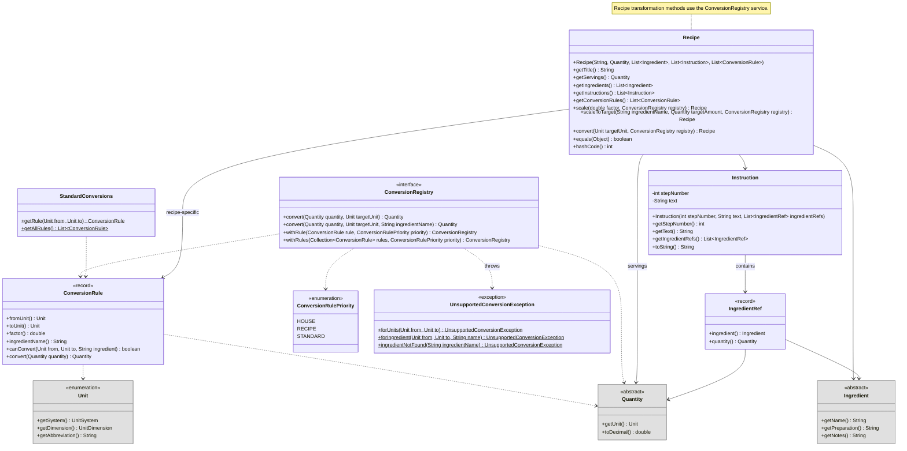

:::warning Preliminary Content

This assignment is preliminary content and is subject to change until the release date of the assignment.

:::

## Overview

In this assignment, you'll expand the CookYourBooks domain model by implementing **unit conversion**, **recipe scaling**, and the core **recipe structure**. Building on Assignment 1's `Quantity` and `Ingredient` hierarchies, you'll create a flexible conversion system that supports standard metric/imperial conversions, ingredient-specific density conversions (like "1 cup flour = 125 grams"), and custom "house" overrides.


**The core challenge is designing how domain objects and the `ConversionRegistry` service work together** to enable recipe transformations. The `ConversionRegistry` intelligently selects conversion rules based on priority (house > recipe > standard) and specificity (ingredient-specific > generic).

You'll implement the conversion service and the `Recipe` and `Instruction` domain classes. **Critically, you must design the API for recipe transformations yourself:**
- Should `Recipe` have additional transformation methods? If so, what should their signatures and specifications be?
- How do transformation operations maintain loose coupling with the service layer?

**How you achieve this is up to you.** Your design decisions will determine extensibility for future requirements like recipe export formats, display customizations, and bulk conversions.

**Due:** Thursday, January 29, 2026 at 11:59 PM Boston Time

**Prerequisites:** This assignment builds on the A1 solution (provided). You should be familiar with the `Quantity`, `Ingredient`, and `Unit` hierarchies from [Assignment 1](./cyb1-recipes).

## Learning Outcomes

By completing this assignment, you will demonstrate proficiency in:

- **Designing for changeability** by creating modular, loosely-coupled components ([L7: Coupling and Cohesion](/lecture-notes/l7-design-for-change))
- **Applying information hiding** to encapsulate design decisions that are likely to change ([L6: Modularity and Information Hiding](/lecture-notes/l6-immutability-abstraction))
- **Implementing immutable transformations** that return new objects rather than mutating existing ones
- **Designing method specifications** with clear preconditions and postconditions ([L4: Specifications and Contracts](/lecture-notes/l4-specs-contracts))
- **Implementing `equals()` and `hashCode()`** correctly for value objects

## AI Policy for This Assignment

**AI coding assistants (such as GitHub Copilot, ChatGPT, Claude, etc.) should NOT be used for this assignment.**

This assignment focuses on design decisions that require understanding tradeoffs—something that benefits from working through the problem yourself. You may:
- Use official Java documentation
- Consult your textbook and course materials
- Ask questions in office hours or on the course discussion board
- Discuss high-level approaches with classmates (but write your own code)

Report any AI usage in the [Reflection](#reflection) section.

### Grading Infrastructure Security

Your code executes in a containerized environment with filesystem and network access. **Do not attempt to access, exfiltrate, or reverse-engineer grading infrastructure, instructor test suites, or other non-distributed course materials.** All submissions are recorded in an immutable audit trail, and we have automated tooling to detect such attempts. Violations will be referred to OSCCR. See the [syllabus](/syllabus#grading-infrastructure-security) for full details.

If something seems wrong with the autograder, **ask us**—don't try to debug it yourself by inspecting the grading environment.

## Technical Specifications

### Package Organization

This assignment uses a package structure that organizes classes by responsibility:

```
src/main/java/app/cookyourbooks/
├── model/           # Core domain entities (A1 classes + new A2 classes)
│   ├── Quantity.java              # FROM A1 - fully implemented
│   ├── ExactQuantity.java         # FROM A1 - fully implemented
│   ├── FractionalQuantity.java    # FROM A1 - fully implemented
│   ├── RangeQuantity.java         # FROM A1 - fully implemented
│   ├── Unit.java                  # FROM A1 - fully implemented
│   ├── UnitSystem.java            # FROM A1 - fully implemented
│   ├── UnitDimension.java         # FROM A1 - fully implemented
│   ├── Ingredient.java            # PROVIDED - fully implemented
│   ├── MeasuredIngredient.java    # PROVIDED - fully implemented
│   ├── VagueIngredient.java       # PROVIDED - fully implemented
│   ├── IngredientRef.java         # PROVIDED - mostly complete (record)
│   ├── Instruction.java           # STUB - implement this
│   └── Recipe.java                # STUB - implement this
├── conversion/      # Unit conversion logic
│   ├── ConversionRule.java        # STUB - implement this (record)
│   ├── ConversionRulePriority.java   # PROVIDED - fully implemented (enum)
│   ├── ConversionRegistry.java    # PROVIDED - interface definition only
│   ├── LayeredConversionRegistry.java  # STUB - implement this
│   └── StandardConversions.java   # PROVIDED - fully implemented
└── exception/       # Custom exceptions
    └── UnsupportedConversionException.java  # PROVIDED - fully implemented
```

**Starter Code:** All classes exist with proper Javadoc and method signatures. Classes marked **STUB** have method bodies that throw `UnsupportedOperationException`—you must implement them. Classes marked **PROVIDED** or **FROM A1** are fully functional.

### Domain Concepts

#### Unit Conversion

Unit conversion in cooking is more complex than simple mathematical ratios. Consider these scenarios:

1. **Standard conversions** follow fixed ratios: 1 cup = 236.588 mL, 1 pound = 453.592 grams
2. **Ingredient-specific conversions** account for density: 1 cup of flour ≠ 1 cup of honey in weight
3. **House overrides** reflect personal preferences or equipment: "In my kitchen, 1 oz = 30 mL" (rounded for convenience)

Your conversion system must support all three, with this **priority order** (highest to lowest):
1. **House conversions** - User-defined overrides that always take precedence
2. **Recipe-specific conversions** - Conversions defined within a particular recipe
3. **Global conversions** - Standard conversions available to all recipes

Within a priority level, prefer more specific rules (those that specify an ingredient name) over generic rules (those that do not specify an ingredient name). If multiple rules with the same priority level apply, prefer the rule that was added first.

Conversions may span different dimensions when appropriate ingredient context is provided:
- Volume ↔ Volume (cups to mL): Always possible within same dimension
- Weight ↔ Weight (oz to grams): Always possible within same dimension
- Volume ↔ Weight (cups to grams): Requires ingredient-specific density information (e.g., "1 liter of water = 1 kilogram of water")
- Count ↔ Weight (whole eggs to grams): Requires ingredient-specific information

**Impossible conversions** (e.g., weight to volume without density information) should throw an `UnsupportedConversionException` (a checked exception provided in the handout).

#### Recipe Transformations

Your implementation must support three types of recipe transformations (defined as methods on the `Recipe` class):

1. **Scale by multiplier**: Scale all `MeasuredIngredient` quantities by a factor (e.g., 2x doubles everything). `VagueIngredient`s remain unchanged. Servings (if present) should also scale.

2. **Scale to ingredient target**: Scale a recipe as defined above, but choosing a scaling factor such that a specific ingredient reaches a target amount.
   - Example: Recipe has "2 cups flour". Scaling to "500g flour" requires:
     - Converting the ingredient's current quantity (2 cups) to the target unit (grams) using a density conversion rule: 2 cups × 125 g/cup = 250g
     - Calculating the scale factor: 500g / 250g = 2.0
     - Scaling the entire recipe by that factor
   - The target ingredient ends up in the target unit (grams in the example above)
   - Other ingredients that can be converted to the target unit should also be converted to the target unit as well
   - Must handle cross-dimension conversions (cups ↔ grams) when conversion rules exist
   - Must use recipe-specific conversion rules at `RECIPE` priority

3. **Convert to unit**: Convert all `MeasuredIngredient` quantities to a target unit. `VagueIngredient`s remain unchanged. Servings are never converted.
   - Must automatically use recipe-specific conversion rules at `RECIPE` priority
   - Should throw `UnsupportedConversionException` if any `MeasuredIngredient` cannot be converted

**Design considerations:**
- All transformations must maintain immutability (return new objects)
- Transformations must also update any `IngredientRef`s in instructions
- Quantity type behavior: `RangeQuantity` stays `RangeQuantity`, fractional quantities become `ExactQuantity`

### Service Interface: ConversionRegistry

The `ConversionRegistry` interface (provided) defines the contract for the complex conversion service. You must implement it in a class called `LayeredConversionRegistry`.

**Key responsibilities:**
- Convert quantities between units using prioritized rules
- Support ingredient-specific conversions (e.g., "1 cup flour" → grams using flour density)
- Maintain immutability (adding rules returns a new registry)
- Search rules in priority order: HOUSE → RECIPE → STANDARD
- Within each priority level, prefer ingredient-specific rules over generic rules

**Why this is the service layer:**
- This separation enables testing conversion logic independently from domain objects, and provides a reasonable design space for you to work within.
- Future requirements (batch conversions, export to different systems, UI preferences) might benefit from this service

**Your implementation (`LayeredConversionRegistry`)** must handle:
1. **Rule storage** organized by priority level
2. **Rule matching** that respects both priority and specificity
3. **Conversion execution** that throws appropriate exceptions when conversions fail
4. **Immutable operations** where each `withRule`/`withRules` creates a new registry

See the full interface documentation in the source code. The interface is already provided—you implement the class.

### Class Design

You must implement the following classes. Classes from A1 are shown in gray for context.



### Implementation Details

**Read the code!** The starter code includes complete Javadoc and method signatures for all classes. The specifications below provide high-level context, but **you should read the source files** for detailed contracts, preconditions, and postconditions.

#### Key Design Decisions

The `Recipe` class defines transformation methods (`scale()`, `scaleToTarget()`, `convert()`) that you must implement. As you implement these methods and the supporting classes, consider these design principles:

1. **Transformation API Design:**
   - Why are transformation methods on `Recipe` rather than in a separate service class?
   - Why do these methods take a `ConversionRegistry` parameter rather than creating one internally?
   - How does this design maintain loose coupling with the conversion service?

2. **Where should transformation logic live?**
   - Should `MeasuredIngredient` have helper methods for creating transformed copies? (e.g., `withScaledQuantity()`, `withConvertedQuantity()`?)
   - Should `Quantity` have convenience methods for scaling? (e.g., `scale(factor)` that returns a new quantity?)
   - How do you iterate over ingredients and create new transformed objects while maintaining separation from the conversion service?
   - What's the right balance between putting logic in domain objects vs. keeping them as simple data holders?
   - **Adding well-designed helper methods can improve your design—but choose wisely!**

3. **What visibility should your methods have?**
   - Which if any new transformation methods should be `public` (part of the API)?
   - Which helper methods should be `private` (internal implementation)?
   - **Method visibility choices reveal your understanding of information hiding**

4. **How does `LayeredConversionRegistry` organize rules internally?**
   - What data structure efficiently supports priority-based search?
   - How do you maintain immutability while enabling rule additions?
   - How do you handle the "first added takes precedence" requirement at each priority level?

5. **Immutability:**
   - How do the transformation methods ensure full immutability?
   - How do they create new recipes, ingredients, instructions, and ingredient refs?
   - Why is defensive copying important throughout?

**These design decisions will be reflected in your code structure and discussed in your reflection.** There is no single "correct" design—what matters is that your design:
- Maintains good separation of concerns
- Supports the required functionality
- Follows the design constraints (no breaking changes)
- Can articulate tradeoffs in your reflection

**Most importantly:** Your choices about **what public methods to add** and **where to add them** will be the primary focus of design quality evaluation.


### `equals()` and `hashCode()` Requirements

Implement `equals()` and `hashCode()` for the following classes:

- **`Instruction`**: Equal if same step number, text, and referenced ingredients
- **`Recipe`**: Equal if same title, servings, ingredients (in order), instructions (in order), and conversion rules (in order)

**Note:** `ConversionRule` is a Java record and automatically generates correct `equals()` and `hashCode()`. The provided A1 solution includes `equals()` and `hashCode()` for the `Quantity` subclasses. The Ingredient hierarchy (`Ingredient`, `MeasuredIngredient`, `VagueIngredient`) is fully provided in the A2 starter code, including `equals()` and `hashCode()`.

### Design Requirements

- **Immutability:** All domain objects (`Recipe`, `Instruction`, `Quantity` subclasses) must be immutable. Transformation methods return new objects.
- **Information hiding:** Internal representation of conversion rules, ingredient references, etc. should not be exposed through the API
- **Defensive copying:** Getters returning collections must return unmodifiable views or copies
- **Null safety:** Use `@NonNull` and `@Nullable` annotations from JSpecify to document nullability (we provide package-level default NullMarked annotation). You do **not** need to add runtime null checks for `@NonNull` parameters—the annotations serve as documentation and enable static analysis tools.
- **Documentation:** Javadoc for all public classes, methods, constructors with `@param`, `@return`, `@throws` tags. Use good specifications that demonstrate restrictiveness, generality, and clarity.

### Design Constraints

**What you CAN do:**
- ✅ **Add new public methods** to domain classes (`Recipe`, `MeasuredIngredient`, `Quantity`, etc.)
- ✅ **Add new private methods and fields** to domain classes
- ✅ **Create new classes** in the `model`, `conversion`, or other packages
- ✅ **Create new interfaces** if your design requires them
- ✅ **Add helper/utility classes** for transformation logic

**What you CANNOT do:**
- ❌ **Modify existing method signatures** in provided classes (changing parameters, return types, or throws clauses)
- ❌ **Modify the `ConversionRegistry` interface** (you implement it, but cannot change it)
- ❌ **Remove or rename existing methods** from provided classes
- ❌ **Change existing constructors** in provided stub classes
- ❌ **Modify provided interfaces** (`ConversionRegistry`) or enums (`ConversionRulePriority`)

### Suggested Implementation Order

The starter code provides stubs for all classes that compile but throw `UnsupportedOperationException`. This allows you to implement incrementally while keeping the project in a compilable state. The `Recipe` transformation method signatures (`scale()`, `scaleToTarget()`, `convert()`) are defined in the stub—you must implement them.

#### Phase 1: Foundation Classes (Model Layer)

Complete these first—they have no dependencies on other A2 classes:

1. `IngredientRef` (record) — *Already mostly complete*
2. `Instruction`
3. `Recipe` (basic getters and `equals`/`hashCode` only—no transformation methods yet - think about transformation API design as described in Phase 3)

We provide **sample tests** for `Instruction` (only `toString()` tests are included in the handout). The autograder runs additional comprehensive tests for `Instruction` and `IngredientRef` that are not included in the handout. You are welcome to add your own tests for these classes if you find them helpful, but they are not graded. For `Recipe`, we provide starter tests including a few for scaling and conversion (see Testing Requirements below).

**Run tests as you go:** `./gradlew test --tests "InstructionTest"` and `./gradlew test --tests "RecipeTest"` to check your progress on the foundation classes.

#### Phase 2: Conversion Rules

**Autograder note:** For this and the remaining tasks on this assignment, the autograder is configured not to provide feedback on your implementation until you provide a plausible test suite for that functionality (as you experienced with Assignment 1).

4. **`ConversionRule`** (record)
   - Implement compact constructor validation (factor > 0, nulls)
   - Implement `canConvert()` — check units match and ingredient matches (case-insensitive)
   - Hold off on `convert()` until you make a conscious design decision about how to implement it

**Run tests as you go:** `./gradlew test --tests "ConversionRuleTest"` to verify your `ConversionRule` implementation. We provide complete tests for `ConversionRule`—the autograder runs these to verify your implementation.

#### Phase 3: Design Your Transformation API

Now that you understand the domain from implementing the foundation classes and `ConversionRule`, **design how recipe transformations will work:**

5. **Plan Your Approach**
   - Review the three required transformation types (see [Recipe Transformations](#recipe-transformations))
   - Decide: Where do transformation methods go? What are their signatures?
   - Consider: What helper methods might be needed?
   - Sketch out your design before coding

#### Phase 4: Implement Scaling

Implement and test **scaling separately from unit conversion**—you can earn credit for scaling even if conversion isn't working:

6. **Implement and test scaling by Multiplier**
    - Scale all `MeasuredIngredient` quantities by a factor
    - `VagueIngredient`s remain unchanged
    - Servings (if present) should also scale
    - Ingredient references in instructions must also be transformed
    - **Enhance the starter tests in `RecipeTest.java`** for scaling behavior

#### Phase 5: Implement Conversion

7. **`LayeredConversionRegistry`** (implements `ConversionRegistry`)
    - Start with `withRule()` and `withRules()` to build the rule collection
    - Then implement `convert()` methods with priority ordering
    - Test through the `ConversionRegistry` interface (priority ordering, specificity, exceptions)

**Write and run tests as you go:** `./gradlew test --tests "ConversionRegistryTest"` to verify your registry implementation handles priority ordering, ingredient-specific rules, and edge cases correctly. We provide a few tests for `ConversionRegistry` in the handout, and you must enhance these tests as you go. The handout has a hint of the first test you'll need to write in order to unlock feedback on your implementation.

8. **Implement Scaling to Ingredient Target**
    - Calculate the scale factor needed for a target ingredient to reach a specific amount
    - Handle edge cases: ingredient not found, ingredient appears multiple times
    - This requires using the `ConversionRegistry` to convert between units when needed
    - **Enhance the starter tests in `RecipeTest.java`** for target scaling

9. **Implement Recipe Unit Conversion**
    - Convert all `MeasuredIngredient` quantities to a target unit
    - Must delegate to `ConversionRegistry.convert()` for each ingredient
    - Recipe-specific conversion rules should be used at `RECIPE` priority
    - Throw `UnsupportedConversionException` if any conversion fails
    - **Enhance the starter tests in `RecipeTest.java`** for recipe unit conversion behavior

#### Already Provided (No Implementation Needed)

The following are fully implemented in the starter code:

- `Ingredient`, `MeasuredIngredient`, `VagueIngredient` — Complete Ingredient hierarchy
- `ConversionRulePriority` — Enum with `HOUSE`, `RECIPE`, `STANDARD`
- `StandardConversions` — Pre-computed conversion rules for all within-dimension unit pairs
- **`UnsupportedConversionException`** — Checked exception with static factory methods

### Testing Requirements

Your tests should verify both individual components and the **service interface (`ConversionRegistry`)** which is the primary focus of this assignment.

Focus on testing **behavior and requirements**, not specific method signatures.

#### Provided Test Files

We provide starter tests for the foundation classes and conversion components. **Run these tests as you implement each class to verify your progress:**

- `ConversionRuleTest.java` — **complete tests** for `ConversionRule` record (constructor validation, `canConvert()`, `convert()`, equality). The autograder runs these same tests.
- `InstructionTest.java` — **sample tests** for `Instruction` class (only `toString()` tests are included). The autograder runs additional comprehensive tests not included in the handout. You are welcome to add your own tests for these classes if you find them helpful, but they are not graded.
- `RecipeTest.java` — **starter tests** for `Recipe` class, including a few tests for `scale()`, `scaleToTarget()`, and `convert()`. You must enhance these tests.
- `ConversionRegistryTest.java` — **starter tests** for the `ConversionRegistry` interface. You must enhance these tests.

Run individual tests with `./gradlew test --tests "TestClassName"` or **run all provided tests** with `./gradlew test`.

#### Required Test Files

You must enhance tests in the following files:

1. **`RecipeTest.java`** - Enhance the starter tests for the `scale()`, `scaleToTarget()`, and `convert()` methods. **Graded for fault-finding (20 points).** Your tests should verify:
   - Scaling by factor works correctly for `MeasuredIngredient`s
   - `VagueIngredient`s remain unchanged when scaling or converting
   - Servings are scaled appropriately
   - `IngredientRef`s in instructions are updated
   - `scaleToTarget()` finds the correct ingredient and calculates the right factor
   - `convert()` converts all `MeasuredIngredient` quantities to the target unit
   - Recipe-specific conversion rules are used at `RECIPE` priority
   - Edge cases like ingredient not found, unsupported conversions

2. **`ConversionRegistryTest.java`** - Enhance the starter tests for the `ConversionRegistry` **interface**. **Graded for fault-finding (20 points).** Your tests must use only the `ConversionRegistry` interface methods—do not test implementation-specific details of `LayeredConversionRegistry`. Your tests should cover:
   - `convert(Quantity, Unit)` — generic conversions without ingredient context
   - `convert(Quantity, Unit, String)` — ingredient-specific conversions

   For both methods, verify priority ordering (HOUSE > RECIPE > STANDARD), specificity handling (ingredient-specific > generic at same priority), correct conversion mechanics, and exception handling.

As on assignment 1, we will grade your test cases based on their ability to find faults in our own implementations. Your tests must **not** depend on any of your own implementation details. The tests must utilize only the public APIs as provided in the assignment handout.


## Reflection

Update `REFLECTION.md` to address:

1. **API Design & Coupling:** Why are transformation methods on `Recipe` rather than in a separate service? What type of coupling exists between `Recipe` and `ConversionRegistry`, and how does the design keep it loose?

2. **Responsibility Assignment:** Where did you put the logic for transforming ingredients? Did you add helper methods to domain classes? How did you decide what belongs where?

3. **Information Hiding:** What design decisions are hidden behind the `ConversionRegistry` interface? What could change in `LayeredConversionRegistry` without affecting code that uses the interface?

4. **Immutability:** What are the benefits and costs of requiring immutable `Recipe` objects? How did immutability affect your transformation implementation?

5. **Extensibility:** Pick one future requirement (e.g., bulk conversion to metric, export with unit preferences, a `RecipeBook` class). How well does your design support it? What would need to change?

6. **AI Usage:** (Ungraded) Did you use AI assistance? If so, describe how and reflect on whether it helped or hindered your learning of design principles.


## Quality Requirements

Your submission should demonstrate:

- **Correctness**: Code compiles, follows specifications, passes tests
- **Design Quality**: Appropriate use of interfaces, immutability, information hiding
- **Testing**: Meaningful tests that verify behavior and detect faults
- **Documentation**: Clear Javadoc with preconditions, postconditions, and design rationale
- **Code Quality**: Clean, readable code following course style conventions

## Grading Rubric (100 points)

### Automated Grading — Implementation Correctness (50 points)

#### Model Layer Foundation (10 points)

- `IngredientRef` (2 points)
- `Instruction` (4 points)
- `Recipe` basic functionality (4 points) — constructor, getters, equals/hashCode, immutability

#### Conversion Components (16 points)

- `ConversionRule` (6 points)
- `LayeredConversionRegistry` (10 points)

#### Recipe Transformations (24 points)

- `Recipe.scale()` (12 points)
- `Recipe.scaleToTarget()` (7 points)
- `Recipe.convert()` (5 points)

---

### Automated Grading — Test Quality (40 points)

Tests are graded on fault-finding ability against instructor mutants.

#### RecipeTest.java — Recipe Transformations (20 points)

- `scale()` (8 points)
- `scaleToTarget()` (6 points)
- `convert()` (6 points)

#### ConversionRegistryTest.java — Conversion Service (20 points)

- `convert(Quantity, Unit)` (10 points)
- `convert(Quantity, Unit, String)` (10 points)

---

### Reflection (10 points)

- API Design & Coupling (2 points)
- Responsibility Assignment (2 points)
- Information Hiding (2 points)
- Immutability (2 points)
- Extensibility (2 points)

---

### Manual Grading — Subtractive (max -20 points)

- Coupling & Separation of Concerns (max -6 points)
- Information Hiding (max -4 points)
- Immutability Violations (max -4 points)
- Documentation & Specifications (max -3 points)
- Code Quality (max -3 points)

### Summary

| Category | Points |
|----------|--------|
| Implementation Correctness | 50 |
| Test Quality (fault-finding) | 40 |
| Reflection | 10 |
| **Total** | **100** |
| Manual Grading (subtractive) | up to -20 |
| **Final Score Range** | **80–100** |

Note: Students who pass all automated tests and write good reflections earn 100 points. Excellent design quality means no deductions (score stays at 100). Poor design choices result in deductions down to a minimum of 80 points.

## Submission

Submit via Pawtograder (via GitHub). As with assignment 1, there is a limit of 15 submissions per-24-hour period. Submissions that receive a score of "0" will not count towards your limit.

Good luck! Remember: understanding the design decisions in the provided code and articulating tradeoffs in your reflection are necessary to receive full marks - not just passing the tests.
