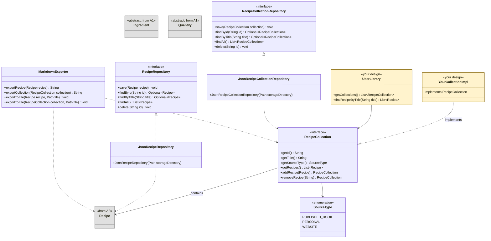

## Overview

In this assignment, you'll expand the CookYourBooks application in two major directions: **domain modeling** and **hexagonal architecture**. You'll create the structures needed to organize recipes into collections (published cookbooks, personal recipe boxes, web imports) and manage a user's library, then implement persistence using JSON serialization and export capabilities using Markdown.

This assignment introduces **hexagonal architecture** (also called ports and adapters), a design pattern that separates your core domain logic from external concerns like storage and file formats. By defining clear **port interfaces** (what your application needs) and **adapter implementations** (how those needs are fulfilled), you create a system that's easier to test, maintain, and extend.

**This is the first assignment where AI assistants are encouraged.** The domain modeling and serialization work includes plenty of design decisions and boilerplate code—perfect for practicing effective AI collaboration.

**Due:** Thursday, February 12, 2026 at 11:59 PM Boston Time

**Prerequisites:** This assignment builds on the A2 solution (provided). You should be familiar with `Recipe`, `RecipeBuilder`, `Quantity`, `Ingredient`, and the conversion system from Assignments 1 and 2.

## Learning Outcomes

By completing this assignment, you will demonstrate proficiency in:

- **Applying hexagonal architecture** by separating ports (interfaces) from adapters (implementations) ([L16: Design for Testability](/lecture-notes/l16-testing2))
- **Designing repository interfaces** that abstract persistence concerns from domain logic
- **Implementing JSON serialization** with Jackson, including polymorphic type handling
- **Using AI coding assistants effectively** for boilerplate generation and design exploration
- **Evaluating AI-generated code** for correctness, edge cases, and alignment with specifications
- **Writing comprehensive tests** that verify behavior and detect faults in complex systems

## AI Policy for This Assignment

**This is the first assignment where AI coding assistants are encouraged.** You may (and should!) use tools like GitHub Copilot or Cursor throughout this assignment.

:::info Why These Tools?

We specifically recommend **IDE-integrated assistants** (Copilot, Cursor) over other options:

- **Not Claude Code or similar "agentic" tools:** These tools are designed to work autonomously with minimal human oversight. Our course values keeping the human at the center of the development process—you should be reviewing, understanding, and directing every change. Agentic tools that make many changes without a well-designed review process automatically work against developing these skills.

- **Not ChatGPT, Claude.ai, or other web interfaces:** Manually copying code between a browser and your IDE is a waste of your time. You lose the context of your codebase, can't easily iterate on suggestions, and spend cognitive effort on mechanics rather than thinking about design. IDE-integrated tools see your code directly and let you accept, reject, or modify suggestions in place.

The goal is **AI as a collaborative partner**, not AI as a replacement for thinking or a source of friction in your workflow.

:::

However, effective AI usage requires skill. Simply copy-pasting the assignment into an AI and submitting its output will likely result in:
- Code that doesn't match the required interfaces
- Serialization that doesn't round-trip correctly
- Tests that don't detect actual bugs

Instead, use AI as a **collaborative tool**:
- Break problems into smaller pieces
- Provide context about your existing code
- Review and test AI suggestions before accepting them
- Iterate when the first attempt isn't right
- Understand what the code does before submitting it

The [AI Workflow Guide](#ai-workflow-guide) section provides detailed guidance on effective AI usage for each part of this assignment.

**You must document your AI usage** in the [Reflection](#reflection) section. This helps you develop metacognitive skills about when and how AI assists your learning.

## AI Workflow Guide

This section provides structured guidance for using AI assistants effectively on each part of this assignment. The goal is not to minimize AI usage, but to maximize its effectiveness while ensuring you understand and can defend your code.

### Task Categories

Different tasks benefit from AI assistance in different ways:

| Task Type | AI Value | Strategy |
|-----------|----------|----------|
| **Boilerplate code** (Jackson annotations, getters) | High | Let AI generate, review for correctness |
| **Design decisions** (data structures, relationships) | Low | Think first, then ask AI for alternatives |
| **Test generation** | Moderate | AI for ideas, you verify they're meaningful |
| **Debugging** | High | Describe the problem, review suggestions critically |

### Suggested Prompts by Task

Your IDE (Copilot, Cursor) automatically provides context from your open files and codebase. Use this to your advantage—reference classes by name rather than describing them.

#### Domain Modeling (Cookbook, TableOfContents, UserLibrary)

**Think first, then validate with AI:**

```
I need to design a Cookbook class. See @Recipe for the pattern I've been using 
for immutable domain objects with builders.

Cookbook needs: title, optional author, optional ISBN, list of recipes, 
and a TableOfContents.

I'm thinking of [your design approach]. What are the tradeoffs?
```

**Why think first?** Design decisions affect your entire codebase. AI can suggest patterns, but you need to understand why you're choosing one approach over another.

#### JSON Serialization Setup

**High AI value for boilerplate:**

```
I need to serialize @Quantity and @Ingredient hierarchies to JSON using Jackson.
See the subclasses in the domain package—ExactQuantity, FractionalQuantity, 
RangeQuantity, MeasuredIngredient, VagueIngredient.

Set up Jackson annotations for polymorphic serialization so I can deserialize 
back to the correct subclass.
```

**Follow-up prompts:**
- "The deserialization is failing with [error]. What's wrong?"
- "How do I handle the Optional fields in @Recipe?"
- "Write a custom serializer for FractionalQuantity that outputs '1/2' instead of an object"

#### Test Generation

**AI for ideas, you for verification:**

```
I'm testing @JsonRecipeCollectionRepository. I need to verify that 
different collection types (Cookbook, PersonalCollection, WebCollection) 
all serialize and deserialize correctly.

What test cases should I write? What edge cases might I miss?
```

**Critical:** AI-suggested tests may not be meaningful. For each suggestion, ask:
- Does this test a distinct behavior?
- Would this catch a real bug?
- Is the expected result correct?

### Review Checklist

Before accepting AI-generated code, verify:

- [ ] **Compiles:** Does it compile without errors?
- [ ] **Edge cases:** What happens with empty strings, empty collections, special characters?
- [ ] **Meets quality requirements:** Does the code meet the quality requirements specified in the assignment?
- [ ] **Tested:** Have you written tests that pass on this code?
- [ ] **Understood:** Can you explain what this code does and why?

### Iteration Strategies

When AI output isn't quite right:

1. **Be specific about the problem:** "This code fails when the input is [X] because [Y]"
2. **Provide context:** Share your existing code, class definitions, error messages
3. **Ask for explanation:** "Why did you use [approach]? What are the alternatives?"
4. **Request modifications:** "Modify this to also handle [case]"
5. **Try a different approach:** "That approach is getting complicated. Is there a simpler way?"

## Technical Specifications

### Domain Concepts

#### Recipe Collections

Recipes come from many sources, and CookYourBooks needs to handle them all:

- **Published cookbooks**: Physical or digital books with ISBN, author, publisher, publication year. May have page numbers and a formal table of contents with chapters.
- **Personal collections**: A family recipe binder, a folder of index cards, grandmother's handwritten notes. Has a title and maybe some organization, but no formal publication metadata.
- **Websites**: Recipes scraped or imported from cooking websites. Has a URL, possibly a site name, maybe a date accessed.

Your challenge is to **design a domain model that accommodates all these sources**. This is intentionally open-ended—there's no single right answer. Consider:

- Should you use inheritance (abstract `RecipeCollection` with `Cookbook`, `PersonalCollection`, `WebsiteCollection` subclasses)?
- Should you use composition (a `RecipeCollection` has a `Source` which varies)?
- Should you use a single flexible class with optional metadata fields?
- How do you handle organization (chapters, categories, tags) across different source types?

**We test at the repository interface level**, not the domain classes directly. Your domain model is a design decision that you'll justify in your reflection.

#### User Library

A **user library** is a user's personal collection of recipe collections. Users might own physical cookbooks they've digitized, maintain personal recipe collections, and save recipes from websites—all in one unified library.

#### Hexagonal Architecture

Hexagonal architecture separates your application into three layers:

1. **Domain** (center): Your core business logic—`Recipe`, `Ingredient`, `Cookbook`, etc. No dependencies on external systems.

2. **Ports** (interfaces): Contracts that define what your application needs. For example, a `RecipeRepository` port defines operations like `save()` and `findById()` without specifying how they're implemented.

3. **Adapters** (implementations): Concrete implementations that fulfill port contracts. A `JsonRecipeRepository` adapter implements `RecipeRepository` using JSON file storage.

This separation enables:
- **Testability:** Test domain logic with mock repositories
- **Flexibility:** Swap JSON storage for a database without changing domain code
- **Clarity:** Each component has a single responsibility

### Class Design

The diagram below shows **required interfaces** (white), **provided classes** (gray), and **your implementation choices** (yellow).



**Legend:**
- **Gray classes**: From A1/A2 (provided)
- **White classes**: Required interfaces you must implement
- **Yellow classes**: Your design choices (how you implement the interfaces)

### Invariants and Contracts

#### `RecipeCollection` (interface - Required)

You must implement the `RecipeCollection` interface. **How you implement it is your design decision**, but the interface is fixed for testability.

```java
/**
 * A collection of recipes from any source: published cookbook, personal collection, 
 * or website. Implementations must be immutable.
 */
public interface RecipeCollection {
    
    /**
     * Returns the unique identifier for this collection.
     * Used by repositories for storage and retrieval.
     */
    @NonNull String getId();
    
    /**
     * Returns the title of this collection.
     */
    @NonNull String getTitle();
    
    /**
     * Returns the type of source for this collection.
     * Used for display and to determine which metadata fields are relevant.
     */
    @NonNull SourceType getSourceType();
    
    /**
     * Returns all recipes in this collection.
     * @return unmodifiable list of recipes (never null, may be empty)
     */
    @NonNull List<Recipe> getRecipes();
    
    /**
     * Returns a new collection with the recipe added.
     */
    @NonNull RecipeCollection addRecipe(@NonNull Recipe recipe);
    
    /**
     * Returns a new collection with the recipe removed (by title, case-insensitive).
     */
    @NonNull RecipeCollection removeRecipe(@NonNull String recipeTitle);
}
```

#### `SourceType` (enum - Required)

```java
public enum SourceType {
    /** A published cookbook with ISBN, author, publisher */
    PUBLISHED_BOOK,
    
    /** A personal recipe collection (family recipes, handwritten cards, etc.) */
    PERSONAL,
    
    /** Recipes imported from a website */
    WEBSITE
}
```

#### Domain Model (Your Design)

Beyond the required interface, **how you structure your implementation is up to you**. You must support all three source types with their relevant metadata:

| Source Type | Required Metadata | Optional Metadata |
|-------------|-------------------|-------------------|
| `PUBLISHED_BOOK` | title | author, ISBN, publisher, publication year, page numbers |
| `PERSONAL` | title | description, notes, categories |
| `WEBSITE` | title, source URL | date accessed, site name |

**Design Questions to Consider:**

- **Inheritance:** Create `Cookbook`, `PersonalCollection`, `WebCollection` classes that implement `RecipeCollection`?
- **Composition:** Single `RecipeCollectionImpl` class with a `Source` object containing type-specific metadata?
- **Optional fields:** Single class with many `Optional<>` fields?
- **Organization:** Do you need chapters, categories, or tags? How does this vary by source type?

**Example Approaches (all valid, but which is the best for your design?):**

```java
// Approach 1: Inheritance hierarchy
class Cookbook implements RecipeCollection { 
    // getId(), getTitle(), getSourceType() returns PUBLISHED_BOOK
    // Additional: getAuthor(), getIsbn(), getChapters()
}
class PersonalCollection implements RecipeCollection { /* ... */ }
class WebCollection implements RecipeCollection { /* ... */ }

// Approach 2: Single class with composition
class RecipeCollectionImpl implements RecipeCollection {
    private final SourceMetadata metadata;  // varies by SourceType
    private final List<Recipe> recipes;
}

// Approach 3: Single class with optional fields  
class RecipeCollectionImpl implements RecipeCollection {
    private final SourceType sourceType;
    private final Optional<String> author;    // for PUBLISHED_BOOK
    private final Optional<URI> sourceUrl;    // for WEBSITE
    // ...
}
```

**What We Test:**

We test through the `RecipeCollection` interface and `RecipeCollectionRepository`:
- `save()` followed by `findById()` returns an equal collection
- `getSourceType()` returns the correct type after round-trip
- `getRecipes()` returns all recipes after round-trip
- Type-specific behavior is preserved (if you use inheritance, a saved `Cookbook` loads as a `Cookbook`)

Document your design choice and rationale in the reflection.

#### `UserLibrary` (Your Design)

A user's collection of recipe collections. Must support:
- Getting all collections
- Adding/removing collections
- Searching for recipes across all collections

The specific API is up to you, but it must be immutable and support the use cases shown in the example usage section.

#### `RecipeRepository` (interface - Port)

Defines persistence operations for recipes. This is a **port** in hexagonal architecture terms.

```java
public interface RecipeRepository {
    /**
     * Saves a recipe to the repository. If a recipe with the same ID already exists,
     * it is replaced.
     * 
     * @param recipe the recipe to save (must not be null)
     * @throws RepositoryException if the save operation fails
     */
    void save(@NonNull Recipe recipe);
    
    /**
     * Finds a recipe by its unique identifier.
     * 
     * @param id the recipe ID
     * @return the recipe if found, empty otherwise
     * @throws RepositoryException if the read operation fails
     */
    @NonNull Optional<Recipe> findById(@NonNull String id);
    
    /**
     * Finds a recipe by its title (case-insensitive exact match).
     * 
     * @param title the recipe title
     * @return the recipe if found, empty otherwise
     */
    @NonNull Optional<Recipe> findByTitle(@NonNull String title);
    
    /**
     * Returns all recipes in the repository.
     * 
     * @return unmodifiable list of all recipes
     * @throws RepositoryException if the read operation fails
     */
    @NonNull List<Recipe> findAll();
    
    /**
     * Deletes a recipe by its ID. No-op if the recipe doesn't exist.
     * 
     * @param id the recipe ID
     * @throws RepositoryException if the delete operation fails
     */
    void delete(@NonNull String id);
}
```

**Note:** You must create a `RepositoryException` class (unchecked exception) for persistence failures.

#### `RecipeCollectionRepository` (interface - Port)

Defines persistence operations for recipe collections. Structure mirrors `RecipeRepository`.

```java
public interface RecipeCollectionRepository {
    void save(@NonNull RecipeCollection collection);
    @NonNull Optional<RecipeCollection> findById(@NonNull String id);
    @NonNull Optional<RecipeCollection> findByTitle(@NonNull String title);
    @NonNull List<RecipeCollection> findAll();
    void delete(@NonNull String id);
}
```

**Note:** `RecipeCollection` here refers to whatever base type you use for your collection hierarchy. If you use inheritance, this might be an abstract class or interface. If you use a single class, it's that class. The repository must handle all variants your model supports.

#### `JsonRecipeRepository` (class - Adapter)

Implements `RecipeRepository` using JSON file storage.

**Constructor:**
- `public JsonRecipeRepository(@NonNull Path storageDirectory)`
  - **Preconditions:** `storageDirectory` must not be null
  - **Postconditions:** Creates the directory if it doesn't exist
  - **Throws:** `RepositoryException` if directory creation fails

**Implementation Requirements:**
- Must correctly serialize and deserialize all `Quantity` and `Ingredient` subtypes
- Must handle the polymorphic type hierarchy (see [Polymorphic Serialization](#polymorphic-serialization))
- Round-trip correctness: `save(recipe)` followed by `findById(id)` must return an equal recipe

**Design Decisions (yours to make):**
- JSON structure and field names
- How to encode type information for polymorphic classes
- How to generate recipe IDs (must be unique)
- Error handling strategy (what exceptions to catch/wrap)

#### `JsonRecipeCollectionRepository` (class - Adapter)

Implements `RecipeCollectionRepository` using JSON file storage. Same requirements as `JsonRecipeRepository`.

**Additional considerations:**

1. **Polymorphic collections:** If your domain model uses inheritance (e.g., `Cookbook`, `PersonalCollection`, `WebCollection` all extend `RecipeCollection`), your JSON serialization must handle this polymorphism—saving a `Cookbook` and loading it back must return a `Cookbook`, not a generic `RecipeCollection`.

2. **Nested recipes:** Collections contain recipes. Decide whether to:
   - Embed recipes directly in the collection JSON
   - Store recipe IDs and reference a `RecipeRepository`
   - Some hybrid approach

Document your decisions and their tradeoffs in the reflection.

#### `MarkdownExporter` (class - Adapter)

Exports recipes and recipe collections to Markdown format.

**Required Methods:**
- `@NonNull String exportRecipe(@NonNull Recipe recipe)` - Returns the recipe as a Markdown string
- `@NonNull String exportCollection(@NonNull RecipeCollection collection)` - Returns the collection as a Markdown string
- `void exportToFile(@NonNull Recipe recipe, @NonNull Path file)` - Writes recipe to file
- `void exportToFile(@NonNull RecipeCollection collection, @NonNull Path file)` - Writes collection to file

**Required Recipe Format:**

The `exportRecipe` method must produce output in this exact format:

```markdown
# {Recipe Title}

*Serves: {servings}*

## Ingredients

- {ingredient1.toString()}
- {ingredient2.toString()}

## Instructions

1. {instruction1.getText()}
2. {instruction2.getText()}

---
*Exported from CookYourBooks*
```

**Format Details:**
- If recipe has no servings, omit the `*Serves: ...*` line entirely
- Use `Ingredient.toString()` for ingredient formatting (from A1)
- Use `Instruction.getText()` for instruction text
- Instruction numbers should be sequential starting from 1
- The footer `---` and `*Exported from CookYourBooks*` are required
- Use Unix line endings (`\n`)

**Collection Format:**

The `exportCollection` method format depends on your domain model. At minimum:
- Start with `# {Collection Title}`
- Include relevant metadata (author for cookbooks, URL for web sources, etc.)
- Include each recipe using the recipe format above
- Separate recipes with `---`

How you format collection-specific metadata is a design decision. Document your approach.

### Polymorphic Serialization

The `Quantity` and `Ingredient` class hierarchies require special handling during JSON serialization because Jackson needs to know which subclass to instantiate during deserialization.

**Common approaches:**

1. **Type property:** Include a `"type"` field in the JSON
   ```json
   { "type": "ExactQuantity", "amount": 2.5, "unit": "CUP" }
   ```

2. **Jackson annotations:** Use `@JsonTypeInfo` and `@JsonSubTypes` on the base class

3. **Custom serializers:** Write `JsonSerializer` and `JsonDeserializer` implementations

**This is a design decision.** Choose an approach, implement it consistently, and document your choice in the reflection.

### `equals()` and `hashCode()` Requirements

Implement `equals()` and `hashCode()` for all your domain classes. The specific equality semantics depend on your design, but must satisfy:

- **Round-trip correctness:** `save(collection)` followed by `findById(id)` must return an object where `original.equals(loaded)` is true
- **Recipe equality:** Two collections with the same recipes (in the same order) and same metadata should be equal
- **Consistent with serialization:** If two objects serialize to the same JSON, they should be equal
- **Performance:** It is trivial to satisfy these requirements by serializing and deserializing the objects. This is a huge performance penalty and should be avoided.

For example, if you have a `Cookbook` class with author and ISBN fields, two cookbooks with the same title, author, ISBN, and recipes should be equal.

### Design Requirements

- **Immutability:** All domain objects must be immutable. Transformation methods return new objects.
- **Hexagonal separation:** Domain classes must not depend on Jackson, file I/O, or adapter implementations
- **Port abstraction:** Code using repositories should depend on the interface, not `JsonRecipeRepository`
- **Null safety:** Use `@NonNull` and `@Nullable` annotations from JSpecify
- **Documentation:** Javadoc for all public classes and methods
- **Exception handling:** Use `RepositoryException` (unchecked) for persistence failures, `ParseException` (checked) for parsing failures

### Example Usage

The examples below show **one possible design**. Your implementation may look different depending on your domain model choices.

```java
// Create recipes (same as A2)
Recipe pancakes = new RecipeBuilder()
    .title("Fluffy Pancakes")
    .servings(new ExactQuantity(8, Unit.WHOLE))
    .addIngredient(new MeasuredIngredient("flour", new ExactQuantity(2, Unit.CUP), null, null))
    .addIngredient(new MeasuredIngredient("milk", new ExactQuantity(1.5, Unit.CUP), null, null))
    .addIngredient(new MeasuredIngredient("eggs", new ExactQuantity(2, Unit.WHOLE), "beaten", null))
    .addInstruction(new Instruction(1, "Mix dry ingredients"))
    .addInstruction(new Instruction(2, "Add wet ingredients and stir"))
    .addInstruction(new Instruction(3, "Cook on griddle until golden"))
    .build();

Recipe waffles = new RecipeBuilder()
    .title("Crispy Waffles")
    // ... similar setup
    .build();

Recipe gramsCookies = new RecipeBuilder()
    .title("Gram's Chocolate Chip Cookies")
    // ... family recipe
    .build();

// Example: Creating different types of collections (your design may vary!)

// A published cookbook
RecipeCollection joyOfCooking = new Cookbook.Builder()
    .title("Joy of Cooking")
    .author("Irma S. Rombauer")
    .isbn("978-1501169717")
    .publicationYear(2019)
    .addRecipe(pancakes)
    .addRecipe(waffles)
    .build();

// A personal recipe collection
RecipeCollection familyRecipes = new PersonalCollection.Builder()
    .title("Gram's Recipe Box")
    .notes("Recipes from grandmother's index card collection")
    .addRecipe(gramsCookies)
    .build();

// Recipes from a website
RecipeCollection seriousEats = new WebCollection.Builder()
    .title("Serious Eats Favorites")
    .sourceUrl(URI.create("https://www.seriouseats.com"))
    .dateAccessed(LocalDate.now())
    .addRecipe(pancakes)  // imported from web
    .build();

// Persist using repositories
RecipeRepository recipeRepo = new JsonRecipeRepository(Path.of("./data/recipes"));
RecipeCollectionRepository collectionRepo = 
    new JsonRecipeCollectionRepository(Path.of("./data/collections"));

collectionRepo.save(joyOfCooking);
collectionRepo.save(familyRecipes);
collectionRepo.save(seriousEats);

// Load and verify round-trip
Optional<RecipeCollection> loaded = collectionRepo.findByTitle("Joy of Cooking");
assert loaded.isPresent();
assert loaded.get().equals(joyOfCooking);  // Round-trip correctness

// The loaded object should be the right type if you used inheritance
if (loaded.get() instanceof Cookbook cookbook) {
    assert cookbook.getIsbn().equals(Optional.of("978-1501169717"));
}

// Export to markdown
MarkdownExporter exporter = new MarkdownExporter();
String markdown = exporter.exportRecipe(pancakes);
System.out.println(markdown);
// Output:
// # Fluffy Pancakes
//
// *Serves: 8 whole*
//
// ## Ingredients
//
// - 2 cups flour
// - 1.5 cups milk
// - 2 whole eggs, beaten
//
// ## Instructions
//
// 1. Mix dry ingredients
// 2. Add wet ingredients and stir
// 3. Cook on griddle until golden
//
// ---
// *Exported from CookYourBooks*

// User library
UserLibrary library = new UserLibrary()
    .addCollection(joyOfCooking)
    .addCollection(familyRecipes)
    .addCollection(seriousEats);

List<Recipe> found = library.findRecipeByTitle("pancakes");
// Returns pancakes from multiple collections (partial, case-insensitive match)
```

### Testing Requirements

Testing follows the same model as Assignments 1 and 2:

- **You must write tests** for all components you implement
- **Implementation points require tests:** You only receive points for implementation if you have tests that detect plausible bugs
- **Mutation testing:** Your tests are run against intentionally buggy implementations
- **Reference implementation:** All your tests must pass on the instructor's reference implementation

**Required Test Files:**

Create these test files in `src/test/java/app/cookyourbooks/`:

| Test File | What to Test |
|-----------|--------------|
| `domain/RecipeCollectionTest.java` | Your collection classes: construction, immutable transformations, equals/hashCode |
| `domain/UserLibraryTest.java` | Library operations, recipe search across collections |
| `adapters/JsonRecipeRepositoryTest.java` | Save/load round-trip, polymorphic Quantity/Ingredient serialization |
| `adapters/JsonRecipeCollectionRepositoryTest.java` | Collection persistence, polymorphic collection types, nested recipes |
| `adapters/MarkdownExporterTest.java` | Recipe output format correctness |

**Testing Guidance:**

- **Round-trip tests:** `save(obj)` then `findById(id)` should return equal object
- **Polymorphism tests:** Verify that all your collection types (Cookbook, PersonalCollection, etc.) serialize and deserialize to the correct type
- **Recipe polymorphism:** Verify that `ExactQuantity`, `FractionalQuantity`, `RangeQuantity`, `MeasuredIngredient`, and `VagueIngredient` all serialize/deserialize correctly within collections
- **Format tests:** For export, test exact string matches against expected Markdown output
- **Edge cases:** Empty collections, null optional fields, special characters in names
- **Error cases:** Invalid input should throw appropriate exceptions

**AI and Testing:**

AI can help generate test cases, but you must verify:
- The test actually tests something meaningful
- The expected values are correct
- Edge cases are covered
- The test would catch real bugs

## Reflection

Update `REFLECTION.md` to address:

1. **Domain Model Design:** Describe your approach to modeling recipe collections. Did you use inheritance, composition, or something else? What tradeoffs did you consider? How does your design handle the different source types (published cookbook, personal collection, website)?

2. **Hexagonal Architecture:** How does separating ports (interfaces) from adapters (implementations) enable testability? Give a specific example from your code.

3. **Serialization Design:** What JSON structure did you choose? How did you handle polymorphic collections (if you used inheritance)? What alternatives did you consider?

4. **AI Effectiveness:** Which tasks was AI most helpful for? Least helpful? Why do you think that is?

5. **AI Iteration:** Describe a specific case where you had to refine or fix AI-generated code. What was the original problem? How did you fix it?

### Reflection Grading

Up to 2 points deducted per question for incomplete or superficial responses (5 questions × 2 points = 10 points max deduction).

## Quality Requirements

Your submission should demonstrate:

- **Correctness:** Code compiles, follows specifications, passes tests
- **Architecture:** Clear separation between domain, ports, and adapters
- **Serialization:** Correct round-trip for all domain objects including polymorphic types
- **Testing:** Meaningful tests that verify behavior and detect faults
- **Documentation:** Clear Javadoc with design decisions explained
- **AI Usage:** Thoughtful, effective use of AI assistants with proper attribution

## Grading Rubric

### Automated Grading (100 points)

#### Implementation Correctness (50 points)

Your code is tested against a comprehensive instructor test suite:

| Component | Points |
|-----------|--------|
| `RecipeCollection` domain model (tested via repository) | 12 |
| `UserLibrary` | 6 |
| `RecipeRepository` interface compliance | 4 |
| `RecipeCollectionRepository` interface compliance | 4 |
| `JsonRecipeRepository` (round-trip correctness) | 8 |
| `JsonRecipeCollectionRepository` (round-trip correctness) | 10 |
| `MarkdownExporter` (format correctness) | 6 |

#### Test Suite Quality (50 points)

Your tests are evaluated using mutation testing:

| Test File | Points |
|-----------|--------|
| `RecipeCollectionTest.java` | 12 |
| `UserLibraryTest.java` | 6 |
| `JsonRecipeRepositoryTest.java` | 12 |
| `JsonRecipeCollectionRepositoryTest.java` | 14 |
| `MarkdownExporterTest.java` | 6 |

**Important:** You only receive implementation points if you also have tests that detect bugs in that component. For example, you only get `JsonRecipeRepository` implementation points if your `JsonRecipeRepositoryTest` catches bugs in buggy implementations.

### Manual Grading (Subtractive, max -30 points)

| Category | Max Deduction | Criteria |
|----------|---------------|----------|
| **Architecture** | -10 | Domain depends on adapters; missing port abstractions; tight coupling |
| **Immutability** | -6 | Mutable domain objects; exposed internal collections |
| **Documentation** | -4 | Missing Javadoc; undocumented design decisions |
| **Test Quality** | -6 | Trivial tests; missing edge cases; tests don't verify meaningful behavior |
| **Code Style** | -4 | Poor naming; overly complex logic; inconsistent style |

### Reflection (-10 points max)

Up to 2 points deducted per question for incomplete or superficial responses.

## Submission

1. **Start from provided A2 solution:** Clone the assignment repository which includes the instructor's A2 solution

2. **Implement required interfaces** in `src/main/java/app/cookyourbooks/domain/`:
   - `RecipeCollection.java` (the interface as specified)
   - `SourceType.java` (the enum as specified)

3. **Implement your domain model** in `src/main/java/app/cookyourbooks/domain/`:
   - Your class(es) that implement `RecipeCollection` (design is up to you—could be one class, could be a hierarchy)
   - `UserLibrary.java`

4. **Implement ports** in `src/main/java/app/cookyourbooks/ports/`:
   - `RecipeRepository.java`
   - `RecipeCollectionRepository.java`
   - `RepositoryException.java`

5. **Implement adapters** in `src/main/java/app/cookyourbooks/adapters/`:
   - `JsonRecipeRepository.java`
   - `JsonRecipeCollectionRepository.java`
   - `MarkdownExporter.java`

6. **Write tests** in `src/test/java/app/cookyourbooks/`:
   - `domain/RecipeCollectionTest.java`
   - `domain/UserLibraryTest.java`
   - `adapters/JsonRecipeRepositoryTest.java`
   - `adapters/JsonRecipeCollectionRepositoryTest.java`
   - `adapters/MarkdownExporterTest.java`

7. **Update `REFLECTION.md`**

8. **Verify:** Run `./gradlew build` and `./gradlew test`

9. **Commit and push**

10. **Complete the self-review in Pawtograder** (see below)

### Self-Review (New for This Assignment)

**This is the first assignment that includes a self-review component.** After pushing your code, you must complete a self-review in Pawtograder. The self-review serves two purposes:

1. **Guide the grader:** You'll annotate your code to highlight key design decisions, making it easier for graders to understand your approach and navigate your submission.

2. **Self-assessment opportunity:** You'll reflect on the quality attributes of your design—cohesion, coupling, information hiding, extensibility—before receiving feedback.

**The self-review will ask you to:**

- **Identify your domain model design:** Point to where your `RecipeCollection` classes are defined and briefly explain your approach (inheritance vs. composition vs. single class)
- **Highlight polymorphism handling:** Show where you handle serialization of different collection types and the Quantity/Ingredient hierarchies
- **Annotate design decisions:** Mark 2-3 places where you made significant design choices and explain your reasoning
- **Self-assess quality attributes:** Rate your design on key criteria and justify your ratings

:::warning Complete the Self-Review
The self-review is **required** and must be completed within 24 hours of your final submission. Submissions without a completed self-review will receive a penalty.
:::

### Repository Structure

Your final repository should include (file names for your implementation classes may vary based on your design):

```
src/
├── main/java/app/cookyourbooks/
│   ├── domain/
│   │   ├── RecipeCollection.java          (required interface)
│   │   ├── SourceType.java                (required enum)
│   │   ├── [Your implementation classes]  (e.g., Cookbook.java, PersonalCollection.java, etc.)
│   │   ├── UserLibrary.java
│   │   └── ... (A1/A2 classes)
│   ├── ports/
│   │   ├── RecipeRepository.java
│   │   ├── RecipeCollectionRepository.java
│   │   └── RepositoryException.java
│   └── adapters/
│       ├── JsonRecipeRepository.java
│       ├── JsonRecipeCollectionRepository.java
│       └── MarkdownExporter.java
└── test/java/app/cookyourbooks/
    ├── domain/
    │   ├── RecipeCollectionTest.java
    │   └── UserLibraryTest.java
    └── adapters/
        ├── JsonRecipeRepositoryTest.java
        ├── JsonRecipeCollectionRepositoryTest.java
        └── MarkdownExporterTest.java
```

Good luck! Remember: this assignment is designed to help you develop effective AI collaboration skills. Use AI assistants thoughtfully, test rigorously, and reflect on what works.
