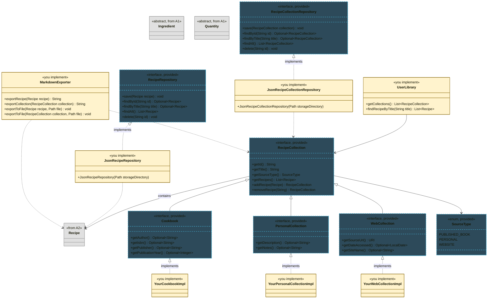

:::warning Preliminary Content

This assignment is preliminary content and is subject to change until the release date of the
assignment.

:::

## Overview

In this assignment, you'll expand the CookYourBooks application in two major directions: **domain
modeling** and **persistence architecture**. You'll create the structures needed to organize recipes
into collections (published cookbooks, personal recipe boxes, web imports) and manage a user's
library, then implement persistence using JSON serialization and export capabilities using Markdown.

This assignment emphasizes **separating concerns** between your core domain logic and external
concerns like storage and file formats. By defining clear **repository interfaces** (what your
application needs) and **concrete implementations** (how those needs are fulfilled), you create a
system that's easier to test, maintain, and extend.

**This is the first assignment where AI assistants are encouraged.** The domain modeling and
serialization work includes plenty of design decisions and boilerplate code—perfect for practicing
effective AI collaboration.

**Due:** Thursday, February 12, 2026 at 11:59 PM Boston Time

**Prerequisites:** This assignment builds on the A2 sample implementation (provided). You should be
familiar with `Recipe`, `Quantity`, `Ingredient`, and the conversion system from
Assignments 1 and 2.

**Starter Code:** We provide all interface definitions and supporting types so you can focus on
implementation and design decisions rather than transcription. See
[What's Provided](#whats-provided) for details.

## Learning Outcomes

By completing this assignment, you will demonstrate proficiency in:

- **Separating concerns** by defining interfaces for persistence and implementing them independently
  ([L16: Design for Testability](/lecture-notes/l16-testing2))
- **Designing repository interfaces** that abstract persistence concerns from domain logic
- **Implementing JSON serialization** with Jackson, including polymorphic type handling
- **Using AI coding assistants effectively** for boilerplate generation and design exploration
- **Evaluating AI-generated code** for correctness, edge cases, and alignment with specifications
- **Writing comprehensive tests** that verify behavior and detect faults in complex systems

## AI Policy for This Assignment

**This is the first assignment where AI coding assistants are encouraged.** You may (and should!)
use tools like GitHub Copilot or Cursor throughout this assignment.

:::info Why These Tools?

We specifically recommend **IDE-integrated assistants** (Copilot, Cursor) over other options:

- **Not Claude Code or similar "agentic" tools:** These tools are designed to work autonomously with
  minimal human oversight. Our course values keeping the human at the center of the development
  process—you should be reviewing, understanding, and directing every change. Agentic tools that
  make many changes without a well-designed review process automatically work against developing
  these skills. Yes, Claude Code has a VSCode extension, but it is our editorial opinion that it is
  poorly designed to support human review and iteration: you must choose between reviewing every edit (leaving the agent blocked and unable to make changes while you review), or you must manually set up your own git-based review process.

- **Not ChatGPT, Claude.ai, or other web interfaces:** Manually copying code between a browser and
  your IDE is a waste of your time. You lose the context of your codebase, can't easily iterate on
  suggestions, and spend cognitive effort on mechanics rather than thinking about design.
  IDE-integrated tools see your code directly and let you accept, reject, or modify suggestions in
  place.

The goal is **AI as a collaborative partner**, not AI as a replacement for thinking or a source of
friction in your workflow.

:::

However, effective AI usage requires skill. Simply copy-pasting the assignment into an AI and
submitting its output will likely result in:

- Code that doesn't match the required interfaces
- Random features that appear to be implemented, and upon closer inspection have a comment along the
  lines
  `// In production, you would actually implement serialization, for now we'll just use a placeholder`
- Tests that don't detect actual bugs

Instead, use AI as a **collaborative tool**:

- Break problems into smaller pieces
- Provide context about your existing code
- Review and test AI suggestions before accepting them
- Iterate when the first attempt isn't right
- Understand what the code does before submitting it

The [AI Workflow Guide](#ai-workflow-guide) section provides detailed guidance on effective AI usage
for each part of this assignment.

**You must document your AI usage** in the [Reflection](#reflection) section. This helps you develop
metacognitive skills about when and how AI assists your learning.

## AI Workflow Guide

This section provides structured guidance for using AI assistants effectively on each part of this
assignment. The goal is not to minimize AI usage, but to maximize its effectiveness while ensuring
you understand and can defend your code.

### Task Categories

Different tasks benefit from AI assistance in different ways:

| Task Type                                             | AI Value | Strategy                                                                         |
| ----------------------------------------------------- | -------- | -------------------------------------------------------------------------------- |
| **Boilerplate code** (Jackson annotations, getters)   | High     | Let AI generate, review for correctness                                          |
| **Design decisions** (data structures, relationships) | Moderate | Think first, then ask AI for alternatives or to expand your design into diagrams |
| **Test generation**                                   | Moderate | AI for ideas, you verify they're meaningful                                      |
| **Debugging**                                         | High     | Use scientific debugging, supported by AI                                        |

### Suggested Prompts by Task

Your IDE (Copilot, Cursor) automatically provides context from your open files and codebase. Use
this to your advantage—reference classes by name rather than describing them.

#### Domain Modeling (Cookbook, TableOfContents, UserLibrary)

**Think first, then validate with AI:**

```
I need to design a Cookbook class. See Recipe for the pattern I've been using for immutable domain objects with builders.

Cookbook needs: title, optional author, optional ISBN, list of recipes,
and a TableOfContents.

I'm thinking of [your design approach]. What are the tradeoffs? Please draw a diagram of the class and its relationships to other classes in this codebase.
```

**Why think first?** Design decisions affect your entire codebase. AI can suggest patterns, but you
need to understand why you're choosing one approach over another.

#### JSON Serialization Setup

**Learn by implementing, then use AI for the pattern:**

**Step 1: Implement one hierarchy yourself (Quantity OR Ingredient)**

First, implement polymorphic serialization for ONE hierarchy (we recommend Quantity) without AI
assistance:

1. Read Jackson's documentation on `@JsonTypeInfo` and `@JsonSubTypes`
2. Add the annotations to the base class (Quantity or Ingredient)
3. Register all subclasses (ExactQuantity, FractionalQuantity, RangeQuantity)
4. Write a test to verify round-trip serialization works
5. Debug any issues until it works correctly

**Why do this manually first?** You need to understand how polymorphic serialization works. AI can
generate boilerplate, but you need to know what it's generating and why, especially when debugging.

**Step 2: Use AI for the second hierarchy**

Once you understand the pattern from Step 1, use AI to apply it to the other hierarchy:

```
I just implemented polymorphic JSON serialization for the Quantity hierarchy using
@JsonTypeInfo and @JsonSubTypes annotations.

Now I need to apply the same pattern to the Ingredient hierarchy. See MeasuredIngredient
and VagueIngredient in the model package.

Set up the annotations following the same approach I used for Quantity.
```

**Why this order?** You learn the concept hands-on, then use AI as a productivity multiplier for the
repetitive work. This builds understanding AND efficiency.

**Follow-up prompts:**

- "The deserialization is failing with [error]. What's wrong?"
- "How do I handle the Optional fields in Recipe?"
- "Why do we need the 'property' parameter in @JsonTypeInfo?"

#### Test Generation

**AI for ideas, you for verification:**

```
I'm testing JsonRecipeCollectionRepository. I need to verify that
different collection types (Cookbook, PersonalCollection, WebCollection)
all serialize and deserialize correctly.

Outline a comprehensive testing strategy for the JsonRecipeCollectionRepository.
```

**Critical:** AI-suggested tests may not be meaningful. For each suggestion, ask:

- Does this test a distinct behavior?
- Would this catch a real bug?
- Is the expected result correct?

### Review Checklist

Before accepting AI-generated code, verify:

- [ ] **Compiles:** Does it compile without errors?
- [ ] **Edge cases:** What happens with empty strings, empty collections, special characters?
- [ ] **Meets quality requirements:** Does the code meet the quality requirements specified in the
      assignment?
- [ ] **Tested:** Have you written tests that pass on this code?
- [ ] **Understood:** Can you explain what this code does and why? Does it have meaningful comments?

### Iteration Strategies

When AI output isn't quite right:

1. **Be specific about the problem:** "This code fails when the input is [X], I think because [Y] -
   trace through the code and identify any likely bugs that would cause this to happen"
2. **Provide context:** Explicitly refer to existing parts of your codebase that are relevant to the
   problem, or additional aspects of the specification that are relevant.
3. **Ask for explanation:** "Why did you use [approach]? What are the alternatives?"
4. **Request modifications:** "Modify this to also handle [case]"
5. **Try a different approach:** "That approach is getting complicated. Is there a simpler way?"

## Technical Specifications

### Domain Concepts

#### Recipe Collections

Recipes come from many sources, and CookYourBooks needs to handle them all:

- **Published cookbooks**: Physical or digital books with ISBN, author, publisher, publication year.
  May have page numbers and a formal table of contents with chapters.
- **Personal collections**: A family recipe binder, a folder of index cards, grandmother's
  handwritten notes. Has a title and maybe some organization, but no formal publication metadata.
- **Websites**: Recipes scraped or imported from cooking websites. Has a URL, possibly a site name,
  maybe a date accessed.

Your challenge is to **design a domain model that accommodates all these sources**. This is
intentionally open-ended—there's no single right answer. Consider:

- Should you use inheritance (abstract `RecipeCollection` with `Cookbook`, `PersonalCollection`,
  `WebsiteCollection` subclasses)?
- Should you use composition (a `RecipeCollection` has a `Source` which varies)?
- Should you use a single flexible class with optional metadata fields?
- How do you handle organization (chapters, categories, tags) across different source types?

**We test at the repository interface level**, not the domain classes directly. Your domain model is
a design decision that you'll justify in your reflection.

#### User Library

A **user library** is a user's personal collection of recipe collections. Users might own physical
cookbooks they've digitized, maintain personal recipe collections, and save recipes from
websites—all in one unified library.

#### Architecture Overview

This assignment separates your application into layers:

1. **Model**: Your core business logic—`Recipe`, `Ingredient`, `Cookbook`, etc. No dependencies on
   external systems like files or databases.

2. **Repository Interfaces**: Contracts that define what your application needs. For example, a
   `RecipeRepository` interface defines operations like `save()` and `findById()` without specifying
   how they're implemented.

3. **Concrete Implementations**: Classes that fulfill interface contracts. A `JsonRecipeRepository`
   implements `RecipeRepository` using JSON file storage.

This separation enables:

- **Testability:** Test domain logic with mock repositories
- **Flexibility:** Swap JSON storage for a database without changing domain code
- **Clarity:** Each component has a single responsibility

### What's Provided

The starter code includes all interface definitions so you can focus on implementation:

| Provided                          | Description                                       |
| --------------------------------- | ------------------------------------------------- |
| `RecipeCollection.java`           | Base interface for all collections                |
| `Cookbook.java`                   | Interface for published cookbooks                 |
| `PersonalCollection.java`         | Interface for personal collections                |
| `WebCollection.java`              | Interface for web-sourced collections             |
| `SourceType.java`                 | Enum with `PUBLISHED_BOOK`, `PERSONAL`, `WEBSITE` |
| `RecipeRepository.java`           | Interface for recipe persistence                  |
| `RecipeCollectionRepository.java` | Interface for collection persistence              |
| `RepositoryException.java`        | Unchecked exception for persistence failures      |
| `Recipe.java` (updated)           | Now includes `id` field with auto-generation      |

### What You Implement

| Your Code                        | Description                                                            |
| -------------------------------- | ---------------------------------------------------------------------- |
| Collection implementations       | Classes implementing `Cookbook`, `PersonalCollection`, `WebCollection` |
| `UserLibrary`                    | Your design for managing collections                                   |
| `JsonRecipeRepository`           | JSON-based `RecipeRepository` implementation                           |
| `JsonRecipeCollectionRepository` | JSON-based `RecipeCollectionRepository` implementation                 |
| `MarkdownExporter`               | Export recipes/collections to Markdown                                 |
| All test files                   | Tests for your implementations                                         |

### Class Design

The diagram below shows the complete architecture. **Blue dashed classes are provided interfaces**;
**yellow classes are what you implement**.


```mermaid
classDiagram
    direction TB

    %% A1/A2 classes (context)
    class Recipe {
        <<from A2>>
    }
    class Ingredient {
        <<abstract, from A1>>
    }
    class Quantity {
        <<abstract, from A1>>
    }

    %% Provided interface hierarchy for collections
    class RecipeCollection {
        <<interface, provided>>
        +getId() String
        +getTitle() String
        +getSourceType() SourceType
        +getRecipes() List~Recipe~
        +addRecipe(Recipe) RecipeCollection
        +removeRecipe(String) RecipeCollection
    }

    class Cookbook {
        <<interface, provided>>
        +getAuthor() Optional~String~
        +getIsbn() Optional~String~
        +getPublisher() Optional~String~
        +getPublicationYear() Optional~Integer~
    }

    class PersonalCollection {
        <<interface, provided>>
        +getDescription() Optional~String~
        +getNotes() Optional~String~
    }

    class WebCollection {
        <<interface, provided>>
        +getSourceUrl() URI
        +getDateAccessed() Optional~LocalDate~
        +getSiteName() Optional~String~
    }

    class SourceType {
        <<enum, provided>>
        PUBLISHED_BOOK
        PERSONAL
        WEBSITE
    }

    %% Student implementations
    class YourCookbookImpl {
        <<you implement>>
    }

    class YourPersonalCollectionImpl {
        <<you implement>>
    }

    class YourWebCollectionImpl {
        <<you implement>>
    }

    class UserLibrary {
        <<you implement>>
        +getCollections() List~RecipeCollection~
        +findRecipeByTitle(String title) List~Recipe~
    }

    %% Provided repository interfaces
    class RecipeRepository {
        <<interface, provided>>
        +save(Recipe recipe) void
        +findById(String id) Optional~Recipe~
        +findByTitle(String title) Optional~Recipe~
        +findAll() List~Recipe~
        +delete(String id) void
    }

    class RecipeCollectionRepository {
        <<interface, provided>>
        +save(RecipeCollection collection) void
        +findById(String id) Optional~RecipeCollection~
        +findByTitle(String title) Optional~RecipeCollection~
        +findAll() List~RecipeCollection~
        +delete(String id) void
    }

    %% Student implementations
    class JsonRecipeRepository {
        <<you implement>>
        +JsonRecipeRepository(Path storageDirectory)
    }

    class JsonRecipeCollectionRepository {
        <<you implement>>
        +JsonRecipeCollectionRepository(Path storageDirectory)
    }

    class MarkdownExporter {
        <<you implement>>
        +exportRecipe(Recipe recipe) String
        +exportCollection(RecipeCollection collection) String
        +exportToFile(Recipe recipe, Path file) void
        +exportToFile(RecipeCollection collection, Path file) void
    }

    %% Inheritance relationships
    RecipeCollection <|-- Cookbook
    RecipeCollection <|-- PersonalCollection
    RecipeCollection <|-- WebCollection

    Cookbook <|.. YourCookbookImpl : implements
    PersonalCollection <|.. YourPersonalCollectionImpl : implements
    WebCollection <|.. YourWebCollectionImpl : implements

    RecipeCollection --> Recipe : contains
    RecipeCollection --> SourceType
    UserLibrary --> RecipeCollection

    RecipeRepository <|.. JsonRecipeRepository : implements
    RecipeCollectionRepository <|.. JsonRecipeCollectionRepository : implements

    JsonRecipeRepository ..> Recipe
    JsonRecipeCollectionRepository ..> RecipeCollection
    MarkdownExporter ..> Recipe
    MarkdownExporter ..> RecipeCollection

    %% Styling
    style Recipe fill:#e0e0e0,stroke:#999
    style Ingredient fill:#e0e0e0,stroke:#999
    style Quantity fill:#e0e0e0,stroke:#999

    style RecipeCollection fill:#2d4a5a,stroke:#4ac,stroke-width:2px,stroke-dasharray: 5 5
    style Cookbook fill:#2d4a5a,stroke:#4ac,stroke-width:2px,stroke-dasharray: 5 5
    style PersonalCollection fill:#2d4a5a,stroke:#4ac,stroke-width:2px,stroke-dasharray: 5 5
    style WebCollection fill:#2d4a5a,stroke:#4ac,stroke-width:2px,stroke-dasharray: 5 5
    style RecipeRepository fill:#2d4a5a,stroke:#4ac,stroke-width:2px,stroke-dasharray: 5 5
    style RecipeCollectionRepository fill:#2d4a5a,stroke:#4ac,stroke-width:2px,stroke-dasharray: 5 5
    style SourceType fill:#2d4a5a,stroke:#4ac,stroke-width:2px,stroke-dasharray: 5 5

    style YourCookbookImpl fill:#fff3cd,stroke:#856404
    style YourPersonalCollectionImpl fill:#fff3cd,stroke:#856404
    style YourWebCollectionImpl fill:#fff3cd,stroke:#856404
    style UserLibrary fill:#fff3cd,stroke:#856404
    style JsonRecipeRepository fill:#fff3cd,stroke:#856404
    style JsonRecipeCollectionRepository fill:#fff3cd,stroke:#856404
    style MarkdownExporter fill:#fff3cd,stroke:#856404
```

**Legend:**

- **Gray classes**: From A1/A2 (provided in starter code)
- **Blue dashed classes**: Interfaces (provided in starter code)
- **Yellow classes**: Classes you implement

### Recipe ID Field

The `RecipeRepository` interface requires recipes to have unique identifiers for `findById()` and
`delete()` operations. The starter code already includes an `id` field in `Recipe`:

```java
// Recipe constructor now accepts an optional id parameter:
public Recipe(
    @Nullable String id,  // null = auto-generate UUID
    String title,
    @Nullable Quantity servings,
    List<Ingredient> ingredients,
    List<Instruction> instructions,
    List<ConversionRule> conversionRules)

// Recipe now has:
public @NonNull String getId()  // Returns the unique identifier
```

IDs are auto-generated as UUIDs if not explicitly set (when `id` parameter is null). This ensures globally unique identifiers with
near-zero collision probability.

### Provided Interfaces

The following interfaces are **provided in starter code**. You must implement them but don't need to
create the interface files.

#### Collection Interfaces (Provided)

| Interface            | Extends            | Key Methods                                                                                 |
| -------------------- | ------------------ | ------------------------------------------------------------------------------------------- |
| `RecipeCollection`   | —                  | `getId()`, `getTitle()`, `getSourceType()`, `getRecipes()`, `addRecipe()`, `removeRecipe()` |
| `Cookbook`           | `RecipeCollection` | `getAuthor()`, `getIsbn()`, `getPublisher()`, `getPublicationYear()`                        |
| `PersonalCollection` | `RecipeCollection` | `getDescription()`, `getNotes()`                                                            |
| `WebCollection`      | `RecipeCollection` | `getSourceUrl()`, `getDateAccessed()`, `getSiteName()`                                      |

All collection implementations must be **immutable**—transformation methods like `addRecipe()`
return new objects.

#### `SourceType` (Provided)

```java
public enum SourceType {
    PUBLISHED_BOOK,  // Published cookbook with ISBN, author, publisher
    PERSONAL,        // Personal recipe collection (family recipes, etc.)
    WEBSITE          // Recipes imported from a website
}
```

#### Metadata by Collection Type

| Interface            | Required Fields   | Optional Fields                           |
| -------------------- | ----------------- | ----------------------------------------- |
| `Cookbook`           | title             | author, ISBN, publisher, publication year |
| `PersonalCollection` | title             | description, notes                        |
| `WebCollection`      | title, source URL | date accessed, site name                  |

### Your Implementation: Collection Classes

You must provide concrete classes that implement each collection interface. **How you structure your
implementations is a design decision**—you might:

- Create three separate classes (`CookbookImpl`, `PersonalCollectionImpl`, `WebCollectionImpl`)
- Use a common abstract base class to share implementation logic
- Use composition to delegate common behavior

**What We Test:**

We test through the interfaces and `RecipeCollectionRepository`:

- `save()` followed by `findById()` returns an equal collection
- `getSourceType()` returns the correct type after round-trip
- `getRecipes()` returns all recipes after round-trip
- Type-specific methods (e.g., `getAuthor()` on `Cookbook`) return correct values after round-trip
- Polymorphism is preserved: saving a `Cookbook` and loading it returns a `Cookbook`, not just a
  `RecipeCollection`

Document your implementation approach and rationale in your reflection.

### Your Implementation: UserLibrary

A user's collection of recipe collections. Must support:

- Getting all collections
- Adding/removing collections
- Searching for recipes across all collections

The specific API is up to you, but it must be immutable and support the use cases shown in the
example usage section.

### Repository Interfaces (Provided)

Both repository interfaces are **provided in starter code**, along with `RepositoryException`.

| Interface                    | Methods                                                                                            |
| ---------------------------- | -------------------------------------------------------------------------------------------------- |
| `RecipeRepository`           | `save(Recipe)`, `findById(String)`, `findByTitle(String)`, `findAll()`, `delete(String)`           |
| `RecipeCollectionRepository` | `save(RecipeCollection)`, `findById(String)`, `findByTitle(String)`, `findAll()`, `delete(String)` |

**Key behaviors:**

- `save()` replaces existing items with the same ID
- `findByTitle()` uses case-insensitive exact match
- `delete()` is a no-op if the item doesn't exist
- All methods throw `RepositoryException` (unchecked) on I/O failures

### Your Implementation: JSON Repositories

You must implement both repository interfaces using JSON file storage.

#### `JsonRecipeRepository`

**Constructor:**

- `public JsonRecipeRepository(@NonNull Path storageDirectory)`
  - Creates the directory if it doesn't exist
  - Throws `RepositoryException` if directory creation fails

**Requirements:**

- Must correctly serialize and deserialize all `Quantity` and `Ingredient` subtypes
- Must handle the polymorphic type hierarchy (see
  [Polymorphic Serialization](#polymorphic-serialization))
- Round-trip correctness: `save(recipe)` followed by `findById(id)` must return an equal recipe

**Design Decisions (yours to make):**

- JSON structure and field names
- How to encode type information for polymorphic classes
- Error handling strategy (what exceptions to catch/wrap)

#### `JsonRecipeCollectionRepository`

Same requirements as `JsonRecipeRepository`, plus:

1. **Polymorphic collections:** Your JSON serialization must handle collection type
   polymorphism—saving a `Cookbook` and loading it back must return a `Cookbook`, not a generic
   `RecipeCollection`.

2. **Nested recipes:** Collections contain recipes. Decide whether to:
   - Embed recipes directly in the collection JSON
   - Store recipe IDs and reference a `RecipeRepository`
   - Some hybrid approach

Document your decisions and their tradeoffs in the reflection.

### Your Implementation: MarkdownExporter

Exports recipes and recipe collections to Markdown format.

**Required Methods:**

- `@NonNull String exportRecipe(@NonNull Recipe recipe)` - Returns the recipe as a Markdown string
- `@NonNull String exportCollection(@NonNull RecipeCollection collection)` - Returns the collection
  as a Markdown string
- `void exportToFile(@NonNull Recipe recipe, @NonNull Path file)` - Writes recipe to file
- `void exportToFile(@NonNull RecipeCollection collection, @NonNull Path file)` - Writes collection
  to file

**Required Recipe Format:**

The `exportRecipe` method must produce output in this exact format:

```markdown
# {Recipe Title}

_Serves: {servings}_

## Ingredients

- {ingredient1.toString()}
- {ingredient2.toString()}

## Instructions

1. {instruction1.getText()}
2. {instruction2.getText()}

---

_Exported from CookYourBooks, learn more at https://www.cookyourbooks.app_
```

**Format Details:**

- If recipe has no servings, omit the `*Serves: ...*` line entirely
- Use `Ingredient.toString()` for ingredient formatting (from A1)
- Use `Instruction.getText()` for instruction text
- Instruction numbers should be sequential starting from 1
- The footer `---` and `*Exported from CookYourBooks, learn more at https://www.cookyourbooks.app*`
  are required
- Use Unix line endings (`\n`)

**Collection Format:**

The `exportCollection` method format depends on your domain model. At minimum:

- Start with `# {Collection Title}`
- Include relevant metadata (author for cookbooks, URL for web sources, etc.)
- Include each recipe using the recipe format above
- Separate recipes with `---`

How you format collection-specific metadata is a design decision. Document your approach.

### Polymorphic Serialization

The `Quantity` and `Ingredient` class hierarchies require special handling during JSON serialization
because Jackson needs to know which subclass to instantiate during deserialization.

#### Recommended Approach: @JsonCreator with Mixins

**For immutable domain classes (which all your domain objects should be), use the `@JsonCreator`
annotation:**

```java
import com.fasterxml.jackson.annotation.JsonCreator;
import com.fasterxml.jackson.annotation.JsonProperty;

public final class ExactQuantity extends Quantity {
  private final double amount;

  @JsonCreator
  public ExactQuantity(
      @JsonProperty("amount") double amount,
      @JsonProperty("unit") @NonNull Unit unit) {
    super(unit);
    // validation and initialization
  }
}
```

**Key benefits:**

- ✅ Fields remain `final` (true immutability)
- ✅ No dummy no-arg constructors needed
- ✅ Validation logic runs during deserialization
- ✅ Works with existing constructors (just add annotations)

**Note on architecture:** Using `@JsonCreator` and `@JsonProperty` technically introduces Jackson
dependencies into your domain classes. However, these are **metadata annotations only**—they don't
change your domain logic or behavior. This is a pragmatic tradeoff:

- **Pro:** Simpler code, maintains immutability, validation runs correctly
- **Con:** Domain classes depend on Jackson annotations (but not Jackson logic)

For this course, we consider this an acceptable compromise for immutable domain objects.

#### Handling Polymorphism

For polymorphic hierarchies (`Quantity`, `Ingredient`, `RecipeCollection`), you still need to tell
Jackson which subclass to instantiate. Use **mixin classes** in your repository implementation to
keep polymorphism metadata separate:

```java
// In your repository implementation (e.g., JsonRecipeRepository):
@JsonTypeInfo(use = JsonTypeInfo.Id.NAME, property = "type")
@JsonSubTypes({
  @JsonSubTypes.Type(value = ExactQuantity.class, name = "exact"),
  @JsonSubTypes.Type(value = FractionalQuantity.class, name = "fractional"),
  @JsonSubTypes.Type(value = RangeQuantity.class, name = "range")
})
abstract static class QuantityMixin {}

// Register the mixin:
objectMapper.addMixIn(Quantity.class, QuantityMixin.class);
```

This approach:

- Keeps domain classes clean of polymorphism metadata
- Centralizes type discrimination logic in the repository implementation
- Produces readable JSON with explicit type tags

**Example JSON output:**

```json
{
  "type": "exact",
  "amount": 2.5,
  "unit": "CUP"
}
```

#### Alternative: Custom Serializers

If you want to keep domain classes completely annotation-free, you can write custom `JsonSerializer`
and `JsonDeserializer` implementations. However, this requires significantly more code and is
generally not worth the added complexity for this assignment.

### `equals()` and `hashCode()` Requirements

Implement `equals()` and `hashCode()` for all your domain classes. The specific equality semantics
depend on your design, but must satisfy:

- **Recipe equality:** Two collections with the same recipes (in the same order) and same metadata
  should be equal
- **Consistent with serialization:** If two objects serialize to the same JSON, they should be equal
- **Performance:** It is trivial to satisfy these requirements by serializing and deserializing the
  objects. This is a huge performance penalty and should be avoided.

For example, if you have a `Cookbook` class with author and ISBN fields, two cookbooks with the same
title, author, ISBN, and recipes should be equal.

### Design Requirements

- **Immutability:** All domain objects must be immutable. Transformation methods return new objects.
- **Separation of concerns:** Domain classes must not depend on Jackson, file I/O, or persistence
  implementations
- **Interface abstraction:** Code using repositories should depend on the interface, not
  `JsonRecipeRepository`
- **Null safety:** Use `@NonNull` and `@Nullable` annotations from JSpecify
- **Documentation:** Javadoc for all public classes and methods
- **Exception handling:** Use `RepositoryException` (unchecked) for persistence failures,
  `ParseException` (checked) for parsing failures

### Testing Requirements

Testing follows the same model as Assignments 1 and 2:

- **You must write tests** for all components you implement. **Your tests must be written to the
  interface provided, not to your implementation.**
- **Implementation points require tests:** You only receive points for implementation if you have
  tests that detect plausible bugs
- **Mutation testing:** Your tests are run against intentionally buggy implementations
- **Reference implementation:** All your tests must pass on the instructor's reference
  implementation

**Required Test Files:**

Create these test files in `src/test/java/app/cookyourbooks/`:

| Test File                                          | What to Test                                                                      |
| -------------------------------------------------- | --------------------------------------------------------------------------------- |
| `model/RecipeCollectionTest.java`                 | Your collection classes: construction, immutable transformations, equals/hashCode |
| `model/UserLibraryTest.java`                      | Library operations, recipe search across collections                              |
| `adapters/JsonRecipeRepositoryTest.java`           | Save/load round-trip, polymorphic Quantity/Ingredient serialization               |
| `adapters/JsonRecipeCollectionRepositoryTest.java` | Collection persistence, polymorphic collection types, nested recipes              |
| `adapters/MarkdownExporterTest.java`               | Recipe output format correctness                                                  |

**Testing Guidance:**

- **Round-trip tests:** `save(obj)` then `findById(id)` should return equal object
- **Polymorphism tests:** Verify that all your collection types (Cookbook, PersonalCollection, etc.)
  serialize and deserialize to the correct type
- **Recipe polymorphism:** Verify that `ExactQuantity`, `FractionalQuantity`, `RangeQuantity`,
  `MeasuredIngredient`, and `VagueIngredient` all serialize/deserialize correctly within collections
- **Format tests:** For export, test exact string matches against expected Markdown output
- **Edge cases:** Empty collections, null optional fields, special characters in names
- **Error cases:** Invalid input should throw appropriate exceptions

**AI and Testing:**

AI can help generate test cases, but you must verify:

- The test actually tests something meaningful
- The expected values are correct
- Edge cases are covered
- The test would catch real bugs

## Reflection

Update `REFLECTION.md` to address:

1. **Domain Model Design:** Describe your approach to modeling recipe collections. Did you use
   inheritance, composition, or something else? What tradeoffs did you consider? How does your
   design handle the different source types (published cookbook, personal collection, website)?

2. **Architecture and Testability:** How does separating interfaces from implementations enable
   testability? Give a specific example from your code.

3. **Serialization Design:** What JSON structure did you choose? How did you handle polymorphic
   collections (if you used inheritance)? What alternatives did you consider?

4. **AI Effectiveness:** Which tasks was AI most helpful for? Least helpful? Why do you think that
   is?

5. **AI Iteration:** Describe a specific case where you had to refine or fix AI-generated code. What
   was the original problem? How did you fix it?

### Reflection Grading

Up to 2 points deducted per question for incomplete or superficial responses (5 questions × 2 points
= 10 points max deduction).

## Quality Requirements

Your submission should demonstrate:

- **Correctness:** Code compiles, follows specifications, passes tests
- **Design Quality**: Appropriate use of interfaces, immutability, information hiding
- **Documentation:** Clear Javadoc with design decisions explained
- **Code Quality**: Clean, readable code following course style conventions

## Grading Rubric

_[To be finalized after API review]_

### Automated Grading (100 points)

#### Implementation Correctness (50 points)

Your code is tested against a comprehensive instructor test suite:

| Component                                                 | Points |
| --------------------------------------------------------- | ------ |
| `RecipeCollection` domain model (tested via repository)   | 12     |
| `UserLibrary`                                             | 6      |
| `RecipeRepository` interface compliance                   | 4      |
| `RecipeCollectionRepository` interface compliance         | 4      |
| `JsonRecipeRepository` (round-trip correctness)           | 8      |
| `JsonRecipeCollectionRepository` (round-trip correctness) | 10     |
| `MarkdownExporter` (format correctness)                   | 6      |

#### Test Suite Quality (50 points)

Your tests are evaluated using mutation testing:

| Test File                                 | Points |
| ----------------------------------------- | ------ |
| `RecipeCollectionTest.java`               | 12     |
| `UserLibraryTest.java`                    | 6      |
| `JsonRecipeRepositoryTest.java`           | 12     |
| `JsonRecipeCollectionRepositoryTest.java` | 14     |
| `MarkdownExporterTest.java`               | 6      |

**Important:** You only receive implementation points if you also have tests that detect bugs in
that component. For example, you only get `JsonRecipeRepository` implementation points if your
`JsonRecipeRepositoryTest` catches bugs in buggy implementations.

### Manual Grading (Subtractive, max -30 points)

| Category          | Max Deduction | Criteria                                                                                      |
| ----------------- | ------------- | --------------------------------------------------------------------------------------------- |
| **Architecture**  | -10           | Domain depends on persistence implementations; missing interface abstractions; tight coupling |
| **Immutability**  | -6            | Mutable domain objects; exposed internal collections                                          |
| **Documentation** | -4            | Missing Javadoc; undocumented design decisions                                                |
| **Test Quality**  | -6            | Trivial tests; missing edge cases; tests don't verify meaningful behavior                     |
| **Code Style**    | -4            | Poor naming; overly complex logic; inconsistent style                                         |

### Reflection (-10 points max)

Up to 2 points deducted per question for incomplete or superficial responses.

### Self-Review (New for This Assignment)

**This is the first assignment that includes a self-review component.** After pushing your code, you
must complete a self-review in Pawtograder. The self-review serves two purposes:

1. **Guide the grader:** You'll annotate your code to highlight key design decisions, making it
   easier for graders to understand your approach and navigate your submission.

2. **Self-assessment opportunity:** You'll reflect on the quality attributes of your
   design—cohesion, coupling, information hiding, extensibility—before receiving feedback.

**The self-review will ask you to:**

- **Identify your domain model design:** Point to where your `RecipeCollection` classes are defined
  and briefly explain your approach (inheritance vs. composition vs. single class)
- **Highlight polymorphism handling:** Show where you handle serialization of different collection
  types and the Quantity/Ingredient hierarchies
- **Annotate design decisions:** Mark 2-3 places where you made significant design choices and
  explain your reasoning
- **Self-assess quality attributes:** Rate your design on key criteria and justify your ratings

:::warning Complete the Self-Review The self-review is **required** and must be completed within 24
hours of your final submission. Submissions without a completed self-review will receive a penalty.
:::

### Repository Structure

Your final repository should include:

```
src/
├── main/java/app/cookyourbooks/
│   ├── model/
│   │   ├── RecipeCollection.java          (PROVIDED - interface)
│   │   ├── Cookbook.java                  (PROVIDED - interface)
│   │   ├── PersonalCollection.java        (PROVIDED - interface)
│   │   ├── WebCollection.java             (PROVIDED - interface)
│   │   ├── SourceType.java                (PROVIDED - enum)
│   │   ├── [YourCookbookImpl.java]        (YOU IMPLEMENT)
│   │   ├── [YourPersonalCollectionImpl.java] (YOU IMPLEMENT)
│   │   ├── [YourWebCollectionImpl.java]   (YOU IMPLEMENT)
│   │   ├── UserLibrary.java               (YOU IMPLEMENT)
│   │   └── ... (A1/A2 classes, provided)
│   ├── repository/
│   │   ├── RecipeRepository.java          (PROVIDED - interface)
│   │   ├── RecipeCollectionRepository.java (PROVIDED - interface)
│   │   └── RepositoryException.java       (PROVIDED)
│   └── adapters/
│       ├── JsonRecipeRepository.java      (YOU IMPLEMENT)
│       ├── JsonRecipeCollectionRepository.java (YOU IMPLEMENT)
│       └── MarkdownExporter.java          (YOU IMPLEMENT)
└── test/java/app/cookyourbooks/
    ├── model/
    │   ├── RecipeCollectionTest.java      (YOU IMPLEMENT)
    │   └── UserLibraryTest.java           (YOU IMPLEMENT)
    └── adapters/
        ├── JsonRecipeRepositoryTest.java  (YOU IMPLEMENT)
        ├── JsonRecipeCollectionRepositoryTest.java (YOU IMPLEMENT)
        └── MarkdownExporterTest.java      (YOU IMPLEMENT)
```

File names in `[brackets]` may vary based on your design decisions.

Good luck! Remember: this assignment is designed to help you develop effective AI collaboration
skills. Use AI assistants thoughtfully, test rigorously, and reflect on what works.
