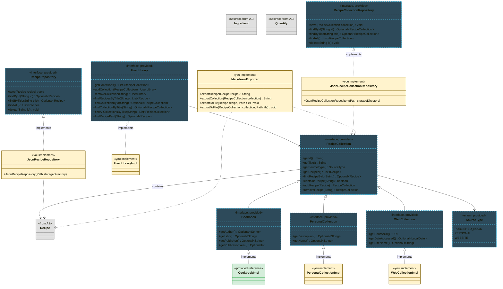

## Overview

In this assignment, you'll expand the CookYourBooks application in two major directions: **domain
modeling** and **persistence architecture**. You'll create the structures needed to organize recipes
into collections (published cookbooks, personal recipe boxes, web imports) and manage a user's
library, then implement persistence using JSON serialization and export capabilities using Markdown.

This assignment emphasizes **separating concerns** between your core domain logic and external
concerns like storage and file formats. By defining clear **repository interfaces** (what your
application needs) and **concrete implementations** (how those needs are fulfilled), you create a
system that's easier to test, maintain, and extend.

**This is the first assignment where AI assistants are encouraged.** The domain modeling and
serialization work includes plenty of design decisions and boilerplate code—perfect for practicing
effective AI collaboration.

**Due:** Thursday, February 12, 2026 at 11:59 PM Boston Time

**Prerequisites:** This assignment builds on the A2 sample implementation (provided). You should be
familiar with `Recipe`, `Quantity`, `Ingredient`, and the conversion system from Assignments 1
and 2.

**Starter Code:** We provide all interface definitions and supporting types so you can focus on
implementation and design decisions rather than transcription. See
[What's Provided](#whats-provided) for details.

![8-bit lo-fi pixel art illustration for a programming assignment cover. Kitchen/bakery setting with warm wooden cabinets and countertops in browns and tans. Scene composition (left to right): LEFT SIDE - Three source types as distinct objects: (1) a physical cookbook with "ISBN" visible, (2) a handwritten index card box labeled "Family Recipes", (3) a pixel art laptop showing a recipe website. Small recipe cards float above each. CENTER - A vintage-style "Persistence Machine" (retro filing cabinet crossed with computer terminal) with labeled buttons showing Java method names: "save()", "toJSON()", "toMarkdown()". Glowing cyan arrows flow from sources into the machine. RIGHT SIDE - Two output stacks via cyan arrows: (1) JSON files with visible "{ }" curly braces, (2) a Markdown document showing "# Recipe".  The pixel art chef stands at the machine, but beside them is a friendly glowing robot assistant (small, helpful-looking, with antenna and simple face) holding a wrench and pointing at the machine's buttons. A speech bubble from the robot shows Java code snippets. The chef and robot are clearly working together as a team. POST-IT NOTE: Yellow sticky note reading "Your first (?) AI partner project!" TOP BANNER: Metallic blue banner with white pixel text "A3: Serialize & Persist". BOTTOM TEXT: "CS 3100: Program Design & Implementation 2". SUBTLE DETAIL: Small sparkles/stars around the robot to indicate it's a helpful AI companion, not doing the work alone but assisting. Color palette: Warm browns/tans for kitchen, cyan/teal for data flow and the robot's glow, cream recipe cards. Same visual style as A2 immutability cover.](/img/assignments/web/a3.png)

:::tip How to Succeed on This Assignment

This assignment has more moving parts than previous ones. Here's a pacing strategy that works:

1. **Read this handout when it's released.** Skim the whole thing to understand the scope. You
   don't need to understand every detail yet—just get the big picture.

2. **Look at the starter code on Friday.** Open the files, read through `CookbookImpl` (the
   reference implementation), and start connecting the handout to actual code.

3. **Post questions on the discussion board.** If something in the handout or starter code
   doesn't make sense, ask. Early questions help everyone.

4. **Work incrementally over several days.** Don't try to do everything in one session. Let
   ideas settle. Come back with fresh eyes.

5. **If you're stuck for more than 30 minutes on an error: STOP.** Post on the discussion
   board, then go do something else for a few hours (or the rest of the day). Banging your head
   against an error rarely helps—stepping away often does, especially if you left a post on the discussion board asking for help.

6. **Submit early and often.** The submission limit is 15 per rolling 24 hours—that's plenty!
   Early in the week, go wild with submissions. Each one gives you free feedback from the
   autograder. Submissions early in the week don't count against your limit later, so use them
   to check your progress and catch issues early.

**The discussion board is your best resource.** As you learned in the requirements lab,
asynchronous communication has real value. Post your error publicly (anonymously or not), and course
staff can click your name to see your latest submission with your code. This lets us help point
you in the right direction—and your question helps future students with the same issue.

:::

## Learning Outcomes

By completing this assignment, you will demonstrate proficiency in:

- **Separating concerns** by defining interfaces for persistence and implementing them independently
  ([L16: Design for Testability](/lecture-notes/l16-testing2))
- **Designing repository interfaces** that abstract persistence concerns from domain logic
- **Implementing JSON serialization** with Jackson, including polymorphic type handling
- **Using AI coding assistants effectively** for boilerplate generation and design exploration
- **Evaluating AI-generated code** for design quality and alignment with specifications
- **Writing comprehensive tests** that validate behavior and detect faults in complex systems

## AI Policy for This Assignment

**This is the first assignment where AI coding assistants are encouraged.** You may (and should!)
use tools like GitHub Copilot or Cursor throughout this assignment.

:::info Why These Tools?

We specifically recommend **IDE-integrated assistants** (Copilot, Cursor) over other options:

- **Not Claude Code or similar "agentic" tools:** These tools are designed to work autonomously with
  minimal human oversight. Our course values keeping the human at the center of the development
  process—you should be reviewing, understanding, and directing every change. Agentic tools that
  make many changes without a well-designed review process automatically work against developing
  these skills. Yes, Claude Code has a VSCode extension, but it is our editorial opinion that it is
  poorly designed to support human review and iteration.

- **Not ChatGPT, Claude.ai, or other web interfaces:** Manually copying code between a browser and
  your IDE is a waste of your time. You lose the context of your codebase, can't easily iterate on
  suggestions, and spend cognitive effort on mechanics rather than thinking about design.
  IDE-integrated tools see your code directly and let you accept, reject, or modify suggestions in
  place.

The goal is **AI as a collaborative partner**, not AI as a replacement for thinking or a source of
friction in your workflow.

:::

However, effective AI usage requires skill. Simply copy-pasting the assignment into an AI and
submitting its output will likely result in:

- A learning debt: you may get a reasonable submission, but you will not have learned the concepts
  and skills required to complete the assignment and will struggle to complete future assignments.
- Random features that appear to be implemented, and upon closer inspection have a comment along the
  lines
  `// In production, you would actually implement serialization, for now we'll just use a placeholder`
- A submission that passes all autograder tests, but might lose almost all of the manual grading
  points due to poor design or test suite quality.

Instead, use AI as a **collaborative tool**:

- Break problems into smaller pieces
- Provide context about your existing code
- Review and test AI suggestions before accepting them
- Iterate when the first attempt isn't right
- Understand what the code does before submitting it

The [AI Workflow Guide](#ai-workflow-guide) section provides detailed guidance on effective AI usage
for each part of this assignment.

**You must document your AI usage** in the [Reflection](#reflection) section. This helps you develop
metacognitive skills about when and how AI assists your learning.

### Setup: Re-Enable AI Features

In [Lab 1](/labs/lab1-java-setup#disable-ai-features), you disabled AI features in VS Code to build
foundational skills. **Now it's time to turn them back on!**

To re-enable AI features:

1. Open VS Code Settings:
   - **Mac**: Press `⌘+,` (Command + comma)
   - **Windows/Linux**: Press `Ctrl+,`
2. In the search bar, type: `chat.disableAIFeatures`
3. **Uncheck** the box next to "Chat: Disable AI Features"

Or click this link: [vscode://settings/chat.disableAIFeatures](vscode://settings/chat.disableAIFeatures)

You should now see the Copilot icon in your editor and have access to chat features. If you don't
have GitHub Copilot set up yet, see the
[GitHub Copilot documentation](https://docs.github.com/en/copilot/using-github-copilot/getting-code-suggestions-in-your-ide-with-github-copilot)
for setup instructions.

## AI Workflow Guide

This section provides structured guidance for using AI assistants effectively on each part of this
assignment. The goal is not to minimize AI usage, but to maximize its effectiveness while ensuring
you understand and can defend your code.

### Task Categories

Different tasks benefit from AI assistance in different ways:

| Task Type                                             | AI Value | Strategy                                                                         |
| ----------------------------------------------------- | -------- | -------------------------------------------------------------------------------- |
| **Understanding handout code**                        | High     | Ask AI to explain unfamiliar patterns, annotations, design decisions             |
| **Boilerplate code** (Jackson annotations, getters)   | High     | Let AI generate, review for correctness                                          |
| **Design decisions** (data structures, relationships) | Moderate | Think first, then ask AI for alternatives or to expand your design into diagrams |
| **Test generation**                                   | Moderate | AI for ideas, you verify they're meaningful                                      |
| **MarkdownExporter tests**                            | High     | Format is precisely specified; AI generates tests, you verify expected values    |
| **Debugging**                                         | High     | Use scientific debugging, supported by AI                                        |

### Managing Your AI Assistant

IDE-integrated assistants like Copilot and Cursor are powerful, but require some skill to use
effectively. Here's what you need to know:

#### Copilot Chat Modes

Copilot offers different interaction modes. Choose the right one for your task:

| Mode     | What It Does                                                    | Best For                                                   |
| -------- | --------------------------------------------------------------- | ---------------------------------------------------------- |
| **Ask**  | Answers questions, explains code. Read-only—won't change files. | Understanding starter code, learning patterns, debugging   |
| **Edit** | Makes targeted changes to specific files you select.            | Small, focused edits where you know exactly what to change |
| **Agent**| Autonomously explores codebase, reads files, runs commands.     | Multi-file tasks, when AI needs to find relevant code      |

**For this assignment:** Start with **Ask** mode to understand the starter code and patterns.
Use **Edit** mode for small, focused changes. Use **Agent** mode when the AI needs to explore
your codebase to find relevant examples.

#### Project-Specific Context Limitations

AI assistants don't automatically understand all your project conventions. For example:

- The starter code uses NullAway with `@NonNull` as the default—most parameters don't need
  explicit annotations. However, an AI trained on general Java code may add `@NonNull`
  annotations everywhere because that's the common pattern in other codebases.
- Your project may have specific naming conventions, package structures, or patterns that the
  AI won't know unless you tell it.

If the AI keeps making the same mistake, add a note to your prompt: "This project uses NullAway
with @NonNull as the default, so don't add @NonNull annotations unless the existing code does."

#### Task Scope: Start Small

:::warning AI Assistants Want to "Help" Too Much

If you give an AI assistant a large, vague task ("Implement all the collection classes"), it
will often get stuck in a loop, generating and regenerating code without converging.

The AI is eager to finish the whole assignment for you. **This is not helpful for learning.**

:::

**The key principle: Only accept code you understand.**

Why this matters:

1. **Smaller changes are easier to review.** You can actually verify the code is correct.
2. **You stay in control.** If something is wrong, you know exactly where to look.
3. **You build understanding.** Reviewing small pieces teaches you the patterns.
4. **The AI produces better code.** Focused prompts get focused, accurate responses.

As you practice specifying and reviewing AI-generated code, you'll develop intuition for what
task sizes work well. Early on, err on the side of smaller tasks. You can always ask for more.

### Suggested Prompts by Task

Your IDE (Copilot, Cursor) automatically provides context from your open files and codebase. Use
this to your advantage—reference classes by name rather than describing them.

#### Domain Modeling (Cookbook, TableOfContents, UserLibrary)

**Think first, then validate with AI:**

```
I need to design a Cookbook class. See Recipe for the pattern I've been using for immutability.

Cookbook needs: title, optional author, optional ISBN, list of recipes.

I'm thinking of [your design approach]. What are the tradeoffs? Please draw a diagram of the class and its relationships to other classes in this codebase.
```

**Why think first?** Design decisions affect your entire codebase. AI can suggest patterns, but you
need to understand why you're choosing one approach over another.

#### JSON Serialization Setup

**Learn by experimenting, then use AI for debugging:**

The starter code already includes all necessary Jackson annotations on the A2 classes. Your task is
to **understand how they work** and apply similar patterns to your collection implementations.

**Step 1: Experiment with serialization by hand**

Before writing repository code, write a simple test to see how Jackson serializes your domain
objects:

```java
ObjectMapper mapper = new ObjectMapper();
mapper.registerModule(new Jdk8Module());

Recipe recipe = new Recipe(...);  // Create a test recipe
String json = mapper.writeValueAsString(recipe);
System.out.println(json);  // See the JSON structure

Recipe restored = mapper.readValue(json, Recipe.class);
assertEquals(recipe, restored);  // Verify round-trip
```

**Why experiment first?** Understanding the JSON structure helps you debug serialization issues and
design your collection serialization. You'll see how `@JsonTypeInfo` adds the `"type"` field for
polymorphic classes.

**Step 2: Apply the pattern to your collection implementations**

Your collection classes (`CookbookImpl`, etc.) need similar annotations. Use AI to help:

```
I'm implementing CookbookImpl which implements the Cookbook interface. I need to set up
Jackson annotations for polymorphic serialization, similar to how Quantity and Ingredient
are configured in the starter code.

Help me add the appropriate @JsonTypeInfo, @JsonSubTypes, and @JsonCreator annotations.
```

**Debugging prompts:**

- "The deserialization is failing with [error]. What's wrong?"
- "How do I handle the Optional fields in my collection classes?"
- "My collection deserializes as the wrong type. How do I fix this?"

#### Test Generation

**AI for ideas, you for verification:**

```
I'm testing JsonRecipeCollectionRepository. I need to verify that
different collection types (Cookbook, PersonalCollection, WebCollection)
all serialize and deserialize correctly.

Outline a comprehensive testing strategy for the JsonRecipeCollectionRepository.
```

**Critical:** AI-suggested tests may not be meaningful. For each suggestion, ask:

- Does this test a distinct behavior?
- Would this catch a real bug?
- Is the expected result correct?

### Review Checklist

Before accepting AI-generated code, verify:

- [ ] **Compiles:** Does it compile without errors?
- [ ] **Edge cases:** What happens with empty strings, empty collections, special characters?
- [ ] **Meets quality requirements:** Does the code meet the quality requirements specified in the
      assignment?
- [ ] **Tested:** Have you written tests that pass on this code?
- [ ] **Understood:** Can you explain what this code does and why? Does it have meaningful comments?

### Iteration Strategies

When AI output isn't quite right:

1. **Be specific about the problem:** "This code fails when the input is [X], I think because [Y] -
   trace through the code and identify any likely bugs that would cause this to happen"
2. **Provide context:** Explicitly refer to existing parts of your codebase that are relevant to the
   problem, or additional aspects of the specification that are relevant.
3. **Ask for explanation:** "Why did you use [approach]? What are the alternatives?"
4. **Request modifications:** "Modify this to also handle [case]"
5. **Try a different approach:** "That approach is getting complicated. Is there a simpler way?"

### Development Checkpoints

Use these checkpoints to verify your understanding and progress:

#### Checkpoint 0: Understanding the Provided Code (Start Here)

Before writing any code, use AI to understand the substantial codebase you're inheriting:

**Recommended AI Task:** Ask AI to explain the provided code. You're inheriting interfaces, domain
classes with Jackson annotations, and design patterns you may not have seen before.

**Suggested prompts:**

```
Explain the RecipeCollection interface hierarchy. What's the relationship between
RecipeCollection, Cookbook, PersonalCollection, and WebCollection?
```

```
I see @JsonTypeInfo and @JsonSubTypes annotations on the Quantity class. What do these
do and why are they needed?
```

```
Walk me through the Recipe class. What are the key fields and how does the constructor
handle null IDs?
```

```
What is the Builder pattern? Explain how CookbookImpl.Builder works and why we use it
instead of a constructor with many parameters.
```

**Goal:** Before implementing anything, you should be able to explain:

- The interface hierarchy for collections
- How Jackson polymorphic serialization annotations work
- What the Builder pattern provides
- How immutability is maintained in the domain classes

#### Checkpoint 1: After Studying CookbookImpl Reference

`CookbookImpl` is provided as a complete reference implementation. Before implementing
`PersonalCollectionImpl` and `WebCollectionImpl`:

- Verify you understand how `CookbookImpl` implements the `Cookbook` interface
- Understand the Jackson annotations (`@JsonCreator`, `@JsonProperty`) on the constructor
- Understand the Builder pattern implementation and validation logic

#### Checkpoint 2: After Implementing PersonalCollectionImpl

- Run the starter tests to verify basic functionality
- Manually serialize a `PersonalCollection` and inspect the JSON:
  ```java
  ObjectMapper mapper = new ObjectMapper();
  mapper.registerModule(new Jdk8Module());
  String json = mapper.writeValueAsString(myCollection);
  System.out.println(json);  // Verify the JSON structure
  ```
- If serialization fails, ask AI for debugging help with the specific error message

#### Checkpoint 3: Before Implementing JsonRecipeCollectionRepository

- Experiment with serialization in an isolated test
- Verify polymorphic round-trip for all collection types
- Ask AI: "How do I configure Jackson to preserve the concrete type when deserializing a
  `RecipeCollection`?"

#### Checkpoint 4: Before Writing Comprehensive Tests

- Review the mutation testing requirements in the grading rubric
- Ask AI: "What test cases would catch common bugs in a repository implementation?"

#### Checkpoint 5: MarkdownExporter Tests (AI-Recommended Task)

This is an **ideal task for AI assistance**. The format is precisely specified, making this an
excellent use of AI for mechanical test generation.

**Suggested prompt:**

```
I need to write tests for MarkdownExporter.exportRecipe(). The required format is:

# {Recipe Title}

_Serves: {servings}_

## Ingredients

- {ingredient1.toString()}
- {ingredient2.toString()}

## Instructions

{instruction1.toString()}
{instruction2.toString()}

---

_Exported from CookYourBooks, learn more at https://www.cookyourbooks.app_

Generate JUnit 5 tests covering:
- Recipe with all fields (title, servings, ingredients, instructions)
- Recipe without servings (omit the Serves line)
- Empty ingredients list
- Empty instructions list
- Multiple ingredients and instructions
- Special characters in title/ingredient names
```

**Your responsibility:** Verify each generated test has correct expected values. AI may generate
plausible-looking tests with wrong expectations.

## Technical Specifications

### Domain Concepts

#### Recipe Collections

Recipes come from many sources, and CookYourBooks needs to handle them all:

- **Published cookbooks**: Physical or digital books with ISBN, author, publisher, publication year.
  May have page numbers and a formal table of contents with chapters.
- **Personal collections**: A family recipe binder, a folder of index cards, grandmother's
  handwritten notes. Has a title and maybe some organization, but no formal publication metadata.
- **Websites**: Recipes scraped or imported from cooking websites. Has a URL, possibly a site name,
  maybe a date accessed.

Your challenge is to **implement concrete classes that fulfill these interface contracts**. The
interfaces define an inheritance hierarchy (`Cookbook`, `PersonalCollection`, `WebCollection`
extending `RecipeCollection`), and `CookbookImpl` is provided as a complete reference
implementation. Your task is to:

- Study how `CookbookImpl` implements the pattern (immutability, Builder, Jackson annotations)
- Apply the same pattern to `PersonalCollectionImpl` and `WebCollectionImpl`
- Use AI assistants effectively to understand unfamiliar patterns and generate similar code

This is an excellent opportunity to practice **AI-assisted pattern replication**—a common
real-world task where you study existing code and extend it consistently.

**Important:** Your implementations of `PersonalCollectionImpl` and `WebCollectionImpl` must include
Jackson annotations (`@JsonCreator`, `@JsonProperty`) on a private constructor for deserialization
to work. Study how `CookbookImpl` does this—the stub files provide the method signatures but you
must add the constructor and annotations following the same pattern.

#### User Library

A **user library** is a user's personal collection of recipe collections. Users might own physical
cookbooks they've digitized, maintain personal recipe collections, and save recipes from
websites—all in one unified library.

#### Architecture Overview

This assignment separates your application into layers:

1. **Model**: Your core business logic—`Recipe`, `Ingredient`, `Cookbook`, etc. No dependencies on
   external systems like files or databases.

2. **Repository Interfaces**: Contracts that define what your application needs. For example, a
   `RecipeRepository` interface defines operations like `save()` and `findById()` without specifying
   how they're implemented.

3. **Concrete Implementations**: Classes that fulfill interface contracts. A `JsonRecipeRepository`
   implements `RecipeRepository` using JSON file storage.

This separation enables:

- **Testability:** Test domain logic with mock repositories
- **Flexibility:** Swap JSON storage for a database without changing domain code
- **Clarity:** Each component has a single responsibility

### What's Provided

The starter code includes all interface definitions so you can focus on implementation:

| Provided                                  | Description                                                   |
| ----------------------------------------- | ------------------------------------------------------------- |
| `RecipeCollection.java`                   | Base interface for all collections (with Jackson annotations) |
| `Cookbook.java`                           | Interface for published cookbooks                             |
| `PersonalCollection.java`                 | Interface for personal collections                            |
| `WebCollection.java`                      | Interface for web-sourced collections                         |
| `SourceType.java`                         | Enum with `PUBLISHED_BOOK`, `PERSONAL`, `WEBSITE`             |
| `UserLibrary.java`                        | Interface for user's recipe library                           |
| `RecipeRepository.java`                   | Interface for recipe persistence                              |
| `RecipeCollectionRepository.java`         | Interface for collection persistence                          |
| `RepositoryException.java`                | Unchecked exception for persistence failures                  |
| `Recipe.java` (updated)                   | Now includes `id` field with auto-generation                  |
| `JsonRecipeRepository.java`               | Stub with ObjectMapper configuration (you complete)           |
| `JsonRecipeCollectionRepository.java`     | Stub with ObjectMapper configuration (you complete)           |
| `MarkdownExporter.java`                   | Stub class (you complete)                                     |
| **`CookbookImpl.java`**                   | **Complete reference implementation (study this!)**           |
| `PersonalCollectionImpl.java`             | Stub implementation class (you complete)                      |
| `WebCollectionImpl.java`                  | Stub implementation class (you complete)                      |
| **`UserLibraryImpl.java`**                | **Partial implementation (you complete search methods)**      |
| `RecipeCollectionTest.java`               | Starter test file (you expand)                                |
| `UserLibraryTest.java`                    | Starter test file (you expand)                                |
| **`JsonRecipeRepositoryTest.java`**       | **Comprehensive tests provided (minimal expansion needed)**   |
| `JsonRecipeCollectionRepositoryTest.java` | Starter test file (you expand)                                |
| `MarkdownExporterTest.java`               | Starter test file (you expand)                                |

### What You Implement

| Your Code                        | Description                                                                |
| -------------------------------- | -------------------------------------------------------------------------- |
| `PersonalCollectionImpl`         | Implement following `CookbookImpl` pattern                                 |
| `WebCollectionImpl`              | Implement following `CookbookImpl` pattern                                 |
| `UserLibraryImpl` (4 methods)    | Complete the search methods (partial implementation provided)              |
| `JsonRecipeRepository`           | Complete the provided stub                                                 |
| `JsonRecipeCollectionRepository` | Complete the provided stub                                                 |
| `MarkdownExporter`               | Complete the provided stub                                                 |
| Test files                       | Expand starter tests (except `JsonRecipeRepositoryTest` which is provided) |

### Class Design

The diagram below shows the complete architecture. **Blue dashed classes are provided interfaces**;
**yellow classes are what you implement**.


```mermaid
classDiagram
    direction TB

    %% A1/A2 classes (context)
    class Recipe {
        <<from A2>>
    }
    class Ingredient {
        <<abstract, from A1>>
    }
    class Quantity {
        <<abstract, from A1>>
    }

    %% Provided interface hierarchy for collections
    class RecipeCollection {
        <<interface, provided>>
        +getId() String
        +getTitle() String
        +getSourceType() SourceType
        +getRecipes() List~Recipe~
        +findRecipeById(String) Optional~Recipe~
        +containsRecipe(String) boolean
        +addRecipe(Recipe) RecipeCollection
        +removeRecipe(String) RecipeCollection
    }

    class Cookbook {
        <<interface, provided>>
        +getAuthor() Optional~String~
        +getIsbn() Optional~String~
        +getPublisher() Optional~String~
        +getPublicationYear() OptionalInt
    }

    class PersonalCollection {
        <<interface, provided>>
        +getDescription() Optional~String~
        +getNotes() Optional~String~
    }

    class WebCollection {
        <<interface, provided>>
        +getSourceUrl() URI
        +getDateAccessed() Optional~LocalDate~
        +getSiteName() Optional~String~
    }

    class SourceType {
        <<enum, provided>>
        PUBLISHED_BOOK
        PERSONAL
        WEBSITE
    }

    %% Reference implementation (provided)
    class CookbookImpl {
        <<provided reference>>
    }

    %% Student implementations
    class PersonalCollectionImpl {
        <<you implement>>
    }

    class WebCollectionImpl {
        <<you implement>>
    }

    class UserLibrary {
        <<interface, provided>>
        +getCollections() List~RecipeCollection~
        +addCollection(RecipeCollection) UserLibrary
        +removeCollection(String) UserLibrary
        +findRecipesByTitle(String) List~Recipe~
        +findCollectionById(String) Optional~RecipeCollection~
        +findCollectionByTitle(String) Optional~RecipeCollection~
        +findAllCollectionsByTitle(String) List~RecipeCollection~
        +findRecipeById(String) Optional~Recipe~
    }

    class UserLibraryImpl {
        <<you implement>>
    }

    %% Provided repository interfaces
    class RecipeRepository {
        <<interface, provided>>
        +save(Recipe recipe) void
        +findById(String id) Optional~Recipe~
        +findByTitle(String title) Optional~Recipe~
        +findAll() List~Recipe~
        +delete(String id) void
    }

    class RecipeCollectionRepository {
        <<interface, provided>>
        +save(RecipeCollection collection) void
        +findById(String id) Optional~RecipeCollection~
        +findByTitle(String title) Optional~RecipeCollection~
        +findAll() List~RecipeCollection~
        +delete(String id) void
    }

    %% Student implementations
    class JsonRecipeRepository {
        <<you implement>>
        +JsonRecipeRepository(Path storageDirectory)
    }

    class JsonRecipeCollectionRepository {
        <<you implement>>
        +JsonRecipeCollectionRepository(Path storageDirectory)
    }

    class MarkdownExporter {
        <<you implement>>
        +exportRecipe(Recipe recipe) String
        +exportCollection(RecipeCollection collection) String
        +exportToFile(Recipe recipe, Path file) void
        +exportToFile(RecipeCollection collection, Path file) void
    }

    %% Inheritance relationships
    RecipeCollection <|-- Cookbook
    RecipeCollection <|-- PersonalCollection
    RecipeCollection <|-- WebCollection

    Cookbook <|.. CookbookImpl : implements
    PersonalCollection <|.. PersonalCollectionImpl : implements
    WebCollection <|.. WebCollectionImpl : implements

    RecipeCollection --> Recipe : contains
    RecipeCollection --> SourceType
    UserLibrary --> RecipeCollection
    UserLibrary <|.. UserLibraryImpl : implements

    RecipeRepository <|.. JsonRecipeRepository : implements
    RecipeCollectionRepository <|.. JsonRecipeCollectionRepository : implements

    JsonRecipeRepository ..> Recipe
    JsonRecipeCollectionRepository ..> RecipeCollection
    MarkdownExporter ..> Recipe
    MarkdownExporter ..> RecipeCollection

    %% Styling
    style Recipe fill:#e0e0e0,stroke:#999
    style Ingredient fill:#e0e0e0,stroke:#999
    style Quantity fill:#e0e0e0,stroke:#999

    style RecipeCollection fill:#2d4a5a,stroke:#4ac,stroke-width:2px,stroke-dasharray: 5 5
    style Cookbook fill:#2d4a5a,stroke:#4ac,stroke-width:2px,stroke-dasharray: 5 5
    style PersonalCollection fill:#2d4a5a,stroke:#4ac,stroke-width:2px,stroke-dasharray: 5 5
    style WebCollection fill:#2d4a5a,stroke:#4ac,stroke-width:2px,stroke-dasharray: 5 5
    style RecipeRepository fill:#2d4a5a,stroke:#4ac,stroke-width:2px,stroke-dasharray: 5 5
    style RecipeCollectionRepository fill:#2d4a5a,stroke:#4ac,stroke-width:2px,stroke-dasharray: 5 5
    style SourceType fill:#2d4a5a,stroke:#4ac,stroke-width:2px,stroke-dasharray: 5 5
    style UserLibrary fill:#2d4a5a,stroke:#4ac,stroke-width:2px,stroke-dasharray: 5 5

    style CookbookImpl fill:#d4edda,stroke:#28a745
    style PersonalCollectionImpl fill:#fff3cd,stroke:#856404
    style WebCollectionImpl fill:#fff3cd,stroke:#856404
    style UserLibraryImpl fill:#fff3cd,stroke:#856404
    style JsonRecipeRepository fill:#fff3cd,stroke:#856404
    style JsonRecipeCollectionRepository fill:#fff3cd,stroke:#856404
    style MarkdownExporter fill:#fff3cd,stroke:#856404
```

**Legend:**

- **Gray classes**: From A1/A2 (provided in starter code)
- **Blue dashed classes**: Interfaces (provided in starter code)
- **Green classes**: Reference implementations (provided, study these)
- **Yellow classes**: Classes you implement

### Recipe ID Field

The `RecipeRepository` interface requires recipes to have unique identifiers for `findById()` and
`delete()` operations. The starter code already includes an `id` field in `Recipe`:

```java
// Recipe constructor now accepts an optional id parameter:
public Recipe(
    @Nullable String id,  // null = auto-generate UUID
    String title,
    @Nullable Quantity servings,
    List<Ingredient> ingredients,
    List<Instruction> instructions,
    List<ConversionRule> conversionRules)

// Recipe now has:
public @NonNull String getId()  // Returns the unique identifier
```

IDs are auto-generated as UUIDs if not explicitly set (when `id` parameter is null). This ensures
globally unique identifiers with near-zero collision probability. When a caller provides an `id`, it
is assumed that the caller guarantees uniqueness.

**Note:** Repository implementations assume IDs do not contain special characters that would be
invalid in filenames. Auto-generated UUIDs satisfy this constraint.

### Provided Interfaces

The following interfaces are **provided in starter code**. You must implement them but don't need to
create the interface files. You must not modify the provided interfaces.

#### Collection Interfaces (Provided)

| Interface            | Extends            | Key Methods                                                                                                                         |
| -------------------- | ------------------ | ----------------------------------------------------------------------------------------------------------------------------------- |
| `RecipeCollection`   | —                  | `getId()`, `getTitle()`, `getSourceType()`, `getRecipes()`, `findRecipeById()`, `containsRecipe()`, `addRecipe()`, `removeRecipe()` |
| `Cookbook`           | `RecipeCollection` | `getAuthor()`, `getIsbn()`, `getPublisher()`, `getPublicationYear()`                                                                |
| `PersonalCollection` | `RecipeCollection` | `getDescription()`, `getNotes()`                                                                                                    |
| `WebCollection`      | `RecipeCollection` | `getSourceUrl()`, `getDateAccessed()`, `getSiteName()`                                                                              |

All collection implementations must be **immutable**—transformation methods like `addRecipe()`
return new objects.

**Behavioral Specifications:**

- **`findRecipeById(String)`**: Returns the recipe with the given ID, or `Optional.empty()` if not
  found.
- **`containsRecipe(String)`**: Returns `true` if a recipe with the given ID exists in this
  collection.
- **`addRecipe(Recipe)`**: Appends the recipe to the end of the list. Throws
  `IllegalArgumentException` if a recipe with the same ID already exists in the collection.
- **`removeRecipe(String)`**: Returns a new collection with the recipe removed. Throws
  `IllegalArgumentException` if no recipe with the given ID exists in the collection.
- **Recipe Order**: Recipe order is preserved and significant for equality comparisons.
- **Equality**: Two collections are equal if they have the same ID, title, source type,
  type-specific metadata, and recipes (in the same order). The collection ID is part of equality.

**Note on Optional Fields:** All optional fields in collection interfaces return `Optional<T>` to
clearly signal when a value is not specified. This includes both String fields (e.g.,
`Cookbook.getAuthor()` returns `Optional<String>`) and non-String fields (e.g.,
`Cookbook.getPublicationYear()` returns `OptionalInt`, `WebCollection.getDateAccessed()` returns
`Optional<LocalDate>`). Using `Optional` consistently provides type safety and forces explicit
handling of missing values.

**Blank String Handling:** Blank strings (empty or whitespace-only) for optional String fields are
treated as absent and must return `Optional.empty()`. For example, if a `Cookbook` is constructed
with `author = ""`, then `getAuthor()` must return `Optional.empty()`.

#### `SourceType` (Provided)

```java
public enum SourceType {
    PUBLISHED_BOOK,  // Published cookbook with ISBN, author, publisher
    PERSONAL,        // Personal recipe collection (family recipes, etc.)
    WEBSITE          // Recipes imported from a website
}
```

#### Metadata by Collection Type

| Interface            | Required Fields   | Optional Fields                           |
| -------------------- | ----------------- | ----------------------------------------- |
| `Cookbook`           | title             | author, ISBN, publisher, publication year |
| `PersonalCollection` | title             | description, notes                        |
| `WebCollection`      | title, source URL | date accessed, site name                  |

**Blank String Handling for WebCollection:** The `siteName` field follows the same blank string
normalization as other optional String fields—blank strings (empty or whitespace-only) are treated
as absent and `getSiteName()` must return `Optional.empty()`.

**Optional Field Conventions:**

- All optional fields return `Optional<T>`; use `Optional.empty()` to signal "not specified"
- This includes both String fields (author, ISBN, publisher, description, notes, site name) and
  non-String fields (publication year, date accessed)
- Using `Optional` consistently provides type safety and makes the API more explicit about missing
  values

### Your Implementation: Collection Classes

You must provide concrete classes that implement each collection interface. **How you structure your
implementations is a design decision**.

**Required Implementation Names and Builders:**

Each collection type must have a named implementation class with a builder for construction:

| Interface            | Implementation Class     | Builder                            |
| -------------------- | ------------------------ | ---------------------------------- |
| `Cookbook`           | `CookbookImpl`           | `CookbookImpl.builder()`           |
| `PersonalCollection` | `PersonalCollectionImpl` | `PersonalCollectionImpl.builder()` |
| `WebCollection`      | `WebCollectionImpl`      | `WebCollectionImpl.builder()`      |

Each builder must support:

- `id(String)` — optional, auto-generates UUID if not set
- `title(String)` — required
- `recipes(List<Recipe>)` — defaults to empty list if not set
- Type-specific fields (e.g., `author(String)` for `CookbookImpl`)
- `build()` — returns the constructed collection

**Builder Validation:**

- Calling `build()` without setting `title` throws `IllegalStateException`
- Calling `title()` with a blank string (empty or whitespace-only) throws `IllegalArgumentException`
  immediately (not at `build()` time)
- Calling `recipes()` with a list containing duplicate recipe IDs throws `IllegalArgumentException`
- For `WebCollectionImpl`: calling `build()` without setting `sourceUrl` throws
  `IllegalStateException` (since `sourceUrl` is required)
- All builder methods require non-null arguments where applicable (enforced by NullAway at compile
  time)

Example usage:

```java
Cookbook cookbook = CookbookImpl.builder()
    .title("The Joy of Cooking")
    .author("Irma S. Rombauer")
    .publicationYear(1931)
    .build();
```

**What We Test:**

We test through the interfaces and `RecipeCollectionRepository`:

- `save()` followed by `findById()` returns an equal collection
- `getSourceType()` returns the correct type after round-trip
- `getRecipes()` returns all recipes after round-trip
- Type-specific methods (e.g., `getAuthor()` on `Cookbook`) return correct values after round-trip
- Polymorphism is preserved: saving a `Cookbook` and loading it returns a `Cookbook`, not just a
  `RecipeCollection`

Document your implementation approach and rationale in your reflection.

### Your Implementation: UserLibraryImpl

A user's collection of recipe collections. The `UserLibrary` interface is **provided** and defines
the core operations:

| Method                                    | Description                                                            |
| ----------------------------------------- | ---------------------------------------------------------------------- |
| `getCollections()`                        | Returns all collections in the library (order unspecified)             |
| `addCollection(RecipeCollection)`         | Returns new library with collection added                              |
| `removeCollection(String collectionId)`   | Returns new library with collection removed                            |
| `findRecipesByTitle(String title)`        | Searches recipes across all collections (case-insensitive exact match) |
| `findCollectionById(String id)`           | Finds a collection by ID                                               |
| `findCollectionByTitle(String title)`     | Finds a collection by title (case-insensitive exact match)             |
| `findAllCollectionsByTitle(String title)` | Finds all collections with the given title                             |
| `findRecipeById(String id)`               | Finds a recipe by ID across all collections                            |

**Behavioral Specifications:**

- **`addCollection(RecipeCollection)`**: Throws `IllegalArgumentException` if a collection with the
  same ID already exists. Collections with different IDs but the same title are both kept.
- **`removeCollection(String collectionId)`**: Returns a new library with the collection removed.
  Throws `IllegalArgumentException` if no collection with the given ID exists.
- **`findRecipesByTitle(String title)`**: Returns all recipes whose titles match the given title
  exactly (case-insensitive). The order of results is unspecified.
- **`findCollectionByTitle(String title)`**: Returns any collection whose title matches the given
  title exactly (case-insensitive). If multiple collections have the same title, which one is
  returned is implementation-defined.
- **`findAllCollectionsByTitle(String title)`**: Returns all collections whose titles match the
  given title exactly (case-insensitive). The order of results is unspecified.
- **`findRecipeById(String id)`**: Searches all collections for a recipe with the given ID. Returns
  `Optional.empty()` if not found in any collection. If the same recipe ID exists in multiple
  collections (which should not normally occur), behavior is undefined.

**Implementation Requirements:**

- Your implementation must be named `UserLibraryImpl`
- Provide a constructor: `public UserLibraryImpl(List<RecipeCollection> collections)`
- An empty library can be created with `new UserLibraryImpl(List.of())`
- The library must be immutable—transformation methods return new instances
- The constructor does NOT validate for duplicate collection IDs—it accepts the list as provided.
  Duplicate ID validation only occurs when calling `addCollection()`.

**Persistence Note:** `UserLibrary` is an in-memory convenience wrapper for working with multiple
collections. There is no `UserLibraryRepository`—persistence happens at the collection level via
`RecipeCollectionRepository`. To persist a library, save each collection individually. To restore a
library, load all collections with `findAll()` and pass them to the `UserLibraryImpl` constructor.

**Design Freedom:**

You may add additional methods beyond the interface (e.g., `getCollectionCount()`, search by
ingredient, filter by source type). These are not tested at the interface level but may be useful
for your application.

### Repository Interfaces (Provided)

Both repository interfaces are **provided in starter code**, along with `RepositoryException`.

| Interface                    | Methods                                                                                                                      |
| ---------------------------- | ---------------------------------------------------------------------------------------------------------------------------- |
| `RecipeRepository`           | `save(Recipe)`, `findById(String)`, `findByTitle(String)`, `findAllByTitle(String)`, `findAll()`, `delete(String)`           |
| `RecipeCollectionRepository` | `save(RecipeCollection)`, `findById(String)`, `findByTitle(String)`, `findAllByTitle(String)`, `findAll()`, `delete(String)` |

**Key behaviors:**

- `save()` replaces existing items with the same ID
- `findByTitle()` uses case-insensitive exact match; returns any one match if multiple exist (which
  match is returned is implementation-defined)
- `findAllByTitle()` returns all items with the given title (case-insensitive exact match); order is
  unspecified
- `findAll()` returns all items; order is unspecified
- `delete()` is a no-op if the item doesn't exist (idempotent for safe retries)
- All methods throw `RepositoryException` (unchecked) on I/O failures
- **Title uniqueness is NOT enforced**: Repositories may contain multiple items with the same title

**Note on delete behavior:** Repository `delete()` is idempotent (no-op if item doesn't exist) to
support safe retries in persistence operations. In contrast, domain object methods like
`RecipeCollection.removeRecipe()` and `UserLibrary.removeCollection()` throw
`IllegalArgumentException` if the item doesn't exist—this enforces business rules and catches
programming errors early.

### Your Implementation: JSON Repositories

You must implement both repository interfaces using JSON file storage.

#### `JsonRecipeRepository`

**Constructor:**

- `public JsonRecipeRepository(@NonNull Path storageDirectory)`
  - Creates the directory if it doesn't exist
  - Throws `RepositoryException` if directory creation fails
  - Throws `RepositoryException` if the path exists but is not a directory
  - Throws `RepositoryException` if the directory contains corrupt or invalid JSON files when
    accessed (during `findAll()`, `findById()`, etc.)

**Requirements:**

- Must correctly serialize and deserialize all `Quantity` and `Ingredient` subtypes
- Must handle the polymorphic type hierarchy (see
  [Polymorphic Serialization](#polymorphic-serialization))
- Round-trip correctness: `save(recipe)` followed by `findById(id)` must return an equal recipe
- Must throw `RepositoryException` when encountering corrupt or invalid JSON files

**Design Decisions (yours to make):**

- JSON structure and field names
- How to encode type information for polymorphic classes

#### `JsonRecipeCollectionRepository`

Same requirements as `JsonRecipeRepository`, plus:

1. **Polymorphic collections:** Your JSON serialization must handle collection type
   polymorphism—saving a `Cookbook` and loading it back must return a `Cookbook`, not a generic
   `RecipeCollection`.

2. **Nested recipes:** Collections contain recipes. The simplest approach is to embed recipes
   directly in the collection JSON, which the provided Jackson annotations already support. This
   keeps each collection file self-contained.

### Your Implementation: MarkdownExporter

Exports recipes and recipe collections to Markdown format.

**Constructor:**

- `public MarkdownExporter()` — no-arg constructor (stateless exporter)

**Required Methods:**

- `@NonNull String exportRecipe(@NonNull Recipe recipe)` - Returns the recipe as a Markdown string
- `@NonNull String exportCollection(@NonNull RecipeCollection collection)` - Returns the collection
  as a Markdown string
- `void exportToFile(@NonNull Recipe recipe, @NonNull Path file)` - Writes recipe to file; throws
  `RepositoryException` if the file cannot be written
- `void exportToFile(@NonNull RecipeCollection collection, @NonNull Path file)` - Writes collection
  to file; throws `RepositoryException` if the file cannot be written

**Required Recipe Format:**

The `exportRecipe` method must produce output in this exact format:

```markdown
# {Recipe Title}

_Serves: {servings}_

## Ingredients

- {ingredient1.toString()}
- {ingredient2.toString()}

## Instructions

{instruction1.toString()}
{instruction2.toString()}

---

_Exported from CookYourBooks, learn more at https://www.cookyourbooks.app_
```

**Format Details:**

- If recipe has no servings, omit the `_Serves: ..._` line entirely (no extra blank line—the title
  is followed by a single blank line, then `## Ingredients`)
- Use `Ingredient.toString()` for ingredient formatting (from A1)
- Use `Instruction.toString()` for each instruction (includes step number and text, e.g., "1. Mix
  ingredients")
- The footer `---` and `_Exported from CookYourBooks, learn more at https://www.cookyourbooks.app_`
  are required
- Use Unix line endings (`\n`)
- If ingredients list is empty, include the `## Ingredients` header with no list items
- If instructions list is empty, include the `## Instructions` header with no list items
- Titles and ingredient names are included as-is without escaping markdown special characters

**Required Collection Format:**

The `exportCollection` method must produce output in this exact format:

```markdown
## {Collection Title}

{metadata line - see below}

---

# {Recipe 1 Title}

...recipe format as specified above...

---

# {Recipe 2 Title}

...recipe format as specified above...
```

**Metadata Line by Collection Type:**

| Collection Type      | Metadata Line Format                       | Example                                        |
| -------------------- | ------------------------------------------ | ---------------------------------------------- |
| `Cookbook`           | `_By: {author}_` (if author present)       | `_By: Julia Child_`                            |
| `PersonalCollection` | `_{description}_` (if description present) | `_Family recipes passed down for generations_` |
| `WebCollection`      | `_Source: {url}_`                          | `_Source: https://example.com/recipes_`        |

**Format Details:**

- Collection title uses H2 (`##`) to distinguish from recipe titles (H1)
- Metadata line is omitted entirely if the optional field is not present
- Recipes are separated by `---` (horizontal rule)
- If a collection has no recipes, include only the header and metadata (no `---` separators, no
  footer)
- Each recipe within the collection uses the recipe format **without** the individual recipe footer.
  Only the final recipe in the collection includes the CookYourBooks footer.
- Use Unix line endings (`\n`)

**Example: Cookbook with one recipe:**

```markdown
## The Joy of Cooking

_By: Irma Rombauer_

---

# Chocolate Cake

_Serves: 8 whole_

## Ingredients

- 2 cup flour
- 1 cup sugar

## Instructions

1. Preheat oven to 350°F
2. Mix dry ingredients

---

_Exported from CookYourBooks, learn more at https://www.cookyourbooks.app_
```

**Testing Note:** The format is fully specified, making this an excellent task for AI-assisted test
generation. See [Checkpoint 5](#checkpoint-5-markdownexporter-tests-ai-recommended-task) in the AI
Workflow Guide for suggested prompts.

### Polymorphic Serialization

The `Quantity` and `Ingredient` class hierarchies require special handling during JSON serialization
because Jackson needs to know which subclass to instantiate during deserialization.

#### Pre-Configured Jackson Annotations

**We have already added all necessary Jackson annotations to the A2 starter code.** This includes:

- `@JsonTypeInfo` and `@JsonSubTypes` on the abstract base classes (`Quantity`, `Ingredient`)
- `@JsonCreator` and `@JsonProperty` on all constructors (`Recipe`, `Instruction`, `ExactQuantity`,
  `FractionalQuantity`, `RangeQuantity`, `MeasuredIngredient`, `VagueIngredient`)

**Records** (`IngredientRef`, `ConversionRule`) work automatically with Jackson 2.12+ without
additional annotations.

:::tip Test Serialization By Hand

Before implementing your repositories, we strongly encourage you to **experiment with Jackson
serialization directly**. Write a simple test that:

1. Creates a `Recipe` with various `Quantity` and `Ingredient` types
2. Serializes it to JSON using `ObjectMapper.writeValueAsString()`
3. Prints the JSON to see the structure
4. Deserializes it back using `ObjectMapper.readValue()`
5. Verifies the round-trip produces an equal object

This hands-on experimentation will help you understand how the annotations work and what JSON
structure your repository will produce. Understanding the serialization format is essential for
debugging issues later.

:::

#### How the Annotations Work

For polymorphic hierarchies, `@JsonTypeInfo` and `@JsonSubTypes` annotations on the base class tell
Jackson how to handle subclasses. Combined with `@JsonCreator` on subclass constructors, this gives
Jackson everything it needs:

```java
// On the abstract base class:
@JsonTypeInfo(use = JsonTypeInfo.Id.NAME, property = "type")
@JsonSubTypes({
  @JsonSubTypes.Type(value = ExactQuantity.class, name = "exact"),
  @JsonSubTypes.Type(value = FractionalQuantity.class, name = "fractional"),
  @JsonSubTypes.Type(value = RangeQuantity.class, name = "range")
})
public abstract class Quantity {
  // ...
}

// On each subclass constructor:
public final class ExactQuantity extends Quantity {
  private final double amount;

  @JsonCreator
  public ExactQuantity(
      @JsonProperty("amount") double amount,
      @JsonProperty("unit") @NonNull Unit unit) {
    super(unit);
    // validation and initialization
  }
}
```

**How it works:**

- `@JsonTypeInfo` tells Jackson to include a `"type"` field in the JSON
- `@JsonSubTypes` maps type names (`"exact"`, `"fractional"`, etc.) to Java classes
- `@JsonCreator` on subclass constructors tells Jackson how to instantiate each type

**Example JSON output:**

```json
{
  "type": "exact",
  "amount": 2.5,
  "unit": "CUP"
}
```

**Note on architecture:** Using Jackson annotations in domain classes introduces a dependency on
Jackson. However, these are **metadata annotations only**—they don't change your domain logic or
require Jackson at runtime unless you're serializing. For this course, we consider this an
acceptable tradeoff for simplicity.

#### Alternative: Custom Serializers

If you want to keep domain classes completely annotation-free, you can write custom `JsonSerializer`
and `JsonDeserializer` implementations. However, this requires significantly more code and is
generally not worth the added complexity for this assignment.

### `equals()` and `hashCode()` Requirements

Implement `equals()` and `hashCode()` for all your domain classes. The specific equality semantics
depend on your design, but must satisfy:

- **Collection equality:** Two collections with the same ID, title, source type, type-specific
  metadata, and recipes (in the same order) should be equal
- **Consistent with serialization:** If two objects serialize to the same JSON, they should be equal
- **Performance:** It is trivial to satisfy these requirements by serializing and deserializing the
  objects. This is a huge performance penalty and should be avoided.

For example, if you have a `Cookbook` class with author and ISBN fields, two cookbooks with the same
ID, title, author, ISBN, and recipes should be equal.

### Design Requirements

- **Immutability:** All domain objects must be immutable. Transformation methods return new objects.
- **Separation of concerns:** Domain classes must not depend on Jackson, file I/O, or persistence
  implementations
- **Interface abstraction:** Code using repositories should depend on the interface, not
  `JsonRecipeRepository`
- **Null safety:** Use `@NonNull` and `@Nullable` annotations from JSpecify. Null parameters are
  enforced statically by NullAway—you do not need to throw exceptions for null arguments at runtime.
  Methods documented as requiring non-null parameters may assume the caller provides non-null
  values.
- **Documentation:** Javadoc for all public classes and methods
- **Exception handling:** Use `RepositoryException` (unchecked) for persistence failures

### Testing Requirements

Testing follows the same model as Assignments 1 and 2:

- **You must write tests** for all components you implement. **Your tests must be written to the
  interface provided, not to your implementation.**
- **Implementation points require tests:** You only receive points for implementation if you have
  tests that detect plausible bugs
- **Mutation testing:** Your tests are run against intentionally buggy implementations
- **Reference implementation:** All your tests must pass on the instructor's reference
  implementation

**Required Test Files:**

Starter test files are provided in `src/test/java/app/cookyourbooks/`. You must expand these with
your own tests:

| Test File                                          | What to Test                                                                 |
| -------------------------------------------------- | ---------------------------------------------------------------------------- |
| `model/RecipeCollectionTest.java`                  | Collection classes: construction, immutable transformations, equals/hashCode |
| `model/UserLibraryTest.java`                       | Library operations, recipe search across collections                         |
| `adapters/JsonRecipeCollectionRepositoryTest.java` | Collection persistence, polymorphic collection types, nested recipes         |
| `adapters/MarkdownExporterTest.java`               | Recipe format correctness; collection round-trip properties                  |

**Note:** `JsonRecipeRepositoryTest.java` is provided with comprehensive tests and does not require
expansion. It is not graded but serves as a reference for testing patterns.

**Testing Guidance:**

- **Round-trip tests:** `save(obj)` then `findById(id)` should return equal object
- **Polymorphism tests:** Verify that all your collection types (Cookbook, PersonalCollection, etc.)
  serialize and deserialize to the correct type
- **Recipe polymorphism:** Verify that `ExactQuantity`, `FractionalQuantity`, `RangeQuantity`,
  `MeasuredIngredient`, and `VagueIngredient` all serialize/deserialize correctly within collections
- **Format tests:** For `exportRecipe`, test exact string matches against expected Markdown output
- **Round-trip tests for export:** For `exportCollection`, we provide a starter test. Expand it to
  verify all recipe content and metadata appears in output (do not test exact format)
- **Edge cases:** Empty collections, null optional fields, special characters in names
- **Error cases:** Invalid input should throw appropriate exceptions

:::warning Avoid Fragile Tests

Several methods have **unspecified ordering**: `findAll()`, `findAllByTitle()`,
`UserLibrary.getCollections()`, and `UserLibrary.findRecipesByTitle()` do not guarantee any
particular order of results.

**Do NOT write tests that depend on a specific order.** For example:

```java
// BAD: Assumes specific order - will fail on valid implementations
List<Recipe> results = repository.findAll();
assertEquals("Chocolate Cake", results.get(0).getTitle());
assertEquals("Vanilla Cake", results.get(1).getTitle());

// GOOD: Order-independent assertion
List<Recipe> results = repository.findAll();
assertEquals(2, results.size());
assertTrue(results.stream().anyMatch(r -> r.getTitle().equals("Chocolate Cake")));
assertTrue(results.stream().anyMatch(r -> r.getTitle().equals("Vanilla Cake")));
```

Similarly, `findByTitle()` returns "any one match" when multiple items share the same title. Tests
should not assume which match is returned.

Tests that fail on correct implementations due to ordering assumptions will not receive credit.

:::

**AI and Testing:**

AI can help generate test cases, but you must verify:

- The test actually tests something meaningful
- The expected values are correct
- Edge cases are covered
- The test would catch real bugs

## Reflection

Complete the **6 reflection questions** in `REFLECTION.md`. Each question is worth 4 points (24
points total). The questions cover:

1. **AI-Assisted Pattern Replication** - Describe how you used AI to understand the `CookbookImpl`
   reference implementation and apply its patterns to your other collection implementations. What
   prompts were effective? What did you have to (or choose to) figure out yourself?
2. **Architecture and Testability** - Specific examples of interface abstraction benefits
3. **JSON Serialization** - How polymorphic serialization works with Jackson annotations
4. **AI Effectiveness** - Which tasks AI helped most/least and why
5. **AI for Understanding Code** - How you used AI to understand the provided handout code
6. **AI Iteration** - A specific case where AI-generated code needed refinement

See `REFLECTION.md` for the complete question prompts and grading rubric.

## Quality Requirements

Your submission should demonstrate:

- **Correctness:** Code compiles, follows specifications, passes tests
- **Design Quality**: Appropriate use of interfaces, immutability, information hiding
- **Documentation:** Clear Javadoc with design decisions explained
- **Code Quality**: Clean, readable code following course style conventions

## Grading Rubric

_[To be finalized after API review]_

### Automated Grading (76 points)

#### Implementation Correctness (40 points)

Your code is tested against a comprehensive instructor test suite:

| Component                                                 | Points |
| --------------------------------------------------------- | ------ |
| `RecipeCollection` domain model (tested via repository)   | 10     |
| `UserLibrary`                                             | 4      |
| `RecipeRepository` interface compliance                   | 2      |
| `RecipeCollectionRepository` interface compliance         | 2      |
| `JsonRecipeRepository` (round-trip correctness)           | 6      |
| `JsonRecipeCollectionRepository` (round-trip correctness) | 8      |
| `MarkdownExporter` (`exportRecipe` format correctness)    | 4      |
| `MarkdownExporter` (`exportCollection` format)            | 2      |
| `MarkdownExporter` (`exportToFile` file I/O)              | 2      |

#### Test Suite Quality (36 points)

Your tests are evaluated using mutation testing as in the previous assignments:

| Test File                                 | Points | Notes                                      |
| ----------------------------------------- | ------ | ------------------------------------------ |
| `RecipeCollectionTest.java`               | 10     | Key focus: your collection implementations |
| `UserLibraryTest.java`                    | 4      | Test search methods you implement          |
| `JsonRecipeCollectionRepositoryTest.java` | 12     | Main challenge: polymorphic collections    |
| `MarkdownExporterTest.java`               | 10     | AI-recommended task (see checkpoints)      |

**Notes:**

- You only receive implementation points if you also have tests that detect bugs in that component.
- `MarkdownExporterTest.java` is an excellent task for AI assistance—the format is precisely
  specified. See the AI Workflow Guide for suggested prompts.

### Manual Grading (Subtractive, max -30 points)

| Category          | Max Deduction | Criteria                                                                                      |
| ----------------- | ------------- | --------------------------------------------------------------------------------------------- |
| **Architecture**  | -16           | Domain depends on persistence implementations; missing interface abstractions; tight coupling |
| **Immutability**  | -6            | Mutable domain objects; exposed internal collections                                          |
| **Documentation** | -4            | Missing Javadoc; undocumented design decisions                                                |
| **Test Quality**  | -6            | Trivial tests; tests don't verify meaningful behavior                                         |
| **Code Style**    | -10           | Poor naming; overly complex logic; inconsistent style                                         |

### Reflection (24 points)

See `REFLECTION.md` for the 6 reflection questions and detailed rubric. Each question is worth 4
points (6 questions × 4 points = 24 points total).

### Repository Structure

Your final repository should include:

```
src/
├── main/java/app/cookyourbooks/
│   ├── model/
│   │   ├── RecipeCollection.java          (PROVIDED - interface)
│   │   ├── Cookbook.java                  (PROVIDED - interface)
│   │   ├── PersonalCollection.java        (PROVIDED - interface)
│   │   ├── WebCollection.java             (PROVIDED - interface)
│   │   ├── SourceType.java                (PROVIDED - enum)
│   │   ├── UserLibrary.java               (PROVIDED - interface)
│   │   ├── CookbookImpl.java              (PROVIDED - stub, YOU COMPLETE)
│   │   ├── PersonalCollectionImpl.java    (PROVIDED - stub, YOU COMPLETE)
│   │   ├── WebCollectionImpl.java         (PROVIDED - stub, YOU COMPLETE)
│   │   ├── UserLibraryImpl.java           (PROVIDED - stub, YOU COMPLETE)
│   │   └── ... (A1/A2 classes, provided)
│   ├── repository/
│   │   ├── RecipeRepository.java          (PROVIDED - interface)
│   │   ├── RecipeCollectionRepository.java (PROVIDED - interface)
│   │   └── RepositoryException.java       (PROVIDED)
│   └── adapters/
│       ├── JsonRecipeRepository.java      (PROVIDED - stub, YOU COMPLETE)
│       ├── JsonRecipeCollectionRepository.java (PROVIDED - stub, YOU COMPLETE)
│       └── MarkdownExporter.java          (PROVIDED - stub, YOU COMPLETE)
└── test/java/app/cookyourbooks/
    ├── model/
    │   ├── RecipeCollectionTest.java      (PROVIDED - starter, YOU EXPAND)
    │   └── UserLibraryTest.java           (PROVIDED - starter, YOU EXPAND)
    └── adapters/
        ├── JsonRecipeRepositoryTest.java  (PROVIDED - starter, YOU EXPAND)
        ├── JsonRecipeCollectionRepositoryTest.java (PROVIDED - starter, YOU EXPAND)
        └── MarkdownExporterTest.java      (PROVIDED - starter, YOU EXPAND)
```

File names in `[brackets]` may vary based on your design decisions.

Good luck! Remember: this assignment is designed to help you develop effective AI collaboration
skills. Use AI assistants thoughtfully, test rigorously, and reflect on what works.

---

## Appendix: JSON and Jackson Primer

This appendix provides background on JSON and the Jackson library for students who haven't worked
with JSON serialization before.

### What is JSON?

**JSON (JavaScript Object Notation)** is a lightweight text format for storing and exchanging data.
Despite "JavaScript" in the name, JSON is language-independent and has become the de facto standard
for data interchange on the web and in modern applications.

A JSON document is plain text that humans can read and machines can parse reasonably efficiently. It
is so pervasive, that even if you haven't worked with it before, you've probably seen it before.
Here's an example:

```json
{
  "title": "Chocolate Chip Cookies",
  "servings": 24,
  "author": "Grandma",
  "tags": ["dessert", "baking", "cookies"],
  "published": true,
  "rating": null
}
```

**JSON supports six data types:**

| Type    | Example                   | Java Equivalent                |
| ------- | ------------------------- | ------------------------------ |
| String  | `"hello"`                 | `String`                       |
| Number  | `42`, `3.14`, `-7`        | `int`, `double`, `BigDecimal`  |
| Boolean | `true`, `false`           | `boolean`                      |
| Null    | `null`                    | `null`                         |
| Array   | `[1, 2, 3]`, `["a", "b"]` | `List<T>`, arrays              |
| Object  | `{"key": "value"}`        | Java objects, `Map<String, T>` |

**Key syntax rules:**

- Strings must use double quotes (`"hello"`, not `'hello'`)
- Object keys must be strings (`{"name": "value"}`, not `{name: "value"}`)
- No trailing commas (`[1, 2, 3]`, not `[1, 2, 3,]`)
- No comments (unlike Java, JSON has no comment syntax)

### Why JSON Became Popular

JSON emerged in the early 2000s as a simpler alternative to XML (another popular data format at the
time). Its rise to dominance came from several factors:

1. **Human-readable:** Unlike binary formats, you can open a JSON file in any text editor and
   understand its structure immediately.

2. **Lightweight:** JSON has minimal syntax overhead compared to XML. Compare:

   ```xml
   <recipe><title>Cookies</title><servings>24</servings></recipe>
   ```

   ```json
   { "title": "Cookies", "servings": 24 }
   ```

3. **Native to JavaScript:** Web browsers can parse JSON directly with `JSON.parse()`, making it
   ideal for web APIs.

4. **Schema flexibility:** JSON doesn't require a predefined schema, making it easy to evolve data
   formats over time. This is a stark contrast to XML, which requires a predefined schema.

Today, JSON is used for:

- Data exchange between services (e.g. APIs)
- Configuration files (e.g. VS Code settings)
- Document databases (e.g. MongoDB stores JSON-like documents)

### Jackson: Java's JSON Library

**Jackson** is the most widely-used JSON library for Java. It handles serialization (Java objects →
JSON) and deserialization (JSON → Java objects). Jackson is already included in your project
dependencies.

:::note Simpler Examples Online

If you search for Jackson tutorials, you'll find simpler-looking examples using mutable classes with
no-arg constructors and setters. These approaches won't work for this assignment because your domain
classes must be immutable (final fields, no setters). The patterns below are what you need.

:::

### Jackson with Immutable Classes

Your domain classes are immutable—they have `final` fields and no setters. The default approach used
by Jackson to create new objefcts from JSON is to use a no-arg constructor, and then to set each
field one-by-one. However, this is not possible when your classes are immutable - the fields must be
set in the constructor. Hence, you need to use the `@JsonCreator` annotation to tell Jackson how to
construct instances:

```java
import com.fasterxml.jackson.annotation.JsonCreator;
import com.fasterxml.jackson.annotation.JsonProperty;

public final class Person {
    private final String name;
    private final int age;

    @JsonCreator // This tells Jackson to use this constructor to create new instances from JSON
    public Person(
            @JsonProperty("name") String name, // This tells Jackson to map the JSON field "name" to the parameter name
            @JsonProperty("age") int age) { // This tells Jackson to map the JSON field "age" to the parameter age
        if (name.isBlank()) {
            throw new IllegalArgumentException("name must not be blank");
        }
        this.name = name;
        this.age = age;
    }

    public String getName() { return name; }
    public int getAge() { return age; }
}
```

**How it works:**

- `@JsonCreator` tells Jackson to use this constructor for deserialization
- `@JsonProperty("name")` maps the JSON field `"name"` to this constructor parameter
- Jackson uses your getters (`getName()`) to determine what fields to serialize
- Your validation logic in the constructor runs during deserialization

**Serializing and deserializing:**

The `ObjectMapper` class is used to serialize and deserialize Java objects to and from JSON.

When deserializing, you must specify the class of the object to deserialize to so that the return
object is of the correct type. This type is **not** used to instantiate the object - that is done by
the `@JsonCreator` annotation, so the code below will work even if the `json` string is a subclass
of `Person`.

```java
import com.fasterxml.jackson.databind.ObjectMapper;

ObjectMapper mapper = new ObjectMapper();

// Serialize: Java object → JSON string
Person person = new Person("Alice", 30);
String json = mapper.writeValueAsString(person);
// Result: {"name":"Alice","age":30}

// Deserialize: JSON string → Java object
Person restored = mapper.readValue(json, Person.class);
```

**Working with collections:**

```java
// Serializing a list works directly
List<Person> people = List.of(new Person("Alice", 30), new Person("Bob", 25));
String json = mapper.writeValueAsString(people);
// Result: [{"name":"Alice","age":30},{"name":"Bob","age":25}]

// Deserializing a list requires TypeReference (due to Java type erasure)
List<Person> restored = mapper.readValue(json, new TypeReference<List<Person>>() {});
```

### Handling Optional Fields

For backwards compatibility reasons, Java's `Optional<T>` needs special handling. Register the
`Jdk8Module` with the `ObjectMapper`:

```java
ObjectMapper mapper = new ObjectMapper();
mapper.registerModule(new Jdk8Module());
```

The starter code provides stub files for `JsonRecipeRepository` and `JsonRecipeCollectionRepository`
with the `ObjectMapper` configuration already set up.

Now `Optional` fields work correctly:

```java
public class Recipe {
    private final String title;
    private final Optional<String> author;

    @JsonCreator
    public Recipe(
            @JsonProperty("title") String title,
            @JsonProperty("author") Optional<String> author) {
        this.title = title;
        this.author = author != null ? author : Optional.empty();
    }

    // getters...
}

// Serialization
Recipe r1 = new Recipe("Cookies", Optional.of("Grandma"));
// {"title":"Cookies","author":"Grandma"}

Recipe r2 = new Recipe("Cookies", Optional.empty());
// {"title":"Cookies","author":null}  or  {"title":"Cookies"} depending on config
```

### Handling Polymorphism (Inheritance)

This is the trickiest part. When you have a class hierarchy like `Quantity` with subclasses
`ExactQuantity`, `FractionalQuantity`, and `RangeQuantity`, Jackson needs to know which subclass to
instantiate during deserialization.

**The problem:**

```java
// How to know which concrete Quantity subclass to instantiate?
{"amount": 2.5, "unit": "CUP"}
```

**The solution:** Add type annotations to the base class and use `@JsonCreator` on subclasses.

```java
import com.fasterxml.jackson.annotation.JsonTypeInfo;
import com.fasterxml.jackson.annotation.JsonSubTypes;

@JsonTypeInfo(use = JsonTypeInfo.Id.NAME, property = "type") // This tells Jackson to add a "type" field to the JSON
@JsonSubTypes({
    @JsonSubTypes.Type(value = ExactQuantity.class, name = "exact"), // This tells Jackson to map JSON objects with a "type" field of "exact" to the ExactQuantity class
    @JsonSubTypes.Type(value = FractionalQuantity.class, name = "fractional"), // This tells Jackson to map JSON objects with a "type" field of "fractional" to the FractionalQuantity class
    @JsonSubTypes.Type(value = RangeQuantity.class, name = "range") // This tells Jackson to map JSON objects with a "type" field of "range" to the RangeQuantity class
})
public abstract class Quantity {
    // ...
}
```

**How it works:**

- `@JsonTypeInfo(property = "type")` tells Jackson to add a `"type"` field to the JSON
- `@JsonSubTypes` maps each type name to its corresponding Java class
- When deserializing, Jackson reads the `"type"` field first to determine which class to instantiate

This produces JSON like:

```json
{"type": "exact", "amount": 2.5, "unit": "CUP"}
{"type": "fractional", "numerator": 1, "denominator": 2, "unit": "CUP"}
{"type": "range", "min": 2, "max": 3, "unit": "CUP"}
```

You'll need similar annotations on `Ingredient` (for `MeasuredIngredient` and `VagueIngredient`) and
on `RecipeCollection` (for your collection implementations).

### Common Errors and Solutions

| Error                                                     | Cause                               | Solution                                             |
| --------------------------------------------------------- | ----------------------------------- | ---------------------------------------------------- |
| `InvalidDefinitionException: Cannot construct instance`   | No suitable constructor             | Add `@JsonCreator` to constructor                    |
| `UnrecognizedPropertyException: Unrecognized field "xyz"` | JSON has field your class doesn't   | Add the field, or configure mapper to ignore unknown |
| `InvalidTypeIdException: Missing type id`                 | Polymorphic type without type field | Ensure `@JsonTypeInfo` is configured                 |
| `JsonMappingException: No serializer found`               | Private fields without getters      | Add getters, or configure field visibility           |

**Ignoring unknown properties** (useful during development):

```java
mapper.configure(DeserializationFeature.FAIL_ON_UNKNOWN_PROPERTIES, false);
```

### Testing JSON Round-Trips

A round-trip test verifies that serialization and deserialization preserve all data:

```java
@Test
void recipeRoundTrip() throws Exception {
    ObjectMapper mapper = createObjectMapper();

    Recipe original = new Recipe(
        "test-id",
        "Chocolate Cake",
        new ExactQuantity(8, Unit.SERVING),
        List.of(new MeasuredIngredient("flour", new ExactQuantity(2, Unit.CUP), null, null)),
        List.of(new Instruction(1, "Mix ingredients", List.of())),
        List.of()
    );

    // Serialize to JSON
    String json = mapper.writeValueAsString(original);

    // Deserialize back
    Recipe restored = mapper.readValue(json, Recipe.class);

    // Verify equality
    assertEquals(original, restored);
}
```

### Further Reading

- [Jackson Project Home](https://github.com/FasterXML/jackson) — Official documentation
- [Baeldung Jackson Tutorial](https://www.baeldung.com/jackson) — Comprehensive tutorial series
- [JSON Specification](https://www.json.org/) — The official JSON format specification

:::tip Ask Your AI Assistant

Jackson configuration can be tricky. This is a great place to use your AI assistant:

- "How do I configure Jackson to serialize LocalDate as a string?"
- "My deserialization is failing with [error]. What's wrong?"
- "How do I handle a field that might be missing in the JSON?"

Just remember to understand what the generated code does before using it.

:::