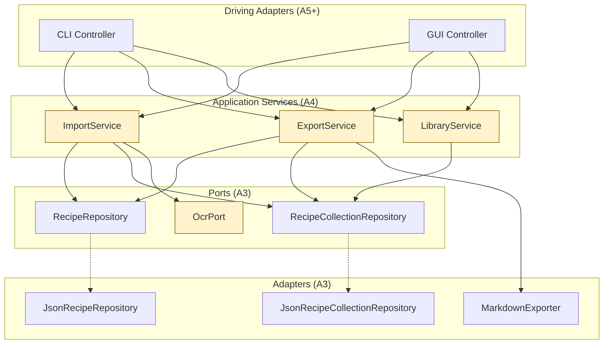

## Overview

In this assignment, you'll build the **application service layer** for CookYourBooks and experience firsthand how hexagonal architecture enables effective testing. You'll create three services that orchestrate domain operations—`ImportService`, `ExportService`, and `LibraryService`—and test them using mock implementations of the ports you defined in A3.

The central insight of this assignment is that **good architecture makes testing easy**. In A3, you separated ports (interfaces) from adapters (implementations). Now you'll see why: by injecting mock ports into your services, you can test complex workflows without touching the file system, without parsing real JSON, and without any external dependencies. This is just some of the payoff of hexagonal architecture.

You'll also implement `IngredientParser`, a utility that parses human-readable ingredient strings (like "2 cups flour" or "1/2 tsp salt") into your domain objects. This parsing logic is complex enough to benefit from extensive testing, including parameterized tests that verify many cases efficiently.

**Due:** Thursday, February 26, 2026 at 11:59 PM Boston Time

**Prerequisites:** This assignment builds on the A3 sample implementation (provided). You should be familiar with the hexagonal architecture established in A3: `RecipeRepository`, `RecipeCollectionRepository`, and their JSON adapters.

## Learning Outcomes

By completing this assignment, you will demonstrate proficiency in:

- **Designing application services** that orchestrate domain operations through ports ([L18: From Code Patterns to Architecture Patterns](/lecture-notes/l18-creation-patterns))
- **Using dependency injection** to wire services with their dependencies ([L18](/lecture-notes/l18-creation-patterns))
- **Testing with mocks** using Mockito to verify service behavior in isolation ([L15: Test Doubles and Isolation](/lecture-notes/l15-testing))
- **Experiencing hexagonal testability** by testing services without any real adapters ([L16: Designing for Testability](/lecture-notes/l16-testing2))
- **Writing parameterized tests** to efficiently test many input variations ([L15](/lecture-notes/l15-testing))
- **Implementing complex parsing logic** with comprehensive error handling

## AI Policy for This Assignment

**AI coding assistants continue to be encouraged.** Building on A3's introduction, this assignment provides more opportunities for effective AI collaboration:

| Task Type | AI Value | Strategy |
|-----------|----------|----------|
| **Service implementation** | High | AI can help translate API contracts into implementations |
| **Mock setup** | High | AI excels at Mockito boilerplate |
| **Parsing logic** | Moderate | Think through cases first, then use AI for implementation |
| **Test generation** | Moderate | AI for ideas, you verify they're meaningful |
| **Debugging** | High | Use scientific debugging, supported by AI |

**You must document your AI usage** in the [Reflection](#reflection) section.

## Technical Specifications

### Architecture Overview

This assignment adds an **application service layer** between driving adapters (like the CLI you'll build in A5) and your domain/ports:



**Key principle:** Services depend only on **port interfaces**, never on concrete adapters. This enables testing with mocks.

### Service Contracts

The following interfaces define what each service does. **How you implement these interfaces is your design decision**—we test through the public API only.

#### `ImportService`

Handles importing recipes from various sources into the user's library.

```java
public interface ImportService {
    
    /**
     * Imports a recipe from a JSON file and adds it to the specified collection.
     *
     * @param jsonFile path to a JSON file containing a serialized Recipe
     * @param collectionId the ID of the collection to add the recipe to
     * @return the imported Recipe
     * @throws ImportException if the file cannot be read or parsed
     * @throws CollectionNotFoundException if no collection exists with the given ID
     */
    @NonNull Recipe importRecipeFromJson(@NonNull Path jsonFile, @NonNull String collectionId);
    
    /**
     * Imports a recipe from an image using OCR and adds it to the specified collection.
     * The OCR extracts text from the image, which is then parsed into a Recipe.
     *
     * @param imageFile path to an image file (PNG, JPG, etc.)
     * @param collectionId the ID of the collection to add the recipe to
     * @return the imported Recipe
     * @throws ImportException if OCR fails or the extracted text cannot be parsed
     * @throws CollectionNotFoundException if no collection exists with the given ID
     */
    @NonNull Recipe importRecipeFromImage(@NonNull Path imageFile, @NonNull String collectionId);
    
    /**
     * Parses ingredient text into an Ingredient object.
     * Convenience method that delegates to IngredientParser.
     *
     * @param ingredientText text like "2 cups flour" or "salt to taste"
     * @return the parsed Ingredient
     * @throws ParseException if the text cannot be parsed
     */
    @NonNull Ingredient parseIngredient(@NonNull String ingredientText);
    
    /**
     * Parses multiple ingredient lines into Ingredient objects.
     *
     * @param ingredientLines newline-separated ingredient texts
     * @return list of parsed Ingredients
     * @throws ParseException if any line cannot be parsed
     */
    @NonNull List<Ingredient> parseIngredients(@NonNull String ingredientLines);
}
```

#### `ExportService`

Handles exporting recipes and collections to various formats.

```java
public interface ExportService {
    
    /**
     * Exports a recipe to Markdown format.
     *
     * @param recipeId the ID of the recipe to export
     * @return the recipe formatted as Markdown
     * @throws RecipeNotFoundException if no recipe exists with the given ID
     */
    @NonNull String exportRecipeToMarkdown(@NonNull String recipeId);
    
    /**
     * Exports a recipe to a Markdown file.
     *
     * @param recipeId the ID of the recipe to export
     * @param outputFile the path to write the Markdown file
     * @throws RecipeNotFoundException if no recipe exists with the given ID
     * @throws ExportException if the file cannot be written
     */
    void exportRecipeToFile(@NonNull String recipeId, @NonNull Path outputFile);
    
    /**
     * Exports a collection to Markdown format.
     *
     * @param collectionId the ID of the collection to export
     * @return the collection formatted as Markdown
     * @throws CollectionNotFoundException if no collection exists with the given ID
     */
    @NonNull String exportCollectionToMarkdown(@NonNull String collectionId);
    
    /**
     * Exports a collection to a Markdown file.
     *
     * @param collectionId the ID of the collection to export
     * @param outputFile the path to write the Markdown file
     * @throws CollectionNotFoundException if no collection exists with the given ID
     * @throws ExportException if the file cannot be written
     */
    void exportCollectionToFile(@NonNull String collectionId, @NonNull Path outputFile);
    
    /**
     * Exports a recipe to JSON format.
     *
     * @param recipeId the ID of the recipe to export
     * @return the recipe serialized as JSON
     * @throws RecipeNotFoundException if no recipe exists with the given ID
     */
    @NonNull String exportRecipeToJson(@NonNull String recipeId);
    
    /**
     * Exports a collection to JSON format.
     *
     * @param collectionId the ID of the collection to export
     * @return the collection serialized as JSON
     * @throws CollectionNotFoundException if no collection exists with the given ID
     */
    @NonNull String exportCollectionToJson(@NonNull String collectionId);
}
```

#### `LibraryService`

Manages the user's library of recipe collections.

```java
public interface LibraryService {
    
    /**
     * Creates a new recipe collection and adds it to the library.
     *
     * @param title the title of the new collection
     * @param sourceType the type of source (PUBLISHED_BOOK, PERSONAL, WEBSITE)
     * @return the created collection
     * @throws IllegalArgumentException if title is blank
     */
    @NonNull RecipeCollection createCollection(@NonNull String title, @NonNull SourceType sourceType);
    
    /**
     * Retrieves a collection by its ID.
     *
     * @param collectionId the collection ID
     * @return the collection
     * @throws CollectionNotFoundException if no collection exists with the given ID
     */
    @NonNull RecipeCollection getCollection(@NonNull String collectionId);
    
    /**
     * Retrieves all collections in the library.
     *
     * @return unmodifiable list of all collections
     */
    @NonNull List<RecipeCollection> getAllCollections();
    
    /**
     * Adds an existing recipe to a collection.
     *
     * @param recipeId the ID of the recipe to add
     * @param collectionId the ID of the collection
     * @return the updated collection
     * @throws RecipeNotFoundException if no recipe exists with the given ID
     * @throws CollectionNotFoundException if no collection exists with the given ID
     */
    @NonNull RecipeCollection addRecipeToCollection(@NonNull String recipeId, @NonNull String collectionId);
    
    /**
     * Removes a recipe from a collection.
     *
     * @param recipeId the ID of the recipe to remove
     * @param collectionId the ID of the collection
     * @return the updated collection
     * @throws CollectionNotFoundException if no collection exists with the given ID
     */
    @NonNull RecipeCollection removeRecipeFromCollection(@NonNull String recipeId, @NonNull String collectionId);
    
    /**
     * Searches for recipes by title across all collections.
     *
     * @param titleQuery the search query (case-insensitive substring match)
     * @return list of matching recipes
     */
    @NonNull List<Recipe> searchRecipesByTitle(@NonNull String titleQuery);
    
    /**
     * Deletes a collection from the library.
     *
     * @param collectionId the ID of the collection to delete
     * @throws CollectionNotFoundException if no collection exists with the given ID
     */
    void deleteCollection(@NonNull String collectionId);
}
```

### Port Interfaces

#### `OcrPort`

Defines the contract for OCR (Optical Character Recognition) services. **You will not implement a real OCR adapter in this assignment**—instead, you'll test your services using mock implementations.

```java
public interface OcrPort {
    
    /**
     * Extracts text from an image file using OCR.
     *
     * @param imageFile path to the image file
     * @return the extracted text
     * @throws OcrException if text extraction fails
     */
    @NonNull String extractText(@NonNull Path imageFile);
}
```

This port prepares your architecture for real OCR integration in future assignments. For now, testing with mocks demonstrates that your services are properly decoupled from the OCR implementation.

### Exception Classes

Create these exception classes in `app.cookyourbooks.services`:

```java
/** Thrown when an import operation fails. */
public class ImportException extends RuntimeException {
    public ImportException(String message) { super(message); }
    public ImportException(String message, Throwable cause) { super(message, cause); }
}

/** Thrown when an export operation fails. */
public class ExportException extends RuntimeException {
    public ExportException(String message) { super(message); }
    public ExportException(String message, Throwable cause) { super(message, cause); }
}

/** Thrown when a requested recipe is not found. */
public class RecipeNotFoundException extends RuntimeException {
    public RecipeNotFoundException(String recipeId) { 
        super("Recipe not found: " + recipeId); 
    }
}

/** Thrown when a requested collection is not found. */
public class CollectionNotFoundException extends RuntimeException {
    public CollectionNotFoundException(String collectionId) { 
        super("Collection not found: " + collectionId); 
    }
}

/** Thrown when OCR text extraction fails. */
public class OcrException extends RuntimeException {
    public OcrException(String message) { super(message); }
    public OcrException(String message, Throwable cause) { super(message, cause); }
}
```

### `IngredientParser`

Parses human-readable ingredient strings into `Ingredient` domain objects.

```java
public class IngredientParser {
    
    /**
     * Parses a single ingredient string into an Ingredient object.
     *
     * @param text the ingredient text to parse (e.g., "2 cups flour")
     * @return the parsed Ingredient (MeasuredIngredient or VagueIngredient)
     * @throws ParseException if the text cannot be parsed
     */
    public static @NonNull Ingredient parse(@NonNull String text);
    
    /**
     * Parses multiple ingredients from a multi-line string.
     * Each non-blank line is parsed as a separate ingredient.
     * Blank lines are skipped.
     *
     * @param multiLineText the text containing multiple ingredients
     * @return list of parsed ingredients
     * @throws ParseException if any non-blank line cannot be parsed
     */
    public static @NonNull List<Ingredient> parseAll(@NonNull String multiLineText);
}
```

**Note:** You must create a `ParseException` class (checked exception) for parsing failures. Include the problematic input text in the exception message.

#### Required Formats

These formats **must** parse correctly for full credit:

| Input | Expected Result |
|-------|-----------------|
| `"2 cups flour"` | MeasuredIngredient: ExactQuantity(2, CUP), name="flour" |
| `"1 cup milk"` | MeasuredIngredient: ExactQuantity(1, CUP), name="milk" |
| `"1/2 cup sugar"` | MeasuredIngredient: FractionalQuantity(0, 1, 2, CUP), name="sugar" |
| `"2 1/2 tbsp butter"` | MeasuredIngredient: FractionalQuantity(2, 1, 2, TABLESPOON), name="butter" |
| `"3-4 cloves garlic"` | MeasuredIngredient: RangeQuantity(3, 4, WHOLE), name="garlic" (or name="cloves garlic") |
| `"100 g chocolate"` | MeasuredIngredient: ExactQuantity(100, GRAM), name="chocolate" |
| `"1 lb ground beef"` | MeasuredIngredient: ExactQuantity(1, POUND), name="ground beef" |
| `"salt to taste"` | VagueIngredient: name="salt", description="to taste" |
| `"fresh herbs"` | VagueIngredient: name="fresh herbs" |
| `"2 cups flour, sifted"` | MeasuredIngredient: name="flour", preparation="sifted" |
| `"3 eggs"` | MeasuredIngredient: ExactQuantity(3, WHOLE), name="eggs" |
| `"1 tsp vanilla extract"` | MeasuredIngredient: ExactQuantity(1, TEASPOON), name="vanilla extract" |

**Unit aliases:** Your parser should recognize common abbreviations:
- `tbsp`, `Tbsp`, `tablespoon`, `tablespoons` → TABLESPOON
- `tsp`, `teaspoon`, `teaspoons` → TEASPOON  
- `cup`, `cups`, `c` → CUP
- `oz`, `ounce`, `ounces` → OUNCE
- `lb`, `lbs`, `pound`, `pounds` → POUND
- `g`, `gram`, `grams` → GRAM
- `kg`, `kilogram`, `kilograms` → KILOGRAM
- `ml`, `mL`, `milliliter`, `milliliters` → MILLILITER
- `l`, `L`, `liter`, `liters` → LITER

**Design Guidance:**
- Start with simple cases and add complexity incrementally
- Consider using regular expressions, but don't over-engineer
- AI can help with regex patterns—but verify they work!
- It's okay to have some edge cases that don't parse—document them

#### Encouraged Formats (Bonus Exploration)

Challenge yourself with these additional formats. They are **not graded**, but exploring them builds parsing skills:

- `"2 cups (250g) flour"` — dual measurements
- `"1 (14 oz) can diced tomatoes"` — packaged ingredients  
- `"one large egg"` — word numbers
- `"a pinch of salt"` — informal quantities
- `"zest of 1 lemon"` — derived ingredients

### Design Requirements

- **Dependency Injection:** Services must receive their dependencies through constructors. Never create adapters inside services.
- **Port Abstraction:** Services depend on port interfaces (`RecipeRepository`, `RecipeCollectionRepository`, `OcrPort`), not on concrete adapters.
- **Immutability:** Continue the immutability patterns from A3. Service methods that modify state should persist changes through repositories.
- **Null Safety:** Use `@NonNull` and `@Nullable` annotations from JSpecify.
- **Documentation:** Javadoc for all public classes and methods.

### Logging Requirements

Your services must implement comprehensive logging using **SLF4J** (Simple Logging Facade for Java). Logging is essential for debugging, monitoring, and understanding application behavior in production.

#### Setup

Add SLF4J to your dependencies. The A4 starter code includes these in `build.gradle`:

```groovy
implementation 'org.slf4j:slf4j-api:2.0.9'
runtimeOnly 'ch.qos.logback:logback-classic:1.4.11'
```

Create a logger in each service:

```java
import org.slf4j.Logger;
import org.slf4j.LoggerFactory;

public class ImportServiceImpl implements ImportService {
    private static final Logger logger = LoggerFactory.getLogger(ImportServiceImpl.class);
    
    // ...
}
```

#### What to Log

**At INFO level** — significant business events:
- Service operations starting and completing (import, export, collection creation)
- Summary information (e.g., "Imported recipe 'Chocolate Cake' to collection 'Desserts'")

**At DEBUG level** — detailed operational information:
- Method entry with parameters
- Intermediate steps (e.g., "OCR extracted 450 characters from image")
- Repository interactions

**At WARN level** — recoverable issues:
- Missing optional data
- Fallback behavior triggered
- Deprecated usage

**At ERROR level** — failures:
- Exceptions (with stack traces)
- Operation failures
- Invalid input that cannot be processed

#### Example Logging

```java
@Override
public Recipe importRecipeFromImage(Path imageFile, String collectionId) {
    logger.info("Importing recipe from image: {} to collection: {}", imageFile, collectionId);
    logger.debug("Starting OCR text extraction");
    
    try {
        String extractedText = ocrPort.extractText(imageFile);
        logger.debug("OCR extracted {} characters", extractedText.length());
        
        Recipe recipe = parseRecipeFromText(extractedText);
        logger.debug("Parsed recipe: {}", recipe.getTitle());
        
        RecipeCollection collection = collectionRepository.findById(collectionId)
            .orElseThrow(() -> {
                logger.error("Collection not found: {}", collectionId);
                return new CollectionNotFoundException(collectionId);
            });
        
        recipeRepository.save(recipe);
        collectionRepository.save(collection.addRecipe(recipe));
        
        logger.info("Successfully imported recipe '{}' (id: {}) to collection '{}'", 
            recipe.getTitle(), recipe.getId(), collection.getTitle());
        return recipe;
        
    } catch (OcrException e) {
        logger.error("OCR failed for image {}: {}", imageFile, e.getMessage(), e);
        throw new ImportException("Failed to extract text from image", e);
    }
}
```

#### Logging Guidelines

1. **Be consistent.** Use the same patterns across all services.
2. **Include context.** Log IDs, titles, and other identifying information.
3. **Don't log sensitive data.** (Not applicable for recipes, but good practice.)
4. **Use parameterized messages.** Write `logger.info("Imported {}", title)` not `logger.info("Imported " + title)`.
5. **Log exceptions properly.** Pass the exception as the last argument: `logger.error("Failed", e)`.

#### Testing Logging

You don't need to write tests that verify log output. However, your logs should be useful for debugging—if a test fails, the logs should help you understand what happened.

### Designing for Future Evolution

Your services will evolve in future assignments. While you shouldn't over-engineer for hypothetical requirements, understanding the roadmap helps you make design decisions that won't paint you into a corner.

#### Known Future Requirements

| Future Assignment | What Changes |
|-------------------|--------------|
| **A5: CLI** | Services will be called from a CLI controller. Batch operations (import multiple images, export entire cookbooks) will be needed. |
| **Group A1: GUI** | Long-running operations (OCR) need progress reporting. Operations may run asynchronously. |
| **Group A2: OCR Integration** | Multiple OCR backends (Tesseract, Claude API). Strategy pattern for different parsing approaches. |

#### Design Principles for Adaptability

**1. Keep services focused on orchestration, not implementation details.**

Your services should coordinate between ports—they shouldn't contain complex algorithms themselves. For example, `ImportService.importRecipeFromImage()` should delegate to `OcrPort` for text extraction and to `IngredientParser` for parsing. If you later need to swap OCR strategies, the service logic doesn't change.

**2. Design method signatures that can grow.**

Consider what information a caller might eventually need. For example, a future CLI might want to show progress during batch imports. You don't need to implement progress reporting now, but avoid designs that would make it impossible to add later. 

:::tip Think Ahead
If `importRecipeFromImage` returns just a `Recipe`, how would you later report progress on a batch of 50 images? Consider whether returning a richer result type (or accepting a callback/listener) might be valuable.

You're not required to implement progress reporting—but your reflection should discuss how your design could accommodate it.
:::

**3. Separate "what to do" from "how to do it."**

`IngredientParser` should be a standalone utility that services use, not logic embedded in `ImportService`. This separation means:
- You can test parsing independently
- You can reuse parsing in multiple services
- You can later swap parsing strategies without touching services

**4. Think about error granularity.**

When importing a batch of recipes, should one failure abort the entire operation? Should partial results be returned? Your current API doesn't need to answer this definitively, but consider how your exception design could support different error-handling policies.

#### What You Should NOT Do

- **Don't implement features you don't need yet.** No async operations, no progress callbacks, no batch methods beyond what's specified.
- **Don't create elaborate inheritance hierarchies** "just in case." YAGNI (You Aren't Gonna Need It) applies.
- **Don't optimize prematurely.** Get it working and tested first.

The goal is **simple code that's easy to change**, not complex code that anticipates every possibility.

### Testing Requirements

This assignment emphasizes **testing with mocks**. Your test suite should demonstrate that you understand how to:

1. **Create mock ports** using Mockito
2. **Configure mock behavior** with `when(...).thenReturn(...)`
3. **Verify interactions** with `verify(...)`
4. **Test services in isolation** without real adapters

#### Required Test Files

Create these test files in `src/test/java/app/cookyourbooks/`:

| Test File | What to Test |
|-----------|--------------|
| `services/ImportServiceTest.java` | Import operations with mock repositories and mock OCR |
| `services/ExportServiceTest.java` | Export operations with mock repositories |
| `services/LibraryServiceTest.java` | Library management with mock collection repository |
| `parsing/IngredientParserTest.java` | Parsing logic with parameterized tests |

#### Testing Guidance

**Service Tests with Mocks:**

```java
@ExtendWith(MockitoExtension.class)
class ImportServiceTest {
    
    @Mock
    private RecipeRepository recipeRepository;
    
    @Mock
    private RecipeCollectionRepository collectionRepository;
    
    @Mock
    private OcrPort ocrPort;
    
    private ImportService importService;
    
    @BeforeEach
    void setUp() {
        // Wire the service with mock dependencies
        importService = new ImportServiceImpl(recipeRepository, collectionRepository, ocrPort);
    }
    
    @Test
    void importFromImage_savesExtractedRecipe() {
        // Arrange: configure mocks
        when(ocrPort.extractText(any())).thenReturn("Chocolate Cake\n\n2 cups flour\n1 cup sugar");
        when(collectionRepository.findById("col-123")).thenReturn(Optional.of(someCollection));
        
        // Act
        Recipe result = importService.importRecipeFromImage(
            Path.of("cake.jpg"), "col-123");
        
        // Assert
        assertThat(result.getTitle()).isEqualTo("Chocolate Cake");
        verify(recipeRepository).save(any(Recipe.class));
        verify(collectionRepository).save(any(RecipeCollection.class));
    }
    
    @Test
    void importFromImage_throwsWhenOcrFails() {
        when(ocrPort.extractText(any())).thenThrow(new OcrException("Blurry image"));
        
        assertThrows(ImportException.class, () ->
            importService.importRecipeFromImage(Path.of("blurry.jpg"), "col-123"));
    }
}
```

**Parameterized Tests for IngredientParser:**

```java
class IngredientParserTest {
    
    @ParameterizedTest
    @CsvSource({
        "'2 cups flour', 2.0, CUP, flour",
        "'1 tbsp olive oil', 1.0, TABLESPOON, olive oil",
        "'100 g butter', 100.0, GRAM, butter"
    })
    void parsesExactQuantities(String input, double amount, Unit unit, String name) {
        Ingredient result = IngredientParser.parse(input);
        
        assertThat(result).isInstanceOf(MeasuredIngredient.class);
        MeasuredIngredient measured = (MeasuredIngredient) result;
        assertThat(measured.getQuantity()).isInstanceOf(ExactQuantity.class);
        // ... more assertions
    }
    
    @ParameterizedTest
    @ValueSource(strings = {"salt to taste", "fresh herbs", "garnish"})
    void parsesVagueIngredients(String input) {
        Ingredient result = IngredientParser.parse(input);
        assertThat(result).isInstanceOf(VagueIngredient.class);
    }
}
```

**What Your Tests Should Verify:**

- Services correctly delegate to repositories
- Services handle not-found cases by throwing appropriate exceptions
- Services handle adapter failures gracefully
- `IngredientParser` correctly parses all required formats
- `IngredientParser` throws `ParseException` for unparseable input

**What We Test:**

Your implementation is tested against our test suite. Your tests are evaluated using mutation testing—we introduce bugs and check if your tests catch them.

## Reflection

Update `REFLECTION.md` to address:

1. **Service Design:** How did you structure your service implementations? What dependencies does each service have, and why?

2. **Mock-Based Testing:** Describe a specific test where mocking enabled you to test behavior that would be difficult to test with real adapters. What would testing look like without mocks?

3. **Hexagonal Payoff:** Now that you've tested services with mocks, reflect on the hexagonal architecture from A3. How did separating ports from adapters make this assignment easier?

4. **Designing for Change:** Review the "Designing for Future Evolution" section. Pick one future requirement (batch operations, progress reporting, or multiple OCR backends) and describe how your current design would need to change to support it. What aspects of your design would make this change easy? What might be difficult?

5. **Parser Assumptions and Future Costs:** Your `IngredientParser` handles formats like "2 cups flour" and "100g chocolate." Consider: what ingredient formats might your parser *not* handle well? (Think about cuisines using different measurement systems, ingredients with non-English names, or traditional recipes without precise measurements.) If CookYourBooks expands internationally in 3 years, what would need to change? How expensive would that change be given your current design?

6. **AI Collaboration:** Which tasks in this assignment benefited most from AI assistance? Were there tasks where AI was less helpful than expected?

## Quality Requirements

Your submission should demonstrate:

- **Correctness:** Code compiles, follows specifications, passes tests
- **Architecture:** Services depend only on ports; dependency injection used correctly
- **Logging:** Comprehensive logging at appropriate levels in all services
- **Test Quality:** Meaningful tests that verify behavior and catch bugs
- **Documentation:** Clear Javadoc with contracts documented
- **Code Quality:** Clean, readable code following course style conventions

## Grading Rubric

### Automated Grading (100 points)

#### Implementation Correctness (50 points)

| Component | Points |
|-----------|--------|
| `ImportService` implementation | 12 |
| `ExportService` implementation | 10 |
| `LibraryService` implementation | 12 |
| `IngredientParser` - required formats | 10 |
| Exception handling | 6 |

#### Test Suite Quality (50 points)

Your tests are evaluated using mutation testing:

| Test File | Points |
|-----------|--------|
| `ImportServiceTest.java` | 14 |
| `ExportServiceTest.java` | 10 |
| `LibraryServiceTest.java` | 14 |
| `IngredientParserTest.java` | 12 |

### Manual Grading (Subtractive, max -36 points)

| Category | Max Deduction | Criteria |
|----------|---------------|----------|
| **Architecture** | -10 | Services depend on concrete adapters; poor separation of concerns |
| **Dependency Injection** | -6 | Dependencies created inside services instead of injected |
| **Logging** | -6 | Missing logging; inconsistent log levels; uninformative messages; missing context |
| **Test Quality** | -6 | Tests don't use mocks effectively; verify implementation not behavior |
| **Documentation** | -4 | Missing Javadoc; undocumented design decisions |
| **Code Style** | -4 | Poor naming; overly complex logic; inconsistent style |

### Reflection (-12 points max)

Up to 2 points deducted per question for incomplete or superficial responses (6 questions).

## Repository Structure

Your final repository should include:

```
src/
├── main/java/app/cookyourbooks/
│   ├── domain/
│   │   └── ... (from A3)
│   ├── ports/
│   │   ├── RecipeRepository.java      (from A3)
│   │   ├── RecipeCollectionRepository.java (from A3)
│   │   ├── OcrPort.java               (NEW)
│   │   └── ... (from A3)
│   ├── adapters/
│   │   └── ... (from A3)
│   ├── services/
│   │   ├── ImportService.java         (NEW - interface)
│   │   ├── ImportServiceImpl.java     (NEW - your implementation)
│   │   ├── ExportService.java         (NEW - interface)
│   │   ├── ExportServiceImpl.java     (NEW - your implementation)
│   │   ├── LibraryService.java        (NEW - interface)
│   │   ├── LibraryServiceImpl.java    (NEW - your implementation)
│   │   ├── ImportException.java       (NEW)
│   │   ├── ExportException.java       (NEW)
│   │   ├── RecipeNotFoundException.java (NEW)
│   │   ├── CollectionNotFoundException.java (NEW)
│   │   └── OcrException.java          (NEW)
│   └── parsing/
│       ├── IngredientParser.java      (NEW)
│       └── ParseException.java        (NEW)
└── test/java/app/cookyourbooks/
    ├── services/
    │   ├── ImportServiceTest.java     (NEW)
    │   ├── ExportServiceTest.java     (NEW)
    │   └── LibraryServiceTest.java    (NEW)
    └── parsing/
        └── IngredientParserTest.java  (NEW)
```

---

Good luck! This assignment demonstrates the power of good architecture: because you designed clean boundaries in A3, testing in A4 becomes straightforward. The same pattern scales to larger systems—and to your future career.
