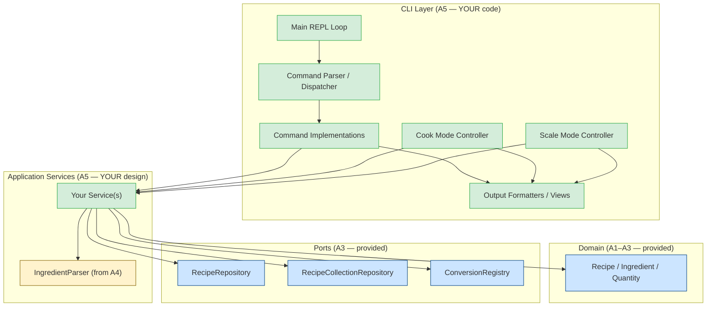

:::warning Preliminary Content

This assignment is preliminary content and is subject to change until the release date of the assignment.

:::

## Overview

In this assignment, you'll build an **interactive command-line interface (CLI)** for CookYourBooks — a rich, command-oriented terminal application that lets users manage their recipe library, import recipes, scale and convert ingredients, generate shopping lists, and follow recipes step-by-step while cooking.

The CLI is your first **driving adapter** in the hexagonal architecture. But here's the twist: **you won't use the `RecipeService` from A4.** Instead, you'll design your own service layer — one that's actually well-suited for a CLI application. In A4, we told you `RecipeService` was not ideal design. Now you get to prove you understand *why* by building something better.

Your assignment has two parts:
1. **Design and implement CLI-oriented services** that coordinate the domain model and repositories for what your CLI needs
2. **Build a rich interactive CLI** on top of those services — with command parsing, tab completion, interactive cooking mode, and interactive scaling

This is a **design-heavy assignment.** We provide the commands your CLI must support and the behavior each command must exhibit, but *how* you structure both the service layer and the CLI code — command parsing, output formatting, controller organization, interactive modes — is your design decision. You'll be graded on both correctness and the quality of your design.

**Due:** Thursday, March 19, 2026 at 11:59 PM Boston Time

**Prerequisites:** This assignment builds on the A4 sample implementation (provided). You should be familiar with `RecipeRepository`, `RecipeCollectionRepository`, `ConversionRegistry`, and the domain model. You should also understand why the A4 `RecipeService` interface was problematic — that understanding drives your service design in this assignment.

### At a Glance

**What you'll build:** A CLI-oriented service layer (your design) and a rich interactive CLI with command parsing, navigation, and two interactive modes (cook mode and scaling mode).

**The main challenge:** Designing services that actually serve your CLI's needs (unlike the A4 facade), then building a polished user experience — tab completion, contextual help, clear error messages, and an interactive cooking walkthrough.

**What you'll test:** Your service layer (with mocked repositories), command parsing, output formatting, controller logic (with mocked services), and integration tests for interactive workflows.

**How you'll be graded:** 70 pts automated (command correctness + output format), 50 pts manual (design, usability, code quality), 30 pts reflection. See [Grading Rubric](#grading-rubric).

## Learning Outcomes

By completing this assignment, you will demonstrate proficiency in:

- **Designing a service layer** — creating application services that serve the needs of a specific driving adapter, informed by what you learned about bad service design in A4 ([L17: From Code Patterns to Architecture Patterns](/lecture-notes/l17-creation-patterns))
- **Building a driving adapter** — implementing the CLI as a hexagonal driving adapter that consumes your services without leaking domain logic into the presentation layer ([L18: Architectural Boundaries](/lecture-notes/l18-boundaries))
- **Applying MVC to a CLI** — separating command parsing (controller), output formatting (view), and application state (model backed by services)
- **Designing a command architecture** — creating an extensible system for dispatching, parsing, and executing commands
- **Interactive UX for terminals** — building rich interactions including step-by-step cooking mode, interactive scaling, tab completion, and contextual help
- **Applying usability heuristics** — using Nielsen's heuristics to guide CLI design decisions ([L20: Usability](/lecture-notes/l20-usability))

## AI Policy for This Assignment

**AI coding assistants continue to be encouraged.** This assignment offers a variety of AI collaboration opportunities:

| Task Type | AI Value | Strategy |
|-----------|----------|----------|
| **JLine setup and configuration** | High | JLine boilerplate is well-documented; AI can scaffold this quickly |
| **Command parsing boilerplate** | High | Repetitive argument parsing code is a great AI use case |
| **Output formatting** | Moderate | AI can draft table/box formatting, but you should verify readability |
| **Service layer design** | Low | Think through your service decomposition yourself — this is core learning |
| **Architecture decisions** | Low | Think through your command dispatch design yourself — this is the core learning |
| **Cook mode interaction design** | Moderate | Use AI for implementation after you've designed the interaction flow |

**You must document your AI usage** in the [Reflection](#reflection) section.

:::danger AI Resource Consumption — Use "Auto" Mode Only

**Do not manually select expensive AI models** (like Claude Opus, GPT-4, or other premium models) for coursework in this class. **Always use "Auto" mode** in Cursor.

:::

## Technical Specifications

### Architecture Overview

Your CLI is a **driving adapter** — it drives the application by calling services. But unlike A4, you're designing those services yourself. The architecture has three layers, all under your control:



**Legend:** Green = your code (A5). Yellow = reusable from A4 (e.g., parsers). Blue = domain model and ports (provided).

**Key principle:** Your CLI code should call your service layer — not domain constructors or repository methods directly. If you find yourself doing ingredient parsing, scaling math, or repository lookups inside a CLI command class, that logic belongs in a service.

### Why Not Use `RecipeService` from A4?

In A4, we told you `RecipeService` was **intentionally not ideal design**. Now it's time to understand why — and do better.

:::info What Was Wrong with `RecipeService`?

Recall the A4 facade:

```java
Recipe importFromText(String recipeText, String collectionId);
Recipe scaleRecipe(String recipeId, int targetServings);
Recipe convertRecipe(String recipeId, Unit targetUnit);
ShoppingList generateShoppingList(List<String> recipeIds);
```

These methods were designed for **one-shot CLI convenience** — each method does everything in one call. But this design has real problems:

1. **Bundled responsibilities.** `importFromText` parses text, saves to a repository, *and* updates a collection in a single call. What if the CLI wants to parse text and show a preview *before* saving? You can't — the method does it all or nothing.

2. **Forced persistence.** `scaleRecipe` always saves the result as a new recipe. But in cooking mode, you want to scale *temporarily* for display without cluttering the repository with intermediate results. The A4 interface forces you to save.

3. **Rigid workflows.** The facade assumes a specific sequence (look up → transform → save). Interactive use cases need more flexibility — preview before commit, undo, try different values.

4. **Hard to compose.** Each method is a self-contained transaction. You can't easily build multi-step workflows (like "scale, then preview, then optionally save") because the method boundaries don't align with the interaction boundaries.

**Your task:** Design services that give the CLI the flexibility it needs. Think about what operations your CLI commands actually require, and design methods that match those needs — not a one-size-fits-all facade.

:::

### Designing Your Service Layer

You must design and implement **your own application service(s)** for the CLI. You are **not required to use** `RecipeService` from A4 (though you may reuse your A4 parsing code, e.g., `IngredientParser` or `RecipeTextParser`).

**What your services must support** (derived from the CLI commands below):

| CLI Need | Service Capability Required |
|----------|-----------------------------|
| Browse collections and recipes | Look up collections, list recipes in a collection |
| Display a recipe | Retrieve a recipe by title or ID |
| Search by ingredient | Find recipes containing an ingredient (case-insensitive substring) |
| Import from JSON | Parse a JSON file into a Recipe, save it, add to a collection |
| Import from text | Parse text into a Recipe, *optionally* save it and add to a collection |
| Scale a recipe | Scale ingredient quantities by a factor — return the scaled recipe *without* automatically saving |
| Convert units | Convert ingredient units — return the result *without* automatically saving |
| Save a recipe | Persist a recipe to the repository (as a separate, explicit operation) |
| Generate shopping list | Aggregate ingredients across multiple recipes |
| Export to Markdown | Export a recipe to a Markdown file |
| Cook mode scaling | Scale ingredients in-memory for display, without persisting |

**Notice the key differences from A4's `RecipeService`:**

- **Scaling and conversion return results without saving.** The CLI decides when to persist. This enables "preview before save" workflows and temporary scaling in cook mode.
- **Import can be split into parse + save.** The CLI can parse text, show the user what was parsed, and then save — rather than doing it all atomically.
- **The service doesn't dictate the workflow.** It provides building blocks; the CLI composes them.

:::tip Design Guidance

You have full design freedom. Here are some approaches to consider (you don't have to use any of these):

**Option A: Single CLI Service with better methods**
```java
public class CookYourBooksService {
    Recipe parseFromText(String text);           // Parse without saving
    Recipe parseFromJson(Path file);             // Parse without saving
    void saveRecipe(Recipe recipe);              // Explicit save
    void addToCollection(Recipe r, String colId); // Explicit collection update
    Recipe scale(Recipe recipe, int servings);   // Scale without saving
    Recipe convert(Recipe recipe, Unit unit);     // Convert without saving
    ShoppingList aggregateShoppingList(List<Recipe> recipes);
    List<Recipe> searchByIngredient(String name);
}
```

**Option B: Multiple focused services**
```java
public class ImportService { ... }     // Parsing and importing
public class TransformService { ... }  // Scaling and conversion
public class BrowseService { ... }     // Search, listing, lookup
public class ShoppingService { ... }   // Shopping list aggregation
```

**Option C: Service + stateful session objects**
```java
public class RecipeSession {           // Tracks an in-progress recipe interaction
    Recipe getOriginal();
    Recipe scale(int servings);        // Returns scaled version, keeps original
    Recipe convert(Unit unit);
    void save();                       // Commits the current version
}
```

The right answer depends on your CLI's needs. Think about what each command requires and design accordingly.

:::

:::caution Do NOT Just Wrap `RecipeService`

A thin wrapper around A4's `RecipeService` that adds "preview" by calling the method and then deleting the saved result is **not good design** — it's a workaround. Design services that don't have the problem in the first place.

Similarly, don't copy-paste `RecipeServiceImpl` and rename the methods. Your service layer should reflect a fundamentally different design philosophy: the service provides operations, the CLI orchestrates workflows.

:::

**What you may reuse from A4:**
- Your `IngredientParser` / `RecipeTextParser` (or the reference implementation's parsers)
- Any helper classes for parsing, formatting, etc.
- Domain model classes and ports (obviously)

**What you should NOT reuse:**
- `RecipeService` or `RecipeServiceImpl` as your primary service layer

### JLine: Rich Terminal Interaction

Your CLI must use [JLine 3](https://github.com/jline/jline3) for terminal interaction. JLine provides:

- **Line editing** — arrow keys, backspace, home/end, etc.
- **Command history** — up/down arrows to recall previous commands
- **Tab completion** — auto-complete command names, collection names, recipe titles
- **Styled output** — colors and formatting for readable output

JLine is already included as a dependency in the provided starter code. Here's a minimal setup:

```java
Terminal terminal = TerminalBuilder.builder().system(true).build();
LineReader reader = LineReaderBuilder.builder()
    .terminal(terminal)
    .completer(yourCompleter)  // Tab completion
    .build();

while (true) {
    String line = reader.readLine("cyb> ");
    // Parse and execute command...
}
```

:::tip JLine Resources

- [JLine Wiki](https://github.com/jline/jline3/wiki) — comprehensive documentation
- The provided starter includes a `JLineExample.java` you can run to see basic JLine features in action
- AI assistants are very good at helping with JLine configuration — this is a great use case for Copilot

:::

### Application Wiring

The provided starter includes a `CookYourBooksApp` main class that creates the repositories and conversion registry. **You are responsible for wiring your own services** and launching the CLI. Modify the `main` method to construct your services and pass them to your CLI:

```java
public class CookYourBooksApp {
    public static void main(String[] args) {
        // Infrastructure (provided)
        ConversionRegistry registry = StandardConversions.createRegistry();
        RecipeRepository recipeRepo = new JsonRecipeRepository(Path.of("data/recipes"));
        RecipeCollectionRepository collRepo = new JsonRecipeCollectionRepository(Path.of("data/collections"));

        // YOUR services — design and wire these yourself
        // e.g., CookYourBooksService service = new CookYourBooksService(recipeRepo, collRepo, registry);
        // e.g., ImportService importService = new ImportService(recipeRepo, collRepo);
        // ... whatever your design requires ...

        // Launch CLI (you implement this)
        CookYourBooksCli cli = new CookYourBooksCli(/* your services */);
        cli.run();
    }
}
```

### Command Reference

Your CLI must support the following commands. Each command has a required syntax, behavior, and output format. Where output format is specified, your CLI must match it closely enough for automated testing (exact whitespace is not tested, but structure and content are).

#### `help` — Contextual Help

```
cyb> help
```

Displays a list of all available commands with brief descriptions. When given a command name, shows detailed help for that command including syntax, arguments, and examples.

```
cyb> help scale
```

**Requirements:**
- `help` with no arguments lists all commands grouped by category (Library, Recipe, Tools, General)
- `help <command>` shows detailed usage for a specific command
- Unknown command names produce a helpful message: `Unknown command: '<name>'. Type 'help' for a list of commands.`

#### `collections` — List Collections

```
cyb> collections
```

Lists all recipe collections (cookbooks, personal collections, web collections) from the `RecipeCollectionRepository`. Display each collection's title, source type, and recipe count.

**Example output:**
```
Collections:
  1. Holiday Favorites        [Personal]   12 recipes
  2. Joy of Cooking           [Cookbook]     8 recipes
  3. Budget Bytes             [Web]         5 recipes
```

#### `recipes <collection>` — List Recipes in a Collection

```
cyb> recipes "Joy of Cooking"
```

Lists all recipes in the specified collection. Collection can be identified by title (case-insensitive). If the title contains spaces, it must be quoted.

**Example output:**
```
Joy of Cooking (8 recipes):
  1. Chocolate Chip Cookies          Serves 24 cookies
  2. Classic Pancakes                Serves 4
  3. Beef Stew                       Serves 6
  ...
```

**Error handling:**
- Collection not found: `Collection not found: 'Unknown Collection'. Use 'collections' to see available collections.`

#### `show <recipe>` — Display a Recipe

```
cyb> show "Chocolate Chip Cookies"
```

Displays the full recipe details: title, servings, all ingredients with quantities, and all instructions. Recipe is looked up by title (case-insensitive) across all collections in the repository.

**Example output:**
```
═══════════════════════════════════════
  Chocolate Chip Cookies
  Serves 24 cookies
═══════════════════════════════════════

Ingredients:
  • 2 cups flour
  • 1 cup sugar
  • 1/2 cup butter, softened
  • 2 eggs
  • 1 tsp vanilla extract
  • chocolate chips to taste

Instructions:
  1. Preheat oven to 350°F
  2. Mix dry ingredients
  3. Cream butter and sugar
  4. Combine and fold in chocolate chips
  5. Bake for 12 minutes
```

**Error handling:**
- Recipe not found: `Recipe not found: 'Unknown Recipe'. Use 'search' to find recipes by ingredient.`
- Multiple matches: Display all matches and ask the user to be more specific.

#### `search <ingredient>` — Search Recipes by Ingredient

```
cyb> search chicken
```

Finds all recipes containing the specified ingredient (case-insensitive substring matching). Displays matching recipe titles with their collection. Your service layer should provide this search capability.

**Example output:**
```
Recipes containing 'chicken':
  1. Chicken Tikka Masala         (Joy of Cooking)
  2. Grilled Chicken Salad        (Holiday Favorites)
  3. Chicken Noodle Soup          (Budget Bytes)

Found 3 recipes.
```

**When no results:** `No recipes found containing 'artichoke'.`

#### `import json <file> <collection>` — Import Recipe from JSON

```
cyb> import json /path/to/recipe.json "Holiday Favorites"
```

Imports a recipe from a JSON file and adds it to the specified collection. Your service layer should handle JSON deserialization, saving the recipe, and updating the collection.

**On success:** Displays a confirmation with the imported recipe's title.
```
Imported 'Grandma's Apple Pie' into 'Holiday Favorites'.
```

**Error handling:**
- File not found or unreadable: Display the error message from `ImportException`
- Collection not found: Display a helpful message suggesting `collections` command
- Parse/format errors: Display the error message from the exception

#### `import text <collection>` — Import Recipe from Text

```
cyb> import text "Holiday Favorites"
```

Enters a **multi-line input mode** where the user types or pastes a recipe in plain text. The input ends when the user enters a blank line followed by `END` on its own line (or uses Ctrl+D). The text is passed to your service layer for parsing.

**Example interaction:**
```
cyb> import text "Holiday Favorites"
Enter recipe text (end with a blank line then END):
> Simple Salad
>
> Serves 2
>
> Ingredients:
> 1 head lettuce
> 2 cups cherry tomatoes
> 1/4 cup olive oil
>
> Instructions:
> 1. Wash and chop lettuce
> 2. Halve tomatoes
> 3. Toss with olive oil
>
> END
Imported 'Simple Salad' into 'Holiday Favorites'.
```

**Error handling:**
- Collection not found: Display message *before* prompting for text input
- Parse errors: Display the error message from `ParseException`

#### `scale <recipe>` — Interactive Scaling Mode

```
cyb> scale "Chocolate Chip Cookies"
```

Enters **interactive scaling mode** for the specified recipe. This mode shows the current recipe with its servings, prompts the user for a target serving size, and displays a side-by-side comparison of original and scaled quantities before asking whether to save.

**Example interaction:**
```
cyb> scale "Chocolate Chip Cookies"

Scaling: Chocolate Chip Cookies (currently serves 24 cookies)

Enter target servings (or 'cancel'): 48

Scaled to 48 servings (2.0x):
  Ingredient                Original        Scaled
  ─────────────────────────────────────────────────
  flour                     2 cups       →  4 cups
  sugar                     1 cup        →  2 cups
  butter                    1/2 cup      →  1 cup
  eggs                      2            →  4
  vanilla extract           1 tsp        →  2 tsp
  chocolate chips           to taste        to taste

Save scaled recipe? (y/n): y
Saved scaled recipe 'Chocolate Chip Cookies (scaled to 48)'.

Scale again or 'done': done
```

**Requirements:**
- Show original recipe with current servings
- Prompt for target servings (accept positive integers, or `cancel` to exit)
- Display side-by-side comparison of original and scaled ingredients
- VagueIngredients display unchanged (e.g., "to taste")
- Ask whether to save (persists the scaled recipe as a new recipe via your service layer)
- Allow scaling again with a different target, or `done` to exit
- If the recipe has no servings information, display an error and exit: `Cannot scale 'Recipe Name': no serving information available.`

#### `convert <recipe> <unit>` — Convert Recipe Units

```
cyb> convert "Beef Stew" gram
```

Converts all measured ingredients to the specified unit. Displays the converted recipe and asks whether to save. The conversion should happen through your service layer — the CLI sees the result and decides whether to persist it.

**Example interaction:**
```
cyb> convert "Beef Stew" gram

Converted 'Beef Stew' to GRAM:
  Ingredient                Original        Converted
  ───────────────────────────────────────────────────
  flour                     2 cups       →  240 g
  butter                    1/2 cup      →  113.5 g
  salt                      to taste        to taste

Save converted recipe? (y/n): y
Saved converted recipe 'Beef Stew (converted to GRAM)'.
```

**Error handling:**
- Recipe not found: Display helpful error
- Unsupported conversion: Display the error from `UnsupportedConversionException` — e.g., `Cannot convert 'eggs' (WHOLE) to GRAM: no conversion rule available.`

#### `shopping-list <recipe1> [recipe2] ...` — Generate Shopping List

```
cyb> shopping-list "Chocolate Chip Cookies" "Classic Pancakes"
```

Aggregates ingredients across the specified recipes into a shopping list. Recipes are identified by title. Your service layer should handle the lookup and aggregation.

**Example output:**
```
Shopping List (2 recipes):
═══════════════════════════
  Measured Items:
    • 5 cups flour
    • 2 cups sugar
    • 1.5 cups butter
    • 4 eggs
    • 2 tsp vanilla extract
    • 2 cups milk

  Also needed:
    • salt
    • chocolate chips

Total: 6 measured items, 2 vague items
```

#### `cook <recipe>` — Interactive Cooking Mode

```
cyb> cook "Chocolate Chip Cookies"
```

Enters **interactive cooking mode** — a step-by-step walkthrough designed for use while actually cooking. This is the signature feature of your CLI. The mode shows one instruction at a time, with the relevant ingredients visible, and supports navigation and on-the-fly scaling.

**Example interaction:**
```
cyb> cook "Chocolate Chip Cookies"

══════════════════════════════════════════
  🍳 COOKING: Chocolate Chip Cookies
  Serves 24 cookies
══════════════════════════════════════════

Ingredients:
  • 2 cups flour              • 2 eggs
  • 1 cup sugar               • 1 tsp vanilla extract
  • 1/2 cup butter, softened  • chocolate chips to taste

──────────────────────────────────────────
  Step 1 of 5
──────────────────────────────────────────
  Preheat oven to 350°F


[next] [prev] [ingredients] [scale] [quit]
cook> next

──────────────────────────────────────────
  Step 2 of 5
──────────────────────────────────────────
  Mix dry ingredients


[next] [prev] [ingredients] [scale] [quit]
cook> scale
Enter target servings: 48

  ✓ Scaled to 48 servings. Ingredients updated:
  • 4 cups flour              • 4 eggs
  • 2 cups sugar              • 2 tsp vanilla extract
  • 1 cup butter, softened    • chocolate chips to taste

cook> ingredients

Ingredients (scaled to 48 servings):
  • 4 cups flour
  • 2 cups sugar
  • 1 cup butter, softened
  • 4 eggs
  • 2 tsp vanilla extract
  • chocolate chips to taste

cook> next
...

──────────────────────────────────────────
  Step 5 of 5
──────────────────────────────────────────
  Bake for 12 minutes


[done] [prev] [ingredients] [scale] [quit]
cook> done

  Finished cooking Chocolate Chip Cookies! Enjoy!
```

**Cook mode commands:**

| Command | Action |
|---------|--------|
| `next` or `n` | Advance to the next step |
| `prev` or `p` | Go back to the previous step |
| `ingredients` or `i` | Show the full ingredient list (reflects any scaling) |
| `scale <servings>` or `scale` | Scale the recipe to new servings (updates displayed ingredients in this session; does not save unless asked) |
| `goto <step>` | Jump to a specific step number |
| `quit` or `q` | Exit cooking mode (returns to main prompt) |
| `done` | Complete cooking (shown on last step) |

**Requirements:**
- Display one instruction at a time with step number and total count
- Show ingredients at the start and on demand
- `scale` within cook mode adjusts all displayed quantities for the remainder of the session
- Pressing `next` on the last step shows a completion message
- Pressing `prev` on the first step shows a message that you're already at the beginning
- The prompt changes to `cook>` to indicate cooking mode
- Display available commands as hints at the bottom of each step

#### `export <recipe> <file>` — Export Recipe to Markdown

```
cyb> export "Chocolate Chip Cookies" ~/cookies.md
```

Uses the `MarkdownExporter` to export a recipe to a Markdown file.

**On success:** `Exported 'Chocolate Chip Cookies' to /Users/you/cookies.md`
**On error:** Display the file I/O error message.

#### `quit` / `exit` — Exit the Application

```
cyb> quit
Goodbye!
```

Exits the application gracefully.

### Tab Completion

Your CLI must provide tab completion for:

1. **Command names** — typing `sc` + Tab should suggest `scale`, `search`
2. **Collection names** — after `recipes`, Tab should suggest available collection titles
3. **Recipe titles** — after `show`, `cook`, `scale`, `convert`, Tab should suggest recipe titles
4. **Unit names** — after `convert <recipe>`, Tab should suggest valid unit names

Use JLine's `Completer` interface to implement this. You may use `AggregateCompleter`, `ArgumentCompleter`, and `StringsCompleter` — see the JLine documentation.

### Error Handling and Usability

Your CLI should follow Nielsen's usability heuristics wherever applicable:

| Heuristic | Application |
|-----------|-------------|
| **Visibility of system status** | Confirm actions ("Imported...", "Saved..."), show progress for long operations |
| **Match between system and real world** | Use cooking terminology, natural command names |
| **User control and freedom** | `cancel` in interactive modes, `prev` in cook mode, confirm before saving |
| **Consistency and standards** | Consistent command syntax, consistent error message format |
| **Error prevention** | Validate arguments before calling services; confirm destructive actions |
| **Recognition rather than recall** | Show available commands as hints, tab completion |
| **Help and documentation** | `help` command, contextual hints in interactive modes |

**Error messages must be actionable.** Don't just say "Error" — tell the user what went wrong and what they can do about it:

```
// BAD
Error: not found

// GOOD
Collection not found: 'Desert Recipes'. Did you mean 'Dessert Recipes'?
Use 'collections' to see available collections.
```

### Non-Interactive (Scripted) Mode

Your CLI must support **non-interactive mode** for scripted usage. When standard input is not a terminal (i.e., input is piped or redirected), the CLI should:

- Execute commands from stdin, one per line
- Suppress interactive prompts (don't prompt for confirmation in `scale`, `convert`)
- Auto-confirm saves (act as if the user typed `y`)
- Exit when stdin is exhausted (EOF)

```bash
# Scripted usage
echo 'collections' | java -jar cookyourbooks.jar

# Batch script
cat commands.txt | java -jar cookyourbooks.jar
```

Detecting non-interactive mode:

```java
boolean interactive = System.console() != null;
// Or via JLine:
boolean interactive = terminal.getType() != Terminal.TYPE_DUMB;
```

### Design Requirements

This assignment emphasizes design quality. You have freedom in *how* you structure both your service layer and CLI code, but your design must demonstrate:

#### Service Layer Design

- **Services depend only on port interfaces** (`RecipeRepository`, `RecipeCollectionRepository`, `ConversionRegistry`) — never on concrete adapter classes
- **Dependency injection** — services receive their dependencies through constructors
- **Separation of transformation from persistence** — scaling/conversion should return results without forcing a save; persistence is a separate operation that the caller (CLI) controls
- **Immutability** — transformations return new `Recipe` objects; don't mutate the original

#### Separation of Concerns

- **Services** coordinate domain operations (scaling, conversion, aggregation, search, persistence) — they do NOT contain formatting or I/O logic
- **Controllers** handle command parsing and dispatch — they do NOT contain formatting logic or domain logic mixed together
- **Views / Formatters** handle output — recipe display, table formatting, error messages. They should be reusable (e.g., the same recipe formatter is used by `show`, `cook`, and `scale`)
- **The CLI layer never performs domain logic** — no ingredient parsing, no quantity arithmetic, no conversion math. If you're doing math or parsing in a command class, move it to a service.

#### Command Architecture

Design an extensible command system. A common approach is the **Command pattern:**

```java
public interface Command {
    String name();
    String description();
    String usage();           // e.g., "scale <recipe>"
    void execute(String[] args, CommandContext context);
}
```

Each command is a separate class. A `CommandRegistry` or `CommandDispatcher` maps command names to implementations. New commands can be added without modifying existing code (Open/Closed Principle).

You don't have to use this exact pattern — but you must have *some* principled command architecture. Putting all commands in one giant `switch` statement is not acceptable.

#### Testability

Your CLI code should be testable in isolation. This means:
- Command implementations should accept output streams (not hard-code `System.out`)
- Service dependencies should be injected (not constructed internally)
- Interactive modes should be testable by providing scripted input

### Testing Requirements

#### Service Layer Tests

Test your service layer with mocked repositories — the same technique you learned in A4, now applied to your own design:

```java
@ExtendWith(MockitoExtension.class)
class YourServiceTest {

    @Mock private RecipeRepository recipeRepository;
    @Mock private RecipeCollectionRepository collectionRepository;
    @Mock private ConversionRegistry conversionRegistry;

    // Test that scaling returns a new recipe WITHOUT saving
    @Test
    void scale_returnsScaledRecipeWithoutPersisting() {
        Recipe original = createRecipeWithServings(4);

        Recipe scaled = service.scale(original, 8);

        assertThat(scaled.getServings().getAmount()).isEqualTo(8);
        verify(recipeRepository, never()).save(any()); // Key difference from A4!
    }

    // Test that save explicitly persists
    @Test
    void save_persistsRecipeToRepository() {
        Recipe recipe = createTestRecipe();

        service.save(recipe);

        verify(recipeRepository).save(recipe);
    }
}
```

#### CLI Unit Tests

Test your CLI components with mocked services:

```java
@ExtendWith(MockitoExtension.class)
class ShowCommandTest {

    @Mock private RecipeRepository recipeRepository;
    private StringWriter output;
    private ShowCommand command;

    @BeforeEach
    void setUp() {
        output = new StringWriter();
        command = new ShowCommand(recipeRepository, new PrintWriter(output));
    }

    @Test
    void displaysRecipeDetails() {
        Recipe recipe = createTestRecipe("Chocolate Chip Cookies", 24);
        when(recipeRepository.findByTitle("Chocolate Chip Cookies"))
            .thenReturn(Optional.of(recipe));

        command.execute(new String[]{"Chocolate Chip Cookies"}, context);

        assertThat(output.toString())
            .contains("Chocolate Chip Cookies")
            .contains("Serves 24");
    }

    @Test
    void displaysErrorWhenNotFound() {
        when(recipeRepository.findByTitle("Unknown")).thenReturn(Optional.empty());

        command.execute(new String[]{"Unknown"}, context);

        assertThat(output.toString()).contains("Recipe not found");
    }
}
```

#### Integration Tests

Test end-to-end command flows by scripting input and capturing output:

```java
@Test
void scaleWorkflow_showsComparisonAndSaves() {
    // Set up repositories with test data
    // Provide scripted input: "48\ny\ndone\n"
    // Run the scale command
    // Verify output contains the comparison table
    // Verify service.save() was called with the scaled recipe
}
```

#### What to Test

| Component | Test Strategy |
|-----------|---------------|
| **Service layer** | Unit test with mocked repositories: scaling returns unsaved result, save persists, search works, aggregation combines correctly |
| Command parsing/dispatch | Unit test: correct command is invoked for given input |
| Individual commands | Unit test with mocked services: correct output for given state |
| Output formatting | Unit test: recipe/collection/shopping-list formatting matches expected structure |
| Error handling | Unit test: correct error messages for each failure case |
| Cook mode navigation | Integration test with scripted input: next/prev/scale/quit flow |
| Scale mode interaction | Integration test with scripted input: enter servings, save/cancel |
| Tab completion | Unit test: correct suggestions for each command context |

#### Required Test File Location

```
src/test/java/app/cookyourbooks/
├── services/
│   └── ...     (your service layer tests)
└── cli/
    └── ...     (your CLI tests — organize however you prefer)
```

### Example Session

Here's a complete example session showing the CLI in action:

```
$ java -jar cookyourbooks.jar

Welcome to CookYourBooks! Type 'help' to get started.

cyb> help

CookYourBooks Commands:
  Library:
    collections              List all recipe collections
    recipes <collection>     List recipes in a collection
    show <recipe>            Display a recipe
    search <ingredient>      Find recipes by ingredient

  Import/Export:
    import json <file> <collection>   Import recipe from JSON file
    import text <collection>          Import recipe from text input
    export <recipe> <file>            Export recipe to Markdown

  Tools:
    scale <recipe>           Interactively scale a recipe
    convert <recipe> <unit>  Convert recipe to different units
    shopping-list <r1> [r2]  Generate aggregated shopping list
    cook <recipe>            Step-by-step cooking mode

  General:
    help [command]           Show help (or help for a specific command)
    quit                     Exit CookYourBooks

cyb> collections

Collections:
  1. Holiday Favorites        [Personal]   12 recipes
  2. Joy of Cooking           [Cookbook]     8 recipes
  3. Budget Bytes             [Web]         5 recipes

cyb> recipes "Joy of Cooking"

Joy of Cooking (8 recipes):
  1. Chocolate Chip Cookies          Serves 24 cookies
  2. Classic Pancakes                Serves 4
  3. Beef Stew                       Serves 6
  ...

cyb> cook "Classic Pancakes"

══════════════════════════════════════════
  COOKING: Classic Pancakes
  Serves 4
══════════════════════════════════════════

Ingredients:
  • 1 1/2 cups flour           • 1 egg
  • 1 cup milk                 • 2 tbsp butter, melted
  • 1 tbsp sugar               • 1 tsp baking powder

──────────────────────────────────────────
  Step 1 of 4
──────────────────────────────────────────
  Whisk together flour, sugar, and baking powder in a large bowl.

[next] [prev] [ingredients] [scale] [quit]
cook> scale
Enter target servings: 8

  Scaled to 8 servings. Ingredients updated:
  • 3 cups flour               • 2 eggs
  • 2 cups milk                • 4 tbsp butter, melted
  • 2 tbsp sugar               • 2 tsp baking powder

cook> next

──────────────────────────────────────────
  Step 2 of 4
──────────────────────────────────────────
  In a separate bowl, whisk egg, milk, and melted butter.

[next] [prev] [ingredients] [scale] [quit]
cook> next

──────────────────────────────────────────
  Step 3 of 4
──────────────────────────────────────────
  Pour wet ingredients into dry and stir until just combined.
  Do not overmix.

[next] [prev] [ingredients] [scale] [quit]
cook> next

──────────────────────────────────────────
  Step 4 of 4
──────────────────────────────────────────
  Cook on a griddle over medium heat until bubbles form,
  then flip. Cook until golden brown.

[done] [prev] [ingredients] [scale] [quit]
cook> done

  Finished cooking Classic Pancakes! Enjoy!

cyb> shopping-list "Classic Pancakes" "Chocolate Chip Cookies"

Shopping List (2 recipes):
═══════════════════════════
  Measured Items:
    • 5 cups flour
    • 1 cup sugar
    • 1 cup milk
    • 4 eggs
    • 1 tsp vanilla extract
    • 1/2 cup butter
    • 2 tbsp butter
    • 1 tbsp sugar
    • 1 tsp baking powder

  Also needed:
    • chocolate chips

Total: 9 measured items, 1 vague item

cyb> quit
Goodbye!
```

## Reflection

Update `REFLECTION.md` to address:

1. **Service Layer Redesign:** Compare your service layer design to A4's `RecipeService`. What specific problems with A4's facade did your design solve? Pick one method from A4's `RecipeService` and explain concretely how your service layer handles the same capability differently and why that's better for a CLI application.

2. **Command Architecture:** How did you structure your command system? Did you use the Command pattern, a dispatch map, or something else? What tradeoffs did you consider? How easy would it be to add a new command to your CLI?

3. **Cook Mode Design:** Describe your design for interactive cooking mode. What state does it track? How did you handle the interaction between scaling and step navigation? How does your service layer's "scale without saving" capability enable cook mode — and what would have been different if you were forced to use A4's `RecipeService.scaleRecipe()`?

4. **Usability Decisions:** Pick two usability heuristics from Nielsen's list. For each, describe a specific design decision you made in your CLI to address that heuristic. What alternatives did you consider?

5. **Testing a CLI:** What was challenging about testing your CLI compared to testing services in A4? How did you approach testability in your design? What tradeoffs did you make between testability and user experience?

6. **AI Collaboration:** Which parts of the CLI did AI help you build most effectively? Where did you need to think independently about design? Did AI influence your service layer design in any way — and was that influence helpful or did you need to override it?

## Quality Requirements

Your submission should demonstrate:

- **Service Design:** Well-decomposed service layer that separates transformation from persistence; a clear improvement over A4's `RecipeService`
- **Correctness:** All commands work as specified; interactive modes behave correctly
- **Design Quality:** Clean separation of concerns; extensible command architecture; no domain logic in CLI layer
- **Usability:** Helpful error messages; tab completion; consistent command syntax; contextual help
- **Testability:** Service layer and CLI components are testable with mocked dependencies; interactive modes testable with scripted input
- **Code Quality:** Clear naming; Javadoc on public classes; no dead code

## Grading Rubric

### Automated Grading (70 points)

#### Command Correctness (50 points)

Your CLI is tested by sending scripted commands and verifying output:

| Component | Points |
|-----------|--------|
| `help` (list and per-command) | 3 |
| `collections` (correct listing) | 4 |
| `recipes <collection>` (correct listing + error handling) | 5 |
| `show <recipe>` (correct display + error handling) | 5 |
| `search <ingredient>` (correct results + no results) | 4 |
| `import json` (success + error cases) | 4 |
| `import text` (success + error cases) | 4 |
| `scale` interactive mode (comparison display, save, cancel) | 6 |
| `convert` (display + save + error cases) | 4 |
| `shopping-list` (correct aggregation display) | 4 |
| `cook` mode (navigation, scale, ingredients, done/quit) | 7 |

#### Service Layer Correctness (20 points)

Your service layer is tested via unit tests (with mocked repositories):

| Component | Points |
|-----------|--------|
| Scale returns result without persisting | 4 |
| Convert returns result without persisting | 4 |
| Explicit save persists to repository | 3 |
| Search by ingredient (case-insensitive substring) | 3 |
| Shopping list aggregation | 3 |
| Import workflows (parse + save + collection update) | 3 |

### Manual Grading (50 points)

#### Service Layer Design (up to -20)

| Issue | Max Deduction | Description |
|-------|---------------|-------------|
| **Just wrapping A4 `RecipeService`** | -12 | Thin wrapper around `RecipeService` instead of a redesigned service layer |
| **Bundled transformation + persistence** | -8 | Service methods that always save results (same problem as A4) |
| **No dependency injection** | -4 | Services construct their own dependencies instead of receiving them |
| **Tight coupling to adapters** | -4 | Services depend on concrete classes (`JsonRecipeRepository`) instead of port interfaces |

#### CLI Architecture (up to -20)

| Issue | Max Deduction | Description |
|-------|---------------|-------------|
| **Giant switch/if-else dispatcher** | -8 | All commands in one method instead of a principled command architecture |
| **Domain logic in CLI layer** | -6 | CLI code creates domain objects, does arithmetic, parses ingredients, etc. |
| **No separation of formatting** | -4 | Output formatting mixed into command logic instead of dedicated formatters/views |
| **Untestable design** | -4 | Hard-coded System.out, services constructed internally, no way to inject mocked dependencies |
| **Copy-paste code** | -4 | Same formatting or error handling logic duplicated across commands |

#### Usability Polish (up to -10)

| Issue | Max Deduction | Description |
|-------|---------------|-------------|
| **No tab completion** | -4 | Missing or non-functional tab completion |
| **Poor error messages** | -3 | Generic errors without actionable guidance |
| **No command history** | -2 | JLine history not configured |
| **Inconsistent command syntax** | -2 | Different conventions across commands |

### Reflection (30 points)

See [Reflection](#reflection) for the 6 questions. Each question is worth 5 points (6 × 5 = 30 points total).

## Submission

Submit via Gradescope. The autograder will run your CLI with scripted input and verify command output.

**Submission limits:** You can submit up to **15 times per rolling 24-hour period.**

Ensure `./gradlew build` succeeds before submitting. The autograder builds your project from source.
