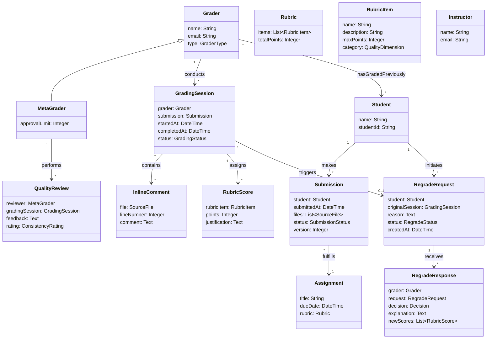

## Introduction: Object-oriented design and the challenge of understandability (5 minutes)

Throughout this course, we've emphasized code qualities like changeability, readability, and maintainability. But these all serve a more fundamental goal: **understandability**. Code that humans can understand is code that humans can successfully work with, modify, and trust.

But here's the challenge: understandability is an inherently subjective quality that depends heavily on context. One common approach is to attempt to model the problem domain in the code. Then, a developer that understand the problem domain can hopefully understand the code.

Consider this scenario for Pawtograder: A student submits their assignment, a grader starts reviewing it, but then the student realizes they forgot something and resubmits. How should our system handle this?

Here are two implementations:

**Approach A: Technical-focused design**
```java
public class SubmissionManager {
    private Map<String, List<byte[]>> fileStorage = new HashMap<>();
    private Map<String, Integer> versionCounters = new HashMap<>();
    private Map<String, Map<String, Object>> gradeData = new HashMap<>();
    
    public String submitFiles(String userId, String assignmentId, byte[] files) {
        String key = userId + "_" + assignmentId;
        
        // Check if grading has started
        Map<String, Object> existingGrade = gradeData.get(key);
        if (existingGrade != null && existingGrade.get("status").equals("IN_PROGRESS")) {
            // Increment version counter
            int version = versionCounters.getOrDefault(key, 0) + 1;
            versionCounters.put(key, version);
            
            // Store files with version
            fileStorage.put(key + "_v" + version, files);
            
            // Copy grade data to new version
            Map<String, Object> newGradeData = new HashMap<>(existingGrade);
            newGradeData.put("status", "NEEDS_REGRADING");
            gradeData.put(key + "_v" + version, newGradeData);
            
            return key + "_v" + version;
        } else {
            fileStorage.put(key, files);
            return key;
        }
    }
}
```

**Approach B: Domain-aligned design**
```java
public class Submission {
    private final Student student;
    private final Assignment assignment;
    private final LocalDateTime submittedAt;
    private final List<SourceFile> files;
    private final TestResults automatedResults;
    private GradingSession activeGradingSession;
    
    public Submission createRevision(List<SourceFile> newFiles) {
        Submission revision = new Submission(student, assignment, newFiles);
        
        if (hasActiveGrading()) {
            // Preserve grader's work by converting to draft
            GradingDraft draft = activeGradingSession.convertToDraft();
            revision.attachDraftGrading(draft);
            
            // Notify grader of the revision
            activeGradingSession.getGrader().notify(
                new RevisionSubmittedEvent(this, revision)
            );
        }
        
        return revision;
    }
    
    public boolean hasActiveGrading() {
        return activeGradingSession != null && !activeGradingSession.isComplete();
    }
}

public class GradingSession {
    private final Grader grader;
    private final Submission submission;
    private final List<InlineComment> comments;
    private final Map<RubricItem, Score> scores;
    private final LocalDateTime startedAt;
    
    public GradingDraft convertToDraft() {
        return new GradingDraft(grader, comments, scores, 
            "Saved as draft due to student resubmission");
    }
}
```

Which is more understandable? 

Approach A might execute faster and use less memory, but:
- What does "v2" mean? Version? Variant? 
- Why are we concatenating strings for keys?
- What happens to the grader's work—is it preserved somewhere in that HashMap?
- What does "NEEDS_REGRADING" actually trigger?

Approach B directly represents domain concepts:
- A `Submission` can have a `GradingSession`
- A `GradingSession` can become a `GradingDraft` 
- The grader is notified when their work is affected
- The code reads like a description of the business process

Object-oriented design promises to help with understandability by letting us structure our code to mirror the problem domain. When our code uses the same concepts, relationships, and vocabulary as our problem domain, it becomes easier for developers to:
- Navigate from a requirement to its implementation
- Predict where functionality lives
- Understand the impact of changes
- Communicate with non-technical stakeholders

But achieving this alignment is difficult. Real-world concepts are messy, full of exceptions, and viewed differently by different stakeholders. A "submission" means something different to a student ("my attempt at the assignment") or a grader ("work I need to evaluate") from the technical perspective ("an execution of a version of the grading script on a version of a student's code").

Domain modeling is our tool for managing this complexity. It forces us to be explicit about our understanding of the problem domain *before* we start making implementation decisions. It's a map that helps us navigate from the fuzzy, human world of requirements to the precise, technical world of code.

## Formulate a domain model given requirements (15 minutes)

Creating a domain model is an iterative process of discovery and refinement. Let's work through a detailed example with the kind of messy requirements you'll encounter in practice:

> The university wants to modernize how graders provide feedback on programming assignments. Graders can provide inline comments on specific lines of code, rate the code quality on various dimensions (correctness, style, design), and assign scores based on a rubric. Some graders ("meta-graders") have additional privileges—they can review other graders' work and handle regrade requests. 
>
> Students can request regrades if they believe their submission was scored incorrectly. The original grader handles the initial regrade request. If the student is still dissatisfied, they can escalate to a meta-grader. As a last resort, the instructor can review any grading decision.
>
> The system needs to ensure fair distribution of grading work and prevent the same grader from repeatedly grading the same student (to avoid bias). Meta-graders should review a sampling of each grader's work to ensure consistency. All grading actions must be tracked for audit purposes.

### Step 1: Extract Candidate Concepts

Start by identifying all nouns and noun phrases:
- graders, meta-graders
- feedback, inline comments
- programming assignments, assignments  
- lines of code, code
- code quality, dimensions (correctness, style, design)
- scores, rubric
- regrade requests
- students, submissions
- original grader
- instructor
- grading work, grading decision
- grading actions, audit

### Step 2: Filter and Consolidate

Now we apply several filters:

**Remove synonyms and choose canonical names:**
- "programming assignments" and "assignments" → Assignment
- "grading work" and "grading decision" → GradingSession
- "grading actions" → AuditLog entry

**Distinguish attributes from concepts:**
- "lines of code" → attribute of SourceFile (not a separate concept)
- "correctness, style, design" → attributes of RubricItem

**Identify what varies and what doesn't:**
- Graders vs Meta-graders have different capabilities → might need subclasses or a role attribute
- Regrade requests have stages (initial → escalated → instructor review)

### Step 3: Discover Hidden Concepts

Requirements often imply concepts without naming them:
- "ensure fair distribution" → implies a **WorkloadDistributor** concept
- "prevent the same grader from repeatedly grading the same student" → implies **GradingConstraints**
- "meta-graders should review a sampling" → implies **QualityReview** concept
- "based on a rubric" → implies **Rubric** and **RubricItem** concepts
- "all grading actions must be tracked" → implies **AuditLog** concept

### Step 4: Build the Initial Domain Model



### Common Problems in Domain Modeling

**Problem 1: Modeling Verbs as Nouns**
Sometimes an action is so important it becomes a concept:
```java
// Wrong: Thinking of "regrade" as just a method
class Grader {
    void regradeSubmission(Submission s) { }
}

// Right: "RegradeRequest" is important enough to be a concept
class RegradeRequest {
    Student requester;
    GradingSession originalSession;
    String reason;
    DateTime requestedAt;
    RegradeStatus status;
    List<RegradeResponse> responses;  // Can have multiple as it escalates
}
```

**Problem 2: Missing Temporal Aspects**
Real domains often involve history and change over time:
```java
// Naive: Only current state
class Submission {
    Grade currentGrade;
}

// Better: Capturing history
class Submission {
    List<GradingSession> gradingSessions;  // All attempts at grading
    List<Submission> previousVersions;      // If student resubmitted
    
    GradingSession getActiveGrading() {
        return gradingSessions.stream()
            .filter(s -> s.getStatus() == GradingStatus.IN_PROGRESS)
            .findFirst().orElse(null);
    }
}
```

**Problem 3: Over-modeling**
Not everything needs to be a class:
```java
// Over-modeled: Making everything a class
class LineNumber {
    private int value;
}

class CommentText {
    private String value;
}

// Appropriate: Using primitives for simple values
class InlineComment {
    int lineNumber;
    String comment;
}
```

**Problem 4: Unclear Multiplicities**
Be specific about relationships:
```java
// Vague: Can a submission have multiple gradings?
Submission --> GradingSession

// Clear: One submission can have multiple grading sessions
// (original, regrades, quality reviews)
Submission "1" --> "*" GradingSession
// But only one can be active at a time (business rule)
```

## Validate domain models with stakeholders (5 minutes)

A domain model is a communication tool. Before writing code, we validate our understanding by reviewing the model with stakeholders. This validation often exposes critical misunderstandings early, when they're cheap to fix.

### Validation Techniques

**Scenario Walkthroughs**: Take specific scenarios and trace them through the model:
> "A student is unhappy with their grade and requests a regrade. According to our model, they create a RegradeRequest linked to their GradingSession. The original Grader creates a RegradeResponse. If the student is still unsatisfied, what happens?"

This might expose issues like:
- "Students can't escalate directly to instructors—it must go through meta-graders first" (missing state in our escalation flow)
- "We need a cooling-off period—students can't request a regrade within 24 hours of receiving grades" (missing temporal constraint)
- "Meta-graders can't handle regrades for submissions they quality-reviewed" (missing constraint)

**Terminology Review**: Ensure we're using the right words:
> "We're calling them 'meta-graders'. Is that the right term?"
> "Actually, we call them 'head TAs' and regular graders are just 'TAs'."

This reveals we should align our model with existing terminology.

**Multiplicity Verification**: Confirm relationship cardinalities:
> "Can a grading session be split between multiple graders?"
> "Yes, for large assignments, we sometimes have one grader do correctness and another do style."

This changes our model from one-to-one to many-to-many and might introduce concepts like `GradingRole` or `PartialGrading`.

**Missing Concepts Discovery**: Ask about exceptions and special cases:
> "What happens if a grader leaves mid-semester?"
> "We need to reassign all their incomplete grading sessions and any pending regrade requests."

This reveals we need a `GraderAvailability` concept and `ReassignmentProcess`.

### Common Problems Exposed by Validation

1. **Hidden Business Rules**: "Regrades can only adjust scores up to 10% without instructor approval"
2. **Temporal Constraints**: "Grading must be completed within one week of submission deadline"
3. **Hidden Actors**: "The department administrator can override grading assignments for workload balance"
4. **Complex States**: "A regrade request isn't just 'pending' or 'resolved'—it can be 'awaiting-response', 'under-review', 'escalated', 'requires-meeting', 'resolved'"
5. **Cross-cutting Concerns**: "We need to track TIME spent on each grading for workload credits and payment"

The domain model after validation might look quite different from our initial attempt, but it will much better represent the actual problem we're solving.

## Translate a domain model into an object-oriented design using responsibility assignment heuristics (20 minutes)

Now we translate our validated domain model into working code. This is where we make critical decisions about which classes own which behaviors. We'll use three key heuristics—Information Expert, Creator, and Controller—to guide these decisions.

Let's implement the regrade request functionality from our domain model:

### Starting with Domain Entities

First, we create classes for our core domain concepts:

```java
public class Grader {
    private final String id;
    private final String name;
    private final GraderType type;  // REGULAR or META
    private final Set<String> previouslyGradedStudentIds;
    
    // Constructor and getters...
}

public class Submission {
    private final String id;
    private final Student student;
    private final Assignment assignment;
    private final LocalDateTime submittedAt;
    private final List<SourceFile> files;
    private final List<GradingSession> gradingSessions;
    
    // Constructor and basic getters...
}

public class GradingSession {
    private final String id;
    private final Grader grader;
    private final Submission submission;
    private final List<InlineComment> comments;
    private final List<RubricScore> scores;
    private LocalDateTime startedAt;
    private LocalDateTime completedAt;
    private GradingStatus status;
    
    // Constructor...
}

public class RegradeRequest {
    private final String id;
    private final Student student;
    private final GradingSession originalSession;
    private final String reason;
    private final List<RegradeResponse> responses;
    private RegradeStatus status;
    private LocalDateTime createdAt;
}
```

### Applying the Information Expert Pattern

**Information Expert: Assign responsibility to the class that has the information needed to fulfill it.**

Let's determine who should be responsible for checking if a regrade can be escalated:

```java
public class RegradeRequest {
    private final List<RegradeResponse> responses;
    private RegradeStatus status;
    
    // Information Expert: RegradeRequest knows its own history
    public boolean canEscalate() {
        // Must have at least one response from original grader
        if (responses.isEmpty()) {
            return false;
        }
        
        // Can't escalate if already resolved or at instructor level
        if (status == RegradeStatus.RESOLVED || 
            status == RegradeStatus.AT_INSTRUCTOR) {
            return false;
        }
        
        // Can't escalate within 24 hours of last response (cooling-off period)
        RegradeResponse lastResponse = responses.get(responses.size() - 1);
        return ChronoUnit.HOURS.between(lastResponse.getCreatedAt(), 
                                       LocalDateTime.now()) >= 24;
    }
    
    public Grader getNextReviewer() {
        // RegradeRequest knows the escalation path
        if (responses.isEmpty()) {
            return originalSession.getGrader();
        }
        
        RegradeResponse lastResponse = responses.get(responses.size() - 1);
        if (lastResponse.getGrader().getType() == GraderType.REGULAR) {
            // Next level: meta-grader
            return null;  // Will be assigned by service
        } else if (lastResponse.getGrader().getType() == GraderType.META) {
            // Next level: instructor
            return originalSession.getSubmission()
                                 .getAssignment()
                                 .getInstructor();
        }
        
        throw new IllegalStateException("Cannot escalate further");
    }
}

public class Grader {
    private final Set<String> previouslyGradedStudentIds;
    private final int activeGradingCount;
    
    // Information Expert: Grader knows its constraints and workload
    public boolean canReviewRegrade(RegradeRequest request) {
        // Can't review own work
        if (request.getOriginalSession().getGrader().equals(this)) {
            return false;
        }
        
        // Meta-graders can't review regrades for sessions they quality-reviewed
        if (type == GraderType.META) {
            boolean reviewedOriginal = qualityReviews.stream()
                .anyMatch(qr -> qr.getGradingSession()
                              .equals(request.getOriginalSession()));
            if (reviewedOriginal) {
                return false;
            }
        }
        
        // Check workload
        return activeGradingCount < getMaxConcurrentGradings();
    }
}
```

### Applying the Creator Pattern

**Creator: Assign class B the responsibility to create instances of class A if B aggregates, contains, records, or has the initializing data for A.**

Who should create `RegradeResponse` objects?

```java
// The Service creates RegradeResponse (has all necessary data and coordinates the process)
public class RegradeService {
    private final GraderRepository graderRepository;
    private final NotificationService notificationService;
    private final AuditLog auditLog;
    
    public RegradeResponse handleRegradeRequest(
            Grader grader,
            RegradeRequest request, 
            Decision decision,
            String explanation,
            List<RubricScore> adjustedScores) {
        
        // Validate grader can handle this request
        if (!grader.canReviewRegrade(request)) {
            throw new UnauthorizedRegradeException();
        }
        
        // Service creates RegradeResponse with all necessary data
        RegradeResponse response = new RegradeResponse(
            UUID.randomUUID().toString(),
            grader,
            request,
            decision,
            explanation,
            adjustedScores,
            LocalDateTime.now()
        );
        
        // Add to request
        request.addResponse(response);
        
        // Update status based on decision
        if (decision == Decision.APPROVED) {
            request.setStatus(RegradeStatus.RESOLVED);
            applyScoreAdjustments(request.getOriginalSession(), adjustedScores);
        } else if (decision == Decision.NEEDS_DISCUSSION) {
            request.setStatus(RegradeStatus.REQUIRES_MEETING);
        }
        
        // Audit and notify
        auditLog.recordRegradeResponse(grader, request, response);
        notificationService.notifyStudentOfRegradeResponse(
            request.getStudent(), response
        );
        
        return response;
    }
}
```

For simpler creation scenarios, the containing object might be the creator:

```java
public class GradingSession {
    private final List<InlineComment> comments = new ArrayList<>();
    private final List<RubricScore> scores = new ArrayList<>();
    
    // Creator: GradingSession contains comments, so it creates them
    public InlineComment addComment(SourceFile file, int lineNumber, String text) {
        // Session has the context needed to create a complete comment
        InlineComment comment = new InlineComment(
            this,
            file,
            lineNumber,
            text,
            LocalDateTime.now()
        );
        comments.add(comment);
        return comment;
    }
    
    // Creator: GradingSession has the rubric context to create scores
    public RubricScore scoreRubricItem(RubricItem item, int points, String justification) {
        if (points > item.getMaxPoints()) {
            throw new InvalidScoreException();
        }
        
        RubricScore score = new RubricScore(item, points, justification);
        scores.add(score);
        return score;
    }
}
```

### Applying the Controller Pattern

**Controller: Assign responsibility for handling system events to a controller class that coordinates the response.**

Controllers manage the flow of complex operations without implementing business logic themselves:

```java
@RestController
public class RegradeController {
    private final RegradeService regradeService;
    private final GraderService graderService;
    private final AuthenticationService authService;
    private final EscalationService escalationService;
    
    @PostMapping("/submissions/{submissionId}/request-regrade")
    public ResponseEntity<RegradeRequestDto> requestRegrade(
            @PathVariable String submissionId,
            @RequestBody RegradeRequestForm form,
            @RequestHeader("Authorization") String token) {
        
        // Controller coordinates but doesn't implement business logic
        Student student = authService.authenticateStudent(token);
        GradingSession session = gradingService.findCompletedSession(submissionId);
        
        // Validate student owns this submission
        if (!session.getSubmission().getStudent().equals(student)) {
            throw new UnauthorizedException();
        }
        
        // Delegate to service for business logic
        RegradeRequest request = regradeService.createRegradeRequest(
            student,
            session,
            form.getReason()
        );
        
        // Transform to DTO for API response
        return ResponseEntity.ok(RegradeRequestDto.fromDomain(request));
    }
    
    @PostMapping("/regrade-requests/{requestId}/escalate")
    public ResponseEntity<RegradeRequestDto> escalateRegrade(
            @PathVariable String requestId,
            @RequestHeader("Authorization") String token) {
        
        Student student = authService.authenticateStudent(token);
        RegradeRequest request = regradeService.findById(requestId);
        
        // Validate student owns this request
        if (!request.getStudent().equals(student)) {
            throw new UnauthorizedException();
        }
        
        // Check if escalation is allowed
        if (!request.canEscalate()) {
            throw new EscalationNotAllowedException(
                "Cannot escalate: " + request.getEscalationBlockReason()
            );
        }
        
        // Complex coordination of escalation
        Grader nextReviewer = escalationService.assignNextReviewer(request);
        request = regradeService.escalateRequest(request, nextReviewer);
        
        // Notify all parties
        notificationService.notifyOfEscalation(
            request.getOriginalSession().getGrader(),
            nextReviewer,
            student,
            request
        );
        
        return ResponseEntity.ok(RegradeRequestDto.fromDomain(request));
    }
    
    @PostMapping("/regrade-requests/{requestId}/respond")
    public ResponseEntity<RegradeResponseDto> respondToRegrade(
            @PathVariable String requestId,
            @RequestBody RegradeResponseForm form,
            @RequestHeader("Authorization") String token) {
        
        Grader grader = authService.authenticateGrader(token);
        RegradeRequest request = regradeService.findById(requestId);
        
        // Validate grader is assigned to this request
        if (!request.getCurrentReviewer().equals(grader)) {
            throw new UnauthorizedException();
        }
        
        // Parse score adjustments if provided
        List<RubricScore> adjustedScores = form.hasScoreAdjustments() 
            ? parseScoreAdjustments(form.getAdjustments(), request.getOriginalSession())
            : Collections.emptyList();
        
        // Delegate to service
        RegradeResponse response = regradeService.handleRegradeRequest(
            grader,
            request,
            form.getDecision(),
            form.getExplanation(),
            adjustedScores
        );
        
        return ResponseEntity.ok(RegradeResponseDto.fromDomain(response));
    }
}
```

### Putting It All Together

Here's how these patterns work together in our complete design:

```java
// Information Expert: Domain objects know about themselves
public class RegradeRequest {
    public boolean canEscalate() { 
        /* uses its own data to determine if escalation is allowed */ 
    }
}

public class Grader {
    public boolean canReviewRegrade(RegradeRequest request) {
        /* knows its own constraints and workload */
    }
}

// Creator: Services create complex aggregates
public class RegradeService {
    public RegradeResponse handleRegradeRequest(...) {
        // Service has all data needed to create response
        RegradeResponse response = new RegradeResponse(...);
        // ... coordinate with other services
        return response;
    }
}

// Creator: Domain objects create their components  
public class GradingSession {
    public InlineComment addComment(SourceFile file, int line, String text) {
        /* creates and contains comments */
    }
}

// Controller: Coordinates without implementing business logic
public class RegradeController {
    public ResponseEntity<RegradeRequestDto> requestRegrade(...) {
        // Authenticate, validate, delegate, transform
    }
}
```

These patterns guide us toward a design where:
- Each class has clear responsibilities
- Business logic stays in domain objects when possible
- Services coordinate complex operations
- Controllers handle external interactions without business logic
- The code structure mirrors our domain understanding

## Evaluate the representational gap between a domain model and an object-oriented design (10 minutes)

The **representational gap** is the difference between our domain model (how we understand the problem) and our object-oriented design (how we implement the solution). A smaller gap generally means easier-to-understand code, but some gap is inevitable due to technical constraints.

### Sources of Representational Gap

Let's examine where gaps emerge in our grading system:

**Technical Infrastructure**
Our implementation requires many technical classes absent from the domain model:

```java
// Domain model has no concept of these:
public interface RegradeRepository {
    void save(RegradeRequest request);
    Optional<RegradeRequest> findById(String id);
}

public class RegradeRequestDto {
    // JSON representation for API
}

public class DatabaseTransaction {
    // Transaction management
}
```

**Performance Optimization**
Domain models show simple relationships, but performance requires complexity:

```java
// Domain model: "Grader has graded many students"
// Simple interpretation:
public class Grader {
    private Set<Student> gradedStudents;  // Could be thousands!
}

// Actual implementation for performance:
public class Grader {
    private Set<String> recentlyGradedStudentIds;  // Just recent IDs
    
    // Full history lives in database, accessed only when needed
}

public class GradingHistoryService {
    @Cacheable
    public boolean hasGradedStudent(String graderId, String studentId) {
        // Database query with caching
    }
}
```

**Concurrent Access**
The domain model doesn't capture concurrency concerns:

```java
// Domain doesn't consider multiple graders trying to handle same regrade
public class RegradeService {
    @Transactional(isolation = Isolation.SERIALIZABLE)
    public RegradeResponse handleRegradeRequest(
            Grader grader,
            RegradeRequest request,
            ...) {
        
        // Lock request to prevent concurrent responses
        requestLockService.acquireLock(request.getId());
        
        try {
            // Check request hasn't been handled by someone else
            RegradeRequest current = repository.findById(request.getId());
            if (current.hasResponsesSince(request.getLastResponse())) {
                throw new ConcurrentModificationException();
            }
            
            // Process response...
        } finally {
            requestLockService.releaseLock(request.getId());
        }
    }
}
```

### Strategies to Minimize the Gap

**Domain-Driven Design (DDD)**
DDD provides patterns to keep technical concerns from polluting domain logic. Key concepts include bounded contexts (separate models for different parts of the system), aggregates (clusters of objects treated as units), and ubiquitous language (consistent terminology throughout code and discussions). In our system, a `RegradeRequest` might be an aggregate root that ensures all modifications to the regrade process go through it, maintaining consistency.

```java
// DDD Aggregate Root ensures consistency
public class RegradeRequest {  // Aggregate root
    private List<RegradeResponse> responses;  // Part of aggregate
    private RegradeStatus status;  // Part of aggregate
    
    // All modifications go through aggregate root
    public void addResponse(RegradeResponse response) {
        validateNotResolved();
        responses.add(response);
        updateStatus(response);
    }
}
```

**Hexagonal Architecture (Ports and Adapters)**
This pattern isolates domain logic from external concerns by defining clear boundaries. The domain defines ports (interfaces) that adapters implement for specific technologies. This keeps infrastructure concerns completely separate from business logic, allowing the domain model to remain pure.

```java
// Port (defined by domain)
public interface NotificationPort {
    void notifyStudentOfRegradeResponse(Student student, RegradeResponse response);
}

// Adapter (implements technical details)
public class EmailNotificationAdapter implements NotificationPort {
    public void notifyStudentOfRegradeResponse(Student student, RegradeResponse response) {
        String subject = "Regrade Request Update";
        String body = formatRegradeEmail(response);
        emailService.send(student.getEmail(), subject, body);
    }
}
```

**Rich Domain Model**
Instead of anemic domain objects (just data with getters/setters), put behavior in domain classes. This keeps business logic close to the data it operates on, making the code more understandable and reducing the gap between how we think about the domain and how we implement it.

```java
// Anemic model (larger gap)
public class RegradeRequest {
    private List<RegradeResponse> responses;
    private RegradeStatus status;
    // Just getters and setters
}

// Rich model (smaller gap)
public class RegradeRequest {
    public boolean canEscalate() {
        // Business logic lives with the data
        return hasResponse() && 
               !isResolved() && 
               hasCoolingOffPeriodPassed();
    }
    
    public void escalate(Grader newReviewer) {
        if (!canEscalate()) {
            throw new EscalationNotAllowedException();
        }
        this.status = RegradeStatus.ESCALATED;
        this.currentReviewer = newReviewer;
        this.escalatedAt = LocalDateTime.now();
    }
}
```

**Event Sourcing**
Instead of storing current state, store domain events that led to that state. This perfectly captures the domain's temporal aspects and provides a complete audit trail. For a regrade system where audit is critical, this can actually reduce the representational gap.

```java
// Traditional: Store current state
public class RegradeRequest {
    private RegradeStatus status;
    private List<RegradeResponse> responses;
}

// Event Sourcing: Store what happened
public class RegradeEvents {
    private List<DomainEvent> events = new ArrayList<>();
    
    public void recordRequestCreated(Student student, GradingSession session, String reason) {
        events.add(new RegradeRequestedEvent(student, session, reason));
    }
    
    public void recordResponseReceived(Grader grader, Decision decision, String explanation) {
        events.add(new RegradeRespondedEvent(grader, decision, explanation));
    }
    
    public void recordEscalation(Grader from, Grader to) {
        events.add(new RegradeEscalatedEvent(from, to));
    }
    
    // Reconstruct current state from events
    public RegradeRequest buildCurrentState() {
        // Apply events in sequence
    }
}
```

**Repository Pattern**
Repositories provide an abstraction over data access that uses domain language. They make persistence look like an in-memory collection, hiding database complexity while speaking the language of the domain.

```java
// Repository speaks domain language
public interface RegradeRepository {
    List<RegradeRequest> findPendingRequestsForGrader(Grader grader);
    List<RegradeRequest> findEscalatedRequestsNeedingMetaGrader();
    Optional<RegradeRequest> findBySubmissionAndStudent(Submission sub, Student student);
    
    // Not: executeSQL("SELECT * FROM regrade_requests WHERE...")
}
```

### Measuring the Gap

Ask these questions to evaluate your representational gap:

1. **Can a domain expert read your core classes and understand them?**
2. **Do method names use domain vocabulary or technical jargon?**
3. **Is domain logic mixed with technical concerns?**
4. **How many layers between user story and implementation?**
5. **Could you explain the code structure by sketching the domain model?**

Remember: Some gap is inevitable. The goal is not zero gap, but rather ensuring the gap exists only where necessary and is well-contained. Your domain logic should be recognizable even with technical necessities around it.

## Summary

Domain modeling bridges human understanding and code implementation. By explicitly modeling our domain before coding, we create a shared vocabulary with stakeholders and expose misunderstandings early. The process of validating domain models with stakeholders reveals hidden requirements, business rules, and edge cases that would be expensive to discover later.

When translating domain models to code, responsibility assignment heuristics—Information Expert, Creator, and Controller—guide us toward maintainable designs. These patterns help ensure that behavior lands in logical places, making code easier to understand and modify.

The representational gap between domain model and implementation is inevitable but should be minimized through architectural patterns that isolate technical concerns from domain logic. A smaller gap leads to code that stakeholders can understand, developers can navigate, and teams can confidently modify as requirements evolve.

The key insight: Object-oriented design isn't just about classes and inheritance—it's about creating code that reflects human understanding of the problem space. When we succeed, our code becomes a precise yet understandable expression of the solution to real-world problems.