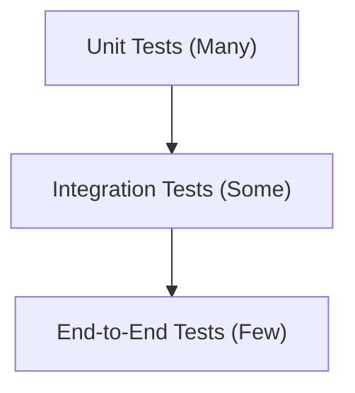

## Introduction

Testing is a critical part of software development. In this lecture, we explore two key aspects of testing:

* **Unit Testing with Mock Objects**: Isolating individual components using *mock objects* (with a focus on Java's JUnit and Mockito libraries).
* **Integration Testing**: Understanding when to test interactions between components instead of testing components in isolation.

By the end of this lecture, you will understand how to use mocks in JUnit tests, the trade-offs involved in mocking, and how to decide when an integration test is more appropriate than a unit test.

## Utilize mocks to write unit tests for a class that depends on other classes (15 minutes)

Unit tests verify the behavior of a small "unit" of code (often a single class or method) in isolation. To truly isolate the *class under test*, we often replace its *collaborators* or *dependencies* with *mock objects*. This is particularly crucial for external dependencies like databases, network services (web APIs), or file system interactions. Using real external dependencies can make tests slow, non-deterministic (e.g., a network service might be temporarily unavailable), or cause unintended side effects (like writing test data to a production database or sending actual emails). Mocks, as fake implementations of these dependencies, allow us to control their behavior precisely, ensuring tests are fast, reliable, and focused solely on the unit being tested. A mock object allows us to simulate specific responses (e.g., "database record found" or "network error") and verify that our class under test interacts with its dependencies as expected. It is one type of *test double* (a generic term for any stand-in used in place of a real component during testing), specifically one that can have its behavior programmed and its interactions checked.

Mocks are versatile and can be applied at various scales of software development to achieve isolation:

* **Method-level isolation**: If you want to test a single, complex method within a class, you can sometimes use mocks to isolate it from other methods or complex internal state within the same class, though this is less common than mocking external dependencies.
* **Class-level isolation**: This is the most common use case. If you want to test a single class, you can isolate it from all other classes it depends on by providing mock implementations for those dependencies.
* **Application-level isolation**: Even larger components or entire applications can benefit from mocking. If you want to test an application without its external dependencies (e.g., databases, third-party APIs, or other services), you can mock these external resources. For example, one might test a grading system like Pawtograder by mocking its interactions with GitHub to simulate different scenarios without needing a live connection or actual repository events.

In essence, mock objects serve two primary purposes in unit testing: they allow us to **simulate the behavior** of dependencies (e.g., making them return specific values or throw errors on demand) and to **verify interactions** (e.g., ensuring that the class under test calls its dependencies correctly).

For example, consider a `UserService` class that depends on a `UserRepository` (for database operations) and an `EmailService` (for sending notifications). In a unit test for `UserService.registerUser(userData)`, we would use mock versions of `UserRepository` and `EmailService`. This approach allows us to:

* **Simulate various scenarios with clear intent**: We can program the mocks to behave in specific ways for different test cases.
  * To test successful registration of a new user, we could **stub** `mockUserRepository.findByUsername(userData.getUsername())` to return `null` (indicating the user doesn't exist) and `mockUserRepository.save(any(User.class))` to return the saved user object. The intent here is clear: simulate a scenario where the username is available.
  * To test the "user already exists" scenario, we could stub `mockUserRepository.findByUsername(userData.getUsername())` to return an existing `User` object. This directly sets up the condition we want to test.
  * To test how `UserService` handles an email sending failure, we might stub `mockEmailService.sendWelcomeEmail(any(User.class))` to throw an `EmailException`. This allows us to test error handling paths that might be difficult to trigger with a real email service.
    Each stub is set up with a clear intent to drive the `UserService` through a specific execution path.

* **Assert results and verify side effects**: After calling `userService.registerUser(userData)`, we first **assert** the outcome. For a successful registration, this might involve checking that the returned `User` object is not null and has the expected properties. Then, we **verify** that critical interactions with collaborators occurred. For instance, we would verify that `mockUserRepository.save()` was called exactly once with the correct user data, and that `mockEmailService.sendWelcomeEmail()` was also called once with the newly created user. This two-pronged approach—asserting results and verifying interactions—ensures the `UserService` not only produces the right result but also correctly orchestrates its dependencies, all without actually hitting a database or sending a real email.

When writing such tests, it's a best practice to **keep each unit test focused on one logical behavior or scenario**. For the `UserService.registerUser` method, you might have separate tests for: successful registration, registration of an existing user, registration with an invalid email, registration when the database save fails, and registration when email sending fails. This makes tests easier to understand, debug, and maintain; when a test fails, its name and focused nature immediately points to the specific scenario that broke. Furthermore, it's important to **avoid mocking value objects or simple data model classes**. For instance, in the `UserService` example, you would use real instances of `User` or any data transfer objects (DTOs) passed to or returned by its methods. Mocking these classes, which primarily hold data and have minimal behavior (like getters/setters), provides little benefit, adds unnecessary complexity to test setup, and can hide issues if these simple objects have any validation or transformation logic. Always use real instances for data containers.

## Describe the tradeoffs of using mocks in test suites (10 minutes)

Mock objects are powerful for isolating units and simulating scenarios, but they come with trade-offs:

* **Isolation vs. Realism**: Using mocks, you isolate the unit from real dependencies, leading to faster and more focused tests. But this isolation means you might not catch issues that would occur when the real components interact. For example, two classes might have a mismatch in how they handle data (say, one expects a non-null field that the other never sets). A unit test with mocks could pass (because the mock was told to provide the "perfect" data, e.g., a mock might be told to return a `User` object with a perfectly formatted, non-null email, while the real database might occasionally return a `User` with a missing or malformed email due to an old data import, which your code might not handle gracefully), whereas the real integration might fail.
* **Brittle tests**: If overused, mocks can make tests brittle. Tests might become tightly coupled to the implementation details of the code under test. For instance, if you verify that a certain method was called, a harmless refactoring (changing *how* the code is structured internally to achieve the same outcome) might cause the test to fail even though the outward behavior (the *what*) remains correct. This often happens when tests **don't focus on the unit's outward behavior but instead test internal implementation details**. For example, avoid verifying that a private helper method was called or the exact sequence of internal calls, unless that sequence is part of the explicit specification of the unit. If `userService.registerUser` internally calls a private helper method `isValidEmail(String email)`, tests should not try to verify that `isValidEmail` was called. Instead, they should test `registerUser` with an invalid email and assert that registration fails or the appropriate error is communicated. This ensures tests don't break due to harmless refactoring of internal details. Similarly, **don't overspecify interactions by verifying every minor call** to a mock. Only use `verify` for interactions that are crucial to the unit's contract or represent significant side effects. Verifying numerous internal or trivial calls makes tests more coupled to the current implementation and thus more prone to breaking during refactoring. In other words, tests could start failing not because the functionality is wrong, but because the way it's achieved changed.
* **False sense of security**: 100% passing unit tests (with everything mocked) doesn't guarantee the system works in reality. If the mocks don't accurately mimic the real interactions, the code could still fail when integrated. For example, you might mock a database repository to return a hardcoded value, but the real database could behave differently or throw an error your test never considered. It's important to remember that mocks remove the actual complexities of systems, so some bugs will only surface with real integration.
* **Maintenance overhead**: Every time the behavior of a dependency changes, you may need to update the test stubs and expectations. For instance, if `UserRepository.save()` changes to return an object instead of a boolean, many tests with stubs expecting a boolean will break. With many mocks, tests can require a lot of upkeep as the code evolves. Well-structured tests aim to minimize how often they need changes when production code changes (unless that change affects the external behavior or contract).

Given these trade-offs, it's important to use mocks judiciously. Mocks solve specific problems (like simulating failures or verifying side effects) but should not be the default for every test scenario. Therefore, a key best practice is to **prefer real instances or simple fake implementations when they suffice**. If using the real class in a test is straightforward, doesn't involve external resources (like network or disk I/O), and doesn't add undue complexity or slowness, it's often better than introducing a mock. For dependencies that are simple, like an in-memory data structure, or for collaborators whose real behavior is easy to manage in a test setting, using a real object or a *fake* (a lightweight, test-specific implementation that adheres to the interface but isn't for production) can lead to more realistic and maintainable tests. For example, instead of mocking a repository that operates on an in-memory data structure, you might just use a real instance of that repository class configured with a simple in-memory list. This approach is often called using a *fake* implementation and can make the test more realistic while still avoiding complex external dependencies. Save mocks for cases where you genuinely need to control complex behavior (like forcing error conditions that are hard to reproduce with a real object) or observe interactions that a real object wouldn't easily expose.

### Best Practices for Using Mocks

* **Do** use mock objects to isolate external dependencies (e.g., databases, web services, file I/O). This keeps unit tests fast and avoids unpredictable side effects from those external systems.
* **Do** keep each unit test focused on one logical behavior or scenario. Each test should verify one thing (a specific outcome or interaction of the unit under test) to make debugging easier and ensure clarity of what failed.
* **Don't** test internal implementation details that don't affect the unit's outward behavior. For example, avoid verifying that a private helper method was called or the exact sequence of internal calls, unless that sequence is part of the specification. For instance, if `userService.registerUser` internally calls a private helper `private boolean isValidEmail(String email)`, don't try to verify that `isValidEmail` was called. Instead, test `registerUser` with an invalid email and assert that registration fails. This ensures tests don't break due to harmless refactoring.
* **Do** prefer real instances or simple fake implementations when they suffice. If using the real class in a test is straightforward and doesn't involve external resources or complex setup, use it instead of a mock. Save mocks for cases where you need to control behavior (e.g., force errors) or observe interactions that a real object wouldn't easily let you see.
* **Don't** mock value objects or data model classes. For example, do not mock a `User` object that is simply a data container. Use real instances of such classes in your tests. Mocking these classes hides their own (albeit simple) behavior, provides little benefit, and can make tests harder to understand. This ensures you're working with actual values and that if those classes have any simple logic (like getters/setters or validation), it's not bypassed.

By following these practices, you can write unit tests that are robust, readable, and maintainable, making effective use of mock objects without falling into common pitfalls.

## Identify circumstances where integration tests are more appropriate than unit tests (10 minutes)

Unit tests (with or without mocks) validate individual components in isolation. **Integration tests**, on the other hand, are designed to validate the cooperation between multiple components or systems. They are used **strategically for critical workflows and integration points**, such as ensuring that your service layer correctly interacts with the data access layer and the database, or that your application correctly communicates with an external payment gateway (though, as we'll see, usually a test version or mock of it). Instead of isolating everything, an integration test involves real implementations of these modules (and sometimes managed test versions of external resources) working together, simulating a production scenario or a close approximation.

For example, after thoroughly unit-testing `UserService` with mocks, you might write an integration test that involves `UserService` running with a real database (perhaps a dedicated test database or one that uses transactions to roll back changes) and a component that stands in for the real email service (e.g., a test version that logs emails or interacts with a local mock SMTP server). This integration test would ensure that the pieces fit together: the `UserService` can actually persist data to the database and trigger the email notification logic as expected. If there's a misconfiguration (like the database schema not matching what the `UserRepository` expects, or an issue in how `UserService` is wired to `EmailService` via dependency injection), a unit test with mocks wouldn't catch it, but an integration test likely would. It's crucial that such tests are **kept isolated and reproducible**; each integration test should ideally set up its own required data and clean up afterwards, or use mechanisms like database transactions that are rolled back, to prevent tests from interfering with each other and ensure consistent results.

This example also raises an important question: if the integration test is necessary anyway and perhaps even simpler to write in some cases (especially if the unit test requires extensive mocking), what was the point of the unit test? This is a crucial, and often subjective, judgment call. While well-isolated unit tests provide fast, precise feedback and help pinpoint errors at a granular level, there are situations where the effort to mock numerous or complex dependencies might outweigh these benefits. If a unit test becomes overly complex due to mocking, making it brittle and hard to maintain, a developer might reasonably choose to rely more on an integration test for that particular piece of functionality. The key is to weigh the benefits of isolation and speed against the complexity of mocking and the broader, more realistic coverage an integration test can provide. This balance is a key consideration when designing a testing strategy. However, one should **not use integration tests to re-test trivial logic already thoroughly covered by unit tests**. Their strength lies in verifying the *connections* between components, not revalidating the internal logic of each component if unit tests already do that well.

### What is an Integration Test?

An integration test differs from a unit test in terms of scope, testing more modules at once and ideally without mocking the direct collaborators being tested. They aim for a setup that is closer to real-world usage, often involving **realistic test data and configurations** to better mimic production behavior. For example, test databases should be populated with sample data that reflects the variety and potential edge cases of production data. They don't replace unit tests; instead, they complement them by catching issues at the boundaries between units, which often relate to configuration, data format mismatches, or unexpected interaction side effects. Integration testing often requires more setup: e.g., starting up a database or using an in-memory database, preparing test data, or configuring multiple components to talk to each other. When dealing with actual third-party services (like a live payment gateway or social media API), it's a firm best practice to **not rely on actual third-party services or unstable external systems** in your automated integration tests. Instead, use local mock servers (e.g., WireMock for HTTP APIs) or stubs for these external dependencies. This makes the tests deterministic (they produce the same result every time, unaffected by network glitches or third-party downtime), faster, and avoids potential costs or side effects from hitting live services.

### Unit Tests vs. Integration Tests: Key Differences

* **Scope**: A unit test focuses on one component at a time (a specific function, method, or class), using test doubles (mocks, stubs, fakes) for its collaborators. An integration test covers a broader scope, combining two or more components to test their interaction. For example, a unit test might test `UserService.registerUser` logic in isolation, while an integration test might test the entire user registration process hitting the database and verifying an email was "sent" via a mock email service. It's often better to **limit the scope of an integration test to a specific set of related components** (e.g., Service + Repository + Test Database) rather than creating massive tests that try to exercise the entire application. Smaller, focused integration tests are easier to write, faster to run, and significantly easier to debug when they fail because the potential sources of error are more constrained.
* **Dependencies**: Unit tests replace or simulate dependencies to isolate the behavior of the unit under test. Integration tests, by definition, use real implementations of the components being integrated or realistic test doubles for external systems (like the mock SMTP server or WireMock mentioned earlier).
* **Execution Speed**: Unit tests are typically very fast. Integration tests tend to be slower. This speed difference means it's important to manage how and when integration tests are run so they **don't let integration tests slow down your development cycle too much**. For instance, run unit tests on every commit or even as you type, but reserve the full suite of integration tests for a CI/CD pipeline or nightly builds.
* **Complexity and Maintenance**: Writing integration tests can be more complex. They can also be harder to debug. Because more components are involved, it can be challenging to pinpoint the source of a failure. Therefore, it's good practice to **include diagnostic information to aid debugging of integration failures**, such as detailed logging within the test or by the components themselves when run in a test environment. Clear assertions at various points in the test can also help narrow down where an interaction went wrong.
* **Feedback and Confidence**: Unit tests provide quick feedback. Integration tests provide confidence that the system works as a whole. While they run slower, their value is in validating that the major pieces of the application can work together correctly, especially for those **critical workflows** identified earlier.
* **System configuration and wiring**: Many frameworks (like Spring in Java) use configuration files or annotations to wire components together. Integration tests are invaluable to ensure that the configuration is correct. Unit tests with manually injected mocks *cannot* catch these kinds of wiring or configuration errors.
* **Avoiding over-mocking**: If you find that to test something thoroughly at the unit level you would need to mock a large portion of the application, it's a sign that an integration test might be more suitable and less brittle.

However, integration tests should not be used for everything. If something can be tested quickly and sufficiently with a unit test, it's often better to do so. The decision to write an integration test should be **strategic**, focusing on areas where the interaction itself is complex or critical.

In practice, teams employ a **mix** of both types of tests, starting with a **strong base of unit tests first**. Unit tests should cover the majority of code paths and edge cases in individual components. Then, layer in a smaller number of integration tests for the important flows. This balanced approach aligns with the common "Test Pyramid" concept: a wide base of many unit tests, a middle layer of some integration tests, and a thin top of a few end-to-end tests (such as UI tests).

The idea is to get broad coverage and quick feedback through unit tests, while still having integration tests to verify that the system works when all pieces are put together.

This lecture covered several key aspects of software testing:

* **Unit Tests & Mocks**: Unit tests focus on small, isolated code units. Mock objects are crucial for this isolation, allowing you to simulate dependency behavior (e.g., return values, throw exceptions) and verify interactions (e.g., method calls, parameters). Mocks can be applied at various scales, from methods to classes to entire application boundaries (like faking external services).
* **Mocking Tradeoffs & Best Practices**: While powerful, mocks introduce tradeoffs. They can make tests brittle if tied too closely to implementation details, create a false sense of security if mocks don't accurately represent real behavior, and add maintenance overhead. Key practices include focusing tests on single behaviors, not mocking value objects, preferring real or fake objects when simpler, and avoiding tests of internal implementation details.
* **Integration Tests**: These tests verify the cooperation between multiple components, subsystems, or services, ensuring they work together as intended in a more production-like environment. They are vital for catching issues that unit tests, with their isolation, cannot, such as configuration errors, data schema mismatches, or inter-component communication failures.
* **Unit vs. Integration Tests**: The choice between them involves considering scope (single unit vs. multiple components), dependency handling (mocked vs. real/test-doubles for externals), execution speed (fast vs. slower), complexity, and the type of confidence gained. A subjective judgment is often needed, especially if unit tests require overly complex mocking, potentially making a direct integration test more pragmatic.
* **The Test Pyramid**: This model advocates for a testing strategy with a large base of fast, inexpensive unit tests, a smaller layer of more comprehensive integration tests, and a very small number of broad end-to-end tests at the top. This balances coverage, speed, and cost.
* **Effective Testing Strategy**: A robust strategy uses a mix of test types. It prioritizes unit tests for granular logic and integration tests for critical workflows and interaction points. It involves using realistic test data (where appropriate for integration tests), ensuring tests are independent and reproducible, and continuously evaluating and refining the test suite as the software evolves.

## Conclusion

In summary, **unit tests** (often with the help of mock objects) and **integration tests** are both essential tools in a developer's testing strategy. Unit tests allow us to verify the correctness of individual components quickly and in isolation, with mocks helping to simulate interactions and external conditions. Integration tests step back and exercise the system at a higher level, ensuring that components work together as expected in a realistic environment. A well-rounded test suite will include a strong base of unit tests for fast feedback and thorough coverage of logic, complemented by targeted integration tests for the critical paths and interactions. By understanding the purpose of each type of test and following best practices for mocking and integration, we can achieve high confidence in our software's reliability without sacrificing development speed. Moreover, a commitment to thorough testing often goes hand-in-hand with good software design, as well-defined modules with clear interfaces are inherently more testable. Ultimately, the goal is to catch bugs as early as possible with unit tests, and to not be caught off guard by issues that only appear when everything is put together – that's where integration tests have our back. Investing in a solid testing strategy empowers developers to build more robust and maintainable software with greater confidence.
