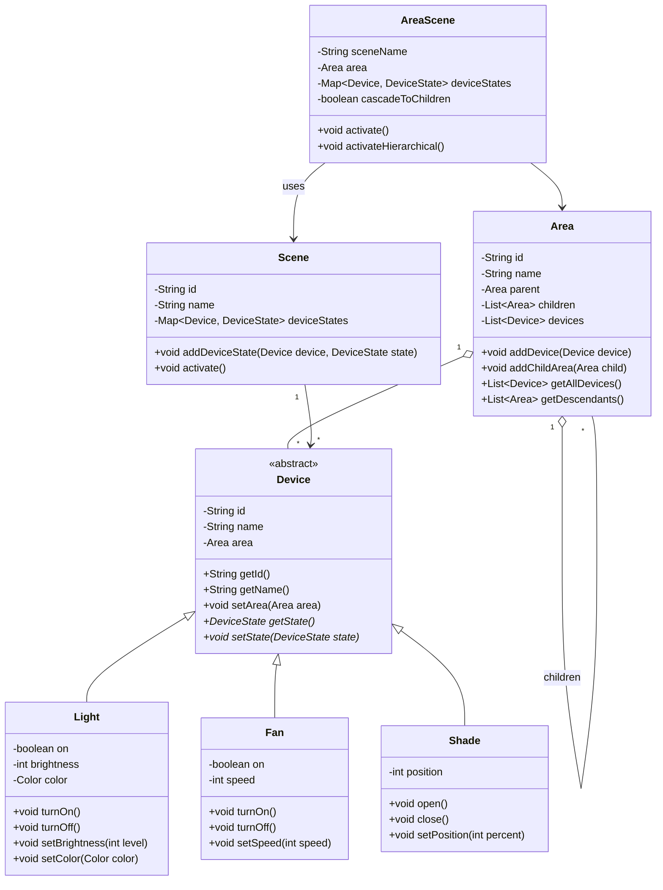
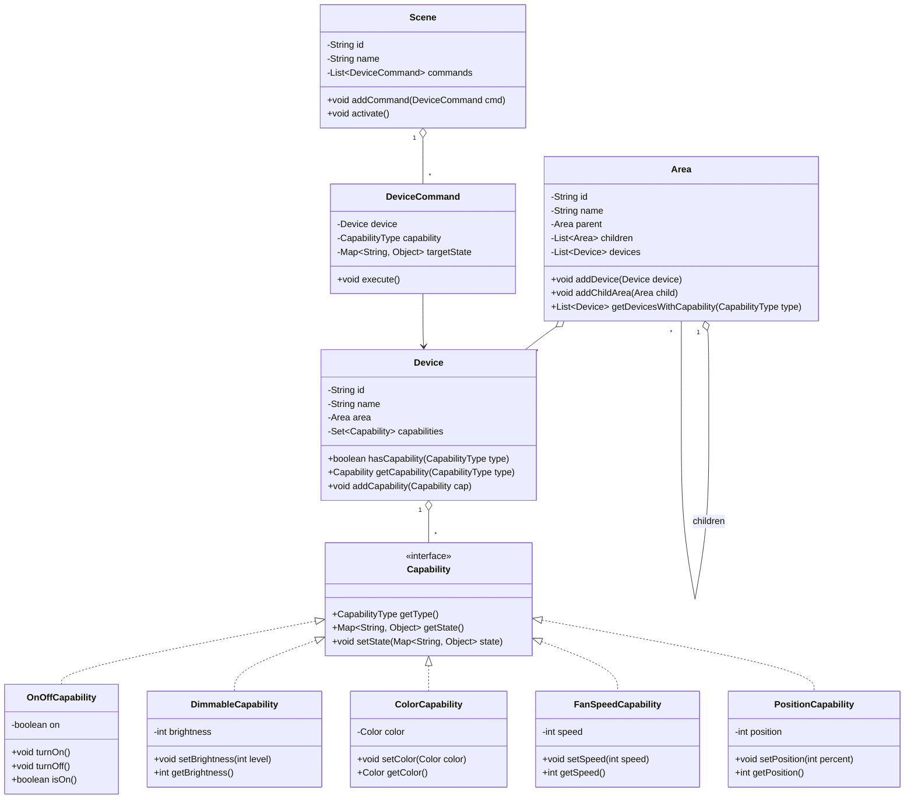
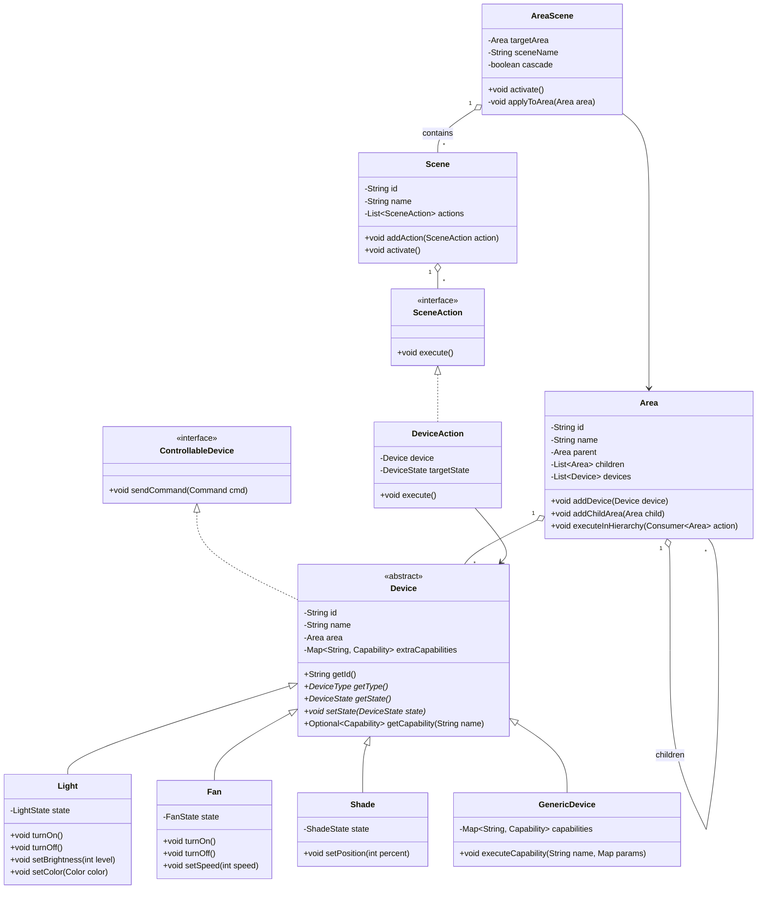
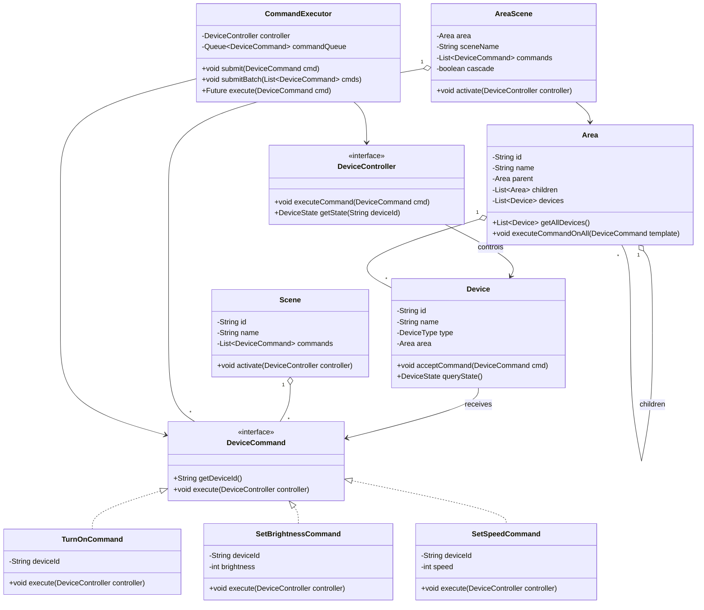
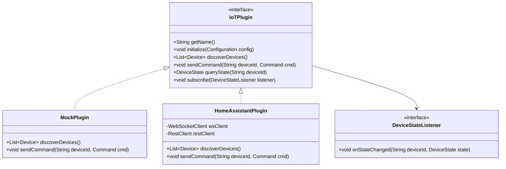

## Define AI programming agents and enumerate their capabilities (10 minutes)

### AI amplifies human capabilities, not replaces them
- AI tools free developers to focus on optimization and business value
- Software is used in a complex socio-technical system. Humans struggle to define that complete context, and AI tools have limited context windows. Humans will always be needed to understand the complete context of a software system.
- Software development is a creative process, and AI tools can help with the creative process, but they can not replace the human creativity and intuition.
- AI tools are constantly improving, and their capabilities will continue to improve, but there will *always* be a need for human creativity, judgement, and oversight.

### What are AI Coding Agents?

AI coding agents are specialized software tools that integrate Large Language Models (LLMs) directly into the development environment to assist with programming tasks. Examples include **Cursor**, **GitHub Copilot**, **Codeium**, and **Tabnine**. These tools provide two primary interaction modes:

1. **Smart Tab-Complete (Autocomplete)**: As you type, the agent analyzes your current code context and suggests completions inline. This includes single-line completions, multi-line function bodies, and even entire code blocks based on comments or function signatures.

2. **Chat-Based Interfaces**: Interactive conversations where you can ask questions, request code generation, explain code, debug issues, or refactor code. The agent maintains context about your open files and project structure throughout the conversation.

### Coding Agents vs. Direct Model Interaction

Even when using the same underlying LLM (e.g., Claude Sonnet), coding agents differ significantly from direct interaction on platforms like claude.ai:

**Coding agents provide:**
- **Codebase Awareness**: Automatic access to your open files, project structure, and recent edits
- **Language-Specific Context**: Understanding of file types, syntax highlighting, and project configuration
- **Seamless Integration**: Code suggestions appear directly in your editor, and edits can be applied with a single keystroke
- **Multi-File Context**: Can reference and understand relationships across multiple files in your project
- **IDE Tooling Integration**: Deep integration with development tools that enables powerful feedback loops

**Direct model interaction requires:**
- Manual copying and pasting of code context
- Explicit file and project structure descriptions
- Copying generated code back into your editor
- Managing context windows manually

This integration makes coding agents significantly more efficient for iterative development workflows, though direct interaction may be preferable for exploratory conversations or when you need to work outside your codebase.

#### Productivity Improvements from IDE Tooling

The integration with IDE tooling creates powerful feedback loops that dramatically improve productivity:

**Linter and Build Error Feedback:**
Coding agents can read linter warnings and compilation errors directly from your IDE, then automatically generate fixes. For example:
- You ask the agent to "implement a method to calculate the average of a list"
- The agent generates code, but it has a type mismatch error
- The IDE's linter immediately flags the error
- The agent sees the error message, understands the issue, and regenerates corrected code
- This cycle continues until the code compiles successfully

**Test-Driven Iteration:**
Many modern coding agents can execute test cases and use the results to refine implementations:
- You write a test case: `assertEquals(5, calculator.average([3, 4, 5, 8]))`
- The agent generates an initial implementation
- The agent runs the test and sees it fails
- The agent analyzes the failure (e.g., "expected 5.0 but got 4.5") and understands the logic error
- The agent fixes the implementation and re-runs the test
- This continues until all tests pass

This creates a rapid iteration cycle where the agent can self-correct based on concrete feedback, rather than relying solely on pattern matching from training data. The combination of static analysis (linters, type checkers) and dynamic verification (test execution) allows coding agents to produce more reliable code with less manual intervention.

### Strengths of AI Programming Agents:
- **Pattern Recognition**: Excel at recognizing and reproducing common coding patterns from their training data or applying patterns from one part of the codebase to another
- **Syntax Knowledge**: Have extensive knowledge of language syntax, standard libraries, and common frameworks
- **Cross-Domain Transfer**: Can apply patterns from one domain or language to another
- **Natural Language Understanding**: Can translate requirements and comments into working code
- **Contextual Awareness**: Understand your current code context and can generate code that fits existing patterns
- **Rapid Prototyping**: Enable quick generation of boilerplate code, tests, and common implementations

### Limitations to Consider:
- **Context Window Constraints**: Can only process a limited amount of information at once (typically 4,000-128,000 tokens), which may not include your entire codebase
- **No Runtime Verification**: Cannot execute code or verify correctness without external tools—they generate code based on patterns, not execution results
- **Training Data Cutoff**: May not know about recent libraries, API changes, or language features released after their training cutoff
- **Limited Project-Specific Context**: Don't automatically know your team's conventions, architectural decisions, or business rules unless explicitly provided
- **Hallucination Risk**: May generate plausible-looking code that doesn't actually work or uses non-existent APIs
- **Lack of Deep Understanding**: Don't truly "understand" your codebase's architecture or design rationale—they work with surface-level patterns


AI programming agents can be used throughout the systematic program design and implementation process. It is important that, from the outset, we recognize that they do not *replace* the design and implementation process. For some software problems it may be possible to "one-shot" the entire process. However, no matter how good AI coding agents become, there will always be more complex software problems that require a more iterative process. One of the goals of this course is to teach you the skills to productively utilize AI coding agents to write larger and higher-quality software than otherwise possible.

### Tasks across the software development lifecycle
- **Requirements Phase**: Stakeholder analysis, functionality definition, goal refinement
- **Design Phase**: Data type definitions, behavior specifications, example generation
- **Implementation Phase**: Code generation, refactoring, debugging, code review
- **Validation Phase**: Test plan development, test generation, user study protocol development
- **Operations Phase**: Automation design, deployment, feedback analysis, bug fixes


## A high-level workflow for using AI programming agents (5 minutes)
Informed by [state-of-the-art research on Developer-AI collaboration](https://arxiv.org/abs/2506.00202), we present a 6-step human-AI collaboration workflow for using AI programming agents. This workflow was constructed by researchers at Google who studied how 21 expert developers worked with AI programming agents:

1. **Identify**: Recognize what information AI needs (requires domain knowledge)
2. **Engage**: Craft effective prompts with appropriate context and stating the desired outcomes
3. **Evaluate**: Critical assessment of AI outputs against expected results utilizing domain knowledge. Compare output against expected end results and other success criteria.
4. **Calibrate**: Steer AI toward desired outcomes through feedback
5. **Tweak**: Refine AI-generated artifacts based on standards
6. **Finalize**: Document decisions and rationale

This workflow is a starting point, but is quite contextual: in some cases there might need to be iteration and back tracking. This workflow can be used for all kinds of programming-related tasks, from requirements gathering to operations analysis.

## Determine when it is appropriate to use an AI programming agent (5 minutes)

Not every programming task is a good fit for AI assistance. While coding agents can dramatically accelerate development, using them inappropriately can lead to poor code quality, wasted time, and missed learning opportunities. The key to productive AI-assisted development is understanding when AI will help versus when it will hinder your progress.

Effective use of AI coding agents requires you to be able to evaluate and guide the AI's output. This means you need sufficient understanding of the problem domain, the programming concepts involved, and the quality standards you're aiming for. 

The apparent efficiency of AI can create learning debt—gaps in fundamental understanding masked by functional code, leading to long-term productivity collapse. To combat this, adopt a "learning tax" strategy: deliberately choose to implement certain components manually, even when AI could generate them instantly. For example, in your next assignment, you will be asked to implement JSON serialization and deserialization for many classes. For the first few classes, you should implement the serialization and deserialization manually, and then use the AI to help you with the remaining classes.

Remember: AI should amplify your capabilities, not replace them. The goal isn't to code without AI or to use it for everything, but to maintain the expertise that makes you irreplaceable—the judgment, creativity, and deep understanding that transforms good code into great software.

### The fundamental principle: Task familiarity determines appropriateness
- **Use AI when**: You have sufficient domain knowledge to evaluate outputs
- **Avoid AI when**: You lack the expertise to assess correctness and quality
- **Learning consideration**: Using AI without foundational knowledge can lead to deskilling

### Identifying when to STOP using AI for a task
It is crucial that you are able to recognize when you should stop relying on AI for a task and change your approach. Here are some heuristics to help you:
- If you start using AI and find that you are not able to evaluate the output, you should stop and change your approach. 
- If you start using AI and find that you *can* evalute the output, but that you are unable to effectively *calibrate* the AI to your desired outcomes after repeated attempts, you should stop and change your approach.

In these cases, you should focus your time on understanding the problem and the domain:
- Are there technical topics that you should learn more about before continuing? If so, do some manual (non-AI assisted implementation) to gain the necessary knowledge.
- Are there domain-specific concepts that you should learn more about? Perhaps stakeholders that you should engage with to get a better understanding of the problem?


### The "Vibe Coding" Trap: Why Execution-Only Evaluation Leads to Productivity Collapse

It's technically possible to use AI coding agents in a way where you never directly evaluate the *code* itself—only the *execution* of the application. This approach, sometimes called "vibe coding," involves:

1. Asking the AI to implement a feature
2. Running the application to see if it works
3. If it doesn't work, describing the observed behavior to the AI and asking for fixes
4. Repeating until the app behaves correctly

**Why this seems appealing:**
- You can get a working application without understanding the implementation
- It feels faster initially—no need to read or understand code
- The AI handles all the technical details

**Why this leads to productivity collapse:**
 - No troubleshooting capability
 - Inability to provide effective feedback
 - Brittle development process
 - Dependency spiral

To effectively use AI coding agents, you must be able to evaluate the *code* itself, not just its execution. This means understanding what the code does, recognizing when it's wrong or inefficient, and being able to guide the AI toward better solutions. The ability to read, understand, and reason about code is what makes AI assistance productive rather than a crutch that ultimately slows you down.

### Long-Term Considerations: AI-Generated Code in the Maintenance Phase

AI coding agents are powerful for initial development. But software engineering is programming *over time* - what are the long-term implications?

**Training data concerns as technical debt:**
- AI suggestions are derived from training data that reflects past practices, including deprecated patterns, security vulnerabilities, and biased assumptions
- Code that "works" today may embed patterns that become problematic as standards evolve
- If AI tools homogenize code styles, certain types of bugs may become widespread and harder to detect

**Maintainability considerations:**
- Can future developers understand AI-generated code? Will they know *why* patterns were chosen?
- If AI-generated code doesn't follow your team's conventions, maintenance burden increases
- Documentation and comments may be missing if AI generates "working" code without explanation

**Intellectual property over time:**
- AI suggestions derive from others' code, often without attribution
- Legal frameworks for AI-generated code are evolving; today's "safe" usage may face future challenges
- Your code may train future AI models - consider whether you want that

**Cost-saving practice:** Treat AI-generated code with the same scrutiny as code from an unfamiliar contributor. Review for maintainability, not just correctness. Document *why* you accepted suggestions, not just what they do.

## Example: using AI programming agents to prototype a new project (25 minutes)

We will use the "SceneItAll" IoT control platform (loosely explored in Lecture 2) as a running example to demonstrate the workflow. SceneItAll is an IoT/smarthome control app with the following domain concepts:
- Lights (can be switched, dimmable, or even RGBW tunable)
- Fans (can be on/off and speeds 1-4)
- Shades (can be open/closed by 1-100%)
- Areas (group devices by physical area, can also be nested)
- Scenes (define preset conditions for devices, can also be associated with areas to create "AreaScenes" that clearly set the scene for all devices in an area, and have a nesting property such that setting AreaScene "Nighttime" on a top-level area will cascade to nested areas with a "Nighttime" scene)

### 1. Go through identify, engage, evaluate steps for requirements gathering and domain modeling

**Identify**: Before engaging with the AI, we need to recognize what information the AI needs. For requirements gathering and domain modeling, we need to identify:
- What domain concepts exist (we have a basic list above)
- What level of detail is needed for the initial domain model
- What requirements information should be captured (user stories, functional requirements, non-functional requirements)
- What design artifacts would be useful for us to generate and maintain

**Engage**: Here is an example initial prompt:

```
We are designing a new Java project called "SceneItAll". Our first step is to enumerate some key requirements. Suggest more detailed requirements based on this project concept:

SceneItAll is an IoT/smarthome control app. It has the following domain concepts:
- Lights (can be switched, dimmable, or even RGBW tunable)
- Fans (can be on/off and speeds 1-4)
- Shades (can be open/closed by 1-100%)
- Areas (group devices by physical area, can also be nested)
- Scenes (define preset conditions for devices, can also be associated with areas to create "AreaScenes" that clearly set the scene for all devices in an area, and have a nesting property such that setting AreaScene "Nighttime" on a top-level area will cascade to nested areas with a "Nighttime" scene)

We are going to follow a procedure where first we refine the domain model, then proceed to choosing requirements to implement. Our domain model should emphasize "design for change" so that we can defer making decisions on specific requirements, and we can get an MVP up soon for user feedback. 

Propose a domain model and high-level requirements (specified as user stories) that I can iterate on. Generate a file "PLAN.md" that outlines the plan for the project, and "MODEL.md" that contains several design alternatives for our data model expressed as mermaid class diagrams.
```

**Evaluate**: After receiving the AI's output, we need to critically assess:
- Does the domain model capture all the key concepts we identified?
- Are the proposed design alternatives reasonable and do they support "design for change"?
- Do the user stories align with our vision for the project?
- Are there important aspects missing that we need to add?

This prompt is a good starting point, but we note that it is certainly not perfect. We will need to iterate on it to get it to a point where it is useful. Note also that, as AI coding agents improve, specific prompting strategies are likely to evolve, as well.

**Output**: This output was generated by Claude Sonnet 4.5 via GitHub Copilot. For brevity, we've only included the domain model (it also generated a variety of more detailed requirements, user stories, and a list of architectural questions to consider).


### 2. Sidebar: Context is important!

Effective AI-assisted development requires providing the right amount of context at the right level of abstraction. Too little context leads to generic or incorrect outputs, while too much context can overwhelm the AI's context window and obscure what's actually important. The key is understanding what information the AI needs based on where you are in the development process. Software development follows a systematic process: Requirements → Design → Implementation → Validation → Operations. Each phase builds on decisions made in earlier phases, and this context is crucial for AI to generate appropriate code.

Each chat session corresponds to a context window. Each time that you make a new chat session, you are starting a new context window, as if you are interacting with a totally new assistant. Hence, it is important to consider the context that you need to provide for a given task.

**Balancing completeness with relevance**: You want to give the AI enough information to make good decisions, but not so much that it gets confused or hits context limits. Focus on what's directly relevant to the current task. For example, when implementing a specific feature, provide the relevant parts of the design and requirements, not the entire project history.

**Context is request-specific**: The amount and type of context you provide should match the scope of the request. For a small, focused change—like fixing a bug in a single function or adding a simple feature—you often need *no global context* at all. The AI can use automatic codebase search to find the relevant files, and you can provide just the immediate context needed (the function you're modifying, related functions it calls, etc.). In a large codebase, it's perfectly fine to work on a small change without explaining the entire architecture. However, for larger changes that span multiple modules or require architectural decisions, you'll need to provide more big picture context through design artifacts.

**Recognizing when additional domain knowledge is needed**: Sometimes the AI needs domain-specific context that isn't in your codebase. If you're working with a specialized library or framework, you might need to provide documentation snippets or examples. If you're implementing a business rule, you might need to explain the domain logic explicitly.

**Iterative refinement based on AI responses**: Start with a reasonable amount of context, then add more if the AI's output suggests it's missing something important. If the AI generates code that doesn't match your design, provide more design context. If it suggests approaches you've already rejected, explain why those approaches don't work for your situation.

**Automatic context discovery vs. human-managed big picture**: Modern AI coding agents like Copilot or Cursor have powerful capabilities to automatically discover context. They can:
- Search through your codebase to find related files and functions
- Analyze imports and dependencies to understand code relationships
- Read configuration files to understand project structure
- Examine test files to understand expected behavior
- Parse error messages and stack traces to identify relevant code

This automatic context discovery is excellent for *implementation-level* tasks—when you're writing a function, the AI can find similar functions, understand the patterns you're using, and generate code that fits your existing style. However, for *big picture* context—architectural decisions, design rationale, requirements priorities, and strategic choices—you still need to manage this explicitly as a human.

**Why big picture context requires human management:**
- **Design decisions aren't in the code**: The code shows *what* was implemented, but not *why* certain approaches were chosen or *what* alternatives were considered and rejected
- **Requirements aren't captured in implementation**: The code doesn't explain which requirements are most important, which were deferred, or what trade-offs were made. Ultimately, there is always some level of decision that will never be captured in code or documentation.
- **Architectural rationale is implicit**: The structure of your code reflects architectural decisions, but the reasoning behind those decisions isn't visible in the code itself
- **Context windows are limited**: Even with automatic discovery, the AI can't include everything. You need to curate what matters most

This is why design artifacts are so important—they capture the big picture context that automatic code search can't find. The AI can automatically discover *how* you implemented something, but you need to explicitly document *why* you made those choices and *what* the overall design is trying to achieve.

**Common design artifacts to maintain:**

1. **PLAN.md**: High-level project plan, requirements, user stories, and implementation phases
   - Helps with **Identify**: Clarifies what information is needed
   - Helps with **Engage**: Provides context for prompts about project scope
   - Helps with **Evaluate**: Allows comparison of AI suggestions against stated goals

2. **DESIGN.md** or **MODEL.md**: Data models, architecture decisions, design patterns, and alternatives considered
   - Helps with **Identify**: Documents what design decisions have been made
   - Helps with **Engage**: Provides architectural context for code generation
   - Helps with **Evaluate**: Enables checking if generated code matches the intended design
   - Helps with **Calibrate**: Shows what alternatives were considered and why they were rejected

3. **REQUIREMENTS.md**: Detailed functional and non-functional requirements, constraints, and acceptance criteria
   - Helps with **Identify**: Clarifies what the system should do
   - Helps with **Evaluate**: Provides concrete criteria for assessing AI-generated code
   - Helps with **Finalize**: Documents what was actually implemented vs. what was planned

4. **DECISIONS.md**: Records of key architectural and design decisions, including rationale
   - Helps with **Calibrate**: Explains why certain approaches were chosen
   - Helps with **Tweak**: Provides context for why changes might be needed
   - Helps with **Finalize**: Documents the reasoning behind implementation choices

**Best practices:**
- Keep artifacts in version control so they evolve with the codebase
- Review and update artifacts regularly—they should be living documents, not one-time creations
- Use AI to help generate initial artifacts, but always review and refine them yourself
- Treat artifacts as communication tools: they should be clear enough that both you and the AI can understand them

### 3. Describe the different approaches for "identify", "engage" and "evaluate" steps

In order to extract the most value from the AI programming agent, you need to be able to effectively communicate your needs to the agent. How you communicate those needs is determined by:
- Your expertise in the domain and the technologies involved
- The AI model's capabilities and limitations

Hence, we can not teach a single method to follow here, but present several different approaches that you can choose between based on context:

**Different approaches for Identify:**
- **Top-down**: Start with high-level goals and break them down (e.g., "I need to design a domain model for SceneItAll that supports nested areas and cascading scenes")
- **Bottom-up**: Start with specific problems or code issues and identify what information is needed to solve them (e.g., "I'm having trouble representing nested areas in SceneItAll—what domain concepts do I need to clarify?")
- **Artifact-driven**: Review existing design artifacts (PLAN.md, MODEL.md) to identify gaps or areas needing clarification (e.g., "Our existing SceneItAll MODEL.md does not have a clear definition of how device states are represented")
- **Domain exploration**: For new domains, identify key concepts, relationships, and constraints through research or stakeholder engagement (e.g., "What are the key concepts in IoT control systems that SceneItAll needs to model?")

**Different approaches for Engage:**
- **Direct request**: "Generate a PLAN.md file for SceneItAll"
- **Context-rich prompt**: Provide detailed background, constraints, and desired outcomes (like the SceneItAll prompt shown in section 1)
- **Iterative refinement**: Start with a simple prompt, then add context based on initial responses (e.g., start with "Design SceneItAll domain model" then add "with emphasis on design for change" after seeing initial output)
- **Template-based**: Use structured templates or examples to guide the AI's output format (e.g., "Generate a MODEL.md following the same format as our previous projects")
- **Artifact-referencing**: "Based on MODEL.md, implement the chosen SceneItAll domain model as Java classes"

**Different approaches for Evaluate:**
- **Code review**: Read and understand the generated code, checking for correctness, style, and alignment with design
- **Artifact comparison**: Compare AI suggestions against stated goals in PLAN.md or REQUIREMENTS.md
- **Test-driven**: Write tests first, then evaluate if AI-generated code passes them
- **Pattern matching**: Check if generated code follows established patterns in your codebase
- **Domain knowledge check**: Verify that the output makes sense given your understanding of the domain

### 4. Demonstrate the importance of clearly stating the desired outcomes and success criteria

The SceneItAll prompt above demonstrates several key aspects of stating desired outcomes:

**Explicit deliverables**: The prompt specifies exactly what artifacts should be generated ("Generate a file 'PLAN.md'... and 'MODEL.md'"). Without this, the AI might generate prose descriptions instead of files, or might not know what format to use.

**Success criteria**: The prompt includes criteria for evaluation:
- "Our domain model should emphasize 'design for change'"
- "We can get an MVP up soon for user feedback"
- "Specified as user stories" (format requirement)

**Context at the right level**: The prompt provides domain concepts but doesn't overwhelm with implementation details. It focuses on what's needed for requirements gathering and domain modeling, not implementation specifics.

**Clear process**: The prompt states the intended workflow ("first we refine the domain model, then proceed to choosing requirements to implement"), which helps the AI understand the purpose and scope of the request.

Without clear desired outcomes and success criteria, the AI might:
- Generate outputs that don't match your needs
- Miss important requirements or constraints
- Produce artifacts in the wrong format or level of detail
- Require multiple rounds of iteration to get usable results

By explicitly stating what you want and how you'll evaluate it, you enable the AI to produce more useful outputs on the first attempt, and you make it easier to evaluate whether the output meets your needs.

--------------------------------

## SceneItAll - Domain Model Alternatives
The following output is verbatim copy/paste from the `MODEL.md` file generated by Claude Sonnet 4.5 via GitHub Copilot. For brevity, we've only included the domain model (it also generated a variety of more detailed requirements, user stories, and a list of architectural questions to consider).

### Design Considerations

#### Key Questions
1. **Device Capabilities**: How do we model different device types with varying capabilities?
2. **Area Hierarchy**: How do we represent nested areas efficiently?
3. **Scene Composition**: How do scenes relate to areas and devices?
4. **State Management**: Where does device state live?
5. **Extensibility**: How easy is it to add new device types?

#### Design Patterns to Consider
- **Strategy Pattern**: For device-specific control behaviors
- **Composite Pattern**: For area hierarchies
- **Command Pattern**: For scene activation
- **Observer Pattern**: For state change notifications
- **Plugin/Provider Pattern**: For IoT platform abstraction

---

### Alternative 1: Type-Safe Device Hierarchy

#### Philosophy
Use concrete classes for each device type with a common base. Type safety at compile time.

#### Pros
- ✅ Type-safe operations
- ✅ Easy to understand and maintain
- ✅ IDE support for device-specific methods
- ✅ Clear separation of device behaviors

#### Cons
- ❌ Adding new device types requires code changes
- ❌ More classes to maintain
- ❌ Harder to support dynamic device discovery



---

### Alternative 2: Capability-Based Model

#### Philosophy
Devices have capabilities (traits/features) that define what they can do. Composition over inheritance.

#### Pros
- ✅ Highly flexible and extensible
- ✅ Easy to add new capabilities
- ✅ Supports devices with multiple capabilities
- ✅ Works well with dynamic device discovery

#### Cons
- ❌ Less type safety
- ❌ More runtime checking required
- ❌ Can be harder to reason about
- ❌ More complex implementation



---

### Alternative 3: Hybrid Approach

#### Philosophy
Concrete device types for common cases, with capability extension points for flexibility.

#### Pros
- ✅ Balance of type safety and flexibility
- ✅ Clear model for common devices
- ✅ Extensible for unusual devices
- ✅ Good performance

#### Cons
- ❌ More complex than pure approaches
- ❌ Need to maintain both type hierarchies and capabilities
- ❌ Risk of confusion about when to use which



---

### Alternative 4: Command-Oriented Model

#### Philosophy
Focus on commands and events rather than device state. Better for async IoT operations.

#### Pros
- ✅ Natural fit for async IoT protocols
- ✅ Easy to add command history/undo
- ✅ Clear separation of concerns
- ✅ Works well with event-driven architectures

#### Cons
- ❌ More abstract, steeper learning curve
- ❌ State management becomes more complex
- ❌ May be over-engineered for simple use cases



---

### Comparison Matrix

| Criteria | Alt 1: Type-Safe | Alt 2: Capability | Alt 3: Hybrid | Alt 4: Command |
|----------|-----------------|-------------------|---------------|----------------|
| Type Safety | ⭐⭐⭐⭐⭐ | ⭐⭐ | ⭐⭐⭐⭐ | ⭐⭐⭐ |
| Extensibility | ⭐⭐ | ⭐⭐⭐⭐⭐ | ⭐⭐⭐⭐ | ⭐⭐⭐⭐ |
| Simplicity | ⭐⭐⭐⭐ | ⭐⭐ | ⭐⭐⭐ | ⭐⭐ |
| Testability | ⭐⭐⭐⭐ | ⭐⭐⭐ | ⭐⭐⭐⭐ | ⭐⭐⭐⭐⭐ |
| IoT Platform Fit | ⭐⭐⭐ | ⭐⭐⭐⭐ | ⭐⭐⭐⭐ | ⭐⭐⭐⭐⭐ |
| MVP Speed | ⭐⭐⭐⭐⭐ | ⭐⭐⭐ | ⭐⭐⭐⭐ | ⭐⭐⭐ |
| Learning Curve | ⭐⭐⭐⭐⭐ | ⭐⭐⭐ | ⭐⭐⭐⭐ | ⭐⭐ |

---

### Recommendation

**Start with Alternative 3: Hybrid Approach**

#### Rationale
1. **Balanced Design**: Provides type safety for common cases while allowing flexibility
2. **Fast MVP**: Can quickly implement Light, Fan, Shade as concrete classes
3. **Future-Proof**: Capability extension points allow for unusual devices later
4. **Familiar**: Most developers understand class hierarchies
5. **Pragmatic**: Doesn't over-engineer for hypothetical needs

#### Evolution Path
1. **Phase 1 (MVP)**: Implement concrete device classes only
2. **Phase 2**: Add capability system for edge cases
3. **Phase 3**: Consider command pattern for undo/history features
4. **Phase 4**: Evaluate full capability model if device types explode

#### Plugin Interface
Regardless of domain model choice, define a clear plugin interface:



---

### Next Decision Points

1. **Confirm Model Choice**: Review alternatives with team
2. **Define State Classes**: LightState, FanState, etc.
3. **Scene Storage**: JSON files vs database vs in-memory
4. **Area Hierarchy Operations**: How to handle cascade logic
5. **UI Framework**: JavaFX, Swing, or web-based?

### Open Questions

1. Should scenes store absolute states or relative changes (e.g., "dim by 20%")?
2. How do we handle conflicts (e.g., device in multiple scenes)?
3. Should areas support multiple parents (graph vs tree)?
4. How do we handle offline devices?
5. What's the scene activation confirmation mechanism?

