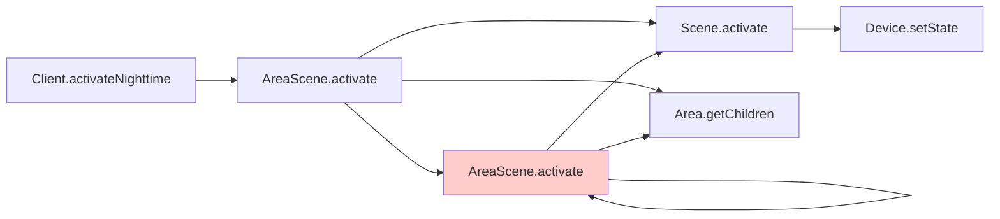
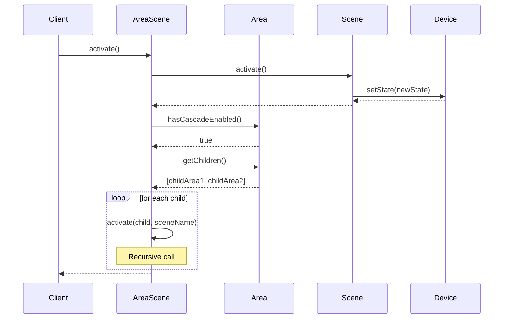

# Lecture 14: Program Understanding & Debugging

## Situate debugging within the software development lifecycle (5 minutes)

Debugging is not a separate phase of software development—it's an integral part of the Implementation and Validation phases. When we encounter unexpected behavior, we need to understand:
- What the program is actually doing (Program Understanding)
- What the program should be doing (Requirements & Design)
- Why there's a mismatch (Debugging)

This lecture focuses on systematic approaches to program understanding and debugging, building on the design and testing principles we've established throughout the course. 

## Utilize control flow and data flow analysis to understand a program (10 minutes)

Before we can debug a program, we need to understand what it's actually doing. Two fundamental techniques help us reason about program behavior:

### Control flow analysis: Understanding program execution paths

**What is control flow?**
Control flow describes the order in which statements execute. Understanding control flow helps you:
- Identify which code paths are actually executed
- Determine which branches are taken
- Understand loop iterations and termination conditions

**Reading control flow in code:**
```java
public void processLights(List<Light> lights, boolean useDefaults) {
    for (Light light : lights) {  // Loop entry point
        if (light.isConnected()) {  // Branch point 1
            if (useDefaults) {  // Branch point 2
                light.setBrightness(50);
                // This line only executes if both conditions true
            } else {
                light.setBrightness(getUserPreference());
            }
        } else {
            logDisconnectedDevice(light);
            // This line only executes if light is NOT connected
        }
    }
}
```

**Questions to ask about control flow:**
- Which branches are possible given different inputs?
- Are there paths that never execute? (Dead code)
- Are there paths that should execute but don't? (Missing functionality)
- What are the loop termination conditions?
- If there is recursion, what is the base case?

**Common control flow bugs:**
- Off-by-one errors in loops
- Incorrect boolean logic in conditionals
- Early returns preventing necessary cleanup
- Missing else branches for edge cases

#### Interprocedural control flow analysis
When examining control flow, you may need to consider not just the current method, but also the methods that are called by the current method. This is called "interprocedural control flow analysis". For example, if you are debugging a method that calls another method, you need to consider the control flow of the called method as well.

IDEs provide tools to help you with this: "Find All References" is a tool that shows you all the places in your codebase that call a given method, whereas "Jump to Definition" is a tool that takes you to the definition of a given method.

Interprocedural control flow is often represented as a "call graph", which is a graph of all the methods in your program and the relationships between them.

### Data flow analysis: Tracking how values change

**What is data flow?**
Data flow describes how data moves through your program and how values change. Understanding data flow helps you:
- Track where variables are assigned
- Identify when values are read
- Understand how data transformations occur
- Spot uninitialized variables or unexpected mutations

**Reading data flow in code:**
```java
public int calculateAverageBrightness(List<Light> lights) {
    int total = 0;  // Variable defined
    int count = 0;  // Variable defined
    
    for (Light light : lights) {
        if (light.isConnected()) {
            total += light.getBrightness();  // total modified
            count++;  // count modified
        }
    }
    
    return total / count;  // Both variables read - potential divide by zero!
}
```

**Questions to ask about data flow:**
- Where is this variable assigned?
- Where is it read?
- What are all possible values it could have at this point?
- Are there unintended mutations?
- Is the variable used before it's properly initialized?

**Common data flow bugs:**
- Using variables before initialization
- Unintended mutation of shared state
- Divide by zero from unchecked denominators
- Null pointer exceptions from missing null checks
- Off-by-one errors from incorrect index calculations

### Combining control flow and data flow analysis

Real bugs often involve both control and data flow issues:

```java
public void activateAreaScene(Area area, String sceneName) {
    Scene scene = findScene(sceneName);  // Data: scene assigned
    
    if (scene != null) {  // Control: branch point
        scene.activate();
        
        if (area.hasCascadeEnabled()) {  // Control: nested branch
            for (Area child : area.getChildren()) {  // Control: loop
                activateAreaScene(child, sceneName);  // Recursive call - both control and data
            }
        }
    }
    // Bug: What if scene is null? Silent failure.
    // Bug: What if sceneName doesn't exist in child areas? Infinite recursion?
}
```

## Utilize diagrams to visualize control and data flow (5 minutes)
While reading code line-by-line works for simple methods, complex systems require higher-level abstractions. Diagrams help you understand the big picture by visualizing relationships, execution paths, and data transformations.



In this diagram:
- We can see the recursive call (AreaScene.activate calls itself)
- We understand the flow from client request through to device state changes
- The recursion is visually obvious (highlighted in red)

**How to create a call graph:**
1. **Hand-sketch first**: Don't worry about perfect formatting
2. **Start with the entry point**: The method you're trying to understand
3. **Add direct calls**: Draw arrows to methods it calls
4. **Expand selectively**: Focus on the path you're investigating, not every possible call
5. **Note recursion**: Mark recursive calls clearly

**Using AI to generate call graphs:**
```
I'm trying to understand how scene activation works in this codebase. 
Here are the relevant methods: [paste methods]

Can you create a Mermaid call graph showing which methods call which 
others when activateAreaScene is invoked? Please highlight any recursive 
calls.
```




Of course, you should not trust the output blindly. However, it is far easier to follow the graph step-by-step, convincing yourself that it is correct, than to manually trace the flow of the program. Plus, you get a nicely formatted diagram (that you can easily tweak as needed!).


**What sequence diagrams reveal:**
- The order of method calls
- Which object is active at each point
- Loops and conditionals in the interaction
- Return values and how they affect flow
- Where bugs might occur in the interaction chain

**When to use sequence diagrams:**
- Debugging issues involving multiple objects
- Understanding asynchronous operations
- Clarifying callback sequences
- Documenting complex workflows

**How to create sequence diagrams:**
1. **Identify the objects involved**: Usually 3-6 key objects
2. **Start with the triggering event**: What initiates the sequence?
3. **Follow the control flow**: Each method call becomes an arrow
4. **Show returns**: Dashed arrows show return values
5. **Mark important data**: Add notes for key state changes

**Hand-sketching sequence diagrams:**
You don't need perfect Mermaid syntax while debugging. A quick sketch:
```
Client → AreaScene.activate()
  AreaScene → Scene.activate()
    Scene → Device.setState()
  AreaScene → Area.getChildren() → [child1, child2]
  AreaScene → AreaScene.activate(child1)  [RECURSIVE]
    ...
```


## Describe the scientific method of debugging (15 minutes)
Suggested background reading and source for much of this section: [Introduction to Debugging by Andreas Zeller](https://www.debuggingbook.org/html/Intro_Debugging.html). We directly adapt Andreas' great example (thanks, Andreas for releasing that under CC-BY-NC-SA!)

Just as we've emphasized systematic program design and implementation (Requirements → Design → Implementation → Validation), we'll see how systematic debugging follows a similar process.

### Debugging as critical thinking

**Debugging is critical thinking applied to code.** The skills you develop here—forming hypotheses, testing assumptions, following evidence, questioning your own beliefs—apply far beyond programming. Whether you're debugging code, analyzing experimental results, evaluating a research paper, or troubleshooting any complex system, the same disciplined thinking process applies.

The key mindset shift: when debugging, you're not just "fixing code"—you're conducting an investigation. The bug is a mystery to be solved through evidence and reasoning, not guessing.

### The scientific method applied to debugging

Debugging is fundamentally a scientific process of forming and testing hypotheses about program behavior:

1. **Observe**: Notice unexpected behavior or test failure
2. **Hypothesize**: Form a theory about what might be causing the issue
3. **Predict**: Determine what evidence would support or refute the hypothesis
4. **Test**: Gather that evidence (through debugging tools, logging, tests)
5. **Analyze**: Evaluate whether the hypothesis is supported
6. **Iterate**: Refine the hypothesis or move to implementation if confirmed

**Example: Debugging a sorting algorithm**
- Observe: Test fails - list not properly sorted
- Hypothesize: Comparator logic is incorrect
- Predict: If hypothesis is true, we should see incorrect comparisons in the debugger
- Test: Set breakpoint in compare method, inspect parameters
- Analyze: Compare method returns correct values - hypothesis rejected
- Iterate: Form new hypothesis about loop boundaries

**Tighten feedback loops:**
If you end up needing to reproduce a bug many times in your efforts to fix it, you could end up spending more time *reproducing* the bug than *fixing* it. Create a minimal test case that reproduces the bug, and use it to test your fixes. But, do not boil the ocean to create a complex and fully-automated test case.

You may have found that for many bugs, you can skip through this process: you are able to quickly identify a problem and fix it. Unfortunately, we guarantee that you will soon enough encounter a bug that you can not fix in a single session. For these, following this explicit process is essential. As you'll learn in this lecture, AI coding agents can be of tremendous value in helping you follow this process.

A rule of thumb that we suggest is: if you can fix a bug in one or two tries, just do it. If you don't quickly get to the answer, open a new text file to use as a debugging log as you follow the scientific method. The log is immensely useful so that when you sit there and say "but it can't be X because I checked it already", you can just refer to the log to see what exactly you already checked.

### Example: Debugging HTML Markup Removal

Let's work through a concrete example using the scientific method. We'll debug a function that removes HTML markup from text, following the systematic hypothesis testing procedure.

**The Task:** Implement a function that takes an HTML string and returns just the text content, removing all HTML tags.

**Initial Implementation:**
```java
public static String removeHtmlMarkup(String s) {
    boolean tag = false;
    boolean quote = false;
    StringBuilder out = new StringBuilder();
    
    for (int i = 0; i < s.length(); i++) {
        char c = s.charAt(i);
        if (c == '<' && !quote) {
            tag = true;
        } else if (c == '>' && !quote) {
            tag = false;
        } else if (c == '"' || c == '\'' && tag) {  // BUG: operator precedence issue!
            quote = !quote;
        } else if (!tag) {
            out.append(c);
        }
    }
    
    return out.toString();
}
```

**Step 1: Observe - Build an observation table**

Let's test the function with several test cases and record our observations:

```java
@Test
public void testRemoveHtmlMarkup_removesBasicTags() {
    assertEquals("foo", removeHtmlMarkup("<b>foo</b>"));
}

@Test
public void testRemoveHtmlMarkup_preservesQuotesInContent() {
    assertEquals("\"foo\"", removeHtmlMarkup("<b>\"foo\"</b>"));
}

@Test
public void testRemoveHtmlMarkup_handlesQuotesBeforeTags() {
    assertEquals("\"foo\"", removeHtmlMarkup("\"<b>foo</b>\""));
}

@Test
public void testRemoveHtmlMarkup_handlesAttributes() {
    assertEquals("foo", removeHtmlMarkup("<b id=\"bar\">foo</b>"));
}
```

| Input | Expectation | Output | Outcome |
|-------|-------------|--------|---------|
| `<b>foo</b>` | `foo` | `foo` | ✔ |
| `<b>"foo"</b>` | `"foo"` | `foo` | ✘ |
| `"<b>foo</b>"` | `"foo"` | `<b>foo</b>` | ✘ |
| `<b id="bar">foo</b>` | `foo` | `foo` | ✔ |

**Step 2: Hypothesize - Form theories**

Based on our observations, we form two hypotheses:

| Hypothesis | Reasoning |
|------------|-----------|
| H1: Double quotes are stripped from the tagged input | We see that `<b>"foo"</b>` outputs `foo` instead of `"foo"` - the double quotes are removed from tagged content |
| H2: Tags in double quotes are not stripped | We see that `"<b>foo</b>"` outputs `<b>foo</b>` instead of `"foo"` - tags aren't removed |

These may be two separate issues, but they're likely related. Let's focus on H1 first because it's simpler.

**Step 3: Test Hypothesis 1 - Double quotes are stripped from the tagged input**

Let's devise an experiment to validate H1. Does it hold for all inputs, even untagged ones? Our hypothesis becomes:

**H1: Double quotes are stripped from the input** (refined from "tagged input")

If we feed the string `"foo"` (including the double quotes) into `removeHtmlMarkup()`, we should obtain `"foo"` as result (unchanged). However, if H1 is correct, we should obtain `foo` (quotes stripped).

```java
@Test
public void testRemoveHtmlMarkup_handlesPlainQuotes() {
    assertEquals("\"foo\"", removeHtmlMarkup("\"foo\""));
}
// Test passes
```

Our hypothesis H1 is **confirmed**! Double quotes are being stripped from the input, even when there are no HTML tags present. We can add this to our observation table:

| Input | Expectation | Output | Outcome |
|-------|-------------|--------|---------|
| `"foo"` | `"foo"` | `foo` | ✘ |

Where does that quote-stripping come from? The only place in `removeHtmlMarkup()` where quotes are handled is:

```java
else if (c == '"' || c == '\'' && tag) {
    quote = !quote;
}
```

So, quotes should only toggle the `quote` flag if `tag` is set. However, `tag` can only be set if the input contains a markup tag (like `<b>`), which is not the case for a simple input like `"foo"`. Hence, what we observe is actually **impossible** - yet it happens!

**Step 5: Refine the hypothesis - Is tag being set?**

Debugging is a game of falsifying assumptions. We assume `tag` cannot be set for `"foo"` - but maybe it is? Let's create a hypothesis:

**H3: The error is due to `tag` being set.**

We can test this using assertions. An `assert` statement encodes our assumptions - if it fails, something is wrong. Let's add an assertion to check if `tag` is ever set:

```java
public static String removeHtmlMarkupWithTagAssert(String s) {
    boolean tag = false;
    boolean quote = false;
    StringBuilder out = new StringBuilder();
    
    for (int i = 0; i < s.length(); i++) {
        char c = s.charAt(i);
        assert !tag;  // <=== Just added: tag should never be set for "foo"
        
        if (c == '<' && !quote) {
            tag = true;
        } else if (c == '>' && !quote) {
            tag = false;
        } else if (c == '"' || c == '\'' && tag) {
            quote = !quote;
        } else if (!tag) {
            out.append(c);
        }
    }
    
    return out.toString();
}
```

We run the test again, and it passes! We can double-check that the assertion works by running the other tests (with tags), which now fail with an assertion error. Hmmm.

**Step 6: Refute Hypothesis 3**

We did not get an exception, which means `tag` is **never** set to `true` for the input `"foo"`. Hence, we **reject** H3:

**H3: The error is due to `tag` being set.** ❌ REFUTED

Since we know `tag` is always `false`, the condition `c == '"' || c == '\'' && tag` should never hold (because `tag` is false, so `c == '\'' && tag` is false, and `c == '"'` alone shouldn't be enough... or is it?).

**Step 7: New hypothesis - The quote condition evaluates to true**

Maybe there's something wrong with the condition such that it holds even when `tag` is false? Here's our new hypothesis:

**H4: The error is due to the quote condition evaluating to true (even when tag is false).**

Let's insert an assertion that assumes the quote condition is never reached:

```java
public static String removeHtmlMarkupWithQuoteAssert(String s) {
    boolean tag = false;
    boolean quote = false;
    StringBuilder out = new StringBuilder();
    
    for (int i = 0; i < s.length(); i++) {
        char c = s.charAt(i);
        
        if (c == '<' && !quote) {
            tag = true;
        } else if (c == '>' && !quote) {
            tag = false;
        } else if (c == '"' || c == '\'' && tag) {
            assert false;  // <=== Just added: this should never execute
            quote = !quote;
        } else if (!tag) {
            out.append(c);
        }
    }
    
    return out.toString();
}
```

```java
// This will throw AssertionError
String result = removeHtmlMarkupWithQuoteAssert("\"foo\"");
```

**Step 8: Confirm Hypothesis 4**

The assertion **fails**, which means the quote condition **does** evaluate to `true` even though `tag` is `false`! Our hypothesis H4 is **CONFIRMED**:

**H4: The error is due to the quote condition evaluating to true (even when tag is false).** ✅ CONFIRMED

The condition `c == '"' || c == '\'' && tag` is faulty - it evaluates to `true` even when `tag` is `false`. But wait - this condition should hold for both single and double quotes. Is there a difference?

**Step 9: Generalize - Test with single quotes**

Let's see if our observations generalize. We test with single quotes:

```java
String result = removeHtmlMarkup("'foo'");
System.out.println(result);
// Output: "'foo'" (quotes preserved!)
```

Surprise! Single quotes are **not** stripped. Let's add this to our observation table:

| Input | Expectation | Output | Outcome |
|-------|-------------|--------|---------|
| `"foo"` | `"foo"` | `foo` | ✘ (double quotes stripped) |
| `'foo'` | `'foo'` | `'foo'` | ✔ (single quotes preserved) |

So, the condition:
- becomes `True` when a **double quote** is seen (even when `tag` is false)
- becomes `False` (as it should) with **single quotes** (when `tag` is false)

**Step 10: Understand the root cause**

At this point, we have enough information to solve the problem. The issue is **operator precedence**!

The condition `c == '"' || c == '\'' && tag` is parsed as:
```java
(c == '"') || (c == '\'' && tag)
```

Due to operator precedence, `&&` binds tighter than `||`, so:
- For double quotes: `c == '"'` is `true`, so the whole expression is `true` (regardless of `tag`)
- For single quotes: `c == '\''` is `true`, but `tag` is `false`, so `c == '\'' && tag` is `false`, making the whole expression `false`

**Step 11: Fix - Implement the solution**

The fix is to add parentheses so that quotes only toggle when inside a tag:

```java
public static String removeHtmlMarkup(String s) {
    boolean tag = false;
    boolean quote = false;
    StringBuilder out = new StringBuilder();
    
    for (int i = 0; i < s.length(); i++) {
        char c = s.charAt(i);
        
        if (c == '<' && !quote) {
            tag = true;
        } else if (c == '>' && !quote) {
            tag = false;
        } else if ((c == '"' || c == '\'') && tag) {  // FIX: Added parentheses!
            quote = !quote;
        } else if (!tag) {
            out.append(c);
        }
    }
    
    return out.toString();
}
```

The key fix is changing `c == '"' || c == '\'' && tag` to `(c == '"' || c == '\'') && tag`. Now quotes only toggle the quote flag when we're inside a tag, which is the correct behavior.

**Step 12: Verify the fix**

All our test cases now pass.

**Lessons from this example:**

1. **Build observation tables** - Systematically record inputs, expectations, outputs, and outcomes
2. **Test simpler hypotheses first** - Start with H1 (double quotes stripped) before tackling H2
3. **Use assertions to test assumptions** - `assert !tag` and `assert false` helped us systematically narrow down the bug
4. **Refute hypotheses systematically** - H3 was refuted, leading us to H4
5. **Generalize findings** - Testing single quotes revealed the operator precedence issue
6. **Understand before fixing** - We fully understood the bug (operator precedence) before implementing the fix

This example demonstrates how the scientific method helps us systematically identify and fix bugs, even when the root cause is subtle (like operator precedence).

### Costs and benefits of systematic debugging

**Benefits:**
- Maintain artifacts (a debugging log) with hypotheses and evidence, externalizing all of these moving pieces from your short-term memory
- Builds understanding of the codebase

**Costs:**
- Requires upfront time investment in understanding
- May feel slower initially than trial-and-error


## Utilize a debugger to step through a program and inspect state (10 minutes)

Debuggers automate the process of tracing control and data flow, allowing you to observe program execution in real-time. They are powerful tools that support the scientific method of debugging by making it easier to test hypotheses and gather evidence.

### How a debugger would have helped with our HTML markup example

Recall our debugging session with `removeHtmlMarkup()`. We manually traced through execution, added `System.out.println` statements, and used assertions to test hypotheses. While this worked, a debugger would have made the process **much faster and easier**.

**Instead of manual tracing, we could have:**

1. **Set a breakpoint** at the start of the loop in `removeHtmlMarkup()`
2. **Run the failing test** `testRemoveHtmlMarkup_handlesPlainQuotes()` in debug mode
3. **Watch the variables** `tag` and `quote` as we step through execution
4. **Immediately see** that when we encounter `"` at position 0, `quote` becomes `true` even though `tag` is `false`

**Instead of adding assertions, we could have:**

1. **Set a conditional breakpoint** on the quote-handling line: `c == '"' || c == '\'' && tag`
2. **Watch the condition** evaluate to `true` even when `tag` is `false`
3. **Inspect the expression** `c == '"'` and see it's `true`, confirming our hypothesis about operator precedence

**Instead of testing single quotes separately, we could have:**

1. **Run the same test** with `'foo'` input
2. **Watch the condition** evaluate to `false` (as expected)
3. **Compare the two executions** side-by-side to see the difference

The debugger doesn't replace the scientific method - it **accelerates** it. You still form hypotheses, but instead of manually tracing code or adding print statements, you can:
- Set breakpoints to test hypotheses about where bugs occur
- Watch variables to test hypotheses about state
- Step through code to understand control flow
- Evaluate expressions to test hypotheses about conditions

Let's see how debuggers work and how to use them effectively.

### Core debugger concepts

**Breakpoints:** Points where execution pauses, allowing you to inspect state
- Line breakpoints: Pause when a specific line is reached
- Conditional breakpoints: Pause only when a condition is true
- Exception breakpoints: Pause when an exception is thrown

**Stepping commands:**
- Step Over: Execute the current line and pause at the next line
- Step Into: If the current line contains a method call, enter that method
- Step Out: Execute until the current method returns
- Continue: Resume execution until the next breakpoint

**Inspection capabilities:**
- View variable values at the current point in execution
- Evaluate arbitrary expressions
- View the call stack (how did we get here?)
- Watch variables (track specific values as execution continues)

### Effective debugger workflow (applying the scientific method)

The debugger workflow aligns perfectly with the scientific method of debugging we learned earlier:

**1. Observe - Reproduce the bug reliably**
Before debugging, ensure you can consistently trigger the problem. Write a test case if possible. In our HTML markup example, we had `testRemoveHtmlMarkup_handlesPlainQuotes()` that reliably failed.

**2. Hypothesize - Form a hypothesis about the bug's location**
Don't just set breakpoints randomly. Use your control and data flow analysis to narrow down where the problem might be. In our example, we hypothesized that the quote condition was evaluating incorrectly.

**3. Predict & Test - Set strategic breakpoints**
- Start broad: Set a breakpoint at a high-level entry point (like the start of the loop)
- Narrow down: Based on what you observe, move breakpoints closer to the issue
- Use conditional breakpoints to test specific hypotheses (e.g., `c == '"'` to test if double quotes trigger the bug)
- Watch variables to test hypotheses about state (e.g., watch `tag` and `quote` to see when they change)

**4. Analyze - Step through execution systematically**
- Pay attention to which branches are taken (control flow)
- Watch how variables change (data flow)
- Compare actual values to expected values
- Note when values first become incorrect (this is where the bug manifests)

**5. Iterate & Verify - Refine hypotheses based on evidence**
- If your hypothesis is confirmed, dig deeper to find the root cause
- If your hypothesis is refuted, form a new hypothesis and test again
- Once you understand the bug, verify by:
  - Explaining the bug to yourself or a colleague (rubber duck debugging)
  - Confirming the fix in the debugger before changing code
  - Writing a test case that would have caught the bug

**Example: Using the debugger with our HTML markup bug**

1. **Observe**: Run `testRemoveHtmlMarkup_handlesPlainQuotes()` - it fails
2. **Hypothesize**: The quote condition `c == '"' || c == '\'' && tag` evaluates incorrectly
3. **Predict & Test**: Set a breakpoint on that line, watch `tag` and `quote` variables
4. **Analyze**: Step through and see `tag` is `false` but condition still evaluates to `true` for double quotes
5. **Iterate**: Test with single quotes - condition evaluates to `false` as expected
6. **Verify**: Understand operator precedence is the root cause, fix it, verify in debugger

### Common debugger pitfalls

**Over-reliance on stepping:**
- Stepping through every line is time-consuming
- Use breakpoints strategically instead
- Use "Continue to Cursor" for long stretches

**Not using conditional breakpoints:**
- Example: Bug only occurs on iteration 47 of a loop
- Instead of hitting F10 forty-seven times, use a conditional breakpoint: `i == 47`

**Ignoring the call stack:**
- The call stack shows how execution reached this point
- Essential for understanding context and finding the root cause
- Bug might be in the caller, not the current method

**Modifying code while debugging without understanding:**
- Resist the urge to "fix" code immediately
- First, fully understand the problem
- Then step out of the debugger and make intentional changes

## Utilize an AI programming agent to assist with debugging (10 minutes)

AI programming agents can accelerate debugging, but only when used with the systematic approach we've established. This section demonstrates how to integrate AI into the scientific method of debugging.

### AI as a debugging assistant: Capabilities and limitations

**What AI agents are good at:**
- Pattern recognition: Spotting common bug patterns (null checks, off-by-one errors, etc.)
- Boilerplate generation: Creating test cases to reproduce bugs
- Code reading: Quickly analyzing unfamiliar code for potential issues
- Suggesting hypotheses: Proposing multiple theories about what might be wrong
- Explanation: Helping you understand complex code flows

**What AI agents struggle with:**
- Domain-specific logic: Understanding your business rules and design decisions
- Runtime state: AI can't directly observe your program's execution
- Environmental issues: Configuration problems, system dependencies, race conditions
- Root cause analysis: May suggest fixes for symptoms rather than underlying causes

**Critical limitation:** AI agents can't execute your code or verify that their suggestions actually fix the problem. You must test and validate everything they suggest.

### Applying the 6-step workflow to debugging (from Lecture 13)

Recall the workflow from Lecture 13:
1. **Identify**: What information does the AI need?
2. **Engage**: Craft effective prompts
3. **Evaluate**: Assess AI outputs critically
4. **Calibrate**: Refine based on feedback
5. **Tweak**: Adjust the solution
6. **Finalize**: Document decisions

**Applied to debugging:**

**1. Identify: Gather context before engaging AI**
Before asking AI for help, collect:
- The unexpected behavior (what went wrong)
- The expected behavior (what should happen)
- Relevant code (not the entire codebase)
- Error messages or stack traces
- Steps to reproduce
- Your current hypothesis (if you have one)

**2. Engage: Effective debugging prompts**

❌ **Ineffective prompt:**
```
This code doesn't work. Fix it.
```

✅ **Effective prompt:**
```
I'm debugging a scene activation feature in my IoT app. When I call 
activateAreaScene on a nested area structure, the scene activates on 
the top-level area but not on child areas. 

Expected: Scene should cascade to all child areas
Actual: Only activates on the parent area

(Tag the relevant method as context)

My hypothesis: The recursive call might not be finding the scene in 
child areas. Analyze the code and provide a report that either disproves this hypothesis,
confirms it, or suggests further steps to test it.
```

**Why the second prompt is better:**
- Provides specific behavior (not just "doesn't work")
- Includes expected vs actual behavior
- States your hypothesis
- Asks for analysis, not just a fix

**3. Evaluate: Critical assessment of AI suggestions**

Determine if you are able to evaluate this output critically.

If you are not, you should stop, and change your approach to ask for a more detailed analysis (e.g. more specific hypotheses, or a more detailed analysis of the code). Also consider taking a break from debugging to examine related reference material.

**Evaluation checklist:**
- ✅ Is the AI's suggested hypothesis plausible given your understanding of the codebase?
- ✅ Is the AI's analysis of the codebase accurate?
- ✅ If there is a fix suggested, is it a valid fix?

**4. Calibrate: Iterative refinement**

If the AI's suggestion doesn't work or doesn't make sense:
- Provide feedback about what happened when you tested it
- Share additional context (error messages, debugger observations)
- Suggest adding additional logging to help understand the problem
- Ask for alternative hypotheses

**5. Tweak: Refine the solution**

Even if the AI's suggestion is close, you might need to adjust the output.

**6. Finalize: Document the fix**

After fixing the bug:
- Write a test case that would have caught it
- Document the root cause in comments or commit messages
- Update design docs if the bug revealed a design issue

### When NOT to use AI for debugging

Following principles from Lecture 13, avoid AI for debugging when:
- You don't understand the codebase well enough to evaluate suggestions
- The bug involves system-level issues (configuration, environment, hardware)
- The problem requires domain expertise the AI doesn't have
- You find yourself in a "vibe coding" trap (just trying AI suggestions without understanding)

In these cases, you should still consider using AI for *program understanding* tasks that are related to debugging, such as analyzing control and data flow in the program. Use these artifacts to increase your understanding of the codebase, and **then** return to debugging.

**The "learning tax" for debugging:**
Just as we discussed in Lecture 13, deliberately practice debugging manually sometimes, even when AI could help. This builds the expertise that makes you effective when using AI. Even if it is tempting to have AI add logging everywhere and then analyze a huge log file, the practiced skill of intuiting what to capture and what to ignore is a valuable skill that will help you when using AI.
