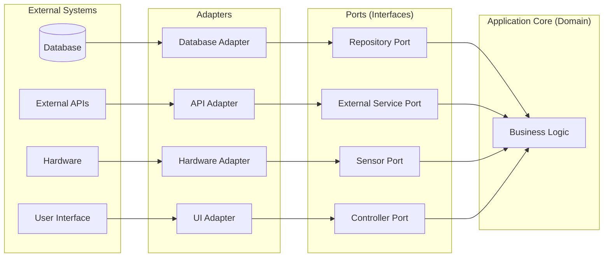

In the previous lecture, we learned about test doubles — stubs, fakes, spies, and mocks — that let us test code in isolation. But we glossed over an important question: *why was `ThermostatController` so easy to test?* The answer lies in how it was designed.

Some systems are more testable than others. Imagine that for a single test case, you need to set up three different web services, create five different files in different folders, and put the database in a specific state. After all that, you exercise the feature under test and, to assert correct behavior, need to check that the three web services were invoked correctly, the five files were consumed, and the database is now in a different state. All of this is *doable* — but couldn't it be simpler?

This lecture is about **designing for testability** — writing code that is easy to test from the very beginning.

## Evaluate the testability of a software module and propose changes to improve its testability (20 minutes)

Two properties determine how testable a piece of code is: **observability** and **controllability**.

### Observability: Can We See What Happened?

Observability is about how easily we can inspect the results of executing some code. If we can't observe the output, we can't verify correctness.

Consider this `TemperatureLogger` class:

```java
public class TemperatureLogger {
    public void logReading(String zoneId, double temperature) {
        String timestamp = LocalDateTime.now().toString();
        String logEntry = String.format("[%s] Zone %s: %.1f°F", timestamp, zoneId, temperature);
        System.out.println(logEntry);  // Where does this go?
    }
}
```

How would you test this? The method returns `void`, and the output goes to `System.out`. To verify that it logged correctly, you'd need to capture standard output — possible, but awkward.

Here's a more observable version:

```java
public class TemperatureLogger {
    private final List<String> logEntries = new ArrayList<>();
    
    public void logReading(String zoneId, double temperature, Instant timestamp) {
        String logEntry = String.format("[%s] Zone %s: %.1f°F", timestamp, zoneId, temperature);
        logEntries.add(logEntry);
    }
    
    public List<String> getLogEntries() {
        return Collections.unmodifiableList(logEntries);
    }
}
```

Now we can inspect what was logged by calling `getLogEntries()`. We've increased observability by making internal state accessible (in a controlled way).

There are other ways we could have increased observability. (Call on students to suggest some.)

### Controllability: Can We Set Up the Test Scenario?

Controllability is about how easily we can put the system into a specific state for testing. If we can't control the inputs and dependencies, we can't test specific scenarios.

Look at this problematic `EnergyPriceService`:

```java
public class EnergyPriceService {
    public double getCurrentPrice() {
        // Fetches from external API — how do we test different prices?
        HttpClient client = HttpClient.newHttpClient();
        HttpRequest request = HttpRequest.newBuilder()
            .uri(URI.create("https://api.energyprices.com/current"))
            .build();
        // ... parse response and return price
    }
    
    public boolean isOffPeakHours() {
        // Uses system time — how do we test 3 AM behavior at 2 PM?
        int hour = LocalTime.now().getHour();
        return hour >= 22 || hour < 6;
    }
}
```

Both methods have low controllability:
- `getCurrentPrice()` creates its own HTTP client, so we can't substitute a test version
- `isOffPeakHours()` uses the system clock, so we can't test time-dependent behavior without waiting or mocking the clock (which might be treacherous if the clock is used elsewhere in the code)

Here's a more controllable version:

```java
public class EnergyPriceService {
    private final EnergyPriceApi priceApi;
    private final Clock clock;
    
    public EnergyPriceService(EnergyPriceApi priceApi, Clock clock) {
        this.priceApi = priceApi;
        this.clock = clock;
    }
    
    public double getCurrentPrice() {
        return priceApi.fetchCurrentPrice();
    }
    
    public boolean isOffPeakHours() {
        int hour = LocalTime.now(clock).getHour();
        return hour >= 22 || hour < 6;
    }
}
```

Now we can inject a mock `EnergyPriceApi` and a fixed `Clock` to test any scenario we want.

### Separating Infrastructure from Domain Code

The most important principle for testability is: **separate infrastructure code from domain code**.

- **Domain code** is where the core business logic lives — the rules, calculations, and decisions that define what your system does
- **Infrastructure code** is everything that talks to the outside world — databases, APIs, file systems, hardware

When these are mixed together, testing becomes painful because you can't exercise the business logic without involving the infrastructure.

Consider this `SmartThermostat` class that mixes both concerns:

```java
public class SmartThermostat {
    public void adjustForComfort(String zoneId, double targetTemp) {
        // Infrastructure: database access
        Connection conn = DriverManager.getConnection("jdbc:mysql://localhost/iot", "root", "");
        PreparedStatement ps = conn.prepareStatement(
            "SELECT temperature FROM sensors WHERE zone_id = ?");
        ps.setString(1, zoneId);
        ResultSet rs = ps.executeQuery();
        rs.next();
        double currentTemp = rs.getDouble("temperature");
        
        // Domain: business logic
        double delta = targetTemp - currentTemp;
        String action;
        if (Math.abs(delta) <= 0.5) {
            action = "NONE";
        } else if (delta > 0) {
            action = "HEAT";
        } else {
            action = "COOL";
        }
        
        // Infrastructure: web service call
        HttpClient client = HttpClient.newHttpClient();
        HttpRequest request = HttpRequest.newBuilder()
            .uri(URI.create("http://hvac-service/zones/" + zoneId + "/" + action))
            .POST(HttpRequest.BodyPublishers.noBody())
            .build();
        client.send(request, HttpResponse.BodyHandlers.discarding());
        
        conn.close();
    }
}
```

To test the comfort adjustment logic, you'd need a real database and a real HVAC web service running. The business rule (when to heat vs. cool) is buried in the middle of infrastructure code.

Here's the same functionality with concerns separated:

```java
// Domain: pure business logic, easily testable
public class ComfortCalculator {
    public HVACAction calculateAction(double currentTemp, double targetTemp) {
        double delta = targetTemp - currentTemp;
        if (Math.abs(delta) <= 0.5) {
            return HVACAction.NONE;
        } else if (delta > 0) {
            return HVACAction.HEAT;
        } else {
            return HVACAction.COOL;
        }
    }
}

// Orchestration: coordinates domain and infrastructure
public class SmartThermostat {
    private final TemperatureSensor sensor;
    private final HVACService hvac;
    private final ComfortCalculator calculator;
    
    public SmartThermostat(TemperatureSensor sensor, HVACService hvac, 
                           ComfortCalculator calculator) {
        this.sensor = sensor;
        this.hvac = hvac;
        this.calculator = calculator;
    }
    
    public void adjustForComfort(String zoneId, double targetTemp) {
        double currentTemp = sensor.readTemperature(zoneId);
        HVACAction action = calculator.calculateAction(currentTemp, targetTemp);
        if (action != HVACAction.NONE) {
            hvac.execute(action, zoneId);
        }
    }
}
```

Now `ComfortCalculator` can be tested with simple unit tests — no database, no HTTP calls:

```java
@Test
void heatsWhenBelowTarget() {
    ComfortCalculator calc = new ComfortCalculator();
    assertEquals(HVACAction.HEAT, calc.calculateAction(68.0, 72.0));
}

@Test
void coolsWhenAboveTarget() {
    ComfortCalculator calc = new ComfortCalculator();
    assertEquals(HVACAction.COOL, calc.calculateAction(76.0, 72.0));
}

@Test
void doesNothingWithinThreshold() {
    ComfortCalculator calc = new ComfortCalculator();
    assertEquals(HVACAction.NONE, calc.calculateAction(72.3, 72.0));
}
```

The `SmartThermostat` class still needs mocks, but it's now a thin orchestration layer. The interesting business logic lives in `ComfortCalculator`, which is trivially testable.

## Explain the Hexagonal Architecture and its relationship to testability (15 minutes)

The principle of separating infrastructure from domain code is formalized in an architectural pattern called **Hexagonal Architecture** (also known as **Ports and Adapters**), proposed by [Alistair Cockburn in 2005](https://alistair.cockburn.us/hexagonal-architecture).

### The Core Idea



The architecture has three layers:

1. **Application Core (the hexagon)**: Contains all business logic and domain rules. It knows nothing about databases, web services, or hardware — only about the problem domain.

2. **Ports**: Interfaces that define what the application needs from the outside world. A port is technology-agnostic — it describes *what* the application needs, not *how* to get it.

3. **Adapters**: Implementations of ports that know how to talk to specific external systems. An adapter translates between the port's abstract interface and the concrete technology.

### IoT Example: Smart Home Energy Manager

Let's design a smart home energy management system using Hexagonal Architecture.

**The Domain Problem**: When energy prices are high, automatically reduce power consumption by dimming lights and adjusting thermostats. When prices are low, pre-heat or pre-cool the house.

First, we define **ports** — interfaces that describe what we need:

```java
// Port: How we get energy prices (technology-agnostic)
public interface EnergyPricePort {
    double getCurrentPricePerKWh();
    List<PriceForecast> getForecast(Duration window);
}

// Port: How we control devices (technology-agnostic)
public interface DeviceControlPort {
    List<ControllableDevice> getDevices();
    void setDevicePower(String deviceId, int powerPercent);
}

// Port: How we persist settings (technology-agnostic)
public interface UserPreferencesPort {
    EnergyPreferences getPreferences(String homeId);
}
```

The **application core** contains pure business logic:

```java
public class EnergyOptimizer {
    private final EnergyPricePort priceService;
    private final DeviceControlPort deviceControl;
    private final UserPreferencesPort preferences;
    
    public EnergyOptimizer(EnergyPricePort priceService, 
                           DeviceControlPort deviceControl,
                           UserPreferencesPort preferences) {
        this.priceService = priceService;
        this.deviceControl = deviceControl;
        this.preferences = preferences;
    }
    
    public void optimizeForPrice(String homeId) {
        double currentPrice = priceService.getCurrentPricePerKWh();
        EnergyPreferences prefs = preferences.getPreferences(homeId);
        
        if (currentPrice > prefs.highPriceThreshold()) {
            // Reduce consumption
            for (ControllableDevice device : deviceControl.getDevices()) {
                if (device.isNonEssential()) {
                    int reducedPower = (int)(device.currentPower() * 0.5);
                    deviceControl.setDevicePower(device.id(), reducedPower);
                }
            }
        } else if (currentPrice < prefs.lowPriceThreshold()) {
            // Pre-condition the home
            for (ControllableDevice device : deviceControl.getDevices()) {
                deviceControl.setDevicePower(device.id(), 100);
            }
        }
    }
}
```

**Adapters** implement the ports for specific technologies:

```java
// Adapter: Gets prices from a real API
public class GridPriceApiAdapter implements EnergyPricePort {
    private final HttpClient httpClient;
    private final String apiKey;
    
    @Override
    public double getCurrentPricePerKWh() {
        // HTTP calls to real pricing API
    }
}

// Adapter: Controls devices via Zigbee protocol  
public class ZigbeeDeviceAdapter implements DeviceControlPort {
    private final ZigbeeGateway gateway;
    
    @Override
    public void setDevicePower(String deviceId, int powerPercent) {
        // Zigbee protocol commands
    }
}

// Adapter: Stores preferences in PostgreSQL
public class PostgresPreferencesAdapter implements UserPreferencesPort {
    private final DataSource dataSource;
    
    @Override
    public EnergyPreferences getPreferences(String homeId) {
        // SQL queries
    }
}
```

### Why This Helps Testability

The magic happens in testing. For unit tests, we can substitute simple test implementations:

```java
@Test
void reducesNonEssentialDevicesWhenPriceIsHigh() {
    // Simple in-memory implementations — no real infrastructure!
    EnergyPricePort stubPrices = () -> 0.35;  // High price
    
    List<ControllableDevice> devices = List.of(
        new ControllableDevice("light-1", true, 100),   // non-essential
        new ControllableDevice("fridge", false, 100)    // essential
    );
    SpyDeviceControl spyDevices = new SpyDeviceControl(devices);
    
    UserPreferencesPort stubPrefs = (homeId) -> 
        new EnergyPreferences(0.25, 0.10);  // high=0.25, low=0.10
    
    EnergyOptimizer optimizer = new EnergyOptimizer(
        stubPrices, spyDevices, stubPrefs);
    
    optimizer.optimizeForPrice("home-123");
    
    // Verify only non-essential devices were reduced
    assertEquals(50, spyDevices.getPowerLevel("light-1"));
    assertEquals(100, spyDevices.getPowerLevel("fridge"));  // unchanged
}
```

For integration tests, we can use real adapters with test instances (e.g., an in-memory database). For end-to-end tests, we use production adapters. The core business logic remains the same across all test types.

### Ports as a Design Technique

When developing with Hexagonal Architecture, you can use ports as a design technique. Whenever you notice that your domain logic needs something from the outside world, let an interface (port) emerge. Define the contract that makes sense for your domain, then implement the adapter later.

This approach keeps you focused on the business problem without getting distracted by infrastructure details. It also forces you to think about what your domain *really* needs, rather than being constrained by what a particular API happens to offer.

### Connection to Modularity and Coupling

Hexagonal Architecture is really the application of modularity and coupling principles we covered in [Lecture 6](./l6-immutability-abstraction.md) and [Lecture 7](./l7-design-for-change.md) — but specifically aimed at achieving testability.

**Ports are modules with well-defined interfaces.** Recall from Lecture 6 that a module should have:
- A well-defined interface that specifies its behavior
- An implementation that is hidden from other modules
- Independence from implementation details of other modules

Ports satisfy all three criteria. The `EnergyPricePort` interface specifies *what* the domain needs (current price, forecasts) without revealing *how* that information is obtained. The domain code depends only on this interface, not on HTTP clients, API keys, or JSON parsing.

**Hexagonal Architecture minimizes coupling.** In Lecture 7, we discussed different types of coupling from least to most harmful:

| Coupling Type | How Hexagonal Architecture Addresses It |
|---------------|----------------------------------------|
| **Data coupling** | Ports pass only the data needed — `getCurrentPricePerKWh()` returns a `double`, not a `GridApiResponse` |
| **Stamp coupling** | Domain types like `EnergyPreferences` are defined by the domain, not dictated by external APIs |
| **Control coupling** | Adapters don't pass flags that control domain logic — the domain decides what to do with the data |
| **Common coupling** | No shared global state between domain and infrastructure |
| **Content coupling** | Impossible — adapters can't access domain internals, and vice versa |

Consider what would happen without this architecture. If `EnergyOptimizer` directly used an `HttpClient` to call the pricing API, we'd have:
- **Stamp coupling**: The domain would depend on `HttpResponse` objects
- **Common coupling**: If we used a shared `HttpClient` instance
- **Lower cohesion**: The `EnergyOptimizer` would mix HTTP concerns with business rules

**Ports promote functional cohesion.** Each port has a single, well-defined responsibility. `EnergyPricePort` is about getting prices. `DeviceControlPort` is about controlling devices. Compare this to the monolithic `SmartThermostat` class we saw earlier that mixed database queries, business logic, and HTTP calls — that class had only procedural cohesion at best.

The key insight is that **low coupling and high cohesion don't just make code easier to change — they make it easier to test**. When your domain logic has no knowledge of infrastructure, you can test it with simple stubs. When each module has a single responsibility, you can test it in isolation.

## Describe general properties of "good" test suites (10 minutes)

Beyond testability of individual classes, there are properties that make an entire test suite effective and maintainable.

### Tests Should Be Fast

If your test suite takes 30 minutes to run, developers won't run it often. If it takes 30 seconds, they'll run it after every change. Fast feedback loops catch bugs earlier when they're cheaper to fix.

The separation of domain and infrastructure directly enables this. Domain logic tests (the majority of your tests) should run in milliseconds. Only a small number of integration tests need to touch real infrastructure.

### Tests Should Be Deterministic

A **flaky test** is one that sometimes passes and sometimes fails without any code changes. Flaky tests erode trust in your test suite — if tests fail randomly, developers start ignoring failures.

Common causes of flakiness:
- Relying on system time (use injectable `Clock`)
- Relying on random values (use injectable random number generators with fixed seeds for tests, don't depend on non-deterministic behavior like the order of items in a HashSet)
- Relying on execution order (each test should set up its own state)
- Relying on external services (use test doubles)

### Tests Should Be Independent

Each test should be able to run in isolation. If Test B only passes when Test A runs first, you have a coupling problem. This typically happens when tests share mutable state.

```java
// BAD: Tests share state
public class DeviceRegistryTest {
    private static DeviceRegistry registry = new DeviceRegistry();
    
    @Test
    void registersNewDevice() {
        registry.register(new Light("light-1"));
        assertEquals(1, registry.count());  // Fails if another test ran first!
    }
}

// GOOD: Each test gets fresh state
public class DeviceRegistryTest {
    private DeviceRegistry registry;
    
    @BeforeEach
    void setUp() {
        registry = new DeviceRegistry();
    }
    
    @Test
    void registersNewDevice() {
        registry.register(new Light("light-1"));
        assertEquals(1, registry.count());  // Always starts from 0
    }
}
```

### Tests Should Be Readable

Tests serve as documentation of how the code should behave. A well-written test tells a story:

```java
@Test
void sendsAlertWhenTemperatureExceedsSafetyThreshold() {
    // Given: A thermostat monitoring a zone with a 90°F safety limit
    TemperatureSensor stubSensor = mock(TemperatureSensor.class);
    AlertService spyAlerts = mock(AlertService.class);
    SafetyMonitor monitor = new SafetyMonitor(stubSensor, spyAlerts, 90.0);
    
    // When: The temperature exceeds the threshold
    when(stubSensor.readTemperature("server-room")).thenReturn(95.0);
    monitor.checkZone("server-room");
    
    // Then: An alert is sent
    verify(spyAlerts).sendCriticalAlert(
        argThat(alert -> alert.contains("server-room") && alert.contains("95.0")));
}
```

The test method name describes the expected behavior. The Given/When/Then structure (also called Arrange/Act/Assert) makes the test's purpose clear.

### Dependency Injection Enables All of This

Notice how every "good" property we've discussed relies on being able to substitute dependencies. This is why **dependency injection** — passing dependencies into constructors rather than creating them internally — is so fundamental to testability.

In Lecture 8, we introduced the Dependency Inversion Principle: "Depend on abstractions, not concretions." Now you can see why it matters for testing. When your code depends on interfaces (abstractions), you can provide test implementations. When it creates concrete classes internally, you're stuck with whatever those classes do.

## Recognize common anti-patterns that lead to untestable code (10 minutes)

Certain coding patterns consistently make testing difficult. Recognizing these patterns helps you avoid them in new code and refactor them in existing code.

### Static Methods and Singletons

Static methods and singletons are globally accessible, which means you can't substitute test implementations.

```java
// HARD TO TEST: Uses static method
public class ScheduledTask {
    public void runIfDue() {
        if (TimeUtils.isBusinessHours()) {  // Static call — can't stub this!
            doWork();
        }
    }
}

// BETTER: Inject the dependency
public class ScheduledTask {
    private final BusinessHoursChecker hoursChecker;
    
    public ScheduledTask(BusinessHoursChecker hoursChecker) {
        this.hoursChecker = hoursChecker;
    }
    
    public void runIfDue() {
        if (hoursChecker.isBusinessHours()) {
            doWork();
        }
    }
}
```

If you must use code that relies on static methods (like `LocalDateTime.now()`), wrap it in an abstraction that you control:

```java
public interface TimeProvider {
    Instant now();
}

public class SystemTimeProvider implements TimeProvider {
    public Instant now() { return Instant.now(); }
}

public class FixedTimeProvider implements TimeProvider {
    private final Instant fixedTime;
    public FixedTimeProvider(Instant fixedTime) { this.fixedTime = fixedTime; }
    public Instant now() { return fixedTime; }
}
```

### Private Methods That "Want" to Be Tested

If you feel the urge to test a private method directly, it's often a sign that the private method is doing something complex enough to deserve its own class.

```java
// The private method is doing significant work
public class DeviceHealthChecker {
    public HealthReport checkAll(List<IoTDevice> devices) {
        HealthReport report = new HealthReport();
        for (IoTDevice device : devices) {
            report.add(device.getId(), assessHealth(device));  // Complex logic here
        }
        return report;
    }
    
    // This private method has complex logic we'd like to test directly
    private HealthStatus assessHealth(IoTDevice device) {
        double batteryPercent = device.getBatteryLevel();
        int signalStrength = device.getSignalStrength();
        long lastContactMinutes = device.minutesSinceLastContact();
        
        if (lastContactMinutes > 60) return HealthStatus.OFFLINE;
        if (batteryPercent < 10) return HealthStatus.CRITICAL;
        if (batteryPercent < 25 || signalStrength < 20) return HealthStatus.WARNING;
        return HealthStatus.HEALTHY;
    }
}
```

Extract it to its own class:

```java
// Now easily testable
public class DeviceHealthAssessor {
    public HealthStatus assess(double batteryPercent, int signalStrength, 
                                long minutesSinceContact) {
        if (minutesSinceContact > 60) return HealthStatus.OFFLINE;
        if (batteryPercent < 10) return HealthStatus.CRITICAL;
        if (batteryPercent < 25 || signalStrength < 20) return HealthStatus.WARNING;
        return HealthStatus.HEALTHY;
    }
}
```

### Tight Coupling Between Classes

If your tests require setting up many dependencies just to test one behavior, the class might be doing too much.

```java
// Requires 5 dependencies just to test notification formatting
public class SubmissionProcessor {
    public SubmissionProcessor(TestRunner tests, Linter linter, Grader grader,
                                Repository repo, NotificationService notifier) { ... }
    
    public void process(Submission submission) {
        // Uses all 5 dependencies
    }
}
```

A sign of this problem: you write a test for class `A`, but when it fails, the bug is actually in class `B`. The coupling has leaked implementation details across class boundaries.

### Complex Boolean Conditions

Complex conditions require many test cases to cover all branches:

```java
// How many tests to cover this?
if ((device.isOnline() && device.batteryLevel() > 20) || 
    (device.isPowered() && !device.isInSleepMode()) ||
    (device.isEssential() && emergencyMode)) {
    // ...
}
```

Break complex conditions into named methods or separate predicates:

```java
private boolean deviceCanReceiveCommands(IoTDevice device) {
    return hasSufficientBattery(device) || hasReliablePower(device) || 
           isRequiredInEmergency(device);
}

private boolean hasSufficientBattery(IoTDevice device) {
    return device.isOnline() && device.batteryLevel() > 20;
}

// Each predicate can now be tested individually
```

This doesn't reduce the logical complexity, but it spreads out the testing burden and makes each piece easier to understand and verify.

---

**Further Reading**:
- [Aniche Ch 7: Designing for Testability](https://livebook.manning.com/book/effective-software-testing)
