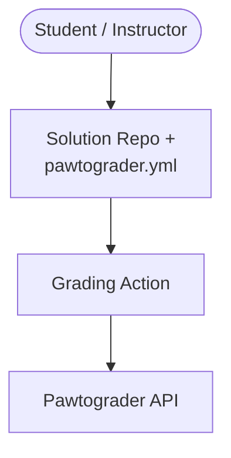
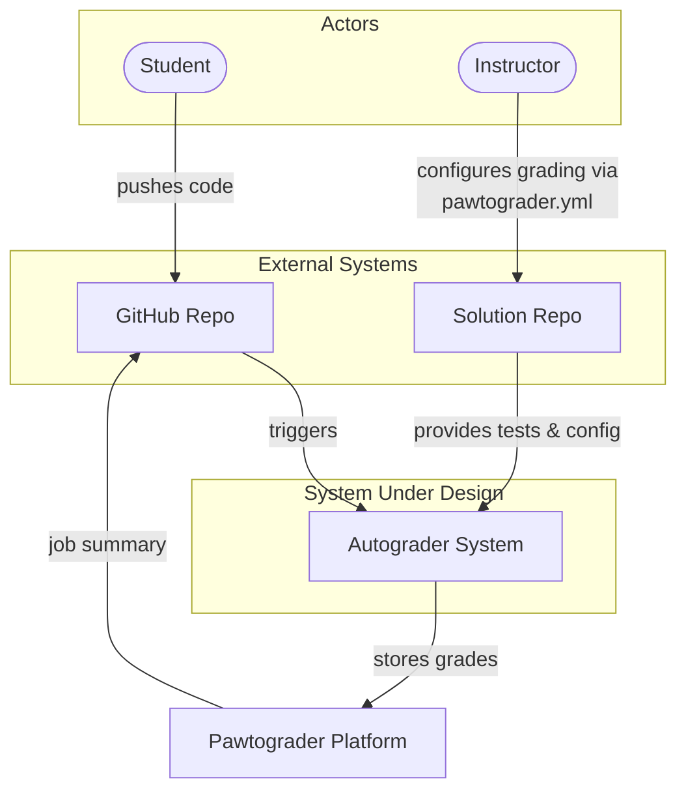
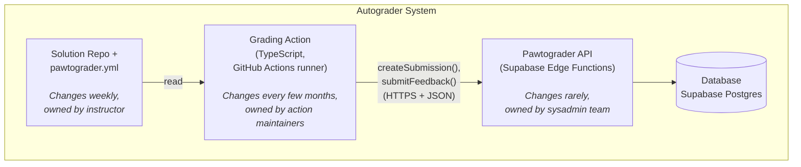
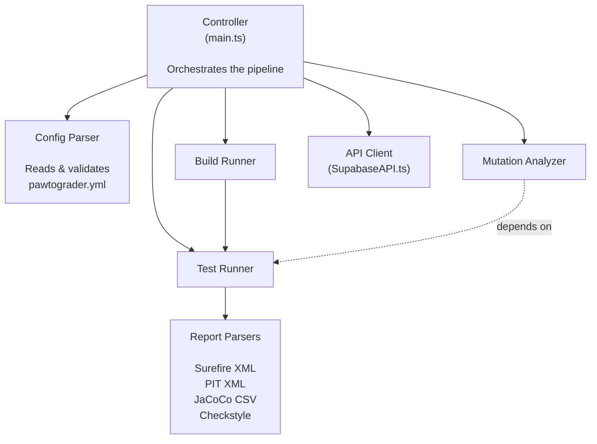
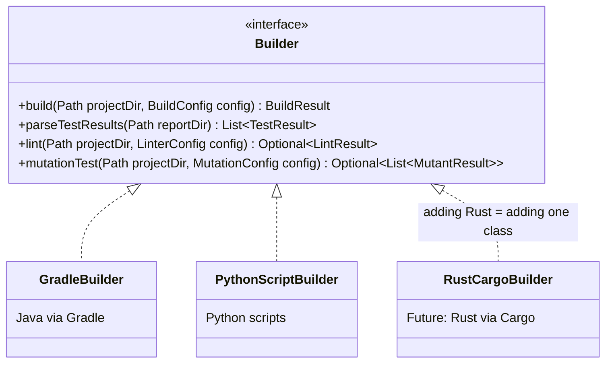

# Thinking Architecturally

Suggested background reading for a deeper dive:
- [Fundamentals of Software Architecture, 2nd Edition by Mark Richards and Neal Ford](https://learning.oreilly.com/library/view/fundamentals-of-software/9781098175504/ch02.html) - especially Chapter 2

In [L17](./l17-creation-patterns.md), we saw how patterns like Builder, Factory Methods, and Dependency Injection help us create and wire up individual objects. We ended with a glimpse of how these same principles apply at larger scales—services that collaborate to form a complete application.

But where do those service boundaries come from? How do we decide that "grading logic" and "submission management" should be separate concerns? This lecture is about **thinking architecturally**—stepping back from individual classes to see the shape of the whole system.

Our running example is **Pawtograder's autograder**—the system that grades your assignments every time you push code. We'll also compare it to **Bottlenose**, the previous grading system for this class, to see how different requirements lead to different architectural choices.

## Define software architecture and distinguish it from design (8 minutes)

Software architecture and software design exist on a continuum, but they ask different questions at different scales.

**Architecture** is concerned with the high-level structure of a system:
- What are the major components?
- How do they communicate?
- What are the significant constraints and quality requirements?
- Which decisions are hard to change later?

**Design** is concerned with the internal structure of individual components:
- How is this class organized?
- What data structures should we use?
- How do these methods collaborate?

The boundary between them is fuzzy.
[Ralph Johnson put it this way: "Architecture is about the important stuff. Whatever that is."](https://martinfowler.com/ieeeSoftware/whoNeedsArchitect.pdf) The "important stuff" varies by project, but it's usually the decisions that constrain many other decisions downstream.
A useful heuristic: **architectural decisions are the ones that are expensive to change**. Choosing to run grading on GitHub Actions vs. a dedicated server is architectural—reversing that decision later costs lots of work. Choosing between a `HashMap` and a `TreeMap` for test result storage is design—you can change it in one coding session. Most cases, however, are not as clear-cut, and in fact, the goal of a good architect may be to reduce the total number of decisions that will be expensive to change.

Some of these architectural concepts—like networks, distributed systems, authentication protocols (OIDC), and deployment models—may be unfamiliar right now. Don't worry: we'll explore these topics in depth over the coming weeks—[networks and distributed communication](./l20-networks.md) in L20, [serverless architecture](./l21-serverless.md) in L21, and [how team structure shapes architecture](./l22-teams.md) in L22. For today, focus on the *thinking process*: how do we identify which decisions matter most and where to draw boundaries?


:::tip History of Programming
Ralph Johnson is one of the "Gang of Four" (GoF)—the four authors of the seminal 1994 book *Design Patterns: Elements of Reusable Object-Oriented Software*. The others are Erich Gamma, Richard Helm, and John Vlissides. When you hear "GoF patterns," this is the book people mean. The book didn't talk much about software architecture (the field barely existed at the time) - the quote is from nine years later.
:::

### Architecture in Pawtograder

The autograder that grades your assignments has architectural decisions shaping everything. To see why these decisions matter, we can compare Pawtograder to **Bottlenose**, the previous grading system for this class—two systems solving the same fundamental problem, but making different choices based on different requirements.

| Decision | Pawtograder chose… | Bottlenose chose… | Why It's Architectural |
|----------|-------------------|-------------|----------------------|
| **Scheduling & execution** | Leverage GitHub Actions—let GitHub handle scheduling, VM provisioning, and parallelism | Custom job queue (Backburner + Beanstalkd) with dedicated workers; Docker execution delegated to an external service called Orca | Decides whether you own your infrastructure or rent someone else's. GitHub Actions means zero ops burden but less control; a custom scheduler means full control but you must build and maintain it. |
| **Thick vs. thin grader** | "Smart action"—the grader parses test results, computes scores, normalizes structured feedback | Platform-driven—Bottlenose is one big application, deployed once for all courses, that defines grading logic per language (via `Grader` subclasses), interprets raw output, and assigns points | Determines where complexity lives. A thick grader enables richer feedback (line-level comments, mutation analysis, structured rubrics) but is harder to build. Centralizing grading logic in the platform is simpler per-grader but makes the platform itself more complex. |
| **Instructor configurability** | Instructors write a `pawtograder.yml` config file declaring what to grade, how many points, which tests, mutation targets | Instructors configure grading through the Bottlenose web UI—selecting grader types, uploading test files, setting timeouts and point values through web forms | Shapes who can change grading behavior and how quickly. A config file in the repo means instructors iterate independently; UI-mediated config means the platform must support every grading pattern. |

:::caution Educational Speculation
Throughout this lecture, we'll compare Pawtograder and Bottlenose architectures. **Important caveat**: we don't have design documents or interview data from Bottlenose's original architects. Our analysis is **speculative reconstruction**—educated guesses about what *might* have driven their decisions based on the code that exists today. This is a useful exercise for learning architectural thinking, but real-world architecture analysis would require talking to the people who made the decisions.
:::

These differences *might* reflect **programming over time**. The computing landscape changed between the two systems. When Bottlenose was built, requirements *may not have* demanded the same level of instructor flexibility or feedback richness, so centralizing grading logic in the platform with UI-driven configuration *could have been* a natural fit. By the time Pawtograder was designed, requirements *appear to have* grown: instructors wanted structured feedback, mutation testing, multi-language support, and the ability to iterate on grading independently. Those richer requirements *likely* drove the "thick grader" design. We'll explore how these requirements *might have* led to these choices throughout the lecture.

When you push code and see the autograder run, GitHub Actions is executing the grading action. The reason you can't see our test cases? That's an architectural decision—the private grader is downloaded at runtime using a one-time URL. Each choice opens some doors and closes others.

## Identify architectural drivers that shape decisions (10 minutes)

Architecture doesn't happen in a vacuum. Decisions are driven by **architectural drivers**—the forces that push us toward particular solutions.

### Functional Requirements

What must the system do? For Pawtograder's autograder:
- Accept student code submissions from GitHub repositories
- Copy student files into the instructor's solution repo and build the project
- Run instructor test suites and report results per graded unit
- Run mutation analysis on student tests
- Report grading results back to Pawtograder for students to see

A single, "all-in-one" script *could* do all of this. But should it? Functional requirements establish what capabilities exist, but they don't dictate *how* to structure them. That's where quality attributes come in.

### Quality Attributes

How well must the system perform? Quality attributes (also called non-functional requirements or "-ilities") include:

| Quality Attribute | Pawtograder Implication | Where We Go Deeper |
|-------------------|----------------------|-------------------|
| **Security** | Students must NEVER see instructor test cases. Submissions must be authenticated. | [L20: Networks](./l20-networks.md) covers authentication, OIDC, and network security |
| **Scalability** | Hundreds of students may submit simultaneously near a deadline. | [L21: Serverless](./l21-serverless.md) explores how managed platforms handle scaling |
| **Changeability** | New assignment = new `pawtograder.yml`. New language = new build preset. | [L6](./l6-immutability-abstraction.md) and [L7](./l7-design-for-change.md) cover the foundations: modularity, coupling, cohesion |
| **Testability** | Grading logic should be testable without deploying to GitHub or Pawtograder. | [L16: Design for Testability](./l16-testing2.md) covers observability and controllability|
| **Maintainability** | A small team maintains the action; many instructors use it across courses. | [L36: Sustainability](./l36-sustainability.md) examines long-term maintainability and technical debt |

Quality attributes often conflict. Optimizing for security (downloading the grader at runtime) creates a network dependency that hurts reliability. Maximizing changeability (rich config format) adds complexity to the action. Architecture is about making these tradeoffs consciously. We'll explore these tradeoffs systematically in [L19: Architectural Styles](./l19-monoliths.md). Today is all about understanding how these drivers *can* shape the structure of our system.

### Constraints

What limits our choices? Constraints come from many sources:

| Source | Pawtograder Constraint |
|--------|----------------------|
| **Platform** | "Must run inside GitHub Actions runners" |
| **Security** | "Student code is untrusted—cannot access instructor tests directly" |
| **Authentication** | "GitHub OIDC tokens are the only identity source" |
| **Compatibility** | "Must support Java (Gradle) and Python assignments" |

Constraints aren't negotiable the way quality attributes are. They're the fixed boundaries within which we architect. Sometimes constraints ARE the architecture—the GitHub Actions sandbox essentially dictates the deployment model. (We'll see more examples of platform constraints shaping architecture in [L21: Serverless](./l21-serverless.md).)

## Determine service/module boundaries and design good interfaces (20 minutes)

Now we get to the heart of architectural thinking: **where do we draw the lines?**

### Applying Information Hiding at Scale

:::note Information Hiding In Action
In [Lecture 6](/lecture-notes/l6-immutability-abstraction) and [Lecture 7](/lecture-notes/l7-design-for-change), we learned about information hiding, coupling, and cohesion at the class level. We even previewed how the Java module system scales these ideas to libraries. Now we scale them further—to entire services and systems.
:::

The same principles apply at the service level (recall [L7's](./l7-design-for-change.md) discussion of coupling and cohesion):

- **High cohesion within**: A service should have a single, well-defined responsibility
- **Low coupling between**: Services should depend on each other through narrow, stable interfaces
- **Information hiding**: Services should hide their implementation details from each other

But how do we find the natural seams in a problem domain?

### Finding Boundaries: The Pawtograder Case Study

Let's work through how we might arrive at the component boundaries for Pawtograder's autograder. We'll use several heuristics.

**Heuristic 1: Group by rate of change**

Things that change at different rates should live in different components. Things that change together should live together.

| Component | How Often It Changes | Who Changes It |
|-----------|---------------------|----------------|
| **Assignment solution and `pawtograder.yml`** | Every assignment (weekly) | Instructor |
| **Grading Action code** | Every few months | Action maintainers |
| **Pawtograder API** | Rarely—endpoints are stable | Sysadmin team |
| **`PawtograderConfig` interface** | Very rarely—breaking change | Action maintainers + Sysadmin team (carefully!) |

The config file changes weekly, so it SHOULD be separate from the action code that changes monthly. And both should be separate from the API that changes rarely. If they were all one thing, changing a test case configuration would mean re-deploying the entire platform.

**Heuristic 2: Group by actor**

Different stakeholders care about different parts of the system. In Pawtograder:
- A **student** pushes code and sees grading results—never touches `pawtograder.yml` or the action
- An **instructor/TA** writes `pawtograder.yml`, defines test cases and graded parts—never modifies the action's code
- A particularly **intrepid instructor** might want to completely change the way that the grading script runs (e.g., add LLM-driven feedback generation, new grading methodologies, etc.)—but they should be able to do that by changing the action, not the API
- A **sysadmin** maintains the Pawtograder API and infrastructure—doesn't write grading configs

Key insight: **changes from one actor shouldn't ripple to another's code.** When an instructor changes `pawtograder.yml`, the action and API remain unchanged. When the sysadmin updates the API, the instructor's config remains unchanged.

In Bottlenose, the actor boundaries *appear to have been* drawn differently. The instructor defined everything—test files, grader type, quality checks, point values—through the Bottlenose web UI. The platform owned all the interpretation logic: each `Grader` subclass knew how to compile, run, and parse results for its language. This *may have* made the instructor's interface simpler (fill out a web form), but it *also appears to have* meant the platform itself had to be more complex—every new grading pattern required changes to the main Bottlenose deployment. (Again, this is our speculation based on reading the code—the original designers might have had entirely different reasons for these choices.)

**Heuristic 3: Apply the Interface Segregation Principle**

No client should be forced to depend on methods it doesn't use. What if we had one fat interface?

```java
// BAD: One monolithic interface for everything
public interface AutograderSystem {
    // Instructor concerns
    PawtograderConfig parseConfig(String yaml);
    void validateGradedParts(PawtograderConfig config);

    // Action engine concerns
    void copySubmissionFiles(Path src, Path dest);
    BuildResult buildProject(BuildPreset preset);
    List<TestResult> runTests(PawtograderConfig config);
    List<MutantResult> runMutationAnalysis(List<String> locations);

    // API concerns
    SubmissionRegistration registerSubmission(String oidcToken);
    void submitFeedback(String submissionId, AutograderFeedback results);
}
```

An instructor configuring a YAML file shouldn't need to know about OIDC tokens. The API shouldn't need to know how tests are run. Instead, we segregate:

```java
// The contract between instructor and action (pawtograder.yml)
public interface PawtograderConfig {
    String getGrader();           // "overlay"
    BuildConfig getBuild();       // How to build: preset, timeouts, linter
    List<GradedPart> getGradedParts();  // What to grade: tests, points, visibility
    SubmissionFiles getSubmissionFiles(); // Which student files to copy
}

// The contract between action and Pawtograder API
public interface SubmissionAPI {
    SubmissionRegistration register(String oidcToken);
}

public interface FeedbackAPI {
    void submit(String submissionId, AutograderFeedback feedback);
}
```

Are you curious what those data types actually look like? Here are the records that flow across the API boundary:

```java
// What the API returns when the action registers a submission
public record SubmissionRegistration(
    String submissionId,     // Unique ID for this grading run
    String graderUrl,        // One-time URL to download instructor's test code
    String graderSha         // SHA to verify the download wasn't tampered with
) {}

// What the action sends back after grading
public record AutograderFeedback(
    List<TestFeedback> tests,          // Results per graded part
    LintResult lint,                    // Style check results (if configured)
    VisibilityOutput output,            // Console output tagged by visibility level
    Optional<Double> score,             // Overall score (if computable)
    List<Artifact> artifacts,           // Build logs, coverage reports, etc.
    List<FeedbackComment> annotations   // Line-level comments on student code
) {}

// One graded part (e.g., "HW3 - Part 1: Basic Tests")
public record TestFeedback(
    String name,                // Graded part name from pawtograder.yml
    double score,               // Points earned
    double maxScore,            // Points available
    List<TestCase> testCases,   // Individual test results
    String visibility           // "visible", "hidden", "after_due_date", "after_published"
) {}

// A comment attached to a specific line of student code
public record FeedbackComment(
    String file,        // e.g., "src/main/java/Student.java"
    int line,           // Line number
    String message,     // The feedback text
    String severity     // "error", "warning", "info", "bonus"
) {}
```

Notice how much information flows through `AutograderFeedback`. This is the "thick action" paying off: the action has already parsed JUnit XML, Pitest reports, and linter output into a clean, structured format. The API just stores it. If this format were poorly designed—say, if `TestFeedback` didn't support visibility levels, or `FeedbackComment` couldn't reference specific lines—every future grading action implementation would have to work around those limitations. This is why we said the `AutograderFeedback` interface deserves careful specification: it's the contract that all current and future grading implementations must speak. While it can evolve, it will be painful to introduce breaking changes that would force every implementation to change. This is the essence of a stable interface: it must be designed with care, anticipating future needs while keeping the surface area narrow.

Notice that the instructor's "interface" is actually a YAML file—`pawtograder.yml` IS the contract between instructor and action. This is ISP applied at the configuration level. Each interface has **one reason to change**.

**Heuristic 4: Consider testability** (see also [L16: Design for Testability](./l16-testing2.md))

Can you test a component *without* deploying the whole system?

| Component | Testable in Isolation? | How? |
|-----------|----------------------|------|
| **Grading logic** | ✅ Yes | Run grading script locally — no API needed |
| **Config parsing** | ✅ Yes | Parse a `pawtograder.yml` file and validate—no network, no GitHub |
| **API endpoints** | ✅ Yes | Edge functions tested independently with mock OIDC tokens |
| **Full pipeline** | ⚠️ Integration | Requires GitHub Actions runner + API—regression test suite |

The grading action can run locally without Pawtograder. That's not an accident—it's an architectural choice that enables fast development iteration.

### Emerging Architecture: Three Components

Applying these heuristics, a natural structure emerges:



**Solution Repo + pawtograder.yml**: Instructor-maintained configuration source and test code. Contains everything needed to grade a submission *except* the student's code. This is also the **trust boundary**—instructor-controlled and downloaded at runtime so students never see test cases (we'll explain trust boundaries in L20). Changes per assignment (weekly).

**Grading Action**: The engine. Builds projects, runs tests, parses results (JUnit XML, Pitest XML), normalizes everything into a standard `AutograderFeedback` format. Changes every few months. Can be tested locally.

**Pawtograder API**: The platform. Supabase edge functions that handle submission tracking, grader artifact hosting, grade storage, and visibility control. Changes rarely—endpoints are stable.

### Comparing Boundary Strategies: Pawtograder vs. Bottlenose

It's instructive to compare how two systems solving the same fundamental problem—grade student code automatically—drew their boundaries differently. **Remember**: our Bottlenose analysis is speculative reconstruction. The comparisons below are based on reading the existing codebase, not on design documents or stakeholder interviews.

| Concern | Pawtograder | Bottlenose |
|---------|-------------|------------|
| **Who defines tests?** | Instructor via `pawtograder.yml` in solution repo | Instructor via Bottlenose web UI—selects grader type, uploads test files, sets point values |
| **Who executes tests?** | Grading Action (GitHub runner) | Bottlenose dispatches to a Backburner job queue; Docker execution delegated to Orca (an external service) |
| **Who interprets results?** | Grading Action normalizes into `AutograderFeedback` | Bottlenose's `Grader` subclasses parse raw output (TAP format) and assign meaning |
| **Who assigns points?** | Grading Action calculates scores from config | Bottlenose applies grading logic per `Grader` subclass—each language has its own scoring rules |
| **Data coupling** | Action communicates only through a narrow API (`createSubmission`, `submitFeedback`)—no direct database access | Bottlenose, its job queue, and Orca all share a PostgreSQL database—schema changes ripple across components |
| **Testability** | Action runs locally on any machine (`npx tsimp ...`)—no API, no GitHub, no database needed | You *could* test a `Grader` subclass by feeding it canned TAP output, but you'd need to stub ActiveRecord models and mock the job dispatch—the architecture doesn't make isolated testing easy |

The fundamental difference is where **intelligence** lives:
- **Pawtograder is a "smart action"**: The grading action understands test structure, calculates scores, and sends normalized feedback. The API is simple.
- **Bottlenose is "platform-driven"**: Bottlenose is one big application deployed for all courses. It owns all the grading intelligence—each `Grader` subclass knows how to compile, run, and interpret results for its language. Orca (the Docker execution service) is a thin execution layer that runs commands and returns raw output.

Notice the **data coupling** difference (recall our discussion of coupling in [L7](./l7-design-for-change.md)). In Bottlenose, the application, the Backburner job queue, and Orca all share the same PostgreSQL database. A schema change to the grading tables ripples through the application, the job workers, and the execution service. In Pawtograder, the Grading Action never touches the database—it communicates exclusively through two narrow API endpoints (`createSubmission` and `submitFeedback`). The database schema can change freely as long as those two endpoints keep their contract. This is information hiding applied at the data layer: Pawtograder's API **hides** the database behind a stable interface, while Bottlenose's shared database **couples** its components at the data level.

Data coupling has a direct impact on **testability** (recall [L16](./l16-testing2.md)). Because Pawtograder's action has no database dependency, you can test the entire grading pipeline on your laptop: point it at a solution repo and a submission folder, and it runs the full build-test-score cycle without a network connection, a database, or a GitHub runner. In Bottlenose, you *could* test a `Grader` subclass by instantiating it and feeding it canned TAP output—but you'd be working against the grain. The `Grader` base class inherits from `ActiveRecord`, so you'd need to stub database interactions, mock the Backburner job dispatch, and simulate Orca's Docker execution responses. It's possible, but messy—the architecture doesn't make isolated testing the path of least resistance. The shared database and monolithic structure mean that testing any single grading concern in isolation requires significant scaffolding to decouple it from the rest of the system. This is coupling making itself felt at test time: the more dependencies a component has, the more mocking and stubbing you need to verify it works.

This difference *may not be* arbitrary—it *might* reflect **different requirements**. We speculate that Bottlenose's computing context didn't demand the same level of instructor flexibility—perhaps there was less need for structured feedback on individual lines of code, rubric-integrated point deductions, or mutation testing. If so, Bottlenose's platform-driven model—where each `Grader` subclass encapsulates a language's grading logic—*would have been* a natural fit. Centralizing intelligence in the platform *could have* simplified individual graders and given the team a consistent pattern to follow. But again, we're reasoning backwards from the code—the actual motivations might have been entirely different (team expertise, available technologies, time constraints, or requirements we don't know about).

Pawtograder was designed in a context where instructors need extreme flexibility: support for new languages, entirely new grading methodologies (line-level code comments with rubric references, structured point deductions, mutation analysis), and rich feedback formats. Supporting that flexibility adds significant design complexity to the grading action—it must understand test structure, parse multiple report formats, compute scores, and normalize everything into a standard feedback format.

The payoff for that complexity is **clear responsibility boundaries over stable interfaces**. The API stays simple. The config format (`pawtograder.yml`) is powerful enough to express sophisticated grading schemes. New grading methodologies can be added by changing the action without touching the platform. The extra design complexity is the *cost*; stable, segregated interfaces are the *payoff*.

But this design has a critical consequence: the interface between the grading action and the Pawtograder API—specifically, the `AutograderFeedback` format and the two API endpoints—is now a **public API**. Today there's one grading action implementation. But nothing in the architecture prevents other implementations: a different action for C++ courses, a specialized action for security assignments, a lightweight action for simple scripts. The narrow API boundary that gives us decoupling and testability *also* means any program that speaks `createSubmission` and `submitFeedback` can participate. That makes getting this interface right enormously important. A poorly designed `AutograderFeedback` format would force every future implementation to work around its limitations. A well-designed one becomes the stable foundation that many independent teams can build against—without coordinating with each other or with the platform team. This is exactly the kind of interface that deserves the careful specification work we discussed in [L6](./l6-immutability-abstraction.md) and [L7](./l7-design-for-change.md): clear contracts, narrow surface area, and room for implementations to vary without breaking consumers.

### A Design Decision to Reflect On: Where Does Language Logic Live?

Pawtograder needs to support multiple languages (Java, Python). Where should the language-specific build/test logic live?

**Option A: Logic in the Action**

The action knows how to build Java (Gradle) and Python. It normalizes results before sending to the API.
- *Pros*: API stays language-agnostic (simple!). Local testing is easy.
- *Cons*: Action grows with every new language.
- *Example*: A `build.preset` field in `pawtograder.yml` selects a strategy: `'java-gradle'`, `'python-script'`.

**Option B: Logic in the API**

The action sends raw logs/XML to the API. The API parses and normalizes.
- *Pros*: Action is very thin ("dumb pipe").
- *Cons*: API becomes coupled to every language toolchain. Hard to test locally. Scaling issues if parsing is heavy.

Pawtograder chose **Option A**: the action normalizes everything into a standard `AutograderFeedback` format. The API remains simple and scalable.

Notice that Bottlenose's architecture is closer to Option B—Orca (the execution service) is a thin pipe that returns raw output, and Bottlenose's `Grader` subclasses interpret everything. We speculate this *may have worked* because Bottlenose already had deep knowledge of assignment structure for each language—though the original designers might have had other reasons entirely. Pawtograder chose Option A because the action runs in the build environment where parsing tools are available, and keeping the API simple enables it to serve many courses with minimal changes.

**Concrete example: Adding Rust support to both systems**

Let's trace through what it would actually take to add Rust as a supported language in each system. This makes the architectural differences tangible.

**In Pawtograder (thick action, narrow API):**

| Step | What changes | Where | Who | How to test |
|------|-------------|-------|-----|-------------|
| 1. New Builder | Implement `RustCargoBuilder` — knows how to run `cargo build`, `cargo test`, parse Rust test output into `TestResult[]` | Grading Action (`src/builders/`) | Action maintainer | Run locally: `npx tsimp src/grading/main.ts -s /path/to/rust-solution -u /path/to/rust-submission` — no API, no GitHub needed |
| 2. New preset | Add `'rust-cargo'` to the set of recognized `build.preset` values in config parsing | Grading Action (`src/config/`) | Action maintainer | Unit test: parse a `pawtograder.yml` with `build: { preset: rust-cargo }` and verify it validates |
| 3. Config file | Instructor writes a `pawtograder.yml` with `build: { preset: rust-cargo }` | Solution repo | Instructor | Push to repo, trigger grading — feedback loop is minutes |
| 4. Deploy | Release new version of the grading action | GitHub Action release | Action maintainer | API doesn't change. Database doesn't change. Other courses are unaffected. |

Total components touched: **1** (the grading action). The API never knows Rust exists — it still receives the same `AutograderFeedback` format it always has.

**In Bottlenose + Orca (thin grader, platform-driven):**

| Step | What changes | Where | Who | How to test |
|------|-------------|-------|-----|-------------|
| 1. New Grader subclass | Create `Graders::RustGrader` — a new Ruby class inheriting from `Grader`, implementing `do_grading()` with Rust compilation, `cargo test` invocation, and TAP output parsing | Bottlenose (`app/models/graders/`) | Platform developer | Could unit-test TAP parsing with canned output, but testing the full `do_grading()` pipeline requires stubbing ActiveRecord, mocking job dispatch, and simulating Docker execution |
| 2. New views | Add ERB templates for Rust grader configuration UI (which test files, timeout, error display options) | Bottlenose (`app/views/graders/`) | Platform developer | Manual browser testing in development environment |
| 3. New Docker image | Create a Dockerfile with Rust toolchain; Orca's Image Build Service must build and cache it | Orca + Bottlenose | Platform developer + sysadmin | Requires Orca running with Docker to build the image; verify image caching works |
| 4. Registration | Register `RustGrader` so Bottlenose knows it exists and can instantiate it for Rust assignments | Bottlenose (`app/models/grader.rb`) | Platform developer | Integration test with database |
| 5. TAP parsing | Ensure `cargo test` output maps to TAP format, or write a converter | Bottlenose or Orca Docker image | Platform developer | End-to-end test with a sample Rust submission |
| 6. Deploy | Deploy updated Bottlenose (the entire application) AND update Orca's Docker image library | Production servers | Sysadmin | Redeploying the whole application affects all courses simultaneously |

Total components touched: **3** (Bottlenose application, Orca image pipeline, Docker image). A Bottlenose deploy affects every course using the platform, not just Rust courses.

The contrast is stark. In Pawtograder, adding a language is an **isolated change** — one new `Builder` implementation, tested locally, deployed independently. In Bottlenose + Orca, it's a **cross-cutting change** — new grading code, new UI views, new Docker image, deployed as a whole-application update. Neither approach is wrong. The Pawtograder architecture *appears designed* to make this specific kind of change cheap—*possibly* because the requirements anticipated frequent language additions. Whether Bottlenose's architects faced different requirements, made different tradeoffs, or simply worked under different constraints, we can't say for certain without talking to them.

### Interface Design at the Service Level

Once we've identified components, we need to design their interfaces. The same principles from class design apply—and so do the same patterns from L17.

**Dependency Injection at service scale:**

In L17, we passed a `ConversionRegistry` to `Recipe.convert()`. At the service level, the same principle applies—but now we're injecting entire collaborating services:

```java
// Good: GradingAction depends on abstractions
public class GradingAction {
    private final SubmissionAPI submissionApi;
    private final FeedbackAPI feedbackApi;

    public GradingAction(SubmissionAPI submissionApi, FeedbackAPI feedbackApi) {
        this.submissionApi = submissionApi;
        this.feedbackApi = feedbackApi;
    }
}
```

**Keep interfaces narrow:**
```java
// SubmissionAPI doesn't need to know about grading internals
public interface SubmissionAPI {
    SubmissionRegistration register(String oidcToken);
}

public interface FeedbackAPI {
    void submit(String submissionId, AutograderFeedback feedback);
}
```

**Use the Strategy pattern for extensibility:**
```java
// Builder is an interface—we can add new language support
public interface Builder {
    BuildResult build(Path projectDir, BuildConfig config);
    List<TestResult> parseTestResults(Path reportDir);
    Optional<LintResult> lint(Path projectDir, LinterConfig config);
    Optional<List<MutantResult>> mutationTest(Path projectDir, MutationConfig config);
}

// GradleBuilder for Java, PythonScriptBuilder for Python
// Adding Rust support = adding a new Builder implementation
```

**Make contracts clear:**
What does `register` promise? What happens if the OIDC token is invalid? What format does `AutograderFeedback` use? These details belong in the interface's documentation, just like method specifications at the class level.

## Communicate architecture through diagrams and documentation (12 minutes)

Architecture that exists only in one person's head isn't architecture—it's folklore. We need ways to communicate structural decisions to the team (and to our future selves).

### The C4 Model

The C4 model, created by Simon Brown, provides four levels of abstraction for architectural diagrams:

**Level 1: System Context** — Shows your system as a box, surrounded by users and external systems it interacts with.

**Level 2: Container** — Zooms into your system to show major deployable units (applications, databases, etc.).

**Level 3: Component** — Zooms into a container to show major structural building blocks.

**Level 4: Code** — Zooms into a component to show classes and their relationships.

Let's walk through all four levels for Pawtograder's autograder, so you can see how each level zooms in on a different scale of the same system.

#### Level 1: System Context

Who uses the system, and what external systems does it talk to? This is the "napkin sketch" level—useful for explaining the system to anyone, including non-technical stakeholders.



At this level, the autograder is a single box. We don't care what's inside—only what it interacts with. A student or a TA could read this diagram and understand the system's role.

#### Level 2: Container

Zoom into the "Autograder System" box. What are the major deployable units, and how do they communicate?



Now we can see the three components we identified earlier, plus the database. Notice how the arrows show the communication mechanism (`HTTPS + JSON`) and the two API endpoints. This is the level where architectural decisions become visible: the narrow API boundary between the Grading Action and Pawtograder API is a deliberate choice—the action never touches the database directly.

#### Level 3: Component

Zoom into the "Grading Action" container. What are its internal building blocks?



This view shows how `main.ts` orchestrates the internal components. It clarifies that **Mutation Analysis** depends on **Tests** being run first, that the Build Runner and Test Runner are closely linked, and that multiple report parsers normalize tool-specific output formats into the standard `AutograderFeedback` structure.

#### Level 4: Code

Zoom into the "Build Runner" component. What are the actual classes and interfaces?



Level 4 is the only level that shows actual code or class-level structure. You'd rarely draw this for the whole system—it's useful for documenting specific extension points or critical interfaces where getting the design right matters (like the `Builder` interface or the `AutograderFeedback` record).

#### Choosing the Right Level

The key insight: **use the right level of detail for your audience**.

| Audience | Useful Levels | Why |
|----------|--------------|-----|
| Students and TAs | Level 1 | Need to understand what the system does, not how |
| Instructors configuring grading | Levels 1–2 | Need to see where `pawtograder.yml` fits in the pipeline |
| Action maintainers | Levels 2–3 | Need to understand component responsibilities and dependencies |
| Contributors adding a new Builder | Levels 3–4 | Need to see the extension point and its interface |

For comparison, Bottlenose's C4 Level 2 looks quite different—it has four containers (the Bottlenose application, the Backburner job queue, Orca's Docker execution service, and PostgreSQL) compared to Pawtograder's three. This *appears to reflect* the additional infrastructure required for Bottlenose's dedicated-server approach vs. Pawtograder leveraging GitHub's infrastructure—though again, we're reasoning from the code, not from design documents. (In [L20](./l20-networks.md) and [L21](./l21-serverless.md), we'll see how network boundaries and serverless platforms influence this kind of container topology.)

### Architecture Decision Records (ADRs)

Diagrams show *what* the architecture is. **Architecture Decision Records** capture *why*.

An ADR documents:
- **Context**: What situation prompted the decision?
- **Decision**: What did we decide?
- **Consequences**: What are the implications (good and bad)?

Example ADR for Pawtograder:

> **ADR-001: Thick Grading Action with Narrow API vs. Thin Action with Shared Database**
>
> **Context**: The grading action needs to communicate results to the Pawtograder platform. We could have the action access the database directly (as Bottlenose's components share PostgreSQL), or we could put a narrow API in between.
>
> **Decision**: The grading action will **communicate exclusively through two API endpoints** (`createSubmission` and `submitFeedback`). It will never access the database directly.
>
> **Consequences**:
> - ✅ **Testability**: The action can run locally without a database, network, or GitHub runner
> - ✅ **Changeability**: Database schema can evolve freely without touching the action
> - ✅ **Decoupling**: Action and API can be developed and deployed independently
> - ⚠️ **Complexity**: The action must normalize all results into a standard `AutograderFeedback` format before sending
> - ⚠️ **Duplication**: Some validation happens in both the action and the API

ADRs create institutional memory. Six months from now, when someone asks "why doesn't the action just write grades directly to the database? It would be so much simpler!", the ADR provides the answer: "Because we prioritize testability and independent deployment over simplicity—and we know that tight data coupling makes every component harder to change and test independently."

## Compare upfront planning with piecemeal growth (10 minutes)

How much architecture should you design before writing code? Pawtograder's history illustrates the answer: **decide what's hard to change; defer what's easy to change; design the system so that deferred decisions stay cheap.**

### The Temptation of Big Design Up Front

It's tempting to think we should figure everything out before coding. Draw all the diagrams, make all the decisions, then implement.

The problem: **we don't know what we don't know**. Requirements change. We discover technical constraints. Users want different things than we expected. An architecture designed in isolation from implementation often doesn't survive contact with reality.

Consider what would have happened if Pawtograder had tried to design every feature before writing a line of code. Mutation testing, line-level code comments, multi-language support, dependency-based scoring—could we have anticipated all of these on day one? Almost certainly not. Some of these features emerged from watching instructors actually use the system and hearing what they needed.

### Piecemeal Growth

Architect Christopher Alexander, in *The Timeless Way of Building*, observed that the most livable spaces emerge through gradual, adaptive growth rather than master plans. A building's inhabitants discover what they actually need by living in it.

Software has the same property. We discover what the architecture *should* be by building and using the system. This argues for:
- Making decisions as late as responsibly possible
- Keeping options open where uncertainty is high
- Refactoring toward better structure as we learn

Pawtograder's grading pipeline grew this way. The first version of the action could build a Java project, run JUnit tests, and report a score. That was the whole pipeline. Features were added incrementally as real needs emerged, in particular:

| Feature | When it was added | What prompted it |
|---------|------------------|------------------|
| **Line-level feedback comments** | After instructors asked for richer feedback | A `comment_script` hook lets any external script attach comments to specific lines of student code |
| **Detailed hints for mutants not detected** | After mutation testing revealed that students struggled to understand why certain mutants weren't caught | The `mutationTest()` method returns detailed feedback on each mutant (configured via `pawtograder.yml`), not just a score |
| **Dependency-based scoring** | After multi-part assignments revealed the need | If Part 2 depends on Part 1 and Part 1 fails, Part 2 shouldn't run—avoids cascading confusing failures |

Neither of these features were planned in the original design document. But—and this is the critical point—**the architecture made each addition cheap** because the right boundaries were in place from the start.

### Just Enough Architecture

The pragmatic middle ground is what Pawtograder actually practiced: **decide the hard-to-reverse things up front; design the system so everything else can be deferred.**

**Decided up front** (expensive to reverse):

| Decision | Why it was decided early | Cost of getting it wrong |
|----------|------------------------|--------------------------|
| Narrow API boundary (`createSubmission`, `submitFeedback`) | Decouples action from platform—each evolves independently | Every grading action and the entire API would need rewriting |
| Thick action / thin API | Action normalizes results; API just stores them | Changing who interprets results means rearchitecting both sides |
| Config-driven grading (`pawtograder.yml`) | Instructors iterate independently without touching action code | Every instructor's workflow would break; action would need a UI |
| Strategy pattern for builders (`Builder` interface) | New languages = new class, not new architecture | Adding a language would require forking the entire grading pipeline |

**Deferred** (cheap to change later):

| Decision | Why it was safe to defer | Where it lives |
|----------|-------------------------|----------------|
| Which linter rules to enforce | Contained in a config file within the solution repo | `checkstyle.xml` in grader tarball |
| How artifacts are stored and uploaded | Behind the `SupabaseAPI` client—action just calls `uploadArtifact()` | Can switch from Supabase Storage to S3 without touching grading logic |
| Specific report parsing formats | Each parser is a self-contained module | `surefire.ts`, `pitest.ts`, `jacoco.ts`—add or replace without rippling |

The "decided up front" items are all about **separation**—how components talk to each other and where intelligence lives. Getting these wrong means rewriting the action, the API, and every instructor's config. The "deferred" items are contained within a single component and can change without rippling across boundaries.

### Architecture Emerges from Constraints

Architecture is the shape that emerges when you apply your constraints and quality attributes to your functional requirements.

- Testability + changeability requirements → Narrow API boundary, no shared database—action and platform evolve independently (recall [L7](./l7-design-for-change.md) on coupling, [L16](./l16-testing2.md) on testability)
- Rich feedback requirements → Thick grading action that normalizes results, rather than pushing interpretation to the platform
- Extensibility requirement → Strategy pattern for builders and parsers, config-driven grading (recall [L8](./l8-design-for-change-2.md) on designing for extensibility)
- Team size constraint → Simpler component boundaries, fewer moving parts (see [L22](./l22-teams.md) on how team structure and architecture influence each other)
- Platform constraint → GitHub Actions shapes the execution model (explored further in [L21: Serverless](./l21-serverless.md))

The components we identified for Pawtograder didn't come from a template. They emerged from asking: "Given what this system must do, and how we need it to behave, what structure makes sense?"

The computing context *likely* matters too. Bottlenose's architecture *appears to* reflect a context where the platform handled most of the grading intelligence—defining test scripts, interpreting results, assigning points—and a shared database between components *may have been* a reasonable simplification for that team and that era. Pawtograder was designed in a different context, where instructors need richer capabilities: structured feedback, line-level comments, mutation testing, multi-language support. Those richer requirements *appear to have* driven the decision to put a narrow API between components instead of a shared database, and to build a thick action instead of a thin pipe. Getting those interface boundaries wrong would be expensive to fix across all the courses using the system—which is precisely why they were "decide now" choices.

:::tip The Value of Speculative Analysis
Even though our Bottlenose analysis is speculative, this kind of reverse-engineering exercise is valuable. In your career, you'll often inherit systems without documentation. Learning to reason *backwards* from code to possible motivations—while remaining humble about what you don't know—is a key architectural skill. The discipline is recognizing that your hypotheses are hypotheses, not facts.
:::

---

In the next lecture ([L19: Architectural Styles](./l19-monoliths.md)), we'll examine **architectural styles**—Hexagonal, Layered, Pipelined, and Monolithic architectures—and how these patterns affect quality attributes like maintainability, scalability, and security. From there, we'll build on today's foundations through the rest of the course: [networks and distributed communication](./l20-networks.md) (L20), [serverless architecture](./l21-serverless.md) (L21), [teams and Conway's Law](./l22-teams.md) (L22), [safety and reliability](./l35-safety-reliability.md) (L35), and [sustainability](./l36-sustainability.md) (L36).
