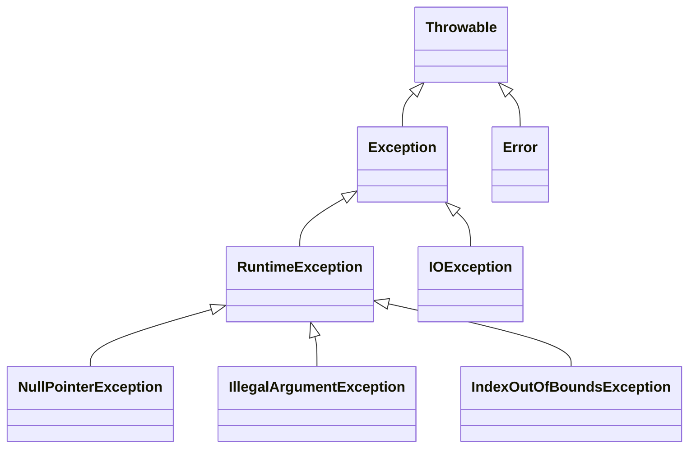

Background material:

## Understand why inheritance is a core concept of object-oriented programming (10 minutes)

- A core principle of program design is: make your data mean something.
- We write software that manipulates data in some way, and oftentimes this data is related to some real-world concept.
- When it comes to designign our program, we can leverage our domain knowledge of that real world concept to design a program that is both easy to understand and easy to maintain.
- Inheritance is a core concept of object-oriented programming that allows us to model real-world "is-a" relationships between types.

## Reading Java Syntax (10 minutes)


Here is a complete example of a Java program:

```java title="HelloWorld.java"
package io.github.neu-pdi.cs3100.lecture2;

import io.github.neu-pdi.cs3100.utils.OtherClass;

/**
 * This is a simple program that prints "Hello, World" 10 times.
 */
public class HelloWorld extends OtherClass {
    /**
     * This is the main method that is executed when the program is run.
     * @param args The command line arguments.
     */
    public static void main(String[] args) {
        for (int i = 0; i < 10; i++) {
            // Print a message to the console
            System.out.println("Hello, World #" + i);
        }
    }
}
```
Let's break down the syntax of this program.
### Package Declaration
- Code in Java is organized into packages. This is similar to how code in Python is organized into modules.
- It's best practice to use a package that is named after the organization that wrote the code.
- The convention for the package name is to use the reverse domain name of the organization.
    - For example, GitHub user `octocat` would use the package name `io.github.octocat`.
- You can, of course, choose whatever you want that satisfies the JVM's naming conventions.

### Import Declaration
- The `import` keyword is used to import classes from other packages.
- In this case, we are importing the `OtherClass` class from the `io.github.neu-pdp.cs3100.utils` package.
- Note that we are *not* importing the `String` class or the `System` class. These are both classes in the `java.lang` package, that are imported by default. 

### Comments
- Single line comments are denoted by `//`
- Multi-line comments are denoted by `/*` and `*/`
- Documentation comments are denoted by `/**` and `*/`, and are used to generate documentation for the code (more on this in an upcoming lecture)

### Class Declaration
- All code in Java must be contained within a class.
- This class is `public` which means it can be used by other classes.
   - If you don't specify the access modifier, it will default to `package-private` which means it can only be used by classes in the same package.
- This class extends `OtherClass` which means it will inherit all of the methods and fields of `OtherClass`.
- The *contents* of the class are contained within the `{` and `}` braces. This is not Python, where indentation matters.

### Method Declaration
- All code in Java must be contained within a method, which must be declared within a class.
- This method is `public` which means it can be used by other classes. It also could be `private` which means it can only be used by the class itself.
- This method is `static` which means it can be called on the class itself without creating an instance of the class.
- This method is `void` which means it does not return a value.
- This method is named `main` and takes as an argument an array of strings. This is the entry point of the program, as defined by the Java Virtual Machine (JVM). This means that when we run the command `java io.github.neu-pdp.cs3100.lecture2.HelloWorld`, the JVM will look for a `public static void main(String[] args)` method in the `HelloWorld` class and execute it.

### Method Body
- The contents of the method are contained within the `{` and `}` braces. This is not Python, where indentation matters.
- The method contains a loop that will print "Hello, World" 10 times.
    - Note how we declare a variable `i` and initialize it to 0, and also how we format a for-loop in Java
    - Again: This is not Python, where indentation matters. `{}` are required to delimit the scope of the loop.
- Let's disect the line `System.out.println("Hello, World #" + i);`:
    - `System` refers to a class: `java.lang.System` (note that we didn't need to import this class since it is part of `java.lang` which is imported by default)
    - `out` is a *static field* of the `System` class. Because it's `static`, we can access it directly on the class without creating an instance of the class.
    - `System.out` is an instance of a class that Java provides called `PrintStream`, used for writing output to streams (more on streams in a few minutes).
    - The string `"Hello, World #"` is concatenated with the value of `i` and the `println` method is called with that string as an argument.
    - Lastly, the line ends with a semicolon, which is required in Java to denote the end of a statement. This is different than Python, where the end of a statement is denoted by a newline.


## Define a class hierarchy and understand the relationship between superclasses and subclasses (10 minutes)
Background material:
- [Liskov & Gutag Ch 7](https://learning.oreilly.com/library/view/program-development-in/9780768685299/ch7.html)

(Example of a real-world "is-a" hierarchy, uses UML and also some source code with javadoc)


- Types can share common properties and behavior, but also provide their own methods, and also specialized implementations for certain methods.


## Understand the difference between static methods and instance methods (5 minutes)

- The code example we saw above *declared* a static method, but utilized an instance method of the `OutputStream` class: `System.out.println("Hello, World #" + i)` invokes the instance method `println` on the `System.out` object.
- Each instance method is associated with an object. In this case, `System.out` is an instance of the `PrintStream` class, which is used to write output to streams.

Here is an example of a class that declares an instance method:
```java
package io.github.neu-pdp.cs3100.lecture2;
import java.util.Scanner;

public class Fraction {
    private int numerator;
    private int denominator;

    public Fraction(int numerator, int denominator) {
        this.numerator = numerator;
        this.denominator = denominator;
    }
    
    public Fraction add(Fraction other) {
        return new Fraction(this.numerator * other.denominator + other.numerator * this.denominator,
            this.denominator * other.denominator);
    }

    public String toString() {
        return this.numerator + "/" + this.denominator;
    }
}
```

In this example, we have a class that declares two instance methods: `add` and `toString`, along with a constructor.
The method `add` also shows how to construct a new object using the `new` keyword.
The class also has two private fields: `numerator` and `denominator`.
They are private, which means they can only be accessed within the class.


## Describe the JVM exception handling mechanism (10 minutes)

All exceptions in Java are instances of the `Throwable` class. It is important to note that, since Java is a statically typed language, we can distinguish between different kinds of exceptions.

There are two subclasses of `Throwable`: `Exception` and `Error`. 

An `Error` is an exception that is typically fatal, and detected by the JVM itself, although you can also throw them explicitly. For example, the JVM throws an `OutOfMemoryError` if it runs out of memory, or a `StackOverflowError` if the stack overflows (too much recursive function calling). These are not expected to be caught by application code.

Exceptions are further divided into two categories: `checked` and `unchecked`.

- `checked` exceptions are those that are *required* to be caught by calling code
- `unchecked` exceptions are those that are *not* required to be caught by calling code

This is different than Python, where all exceptions are unchecked. In fact, no languages since Java have this distinction.

An exception must be checked if it is a subclass of `Exception` and not a subclass of `RuntimeException`.

This class diagram shows the relationship between the classes, along with four example exceptions:


- [Check parameters for validity](https://learning.oreilly.com/library/view/effective-java-3rd/9780134686097/ch8.xhtml#lev49)

## Utilize Java methods for reading input and writing output to streams (10 minutes)
In order to do anything useful, we probably need to be able to read input from the outside world (user, file, etc.) and write output to the outside world (user, file, etc.).

We saw how to write output to the console using `System.out.println`.

(Explain what a stream is, how stdin/out/err are special streams, and how to use a `Scanner` to read input from the console.)


