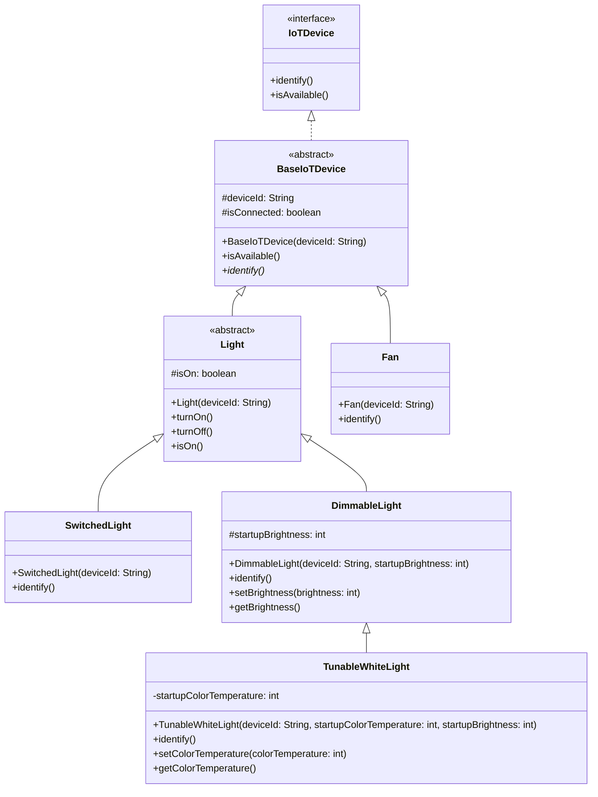
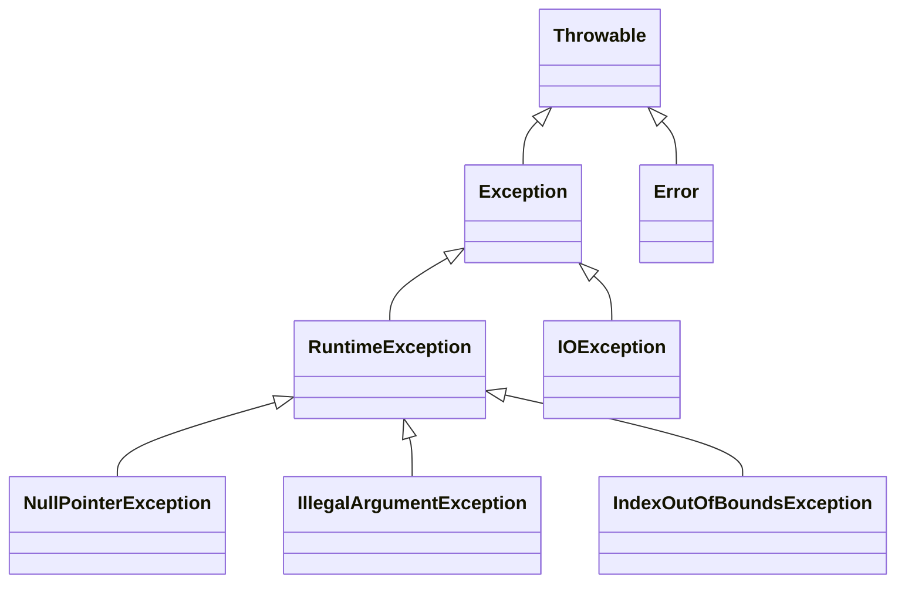

Background material:


## Understand why inheritance is a core concept of object-oriented programming (10 minutes)

- A core principle of program design is: make your data mean something.
- We write software that manipulates data in some way, and oftentimes this data is related to some real-world concept.
- When it comes to designing our program, we can leverage our domain knowledge of that real world concept to design a program that is both easy to understand and easy to maintain.
- Inheritance is a core concept of object-oriented programming that allows us to model real-world "is-a" relationships between types.
- Duplicating code is a bad idea, because it makes our program harder to maintain. Inheritance allows us to *reuse* code across multiple classes that have the same behavior.

Here is an example inheritance hierarchy, in the domain of IoT (for brevity, we don't repeat inherited methods in each subtype).

At the top is `IoTDevice`, an interface that defines two methods all devices must implement: `identify` and `isAvailable`.
The `identify` method is intended to help a human identify the device by, e.g., flashing a light on it.
The `isAvailable` method is intended to check if the device is currently available to be used (e.g. if it is reachable over the network).
We declare this type as an `interface` because we want to define a contract without committing to a specific implementation.

`BaseIoTDevice` is an abstract class that provides a *skeletal implementation* of the `IoTDevice` interface. It implements `isAvailable()` (checking if the device is connected), but leaves `identify()` abstract since each device type identifies itself differently based on its hardware.

`Light` is an abstract class that extends `BaseIoTDevice` and adds light-specific behavior: `turnOn()`, `turnOff()`, and `isOn()`.
`Fan` is a concrete class that extends `BaseIoTDevice` directly.

`SwitchedLight` and `DimmableLight` are concrete types that extend `Light`. `DimmableLight` adds brightness control.
`TunableWhiteLight` is a concrete type that extends `DimmableLight` to support not only dimming, but also adjusting the color temperature.




By structuring our program in this way, we can reuse code across multiple types that have the same behavior.

Every language has its own way of representing type hierarchies.
In Java, type hierarchies are represented using *classes* and *interfaces*.
Next, we'll look at classes, and then at interfaces.

## Define a type hierarchy and understand the relationship between superclasses and subclasses (10 minutes)
Background material:
- [Liskov & Gutag Ch 7](https://learning.oreilly.com/library/view/program-development-in/9780768685299/ch7.html)

- Classes:
    - Can extend exactly one superclass (which may itself extend another class)
    - Can implement multiple interfaces
    - Inherit fields and methods from its superclass, can also *override* methods
    - Can be concrete (provide an implementation for all methods) or abstract (declare methods that must be implemented by subclasses). More on abstract classes later.

Here is how a class is defined in Java:

```java title="TunableWhiteLight.java"
package io.github.neu-pdi.cs3100.iot.lights;

public class TunableWhiteLight extends DimmableLight {
    private int startupColorTemperature;
    public TunableWhiteLight(String deviceId, int startupColorTemperature, int startupBrightness) {
        super(deviceId, startupBrightness);
        this.startupColorTemperature = startupColorTemperature;
    }
    /**
     * Turn on the light.
     * Sets the color temperature to the startup color temperature.
     */
    @Override
    public void turnOn() {
        setColorTemperature(startupColorTemperature);
        // With the color temperature set, we can now turn on the light.
        super.turnOn();
    }
    /**
     * Set the color temperature of the light.
     * @param colorTemperature The color temperature to set the light to, in degrees Kelvin.
     */
    public void setColorTemperature(int colorTemperature) {
        // ...
    }
    /**
     * Get the color temperature of the light.
     * @return The color temperature of the light, in degrees Kelvin.
     */
    public int getColorTemperature() {
        // ...
    }

}
```

This code snippet declares our `TunableWhiteLight` class, which extends `DimmableLight`. Here are some key syntax points to note:
- We specify the superclass of `TunableWhiteLight` with the `extends` keyword.
- We declare a constructor that initializes the `startupColorTemperature` field.
- We declare some new methods (`setColorTemperature` and `getColorTemperature`), and override the `turnOn` method of `DimmableLight`.

- Each of these methods is `public`, which means they can be called by other classes.
- The other visibility modifiers are `private` and `protected`.
    - `private` means the method can only be called by other methods in the class.
    - `protected` means the method can be called by other methods in the class, and by subclasses.
- If you don't specify a visibility modifier, it defaults to `package-private`, which means the method can be called by other methods in the same package. This is generally regarded as a bad practice (and bad language feature) because it makes it hard to reason about the accessibility of methods, and we suggest you avoid it.

On the keyword `super`:
- `super` refers to the direct superclass the same way calling `this` refers to the present class. In this case calling `super` in `TunableWhiteLight` refers to `DimmableWhiteLight`

- **Use case 1**: fields that are common between all instances of the superclass can be abstracted by calling the constructor of the superclass in the first line of the subclass constructor.  Based on how it is used above, the constructor of `DimmableLight` would look something like
```java
public class DimmableLight extends Light {
    protected int startupBrightness;
    public DimmableLight(String deviceId, int startupBrightness) {
        super(deviceId);
        this.startupBrightness = startupBrightness;
    }
    ...
}
```


- **Use case 2**: you might wish to defer to the implementation of your superclass after some work in your subclass.  In that case, use `super.[someMethod]()` as `turnOn` does

Some rules for overriding methods:
- We use the `@Override` annotation to indicate that we are overriding a method from the superclass. This is not strictly required by the JVM, but is helpful for readability. It also allows the compiler to catch some errors: if you put `@Override` on a method that doesn't actually override a superclass method, the compiler will generate an error.

Each type in the hierarchy must satisfy the [Liskov Substitution Principle](https://learning.oreilly.com/library/view/program-development-in/9780768685299/ch7.html#:~:text=Subtypes%20must%20satisfy%20the%20substitution%20principle%20):
- The method signatures (parameters, return type) must be the same as the method it overrides. This is enforced by the compiler.
- The behavior of the method must be the same as the method it overrides. This is not enforced by the compiler, but is a good design principle. 
    - There is an implicit specification that the method `turnOn` must turn on the light. If a subclass overrides this method and does not turn on the light, it is violating the Liskov Substitution Principle.
    - This is important because it allows us to *substitute* a superclass for a subclass in our program.
- Any properties that hold for the superclass must also hold for the subclass.
    - Example property: If the light is on, the method `isOn` must return true. If the light is off, the method `isOn` must return false.
- We'll return to this principle later when we discuss polymorphism and specification.

Java allows assignment of a subclass to a superclass reference:
```java
Light[] lights = new Light[2];
TunableWhiteLight light = new TunableWhiteLight("light-1", 2700, 100);
lights[0] = light;
TunableWhiteLight light2 = new TunableWhiteLight("light-2", 2200, 100);
lights[1] = light2;
for (Light l : lights) {
    l.turnOn();
}
```
In this code snippet, we declare an array of `Light` references, and assign a `TunableWhiteLight` to the first element.
This is allowed because a `TunableWhiteLight` is a `Light`, and thus a `Light` is a `TunableWhiteLight`.

We wrote this somewhat verbosely to make it clear that we are assigning a `TunableWhiteLight` to a `Light` reference, but we could have written this more concisely:
```java
Light[] lights = new Light[] {
    new TunableWhiteLight("light-1", 2700, 100),
    new TunableWhiteLight("light-2", 2200, 100)
};
for (Light l : lights) {
    l.turnOn();
}
```

To access the `TunableWhiteLight` methods, we need to cast the `Light` reference to a `TunableWhiteLight` reference:
```java
TunableWhiteLight light2 = (TunableWhiteLight) lights[1];
light2.setColorTemperature(2200);
```

This snippet could also be written more concisely:
```java
((TunableWhiteLight) lights[1]).setColorTemperature(2200);
```

## Explain the role of interfaces and abstract classes in a Java class hierarchy (10 minutes)

Sometimes we want to declare a set of behaviors that must be implemented by all subclasses, but we don't want to provide a concrete implementation for those behaviors. There are two ways to do this: interfaces and abstract classes.

### Interfaces
- Interfaces:
    - Define a set of methods that a class must implement.
    - Can extend one or more interfaces.
    - Can be implemented by multiple classes.
    - Can provide a default implementation for some methods (but the semantics are messy and we don't recommend it)
    - Cannot be instantiated directly.

Here is an example of an interface:
```java
public interface IoTDevice {
    /**
     * Identify the device to a human (e.g., flash a light, spin a fan, beep a speaker).
     */
    public void identify();
    /**
     * Check if the device is available.
     * @return true if the device is connected and available, false otherwise.
     */
    public boolean isAvailable();
}
```

### Abstract classes
- Abstract classes:
    - Define a set of methods that a class must implement.
    - Can extend one or more classes.
    - Can provide a default implementation for some methods
    - Cannot be instantiated directly.

A common pattern in Java is to pair an interface with a **skeletal implementation** (also called an "abstract base class"). This gives callers flexibility: they can extend the abstract class for convenience, or implement the interface directly if they need different behavior. You'll see this pattern throughout the Java standard library in upcoming lectures with classes like `AbstractList`, `AbstractMap`, and `AbstractCollection`.

Here is an example of an abstract class that provides a skeletal implementation of `IoTDevice`:

```java
public abstract class BaseIoTDevice implements IoTDevice {
    protected String deviceId;
    protected boolean isConnected;

    public BaseIoTDevice(String deviceId) {
        this.deviceId = deviceId;
        this.isConnected = false;
    }

    /**
     * Check if the device is available.
     * @return true if the device is connected, false otherwise.
     */
    @Override
    public boolean isAvailable() {
        return this.isConnected;
    }

    /**
     * Identify the device to a human (e.g., flash a light, spin a fan, beep a speaker).
     * Each device type must implement this differently based on its hardware.
     */
    public abstract void identify();
}
```

#### Key notes on abstract classes:
- Fields in abstract classes are often `protected` so they can be accessed by subclasses
- We implement methods common between all subclasses to reduce duplication (like `isAvailable()`)
- Not all methods from the interface need to be implemented by abstract classes since they are not directly instantiated, but those methods will still be required in concrete classes that `extend` them
- We can use `abstract methods` such as `identify()` in abstract classes to enforce that subclasses implement behaviors that depend on their specific characteristics (in this case, hardware)

## Understand the JVM's implementation of dynamic dispatch (10 minutes)

Recall that we can assign a subclass to a superclass reference:
```java
Light[] lights = new Light[] {
    new TunableWhiteLight("light-1", 2700, 100),
    new DimmableLight("light-2", 100)
};
```

We said that this assignment is allowed because a `TunableWhiteLight` and `DimmableLight` are both `Light`, and thus a `Light` is a `TunableWhiteLight` or `DimmableLight`. But, how does the JVM know which method to call?

"Dynamic dispatch" is the process by which the JVM determines which method to call at runtime:
```java
for (Light l : lights) {
    l.turnOn(); // This will call the turnOn method of the actual type of l, which may be TunableWhiteLight, DimmableLight, or some other subclass.
}
```

Notice how even at the same call-site, the JVM will call the `turnOn` method of the actual type of `l`.

Here is how the JVM implements dynamic dispatch to call method $m$ on object $o$ of type $T$:
1. If $T$ contains a declaration of $m$, use that.
2. If $T$ has a superclass $S$ that contains a declaration of $m$, use that. If not, continue recursively with $S$'s superclass.
3. If no other declaration is found, and $m$ is provided as a default interface method, use that.

This is called "dynamic dispatch" because the method to call is determined at runtime, rather than at compile time. Consider the following example:

```java
Light l = new TunableWhiteLight("living-room", 2700, 100);
l.turnOn(); // This will call the turnOn method of the actual type of l, which is TunableWhiteLight.
((DimmableLight) l).turnOn(); // Still calls turnOn method of TunableWhiteLight, because when it runs, that's the type of l.
```

Regardless of the type of the variable in our code, the actual type at runtime is used to determine which method to call.

## Understand the difference between static methods and instance methods (5 minutes)

Some methods are declared as `static`, which means they are associated with the class itself, rather than an instance of the class.

This is a snippet of code from our `TunableWhiteLight` class, now including a static method:
```java
public class TunableWhiteLight extends DimmableLight {
    //...

    /**
     * Convert a color temperature in degrees Kelvin to a color temperature in mireds.
     * @param degreesKelvin The color temperature in degrees Kelvin.
     * @return The color temperature in mireds.
     */
    public static int degressKelvinToMired(int degreesKelvin) {
        return 1000000 / degreesKelvin;
    }
    //...
}
```

This static method is associated with the `TunableWhiteLight` class, not an instance of the class.
To invoke it, we use the class name:
```java
TunableWhiteLight.degressKelvinToMired(2700);
```

Static methods are statically bound, unlike instance methods which are dynamically bound. At the time that you write and compile your code, the method to call is known (no runtime lookup is needed).

## Describe the JVM exception handling mechanism (5 minutes)

All exceptions in Java are instances of the `Throwable` class. It is important to note that, since Java is a statically typed language, we can distinguish between different kinds of exceptions.

There are two subclasses of `Throwable`: `Exception` and `Error`. 

An `Error` is an exception that is typically fatal, and detected by the JVM itself, although you can also throw them explicitly. For example, the JVM throws an `OutOfMemoryError` if it runs out of memory, or a `StackOverflowError` if the stack overflows (too much recursive function calling). These are not expected to be caught by application code. It is generally bad practice to throw an `Error` in your code.

Exceptions are further divided into two categories: `checked` and `unchecked`.

- `unchecked` exceptions are those that are *not* required to be caught by calling code (all subclasses of `RuntimeException`)
- `checked` exceptions are those that are *required* to be caught by calling code (all subclasses of `Exception` that are not subclasses of `RuntimeException`)

This is different than Python, where all exceptions are unchecked.

By making this distinction, an API can *require* that certain exceptions are caught, and the compiler will enforce that requirement. 

This class diagram shows the relationship between the classes, along with four example exceptions:


You should [only use exceptions for exceptional cases](https://learning.oreilly.com/library/view/effective-java-3rd/9780134686097/ch10.xhtml#lev69), for example, this is not a good use of an exception:
```java
try {
    Light[] lights = {
        new TunableWhiteLight("light-1", 2700, 100),
        new TunableWhiteLight("light-2", 2200, 100)
    };
    int i = 0;
    while(true){
        lights[i].turnOn();
        i++;
    }
} catch (ArrayIndexOutOfBoundsException e) {
    // Do nothing
}
```

## Recognize common Java exceptions and when to use them (5 minutes)

While you could create a specialized exception for every possible error condition, this would be anithetical to the idea of reusing code. Instead, we [favor the use of standard exceptions](https://learning.oreilly.com/library/view/effective-java-3rd/9780134686097/ch10.xhtml#lev72)

Here are some common exceptions and when to use them:
- `IllegalArgumentException`: When a method is passed an illegal or inappropriate argument.
- `NullPointerException`: When a method is passed a null argument that is not expected.
- `IllegalStateException`: When an object is in an inappropriate state for a method to perform its task.
- `IndexOutOfBoundsException`: When an index is out of bounds.
- `UnsupportedOperationException`: When an operation is not supported by an object.

Each method should [check parameters for validity](https://learning.oreilly.com/library/view/effective-java-3rd/9780134686097/ch8.xhtml#lev49) and throw an appropriate exception if the parameters are invalid. For example:

```java
/**
 * Set the color temperature of the light.
 * @param colorTemperature The color temperature to set the light to, in degrees Kelvin.
 * @throws IllegalArgumentException if the color temperature is outside the valid range.
 */
public void setColorTemperature(int colorTemperature) {
    if (colorTemperature < 1000 || colorTemperature > 10000) {
        throw new IllegalArgumentException("Color temperature in degrees Kelvin must be between 1,000 and 10,000");
    }
    // ...
}
```
