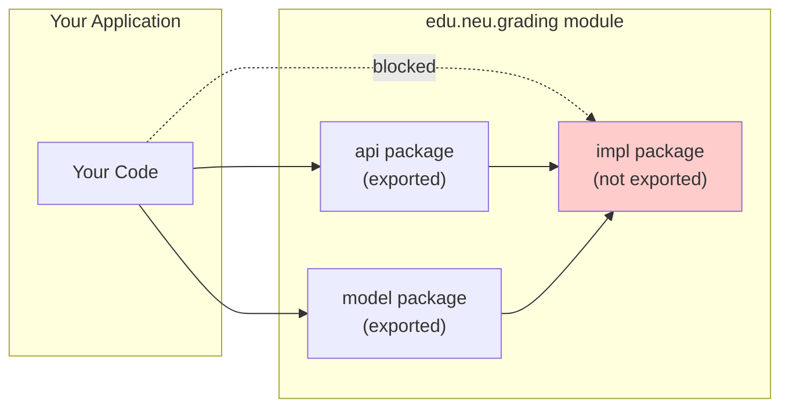

## Explain how component reuse simplifies software development and the role of OSS ecosystems in distributing reusable components (15 minutes)

Modern software is not written from scratch. A typical application depends on dozens—sometimes hundreds—of open source libraries and frameworks. When you add dependencies to your `build.gradle`, you're pulling in code written by thousands of developers around the world.

Consider what happens when you want to parse JSON in Java. You might add Jackson to your project:

```gradle
// build.gradle
dependencies {
    implementation 'com.fasterxml.jackson.core:jackson-databind:2.15.0'
}
```

This single line brings in Jackson—but Jackson itself depends on other libraries. Run `gradle dependencies` and you'll see:

```
+--- com.fasterxml.jackson.core:jackson-databind:2.15.0
|    +--- com.fasterxml.jackson.core:jackson-annotations:2.15.0
|    +--- com.fasterxml.jackson.core:jackson-core:2.15.0
```

Three JARs for one "dependency." And this is a *simple* library. A typical Spring Boot web application pulls in hundreds of transitive dependencies. Your "Hello World" web app stands on the shoulders of thousands of contributors.

```java
// Using Jackson to serialize a Submission to JSON
ObjectMapper mapper = new ObjectMapper();
Submission submission = new Submission("Alice", "Assignment 1");

// Convert object to JSON string
String json = mapper.writeValueAsString(submission);
// {"studentName":"Alice","assignmentName":"Assignment 1"}

// Convert JSON string back to object
Submission parsed = mapper.readValue(json, Submission.class);
```

You didn't write the JSON parsing logic. You didn't handle edge cases for escaping special characters. You didn't optimize for performance. Thousands of developers contributed to Jackson so you could write three lines of code instead of three thousand.

### Infrastructure Code Wants to Be Open Source

Here's a key insight: **infrastructure code gravitates toward open source**.

Operating systems, web servers, JSON parsers, logging libraries—these are utilities for the common good. Everybody needs them; nobody wants to bear the full cost alone. If you're Netflix, your competitive advantage isn't your JSON parser—it's your recommendation algorithm, your content library, your user experience. The *infrastructure* underneath is essentially the same as what Spotify, Airbnb, and thousands of other companies need.

So why would each company employ engineers to independently build the same utilities? It makes far more sense to:
1. Share the cost of development across the industry
2. Benefit from bug fixes and security patches contributed by everyone
3. Focus your proprietary engineering effort on what actually differentiates your product

This is why so much foundational software is open source—not out of altruism, but because **infrastructure is a shared problem with a shared solution**. IBM committed over $1 billion to Linux development. Microsoft—[once calling Linux "communism"](https://www.theregister.com/2000/07/31/ms_ballmer_linux_is_communism/)—now runs it across Azure and acquired GitHub, putting open-source at the front of its corporate strategy. Companies contribute to open source because it's cheaper than going it alone.

### The Cathedral and the Bazaar

In 1997, Eric S. Raymond wrote an influential essay comparing two models of software development:

- The **Cathedral** model: a small group of developers works in isolation, releasing polished versions infrequently. Traditional proprietary software.
- The **Bazaar** model: development happens in the open, with frequent releases, users treated as co-developers, and anyone able to contribute. Open source.

The bazaar model powers most successful open source projects today:
- Release early and often to get feedback
- Treat users as co-developers
- Modularize and reuse components
- Democratic (or at least transparent) governance

**GitHub is the modern bazaar.** A developer in Tokyo can publish a library on Monday; by Friday, teams in São Paulo, Berlin, and Boston are using it, filing issues, and submitting pull requests. This global collaboration was unimaginable when software was distributed on tapes and CDs.

### Open Source Won

Consider web browsers. In the late 1990s, Netscape—facing extinction from Microsoft's Internet Explorer—made a desperate gambit: they open-sourced their browser code as Mozilla. Netscape the company died. Mozilla Firefox eventually lost market share to Chrome and Safari.

But open-source won the war:
- **Chrome**'s engine is Chromium (open source)
- **Safari**'s engine is WebKit (open source)  
- **Microsoft Edge** abandoned its proprietary engine for... Chromium

Every major browser today is built on open source foundations. The same pattern plays out across the industry:

| Project | What it does | Where it's used |
|---------|--------------|-----------------|
| **Linux** | Operating system kernel | Android, AWS, most web servers |
| **OpenSSL** | Cryptography library | Almost every secure connection on the internet |
| **SQLite** | Embedded database | Every iPhone, Android, browser, countless apps |
| **Jackson** | JSON serialization | Most Java web services, Android apps, enterprise systems |
| **Spring Boot** | Java web framework | Banks, retailers, governments |
| **JUnit** | Testing framework | Virtually every Java project |
| **React** | UI component library | Facebook, Instagram, Netflix, Airbnb |
| **TensorFlow / PyTorch** | Machine learning | Google, Tesla, OpenAI, countless AI applications |

Many of these projects are maintained by small teams—yet they support billions of dollars of commercial software.

### Package Registries: The Distribution Network

Open source ecosystems depend on **package registries** to distribute reusable components:

- **Maven Central** — Java/JVM libraries (JUnit, Spring, Jackson)
- **npm** — JavaScript packages (React, Express, lodash)
- **PyPI** — Python packages (pandas, tensorflow, requests)
- **crates.io** — Rust packages
- **NuGet** — .NET packages

These registries make it trivial to declare a dependency and have it automatically downloaded, along with all of its transitive dependencies.

### Versioning and Semantic Versioning

Libraries evolve. Bugs get fixed, features get added, APIs get redesigned. How do you know if updating a dependency will break your code?

Most ecosystems use **Semantic Versioning** (SemVer), which encodes compatibility promises in version numbers:

```
MAJOR.MINOR.PATCH
  2  .  15  .  0
```

- **PATCH** (2.15.0 → 2.15.1): Bug fixes only. Safe to update.
- **MINOR** (2.15.0 → 2.16.0): New features added, but backwards compatible. Usually safe.
- **MAJOR** (2.15.0 → 3.0.0): Breaking changes. Your code may need updates.

Dependency declarations can specify version ranges:

```gradle
// Gradle: exact version
implementation 'com.fasterxml.jackson.core:jackson-databind:2.15.0'

// Gradle: any 2.x version
implementation 'com.fasterxml.jackson.core:jackson-databind:2.+'
```

The tradeoff: strict versions give you reproducibility but require manual updates; flexible ranges give you automatic security patches but risk unexpected breakage.

### The Double-Edged Sword

This ecosystem of reuse brings enormous benefits:
- **Speed**: Don't reinvent the wheel; use battle-tested solutions
- **Quality**: Popular libraries have been debugged by millions of users
- **Security**: Vulnerabilities are often found and patched quickly (when maintainers are active)

But it also introduces risks we'll discuss later in this lecture:
- **Supply chain attacks**: A compromised dependency compromises your application
- **Abandonment**: What happens when a maintainer stops updating a critical library?
- **License compatibility**: Can you legally use this code in your project?

## Describe the role of the Java module system in defining APIs (10 minutes)

When you publish a library, which classes should consumers be allowed to use? Before Java 9, the answer was simple but unsatisfying: any `public` class was fair game.

### The Problem: Public Means Public

Libraries often need internal utility classes that are `public` so other packages *within the library* can use them—but these classes aren't meant for external consumers. For example, Jackson might have a `com.fasterxml.jackson.databind.impl.InternalHelper` class that's `public` so other Jackson packages can access it, but you shouldn't depend on it in your application.

Before modules, there was no way to express this. Developers would add Javadoc warnings like "Internal API - do not use" but nothing enforced it. Consumers would depend on internal classes, and then their code would break when the library changed those internals.

### The Solution: Module-Public vs Module-Private

Java 9 introduced the **module system**, which lets library authors explicitly declare their public API. A `module-info.java` file at the root of your module specifies which packages are **exported**:

```java
// module-info.java for a hypothetical grading library
module edu.neu.grading {
    // These packages are our public API - consumers can use them
    exports edu.neu.grading.api;
    exports edu.neu.grading.model;
    
    // edu.neu.grading.impl is NOT exported
    // Classes there can be public (for internal use) but invisible to consumers
}
```

With this declaration:
- Classes in `edu.neu.grading.api` and `edu.neu.grading.model` are accessible to consumers
- Classes in `edu.neu.grading.impl` are **module-private**—even if they're declared `public`, code outside the module cannot access them

### Encapsulation at the Library Level

This is **encapsulation scaled up**. Just as `private` fields hide implementation details within a class, unexported packages hide implementation details within a module.

The benefits connect directly to the coupling concepts from earlier lectures:
- **Reduced coupling**: Consumers can't depend on your internals, so you're free to change them
- **Clearer contracts**: The exported packages *are* your API; everything else is implementation detail
- **Safer evolution**: You can refactor internal code without breaking consumers



When adopting a library, check whether it uses the module system. If it does, you know exactly which classes are part of the supported API—and you can be confident that sticking to those classes will protect you from breaking changes in future versions.

## Describe the role and impact of "copyleft" licenses on OSS (10 minutes)

Open source doesn't mean "no rules." Software is protected by copyright, and open source licenses grant you specific rights to use, modify, and distribute that code—with conditions attached.

### The Two Philosophies

Much of the origin of open source [can be traced back to the original Unix project](https://learning.oreilly.com/library/view/how-open-source/9781484268001/html/464908_2_En_1_Chapter.xhtml), and the first open-source license is often credited to the [Berkeley Software Distribution (BSD) license](https://en.wikipedia.org/wiki/BSD_licenses). The original terms of this license were, roughly: do whatever you want, just don't blame us, and always credit The Regents of the University of California in advertising materials.

In 1983, Richard Stallman launched the GNU project with a radical philosophy: software should be **free as in speech, not as in beer**. He articulated four freedoms that developers must have over software:

- **Freedom 0**: Run the code as you wish, for any purpose
- **Freedom 1**: Study how the code works and change it
- **Freedom 2**: Redistribute copies to help others
- **Freedom 3**: Distribute copies of your modified version

To protect these freedoms, Stallman created the **GNU General Public License (GPL)**—a "copyleft" license that requires anyone who distributes modified versions to also release their source code under the GPL. This is a significant departure from the BSD license, which allowed for commercial use of the software **without** sharing the source code with the advertising clause. Stallman made the departure from Unix's model quite clear in naming GNU, as GNU stands for... "GNU's Not Unix!"

### Permissive vs. Copyleft

| | Permissive (MIT, Apache, BSD) | Copyleft (GPL, LGPL, AGPL) |
|---|---|---|
| **Can I use it in proprietary software?** | Yes | Depends (usually requires open-sourcing your code) |
| **Must I share my modifications?** | No | Yes, if you distribute |
| **Philosophy** | Maximize adoption | Protect the commons |

**Permissive licenses** (MIT, Apache 2.0, BSD) encourage adoption. Companies can use the code, modify it, and ship it in proprietary products without sharing their changes. Most popular libraries use permissive licenses: React (MIT), Jackson (Apache 2.0), Spring (Apache 2.0).

**Copyleft licenses** (GPL, LGPL, AGPL) "protect the commons" by requiring that derivative works also be open source. If you distribute software that includes GPL code, you must release your source code under the GPL too. Linux uses the GPL—which is why Android's kernel modifications are public.

### Practical Guidance

For most developers using open source libraries:

1. **Check the license** before adding a dependency. It's usually in a `LICENSE` file or the package metadata.
2. **Permissive licenses are low-risk** for most commercial projects.
3. **GPL requires careful attention** if you are not interested in releasing your code under GPL.

The philosophical debate continues: should open source force participation in the commons (copyleft), or encourage it through permissive terms? There's no single right answer—both approaches have produced wildly successful projects. Furthermore, modern software distribution (e.g. operating software as a service) has provided a GPL loophole: if Amazon operates its own version of, say, MongoDB, as a cloud product, it is not required to release the source code for that version of MongoDB.

## Describe tradeoffs that should be considered when adopting a library or framework (15 minutes)

Adding a dependency is easy—one line in your `build.gradle` and you're done. But every dependency is a commitment. You're trusting someone else's code to work correctly, to be maintained, to not introduce security vulnerabilities, and to remain available under acceptable terms.

Before adopting a library or framework, ask yourself:
- **Who maintains this, and will they still be maintaining it in two years?**
- **What happens if I need to switch away from it later?**
- **Am I comfortable with the license terms?**
- **How much will this shape the rest of my code?**

That last question matters more than you might think. A utility library for string formatting has minimal impact—you can swap it out easily. A web framework will influence your entire application's structure, and migrating away could mean a rewrite.

### Community Health and Maintenance

The most important factor in evaluating a dependency is often **who's behind it and how active they are**. Before adopting a library, investigate:

- **Recent activity**: When was the last commit? The last release? A library with no updates in two years might be stable—or abandoned.
- **Issue responsiveness**: Are bugs acknowledged? Are pull requests reviewed? A backlog of 500 ignored issues is a red flag.
- **Bus factor**: How many core maintainers are there? If one person maintains a critical library in their spare time, what happens when they burn out or move on?
- **Documentation quality**: Good documentation signals a project that cares about its users.

Many foundational open source projects are maintained by surprisingly small teams. OpenSSL—securing most of the internet's connections—was maintained by a handful of volunteers until the [Heartbleed vulnerability](https://www.heartbleed.com) exposed how underfunded critical infrastructure can be.

### Governance and Sustainability

Open source projects have different governance models, each with tradeoffs:

**Corporate-backed projects** (Chromium/Google, React/Meta, TensorFlow/Google, PyTorch/Meta):
- Often well-funded with full-time developers
- Risk: corporate priorities may not align with yours
- Risk: the company may change the license or abandon the project

**Foundation-governed projects** (Apache projects, Linux Foundation, Python Software Foundation):
- More community-oriented governance
- Often more stable long-term
- May move slower than corporate-backed projects
- Some foundations are simply fronts for a small set of corporations

**Community/individual projects**:
- Can be incredibly innovative
- Higher risk of abandonment
- May lack resources for security audits, documentation, etc.

**Watch out for license changes.** In recent years, several companies have changed their open source licenses to be more restrictive:
- MongoDB moved from AGPL to the Server Side Public License (SSPL)
- HashiCorp moved Terraform from MPL to the Business Source License (BSL)
- Redis moved from BSD to dual-license with SSPL

### When Communities Move On: Forks

A **fork** is when someone takes a copy of an open source project and develops it independently. Because the source code is available under an open license, anyone can do this—the only thing the original creators can retain is the trademark on the name.

Forks often happen when the community loses confidence in the project's governance:

| Original | Fork | What happened |
|----------|------|---------------|
| MySQL | MariaDB | Oracle acquired Sun (MySQL's owner); community worried about Oracle's stewardship |
| OpenOffice | LibreOffice | Oracle fired internal developers after acquiring Sun; community forked and LibreOffice became the de facto successor |
| Terraform | OpenTofu | HashiCorp changed to a restrictive license; Linux Foundation now hosts the fork |

The OpenOffice → LibreOffice story is instructive: Sun open-sourced StarOffice as OpenOffice in 1999 to compete with Microsoft Office. When Oracle acquired Sun in 2010 and fired the core developers, the community forked it as LibreOffice. OpenOffice effectively died—Oracle eventually donated the remnants to Apache, but LibreOffice had already won.

**The lesson:** governance matters. A project with healthy community governance is more resilient than one controlled by a single company. And if governance fails, the code can live on—but the disruption is painful for everyone.

### Security: Build vs. Adopt

A common question: is it safer to use a popular library or write your own? The answer is almost always **use the library**—if it's well-maintained.

**Why well-maintained libraries are usually safer:**
- Battle-tested by thousands of users
- Security researchers scrutinize popular projects
- Vulnerabilities get reported and patched
- You benefit from the security expertise of specialists

**But dependencies introduce risk too:**
- Every dependency is an attack surface (supply chain attacks)
- Transitive dependencies multiply the risk—your app may include libraries you've never heard of
- Unmaintained dependencies don't get security patches

The key insight: **a well-maintained library you keep updated is almost certainly more secure than a poorly-maintained one you write yourself.** You're unlikely to out-engineer the Jackson team at JSON parsing, or the Spring Security team at authentication.

The risks come when:
1. You adopt a library and never update it
2. The library is abandoned and stops receiving patches
3. A malicious actor compromises the library or its dependencies (the [left-pad incident](https://www.theregister.com/2016/03/23/npm_left_pad_chaos/), [Log4Shell](https://en.wikipedia.org/wiki/Log4Shell))