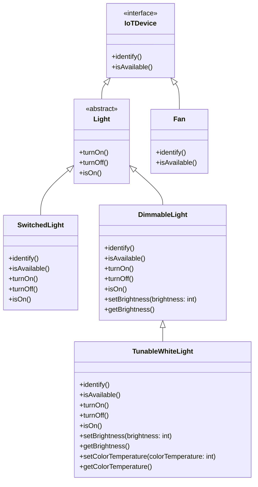
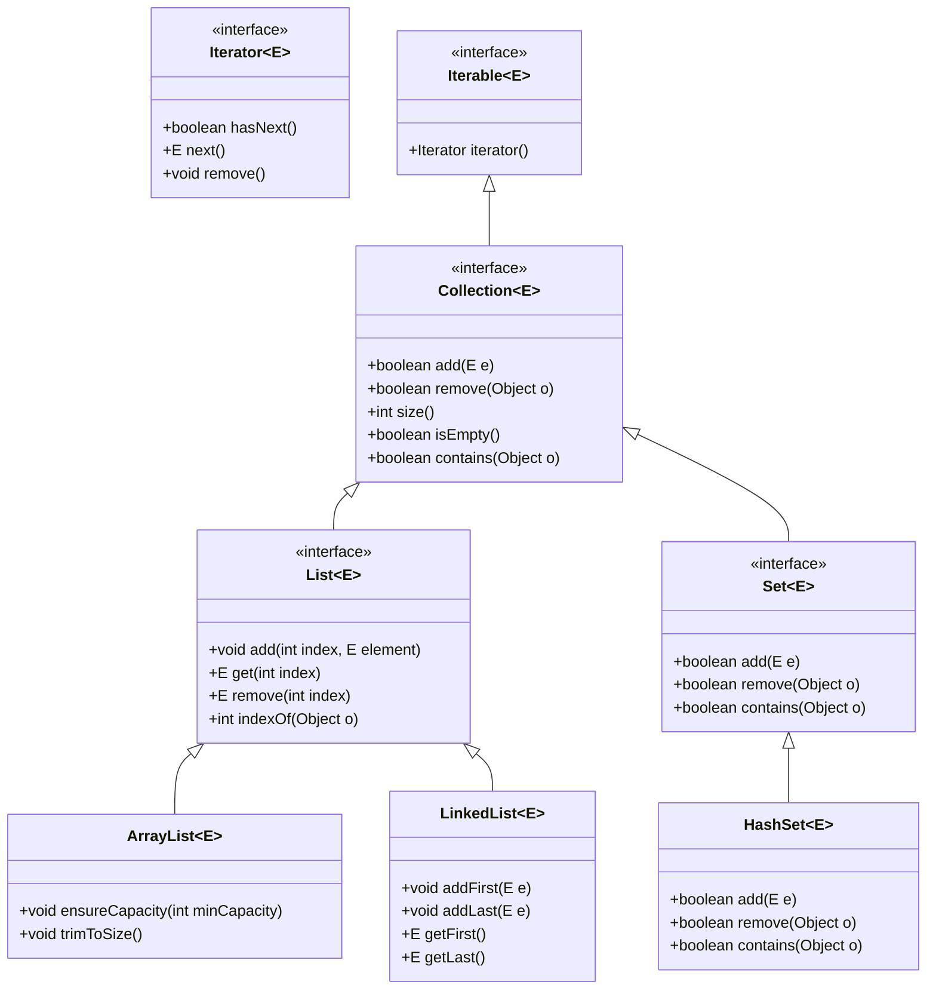
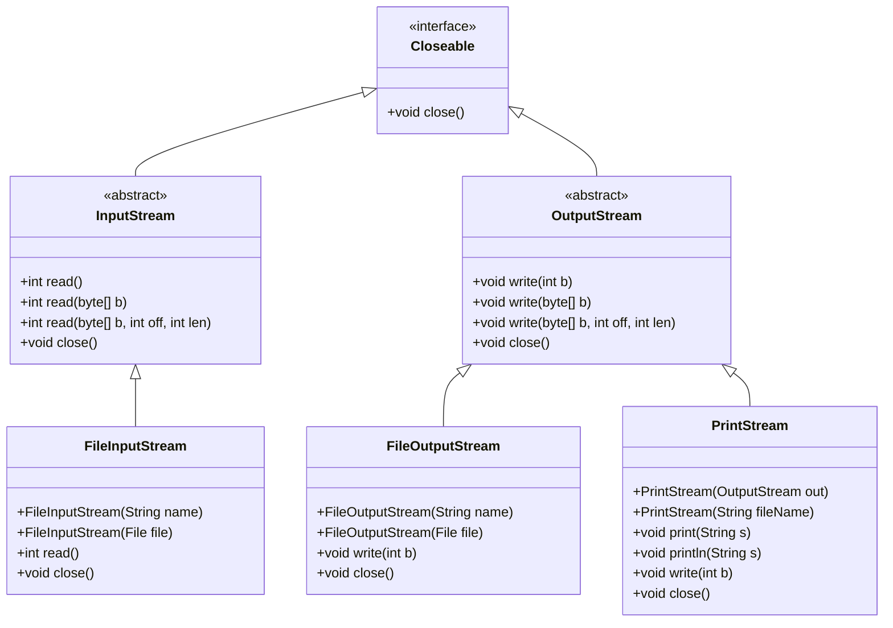
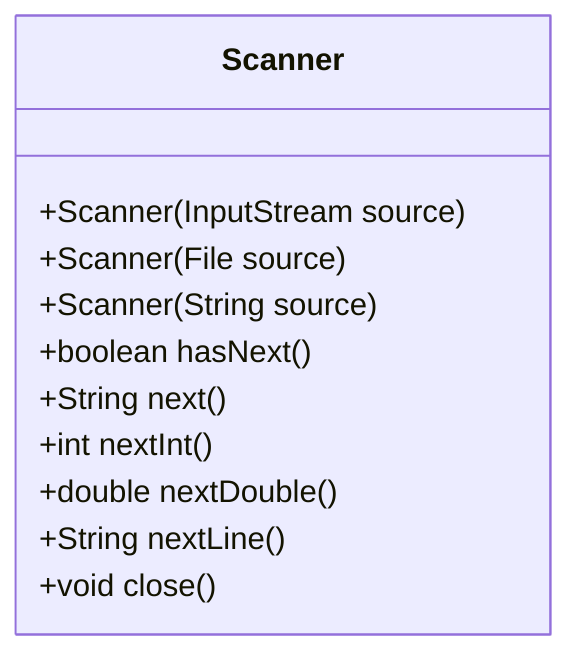

## Review the role of inheritance and dynamic dispatch in Java (5 minutes)

In the last lecture, we introduced the concept of *inheritance* and *dynamic dispatch*. Recall the example type hierarchy that we introduced:




We discussed how inheritance allows us to reduce repetition by sharing common behavior between related types.

We also discussed how dynamic dispatch allows us to write code that can work with any object that supports the appropriate interface, without having to know exactly what type of object it is. For example, we can write code to turn on any `Light` object, and it will work regardless of the specific type of `Light` object.

```java
Light[] lights = new Light[] {
    new TunableWhiteLight(2700),
    new TunableWhiteLight(2200)
};
for (Light l : lights) {
    l.turnOn();
}
```

In this example, we call the `turnOn` method on each element of the `lights` array. Since `turnOn` is a method of the `Light` interface, and all `Light` objects implement this method, this code will work regardless of the specific type of `Light` object.

*Dynamic Dispatch* is the mechanism that the JVM uses to determine which method to call at runtime based on the actual type of the object. We provided a formal definition of dynamic dispatch in the last lecture, which we will summarize from hereon out as:

> During program execution, the JVM will determine which method to call based on the actual type of the object, choosing the most specific method that the object supports.

This is a powerful mechanism that allows us to write very flexible and reusable code.

Today's lecture will continue to explore the role of inheritance and dynamic dispatch in Java, through a discussion of two important APIs in Java:
- The Collections API, which provides a set of core data structures that are useful for programming.
- The I/O API, which provides a set of classes for reading input and writing output to streams.

## Describe the role of generics in the Collections API (10 minutes)
The Collections API provides core data structures like Lists, Maps, and Sets. Before we go too far into discussion Collections, we should discuss a type system feature of Java called *generics*.

Generics allow us to write code that is reusable *and* type-safe, without knowing in advance what type of data we will be working with. For example, here is a basic list interface in Java that does not use generics:

```java
public interface List {
    /**
     * Adds an element to the list.
     * @param o the element to add
     */
    void add(Object o);

    /**
     * Returns the element at the given index.
     * @param index the index of the element to return
     * @return the element at the given index
     */
    Object get(int index);
}
```

This interface is *type-unsafe* because it uses `Object` to store elements, which means that we can store any type of object in the list. This is useful, but it also means that we can put any type of object in the list, which can lead to runtime errors. For example, this code will compile, but throw a `ClassCastException` at runtime:

```java
List list = new ArrayList();
list.add(new TunableWhiteLight(2700));
list.add(new Fan());

// This will throw a ClassCastException at runtime
TunableWhiteLight light = (TunableWhiteLight) list.get(1);
```

Generics allow us to write type-safe code by allowing us to specify the type of object that a list can hold. For example, here is the same list interface using generics:

```java
/**
 * A list
 * @param <ElementType> the type of elements in the list
 */
public interface List<ElementType> {
    /**
     * Adds an element to the list.
     * @param o the element to add
     */
    void add(ElementType o);

    /**
     * Returns the element at the given index.
     * @param index the index of the element to return
     * @return the element at the given index
     */
    ElementType get(int index);
}
```

Note the syntax of `<ElementType>` in the interface declaration. This is called a *type parameter*. When we use the `List` interface, we can specify the type of object that the list can hold. For example, here is how we might use this interface to create a list of only `Light` objects:

```java
List<Light> lights = new ArrayList<Light>();
lights.add(new TunableWhiteLight(2700));
lights.add(new Fan()); // This will throw a compile-time error
```

**Detecting errors when you write them is invaluable.** The role of static typing is to help you catch errors as you type them, when it is very easy to fix them. Even if it just takes you 3 minutes to find and fix this error at runtime, that's 3 minutes of overhead on a piece of code that you could have written correctly in just a few seconds.

When a type has a parameter (like `List<ElementType>`), we refer to the type as a *parameterized type*.

For backwards compatibility reasons (this feature was not introduced until Java 5, 8 years after Java 1.0!), it is still possible to use the `List` interface without specifying a type parameter, like this:

```java
List list = new ArrayList();
list.add(new TunableWhiteLight(2700));
list.add(new Fan());
```

This is called *raw typing*, and it is *not* type-safe. [Don't use raw types!](https://learning.oreilly.com/library/view/effective-java-3rd/9780134686097/ch5.xhtml#lev26).

As you program with generics, in addition to *errors*, you may see "unchecked" warnings. These are warnings that the compiler is not able to check for type safety. The only reason they are not errors is to maintain backwards compatibility with older code. These warnings constitute errors in this course: you must [eliminate unchecked warnings](https://learning.oreilly.com/library/view/effective-java-3rd/9780134686097/ch5.xhtml#lev27). For example, the following code will produce an unchecked warning:

```java
List<Light> list = new ArrayList();
list.add(new TunableWhiteLight(2700));
```

In this case, the compiler is not able to check that the `ArrayList` is storing `Light` objects, so it issues a warning. It is easily fixed by specifying the type parameter when creating the `ArrayList`:

```java
List<Light> list = new ArrayList<Light>();
list.add(new TunableWhiteLight(2700));
```

An unfortunate side-effect of the implementation of generics in Java is that they are *erased* at runtime. This means that the type information is not available at runtime, which can lead to some surprising behavior. For example, the following code will print `false`:

```java
List<Light> list = new ArrayList<Light>();
System.out.println(list instanceof List<Light>);
```

This is because the type information is erased at runtime, so the `list` variable is not of type `List<Light>`, but rather just `List`. This is frustrating.

We'll continue to explore generics as we discuss the Collections API. In the context fo this course, it is important to know that you should [favor generic types](https://learning.oreilly.com/library/view/effective-java-3rd/9780134686097/ch5.xhtml#lev29) and [favor generic methods](https://learning.oreilly.com/library/view/effective-java-3rd/9780134686097/ch5.xhtml#lev30) when designing your own classes. 

## Recognize and apply Java's core data structures (10 minutes)
We briefly introduced arrays on the first day of the course. As a reminder, here are the properties of arrays in Java:
- Arrays are a fixed size
- Arrays are zero-indexed (first element is at index 0)
- Arrays are stored contiguously in memory, enabling efficient bulk operations (e.g. copy the entire array in constant time)

The Java API also provides a number of core data structures that are useful for programming. Collectively, these are called the *Collections API*. They are implemented as classes in the `java.util` package.

Here is a brief overview of the core data structures in the Collections API:


The `Collection` interface defines methods that we would want any data structure that stores a collection of elements to support (e.g. `add`, `remove`, `contains`, `size`). Note that `Collection` extends `Iterable`, which means that any `Collection` can be iterated over using a `for-each` loop, which uses the `iterator` method to access the elements.

The two most common sub-types of `Collection` are `List` and `Set`.

### Lists
A `List` is an ordered collection of elements, and will feel most similar to Python arrays.

The [`List` interface](https://docs.oracle.com/en/java/javase/21/docs/api/java.base/java/util/List.html) adds methods beyond those of `Collection`, and also specializes the behavior of `Collection` methods:

- Lists are *ordered* collections, which means that the elements have a defined order. Adding an element to the list will place it at the end by default.
- Lists can have duplicate elements.

The two most common implementations of `List` are `ArrayList` and `LinkedList`.
The only difference between the two is the underlying data structure:
- `ArrayList` is backed by a resizable array.
- `LinkedList` is backed by a doubly-linked list.

By "resizable array", we mean that the `ArrayList` stores its elements in a contiguous block of memory, and can grow or shrink as needed. When it needs to grow, it creates a new, larger array and copies the elements over. When it needs to shrink, it creates a new, smaller array and copies the elements over.

By "doubly-linked list", we mean that each element in the list contains a reference to the previous and next elements in the list. This allows for efficient insertion and removal of elements from the middle of the list, but at the cost of more memory usage per element.

When choosing between `ArrayList` and `LinkedList`, consider the following tradeoffs:

We will talk more about the tradeoffs between `ArrayList` and `LinkedList` later in the course when we talk about Performance and Runtime Complexity. For now, a rule of thumb: use `ArrayList` by default.

### Sets
A `Set` is an unordered collection of unique elements.

The [`Set` interface](https://docs.oracle.com/en/java/javase/21/docs/api/java.base/java/util/Set.html) adds methods beyond those of `Collection`, and also specializes the behavior of `Collection` methods:

- Sets are *unordered* collections, which means that the elements do not have a defined order.
- Sets can have at most one of each element. Attempting to add an element that is already in the set will have no effect.

The most common implementation of `Set` is [`HashSet`](https://docs.oracle.com/en/java/javase/21/docs/api/java.base/java/util/HashSet.html).

### Maps
A `Map` is a collection of key-value pairs, comparable to a dictionary in Python.

The [`Map` interface](https://docs.oracle.com/en/java/javase/21/docs/api/java.base/java/util/Map.html) adds methods beyond those of `Collection`, and also specializes the behavior of `Collection` methods:

- Maps are *unordered* collections, which means that the elements do not have a defined order.
- Maps can have at most one of each element. Attempting to add an element that is already in the set will have no effect.

The most common implementation of `Map` is [`HashMap`](https://docs.oracle.com/en/java/javase/21/docs/api/java.base/java/util/HashMap.html).

## Describe the purpose of primitive wrapper types (5 minutes)

Recall from lecture 1 that Java has "primitive types" like `int`, `double`, `boolean`, etc. that are not objects. We started this lecture talking about how great it is to use generic types like `List<T>` to write code that works with any type. We must clarify that by "any type" we really mean "any reference type". Primitive types are not objects, and cannot be used as the type parameter for a generic type.

Instead, Java has *primitive wrapper types* that are the objects that correspond to the primitive types. These include:
- `java.lang.Integer` for `int`
- `java.lang.Double` for `double`
- `java.lang.Boolean` for `boolean`
- `java.lang.Character` for `char`
(and so on for all primitive types)

This is a somewhat bizzare effect of the language design and evolution, and can be a source of confusion. [Prefer primitive types to wrapper types](https://learning.oreilly.com/library/view/effective-java-3rd/9780134686097/ch9.xhtml#lev61) - they are faster and more memory-efficient.

Java will do some automated conversions between primitive and wrapper types. For example, the following code will work:

```java
List<Integer> list = new ArrayList<>(); //Need to explicitly specify the type parameter as Integer
list.add(1); //This will 'autobox' the int 1 to an Integer
int x = list.get(0); //This will 'autounbox' the Integer to a primitive int
```

Unfortuantely, this will not work:
```java
int x = 1;
int y = 1;
System.out.println(x == y); //This will print true
Integer XWrapped = x;
Integer YWrapped = y;
System.out.println(XWrapped == YWrapped); //This will print false
```

Even more confusing, this **will** work:
```java
Integer Q = 1;
Integer R = 1;
System.out.println(Q == R); //This will print true
```

So, to repeat: [Prefer primitive types to wrapper types](https://learning.oreilly.com/library/view/effective-java-3rd/9780134686097/ch9.xhtml#lev61).

## Utilize Java methods for reading input and writing output to streams (15 minutes)
In order to do anything useful, we probably need to be able to read input from the outside world (user, file, etc.) and write output to the outside world (user, file, etc.).

We saw how to write output to the console using `System.out.println`. `System.out` is an instance of `PrintStream`, which is a type that represents a stream of characters to a specific destination (in this case, the "standard output" stream).

The notion of "standard input", "standard output", and "standard error" is a historical artifact of the original Unix operating system, and is a convenient way for any application to read/write to the console.

The Java runtime provides three special streams: `System.in`, `System.out`, and `System.err`.

- `System.in` is the standard input stream, which is the source of input for the program.
- `System.out` is the standard output stream, which is the destination of output for the program.
- `System.err` is the standard error stream, which is the destination of error messages for the program.


Here is an overview of the relevant types in the `java.io` package for reading input and writing output to streams:



Let's discuss the core types in this diagram and their purposes, from the top down:

- [`Closeable`](https://docs.oracle.com/en/java/javase/21/docs/api/java.base/java/io/Closeable.html) is an interface that defines a `close` method. This is useful for any class that needs to clean up resources when it is no longer needed. Input and output often requires some sort of cleanup (e.g. telling the operating system that we are done with a file), so both `InputStream` and `OutputStream` extend `Closeable`.


- [`InputStream`](https://docs.oracle.com/en/java/javase/21/docs/api/java.base/java/io/InputStream.html) and [`OutputStream`](https://docs.oracle.com/en/java/javase/21/docs/api/java.base/java/io/OutputStream.html) are abstract classes that define a `read` and `write` method. This is useful for any class that needs to read input from a source (e.g. a file) or write output to a destination (e.g. a file).
    - Note that they only define operations to read/write a single byte (`read()` and `write()`), or a byte array (`read(byte[] b)` and `write(byte[] b)`), or a portion of a byte array (`read(byte[] b, int off, int len)` and `write(byte[] b, int off, int len)`).
    - **Java syntax note**: Note that there are multiple methods with the same name, but different signatures. This is called *method overloading*, and is a way to define multiple methods with the same name but different parameters. The compiler decides **at compile time** which method to call based on the types of the arguments.
- [`FileInputStream`](https://docs.oracle.com/en/java/javase/21/docs/api/java.base/java/io/FileInputStream.html) and [`FileOutputStream`](https://docs.oracle.com/en/java/javase/21/docs/api/java.base/java/io/FileOutputStream.html) are concrete classes that extend `InputStream` and `OutputStream`, respectively. They are useful for reading and writing to files. Note that they both have constructors that take a `String` or a `File` object, which allows us to open a stream to a file.
- We often want to write some kind of formatted data, like a string or an integer. For this, we can use the [`PrintStream`](https://docs.oracle.com/en/java/javase/21/docs/api/java.base/java/io/PrintStream.html) class, which extends `OutputStream` and adds methods to write formatted data. A `PrintStream` can be connected to a file (by specifying the filename in the constructor), or it can *wrap* an existing `OutputStream` (by passing it to the constructor). This is what `System.out` and `System.err` are: wrapped `PrintStream`s that write to the console.

In order to *read* structured data, like a line of text or an integer, we can use the [`Scanner`](https://docs.oracle.com/en/java/javase/21/docs/api/java.base/java/util/Scanner.html) class. 

Here is a small class diagram showing some of the most relevant methods in the `Scanner` class:



Here is an example of how to use a `Scanner` to read input from a file, printing each line to the console:

```java
try (Scanner scanner = new Scanner(new File("input.txt"))) {
    while (scanner.hasNext()) {
        String line = scanner.nextLine();
        System.out.println(line);
    }
} catch (FileNotFoundException e) {
    System.err.println("Error: " + e.getMessage());
}
```

**Java syntax note**: Note that we are using a `try-with-resources` statement to ensure that the `Scanner` is closed after we are done with it. This is a good practice because it ensures that the resources are released even if an exception is thrown. This is equivalent to:

```java
try {
    Scanner scanner = new Scanner(new File("input.txt"));
    try {
        while (scanner.hasNext()) {
            String line = scanner.nextLine();
            System.out.println(line);
        }
    } finally {
        scanner.close();
    }
} catch (FileNotFoundException e) {
    System.err.println("Error: " + e.getMessage());
}
```

(Note that this is way more verbose, would you believe that it took 15 years of Java to get this syntax added?)
