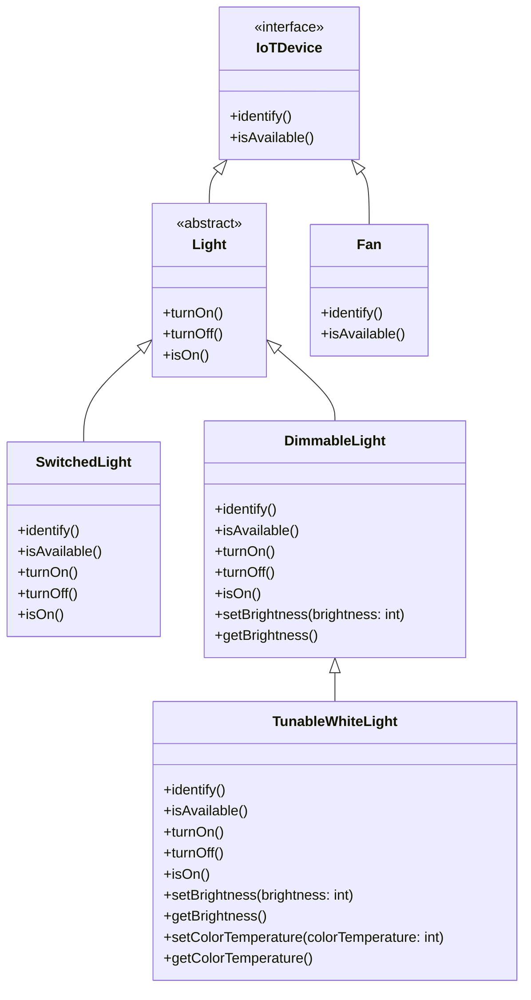

## Review the role of inheritance and dynamic dispatch in Java (5 minutes)

In the last lecture, we introduced the concept of *inheritance* and *dynamic dispatch*. Recall the example type hierarchy that we introduced:




We discussed how inheritance allows us to reduce repetition by sharing common behavior between related types.

We also discussed how dynamic dispatch allows us to write code that can work with any object that supports the appropriate interface, without having to know exactly what type of object it is. For example, we can write code to turn on any `Light` object, and it will work regardless of the specific type of `Light` object.

```java
Light[] lights = new Light[] {
    new TunableWhiteLight(2700),
    new TunableWhiteLight(2200)
};
for (Light l : lights) {
    l.turnOn();
}
```

In this example, we call the `turnOn` method on each element of the `lights` array. Since `turnOn` is a method of the `Light` interface, and all `Light` objects implement this method, this code will work regardless of the specific type of `Light` object.

*Dynamic Dispatch* is the mechanism that the JVM uses to determine which method to call at runtime based on the actual type of the object. We provided a formal definition of dynamic dispatch in the last lecture, which we will summarize from hereon out as:

> During program execution, the JVM will determine which method to call based on the actual type of the object, choosing the most specific method that the object supports.

This is a powerful mechanism that allows us to write very flexible and reusable code.

Today's lecture will continue to explore the role of inheritance and dynamic dispatch in Java, through a discussion of two important APIs in Java:
- The Collections API, which provides a set of core data structures that are useful for programming.
- The I/O API, which provides a set of classes for reading input and writing output to streams.

## Understand the role of generics in the Collections API (10 minutes)
- (Bloch 26-33)

## Recognize and apply Java's core data structures (10 minutes)
We briefly introduced arrays in the previous lecture. As a reminder, here are the properties of arrays in Java:
- Arrays are a fixed size
- Arrays are zero-indexed (first element is at index 0)
- Arrays are stored contiguously in memory, enabling efficient bulk operations (e.g. copy the entire array in constant time)

The Java API also provides a number of core data structures that are useful for programming. Collectively, these are called the *Collections API*. They are implemented as classes in the `java.util` package.


### Lists

### Maps

### Sets

## Understand the purpose of primitive wrapper types (5 minutes)

## Utilize Java methods for reading input and writing output to streams (15 minutes)
In order to do anything useful, we probably need to be able to read input from the outside world (user, file, etc.) and write output to the outside world (user, file, etc.).

We saw how to write output to the console using `System.out.println`.

(Explain what a stream is, how stdin/out/err are special streams, and how to use a `Scanner` to read input from the console.)


## Identify type errors that can be caught at compile time, and those that can only be caught at runtime (10 minutes)
- Now that we have discussed inheritance and dynamic dispatch, we can apply these concepts to identify type errors that can be caught at compile time. Recall that, unlike Python, Java is a *statically typed* language. This means that many errors that are caught at runtime in Python are caught at compile time in Java.
    - This is important because it allows us to catch errors before we run the program, which can save us a lot of time and effort.


