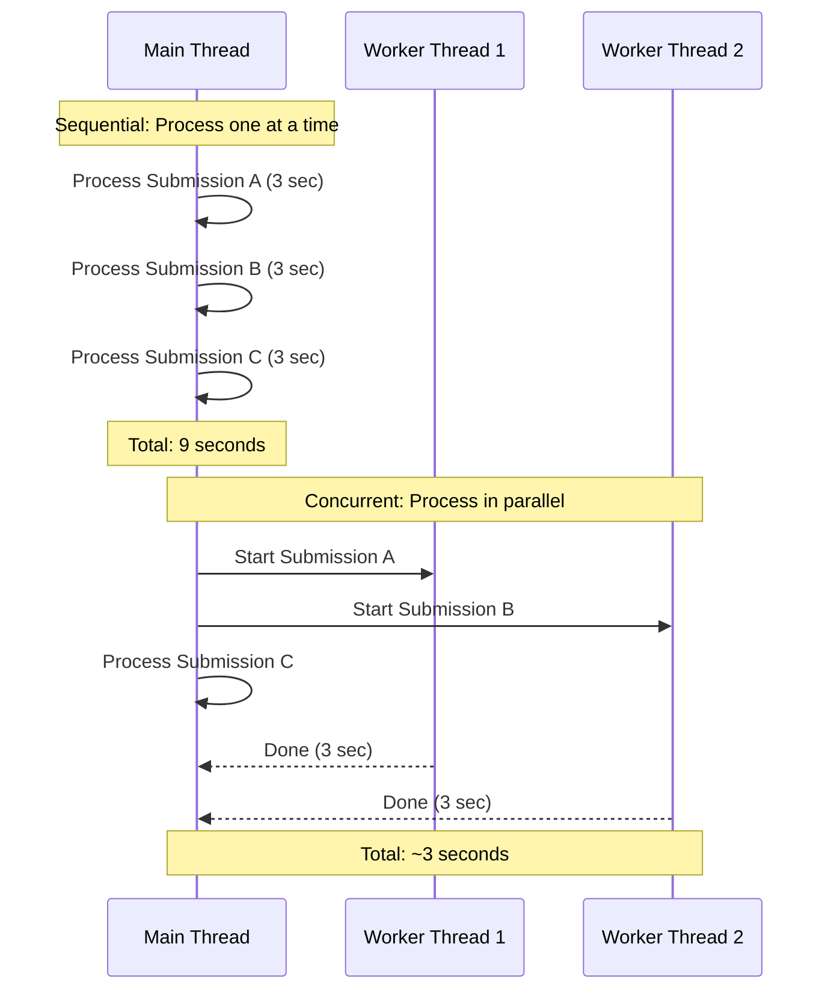
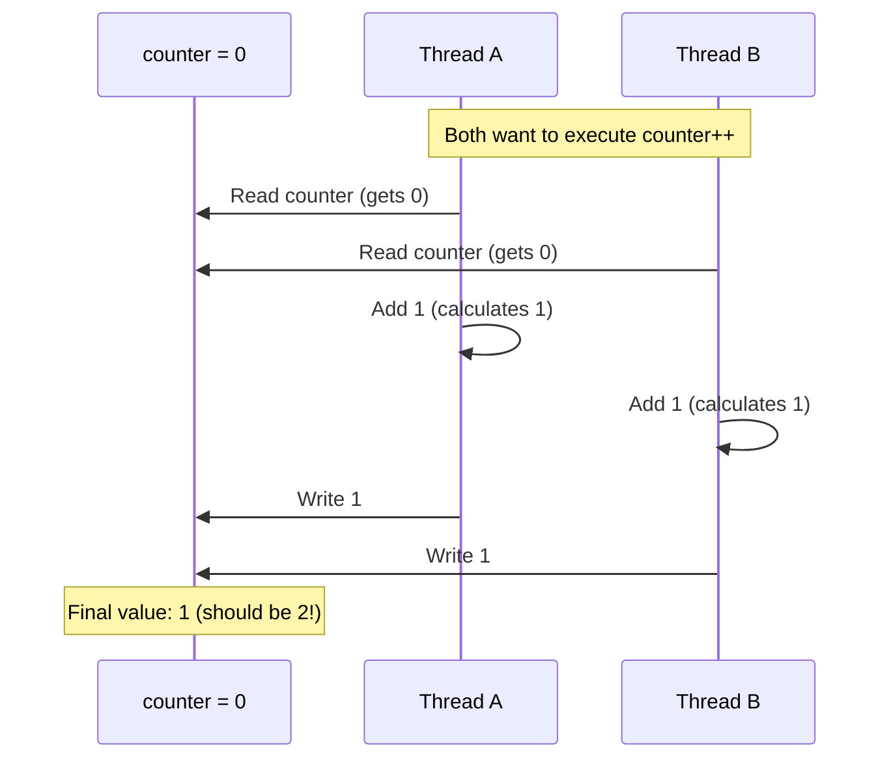
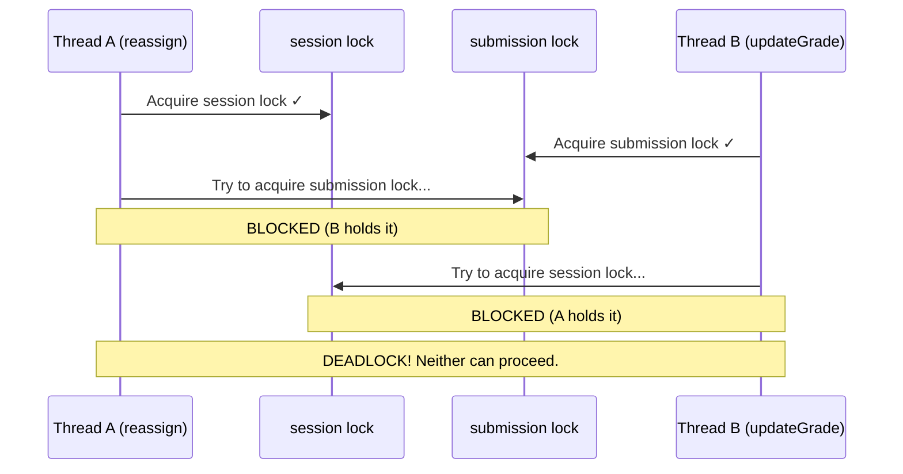

Software systems rarely do just one thing at a time. A web server handles multiple requests simultaneously. A desktop application keeps its UI responsive while loading data in the background. An autograder processes dozens of student submissions in parallel as a deadline approaches.

This lecture introduces **concurrency**—the ability to manage multiple tasks that overlap in time—and its primary mechanism in Java: **threads**. We'll use Pawtograder as our running example, exploring both the power of concurrent execution and the subtle bugs it can introduce.

:::note Architectural Simplification
The real Pawtograder is a TypeScript microservices application that uses GitHub Actions to run grading jobs in isolated containers. For these lectures, we'll imagine Pawtograder as a **Java monolith**—a single application handling submissions, grading, and notifications in one process. This simplification lets us focus on core concurrency concepts without the added complexity of distributed systems. The concurrency challenges we explore here (race conditions, deadlocks, synchronization) apply equally to both architectures, but are easier to reason about in a single-process context.
:::

## Describe the role of threads as a concurrency mechanism and understand the concept of "interrupts" (15 minutes)

Consider what happens when Pawtograder approaches an assignment deadline. Hundreds of students submit their code within the final hour. If the autograder processes submissions sequentially—one at a time—students who submit early might wait hours for feedback while the system works through the queue. But if the autograder can process multiple submissions *concurrently*, it can provide faster feedback to everyone.

### What Is a Thread?

A **thread** is an independent path of execution within a program. Every Java program starts with at least one thread—the main thread that executes `main()`. But programs can create additional threads that run simultaneously.

Think of threads like lanes on a highway. A single-lane road (one thread) handles traffic sequentially—each car waits for the one ahead. A multi-lane highway (multiple threads) allows cars to travel in parallel.



### Creating Threads in Java

Java provides two primary ways to create threads:

**Option 1: Extend the Thread class**

```java
public class SubmissionProcessor extends Thread {
    private final Submission submission;
    
    public SubmissionProcessor(Submission submission) {
        this.submission = submission;
    }
    
    @Override
    public void run() {
        // This code runs in a separate thread
        TestResult result = runTests(submission);
        submission.setTestResult(result);
    }
}

// Usage
SubmissionProcessor processor = new SubmissionProcessor(submission);
processor.start();  // Starts the new thread
```

**Option 2: Implement the Runnable interface**

```java
public class SubmissionTask implements Runnable {
    private final Submission submission;
    
    public SubmissionTask(Submission submission) {
        this.submission = submission;
    }
    
    @Override
    public void run() {
        TestResult result = runTests(submission);
        submission.setTestResult(result);
    }
}

// Usage
Thread thread = new Thread(new SubmissionTask(submission));
thread.start();
```

The `Runnable` approach is generally preferred because Java doesn't support multiple inheritance. If your class already extends another class, you can't also extend `Thread`, but you can always implement `Runnable`.

### Thread Pools: Managing Many Threads

Creating a new thread for every task has overhead—memory allocation, OS scheduling, etc. For systems like Pawtograder that process many submissions, we use **thread pools**: a collection of reusable worker threads.

```java
public class AutograderService {
    // A pool of 10 worker threads
    private final ExecutorService executor = Executors.newFixedThreadPool(10);
    
    public void processSubmission(Submission submission) {
        executor.submit(() -> {
            TestResult result = runTests(submission);
            LintResult lint = runLinter(submission);
            GradingResult grade = calculateGrade(result, lint);
            submission.setGradingResult(grade);
        });
    }
    
    public void shutdown() {
        executor.shutdown();
    }
}
```

The `ExecutorService` manages the threads for us. When we `submit()` a task, it queues the work and assigns it to an available worker thread. If all 10 threads are busy, the task waits until one becomes free.

### Interrupts: Canceling Long-Running Work

What happens when a student's submission contains an infinite loop? Without intervention, the autograder thread would run forever. Java provides **interrupts** as a cooperative mechanism for canceling threads.

```java
public class TimedTestRunner {
    private final ExecutorService executor = Executors.newSingleThreadExecutor();
    
    public TestResult runWithTimeout(Submission submission, Duration timeout) {
        Future<TestResult> future = executor.submit(() -> runTests(submission));
        
        try {
            // Wait at most 'timeout' for the result
            return future.get(timeout.toMillis(), TimeUnit.MILLISECONDS);
        } catch (TimeoutException e) {
            // Tests took too long—interrupt the thread
            future.cancel(true);  // 'true' means interrupt if running
            return TestResult.timeout("Tests exceeded " + timeout.toSeconds() + " seconds");
        } catch (InterruptedException | ExecutionException e) {
            return TestResult.error(e.getMessage());
        }
    }
}
```

When `cancel(true)` is called, Java sets the thread's **interrupt flag**. Well-behaved code checks this flag periodically:

```java
public void runTests(Submission submission) {
    for (TestCase test : testSuite) {
        // Check if we've been interrupted
        if (Thread.currentThread().isInterrupted()) {
            throw new InterruptedException("Test execution cancelled");
        }
        executeTest(test, submission);
    }
}
```

Interrupts are *cooperative*—the running code must check for and respond to them. Code that ignores interrupts (or catches `InterruptedException` without acting on it) can't be reliably cancelled.

:::tip History of Programming
Java's interrupt mechanism reflects a deliberate design choice. Early versions of Java included `Thread.stop()`, which forcibly terminated threads. This turned out to be dangerous—stopping a thread mid-operation could leave shared data in an inconsistent state (imagine stopping a thread halfway through updating a database record). The method was deprecated in Java 1.2 (1998), and cooperative interruption became the standard approach.
:::

## Recognize the need for synchronization in concurrent programs and understand the concept of "atomicity" (15 minutes)

Threads introduce a subtle but critical problem: when multiple threads access shared data, things can go wrong in surprising ways.

### The Problem: A Race to Grade

Consider this scenario in Pawtograder: a submission is ready to be graded, and two TAs—Alice and Bob—both see it in their queue. They both click "Claim" at nearly the same moment.

```java
public class GraderAssignmentService {
    
    public boolean claimSubmission(Grader grader, Submission submission) {
        // Check if submission is available
        if (submission.getAssignedGrader() == null) {
            // Assign it to this grader
            submission.setAssignedGrader(grader);
            return true;
        }
        return false;
    }
}
```

This code looks correct. It checks if the submission is unassigned, and if so, assigns it. But when two threads execute this method simultaneously, something unexpected can happen:

```
Time    Thread A (Alice)                    Thread B (Bob)
────    ────────────────────────────────    ────────────────────────────────
 1      if (getAssignedGrader() == null)    
 2          → true, enter if block          if (getAssignedGrader() == null)
 3                                              → true, enter if block
 4      setAssignedGrader(Alice)            
 5                                          setAssignedGrader(Bob)
 6      return true                         return true
```

Both Alice and Bob see the submission as unassigned (steps 2-3), so both proceed to assign it. Bob's assignment (step 5) overwrites Alice's (step 4). Both methods return `true`, both TAs think they've claimed the submission, but only Bob's assignment persists. Alice might start grading a submission that's actually assigned to Bob.

This is a **race condition**: the program's behavior depends on the relative timing of operations, which is unpredictable.

:::note Recall
In [Lecture 12 (Domain Modeling)](/lecture-notes/l12-domain-modeling), we encountered a similar scenario: a student resubmits while a grader is reviewing their work. That was a domain modeling challenge—how do we represent these competing actions? Here we see the technical challenge: even with a good domain model, concurrent access to shared state can corrupt our data.
:::

### Atomicity: Indivisible Operations

The problem with `claimSubmission` is that "check then act" is not **atomic**—it's not a single indivisible operation. The check (`getAssignedGrader() == null`) and the action (`setAssignedGrader(grader)`) are separate steps, and another thread can intervene between them.

An operation is **atomic** if it appears to happen instantaneously from the perspective of all other threads. No other thread can see a partial result or intermediate state.

Some operations are naturally atomic. In Java, reading or writing a single primitive variable (except `long` and `double`) is atomic. But compound operations—like check-then-act, read-modify-write, or updating multiple fields—are not.

```java
// NOT atomic: read-modify-write
counter++;  // Actually: read counter, add 1, write counter

// NOT atomic: check-then-act
if (map.get(key) == null) {
    map.put(key, value);
}

// NOT atomic: updating multiple fields
submission.setStatus(Status.GRADED);
submission.setGradedAt(LocalDateTime.now());
```

### Visualizing the Race

Here's what happens when two threads increment a shared counter:



This is called a **lost update**—Thread B's increment overwrote Thread A's because they both read the same initial value.

### The Java Memory Model

The situation is actually more complex than interleaved execution. Modern CPUs have caches, and threads running on different CPUs may see different values for the same variable. The **Java Memory Model** (JMM) defines rules for when changes made by one thread become visible to other threads.

Without proper synchronization, there's no guarantee that Thread B will ever see Thread A's writes. Thread B might read a stale value from its CPU's cache indefinitely. This is called a **visibility** problem.

```java
public class StaleDataExample {
    private boolean ready = false;
    private int value = 0;
    
    // Thread A
    public void writer() {
        value = 42;
        ready = true;
    }
    
    // Thread B
    public void reader() {
        while (!ready) {
            // spin-wait
        }
        System.out.println(value);  // Might print 0!
    }
}
```

Without synchronization, Thread B might see `ready = true` but still read `value = 0`, because the writes might be reordered or cached differently across CPUs.

## Utilize locks and concurrent collections to implement basic thread-safe code (15 minutes)

Java provides several mechanisms for ensuring thread safety. Let's start with the most fundamental: locks.

### The `synchronized` Keyword

The simplest way to make code thread-safe is the `synchronized` keyword. It ensures that only one thread can execute the synchronized code at a time.

```java
public class GraderAssignmentService {
    
    public synchronized boolean claimSubmission(Grader grader, Submission submission) {
        if (submission.getAssignedGrader() == null) {
            submission.setAssignedGrader(grader);
            return true;
        }
        return false;
    }
}
```

When a method is `synchronized`, Java acquires a **lock** (also called a **monitor**) on the object before executing the method. If another thread already holds the lock, the calling thread waits.

```
Time    Thread A (Alice)                    Thread B (Bob)
────    ────────────────────────────────    ────────────────────────────────
 1      Acquire lock on service             
 2      if (getAssignedGrader() == null)    Try to acquire lock → BLOCKED
 3          → true                          (waiting...)
 4      setAssignedGrader(Alice)            (waiting...)
 5      return true                         (waiting...)
 6      Release lock                        Acquire lock
 7                                          if (getAssignedGrader() == null)
 8                                              → false (Alice is assigned)
 9                                          return false
10                                          Release lock
```

Now the check-then-act operation is atomic. Bob's thread can't check the assignment status until Alice's thread has finished both checking and assigning.

### Synchronizing on Specific Objects

Instance methods synchronize on `this`. But sometimes we need finer-grained control:

```java
public class SubmissionService {
    private final Map<String, Submission> submissions = new HashMap<>();
    private final Object submissionsLock = new Object();
    
    public void addSubmission(Submission submission) {
        synchronized (submissionsLock) {
            submissions.put(submission.getId(), submission);
        }
    }
    
    public Submission getSubmission(String id) {
        synchronized (submissionsLock) {
            return submissions.get(id);
        }
    }
}
```

Using a dedicated lock object has several advantages:
- It's explicit about what's being protected
- Different data structures can have different locks, allowing more concurrency
- The lock object can be `private`, preventing external code from interfering

### ReentrantLock: More Flexible Locking

Java's `ReentrantLock` class provides more features than `synchronized`:

```java
public class GradingSessionManager {
    private final ReentrantLock lock = new ReentrantLock();
    private final Map<String, GradingSession> activeSessions = new HashMap<>();
    
    public boolean startGrading(Grader grader, Submission submission) {
        lock.lock();
        try {
            if (!activeSessions.containsKey(submission.getId())) {
                GradingSession session = new GradingSession(grader, submission);
                activeSessions.put(submission.getId(), session);
                return true;
            }
            return false;
        } finally {
            lock.unlock();  // Always unlock, even if an exception is thrown
        }
    }
    
    public boolean tryStartGrading(Grader grader, Submission submission, Duration timeout) {
        try {
            // Try to acquire lock, but don't wait forever
            if (lock.tryLock(timeout.toMillis(), TimeUnit.MILLISECONDS)) {
                try {
                    // ... same logic as above
                } finally {
                    lock.unlock();
                }
            } else {
                return false;  // Couldn't acquire lock in time
            }
        } catch (InterruptedException e) {
            Thread.currentThread().interrupt();
            return false;
        }
        return false;
    }
}
```

`ReentrantLock` offers `tryLock()` with a timeout (useful when you don't want to wait indefinitely) and explicit lock/unlock (useful for complex control flow).

### Concurrent Collections

Java's `java.util.concurrent` package provides thread-safe collections that handle synchronization internally:

```java
public class ActiveGradingTracker {
    // Thread-safe map without external synchronization
    private final ConcurrentHashMap<String, GradingSession> activeSessions = 
        new ConcurrentHashMap<>();
    
    public void startSession(Submission submission, Grader grader) {
        // putIfAbsent is atomic: check and put in one operation
        GradingSession newSession = new GradingSession(grader, submission);
        GradingSession existing = activeSessions.putIfAbsent(
            submission.getId(), 
            newSession
        );
        
        if (existing != null) {
            throw new AlreadyBeingGradedException(
                "Submission " + submission.getId() + " is already being graded"
            );
        }
    }
    
    public void endSession(Submission submission) {
        activeSessions.remove(submission.getId());
    }
    
    public boolean isBeingGraded(Submission submission) {
        return activeSessions.containsKey(submission.getId());
    }
}
```

Key concurrent collections include:
- `ConcurrentHashMap`: Thread-safe map with fine-grained locking for better performance
- `CopyOnWriteArrayList`: Thread-safe list optimized for read-heavy workloads
- `BlockingQueue`: Thread-safe queue with blocking operations for producer-consumer patterns
- `ConcurrentLinkedQueue`: Non-blocking thread-safe queue

:::tip History of Programming
Java's concurrent collections were added in Java 5 (2004) as part of JSR-166, led by Doug Lea. Before this, developers had to either synchronize all access to standard collections or use the legacy `Vector` and `Hashtable` classes, which synchronized every operation (often more than necessary). The `java.util.concurrent` package represented a major advance in making concurrent programming practical.
:::

### Atomic Variables

For simple counters and flags, `java.util.concurrent.atomic` provides atomic wrapper classes:

```java
public class SubmissionStatistics {
    private final AtomicInteger totalSubmissions = new AtomicInteger(0);
    private final AtomicInteger successfulGrades = new AtomicInteger(0);
    private final AtomicLong totalProcessingTimeMs = new AtomicLong(0);
    
    public void recordSubmission() {
        totalSubmissions.incrementAndGet();  // Atomic increment
    }
    
    public void recordGrade(long processingTimeMs) {
        successfulGrades.incrementAndGet();
        totalProcessingTimeMs.addAndGet(processingTimeMs);
    }
    
    public double getAverageProcessingTime() {
        int count = successfulGrades.get();
        return count == 0 ? 0 : (double) totalProcessingTimeMs.get() / count;
    }
}
```

Atomic classes use hardware-level atomic operations (like compare-and-swap) that are faster than locks for simple updates.

## Understand the concept of "deadlocks" and "race conditions" (15 minutes)

We've seen race conditions—bugs where behavior depends on timing. Now let's examine **deadlock**, an equally insidious concurrency problem where threads get stuck waiting for each other forever.

### What Is Deadlock?

Deadlock occurs when two or more threads are each waiting for resources held by the others, creating a cycle of dependencies that can never be resolved.

Consider this scenario in Pawtograder: when a TA needs to reassign a submission, the system must update both the original grading session and the submission record.

```java
public class ReassignmentService {
    
    public void reassign(GradingSession session, Submission submission, Grader newGrader) {
        synchronized (session) {
            synchronized (submission) {
                session.setStatus(GradingStatus.REASSIGNED);
                submission.setAssignedGrader(newGrader);
            }
        }
    }
    
    public void updateGrade(GradingSession session, Submission submission, Grade grade) {
        synchronized (submission) {
            synchronized (session) {
                submission.setGrade(grade);
                session.setStatus(GradingStatus.COMPLETED);
            }
        }
    }
}
```

Can you spot the problem? `reassign()` acquires locks in the order `session → submission`, while `updateGrade()` acquires them in the order `submission → session`. If two threads call these methods simultaneously:



Both threads are now stuck forever. Thread A holds `session` and waits for `submission`. Thread B holds `submission` and waits for `session`. Neither will ever release their lock because they're both waiting.

### Four Conditions for Deadlock

Deadlock requires all four of these conditions (known as the Coffman conditions):

1. **Mutual exclusion**: Resources cannot be shared (only one thread can hold a lock)
2. **Hold and wait**: Threads hold resources while waiting for others
3. **No preemption**: Resources can't be forcibly taken from threads
4. **Circular wait**: A cycle exists in the resource dependency graph

To prevent deadlock, break any one of these conditions.

### Preventing Deadlock

**Strategy 1: Consistent Lock Ordering**

The simplest prevention is to always acquire locks in the same order:

```java
public class SafeReassignmentService {
    
    private void acquireLocksInOrder(GradingSession session, Submission submission, 
                                      Runnable action) {
        // Always lock in order: submission first, then session
        // Use System.identityHashCode to create a consistent ordering
        Object first, second;
        if (System.identityHashCode(submission) < System.identityHashCode(session)) {
            first = submission;
            second = session;
        } else {
            first = session;
            second = submission;
        }
        
        synchronized (first) {
            synchronized (second) {
                action.run();
            }
        }
    }
    
    public void reassign(GradingSession session, Submission submission, Grader newGrader) {
        acquireLocksInOrder(session, submission, () -> {
            session.setStatus(GradingStatus.REASSIGNED);
            submission.setAssignedGrader(newGrader);
        });
    }
    
    public void updateGrade(GradingSession session, Submission submission, Grade grade) {
        acquireLocksInOrder(session, submission, () -> {
            submission.setGrade(grade);
            session.setStatus(GradingStatus.COMPLETED);
        });
    }
}
```

**Strategy 2: Lock Timeouts**

Use `tryLock()` with a timeout to avoid waiting forever:

```java
public boolean reassignWithTimeout(GradingSession session, Submission submission, 
                                    Grader newGrader, Duration timeout) {
    long deadline = System.currentTimeMillis() + timeout.toMillis();
    
    while (System.currentTimeMillis() < deadline) {
        if (sessionLock.tryLock()) {
            try {
                if (submissionLock.tryLock()) {
                    try {
                        session.setStatus(GradingStatus.REASSIGNED);
                        submission.setAssignedGrader(newGrader);
                        return true;
                    } finally {
                        submissionLock.unlock();
                    }
                }
            } finally {
                sessionLock.unlock();
            }
        }
        // Didn't get both locks; sleep briefly and retry
        Thread.sleep(10);
    }
    return false;  // Timed out
}
```

**Strategy 3: Reduce Lock Scope**

Hold locks for the shortest time possible:

```java
public void reassignSafely(GradingSession session, Submission submission, Grader newGrader) {
    // Prepare new state without locks
    GradingStatus newStatus = GradingStatus.REASSIGNED;
    
    // Acquire locks only for the actual updates
    synchronized (session) {
        session.setStatus(newStatus);
    }
    // Release session lock before acquiring submission lock
    synchronized (submission) {
        submission.setAssignedGrader(newGrader);
    }
}
```

This approach breaks the "hold and wait" condition, but introduces a new problem: the two updates are no longer atomic. If the system crashes between them, we'd have an inconsistent state.

:::note Recall
In [Lecture 35 (Safety and Reliability)](/lecture-notes/l35-safety-reliability), we discussed how concurrency bugs in Pawtograder can have real consequences—incorrect grades, lost feedback, frustrated students. Deadlocks are particularly problematic because they cause the system to hang rather than fail fast. A student might see their submission stuck in "processing" indefinitely, with no error message explaining why.
:::

### Race Conditions Revisited

We've seen one type of race condition (check-then-act), but there are others:

**Read-Modify-Write**:
```java
// Two threads incrementing a counter
totalSubmissions++;  // Not atomic: read, add, write
```

**Compound Actions**:
```java
// Check and update must be atomic
if (!grades.containsKey(studentId)) {
    grades.put(studentId, calculateGrade());  // Another thread might put first
}
```

**Time-of-Check to Time-of-Use (TOCTOU)**:
```java
// The file might be deleted between check and read
if (file.exists()) {
    return Files.readString(file.toPath());  // Might fail!
}
```

### Detecting Concurrency Bugs

Concurrency bugs are notoriously hard to find because they depend on timing:

- They might not appear in testing but occur in production under load
- They might occur only on certain hardware (more CPU cores)
- They're often not reproducible—running the same test twice might give different results

Some strategies for detection:

1. **Code review**: Look for shared mutable state accessed without synchronization
2. **Static analysis tools**: Tools like SpotBugs can detect common patterns
3. **Stress testing**: Run many threads doing concurrent operations
4. **Thread sanitizers**: Some JVM options can detect race conditions at runtime

In the next lecture, we'll explore an alternative to threads—**asynchronous programming**—which can simplify concurrent code for certain types of work, particularly I/O-bound operations.

