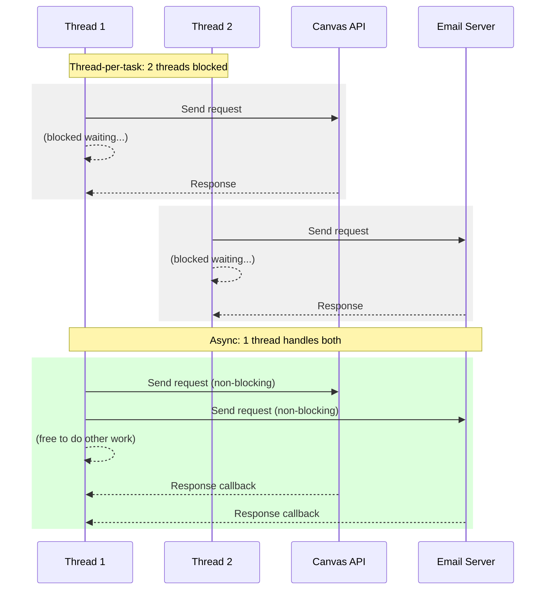

In [Lecture 31](/lecture-notes/l31-concurrency1), we learned how threads enable concurrent execution. Threads work well for CPU-bound work—tasks that keep the processor busy computing. But many real-world systems spend most of their time *waiting*: waiting for network responses, waiting for files to load, waiting for database queries to return.

This lecture introduces **asynchronous programming**, an approach to concurrency that's particularly well-suited for I/O-bound work. We'll see how Pawtograder can use asynchronous techniques to efficiently coordinate with external services like Canvas, GitHub, and email providers.

:::note
We continue using our simplified "Java monolith" version of Pawtograder from [Lecture 31](/lecture-notes/l31-concurrency1). The real system uses TypeScript and GitHub Actions, but imagining it as a single Java application lets us focus on async programming concepts without distributed systems complexity.
:::

## Compare and contrast the use of threads and asynchronous programming (10 minutes)

Consider what Pawtograder does after grading a submission:

1. Save the grade to the database
2. Send an email notification to the student
3. Sync the grade to Canvas (the learning management system)
4. Update the GitHub Classroom status check
5. Return a response to the grading UI

With a traditional thread-per-task approach, we might spawn a thread for each operation:

```java
public class GradePublisher {
    private final ExecutorService executor = Executors.newFixedThreadPool(100);
    
    public void publishGrade(Submission submission, Grade grade) {
        executor.submit(() -> saveToDatabase(submission, grade));
        executor.submit(() -> sendEmailNotification(submission, grade));
        executor.submit(() -> syncToCanvas(submission, grade));
        executor.submit(() -> updateGitHubStatus(submission, grade));
    }
}
```

This works, but there's a problem: each of these operations spends most of its time *waiting*. The email thread sends a request to the mail server, then sits idle for hundreds of milliseconds waiting for a response. The Canvas thread is similarly idle while the Canvas API processes the request. We're paying the cost of a thread (memory, context switching) for work that's mostly waiting.

### Thread Overhead

Each thread in Java consumes resources:

- **Stack memory**: Each thread has its own call stack, typically 512KB to 1MB by default
- **OS resources**: The operating system tracks each thread, consuming kernel memory
- **Context switching**: When the CPU switches between threads, it must save and restore state

With 100 threads, we're using 50-100MB just for thread stacks. If we want to handle 10,000 concurrent operations, we'd need 10,000 threads—far too expensive.

### The Async Alternative

Asynchronous programming uses a different model: instead of dedicating a thread to wait for each I/O operation, we start the operation and provide a *callback* to be invoked when it completes. The thread is free to do other work while waiting.



With async I/O, a small number of threads can handle thousands of concurrent operations. This is how modern web servers handle millions of concurrent connections without millions of threads.

### When to Use Each Approach

| Characteristic | Threads | Async |
|---------------|---------|-------|
| Best for | CPU-bound work | I/O-bound work |
| Resource usage | Higher (thread per task) | Lower (callbacks) |
| Programming model | Intuitive (sequential code) | Less intuitive (callbacks/futures) |
| Debugging | Familiar tools | Can be harder to trace |
| Example in Pawtograder | Running test suites | Calling external APIs |

For Pawtograder:
- **Use threads** for running student code, computing test results, analyzing code quality—work where the CPU is actively computing
- **Use async** for calling Canvas, sending emails, fetching from GitHub—work where we're mostly waiting for network responses

## Understand the concept of "blocking" and "non-blocking" operations (5 minutes)

A **blocking** operation halts the thread until it completes. A **non-blocking** operation returns immediately, allowing the thread to continue with other work.

### I/O Takes an Eternity

From a CPU's perspective, I/O is unimaginably slow. Let's put this in perspective by scaling time so that one CPU cycle equals one second:

| Operation | Actual Time | Scaled Time (1 cycle = 1 second) |
|-----------|-------------|----------------------------------|
| CPU cycle | 0.3 ns | 1 second |
| L1 cache access | 1 ns | 3 seconds |
| L2 cache access | 4 ns | 13 seconds |
| RAM access | 100 ns | 5 minutes |
| SSD read | 100 μs | 4 days |
| HDD read | 10 ms | 1 year |
| Network round-trip (same datacenter) | 500 μs | 19 days |
| Network round-trip (cross-country) | 50 ms | 5 years |
| Network round-trip (API call with processing) | 200 ms | 20 years |

When Pawtograder calls the Canvas API to submit a grade, that "200ms" response time is *twenty years* of waiting from the CPU's perspective. A blocking thread sits idle, doing nothing, for twenty years.

### Blocking vs. Non-Blocking in Code

Here's a blocking call to the Canvas API:

```java
public void syncGradeToCanvas(Submission submission, Grade grade) {
    // Thread blocks here for ~200ms
    HttpResponse<String> response = httpClient.send(
        buildCanvasRequest(submission, grade),
        HttpResponse.BodyHandlers.ofString()
    );
    
    if (response.statusCode() != 200) {
        throw new CanvasSyncException("Failed to sync: " + response.body());
    }
}
```

And here's the non-blocking equivalent:

```java
public CompletableFuture<Void> syncGradeToCanvasAsync(Submission submission, Grade grade) {
    // Returns immediately—thread doesn't block
    return httpClient.sendAsync(
        buildCanvasRequest(submission, grade),
        HttpResponse.BodyHandlers.ofString()
    ).thenAccept(response -> {
        if (response.statusCode() != 200) {
            throw new CanvasSyncException("Failed to sync: " + response.body());
        }
    });
}
```

The async version returns a `CompletableFuture` immediately. The actual HTTP request happens in the background, and our callback (`thenAccept`) runs when the response arrives.

### The Event Loop Model

Non-blocking I/O typically relies on an **event loop**: a single thread that monitors multiple I/O operations and dispatches callbacks when they complete.

```java
// Conceptually, an event loop works like this:
while (running) {
    List<Event> events = waitForEvents();  // OS-level poll
    for (Event event : events) {
        event.getCallback().run();  // Invoke the registered callback
    }
}
```

Node.js famously uses a single-threaded event loop to handle thousands of concurrent connections. Java's NIO (New I/O) and reactive frameworks like Project Reactor use similar approaches.

## Utilize futures to implement asynchronous programming in Java (15 minutes)

A **future** represents a value that will be available at some point in the future. It's a placeholder for the result of an asynchronous operation.

### The Future Interface

Java's `Future<T>` interface has been available since Java 5:

```java
public interface Future<T> {
    boolean cancel(boolean mayInterruptIfRunning);
    boolean isCancelled();
    boolean isDone();
    T get() throws InterruptedException, ExecutionException;
    T get(long timeout, TimeUnit unit) throws InterruptedException, 
                                               ExecutionException, 
                                               TimeoutException;
}
```

You can submit a task to an executor and get a `Future` to retrieve the result later:

```java
ExecutorService executor = Executors.newFixedThreadPool(10);

Future<TestResult> futureResult = executor.submit(() -> {
    return runTests(submission);
});

// Do other work while tests run...

// When we need the result, call get() (blocks if not ready)
TestResult result = futureResult.get();
```

But `Future` has limitations: `get()` is blocking, and there's no good way to compose futures or handle completion callbacks.

### CompletableFuture: The Modern Approach

Java 8 introduced `CompletableFuture<T>`, which adds powerful composition capabilities:

```java
public class AsyncGradingService {
    private final HttpClient httpClient = HttpClient.newHttpClient();
    
    public CompletableFuture<GradingResult> gradeSubmissionAsync(Submission submission) {
        // Start multiple async operations
        CompletableFuture<TestResult> testsFuture = runTestsAsync(submission);
        CompletableFuture<LintResult> lintFuture = runLinterAsync(submission);
        
        // Combine their results when both complete
        return testsFuture
            .thenCombine(lintFuture, this::combineResults)
            .thenCompose(result -> saveResultAsync(submission, result))
            .thenCompose(result -> notifyStudentAsync(submission, result));
    }
    
    private CompletableFuture<TestResult> runTestsAsync(Submission submission) {
        return CompletableFuture.supplyAsync(() -> {
            // CPU-bound work—runs in ForkJoinPool.commonPool()
            return testRunner.runTests(submission);
        });
    }
    
    private CompletableFuture<LintResult> runLinterAsync(Submission submission) {
        return CompletableFuture.supplyAsync(() -> {
            return linter.analyze(submission);
        });
    }
    
    private GradingResult combineResults(TestResult tests, LintResult lint) {
        double testScore = tests.getPassedCount() / (double) tests.getTotalCount();
        double lintScore = lint.getScore();
        return new GradingResult(testScore * 0.8 + lintScore * 0.2, tests, lint);
    }
    
    private CompletableFuture<GradingResult> saveResultAsync(Submission submission, 
                                                              GradingResult result) {
        return CompletableFuture.supplyAsync(() -> {
            database.saveGrade(submission.getId(), result);
            return result;
        });
    }
    
    private CompletableFuture<GradingResult> notifyStudentAsync(Submission submission,
                                                                 GradingResult result) {
        // Non-blocking HTTP call
        return httpClient.sendAsync(
            buildNotificationRequest(submission, result),
            HttpResponse.BodyHandlers.ofString()
        ).thenApply(response -> result);
    }
}
```

### Key CompletableFuture Methods

**Creating futures:**
```java
// From a value
CompletableFuture<String> immediate = CompletableFuture.completedFuture("done");

// From a supplier (runs async)
CompletableFuture<TestResult> async = CompletableFuture.supplyAsync(() -> runTests());

// From a runnable (no return value)
CompletableFuture<Void> action = CompletableFuture.runAsync(() -> sendEmail());
```

**Transforming results:**
```java
CompletableFuture<Grade> gradeFuture = testsFuture
    .thenApply(result -> calculateGrade(result));  // Transform TestResult to Grade
```

**Chaining async operations:**
```java
CompletableFuture<Void> chain = saveGradeAsync(grade)
    .thenCompose(saved -> sendNotificationAsync(saved))  // Returns another future
    .thenCompose(notified -> syncToCanvasAsync(notified));
```

**Combining multiple futures:**
```java
// Wait for two futures and combine their results
CompletableFuture<Combined> both = future1
    .thenCombine(future2, (result1, result2) -> combine(result1, result2));

// Wait for all futures in a list
CompletableFuture<Void> all = CompletableFuture.allOf(future1, future2, future3);

// Wait for any one future to complete
CompletableFuture<Object> any = CompletableFuture.anyOf(future1, future2, future3);
```

### Error Handling in Async Chains

Errors in async code need special handling. `CompletableFuture` provides several options:

```java
public CompletableFuture<GradingResult> gradeWithFallback(Submission submission) {
    return gradeSubmissionAsync(submission)
        .exceptionally(error -> {
            // Handle error and provide fallback
            logger.error("Grading failed", error);
            return GradingResult.error("Grading failed: " + error.getMessage());
        });
}

public CompletableFuture<GradingResult> gradeWithRetry(Submission submission) {
    return gradeSubmissionAsync(submission)
        .handle((result, error) -> {
            if (error != null) {
                // Could retry here
                logger.warn("First attempt failed, retrying...", error);
                return gradeSubmissionAsync(submission);  // Returns CompletableFuture
            }
            return CompletableFuture.completedFuture(result);
        })
        .thenCompose(future -> future);  // Flatten the nested future
}
```

:::note Looking Ahead
In [Lecture 33 (Event-Driven Architecture)](/lecture-notes/l33-event-architecture), we'll explore patterns like retry with exponential backoff and circuit breakers that build on these async primitives to create resilient systems.
:::

### Putting It Together: The Async Grading Pipeline

Here's a complete example of Pawtograder's grading pipeline using async composition:

```java
public class GradingPipeline {
    private final TestRunner testRunner;
    private final Linter linter;
    private final GradeRepository repository;
    private final NotificationService notifier;
    private final CanvasClient canvas;
    
    public CompletableFuture<PublishedGrade> processSubmission(Submission submission) {
        // Phase 1: Run tests and linter in parallel (CPU-bound, use thread pool)
        CompletableFuture<TestResult> testsFuture = 
            CompletableFuture.supplyAsync(() -> testRunner.run(submission));
        CompletableFuture<LintResult> lintFuture = 
            CompletableFuture.supplyAsync(() -> linter.analyze(submission));
        
        // Phase 2: Calculate grade when both complete
        CompletableFuture<GradingResult> gradeFuture = testsFuture
            .thenCombine(lintFuture, GradingResult::new);
        
        // Phase 3: Save to database
        CompletableFuture<GradingResult> savedFuture = gradeFuture
            .thenCompose(grade -> saveAsync(submission, grade));
        
        // Phase 4: Notify student and sync to Canvas in parallel (I/O-bound)
        CompletableFuture<Void> notifyFuture = savedFuture
            .thenCompose(grade -> notifier.sendAsync(submission.getStudent(), grade));
        CompletableFuture<Void> canvasFuture = savedFuture
            .thenCompose(grade -> canvas.syncAsync(submission, grade));
        
        // Phase 5: Return when all publishing is complete
        return savedFuture.thenCompose(grade ->
            CompletableFuture.allOf(notifyFuture, canvasFuture)
                .thenApply(v -> new PublishedGrade(grade, true, true))
        );
    }
    
    private CompletableFuture<GradingResult> saveAsync(Submission submission, 
                                                        GradingResult grade) {
        return CompletableFuture.supplyAsync(() -> {
            repository.save(submission.getId(), grade);
            return grade;
        });
    }
}
```

This pipeline:
1. Runs tests and linting in parallel
2. Calculates the grade when both complete
3. Saves to the database
4. Sends notification and syncs to Canvas in parallel
5. Returns the final result

All without blocking any thread for network I/O.

## Evaluate the safety of asynchronous functions (15 minutes)

Asynchronous programming introduces its own category of bugs. While we avoid some thread-safety issues (fewer threads mean fewer synchronization concerns), we gain new challenges around ordering, error handling, and state management.

### The Ordering Problem

With synchronous code, operations happen in the order you write them. With async code, that guarantee disappears:

```java
// WRONG: Bug! Notification might send before grade is saved
public void publishGrade(Submission submission, Grade grade) {
    saveGradeAsync(submission, grade);         // Starts async save
    sendNotificationAsync(submission, grade);  // Starts async notification
    // Both are running concurrently—notification might complete first!
}
```

The fix is to use proper chaining:

```java
// CORRECT: Notification waits for save to complete
public CompletableFuture<Void> publishGrade(Submission submission, Grade grade) {
    return saveGradeAsync(submission, grade)
        .thenCompose(saved -> sendNotificationAsync(submission, grade));
}
```

### Shared Mutable State Across Async Boundaries

Even with async code, shared mutable state is dangerous:

```java
// DANGEROUS: Shared mutable state
public class GradingStatistics {
    private int totalGraded = 0;  // Shared mutable state
    private double totalScore = 0.0;
    
    public CompletableFuture<Void> recordGrade(GradingResult result) {
        return CompletableFuture.runAsync(() -> {
            totalGraded++;  // Race condition!
            totalScore += result.getScore();  // Race condition!
        });
    }
}
```

Multiple async callbacks might run concurrently, causing the same race conditions we saw with threads. The fix: use thread-safe data structures or ensure callbacks run on a single thread.

```java
// SAFE: Using atomic variables
public class GradingStatistics {
    private final AtomicInteger totalGraded = new AtomicInteger(0);
    private final AtomicReference<Double> totalScore = new AtomicReference<>(0.0);
    
    public CompletableFuture<Void> recordGrade(GradingResult result) {
        return CompletableFuture.runAsync(() -> {
            totalGraded.incrementAndGet();
            totalScore.updateAndGet(current -> current + result.getScore());
        });
    }
}
```

### Callback Hell

Before `CompletableFuture`, async code often looked like this:

```java
// "Callback Hell" - deeply nested, hard to read
void processSubmission(Submission sub, Callback<Result> callback) {
    runTests(sub, testsResult -> {
        if (testsResult.isError()) {
            callback.onError(testsResult.getError());
        } else {
            runLinter(sub, lintResult -> {
                if (lintResult.isError()) {
                    callback.onError(lintResult.getError());
                } else {
                    calculateGrade(testsResult, lintResult, grade -> {
                        if (grade.isError()) {
                            callback.onError(grade.getError());
                        } else {
                            saveGrade(sub, grade, saveResult -> {
                                if (saveResult.isError()) {
                                    callback.onError(saveResult.getError());
                                } else {
                                    callback.onSuccess(saveResult);
                                }
                            });
                        }
                    });
                }
            });
        }
    });
}
```

`CompletableFuture` flattens this with chaining:

```java
// Much cleaner with CompletableFuture
CompletableFuture<SaveResult> processSubmission(Submission sub) {
    return runTestsAsync(sub)
        .thenCombine(runLinterAsync(sub), this::calculateGrade)
        .thenCompose(grade -> saveGradeAsync(sub, grade));
}
```

### Error Propagation

A common mistake is forgetting that errors in async chains need explicit handling:

```java
// BAD: Error silently swallowed
gradeAsync(submission)
    .thenAccept(grade -> updateUI(grade));
// If gradeAsync fails, nothing happens—no error shown to user

// GOOD: Error explicitly handled
gradeAsync(submission)
    .thenAccept(grade -> updateUI(grade))
    .exceptionally(error -> {
        showError("Grading failed: " + error.getMessage());
        return null;
    });
```

### Thread Confinement in UI Applications

GUI applications have a crucial constraint: UI updates must happen on the UI thread. Async callbacks might run on any thread:

```java
// WRONG: UI update from background thread
gradeAsync(submission)
    .thenAccept(grade -> {
        gradeLabel.setText(grade.toString());  // Might crash! Wrong thread!
    });
```

The fix depends on your UI framework. In JavaFX:

```java
// CORRECT: Ensure UI update runs on JavaFX Application Thread
gradeAsync(submission)
    .thenAcceptAsync(grade -> {
        gradeLabel.setText(grade.toString());
    }, Platform::runLater);  // Runs callback on UI thread
```

:::note Recall
In [Lecture 29 (GUI Patterns)](/lecture-notes/l29-gui1) and [Lecture 30 (GUI Testing)](/lecture-notes/l30-gui2), we explored GUI architectures that handle this threading concern systematically.
:::

### Best Practices for Async Safety

1. **Prefer immutability**: Pass immutable data between async stages

```java
// Good: GradingResult is immutable
public record GradingResult(double score, TestResult tests, LintResult lint) {}
```

2. **Chain properly**: Use `thenCompose` for sequential dependencies

```java
// Dependencies are explicit in the chain
saveAsync(grade)
    .thenCompose(saved -> notifyAsync(saved))  // notify depends on save
    .thenCompose(notified -> logAsync(notified));
```

3. **Handle errors at the end**: Use `exceptionally` or `handle` to catch all errors

```java
complexAsyncPipeline()
    .exceptionally(error -> {
        logger.error("Pipeline failed", error);
        return fallbackResult();
    });
```

4. **Consider timeouts**: Async operations can hang; use timeouts

```java
gradeAsync(submission)
    .orTimeout(30, TimeUnit.SECONDS)
    .exceptionally(error -> {
        if (error instanceof TimeoutException) {
            return GradingResult.timeout();
        }
        throw new CompletionException(error);
    });
```

5. **Test async code carefully**: Async bugs may not appear in sequential tests

```java
@Test
void testConcurrentGrading() throws Exception {
    // Submit many operations concurrently
    List<CompletableFuture<GradingResult>> futures = IntStream.range(0, 100)
        .mapToObj(i -> gradeAsync(submissions.get(i)))
        .toList();
    
    // Wait for all and verify
    CompletableFuture.allOf(futures.toArray(new CompletableFuture[0])).join();
    
    for (CompletableFuture<GradingResult> future : futures) {
        assertFalse(future.isCompletedExceptionally());
    }
}
```

:::note Recall
The race conditions and synchronization challenges from [Lecture 31](/lecture-notes/l31-concurrency1) still apply to async code. Async doesn't eliminate concurrency bugs—it changes their shape. Instead of threads interleaving, we have callbacks potentially executing in unexpected orders. The mental model is different, but the need for careful reasoning about shared state remains.
:::

### Summary

Asynchronous programming offers an efficient model for I/O-bound work, allowing a small number of threads to handle many concurrent operations. `CompletableFuture` provides a powerful API for expressing async workflows clearly, with explicit dependencies and error handling.

The key tradeoffs:
- **Pro**: Efficient resource usage for I/O-bound work
- **Pro**: Explicit data flow through futures and chains
- **Con**: More complex programming model than synchronous code
- **Con**: New categories of bugs (ordering, error swallowing)

Choose threads for CPU-bound work, async for I/O-bound work, and always reason carefully about how concurrent operations interact with shared state.

