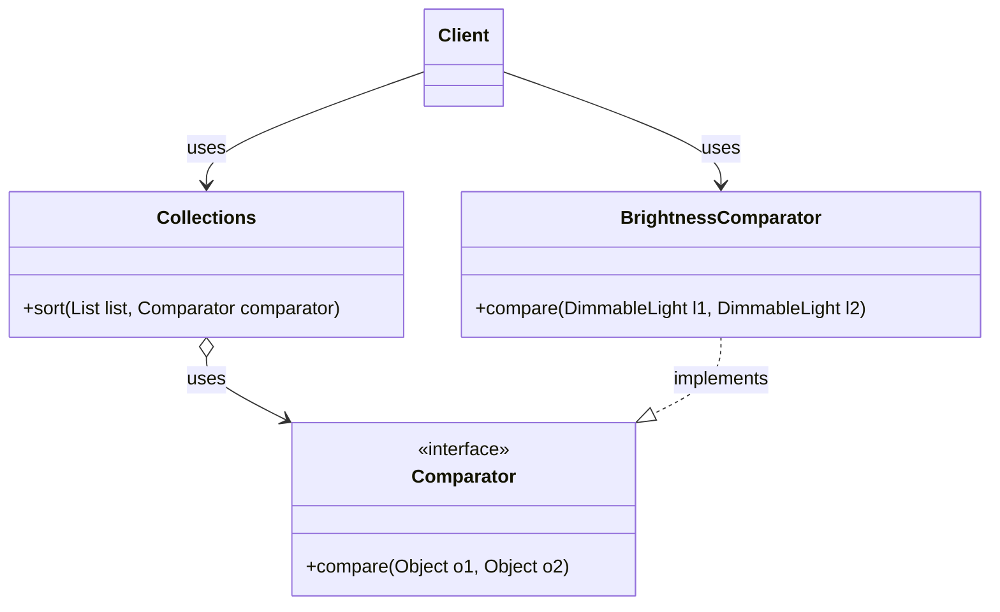
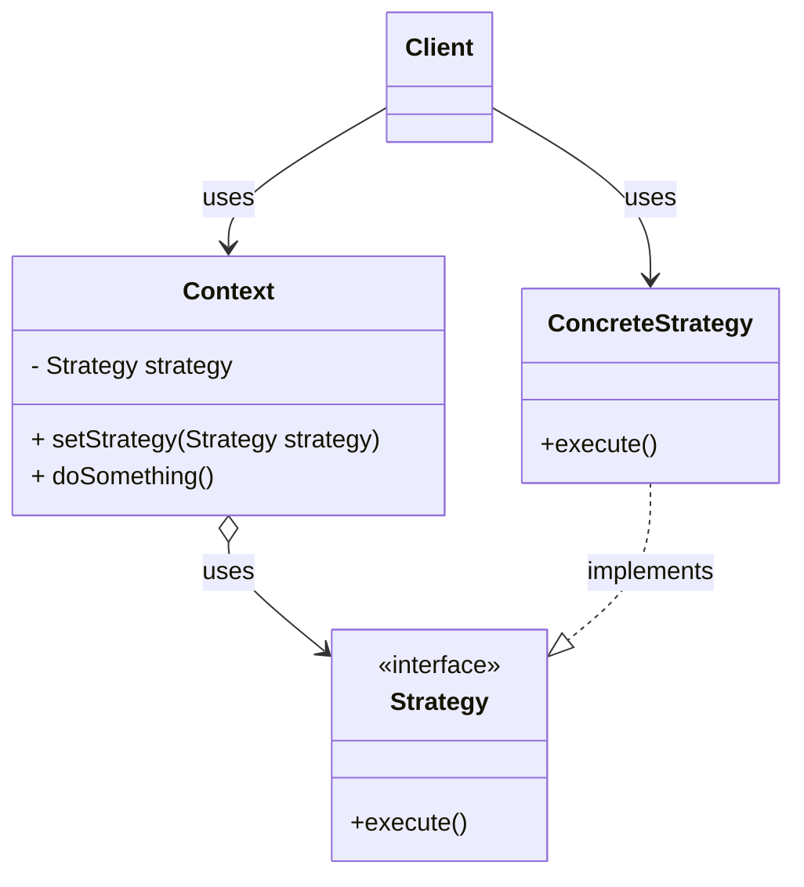

## Understand the historical context of functional programming in the JVM (10 minutes)
"Functional programming" is a style of programming where functions are first-class values. That is, you can have primitives (e.g. ints, booleans, etc.) and objects that you store as variables, pass as arguments, and return from functions... *and* functions are also objects. This feature was introduced in Java 8 (2014), meaning that it's widely used in modern Java code, but you will also likely see a lot of older code that doesn't use it.

Before we get to an example of what this programming style looks like, let's start with a code example that you are already familiar with. This code example sorts a list of DimmableLights by their brightness, using the `Comparator` interface. This differs from the `Comparable` interface that we saw last lecture, as the `Comparator` allows us to specify a comparison logic when we call the `sort` method. This is useful when we might want to sort the objects in a different way depending on the situation (e.g. a user can choose to sort by brightness, or by location, or by how long the lights have been on for, etc.).

```java
// Before Java 8
lights.sort(new Comparator<DimmableLight>() {
    @Override
    public int compare(DimmableLight l1, DimmableLight l2) {
        return Integer.compare(l1.getBrightness(), l2.getBrightness());
    }
});
```

The `Collections.sort` method takes a `Comparator` as an argument, which is a functional interface that has a single abstract method `compare`. The `Comparator` interface is a good example of a functional interface because it has a single abstract method that is used to compare two objects.

It is important that we understand exactly how this works. Let's break it down:
- `lights.sort` is a method that takes a `Comparator` as an argument.
- `new Comparator<DimmableLight>()` is an anonymous class that implements the `Comparator` interface. By "anonymous", we mean that we are not giving the class a name.
- `public int compare(DimmableLight l1, DimmableLight l2)` is the implementation of the `compare` method.

Here is how we would write this code using functional programming:
```java
lights.sort((l1, l2) -> Integer.compare(l1.getBrightness(), l2.getBrightness()));
```

This is called a "lambda expression", and it is a way to create an anonymous function that can be passed as an argument to a method. It is equivalent to the anonymous class version, but it is more concise. Here is how to read this code:
- `(l1, l2) -> Integer.compare(l1.getBrightness(), l2.getBrightness())` is the lambda expression.
- `l1` and `l2` are the parameters of the lambda expression. Notice that we do not need to specify the type of the parameters, as the type is inferred from the context. We could choose any names for the parameters (nore on good names later). We also could have added the types if we felt it made the code more readable, e.g. `(DimmableLight l1, DimmableLight l2) -> Integer.compare(l1.getBrightness(), l2.getBrightness())`.
- The arrow `->` separates the parameters from the body of the lambda expression. The part on the right of the arrow is the return value of the lambda expression.
- `Integer.compare(l1.getBrightness(), l2.getBrightness())` is the body of the lambda expression. The method `Integer.compare` is a helper method that implements the logic of comparing two integers following the contract of the `Comparator` interface. (returns a value that is negative if l1 is less than l2, positive if l1 is greater than l2, and 0 if they are equal).

Compare the two code snippets. We understand that the lambda expression syntax may be new to many of you. However, it is still worth asking the question: which do you think is more readable? Why?

As we'll see in this lecture, there are circumstances where the functional style is preferrable to an object-oriented style. However, there are also circumstances where the object-oriented style is preferrable. In this lecture, we will first review the syntax of functional programming in Java, and then dive deeper into the tradeoffs involved in each style, and provide guidelines for when to use each style.

## Read and write Java code that uses functional programming (10 minutes)

### Recognizing a functional interface

### Variants of parameters

No params, one param w w/o parens, multipel parameters, w/ w/o types

### Lambdas with multiple statements

### Method references
There is an even more concise version of the lambda expression that we can use after introducing another piece of syntax: method references.

```java
lights.sort(Comparator.comparingInt(DimmableLight::getBrightness));
```

The expression `DimmableLight::getBrightness` is a method reference. It is a way to refer to the `getBrightness` method of the `DimmableLight` class. In this case, we pass that method reference to `Comparator.comparingInt`, which takes a method reference as an argument. The `comparingInt` helper method returns a new `Comparator` that compares two objects by the value returned by the method reference that it receives as an argument.

### Accessing variables from enclosing scope

## Compare the readability of Java code that uses functional vs OO styles

### Compare the strategy pattern to higher-order functions (10 minutes)

The `Comparator` example also demonstrates a classic object-oriented design pattern: the strategy pattern.

Here is the UML class diagram of the `Comparator` example:


The key idea behind the strategy pattern is that we define an interface (in this case, `Comparator`) that specifies the contract of the strategy. In this case, the contract is: the strategy must have a `compare` method that takes two objects and returns an integer with a sign that indicates the relative order of the two objects (we ellide [the details of the contract](https://docs.oracle.com/en/java/javase/21/docs/api/java.base/java/util/Comparator.html) for brevity, but they match `compareTo` that we discussed them in the last lecture).

The `Collections.sort` method takes an instance of a `Comparator` as an argument. This allows our `Client` to have runtime flexibility of choosing the "strategy" to use for comparison.

We could have a particularly flexible client, like:
```java
Comparator<DimmableLight> selectedComparator;
if(userWantsBrightness) {
    selectedComparator = new BrightnessComparator();
} else if (userWantsLocation) {
    selectedComparator = new LocationComparator();
} else {
    selectedComparator = new DefaultComparator();
}
Collections.sort(lights, selectedComparator);
```

Again, notice how `Collections.sort` doesn't need to know *anything* about how to compare two `DimmableLight` objects. It just needs a `Comparator` that can compare two objects.


Here is a UML class diagram of the generic strategy pattern:


The strategy pattern is a design pattern that allows you to select the algorithm to use at runtime. The `Context` class has a `Strategy` object, and the `Client` can set the strategy to use. There could be many different strategies, and the `Client` can choose which one to use by passing it to the `Context` object.

**You should be able to recognize the strategy pattern in code, but should generally prefer using lambdas.**

Returning to our code snippets:

```java
// Before Java 8, Strategy Pattern
lights.sort(new Comparator<DimmableLight>() {
    @Override
    public int compare(DimmableLight l1, DimmableLight l2) {
        return Integer.compare(l1.getBrightness(), l2.getBrightness());
    }
});
```

```java
// After Java 8, Lambda
lights.sort((l1, l2) -> Integer.compare(l1.getBrightness(), l2.getBrightness()));
```

The lambda expression is more readable because it is more concise. If you are new to Java syntax, you might initially find the lambda expression confusing, as it requires you to understand how the `->` operator works. But: notice how much other Java boilerplate there is in the anonymous class version! The lambda version removes the boilerplate and makes the *behavior* much more clear.

There is an even more concise version of the lambda expression that we can use after introducing another piece of syntax: method references.

```java
lights.sort(Comparator.comparingInt(DimmableLight::getBrightness));
```

The expression `DimmableLight::getBrightness` is a method reference. It is a way to refer to the `getBrightness` method of the `DimmableLight` class. In this case, we pass that method reference to `Comparator.comparingInt`, which takes a method reference as an argument. The `comparingInt` helper method returns a new `Comparator` that compares two objects by the value returned by the method reference that it receives as an argument.


### [Prefer lambdas to anonymous classes](https://learning.oreilly.com/library/view/effective-java-3rd/9780134686097/ch7.xhtml#lev42)
We 

### [Prefer method references to lambdas](https://learning.oreilly.com/library/view/effective-java-3rd/9780134686097/ch7.xhtml#lev43)

### [Favor the use of standard functional interfaces](https://learning.oreilly.com/library/view/effective-java-3rd/9780134686097/ch7.xhtml#lev44)


## Utilize type annotations to express invariants such as non-nullness (15 minutes)
(With a sidebar on JSR-308, nullaway)


## Understand common misconceptions about what makes code "readable" and draw on evidence-based research to evaluate the readability of code (10 minutes)

### [On Naming](https://livebook.manning.com/book/the-programmers-brain/chapter-8/1)