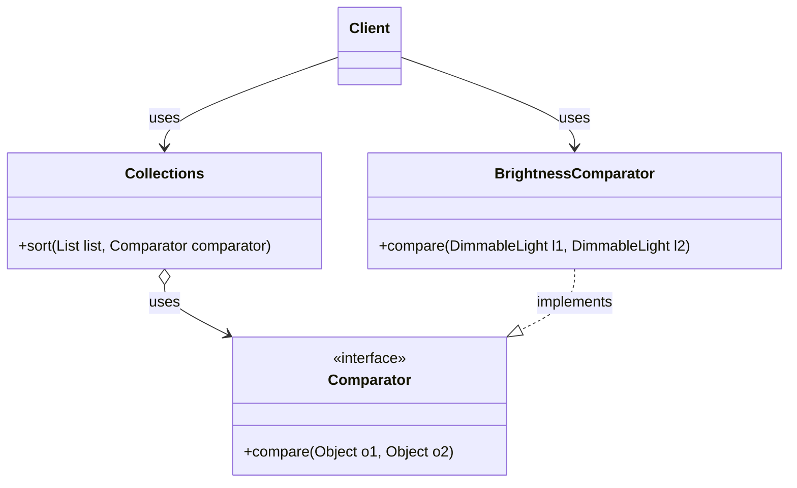
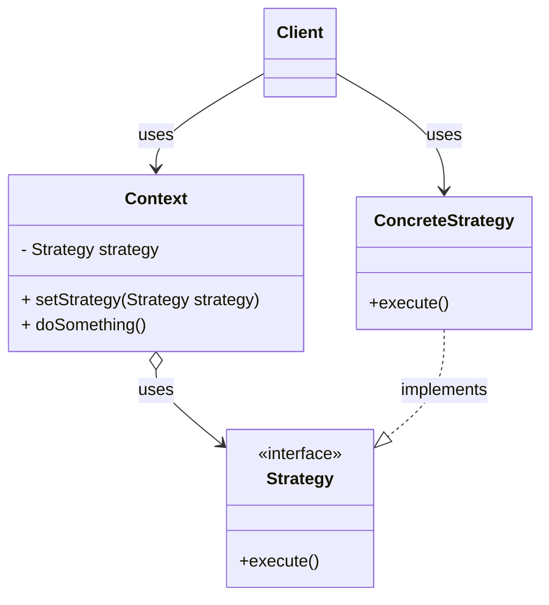

## Describe the historical context of functional programming in the JVM (10 minutes)
"Functional programming" is a style of programming where functions are first-class values. That is, you can have primitives (e.g. ints, booleans, etc.) and objects that you store as variables, pass as arguments, and return from functions... *and* functions are also objects. This feature was introduced in Java 8 (2014), meaning that it's widely used in modern Java code, but you will also likely see a lot of older code that doesn't use it.

Before we get to an example of what this programming style looks like, let's start with a code example that you are already familiar with. This code example sorts a list of DimmableLights by their brightness, using the `Comparator` interface. This differs from the `Comparable` interface that we saw last lecture, as the `Comparator` allows us to specify a comparison logic when we call the `sort` method. `Comparable` is an interface that is defined on the class itself, so we can only define ONE way to compare objects of that class. In contrast, we can make a new `Comparator` is useful when we might want to sort the objects in a different way depending on the situation (e.g. a user can choose to sort by brightness, or by location, or by how long the lights have been on for, etc.).

```java
// Before Java 8
Comparator<DimmableLight> brightnessComparator = new Comparator<DimmableLight>() {
    @Override
    public int compare(DimmableLight l1, DimmableLight l2) {
        return Integer.compare(l1.getBrightness(), l2.getBrightness());
    }
}
lights.sort(brightnessComparator);
```

The `Collections.sort` method takes a `Comparator` as an argument, which is an interface that declares a single method `compare`.  In Java, we refer to interfaces (like `Comparator`) that declare a single abstract method as "functional interfaces".

It is important that we understand exactly how this works. Let's break it down:
- `lights.sort` is a method that takes a `Comparator` as an argument.
- `new Comparator<DimmableLight>()` is an anonymous class that implements the `Comparator` interface. By "anonymous", we mean that we are not giving the class a name.
- `public int compare(DimmableLight l1, DimmableLight l2)` is the implementation of the `compare` method.

Here is how we would write this code using functional programming:
```java
lights.sort((l1, l2) -> Integer.compare(l1.getBrightness(), l2.getBrightness()));
```

This is called a "lambda expression", and it is a way to create an anonymous function that can be passed as an argument to a method. It is equivalent to the anonymous class version, but it is more concise. Here is how to read this code:
- `(l1, l2) -> Integer.compare(l1.getBrightness(), l2.getBrightness())` is the lambda expression.
- `l1` and `l2` are the parameters of the lambda expression. Notice that we do not need to specify the type of the parameters, as the type is inferred from the context. We could choose any names for the parameters (more on good names later). We also could have added the types if we felt it made the code more readable, e.g. `(DimmableLight l1, DimmableLight l2) -> Integer.compare(l1.getBrightness(), l2.getBrightness())`.
- The arrow `->` separates the parameters from the body of the lambda expression. The part on the right of the arrow is the return value of the lambda expression.
- `Integer.compare(l1.getBrightness(), l2.getBrightness())` is the body of the lambda expression. The method `Integer.compare` is a helper method that implements the logic of comparing two integers following the contract of the `Comparator` interface. (returns a value that is negative if l1 is less than l2, positive if l1 is greater than l2, and 0 if they are equal).

Compare the two code snippets. We understand that the lambda expression syntax may be new to many of you. However, it is still worth asking the question: which do you think is more readable? Why?

As we'll see in this lecture, there are circumstances where the functional style is preferrable to an object-oriented style. However, there are also circumstances where the object-oriented style is preferrable. In this lecture, we will first review the syntax of functional programming in Java, and then dive deeper into the tradeoffs involved in each style, and provide guidelines for when to use each style.

## Read and write Java code that uses functional programming (10 minutes)

### Recognizing a functional interface

As we saw in the previous example, the `Comparator` interface is a functional interface. We can recognize a functional interface by the fact that it declares a single abstract method. It is worth noting that the word "abstract" is doing a lot of work here: a functional interface can have other methods (e.g. a `static` method, or a method that is declared with a `default` implementation), but the single abstract method is what makes it a functional interface.

Java provides a number of standard functional interfaces in the `java.util.function` package that can be used to quickly write lambda expressions.

For example, the `Function<T, R>` interface declares a single abstract method `apply` that takes a parameter of type `T` and returns a value of type `R`.

```java
Function<String, String> quoteString = (String s) -> '"' + s + '"';
String quotedString = quoteString.apply("Hello, world!"); // returns "\"Hello, world!\""
```


### Declaring lambdas

There are several different variants of syntax that we can use to write lambda expressions.

If a lambda expression has no parameters, we use empty parentheses to represent the parameters:
```java
Runnable r = () -> System.out.println("Hello, world!");
r.run(); // prints "Hello, world!"
```

If a lambda expression has one parameter and the JVM can infer the type of the parameter, we can omit the parentheses:

```java
Function<String, String> quoteString = s -> '"' + s + '"';
String quotedString = quoteString.apply("Hello, world!"); // returns "\"Hello, world!\""
```

If a lambda expression has multiple parameters, we must use the parentheses: 
```java
lights.sort((l1, l2) -> Integer.compare(l1.getBrightness(), l2.getBrightness()));
```

Note that we never specify the return type of a lambda expression. The return type is inferred its definition.

These examples all are a single line of code, and thus are not wrapped in curly braces. If we want to write a lambda expression that is multiple lines of code, we must wrap it in curly braces:
```java
Runnable r = () -> {
    System.out.println("Hello, world!");
    System.out.println("Goodbye, world!");
};
r.run(); // prints "Hello, world!" and then "Goodbye, world!"
```


### Method references
There is an even more concise version of the lambda expression that we can use after introducing another piece of syntax: method references.

Method references are a way to pass a *reference* to a method as an argument to a function. For example, the `Comparator` interface declares a static method called `comparingInt` that takes a method reference as an argument.
It calls the method reference with the two objects that it is comparing, and then compares the results.

```java
lights.sort(Comparator.comparingInt(DimmableLight::getBrightness));
```

The expression `DimmableLight::getBrightness` is a method reference. It is a way to refer to the `getBrightness` method of the `DimmableLight` class. In this case, we pass that method reference to `Comparator.comparingInt`, which takes a method reference as an argument. The `comparingInt` helper method returns a new `Comparator` that compares two objects by the value returned by the method reference that it receives as an argument.

### Accessing variables from enclosing scope

A lambda expression shares variable names with the enclosing scope. For example, this code will throw a compile-time error:
```java
DimmableLight l1 = new DimmableLight();
lights.sort((l1, l2) -> Integer.compare(l1.getBrightness(), l2.getBrightness())); //Error: l1 is already defined in the scope
```

Since it shares variables with the enclosing scope, it is possible to access those variables:
```java
String message = "Hello, world!";
Runnable r = () -> {
    System.out.println(message);
};
r.run(); // prints "Hello, world!"
```

However, for reasons that are beyond the scope of this class, any variable that is accessed in a lambda expression must be `final` or *effectively* `final` (could be labeled with `final`). In the above example, `message` is effectively `final` because it is never modified after it is initialized.

```java
String message = "Hello, world!";
for(int i = 0; i < 10; i++) {
    Runnable r = () -> {
        System.out.println("#" + i + " " + message); //Error: i is not final
    };
    r.run(); 
}
```

## Compare the readability of Java code that uses functional vs OO styles
Now that we have seen the syntax of functional programming in Java, let's compare it to the object-oriented style.

### Compare the strategy pattern to higher-order functions: prefer lambdas over anonymous classes (10 minutes)

The `Comparator` example also demonstrates a classic object-oriented design pattern: the strategy pattern.

Here is the UML class diagram of the `Comparator` example:


The key idea behind the strategy pattern is that we define an interface (in this case, `Comparator`) that specifies the contract of the strategy. In this case, the contract is: the strategy must have a `compare` method that takes two objects and returns an integer with a sign that indicates the relative order of the two objects (we ellide [the details of the contract](https://docs.oracle.com/en/java/javase/21/docs/api/java.base/java/util/Comparator.html) for brevity, but they match `compareTo` that we discussed them in the last lecture).

The `Collections.sort` method takes an instance of a `Comparator` as an argument. This allows our `Client` to have runtime flexibility of choosing the "strategy" to use for comparison.

We could have a particularly flexible client, like:
```java
Comparator<DimmableLight> selectedComparator;
if(userWantsBrightness) {
    selectedComparator = new BrightnessComparator();
} else if (userWantsLocation) {
    selectedComparator = new LocationComparator();
} else {
    selectedComparator = new DefaultComparator();
}
Collections.sort(lights, selectedComparator);
```

Again, notice how `Collections.sort` doesn't need to know *anything* about how to compare two `DimmableLight` objects. It just needs a `Comparator` that can compare two objects (abstraction).


Here is a UML class diagram of the generic strategy pattern:


The strategy pattern is a design pattern that allows you to select the algorithm to use at runtime. The `Context` class has a `Strategy` object, and the `Client` can set the strategy to use. There could be many different strategies, and the `Client` can choose which one to use by passing it to the `Context` object.

**You should be able to recognize the strategy pattern in code, but should generally prefer using lambdas.**

Returning to our code snippets:

```java
// Before Java 8, Strategy Pattern
lights.sort(new Comparator<DimmableLight>() {
    @Override
    public int compare(DimmableLight l1, DimmableLight l2) {
        return Integer.compare(l1.getBrightness(), l2.getBrightness());
    }
});
```

```java
// After Java 8, Lambda expression
lights.sort((l1, l2) -> Integer.compare(l1.getBrightness(), l2.getBrightness()));
```

The lambda expression is more readable because it is more concise. Notice how much Java boilerplate there is in the anonymous class version! The lambda version removes the boilerplate and makes the *behavior* much more clear.

There is an even more concise version of the lambda expression that we can use after introducing another piece of syntax: method references.

For more on the benefits of lambdas vs anonymous classes, see [Prefer lambdas to anonymous classes](https://learning.oreilly.com/library/view/effective-java-3rd/9780134686097/ch7.xhtml#lev42).

### Recognize when to NOT use lambdas (2 minutes)

In the examples we've seen so far, we are using lambdas to define behavior for *very* short and simple functions --- they are almost always just a single line! However, as a lambda gets larger and larger, it also becomes more difficult to read. Lambdas do not have names, and they do not have documentation. If the behavior is not self-explanatory, or if the lambda exceeds three lines, it is better to use a named method or a class.

### [Prefer method references to lambdas](https://learning.oreilly.com/library/view/effective-java-3rd/9780134686097/ch7.xhtml#lev43) (3 minutes)

Earlier in this lecture, we looked at an example of a lambda expression that we could replace with a method reference:

```java title="Comparator with a lambda"
lights.sort((l1, l2) -> Integer.compare(l1.getBrightness(), l2.getBrightness()));
```

```java title="Comparator with a method reference"
lights.sort(Comparator.comparingInt(DimmableLight::getBrightness));
```

Our general rule of thumb is to prefer method references over lambdas, as they are more readable and concise.

There are few cases where a lambda is preferred over a method reference: If the *names* of the parameters to the lambda are important to understand the code, use a lambda (as the method reference does not have names for the parameters).

### [Favor the use of standard functional interfaces](https://learning.oreilly.com/library/view/effective-java-3rd/9780134686097/ch7.xhtml#lev44) (5 minutes)

Java provides a rich set of functional interfaces in `java.util.function` that cover most common use cases. Before creating your own functional interface, check if one of these standard interfaces will work:

| Interface | Method | Description |
|-----------|--------|-------------|
| `Predicate<T>` | `boolean test(T t)` | Takes an argument, returns boolean |
| `Function<T, R>` | `R apply(T t)` | Takes an argument, returns a result |
| `Consumer<T>` | `void accept(T t)` | Takes an argument, returns nothing |
| `Supplier<T>` | `T get()` | Takes nothing, returns a result |
| `BiFunction<T, U, R>` | `R apply(T t, U u)` | Takes two arguments, returns a result |

Here are examples of each:

```java
// Predicate: Is this light bright enough?
Predicate<DimmableLight> isBright = light -> light.getBrightness() > 50;
lights.stream().filter(isBright).forEach(Light::turnOff);

// Function: Get the brightness of a light
Function<DimmableLight, Integer> getBrightness = DimmableLight::getBrightness;

// Consumer: Turn on each light
Consumer<Light> turnOn = Light::turnOn;
lights.forEach(turnOn);

// Supplier: Create a default light
Supplier<DimmableLight> defaultLight = () -> new DimmableLight("default", 100);

// BiFunction: Combine two brightness values
BiFunction<Integer, Integer, Integer> avgBrightness = (a, b) -> (a + b) / 2;
```

Using standard functional interfaces makes your code more readable because other developers will immediately recognize the pattern. It also enables better interoperability with Java's Stream API and other libraries.

#### [Prefer primitive functional interfaces](https://learning.oreilly.com/library/view/effective-java-3rd/9780134686097/ch9.xhtml#lev61)

Recall from Lecture 3 that Java distinguishes between primitive types (`int`, `double`, `boolean`) and their boxed equivalents (`Integer`, `Double`, `Boolean`). Boxing and unboxing have performance costs and can introduce subtle bugs (e.g., `null` values where you don't expect them).

The generic functional interfaces like `Function<T, R>` only work with reference types — you can't write `Function<int, int>`. So Java provides **primitive specializations** that avoid boxing entirely:

| Generic Interface | Primitive Specialization | Example |
|-------------------|-------------------------|---------|
| `Predicate<Integer>` | `IntPredicate` | `int -> boolean` |
| `Function<Integer, Integer>` | `IntUnaryOperator` | `int -> int` |
| `Function<T, Integer>` | `ToIntFunction<T>` | `T -> int` |
| `Function<Integer, R>` | `IntFunction<R>` | `int -> R` |
| `Consumer<Integer>` | `IntConsumer` | `int -> void` |
| `Supplier<Integer>` | `IntSupplier` | `() -> int` |

Similar variants exist for `long` and `double`. Here's the brightness example rewritten to avoid boxing:

```java
// Bad: boxes every int to Integer
Function<DimmableLight, Integer> getBrightness = DimmableLight::getBrightness;

// Good: returns primitive int directly
ToIntFunction<DimmableLight> getBrightness = DimmableLight::getBrightness;
```

In fact, we've already seen the best practice in action: `Comparator.comparingInt` accepts a `ToIntFunction` rather than a `Function<T, Integer>`. This is why the method is named `comparingInt` and not just `comparing` — it signals that you're working with primitives.

**Rule of thumb**: When working with `int`, `long`, or `double` values, prefer the primitive functional interface variants. They're more efficient and signal your intent more clearly.

## Utilize modern Java features for readability

Java has evolved significantly since its initial release. Two features introduced in recent versions dramatically improve code readability: **records** and **pattern matching for instanceof**. These features should have always existed in Java — they eliminate significant boilerplate and make intent clearer.

If you go on to learn other languages, you'll find that Java was *very* late to adopt these ideas. Scala had case classes (similar to records) in 2004. Kotlin added data classes in 2016. Haskell and ML-family languages have had algebraic data types and pattern matching since the 1970s and 80s. Even C# added records in 2020, still beating Java. For decades, Java developers wrote mountains of boilerplate that developers in other languages simply didn't have to write.

### Records: Immutable data classes (5 minutes)

Before Java 16 (released in 2021!), creating a simple immutable data class required substantial boilerplate. Consider this class that represents a point in 2D space:

```java
// Before records: 30+ lines of boilerplate
public final class Point {
    private final int x;
    private final int y;

    public Point(int x, int y) {
        this.x = x;
        this.y = y;
    }

    public int x() { return x; }
    public int y() { return y; }

    @Override
    public boolean equals(@Nullable Object obj) {
        if (this == obj) return true;
        if (!(obj instanceof Point other)) return false;
        return x == other.x && y == other.y;
    }

    @Override
    public int hashCode() {
        return Objects.hash(x, y);
    }

    @Override
    public String toString() {
        return "Point[x=" + x + ", y=" + y + "]";
    }
}
```

With records, this becomes a single line:

```java
// After records: 1 line!
public record Point(int x, int y) {}
```

That's it. The record automatically provides:
- A constructor that initializes all fields
- Accessor methods for each field (e.g., `x()` and `y()`)
- Correct `equals`, `hashCode`, and `toString` implementations
- Immutability (all fields are `final`)

Records are ideal for:
- Data transfer objects (DTOs - passing data between systems, maybe even going to JSON...)
- Value objects in domain modeling
- Return types when you need to return multiple values
- Immutable configurations

You can also add validation and custom methods to records:

```java
public record ColorTemperature(int kelvin) {
    // Compact constructor for validation
    public ColorTemperature {
        if (kelvin < 1000 || kelvin > 10000) {
            throw new IllegalArgumentException("Kelvin must be between 1000 and 10000");
        }
    }

    // Custom method
    public int toMired() {
        return 1000000 / kelvin;
    }
}
```

**Use records by default** for any class that is primarily a carrier of immutable data. They make the intent crystal clear: "this is just data."

### Pattern matching for instanceof (3 minutes)

You may have noticed this syntax in the `equals` example from the last lecture:

```java
if (!(obj instanceof DimmableLight other)) return false;
```

This is **pattern matching for instanceof**, introduced in Java 16. Pattern matching has been a core feature of functional languages like Haskell, OCaml, and F# since the 1980s. Scala brought it to the JVM in 2004. Rust and Swift have had it from day one. Kotlin's "smart casts" (2016) accomplish the same thing. Java finally caught up... 40 years later.

Before this feature, checking a type and casting required two separate steps:

```java
// Old way: separate instanceof check and cast
if (obj instanceof DimmableLight) {
    DimmableLight other = (DimmableLight) obj;
    // use other...
}
```

The new syntax combines both operations:

```java
// New way: pattern matching combines check and cast
if (obj instanceof DimmableLight other) {
    // other is already cast and ready to use
}
```

This is cleaner and safer — it's impossible to accidentally cast to the wrong type or forget to cast entirely.

The pattern variable (`other` in this example) is only in scope where it's guaranteed to be valid:

```java
public void adjustLight(IoTDevice device) {
    if (device instanceof DimmableLight dimmable) {
        // dimmable is in scope here
        dimmable.setBrightness(50);
    } else if (device instanceof SwitchedLight switched) {
        // switched is in scope here, dimmable is not
        switched.turnOn();
    }
    // neither dimmable nor switched are in scope here
}
```

This feature is particularly useful when working with type hierarchies where you need to handle different subtypes differently. Combined with sealed classes (which we'll see in [Lecture 6](/lecture-notes/l6-immutability-abstraction#sealed-classes-10-minutes)), pattern matching enables even more powerful and type-safe code—the compiler can verify that you've handled all possible subtypes.

## Describe common misconceptions about what makes code "readable" and draw on evidence-based research to evaluate the readability of code

Throughout this lecture, we've discussed what makes code "readable." But readability is not a fixed property - it depends on *who* will read the code *over time*.

**The maintenance cost perspective:** Most software cost is maintenance, not initial development. Code that's readable to the original author may be opaque to the developer who inherits it three years later - who might have a different background, different native language, or different assumptions about "obvious" patterns.

Consider open-source projects, which (in order to be successful) really must survive beyond any individual contributor:
- Code readable only to core maintainers creates a bus factor problem (if the original project moves on and "takes a bus to another city", the project may die)
- Naming conventions "obvious" to one cultural context may confuse international contributors

**This isn't just about being "nice" - it's about reducing long-term costs:**
- Diverse contributor pools catch more bugs and provide more perspectives
- Onboarding new developers is expensive; readable code reduces onboarding time
- Systems that can only be maintained by their original authors are liabilities. If your goal as a software engineer is to advance your career, you **must** write code that others can maintain, so that *you* can move on to bigger and more impactful projects.

### Style guides (2 minutes)

Style guides (like [Google's Java Style Guide](https://google.github.io/styleguide/javaguide.html)) provide consistent formatting rules for a codebase. Consistency reduces cognitive load when reading code, but style guides alone do not make code readable. A perfectly formatted mess is still a mess.

Historical debates about tabs versus spaces are largely irrelevant today. Modern teams use automated formatters to enforce consistency: in this class, we use [Spotless](https://github.com/diffplug/spotless) with [google-java-format](https://github.com/google/google-java-format) and [Checkstyle](https://checkstyle.org/). Configure once, apply automatically, and focus on what actually matters.

More important than formatting is **structure**: how you decompose problems into methods and classes, what abstractions you create, and how you name things.

### [On Naming](https://learning.oreilly.com/library/view/the-programmers-brain/9781617298677/Text/ch08.htm) (5 minutes)

Research on programmer cognition reveals that **naming is one of the most important factors in code readability**. Names serve as beacons that help developers navigate and understand code.

Felienne Hermans provides [an excellent overview of the research on naming](https://learning.oreilly.com/library/view/the-programmers-brain/9781617298677/Text/ch08.htm) — there is much more in that chapter than we can cover here. We focus on one evidence-based approach: Feitelson's **name molds**, a practice that puts consistency and recognizability at the forefront of the naming process. The core idea is a systematic 3-step method:

**Step 1: Select the concepts to include in the name**

What ideas does this variable, method, or class represent? Consider a field storing the color temperature of a light. The relevant concepts might be:
- *What* we're tracking (color temperature)
- *When* it applies (startup? current? target?)
- *Unit* of measurement — color temperature is measured in Kelvins, but is that obvious to every developer on the team?

```java
// Concepts: "startup" + "color temperature"
int startupColorTemperature;

// Should we include the unit?
int startupColorTemperatureKelvin;
```

The decision of which concepts to include depends on your team and codebase. If every temperature in the project is in Kelvins, including the unit in every name adds noise. If temperatures might be in different units (Kelvin vs. mired), including the unit prevents dangerous confusion.

:::tip History of Programming
Unit confusion has caused spectacular failures throughout history:
- **[Mars Climate Orbiter (1999)](https://llis.nasa.gov/lesson/733)**: Lost ($327M) because one team used newton-seconds while another used pound-force-seconds for thrust data.
- **[Gimli Glider (1983)](https://www.damninteresting.com/the-gimli-glider/)**: Air Canada Flight 143 ran out of fuel mid-flight because ground crew calculated fuel in pounds instead of kilograms. The pilots glided the 767 to an emergency landing at an abandoned airfield.
- **[Tokyo Disneyland Space Mountain (2003)](https://www.nist.gov/pml/owm/metrication-errors-and-mishaps)**: An axle broke because replacement bearings were sourced using metric dimensions instead of the original inch-based specifications.

Clear naming conventions that include units — or better yet, [type systems that enforce them](https://dl.acm.org/doi/10.1145/3439775) — can prevent such disasters.
:::

**Step 2: Choose the words to represent each concept**

Select precise words from the problem domain and — critically — **use the same words for the same concepts throughout the codebase**.

```java
// If "colorTemperature" is the term, use it consistently
int getColorTemperature();
void setColorTemperature(int colorTemperature);
Predicate<Light> filterByColorTemperature;

// Don't mix: "colorTemperature", "colorTemp", "whitePoint", "cct"
// Pick one and stick with it
```

This consistency is the key insight: when the same word always means the same concept, readers build a reliable mental model of the codebase. When synonyms are mixed, readers must constantly verify whether two words mean the same thing.

Some projects maintain a **lexicon** — a documented mapping from concepts to the canonical words used to represent them. This is especially valuable on larger teams or long-lived projects.

**Step 3: Construct the name using these words**

Assemble the words into a name. This involves two decisions:

*Word ordering*: Establish consistent patterns. If you use `startupColorTemperature`, don't elsewhere use `colorTemperatureTarget` — pick an ordering convention (modifier-first or modifier-last) and stick with it.

*Casing convention*: Whether you use `camelCase`, `PascalCase`, or `snake_case` matters far less than consistency. Java convention is camelCase for variables/methods and PascalCase for classes, but the crucial point is: pick a convention and enforce it uniformly.

Name length should match scope: loop variables can be short (`i`, `light`), but class fields and public methods deserve descriptive names.

```java
// Short scope = short name is fine
for (TunableWhiteLight light : lights) {
    light.setColorTemperature(2700);
}

// Long-lived field = descriptive name
private final int startupColorTemperature;
```

Developers spend far more time reading code than writing it. Investment in good, consistent names pays dividends every time someone (including your future self) reads the code.

