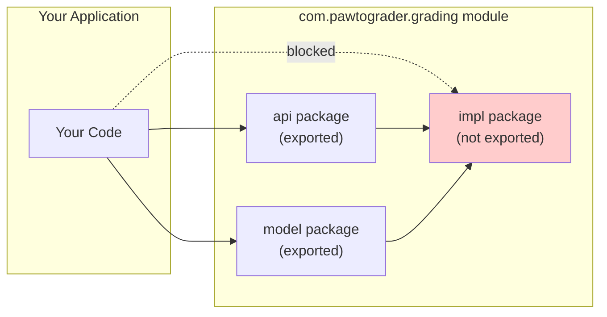

## Describe the importance of changeability as a goal of program design and implementation (10 minutes)

* Review the systematic program design and implementation process


* We haven't yet gone into significant detail on the "requirements gathering" step.
* When considering the total cost of software, it is important to consider how much effort it will take to truly get the software to meet the needs of the customer.
* Put another way: the majority of the cost of software is not in the initial development, but in the maintenance and evolution of the software. This insight—that maintainability is central to software economics—is also why we'll later call it technical sustainability: the ability of a system to continue providing value as it evolves over time.

* Show the tire swing meme (use scan from A Pattern Language, see also [history of the tire swing](https://www.businessballs.com/amusement-stress-relief/tree-swing-cartoon-pictures-early-versions/))

* Here is an example of a simple requirement and how difficult it may be to implement:
    * Requirement: The Pawtograder platform should allow graders to annotate student submissions with feedback on the quality of the code.
* At a high level, this may seem like a simple requirement. However, as we start to design the system, we will likely start to make choices that we will be force to make without necessarily knowing whether or not they are the best choices.
    * Brainstorm types of choices that we might make:
        * Do annotations directly effect the score? If so, is it "positive" scoring or "negative" scoring?
        * Is there a rubric for the annotations? If so, how detailed is the rubric? Is it structured with categories and levels?
        * Are annotations associated with part of a line, or the whole line?
        * How does the grader specify which lines to annotate?
        * ...
* A core principle of modern software design is to favor rapid prototyping and iteration over getting the requirements perfect.
* However, throwing away a design and starting over is expensive.
* Instead, our goal is to instill a sense of **changeability** in our designs.

* One design is more changeable than another if it is easier to make changes to it.
* Note that to concretize this definition, we need to consider a specific possible change in a specific design. For the time being, we'll be specifying the kinds of changes that your designs should be able to adapt to.
    * NB: Anticipating ALL kinds of changes is impossible, and likely a waste of time.
    * In the next module (after the first exam), we will focus more on requirements analysis and user centered design: the methods that you will use to identify the kinds of changes that your designs should be able to adapt to.
* You will note, however, that we consider four explicit kinds of changes that we might consider: technical, economic, social, and environmental:


| Type | Examples | Course Topics |
|------|----------|---------------|
| **Technical** | Will we need to scale? Change databases? Add features? | Modularity, interfaces, design patterns |
| **Economic** | Will hosting costs increase? Will the business model change? | Architecture, dependencies, vendor lock-in |
| **Social** | Will new user groups emerge? Will user values and requirements change? | Requirements, domain modeling, stakeholder analysis |
| **Environmental** | Will energy costs matter? Will regulations require efficiency? | Performance, resource management |

For now, we'll focus primarily on **technical** unknowns—how to design systems that can evolve as technical requirements change. But keep the other dimensions in mind; they'll resurface throughout the course and come together in our final lecture on sustainability ([Lecture 36](/lecture-notes/l36-sustainability)).

Today, we will focus on a low-level aspect of changeability: **information hiding**. Over the next few lectures, we will also revisit principles of object oriented design that are core to changeability.

## Describe the relevance of modularity to changeability (5 minutes)

* The core idea to information hiding is that we should design our system so that it is broken into "modules" that are relatively independent.
* What is a module?
    * A module is a self-contained unit of code. More specifically:
        * Each module should have a well-defined interface that specifies the behavior of the module. That specification should be restrictive, general and clear ([Lecture 4](./l4-specs-contracts.md))
        * The implementation of the module should be hidden from other modules and can be independently compiled.
        * Each module should be self-contained and should not depend on the implementation details of other modules.
    * A module could be a class, a package, or even a whole program. Modules can be composed together to form larger modules.

* Discuss for a few minutes: What could modularity help us achieve?
    * Efficiency of implementation: Different teams can work on different modules in parallel *without* needing to coordinate with each other (Brooks' law)
    * Readability and reusability: Modules are easier to understand and reuse if they are independent. This is particularly important when time has passed and it's a different set of developers working on the code.
    * Changeability: We can change one module without affecting the others.
    * Testability: Modules are easier to test if they are independent - they can be tested in isolation. This makes the tests easier to write, and more importantly, easier to debug when they fail.
    * Performance: Modules are easier to optimize if they are independent.
* Note that for any of these goals, it is essential that modules are *independent* as much as possible.
* For the next few lectures, we will focus on evaluating designs that have already been decomposed into modules. Once we have a good understanding of how to evaluate designs, we will look at how to decompose a system into modules.

## Describe the role of information hiding and immutability in enabling effective modularity (5 minutes)
* Today's principle is: **information hiding**.
* Why do we need information hiding?
  * Even if you have a good design that separates concerns into modules, some other developer might inevitably come along and find other ways to use your module in a way that was not anticipated.
  * See [Hyrum's Law](https://www.hyrumslaw.com): "With a sufficient number of users of an API, it does not matter what you promise in the contract: all observable behaviors of a system will be depended on by somebody."
    * See also [XKCD #1172](https://xkcd.com/1172/)
    * See also [Red Light, Green Light](https://www.cartalk.com/radio/puzzler/red-light-green-light)
  * So, insofar as a programming language can support information hiding, it is important to use it in order to ensure that our modules are used as anticipated.
* When information hiding was first proposed in the 1970s ([by a software engineering researcher named David Parnas](https://dl.acm.org/doi/10.1145/361598.361623)), there was little support for it from programming languages. As a designer, you could organize your code into modules, but there was very limited support to enforce that organization, or to prevent other parts of the code from accessing the implementation details of a module. Modern languages have built-in support for information hiding.
* We have already seen a core approach to achieve information hiding: creating *interfaces* that specify the behavior of a module without regard to its implementation.
   * The interface *hides* the implementation details of the module.
   * Changing *how* the interface is implemented can be done without affecting the code that uses the interface.
* We will now look at some other Java language features that help us achieve information hiding and immutability. In the context of object oriented design, these features are collectively known as enabling *encapsulation*.

## Be able to apply Java language features to achieve information hiding and immutability

### Access modifiers (7 minutes)

* Each class, method, and field in Java has an *access modifier* that controls its accessibility.
* The four access modifiers are:
  * `public`: The class, method, or field is accessible from anywhere.
  * `protected`: The class, method, or field is accessible from the package and any subclasses.
  * `package-private`: The class, method, or field is accessible from other code written in the same package. This is the default if no access modifier is specified.
  * `private`: The class, method, or field is accessible only from within the class.
* The rule of thumb is that we should [minimize accessibility of classes and members](https://learning.oreilly.com/library/view/effective-java-3rd/9780134686097/ch4.xhtml#lev15)

* You should think carefully before declaring a class or member `public`. Everything that is `public` is part of your module's interface.

* Note that if you begin your module design by enumerating the public interfaces (that specify the behavior of a module) and the classes that represent your data, you will naturally minimize the accessibility of the classes and members when it comes time to implement them.

* In Java, it is particularly important to minimize the accessibility of the *fields* of a class, such that the class can enforce invariants on its state.
    * For example, if a class has a `public` field, then any code can set that field to a value that violates the class's invariants.
    * By contrast, if a class has a `private` field, then the class can enforce the invariants on that field by *not* allowing code outside the class to set it to a value that violates the invariants. Outside code that wants to set the field must use the class's public methods, which can check the value and throw an exception if it is invalid.

As a simple example, consider this class:
```java
/**
 * A simple counter that can be incremented.
 * The count is always non-negative, and increments monotonically.
 */
public class Counter {
    public int count;

    /**
     * Increment the count by 1.
     */
    public void increment() {
        count++;
    }
}
```

Clients of the `Counter` class can use the `increment` method to change the count, but could also directly change the `count` field.

```java
Counter c = new Counter();
c.increment(); // count is now 1
c.count = 0; // count is now 0 (surprise!)
```

Notice that, considering the specification of the `Counter` class, the assignment to `c.count` is a violation of the class's invariants.

By contrast, a `Counter` using a private field would have prevented the assignment to `c.count` by enforcing the invariant that the count is always monotonically increasing.

```java
/**
 * A simple counter that can be incremented.
 * The count is always non-negative, and increments monotonically.
 */
public class Counter {
    private int count;

    public int getCount() {
        return count;
    }

    public void increment() {
        count++;
    }
}
```

Even if you do not have an invariant in mind that you want to enforce, it is still a good idea to make fields private. You might discover an invariant to enforce later, or might encounter a change in requirements that you need to support. [In public classes, use accessor methods, not public fields](https://learning.oreilly.com/library/view/effective-java-3rd/9780134686097/ch4.xhtml#lev16).

### Immutable objects and fields (10 minutes)

Immutable classes are those whose instances cannot be changed after they are created. Immutable classes are simpler to reason about, as their behavior can be determined by their constructor and public methods. This is particularly important for classes that are passed between modules, as it provides a strong guarantee that the behavior of an object won't be changed by another module. When you design a class, you should [Minimize Mutability](https://learning.oreilly.com/library/view/effective-java-3rd/9780134686097/ch4.xhtml#lev17): make it immutable by default, only making it mutable if there is a good reason to.

For example, consider a class for storing a [North American Dialing Plan phone number](https://en.wikipedia.org/wiki/North_American_Numbering_Plan) (e.g. a phone number that uses the country code `+1` and is followed by a 3 digit area code, 3 digit central office code and a 4 digit number). When we contstruct an instance of the class, that instance will represent a specific phone number, and as such, we should ensure that the instance cannot be changed.

```java
public final class PhoneNumber {
    private final short areaCode;
    private final short centralOfficeCode;
    private final short number;

    public PhoneNumber(short areaCode, short centralOfficeCode, short number) {
        this.areaCode = areaCode;
        this.centralOfficeCode = centralOfficeCode;
        this.number = number;
    }
    // ... getters and other methods ...
}
```

We make the class immutable by declaring the fields `final`. This ensures that the fields cannot be changed after the instance is constructed, and also ensures that the value is set upon construction. Even for non-`final` fields, it is important to ensure that they are set when an instance is constructed, ensuring that the object is always in a valid state.

We also declare the class `final` to prevent subclasses from changing the behavior of the class - otherwise, a subclass could violate the immutability of the class by overriding its behavior.

If a class has *reference* fields (e.g. fields that are objects or arrays), then there is one additional consideration that we must take into account in order to ensure that the class is immutable. Consider this alternative implementation of the `PhoneNumber` class that supports variable-length numbers (e.g. not only supporting NADP numbers):

```java
public final class PhoneNumber{
    private final short[] number;

    public PhoneNumber(short[] number) {
        this.number = number;
    }

    public String getNumber() {
        return number;
    }
    // ... getters and other methods ...
}
```

On first glance, this implementation seems to be immutable. However, consider the following code:

```java
short[] number = {1, 2, 3};
PhoneNumber pn = new PhoneNumber(number);
number[0] = 4; // pn is now {4, 2, 3}
```

Recall that reference types in Java are passed by reference, which means that the `number` array passed to the constructor is the same exact array that is stored in the `pn` instance. Hence, if the caller modifies the `number` array, the change is reflected in the `pn` instance. Despite the fact that the `number` field is declared as `final`, the immutability of the class is violated.

Hence, in order to ensure that the class is immutable, we must [make defensive copies when needed](https://learning.oreilly.com/library/view/effective-java-3rd/9780134686097/ch8.xhtml#lev49). In this case, we can make a defensive copy of the `number` array in the constructor:

```java
public PhoneNumber(short[] number) {
    this.number = new short[number.length];
    System.arraycopy(number, 0, this.number, 0, number.length); // equivalent to setting each element individually, but significantly more efficient
}
```

Here is the general recipe for making a class immutable:
- Do not provide any mutators (methods that change the state of the object).
- Make the class `final` to prevent subclasses from changing the behavior of the class (and possibly making it mutable).
- Make all fields `final` to ensure that the state of the object cannot be changed after it is constructed.
- Make all fields private to control access to the state of the object.
- If the class has reference fields, make defensive copies of the fields when needed.

### Sealed classes (10 minutes)

We've seen how `final` prevents *any* subclassing, but sometimes you want something in between: you want to allow *some* classes to extend yours, but not arbitrary ones. This is where **sealed classes** come in, introduced in Java 17 (2021).

A sealed class explicitly declares which classes are permitted to extend it:

```java
public sealed class IoTDevice permits DimmableLight, SwitchedLight, Thermostat {
    // ...
}
```

Only `DimmableLight`, `SwitchedLight`, and `Thermostat` can extend `IoTDevice`. Any other class that tries to extend it will fail to compile. This gives you precise control over your type hierarchy.

Classes that extend a sealed class must explicitly declare themselves as one of:
- `final` — cannot be extended further
- `sealed` — must specify their own permitted subclasses
- `non-sealed` — reopens the hierarchy (any class can extend it)

```java
public sealed class IoTDevice permits DimmableLight, SwitchedLight, Thermostat { }

public final class DimmableLight extends IoTDevice { }  // Cannot be extended
public final class SwitchedLight extends IoTDevice { }  // Cannot be extended
public non-sealed class Thermostat extends IoTDevice { }  // Can be extended by anyone
```

**Why sealed classes matter for changeability:**

Sealed classes are another form of information hiding—they hide the ability to extend a type. This has several benefits:

1. **Controlled evolution**: You can add new permitted subclasses in future versions without breaking existing code, but you prevent unexpected subclasses from appearing in the wild.

2. **Exhaustive pattern matching**: When you have a sealed hierarchy, the compiler knows all possible subtypes. Combined with pattern matching for `instanceof` (from Lecture 5), you can write exhaustive checks:

```java
public String describe(IoTDevice device) {
    if (device instanceof DimmableLight d) {
        return "Dimmable light at " + d.getBrightness() + "%";
    } else if (device instanceof SwitchedLight s) {
        return "Switched light: " + (s.isOn() ? "on" : "off");
    } else if (device instanceof Thermostat t) {
        return "Thermostat set to " + t.getTargetTemp() + "°";
    }
    // Note: Thermostat is non-sealed, so there could be unknown subtypes. Otherwise, the compiler would note that this branch is not reachable
    return "Unknown device";
}
```

3. **Domain modeling**: Sealed classes let you model domains where there's a closed set of possibilities. For example, a `PaymentMethod` might only ever be `CreditCard`, `BankTransfer`, or `DigitalWallet`—and you want the type system to enforce that.

```java
public sealed interface PaymentMethod permits CreditCard, BankTransfer, DigitalWallet { }
```

Sealed classes work with interfaces too, not just classes. This makes them particularly useful for defining domain models where you want the benefits of interfaces (multiple inheritance of type) with controlled implementations.

### Scaling Up: The Java Module System (10 minutes)

Everything we've discussed so far—access modifiers, private fields, immutability—operates at the **class level**. But what happens when you're not just writing a class, but publishing a *library* that other developers will use?

Libraries often need internal utility classes that are `public` so other packages *within the library* can use them—but these classes aren't meant for external consumers. Before Java 9 (2017), there was no way to express this. You might add Javadoc warnings like "Internal API - do not use," but nothing enforced it. Consumers would depend on internal classes, and then their code would break when you changed those internals.

This is Hyrum's Law at the library scale: if a class is observable, someone will depend on it.

Java 9 introduced the **module system**, which lets library authors explicitly declare their public API. A `module-info.java` file at the root of your module specifies which packages are **exported**:

```java
// module-info.java for a hypothetical grading library
module com.pawtograder.grading {
    // These packages are our public API - consumers can use them
    exports com.pawtograder.grading.api;
    exports com.pawtograder.grading.model;

    // com.pawtograder.grading.impl is NOT exported
    // Classes there can be public (for internal use) but invisible to consumers
}
```

With this declaration:
- Classes in `com.pawtograder.grading.api` and `com.pawtograder.grading.model` are accessible to consumers
- Classes in `com.pawtograder.grading.impl` are **module-private**—even if they're declared `public`, code outside the module cannot access them

This is **encapsulation scaled up**. Just as `private` fields hide implementation details within a class, unexported packages hide implementation details within a module:

| Scope | Mechanism | What it hides |
|-------|-----------|---------------|
| Field | `private` keyword | Implementation state within a class |
| Class | Package-private (default) | Helper classes within a package |
| Library | Module system (`exports`) | Internal packages within a library |

The benefits connect directly to the changeability concepts we've been discussing:
- **Reduced coupling**: Consumers can't depend on your internals, so you're free to change them
- **Clearer contracts**: The exported packages *are* your API; everything else is implementation detail
- **Safer evolution**: You can refactor internal code without breaking consumers



:::note Looking Ahead
The module system is our first glimpse of how design principles scale beyond individual classes. Later in the course, we'll return to these ideas when we discuss **software architecture** ([Lecture 19](/lecture-notes/l19-architecture-design)) and **open source ecosystems** ([Lecture 23](/lecture-notes/l23-oss)). You'll see how the same tension between "what's public" and "what's implementation detail" plays out at even larger scales—between services, between teams, and between organizations.

For now, the key insight is: **information hiding is fractal**. The same principle that makes a well-designed class easier to change also makes a well-designed library easier to change, and ultimately makes a well-designed system easier to change.
:::
