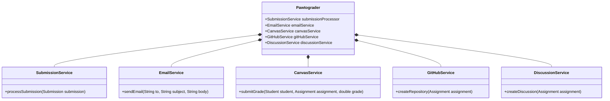

## Analyze the changeability of a software module for some hypothetical change using the language of coupling and cohesion (10 minutes)
Recall from last lecture that the specific requirements for a piece of software are often not fully specified at the beginning of a project. As a result, software designers need to be able to reason about how a software module will change in response to changes in requirements.

In this lecture, we will use the language of coupling and cohesion to reason about how a software module will change in response to changes in requirements.

You should recall the terms "coupling" and "cohesion" from CS 2100. As a brief refresher:
- **Coupling** is a measure of how much a module is affected by changes in other modules.
- **Cohesion** is a measure of how much a module is related to its responsibilities.

These are terms that can be used at any scale of design - comparing individual methods, entire classes, or even entire systems.

If a module has high coupling, then it is more difficult to change, as a change to one module may require changes to other modules. You would need to understand more code to make a change (all of the affected modules). This might increase the likelihood of introducing bugs, and in a large-scale system, you are more likely to run into conflicts with other developers working on the system.

In contrast, a module with low coupling is easier to change, as it is less likely that we will need to make changes to other modules. 

Even if a module has low coupling, it may still be difficult to change, as the code within it may appear largely unorganized or unrelated to the module's responsibilities. This is where cohesion comes in.

Let's revisit the example from last lecture:
* Requirement: The Pawtograder platform should allow graders to annotate student submissions with feedback on the quality of the code.

Here is one way to implement this requirement:


In this implementation, the `Submission` class is coupled with the `Assignment` class, and the `Student` class, in that it uses these types. Note that the `Assignment` class is responsible for managing the submissions for an assignment, and the `Student` class is responsible for managing the student's information. The `Submission` class is responsible for managing the submission's information. A `NotificationService` is used to notify the student of the feedback.

Here is another design that has much more coupling:


This design adds some back-edges to the diagram: in addition to the `Assignment` knowing about the `Submission`s for that assignment, the `Student` class now knows about the `Submission`s for that student.
Similarly, the `Feedback` class now knows about the `Submission` that it is associated with, and is now directly responsible for saving itself and notifying the student.

This design might be satisfactory for the initial requirements, but what kinds of challenges might we run into when we need to add new features? For example:
- If we need to change how submissions are entered, we need to change both the `Student` class and the `Assignment` class.
- With the `Feedback` class being repsonsible for notifying the student, we need to change the `Feedback` class to add a new notification method.
- The `Submission` class now is responsible for exposing student information: if we need to change how student information is represented, we also need to change the `Submission` class (and potentially any callers of it!).


## Define and recognize cases of data coupling, stamp coupling, control coupling, common coupling and content coupling (20 minutes)

There are multiple ways that two modules can be coupled, and they are not all equally bad. We start with the least bad kinds of coupling, and work our way up to the worst kinds of coupling.

### Data and Stamp Coupling
If two modules share data, then there is coupling between them.

When sharing data between modules, we might distinguish between two cases:
* **Data coupling**: The data is of a primitive type, or a common type that is not likely to change (e.g. those included with the JVM, such as `ArrayList`)
* **Stamp coupling**: The data is of a more complex type that we have defined ourselves, and is subject to changes in the future.

Data coupling is generally considered harmless, as the type of data being passed between modules is unlikely to change (note that there can be an anti-pattern here, of passing tons of simple parameters in lieu of a more complex data structure to "avoid" stamp coupling).

The "badness" of stamp coupling is that it indicates that a change to that data structure will require changes to the modules that use it. Put another way, stamp coupling indicates that a module is revealing unnecessary details of its implementation to callers. This can be mitigated by using carefully-designed interfaces.

Here is an example of a feedback notification serivce that is implemented with data coupling:
```java
class EmailService {
    void sendNotification(String toEmail, String studentName, String assignmentName) {
        // Only receives exactly what it needs - no unused data
        String body = "Hi " + studentName + ", you received feedback on " + assignmentName;
        send(toEmail, "New Feedback", body);
    }
}
```

Here is an example of a feedback notification service that is implemented with stamp coupling:

```java
class EmailService {
    void sendNotification(Submission submission) {
        // Only uses 3 fields but receives entire complex structure
        String toEmail = submission.student.email;        // ✓ Used
        String name = submission.student.name;            // ✓ Used
        String assignmentName = submission.assignment.name; // ✓ Used
               String body = "Hi " + name + ", you received feedback on " + assignmentName;
        send(toEmail, "New Feedback", body);
    }
}
```

Note that the second example couples the `EmailService` to the `Submission` class, as it is now responsible for extracting the necessary data from the `Submission` object. In the first example, the `EmailService` is only responsible for sending an email, and does not need to know about the `Submission` class.

### Control Coupling
When one module calls methods in another, there is a risk of control coupling. Control coupling occurs when the parameter that is passed to that method is then used to control the flow of execution.

For example, consider the following potential implementation of the `sendNotification` method:

```java
public void sendNotification(User destination, String message, DeliveryType type) {
    if (type == DeliveryType.EMAIL) {
        // Send email
    } else if (type == DeliveryType.SMS) {
        // Send SMS
    } else if (type == DeliveryType.PUSH) {
        // Send push notification
    } else if (type == DeliveryType.IN_APP) {
        // Send in-app notification
    } else if (type == DeliveryType.CANVAS) {
        // Send Canvas notification
    }
}
```

This is "control coupling" because the `DeliveryType` parameter is used to control the flow of execution within the method. 

Changing the contents of `sendNotification` will require careful consideration of how the `DeliveryType` parameter is used. Control coupling usually indicates that a method is doing too much, breaking the Single Responsibility Principle.

An alternative implementation might be:

```java
public void sendPushNotification(User destination, String message);
public void sendInAppNotification(User destination, String message);
public void sendCanvasNotification(User destination, String message);
public void sendEmailNotification(User destination, String message);
public void sendSmsNotification(User destination, String message);
```

In this implementation, each method is responsible for a single type of notification, and the caller can choose the type of notification to send.

On one hand, the first implementation allows for future expansion of the `sendNotification` method to support new types of notifications.
However, this design of `sendNotification` violates the Single Responsibility Principle, as it has a large number of parameters and a complex conditional.
Refactoring this method to be more cohesive would allow for more flexibility in the future, but if we released the library with this design,
refactoring it would be a breaking change to all of the clients of the library!
In contrast, the second implementation removes the control coupling, reducing the risk of breaking changes.

### Common Coupling
Common coupling occurs when two modules share a common data structure (note that it is not neessarily the "most common" kind of coupling, but it is a kind of coupling where there is a common data structure).

For example, consider an implementation of the `Assignment` class that uses a global map to store all assignments and their submissions:

```java
class Assignment {
    /*
     * A global map that stores all assignments and their submissions.
     */
    public static Map<Assignment, List<Submission>> submissions = new HashMap<>();
    // ... rest of the class
}
```

Then, elsewhere in the codebase we might write a method like:

```java 
public class NotificationService {
    public static void sendGradeReleaseNotifications(Assignment assignment) {
        List<Submission> submissions = Assignment.submissions.get(assignment);
        for (Submission submission : submissions) {
            submission.sendNotification(submission.student, "Your grade has been released!", DeliveryType.EMAIL);
        }
    }
}
```

In this implementation, the `NotificationService` class has common coupling with the `Assignment` class, as it uses the `submissions` map.

Common coupling is harmful, because:
* There is over-sharing of data between modules, which might lead to a client using data that was not intended to be exposed, making it harder to change the data structure in the future.
* There is no explicit contract between the two modules, so it is hard to reason about how changes to one module might affect the other.
* Reading and debugging code that has common coupling is difficult, as it is hard to tell which parts of the code are responsible for which data structure.


### Content Coupling

Content coupling is sometimes referred to as "pathological coupling", because it is a kind of coupling that is difficult to reason about.

With content coupling, the client module *ignores* the interface of the module that it is coupling with, and instead directly accesses the internals of the module. In the common coupling example above, the `Assignment` service exposed a global variable that the `NotificationService` then uses. We can prevent this kind of coupling by limiting the scope of that internal variable.

Content coupling differs from common coupling in that the client module finds a way to use internal details of the module that it is coupling with.

Here are several ways that content coupling can occur:

The client module uses Java's *reflection* API to modify the visibility of a data structure and then access it. The code below is legal Java code that will function unless the JVM is started with a security manager that forbids reflection:

```java
class Assignment {
    /**
     * A private list of submissions for this assignment.
     * Clients must use the {@link #getSubmissions()} method to access this data.
     * For consistency, submissions can not be deleted.
     */
    private List<Submission> submissions = new ArrayList<>();

    /**
     * Adds a submission to the assignment.
     */
    public void addSubmission(Submission submission) {
        submissions.add(submission);
    }

    /**
     * Returns a copy of the submissions list.
     * Prevents clients from modifying the submissions list.
     */
    public List<Submission> getSubmissions() {
        return new ArrayList<>(submissions);
    }
    // ...
}

/**
 * A class that we just created to replace a student submission
 * when an instructor resubmits a student's assignment.
 */
class SubmissionReplacementService {

    public static void replaceSubmission(Assignment assignment, Submission oldSubmission, Submission newSubmission) {
        // Use reflection to access the private submissions field
        Field submissionsField = Assignment.class.getDeclaredField("submissions");
        // Make the field accessible
        submissionsField.setAccessible(true);
        // Get the submissions list
        List<Submission> submissions = (List<Submission>) submissionsField.get(assignment);
        submissions.remove(oldSubmission);
        submissions.add(newSubmission);
    }
}
```

You should be able to quickly see why this is not a good design:
* The `SubmissionReplacementService` utilizes internal details of the `Assignment` class, and does not use the public interface.
* Changing the `Assignment` class will require a corresponding change to the `SubmissionReplacementService` class.
* It is not easy to find this dependency: searching for usages of the `submissions` field will not show this usage!

In larger-scale systems, content coupling can also occur when module A is responsible for providing access to a database, and module B is expected to utilize Module A to access that database.
In this case, module B *might* directly access that database, which would result in content coupling.

## Define and recognize cases of coincidental, logical, temporal, procedural, communication, sequential, and functional cohesion (15 minutes)

### Coincidental Cohesion
Coincidental cohesion occurs when parts of a module are related only by coincidence - there is no functional or logical relationship between the parts.

A common example of coincidental cohesion is when there is a generic "Utility" class that contains many methods that are not otherwise related:

```java
class Utility {
    public static String formatNameForSorting(String firstName, String lastName) {
        return String.format("%s, %s", lastName, firstName);
    }

    public static String formatNameForDisplay(String firstName, String lastName) {
        return String.format("%s %s", firstName, lastName);
    }

    public static String formatDueDate(Date dueDate) {
        return String.format(Locale.getDefault(), "Due on %tB %<te, %<tY", dueDate);
    }

    public static String celsiusToFahrenheit(double celsius) {
        return String.format("%.2f°F", celsius * 9 / 5 + 32);
    }

    public static boolean isInstructorForStudent(Instructor instructor, Student student) {
        return instructor.getStudents().contains(student);
    }
}
```

This class is not really cohesive, as there is no clear relationship between the methods. Yet, it is a class that groups some methods together, and hence we say that it has coincidental cohesion.

### Logical Cohesion

Logical cohesion occurs when all of the parts of a module perform logically similar tasks. Unlike coincidental cohesion, there is some clear logical relationship between the parts.

Our coincidental cohesion example above does not demonstrate logical cohesion, as there are methods that do very different things. However, we might extract all of the formatting methods into a `Formatter` class:

```java
class Formatter {
    public static String formatNameForSorting(String firstName, String lastName) {
        return String.format("%s, %s", lastName, firstName);
    }

    public static String formatNameForDisplay(String firstName, String lastName) {
        return String.format("%s %s", firstName, lastName);
    }

    public static String formatDueDate(Date dueDate) {
        return String.format(Locale.getDefault(), "Due on %tB %<te, %<tY", dueDate);
    }
}
```

This class is now more cohesive, as all of the methods are related to formatting. However, there is still a weak relationship between some of the methods: the `formatDueDate` method is only related to `formatName` methods in that they both format strings, but they may be used in different parts of the codebase.

### Temporal Cohesion

Temporal cohesion occurs when the components of a module are related in their relative time of execution. For example, a module that performs "Initialization" tasks when the system starts or "Cleanup" tasks when the system shuts down are both related to the system's lifecycle.

Here is an example of a class that implements many startup tasks:

```java
class SystemLifecycle {
    public static void initialize() {
        createSubmissionService();
        createRegradeService();
        setupDatabase();
        setupWebServer();
        setupEmailService();
        setupCanvasService();
    }
    private static void createSubmissionService(){

    }
    private static void createRegradeService(){

    }
    private static void setupDatabase(){

    }
    private static void setupWebServer(){

    }
    private static void setupEmailService(){

    }
    private static void setupCanvasService(){

    }
}
```

Notice that although these tasks are related in that they all happen when the system starts, they are not really related in any other way: they do different things.

### Procedural Cohesion

Closely related to temporal cohesion is procedural cohesion, which occurs when a module has a set of procedures that are all related to the same task.

Here is an example of a class related to Pawtograder that has procedural cohesion:

```java
class SubmissionService {
    public void processSubmission(Submission submission) {
        TestResult testResult = runTests(submission);
        LintResult lintResult = lintSubmission(submission);
        GradingResult gradeResult = gradeSubmission(submission, testResult, lintResult);
        saveSubmission(submission, gradeResult);
    }

    private GradingResult gradeSubmission(Submission submission, TestResult testResult, LintResult lintResult) {
        // ...
    }

    private TestResult runTests(Submission submission) {
        // ...
    }

    private LintResult lintSubmission(Submission submission) {
        // ...
    }

    private void saveSubmission(Submission submission, GradingResult gradeResult) {
        // ...
    }
}
```

This class is procedurally cohesive because the methods are all related to the lifecycle of creating a submission. Note that there is also temporal cohesion here (as the methods are invoked together), but that there is also this stronger cohesion because the methods are related to the same task.

### Communication Cohesion

Communication cohesion occurs when parts of a module are grouped together because they operate on the same inputs and outputs. The `SubmissionProcessor` class above is also an example of communication cohesion, as all of the methods are operating on the same `Submission` object.

### Sequential Cohesion

Sequential cohesion extends communication cohesion to include the idea that the methods are related to the same task, but are executed in a specific order. The `SubmissionProcessor` class shows sequential cohesion: `gradeSubmission` must be called after `runTests` and `lintSubmission`, and `saveSubmission` must be called after `gradeSubmission`.

### Functional Cohesion

Functional cohesion occurs when a module has a set of methods that are all related to the same task. Determining that a module has functional cohesion requires an effective understanding of the task that the module is responsible for.

Consider this higher-level view of our Pawtograder system:



In this high-level view, we see how the business responsibilities of the overall system are distributed across service modules. Each service module has a single responsibility, and while we do not show the corresponding implementation details, assuming that each service module contains all of the code for its corresponding business responsibility, then there is functional cohesion.


## Use the vocabulary of coupling and cohesion to review the Strategy pattern (10 minutes)

Recall that the Strategy pattern is a design pattern that allows for different algorithms to be used interchangeably. In [Lecture 5](./l5-fp-readability-reusability.md), we discussed the Strategy pattern with an example of a `Comparator` that allows for different sorting algorithms to be used interchangeably.


In our Pawtograder example, we might use the Strategy pattern to allow the `SubmissionService` to grade submissions that are in different programming languages, each of which has a different build, lint, and test process.


Compare this design to an implementation that does not use the Strategy pattern:


By employing the Strategy pattern, we create an explicit boundary between the `SubmissionService` and the build, lint, and test strategies. This boundary helps to minimize the risk of coupling between the `SubmissionService` and those strategies, as the strategies are now defined as separate classes with a clearly-defined interface. 
(Note that you *could* implement the single-class `SubmissionService` without introducing coupling between the strategies, but the compiler would not enforce that boundary!)

The Strategy pattern also promotes functional cohesion, as there is a strong argument to be made that the semantics for building, linting and testing a submission are different responsibilities than the semantics for receiving and grading a submission.