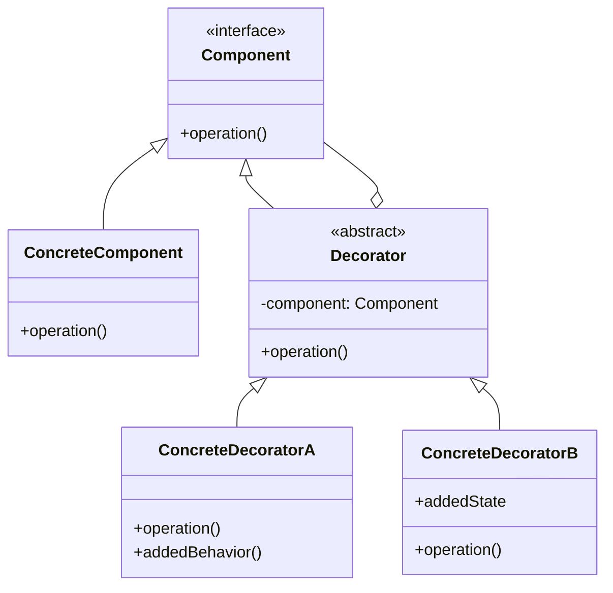

## Other design principles related to changeability: SOLID (20 minutes)
In the previous two lectures, we explored changeability through information hiding, modularity, coupling, and cohesion. Today, we'll examine a set of design principles known as SOLID, which provide concrete guidelines for creating changeable object-oriented designs.

Historical context:
- Robert C. Martin (referred to by many as "Uncle Bob") wrote an article in 2000 called [Design Principles and Design Patterns](https://web.archive.org/web/20150906155800/http://www.objectmentor.com/resources/articles/Principles_and_Patterns.pdf) that suggested these five principles as a way to avoid "software rot" - the gradual degradation of software quality over time.
- He did NOT invent all of these principles! Bertrand Meyers proposed the "O" in SOLID (Open-Closed principle) in 1998. Barbara Liskov proposed the "L" in SOLID (Liskov Substitution principle) in 1987.
- Another engineer, Michael Feathers, coined the term "SOLID" in 2004 

The SOLID acronym represents five principles:
- **S**ingle Responsibility Principle
- **O**pen/Closed Principle
- **L**iskov Substitution Principle
- **I**nterface Segregation Principle
- **D**ependency Inversion Principle

Take these principles as guidelines that you should consider in your design decisions, recognizing that there are always trade-offs to be made. We'll look at them here in the context of individual data types.

:::note Looking Ahead
These same principles scale up to entire systems. When we discuss **software architecture** in [Lecture 19](/lecture-notes/l19-architecture-design) and [Lecture 20](/lecture-notes/l20-monoliths), you'll see how Single Responsibility becomes service boundaries, how Open/Closed becomes plugin architectures, and how Dependency Inversion becomes the foundation of testable, modular systems.
:::

### Single Responsibility Principle (SRP)
"A class should have only one reason to change."

We've already encountered this principle when discussing functional cohesion. A class with a single responsibility is easier to understand, test, and modify. Consider our `SubmissionService` from last lecture:

```java
// Violates SRP - multiple responsibilities
public class SubmissionService {
    public void processSubmission(Submission submission) {
        // Testing responsibility
        TestResult testResult = runTests(submission);
        // Linting responsibility  
        LintResult lintResult = lintSubmission(submission);
        // Grading responsibility
        GradingResult gradeResult = gradeSubmission(submission, testResult, lintResult);
        // Persistence responsibility
        saveSubmission(submission, gradeResult);
        // Notification responsibility
        sendNotification(submission.student, gradeResult);
    }
    // ... implementation methods ...
}
```

This class has at least five reasons to change: changes to testing, linting, grading, persistence, or notification logic. A better design would separate these concerns:

```java
public class SubmissionProcessor {
    private final TestRunner testRunner;
    private final Linter linter;
    private final Grader grader;
    private final SubmissionRepository repository;
    private final NotificationService notifier;
    
    public void processSubmission(Submission submission) {
        TestResult testResult = testRunner.run(submission);
        LintResult lintResult = linter.analyze(submission);
        GradingResult gradeResult = grader.grade(submission, testResult, lintResult);
        repository.save(submission, gradeResult);
        notifier.notify(submission.student, gradeResult);
    }
}
```

Now each class has a single, well-defined responsibility. If we wanted to make changes to the linting process, we could do so without affecting the testing or grading processes. Indeed, we wouldn't even need to look at those files!

### Open/Closed Principle (OCP)
"Software entities should be open for extension but closed for modification."

This principle encourages us to design modules that can be extended with new behavior without modifying existing code. We achieve this through abstraction and polymorphism. Recall our IoT device hierarchy:

```java
// Existing interface
public interface IoTDevice {
    void identify();
    boolean isAvailable();
}

// Existing implementation
public class Light implements IoTDevice {
    // ... implementation ...
}

// We can add new device types without modifying existing code
public class SmartThermostat implements IoTDevice {
    @Override
    public void identify() {
        // Flash display
    }
    
    @Override
    public boolean isAvailable() {
        // Check WiFi connection
        return true;
    }
    
    // New behavior specific to thermostats
    public void setTemperature(int temp) {
        // ...
    }
}
```

The system is "open" to new device types but "closed" in that adding `SmartThermostat` doesn't require changing the `IoTDevice` interface or any existing implementations.

### Liskov Substitution Principle (LSP)
"Objects of a superclass should be replaceable with objects of its subclasses without breaking the application."

We introduced this principle in Lecture 2. It ensures that inheritance hierarchies maintain behavioral compatibility:

```java
// Good: LSP preserved
public class DimmableLight extends Light {
    private int brightness = 100;
    
    @Override
    public void turnOn() {
        super.turnOn();
        // Maintains the contract: light turns on
        // Just adds dimming capability
    }
    
    public void setBrightness(int brightness) {
        if (brightness < 0 || brightness > 100) {
            throw new IllegalArgumentException("Brightness must be 0-100");
        }
        this.brightness = brightness;
    }
}
```

```java
// Bad: LSP violated
public class BrokenLight extends Light {
    @Override
    public void turnOn() {
        throw new UnsupportedOperationException("This light is broken!");
        // Violates the contract - a Light should turn on when turnOn() is called
    }
}
```

### Interface Segregation Principle (ISP)
"Clients should not be forced to depend on interfaces they don't use."

Rather than having large, monolithic interfaces, we should create smaller, focused interfaces. This is like the Single Responsibility Principle, but for interfaces.

```java
// Bad: Large interface that forces clients to consider concerns that they don't need to worry about (not every device has a light and a fan!)
public interface SmartDevice {
    void turnOn();
    void turnOff();
    void setBrightness(int level);
    void setColorTemperature(int temp);
    void setFanSpeed(int speed);
    void scheduleTimer(int minutes);
}

// Better: Segregated interfaces
public interface Switchable {
    void turnOn();
    void turnOff();
}

public interface Dimmable {
    void setBrightness(int level);
}

public interface ColorAdjustable {
    void setColorTemperature(int temp);
}

// Now devices implement only what they need
public class SimpleFan implements Switchable {
    // Only implements on/off, not forced to implement dimming or color
}

public class SmartBulb implements Switchable, Dimmable, ColorAdjustable {
    // Implements all three capabilities
}
```

### Dependency Inversion Principle (DIP)
"Depend on abstractions, not on concretions."

High-level modules should not depend on low-level modules; both should depend on abstractions:

```java
// Bad: Direct dependency on concrete class
public class PawtograderSystem {
    private MySQLDatabase database = new MySQLDatabase();
    
    public void saveSubmission(Submission submission) {
        database.save(submission);
    }
}

// Good: Depend on abstraction
public class PawtograderSystem {
    private final Database database;
    
    public PawtograderSystem(Database database) {
        this.database = database;
    }
    
    public void saveSubmission(Submission submission) {
        database.save(submission);
    }
}

public interface Database {
    void save(Submission submission);
}

public class MySQLDatabase implements Database {
    @Override
    public void save(Submission submission) {
        // MySQL-specific implementation
    }
}
```

This way, if we need to change the database implementation, we can do so without affecting the rest of the system.

## Describe why to favor composition over inheritance by default (10 minutes)

While inheritance is a powerful feature of object-oriented programming, it creates tight coupling between parent and child classes. [Effective Java Item 18](https://learning.oreilly.com/library/view/effective-java-3rd/9780134686097/ch4.xhtml#lev18) warns us to "favor composition over inheritance" for several reasons.

### The Fragile Base Class Problem
What do we mean by "tight coupling"? Imagine that we want to create a new type of set that counts the number of elements added to it. We could do this by extending the `HashSet` class:

```java
public class InstrumentedHashSet<E> extends HashSet<E> {
    private int addCount = 0;
    
    @Override
    public boolean add(E e) {
        addCount++;
        return super.add(e);
    }
    
    @Override
    public boolean addAll(Collection<? extends E> c) {
        addCount += c.size();
        return super.addAll(c);
    }
    
    public int getAddCount() {
        return addCount;
    }
}
```

This seems reasonable, but there's a hidden problem:

```java
InstrumentedHashSet<String> s = new InstrumentedHashSet<>();
s.addAll(Arrays.asList("A", "B", "C"));
System.out.println(s.getAddCount()); // Prints 6, not 3!
```

The problem is that `HashSet.addAll()` internally calls `add()` for each element.
Of course, you might say "but you didn't show us the implementation of `HashSet.addAll()`!" And you're right, we didn't. The reason why this is an anti-pattern is: subclasses should not depend on the implementation details of their superclasses, only on the public interface!
In other words, this example breaks encapsulation.

Our overridden `add()` increments the counter, and we also increment it in `addAll()`, resulting in double-counting. This illustrates how inheritance exposes us to implementation details of the superclass.

### The Composition Alternative

Instead of inheritance, we can use composition and forwarding:

```java
public class InstrumentedSet<E> implements Set<E> {
    private final Set<E> s;
    private int addCount = 0;
    
    public InstrumentedSet(Set<E> s) {
        this.s = s;
    }
    
    @Override
    public boolean add(E e) {
        addCount++;
        return s.add(e);
    }
    
    @Override
    public boolean addAll(Collection<? extends E> c) {
        addCount += c.size();
        return s.addAll(c);
    }
    
    public int getAddCount() {
        return addCount;
    }
    
    // Forward all other Set methods to s
    @Override public int size() { return s.size(); }
    @Override public boolean isEmpty() { return s.isEmpty(); }
    // ... other forwarding methods ...
}
```

Now we can wrap any `Set` implementation:

```java
InstrumentedSet<String> s = new InstrumentedSet<>(new HashSet<>());
InstrumentedSet<String> s2 = new InstrumentedSet<>(new TreeSet<>());
```

This design is more flexible and doesn't depend on the internal implementation of `HashSet`.
It respects the encapsulation of the `HashSet` class, and the `InstrumentedSet` class is not aware of the internal implementation of `HashSet`.

## Describe rules for safely implementing inheritance (5 minutes)

Despite the risks, inheritance is sometimes the right design choice. When you do use inheritance, follow these guidelines from [Effective Java Item 19](https://learning.oreilly.com/library/view/effective-java-3rd/9780134686097/ch4.xhtml#lev19):

### Design and Document for Inheritance

If you intend a class to be extended:

1. **Document self-use of overridable methods**: Clearly specify which methods call which other methods.

```java
//GOOD: callers can tell from the documentation that there is tight coupling between the process method and the validate and grade methods
public abstract class AbstractSubmissionProcessor {
    /**
     * Processes a submission. This method calls {@link #validate(Submission)}
     * followed by {@link #grade(Submission)} if validation succeeds.
     * 
     * @param submission the submission to process
     * @return the grading result
     */
    public final GradingResult process(Submission submission) {
        if (validate(submission)) {
            return grade(submission);
        }
        return GradingResult.invalid();
    }
    
    /**
     * Validates a submission. Subclasses must override this method
     * to provide language-specific validation.
     */
    protected abstract boolean validate(Submission submission);
    
    /**
     * Grades a submission. Subclasses must override this method
     * to provide language-specific grading.
     */
    protected abstract GradingResult grade(Submission submission);
}
```

2. **Minimize the number of protected members**: Each protected method or field is a commitment to maintain that interface.


### Or Else Prohibit It

Most classes should be either clearly designed for inheritance with thorough documentation (including a separately defined interface), or should prohibit inheritance entirely.

If a class is not designed for inheritance, prevent it:

```java
// Prevent inheritance by making the class final
public final class SubmissionValidator {
    // Cannot be extended
}
```

## Define the decorator method pattern and its relationship to design for change (15 minutes)
The Decorator pattern is a structural design pattern that allows behavior to be added to objects dynamically without altering their structure. It's a prime example of using composition to achieve flexibility that would be difficult with inheritance.

### The Pattern Structure



### Java I/O: A Real Decorator Implementation

The Java I/O streams API extensively uses the Decorator pattern. Recall from Lecture 3:

```java
// Decorating input streams
InputStream fileStream = new FileInputStream("data.txt");
InputStream bufferedStream = new BufferedInputStream(fileStream);
InputStream dataStream = new DataInputStream(bufferedStream);

// Each decorator adds functionality:
// - FileInputStream: reads from file
// - BufferedInputStream: adds buffering for efficiency  
// - DataInputStream: adds methods to read primitive types
```

This design allows the I/O library to provide numerous combinations of functionality without creating a class for each possible combination.


### Advantages for Changeability

The Decorator pattern promotes changeability by:

1. **Adding responsibilities dynamically**: We can add or remove decorators at runtime.
2. **Single Responsibility Principle**: Each decorator has one specific enhancement.
3. **Open/Closed Principle**: We can add new decorators without modifying existing code.
4. **Avoiding class explosion**: Instead of creating subclasses for every combination of features, we compose decorators.

Compare this to an inheritance-based approach that would require designing all new classes for every combination of features.

### Disadvantages of the Decorator pattern

The main disadvantage of the Decorator pattern is that it can be more verbose than inheritance, and it can be more difficult to understand the structure of the code. In an inheritance hierarchy, the structure of the types clearly defines the functionality of the type. With the Decorator pattern, the structure of the code is more difficult to understand because it is composed of many small classes that are all doing something different. We can't just look at the type `InputStream` to know that `dataStream` provides the functionality of `DataInputStream`, `BufferedInputStream`, and `FileInputStream`.

## Identify cases where inheritance is preferred over other implementation tricks (10 minutes)

Despite our emphasis on composition, there are legitimate uses for inheritance, particularly those described in [Effective Java Item 20: Prefer interfaces to abstract classes](https://learning.oreilly.com/library/view/effective-java-3rd/9780134686097/ch4.xhtml#lev20).

### Template Method Pattern

Abstract classes excel at defining algorithmic skeletons where subclasses fill in the details:

```java
public abstract class AbstractTestRunner {
    // Template method defines the algorithm structure
    public final TestResult runTests(Submission submission) {
        setUp();
        try {
            compileCode(submission);
            List<TestCase> tests = loadTestCases();
            TestResult result = new TestResult();
            
            for (TestCase test : tests) {
                beforeEach();
                try {
                    result.add(executeTest(test, submission));
                } finally {
                    afterEach();
                }
            }
            return result;
        } finally {
            tearDown();
        }
    }
    
    // Hooks with default implementations
    protected void setUp() {}
    protected void tearDown() {}
    protected void beforeEach() {}
    protected void afterEach() {}
    
    // Abstract methods that subclasses must implement
    protected abstract void compileCode(Submission submission);
    protected abstract List<TestCase> loadTestCases();
    protected abstract TestOutcome executeTest(TestCase test, Submission submission);
}

public class JavaTestRunner extends AbstractTestRunner {
    @Override
    protected void compileCode(Submission submission) {
        // Java-specific compilation with javac
    }
    
    @Override
    protected List<TestCase> loadTestCases() {
        // Load JUnit tests
    }
    
    @Override
    protected TestOutcome executeTest(TestCase test, Submission submission) {
        // Run JUnit test
    }
}
```

### Natural Type Hierarchies

Some domains have natural "is-a" relationships where inheritance makes semantic sense:

```java
public abstract class Shape {
    protected double x, y;  // Position
    
    public abstract double area();
    public abstract double perimeter();
    
    public void moveTo(double x, double y) {
        this.x = x;
        this.y = y;
    }
}

public class Circle extends Shape {
    private double radius;
    
    @Override
    public double area() {
        return Math.PI * radius * radius;
    }
    
    @Override
    public double perimeter() {
        return 2 * Math.PI * radius;
    }
}
```

This is appropriate because:
- A circle truly "is-a" shape
- The relationship is stable and unlikely to change
- The abstraction is meaningful in the problem domain

### Skeletal Implementations

Java 8+ allows default methods in interfaces, but abstract classes can still provide value as "skeletal implementations":

```java
public interface Light {
    void turnOn();
    void turnOff();
    boolean isOn();
}

// Skeletal implementation
public abstract class AbstractLight implements Light {
    private boolean on = false;
    
    @Override
    public void turnOn() {
        if (!on) {
            on = true;
            activateHardware();
        }
    }
    
    @Override
    public void turnOff() {
        if (on) {
            on = false;
            deactivateHardware();
        }
    }
    
    @Override
    public boolean isOn() {
        return on;
    }
    
    // Subclasses implement hardware-specific behavior
    protected abstract void activateHardware();
    protected abstract void deactivateHardware();
}

// Concrete implementations can extend the skeletal implementation
public class LEDLight extends AbstractLight {
    @Override
    protected void activateHardware() {
        // LED-specific activation
    }
    
    @Override
    protected void deactivateHardware() {
        // LED-specific deactivation
    }
}

// Or implement the interface directly if the skeletal implementation doesn't fit
public class SmartBulb implements Light {
    // Complete custom implementation
}
```

### Guidelines for Choosing Inheritance

Use inheritance when:
1. **There's a genuine "is-a" relationship** that's fundamental to the domain
2. **You control both the base class and subclasses** (or trust the base class designer)
3. **The base class is explicitly designed for inheritance** with clear documentation
4. **You need to share code between closely related classes** and composition would be awkward
5. **You're implementing a well-established pattern** like Template Method

Avoid inheritance when:
1. **You're trying to reuse code** but there's no natural "is-a" relationship
2. **The base class wasn't designed for inheritance** 
3. **You need to modify behavior of existing classes** (use Decorator instead)
4. **You want multiple inheritance of behavior** (Java doesn't support it; use interfaces with default methods)
5. **The inheritance hierarchy would be deep** (more than 2-3 levels is often a smell)
