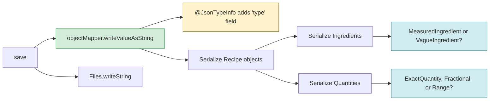
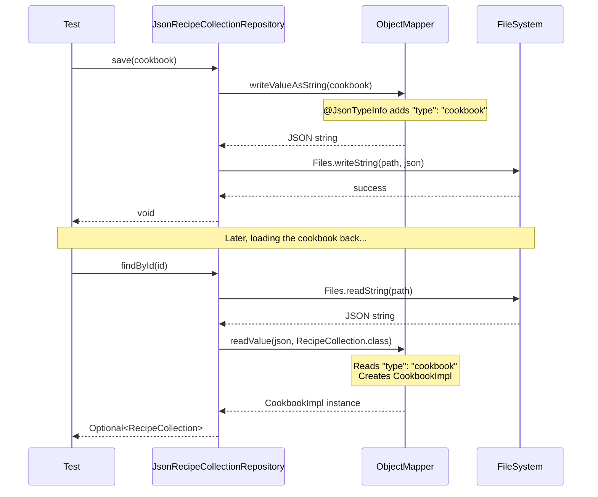
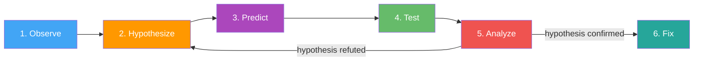

import RevealJS, { Slide } from '@site/src/components/RevealJS';
import Img from '@site/src/components/Img';
import PollSlide from '@site/src/components/PollSlide';
import QuoteSlide from '@site/src/components/QuoteSlide';

<RevealJS transition="slide">

{/* ============================================ */}
{/* COVER IMAGE */}
{/* ============================================ */}

<Slide>
  

<aside className="notes">
**Lecture overview:**
- **Total time:** ~55 minutes (tight)
- **Theme:** Debugging as detective work—systematic investigation, not random guessing
- **Prerequisites:** L5 readability (naming, code clarity), L13 AI coding assistants (workflow)
- **Connects to:** All future assignments (debugging is constant), final project

**Key connections to prior lectures:**
- **L5 Readability:** Good names and clear code make program understanding MUCH easier
- **L13 AI Assistants:** The 6-step workflow applies directly to debugging with AI

**The narrative:**
- Understanding code requires tracing control flow and data flow
- Diagrams help visualize complex relationships
- Debugging is the scientific method applied to code
- Debuggers accelerate hypothesis testing
- AI can assist, but you must understand the code yourself

→ **Transition:** Let's start with the learning objectives...
</aside>

</Slide>

{/* ============================================ */}
{/* TITLE SLIDE */}
{/* ============================================ */}

<Slide>

# CS 3100: Program Design and Implementation II

## Lecture 14: Program Understanding & Debugging

<p style={{marginTop: '2em', fontSize: '0.8em', color: '#666'}}>
  ©2026 Jonathan Bell & Ellen Spertus, CC-BY-SA
</p>

<aside className="notes">
Quick title slide, move on to learning objectives.

→ **Transition:** Here's what you'll be able to do after today...
</aside>

</Slide>

<Slide>
## Poll: Why don't you use Oakland office hours or appointments?
<div style={{fontSize: '0.7em'}}>
We offer [in-person office hours and video appointments](https://northeastern.instructure.com/courses/239378).
</div>
<PollSlide username="espertus"
  choices={["I didn't know you held them.", "I'm not available at those times.",
    "I prefer getting help from AI.", "I prefer getting help from friends.",
    "I prefer getting help through Pawtograder.",
    "I don't think it would be helpful.", "I don't know", "other"
  ]}
/>
<div style={{fontSize: '0.7em'}}>
Answers are anonymous but count toward your participation grade.
</div>
</Slide>

{/* ============================================ */}
{/* LEARNING OBJECTIVES */}
{/* ============================================ */}

<Slide>

## Learning Objectives

<p style={{fontSize: '0.85em', textAlign: 'left'}}>
After this lecture, you will be able to:
</p>

<ol style={{fontSize: '0.75em', textAlign: 'left'}}>
  <li>Utilize control flow and data flow analysis to understand a program</li>
  <li>Utilize diagrams (call graphs, sequence diagrams) to visualize program behavior</li>
  <li>Apply the scientific method to debugging</li>
  <li>Utilize a debugger to step through a program and inspect state</li>
  <li>Utilize an AI programming agent to assist with debugging</li>
</ol>

<aside className="notes">
**Time allocation:**
- Control/data flow analysis (~10 min)
- Diagrams and Mermaid (~8 min)
- Scientific method of debugging (~15 min)
- Debugger usage (~10 min)
- AI for debugging (~9 min)

**The thread:** Build from understanding code → visualizing it → systematically debugging it → using tools to accelerate the process.

→ **Transition:** Let's talk about what's coming...
</aside>

</Slide>

{/* ============================================ */}
{/* OPENING HOOK */}
{/* ============================================ */}

<Slide>

## Coming Soon: Much Bigger Codebases

<div style={{fontSize: '0.85em'}}>

**A3 (this week!):**
- Starter code with 10+ interfaces: `RecipeCollection`, `Cookbook`, `UserLibrary`...
- Inheritance hierarchies you didn't design
- Jackson annotations you've never seen

**Group project (March):**
- Teammates' code you need to understand and extend

</div>

<p style={{fontSize: '1.1em', marginTop: '1em', fontWeight: 'bold', color: '#9370DB'}}>
"How do I even start understanding this codebase?"
</p>

<aside className="notes">
**The immediate challenge (A3):**
- RecipeCollection hierarchy: Cookbook, PersonalCollection, WebCollection
- UserLibrary that holds collections
- JsonRecipeRepository, JsonRecipeCollectionRepository
- Jackson annotations for polymorphic serialization

**The fear is real:**
- "There's so much code, where do I even begin?"
- "What's @JsonTypeInfo? What's @JsonSubTypes?"
- "How does CookbookImpl relate to Cookbook?"

**Today's promise:** We're learning the skills to tackle A3's codebase systematically—and these same skills scale to any codebase you'll ever work with.

→ **Transition:** First, let's see what your debugging instincts are...
</aside>

</Slide>

<Slide>

## Poll: How many hours per assignment do you spend debugging?

<PollSlide
 username="espertus"
/>

<aside className="notes">
**Discussion points:**
- We all spend a lot of time debugging.
- An hour or so of practice can make you much more efficient.

→ **Transition:** Let's see where you are now...
</aside>

</Slide>

<Slide>

## Poll: When You Encounter a Bug, What's Your First Instinct?

<PollSlide
  username="espertus"
  choices={[
    "Add print statements everywhere",
    "Start changing code to see what happens",
    "Read the code carefully to understand it",
    "Ask AI to fix it",
    "Panic and consider dropping the class"
  ]}
/>

<aside className="notes">
**Discussion points:**
- No judgment—we've all done each of these
- Print statements: Can help, but scattered prints are hard to follow
- Changing code: "Vibe debugging"—dangerous without understanding
- Reading carefully: Good start, but may need more systematic approach
- Ask AI: Can help, but AI can't run your code or understand your context
- Panic: Normal! But we'll give you better tools today

**Key message:** The goal is to move from reactive (panic, random changes) to proactive (systematic investigation).

→ **Transition:** This is a learnable skill...
</aside>

</Slide>

<Slide>

## Building Mental Models

<div style={{display: 'grid', gridTemplateColumns: '1fr 1fr', gap: '1em'}}>

<div style={{fontSize: '0.8em'}}>

Understanding code = building a **mental model**.

1. **Form a hypothesis:** "I think `UserLibrary` stores recipes directly"
2. **Test it:** Look at the interface—`getCollections()`, not `getRecipes()`
3. **Refine:** "It stores *collections* that contain recipes"

<p style={{marginTop: '0.8em', color: '#9370DB', fontWeight: 'bold'}}>
Same process for debugging: hypothesis → test → refine

```mermaid
classDiagram
    direction TB
    UserLibrary --> "*" RecipeCollection : contains
    RecipeCollection --> "*" Recipe : contains
    RecipeCollection <|-- Cookbook
    RecipeCollection <|-- PersonalCollection
    RecipeCollection <|-- WebCollection

    class UserLibrary {
        +getCollections()
        +findRecipeById()
    }
    class RecipeCollection {
        <<interface>>
        +getRecipes()*
        +addRecipe()*
    }
    style RecipeCollection fill:#2d4a5a,stroke:#4ac,stroke-width:2px,stroke-dasharray: 5 5
```

</p>

</div>

<div style={{fontSize: '0.65em'}}>



</div>

</div>

<aside className="notes">
**The key insight:**
- Understanding code and debugging are the SAME skill
- Both involve forming and testing hypotheses about behavior
- Both require building accurate mental models

**A3 example (point to diagram):**
- First hypothesis: "UserLibrary holds recipes"
- Test: Look at the interface methods → getCollections(), not getRecipes()
- Refined model: "UserLibrary holds RecipeCollections, which hold Recipes"
- The diagram SHOWS this—follow the arrows!

**Connection to patterns (L7-L8):**
- Patterns are reusable mental models!
- When you see `CookbookImpl.builder()`, you instantly know it's the Builder pattern
- Pattern recognition accelerates understanding

**Why mental models matter:**
- You can't hold entire codebase in your head
- You need accurate models of how pieces interact
- Wrong mental model = wrong assumptions = bugs

→ **Transition:** Two lenses help us build these models...
</aside>

</Slide>

{/* ============================================ */}
{/* ARC 2: CONTROL FLOW AND DATA FLOW (10 min) */}
{/* ============================================ */}

<Slide>

## Two Lenses for Understanding Code


<aside className="notes">
**The two-lens metaphor:**
- Same code, two different ways to see it
- Control flow: Where does execution GO?
- Data flow: What VALUES exist?
- Most bugs require seeing BOTH

**Why two lenses?**
- Control flow alone misses: "the right path, but wrong value"
- Data flow alone misses: "right value at wrong time"
- Combining them reveals the full picture

**Connection to L5 Readability:**
- Good naming makes both lenses clearer
- `containsRecipe` immediately tells you what the branch checks
- `isBlank(author)` clearly documents the data transformation

→ **Transition:** Let's look at each lens in detail...
</aside>

</Slide>

<Slide>

## Control Flow: Tracing Execution Paths

```java
// From A3: CookbookImpl.addRecipe()
@Override
public Cookbook addRecipe(Recipe recipe) {
    if (containsRecipe(recipe.getId())) {        // Branch point
        throw new IllegalArgumentException(
            "Recipe with ID '" + recipe.getId() + "' already exists");
    }
    List<Recipe> newRecipes = new ArrayList<>(recipes);
    newRecipes.add(recipe);
    return new CookbookImpl(id, title, newRecipes, author, isbn, publisher, publicationYear);
}
```

<p style={{fontSize: '0.8em', marginTop: '0.5em'}}>
<strong>Questions to ask:</strong> Which paths are possible? What happens if the recipe ID already exists? What happens on the "happy path"?
</p>

<aside className="notes">
**This is code from A3 you'll work with this week!**

**Reading control flow:**
- Identify branch points: `containsRecipe` check
- Path 1: Recipe exists → exception thrown (error path)
- Path 2: Recipe doesn't exist → add to list, return new cookbook (happy path)

**Why this matters for A3:**
- This demonstrates immutability: returns NEW cookbook, doesn't modify existing
- The duplicate check prevents bugs from having two recipes with same ID
- Understanding this helps you implement PersonalCollectionImpl and WebCollectionImpl

**Common control flow bugs:**
- Forgetting the duplicate check → silent data corruption
- Missing the "return new instance" → accidentally mutating
- Not preserving other fields (author, isbn, etc.) when creating new instance

→ **Transition:** Now let's look at data flow...
</aside>

</Slide>

<Slide>

## Data Flow: Tracking How Values Change

```java
// From A3: CookbookImpl constructor (used by Jackson for JSON deserialization)
@JsonCreator
private CookbookImpl(
    @JsonProperty("id") @Nullable String id,
    @JsonProperty("title") String title,
    @JsonProperty("recipes") List<Recipe> recipes,
    @JsonProperty("author") @Nullable String author,
    @JsonProperty("isbn") @Nullable String isbn,
    @JsonProperty("publisher") @Nullable String publisher,
    @JsonProperty("publicationYear") @Nullable Integer publicationYear) {
  this.id = (id != null) ? id : UUID.randomUUID().toString();  // Data: id assigned
  this.title = title;                                          // Data: title assigned
  this.recipes = List.copyOf(recipes);                         // Data: defensive copy
  this.author = isBlank(author) ? null : author;               // Data: normalization!
  this.isbn = isBlank(isbn) ? null : isbn;
  this.publisher = isBlank(publisher) ? null : publisher;
  this.publicationYear = publicationYear;
}
```

<p style={{fontSize: '0.8em', marginTop: '0.5em'}}>
<strong>Questions to ask:</strong> What happens if `author = "   "` (whitespace)? Trace how the data flows through `isBlank()` to `this.author`.
</p>

<aside className="notes">
**This is code from A3!** Understanding this data flow helps debug serialization issues.

**Reading data flow:**
- Track where variables are DEFINED: constructor parameters → fields
- Track transformations: `isBlank(author)` changes data in transit
- Consider ALL possible values: null, blank string, valid string

**The normalization pattern:**
- Input: `author` could be null, `""`, `"   "`, or `"Julia Child"`
- Flow: `isBlank(author) ? null : author`
- Result: blank strings become null (so `getAuthor()` returns `Optional.empty()`)
- Why? Consistent representation: "not specified" is always null, never blank string

**Why this matters for A3:**
- Jackson deserializes JSON → calls this constructor with `@JsonCreator`
- The `@JsonProperty` annotations tell Jackson which JSON fields map to parameters
- You'll use this same pattern for PersonalCollectionImpl and WebCollectionImpl

**Common data flow bugs in serialization:**
- Forgetting defensive copy → mutable collections leak out
- Not normalizing blank strings → inconsistent Optional behavior
- Missing null checks before calling methods

→ **Transition:** Let's see how control and data flow combine...
</aside>

</Slide>

<Slide>

## Combining Control and Data Flow Analysis

```java
// From A3: UserLibraryImpl.findRecipesByTitle() - YOU must implement this!
public List<Recipe> findRecipesByTitle(String title) {
    // Control: iterate through all collections
    // Data: title parameter flows into comparison
    return collections.stream()                              // Data: collections read
        .flatMap(c -> c.getRecipes().stream())              // Control: flatten nested lists
        .filter(r -> r.getTitle().equalsIgnoreCase(title))  // Data: title compared
        .toList();                                           // Control: collect results

    // What could go wrong?
    // - If collections is modified during iteration? → Immutability prevents this!
    // - If title is null? → NullPointerException (should validate at method entry)
    // - If no matches? → Returns empty list (correct behavior)
}
```

<p style={{fontSize: '0.8em', marginTop: '0.5em', color: '#e74c3c'}}>
Real bugs often involve <strong>both</strong> control and data flow issues interacting.
</p>

<aside className="notes">
**This is code YOU'LL implement for A3!**

**The interplay of control and data flow:**
- **Control flow:** Stream operations create a pipeline of transformations
  - `stream()` → `flatMap()` → `filter()` → `toList()` is the execution path
  - Each operation processes elements in sequence
- **Data flow:** The `title` parameter flows through the entire pipeline
  - Read from parameter → flows into `equalsIgnoreCase()` for each recipe
  - Recipe objects flow from collections → through flatMap → through filter → into result list

**Why this is safe:**
- `collections` is immutable (from `List.copyOf()` in constructor)
- Can't be modified during iteration → no ConcurrentModificationException
- Each recipe's title is also immutable → consistent comparisons

**Common bugs to watch for:**
- Forgetting case-insensitive comparison → `equals()` instead of `equalsIgnoreCase()`
- Not handling null title → should add null check at method entry
- Accidentally mutating collections during iteration (prevented by immutability here!)

**Connection to L5 Readability:**
- Stream operations make control flow explicit and linear
- Method name `findRecipesByTitle` clearly documents what data flows in/out

→ **Transition:** For complex code, we need visualization tools...
</aside>

</Slide>

<Slide>

## Interprocedural Analysis: Following Calls Across Methods

<p style={{fontSize: '0.9em'}}>
When examining control flow, you may need to trace across method boundaries:
</p>

<div style={{display: 'grid', gridTemplateColumns: '1fr 1fr', gap: '1em', fontSize: '0.85em', marginTop: '0.5em'}}>

<div>

**IDE Tools:**
- **Find All References**: Where is this method called?
- **Go to Definition**: What does this method do?
- **Call Hierarchy**: Who calls whom?

</div>

<div>

**Visualization:**
- **Call graphs**: Static view of what CAN call what
- **Sequence diagrams**: Dynamic view of what DID happen

</div>

</div>

<p style={{fontSize: '0.85em', marginTop: '1em', color: '#9370DB'}}>
These tools become essential as codebases grow beyond what you can hold in your head.
</p>

<aside className="notes">
**Why interprocedural matters:**
- Bug might be in the CALLER, not the method you're looking at
- State might be set elsewhere and just manifests here
- Understanding requires seeing the bigger picture

**IDE tools are your friends:**
- IntelliJ: Ctrl+Click for definition, Alt+F7 for usages
- VS Code: F12 for definition, Shift+F12 for references
- These should become muscle memory

**When to use visualization:**
- When you can't hold the call structure in your head
- When explaining to others
- When debugging complex interactions

→ **Transition:** But there's a catch with OO code...
</aside>

</Slide>

<Slide>

## Don't Forget: Dynamic Dispatch Affects Control Flow

```mermaid
classDiagram
    class RecipeCollection {
        <<interface>>
        +getSourceType() SourceType*
        +addRecipe(Recipe) RecipeCollection*
    }
    class CookbookImpl {
        +getSourceType() SourceType
        +addRecipe(Recipe) Cookbook
    }
    class PersonalCollectionImpl {
        +getSourceType() SourceType
        +addRecipe(Recipe) PersonalCollection
    }
    class WebCollectionImpl {
        +getSourceType() SourceType
        +addRecipe(Recipe) WebCollection
    }
    RecipeCollection <|.. CookbookImpl
    RecipeCollection <|.. PersonalCollectionImpl
    RecipeCollection <|.. WebCollectionImpl

    style RecipeCollection fill:#2d4a5a,stroke:#4ac,stroke-width:2px,stroke-dasharray: 5 5
```

<p style={{fontSize: '0.9em'}}>
From A3: When you see <code>collection.addRecipe(recipe)</code>, which <code>addRecipe</code> runs?
</p>



<p style={{fontSize: '0.85em', marginTop: '0.5em', color: '#FF9800'}}>
⚠️ <strong>Recall from Quiz 1:</strong> The runtime type determines which method executes, not the declared type!
</p>

<aside className="notes">
**This is the A3 collection hierarchy you'll implement!**

**This was tricky on Quiz 1!**
- Many students struggled with dynamic dispatch questions
- Static analysis shows what COULD be called
- Runtime behavior depends on actual object type

**When tracing control flow in A3:**
- `RecipeCollection collection = repository.findById(id).get();` — declared type is RecipeCollection
- `collection.addRecipe(recipe)` — but which addRecipe?
- Depends on runtime type: CookbookImpl? PersonalCollectionImpl? WebCollectionImpl?
- Each returns its own specific type (Cookbook, PersonalCollection, WebCollection)

**Why this matters for serialization:**
- Jackson uses `@JsonTypeInfo` to add a `"type"` field in JSON
- When deserializing, Jackson reads `"type": "cookbook"` and creates CookbookImpl
- Dynamic dispatch ensures the right `addRecipe` implementation runs
- This is why polymorphic serialization is crucial!

**Debugging implication:**
- Can't always know statically which method runs
- Use debugger to see actual runtime type
- Or check the JSON file to see `"type"` field

**Key skill:** When "Go to Definition" shows RecipeCollection interface, remember to check which implementation is actually being used at runtime.

→ **Transition:** Diagrams can help visualize these relationships...
</aside>

</Slide>

{/* ============================================ */}
{/* ARC 3: DIAGRAMS AND MERMAID (8 min) */}
{/* ============================================ */}

<Slide>

## Diagrams Help You See the Big Picture

<p style={{fontSize: '0.9em'}}>
Complex systems require <strong>visualization</strong>. Three key diagram types:
</p>

<div style={{fontSize: '0.85em', marginTop: '1em'}}>

| Diagram Type | Shows | Use When |
|--------------|-------|----------|
| **Call Graph** | Which methods call which | Understanding static structure |
| **Sequence Diagram** | Order of calls over time | Understanding dynamic behavior |
| **Class Diagram** | Relationships between types | Understanding data model |

</div>

<aside className="notes">
**Why diagrams matter:**
- Code is linear; systems are not
- Diagrams show relationships at a glance
- **Hand-sketching** is often fastest while debugging—formalize later for documentation

**Mermaid for formal diagrams:**
- Text-based, version control friendly
- AI can generate and modify diagrams for you
- Great for documentation and collaboration

→ **Transition:** Let's see examples...
</aside>

</Slide>

<Slide>

## Call Graphs: Static View of Method Relationships



<p style={{fontSize: '0.85em', marginTop: '0.5em'}}>
From A3: JSON serialization involves many method calls under the hood. Understanding this call graph helps debug serialization issues.
</p>

<aside className="notes">
**This is the A3 JSON serialization flow!**

**What call graphs reveal:**
- Entry point: `save(collection)` in your repository implementation
- Jackson's `ObjectMapper` does the heavy lifting
- `@JsonTypeInfo` annotation adds type discrimination
- Polymorphic serialization: Jackson must figure out concrete types
  - Is this Ingredient a MeasuredIngredient or VagueIngredient?
  - Is this Quantity an ExactQuantity, FractionalQuantity, or RangeQuantity?
- Finally writes to file via `Files.writeString()`

**Why this matters for debugging:**
- If JSON is missing a field → check if getter exists
- If JSON has wrong type → check `@JsonTypeInfo` annotations
- If serialization fails → check which object in the graph is problematic
- Understanding the call flow helps you identify where things break

**How to create:**
1. Start with the entry point (`save`)
2. Add direct calls as arrows
3. Highlight key decision points (polymorphism in blue)
4. Jackson internals (green) vs your code (starting point)

**The Mermaid syntax:**
- `graph LR` = left-to-right flow
- `A[text]` = node with label
- `A --> B` = arrow from A to B
- `style B fill:#color` = highlight node

→ **Transition:** Sequence diagrams show the ORDER of execution...
</aside>

</Slide>

<Slide>

## Sequence Diagrams: Dynamic View Over Time



<aside className="notes">
**This is the A3 JSON round-trip sequence!**

**What sequence diagrams reveal:**
- The ORDER of method calls (top to bottom = time)
- **SAVE operation:**
  - Test calls `save(cookbook)`
  - Repository uses Jackson to serialize: `writeValueAsString()`
  - Jackson adds type info via `@JsonTypeInfo`
  - Result written to file via `Files.writeString()`
- **LOAD operation:**
  - Test calls `findById(id)`
  - Repository reads file via `Files.readString()`
  - Jackson deserializes: `readValue(json, RecipeCollection.class)`
  - Jackson reads `"type": "cookbook"` field and creates CookbookImpl
  - Returns as `Optional<RecipeCollection>`

**Key insight:**
- The `"type"` field is CRITICAL for polymorphism
- Without it, Jackson wouldn't know to create CookbookImpl vs PersonalCollectionImpl
- This is why `@JsonTypeInfo` and `@JsonSubTypes` are essential

**When to use sequence diagrams:**
- Debugging serialization issues: "Where in this sequence did it fail?"
- Understanding round-trip behavior: "Does the loaded object equal the saved one?"
- Clarifying Jackson's role: "What does the library do vs what we do?"

**The Mermaid syntax:**
- `participant X` = declare an actor
- `A->>B: message` = synchronous call
- `A-->>B: response` = return/response
- `Note over` = add annotations

→ **Transition:** Class diagrams show data relationships...
</aside>

</Slide>

<Slide>

## Class Diagrams: Understanding the Data Model

```mermaid
classDiagram
    class RecipeCollection {
        <<interface>>
        -String id
        -String title
        +getRecipes() List~Recipe~*
        +addRecipe(Recipe) RecipeCollection*
        +removeRecipe(String) RecipeCollection*
    }

    class Recipe {
        -String id
        -String title
        -Quantity servings
        -List~Ingredient~ ingredients
        -List~Instruction~ instructions
    }

    class Ingredient {
        <<abstract>>
        -String name
        -String preparation
        +toString() String
    }

    RecipeCollection "1" --> "*" Recipe : contains
    Recipe "1" --> "*" Ingredient : has
    Recipe "1" --> "0..1" Quantity : servings
    style RecipeCollection fill:#2d4a5a,stroke:#4ac,stroke-width:2px,stroke-dasharray: 5 5
```



<aside className="notes">
**This is the core A3 data model!**

**What class diagrams reveal:**
- **RecipeCollection:** Interface with id, title, list of recipes
  - Methods return NEW collections (immutability)
- **Recipe:** Has ingredients, instructions, optional servings
- **Ingredient:** Abstract base class (MeasuredIngredient and VagueIngredient extend it)
- **Quantity:** Also abstract (ExactQuantity, FractionalQuantity, RangeQuantity)

**Key relationships:**
- `"1" --> "*"` = one-to-many: One collection contains many recipes
- `"1" --> "*"` = one-to-many: One recipe has many ingredients
- `"1" --> "0..1"` = optional: Recipe may have servings (or not)

**When to use class diagrams:**
- Understanding domain model structure
- Seeing containment relationships (what holds what?)
- Planning implementations: "What fields do I need?"
- Debugging: "Where should this data live?"

**Why this matters for A3:**
- You need to serialize/deserialize this entire object graph
- Jackson handles nested objects automatically
- Understanding the structure helps debug JSON issues
- When JSON is missing data, check: "Which relationship broke?"

**The symbols:**
- `<<interface>>` = interface (not concrete class)
- `<<abstract>>` = abstract class
- `-->` = association (has-a)
- Numbers = multiplicity (how many)

→ **Transition:** Let's talk about practical Mermaid usage...
</aside>

</Slide>

<Slide>

## Practical Diagram Workflow

When debugging, sketching quick ASCII art (or *gasp* paper and pencil) is fastest:
```
Test -> JsonRecipeCollectionRepository.save(cookbook)
  Repo -> ObjectMapper.writeValueAsString()
    -> adds "type": "cookbook"
    -> serializes Recipe[]
  Repo -> Files.writeString() ⚠️ IO Exception?
```

- Faster than looking up syntax
- Forces you to understand flow
- Easy to annotate with hypotheses


<aside className="notes">
**Hand-sketch** while debugging (fast, flexible)

**Key message:** Don't memorize syntax—use references and AI. Focus on WHAT to diagram, not HOW.

→ **Transition:** Let's see concrete examples of using AI for diagram generation...
</aside>

</Slide>

<Slide>

## Using AI to Generate Diagrams: Concrete Examples

<div style={{fontSize: '0.75em'}}>
**Example 1: Visualizing classes relating to CookbookImpl**

```
Prompt: "Create a class diagram with CookbookImpl and all classes it has relationships with."
```
</div>

<div style={{fontSize: '0.75em'}}>
**Example 2: Understanding CookbookImpl construction flow**

```
Prompt: "Create a sequence diagram showing how CookbookImpl is created from JSON
using Jackson."
```
</div>

<div style={{fontSize: '0.75em', marginTop: '0.5em'}}>
**Example 3: Tracing data flow through UserLibraryImpl**

```
Prompt: "Show the data flow when UserLibraryImpl.findRecipesByTitle()
searches across collections."
```
</div>

<div style={{fontSize: '0.75em', marginTop: '0.5em'}}>

✅ **Great use of AI:** Quickly get the benefits of visualization.

**Tip:** Use [mermaid.live](https://mermaid.live) for live editing
</div>

<aside className="notes">
**It's great to use AI to increase your understanding through:**
- Class diagrams
- Complex multi-step flows (Jackson serialization)
- Stream pipelines (multiple transformations)
- Call sequences across multiple methods
- When you need formal documentation

**AI saves time on:**
- Mermaid syntax (you don't need to memorize it)
- Consistent formatting
- Iterating on the diagram structure

**But YOU must:**
- Verify the diagram is correct
- Check it matches the actual code
- Understand what each step does

→ **Transition:** But when should you NOT use AI?
</aside>

</Slide>

<Slide>

## When to Use the IDE, Not AI

<div style={{display: 'grid', gridTemplateColumns: '1fr 1fr', gap: '1.5em', fontSize: '0.8em'}}>


<div style={{backgroundColor: 'rgba(244, 67, 54, 0.1)', padding: '1em', borderRadius: '8px'}}>

**❌ Don't use AI to:**
- find a method's javadoc
- go to an implementation
- find where a method is called

Use the IDE!
</div>

<div>


</div>

</div>

<aside className="notes">
- IDE navigation is ALWAYS faster for simple lookups
- Go to definition, find usages, type hierarchy are instant and accurate
- Don't use AI when reading the code is faster
- Transition: So when SHOULD you use AI?
</aside>

</Slide>

<Slide>

## When to Use AI for Diagrams

<div style={{backgroundColor: 'rgba(76, 175, 80, 0.1)', padding: '1em', borderRadius: '8px', fontSize: '0.85em'}}>

**✅ Use AI for:**

**Complex call chains:** Multiple methods across classes
- "Show how `save()` calls Jackson which calls getters"

**Understanding polymorphism:**
- "Diagram the RecipeCollection hierarchy and show which addRecipe runs for each type"

**Stream pipelines:**
- "Visualize the data transformations in findRecipesByTitle"

**Documenting for others:**
- AI generates shareable Mermaid diagrams
- You validate them, others can trust them

</div>

<aside className="notes">
- Use AI for complex flows you haven't seen before
- Use AI for formal diagrams for documentation or team discussion
- Use AI to save time on Mermaid syntax
- But ALWAYS verify AI output against actual code
- Transition: Let's see what effective AI prompts look like
</aside>

</Slide>

<Slide>

## AI Generated This Diagram. Now What?

<div style={{fontSize: '0.7em'}}>

**Prompt used:**

> "I'm working on implementing JsonRecipeCollectionRepository. Create a mermaid sequence
>  diagram showing the save() method, from here to disk."

```mermaid
sequenceDiagram
    actor Client
    participant Repo as JsonRecipeCollectionRepository
    participant Collection as CookbookImpl
    participant OM as ObjectMapper
    participant Jackson as Jackson<br/>Serializer
    participant RC as RecipeCollection<br/>Interface
    participant Path as Path/File
    participant Disk as File System

    Client->>+Repo: save(collection)
    Note over Repo: Collection is a CookbookImpl instance

    rect rgb(245, 245, 255)
    Note over Repo,Collection: Step 1: Determine file path
    Repo->>+Collection: getId()
    Collection-->>-Repo: "cookbook-123"
    Repo->>Repo: Create file path:<br/>storageDirectory / "cookbook-123.json"
    end

    rect rgb(255, 250, 240)
    Note over Repo,Jackson: Step 2: Serialize to JSON
    Repo->>+OM: writeValueAsString(collection)

    OM->>+Jackson: Serialize object

    Jackson->>+Collection: Get runtime type
    Collection-->>-Jackson: CookbookImpl.class

    Jackson->>+RC: Read @JsonTypeInfo annotation
    Note over RC: Use "type" property for polymorphism
    RC-->>-Jackson: Property name: "type"

    Jackson->>+RC: Read @JsonSubTypes annotation
    Note over RC: Lookup type name for CookbookImpl
    RC-->>-Jackson: CookbookImpl → "cookbook"

    rect rgb(230, 255, 240)
    Note over Jackson,Collection: Serialize all fields
    Jackson->>+Collection: getId()
    Collection-->>-Jackson: "cookbook-123"
    Jackson->>Jackson: Add field: "id": "cookbook-123"

    Jackson->>+Collection: getTitle()
    Collection-->>-Jackson: "The Joy of Cooking"
    Jackson->>Jackson: Add field: "title": "The Joy of Cooking"

    Jackson->>+Collection: getAuthor()
    Collection-->>-Jackson: Optional["Irma Rombauer"]
    Jackson->>Jackson: Add field: "author": "Irma Rombauer"

    Jackson->>+Collection: getIsbn()
    Collection-->>-Jackson: Optional["978-1501169717"]
    Jackson->>Jackson: Add field: "isbn": "978-1501169717"

    Jackson->>+Collection: getPublicationYear()
    Collection-->>-Jackson: Optional[1931]
    Jackson->>Jackson: Add field: "publicationYear": 1931

    Jackson->>+Collection: getRecipes()
    Collection-->>-Jackson: List[Recipe, ...]
    Jackson->>Jackson: Add field: "recipes": [...]<br/>(recursively serialize recipes)
    end

    Jackson->>Jackson: Build JSON object with<br/>"type": "cookbook" + all fields

    Jackson-->>-OM: JSON string
    OM-->>-Repo: JSON string
    end

    rect rgb(255, 245, 245)
    Note over Repo,Disk: Step 3: Write to disk
    Repo->>+Path: Create/overwrite file
    Note over Path: Path: storageDirectory/cookbook-123.json

    Path->>+Disk: Write JSON to file
    Note over Disk: File contents:<br/>{<br/>  "type": "cookbook",<br/>  "id": "cookbook-123",<br/>  "title": "The Joy of Cooking",<br/>  "author": "Irma Rombauer",<br/>  "isbn": "978-1501169717",<br/>  "publicationYear": 1931,<br/>  "recipes": [...]<br/>}

    Disk-->>-Path: Write complete
    Path-->>-Repo: Success
    end

    Repo-->>-Client: void (success)

    Note over Client: Collection saved to:<br/>cookbook-123.json
```

</div>

<div className="fragment">


</div>

<aside className="notes">
**Pause here and ask students: "What would you do with this?"**

**Key points to draw out:**

1. **Verify against actual code:**
   - Does it call `writeValueAsString()` or something else?
   - Is the @JsonTypeInfo behavior correct?
   - Check the actual implementation—AI may have hallucinated details

2. **Test your understanding:**
   - Can you explain each step?
   - Do you know WHY @JsonTypeInfo is needed?
   - What would break if you removed it?

3. **Iterate if wrong:**
   - "This diagram shows X, but the actual code does Y. Please fix it."
   - Include the actual method signature if AI hallucinated

**The meta-lesson:** AI can generate impressive-looking diagrams, but YOU must verify them. The diagram is only useful if it's accurate AND you understand it.

**Why this prompt is effective:**
- **Specific context:** "A3's JsonRecipeCollectionRepository" (not generic)
- **Numbered steps:** Clear what to include
- **Mentions key concepts:** @JsonTypeInfo, polymorphism
- **Specifies format:** Mermaid sequence diagram with named participants
- **Purpose-driven:** Understanding serialization flow

**Common mistakes to avoid:**
- ❌ "Make a diagram of my code" → too vague
- ❌ Pasting 500 lines of code → AI will summarize poorly
- ❌ Accepting diagram without verification → might be wrong
- ❌ Using AI for simple lookups → IDE is faster

**The verification step is CRITICAL:**
- AI might hallucinate method names
- AI might not know about @JsonTypeInfo if not told
- AI might oversimplify complex logic
- YOU are responsible for correctness

**Real A3 scenario:**
- You're confused about polymorphic serialization
- AI helps you visualize the flow
- You verify against CookbookImpl's annotations
- Now you understand how to implement PersonalCollectionImpl

→ **Transition:** Let's compare good vs bad AI usage...
</aside>

</Slide>

<Slide>

## AI for Diagrams: What Works vs What Doesn't

<div style={{display: 'grid', gridTemplateColumns: '1fr 1fr', gap: '0.8em', fontSize: '0.65em'}}>

<div style={{backgroundColor: 'rgba(244, 67, 54, 0.1)', padding: '0.6em', borderRadius: '6px'}}>

**❌ Vague:** "Diagram the repository pattern"

- No diagram type (sequence? class?)
- No format → ASCII art 🤮
- Generic, not your code

</div>

<div style={{backgroundColor: 'rgba(76, 175, 80, 0.1)', padding: '0.6em', borderRadius: '6px'}}>

**✅ Specific:** "Create a **mermaid flowchart** showing data flow through CookbookImpl constructor"

- Diagram type ✓ Format ✓ Your class ✓

</div>

<div style={{backgroundColor: 'rgba(244, 67, 54, 0.1)', padding: '0.6em', borderRadius: '6px'}}>

**❌ Wrong tool:** "What does `addRecipe` do?"

- AI reads code, explains it
- You could just read it yourself
- Slower than Ctrl+Click

</div>

<div style={{backgroundColor: 'rgba(76, 175, 80, 0.1)', padding: '0.6em', borderRadius: '6px'}}>

**✅ Right tool:** Press F12 on `addRecipe`

- Instant definition
- See params and return type
- Can step through in debugger

</div>

</div>

<aside className="notes">
**Key lessons:**

**For AI prompts:**
- ✅ Be specific: mention class names, method names, annotations
- ✅ Describe what you want to understand (the WHY)
- ✅ Specify the diagram type (sequence, class, flow)
- ❌ Don't be generic: "explain this code"
- ❌ Don't paste huge code blocks without context

**Tool selection:**
- **IDE navigation (instant):** Go to definition, find usages, type hierarchy
- **Hand sketching (fast):** Quick flow while debugging
- **AI diagrams (formal):** Complex flows, documentation, sharing

**The meta-skill:**
- Knowing WHEN to use each tool is as important as knowing HOW
- Use AI to amplify your understanding, not replace it
- Always verify AI output against actual code

**A3 specific examples:**
- ❌ AI: "What fields does Recipe have?" → Just open Recipe.java
- ✅ AI: "Diagram how Recipe with nested Ingredients serializes to JSON"
- ❌ AI: "Where is Cookbook used?" → IDE Find Usages
- ✅ AI: "Show the call sequence when deserializing polymorphic collections"

→ **Transition:** Now that we can visualize effectively, let's learn systematic debugging...
</aside>

</Slide>

{/* ============================================ */}
{/* ARC 4: SCIENTIFIC METHOD OF DEBUGGING (15 min) */}
{/* ============================================ */}

<Slide>

## Debugging Is Critical Thinking Applied to Code

{/* VISUAL OPTION A: Brain Capacity Meter */}


<p style={{fontSize: '0.75em', textAlign: 'center', marginTop: '0.5em', fontStyle: 'italic'}}>
"Debugging is twice as hard as writing the code in the first place. Therefore, if you write the code as cleverly as possible, you are, by definition, not smart enough to debug it." — Brian Kernighan
</p>

<aside className="notes">
**The Kernighan quote:**
- Debugging requires understanding what you wrote
- Plus understanding what went wrong
- If code is at your limit, debugging exceeds it

**Connection to L5 Readability:**
- This is WHY readability matters so much
- Readable code is debuggable code
- "Clever" code becomes debugging nightmare

**The mindset shift:**
- Debugging isn't about being "smart enough"
- It's about being SYSTEMATIC
- Same skills as scientific inquiry: hypothesize, test, learn

→ **Transition:** Let's see what the scientific method looks like for debugging...
</aside>

</Slide>

<Slide>

## The Scientific Method Applied to Debugging

<div style={{fontSize: '0.85em'}}>



</div>

<ol style={{fontSize: '0.75em', marginTop: '0.5em'}}>
  <li><strong>Observe:</strong> Notice unexpected behavior or test failure</li>
  <li><strong>Hypothesize:</strong> Form a theory about the cause</li>
  <li><strong>Predict:</strong> What evidence would support or refute this?</li>
  <li><strong>Test:</strong> Gather evidence (debugger, logging, tests)</li>
  <li><strong>Analyze:</strong> Does the evidence support the hypothesis?</li>
  <li><strong>Iterate:</strong> Refine hypothesis or implement fix</li>
</ol>

<aside className="notes">
**Why this matters:**
- Random changes = "vibe debugging" = slow and error-prone
- Systematic approach = faster convergence to root cause
- Creates a record of what you tried

**The key discipline:**
- Don't skip to fixing before understanding
- Each hypothesis should be TESTABLE
- Record your hypotheses and results

**When you can skip this:**
- Simple bugs you can fix in one or two tries
- If you're not quickly converging, slow down and get systematic
- Open a text file as a debugging log

→ **Transition:** This should sound familiar from L13...
</aside>

</Slide>

<Slide>

## Quick Background: What Is HTML?

<p style={{fontSize: '0.9em'}}>
HTML uses <strong>tags</strong> (text in angle brackets) to format web pages:
</p>

<div style={{display: 'grid', gridTemplateColumns: '1fr 1fr', gap: '1.5em', fontSize: '0.85em', marginTop: '0.5em'}}>

<div style={{backgroundColor: 'rgba(66, 165, 245, 0.1)', padding: '1em', borderRadius: '8px'}}>

**HTML (what you write):**
```html
<b>Hello</b> world
<p class="intro">Welcome!</p>
```

</div>

<div style={{backgroundColor: 'rgba(76, 175, 80, 0.1)', padding: '1em', borderRadius: '8px'}}>

**Rendered (what users see):**

**Hello** world

Welcome!

</div>

</div>

<p style={{fontSize: '0.85em', marginTop: '1em'}}>
<strong>The task:</strong> Write a function that extracts just the text, removing all tags.
</p>

<div style={{fontSize: '0.8em'}}>

| Input | Expected Output |
|-------|-----------------|
| `<b>Hello</b>` | `Hello` |
| `Click <a href="url">here</a>` | `Click here` |

</div>

<aside className="notes">
**Quick HTML primer:**
- Tags are surrounded by `<` and `>`
- Opening tag: `<b>` (start bold)
- Closing tag: `</b>` (end bold)
- Tags can have attributes: `<a href="url">` — note the quotes inside!

**Why this matters for the example:**
- We need to recognize when we're INSIDE a tag (between `<` and `>`)
- We need to handle quotes in attributes (don't treat `<` inside quotes as a tag start)
- The bug we'll find is subtle but common

**If students aren't familiar with HTML:**
- That's fine! The key is: `<stuff>` = tag to remove, everything else = keep
- The complexity comes from quotes inside tags

→ **Transition:** Now let's see the code that tries to do this...
</aside>

</Slide>

<Slide>

## Example: Debugging HTML Markup Removal

```java
/**
 * Removes tags from s. For example, "Hello <b>world</b>" becomes "Hello world".
 */
public static String removeHtmlMarkup(String s) {
    boolean tag = false, quote = false;
    StringBuilder out = new StringBuilder();

    for (int i = 0; i < s.length(); i++) {
        char c = s.charAt(i);
        if (c == '<' && !quote) {
            tag = true;
        } else if (c == '>' && !quote) {
            tag = false;
        } else if (c == '"' || c == '\'' && tag) {  // Handle quotes in tags
            quote = !quote;
        } else if (!tag) {
            out.append(c);
        }
    }
    return out.toString();
}
```

<p style={{fontSize: '0.75em', color: '#888'}}>
Adapted from Andreas Zeller's <a href="https://www.debuggingbook.org/html/Intro_Debugging.html">"Introduction to Debugging"</a> (CC-BY-NC-SA).
</p>

<aside className="notes">
**The task:**
- Remove HTML tags like `<b>`, `</b>`, `<p class="foo">`
- Keep the text content
- Handle quotes in attributes (don't treat `<` inside quotes as tag start)

**Let's test it:**
- We'll build an observation table
- Form hypotheses
- Test them systematically

**Why this example:**
- Small enough to understand
- Subtle bug that's not obvious
- Demonstrates the full scientific method

→ **Transition:** Step 1—let's observe what happens...
</aside>

</Slide>

<Slide>

## Step 1: Observe — Build an Observation Table


<div style={{fontSize: '0.8em'}}>

| Input | Expected | Actual | Result |
|-------|----------|--------|--------|
| `<b>foo</b>` | `foo` | `foo` | ✓ |
| `<b>"foo"</b>` | `"foo"` | `foo` | ✗ |
| `"<b>foo</b>"` | `"foo"` | `<b>foo</b>` | ✗ |
| `<b id="bar">foo</b>` | `foo` | `foo` | ✓ |

</div>

<p style={{fontSize: '0.8em', marginTop: '0.5em'}}>
Both failures involve quotes. Pattern emerging!
</p>

<aside className="notes">
**Why no code on this slide?** Intentional! At this point we're focusing on **patterns in input/output**, not trying to spot the bug by staring at code. The observation table IS the technique—we let the data guide us to hypotheses.

**Building the table:**
- Test with simple cases first
- Include edge cases (quotes in content, quotes around tags)
- Record EXACTLY what happens

**What we observe:**
- Basic tag removal works: `<b>foo</b>` → `foo`
- But quotes cause problems in two different ways
- These might be related or separate bugs

**Key practice:** Write down observations before forming theories. Our brains want to jump to conclusions—resist!

→ **Transition:** Step 2—let's form hypotheses...
</aside>

</Slide>

<Slide>

## Step 2: Hypothesize — Form Theories

<p style={{fontSize: '0.9em'}}>
Based on our observations, we form two hypotheses:
</p>

<div style={{fontSize: '0.85em', marginTop: '1em'}}>

| Hypothesis | Based On |
|------------|----------|
| **H1:** Double quotes are stripped from output | `<b>"foo"</b>` → `foo` (quotes missing) |
| **H2:** Quotes outside tags break tag parsing | `"<b>foo</b>"` → `<b>foo</b>` (tags kept) |

</div>

<p style={{fontSize: '0.85em', marginTop: '1em'}}>
Let's focus on <strong>H1</strong> first—it's simpler. We'll refine it:
</p>

<p style={{fontSize: '0.9em', marginTop: '0.5em', color: '#9370DB', fontWeight: 'bold'}}>
H1 (refined): Double quotes are stripped from input, even without tags.
</p>

<aside className="notes">
**Why start with H1:**
- Simpler to test
- May explain H2 as well (related to quote handling)
- Start simple, add complexity if needed

**The refinement:**
- Original: "quotes stripped from tagged input"
- Refined: "quotes stripped from ALL input"
- This is a stronger, more testable claim

**Key practice:** Make hypotheses SPECIFIC and TESTABLE.

→ **Transition:** Step 3—let's test this hypothesis...
</aside>

</Slide>

<Slide>

## Step 3 & 4: Predict and Test

<p style={{fontSize: '0.9em'}}>
<strong>Prediction:</strong> If H1 is correct, even <code>"foo"</code> (no tags) should lose its quotes.
</p>

```java
@Test
public void testPlainQuotes() {
    assertEquals("\"foo\"", removeHtmlMarkup("\"foo\""));
}
// Result: FAILS! Output is "foo" - quotes stripped
```

<div style={{fontSize: '0.85em', marginTop: '1em'}}>

| Input | Expected | Actual | Result |
|-------|----------|--------|--------|
| `"foo"` | `"foo"` | `foo` | ✗ |

</div>

<p style={{fontSize: '0.9em', marginTop: '0.5em', color: '#27ae60', fontWeight: 'bold'}}>
H1 CONFIRMED: Double quotes are stripped even without any HTML tags.
</p>

<aside className="notes">
**The test:**
- We predicted quotes would be stripped without tags
- We tested with just `"foo"` (no tags at all)
- The prediction was correct—quotes ARE stripped

**Why this matters:**
- We now know the bug isn't about tag handling specifically
- It's about quote handling in general
- This narrows our focus

**Key practice:** Make predictions that could REFUTE your hypothesis. If you can only confirm, you're not testing rigorously.

→ **Transition:** Let's dig deeper into WHY this happens...
</aside>

</Slide>

<Slide>

## Step 5: Analyze — Narrow Down the Cause

<div style={{fontSize: '0.8em'}}>
Where is quote-stripping happening? The only quote-handling code is:

```java
else if (c == '"' || c == '\'' && tag) {
    quote = !quote;
}
```

<div className="fragment">
This should only trigger when <code>tag</code> is true. But for input <code>"foo"</code>, there are no tags, so <code>tag</code> should always be false...

New hypothesis H3: The error is due to <code>tag</code> being set incorrectly.
</div>

<div className="fragment">
```java
// Let's add an assertion to test H3:
for (int i = 0; i < s.length(); i++) {
    char c = s.charAt(i);
    assert !tag;  // For "foo", tag should NEVER be true
    // ... rest of code
}
// Result: Assertion PASSES! tag is never true.
```

<p style={{fontSize: '0.85em', marginTop: '0.5em', color: '#e74c3c'}}>
H3 REFUTED: <code>tag</code> is always false, yet quotes are still stripped.
</p>
</div>

</div>

<aside className="notes">
**The investigation:**
- We identified the suspicious code
- We formed hypothesis H3: tag is being set wrong
- We tested with an assertion
- H3 was REFUTED—tag is never true

**What this tells us:**
- The bug isn't in tag-setting logic
- The quote condition is triggering when it shouldn't
- But HOW? If tag is false, shouldn't the condition be false?

**Key practice:** Use assertions to test assumptions. When they pass/fail, you learn something.

→ **Transition:** If tag is false, why does the condition trigger?
</aside>

</Slide>

<Slide>

## Step 5 (continued): The Root Cause Revealed

<div style={{fontSize: '0.8em'}}>

<p>
New hypothesis <strong>H4</strong>: The quote condition evaluates to true even when <code>tag</code> is false.
</p>

```java
else if (c == '"' || c == '\'' && tag) {
    assert false;  // This should never execute for "foo"
    quote = !quote;
}
// Result: Assertion FAILS! The condition IS being triggered.
```

<p style={{ marginTop: '0.5em', color: '#27ae60', fontWeight: 'bold'}}>
H4 CONFIRMED. But wait—let's test with single quotes:
</p>

```java
removeHtmlMarkup("'foo'");  // Returns "'foo'" - quotes preserved!
```

<p className="fragment" style={{marginTop: '0.5em'}}>
Double quotes are stripped. Single quotes are preserved. The difference?
</p>

<p className="fragment" style={{marginTop: '0.5em', color: '#e74c3c', fontWeight: 'bold'}}>
Operator precedence! <code>c == '"' || c == '\'' && tag</code> is parsed as<br/>
<code>(c == '"') || (c == '\'' && tag)</code>
</p>
</div>

<aside className="notes">
**The breakthrough:**
- Condition triggers for `"` but not `'`
- `&&` has higher precedence than `||`
- So: `c == '"'` alone makes it true!
- For single quotes: `c == '\'' && tag` is false (tag is false)

**The bug:**
- Missing parentheses around the OR expression
- Should be: `(c == '"' || c == '\'') && tag`

**Lessons:**
- Operator precedence bugs are subtle
- Testing with variations (single vs double quotes) revealed the pattern
- Understanding WHY the bug happens enables the fix

→ **Transition:** Now we can fix it...
</aside>

</Slide>

<Slide>

## Step 6: Fix — Implement and Verify

<div style={{display: 'flex', gap: '1em', fontSize: '0.8em'}}>
<div style={{flex: 1}}>

**Before (buggy):**
```java
else if (c == '"' || c == '\'' && tag) {
    quote = !quote;
}
```

Parsed as:
```
(c == '"') || (c == '\'' && tag)
```

</div>
<div style={{flex: 1}}>

**After (fixed):**
```java
else if ((c == '"' || c == '\'') && tag) {
    quote = !quote;
}
```

Parsed as:
```
(c == '"' || c == '\'') && tag
```

</div>
</div>

<p style={{fontSize: '0.9em', marginTop: '1em', color: '#27ae60'}}>
✓ All tests now pass. The bug was operator precedence—parentheses fix it.
</p>

<aside className="notes">
**The fix:**
- Add parentheses to group the OR expression
- Now quotes only toggle the flag when INSIDE a tag
- Which was the original intent

**Verification:**
- Run all original test cases
- All pass now
- Consider adding the `"foo"` test case permanently

**What we learned:**
1. Build observation tables
2. Test simpler hypotheses first
3. Use assertions to test assumptions
4. Refute hypotheses systematically
5. Generalize findings (test single quotes too)
6. Understand before fixing

→ **Transition:** Let's visualize what we just did...
</aside>

</Slide>

<Slide>

## The Hypothesis Funnel: How We Narrowed Down the Bug


<p style={{fontSize: '0.85em', marginTop: '0.5em', textAlign: 'center'}}>
4 targeted tests took us from "something is wrong" to "operator precedence bug."
</p>

<aside className="notes">
**The power of systematic debugging:**
- We didn't guess randomly
- Each test ELIMINATED possibilities
- H1: Confirmed it's a quote issue (not tags)
- H3: Ruled out tag variable (refuted)
- H4: Confirmed the condition is wrong
- Generalization: Single vs double quotes revealed precedence

**Why this is faster:**
- 4 targeted tests vs potentially dozens of random changes
- Each test gives INFORMATION even when it fails
- We converged on the exact bug

**The takeaway:**
- Systematic doesn't mean slow
- It means efficient—maximum information per test

→ **Transition:** Let's talk about when to use this approach...
</aside>

</Slide>

<Slide>

## When to Use Systematic Debugging

<div style={{display: 'grid', gridTemplateColumns: '1fr 1fr', gap: '1.5em', fontSize: '0.85em'}}>

<div style={{backgroundColor: 'rgba(76, 175, 80, 0.1)', padding: '1em', borderRadius: '8px'}}>

**Quick Fixes (1-2 tries):**
- Obvious typos
- Simple logic errors
- Familiar patterns

*Just fix it.*

</div>

<div style={{backgroundColor: 'rgba(147, 112, 219, 0.1)', padding: '1em', borderRadius: '8px'}}>

**Systematic Approach:**
- Bug persists after a few attempts
- You don't understand the root cause
- Complex interactions involved

*Open a debugging log.*

</div>

</div>

<p style={{fontSize: '0.85em', marginTop: '1em'}}>
<strong>Rule of thumb:</strong> If you can't fix it in two tries, start writing down your hypotheses. The log helps when you think "but I already checked that!"
</p>

<aside className="notes">
**Tighten feedback loops:**
- If you keep reproducing the bug, create a minimal test case
- Don't spend more time reproducing than debugging
- But don't over-engineer the test case either

**The debugging log:**
- Plain text file
- Record hypotheses and outcomes
- Prevents going in circles
- Helps you resume after breaks

**When systematic pays off:**
- Complex bugs that span multiple sessions
- Bugs in unfamiliar code
- When you're confused and frustrated

→ **Transition:** Let's see why the log matters so much...
</aside>

</Slide>

<Slide>

## Why Keep a Debugging Log?


<aside className="notes">
**The science behind this:**
- Working memory holds roughly 4 items at once
- Each hypothesis, test, and observation is an "item"
- A 15-minute debug session easily generates 20+ items
- Without external storage, you WILL lose information

**The practical reality:**
- "I feel like I already tried this" → you probably did
- "Let me just try one more thing" → you're going in circles
- "Wait, what did that test tell me?" → lost insight

**The log doesn't have to be fancy:**
- Plain text file, markdown, even paper
- Just: hypothesis, test, result, next step
- 30 seconds to write, saves 5 minutes of repeated work

**When students resist:**
- "It slows me down" → It speeds you up after minute 2
- "I can remember" → You can't. Nobody can. That's the point.
- "It's overkill for small bugs" → Then you'll fix it in 2 tries and never need the log

→ **Transition:** Now let's see how debuggers accelerate hypothesis testing...
</aside>

</Slide>

{/* ============================================ */}
{/* ARC 5: DEBUGGER USAGE (8 min) */}
{/* ============================================ */}

<Slide>

## Tools for Debugging

<div style={{fontSize: '0.85em', width: '100%'}}>

**1. Write an automated test first**
- You may need to reproduce the bug **100+ times** to pinpoint it and confirm the fix
- Manual reproduction = slow feedback loop = frustration
- A failing test makes each hypothesis test instant

**2. Reason through the code** (rubber duck debugging)
- Explain the code out loud, line by line
- "The variable `tag` starts false, then when we see `<`..."
- Often reveals assumptions you didn't know you were making

**3. Add logging statements** (cautiously)
- Useful when you can't attach a debugger (production, distributed systems)
- But: clutters code, requires guessing what to log, noisy output
- Remove or use proper logging levels when done

**4. Use a debugger** ← next slide!

</div>

<aside className="notes">
**Why automated tests first:**
- The #1 time sink in debugging is REPRODUCING the bug
- If it takes 30 seconds to reproduce manually, and you test 50 hypotheses, that's 25 minutes just clicking around
- A test that runs in 100ms means 50 hypotheses = 5 seconds of reproduction time
- This is why TDD practitioners often debug faster—they already have the reproduction step automated

**Rubber duck debugging:**
- Named after a programmer who carried a rubber duck and explained code to it
- Works because explaining forces you to be explicit about assumptions
- Often you'll say "and then X happens" and realize you never verified X actually happens
- Can use AI as a rubber duck too: "Let me explain this code to you..."

**Logging vs debugger tradeoffs:**
- Logging: works in production, persists across runs, good for intermittent bugs
- Debugger: immediate visibility, no code changes, but requires setup and can't always attach

**The key insight:**
- These tools serve different purposes
- Tests = fast reproduction
- Rubber duck = surface assumptions
- Logging = production/distributed debugging
- Debugger = deep inspection

→ **Transition:** Let's see the debugger in action...
</aside>

</Slide>

<Slide>

## Debugging Our HTML Example


<aside className="notes">
**Walk through this screenshot:**
- Set breakpoint where we suspect the bug
- Variables panel shows `tag`, `quote`, `out` values
- We can see exactly where the state goes wrong
- No print statements needed—just inspect

**Why debugger beats print statements:**
- See ALL variables, not just what you guessed to print
- Step through one line at a time
- No code changes, no recompilation

→ **Demo:** Step through failing test case `"<b>foo</b>"`
</aside>

</Slide>

<Slide>

## Debugger = Interactive Hypothesis Testing

<p style={{fontSize: '0.9em'}}>
Instead of adding print statements and re-running, the debugger lets you test hypotheses <strong>interactively</strong>:
</p>

<div style={{fontSize: '0.85em', marginTop: '1em'}}>

| To Test This Hypothesis... | Use This Debugger Feature |
|----------------------------|---------------------------|
| "Is `tag` ever true outside a tag?" | Conditional breakpoint: `tag == true` |
| "What is `quote` when we hit this line?" | Watch the `quote` variable |
| "Does this branch ever execute?" | Set breakpoint on that line |
| "What path did execution take?" | Check the call stack |

</div>

<aside className="notes">
**The debugger advantage:**
- No code changes needed
- Interactive exploration
- See ALL variables at any point
- Step through execution in real-time

**The debugger doesn't replace thinking:**
- You still form hypotheses
- You still test them
- The debugger just makes testing FASTER

→ **Transition:** Let's review the core debugger concepts...
</aside>

</Slide>

<Slide>

## Core Debugger Concepts

<div style={{display: 'grid', gridTemplateColumns: '1fr 1fr', gap: '1.5em', fontSize: '0.8em'}}>

<div>

**Breakpoints:**
- **Line breakpoint:** Pause at specific line
- **Conditional:** Pause only when condition is true
- **Exception:** Pause when exception thrown

</div>

<div>

**Stepping Commands:**
- **Step Over (F10):** Execute line, go to next
- **Step Into (F11):** Enter method call
- **Step Out (Shift+F11):** Finish current method
- **Continue (F5):** Run to next breakpoint

</div>

</div>

<div style={{fontSize: '0.8em', marginTop: '1em'}}>

**Inspection:**
- **Variables pane:** See all values at current point
- **Watch expressions:** Track specific expressions
- **Call stack:** How did execution get here?
- **Evaluate expression:** Test hypotheses interactively

</div>

<aside className="notes">
**The key features:**
- Breakpoints let you STOP and look around
- Stepping lets you follow execution path
- Inspection lets you test hypotheses about data

**Keyboard shortcuts vary:**
- IntelliJ, VS Code, Eclipse all slightly different
- Learn your IDE's shortcuts—they become muscle memory

**The call stack is crucial:**
- Shows the chain of method calls
- Bug might be in CALLER, not current method
- Don't ignore it!

→ **Transition:** Let's see effective debugger workflow...
</aside>

</Slide>

<Slide>

## Effective Debugger Workflow

<ol style={{fontSize: '0.85em'}}>
  <li><strong>Reproduce reliably</strong> — Write a failing test if possible</li>
  <li><strong>Form hypothesis</strong> — Use control/data flow analysis to guess location</li>
  <li><strong>Set strategic breakpoints</strong> — Start broad, narrow down</li>
  <li><strong>Step through systematically</strong> — Watch for unexpected values/paths</li>
  <li><strong>Note when values first become wrong</strong> — That's where the bug manifests</li>
  <li><strong>Verify understanding before fixing</strong> — Can you explain the bug?</li>
</ol>

<p style={{fontSize: '0.85em', marginTop: '1em', color: '#e74c3c'}}>
<strong>Common pitfall:</strong> Stepping through every line. Use conditional breakpoints instead!
</p>

<aside className="notes">
**Strategic breakpoints:**
- Don't set a breakpoint and hit F10 100 times
- Use conditional breakpoints: `i == 47`
- Use breakpoints at KEY locations, not everywhere

**The "first wrong" principle:**
- Values are correct at some point
- Then they become wrong
- Finding that transition point finds the bug

**Verify before fixing:**
- Can you explain WHY the bug happens?
- If not, you might fix the symptom, not the cause
- The scientific method demands understanding

→ **Transition:** Finally, let's talk about using AI for debugging...
</aside>

</Slide>

{/* ============================================ */}
{/* ARC 6: AI FOR DEBUGGING (9 min) */}
{/* ============================================ */}

<Slide>

## AI + Scientific Debugging Workflow

<p style={{fontSize: '0.85em'}}>
From <strong>L13</strong>, we learned a 6-step workflow for AI collaboration. That same framework applies to debugging—AI can assist at <strong>each step</strong> of the scientific method, but YOU lead:
</p>

<div style={{fontSize: '0.75em'}}>

| Step | You Do | AI Assists |
|------|--------|------------|
| **1. Observe** | Notice the bug, gather symptoms | "Explain what this error message means" |
| **2. Hypothesize** | Form theory about cause | "What could cause this behavior?" |
| **3. Predict** | Define what evidence to look for | "Generate test cases to isolate this" |
| **4. Test** | Run debugger, check values | "Create a Mermaid diagram of this call flow" |
| **5. Analyze** | Interpret results | "Does this match pattern X?" |
| **6. Fix** | Implement the solution | "Suggest a fix for this root cause" |

</div>

<p style={{fontSize: '0.85em', marginTop: '0.5em', color: '#9370DB', fontWeight: 'bold'}}>
Notice: YOU lead every step. AI accelerates, but doesn't replace your thinking.
</p>

<aside className="notes">
**The integration:**
- This lecture's scientific method + L13's AI workflow
- AI is a tool at each step, not the driver
- YOU form hypotheses, AI helps generate them faster
- YOU test predictions, AI helps create test cases
- YOU analyze results, AI helps explain patterns

**Key principle:**
- "AI assists" ≠ "AI decides"
- You must understand each step well enough to EVALUATE AI's help
- If you can't evaluate, don't use AI for that step

**Practical examples:**
- Observe: "Explain this NullPointerException stack trace"
- Hypothesize: "What are common causes of off-by-one errors in loops?"
- Predict: "Generate edge case tests for this function"
- Test: "Create a sequence diagram showing how these classes interact"
- Analyze: "Does this variable change where I expect?"
- Fix: "Given this root cause, suggest a minimal fix"

→ **Transition:** But remember from L13—some evaluations are harder than others...
</aside>

</Slide>

<Slide>

## Callback: How Hard Is It to Evaluate?

<p style={{fontSize: '0.85em'}}>
From <strong>L13</strong>: AI can generate for any task, but evaluation difficulty varies:
</p>

<div style={{fontSize: '0.8em', marginTop: '0.5em'}}>

| Easy to Evaluate | Hard to Evaluate |
|------------------|------------------|
| Does the test pass now? ✓ | Did we fix the *root cause* or just the symptom? |
| Does the error message disappear? ✓ | Will this fix cause bugs elsewhere? |
| Does output match expected? ✓ | Is this the *right* fix or a workaround? |

</div>

<p style={{fontSize: '0.9em', marginTop: '1em', color: '#e74c3c', fontWeight: 'bold'}}>
AI might "fix" your bug in a way that passes the test but breaks something else.
</p>

<p style={{fontSize: '0.85em', marginTop: '0.5em'}}>
Your job: <strong>Understand the fix</strong>, not just accept it.
</p>

<aside className="notes">
**From L13 - evaluation difficulty:**
- AI can generate fixes for ANY bug
- But some evaluations are trivial, others are hard
- "Test passes" ≠ "Bug is correctly fixed"

**Why this matters for debugging:**
- AI fix might introduce NEW bugs
- AI fix might address symptom, not cause
- AI fix might work for THIS test but fail edge cases
- Only YOU can evaluate root cause

**The trap:**
- Test was failing → AI suggested change → test passes → SHIP IT!
- But did you understand WHY? Can you verify it's correct?
- "It works" is easy to check; "It's the right fix" is hard

**Key insight:**
- Use AI to generate hypotheses and explanations
- But YOUR understanding determines if the fix is correct
- Don't outsource the EVALUATION step

→ **Transition:** And just like L13 warned about "vibe coding", we have "vibe debugging"...
</aside>

</Slide>

<Slide>

## The Right Way to Use AI for Debugging


<aside className="notes">
**The key distinction:**
- WRONG: "AI, find and fix my bug" → You learn nothing
- RIGHT: "AI, help me understand this code" → You learn AND get useful artifacts

**Why diagrams are perfect for AI:**
- Drawing is tedious, not educational
- Understanding is educational, not tedious
- Let AI do the tedious part
- YOU do the understanding part

**The verification step is crucial:**
- AI might hallucinate incorrect diagrams
- Checking the diagram against code = learning
- You either confirm understanding or catch AI errors
- Either way, you win

**The artifact value:**
- You now have a diagram you can reference
- You can share it with teammates
- You didn't spend 30 minutes in Mermaid syntax
- Time saved on drawing → more time for understanding

→ **Transition:** Let's put all these tools together...
</aside>

</Slide>

{/* ============================================ */}
{/* SUMMARY */}
{/* ============================================ */}

<Slide>

## Summary: Program Understanding & Debugging

<ol style={{fontSize: '0.75em'}}>
  <li><strong>Debugging is integral</strong> to implementation and validation — not a separate phase</li>
  <li><strong>Control flow + data flow</strong> — trace execution paths AND how values change</li>
  <li><strong>Diagrams</strong> (call graphs, sequence, class) — visualize what code can't show linearly</li>
  <li><strong>Scientific method</strong> — observe, hypothesize, predict, test, analyze, iterate (same as L13's 6-step workflow!)</li>
  <li><strong>Debuggers</strong> — accelerate hypothesis testing without modifying code</li>
  <li><strong>AI assistants</strong> — use the same 6-step workflow; YOU must evaluate the fix</li>
  <li><strong>Avoid "vibe debugging"</strong> — if you can't explain the fix, you haven't fixed it</li>
</ol>

<p style={{fontSize: '0.85em', marginTop: '0.5em', color: '#9370DB'}}>
<strong>From L13:</strong> Task familiarity determines AI appropriateness. If you can't evaluate whether a bug fix is correct, you shouldn't accept AI's suggestion blindly.
</p>

<p style={{fontSize: '0.8em', marginTop: '0.3em'}}>
<strong>From the syllabus:</strong> "The hardest parts of building software have never been typing code." Debugging is where understanding proves its value.
</p>

<aside className="notes">
**Key takeaways:**
- Debugging is a skill, not a talent
- Systematic approach beats random guessing
- Tools (debugger, AI) accelerate but don't replace thinking
- Readable code pays dividends during debugging

**Looking ahead:**
- Every assignment involves debugging
- These skills will serve you throughout your career
- Practice the scientific method until it's automatic

→ **Transition:** Questions?
</aside>

</Slide>

<Slide>

## Tools and Resources

<div style={{fontSize: '0.85em'}}>

**VS Code Extensions for Mermaid:**
- **Markdown Preview Mermaid Support** — Renders Mermaid in preview
- **Mermaid Editor** — Live editing with preview pane

**Online Tools:**
- [mermaid.live](https://mermaid.live) — Interactive editor
- [Mermaid Documentation](https://mermaid.js.org) — Official syntax reference

**Debugging Book:**
- [The Debugging Book](https://www.debuggingbook.org/) by Andreas Zeller — Free online textbook

**IDE Debugger Guides:**
- IntelliJ: Help → Find Action → "Debug"
- VS Code: Run → Start Debugging (F5)

</div>

<aside className="notes">
**Practical next steps:**
- Install the Mermaid VS Code extension today
- Try creating a sequence diagram from your assignment code
- Practice using the debugger on a simple bug

**The Debugging Book:**
- Free, online, excellent
- Goes much deeper than we could today
- Highly recommended for complex debugging

→ **Transition:** What's coming up...
</aside>

</Slide>

<Slide>

## Next Steps

<div style={{fontSize: '0.9em'}}>

**Tomorrow:** AI Coding Assistants Lab
- Practice the prompting techniques from L13 and today

**Thursday:** HW3 Due
- If you haven't started, **start NOW**
- Recipe collections, JSON serialization, polymorphic types
- Use the debugging techniques from today when you get stuck!

**Wednesday:** Testing
</div>

<aside className="notes">
**HW3 reminder:**
- This is the assignment with JsonRecipeCollectionRepository
- The diagrams we showed today are directly relevant
- If you're stuck on polymorphic serialization, re-watch the sequence diagram walkthrough

**Lab tomorrow:**
- Hands-on practice with AI coding assistants
- Try generating diagrams for your own code
- Practice the 6-step workflow from L13

→ **End of lecture.**
</aside>

</Slide>

</RevealJS>
