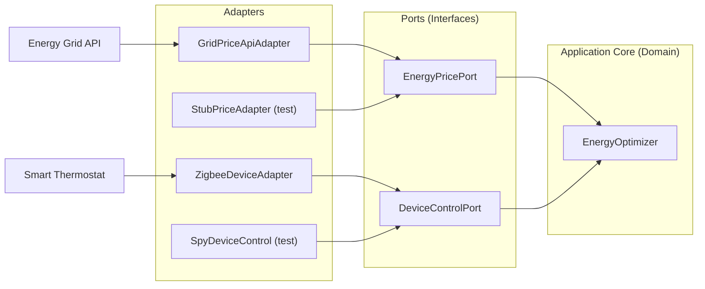

import RevealJS, { Slide } from '@site/src/components/RevealJS';
import Img from '@site/src/components/Img';
import QuoteSlide from '@site/src/components/QuoteSlide';
import PollSlide from '@site/src/components/PollSlide';

<RevealJS transition="slide">

{/* ============================================ */}
{/* COVER IMAGE */}
{/* ============================================ */}

<Slide>
  


<aside className="notes">
**Lecture overview:**
- **Total time:** ~55 minutes
- **Prerequisites:** Students understand coupling/cohesion (L7), SOLID principles (L8), test doubles (L15)
- **Connects to:** L6 (information hiding), L7 (coupling/cohesion), L8 (Dependency Inversion)

**Structure:**
- Testability as a design choice (~10 min)
- Hexagonal Architecture / Ports and Adapters (~20 min)
- Properties of good test suites (~10 min)
- Anti-patterns that kill testability (~15 min)

**Key theme:** Testability is not an afterthought—it's a first-class design concern. The same principles that reduce coupling also make code easier to test.

-> **Transition:** Let's start with the learning objectives...
</aside>

</Slide>

{/* ============================================ */}
{/* TITLE SLIDE */}
{/* ============================================ */}

<Slide>

# CS 3100: Program Design and Implementation II

## Lecture 16: Designing for Testability

<p style={{marginTop: '2em', fontSize: '0.8em', color: '#666'}}>
  ©2026 Jonathan Bell & Ellen Spertus, CC-BY-SA
</p>

<aside className="notes">
**Context from L15:**
- Students learned about test doubles: stubs, fakes, spies, and mocks
- They can substitute dependencies to test code in isolation
- But we glossed over: *why was ThermostatController so easy to test?*

**Key theme:** This lecture answers that question. Testability isn't an accident—it's a consequence of intentional design choices.

-> **Transition:** Here's what you'll be able to do after today...
</aside>
</Slide>

<Slide>

## Imposter Syndrome Reminder


<aside className="notes">
* This class is really advanced!
* I've never seen much of the stuff we cover, and I have a PhD.
* I don't teach stuff this advanced in my graduate OOP course.
</aside>

</Slide>

<Slide>

# Poll: How has this course made you feel?

<PollSlide
  choices={["stupid", "smart", "challenged", "scared", "proud", "overwhelmed",
  "knowledgeable", "humble"]}
/>

<aside className="notes">
* Poll should be multiple answer.
* All of these feelings are legitimate.
* Know that you are not alone.
</aside>

</Slide>

{/* ============================================ */}
{/* LEARNING OBJECTIVES */}
{/* ============================================ */}

<Slide>

## Learning Objectives

<p style={{fontSize: '0.85em', textAlign: 'left'}}>
After this lecture, you will be able to:
</p>

<ol style={{fontSize: '0.75em', textAlign: 'left'}}>
  <li>Evaluate the testability of a software module using the concepts of <strong>observability</strong> and <strong>controllability</strong></li>
  <li>Explain <strong>Hexagonal Architecture</strong> (Ports and Adapters) and its relationship to testability</li>
  <li>Describe properties of <strong>good test suites</strong>: fast, deterministic, independent, readable</li>
  <li>Recognize <strong>anti-patterns</strong> that lead to untestable code and how to fix them</li>
</ol>

<aside className="notes">
**Time allocation:**
- Objective 1: Testability fundamentals (~10 min)
- Objective 2: Hexagonal Architecture (~20 min)
- Objective 3: Good test suite properties (~10 min)
- Objective 4: Anti-patterns (~15 min)

**Connection to prior lectures:**
- These concepts build directly on information hiding (L6) and coupling/cohesion (L7)
- Testability is a *consequence* of following SOLID principles (L8)

-> **Transition:** Let's start by understanding what makes code testable...
</aside>

</Slide>

{/* ============================================ */}
{/* ARC 1: TESTABILITY AS DESIGN */}
{/* ============================================ */}

<Slide>

## Testability is a Design Choice

<p style={{fontSize: '0.9em', marginTop: '0.5em'}}>
  Some systems are more testable than others. Imagine testing a feature that requires:
</p>

<ul style={{fontSize: '0.8em'}}>
  <li>Setting up three different web services</li>
  <li>Creating five files in specific directories</li>
  <li>Putting a database in a specific state</li>
  <li>Then verifying all of those were modified correctly</li>
</ul>

<p style={{fontSize: '0.9em', marginTop: '1em', color: '#9370DB'}}>
  All of this is *doable*... but couldn't it be simpler?
</p>

<p style={{fontSize: '0.85em', marginTop: '0.5em'}}>
  <strong>Testability isn't luck—it's the result of design decisions.</strong>
</p>

<aside className="notes">
**The reality check:**
- Complex test setup is a sign of poor testability
- If tests are painful to write, they won't get written
- If tests are slow to run, they won't get run

**The key insight:**
- Testability is a quality attribute, like changeability
- You can design for it intentionally
- Or you can ignore it and pay the price later

-> **Transition:** Two properties determine testability...
</aside>

</Slide>

<Slide>

## Two Properties Determine Testability


<aside className="notes">
**The two key properties:**
1. **Observability:** Can we see what happened after running the code?
2. **Controllability:** Can we set up the exact scenario we want to test?

**Connection to L7 (coupling):**
- High coupling reduces controllability—dependencies are hardwired
- Information hiding (L6) can reduce observability if overdone
- Balance is key

-> **Transition:** Let's look at observability first...
</aside>

</Slide>

<Slide>

## Observability: Can We See What Happened?

<p style={{fontSize: '0.9em'}}>
  Observability is about how easily we can <strong>inspect the results</strong> of executing code.
</p>

```java
public class TemperatureLogger {
    public void logReading(String zoneId, double temperature) {
        String timestamp = LocalDateTime.now().toString();
        String logEntry = String.format("[%s] Zone %s: %.1f°F",
            timestamp, zoneId, temperature);
        System.out.println(logEntry);  // Where does this go?
    }
}
```

<div style={{fontSize: '0.75em', marginTop: '0.5em'}}>
  <p className="fragment" style={{color: '#f44336', margin: '0.25em 0'}}>❌ <code>void</code> return — nothing to assert on</p>
  <p className="fragment" style={{color: '#f44336', margin: '0.25em 0'}}>❌ <code>System.out.println</code> — output disappears into the ether</p>
  <p className="fragment" style={{color: '#FF9800', margin: '0.25em 0'}}>⚠️ <code>LocalDateTime.now()</code> — timestamp changes every run (controllability!)</p>
</div>

<aside className="notes">
Mention what String.format() does
**The problem:**
- Method returns `void`—nothing to assert on
- Output goes to `System.out`—need to capture stdout
- Uses `LocalDateTime.now()`—timestamp changes every run

**To verify correct behavior:**
- Must capture System.out (possible but awkward)
- Can't verify exact output because of timestamp

-> **Transition:** How can we make this more observable?
</aside>

</Slide>

<Slide>

## Improving Observability and Controllability

```java
public class TemperatureLogger {
    private final List<String> logEntries = new ArrayList<>();  // ① Store results
    private final Clock clock;  // ② Inject dependency

    public TemperatureLogger(Clock clock) {
        this.clock = clock;
    }

    public void logReading(String zoneId, double temperature) {
        String timestamp = Instant.now(clock).toString();  // ③ Use injected clock
        String logEntry = String.format("[%s] Zone %s: %.1f°F",
            timestamp, zoneId, temperature);
        logEntries.add(logEntry);
    }

    public List<String> getLogEntries() {  // ④ Expose for inspection
        return Collections.unmodifiableList(logEntries);
    }
}
```

<div style={{fontSize: '0.75em', marginTop: '0.5em'}}>
  <p className="fragment" style={{color: '#4CAF50', margin: '0.25em 0'}}>✓ ① Store entries in a list — we can inspect them later <strong>(observability)</strong></p>
  <p className="fragment" style={{color: '#2196F3', margin: '0.25em 0'}}>✓ ②③ Inject <code>Clock</code> — tests pass <code>Clock.fixed(...)</code> <strong>(controllability)</strong></p>
  <p className="fragment" style={{color: '#4CAF50', margin: '0.25em 0'}}>✓ ④ <code>getLogEntries()</code> — tests can assert on what was logged <strong>(observability)</strong></p>
</div>

<aside className="notes">
**What changed:**
- Store entries instead of just printing (observability)
- Expose read-only access via `getLogEntries()` (observability)
- Inject a `Clock` dependency (controllability via DIP!)

**This is Dependency Inversion from L8:**
- Instead of calling `LocalDateTime.now()` directly (hidden dependency)
- We inject a `Clock` that can be substituted in tests
- Production uses `Clock.systemDefaultZone()`
- Tests use `Clock.fixed(...)` to control time

**Other ways to increase observability:**
- Return values instead of void
- Fire events that tests can listen to
- Use a test-friendly logging framework

-> **Transition:** Now let's look at controllability in more detail...
</aside>

</Slide>

<Slide>

## Poll: Which change would MOST improve the testability of this method?

<PollSlide
  code={`
    public void processOrder(Order order) {
        double tax = order.getTotal() * 0.08;
        order.setTax(tax);
        database.save(order);
    }
  `}
  choices={["Make it private", "Make database a parameter", "Split it into multiple methods", "Add a getTax() method to Order"]}
/>

<aside className="notes">
* Making it private would make it harder to test.
* Making database a parameter would be an improvement.
* Splitting it into multiple methods would help a lot.
* Adding a getTax() method to Order would also be helpful.

</aside>

</Slide>

<Slide>

## One Possible Rewrite for Testability
```java
protected double calculateTax(double amount) {
    return amount * .08;
}

protected void addTaxToOrder(Order order) {
    order.setTax(calculateTax(order.getTotal()));
}

protected void processOrder(Order order, Database db) {
    addTaxToOrder(order);
    db.save(order); // save to parameter db
}

public void processOrder(Order order) {
    processOrder(order, database); // pass instance variable
}
```

</Slide>

<Slide>

## Controllability: Can We Set Up the Test Scenario?

<p style={{fontSize: '0.9em'}}>
  Controllability is about how easily we can <strong>put the system into a specific state</strong> for testing.
</p>

<div style={{display: 'grid', gridTemplateColumns: '1fr 1fr', gap: '1em', marginTop: '0.5em'}}>

<div>

**Low Controllability** ❌

```java
public double getCurrentPrice() {
    // Creates its own client!
    HttpClient client =
        HttpClient.newHttpClient();
    // Can't substitute test version
}

public boolean isOffPeakHours() {
    // Uses system clock!
    int hour = LocalTime.now()
                       .getHour();
    // Can't test 3 AM at 2 PM
}
```

</div>

<div>

**High Controllability** ✓

```java
private final EnergyPriceApi api;
private final Clock clock;

public EnergyPriceService(
    EnergyPriceApi api, Clock clock) {
    this.api = api;
    this.clock = clock;
}

public double getCurrentPrice() {
    return api.fetchCurrentPrice();
}

public boolean isOffPeakHours() {
    int hour = LocalTime.now(clock)
                       .getHour();
    return hour >= 22 || hour < 6;
}
```

</div>

</div>

<div style={{fontSize: '0.7em', marginTop: '0.5em'}}>
  <p className="fragment" style={{color: '#f44336', margin: '0.25em 0'}}>❌ Left: Dependencies created <em>inside</em> methods — can't substitute them</p>
  <p className="fragment" style={{color: '#4CAF50', margin: '0.25em 0'}}>✓ Right: Dependencies <em>injected</em> via constructor — tests provide stubs</p>
  <p className="fragment" style={{color: '#2196F3', margin: '0.25em 0'}}>💡 This is Dependency Inversion Principle (L8) in action!</p>
</div>

<aside className="notes">
**The key insight:**
- Dependencies that are *created* inside methods can't be controlled
- Dependencies that are *injected* can be substituted with test doubles

**Connection to L8:**
- This is the **Dependency Inversion Principle** in action!
- "Depend on abstractions, not concretions"

-> **Transition:** Let's see observability in a real example...
</aside>

</Slide>

<Slide>

## Observability: Return Values vs Side Effects

<div style={{ fontSize: '.8em' }}>
Consider testing a device health checker. How do we observe what happened?


```java

public class DeviceHealthChecker {
    private final DeviceRepository repo;

    public void checkDevice1(IoTDevice device) {
        HealthStatus status = assessHealth(device);
        device.setHealthStatus(status);  // Mutates input!
        repo.save(device);               // Side effect!
    }

    public HealthReport checkDevice2(IoTDevice device) {
        HealthStatus status = assessHealth(device);
        return new HealthReport(device.getId(), status);
    }
}
```
</div>
<p style={{fontSize: '0.8em', marginTop: '0.5em', color: '#9370DB'}}>
  The second version is easier to test: call the method, check the return value. No need to inspect mutated objects or mock repositories.
</p>

<aside className="notes">
**Why the second is more observable:**
- Returns a value we can assert on
- Doesn't mutate the input object
- Separates calculation from persistence

**Connection to L6 (immutability):**
- Immutable inputs = no hidden mutations
- Return values = explicit outputs
- Same principles that prevent bugs also enable testing

-> **Transition:** Let's talk about separating infrastructure from domain...
</aside>

</Slide>

<Slide>

## Separating Infrastructure from Domain

<p style={{fontSize: '0.85em'}}>
  The most important principle for testability: <strong>separate infrastructure from domain code</strong>.
</p>

<div style={{display: 'grid', gridTemplateColumns: '1fr 1fr', gap: '1.5em', marginTop: '0.5em', fontSize: '0.75em'}}>

<div>

**Domain Code**
- Business rules and calculations
- Decisions that define what your system does
- Pure functions, no side effects
- *Easy to test*

</div>

<div>

**Infrastructure Code**
- Databases, APIs, file systems
- Hardware, network, external services
- I/O, persistence, communication
- *Requires test doubles*

</div>

</div>

<p style={{fontSize: '0.85em', marginTop: '1em', color: '#9370DB'}}>
  When these are mixed together, testing becomes painful because you can't exercise business logic without involving infrastructure.
</p>

<aside className="notes">
**This is information hiding from L6 applied at the architecture level:**
- Just as a class hides its fields behind methods
- A well-designed system hides infrastructure behind abstractions
- The domain code doesn't know or care *how* data is stored

**The separation enables:**
- Testing domain logic without real infrastructure
- Changing infrastructure without affecting domain logic
- This is low coupling applied at the architecture level

-> **Transition:** This connects to a concept from domain modeling...
</aside>

</Slide>

<Slide>

## Poll: What makes this method hard to test?

<PollSlide
  code={`
public boolean shouldSendAlert(String deviceId) {
    double temp = new TemperatureSensor().readTemperature(deviceId);
    LocalTime now = LocalTime.now();
    return temp > 100.0 && now.getHour() >= 8 && now.getHour() <= 22;
}
  `}
  choices={["Its return type is a primitive", "It creates its dependencies internally",
  "It tests multiple conditions", "It has side effects"]}
/>

<aside className="notes">
* Nothing's wrong with returning a primitive.
* It is problematic that it creates its dependencies internally.
* It's fine that it has multiple conditions. That's needed to do its job.
* It does not have side effects.
</aside>

</Slide>

<Slide>

## Mind the Gap (Revisited from L12)


<p style={{fontSize: '0.85em'}}>
  In L12, we talked about keeping implementation close to the domain model.<br/><br/>
  <strong>The same principle applies to testability:</strong> the more infrastructure pollutes your domain, the harder testing becomes.
</p>

<aside className="notes">
**Connection to L12 (Domain Modeling):**
- The "representational gap" = distance between domain concepts and code
- Infrastructure (databases, APIs) creates distance from the domain
- Hexagonal Architecture keeps domain pure, infrastructure at the edges

**Why this matters for testing:**
- Small gap → domain logic is easy to test in isolation
- Large gap → can't reach domain logic without wading through infrastructure
- Same principle, two benefits: understandability AND testability

-> **Transition:** Let's see a concrete example of mixing concerns...
</aside>

</Slide>

<Slide>

## Mixed Concerns Make Testing Painful

```java
public class EnergyOptimizer {
    private static final double LOW_PRICE_THRESHOLD = 0.10;

    public void optimizeForPrice(String thermostatId) {
        // Infrastructure: API call to get price
        HttpClient client = HttpClient.newHttpClient();
        HttpRequest priceRequest = HttpRequest.newBuilder()
            .uri(URI.create("https://api.gridprices.com/current"))
            .header("Authorization", "Bearer " + System.getenv("API_KEY"))
            .build();
        HttpResponse<String> response =
            client.send(priceRequest, HttpResponse.BodyHandlers.ofString());
        double currentPrice = Double.parseDouble(response.body());

        // Domain: business logic (buried in the middle!)
        int powerLevel = currentPrice < LOW_PRICE_THRESHOLD ? 100 : 50;

        // Infrastructure: Zigbee protocol command
        ZigbeeGateway gateway = new ZigbeeGateway("192.168.1.100");
        gateway.connect();
        gateway.sendCommand(thermostatId, "SET_POWER", powerLevel);
        gateway.disconnect();
    }
}
```

<aside className="notes">
**The testing nightmare:**
- Need a real energy price API running (and an API key!)
- Need a real Zigbee gateway on the network
- The business rule (full power vs half power) is one line buried in the middle!

**The root cause:**
- Infrastructure and domain logic are mixed together
- Can't test the pricing decision without all the infrastructure

-> **Transition:** This pattern has a name and a solution...
</aside>

</Slide>

{/* ============================================ */}
{/* ARC 2: HEXAGONAL ARCHITECTURE (EXPANDED) */}
{/* ============================================ */}

<Slide>

## Hexagonal Architecture (Ports and Adapters)

<p style={{fontSize: '0.9em'}}>
  The solution is called <strong>Hexagonal Architecture</strong>, proposed by Alistair Cockburn (2005)
</p>

 threshold) reducePower()' and the caption 'Pure business rules. No technology.' Two ports sit on the hexagon's edges as electrical outlet sockets. On the left, EnergyPricePort has two adapters plugged in: GridPriceApiAdapter (blue, connecting to an Energy Grid API cloud) and StubPriceAdapter (green, labeled 'returns $0.35'). On the right, DeviceControlPort has ZigbeeDeviceAdapter (blue, connecting to a smart thermostat) and SpyDeviceControl (green, labeled 'records calls'). A callout reads 'Tests plug in here! Same ports, different adapters.' Blue adapters represent production; green adapters represent test doubles."
    prompt="Technical diagram: Hexagonal Architecture (Ports and Adapters) for IoT Smart Home.
CENTER - THE HEXAGON (warm golden glow):
A hexagonal shape labeled 'APPLICATION CORE' at top, 'Domain Logic' below. Inside the hexagon, show clean text:

'EnergyOptimizer'
'if (price > threshold) reducePower()'
'Pure business rules. No technology.'
EDGES - TWO PORTS (shown as electrical outlet sockets on left and right edges of hexagon):

Left edge: 'EnergyPricePort' with small label 'interface'
Right edge: 'DeviceControlPort' with small label 'interface'
OUTSIDE LEFT - EnergyPricePort connections:
Production adapter (solid blue cable): 'GridPriceApiAdapter' connects via blue plug to EnergyPricePort, cable runs to a cloud icon labeled 'Energy Grid API'
Test adapter (dashed green cable): 'StubPriceAdapter' with green plug near the same port, labeled 'returns $0.35'
OUTSIDE RIGHT - DeviceControlPort connections:
Production adapter (solid blue cable): 'ZigbeeDeviceAdapter' connects via blue plug to DeviceControlPort, cable runs to a smart thermostat icon
Test adapter (dashed green cable): 'SpyDeviceControl' with green plug near the same port, labeled 'records calls'
BOTTOM RIGHT CALLOUT BOX (green background): 'Tests plug in here! Same ports, different adapters.'
STYLE: Clean technical diagram, light gray background. Hexagon glows warm amber. Production adapters and cables in blue. Test adapters and cables in dashed green. External systems in gray. Electrical outlet/plug metaphor for ports and adapters. Uncluttered with plenty of whitespace."
/>

<aside className="notes">
**Context for students:**
- This is your first software architecture pattern! We'll cover more next week.
- We're starting with this one because testability is a critical design concern.
- Understanding how to structure code for testability will help when we dive into larger architectural patterns.

**The three layers:**
1. **Application Core (the hexagon):** Business logic, domain rules
2. **Ports:** Interfaces that define what the domain needs
3. **Adapters:** Technology-specific implementations

**Why "hexagonal"?**
- The shape emphasizes that there's no "top" or "bottom"
- All external systems connect through ports
- The domain doesn't know which adapters are plugged in

-> **Transition:** But wait—why a hexagon?
</aside>

</Slide>

<Slide>

## Why "Hexagonal"?

<p style={{fontSize: '0.85em'}}>
  The hexagon shape emphasizes a key idea: <strong>there's no "top" or "bottom"</strong>.
</p>

<div style={{fontSize: '0.8em', marginTop: '1em'}}>

**The insight:**
- Your business logic sits in the center
- Everything else (databases, APIs, hardware, UI) is *outside*
- Each external thing connects through a "port"
- The direction is always **inward** (toward domain) and **outward** (toward infrastructure)

</div>

<p style={{fontSize: '0.85em', marginTop: '1em', color: '#9370DB'}}>
  Tests are just another "outside" thing! They plug in through the same ports as real infrastructure.
</p>

<p style={{fontSize: '0.75em', marginTop: '0.5em', color: '#666'}}>
  (Ironically, we'll visualize this left-to-right in diagrams because that's easier to draw. The hexagon shape is conceptual, not literal.)
</p>

<aside className="notes">
**Note for students:**
- This is your first exposure to software architecture patterns!
- We're introducing hexagonal architecture now because it's essential for testability
- We'll dive deeper into architecture patterns next week
- For now, the key insight is: domain in the middle, everything else on the outside

**Why this matters for testability:**
- Tests plug into the same ports as real infrastructure
- A test that stubs `EnergyPricePort` is doing exactly what production does
- Production plugs in `GridPriceApiAdapter`
- Tests plug in `StubPriceAdapter`
- Both are valid adapters for the same port

-> **Transition:** Let's look at the three layers...
</aside>

</Slide>

<Slide>

## The Three Layers



<div style={{fontSize: '0.8em', marginTop: '0.5em'}}>
<div className="fragment">
  <strong>Core:</strong> Knows nothing about databases, APIs, or hardware—only the domain.<br/><br/>
</div>
<div className="fragment">
  <strong>Ports:</strong> Interfaces that describe *what* the domain needs, not *how* to get it.<br/><br/>
</div>
<div className="fragment">
  <strong>Adapters:</strong> Know how to talk to specific technologies.
</div>
</div>

<aside className="notes">
**The dependency direction:**
- Adapters depend on Ports
- Domain depends only on Ports (interfaces)
- Domain never depends on Adapters

**This is DIP from L8:**
- High-level modules (domain) don't depend on low-level modules (infrastructure)
- Both depend on abstractions (ports)

-> **Transition:** Let's see ports in code...
</aside>

</Slide>

<Slide>

## Ports Define What the Domain Needs

<p style={{fontSize: '0.85em'}}>
  Ports are <strong>interfaces</strong> defined by the domain, describing what it needs from the outside world.
</p>

```java
// Port: How we get current energy price (single method = can use lambda in tests!)
public interface EnergyPricePort {
    double getCurrentPricePerKWh();
}

// Port: How we control a device's power level
public interface DeviceControlPort {
    void setDevicePower(String deviceId, int powerPercent);
}
```

<p style={{fontSize: '0.8em', marginTop: '0.5em', color: '#9370DB'}}>
  Note: Functional interfaces can be implemented with lambdas in tests.
</p>

<aside className="notes">
**Key insight:**
- Ports are defined by the *domain*, not by technology
- The domain says "I need price data" not "I need HTTP calls"
- This is Dependency Inversion at the architecture level

**Design tip:**
- Single-method interfaces (functional interfaces) can be implemented with lambdas
- Makes test setup super concise: `EnergyPricePort stub = () -> 0.35;`
- If you need multiple methods, that's fine—just use a class instead of a lambda

**Connection to L8:**
- Ports are the "abstractions" that both sides depend on
- Domain depends on ports, adapters implement ports

-> **Transition:** The domain uses these ports...
</aside>

</Slide>

<Slide>

## The Domain Uses Ports, Not Technologies

```java
public class EnergyOptimizer {
    private static final double LOW_PRICE_THRESHOLD = 0.10;
    private final EnergyPricePort priceService;
    private final DeviceControlPort deviceControl;

    public EnergyOptimizer(EnergyPricePort priceService,
                           DeviceControlPort deviceControl) {
        this.priceService = priceService;
        this.deviceControl = deviceControl;
    }

    public void optimizeForPrice(String thermostatId) {
        double currentPrice = priceService.getCurrentPricePerKWh();

        if (currentPrice < LOW_PRICE_THRESHOLD) {
            // Energy is cheap — pre-heat the home
            deviceControl.setDevicePower(thermostatId, 100);
        } else {
            deviceControl.setDevicePower(thermostatId, 50);
        }
    }
}
```

<p style={{fontSize: '0.8em', marginTop: '0.5em', color: '#4CAF50'}}>
  ✓ No `HttpClient`, no `Connection`, no `DataSource`—only interfaces.
</p>

<aside className="notes">
**Notice:**
- No technology-specific code
- Only references to ports (interfaces)
- The domain doesn't know if it's talking to real APIs or test stubs

**This is testable by design:**
- Inject any implementation of the ports
- Test with in-memory stubs
- No infrastructure needed for domain tests

-> **Transition:** Adapters implement the ports...
</aside>

</Slide>

<Slide>

## Adapters Connect to Real Infrastructure

```java
// Adapter: Gets prices from a real API
public class GridPriceApiAdapter implements EnergyPricePort {
    private final HttpClient httpClient;
    private final String apiKey;

    @Override
    public double getCurrentPricePerKWh() {
        HttpRequest request = HttpRequest.newBuilder()
            .uri(URI.create("https://api.gridprices.com/current"))
            .header("Authorization", "Bearer " + apiKey)
            .build();
        // ... parse response and return price
    }
}

// Adapter: Controls devices via Zigbee protocol
public class ZigbeeDeviceAdapter implements DeviceControlPort {
    private final ZigbeeGateway gateway;

    @Override
    public void setDevicePower(String deviceId, int powerPercent) {
        // Zigbee protocol commands
    }
}
```

<p style={{fontSize: '0.8em', marginTop: '0.5em'}}>
  Adapters know the technology. Domain says *what* it needs; adapters know *how* to get it.
</p>

<aside className="notes">
**Adapters contain all the messy details:**
- HTTP clients, SQL queries, hardware protocols
- But they implement domain-defined interfaces

**The separation:**
- Domain is clean and testable
- Infrastructure knowledge is isolated in adapters

-> **Transition:** The magic happens in testing...
</aside>

</Slide>

<Slide>

## Testing with Hexagonal Architecture

```java
@Test
void runsThermostatAtFullPowerWhenPriceIsLow() {
    EnergyPricePort stubPrices = () -> 0.05;  // Well below $0.10 threshold
    SpyDeviceControl spyDevices = new SpyDeviceControl();

    EnergyOptimizer optimizer = new EnergyOptimizer(stubPrices, spyDevices);

    optimizer.optimizeForPrice("thermostat-1");

    assertEquals(100, spyDevices.getPowerLevel("thermostat-1"));
}

@Test
void reducesToHalfPowerWhenPriceIsHigh() {
    EnergyPricePort stubPrices = () -> 0.35;  // Above $0.10 threshold
    SpyDeviceControl spyDevices = new SpyDeviceControl();

    EnergyOptimizer optimizer = new EnergyOptimizer(stubPrices, spyDevices);

    optimizer.optimizeForPrice("thermostat-1");

    assertEquals(50, spyDevices.getPowerLevel("thermostat-1"));
}
```

<aside className="notes">
**Notice what's NOT here:**
- No database setup
- No HTTP mock server
- No waiting for network calls
- No flaky test failures from external services

**These tests are:**
- Fast (milliseconds)
- Deterministic (no external dependencies)
- Focused (tests one business rule)

-> **Transition:** How do you design this way?
</aside>

</Slide>

<Slide>

## Ports as a Design Technique

<p style={{fontSize: '0.9em'}}>
  When developing with Hexagonal Architecture, let ports <strong>emerge</strong> from the domain.
</p>

<ol style={{fontSize: '0.8em', marginTop: '1em'}}>
  <li>Start with the business logic you're trying to implement</li>
  <li>When you notice it needs something from the outside world, define an interface</li>
  <li>The interface describes <em>what you need</em>, not how to get it</li>
  <li>Implement adapters later (or use test doubles)</li>
</ol>

<p style={{fontSize: '0.85em', marginTop: '1em', color: '#9370DB'}}>
  This approach keeps you focused on the business problem without getting distracted by infrastructure details.
</p>

<aside className="notes">
**The process:**
- "I need current temperature" → `TemperatureSensor` interface
- "I need to store preferences" → `PreferencesRepository` interface
- The domain defines contracts; adapters fulfill them

**Benefits:**
- You think about what you need, not how to get it
- Infrastructure decisions can be deferred
- Different adapters for different environments (prod, test, dev)

-> **Transition:** How does this connect to coupling?
</aside>

</Slide>

<Slide>

## Hexagonal Architecture Minimizes Coupling

<p style={{fontSize: '0.85em'}}>
  Remember the coupling types from L7? Hexagonal Architecture addresses each one:
</p>

| Coupling Type | How Hexagonal Architecture Addresses It |
|---------------|----------------------------------------|
| **Data** | Ports pass only the data needed—`getCurrentPricePerKWh()` returns a `double`, not `HttpResponse` |
| **Stamp** | Domain types (`EnergyPreferences`) are defined by the domain, not dictated by external APIs |
| **Control** | Adapters don't pass flags that control domain logic |
| **Common** | No shared global state between domain and infrastructure |
| **Content** | Impossible—adapters can't access domain internals |

<aside className="notes">
**Consider what happens without this architecture:**
- If `EnergyOptimizer` directly used `HttpClient`:
  - Stamp coupling to `HttpResponse` objects
  - Common coupling if using shared `HttpClient` instance
  - Lower cohesion mixing HTTP concerns with business rules

**The key insight:**
- Low coupling = easy to substitute test doubles
- High cohesion = clear what each test should cover

-> **Transition:** Let's summarize the connection to prior lectures...
</aside>

</Slide>

<Slide>

## Hexagonal Architecture = Modularity at Scale

<p style={{fontSize: '0.85em'}}>
  This is the same modularity principle from L6 applied at the system level:
</p>

<table style={{fontSize: '0.75em', marginTop: '0.5em'}}>
<thead>
<tr><th>L6 Principle</th><th>Hexagonal Application</th></tr>
</thead>
<tbody>
<tr><td>Modules have well-defined interfaces</td><td>Ports are interfaces defined by domain</td></tr>
<tr><td>Implementation is hidden</td><td>Adapters hide technology details</td></tr>
<tr><td>Modules don't depend on other modules' internals</td><td>Domain doesn't know about adapters</td></tr>
</tbody>
</table>

<p style={{fontSize: '0.9em', marginTop: '1em', color: '#4CAF50', textAlign: 'center'}}>
  <strong>Low coupling and high cohesion don't just make code easier to change—they make it easier to test.</strong>
</p>

<aside className="notes">
**The connection:**
- Ports are modules with well-defined interfaces
- Adapters hide implementation details
- Domain is independent of infrastructure implementation

**This is why good design leads to testability:**
- Same principles, same benefits
- Changeability and testability are two sides of the same coin

-> **Transition:** Let's see how testability aligns with our design principles...
</aside>

</Slide>

<Slide>

## Testability Aligns with Good Design

<p style={{fontSize: '0.85em'}}>
  Testability isn't a separate concern—it's a natural consequence of following the principles from L6-L8:
</p>

<div style={{fontSize: '0.7em'}}>

| Design Principle | Testability Benefit |
|------------------|---------------------|
| **Low Coupling (L7)** | Dependencies can be substituted with test doubles |
| **High Cohesion (L7)** | Each class has a clear purpose → focused tests |
| **Information Hiding (L6)** | Implementation changes don't break tests |
| **Dependency Inversion (L8)** | Inject test doubles instead of real dependencies |
| **Single Responsibility (L8)** | Fewer behaviors to test per class |
| **Interface Segregation (L8)** | Smaller interfaces → simpler test doubles |

</div>

<p style={{fontSize: '0.85em', marginTop: '1em', color: '#9370DB', textAlign: 'center'}}>
  <strong>If your code is hard to test, it probably violates one of these principles.</strong>
</p>

<aside className="notes">
**The key insight:**
- Testability is an indicator of design quality
- Hard-to-test code often has:
  - High coupling (can't substitute dependencies)
  - Low cohesion (too many behaviors to test)
  - Hidden dependencies (surprising test setup requirements)

**Practical implication:**
- Use testability as a design feedback signal
- If tests are painful, consider refactoring

-> **Transition:** But there are also tensions to be aware of...
</aside>

</Slide>

<Slide>

## Testability Can Be in Tension with Other Goals

<p style={{fontSize: '0.85em'}}>
  Designing for testability sometimes involves tradeoffs:
</p>

<div style={{fontSize: '0.7em'}}>

| Goal | Tension with Testability |
|------|-------------------------|
| **Simplicity** | Testability may require more interfaces, abstractions, and indirection |
| **Encapsulation** | Observability sometimes requires exposing internal state |
| **Performance** | Dependency injection adds indirection |
| **Reduced Boilerplate** | Constructor injection requires more code than `new` |

</div>

<p style={{fontSize: '0.75em', marginTop: '1em'}}>
  These tensions are usually worth it for non-trivial systems, but not every class needs hexagonal architecture!
</p>

<aside className="notes">
**Practical guidance:**
- Not every class needs to be highly testable
- Simple data classes, value objects → direct instantiation is fine
- Complex business logic, external dependencies → invest in testability

**The balance:**
- Over-engineering: Interfaces for everything, mocks everywhere
- Under-engineering: Can't test critical business logic
- Sweet spot: Testable where it matters, simple where it doesn't

-> **Transition:** Let's talk about test suite properties...
</aside>

</Slide>

<Slide>

## When to Invest in Testability

<p style={{fontSize: '0.85em'}}>
  Not all code needs the same level of testability investment:
</p>

<div style={{display: 'grid', gridTemplateColumns: '1fr 1fr', gap: '1.5em', marginTop: '0.5em', fontSize: '0.75em'}}>

<div>

**High Investment**
- Complex business rules
- Code with many edge cases
- Integration points with external systems
- Code that changes frequently
- Code where bugs are expensive

</div>

<div>

**Low Investment**
- Simple data transfer objects
- Straightforward delegation
- Configuration and wiring code
- Stable, well-tested libraries
- Code that rarely changes

</div>

</div>

<p style={{fontSize: '0.85em', marginTop: '1em', color: '#9370DB', textAlign: 'center'}}>
  Apply hexagonal architecture where it provides value. Don't over-abstract simple code.
</p>

<aside className="notes">
**The pragmatic approach:**
- Testability has a cost (complexity, indirection)
- That cost should be justified by value
- Critical business logic: worth the investment
- Simple CRUD: probably not

**Connection to L7 (coupling):**
- We said "low coupling is good" but also "some coupling is necessary"
- Same with testability: "testable is good" but "over-abstracting is wasteful"

-> **Transition:** Let's talk about test suite properties...
</aside>

</Slide>

<Slide>

## Complexity


<aside className="notes">

</aside>

</Slide>

{/* ============================================ */}
{/* ARC 3: PROPERTIES OF GOOD TEST SUITES */}
{/* ============================================ */}

<Slide>

## Properties of Good Test Suites

<div style={{fontSize: '0.7em'}}>

| Property | What It Means | How Hexagonal Enables It |
|----------|---------------|-------------------------|
| **Fast** | Tests run in milliseconds | Domain tests have no I/O |
| **Deterministic** | Same result every time | Injectable `Clock`, `Random`, etc. |
| **Independent** | Tests don't affect each other | No shared infrastructure state |
| **Readable** | Tests document behavior | Given/When/Then structure |

</div>

<p style={{fontSize: '0.85em', marginTop: '1em'}}>
  If tests take 30 minutes, developers won't run them often.<br/>
  If tests take 30 seconds, they'll run them after every change.
</p>

<aside className="notes">
**Why these properties matter:**
- Fast: Developers run tests constantly
- Deterministic: Tests can be trusted
- Independent: Tests can run in any order
- Readable: Tests serve as documentation

**The test pyramid:**
- Many fast domain tests (base)
- Fewer integration tests (middle)
- Few end-to-end tests (top)

**The payoff:**
- Fast feedback catches bugs earlier
- Earlier bugs are cheaper to fix
- Developers stay in flow

-> **Transition:** Let's look at readability in more detail...
</aside>

</Slide>

<Slide>

## Readable Tests Tell a Story

```java
@Test
void reducesNonEssentialDevices_whenEnergyPriceExceedsThreshold() {
    // Given: energy price is high and user has set a threshold
    priceService.setCurrentPrice(0.35);  // Stub returns high price
    preferences.setHighPriceThreshold(0.25);
    devices.addDevice(new Device("living-room-light", false)); // non-essential
    devices.addDevice(new Device("refrigerator", true)); // essential

    // When: the optimizer runs
    optimizer.optimizeForPrice("home-123");

    // Then: only non-essential devices are reduced
    assertEquals(50, devices.getPowerLevel("living-room-light"));
    assertEquals(100, devices.getPowerLevel("refrigerator"));  // unchanged
}
```

<p style={{fontSize: '0.8em', marginTop: '0.5em', color: '#9370DB'}}>
  The test reads like a specification. No HTTP setup, no database seeds—just the business scenario.
</p>

<aside className="notes">
**Why this is readable:**
- Test name describes the behavior being tested
- Given/When/Then structure is immediately clear
- Stubs are simple: `setCurrentPrice(0.35)` vs configuring mock HTTP responses
- No infrastructure noise—just domain concepts

**Hexagonal enables this:**
- `priceService` is a stub implementing `EnergyPricePort`
- `devices` is a spy implementing `DeviceControlPort`
- The test focuses on *what* the optimizer does, not *how* it connects to infrastructure

**Compare to non-hexagonal:**
- Would need to mock HttpClient, set up response bodies, handle async
- The business rule gets buried in infrastructure setup

-> **Transition:** Now let's look at anti-patterns...
</aside>

</Slide>

{/* ============================================ */}
{/* ARC 4: ANTI-PATTERNS (EXPANDED) */}
{/* ============================================ */}

<Slide>

## Anti-Patterns That Kill Testability

<ul style={{fontSize: '0.85em'}}>
  <li><strong>Static methods</strong> — Can't be substituted with test doubles</li>
  <li><strong>Singletons</strong> — Global state that leaks between tests</li>
  <li><strong>Private methods wanting tests</strong> — Sign the class is doing too much</li>
  <li><strong>Complex boolean conditions</strong> — Require exponential test cases</li>
</ul>

<p style={{fontSize: '0.85em', marginTop: '1em', color: '#9370DB'}}>
  <strong>Common thread:</strong> All violate Dependency Inversion or Single Responsibility.
</p>

<aside className="notes">
**These patterns consistently make testing painful:**
1. Static methods can't be substituted
2. Singletons are globally accessible and can't be replaced
3. Hidden dependencies surprise you during testing
4. Complex booleans require too many test cases

**The common thread:**
- All violate Dependency Inversion
- All create invisible coupling
- All make substitution impossible

-> **Transition:** Let's examine each one in detail...
</aside>

</Slide>

<Slide>

## Anti-Pattern: Static Methods

<p style={{fontSize: '0.9em'}}>
  Static methods are <strong>globally accessible</strong>, which means you can't substitute test implementations.
</p>

<div style={{display: 'grid', gridTemplateColumns: '1fr 1fr', gap: '1em', marginTop: '0.5em'}}>

<div>

**Hard to test**

```java
public class ScheduledTask {
    public void runIfDue() {
        // Static call - can't stub!
        if (TimeUtils.isBusinessHours()) {
            doWork();
        }
    }
}
```

</div>

<div>

**Testable**

```java
public class ScheduledTask {
    private final BusinessHoursChecker
        hoursChecker;

    public ScheduledTask(
        BusinessHoursChecker hoursChecker) {
        this.hoursChecker = hoursChecker;
    }

    public void runIfDue() {
        if (hoursChecker.isBusinessHours()) {
            doWork();
        }
    }
}
```

</div>

</div>

<aside className="notes">
**The problem with static:**
- No object to replace
- No interface to implement
- Globally accessible = globally coupled

**The solution:**
- Wrap static calls in injectable interfaces
- Inject the dependency via constructor

-> **Transition:** What about unavoidable static methods like time?
</aside>

</Slide>

<Slide>

## Wrapping Static Methods

<p style={{fontSize: '0.8em'}}>
  Java provides `Clock` for time, but what about `System.getenv()` for environment variables?
</p>

<div style={{display: 'grid', gridTemplateColumns: '1fr 1fr', gap: '1em', marginTop: '0em'}}>

<div style={{ fontSize: '.8em' }}>

**The Problem**

```java
public class ApiClient {
  public void connect() {
    // Can't substitute this in tests!
    String key = System.getenv("API_KEY");
    // ...
  }
}
```

</div>

<div className="fragment" style={{ fontSize: '.7em' }}>

**The Solution: Wrap It**

```java
public interface EnvironmentProvider {
  String getEnv(String name);
}

public class ApiClient {
  private final EnvironmentProvider env;

  public void connect() {
    String key = env.getEnv("API_KEY");
  }
}
```

</div>

</div>

<div className="fragment">
<p style={{fontSize: '0.7em', marginTop: '0.5em', color: '#9370DB'}}>
  Even better: a higher-level `CredentialProvider` that hides <em>how</em> credentials are obtained:
</p>

```java
public interface CredentialProvider {
    String getApiKey();  // Domain concept, not "getEnv"
}
// Production: reads from env vars, secrets manager, or config file
// Tests: returns a fixed test key
```
</div>

<aside className="notes">
**The pattern:**
1. Identify the static call you can't control (`System.getenv`, `Math.random`, etc.)
2. Create an interface that wraps it (`EnvironmentProvider`)
3. Inject the interface instead of calling the static method directly
4. Production: `SystemEnvironment` calls the real static method
5. Tests: `TestEnvironment` returns controlled values

**Design consideration:**
- Don't always wrap 1:1 with the static API
- `CredentialProvider.getApiKey()` is better than `EnvironmentProvider.getEnv("API_KEY")`
- Higher-level abstractions hide implementation details (env var vs secrets manager vs config file)
- Think about what the *domain* needs, not what the *infrastructure* provides

**Common static dependencies to wrap:**
- Time → Java's `Clock` (built-in!)
- Random → wrap `Random` or use injectable seed
- Environment variables → `EnvironmentProvider` or domain-specific wrapper
- File system → `FileSystem` abstraction

-> **Transition:** Another common anti-pattern...
</aside>

</Slide>

<Slide>

## Anti-Pattern: Singletons

<p style={{fontSize: '0.9em'}}>
  Singletons are globally accessible state that can't be replaced per-test.
</p>

```java
// Singleton - only one instance, globally accessible
public class DatabaseConnection {
    private static DatabaseConnection instance;

    public static DatabaseConnection getInstance() {
        if (instance == null) {
            instance = new DatabaseConnection();
        }
        return instance;
    }
}

// Code that uses the singleton
public class UserService {
    public User findUser(String id) {
        // Can't substitute this for tests!
        return DatabaseConnection.getInstance().query("SELECT ...");
    }
}
```

<p style={{fontSize: '0.85em', marginTop: '0.5em', color: '#f44336'}}>
  ⚠ Every test uses the same connection. State leaks between tests.
</p>

<aside className="notes">
**Problems with singletons:**
- Global state leaks between tests
- Can't run tests in parallel
- Can't substitute test implementation

**The fix:**
- Inject the dependency instead
- Let a dependency injection framework manage lifecycle
- Each test can provide its own instance

-> **Transition:** Another smell...
</aside>

</Slide>

<Slide>

## Anti-Pattern: Private Methods Needing Testing

<p style={{fontSize: '0.85em'}}>
  If you feel the urge to test a private method directly, consider putting it in its own class.
</p>

<div style={{display: 'grid', gridTemplateColumns: '1fr 1fr', gap: '1em', marginTop: '0.1em'}}>

<div style={{fontSize: '0.65em'}}>

**Hard to test**

```java
public class DeviceHealthChecker {
  public HealthReport checkAll(
      List<IoTDevice> devices) {
    HealthReport report = new HealthReport();
    for (IoTDevice device : devices) {
      report.add(device.getId(),
        assessHealth(device));
    }
    return report;
  }

  private HealthStatus assessHealth(
    IoTDevice device) {
    // complex logic to test
  }
}
```

</div>

<div style={{fontSize: '0.65em'}}>

**Testable**

```java
// Extracted to its own class
public class DeviceHealthAssessor {
  public HealthStatus assess(
      double batteryPercent,
      int signalStrength,
      long minutesSinceContact) {
    if (minutesSinceContact > 60)
      return HealthStatus.OFFLINE;
    if (batteryPercent < 10)
      return HealthStatus.CRITICAL;
    if (batteryPercent < 25 ||
        signalStrength < 20)
      return HealthStatus.WARNING;
    return HealthStatus.HEALTHY;
  }
}
```

</div>

</div>

<p style={{fontSize: '0.7em', marginTop: '0.5em', color: '#9370DB'}}>
  Connection to SRP (L8): DeviceHealthChecker was doing two things. Health assessment deserves its own class.
</p>

<aside className="notes">
**The smell:**
- "I want to test this private method"
- Private methods should be tested through public API
- If that's hard, the class is doing too much

**The refactoring:**
- Extract to its own class
- Now it's public and testable
- Original class delegates

-> **Transition:** One more anti-pattern...
</aside>

</Slide>

<Slide>

## Not an Anti-Pattern: Integration Points

<p style={{fontSize: '0.8em'}}>
  Some classes coordinate multiple components. This isn't an anti-pattern—it's an <strong>integration point</strong>.
</p>

```java
// This class coordinates the home automation workflow
public class HomeAutomationController {
    public HomeAutomationController(
        SensorNetwork sensors,
        DeviceController devices,
        EnergyPriceService pricing,
        WeatherService weather,
        NotificationService notifier) { ... }

    public void optimizeHome(String homeId) {
        // Orchestrates all the components
    }
}
```

<p style={{fontSize: '0.8em', marginTop: '1em'}}>
  You can still mock the dependencies—but verify <strong>coordination behavior</strong>, not just "was this method called?"
</p>

<p style={{fontSize: '0.8em', color: '#9370DB'}}>
  Many dependencies ≠ bad design. Coordination is this class's job.
</p>

<aside className="notes">
**The insight:**
- Having many dependencies isn't automatically bad
- Some classes exist specifically to coordinate components
- That's their single responsibility!

**How to test integration points:**
- You can still use mocks for the dependencies
- But focus on testing coordination logic: "when price is high AND weather is cold, does it make the right tradeoff?"
- Don't just verify "priceService.getPrice() was called"—verify the actual behavior

**How to tell if it's a problem:**
- Is the class's job to coordinate? → Fine, test coordination behavior
- Is the class doing unrelated things (coordinate AND calculate AND format)? → Low cohesion, split it

-> **Transition:** One more anti-pattern...
</aside>

</Slide>

<Slide>

## Anti-Pattern: Complex Boolean Conditions

<p style={{fontSize: '0.9em'}}>
  Complex conditions require many test cases to cover all branches.
</p>

<div style={{display: 'grid', gridTemplateColumns: '1fr 1fr', gap: '1em', marginTop: '0.1em'}}>

<div>

**Hard to test**

```java
// How many tests to cover this?
if ((device.isOnline() &&
     device.batteryLevel() > 20) ||
    (device.isPowered() &&
     !device.isInSleepMode()) ||
    (device.isEssential() &&
     emergencyMode)) {
    // ...
}
```

</div>

<div>

**Testable**

```java
private boolean canReceiveCommands(
    IoTDevice device) {
  return hasSufficientBattery(device)
      || hasReliablePower(device)
      || isRequiredInEmergency(device);
}

private boolean hasSufficientBattery(
        IoTDevice device) {
  return device.isOnline() &&
         device.batteryLevel() > 20;
}
```

</div>

</div>

<p style={{fontSize: '0.8em', marginTop: '0.5em', color: '#4CAF50'}}>
  Breaking conditions into named methods spreads out the complexity, increasing testability and readability.
</p>

<aside className="notes">
**The problem:**
- One giant boolean = exponential test cases
- Hard to know what each branch means
- Easy to miss edge cases

**The fix:**
- Extract to named predicates
- Test each predicate in isolation
- Main condition is clear and readable

-> **Transition:** Let's summarize...
</aside>

</Slide>

<Slide>

## Anti-Pattern Summary

<div style={{fontSize: '0.75em'}}>

| Anti-Pattern | Problem | Solution |
|--------------|---------|----------|
| **Static methods** | Can't substitute | Wrap in injectable interface |
| **Singletons** | Global state, can't replace | Inject dependency instead |
| **Private methods wanting tests** | Class doing too much | Extract to own class |
| **Complex booleans** | Too many branches | Extract named predicates |

</div>


<aside className="notes">
**The pattern:**
- All anti-patterns create hidden, uncontrollable dependencies
- All make substitution difficult or impossible

**The solution:**
- Follow DIP: depend on abstractions
- Inject dependencies
- Keep classes focused (SRP)

**Remember:**
- Not everything needs unit testing
- Recognize integration points and test them appropriately

-> **Transition:** Key takeaways...
</aside>

</Slide>

<Slide>

## Summary

<ul style={{fontSize: '0.75em'}}>
  <li><strong>Testability is a design choice</strong>—not an afterthought</li>
  <li><strong>Observability</strong> = can we see what happened? (return values, accessible state)</li>
  <li><strong>Controllability</strong> = can we set up the scenario? (dependency injection)</li>
  <li><strong>Hexagonal Architecture</strong> separates domain logic from infrastructure</li>
  <li><strong>Ports</strong> are interfaces defined by domain; <strong>Adapters</strong> implement them</li>
  <li>Good tests are <strong>fast, deterministic, independent, and readable</strong></li>
  <li><strong>Avoid</strong> static methods, singletons, hidden dependencies, tight coupling</li>
</ul>

<p style={{fontSize: '0.9em', marginTop: '1em', color: '#9370DB', textAlign: 'center'}}>
  <strong>The same principles that make code easy to change make it easy to test.</strong>
</p>

<aside className="notes">
**Connection to prior lectures:**
- Information hiding (L6) → isolate infrastructure behind interfaces
- Coupling/cohesion (L7) → low coupling enables test double substitution
- SOLID (L8) → Dependency Inversion is key to testability

**For assignments:**
- Design for testability from the start
- Inject dependencies instead of creating them
- Keep domain logic pure and simple

**Questions?**
</aside>

</Slide>

<Slide>

## Bonus Slide


</Slide>

</RevealJS>
