import RevealJS, { Slide } from '@site/src/components/RevealJS';
import Img from '@site/src/components/Img';
import PollSlide from '@site/src/components/PollSlide';

<RevealJS transition="slide">

{/* ============================================ */}
{/* COVER IMAGE */}
{/* ============================================ */}

<Slide>
  

<aside className="notes">
**Lecture overview:**
- **Total time:** ~50 minutes (tight!)
- **Prerequisites:** Students built Builder, Factory methods, registries in A1-A4; SOLID principles from L8
- **Connects to:** Assignment 5 (service layer architecture), L19 (Thinking Architecturally)

**Structure:**
- Review creation patterns you've built (~5 min)
- Evaluate tradeoffs in creation patterns (~15 min)
- Dependency Injection as the fix for Singleton (~10 min)
- Service Locator vs. DI (~10 min)
- Scaling up: from objects to systems (~10 min)

**Key theme:** The patterns you already know don't just apply to objects — they scale to entire systems. The shift is from "how do I create this object?" to "how do I wire up this whole system?"

→ **Transition:** Let's start with the title...
</aside>

</Slide>

{/* ============================================ */}
{/* TITLE SLIDE */}
{/* ============================================ */}

<Slide>

# CS 3100: Program Design and Implementation II

## Lecture 17: From Code Patterns to Architecture Patterns

<p style={{marginTop: '2em', fontSize: '0.8em', color: '#666'}}>
  ©2026 Jonathan Bell & Ellen Spertus, CC-BY-SA
</p>

<aside className="notes">
**Context:**
- Students have built RecipeBuilder, used StandardConversions factories, created ConversionRegistry
- They know SOLID principles and information hiding from L6 and L8
- This lecture formalizes what they've done and shows where it leads

**Key message:** "What you learned, formalized — and where it leads."

→ **Transition:** Here's what you'll be able to do after today...
</aside>

</Slide>

{/* ============================================ */}
{/* LEARNING OBJECTIVES */}
{/* ============================================ */}

<Slide>

## Learning Objectives

<p style={{fontSize: '0.85em', textAlign: 'left'}}>
After this lecture, you will be able to:
</p>

<ol style={{fontSize: '0.75em', textAlign: 'left'}}>
  <li>Explain when to use <strong>static factory methods</strong> vs. <strong>builders</strong> vs. plain constructors</li>
  <li>Implement the Builder pattern for classes with many optional parameters</li>
  <li>Explain why <strong>Singleton is an anti-pattern</strong> and how <strong>Dependency Injection</strong> solves its problems</li>
  <li>Compare <strong>Service Locator</strong> and <strong>Dependency Injection</strong> as dependency management strategies</li>
  <li>Recognize how code-level creation patterns manifest at <strong>larger architectural scales</strong></li>
</ol>

<aside className="notes">
**Time allocation:**
- Objective 1-2: Creation patterns in depth (~15 min)
- Objective 3: Singleton → DI (~10 min) — builds on L16
- Objective 4: Service Locator vs DI (~10 min)
- Objective 5: Scaling up to systems (~15 min)

**Connection to L16:**
- L16 introduced DI for testability
- Today: DI as a creation pattern, Singleton as anti-pattern
- Same techniques, different perspective

**Why this matters:**
- A5 requires a service layer architecture
- These patterns are the building blocks

→ **Transition:** Let's start by reviewing what you've already built...
</aside>

</Slide>

{/* ============================================ */}
{/* INTRODUCTORY POLL */}
{/* ============================================ */}

<Slide>

## Poll: Which of the following statements about constructors are true?

<PollSlide
 choices={[
    "There can be only one constructor in a class",
    "Constructors must have the same name as the class",
    "Constructors must always create new objects -- no recycling",
    "Constructors must always return an instance of the enclosing class, not a subclass"]}
/>

<aside className="notes">
* Multi-answer Poll
* Go over the options
* For the last, ask if the Ingredient constructor could return a MeasuredIngredient
</aside>

</Slide>

{/* ============================================ */}
{/* ARC 1: REVIEW CREATION PATTERNS (5 min) */}
{/* ============================================ */}

<Slide>

## Creation Patterns Are Information Hiding for Construction

<p style={{fontSize: '0.9em', marginTop: '0.5em'}}>
In Lecture 6, we learned to hide implementation details behind interfaces.
</p>

<p style={{fontSize: '0.9em', marginTop: '0.5em'}}>
Creation patterns hide <strong>how objects are created</strong> — the constructors, the validation, the wiring of dependencies — behind factory methods and builders.
</p>

<p style={{fontSize: '0.9em', marginTop: '1em', fontWeight: 'bold', color: '#9370DB'}}>
The client says "give me a Recipe" without knowing the 15 steps required to construct one correctly.
</p>

<aside className="notes">
**Key insight:** This is the same principle (information hiding) applied to a different phase (construction vs. usage).

**Why this framing matters:** It sets up the rest of the lecture. Every pattern we discuss today is about hiding some complexity behind a clean boundary.

→ **Transition:** But first, an important caveat about these patterns...
</aside>

</Slide>

<Slide>

## These Are Java Patterns (Mostly)

<p style={{fontSize: '0.85em'}}>
The patterns in this lecture exist because <strong>Java's language design creates specific problems</strong>:
</p>

<div style={{fontSize: '0.72em', marginTop: '0.5em'}}>

| Java Limitation | Pattern That Works Around It |
|-----------------|------------------------------|
| Constructors can't have meaningful names | Static factory methods |
| No named parameters or default values | Builder pattern |
| No module-level singletons | Singleton pattern (and its problems) |
| No null safety in type system (until recently) | Constructor injection for guarantees |
| Mutable by default | Builder → immutable objects |

</div>

<p style={{fontSize: '0.85em', marginTop: '0.5em', fontWeight: 'bold', color: '#9370DB'}}>
Other languages solve these problems differently. We'll note alternatives as we go.
</p>

<aside className="notes">
**Why this matters:**
- Don't assume every language needs these patterns
- Understand the PROBLEM the pattern solves, not just the pattern
- When you use TypeScript, Kotlin, Swift, Python — different idioms apply

**Examples we'll see:**
- TypeScript/Python: Named parameters eliminate need for Builder
- Kotlin: `object` keyword provides safe singletons
- Module systems: ES modules, Python modules are natural singletons

**The meta-lesson:**
- Patterns are responses to language constraints
- Change the language, change the patterns
- "Design Patterns" (1994) was written for C++ and Smalltalk — Java adapted them

→ **Transition:** With that context, let's dive in...
</aside>

</Slide>

{/* ============================================ */}
{/* ARC 2: TRADEOFFS IN CREATION PATTERNS (15 min) */}
{/* ============================================ */}

<Slide>

## What's Wrong With Constructors?

<p style={{fontSize: '0.9em', marginTop: '0.5em'}}>
Constructors have limitations that become painful as classes evolve:
</p>

```java
// Constructor with many parameters — what do these values mean?
ConversionRule rule = new ConversionRule("cups", "mL", 236.588, true, false, "volume");
//                                        ???     ???   ???      ???   ???    ???
```

<div className="fragment">
<div style={{fontSize: '0.75em', marginTop: '1em'}}>

| Constructor Limitation | Why It Hurts |
|------------------------|--------------|
| **No meaningful names** | `new Foo(true, false, 42)` — what do these mean? |
| **Can't return cached instances** | Every `new` creates a new object — why does this matter? |
| **Can't return subtypes** | `new ArrayList()` must return `ArrayList`, not a specialized subtype |
| **All share the same name** | Can't have two constructors with same parameter types |

</div>
</div>

<aside className="notes">
**The problem isn't constructors themselves:**
- For simple classes, constructors are fine
- Problems emerge with optional parameters, caching needs, or returning different types

**Historical context:**
- Java added static factory methods as a convention (not language feature)
- Other languages have named constructors, default arguments, etc.

→ **Transition:** Let's dig into that caching point...
</aside>

</Slide>

<Slide>

## Why Does "Every `new` Creates a New Object" Matter?

<p style={{fontSize: '0.85em'}}>
Every time you call `new`, Java allocates space on the heap for a new object:
</p>

```java
// Three separate objects in memory, even though they represent the SAME conversion
ConversionRule r1 = new ConversionRule("cups", "mL", 236.588);
ConversionRule r2 = new ConversionRule("cups", "mL", 236.588);
ConversionRule r3 = new ConversionRule("cups", "mL", 236.588);
// r1 != r2 != r3, but they hold identical data!
```

<div style={{fontSize: '0.75em', marginTop: '0.5em'}}>

| Concern | Why It Matters |
|---------|----------------|
| **Memory** | Each object takes heap space. If you create millions of identical `ConversionRule` objects, that's millions of redundant allocations. |
| **Garbage collection** | More objects = more work for GC = potential pauses |
| **Identity vs. equality** | `r1 == r2` is `false` even though `r1.equals(r2)` is `true`. Can cause bugs if you accidentally use `==`. |
| **Immutability benefit lost** | If the object is immutable, there's *no reason* to have multiple copies of identical data! |

</div>

<aside className="notes">
**The key insight:**
- For MUTABLE objects, you NEED separate instances (each can change independently)
- For IMMUTABLE objects, identical values could share ONE instance safely

**Real-world examples:**
- `Integer.valueOf(42)` returns cached instance for small integers
- `String` literals are interned (same string = same object)
- `Boolean.TRUE` and `Boolean.FALSE` are shared constants

→ **Transition:** Static factory methods can return cached instances...
</aside>

</Slide>

<Slide>


</Slide>

<Slide>

## Factory Methods Enable Instance Caching

<p style={{fontSize: '0.85em'}}>
For immutable objects, a factory method can return the <strong>same instance</strong> for identical values:
</p>

<div style={{display: 'grid', gridTemplateColumns: '1fr 1fr', gap: '1em', fontSize: '0.6em'}}>

<div>

**Constructor: always allocates**

```java
// Each call = new heap allocation
Integer a = new Integer(42);  // deprecated!
Integer b = new Integer(42);
Integer c = new Integer(42);

System.out.println(a == b);  // false
System.out.println(b == c);  // false
// Three objects in memory
```

</div>

<div>

**Factory method: can cache**

```java
// Factory method returns cached instance
Integer a = Integer.valueOf(42);
Integer b = Integer.valueOf(42);
Integer c = Integer.valueOf(42);

System.out.println(a == b);  // true!
System.out.println(b == c);  // true!
// ONE object in memory, three references
```

</div>

</div>

<p style={{fontSize: '0.8em', marginTop: '0.5em', color: '#4CAF50'}}>
✓ <code>Integer.valueOf()</code> caches integers from -128 to 127. Same value = same object.
</p>

<p style={{fontSize: '0.75em', marginTop: '0.25em', color: '#666'}}>
This is why <code>new Integer()</code> is deprecated since Java 9 — <code>valueOf()</code> is strictly better.
</p>

<aside className="notes">
**Why this works:**
- Integer is immutable — you can't change the value inside
- If two references point to the same object, no problem!
- Factory method decides: cache hit? Return existing. Cache miss? Create new.

**Other examples in Java:**
- `Boolean.valueOf(true)` always returns `Boolean.TRUE`
- `String.intern()` returns canonical instance
- `EnumSet.of()` can return optimized implementations

**Your ConversionRule could do this too:**
- If "cups → mL" is requested 1000 times, return the SAME object
- Immutable, so safe to share

→ **Transition:** Now let's see the full factory method pattern...
</aside>

</Slide>

<Slide>

## Integer.valueOf() Implementation

```java
    /**
     * Returns an {@code Integer} instance representing the specified
     * {@code int} value.  If a new {@code Integer} instance is not
     * required, this method should generally be used in preference to
     * the constructor {@link #Integer(int)}, as this method is likely
     * to yield significantly better space and time performance by
     * caching frequently requested values.
     *
     * This method will always cache values in the range -128 to 127,
     * inclusive, and may cache other values outside of this range.
     *
     * @param  i an {@code int} value.
     * @return an {@code Integer} instance representing {@code i}.
     * @since  1.5
     */
    public static Integer valueOf(int i) {
        if (i >= IntegerCache.low && i <= IntegerCache.high)
            return IntegerCache.cache[i + (-IntegerCache.low)];
        return new Integer(i);
    }
```


<aside className="notes">

</aside>

</Slide>

<Slide>

## Static Factory Methods Add Names and Flexibility

<p style={{fontSize: '0.9em', fontWeight: 'bold', color: '#9370DB'}}>
  Effective Java Item 1: "Consider static factory methods instead of constructors"
</p>

<div style={{display: 'grid', gridTemplateColumns: '1fr 1fr', gap: '1em', fontSize: '0.6em'}}>

<div>

**Constructor: caller must know details**

```java
// What does "true" mean? What's 236.588?
ConversionRule rule = new ConversionRule(
    "cups", "mL", 236.588, true);

// Must create new instance every time
ConversionRule rule2 = new ConversionRule(
    "cups", "mL", 236.588, true);
// rule != rule2 (different objects)
```

</div>

<div>

**Factory method: intent is clear**

```java
// Named method explains what we're getting
ConversionRule rule = StandardConversions
    .cupsToMilliliters();

// Or lookup with semantic meaning
ConversionRule rule2 = StandardConversions
    .getRule("cups", "mL");
// Can return cached instance!
```

</div>

</div>

<div className="fragment">
<p style={{fontSize: '0.8em', marginTop: '0.75em'}}>
<strong>Common naming conventions:</strong>
</p>

<ul style={{fontSize: '0.7em'}}>
  <li><code>of()</code> — concise factory: <code>List.of("a", "b", "c")</code>, <code>EnumSet.of(RED, BLUE)</code></li>
  <li><code>from()</code> — type conversion: <code>Date.from(instant)</code>, <code>Path.from(uri)</code></li>
  <li><code>valueOf()</code> — parsing/conversion: <code>Integer.valueOf("42")</code>, <code>Boolean.valueOf(true)</code></li>
  <li><code>getInstance()</code> / <code>newInstance()</code> — may cache or create: <code>Calendar.getInstance()</code></li>
  <li><code>getTypeName()</code> / <code>newTypeName()</code> — factory in different class: <code>Files.newBufferedReader(path)</code></li>
</ul>
</div>

<aside className="notes">
**This is Bloch Item 1 — arguably the most practical item in the book.**

**Key insight:**
- The name carries semantic meaning
- `cupsToMilliliters()` is self-documenting
- `new ConversionRule("cups", "mL", 236.588, true)` requires reading docs

**From your assignments:**
- `StandardConversions.getRule()` hides how rules are stored
- Could be computed, cached, loaded from file — caller doesn't care

→ **Transition:** Let's see a complete example...
</aside>

</Slide>

<Slide>

## Example: Bidirectional Conversion Rules

<div style={{ fontSize: '.6em' }}>
```java
public class ConversionRule {
    private final String fromUnit;
    private final String toUnit;
    private final double factor;
    private final boolean bidirectional;

    // Private constructor — forces use of factory methods
    private ConversionRule(String from, String to, double factor, boolean bidir) {
        this.fromUnit = from; this.toUnit = to;
        this.factor = factor; this.bidirectional = bidir;
    }

    // Factory methods with meaningful names
    public static ConversionRule oneWay(String from, String to, double factor) {
        return new ConversionRule(from, to, factor, false);
    }

    public static ConversionRule bidirectional(String from, String to, double factor) {
        return new ConversionRule(from, to, factor, true);
    }
}
```

```java
// old (4 arguments)
ConversionRule cupsToMilliliters = new ConversionRule("cups", "mL", 236.588, true);

// new (clearer, with fewer arguments)
ConversionRule cupsToMilliliters = ConversionRule.bidirectional("cups", "mL", 236.588);
```
</div>

<aside className="notes">
**What this enables:**
1. **Private constructor** — caller MUST use factory methods
2. **Named methods** — `oneWay()` vs `bidirectional()` is obvious
3. **Caching** — `cached()` returns same instance for same parameters
4. **Future flexibility** — can return subtypes later without changing callers

**Compare usage:**
- Constructor: `new ConversionRule("cups", "mL", 236.588, true)` — what's `true`?
- Factory: `ConversionRule.bidirectional("cups", "mL", 236.588)` — clear!

**Language note:**
- Swift has *named constructors*: `ConversionRule(from: "cups", to: "mL", bidirectional: true)`
- Dart has *named constructors*: `ConversionRule.bidirectional("cups", "mL")`
- Java's workaround (static factory methods) achieves similar readability

→ **Transition:** Let's compare readability...
</aside>

</Slide>

<Slide>

## Example: Cached Conversion Rules

<div style={{ fontSize: '.6em' }}>
```java
public class ConversionRule {
    private final String fromUnit;
    private final String toUnit;
    private final double factor;

    // Private constructor — forces use of factory methods
    // For simplicity, we are not supporting bidirectional rules.
    private ConversionRule(String from, String to, double factor) {
        this.fromUnit = from;
        this.toUnit = to;
        this.factor = factor;
    }

    // Cache coversion rules for reuse.
    private static final Map<String, ConversionRule> cachedRules = new ConcurrentHashMap<>();

    public static ConversionRule cached(String from, String to, double factor) {
        String key = from + "->" + to + "@" + factor;
        // If a cached rule is present, return it; otherwise, create and cache one.
        return cachedRules.computeIfAbsent(key,
            k -> new ConversionRule(from, to, factor, true));
    }
}
```
</div>

<aside className="notes">
**What this enables:**
1. **Private constructor** — caller MUST use factory methods
2. **Named methods** — `oneWay()` vs `bidirectional()` is obvious
3. **Caching** — `cached()` returns same instance for same parameters
4. **Future flexibility** — can return subtypes later without changing callers

**Compare usage:**
- Constructor: `new ConversionRule("cups", "mL", 236.588, true)` — what's `true`?
- Factory: `ConversionRule.bidirectional("cups", "mL", 236.588)` — clear!

**Language note:**
- Swift has *named constructors*: `ConversionRule(from: "cups", to: "mL", bidirectional: true)`
- Dart has *named constructors*: `ConversionRule.bidirectional("cups", "mL")`
- Java's workaround (static factory methods) achieves similar readability

→ **Transition:** Let's compare readability...
</aside>

</Slide>

<Slide>

## The Telescoping Constructor Problem

<p style={{fontSize: '0.9em', fontWeight: 'bold', color: '#9370DB'}}>
  EJ Item 2: "Consider a builder when faced with many constructor parameters"
</p>

<div style={{ fontSize: '.65em' }}>
```java
public class Recipe {
  // Most general constructor
  Recipe(String name, List<Ingredient> ingredients, List<String> instructions, List<String> notes,
      String source, boolean isVegan) { ... }

  Recipe(String name) { this(name, List.of(), List.of(), List.of(), null, false);

  Recipe(String name, List<Ingredient> ingredients) {
    this(name, ingredients, List.of(), List.of(), null, false);
  }

  Recipe(String name, List<Ingredient> ingredients, List<String> instructions) { ... }
  Recipe(String name, List<Ingredient> ingredients, List<String> instructions, List<String> notes) { ... }
  Recipe(String name, List<Ingredient> ingredients, List<String> instructions, List<String> notes,
      String source) { ... }

  // Which constructor do I call if I want name + notes but no ingredients?
}
```
</div>
<p style={{fontSize: '0.8em', marginTop: '0.5em', color: '#f44336'}}>
❌ Combinatorial explosion: every combination of optional parameters needs its own constructor!
</p>

<aside className="notes">
**The problem:**
- "Telescoping" constructors -- each with one more parameter than the previous one
- 6 optional parameters = up to 64 constructor combinations
- Which constructor to call if you want `name` + `notes` but no `ingredients`?
- Hard to read: `new Recipe("Pasta", null, null, notes, null, false)` — what are those nulls?

**This is where Builder shines.**

→ **Transition:** Builder solves this elegantly...
</aside>

</Slide>

<Slide>


</Slide>

<Slide>

## The Builder Pattern: Fluent, Readable, Extensible

```java
Recipe recipe = new RecipeBuilder("Pasta Carbonara")
    .addIngredient(new Ingredient("spaghetti", 400, "g"))
    .addIngredient(new Ingredient("guanciale", 200, "g"))
    .addInstruction("Boil pasta in salted water")
    .addInstruction("Crisp guanciale in a cold pan")
    .addNote("Do NOT add cream. This is not alfredo.")
    .source("Kenji López-Alt")
    .build();
```

<div style={{fontSize: '0.8em', marginTop: '0.5em', color: '#4CAF50'}}>
✓ Each method call is self-documenting. Set only what you need. Order doesn't matter.

✓ Each method both mutates and returns the RecipeBuilder.
</div>

<div className="fragment" style={{fontSize: '0.75em', marginTop: '1em'}}>

| | Telescoping Constructors | Builder Pattern |
|---|---|---|
| **Adding new optional field** | Add more constructor overloads | Add one method to builder |
| **Readability at call site** | `new Recipe("X", null, null, notes, null, false)` | `.addNote("...").build()` |
| **Can accumulate values** | No — must pass complete list | Yes — `addIngredient()` multiple times |

</div>

<aside className="notes">
**You built this in HW2!**
- `RecipeBuilder` accumulates ingredients and instructions
- `build()` validates and creates immutable `Recipe`

**Key benefits:**
- Fluent API reads like natural language
- Adding new optional parameter = add one method, no existing code changes
- Builder can validate before building

→ **Transition:** Let's see how the builder is implemented...
</aside>

</Slide>

<Slide>

## Inside the Builder: The Implementation
<div style={{ fontSize: '.65em' }}>
```java
public class RecipeBuilder {
    private final String name;  // Required
    private final List<Ingredient> ingredients = new ArrayList<>();  // Accumulated
    private final List<String> instructions = new ArrayList<>();
    private final List<String> notes = new ArrayList<>();
    private String source = null;  // Optional

    public RecipeBuilder(String name) {
        this.name = name;
    }

    public RecipeBuilder addIngredient(Ingredient ing) {
        this.ingredients.add(ing);
        return this;  // Return 'this' enables method chaining
    }

    public RecipeBuilder addNote(String note) { this.notes.add(note); return this; }
    public RecipeBuilder source(String source) { this.source = source; return this; }
    public RecipeBuilder addInstruction(String step) { ... }

    public Recipe build() {
        if (ingredients.isEmpty()) throw new IllegalStateException("Recipe needs ingredients");
        // Create immutable Recipe with defensive copies
        return new Recipe(name, List.copyOf(ingredients), List.copyOf(instructions),
                          List.copyOf(notes), source);
    }
}
```
</div>

<aside className="notes">
**Key implementation details:**
1. **Required parameters** in constructor (`name`)
2. **Optional/accumulated** parameters via methods
3. **Return `this`** for method chaining (fluent API)
4. **`build()` validates** and creates immutable object

**The `Recipe` constructor can be package-private:**
- Only `RecipeBuilder` calls it
- Forces clients to use the builder
- Builder owns the construction logic

→ **Transition:** But wait — do other languages need Builder?
</aside>

</Slide>

<Slide>

## Language Comparison: Do You Need Builder? (Sidebar)

<p style={{fontSize: '0.85em'}}>
The telescoping constructor problem is a <strong>Java problem</strong>. Other languages have built-in solutions:
</p>

<div style={{display: 'grid', gridTemplateColumns: '1fr 1fr', gap: '1em', fontSize: '0.58em', marginTop: '0.5em'}}>

<div>

**TypeScript: Object with optional properties**

```typescript
interface RecipeOptions {
  name: string;                    // required
  ingredients?: Ingredient[];      // optional
  instructions?: string[];
  notes?: string[];
  source?: string;
}

// Call with named properties — no builder needed!
const recipe = createRecipe({
  name: "Pasta Carbonara",
  notes: ["No cream!"],
  source: "Kenji López-Alt"
  // ingredients, instructions use defaults
});
```

</div>

<div>

**Kotlin: Default parameters + named arguments**

```kotlin
data class Recipe(
    val name: String,                    // required
    val ingredients: List<Ingredient> = emptyList(),
    val instructions: List<String> = emptyList(),
    val notes: List<String> = emptyList(),
    val source: String? = null
)

// Call with named arguments — no builder needed!
val recipe = Recipe(
    name = "Pasta Carbonara",
    notes = listOf("No cream!"),
    source = "Kenji López-Alt"
)
```

</div>

</div>

<p style={{fontSize: '0.8em', marginTop: '0.5em', color: '#FF9800'}}>
⚠ In Java, we use Builder to simulate what these languages provide natively.<br/>
►These languages specify nullable types with question marks.
</p>

<aside className="notes">
**The key insight:**
- Builder pattern compensates for Java's lack of named/default parameters
- TypeScript, Kotlin, Python, Swift, C# all have better solutions
- Same PROBLEM (many optional parameters), different SOLUTIONS

**When Builder is STILL useful (even in these languages):**
- Validation logic that runs at build time
- Accumulation patterns (adding items to a list)
- When you want to separate construction from representation

**The meta-lesson:**
- Don't cargo-cult patterns from Java into other languages
- Understand the problem, then use the language's idiomatic solution

→ **Transition:** Now let's look at choosing between patterns in Java...
</aside>

</Slide>

<Slide>

## Choosing the Right Creation Pattern

<div style={{fontSize: '0.7em', marginTop: '0.5em'}}>

| Pattern | Use When | Example |
|---------|----------|---------|
| **Plain Constructor** | Simple class, few required parameters | `new Point(x, y)` |
| **Static Factory** | Need naming, caching, or subtype flexibility | `ConversionRule.bidirectional(...)` |
| **Builder** | Many parameters, optional fields, accumulation | `RecipeBuilder.forDish(...).build()` |
| **DI (not Singleton!)** | Need one shared instance that's still testable | `new Service(injectedDep)` |

</div>

<aside className="notes">
**The decision process:**
1. Can a simple constructor work? Use it!
2. Need naming or caching? Factory method
3. Many optional parameters? Builder
4. Shared instance? Inject it, don't Singleton it

**Key insight:**
- All patterns serve information hiding
- Choose based on the *problem*, not pattern familiarity

→ **Transition:** Now for the anti-pattern we need to discuss...
</aside>

</Slide>

<Slide>

## The Singleton Pattern: Convenient But Dangerous
<div style={{ fontSize: '.8em' }}>

<p style={{fontWeight: 'bold'}}>
  Effective Java Items 3-4: Singleton
</p>

<p style={{fontSize: '0.85em', marginTop: '0.5em'}}>
Singleton ensures a class has exactly one instance with global access:
</p>

```java
public class ConversionRegistry {
    // Eager initialization — instance created at class load
    private static final ConversionRegistry INSTANCE = new ConversionRegistry();

    private ConversionRegistry() {
        // Private constructor prevents external instantiation
        loadStandardConversions();
    }

    public static ConversionRegistry getInstance() {
        return INSTANCE;  // Always returns the same instance
    }

    public ConversionRule getRule(String from, String to) { /* ... */ }
}
```

<p style={{fontSize: '0.8em', marginTop: '0.5em'}}>
<strong>The appeal:</strong> Simple access. No need to pass the registry around. Just call <code>getInstance()</code> anywhere.
</p>
</div>

<aside className="notes">
**Why Singleton exists:**
- Expensive resources (database connections, caches)
- Configuration that should be shared
- Coordination (logging, metrics)

**You might recognize this from L16:**
- We showed Singleton as a testability anti-pattern
- Now we'll see the full picture of why it's problematic
- And why DI is the preferred creation pattern

→ **Transition:** Let's see Singleton in use and why it's tempting...
</aside>

</Slide>

<Slide>

## Singleton Seems Convenient...
<div style={{ fontSize: '.85em' }}>

```java
// Any code anywhere can access the registry — no passing required!
public class RecipeParser {
    public Recipe parse(Path file) {
        Recipe recipe = parseFromFile(file);
        // Just call getInstance() — easy!
        ConversionRegistry.getInstance().validate(recipe);
        return recipe;
    }
}

public class RecipeExporter {
    public void export(Recipe recipe, String format) {
        // Same pattern — getInstance() whenever you need it
        ConversionRegistry registry = ConversionRegistry.getInstance();
        Recipe converted = recipe.convertAll(registry);
        writeToFormat(converted, format);
    }
}
```

<p >
No constructor parameters, no field declarations, no wiring. What's not to love?
</p>

<div className="fragment">
<p style={{marginTop: '0.5em', color: '#f44336'}}>
<strong>Everything.</strong> This convenience hides serious problems.
</p>
</div>
</div>
<aside className="notes">
**The seduction of Singleton:**
- No need to thread dependencies through constructors
- "Just call `getInstance()` when you need it"
- Seems simpler at first

**But look at those classes:**
- What do they depend on? You have to read every line to know
- Can you test them with a different registry? Not easily
- What if two tests need different registries? Global state conflict

→ **Transition:** You already know one of these problems from L16...
</aside>

</Slide>

<Slide>

## Singleton Creates Three Problems (Sound Familiar?)

<div style={{fontSize: '0.75em'}}>

1. **Hidden dependencies**: Not visible in constructor — discovery requires reading every line (L7: common coupling!)
2. **Untestable**: Can't substitute a test double (L16: this is why we inject dependencies!)
3. **Global state**: Every caller shares the same mutable instance — changes ripple unpredictably

</div>

<p style={{fontSize: '0.85em', marginTop: '0.5em', color: '#9370DB'}}>
<strong>L16 showed #2 from a testability lens. Today we see the full picture: Singleton is an anti-pattern for object creation.</strong>
</p>

<aside className="notes">
**Connect to prior lectures:**
- L7: Singleton creates common coupling (shared global state)
- L16: Singleton hurts testability (can't substitute test doubles)
- L17: We now see the full creation pattern perspective

**The question becomes:**
- How do we get "one shared instance" without these problems?
- Answer: Don't make the object responsible for its own uniqueness!

→ **Transition:** Here's how to fix it...
</aside>

</Slide>


{/* ============================================ */}
{/* ARC 3: DEPENDENCY INJECTION AS CREATION PATTERN (10 min) */}
{/* ============================================ */}

<Slide>

## You Already Know the Fix: Dependency Injection

<p style={{fontSize: '0.9em', marginTop: '0.5em'}}>
In L16, we learned that <strong>Dependency Injection improves testability</strong> by making dependencies substitutable.
</p>

<p style={{fontSize: '0.9em', marginTop: '0.5em'}}>
Now we see it from a different angle: <strong>DI is also a creation pattern</strong> — it determines <em>how objects get their collaborators</em>.
</p>

<p style={{fontSize: '0.85em', marginTop: '1em', fontWeight: 'bold', color: '#9370DB'}}>
Same technique, two perspectives: testability enabler AND creation pattern.
</p>

<aside className="notes">
**Connect to L16:**
- In L16, we said "inject dependencies so you can substitute test doubles"
- Today: "inject dependencies because it's a better way to create object graphs"
- Both are true! DI serves multiple purposes.

**The creation perspective:**
- Singleton: the object reaches out to get what it needs
- DI: the caller hands in what the object needs
- This changes *who controls object creation*

→ **Transition:** Let's see the comparison side-by-side...
</aside>

</Slide>

<Slide>

## Singleton vs. DI: Who Controls Creation?

<p style={{fontSize: '0.9em', marginTop: '0.5em'}}>
The fundamental difference is <strong>control over dependencies</strong>.
</p>

<div style={{display: 'grid', gridTemplateColumns: '1fr 1fr', gap: '1em', fontSize: '0.55em'}}>

<div>

**Singleton: object reaches out**

```java
public class RecipeConverter {
  // No hint this depends on ConversionRegistry,
  // which is hardcoded in the convert() method.


  public Recipe convert(Recipe recipe, String toUnit) {
    ConversionRule rule = ConversionRegistry.getInstance()
            .getRule(recipe.getUnit(), toUnit);
    return recipe.scaleTo(rule);
  }
}
```

<p style={{color: '#f44336', marginTop: '0.5em'}}>
❌ Caller has no control over which registry is used
</p>

</div>

<div>

**DI: caller provides dependencies**

```java
public class RecipeConverter {
  private final ConversionRegistry registry;

  // Caller decides which registry
  public RecipeConverter(ConversionRegistry registry) {
    this.registry = registry;
  }

  public Recipe convert(Recipe recipe, String toUnit) {
    ConversionRule rule = registry
        .getRule(recipe.getUnit(), toUnit);
    return recipe.scaleTo(rule);
  }
}
```

<p style={{color: '#4CAF50', marginTop: '0.5em'}}>
✓ Caller controls creation and wiring
</p>

</div>

</div>

<aside className="notes">
**Connection to what you've done:**
- When you passed `ConversionRegistry` to `Recipe.scaleToIngredient()`, that was DI!
- You chose which registry to pass — production or test

**The creation perspective:**
- Singleton: "I'll get my own dependencies, thank you"
- DI: "You tell me what to use, I'll use it"

**This is "Inversion of Control"** — the object no longer controls its own dependencies.

→ **Transition:** This solves all three Singleton problems...
</aside>

</Slide>

<Slide>

## DI Solves All Three Singleton Problems (L16 Recap)

```java
// Production: wire up with real implementations
ConversionRegistry realRegistry = new StandardConversionRegistry();
RecipeConverter converter = new RecipeConverter(realRegistry);

// Test: swap in a test double — exactly what we did in L16!
ConversionRegistry stubRegistry = (from, to) -> new ConversionRule("cups", "mL", 236.588);
RecipeConverter testConverter = new RecipeConverter(stubRegistry);
```

<div style={{fontSize: '0.8em', marginTop: '1em'}}>

| Problem | Singleton | Dependency Injection |
|---------|-----------|---------------------|
| **Hidden dependencies** | Buried in implementation | Visible in constructor signature |
| **Testability** | Can't substitute | Inject stubs/mocks freely (L15-16!) |
| **Global state** | Shared mutable state | Each context gets its own instance |

</div>

<p style={{fontSize: '0.8em', marginTop: '0.5em', color: '#9370DB'}}>
  You proved this works in your tests! Now we formalize it as a <strong>creation pattern</strong>.
</p>

<aside className="notes">
**Connect to L15-16:**
- L15: Test doubles (stubs, fakes, mocks)
- L16: Design for testability, inject dependencies
- L17: DI as a creation pattern, not just for testing

**The key insight:**
- DI isn't just for testing—it's how you structure object creation
- Testing is a *consequence* of good creation patterns

→ **Transition:** There are different ways to inject...
</aside>

</Slide>

<Slide>

## Three Ways to Inject Dependencies

<div style={{display: 'grid', gridTemplateColumns: '1fr 1fr 1fr', gap: '0.5em', fontSize: '0.6em'}}>

<div>

**Constructor injection**

```java
public class ImportService {
  private final LibraryService lib;

  public ImportService(
      LibraryService lib) {
    this.lib = lib;
  }
}
```

Dependencies clear, immutable, always valid.

</div>

<div>

**Setter injection**

```java
public class ImportService {
  private LibraryService lib;

  public void setLibrary(
      LibraryService lib) {
    this.lib = lib;
  }
}
```

For optional dependencies. Object might be in invalid state.

</div>

<div>

**Field injection**

```java
public class ImportService {
  @Inject
  private LibraryService lib;

  // No constructor needed!
  // Framework sets field directly
  // using reflection
}
```

Convenient. But is it good?

</div>

</div>

<p style={{fontSize: '0.85em', marginTop: '0.5em'}}>
All three let you swap implementations. But they differ in <strong>what invariants they preserve</strong>.
</p>

<aside className="notes">
**Overview:**
- Constructor: Dependencies set once, at creation, can't change
- Setter: Dependencies can be set (and re-set) anytime
- Field: Framework magically sets private fields using reflection

**The key question:**
- What state can the object be in?
- Can it be null? Partially initialized? Changed unexpectedly?

→ **Transition:** Why not just use field injection?
</aside>

</Slide>

<Slide>

## Poll: Which type of injection makes it hardest to enforce invariants?

<PollSlide
    choices={[
        "Constructor injection",
        "Setter injection",
        "Field injection"]}
    />

<aside className="notes">

</aside>

</Slide>

<Slide>

## Comparing Dependency Injection Approaches

<div style={{fontSize: '0.85em'}}>

| Aspect | Constructor | Setter | Field |
|--------|------------|--------|-------|
| **Immutability** | ✅ Dependencies are final | ❌ Mutable after construction | ❌ Mutable after construction |
| **Required dependencies** | ✅ Clear at construction | ⚠️ May be optional | ⚠️ Unclear if required |
| **Invariants** | ✅ Enforced at construction | ❌ Hard to enforce | ❌ Hard to enforce |
| **Testability** | ✅ Easy to substitute | ✅ Easy to substitute | ⚠️ Requires reflection/framework |
| **Object validity** | ✅ Always valid after construction | ❌ May be invalid temporarily | ❌ May be invalid temporarily |

**Winner for enforcing invariants: Constructor injection** — object is guaranteed valid from the moment it's created.

</div>

<aside className="notes">
**Key points:**
- Constructor injection enforces that all dependencies are provided before the object can be used
- Setter/field injection allow objects to exist in partially-initialized states
- Constructor injection aligns with "design by contract" — preconditions met at construction
- Setter injection useful for optional dependencies or circular references (rare cases)
- Field injection convenient but couples you to framework and makes testing harder

**Transition:** Now let's see how these patterns work in practice...
</aside>

</Slide>

<Slide>

## Field Injection Violates Encapsulation


<aside className="notes">

</aside>

</Slide>

<Slide>

## Constructor Injection: Explicit, Immutable, Always Valid

```java
public class ImportService {
    private final LibraryService library;        // final = immutable
    private final ConversionRegistry conversions;
    private final ValidationService validator;

    // Dependencies are VISIBLE, REQUIRED, and set ONCE
    // Non-null by default in our codebase; use @Nullable to mark optional
    public ImportService(LibraryService library,
                         ConversionRegistry conversions,
                         ValidationService validator) {
        this.library = library;
        this.conversions = conversions;
        this.validator = validator;
    }

    public void importRecipe(Path file) {
        Recipe recipe = parse(file);
        validator.validate(recipe);     // Can't be null — guaranteed!
        conversions.normalize(recipe);
        library.save(recipe);
    }
}
```

<p style={{fontSize: '0.8em', marginTop: '0.5em', color: '#4CAF50'}}>
✓ Object is <strong>always valid</strong> after construction. Dependencies are <strong>documented in the API</strong>. Testing is straightforward.
</p>

<aside className="notes">
**What we gain:**
- `final` fields — can't be changed after construction
- Non-null by default — static analysis catches null errors
- No "partially initialized" state
- Constructor IS the dependency documentation

**Testing is simple:**
```java
var service = new ImportService(mockLib, mockConv, mockVal);
service.importRecipe(testFile);
verify(mockLib).save(any());
```

No framework needed. No reflection. No magic.

→ **Transition:** Spring now recommends constructor injection...
</aside>

</Slide>

{/* ============================================ */}
{/* ARC 4: SERVICE LOCATOR VS DI (10 min) */}
{/* ============================================ */}

<Slide>

## The Problem: What If You Don't Know the Implementation?

<p style={{fontSize: '0.85em'}}>
With DI, the caller must know which implementation to inject:
</p>

```java
// Someone has to decide: which LibraryService implementation?
LibraryService library = new InMemoryLibraryService();  // or DatabaseLibraryService?
ImportService importer = new ImportService(library, conversions);
```

<p style={{fontSize: '0.85em', marginTop: '0.5em'}}>
But what if the caller <strong>shouldn't</strong> know? What if:
</p>

<ul style={{fontSize: '0.8em'}}>
  <li>The implementation is chosen at <strong>runtime</strong> based on configuration?</li>
  <li>The implementation is provided by a <strong>plugin</strong> loaded dynamically?</li>
  <li>You want two modules to be <strong>completely independent</strong> — neither knows about the other?</li>
</ul>

<aside className="notes">
**The motivation:**
- DI requires someone to know about both the interface AND the implementation
- What if we want TRUE decoupling — the code that uses LibraryService knows NOTHING about InMemoryLibraryService?

**Real examples:**
- IDE plugins (IntelliJ, VS Code) — core doesn't know what plugins exist
- Database drivers (JDBC) — application doesn't know which driver is loaded
- Logging frameworks (SLF4J) — code logs to an interface, implementation chosen at deployment

→ **Transition:** Service Locator addresses this...
</aside>

</Slide>

<Slide>

## Motivating Example: Recipe Import Plugins

<p style={{fontSize: '0.85em'}}>
Imagine your recipe app supports importing from different sources. Users can install plugins:
</p>

```java
// The core application defines an interface
public interface RecipeImporter {
    boolean canHandle(Path file);
    Recipe importFrom(Path file);
}

// Plugins implement this interface — but the core app doesn't know they exist!
// In a JAR file: plugins/json-importer.jar
public class JsonRecipeImporter implements RecipeImporter { ... }

// In another JAR: plugins/paprika-importer.jar
public class PaprikaImporter implements RecipeImporter { ... }

// In yet another: plugins/gemini-importer.jar — uses an LLM!
public class GeminiImporter implements RecipeImporter { ... }
```

<p style={{fontSize: '0.85em', marginTop: '0.5em', fontWeight: 'bold', color: '#9370DB'}}>
How does the app use these importers if it doesn't know they exist at compile time?
</p>

<aside className="notes">
**The problem:**
- Core app knows the `RecipeImporter` interface
- Plugins implement `RecipeImporter`
- But core app can't `new JsonRecipeImporter()` — it doesn't have that class!

**This is real:**
- IntelliJ plugins
- Browser extensions
- Game mods

→ **Transition:** Service Locator enables this plugin discovery...
</aside>

</Slide>

<Slide>

## Service Locator: Find Implementations at Runtime

<p style={{fontSize: '0.85em'}}>
A Service Locator is a registry that maps interfaces to implementations:
</p>

```java
public class ServiceLocator {
    private static final Map<Class<?>, List<Object>> services = new HashMap<>();

    // Register an implementation (called at startup or by plugin loader)
    public static <T> void register(Class<T> type, T instance) {
        services.computeIfAbsent(type, k -> new ArrayList<>()).add(instance);
    }

    // Find all implementations of an interface
    public static <T> List<T> getAll(Class<T> type) {
        return (List<T>) services.getOrDefault(type, List.of());
    }

    // Find a single implementation
    public static <T> T get(Class<T> type) {
        List<T> impls = getAll(type);
        if (impls.isEmpty()) throw new IllegalStateException("No " + type.getSimpleName());
        return impls.get(0);
    }
}
```

<aside className="notes">
**What this enables:**
- Core app asks "give me all RecipeImporters"
- Service Locator returns whatever plugins registered themselves
- Core app never imports or references plugin classes

**The decoupling is TOTAL:**
- Core app depends on interface only
- Plugins depend on interface only
- Neither knows the other exists!

→ **Transition:** Let's see how the core app uses this...
</aside>

</Slide>


<Slide>


</Slide>

<Slide>

## Using Service Locator for Plugin Discovery

```java
// At application startup: plugins register themselves
public class JsonRecipeImporterPlugin {
    static {
        // Plugin registers itself when its JAR is loaded
        ServiceLocator.register(RecipeImporter.class, new JsonRecipeImporter());
    }
}

// Core application: discovers and uses plugins without knowing they exist
public class ImportService {
    public Recipe importRecipe(Path file) {
        // Ask Service Locator for all registered importers
        List<RecipeImporter> importers = ServiceLocator.getAll(RecipeImporter.class);

        for (RecipeImporter importer : importers) {
            if (importer.canHandle(file)) {
                return importer.importFrom(file);
            }
        }
        throw new UnsupportedOperationException("No importer for: " + file);
    }
}
```

<p style={{fontSize: '0.8em', marginTop: '0.5em', color: '#4CAF50'}}>
✓ New plugins can be added by dropping a JAR file — no recompilation of core app!
</p>

<aside className="notes">
**This is powerful:**
- Add new importer? Just drop a JAR in the plugins folder
- Remove an importer? Delete the JAR
- Core app never changes

**Real-world examples:**
- Java's `ServiceLoader` (built into JDK)
- OSGi frameworks (Eclipse)
- Spring's component scanning

→ **Transition:** Let's analyze this with our coupling vocabulary...
</aside>

</Slide>

<Slide>

## Configuring the Service Locator for Testss

<div>

```java
// You must configure the registry for every test
@BeforeEach
void setUp() {
  ServiceLocator.clear();
  ServiceLocator.register(RecipeImporter.class, mockJsonImporter);
  ServiceLocator.register(RecipeImporter.class, mockPaprikaImporter);
}

@AfterEach
void tearDown() {
  ServiceLocator.clear();
  // Clean up to avoid test pollution
}
```

<p style={{color: '#FF9800', fontSize: '0.9em'}}>
⚠️ Manual setup required for each test<br/>
⚠️ Global state must be managed carefully
</p>

</div>

<aside className="notes">
**Key insight:**
- Service Locator is just a global registry — it has no awareness of context
- In production, plugins self-register via static initializers
- In tests, YOU become responsible for setup and teardown

**Common pitfalls:**
- Forgetting to clear() between tests → test pollution
- Forgetting to register a dependency → runtime failures in tests
- Order dependencies between tests if registry isn't properly isolated

**Contrast with DI:**
- DI: Just pass different objects to constructor in each test
- Service Locator: Must manage global state across all tests

**This is why DI is preferred for application code** — testing is simpler because there's no global state to manage.

→ **Transition:** Let's look at how the Service Locator is configured for tests.
</aside>

</Slide>

<Slide>

## Review of Types of Coupling (L7)

<p style={{fontSize: '0.75em', marginTop: '0.5em'}}>
* **Data coupling** shares common types, such as `String`
* Stamp coupling shares user-defined types that might change
* Control Coupling happens when a parameter to a method controls the flow of execution
* **Common Coupling** involves multiple modules sharing a common data structure without proper encapsulation
* **Content Coupling** violates encapsulation (using reflection)
</p>

</Slide>

<Slide>

## Service Locator Through the Coupling Lens

<div style={{ fontSize: '.75em' }}>

<p>
Remember our coupling types from L7? DI and Service Locator make <strong>different coupling tradeoffs</strong>:
</p>

<div style={{display: 'grid', gridTemplateColumns: '1fr 1fr', fontSize: '.8em', gap: '1.5em', marginTop: '1em'}}>

<div style={{padding: '1em', border: '2px solid #4CAF50', borderRadius: '8px'}}>

**Dependency Injection: Data Coupling**
```java
// Caller KNOWS the implementation
new ImportService(libraryService);
```

<ul style={{marginLeft: '-1em'}}>
<li>Caller passes data (the dependency) to constructor</li>
<li><strong>Visible:</strong> Constructor documents what's needed</li>
<li><strong>Testable:</strong> Pass mocks directly</li>
<li><strong>Limitation:</strong> Caller must have a reference to pass</li>
</ul>

</div>

<div style={{padding: '1em', border: '2px solid #FF9800', borderRadius: '8px'}}>

**Service Locator: Common Coupling**
```java
// Caller knows NOTHING about implementation
ServiceLocator.get(LibraryService.class);
```

<ul style={{marginLeft: '-1em'}}>
<li>All code shares the global registry</li>
<li><strong>Hidden:</strong> Dependencies discovered at runtime</li>
<li><strong>Test setup:</strong> Must configure global registry</li>
<li><strong>Power:</strong> Modules never reference each other</li>
</ul>

</div>

</div>

<p style={{fontSize: '0.85em', marginTop: '1em', fontWeight: 'bold', color: '#9370DB'}}>
Data coupling (DI) is usually preferable. Common coupling (Service Locator) is the price you pay for true runtime extensibility.
</p>
</div>

<aside className="notes">
**The key tradeoff:**
- DI: Data coupling — caller passes what's needed, visible and testable
- Service Locator: Common coupling — shared global state, hidden but powerful

**Cohesion note:**
- ServiceLocator class itself: High cohesion (one job: manage registry)
- Classes using it: Lower cohesion (business logic + dependency lookup)
- DI keeps "finding dependencies" OUT of classes (in composition root) — higher cohesion

**When common coupling is worth it:**
- Plugin systems (unknown implementations at compile time)
- Framework internals
- Driver loading (JDBC, SLF4J)

**For most application code:** Data coupling (DI) is better — explicit, testable, refactorable.

→ **Transition:** Dependencies tell the story...
</aside>

</Slide>

<Slide>

## DI vs. Service Locator: The Dependencies Tell the Story

<div style={{display: 'grid', gridTemplateColumns: '1fr 1fr', gap: '1em', fontSize: '0.65em'}}>

<div>

**Dependency Injection**

```java
public class ImportService {
    private final LibraryService library;
    private final ConversionRegistry conv;

    // Dependencies ARE the constructor
    public ImportService(
            LibraryService library,
            ConversionRegistry conv) {
        this.library = library;
        this.conv = conv;
    }

    public void importRecipe(Path file) {
        Recipe recipe = parseRecipe(file);
        library.addRecipe(recipe);
        conv.validate(recipe);
    }
}
```

<p style={{color: '#4CAF50'}}>Dependencies explicit in signature</p>

</div>

<div>

**Service Locator**

```java
public class ImportService {
    // What does this depend on?
    // You must read every line to know!

    public void importRecipe(Path file) {
        Recipe recipe = parseRecipe(file);
        ServiceLocator
            .get(LibraryService.class)
            .addRecipe(recipe);
        ServiceLocator
            .get(ConversionRegistry.class)
            .validate(recipe);
    }
}
```

<p style={{color: '#FF9800'}}>Dependencies discovered at runtime</p>

</div>

</div>

<aside className="notes">
**The critical difference:**
- DI: Constructor is a complete dependency manifest
- Service Locator: Dependencies hidden in method bodies

**IDE tooling test:**
- DI: "Find Usages" on `LibraryService` shows all classes that depend on it
- Service Locator: Dependency is a string/class lookup — invisible to static analysis

**Decision guide:**
- **DI:** Application code (99%), explicit dependencies, easy testing
- **Service Locator:** Plugin architecture, framework code, true module independence

→ **Transition:** Now let's see how these patterns scale to systems...
</aside>

</Slide>

<Slide>

## Which is Better? It Depends...


<aside className="notes">

</aside>

</Slide>

{/* ============================================ */}
{/* ARC 5: FROM OBJECTS TO SYSTEMS (10 min) */}
{/* ============================================ */}

<Slide>

## Assignment 5 Preview

<div style={{ fontSize: '.7em' }}>
```java
public class ImportService {
    public void importRecipe(Path file) {
        Recipe recipe = parseRecipe(file);
        LibraryService.getInstance().addRecipe(recipe);  // Hidden dependency!
    }
}
```

<div className="fragment">

```java
public class ImportService {
    private final LibraryService library;
    private final ConversionRegistry conversions;

    public ImportService(LibraryService library, ConversionRegistry conversions) {
        this.library = library;
        this.conversions = conversions;
    }

    public void importRecipe(Path file) {
        Recipe recipe = parseRecipe(file);
        library.addRecipe(recipe);  // Dependency is explicit
    }
}
```

<p style={{marginTop: '0.5em', color: '#4CAF50'}}>
  ✓ Dependencies visible. Tests can inject mocks. Implementations swappable.
</p>
</div>
</div>

<aside className="notes">
**This is the A5 preview.**

**Services need to collaborate:**
- `ImportService` needs `LibraryService` to store imported recipes
- Both might need `ConversionRegistry` for unit conversion
- The CLI controller needs all three services

**Same problem, bigger scale:** Hidden dependencies are even worse when they're between entire services, not just objects.

→ **Transition:** Let's see the direct parallels in a table...
</aside>

</Slide>

<Slide>

## Same Principles, Bigger Scope

<div style={{fontSize: '0.7em'}}>

| Object Level (A1-A4) | Service Level (A5+) |
|---|---|
| `RecipeBuilder` creates a `Recipe` | A "composition root" wires up services |
| `ConversionRegistry` abstracts conversion rules | `LibraryService` abstracts cookbook storage |
| Pass registry to `Recipe.convert()` | Pass services to controllers |
| Test recipes with stub registries | Test controllers with mock services |

</div>

<p style={{fontSize: '0.85em', marginTop: '1em', fontWeight: 'bold', color: '#9370DB'}}>
The question shifts from "how do I create this object?" to "how do I wire up this whole system?" — but the answer is the same:
* depend on abstractions
* inject implementations
* keep coupling loose
</p>

<aside className="notes">
**Drive this home:** The patterns don't disappear. They're the building blocks. Architecture is about deciding *which* buildings to construct and *how* they relate.

**Key vocabulary shift:**
- "Builder" → "composition root"
- "Registry" → "service"
- "Pass to method" → "inject into constructor"
- "Stub" → "mock service"

→ **Transition:** Let's visualize this at the service level...
</aside>

</Slide>

<Slide>

## Services Connect Through Interfaces, Not Implementations

```mermaid
classDiagram
    class ImportService {
        -LibraryService library
        -ConversionRegistry conversions
        +importRecipe(Path file)
    }
    class ExportService {
        -LibraryService library
        +exportRecipe(Recipe recipe, String format)
    }
    class LibraryService {
        <<interface>>
        +addRecipe(Recipe recipe)*
        +getRecipe(String name)*
        +listRecipes()*
    }
    class ConversionRegistry {
        <<interface>>
        +getRule(String from, String to)*
    }
    class CLIController {
        -ImportService importService
        -ExportService exportService
        -LibraryService libraryService
    }

    CLIController o-- ImportService
    CLIController o-- ExportService
    CLIController o-- LibraryService
    ImportService o-- LibraryService
    ImportService o-- ConversionRegistry
    ExportService o-- LibraryService

    style LibraryService fill:#2d4a5a,stroke:#4ac,stroke-width:2px,stroke-dasharray: 5 5
    style ConversionRegistry fill:#2d4a5a,stroke:#4ac,stroke-width:2px,stroke-dasharray: 5 5
```



<p style={{fontSize: '0.8em', marginTop: '0.5em'}}>
Dashed borders are <strong>interfaces</strong>. Every dependency points to an abstraction. <strong>No service knows how any other service is implemented.</strong>
</p>

<aside className="notes">
**Key observation:** The dependency arrows all point to interfaces (dashed borders).

**This is the DIP at the system level:**
- ImportService depends on LibraryService the *interface*, not a concrete class
- You can swap in-memory storage for database storage without touching ImportService
- You can test ImportService with a mock LibraryService

**This is what we mean by "architecture"** — the connections between components matter more than their internals.

→ **Transition:** So who creates all these objects and wires them together?
</aside>

</Slide>

<Slide>

## Someone Has to Wire It All Together

```java
public class Application {
    public static void main(String[] args) {
        // Create implementations
        ConversionRegistry conversions = new StandardConversionRegistry();
        LibraryService library = new InMemoryLibraryService();

        // Wire services together
        ImportService importService = new ImportService(library, conversions);
        ExportService exportService = new ExportService(library);

        // Wire the controller
        CLIController controller = new CLIController(
            importService, exportService, library
        );

        controller.run(args);
    }
}
```

<p style={{fontSize: '0.8em', marginTop: '0.5em'}}>
This is the <strong>"composition root"</strong> — the one place that knows about concrete implementations. Everything else depends on abstractions.
</p>

<aside className="notes">
**The composition root:**
- The *only* place in the codebase that creates concrete implementations
- `main()` or a startup class
- In frameworks like Spring, the framework IS the composition root

**Notice:** `ImportService` never knows it's using `InMemoryLibraryService`. It just sees `LibraryService`. You could swap to `DatabaseLibraryService` by changing ONE line in `main()`.

**This is RecipeBuilder at a system scale** — constructing the whole application step by step, choosing implementations, wiring them together.

→ **Transition:** Let's preview what comes next...
</aside>

</Slide>

<Slide>

## Preview: Where Do Service Boundaries Come From?

<p style={{fontSize: '0.85em'}}>
We said <code>ImportService</code>, <code>ExportService</code>, <code>LibraryService</code> — but <strong>how did we decide those were the right boundaries?</strong>
</p>

<p style={{fontSize: '0.85em', marginTop: '0.5em'}}>
Next lecture, we step back to ask:
</p>

<ul style={{fontSize: '0.8em'}}>
  <li>What distinguishes "architecture" from "design"?</li>
  <li>How do you identify the natural seams in a problem domain?</li>
  <li>How do you communicate and document architectural decisions?</li>
</ul>

<p style={{fontSize: '0.85em', marginTop: '1em', fontWeight: 'bold', color: '#9370DB'}}>
The patterns you've learned — Builder, Factory, DI — don't disappear at larger scales. They're the building blocks. Architecture is about deciding <em>which</em> buildings to construct and <em>how</em> they relate.
</p>

<aside className="notes">
**Set up L18:**
- L17 showed that patterns scale up
- L18 will show how to decide what the services should BE
- We'll look at heuristics for finding boundaries, the C4 model, and ADRs

**The journey:**
- A1-A4: Build objects well (code patterns)
- L17: Wire objects into services (creation + DI patterns)
- L18: Design service boundaries (architecture)
- A5+: Build systems well

→ **Transition:** Let's wrap up...
</aside>

</Slide>

{/* ============================================ */}
{/* KEY TAKEAWAYS */}
{/* ============================================ */}

<Slide>

## Key Takeaways

<ul style={{fontSize: '0.72em'}}>
  <li><strong>These are Java patterns</strong> — they work around language limitations (no named params, no module singletons). Other languages have different idioms!</li>
  <li><strong>Creation patterns</strong> are information hiding applied to object construction — same principle from L6!</li>
  <li><strong>Static factories</strong> name intent and enable caching; <strong>Builders</strong> handle many optional parameters</li>
  <li><strong>Singleton is an anti-pattern:</strong> hides dependencies (L7), hurts testability (L16), creates global state</li>
  <li><strong>Dependency Injection</strong> is both a testability enabler (L16) AND a creation pattern — same technique!</li>
  <li><strong>Constructor injection</strong> makes dependencies explicit, immutable, and visible in the API</li>
  <li><strong>These patterns scale:</strong> the same principles that wire objects also wire entire systems (preview of A5)</li>
</ul>

<p style={{fontSize: '0.85em', marginTop: '1em', fontWeight: 'bold', color: '#9370DB'}}>
Understand the problem, then use the language's idiomatic solution.
</p>

<aside className="notes">
**Connection to prior lectures:**
- L6: Information hiding → creation patterns hide construction
- L7: Coupling → Singleton creates problematic coupling
- L8: DIP → DI applies dependency inversion
- L16: Testability → DI enables test double substitution

**Language perspective:**
- Builder → TypeScript/Kotlin: named/default parameters
- Factory methods → Swift/Dart: named constructors
- Singleton → ES modules, Kotlin `object`: built-in
- DI → Universal principle, applies in ALL languages

**For A5:**
- You'll implement services with DI
- You'll see the composition root wiring pattern
- The patterns from A1-A4 scale directly

**The meta-lesson:** Patterns are responses to language constraints. Learn the PROBLEMS, not just the patterns.
</aside>

</Slide>

</RevealJS>
