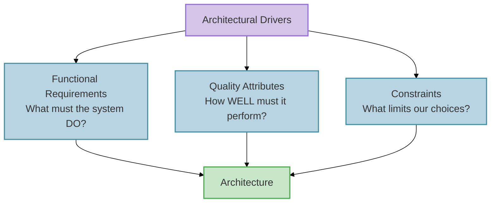

import RevealJS, { Slide } from '@site/src/components/RevealJS';
import Img from '@site/src/components/Img';
import PollSlide from '@site/src/components/PollSlide';

<RevealJS transition="slide">

{/* ============================================ */}
{/* COVER IMAGE */}
{/* ============================================ */}

<Slide>
  

<aside className="notes">
**Lecture overview:**
- **Total time:** ~50 minutes
- **Prerequisites:** L17 (creation patterns, DI, service wiring), L16 (testability), L6-L7 (information hiding, coupling)
- **Connects to:** L19 (Architectural Qualities), L20 (Networks & Security), L36 (Sustainability)

**Structure:**
- Design vs. Architecture (~8 min)
- Architectural Drivers (~10 min)
- Finding Service Boundaries (~20 min)
- Communicating Architecture: C4 & ADRs (~12 min)
- Upfront vs. Piecemeal Growth (~10 min — if time)

**Key theme:** We've been building objects and wiring them into services. Now we step back and ask: where do those service boundaries come from? We'll use Pawtograder's autograder — the system that grades YOUR assignments — as our running example.

→ **Transition:** Let's start with the title...
</aside>

</Slide>

{/* ============================================ */}
{/* TITLE SLIDE */}
{/* ============================================ */}

<Slide>

# CS 3100: Program Design and Implementation II

## Lecture 18: Thinking Architecturally

  ©2026 Jonathan Bell & Ellen Spertus, CC-BY-SA

<aside className="notes">
**Context:**
- L17 ended with creation patterns and DI — how do we wire services together?
- Today: how do we decide what those services should BE?
- Running example: Pawtograder's autograder — the system they use every day

**Key message:** "Same principles you already know — information hiding, coupling, cohesion — but applied at a bigger scale."

→ **Transition:** Here's what you'll be able to do after today...
</aside>

</Slide>

{/* ============================================ */}
{/* LEARNING OBJECTIVES */}
{/* ============================================ */}

<Slide>

## Learning Objectives

After this lecture, you will be able to:

<ol style={{fontSize: '0.75em', textAlign: 'left'}}>
  <li>Define <strong>software architecture</strong> and distinguish it from design</li>
  <li>Identify <strong>architectural drivers</strong> (functional requirements, quality attributes, constraints) that shape decisions</li>
  <li>Apply heuristics to determine <strong>service/module boundaries</strong> and design good interfaces</li>
  <li>Use the <strong>C4 model</strong> to communicate architecture at different levels of detail</li>
  <li>Write <strong>Architecture Decision Records</strong> (ADRs) to capture the <em>why</em> behind decisions</li>
</ol>

<aside className="notes">
**Time allocation:**
- Objective 1: Design vs Architecture (~8 min)
- Objective 2: Architectural Drivers (~10 min)
- Objective 3: Finding Boundaries (~20 min)
- Objective 4-5: C4 + ADRs (~12 min)

**Connection to L17:**
- L17: How do we wire objects into services? (creation patterns, DI)
- L18: How do we decide what those services should BE?

→ **Transition:** Let's start by defining what we mean by "architecture"...
</aside>

</Slide>

{/* ============================================ */}
{/* ARC 1: ARCHITECTURE vs DESIGN (8 min) */}
{/* ============================================ */}

<Slide>

## Design vs. Architecture: A Continuum

Design and architecture exist on a continuum. They ask different questions at different scales.

**Design — The Details**

- How is this class organized?
- What data structures should we use?
- How do these methods collaborate?
- Which pattern fits this problem?

**Architecture — The Big Picture**

- What are the major components?
- How do they communicate?
- What are the quality requirements?
- Which decisions are hard to change later?

A useful heuristic: architectural decisions are the ones that are <strong>expensive to change</strong>.

<aside className="notes">
**The boundary is fuzzy:**
- Ralph Johnson (Gang of Four): "Architecture is about the important stuff. Whatever that is."
- The "important stuff" varies by project
- Usually = decisions that constrain many other decisions downstream

**Examples:**
- **Architectural:** Run grading on GitHub Actions vs. own server (months to reverse)
- **Design:** HashMap vs. TreeMap in test result storage (an afternoon to change)
- **Gray area:** How to structure the `pawtograder.yml` config format

**Don't worry about unfamiliar terms!**
- We'll cover networks, authentication, deployment in L20-L21
- Today: the *thinking process* — how do we identify which decisions matter most?

</aside>

</Slide>

<Slide>

## Case Study: Microblogging Requirements

Before we compare two microblogging systems, let's think about what any microblogging platform needs to do:

**Discussion: What decisions would be "expensive to change"?**

Where does user identity live? Who controls the feed algorithm? Who decides what content is allowed? What happens when millions of users post at once?

<aside className="notes">
**PAUSE FOR DISCUSSION (2-3 min):**

Prompt students to think before revealing the answers:
- "If we wanted to move user accounts from one server to another, how hard would that be?"
- "What if we want communities to set their own moderation rules?"
- "What if we want to change who controls what appears in a user's feed?"

**Common student responses to watch for:**
- **Identity:** Some may say "just a database table" — push back: every post, follow, and mention links back to identity. Moving it touches everything.
- **Moderation:** Who enforces rules? A central team? Each community? This shapes the entire permission model.
- **Feed algorithm:** Centrally ranked vs. user-controlled — changing this after the fact means rethinking what data you even store.

**Key insight to plant:**
"Your instincts about what's 'easy' or 'hard' to change — those instincts ARE architectural thinking. We're going to compare two systems that made very different choices about exactly these questions."

→ **Transition:** Let's see how two different systems answered these questions...
</aside>

</Slide>

<Slide>

## Architecture: Chirp vs. Flock

Two systems, same problem — different architectural choices:

| Decision | Chirp (centralized) | Flock (federated) |
|----------|--------------------|--------------------|
| **Where does identity live?** | Central server owns all accounts | Each server owns its own users |
| **Where is content stored?** | Single platform database | Distributed across servers |
| **Who controls the feed?** | Platform algorithm | Each server (or user) |
| **Who moderates content?** | The platform | Each server independently |

Why these are architectural:

<ul style={{fontSize: '0.7em'}}>
  <li><strong>Identity:</strong> Every post, follow, and mention depends on it — changing it touches everything</li>
  <li><strong>Content storage:</strong> Determines what queries are even possible and who can run them</li>
  <li><strong>Moderation:</strong> Shapes the entire permission model and who has authority over what</li>
</ul>

<aside className="notes">
**Make this concrete:**
- "Think about what happens when you @mention someone. In Chirp, that's a lookup in one database. In Flock, that mention might need to reach a completely different server."
- "Think about what happens when a server in Flock shuts down — those users and their posts are gone. That's a consequence of the identity decision."

**These are design choices, not mistakes:**
- Chirp's centralization makes some things easy: consistent experience, powerful recommendations, fast search
- Flock's federation makes other things possible: user autonomy, community self-governance, no single point of control

→ **Transition:** So what drives a system toward one of these architectures?
</aside>

</Slide>

<Slide>

## The Key Insight

Neither architecture is "wrong" — they reflect <strong>different requirements and different values</strong>.

| | Chirp (centralized) | Flock (federated) |
|--|---------------------|-------------------|
| **Primary goal** | Consistent experience, powerful recommendations | User autonomy, community self-governance |
| **Moderation** | Platform enforces global rules | Each server sets its own rules |
| **Scalability** | Easier to optimize centrally | Naturally distributed load |
| **User trust** | Trust the platform | Trust your own server |

This raises a question: What forces push a system toward a particular architecture?

<aside className="notes">
**The point to land:**
- Neither system is "wrong" — different contexts and values lead to different choices
- Chirp optimizes for the platform's ability to curate and monetize; Flock optimizes for user and community control
- These aren't just technical decisions — they reflect what the builders believed the system should be *for*

**Bridge to next section:**
- "So what ARE the kinds of forces that shape architecture?"
- "Let's look at architectural drivers — the things that push us toward particular solutions"

→ **Transition:** Let's examine what drives these decisions...
</aside>

</Slide>

{/* ============================================ */}
{/* ARC 2: ARCHITECTURAL DRIVERS (10 min) */}
{/* ============================================ */}

<Slide>

## What Drives Architectural Decisions?

Architecture doesn't happen in a vacuum. Decisions are shaped by <strong>architectural drivers</strong>:

<aside className="notes">
**Three categories of forces:**
1. **Functional requirements:** What the system must do
2. **Quality attributes:** How well it must do it (the "-ilities")
3. **Constraints:** Fixed boundaries we can't change

**Key insight:**
- Functional requirements tell you WHAT capabilities exist
- But they don't dictate HOW to structure them
- Quality attributes and constraints shape the structure

→ **Transition:** Let's look at each driver for Chirp and Flock...
</aside>

</Slide>

<Slide>

## Driver 1: Functional Requirements

What must any microblogging platform do?

<ul style={{fontSize: '0.75em'}}>
  <li>Create and authenticate user accounts</li>
  <li>Post short messages, with support for mentions and hashtags</li>
  <li>Follow other users and see their posts in a feed</li>
  <li>Moderate content that violates community standards</li>
  <li>Notify users of replies, mentions, and follows</li>
</ul>

A single monolithic application COULD do all of this. But should it? The functional requirements alone don't tell us how to structure it — or whether identity should be centralized or federated.

<aside className="notes">
**The point:**
- Both Chirp and Flock satisfy all of these functional requirements
- A single server with a database and a web app could technically do everything on this list
- But would it be scalable? Maintainable? Changeable to meet local regulations?
- That's where quality attributes come in

→ **Transition:** Quality attributes shape the structure...
</aside>

</Slide>

<Slide>

## Driver 2: Quality Attributes (the "-ilities")

Both Chirp and Flock must address the same quality attributes — but their architectures lead to very different tradeoffs.

**You already know these:**

- **Changeability** (L6-L7): Chirp must update globally to comply with new regulations. A Flock server operator can adapt independently.
- **Testability** (L16): Chirp's services can be tested in isolation. Flock's federated interactions require simulating multiple servers.

*Same principles from class design — now at service scale!*

**Coming up:**

- **Security** (L20): Keep real user identities secret — one central target vs. distributed exposure
- **Scalability** (L21): Millions of posts per day — central infrastructure vs. distributed load
- **Deployability** (L36): Chirp pushes updates instantly; Flock servers update independently
- **Maintainability** (L36): Well-funded corporation vs. mostly volunteer server operators

Quality attributes often <strong>conflict</strong>. Flock's distribution improves autonomy but hurts consistency. Architecture = making these tradeoffs consciously.

<aside className="notes">
**Connect to prior knowledge:**
- "You already know how to design for change at the class level — information hiding, low coupling, high cohesion"
- "You already know testability — observability, controllability, separating 'what to do' from 'how to connect'"
- "Today we're applying those SAME principles at a bigger scale"

**Chirp vs. Flock tradeoffs to highlight:**
- Changeability: Chirp can enforce a regulation change globally overnight; a Flock server in another jurisdiction can simply not comply — or adapt faster
- Testability: Testing a Chirp service is straightforward — mock its dependencies. Testing Flock federation means you need two servers talking to each other, which is much harder to set up in a test environment
- Maintainability: Chirp has engineers on call 24/7; a Flock server might be run by one volunteer who goes on vacation

**Preview future lectures:**
- L20: How do we authenticate across servers? How do we keep identities secure? (Security)
- L21: How does each architecture handle millions of concurrent posts? (Scalability)
- L36: How do we deploy changes safely across a federated network? (Deployability, Maintainability)

→ **Transition:** Constraints also shape what's possible...
</aside>

</Slide>

<Slide>

## Driver 3: Constraints

Constraints are non-negotiable boundaries. They limit our design space:

| Source | Chirp | Flock |
|--------|-------|-------|
| **Platform** | Large data centers, owned infrastructure | Distributed volunteer-run servers |
| **Legal** | Must comply with laws in every jurisdiction globally | Each server complies with its own local laws |
| **Identity** | Must authenticate millions of users centrally | Must federate identity across independent servers |
| **Moderation** | Must enforce a single global content policy | Each server enforces its own rules |

Constraints aren't negotiable the way quality attributes are. They're the fixed boundaries within which we architect. Sometimes constraints <strong>ARE</strong> the architecture — Flock's requirement that no single entity owns the network dictates its entire structure.

<aside className="notes">
**Constraints vs. quality attributes:**
- Quality attributes are things we WANT (security, scalability)
- Constraints are things we MUST accept (data center limits, legal jurisdiction, volunteer infrastructure)
- Together they shape WHAT architectures are even possible

**The Flock point is worth dwelling on:**
- The decision that no single entity should control the network isn't just a preference — it's a founding constraint
- Once you accept that constraint, federation follows almost automatically
- The architecture IS the constraint made concrete

**Chirp's legal constraint is also interesting:**
- A centralized platform is legally responsible for ALL content globally
- This creates pressure toward aggressive moderation and content policies
- Flock sidesteps this by distributing legal responsibility to individual server operators

→ **Transition:** Now that we know the drivers, how do we find the right boundaries?
</aside>

</Slide>

</RevealJS>