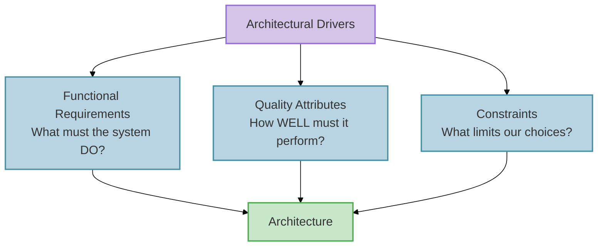
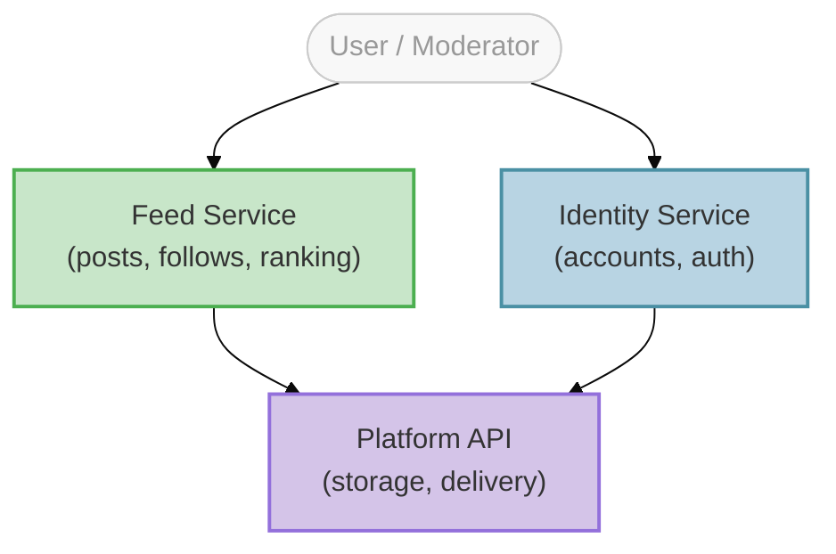
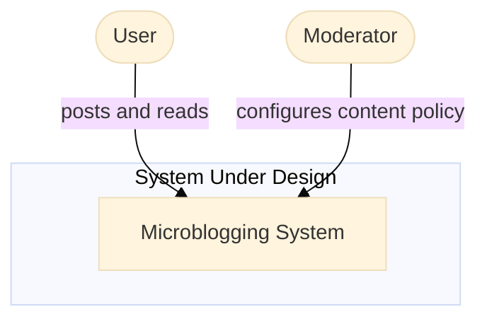
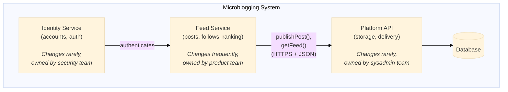
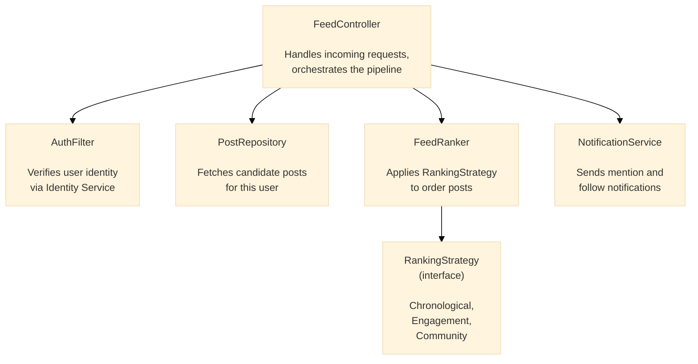

import RevealJS, { Slide } from '@site/src/components/RevealJS';
import Img from '@site/src/components/Img';
import PollSlide from '@site/src/components/PollSlide';

<RevealJS transition="slide">

{/* ============================================ */}
{/* COVER IMAGE */}
{/* ============================================ */}

<Slide>
  

<aside className="notes">
**Lecture overview:**
- **Total time:** ~50 minutes
- **Prerequisites:** L17 (creation patterns, DI, service wiring), L16 (testability), L6-L7 (information hiding, coupling)
- **Connects to:** L19 (Architectural Qualities), L20 (Networks & Security), L36 (Sustainability)

**Structure:**
- Design vs. Architecture (~8 min)
- Architectural Drivers (~10 min)
- Finding Service Boundaries (~20 min)
- Communicating Architecture: C4 & ADRs (~12 min)
- Upfront vs. Piecemeal Growth (~10 min — if time)

**Key theme:** We've been building objects and wiring them into services. Now we step back and ask: where do those service boundaries come from? We'll use Pawtograder's autograder — the system that grades YOUR assignments — as our running example.

→ **Transition:** Let's start with the title...
</aside>

</Slide>

{/* ============================================ */}
{/* TITLE SLIDE */}
{/* ============================================ */}

<Slide>

# CS 3100: Program Design and Implementation II

## Lecture 18: Thinking Architecturally

<p style={{marginTop: '2em', fontSize: '0.8em', color: '#666'}}>
  ©2026 Jonathan Bell & Ellen Spertus, CC-BY-SA
</p>

<aside className="notes">
**Context:**
- L17 ended with creation patterns and DI — how do we wire services together?
- Today: how do we decide what those services should BE?
- Running example: Pawtograder's autograder — the system they use every day

**Key message:** "Same principles you already know — information hiding, coupling, cohesion — but applied at a bigger scale."

→ **Transition:** Here's what you'll be able to do after today...
</aside>

</Slide>

{/* ============================================ */}
{/* LEARNING OBJECTIVES */}
{/* ============================================ */}

<Slide>

## Learning Objectives

<p style={{fontSize: '0.85em', textAlign: 'left'}}>
After this lecture, you will be able to:
</p>

<ol style={{fontSize: '0.75em', textAlign: 'left'}}>
  <li>Define <strong>software architecture</strong> and distinguish it from design</li>
  <li>Identify <strong>architectural drivers</strong> (functional requirements, quality attributes, constraints) that shape decisions</li>
  <li>Apply heuristics to determine <strong>service/module boundaries</strong> and design good interfaces</li>
  <li>Use the <strong>C4 model</strong> to communicate architecture at different levels of detail</li>
  <li>Write <strong>Architecture Decision Records</strong> (ADRs) to capture the <em>why</em> behind decisions</li>
</ol>

<aside className="notes">
**Time allocation:**
- Objective 1: Design vs Architecture (~8 min)
- Objective 2: Architectural Drivers (~10 min)
- Objective 3: Finding Boundaries (~20 min)
- Objective 4-5: C4 + ADRs (~12 min)

**Connection to L17:**
- L17: How do we wire objects into services? (creation patterns, DI)
- L18: How do we decide what those services should BE?

→ **Transition:** Let's start by defining what we mean by "architecture"...
</aside>

</Slide>

{/* ============================================ */}
{/* ARC 1: ARCHITECTURE vs DESIGN (8 min) */}
{/* ============================================ */}

<Slide>

## Design vs. Architecture: A Continuum

<p style={{fontSize: '0.9em', marginTop: '0.5em'}}>
Design and architecture exist on a continuum. They ask different questions at different scales.
</p>

<div style={{display: 'grid', gridTemplateColumns: '1fr 1fr', gap: '1.5em', fontSize: '0.7em', marginTop: '1em'}}>

<div style={{padding: '1em', border: '2px solid #4CAF50', borderRadius: '8px'}}>

**Design — The Details**

- How is this class organized?
- What data structures should we use?
- How do these methods collaborate?
- Which pattern fits this problem?

</div>

<div style={{padding: '1em', border: '2px solid #FF9800', borderRadius: '8px'}}>

**Architecture — The Big Picture**

- What are the major components?
- How do they communicate?
- What are the quality requirements?
- Which decisions are hard to change later?

</div>

</div>

<div className="fragment">
<p style={{fontSize: '0.85em', marginTop: '1em', fontWeight: 'bold', color: '#9370DB'}}>
A useful heuristic: architectural decisions are the ones that are <strong>expensive to change</strong>.
</p>
</div>

<aside className="notes">
**The boundary is fuzzy:**
- Ralph Johnson (Gang of Four): "Architecture is about the important stuff. Whatever that is."
- The "important stuff" varies by project
- Usually = decisions that constrain many other decisions downstream

**Examples:**
- **Architectural:** Run grading on GitHub Actions vs. own server (months to reverse)
- **Design:** HashMap vs. TreeMap in test result storage (an afternoon to change)
- **Gray area:** How to structure the `pawtograder.yml` config format

**Don't worry about unfamiliar terms!**
- We'll cover networks, authentication, deployment in L20-L21
- Today: the *thinking process* — how do we identify which decisions matter most?

</aside>

</Slide>

<Slide>

## Case Study: Microblogging Requirements

<p style={{fontSize: '0.78em'}}>
Before we compare two microblogging systems, let's think about what any microblogging platform needs to do:
</p>

<div style={{display: 'grid', gridTemplateColumns: '1fr 1fr', gap: '0.5em', fontSize: '0.65em', marginTop: '0.5em'}}>

<div style={{padding: '0.4em 0.6em', border: '2px solid #4A90A4', borderRadius: '8px'}}>
👤 <strong>Identity</strong> — Create and authenticate user accounts
</div>

<div style={{padding: '0.4em 0.6em', border: '2px solid #4A90A4', borderRadius: '8px'}}>
✏️ <strong>Publishing</strong> — Post short messages with mentions and hashtags
</div>

<div style={{padding: '0.4em 0.6em', border: '2px solid #4A90A4', borderRadius: '8px'}}>
👥 <strong>Social graph</strong> — Follow other users
</div>

<div style={{padding: '0.4em 0.6em', border: '2px solid #4A90A4', borderRadius: '8px'}}>
📰 <strong>Feed</strong> — Show relevant posts from followed users
</div>

<div style={{padding: '0.4em 0.6em', border: '2px solid #4A90A4', borderRadius: '8px'}}>
🛡️ <strong>Moderation</strong> — Enforce community standards
</div>

<div style={{padding: '0.4em 0.6em', border: '2px solid #4A90A4', borderRadius: '8px'}}>
🔔 <strong>Notifications</strong> — Alert users to replies and mentions
</div>

</div>

<div className="fragment">
<div style={{padding: '0.6em', border: '2px solid #FF9800', borderRadius: '8px', marginTop: '0.5em', fontSize: '0.65em'}}>

**Discussion: What decisions would be "expensive to change"?**

Where does user identity live? Who controls the feed algorithm? Who decides what content is allowed? What happens when millions of users post at once?

</div>
</div>

<aside className="notes">
**PAUSE FOR DISCUSSION (2-3 min):**

Prompt students to think before revealing the answers:
- "If we wanted to move user accounts from one server to another, how hard would that be?"
- "What if we want communities to set their own moderation rules?"
- "What if we want to change who controls what appears in a user's feed?"

**Common student responses to watch for:**
- **Identity:** Some may say "just a database table" — push back: every post, follow, and mention links back to identity. Moving it touches everything.
- **Moderation:** Who enforces rules? A central team? Each community? This shapes the entire permission model.
- **Feed algorithm:** Centrally ranked vs. user-controlled — changing this after the fact means rethinking what data you even store.

**Key insight to plant:**
"Your instincts about what's 'easy' or 'hard' to change — those instincts ARE architectural thinking. We're going to compare two systems that made very different choices about exactly these questions."

→ **Transition:** Let's see how two different systems answered these questions...
</aside>

</Slide>

<Slide>

## Architecture: Chirp vs. Flock

<p style={{fontSize: '0.85em'}}>
Two systems, same problem — different architectural choices:
</p>

<div style={{fontSize: '0.65em', marginTop: '0.5em'}}>

| Decision | Chirp (centralized) | Flock (federated) |
|----------|--------------------|--------------------|
| **Where does identity live?** | Central server owns all accounts | Each server owns its own users |
| **Where is content stored?** | Single platform database | Distributed across servers |
| **Who controls the feed?** | Platform algorithm | Each server (or user) |
| **Who moderates content?** | The platform | Each server independently |

</div>

<div className="fragment" style={{marginTop: '1em'}}>
<p style={{fontSize: '0.8em', fontWeight: 'bold'}}>Why these are architectural:</p>
<ul style={{fontSize: '0.7em'}}>
  <li><strong>Identity:</strong> Every post, follow, and mention depends on it — changing it touches everything</li>
  <li><strong>Content storage:</strong> Determines what queries are even possible and who can run them</li>
  <li><strong>Moderation:</strong> Shapes the entire permission model and who has authority over what</li>
</ul>
</div>

<aside className="notes">
**Make this concrete:**
- "Think about what happens when you @mention someone. In Chirp, that's a lookup in one database. In Flock, that mention might need to reach a completely different server."
- "Think about what happens when a server in Flock shuts down — those users and their posts are gone. That's a consequence of the identity decision."

**These are design choices, not mistakes:**
- Chirp's centralization makes some things easy: consistent experience, powerful recommendations, fast search
- Flock's federation makes other things possible: user autonomy, community self-governance, no single point of control

→ **Transition:** So what drives a system toward one of these architectures?
</aside>

</Slide>

<Slide>

## The Key Insight

<p style={{fontSize: '0.9em', marginTop: '0.5em'}}>
Neither architecture is "wrong" — they reflect <strong>different requirements and different values</strong>.
</p>

<div style={{fontSize: '0.8em', marginTop: '1em'}}>

| | Chirp (centralized) | Flock (federated) |
|--|---------------------|-------------------|
| **Primary goal** | Consistent experience, powerful recommendations | User autonomy, community self-governance |
| **Moderation** | Platform enforces global rules | Each server sets its own rules |
| **Scalability** | Easier to optimize centrally | Naturally distributed load |
| **User trust** | Trust the platform | Trust your own server |

</div>

<div className="fragment" style={{marginTop: '1.5em'}}>
<p style={{fontSize: '0.9em', color: '#9370DB', fontWeight: 'bold'}}>
This raises a question: What forces push a system toward a particular architecture?
</p>
</div>

<aside className="notes">
**The point to land:**
- Neither system is "wrong" — different contexts and values lead to different choices
- Chirp optimizes for the platform's ability to curate and monetize; Flock optimizes for user and community control
- These aren't just technical decisions — they reflect what the builders believed the system should be *for*

**Bridge to next section:**
- "So what ARE the kinds of forces that shape architecture?"
- "Let's look at architectural drivers — the things that push us toward particular solutions"

→ **Transition:** Let's examine what drives these decisions...
</aside>

</Slide>

{/* ============================================ */}
{/* ARC 2: ARCHITECTURAL DRIVERS (10 min) */}
{/* ============================================ */}

<Slide>

## What Drives Architectural Decisions?

<p style={{fontSize: '0.9em', marginTop: '0.5em'}}>
Architecture doesn't happen in a vacuum. Decisions are shaped by <strong>architectural drivers</strong>:
</p>

<div style={{fontSize: '0.8em', marginTop: '1em'}}>



</div>

<aside className="notes">
**Three categories of forces:**
1. **Functional requirements:** What the system must do
2. **Quality attributes:** How well it must do it (the "-ilities")
3. **Constraints:** Fixed boundaries we can't change

**Key insight:**
- Functional requirements tell you WHAT capabilities exist
- But they don't dictate HOW to structure them
- Quality attributes and constraints shape the structure

→ **Transition:** Let's look at each driver for Chirp and Flock...
</aside>

</Slide>

<Slide>

## Driver 1: Functional Requirements

<p style={{fontSize: '0.85em'}}>
What must any microblogging platform do?
</p>

<ul style={{fontSize: '0.75em'}}>
  <li>Create and authenticate user accounts</li>
  <li>Post short messages, with support for mentions and hashtags</li>
  <li>Follow other users and see their posts in a feed</li>
  <li>Moderate content that violates community standards</li>
  <li>Notify users of replies, mentions, and follows</li>
</ul>

<div className="fragment">
<p style={{fontSize: '0.85em', marginTop: '1em', color: '#FF9800'}}>
A single monolithic application COULD do all of this. But should it? The functional requirements alone don't tell us how to structure it — or whether identity should be centralized or federated.
</p>
</div>

<aside className="notes">
**The point:**
- Both Chirp and Flock satisfy all of these functional requirements
- A single server with a database and a web app could technically do everything on this list
- But would it be scalable? Maintainable? Changeable to meet local regulations?
- That's where quality attributes come in

→ **Transition:** Quality attributes shape the structure...
</aside>

</Slide>

<Slide>

## Driver 2: Quality Attributes (the "-ilities")

<p style={{fontSize: '0.75em'}}>
Both Chirp and Flock must address the same quality attributes — but their architectures lead to very different tradeoffs.
</p>

<div style={{display: 'flex', flexDirection: 'column', gap: '1em', fontSize: '0.7em', marginTop: '-0.5em', width: '100%'}}>

<div style={{padding: '0.75em', border: '2px solid #4CAF50', borderRadius: '2px', width: '100%'}}>

**You already know these:**

- **Changeability** (L6-L7): Chirp must update globally to comply with new regulations. A Flock server operator can adapt independently.
- **Testability** (L16): Chirp's services can be tested in isolation. Flock's federated interactions require simulating multiple servers.

*Same principles from class design — now at service scale!*

</div>

<div style={{padding: '0.75em', border: '2px solid #FF9800', borderRadius: '2px', width: '100%'}}>

**Coming up:**

- **Security** (L20): Keep real user identities secret — one central target vs. distributed exposure
- **Scalability** (L21): Millions of posts per day — central infrastructure vs. distributed load
- **Deployability** (L36): Chirp pushes updates instantly; Flock servers update independently
- **Maintainability** (L36): Well-funded corporation vs. mostly volunteer server operators

</div>

</div>

<div className="fragment" style={{marginTop: '0.75em'}}>
<p style={{fontSize: '0.8em', color: '#9370DB'}}>
Quality attributes often <strong>conflict</strong>. Flock's distribution improves autonomy but hurts consistency. Architecture = making these tradeoffs consciously.
</p>
</div>

<aside className="notes">
**Connect to prior knowledge:**
- "You already know how to design for change at the class level — information hiding, low coupling, high cohesion"
- "You already know testability — observability, controllability, separating 'what to do' from 'how to connect'"
- "Today we're applying those SAME principles at a bigger scale"

**Chirp vs. Flock tradeoffs to highlight:**
- Changeability: Chirp can enforce a regulation change globally overnight; a Flock server in another jurisdiction can simply not comply — or adapt faster
- Testability: Testing a Chirp service is straightforward — mock its dependencies. Testing Flock federation means you need two servers talking to each other, which is much harder to set up in a test environment
- Maintainability: Chirp has engineers on call 24/7; a Flock server might be run by one volunteer who goes on vacation

**Preview future lectures:**
- L20: How do we authenticate across servers? How do we keep identities secure? (Security)
- L21: How does each architecture handle millions of concurrent posts? (Scalability)
- L36: How do we deploy changes safely across a federated network? (Deployability, Maintainability)

→ **Transition:** Constraints also shape what's possible...
</aside>

</Slide>

<Slide>

## Driver 3: Constraints

<p style={{fontSize: '0.85em'}}>
Constraints are non-negotiable boundaries. They limit our design space:
</p>

<div style={{fontSize: '0.72em', marginTop: '0.5em'}}>

| Source | Chirp | Flock |
|--------|-------|-------|
| **Platform** | Large data centers, owned infrastructure | Distributed volunteer-run servers |
| **Legal** | Must comply with laws in every jurisdiction globally | Each server complies with its own local laws |
| **Identity** | Must authenticate millions of users centrally | Must federate identity across independent servers |
| **Moderation** | Must enforce a single global content policy | Each server enforces its own rules |

</div>

<div className="fragment">
<p style={{fontSize: '0.85em', marginTop: '0.75em', color: '#9370DB'}}>
Constraints aren't negotiable the way quality attributes are. They're the fixed boundaries within which we architect. Sometimes constraints <strong>ARE</strong> the architecture — Flock's requirement that no single entity owns the network dictates its entire structure.
</p>
</div>

<aside className="notes">
**Constraints vs. quality attributes:**
- Quality attributes are things we WANT (security, scalability)
- Constraints are things we MUST accept (data center limits, legal jurisdiction, volunteer infrastructure)
- Together they shape WHAT architectures are even possible

**The Flock point is worth dwelling on:**
- The decision that no single entity should control the network isn't just a preference — it's a founding constraint
- Once you accept that constraint, federation follows almost automatically
- The architecture IS the constraint made concrete

**Chirp's legal constraint is also interesting:**
- A centralized platform is legally responsible for ALL content globally
- This creates pressure toward aggressive moderation and content policies
- Flock sidesteps this by distributing legal responsibility to individual server operators

→ **Transition:** Now that we know the drivers, how do we find the right boundaries?
</aside>

</Slide>
{/* ============================================ */}
{/* ARC 3: FINDING BOUNDARIES (20 min) */}
{/* ============================================ */}

<Slide>

## Drivers Tell Us What; Heuristics Help Us Find Where

<p style={{fontSize: '0.8em', marginTop: '0.5em'}}>
We know we need changeability, testability, scalability. But where do we actually draw the lines?
</p>

<div style={{display: 'grid', gridTemplateColumns: '1fr 1fr', gap: '1em', fontSize: '0.75em', marginTop: '1em'}}>

<div style={{padding: '0.75em', border: '2px solid #4A90A4', borderRadius: '8px'}}>
**Rate of Change** — Things that change at different speeds should be separate
</div>

<div style={{padding: '0.75em', border: '2px solid #4CAF50', borderRadius: '8px'}}>
**Actor** — Things owned by different people should be separate
</div>

<div style={{padding: '0.75em', border: '2px solid #FF9800', borderRadius: '8px'}}>
**Interface Segregation** — Clients that need different things should get different interfaces
</div>

<div style={{padding: '0.75em', border: '2px solid #9370DB', borderRadius: '8px'}}>
**Testability** — Things that need independent testing should be separable
</div>

</div>

<aside className="notes">
**Bridge from drivers to heuristics:**
- We just identified WHAT we care about: functional requirements, quality attributes, constraints
- But knowing we need "changeability" or "testability" doesn't tell us WHERE to draw the lines
- These four heuristics are lenses for examining a system to find natural boundaries

**How they connect to drivers:**
- Changeability driver → Rate of Change heuristic helps us isolate fast-changing parts
- Maintainability driver → Actor heuristic helps us give each team a clear slice
- Testability driver → Testability heuristic helps us design components that can be tested alone

**Coming up:**
We'll apply each heuristic to Chirp and Flock and see how the same boundaries emerge from multiple angles — that's a sign we've found a natural seam.

→ **Transition:** Let's start with rate of change...
</aside>

</Slide>

<Slide>

## Heuristic 1: Group by Rate of Change

<p style={{fontSize: '0.85em'}}>
Things that change at different rates should live in different components:
</p>

<div style={{fontSize: '0.7em', marginTop: '0.5em'}}>

| Component | How Often It Changes | Who Changes It |
|-----------|---------------------|----------------|
| **A user's posts and follows** | Continuously — every interaction | The user |
| **Feed ranking algorithm** | Every few weeks | Platform engineers |
| **Identity & authentication** | Rarely — breaking change | Security team |
| **The post data format** | Very rarely — affects everything | Architects (carefully!) |

</div>

<div className="fragment">
<p style={{fontSize: '0.85em', marginTop: '0.5em', color: '#4CAF50'}}>
✓ User data changes constantly → it SHOULD be separate from the feed algorithm that changes monthly. And both should be separate from identity that almost never changes.
</p>
</div>

<aside className="notes">
**Four things, four rates of change:**
- User posts and follows — change with every interaction, continuously
- Feed algorithm — tweaked regularly to improve recommendations or address abuse
- Identity and authentication — very stable; changing this is a major undertaking
- Post data format — the contract everything depends on; changes almost NEVER

**The data format is the most stable:**
- If the structure of a post changes, every component that reads or writes posts must change together
- That's why it changes "very rarely" — it's the stable contract that lets other pieces evolve independently

**Chirp vs. Flock difference:**
- In Chirp, all of these live on the same platform — but they should still be separate services internally
- In Flock, rate of change also determines what must be standardized across servers (the post format) vs. what each server controls independently (the feed algorithm)

→ **Transition:** Different people care about different parts...
</aside>

</Slide>

<Slide>

## Heuristic 2: Each Actor Gets Their Own Slice


<aside className="notes">
**Walk through the graphic — four actors, four slices:**
- **User:** Posts messages, scrolls their feed — never touches server config
- **Community Moderator:** Sets moderation rules for their server — never modifies feed algorithm code
- **Sysadmin:** Maintains platform infrastructure — doesn't write moderation policies
- **Developer:** Can improve the feed algorithm without touching identity or moderation

**Key insight: changes from one actor shouldn't ripple to another's code.**
- When a moderator updates rules → feed algorithm and identity unchanged
- When a developer tweaks the algorithm → moderation policies unchanged
- When a sysadmin updates infrastructure → users see no difference

**Connection to L8 (SOLID):** This is Single Responsibility Principle at architectural scale — each component has one reason to change, corresponding to one actor.

**Chirp vs. Flock:**
- In Chirp, the sysadmin and developer are the same company — but the slice separation still matters
- In Flock, the community moderator is often a completely different person from the sysadmin — the architecture must enforce this separation

→ **Transition:** What if we forced all clients to use one fat interface?
</aside>

</Slide>

<Slide>

## Heuristic 3: Apply Interface Segregation

<p style={{fontSize: '0.75em'}}>
Don't force clients to depend on interfaces they don't use. What if we had one fat interface?
</p>

<div style={{fontSize: '0.65em'}}>

```java
// BAD: One monolithic interface for everything
public interface MicrobloggingSystem {
    // User concerns
    void post(String userId, String message);
    List<Post> getFeed(String userId);

    // Moderation concerns
    void removePost(String moderatorId, String postId);
    void banUser(String moderatorId, String userId);
    List<Post> getFlaggedPosts(String serverId);

    // Federation concerns
    void receivePost(String originServer, Post post);
    void syncFollows(String originServer, List<Follow> follows);
    String getPublicKey(String serverId);
}
```

</div>

<div className="fragment">
<p style={{fontSize: '0.7em', marginTop: '-0.5em', color: '#FF9800'}}>
A regular user shouldn't need to know about federation keys. A remote server syncing posts shouldn't need to know about moderation. <em>We'll design the better version after finishing the heuristics.</em>
</p>
</div>

<aside className="notes">
**What's wrong with this?**
- Users only care about posting and reading — they don't need `syncFollows` or `getPublicKey`
- Remote servers syncing content don't need `banUser`
- Moderators don't need federation methods
- Coupling everything together means changing ANY part risks breaking ALL parts

**Don't solve it yet!** We'll design the better, segregated interfaces after we finish all four heuristics. For now, plant the seed that ISP applies at the service level too.

→ **Transition:** One more heuristic — testability...
</aside>

</Slide>

<Slide>

## Heuristic 4: Optimize for Testability

<p style={{fontSize: '0.85em'}}>
Can you test a component <em>without</em> deploying the whole system?
</p>

<div style={{fontSize: '0.7em', marginTop: '0.5em'}}>

| Component | Testable in Isolation? | How? |
|-----------|----------------------|------|
| **Feed algorithm** | ✅ Yes | Pass a list of posts and follows, check ranked output — no network needed |
| **Post validation** | ✅ Yes | Check character limits, banned words, media types — pure logic |
| **Identity & auth** | ✅ Yes | Test token generation and verification independently |
| **Federation (Flock)** | ⚠️ Hard | Requires two servers talking to each other — integration test |

</div>

<div className="fragment">
<p style={{fontSize: '0.75em', marginTop: '0.5em', color: '#9370DB'}}>
Chirp's services can be tested independently with mocks. Flock's federation is an architectural boundary that's genuinely harder to test — simulating two servers is more complex than simulating a function call. That's a real tradeoff.
</p>
</div>

<aside className="notes">
**Connection to L16 (Testability):**
- Same principle: separate "what to do" from "how to connect"
- The feed algorithm doesn't need a real database to test ranking logic
- Identity doesn't need a real network to test token verification

**The Flock federation point is important:**
- This is a case where the architectural choice (federation) makes one quality attribute (autonomy) better and another (testability) harder
- That's not a mistake — it's a conscious tradeoff
- Architecture = making tradeoffs consciously

→ **Transition:** Putting the four heuristics together...
</aside>

</Slide>

{/* ============================================ */}
{/* ARC 3 CONTINUED: EMERGING ARCHITECTURE */}
{/* ============================================ */}

<Slide>

## Emerging Architecture: Three Components

<p style={{fontSize: '0.85em'}}>
Applying our four heuristics, a natural structure emerges for both systems:
</p>



<aside className="notes">
**How we got here:**
- Rate of change → feed changes fast, identity medium, platform slow
- Actor → users touch feed, moderators touch identity, sysadmins touch platform
- ISP → users get a posting interface; remote servers get a federation interface
- Testability → feed and identity testable locally without full platform

**Chirp vs. Flock:**
- In Chirp, all three components live on one platform — but the separation still matters for changeability and testability
- In Flock, this separation is enforced across servers — the Identity Service may live on a different server than the Feed Service

→ **Transition:** A key design decision within this structure...
</aside>

</Slide>

<Slide>

## A Design Decision: Where Does the Feed Algorithm Live?

<p style={{fontSize: '0.75em'}}>
We need to rank posts for each user's feed. Where should that logic live?
</p>

<div style={{display: 'flex', flexDirection: 'column', gap: '1em', fontSize: '0.65em', marginTop: '-1em'}}>

<div style={{padding: '0.25em', border: '2px solid #4CAF50', borderRadius: '2px'}}>

**Option A: Algorithm in the Platform (Chirp)**

The platform ranks all feeds centrally using global signals (engagement, recency, relationships).

- **Pros:** Powerful recommendations, consistent experience, easy to improve globally
- **Cons:** Platform controls what users see; hard to customize per community

</div>

<div style={{padding: '0.25em', border: '2px solid #FF9800', borderRadius: '2px'}}>

**Option B: Algorithm per Server (Flock)**

Each server ranks feeds independently. Users may even choose their own algorithm.

- **Pros:** Community autonomy, no single point of control
- **Cons:** No global signals; harder to build powerful recommendations; inconsistent experience

</div>

</div>

<div className="fragment">
<p style={{fontSize: '0.85em', marginTop: '1em', color: '#9370DB'}}>
Neither is wrong — Chirp optimizes for recommendation quality, Flock optimizes for autonomy. But this decision is <strong>expensive to change</strong>: switching from centralized to federated ranking would require rearchitecting how posts are stored and shared across the entire network.
</p>
</div>

<aside className="notes">
**Why is this expensive to change?**
- Centralized ranking requires all posts to flow through one place — the database schema, the storage model, and the delivery pipeline all assume this
- Switching to federated ranking means posts must be stored and indexed on each server — every component that touches posts must change
- Six months in, if you try to extract ranking into per-server logic, it's intertwined with storage, with the UI, with notification delivery...
- "Should I throw it away and start over?" — that's the definition of an expensive decision

**Connection to Pawtograder equivalent:**
- This is the same kind of decision as "where does language logic live?"
- In both cases: normalizing early (in the action / in the platform) keeps the downstream component simple
- But it concentrates power in the component that does the normalizing

→ **Transition:** So we've found our boundaries. How do we design the interfaces between them?
</aside>

</Slide>

<Slide>

## Interface Design at the Service Level

<p style={{fontSize: '0.85em'}}>
Once we've identified components, we need to design their interfaces. The same principles from class design apply—and so do the same patterns from L17.
</p>

<div style={{fontSize: '0.6em', marginTop: '0.5em'}}>

**Dependency Injection at service scale:**
```java
// Good: FeedService depends on abstractions, not concrete implementations
public class FeedService {
    private final IdentityService identityService;
    private final PostRepository postRepository;

    public FeedService(IdentityService identityService,
                       PostRepository postRepository) {
        this.identityService = identityService;
        this.postRepository = postRepository;
    }
}
```

</div>

<aside className="notes">
**Connection to L17:**
- DI handles the outward-facing dependencies (IdentityService, PostRepository)
- For testing: inject mock implementations that don't require a real auth server or database

→ **Transition:** DI handles outward dependencies — Strategy handles internal ones...
</aside>

</Slide>

<Slide>

## Strategy Pattern for Extensibility

```mermaid
classDiagram
    class RankingStrategy {
        <<interface>>
        +rank(candidates List~Post~, user UserProfile)* List~Post~
    }

    class ChronologicalStrategy {
        +rank(candidates List~Post~, user UserProfile) List~Post~
    }

    class EngagementStrategy {
        +rank(candidates List~Post~, user UserProfile) List~Post~
    }

    class CommunityStrategy {
        +rank(candidates List~Post~, user UserProfile) List~Post~
    }

    class FeedService {
        -rankingStrategy RankingStrategy
        +getFeed(userId String) FeedResponse
    }

    RankingStrategy <|.. ChronologicalStrategy
    RankingStrategy <|.. EngagementStrategy
    RankingStrategy <|.. CommunityStrategy
    FeedService --> RankingStrategy

    style RankingStrategy fill:#2d4a5a,stroke:#4ac,stroke-width:2px,stroke-dasharray: 5 5
```

<p style={{fontSize: '0.85em'}}>
Use the Strategy pattern to make the feed algorithm swappable without changing <code>FeedService</code>:
</p>


<aside className="notes">
**The Strategy pattern for extensibility:**
- Adding a new ranking algorithm = new RankingStrategy class, nothing else changes
- Chirp might use EngagementStrategy by default; a Flock server might prefer ChronologicalStrategy
- CommunityStrategy could let server operators tune ranking for their community

**Connection to DI:**
- The RankingStrategy is injected into FeedService — same principle as the previous slide
- DI handles outward dependencies; Strategy handles internal variation

→ **Transition:** What do these contracts actually look like?
</aside>

</Slide>

<Slide>

## The Contracts: Data Types That Cross Boundaries

<p style={{fontSize: '0.7em'}}>
The interface isn't just method signatures — it's the <strong>data types</strong> that flow across. These are the contracts that must remain stable:
</p>

<div style={{fontSize: '0.5em', marginTop: '0.5em'}}>

```java
// A post — the core data type that crosses every boundary
public record Post(
    String postId,          // Unique ID for this post
    String authorId,        // Who wrote it (stable identity reference)
    String content,         // The message text
    Instant createdAt,      // When it was posted
    String originServer     // Which server it came from (Flock only)
) {}

// What the feed service returns to a client
public record FeedResponse(
    List<Post> posts,           // Ranked posts for this user
    String nextPageToken,       // For pagination
    Instant generatedAt         // When this feed was computed
) {}

// What a Flock server sends when federating a post to another server
public record FederatedPost(
    Post post,
    String signature,       // Cryptographic proof of origin
    String publicKeyUrl     // Where to fetch the signing key
) {}
```

</div>

<div className="fragment">
<p style={{fontSize: '0.7em', marginTop: '0.5em', color: '#FF9800'}}>
If <code>Post</code> were poorly designed — no <code>originServer</code>, no stable <code>authorId</code> — Flock's federation would be impossible to add later. <strong>This contract deserves careful design.</strong>
</p>
</div>

<aside className="notes">
**Why these contracts matter:**
- Post is the data type that crosses every boundary — feed service reads it, identity service writes it, federation sends it
- If Post changes shape, every component changes with it
- That's why it's in the "very rarely changes" row of our rate-of-change table

**The FederatedPost type:**
- This only matters for Flock — Chirp doesn't need cryptographic signatures
- But designing Post to include originServer from the start means Chirp could add federation later without changing the core data type
- That's designing for changeability at the data layer

**Connect back to the heuristics:**
- Rate of change: Post changes rarely — it's the stable contract
- ISP: FeedResponse is for clients; FederatedPost is for servers — different clients, different types
- Testability: You can test the feed service by constructing Post objects directly — no database needed

→ **Transition:** How do we communicate this architecture to others?
</aside>

</Slide>

{/* ============================================ */}
{/* ARC 4: COMMUNICATING ARCHITECTURE (12 min) */}
{/* ============================================ */}

<Slide>

## Architecture in Your Head Is Folklore


<aside className="notes">
**The communication challenge:**
- We just covered: three components, four heuristics, data coupling decisions, interface contracts, record types...
- How would you explain all of that to a new team member?
- How would you explain it to a community moderator who just wants to set rules for their server?
- How would you explain it to a sysadmin who needs to debug the platform?

**The problem:**
- If this architecture only exists in one person's head, it degrades like a game of telephone
- Six months later, everyone has a DIFFERENT mental model
- New contributors make changes that violate boundaries they didn't know existed
- "Why doesn't the feed service just query identity directly?" — because they never saw the ADR

**Structured approaches help:**
1. **C4 Diagrams** — Show the system at different zoom levels (different audiences need different detail)
2. **ADRs** — Capture WHY we made decisions, not just WHAT we built

→ **Transition:** Let's look at C4 first — four levels of zoom...
</aside>

</Slide>

<Slide>

## The C4 Model: Four Levels of Zoom

<div style={{fontSize: '0.72em', marginTop: '0.5em'}}>

| Level | Shows | Chirp/Flock Example |
|-------|-------|---------------------|
| **1. System Context** | System + Users + External | User ↔ Device ↔ **Microblogging System** ↔ Moderator |
| **2. Container** | Deployable Units | **Feed Service**, **Identity Service**, **Platform API**, **Database** |
| **3. Component** | Internals of one Container | Inside Feed Service: `PostRepository`, `RankingStrategy`, `FeedController` |
| **4. Code** | Classes / Interfaces | `RankingStrategy` interface, `Post` record |

</div>

<div className="fragment">
<p style={{fontSize: '0.78em', marginTop: '1em'}}>
Let's walk through all four levels for Chirp, so you can see how each level zooms in on a different scale of the same system.
</p>
</div>

<aside className="notes">
**The C4 model**, created by Simon Brown, provides four levels of abstraction for architectural diagrams.

**Key insight:** You don't always need all four levels. Use the level that answers the question your audience is asking.

→ **Transition:** Let's start at the widest zoom level...
</aside>

</Slide>

<Slide>

## C4 Level 1: System Context

<p style={{fontSize: '0.78em'}}>
Who uses the system, and what external systems does it talk to? This is the "napkin sketch" level.
</p>



<p style={{fontSize: '0.72em', marginTop: '0.5em'}}>
At this level, the entire platform is a single box. We don't care what's inside — only what it interacts with.
</p>

<aside className="notes">
**The "elevator pitch" diagram:**
- A non-technical stakeholder could read this and understand the system's role
- No internal details — just actors and external systems

**Chirp vs. Flock at Level 1:**
- Chirp's Level 1 looks like this — one central system
- Flock's Level 1 would show MULTIPLE microblogging systems talking to each other via federation
- That difference at Level 1 already tells you something fundamental about the architecture

→ **Transition:** Zoom in to see the deployable units...
</aside>

</Slide>

<Slide>

## C4 Level 2: Container

<p style={{fontSize: '0.78em'}}>
Zoom into the "Microblogging System" box. What are the major deployable units?
</p>



<p style={{fontSize: '0.72em', marginTop: '0.5em'}}>
The narrow API boundary between the Feed Service and Platform API is deliberate — the feed service never touches the database directly.
</p>

<aside className="notes">
**What this reveals:**
- The three components we identified earlier, plus the database
- Communication mechanism: HTTPS + JSON through well-defined endpoints
- Rate of change is visible: feed service changes fast, identity and API change slowly

**Flock's Level 2 would look different:**
- Each server is its own container
- A federation layer appears between servers
- The database is local to each server, not shared

→ **Transition:** Zoom into the Feed Service...
</aside>

</Slide>

<Slide>

## C4 Level 3: Component (Feed Service)



<p style={{fontSize: '0.72em', marginTop: '0.5em'}}>
This view shows how <code>FeedController</code> orchestrates the internal components. <code>RankingStrategy</code> is the extension point — swapping algorithms doesn't touch anything else.
</p>

<aside className="notes">
**What this reveals:**
- The central role of the FeedController
- Dependency direction: deeper components don't know about the controller
- RankingStrategy is the key extension point — this is the Level 3 view a developer needs to add a new algorithm
- NotificationService is a separate concern — mentions and follows don't need to know about ranking

→ **Transition:** Zoom into the RankingStrategy to see actual code...
</aside>

</Slide>

<Slide>

## C4 Level 4: Code (RankingStrategy)

```mermaid
classDiagram
    class RankingStrategy {
        <<interface>>
        +rank(candidates List~Post~, user UserProfile)* List~Post~
    }
    class ChronologicalStrategy {
        Newest posts first
        +rank(candidates List~Post~, user UserProfile) List~Post~
    }
    class EngagementStrategy {
        Ranked by likes and replies
        +rank(candidates List~Post~, user UserProfile) List~Post~
    }
    class CommunityStrategy {
        Server operator configures weights
        +rank(candidates List~Post~, user UserProfile) List~Post~
    }

    RankingStrategy <|.. ChronologicalStrategy
    RankingStrategy <|.. EngagementStrategy
    RankingStrategy <|.. CommunityStrategy : adding algorithm = adding one class

    style RankingStrategy fill:#2d4a5a,stroke:#4ac,stroke-width:2px,stroke-dasharray: 5 5
```

<p style={{fontSize: '0.78em'}}>
Zoom into the <code>RankingStrategy</code> extension point. What are the actual classes and interfaces?
</p>



<p style={{fontSize: '0.72em', marginTop: '0.5em'}}>
Level 4 shows actual code structure. You'd rarely draw this for the whole system — it's useful for specific extension points or critical interfaces.
</p>

<aside className="notes">
**When to use Level 4:**
- Documenting extension points (like RankingStrategy)
- Critical interfaces where getting the design right matters (like Post)
- NOT for the entire system — too much detail

**The connection back to Arc 3:**
- We designed this interface earlier when discussing the Strategy pattern
- Level 4 is where architecture and design meet — the interface is an architectural decision, the implementations are design decisions

→ **Transition:** Choosing the right level for your audience...
</aside>

</Slide>

<Slide>

## Choosing the Right Level

<p style={{fontSize: '0.78em'}}>
Use the right level of detail for your audience:
</p>

<div style={{fontSize: '0.68em', marginTop: '0.5em'}}>

| Audience | Useful Levels | Why |
|----------|--------------|-----|
| Non-technical stakeholders | Level 1 | Need to understand what the system does, not how |
| Community moderators | Levels 1–2 | Need to see where moderation rules fit in the system |
| Platform engineers | Levels 2–3 | Need to understand component responsibilities and dependencies |
| Contributors adding a ranking algorithm | Levels 3–4 | Need to see the extension point and its interface |

</div>

<aside className="notes">
**Key insight:** Match the diagram to the audience. Don't show Level 4 code diagrams to non-technical stakeholders.

**Flock note:**
- A Flock server operator needs a Level 1 diagram showing how their server federates with others
- They don't need to know about the internal RankingStrategy hierarchy

In L20 and L21, we'll see how network boundaries and serverless platforms influence container topology.

→ **Transition:** Diagrams show WHAT. ADRs show WHY.
</aside>

</Slide>

<Slide>

## Architecture Decision Records (ADRs)

<p style={{fontSize: '0.78em'}}>
Diagrams show <em>what</em>. <strong>ADRs capture <em>why</em></strong>. An ADR documents: <strong>Context</strong>, <strong>Decision</strong>, and <strong>Consequences</strong>.
</p>

<div style={{fontSize: '0.58em', padding: '0.75em', backgroundColor: 'rgba(147, 112, 219, 0.1)', borderRadius: '8px', border: '1px solid rgba(147, 112, 219, 0.3)'}}>

**ADR-001: Centralized Feed Algorithm vs. Per-Server Algorithm**

**Context:** We need to rank posts for each user's feed. We could rank centrally using global engagement signals, or let each server (or user) choose their own algorithm.

**Decision:** Chirp will **rank feeds centrally** using a shared EngagementStrategy. The RankingStrategy interface is retained to allow A/B testing of algorithms internally.

**Consequences:**
- ✅ **Consistency:** All users get a coherent, optimized experience
- ✅ **Changeability:** New algorithms can be tested without touching the Feed Service
- ✅ **Scalability:** Ranking infrastructure can be optimized centrally
- ⚠️ **Autonomy:** Users cannot opt out of the platform's ranking choices
- ⚠️ **Coupling:** Feed quality is tied to the platform's data — if engagement data degrades, all feeds degrade

</div>

<aside className="notes">
**Why is this an ADR?**
- This is the most fundamental content decision in Chirp
- Six months from now, someone will ask: "Why don't we let users choose chronological order? It would be so much simpler!"
- The ADR answers: "We evaluated this — the RankingStrategy interface supports it technically, but we chose not to expose it because it fragments the user experience and reduces our ability to optimize engagement."

**ADRs create institutional memory** — they prevent re-litigating settled decisions.

→ **Transition:** Here's another ADR example...
</aside>

</Slide>

<Slide>

## ADR Example: Identity Decision

<div style={{fontSize: '0.58em', padding: '0.75em', backgroundColor: 'rgba(147, 112, 219, 0.1)', borderRadius: '8px', border: '1px solid rgba(147, 112, 219, 0.3)'}}>

**ADR-002: Centralized Identity vs. Federated Identity**

**Context:** Users need accounts to post and follow others. We could own all identity centrally, or allow identity to be distributed across servers as in Flock.

**Decision:** Chirp will **own all identity centrally**. Every account lives on Chirp's Identity Service. There is no federation.

**Consequences:**
- ✅ **Consistency:** Usernames are globally unique; mentions always resolve correctly
- ✅ **Security:** One place to enforce authentication, rate limiting, and abuse prevention
- ✅ **Simplicity:** No cryptographic key management or cross-server trust needed
- ⚠️ **Single point of failure:** If Identity Service goes down, no one can log in
- ⚠️ **Autonomy:** Users cannot move their identity to another platform
- ⚠️ **Trust:** Users must trust Chirp with their identity data

</div>

<div className="fragment">
<p style={{fontSize: '0.72em', marginTop: '0.75em', color: '#9370DB'}}>
ADRs create <strong>institutional memory</strong>. Without this record, someone might ask "Why not let users bring their own identity?" — the ADR explains the tradeoffs we considered.
</p>
</div>

<aside className="notes">
**Two ADRs, two types of tradeoffs:**
- ADR-001: User experience & scalability vs. autonomy (feed algorithm decision)
- ADR-002: Simplicity & security vs. autonomy & portability (identity decision)

**Flock made the opposite choice on ADR-002:**
- Flock's founding constraint was exactly the ⚠️ items here — no single point of control, users own their identity
- A Flock ADR-002 would look like the mirror image of this one

**Key point:** Both could have gone the other way with different values and requirements. The ADR captures WHY we chose this path — and what we gave up.

→ **Transition:** How much of this do we decide upfront?
</aside>

</Slide>

{/* ============================================ */}
{/* ARC 5: UPFRONT vs PIECEMEAL (10 min) */}
{/* ============================================ */}

<Slide>

## Plan the Infrastructure, Let the System Emerge


<aside className="notes">
**The city planning metaphor:**
- **Left (Master Plan):** Beautiful blueprints, but nothing built. Years of planning, no city.
- **Right (No Plan):** Buildings thrown up wherever, roads to nowhere, infrastructure chaos.
- **Center (Living City):** Key infrastructure was planned (roads, utilities, zoning), but neighborhoods grew organically within those constraints.

**The key insight:**
"Plan the infrastructure. Let the neighborhoods emerge."
- In Chirp: we planned the component boundaries (Feed Service, Identity Service, Platform API) and the key contracts (Post, FeedResponse)
- But we didn't plan every feature — direct messaging, hashtag trending, and community lists all emerged from use

**Christopher Alexander connection:**
- Alexander was a real architect who influenced software patterns deeply
- His book *The Timeless Way of Building* (1979) argues: the most livable spaces emerge through gradual, adaptive growth, not master plans
- The same is true for software — we discover what the architecture should be by building and using the system

**Easter egg for the curious:**
- "QWAN Coffee" = "Quality Without A Name" — Alexander's term for the ineffable quality that makes spaces feel alive
- He couldn't quite define it, but you know it when you see it
- If students ask: "It's a reference to Christopher Alexander — look him up!"

→ **Transition:** Let's see how a microblogging platform grows this way...
</aside>

</Slide>

<Slide>

## Piecemeal Growth: Features That Emerged

<p style={{fontSize: '0.78em'}}>
Chirp's first version could post messages and follow users. Features were added as real needs emerged:
</p>

<div style={{fontSize: '0.62em', marginTop: '0.5em'}}>

| Feature | When it was added | What prompted it |
|---------|------------------|------------------|
| **Hashtags** | After users invented them organically | Users were already tagging posts with #topic — the platform just made them clickable |
| **Direct messages** | After users asked for private communication | A new `MessageService` was added behind the existing Identity boundary — no changes to Feed Service |
| **Content warnings** | After communities asked for sensitive content controls | An optional field added to `Post` — existing clients ignore it, new clients display it |
| **Algorithmic feed toggle** | After users complained about missing posts | A new `ChronologicalStrategy` implementation — no changes to `FeedService` itself |

</div>

<div className="fragment">
<p style={{fontSize: '0.75em', marginTop: '0.5em', color: '#9370DB'}}>
None of these were in the original design. But the <strong>architecture made each addition cheap</strong> because the right boundaries were in place from the start.
</p>
</div>

<aside className="notes">
**Key insight:** Each new feature was contained within one component or added a new implementation of an existing interface.
- Hashtags: contained in the Feed Service — no identity or platform changes needed
- Direct messages: new service behind the existing Identity boundary — Feed Service unchanged
- Content warnings: optional Post field — backward compatible, no component boundary changes
- Algorithmic toggle: new RankingStrategy implementation — FeedService unchanged

**This is piecemeal growth working correctly:**
- The architecture didn't predict these features
- But the boundaries were drawn in the right places so each feature could be added cheaply
- If identity and feed had been tangled together, direct messages would have required touching both

→ **Transition:** So how much do we decide upfront?
</aside>

</Slide>

<Slide>

## Just Enough Architecture

<p style={{fontSize: '0.78em'}}>
Decide what's <strong>hard to reverse</strong>; defer what's <strong>easy to change</strong>; design the system so deferred decisions stay cheap.
</p>

<div style={{fontSize: '0.55em', marginTop: '-0.5em'}}>

| Decision | Why it was decided early | Cost of getting it wrong |
|----------|------------------------|--------------------------|
| Centralized identity | Every post, follow, and mention depends on it | Moving to federated identity means rewriting every component that touches users |
| Narrow API boundary between Feed and Platform | Decouples feed evolution from storage — each evolves independently | Every feed change would require a platform deployment |
| RankingStrategy interface | New algorithms = new class, not new architecture | Adding an algorithm would require forking the entire feed pipeline |
| Post as the stable data contract | Every component reads and writes Posts | Changing Post shape means touching every component simultaneously |

</div>

<div className="fragment">
<div style={{fontSize: '0.55em', marginTop: '0.5em'}}>

| Decision | Why it was safe to defer | Where it lives |
|----------|-------------------------|----------------|
| Which ranking algorithm to use by default | Behind the RankingStrategy interface — swap without touching FeedService | `EngagementStrategy`, `ChronologicalStrategy` |
| How posts are stored | Behind the PostRepository interface — swap storage engine without touching Feed Service | Can switch from Postgres to a document store without rippling |
| Content warning display format | Optional field in Post — clients that don't know about it just ignore it | UI layer only |

</div>
</div>

<aside className="notes">
**The "decide now" items are all about separation:**
- How components talk to each other (narrow API vs. shared database)
- Where intelligence lives (Feed Service vs. Platform)
- Getting these wrong means rewriting multiple components simultaneously

**The "defer" items are contained within a single component:**
- They can change without rippling across boundaries
- The RankingStrategy and PostRepository interfaces are exactly what make deferral safe

**Chirp vs. Flock:**
- Chirp decided centralized identity early — and that decision is now very expensive to reverse
- Flock decided federated identity early — and that decision is also very expensive to reverse
- Neither is wrong; both are just foundational, and foundational decisions are the ones you have to get right upfront

→ **Transition:** Summary...
</aside>

</Slide>

{/* ============================================ */}
{/* LOOKING FORWARD */}
{/* ============================================ */}

<Slide>

## Looking Forward: Where These Ideas Go Next

<div style={{fontSize: '0.68em'}}>

| Concept from Today | Where It Goes |
|-------------------|---------------|
| **Quality Attributes** (testability, changeability...) | **L19:** Deep dive into architectural qualities — hexagonal architecture applied to CookYourBooks, tradeoffs between -ilities |
| **Component Boundaries & APIs** | **L20-21:** What happens when boundaries cross networks? Distributed architecture, fallacies of distributed computing, serverless |
| **Data Coupling Decisions** | **L20-21:** Distributed data is even harder — consistency, latency, the CAP theorem |
| **Architecture Communication** (C4, ADRs) | **L22:** Conway's Law — how team structure affects (and is affected by) architecture |

</div>

<p style={{fontSize: '0.75em', marginTop: '1em', fontWeight: 'bold', color: '#9370DB'}}>
The vocabulary you learned today — drivers, boundaries, coupling, expensive decisions — will be your lens for the rest of the course.
</p>

<aside className="notes">
**The arc ahead:**
- **L19 (Architectural Qualities):** We'll apply hexagonal architecture to CookYourBooks, seeing how ports and adapters create testable, changeable systems. Deep dive into how architectural choices affect the -ilities.
- **L20 (Networks):** When your components communicate over a network, everything gets harder. The Fallacies of Distributed Computing. Client-server architecture.
- **L21 (Serverless):** Infrastructure building blocks — databases, blob storage, queues. Serverless as an architectural style.
- **L22 (Teams):** Conway's Law — "Organizations design systems that mirror their communication structure." Architecture isn't just technical; it's social.

**The throughline:** Today's question was "what boundaries should we draw?" The next lectures ask "what happens at those boundaries?" — first within a process, then across networks, then across teams.

**Final thought:** Next time you use a social platform, think about the architecture making it happen. The boundaries between identity, feed, and storage are deliberate choices — each made for a reason. Now you have the vocabulary to discuss why.
</aside>

</Slide>

<Slide>
## Bonus Slide


 <p style={{fontSize: '0.6em', color: '#999', marginTop: '0.5em'}}>
  <a href="https://xkcd.com/974/">xkcd #974 "The General Problem"</a> by Randall Munroe, CC BY-NC 2.5
</p>
</Slide>

</RevealJS>