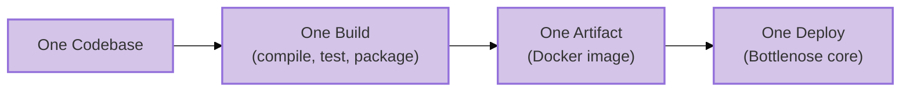
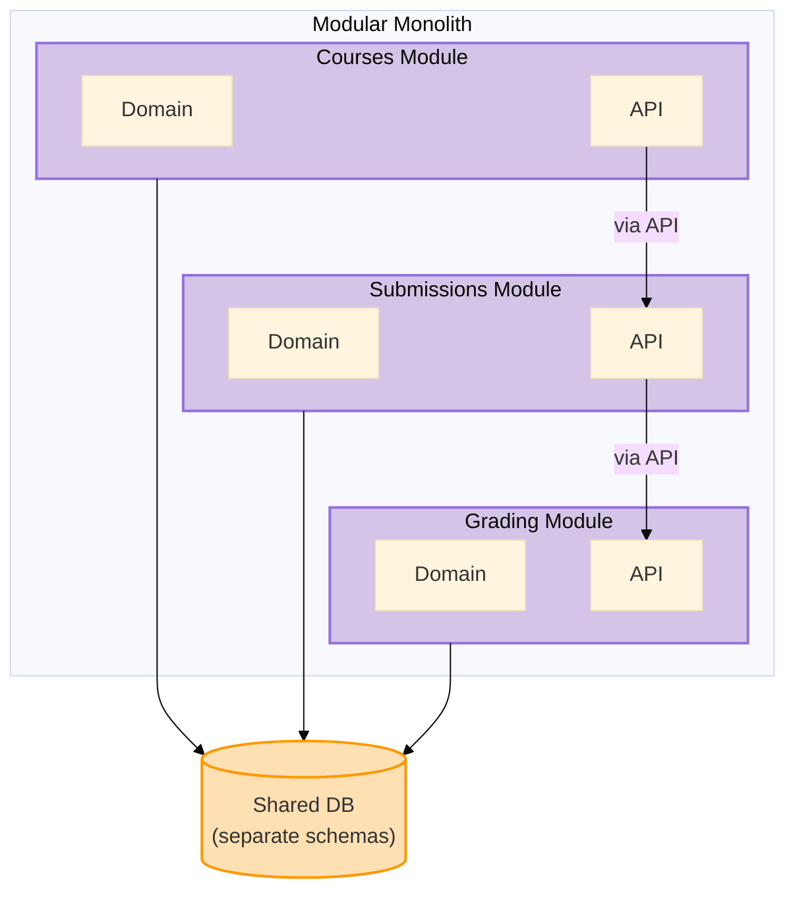

<style>
{`
  .reveal {
    font-size: 30px !important;
  }
`}
</style>

import RevealJS, { Slide } from '@site/src/components/RevealJS';
import Img from '@site/src/components/Img';
import PollSlide from "@site/src/components/PollSlide";
import QuoteSlide from "@site/src/components/QuoteSlide";

<RevealJS transition="slide">

<aside className="notes">
- Arc 1: From spaghetti code to programs of tens of millions of lines
- Arc 2: Monoliths
- Arc 3: Ilities
</aside>

{/* ============================================ */}
{/* COVER IMAGE */}
{/* ============================================ */}

<Slide>
  

<aside className="notes">

</aside>

</Slide>

{/* ============================================ */}
{/* TITLE SLIDE */}
{/* ============================================ */}

<Slide>

# CS 3100: Program Design and Implementation II

## Lecture 19: Architectural Styles — From Hexagons to Monoliths

<p style={{marginTop: '2em', fontSize: '0.8em', color: '#666'}}>
  ©2026 Jonathan Bell & Ellen Spertus, CC-BY-SA
</p>

</Slide>

{/* ============================================ */}
{/* LEARNING OBJECTIVES */}
{/* ============================================ */}

<Slide>

## Learning Objectives

<p style={{fontSize: '0.85em', textAlign: 'left'}}>
After this lecture, you will be able to:
</p>

<ol style={{fontSize: '0.75em', textAlign: 'left'}}>
  <li>Define <strong>quality attributes</strong> that architectural styles affect: maintainability, scalability, deployability, fault tolerance, and more</li>
  <li>Distinguish between <strong>architectural styles</strong> and <strong>architectural patterns</strong></li>
  <li><strong>Recognize and compare</strong> architectural styles like <strong>Hexagonal</strong>, <strong>Layered</strong>, <strong>Pipelined</strong>, and <strong>Monolithic</strong></li>
  <li>Explain the tradeoffs of <strong>monoliths</strong>, <strong>modular monoliths</strong>, and <strong>microservices</strong></li>
  <li>Analyze how architectural choices <strong>affect quality attributes differently</strong> for specific scenarios</li>
</ol>

<div className="fragment">
<p style={{fontSize: '0.75em', marginTop: '0.75em', fontStyle: 'italic', color: '#666'}}>
<strong>Important framing:</strong> You are NOT expected to become master architects by the end of this lecture. The goal is to <em>understand systems that use these styles</em> and reason about how architectural decisions impact quality attributes. When you encounter a hexagonal or layered architecture in the wild, you'll be able to read it — not necessarily design it from scratch.
</p>
</div>

<aside className="notes">
→ **Transition:** Let's start with a question you'll face every time you write software...
</aside>

</Slide>


{/* ============================================ */}
{/* MOTIVATING QUESTION: CODE ORGANIZATION */}
{/* ============================================ */}

<Slide>

## How Do We Organize Our Code?

<p style={{fontSize: '0.85em'}}>
This is the question at the heart of every architectural decision — from your first class project to production systems serving millions of users. Every pattern and style we study today is an answer to this question.
</p>


<aside className="notes">
→ **Transition:** Why "spaghetti"?
</aside>
</Slide>

<Slide>

## The Origin of Spaghetti Code: goto

The most popular hobbyist language in the 1970s was
BASIC.

<div>
```basic
10 PRINT "Choose an option:"
20 PRINT "1. Say Hello"
30 PRINT "2. Say Goodbye"
40 PRINT "3. Exit"
50 INPUT CHOICE
60 IF CHOICE = 1 THEN GOTO 100
70 IF CHOICE = 2 THEN GOTO 110
80 IF CHOICE = 3 THEN GOTO 120
90 GOTO 10
100 PRINT "Hello!"
110 GOTO 10
120 PRINT "Goodbye!"
130 GOTO 10
140 END
```
</div>

<div className="fragment">
How many paths lead to line 10?
</div>

<aside className="notes">
* Let them think about number of paths and share answers.
* The number of paths is infinite.
* That makes it hard to reason about programs.
→ **Transition:** Let's visualize this...
</aside>

</Slide>


<Slide>

## Spaghetti Code
<svg xmlns="http://www.w3.org/2000/svg" width="700" height="380" viewBox="0 0 700 380" font-family="'Courier New', Courier, monospace">
  <!-- Background -->
  <rect width="700" height="380" fill="#1a1a2e"/>

  <defs>
    <marker id="arrow-white" markerWidth="8" markerHeight="8" refX="6" refY="3" orient="auto">
      <path d="M0,0 L0,6 L8,3 z" fill="white"/>
    </marker>
  </defs>

  <!-- Title -->
  <text x="180" y="30" fill="white" font-size="13" font-weight="bold">GOTO MENU SYSTEM</text>

  <!-- Code lines — shifted right to make room for arrows on left -->
  <!-- Line numbers at x=180, code at x=215, line y spacing=26 starting at 55 -->

  <text x="180" y="55"  fill="#aaa" font-size="13">10</text>
  <text x="215" y="55"  fill="white" font-size="13">PRINT "Choose an option:"</text>

  <text x="180" y="81"  fill="#aaa" font-size="13">20</text>
  <text x="215" y="81"  fill="white" font-size="13">PRINT "1. Say Hello"</text>

  <text x="180" y="107" fill="#aaa" font-size="13">30</text>
  <text x="215" y="107" fill="white" font-size="13">PRINT "2. Say Goodbye"</text>

  <text x="180" y="133" fill="#aaa" font-size="13">40</text>
  <text x="215" y="133" fill="white" font-size="13">PRINT "3. Exit"</text>

  <text x="180" y="159" fill="#aaa" font-size="13">50</text>
  <text x="215" y="159" fill="white" font-size="13">INPUT CHOICE</text>

  <text x="180" y="185" fill="#aaa" font-size="13">60</text>
  <text x="215" y="185" fill="white" font-size="13">IF CHOICE = 1 THEN GOTO 100</text>

  <text x="180" y="211" fill="#aaa" font-size="13">70</text>
  <text x="215" y="211" fill="white" font-size="13">IF CHOICE = 2 THEN GOTO 110</text>

  <text x="180" y="237" fill="#aaa" font-size="13">80</text>
  <text x="215" y="237" fill="white" font-size="13">IF CHOICE = 3 THEN GOTO 120</text>

  <text x="180" y="263" fill="#aaa" font-size="13">90</text>
  <text x="215" y="263" fill="white" font-size="13">GOTO 10</text>

  <text x="180" y="289" fill="#aaa" font-size="13">100</text>
  <text x="215" y="289" fill="white" font-size="13">PRINT "Hello!"</text>

  <text x="180" y="315" fill="#aaa" font-size="13">110</text>
  <text x="215" y="315" fill="white" font-size="13">GOTO 10</text>

  <text x="180" y="341" fill="#aaa" font-size="13">120</text>
  <text x="215" y="341" fill="white" font-size="13">PRINT "Goodbye!"</text>

  <text x="180" y="367" fill="#aaa" font-size="13">130</text>
  <text x="215" y="367" fill="white" font-size="13">GOTO 10</text>

  <!-- Arc arrows on the LEFT side -->
  <!-- Rail x values: innermost=170, then stepping out by ~30 for wider arcs -->
  <!-- All arrows point UP (backward) or DOWN (forward) to line 10 or beyond -->

  <!-- FORWARD arcs (source below target): arc LEFT and DOWN -->

  <!-- 60 → 100: from y=185 to y=289, rail at x=130 -->
  <path d="M 175,181 C 130,181 130,285 175,285" fill="none" stroke="white" stroke-width="1.5" marker-end="url(#arrow-white)"/>

  <!-- 70 → 110: from y=211 to y=315, rail at x=100 -->
  <path d="M 175,207 C 95,207 95,311 175,311" fill="none" stroke="white" stroke-width="1.5" marker-end="url(#arrow-white)"/>

  <!-- 80 → 120: from y=237 to y=341, rail at x=65 -->
  <path d="M 175,233 C 55,233 55,337 175,337" fill="none" stroke="white" stroke-width="1.5" marker-end="url(#arrow-white)"/>

  <!-- BACKWARD arcs (source below target, jumping back to line 10 y=55) -->

  <!-- 90 → 10: from y=263 to y=55, rail at x=130 -->
  <path d="M 175,259 C 130,259 130,51 175,51" fill="none" stroke="white" stroke-width="1.5" marker-end="url(#arrow-white)"/>

  <!-- 110 → 10: from y=315 to y=55, rail at x=95 -->
  <path d="M 175,311 C 90,311 90,51 175,51" fill="none" stroke="white" stroke-width="1.5" marker-end="url(#arrow-white)"/>

  <!-- 130 → 10: from y=367 to y=55, rail at x=55 -->
  <path d="M 175,363 C 45,363 45,51 175,51" fill="none" stroke="white" stroke-width="1.5" marker-end="url(#arrow-white)"/>

</svg>

<aside className="notes">

</aside>

</Slide>

<Slide>
## Dangers of Unstructured Programming

<QuoteSlide
  quote="It is practically impossible to teach good programming to students
that have had a prior exposure to BASIC: as potential programmers
they are mentally mutilated beyond hope of regeneration."
  imageSrc="/img/lectures/l1-intro/Edsger_Wybe_Dijkstra-cc-by-sa-3-Hamilton-Richards.jpg"
  author="Edsger Dijkstra"
  credit="Photo: Hamilton Richards, CC BY-SA 3.0 ● Quote: EWD498 (1975)"
/>
</Slide>

<Slide>
## xkcd on goto


 <p style={{fontSize: '0.6em', color: '#999', marginTop: '0.5em'}}>
  <a href="https://xkcd.com/292/">xkcd #292 "goto"</a> by Randall Munroe, CC BY-NC 2.5
</p>

</Slide>

<Slide>

## Software Size Large


 <p style={{fontSize: '0.6em', color: '#999', marginTop: '0.5em'}}>
  source: <a href="https://informationisbeautiful.net/visualizations/million-lines-of-code/">information is beautiful</a>
</p>

</Slide>

<Slide>

## From Hundreds to Millions of Lines

<div style={{display: 'grid', gridTemplateColumns: '1fr 1fr', gap: '1em', fontSize: '0.68em', marginTop: '1em'}}>

<div className="fragment" style={{padding: '1em', border: '2px solid #4CAF50', borderRadius: '8px'}}>

**Languages & Paradigms**

- structured programming
- object-oriented programming
- type systems and generics

</div>

<div className="fragment" style={{padding: '1em', border: '2px solid #2196F3', borderRadius: '8px'}}>

**Tools & Infrastructure**

- compilers, linkers, IDEs
- version control software
- package managers
- static analysis

</div>

<div className="fragment" style={{padding: '1em', border: '2px solid #9C27B0', borderRadius: '8px'}}>

**Patterns and Principles**
- design patterns
- SOLID principles
- TODO: add more or rethink

</div>

<div className="fragment" style={{padding: '1em', border: '2px solid #00BCD4', borderRadius: '8px'}}>

**Quality Practices**

- automated unit & integration testing
- test-driven development (TDD)
- code review
- continuous integration

</div>

</div>

<div className="fragment">
<div style={{padding: '0.75em 1em', border: '2px solid #FF9800', borderRadius: '8px', fontSize: '0.75em', marginTop: '1em', fontWeight: 'bold', color: '#FF9800'}}>
🏛️ Architectural Patterns — today's topic: how do we structure entire systems?
</div>
</div>

</Slide>


{/* ============================================ */}
{/* ARC 2: MONOLITH DEEP DIVE */}
{/* ============================================ */}

<Slide>

## The Starting Point: Monoliths

A system deployed as a single unit

<div style={{display: 'grid', gridTemplateColumns: '1fr 1fr 1fr', gap: '0.5em', fontSize: '0.6em', marginTop: '1em'}}>

<div className="fragment" style={{padding: '0.5em', border: '2px solid #9370DB', borderRadius: '8px', textAlign: 'center'}}>

**Single Deployment**

One build. One deploy. One running process.

</div>

<div className="fragment" style={{padding: '0.5em', border: '2px solid #4CAF50', borderRadius: '8px', textAlign: 'center'}}>

**Shared Memory**

Components talk via method calls, not networks.

</div>

<div className="fragment" style={{padding: '0.5em', border: '2px solid #FF9800', borderRadius: '8px', textAlign: 'center'}}>

**Unified Codebase**

One repo, one build system, one language.

</div>

</div>

<div className="fragment">

</div>

<aside className="notes">
* The starting point
  * probably all programs you've written
  * where most projects start, until they grow too bit
→ **Transition:** Let's dig into what each of these means concretely...
</aside>

</Slide>

<Slide>

## What "Single Deployment Unit" Really Means

<p style={{fontSize: '0.82em'}}>
In a monolith, everything ships together. One <code>git push</code>, one CI pipeline, one artifact, one deploy.
</p>

<div style={{fontSize: '0.65em', marginTop: '0.5em'}}>



</div>

<div style={{display: 'grid', gridTemplateColumns: '1fr 1fr', gap: '1em', fontSize: '0.65em', marginTop: '0.5em'}}>

<div style={{padding: '0.75em', border: '2px solid #4CAF50', borderRadius: '8px'}}>

**This means:**
- Fix a typo in the grading UI? Redeploy the whole app.
- Update a dependency for course management? Redeploy the whole app.
- Every change goes through the same pipeline.

</div>

<div style={{padding: '0.75em', border: '2px solid #FF9800', borderRadius: '8px'}}>

**The consequence:**
- You can't deploy grading fixes without also deploying whatever else changed
- A broken test in course management blocks a grading deploy
- Deployment frequency is limited by the slowest-moving part

</div>

</div>

<aside className="notes">
**Make this visceral for students:**
- "You fixed a one-line bug in how grading jobs are queued. To get that fix to students, you have to redeploy the ENTIRE application."
- "Your CI pipeline takes 20 minutes. Every change — no matter how small — waits 20 minutes."
- "Someone merged a broken migration for courses. Your grading fix can't deploy until that's fixed too."

**The positive spin:**
- One deploy means ONE thing to monitor, ONE rollback strategy, ONE set of health checks
- You always know exactly what's running in production — the latest build

→ **Transition:** What about shared memory?
</aside>

</Slide>

<Slide>

## "Shared Memory" Means Communication through Objects and Method Calls

<div className='fragment' style={{ fontSize: '.8em' }}>
```java
// All in one process, one memory space
Course course = courseRepo.findById(courseId);
Assignment assignment = course.createAssignment(name, dueDate);

// Method call
Grader grader = GraderFactory.buildFor(assignment, config);

// One database transaction wraps everything
transaction(() -> {
    assignment.setGrader(grader);
    for (Registration reg : course.getRegistrations())
        notificationService.notifyNewAssignment(reg, assignment);
}); // If ANY step fails, ALL steps roll back
```
</div>

<div className="fragment" style={{padding: '0.25em', border: '2px solid #FF9800', borderRadius: '8px'}}>

**What you get for free:**
- **Speed:** Method calls take nanoseconds
- **Reliability:** If you call a method, it runs
- **Transactions:** Wrap multiple operations in one atomic unit — all succeed or all roll back
- **Objects by reference:** Pass an `Assignment` object around; everyone sees the same data
- **Debugging:** Set a breakpoint, step through the entire flow in one debugger session

</div>

<div className="fragment">
<p style={{fontSize: '0.78em', marginTop: '0.5em', color: '#FF9800'}}>
⚠️ When components move to different processes or different machines, every one of these guarantees disappears.
</p>
</div>

<aside className="notes">
You've been able to take these for granted, because you've been programming monoliths.
→ **Transition:** And what about working in one codebase?
</aside>

</Slide>

<Slide>

## What "Unified Codebase" Really Means

All code is in the <strong>same repository</strong>, with the <strong>same build system</strong> and the <strong>same dependency tree</strong>.

<div style={{display: 'flex', flexDirection: 'column', gap: '1em', fontSize: '0.65em', marginTop: '0em'}}>

<div className="fragment" style={{padding: '0.25em', border: '2px solid #4CAF50', borderRadius: '8px'}}>

**Benefits of one codebase**
- **Refactoring is easy:** rename a method and your IDE finds every caller
- **Code sharing is free:** import any class from any package
- **Consistency:** one style guide, one set of linters, one test framework
- **Onboarding:** new developers learn ONE system, not twelve

</div>

<div className="fragment" style={{padding: '0.25em', border: '2px solid #FF9800', borderRadius: '8px'}}>

**Costs of one codebase**
- **Merge conflicts:** Unless there's a strong enforcement of modularity, it's easy to step on each other's toes
- **Slow builds:** the whole app rebuilds even for small changes
- **Technology lock-in:** The whole system uses one language, one framework
- **Blast radius:** a bad commit affects everything

</div>

</div>

<aside className="notes">
Explain merge conflicts

→ **Transition:** So how does a monolith score on quality attributes?
</aside>

</Slide>


{/* ============================================ */}
{/* MONOLITH QUALITY PROFILE */}
{/* ============================================ */}

<Slide>

## Monolith: Quality Attribute Profile

<div style={{display: 'grid', gridTemplateColumns: '1fr 1fr', gap: '1em', fontSize: '0.65em', marginTop: '0.5em'}}>

<div style={{padding: '0.75em', border: '2px solid #4CAF50', borderRadius: '8px'}}>

**Where Monoliths Excel**

- **Simplicity** ★★★ — One thing to build, test, deploy, monitor
- **Responsiveness** ★★★ — In-process calls are orders of magnitude faster than network calls
- **Testability** ★★☆ — One environment to set up, but may need full infrastructure
- **Changeability** ★★☆ — IDE refactoring across entire codebase, but changes may ripple

</div>

<div style={{padding: '0.75em', border: '2px solid #FF9800', borderRadius: '8px'}}>

**Where Monoliths Struggle**

- **Scalability** ★☆☆ — Must scale the entire app; heavy work competes with everything else
- **Deployability** ★☆☆ — Every deploy is all-or-nothing; a bug anywhere blocks everything
- **Fault Tolerance** ★☆☆ — A crash in any component takes down the entire process
- **Modularity** ★☆☆ — Boundaries are conventions, not enforcement (without discipline → Big Ball of Mud)

</div>

</div>

<div className="fragment">
<p style={{fontSize: '0.78em', marginTop: '0.75em', fontWeight: 'bold', color: '#9370DB'}}>
Notice the modularity problem: without enforced boundaries, monoliths tend toward the <strong>Big Ball of Mud</strong> we saw earlier. Is there a way to get monolith simplicity WITH better modularity?
</p>
</div>

<aside className="notes">
**Walk through the ratings:**
- Simplicity ★★★: One thing to build, deploy, monitor. The defining strength.
- Responsiveness ★★★: Method calls in nanoseconds, database transactions, full stack traces.
- Scalability ★☆☆: Vertical only — bigger hardware. Heavy work competes for shared resources.
- Deployability ★☆☆: All-or-nothing. A broken test anywhere blocks everything.
- Fault Tolerance ★☆☆: Bug in one module crashes everything — one process, one fate.
- Modularity ★☆☆: Boundaries exist only as conventions. Without discipline → Big Ball of Mud.

**The fragment sets up the modular monolith:**
- This is the key problem we're going to solve
- The monolith is great EXCEPT for modularity
- Can we have both?

→ **Transition:** Yes — that's exactly what a modular monolith gives us...
</aside>

</Slide>

{/* ============================================ */}
{/* MODULAR MONOLITH */}
{/* ============================================ */}

<Slide>

## The Modular Monolith: Best of Both Worlds?

<p style={{fontSize: '0.82em'}}>
A <strong>modular monolith</strong> keeps the simplicity of a single deployment but adds <strong>enforced internal boundaries</strong>. All the operational simplicity of a monolith, with intentional structure to prevent the Big Ball of Mud.
</p>

<div style={{display: 'grid', gridTemplateColumns: '1fr 1fr', gap: '1.5em', alignItems: 'start'}}>

<div style={{fontSize: '0.75em', marginTop: '-0.5em'}}>


</div>

<div className="fragment" style={{fontSize: '0.65em'}}>

<div style={{padding: '0.5em', border: '2px solid #4CAF50', borderRadius: '6px', textAlign: 'center', marginBottom: '0.5em'}}>

**Simplicity** ★★★

Still one deploy, one build

</div>

<div style={{padding: '0.5em', border: '2px solid #4CAF50', borderRadius: '6px', textAlign: 'center', marginBottom: '0.5em'}}>

**Modularity** ★★★

Enforced internal boundaries

</div>

<div style={{padding: '0.5em', border: '2px solid #4A90A4', borderRadius: '6px', textAlign: 'center', marginBottom: '0.5em'}}>

**Changeability** ★★☆

Changes isolated to modules

</div>

<div style={{padding: '0.5em', border: '2px solid #FF9800', borderRadius: '6px', textAlign: 'center'}}>

**Scalability** ★☆☆

Still one process to scale

</div>

</div>

</div>

<aside className="notes">
**The key insight:**
- Many teams discover they NEVER need microservices
- Module boundaries solve maintainability and team ownership problems
- Without the complexity of network communication

→ **Transition:** But how do we decide what goes in each module? There are two fundamental approaches...
</aside>

</Slide>

{/* ============================================ */}
{/* PARTITIONING: TECHNICAL VS DOMAIN */}
{/* ============================================ */}

<Slide>

## Organizing Modules: Technical or Domain Partitioning?

<p style={{fontSize: '0.82em'}}>
Whether you're building a modular monolith or just organizing packages, there's a fundamental choice: group code by <strong>technical role</strong> or by <strong>domain capability</strong>?
</p>

<div style={{display: 'grid', gridTemplateColumns: '1fr 1fr', gap: '1em', fontSize: '0.5em', marginTop: '0.5em'}}>

<div style={{padding: '0.75em', border: '2px solid #FF9800', borderRadius: '8px'}}>

**Technical Partitioning**

```
autograder/
├── controllers/
│   ├── CourseController.java
│   └── SubmissionController.java
├── services/
│   └── GradingService.java
├── repositories/
│   ├── CourseRepository.java
│   ├── GradeRepository.java
│   └── SubmissionRepository.java
└── models/
    ├── Submission.java
    ├── Course.java
    └── Grade.java
```

*Organized by technical role — controllers together, models together*

</div>

<div style={{padding: '0.75em', border: '2px solid #4CAF50', borderRadius: '8px'}}>

**Domain Partitioning**

```
autograder/
├── grading/
│   ├── GradingService.java
│   ├── Grade.java
│   └── GradeRepository.java
├── submissions/
│   ├── SubmissionController.java
│   ├── Submission.java
│   └── SubmissionRepository.java
└── courses/
    ├── CourseController.java
    ├── Course.java
    └── CourseRepository.java
```

*Organized by business capability — everything for grading together*

</div>

</div>

<aside className="notes">
Whether you're building a modular monolith or just organizing packages, there's a fundamental choice: group code by <strong>technical role</strong> or by <strong>domain capability</strong>?


**Most web frameworks encourage technical partitioning:**
- Rails: controllers/, models/, views/
- Spring: convention of packages by layer
- This works fine for small apps

**But as systems grow, domain partitioning often wins:**
- "How does grading work?" → everything in `grading/` package
- "Add Rust support?" → all changes in one vertical slice

→ **Transition:** Let's see how these tradeoffs play out...
</aside>

</Slide>

<Slide>

## Partitioning Tradeoffs

<div style={{fontSize: '0.68em', marginTop: '0.5em'}}>

| Question | Technical | Domain |
|----------|-----------|--------|
| **"How does Java grading work?"** | Jump between `controllers/`, `services/`, `models/` | Everything in `grading/java/` |
| **Adding Rust support?** | New files in `controllers/`, `services/`, `models/` | All changes in `grading/rust/` |
| **Team independence?** | Every feature touches multiple packages | "Rust support team" owns their vertical slice |

</div>

<div className="fragment">
<div style={{padding: '0.75em', border: '2px solid #9370DB', borderRadius: '8px', marginTop: '0.75em', fontSize: '0.72em'}}>

**Connection to L18 heuristics:**
- **Actor Ownership** → Domain partitioning aligns with who owns what
- **Rate of Change** → Technical partitioning separates things that change together
- The "right" choice depends on your team structure and change patterns

</div>
</div>

<div className="fragment">
<p style={{fontSize: '0.75em', marginTop: '0.5em', fontStyle: 'italic', color: '#666'}}>
<strong>Conway's Law</strong> (L22 preview): Organizations design systems that mirror their communication structure. If you have a "frontend team" and "backend team," you'll get technical partitioning. If you have a "grading team" and "courses team," you'll get domain partitioning.
</p>
</div>

<aside className="notes">
**The key insight:**
- Domain partitioning keeps related changes together
- Technical partitioning scatters related changes across packages
- The "right" choice depends on how your team is structured

**Connection to L18:**
- These are the SAME heuristics we used to find service boundaries
- Actor ownership: who changes what?
- Rate of change: what changes together?
- Now we're applying them INSIDE the monolith

→ **Transition:** Now that we understand how to organize modules, let's build vocabulary for evaluating any architecture...
</aside>

</Slide>


</RevealJS>