<style>
{`
  .reveal {
    font-size: 30px !important;
  }
`}
</style>

import RevealJS, { Slide } from '@site/src/components/RevealJS';
import Img from '@site/src/components/Img';
import PollSlide from "@site/src/components/PollSlide";
import QuoteSlide from "@site/src/components/QuoteSlide";

<RevealJS transition="slide">

<aside className="notes">
- Arc 1: From spaghetti code to programs of tens of millions of lines
- Arc 2: Monoliths
- Arc 3: Ilities
- Arc 4: Styles -> Patterns
- Arc 5: Synthesis
</aside>

{/* ============================================ */}
{/* COVER IMAGE */}
{/* ============================================ */}

<Slide>
  

<aside className="notes">

</aside>

</Slide>

{/* ============================================ */}
{/* TITLE SLIDE */}
{/* ============================================ */}

<Slide>

# CS 3100: Program Design and Implementation II

## Lecture 19: Architectural Styles — From Hexagons to Monoliths

<p style={{marginTop: '2em', fontSize: '0.8em', color: '#666'}}>
  ©2026 Jonathan Bell & Ellen Spertus, CC-BY-SA
</p>

</Slide>

{/* ============================================ */}
{/* LEARNING OBJECTIVES */}
{/* ============================================ */}

<Slide>

## Learning Objectives

<p style={{fontSize: '0.85em', textAlign: 'left'}}>
After this lecture, you will be able to:
</p>

<ol style={{fontSize: '0.75em', textAlign: 'left'}}>
  <li>Define <strong>quality attributes</strong> that architectural styles affect: maintainability, scalability, deployability, fault tolerance, and more</li>
  <li>Distinguish between <strong>architectural styles</strong> and <strong>architectural patterns</strong></li>
  <li><strong>Recognize and compare</strong> architectural styles like <strong>Hexagonal</strong>, <strong>Layered</strong>, <strong>Pipelined</strong>, and <strong>Monolithic</strong></li>
  <li>Explain the tradeoffs of <strong>monoliths</strong>, <strong>modular monoliths</strong>, and <strong>microservices</strong></li>
  <li>Analyze how architectural choices <strong>affect quality attributes differently</strong> for specific scenarios</li>
</ol>

<div className="fragment">
<p style={{fontSize: '0.75em', marginTop: '0.75em', fontStyle: 'italic', color: '#666'}}>
<strong>Important framing:</strong> You are NOT expected to become master architects by the end of this lecture. The goal is to <em>understand systems that use these styles</em> and reason about how architectural decisions impact quality attributes. When you encounter a hexagonal or layered architecture in the wild, you'll be able to read it — not necessarily design it from scratch.
</p>
</div>

<aside className="notes">
→ **Transition:** Let's start with a question you'll face every time you write software...
</aside>

</Slide>


{/* ============================================ */}
{/* MOTIVATING QUESTION: CODE ORGANIZATION */}
{/* ============================================ */}

<Slide>

## How Do We Organize Our Code?

<p style={{fontSize: '0.85em'}}>
This is the question at the heart of every architectural decision — from your first class project to production systems serving millions of users. Every pattern and style we study today is an answer to this question.
</p>


<aside className="notes">
→ **Transition:** Why "spaghetti"?
</aside>
</Slide>

<Slide>

## The Origin of Spaghetti Code: goto

The most popular hobbyist language in the 1970s was
BASIC.

<div>
```basic
10 PRINT "Choose an option:"
20 PRINT "1. Say Hello"
30 PRINT "2. Say Goodbye"
40 PRINT "3. Exit"
50 INPUT CHOICE
60 IF CHOICE = 1 THEN GOTO 100
70 IF CHOICE = 2 THEN GOTO 110
80 IF CHOICE = 3 THEN GOTO 120
90 GOTO 10
100 PRINT "Hello!"
110 GOTO 10
120 PRINT "Goodbye!"
130 GOTO 10
140 END
```
</div>

<div className="fragment">
How many paths lead to line 10?
</div>

<aside className="notes">
* Let them think about number of paths and share answers.
* The number of paths is infinite.
* That makes it hard to reason about programs.
→ **Transition:** Let's visualize this...
</aside>

</Slide>


<Slide>

## Spaghetti Code
<svg xmlns="http://www.w3.org/2000/svg" width="700" height="380" viewBox="0 0 700 380" font-family="'Courier New', Courier, monospace">
  <!-- Background -->
  <rect width="700" height="380" fill="#1a1a2e"/>

  <defs>
    <marker id="arrow-white" markerWidth="8" markerHeight="8" refX="6" refY="3" orient="auto">
      <path d="M0,0 L0,6 L8,3 z" fill="white"/>
    </marker>
  </defs>

  <!-- Title -->
  <text x="180" y="30" fill="white" font-size="13" font-weight="bold">GOTO MENU SYSTEM</text>

  <!-- Code lines — shifted right to make room for arrows on left -->
  <!-- Line numbers at x=180, code at x=215, line y spacing=26 starting at 55 -->

  <text x="180" y="55"  fill="#aaa" font-size="13">10</text>
  <text x="215" y="55"  fill="white" font-size="13">PRINT "Choose an option:"</text>

  <text x="180" y="81"  fill="#aaa" font-size="13">20</text>
  <text x="215" y="81"  fill="white" font-size="13">PRINT "1. Say Hello"</text>

  <text x="180" y="107" fill="#aaa" font-size="13">30</text>
  <text x="215" y="107" fill="white" font-size="13">PRINT "2. Say Goodbye"</text>

  <text x="180" y="133" fill="#aaa" font-size="13">40</text>
  <text x="215" y="133" fill="white" font-size="13">PRINT "3. Exit"</text>

  <text x="180" y="159" fill="#aaa" font-size="13">50</text>
  <text x="215" y="159" fill="white" font-size="13">INPUT CHOICE</text>

  <text x="180" y="185" fill="#aaa" font-size="13">60</text>
  <text x="215" y="185" fill="white" font-size="13">IF CHOICE = 1 THEN GOTO 100</text>

  <text x="180" y="211" fill="#aaa" font-size="13">70</text>
  <text x="215" y="211" fill="white" font-size="13">IF CHOICE = 2 THEN GOTO 110</text>

  <text x="180" y="237" fill="#aaa" font-size="13">80</text>
  <text x="215" y="237" fill="white" font-size="13">IF CHOICE = 3 THEN GOTO 120</text>

  <text x="180" y="263" fill="#aaa" font-size="13">90</text>
  <text x="215" y="263" fill="white" font-size="13">GOTO 10</text>

  <text x="180" y="289" fill="#aaa" font-size="13">100</text>
  <text x="215" y="289" fill="white" font-size="13">PRINT "Hello!"</text>

  <text x="180" y="315" fill="#aaa" font-size="13">110</text>
  <text x="215" y="315" fill="white" font-size="13">GOTO 10</text>

  <text x="180" y="341" fill="#aaa" font-size="13">120</text>
  <text x="215" y="341" fill="white" font-size="13">PRINT "Goodbye!"</text>

  <text x="180" y="367" fill="#aaa" font-size="13">130</text>
  <text x="215" y="367" fill="white" font-size="13">GOTO 10</text>

  <!-- Arc arrows on the LEFT side -->
  <!-- Rail x values: innermost=170, then stepping out by ~30 for wider arcs -->
  <!-- All arrows point UP (backward) or DOWN (forward) to line 10 or beyond -->

  <!-- FORWARD arcs (source below target): arc LEFT and DOWN -->

  <!-- 60 → 100: from y=185 to y=289, rail at x=130 -->
  <path d="M 175,181 C 130,181 130,285 175,285" fill="none" stroke="white" stroke-width="1.5" marker-end="url(#arrow-white)"/>

  <!-- 70 → 110: from y=211 to y=315, rail at x=100 -->
  <path d="M 175,207 C 95,207 95,311 175,311" fill="none" stroke="white" stroke-width="1.5" marker-end="url(#arrow-white)"/>

  <!-- 80 → 120: from y=237 to y=341, rail at x=65 -->
  <path d="M 175,233 C 55,233 55,337 175,337" fill="none" stroke="white" stroke-width="1.5" marker-end="url(#arrow-white)"/>

  <!-- BACKWARD arcs (source below target, jumping back to line 10 y=55) -->

  <!-- 90 → 10: from y=263 to y=55, rail at x=130 -->
  <path d="M 175,259 C 130,259 130,51 175,51" fill="none" stroke="white" stroke-width="1.5" marker-end="url(#arrow-white)"/>

  <!-- 110 → 10: from y=315 to y=55, rail at x=95 -->
  <path d="M 175,311 C 90,311 90,51 175,51" fill="none" stroke="white" stroke-width="1.5" marker-end="url(#arrow-white)"/>

  <!-- 130 → 10: from y=367 to y=55, rail at x=55 -->
  <path d="M 175,363 C 45,363 45,51 175,51" fill="none" stroke="white" stroke-width="1.5" marker-end="url(#arrow-white)"/>

</svg>

</Slide>

<Slide>
## Dangers of Unstructured Programming

<QuoteSlide
  quote="It is practically impossible to teach good programming to students
that have had a prior exposure to BASIC: as potential programmers
they are mentally mutilated beyond hope of regeneration."
  imageSrc="/img/lectures/l1-intro/Edsger_Wybe_Dijkstra-cc-by-sa-3-Hamilton-Richards.jpg"
  author="Edsger Dijkstra"
  credit="Photo: Hamilton Richards, CC BY-SA 3.0 ● Quote: EWD498 (1975)"
/>
</Slide>

<Slide>
## xkcd on goto


 <p style={{fontSize: '0.6em', color: '#999', marginTop: '0.5em'}}>
  <a href="https://xkcd.com/292/">xkcd #292 "goto"</a> by Randall Munroe, CC BY-NC 2.5
</p>

</Slide>

<Slide>

## Software Size Large


 <p style={{fontSize: '0.6em', color: '#999', marginTop: '0.5em'}}>
  source: <a href="https://informationisbeautiful.net/visualizations/million-lines-of-code/">information is beautiful</a>
</p>

</Slide>

<Slide>

## From Hundreds to Millions of Lines

<div style={{display: 'grid', gridTemplateColumns: '1fr 1fr', gap: '1em', fontSize: '0.68em', marginTop: '1em'}}>

<div className="fragment" style={{padding: '1em', border: '2px solid #4CAF50', borderRadius: '8px'}}>

**Languages & Paradigms**

- structured programming
- object-oriented programming
- type systems and generics

</div>

<div className="fragment" style={{padding: '1em', border: '2px solid #2196F3', borderRadius: '8px'}}>

**Tools & Infrastructure**

- compilers, linkers, IDEs
- version control software
- package managers
- static analysis

</div>

<div className="fragment" style={{padding: '1em', border: '2px solid #9C27B0', borderRadius: '8px'}}>

**Patterns and Principles**
- design patterns
- SOLID principles
- architecture styles and patterns

</div>

<div className="fragment" style={{padding: '1em', border: '2px solid #00BCD4', borderRadius: '8px'}}>

**Quality Practices**

- automated unit & integration testing
- test-driven development (TDD)
- code review
- continuous integration

</div>

</div>

<div className="fragment">
<div style={{padding: '0.75em 1em', border: '2px solid #FF9800', borderRadius: '8px', fontSize: '0.75em', marginTop: '1em', fontWeight: 'bold', color: '#FF9800'}}>
🏛️ Architectural Patterns — today's topic: how do we structure entire systems?
</div>
</div>

</Slide>


{/* ============================================ */}
{/* ARC 2: MONOLITH DEEP DIVE */}
{/* ============================================ */}

<Slide>

## The Starting Point: Monoliths

A system deployed as a single unit

<div style={{display: 'grid', gridTemplateColumns: '1fr 1fr 1fr', gap: '0.5em', fontSize: '0.6em', marginTop: '1em'}}>

<div className="fragment" style={{padding: '0.5em', border: '2px solid #9370DB', borderRadius: '8px', textAlign: 'center'}}>

**Single Deployment**

One build. One deploy. One running process.

</div>

<div className="fragment" style={{padding: '0.5em', border: '2px solid #4CAF50', borderRadius: '8px', textAlign: 'center'}}>

**Shared Memory**

Components talk via method calls, not networks.

</div>

<div className="fragment" style={{padding: '0.5em', border: '2px solid #FF9800', borderRadius: '8px', textAlign: 'center'}}>

**Unified Codebase**

One repo, one build system, one language.

</div>

</div>

<div className="fragment">

</div>

<aside className="notes">
* The starting point
  * probably all programs you've written
  * where most projects start, until they grow too bit
→ Transition: You might wonder if that applies to programs that call APIs.
</aside>

</Slide>

<Slide>

## Calling an External API Doesn't Change the Architecture

<div>

```java
// You deploy ONE jar — this is still a monolith
public class GradeNotifier {

    private final DiscordClient discordClient;

    public void notify(Student s, Grade g) {
        // Calling an external API doesn't change your deployment topology
        discordClient.sendMessage(s.getDiscordId(), g.toString());
    }
}
```


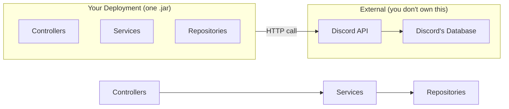

<p style={{marginTop: '0.75em', fontSize: '0.9em'}}>
The API is a <strong>dependency</strong>, not part of your deployment. You don't build it, deploy it, or scale it — just like a database.
</p>

</div>

<aside className="notes">
→ Transition: Let's look at what a deployment unit is.
</aside>

</Slide>

<Slide>

## What "Single Deployment Unit" Really Means

<p style={{fontSize: '0.82em'}}>
In a monolith, everything ships together. One <code>git push</code>, one CI pipeline, one artifact, one deploy.
</p>

<div style={{fontSize: '0.65em', marginTop: '0.5em'}}>

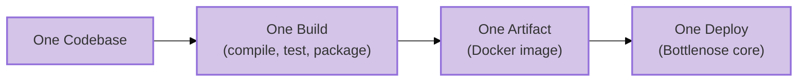

</div>

<div style={{display: 'grid', gridTemplateColumns: '1fr 1fr', gap: '1em', fontSize: '0.65em', marginTop: '0.5em'}}>

<div style={{padding: '0.75em', border: '2px solid #4CAF50', borderRadius: '8px'}}>

**This means:**
- Fix a typo in the grading UI? Redeploy the whole app.
- Update a dependency for course management? Redeploy the whole app.
- Every change goes through the same pipeline.

</div>

<div style={{padding: '0.75em', border: '2px solid #FF9800', borderRadius: '8px'}}>

**The consequence:**
- You can't deploy grading fixes without also deploying whatever else changed
- A broken test in course management blocks a grading deploy
- Deployment frequency is limited by the slowest-moving part

</div>

</div>

<aside className="notes">
**Make this visceral for students:**
- "You fixed a one-line bug in how grading jobs are queued. To get that fix to students, you have to redeploy the ENTIRE application."
- "Your CI pipeline takes 20 minutes. Every change — no matter how small — waits 20 minutes."
- "Someone merged a broken migration for courses. Your grading fix can't deploy until that's fixed too."

**The positive spin:**
- One deploy means ONE thing to monitor, ONE rollback strategy, ONE set of health checks
- You always know exactly what's running in production — the latest build

→ **Transition:** What about shared memory?
</aside>

</Slide>

<Slide>

## "Shared Memory" Means Communication through Objects and Method Calls

<div className='fragment' style={{ fontSize: '.8em' }}>
```java
// All in one process, one memory space
Course course = courseRepo.findById(courseId);
Assignment assignment = course.createAssignment(name, dueDate);

// Method call
Grader grader = GraderFactory.buildFor(assignment, config);

// One database transaction wraps everything
transaction(() -> {
    assignment.setGrader(grader);
    for (Registration reg : course.getRegistrations())
        notificationService.notifyNewAssignment(reg, assignment);
}); // If ANY step fails, ALL steps roll back
```
</div>

<div className="fragment" style={{padding: '0.25em', border: '2px solid #FF9800', borderRadius: '8px'}}>

**What you get for free:**
- **Speed:** Method calls take nanoseconds
- **Reliability:** If you call a method, it runs
- **Transactions:** Wrap multiple operations in one atomic unit — all succeed or all roll back
- **Objects by reference:** Pass an `Assignment` object around; everyone sees the same data
- **Debugging:** Set a breakpoint, step through the entire flow in one debugger session

</div>

<div className="fragment">
<p style={{fontSize: '0.78em', marginTop: '0.5em', color: '#FF9800'}}>
⚠️ When components move to different processes or different machines, every one of these guarantees disappears.
</p>
</div>

<aside className="notes">
You've been able to take these for granted, because you've been programming monoliths.
→ **Transition:** And what about working in one codebase?
</aside>

</Slide>

<Slide>

## What "Unified Codebase" Really Means

All code is in the <strong>same repository</strong>, with the <strong>same build system</strong> and the <strong>same dependency tree</strong>.

<div style={{display: 'flex', flexDirection: 'column', gap: '1em', fontSize: '0.65em', marginTop: '0em'}}>

<div className="fragment" style={{padding: '0.25em', border: '2px solid #4CAF50', borderRadius: '8px'}}>

**Benefits of one codebase**
- **Refactoring is easy:** rename a method and your IDE finds every caller
- **Code sharing is free:** import any class from any package
- **Consistency:** one style guide, one set of linters, one test framework
- **Onboarding:** new developers learn ONE system, not twelve

</div>

<div className="fragment" style={{padding: '0.25em', border: '2px solid #FF9800', borderRadius: '8px'}}>

**Costs of one codebase**
- **Merge conflicts:** Unless there's a strong enforcement of modularity, it's easy to step on each other's toes
- **Slow builds:** the whole app rebuilds even for small changes
- **Technology lock-in:** The whole system uses one language, one framework
- **Blast radius:** a bad commit affects everything

</div>

</div>

<aside className="notes">
Explain merge conflicts

→ **Transition:** So how does a monolith score on quality attributes?
</aside>

</Slide>


{/* ============================================ */}
{/* MONOLITH QUALITY PROFILE */}
{/* ============================================ */}

<Slide>

## Monolith: Quality Attribute Profile

<div style={{display: 'grid', gridTemplateColumns: '1fr 1fr', gap: '1em', fontSize: '0.65em', marginTop: '0.5em'}}>

<div style={{padding: '0.75em', border: '2px solid #4CAF50', borderRadius: '8px'}}>

**Where Monoliths Excel**

- **Simplicity** ★★★ — One thing to build, test, deploy, monitor
- **Responsiveness** ★★★ — In-process calls are orders of magnitude faster than network calls
- **Testability** ★★☆ — One environment to set up, but may need full infrastructure
- **Changeability** ★★☆ — IDE refactoring across entire codebase, but changes may ripple

</div>

<div style={{padding: '0.75em', border: '2px solid #FF9800', borderRadius: '8px'}}>

**Where Monoliths Struggle**

- **Scalability** ★☆☆ — Must scale the entire app; heavy work competes with everything else
- **Deployability** ★☆☆ — Every deploy is all-or-nothing; a bug anywhere blocks everything
- **Fault Tolerance** ★☆☆ — A crash in any component takes down the entire process
- **Modularity** ★☆☆ — Boundaries are conventions, not enforcement (without discipline → Big Ball of Mud)

</div>

</div>

<div className="fragment">
<p style={{fontSize: '0.78em', marginTop: '0.75em', fontWeight: 'bold', color: '#9370DB'}}>
Notice the modularity problem: without enforced boundaries, monoliths tend toward the <strong>Big Ball of Mud</strong> we saw earlier. Is there a way to get monolith simplicity WITH better modularity?
</p>
</div>

<aside className="notes">
**Walk through the ratings:**
- Simplicity ★★★: One thing to build, deploy, monitor. The defining strength.
- Responsiveness ★★★: Method calls in nanoseconds, database transactions, full stack traces.
- Scalability ★☆☆: Vertical only — bigger hardware. Heavy work competes for shared resources.
- Deployability ★☆☆: All-or-nothing. A broken test anywhere blocks everything.
- Fault Tolerance ★☆☆: Bug in one module crashes everything — one process, one fate.
- Modularity ★☆☆: Boundaries exist only as conventions. Without discipline → Big Ball of Mud.

→ **Transition:** A modular monolith gives us the best of both worlds...
</aside>

</Slide>

{/* ============================================ */}
{/* MODULAR MONOLITH */}
{/* ============================================ */}

<Slide>

## The Modular Monolith: Best of Both Worlds?

<p style={{fontSize: '0.82em'}}>
A <strong>modular monolith</strong> keeps the simplicity of a single deployment but adds <strong>enforced internal boundaries</strong>. All the operational simplicity of a monolith, with intentional structure to prevent the Big Ball of Mud.
</p>

<div style={{display: 'grid', gridTemplateColumns: '1fr 1fr', gap: '1.5em', alignItems: 'start'}}>

<div style={{fontSize: '0.75em', marginTop: '-0.5em'}}>
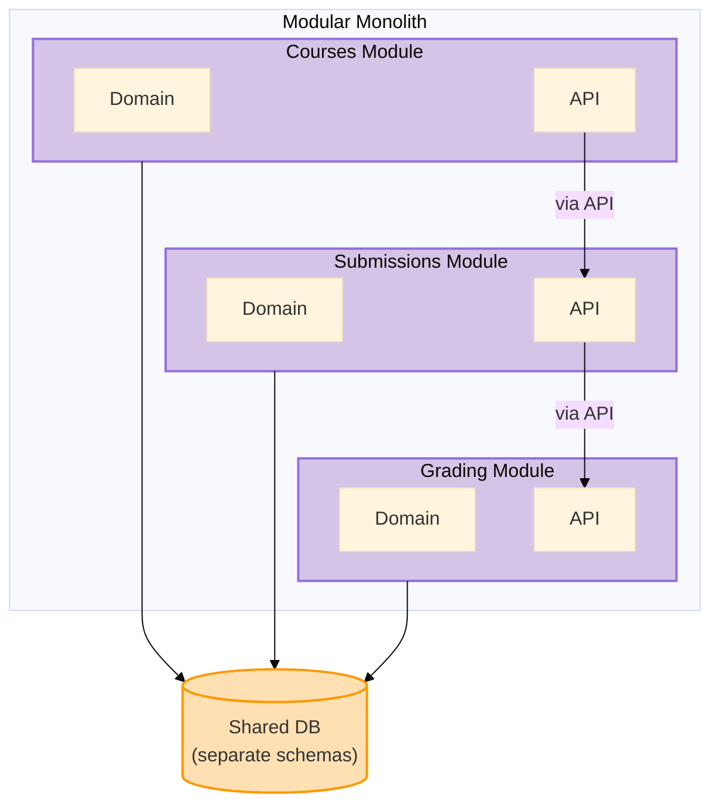

</div>

<div className="fragment" style={{fontSize: '0.65em'}}>

<div style={{padding: '0.5em', border: '2px solid #4CAF50', borderRadius: '6px', textAlign: 'center', marginBottom: '0.5em'}}>

**Simplicity** ★★★

Still one deploy, one build

</div>

<div style={{padding: '0.5em', border: '2px solid #4CAF50', borderRadius: '6px', textAlign: 'center', marginBottom: '0.5em'}}>

**Modularity** ★★★

Enforced internal boundaries

</div>

<div style={{padding: '0.5em', border: '2px solid #4A90A4', borderRadius: '6px', textAlign: 'center', marginBottom: '0.5em'}}>

**Changeability** ★★☆

Changes isolated to modules

</div>

<div style={{padding: '0.5em', border: '2px solid #FF9800', borderRadius: '6px', textAlign: 'center'}}>

**Scalability** ★☆☆

Still one process to scale

</div>

</div>

</div>

<aside className="notes">
**The key insight:**
- Many teams discover they NEVER need microservices
- Module boundaries solve maintainability and team ownership problems
- Without the complexity of network communication

→ **Transition:** But how do we decide what goes in each module? There are two fundamental approaches...
</aside>

</Slide>

{/* ============================================ */}
{/* PARTITIONING: TECHNICAL VS DOMAIN */}
{/* ============================================ */}

<Slide>

## Organizing Modules: Technical or Domain Partitioning?

<p style={{fontSize: '0.82em'}}>
Whether you're building a modular monolith or just organizing packages, there's a fundamental choice: group code by <strong>technical role</strong> or by <strong>domain capability</strong>?
</p>

<div style={{display: 'grid', gridTemplateColumns: '1fr 1fr', gap: '1em', fontSize: '0.5em', marginTop: '0.5em'}}>

<div style={{padding: '0.75em', border: '2px solid #FF9800', borderRadius: '8px'}}>

**Technical Partitioning**

```
autograder/
├── controllers/
│   ├── CourseController.java
│   └── SubmissionController.java
├── services/
│   └── GradingService.java
├── repositories/
│   ├── CourseRepository.java
│   ├── GradeRepository.java
│   └── SubmissionRepository.java
└── models/
    ├── Submission.java
    ├── Course.java
    └── Grade.java
```

*Organized by technical role — controllers together, models together*

</div>

<div style={{padding: '0.75em', border: '2px solid #4CAF50', borderRadius: '8px'}}>

**Domain Partitioning**

```
autograder/
├── grading/
│   ├── GradingService.java
│   ├── Grade.java
│   └── GradeRepository.java
├── submissions/
│   ├── SubmissionController.java
│   ├── Submission.java
│   └── SubmissionRepository.java
└── courses/
    ├── CourseController.java
    ├── Course.java
    └── CourseRepository.java
```

*Organized by business capability — everything for grading together*

</div>

</div>

<aside className="notes">
→ **Transition:** Let's see how these tradeoffs play out...
</aside>

</Slide>

<Slide>

## Partitioning Tradeoffs

<div style={{fontSize: '0.68em', marginTop: '0.5em'}}>

| Question | Technical | Domain |
|----------|-----------|--------|
| **"How does Java grading work?"** | Jump between `controllers/`, `services/`, `models/` | Everything in `grading/java/` |
| **Adding Rust support?** | New files in `controllers/`, `services/`, `models/` | All changes in `grading/rust/` |
| **Team independence?** | Every feature touches multiple packages | "Rust support team" owns their vertical slice |

</div>

<div className="fragment">
<div style={{padding: '0.75em', border: '2px solid #9370DB', borderRadius: '8px', marginTop: '0.75em', fontSize: '0.72em'}}>

**Connection to L18 heuristics:**
- **Actor Ownership** → Domain partitioning aligns with who owns what
- **Rate of Change** → Technical partitioning separates things that change together
- The "right" choice depends on your team structure and change patterns

</div>
</div>

<div className="fragment">
<p style={{fontSize: '0.75em', marginTop: '0.5em', fontStyle: 'italic', color: '#666'}}>
<strong>Conway's Law</strong> (L22 preview): Organizations design systems that mirror their communication structure. If you have a "frontend team" and "backend team," you'll get technical partitioning. If you have a "grading team" and "courses team," you'll get domain partitioning.
</p>
</div>

<aside className="notes">
**The key insight:**
- Domain partitioning keeps related changes together
- Technical partitioning scatters related changes across packages
- The "right" choice depends on how your team is structured

→ **Transition:** To understand monolithic systems, you need an example of something that's NOT monolithic...
</aside>

</Slide>

<Slide>

## Discord is not a Monolithic System

<div style={{ fontSize: '.8em' }}>
When you send a message on Discord, you're interacting with many independent systems (microservices), not a monolith.


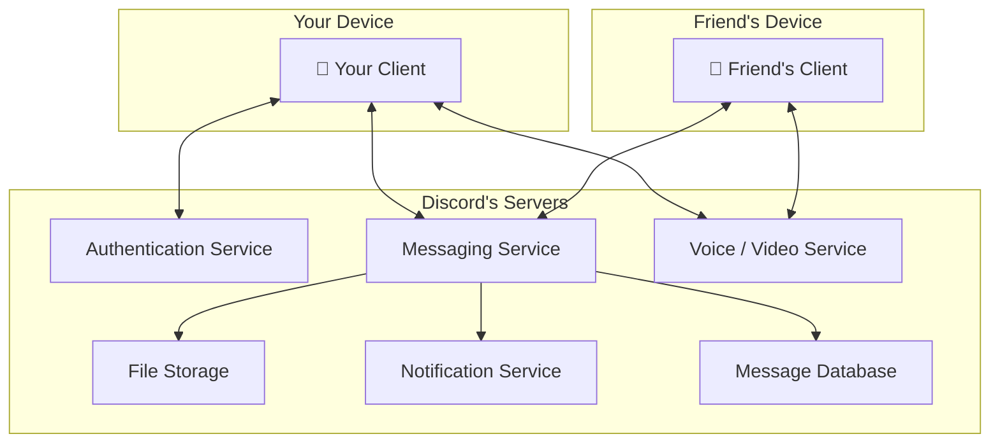

It is also a *distributed* system, running on multiple computers.
</div>
<aside className="notes">
→ **Transition:** You may wonder whether monoliths always run on a single computer...
</aside>

</Slide>

<Slide>

## Deployment Topology: Two Axes

<div style={{display: 'grid', gridTemplateColumns: '.2fr 1fr 1fr', gap: '1em', fontSize: '0.72em', marginTop: '1em'}}>

{/* Header row */}
<div/>

<div style={{textAlign: 'center', color: '#4A90A4', padding: '0.5em', borderBottom: '2px solid #4A90A4'}}><strong>Monolith</strong><br/><span style={{fontSize: '0.85em', fontWeight: 'normal'}}>single unit</span></div>

<div style={{textAlign: 'center', color: '#9370DB', padding: '0.5em', borderBottom: '2px solid #9370DB'}}><strong>Microservices</strong><br/><span style={{fontSize: '0.85em', fontWeight: 'normal'}}>multiple units</span></div>

{/* Row 1 */}
<div style={{fontWeight: 'bold', color: '#4CAF50', display: 'flex', alignItems: 'center', borderRight: '2px solid #4CAF50', paddingRight: '0.5em'}}>Local</div>

<div style={{padding: '1em', border: '2px solid #4A90A4', borderRadius: '8px'}}>
One codebase, one process, one machine.

*Most class projects*
</div>

<div style={{padding: '1em', border: '2px solid #9370DB', borderRadius: '8px'}}>
Multiple processes on one machine, communicating over localhost.

*Common in local development*
</div>

{/* Row 2 */}
<div style={{fontWeight: 'bold', color: '#FF9800', display: 'flex', alignItems: 'center', borderRight: '2px solid #FF9800', paddingRight: '0.5em'}}>Distributed</div>

<div style={{padding: '1em', border: '2px solid #4A90A4', borderRadius: '8px'}}>
Same codebase on multiple servers behind a load balancer.

*Horizontal scaling — still a monolith architecturally*
</div>

<div style={{padding: '1em', border: '2px solid #9370DB', borderRadius: '8px'}}>
Independent services across multiple servers.

*Discord, Netflix, Amazon*
</div>

</div>

<div className="fragment">
<p style={{fontSize: '0.8em', marginTop: '1em'}}>
Monolith vs. microservices is about <em>how code is divided</em>.

Local vs. distributed is about <em>where it runs</em>.
</p>
</div>

<aside className="notes">
→ **Transition:** Now let's look at how to evaluate architecture **quality**
</aside>
</Slide>

{/* ============================================ */}
{/* ARC 3: THE -ILITIES */}
{/* ============================================ */}

<Slide>
## Quality


</Slide>

<Slide>

## Quality Attributes: The "-ilities"

<p style={{fontSize: '0.82em'}}>
We judge an architecture by <strong>quality attributes</strong>, measurable properties
important to stakeholders.
</p>

<div className="fragment">
<div style={{display: 'grid', gridTemplateColumns: '1fr 1fr 1fr', gap: '0.5em', fontSize: '0.55em', marginTop: '0.75em'}}>

<div style={{border: '2px solid #4CAF50', borderRadius: '8px', textAlign: 'center', overflow: 'hidden'}}>

<div style={{background: '#4CAF50', color: 'white', padding: '0.3em 0.5em'}}>Structural</div>

<div style={{padding: '0.5em', color: 'black'}}>Simplicity · Modularity · Testability</div>

</div>

<div style={{border: '2px solid #4A90A4', borderRadius: '8px', textAlign: 'center', overflow: 'hidden'}}>

<div style={{background: '#4A90A4', color: 'white', padding: '0.3em 0.5em'}}>Change</div>

<div style={{padding: '0.5em', color: 'black'}}>Maintainability · Changeability · Deployability</div>

</div>

<div style={{border: '2px solid #FF9800', borderRadius: '8px', textAlign: 'center', overflow: 'hidden'}}>

<div style={{background: '#FF9800', color: 'white', padding: '0.3em 0.5em'}}>Runtime (new)</div>

<div style={{padding: '0.5em', color: 'black'}}>Scalability · Responsiveness · Fault Tolerance</div>

</div>

</div>
</div>

<aside className="notes">
**Frame this clearly:**
- "We've been talking about design principles (SOLID, coupling, cohesion) at the class level"
- "Quality attributes are the SYSTEM-level version of that question: what properties does our architecture need to have?"
- "Different stakeholders care about different attributes: developers care about maintainability, ops cares about deployability, users care about responsiveness"

→ **Transition:** But how do we make these precise?
</aside>

</Slide>

<Slide>
## Poll: What would it mean for Pawtograder to be scalable?

<PollSlide username="espertus" />
</Slide>

<Slide>

## Specifying Quality Attributes: Scenarios
<p style={{fontSize: '0.78em', marginTop: '0.3em'}}>
As you know from assignments, vague requirements are dangerous. We need something more specific
than "the system should be scalable".
</p>
<p style={{fontSize: '0.78em', marginTop: '0.3em'}}>
We use a common form — a <strong>quality attribute scenario</strong> — to make every attribute testable and unambiguous.
</p>


<aside className="notes">
**Connection to L9 (Requirements Analysis):**
- In L9, we saw that "the system should be fair" needed to be unpacked into concrete, testable requirements
- Quality attributes have the EXACT same problem: "the system should be scalable" means nothing without a scenario
- The three risk dimensions from L9 apply directly:
  - Understanding: What does "scalable" mean for THIS system?
  - Scope: How much load? How many users? What's the growth curve?
  - Volatility: Will the load patterns change? Will infrastructure change?

**Walk through the six-part framework:**
- **Source:** Who or what generates the stimulus? A user, an external system, a developer, an attacker. The source matters — a request from a trusted user may be treated differently than one from an untrusted source.
- **Stimulus:** The event that arrives — a spike in submissions, a component crash, a change request, a security probe. For runtime qualities this is a system event; for development-time qualities it's a project event (like "completion of a unit of development" for testability, or "a request for a modification" for changeability).
- **Environment:** The conditions — normal operation, peak load, degraded mode, during development, during deployment. The environment sets the context: a change request after code freeze is treated differently than one before. And environment includes your DEPENDENCIES: if GitHub itself is on fire, Pawtograder has a very bad day — grading actions can't run at all. Bottlenose doesn't depend on GitHub, so it keeps grading just fine. This is a fault tolerance scenario where the environment (GitHub outage) changes everything about which architecture wins.
- **Artifact:** What part of the system is affected? The whole system, the grading pipeline, the API, a single adapter? Being specific matters: a failure in the data store may be treated differently than a failure in the grading engine.
- **Response:** What the system (or the developers) should do in response. For runtime: process requests, isolate failures, maintain service. For development-time: implement the change without side effects, then test and deploy.
- **Measure:** The quantifiable threshold — latency, throughput, time to implement a change, number of files touched, data exposed. This is what makes the scenario TESTABLE.

**The "common form" insight is powerful:**
- Students struggle with quality attributes because different communities use different vocabulary
- Performance people talk about "events" and "latency"; Security people talk about "attacks" and "vulnerabilities"; Modifiability people talk about "change requests" and "effort"
- But they're ALL describing the same six-part structure!
- This common form cuts through vocabulary confusion

→ **Transition:** Let's see this in action with our running examples...
</aside>

</Slide>

<Slide>

## Why "Scalable" Isn't Specific Enough

<p style={{fontSize: '0.82em'}}>
Imagine someone says: "The grading system should be scalable." What does that actually mean? Consider three very different situations Pawtograder might face:
</p>

<div style={{display: 'grid', gridTemplateColumns: '1fr 1fr 1fr', gap: '0.6em', fontSize: '0.52em', marginTop: '0.5em'}}>

<div className='fragment' style={{padding: '0.6em', border: '2px solid #FF5722', borderRadius: '8px'}}>

**Scenario A: Spike**

200 students submit **all at once** at 11:59pm deadline

*What happens?*
- 200 parallel GitHub Actions runners spin up
- Each builds, tests, parses, scores independently
- All are accepted before the deadline, complete in ~30 minutes
- **API receives 200 results simultaneously**

</div>

<div className='fragment' style={{padding: '0.6em', border: '2px solid #FF9800', borderRadius: '8px'}}>

**Scenario B: Sustained**

1800 students submit **over 1 hour** during an exam

*What happens?*
- ~30 new runners start every minute
- ~30 complete every minute (steady state)
- Load is spread over time
- **API handles ~30 results/min continuously**

</div>

<div className='fragment' style={{padding: '0.6em', border: '2px solid #4CAF50', borderRadius: '8px'}}>

**Scenario C: Trickle**

1800 students submit **over 24 hours** for a homework

*What happens?*
- ~1-2 runners at any time
- Never more than a handful concurrent
- Minimal system stress
- **API barely notices**

</div>

</div>

<div className="fragment">
<p style={{fontSize: '0.75em', marginTop: '0.5em', fontWeight: 'bold', color: '#9370DB'}}>
All three scenarios involve "grading many submissions" — but they place <strong>completely different demands</strong> on the system. A system that handles Scenario C perfectly might completely fail at Scenario A. This is why we need a vocabulary for being <em>specific</em> about what we mean.
</p>
</div>

<aside className="notes">
**The pedagogical goal: motivate WHY we need quality attribute vocabulary.**

**The problem with vague requirements:**
- "The system should be scalable" — which scenario are we optimizing for?
- A system designed for Scenario C might fail catastrophically at Scenario A
- A system over-engineered for Scenario A might be wasteful for Scenario C

**Walk through each scenario — make them vivid:**

**Scenario A (Spike):**
- "200 students all hit submit at 11:59pm. What happens?"
- This is a BURST — everything at once
- Questions: What if 10 runners fail? Can the API handle 200 simultaneous writes? Race conditions?

**Scenario B (Sustained):**
- "An exam where students have 1 hour, 1800 students in the class"
- This is CONTINUOUS PRESSURE — not a spike, but sustained load
- Questions: Can we maintain throughput for an hour? Database connection pools? Memory leaks?

**Scenario C (Trickle):**
- "Homework due in a week, students submit throughout"
- This is the EASY case — most systems handle this fine
- BUT: testing only under Scenario C gives false confidence!

**The key insight:**
- The word "scalable" hides these distinctions
- We need SPECIFIC vocabulary to discuss what we actually mean
- That's what quality attributes give us — precision instead of hand-waving

**Discussion prompt:**
- "Which scenario do you think CS3100 assignment deadlines look like?" (Usually A or B)
- "If you tested only during office hours (Scenario C), would you catch problems?"

→ **Transition:** Now let's build the vocabulary we'll use to compare any architecture...
</aside>

</Slide>


<Slide>

## New Attributes: Deployability, Responsiveness, Fault Tolerance

<p style={{fontSize: '0.78em', fontStyle: 'italic', color: '#666', marginBottom: '0.75em'}}>
These three attributes become critical when comparing monoliths vs. distributed systems. We'll explore them in depth in L20 — for now, just the vocabulary:
</p>

<div style={{display: 'grid', gridTemplateColumns: '1fr 1fr 1fr', gap: '0.75em', fontSize: '0.52em'}}>

<div className="fragment" style={{padding: '0.75em', border: '2px solid #2196F3', borderRadius: '8px'}}>

**Deployability**

*How easily can we release changes to production?*

- **High:** Independent deploys, small blast radius, quick rollback
- **Low:** All-or-nothing deployment, coordinate across teams

*Monoliths: one deploy = everything. Distributed: deploy pieces independently.*

</div>

<div className="fragment" style={{padding: '0.75em', border: '2px solid #2196F3', borderRadius: '8px'}}>

**Responsiveness**

*How quickly does the system respond to requests?*

- **High:** In-process calls (nanoseconds), shared memory
- **Lower:** Network calls (milliseconds), serialization overhead

*Monoliths win here — no network between components.*

</div>

<div className="fragment" style={{padding: '0.75em', border: '2px solid #2196F3', borderRadius: '8px'}}>

**Fault Tolerance**

*How does the system behave when something fails?*

- **High:** Failed component doesn't crash others, graceful degradation
- **Low:** One crash = entire system down

*Distributed systems isolate failures — but introduce NEW failure modes.*

</div>

</div>


<aside className="notes">
**This is a PREVIEW slide — keep it brisk:**

→ **Transition:** Now the umbrella term that ties these together...
</aside>

</Slide>

<Slide>

## Poll: Which attributes most contribute to maintainability?

Maintainability refers to how easily a system can be changed over time?

<PollSlide username="espertus"
  choices={["simplicity", "modularity", "testability", "maintainability", "changeability", "deployability", "scalability", "responsiveness", "fault tolerance"]}
  />

<aside className="notes">
* multiple-answer poll
</aside>

</Slide>

<Slide>

## Umbrella Attribute: Maintainability

<p style={{fontSize: '0.82em'}}>
<strong>Maintainability</strong> is the umbrella term for how easily a system can be changed over time. It <em>decomposes</em> into the other attributes:
</p>

<p style={{fontSize: '0.65em', fontStyle: 'italic', color: '#666', marginTop: '-0.25em', marginBottom: '0.5em'}}>
This is the "big picture" attribute — we'll see how styles affect it throughout this lecture and L20.
</p>

<div style={{fontSize: '0.8em', marginTop: '0.5em'}}>

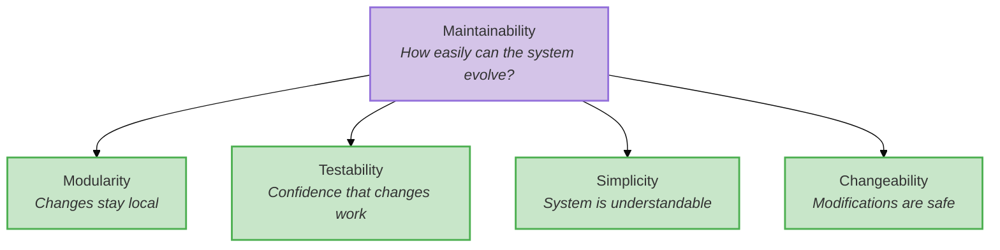

</div>

<div className="fragment">
<p style={{fontSize: '0.78em', marginTop: '0.5em', fontStyle: 'italic', color: '#666'}}>
When someone says "this system is hard to maintain," ask: Is it hard to <em>understand</em> (simplicity)? Hard to <em>change safely</em> (changeability)? Hard to <em>test</em> (testability)? Hard to <em>modify without affecting other parts</em> (modularity)? Decomposing "maintainability" gives us precision.
</p>
</div>

<aside className="notes">
**Maintainability as the umbrella:**
- Students often use "maintainability" loosely. Unpack it!
- "When someone says 'this system is hard to maintain,' WHICH of these is the problem?"
- Is it hard to understand? (simplicity)
- Is it hard to change safely? (changeability)
- Is it hard to test? (testability)
- Is it modular enough that changes don't ripple? (modularity)

**Why decomposition matters:**
- A system can be highly modular but hard to understand (complexity from abstraction)
- A system can be simple but hard to change safely (no tests)
- A system can be testable but hard to deploy (monolith)
- "Maintainability" hides which problem you actually have

**This connects to root cause analysis:**
- Don't say "we have a maintainability problem"
- Say "we have a testability problem" or "we have a modularity problem"
- Then you know what to fix

→ **Transition:** Two more attributes to define...
</aside>

</Slide>

<Slide>

## New Attribute: Scalability

<p style={{fontSize: '0.82em'}}>
How does the system handle growth in load, data, or users?
</p>

<div style={{display: 'grid', gridTemplateColumns: '1fr 1fr', gap: '1em', fontSize: '0.65em', marginTop: '0.75em'}}>

<div style={{padding: '0.25em', border: '2px solid #FF9800', borderRadius: '8px'}}>

**Vertical Scaling**


</div>

<div style={{padding: '0.25em', border: '2px solid #4CAF50', borderRadius: '8px'}}>

**Horizontal Scaling**


</div>

</div>

<div className="fragment">
<p style={{fontSize: '0.78em', marginTop: '0.75em', fontWeight: 'bold', color: '#9370DB'}}>
Key insight: Scalability isn't just "can the system handle more load?" It's "does the <em>rest</em> of the system stay responsive while handling that load?" We'll return to this distinction in L20-21.
</p>
</div>

<aside className="notes">
**Scalability = handling growth:**

**Vertical scaling:**
- The intuitive approach: "slow? buy more hardware"
- But there's a ceiling — you can only buy so big a server
- More importantly: even with a huge server, in a monolith ALL work shares resources
- Grading jobs compete with web requests for CPU, memory, DB connections
- Adding more grading jobs just makes contention worse

**Horizontal scaling:**
- The distributed approach: "slow? add more workers"
- Pawtograder naturally does this — GitHub Actions spins up N runners
- The API never touches the heavy work — it just receives normalized feedback
- So the API stays fast even during a near-deadline spike

**The "rest of the system" insight:**
- This connects back to our Scenario A (200 at once) from earlier
- The question isn't just "can we grade 200 submissions?"
- It's "does the web UI stay responsive WHILE we grade 200 submissions?"
- Pawtograder: yes. Monolith: no (without architectural changes).

**Foreshadow L20-21:**
- We'll go much deeper into distributed architecture
- Horizontal scaling requires infrastructure: queues, workers, coordination
- There's no free lunch — distributed systems add complexity

→ **Transition:** Now that we've defined all attributes, let's talk tradeoffs...
</aside>

</Slide>

<Slide>

## Poll: What attributes most conflict with simplicity?

<PollSlide username="espertus"
  choices={["modularity", "testability", "maintainability", "changeability", "deployability", "scalability", "responsiveness", "fault tolerance"]}
  />

<aside className="notes">
* multiple answer
</aside>

</Slide>

<Slide>

## Quality Attributes Trade Off Against Each Other

<p style={{fontSize: '0.82em'}}>
Here's the uncomfortable truth: <strong>you can't maximize every quality attribute</strong>. They're in tension with each other.
</p>

<div style={{display: 'grid', gridTemplateColumns: '1fr 1fr', gap: '0.75em', fontSize: '0.58em', marginTop: '0.75em'}}>

<div style={{padding: '0.75em', border: '2px solid #FF9800', borderRadius: '8px'}}>

**Simplicity vs. Modularity**

Adding interfaces and abstractions → more modular → less simple

*We saw this in L7-L8: ISP means more interfaces to understand.*

</div>

<div style={{padding: '0.75em', border: '2px solid #FF9800', borderRadius: '8px'}}>

**Simplicity vs. Scalability**

Horizontal scaling requires workers, queues, coordination → more complexity

*A monolith is simple but hits a ceiling. Distributed systems scale but aren't simple.*

</div>

<div style={{padding: '0.75em', border: '2px solid #FF9800', borderRadius: '8px'}}>

**Deployability vs. Responsiveness**

Independent services → independent deploys → network calls → more latency

*High deployability often means more service boundaries = more network overhead.*

</div>

<div style={{padding: '0.75em', border: '2px solid #FF9800', borderRadius: '8px'}}>

**Fault Tolerance vs. Simplicity**

Isolation requires boundaries → boundaries add complexity

*A monolith is simpler but a single point of failure. Distributed systems isolate failures but add coordination complexity.*

</div>

</div>

<div className="fragment">
<p style={{fontSize: '0.78em', marginTop: '0.75em', fontWeight: 'bold', color: '#9370DB'}}>
Architecture is choosing which attributes matter most for <em>your</em> system. If someone tells you their architecture maximizes everything, they're selling something.
</p>
</div>

<aside className="notes">
**This is the KEY INSIGHT for the lecture:**

**Every decision has costs:**
- Adding modularity = adding abstractions = reducing simplicity
- Adding scalability = adding workers = adding coordination complexity
- Adding deployability = adding service boundaries = adding network latency
- Adding fault isolation = adding boundaries = adding complexity

**The role of the architect:**
- NOT to find the "best" architecture (there isn't one)
- TO understand the priorities for THIS system
- TO make conscious tradeoffs based on those priorities
- TO communicate those tradeoffs to the team

**Connect to domain understanding (L12):**
- Domain modeling tells you WHICH quality attributes matter most
- A grading system needs scalability at deadline time
- A banking system needs fault tolerance and consistency
- A startup MVP might just need simplicity

**The "selling something" callout:**
- Vendors often promise architectures that do everything well
- In practice, every architectural style makes tradeoffs
- Understanding the tradeoffs is the skill — not finding the magic solution

→ **Transition:** Now we have the vocabulary. Let's clarify what "styles" and "patterns" mean...
</aside>

</Slide>

{/* ============================================ */}
{/* ARC 4: STYLES vs PATTERNS (3 min) */}
{/* ============================================ */}

<Slide>

## Architectural Styles vs. Patterns

<p style={{fontSize: '0.9em', marginTop: '0.5em'}}>
Architects use two terms that sound similar but mean different things:
</p>

<div className="fragment">
<table style={{fontSize: '0.65em', marginTop: '1em', width: '100%', borderCollapse: 'collapse'}}>
  <thead>
    <tr style={{borderBottom: '2px solid #555'}}>
      <th style={{padding: '0.4em 0.6em', textAlign: 'left'}}></th>
      <th style={{padding: '0.4em 0.6em', textAlign: 'left'}}>Style</th>
      <th style={{padding: '0.4em 0.6em', textAlign: 'left'}}>Pattern</th>
    </tr>
  </thead>
  <tbody>
    <tr style={{borderBottom: '1px solid #333'}}>
      <td style={{padding: '0.4em 0.6em', color: '#9370DB', fontWeight: 'bold'}}>Architecture</td>
      <td style={{padding: '0.4em 0.6em'}}>Monolith, Microservices, Layered</td>
      <td style={{padding: '0.4em 0.6em'}}>Repository, Service Locator</td>
    </tr>
    <tr>
      <td style={{padding: '0.4em 0.6em', color: '#4CAF50', fontWeight: 'bold'}}>Design</td>
      <td style={{padding: '0.4em 0.6em'}}>Object-oriented, Functional</td>
      <td style={{padding: '0.4em 0.6em'}}>Strategy, Builder, Adapter</td>
    </tr>
  </tbody>
</table>
</div>

<div className="fragment">
<p style={{fontSize: '0.85em', marginTop: '1em', fontWeight: 'bold', color: '#9370DB'}}>
Styles describe the overall shape; patterns are reusable solutions you apply within that shape.
</p>
</div>

<aside className="notes">
**Why this distinction matters:**
- When someone says "we use microservices," they're naming a style — it implies deployment, communication, team structure, etc.
- When someone says "we use Circuit Breaker," they're naming a pattern — a specific solution to a specific problem within whatever style they chose
- You might use many patterns within a single style

**Where do styles come from?**
- Not from a committee — they emerge from practice
- Microservices: the name emerged as a reaction to "big service" architectures
- Made possible by better DevOps, containers, API design
- This is piecemeal growth (L18) applied to the profession itself!

→ **Transition:** Let's continue with the systems we introduced in L18...
</aside>

</Slide>

<Slide>

## Architectural Patterns and Styles

<div style={{fontSize: '0.75em', marginTop: '1em'}}>

<p style={{marginBottom: '0.5em', color: '#9370DB'}}>**Architectural Pattern — how the system is deployed and divided**</p>

<div style={{display: 'grid', gridTemplateColumns: '1fr 1fr', gap: '1em', marginBottom: '1em'}}>

<div style={{padding: '1em', border: '2px solid #9370DB', borderRadius: '8px'}}>

**Monolithic**

Single process, shared memory

</div>

<div style={{padding: '1em', border: '2px solid #9370DB', borderRadius: '8px'}}>

**Microservices**

Separate processes, network communication

</div>

</div>

<p style={{marginBottom: '0.5em', color: '#4CAF50'}}>**Architectural Style — how code is internally organized**</p>

<div style={{display: 'grid', gridTemplateColumns: '1fr 1fr 1fr', gap: '1em'}}>

<div style={{padding: '1em', border: '2px solid #4CAF50', borderRadius: '8px'}}>

**Hexagonal**

Isolates core logic from external dependencies

</div>

<div style={{padding: '1em', border: '2px solid #4CAF50', borderRadius: '8px'}}>

**Layered**

Organizes code into horizontal tiers

</div>

<div style={{padding: '1em', border: '2px solid #4CAF50', borderRadius: '8px'}}>

**Pipelined**

Chains processing steps sequentially

</div>

</div>

</div>
</Slide>


{/* ============================================ */}
{/* HEXAGONAL ARCHITECTURE RECAP */}
{/* ============================================ */}

<Slide>

## Recap: Hexagonal Architecture (from L16)

<div style={{fontSize: '0.7em', marginTop: '0.5em'}}>

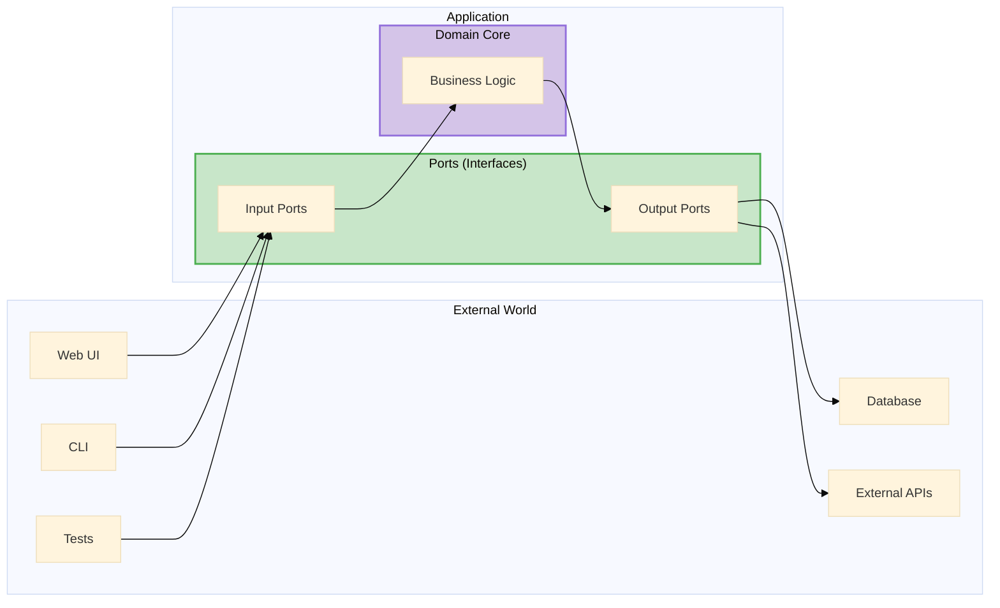

</div>

<aside className="notes">
**Quick recap from L16:**
- The domain core contains business logic — it should be testable without databases, APIs, or UIs
- Ports are interfaces that define contracts for input (how the world talks to the domain) and output (how the domain talks to the world)
- Adapters implement those ports with real technologies (PostgreSQL, REST APIs, React, etc.)

**Why this matters for L19:**
- Hexagonal is one of SEVERAL styles for organizing code within a monolith
- We're about to see Layered and Pipelined — different perspectives on the same problem
- All three can coexist! They're complementary views, not competing choices.

→ **Transition:** Now let's see another common style — layered architecture...
</aside>

</Slide>

{/* ============================================ */}
{/* LAYERED ARCHITECTURE */}
{/* ============================================ */}

<Slide>

## Layered Architecture

<p style={{fontSize: '0.82em'}}>
The <strong>layered architecture</strong> organizes code horizontally with distinct responsibilities. The classic formulation has four layers:
</p>

<div style={{fontSize: '0.8em', marginTop: '0.5em'}}>

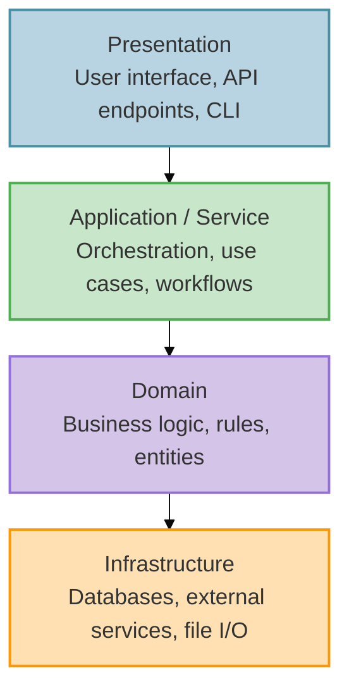

</div>

<div className="fragment">
<p style={{fontSize: '0.8em', marginTop: '0.5em'}}>
<strong>The key rule:</strong> dependencies flow <strong>downward</strong>.
</p>
</div>

<aside className="notes">
**Define each layer clearly:**
- **Presentation:** What the user (or external system) sees. Web views, CLI commands, REST endpoints, GraphQL resolvers. Its job is to translate user actions into calls to the Application layer.
- **Application / Service:** Orchestrates use cases. "When a student submits, register the submission, trigger grading, and send a notification." No business rules here — just coordination.
- **Domain:** The heart of the system. Business rules, entities, value objects. "How do we compute a grade? What are the dependencies between graded parts?" This layer should have ZERO knowledge of databases, HTTP, or file systems.
- **Infrastructure:** The technology-specific implementations. PostgreSQL, Redis, Supabase API, file parsers. This layer adapts the outside world to what the Domain and Application layers need.

**Why this ordering?**
- The top layers change most frequently (UI redesigns, new API versions)
- The bottom layers change less often (business rules are more stable than UIs)
- The dependency direction means changes in volatile layers don't cascade downward

→ **Transition:** This style also emerges from heuristics...
</aside>

</Slide>

<Slide>

## Layered Architecture Emerges from Heuristics

<p style={{fontSize: '0.82em'}}>
The same L18 heuristics that led to hexagonal architecture can also lead to layered — depending on what they reveal:
</p>

<div style={{display: 'grid', gridTemplateColumns: '1fr 1fr', gap: '0.75em', fontSize: '0.6em', marginTop: '0.5em'}}>

<div style={{padding: '0.75em', border: '2px solid #4A90A4', borderRadius: '8px'}}>

**Rate of Change → Layers Separate Volatility**

| Layer | Stability |
|-------|-----------|
| Presentation | Changes often (UI redesigns) |
| Application | Changes moderately (new workflows) |
| Domain | Changes rarely (core rules are stable) |
| Infrastructure | Changes when tech changes |

*Dependency direction protects stable layers from volatile ones*

</div>

<div style={{padding: '0.75em', border: '2px solid #4CAF50', borderRadius: '8px'}}>

**Actor Ownership → Layers Map to Roles**

| Actor | Primary Layer |
|-------|---------------|
| UI/UX designer | Presentation |
| Product owner | Application (use cases) |
| Domain expert | Domain |
| DevOps | Infrastructure |

*Different expertise naturally falls into different layers*

</div>

</div>

<div className="fragment">
<div style={{padding: '0.5em', border: '2px solid #9370DB', borderRadius: '8px', marginTop: '0.5em', fontSize: '0.72em'}}>

**When do heuristics lead to layers vs. hexagons?**

- **Layered** emerges when responsibilities stack vertically (UI → logic → data) and teams map to technical roles
- **Hexagonal** emerges when the domain needs multiple entry points (web, CLI, tests) and multiple exit points (DB, API, files)
- They're not mutually exclusive — many systems exhibit BOTH perspectives

</div>
</div>

<aside className="notes">
**The key insight: same heuristics, different contexts, different emergent structures**

**When Rate of Change leads to layers:**
- If your volatility pattern is "top changes most, bottom changes least"
- UI redesigns happen every sprint; database schema changes once a year
- The dependency direction (down only) protects stable lower layers from rippling changes

**When Actor Ownership leads to layers:**
- If your team structure maps to technical roles: frontend team, backend team, DBA
- Each team owns a layer; the interfaces between layers are their contracts
- This is Conway's Law in action (preview for L22)

**Layers vs. Hexagons — when each emerges:**
- **Layers:** When data flows through a clear stack, and volatility decreases as you go down
- **Hexagons:** When the domain is the stable center and needs to connect to multiple volatile technologies (different UIs, different databases, different external services)

**The both/and insight:**
- Pawtograder has BOTH perspectives
- Hexagonal: domain core (grading logic) with ports (Builder, FeedbackAPI) and adapters (GradleBuilder, SupabaseAPI)
- Layered: Main.ts (presentation) → GradingPipeline (application) → OverlayGrader (domain) → parsers (infrastructure)
- These aren't contradictory — they're different lenses on the same structure

→ **Transition:** What quality attributes does layering serve?
</aside>

</Slide>

<Slide>

## Layered Architecture: Quality Attributes

<p style={{fontSize: '0.82em'}}>
Why organize into layers? Because it directly serves several quality attributes:
</p>

<div style={{display: 'grid', gridTemplateColumns: '1fr 1fr 1fr', gap: '0.75em', fontSize: '0.6em', marginTop: '0.75em'}}>

<div style={{padding: '0.75em', border: '2px solid #4CAF50', borderRadius: '8px'}}>

**Separation of Concerns**

Each layer has one job. The Domain layer doesn't know if it's being called from a web UI, a CLI, or a test harness. You can swap your database without touching business rules.

</div>

<div style={{padding: '0.75em', border: '2px solid #4A90A4', borderRadius: '8px'}}>

**Testability**

Test each layer in isolation. Domain logic can be tested with no database. Application logic can use stub infrastructure. Presentation can be tested against a mock service layer.

</div>

<div style={{padding: '0.75em', border: '2px solid #9370DB', borderRadius: '8px'}}>

**Replaceability**

Change your UI framework without rewriting business logic. Swap PostgreSQL for MongoDB at the Infrastructure layer. Add a REST API alongside your web UI — both call the same Application layer.

</div>

</div>

<div className="fragment">
<div style={{padding: '0.5em', border: '2px solid #FF9800', borderRadius: '8px', marginTop: '0.75em', fontSize: '0.72em'}}>

**The pitfall:** Changes that span layers — adding a new field that flows from the UI through services into the database — require touching **every layer**. This "layer tax" is the cost of separation. It's worth it for large systems, but can feel heavy for small ones.

</div>
</div>

<aside className="notes">
**Separation of concerns is the fundamental benefit:**
- "Imagine you're debugging a scoring bug. In a layered system, you know it's in the Domain layer — not tangled up with HTTP handling or database queries."
- "Imagine swapping from PostgreSQL to a different database. In a layered system, only the Infrastructure layer changes. Domain and Application are untouched."

**Testability follows directly from separation:**
- Test the Domain layer with plain objects — no database, no network, no file system
- Test the Application layer with stub Infrastructure — verify orchestration without real services
- This should sound familiar from L16 — hexagonal architecture achieves the same thing through a different lens

**The layer tax is real:**
- "Add a 'late penalty' field: create a database column (Infrastructure), add it to the grade calculation (Domain), expose it in the service (Application), display it in the UI (Presentation) — four layers touched for one concept"
- This is the main criticism of strict layering
- In practice, many teams relax strict layering — allowing occasional shortcuts where the cost of indirection outweighs the benefit

**How does this relate to Hexagonal?**
- Both achieve separation of domain from infrastructure
- Layered emphasizes horizontal strata with strict downward dependencies
- Hexagonal emphasizes the domain at the center, with adapters at the edges
- In practice, you'll often see BOTH perspectives applied to the same system

→ **Transition:** Let's see how both Pawtograder and Bottlenose exhibit layers...
</aside>

</Slide>

<Slide>

## Layers in Pawtograder

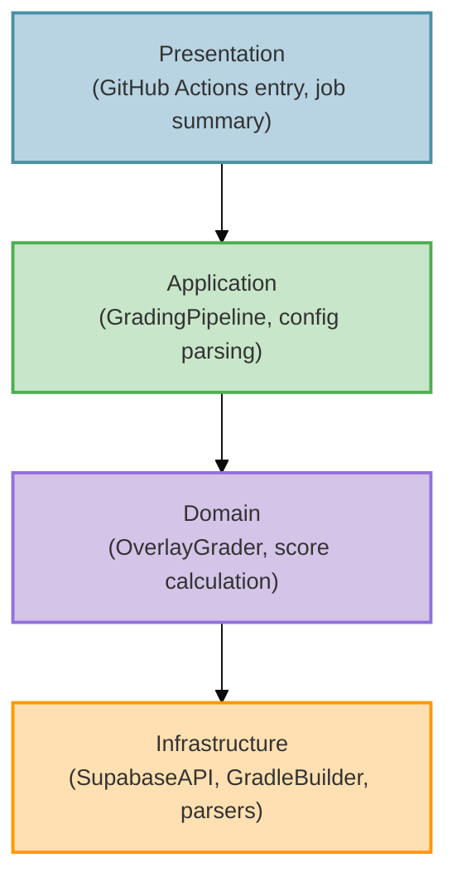

<div className="fragment">
<p style={{fontSize: '0.75em', marginTop: '0.5em', color: '#FF9800'}}>
<strong>Layered vs. Hexagonal:</strong> Both separate domain from infrastructure. Layered emphasizes horizontal strata; Hexagonal emphasizes dependency direction (domain at center). You'll often see both lenses applied to the same system.
</p>
</div>

<aside className="notes">
**Side-by-side comparison reveals:**
- Same four layers, different technologies at each level
- Pawtograder: `Main.java` → `GradingPipeline` → `OverlayGrader` → `SupabaseAPI`/`GradleBuilder`
- Bottlenose: Web views → `SubmissionController` → `Grader` subclasses → PostgreSQL + Orca

**Many web frameworks loosely follow layered architecture by convention:**
- Views (Presentation) → Controllers (Application) → Models (Domain) → Database layer (Infrastructure)
- But frameworks often make it easy to violate layers — models may contain database queries AND business logic
- Discipline is needed to keep the layers clean

**The relationship between layered and hexagonal:**
- Hexagonal Architecture's adapters map roughly to the Infrastructure and Presentation layers
- Hexagonal's ports map to the interfaces between layers
- Hexagonal's domain core IS the Domain layer
- The difference is emphasis: layered says "these are the strata"; hexagonal says "the domain is the center and everything else adapts to it"

→ **Transition:** What about data flowing in one direction?
</aside>

</Slide>

<Slide>

## Pipelined Architecture (Pipes and Filters)

<p style={{fontSize: '0.82em'}}>
Data flows through stages. Each stage transforms its input into output for the next. Pawtograder's grading pipeline is a perfect example:
</p>

<div style={{fontSize: '0.8em', marginTop: '0.5em'}}>

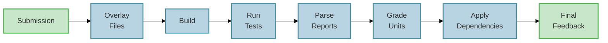

</div>

<div style={{display: 'grid', gridTemplateColumns: '1fr 1fr', gap: '1em', fontSize: '0.7em', marginTop: '0.5em'}}>

<div style={{padding: '0.75em', border: '2px solid #4CAF50', borderRadius: '8px'}}>

**Benefits**
- Each stage testable independently
- Adding mutation testing = insert a stage between "Run Tests" and "Grade Units"
- Classic examples: compilers, Unix pipes, ETL

</div>

<div style={{padding: '0.75em', border: '2px solid #FF9800', borderRadius: '8px'}}>

**Constraints**
- Works best when data flows one direction
- Awkward for interactive/bidirectional workflows
- Cross-cutting concerns may touch every stage

</div>

</div>

<div className="fragment">
<div style={{display: 'grid', gridTemplateColumns: '1fr 1fr 1fr 1fr', gap: '0.4em', fontSize: '0.48em', marginTop: '0.5em'}}>

<div style={{padding: '0.4em', border: '2px solid #4CAF50', borderRadius: '6px', textAlign: 'center'}}>

**Testability** ★★★

Each stage tested in isolation

</div>

<div style={{padding: '0.4em', border: '2px solid #4CAF50', borderRadius: '6px', textAlign: 'center'}}>

**Changeability** ★★★

Insert, remove, or reorder stages

</div>

<div style={{padding: '0.4em', border: '2px solid #4A90A4', borderRadius: '6px', textAlign: 'center'}}>

**Simplicity** ★★☆

Linear flow, easy to follow

</div>

<div style={{padding: '0.4em', border: '2px solid #FF9800', borderRadius: '6px', textAlign: 'center'}}>

**Fault Tolerance** ★☆☆

Stage failure stops the pipeline

</div>

</div>
</div>

<aside className="notes">
**Pawtograder's real pipeline:**
- Two passes: Pass 1 grades all units, Pass 2 applies dependencies (if Part 1 failed, Part 2 doesn't run)
- Adding mutation testing meant inserting a stage — the rest of the pipeline was unchanged
- Each stage is independently testable

**Classic examples beyond grading:**
- Compilers: source → tokens → AST → typed AST → optimized IR → machine code
- Unix pipes: `cat file | grep pattern | sort | uniq`
- Data processing: ETL (Extract, Transform, Load) jobs

**Quality attribute connection:**
- Testability: Feed known input to one stage, check output — no need to run the entire pipeline
- Changeability: Added mutation testing by inserting a stage. Existing stages unchanged.
- Simplicity: Data flows in one direction — easy to trace, easy to reason about
- Fault tolerance: If the Build stage fails, everything downstream stops. No partial results. This is actually a FEATURE for grading (don't grade what doesn't compile), but a limitation in other contexts.

**When to use vs. when to avoid:**
- Use when data truly flows in one direction through transformations
- Avoid when you need interactive back-and-forth or complex state

→ **Transition:** This style also emerges from heuristics...
</aside>

</Slide>

<Slide>

## Pipelined Architecture Emerges from Heuristics

<p style={{fontSize: '0.82em'}}>
When does applying heuristics lead to a pipeline? When the problem has a natural <strong>transformation flow</strong>:
</p>

<div style={{display: 'grid', gridTemplateColumns: '1fr 1fr', gap: '0.75em', fontSize: '0.6em', marginTop: '0.5em'}}>

<div style={{padding: '0.75em', border: '2px solid #4A90A4', borderRadius: '8px'}}>

**Rate of Change → Stage Independence**

| Stage | When It Changes |
|-------|-----------------|
| File overlay | Rarely (mechanism stable) |
| Build runner | Per language (Gradle → Cargo) |
| Test runner | Rarely (JUnit is JUnit) |
| Report parsers | When tool versions change |
| Scoring logic | When rubric structure changes |

*Each stage changes for different reasons — natural seams for separation*

</div>

<div style={{padding: '0.75em', border: '2px solid #9370DB', borderRadius: '8px'}}>

**Testability → Stage-Level Testing**

```
testOverlay()    → known input → expected output
testBuild()      → sample project → BuildResult
testParser()     → sample XML → TestResult[]
testScoring()    → TestResult[] → GradedPart[]
```

*Each stage is a pure function: input → output. Perfect for unit testing.*

</div>

</div>

<div className="fragment">
<div style={{padding: '0.5em', border: '2px solid #4CAF50', borderRadius: '8px', marginTop: '0.5em', fontSize: '0.72em'}}>

**When does a pipeline emerge?**

Apply heuristics and ask: "Does data flow one direction? Is each transformation independently testable? Do stages change for different reasons?"

If yes → pipeline structure emerges naturally.

</div>
</div>

<aside className="notes">
**The pipeline emerged because the problem has transformation structure:**
- Input: student code + solution repo + config
- Output: graded feedback
- The transformation is a series of steps, each taking the previous output as input

**Rate of Change reveals stage boundaries:**
- The overlay mechanism changes rarely (just "copy files")
- The build runner changes when we add languages (Gradle → Maven → Cargo)
- The parsers change when tool versions update (JUnit 4 → JUnit 5 format)
- The scoring logic changes when we add features (dependencies, mutation hints)
- Each has its own reason to change → each becomes a stage

**Testability is PERFECT for pipelines:**
- Each stage is a pure function (mostly): given this input, produce that output
- No shared mutable state between stages
- Test each stage with sample inputs/outputs — no need for full integration
- This is why compilers are pipelines — each pass is testable in isolation

**The emergence pattern:**
- We didn't say "let's use pipes and filters"
- We asked: what changes independently? What can we test independently?
- A linear flow of transformations emerged
- The name "pipeline" describes what we discovered

→ **Transition:** Now that we've seen all three styles, let's step back and see the pattern...
</aside>

</Slide>

{/* ============================================ */}
{/* ARC 5: SYNTHESIS: STYLES EMERGE FROM HEURISTICS */}
{/* ============================================ */}

<Slide>

## Styles Emerge from Heuristics


<aside className="notes">
**This is the synthesis insight — make it dramatic:**
- "Notice what we did NOT do: we didn't open a catalog of architectural styles and pick one"
- "Instead, we asked questions: What changes? Who owns it? How do we test it?"
- "The answers formed a shape — and that shape has a name"

**The four heuristics lead to different styles:**
- Rate of Change applies EVERYWHERE — it's the universal heuristic
- Testability + ISP → strongly suggest Hexagonal (domain isolation, narrow ports)
- Actor Ownership → strongly suggests Layered (teams map to technical roles)
- Rate of Change + Testability → strongly suggest Pipelined (independent stages)

→ **Transition:** But wait — where do those answers come from? How do we KNOW what actually changes?
</aside>

</Slide>

{/* ============================================ */}
{/* DOMAIN UNDERSTANDING: THE PREREQUISITE */}
{/* ============================================ */}

<Slide>

## But Wait: Where Do Those Answers Come From?

<p style={{fontSize: '0.85em'}}>
The heuristics ask great questions: <em>What changes at different rates? Who owns what? Where do we need test seams?</em> But <strong>you can only answer those questions if you understand your domain</strong>.
</p>

<div style={{display: 'grid', gridTemplateColumns: '1fr 1fr', gap: '1em', fontSize: '0.65em', marginTop: '0.75em'}}>

<div style={{padding: '0.75em', border: '2px solid #FF5722', borderRadius: '8px'}}>

**Without Domain Understanding**

"We might need to support multiple databases..."
- Adds abstraction layers now
- Increases cognitive overhead
- Makes simple queries harder to optimize
- Pays flexibility tax EVERY DAY

*Building for imaginary changes = real complexity for fantasy benefits*

</div>

<div style={{padding: '0.75em', border: '2px solid #4CAF50', borderRadius: '8px'}}>

**With Domain Understanding (L12)**

Pawtograder's domain analysis revealed:
- **Config files change weekly** → declarative YAML
- **Grading logic changes monthly** → isolate in adapters
- **Database vendor change unlikely** → couple tightly, it's fine

*Invest flexibility where change actually happens*

</div>

</div>

<div className="fragment">
<p style={{fontSize: '0.82em', marginTop: '0.75em', fontWeight: 'bold', color: '#9370DB'}}>
The L18 heuristics are powerful tools — but they only give good answers when applied to <em>real</em> domain knowledge, not hypothetical scenarios.
</p>
</div>

<aside className="notes">
**This is the crucial "but wait" moment:**
- We just showed this beautiful diagram: heuristics → styles
- Now pull the rug out slightly: "But where do the ANSWERS come from?"
- "Rate of Change" requires knowing ACTUAL rates of change
- "Actor Ownership" requires knowing who ACTUALLY uses the system
- Without L12 domain modeling, you're guessing

**The flexibility trap:**
- Junior architects think "more flexibility = better"
- Reality: flexibility has a cost you pay EVERY DAY
- If you add a Repository pattern because "we might switch databases" but you never will — you've made every data access harder for no benefit

**Connect L12 → L18 → L19:**
- L12: Understand the domain — what changes, what doesn't
- L18: Apply heuristics — but only with REAL domain knowledge
- L19: Recognize the pattern that emerged

→ **Transition:** Let's see this concretely — how did Pawtograder's architecture emerge?
</aside>

</Slide>

{/* ============================================ */}
{/* HOW PAWTOGRADER'S STYLE EMERGED */}
{/* ============================================ */}

<Slide>

## How Pawtograder's Architecture Emerged

<p style={{fontSize: '0.82em'}}>
We didn't start by saying "let's use hexagonal architecture." We started with <strong>domain understanding</strong>, applied <strong>heuristics</strong>, and the structure emerged:
</p>

<div style={{display: 'grid', gridTemplateColumns: '1fr 1fr', gap: '0.75em', fontSize: '0.55em', marginTop: '0.5em'}}>

<div style={{padding: '0.75em', border: '2px solid #4A90A4', borderRadius: '8px'}}>

**1. Domain Understanding (L12)**

| Question | Answer |
|----------|--------|
| What changes most? | Config files (weekly) |
| What's stable? | API contract, core grading logic |
| Who are the actors? | Instructors, action maintainers, sysadmins |
| What's unlikely to change? | Database vendor, GitHub Actions platform |

</div>

<div style={{padding: '0.75em', border: '2px solid #4CAF50', borderRadius: '8px'}}>

**2. Heuristics Applied (L18)**

| Heuristic | Result |
|-----------|--------|
| Rate of Change | Config ↔ Action ↔ API boundaries |
| Actor Ownership | Instructor owns config, maintainer owns action |
| ISP | Narrow ports: `Builder`, `FeedbackAPI` |
| Testability | Domain testable without real API |

</div>

</div>

<div className="fragment">
<div style={{padding: '0.5em', border: '2px solid #9370DB', borderRadius: '8px', marginTop: '0.5em', fontSize: '0.7em'}}>

**3. The Pattern That Emerged → Hexagonal + Pipelined**

- Domain core (grading logic) at center — testable without infrastructure
- Ports define contracts — `Builder`, `Parser`, `FeedbackAPI`
- Adapters implement ports — `GradleBuilder`, `SurefireParser`, `SupabaseAPI`
- Data flows through a pipeline — overlay → build → test → parse → grade → submit

*We call it "hexagonal" because that's what the community named this shape. We DISCOVERED it; we didn't CHOOSE it.*

</div>
</div>

<aside className="notes">
**Walk through the emergence story:**

**Step 1 — Domain Understanding:**
- Before writing ANY code, we asked: "What changes? Who cares? What's stable?"
- Config changes weekly (instructor iterations)
- Grading logic changes monthly (new features)
- API contract changes rarely (stability for all actions)
- Database vendor? Never going to change — don't abstract it

**Step 2 — Heuristics:**
- Rate of Change → separate config from action from API
- Actor Ownership → instructors own config, maintainers own action code
- ISP → each client gets a narrow interface (instructors don't see TypeScript)
- Testability → need to test grading without deploying to GitHub Actions

**Step 3 — Recognition:**
- The boundaries formed a shape
- Domain at center, adapters at edges = hexagonal
- Data flowing through transformations = pipelined
- We didn't pick these names first — we recognized them after

**The meta-lesson:**
- Architecture is DISCOVERED through domain understanding + heuristics
- Style names are vocabulary for COMMUNICATION, not a menu of choices

→ **Transition:** Now let's see all three styles side by side...
</aside>

</Slide>

<Slide>

## The Complete Picture: L12 → L18 → L19

<p style={{fontSize: '0.85em'}}>
Architecture isn't about picking from a menu. It's a <strong>discovery process</strong>:
</p>

<div style={{fontSize: '0.75em', marginTop: '0.5em'}}>

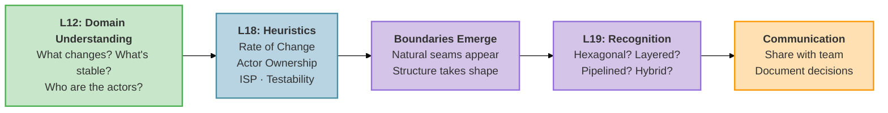

</div>

<div className="fragment">
<p style={{fontSize: '0.8em', marginTop: '0.5em', fontWeight: 'bold', color: '#9370DB'}}>
The style names (hexagonal, layered, pipelined) are <strong>vocabulary for communication</strong> — not a catalog to shop from. You discover architecture by understanding your domain and asking the right questions.
</p>
</div>

<aside className="notes">
**This is the synthesis of L12 + L18 + L19:**

**The process:**
1. **L12 (Domain):** Understand what actually changes, who actually cares
2. **L18 (Heuristics):** Ask the four questions — but with REAL answers from L12
3. **Emergence:** Boundaries form naturally from those answers
4. **L19 (Recognition):** Name the pattern — "oh, this is hexagonal"
5. **Communication:** Use the vocabulary to explain to your team

**Why this order matters:**
- If you skip L12 and go straight to "let's use hexagonal" → you're guessing
- If you apply heuristics to hypothetical scenarios → you build flexibility for imaginary changes
- Domain understanding GROUNDS the heuristics in reality

**The vocabulary insight:**
- "Hexagonal" is useful because other architects know what it means
- But you don't START with "hexagonal" — you END there
- You DISCOVER the shape, then COMMUNICATE it using shared vocabulary

→ **Transition:** Now that we understand how styles emerge, let's look at the two big families of deployment...
</aside>

</Slide>

{/* ============================================ */}
{/* THE TWO BIG FAMILIES */}
{/* ============================================ */}

<Slide>

## The Two Big Families: Monolith vs. Microservices

<p style={{fontSize: '0.82em'}}>
At the highest level, systems fall into two categories based on how they're deployed:
</p>

<div style={{display: 'grid', gridTemplateColumns: '1fr 1fr', gap: '1.5em', fontSize: '0.62em', marginTop: '1em'}}>

<div style={{padding: '1em', border: '3px solid #4CAF50', borderRadius: '8px', background: 'rgba(76, 175, 80, 0.05)'}}>

**Monolith** — One Deployment Unit

- All code lives in a single codebase
- Deployed as a single artifact (JAR, binary, container)
- Components communicate via method calls
- One database, one process, one server (typically)

*Everything we've discussed so far — layered, hexagonal, modular monolith, pipelined — are variations within this family.*

</div>

<div style={{padding: '1em', border: '3px solid #2196F3', borderRadius: '8px', background: 'rgba(33, 150, 243, 0.05)'}}>

**Microservices** — Many Deployment Units

- Code split across separate services
- Each service deployed independently
- Services communicate via network (HTTP, messages)
- Separate databases, processes, servers

*This is where industry has been moving — and it's the focus of L20-L21.*

</div>

</div>

<aside className="notes">
**Now we can finally make this distinction clearly:**
- Students now understand what a monolith IS and the styles that organize code within it
- Microservices is a fundamentally different choice — multiple deployment units
- The architectural styles we've covered (layered, hexagonal, pipelined) apply WITHIN each microservice too!

**Key insight:**
- You don't choose between "layered OR microservices"
- You might have microservices where EACH service is internally layered
- The monolith vs. microservices decision is orthogonal to internal organization

→ **Transition:** Where do our running examples fall on this spectrum?
</aside>

</Slide>

<Slide>

## Poll: What type of architecture is Pawtograder?

<PollSlide username="espertus"
  choices={["Monolith", "Microservices", "I have no idea"]}
/>

<aside className="notes">

</aside>

</Slide>

<Slide>

## Pawtograder Architecture (Simplified)
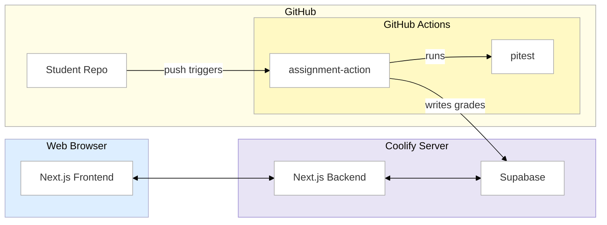

<aside className="notes">
- The Grading Action runs on GitHub's infrastructure
- It calls the Pawtograder API over HTTP
- Most of the communication between components is over http
- There's a network in between — and that changes EVERYTHING

→ **Transition:** Let's talk about that network...
</aside>


</Slide>

<Slide>
## The Network Changes Everything

<p style={{fontSize: '0.82em'}}>
In a monolith, method calls are <strong>instant</strong>, <strong>reliable</strong>, and <strong>traceable</strong>. Over a network:
</p>

<div style={{display: 'grid', gridTemplateColumns: '1fr 1fr', gap: '1em', fontSize: '0.65em', marginTop: '0.75em'}}>

<div style={{padding: '0.75em', border: '2px solid #4CAF50', borderRadius: '8px'}}>

**Monolith (Bottlenose)**

```java
submission.computeGrade();
// ✅ Executes in nanoseconds
// ✅ Always succeeds or throws
// ✅ Full stack trace on error
// ✅ Wrapped in a DB transaction
```

</div>

<div style={{padding: '0.75em', border: '2px solid #FF9800', borderRadius: '8px'}}>

**Distributed (Pawtograder)**

```java
feedbackApi.submit(submissionId, feedback);
// ⚠️ Might take ms... or seconds... or ∞
// ⚠️ Server might be down or overloaded
// ⚠️ Request succeeds, response lost
// ⚠️ Retry = accidentally grade twice?
// ⚠️ No cross-system transactions
```

</div>

</div>

<div className="fragment">
<div style={{padding: '0.5em', border: '2px solid #9370DB', borderRadius: '8px', marginTop: '0.5em', fontSize: '0.78em'}}>

Pawtograder's `SupabaseAPI` actually implements **retry logic with exponential backoff** — complexity that simply doesn't exist in a monolith.
Pawtograder, like most microservice architectures is distributed — and distributed systems are *hard*.

</div>
</div>

<aside className="notes">
**Make this visceral:**
- "When Bottlenose calls `submission.computeGrade()`, it KNOWS it will execute. If it fails, you get an exception with a full stack trace."
- "When Pawtograder calls `feedbackApi.submit()`: What if the API times out? What if it returns an error? What if the request succeeds but the RESPONSE never arrives?"
- "The grading action actually implements retry with exponential backoff. That code doesn't need to exist in a monolith."

**Preview for L20:**
- In the NEXT lecture, we'll explore what makes distributed systems so challenging
- The Fallacies of Distributed Computing (eight assumptions about networks that are all false)
- Client-server architecture and its variants
- Security implications of components communicating across trust boundaries

**The throughline:**
- We'll see how both Pawtograder and Bottlenose handle these challenges
- And why even Bottlenose couldn't stay entirely monolithic

→ **Transition:** So what does each style BUY you — and what does it COST?
</aside>

</Slide>

<Slide>
## Poll: Where are Monoliths Superior to Microservices?

<PollSlide username='espertus'
  choices={["Simplicity", "Modularity", "Testability", "Changeability", "Responsiveness", "Scalability"]}
/>

</Slide>

<Slide>

## Monolith vs. Microservices: Quality Attribute Tradeoffs

<p style={{fontSize: '0.78em'}}>
Any time you're deciding between these styles, this is the tension:
</p>

<div style={{fontSize: '0.52em', marginTop: '0.5em'}}>

| Quality Attribute | Monolith | Microservices |
|-------------------|----------|---------------|
| **Simplicity** | ★★★ One process, one deploy, one mental model | ★☆☆ Many services, network complexity, distributed debugging |
| **Modularity** | ★☆☆ Boundaries are conventions — easy to violate | ★★★ Boundaries enforced by network — can't cheat |
| **Testability** | ★★☆ One environment, but need full infrastructure | ★★★ Each service testable in isolation |
| **Deployability** | ★☆☆ All-or-nothing deploy, slowest part limits frequency | ★★★ Independent deploys per service |
| **Changeability** | ★★☆ IDE refactoring is powerful; but changes can ripple | ★★☆ Isolated changes easy; cross-service changes expensive |
| **Responsiveness** | ★★★ In-process calls: nanoseconds | ★☆☆ Network calls: milliseconds, retries, timeouts |
| **Scalability** | ★☆☆ Vertical only — heavy work competes with everything else | ★★★ Horizontal — offload work to independent services |
| **Fault Tolerance** | ★☆☆ One crash takes down everything | ★★☆ Failures can be isolated (but new failure modes) |

</div>

<div className="fragment">
<p style={{fontSize: '0.75em', marginTop: '0.5em', fontWeight: 'bold', color: '#9370DB'}}>
Notice the pattern: almost every row is a <strong>direct tradeoff</strong>. What monoliths win on simplicity and responsiveness, microservices win on modularity and scalability. This is why "which is better?" is the wrong question.
</p>
</div>

<aside className="notes">

**Row by row:**
- **Simplicity**: The defining advantage of monoliths. One thing to build, deploy, debug. Microservices have N things — N deployment pipelines, N log streams, N things that can fail independently.
- **Modularity**: This is the defining advantage of microservices. You CAN'T accidentally call another service's internal method — the network enforces boundaries. In a monolith, it's one `import` statement away.
- **Testability**: Microservices can spin up one service with mocks for the rest. Monoliths need the whole environment — database, background jobs, etc.
- **Deployability**: Microservices can ship a fix to one service in minutes. Monoliths must deploy everything together.
- **Changeability**: Mixed! Monoliths win for cross-cutting changes (IDE refactoring across one codebase). Microservices win for isolated changes (one service, one deploy).
- **Responsiveness**: Method calls are nanoseconds. Network calls are milliseconds at best, seconds at worst, infinite on timeout.
- **Scalability**: The most dramatic difference. Monolith: buy a bigger server — but even then, grading competes with everything else for CPU and database connections. The whole platform degrades. Microservices: offload heavy work to independent services that scale separately. The core platform stays responsive.
- **Fault Tolerance**: Microservices CAN isolate failures — but they also introduce NEW failure modes (network partitions, cascading timeouts, split brain). The ★★☆ rating reflects this complexity.

**The modular monolith (which we just saw) tries to get modularity ★★★ while keeping simplicity ★★★ — but it can't help with scalability or fault tolerance.**

**Foreshadow L20-21:**
- In L20-21, we'll go much deeper into distributed system tradeoffs
- For now: just understand that this is a REAL tradeoff, not a clear winner

→ **Transition:** Here's what you need to know...
</aside>

</Slide>

{/* ============================================ */}
{/* KEY TAKEAWAY: EMERGENCE */}
{/* ============================================ */}

<Slide>

## Key Takeaway: Architecture Is Discovered, Not Chosen

<p style={{fontSize: '0.85em'}}>
Domain understanding (L12) + heuristics (L18) + style recognition (L19) = a complete approach:
</p>

<div style={{display: 'grid', gridTemplateColumns: '1fr 1fr', gap: '0.75em', fontSize: '0.6em', marginTop: '0.5em'}}>

<div style={{padding: '0.75em', border: '2px solid #4A90A4', borderRadius: '8px'}}>

**The Heuristics (L18)**

*Questions that reveal structure*

1. **Rate of Change:** What changes together? What changes independently?
2. **Actor:** Who owns what? Whose changes should stay isolated?
3. **ISP:** What does each client actually need?
4. **Testability:** Where do we need seams for testing?

</div>

<div style={{padding: '0.75em', border: '2px solid #9370DB', borderRadius: '8px'}}>

**The Emergent Styles (L19)**

*Patterns that have names*

- **Hexagonal:** Domain isolation with swappable adapters
- **Layered:** Stacked responsibilities, downward dependencies
- **Pipelined:** Transformation flow, stage independence
- **Monolithic:** Single deployment, shared memory
- **Modular Monolith:** Enforced boundaries in one deployment

</div>

</div>

<div className="fragment">
<div style={{padding: '0.5em', border: '2px solid #4CAF50', borderRadius: '8px', marginTop: '0.5em', fontSize: '0.72em'}}>

**The Process:**

Understand the domain (L12) → Apply heuristics (L18) → Boundaries emerge → Recognize the style (L19) → Communicate it

*You don't pick "hexagonal" from a menu. You discover it by understanding what actually matters.*

</div>
</div>

<aside className="notes">
**This is the synthesis of L12, L18, and L19:**

**The unified approach:**
1. **L12 (Domain Modeling):** Understand your domain — what concepts matter, what changes, what's stable, who cares about what. This prevents building flexibility for imaginary changes.
2. **L18 (Heuristics):** Apply Rate of Change, Actor, ISP, Testability — but these questions only produce GOOD answers if you understood the domain first.
3. Let boundaries emerge from the answers
4. Recognize the pattern that emerged (is it hexagonal? layered? pipelined?)
5. Use the vocabulary to communicate what you discovered

**Why domain understanding comes first:**
- Without L12, you might add flexibility for changes that will NEVER happen
- Every abstraction has a cost: indirection, cognitive load, testing overhead
- Domain modeling tells you which abstractions will PAY OFF and which are waste
- "Rate of Change" heuristic requires knowing ACTUAL rates of change, not hypothetical ones

**Why this matters:**
- Students often think "pick a style and follow it"
- Reality: you discover architecture by understanding your domain and asking the right questions
- The style names are vocabulary for communication, not a menu of choices
- Different problems → same heuristics → different emergent structures

**The Pawtograder example:**
- We started with domain understanding: grading systems, instructors, students, what changes when
- We DIDN'T build a "GradingPlatformAdapter" because domain analysis showed platform changes are unlikely
- We DID build parsing adapters because domain analysis showed language support changes often
- We asked: What changes at different rates? (config weekly, action monthly, API rarely)
- We asked: Who owns what? (instructor, maintainer, sysadmin)
- We asked: Where do we need test seams? (domain testable without API)
- The hexagonal structure EMERGED from those answers
- We call it "hexagonal" because that's the vocabulary that lets us communicate it

→ **Transition:** Let's look at where these ideas go next...
</aside>

</Slide>

{/* ============================================ */}
{/* LOOKING FORWARD */}
{/* ============================================ */}

<Slide>

## Looking Forward: Where These Ideas Go Next

<div style={{fontSize: '0.72em'}}>

| Concept from Today | Where It Goes |
|-------------------|---------------|
| **"The Network Changes Everything"** | **L20:** Fallacies of Distributed Computing, client-server architecture, security across trust boundaries |
| **Monolith vs. Microservices** | **L20-21:** Distributed architecture styles, when to break the monolith, serverless |
| **Quality Attribute Tradeoffs** | **L21:** How platform constraints (serverless, containers) shape architecture — like GitHub Actions shaped Pawtograder |
| **Heuristics → Emergent Styles** | **L22:** Conway's Law — team structure is another heuristic that shapes architecture |

</div>

<p style={{fontSize: '0.85em', marginTop: '1em', fontWeight: 'bold', color: '#9370DB'}}>
We opened with "how do we organize our code?" — and now you have styles, quality attributes, and tradeoff vocabulary to answer it. Next: what happens when your boundaries cross a network.
</p>

<aside className="notes">
**The arc ahead:**
- **L20 (Networks & Security):** When components communicate over a network, everything gets harder. Fallacies of Distributed Computing. Client-server architecture. Security.
- **L21 (Serverless):** Infrastructure building blocks — databases, blob storage, queues. Serverless as an architectural style.
- **L22 (Teams):** Conway's Law — team structure is ANOTHER heuristic. "Organizations design systems that mirror their communication structure."

**The throughline with heuristics:**
- L16: "How do we design for testability?" → Hexagonal Architecture emerges
- L18: "Where do the boundaries go?" → Four heuristics: Rate of Change, Actor, ISP, Testability
- **L19: "What styles emerge from those heuristics?" → Hexagonal, Layered, Pipelined, Monolith**
- L20-21: "What happens when boundaries cross networks?" → Distributed styles emerge
- L22: "What happens when boundaries cross teams?" → Conway's Law as another heuristic

**The meta-lesson:**
- Architecture isn't about memorizing style names
- It's about asking the right questions (the heuristics)
- The styles are patterns that the community has NAMED
- When you apply heuristics consistently, recognizable patterns emerge
- The vocabulary lets you communicate with other architects

**Final thought:** The vocabulary from these lectures — styles, quality attributes, tradeoffs, heuristics, emergence — is how architects think. You're not just learning terms; you're learning a way of analyzing systems.
</aside>

</Slide>

<Slide>
## Bonus Slide


</Slide>

</RevealJS>