import RevealJS, { Slide } from '@site/src/components/RevealJS';
import Img from '@site/src/components/Img';
import ImageSlide from "@site/src/components/ImageSlide";
import PollSlide from "@site/src/components/PollSlide";

<RevealJS transition="slide">

{/* ============================================ */}
{/* COVER IMAGE */}
{/* ============================================ */}

<Slide>
  

<aside class="notes">
**Lecture overview:**
- **Total time:** ~55 minutes
- **Prerequisites:** Students completed flashcard sets 1-2 before class
- **Connects to:** Assignment 1 (recipe domain hierarchy), Lab 2 (inheritance practice)

**Structure:**
- Inheritance concepts via IoT device example (~25 min)
- Dynamic dispatch deep-dive (~10 min)
- Static vs instance methods (~5 min)
- Exception handling (~10 min)

→ **Transition:** Let's start with the learning objectives...
</aside>

</Slide>

{/* ============================================ */}
{/* TITLE SLIDE */}
{/* ============================================ */}

<Slide>

# CS 3100: Program Design and Implementation II

## Lecture 2: Inheritance and Polymorphism in Java

<p style={{marginTop: '2em', fontSize: '0.8em', color: '#666'}}>
  ©2026 Jonathan Bell & Ellen Spertus, CC-BY-SA
</p>

<aside class="notes">
**Context from L1:**
- Students saw Java syntax, primitives vs references, Hello World
- This lecture shows how Java's type system enables good design

**Key theme:** Inheritance isn't just code reuse—it's modeling real-world relationships

→ **Transition:** Here's what you'll be able to do after today...
</aside>

</Slide>

<Slide>

## Learning Objectives

<p style={{fontSize: '0.85em', textAlign: 'left'}}>
After this lecture, you will be able to:
</p>

<ol style={{fontSize: '0.75em', textAlign: 'left'}}>
  <li>Describe why inheritance is a core concept of OOP</li>
  <li>Define a type hierarchy and understand superclass/subclass relationships</li>
  <li>Explain the role of interfaces and abstract classes</li>
  <li>Describe the JVM's implementation of dynamic dispatch</li>
  <li>Describe the difference between static and instance methods</li>
  <li>Describe the JVM exception handling mechanism</li>
  <li>Recognize common Java exceptions and when to use them</li>
</ol>

<aside class="notes">
**Time allocation:**
- Objectives 1-3: Inheritance, interfaces, abstract classes (~25 min)
- Objective 4: Dynamic dispatch—crucial for understanding polymorphism (~10 min)
- Objective 5: Static vs instance—quick distinction (~5 min)
- Objectives 6-7: Exceptions—error handling patterns (~10 min)

**Why this matters:** Students will build a class hierarchy in A1 (Quantity, Ingredient classes). They need to understand when to use interfaces vs abstract classes, and how to throw appropriate exceptions.

→ **Transition:** Let's start with the fundamental question: why do we use inheritance at all?
</aside>

</Slide>

{/* ============================================ */}
{/* DOMAIN MODELING & WHY INHERITANCE */}
{/* ============================================ */}

<Slide>
## Software Models Real-World Domains


<aside class="notes">
**Core principle:** Make your data mean something

**The domain:**
- Banking apps model accounts, transactions, customers
- Games model players, items, enemies
- IoT apps model devices, rooms, schedules

**Why this matters:**
- Domain vocabulary → better names
- Domain relationships → clearer structure
- Domain understanding → code that stakeholders can discuss

**Image shows:** Left side has meaningless column names (uid_1, type_cd); right side has meaningful types (sender: Account, recipient: Account). The meaningful model answers auditor questions directly.

→ **Transition:** Let's explore a concrete domain—smart home IoT devices...
</aside>
</Slide>


<Slide>

## IS-A relationship

<div style={{display: 'flex', justifyContent: 'space-between', alignItems: 'flex-start', minHeight: '50vh'}}>

<div>

Would you agree that:
* A Cat is-a Animal
* A Fish is-a Animal

</div>

<div className="fragment" style={{transform: 'scale(1.5)', transformOrigin: 'top right'}}>


</div>

</div>

<div className="fragment" style={{marginTop: '1em'}}>

We say that Cat and Fish are **subtypes** of Animal.

</div>

</Slide>

{/* ============================================ */}
{/* LISKOV SUBSTITUTION PRINCIPLE */}
{/* ============================================ */}

<Slide>

## The Liskov Substitution Principle

<blockquote style={{fontSize: '0.9em', fontStyle: 'italic', borderLeft: '4px solid #9370DB', paddingLeft: '1em', textAlign: 'left'}}>
  "If S is a subtype of T, then objects of type T may be replaced with objects of type S without altering the correctness of the program."
</blockquote>

<p style={{marginTop: '1em', fontSize: '0.85em', color: '#666'}}>
  — Barbara Liskov, 1987
</p>

<aside class="notes">
**In plain terms:** If your code works with a Light, it must work with ANY Light subtype—DimmableLight, TunableWhiteLight, future types you haven't written yet.

**Classic violation:** Square extends Rectangle. If setWidth() on Rectangle doesn't affect height, but on Square it must change height to match... that breaks code expecting Rectangle behavior.

**Key insight:** Inheritance is a CONTRACT. Subtypes must honor the supertype's behavioral promises.

→ **Transition:** Let's visualize what this means...
</aside>

</Slide>

<Slide>

## Subtypes Can Be Substituted for Their Supertypes

<div style={{display: 'flex', justifyContent: 'space-between', alignItems: 'flex-start', minHeight: '50vh'}}>

<div>

Given:
* A Cat is-a Animal
* A Fish is-a Animal
* You can feed an Animal

Would you agree that:

* You can feed a Cat
* You can feed a Fish

</div>

<div className="fragment" style={{transform: 'scale(1.5)', transformOrigin: 'top right'}}>


</div>

</div>

<div className="fragment" style={{marginTop: '1em'}}>

Because Cat and Fish are subtypes of Animal, anything you can do to/with an Animal
can be done to/with a Cat. <br/>

In other words, you can substitute an instance of a subtype for an instance
of the supertype.

</div>

</Slide>

<Slide>

## Abstract Methods

<div style={{display: 'flex', justifyContent: 'space-between', alignItems: 'flex-start', minHeight: '50vh'}}>

<div>

Animals breathe, but they breathe in different ways.

</div>

<div className="fragment" style={{transform: 'scale(1.5)', transformOrigin: 'top right'}}>


</div>

</div>

<div className="fragment" style={{marginTop: '1em', fontSize: '0.8em'}}>


We say that `breathe()` is an `abstract` method in `Animal` because it is
declared but not implemented.<br/>

It is a `concrete` method in `Cat` and `Fish` because it is implemented.

</div>

</Slide>

<Slide>

## Java interfaces

```mermaid
classDiagram
    class Animal {
      <<interface>>
      breathe()*
    }
    class Cat {
      breathe() lungs
    }
    class Fish {
      breathe() gills
    }
    Animal <|-- Cat
    Animal <|-- Fish

    style Animal fill:#2d4a5a,stroke:#4ac,stroke-width:2px,stroke-dasharray: 5 5
```

<div style={{display: 'flex', justifyContent: 'space-between', alignItems: 'flex-start', gap: '2em', minHeight: '50vh'}}>

<div style={{transform: 'scale(1.2)', transformOrigin: 'top left'}}>



</div>

<div style={{flex: 1}}>

```java
interface Animal {
  void breathe();
}

class Cat implements Animal {
  void breathe() {
    // use lungs
  }
}

class Fish implements Animal {
  void breathe() {
    // use gills
  }
}
```

</div>

</div>

<div className="fragment" style={{marginTop: '1em', fontSize: '0.8em'}}>

An interface _declares_ but does not _implement_ methods. It consists entirely
of _abstract_ methods.<br/>

Subtypes _implement_ the interface and provide _concrete_ implementations of the required methods.

</div>

</Slide>

<Slide>

## How Can We Share Code?

Different types of mob move and take damage the same way, but they make different
sounds. How can they share code?

<div style={{display: 'flex', justifyContent: 'space-between', alignItems: 'flex-start', gap: '2em', minHeight: '45vh'}}>

<div style={{transform: 'scale(1.2)', transformOrigin: 'top left'}}>


</div>

<div style={{flex: 1}}>

```java
abstract class BaseMob {
  void takeDamage() {
    // shared implementation
  }
  void move() {
    // shared implementation
  }
  abstract void makeSound();
}

class Cow extends BaseMob {
  void makeSound() {
    System.out.println("Moo!");
  }
}

class Skeleton extends BaseMob {
  void makeSound() {
    System.out.println("Rattle!");
  }
}
```

</div>

</div>

<div className="fragment" style={{marginTop: '1em', fontSize: '0.8em'}}>

We can't put code in an interface. Instead, we use an _abstract class_:
a class that can contain both concrete methods and abstract methods.

Subclasses _inherit_ the code from their superclasses.

</div>

</Slide>

<Slide>

## Example Domain: Smart Home IoT

<p style={{fontSize: '1em'}}>
  Let's design a system to control smart home devices
</p>

<p style={{marginTop: '1em', fontSize: '0.95em'}}>
  What concepts exist in this domain?
</p>

<ul style={{marginTop: '0.5em', fontSize: '0.9em'}}>
  <li>Devices (lights, fans, thermostats, sensors...)</li>
  <li>Rooms, zones</li>
  <li>Schedules, automations</li>
  <li>Users, permissions</li>
</ul>

<p style={{marginTop: '0.75em', fontSize: '0.85em', color: '#666'}}>
  Today we'll focus on <strong>devices</strong>
</p>

<aside class="notes">
**Why IoT example:**
- Relatable—many students have smart lights/thermostats
- Clear hierarchies—different device types with shared behaviors
- We'll reuse this example in future lectures

**Brainstorm briefly:** Ask students what devices they have. This grounds the abstraction in their experience.

**A1 connection:** Recipe domain has similar structure—Quantity types, Ingredient types, etc.

→ **Transition:** These device concepts naturally form hierarchies—let's see how...
</aside>

</Slide>

<Slide>

## Real-World Concepts Form Natural Hierarchies

<p style={{fontSize: '1em'}}>
  In the real world, concepts have natural relationships:
</p>

<ul style={{marginTop: '1em', fontSize: '1em'}}>
  <li>A <strong>dimmable light</strong> <em>is a</em> kind of <strong>light</strong></li>
  <li>A <strong>light</strong> <em>is a</em> kind of <strong>device</strong></li>
  <li>A <strong>fan</strong> <em>is a</em> kind of <strong>device</strong></li>
</ul>

<p style={{marginTop: '1em', fontSize: '0.95em', color: '#9370DB'}}>
  These "is-a" relationships form a <strong>hierarchy</strong>
</p>

<aside class="notes">
**Key phrase:** "is-a" relationship
- This is the test for when inheritance is appropriate
- If X "is-a" Y, then X should extend/implement Y
- If X "has-a" Y, use composition instead (covered later)

**Students will use this language** when designing A1 classes. E.g., "A VolumeQuantity IS-A Quantity"

→ **Transition:** How does OOP let us capture these relationships?
</aside>

</Slide>

<Slide>

## Inheritance Captures "Is-A" Relationships

<p style={{fontSize: '1em'}}>
  <strong>Inheritance</strong> is a core OOP concept that lets us model "is-a" relationships
</p>

<ul style={{marginTop: '1em', fontSize: '0.95em'}}>
  <li>Child types <strong>inherit</strong> behavior from parent types</li>
  <li>Child types can <strong>extend</strong> with new capabilities</li>
  <li>Child types can <strong>override</strong> to specialize behavior</li>
</ul>

<p style={{marginTop: '1em', fontSize: '0.9em', color: '#666'}}>
  Bonus: Avoid duplicating code → easier to maintain
</p>

<aside class="notes">
**Three verbs of inheritance:**
1. **Inherit** — get parent's methods/fields automatically
2. **Extend** — add new methods/fields
3. **Override** — replace parent's method with specialized version

**Practical payoff:** Write turnOn/turnOff once in Light, not in every light subtype

**Common misconception:** Inheritance is primarily for code reuse. Correct view: it's for modeling IS-A relationships; code reuse is a bonus.

→ **Transition:** Let's define the base type that all devices share...
</aside>

</Slide>

<Slide>

## Base Types Define Shared Capabilities

<p style={{fontSize: '0.95em'}}>
  Every device in our system shares some basic capabilities:
</p>


<ul style={{marginTop: '0.5em', fontSize: '0.85em'}}>
  <li><code>identify()</code> — help a human find the device (e.g., flash a light, wiggle a shade or fan)</li>
  <li><code>isAvailable()</code> — check if the device is reachable</li>
  </ul>
<ul style={{marginTop: '0.5em', fontSize: '0.85em'}}>
  <li><code>+</code> — indicates that a method is public</li>
  <li>_italics_  — indicates a method is _abstract_ (not implemented)</li>
</ul>

<aside class="notes">
**Why interface here:**
- We're defining a contract: "all devices must do these things"
- No implementation yet—different devices identify themselves differently
- Interface = "what," not "how"

**identify() example:** Lights flash, fans wiggle, speakers beep. Same concept, different implementations. This foreshadows polymorphism.

→ **Transition:** Now let's add a skeletal implementation that provides common behavior...
</aside>

</Slide>

<Slide>

## Subtypes Add Specialized Behavior

<p style={{fontSize: '0.95em'}}>
  A skeletal implementation provides shared behavior; subclasses specialize:
</p>


<aside class="notes">
**Pattern:** Interface → Skeletal Abstract Class → Concrete Classes
- IoTDevice: pure contract (interface)
- BaseIoTDevice: implements isAvailable(), leaves identify() abstract
- Light/Fan: add device-specific behavior

**This pattern appears in Java stdlib:**
- List → AbstractList → ArrayList
- Map → AbstractMap → HashMap

**A1 parallel:** Students might have Quantity interface → AbstractQuantity → VolumeQuantity/MassQuantity

→ **Transition:** But why separate Light and Fan? Couldn't we generalize?
</aside>

</Slide>

<Slide>

## Discussion: Why Separate Types?

<p style={{fontSize: '1.1em'}}>
  Lights and fans both have on/off behavior...
</p>

<p style={{marginTop: '1em', fontSize: '1em'}}>
  Why not just use one <code>SwitchableDevice</code> type?
</p>

<p style={{marginTop: '1.5em', fontSize: '0.9em', color: '#666'}}>
  <em>Think about: What does the domain tell us? How would users think about these?</em>
</p>

<aside class="notes">
**Discussion prompt** (~2 min)

**Expected answers:**
- Lights have brightness, color temp, RGB
- Fans have speed, direction (reversible)
- Constraints differ (dimming 0-100% vs speed 1-3-5)
- Users think of them as different things

**Key insight:** The domain tells us they're fundamentally different. Over-generalizing loses information and makes code harder to understand.

**Counter-example:** If we later find lights and fans really do share switchable behavior, we can extract a Switchable interface. Start specific, generalize when needed.

→ **Transition:** Light itself has subtypes—not all lights are equal...
</aside>

</Slide>

<Slide>

## Hierarchies Can Go Multiple Levels Deep

<p style={{fontSize: '0.95em'}}>
  Not all lights are the same — some have more features:
</p>


<aside class="notes">
**Hierarchy depth:**
- SwitchedLight: simplest—just on/off
- DimmableLight: adds brightness control
- TunableWhiteLight: extends DimmableLight (not Light!)—IS-A DimmableLight with color temp

**Design decision:** TunableWhiteLight extends DimmableLight because all tunable white lights are also dimmable. This reflects real products.

**Note:** Each subtype overrides identify() because each identifies itself differently (flash pattern varies by capability).

→ **Transition:** Let's see the complete picture...
</aside>

</Slide>

<Slide>

## The Complete Hierarchy


<aside class="notes">
**Pause here:** Let students trace the relationships
- What does TunableWhiteLight inherit?
- Where is identify() implemented?
- Which classes are abstract vs concrete?

**A1 connection:** Students will build a similar hierarchy for recipes. Encourage them to sketch it out before coding.

→ **Transition:** Let's trace exactly what each type gets from inheritance...
</aside>

</Slide>

<Slide>

## Each Level Inherits Everything Above It

<table style={{margin: '0 auto', fontSize: '0.75em'}}>
  <thead>
    <tr>
      <th style={{padding: '0.3em 0.6em'}}>Type</th>
      <th style={{padding: '0.3em 0.6em'}}>Inherits From</th>
      <th style={{padding: '0.3em 0.6em'}}>Adds</th>
    </tr>
  </thead>
  <tbody>
    <tr>
      <td style={{padding: '0.3em 0.6em'}}><code>IoTDevice</code></td>
      <td style={{padding: '0.3em 0.6em'}}>—</td>
      <td style={{padding: '0.3em 0.6em'}}><code>identify()</code>, <code>isAvailable()</code></td>
    </tr>
    <tr>
      <td style={{padding: '0.3em 0.6em'}}><code>BaseIoTDevice</code></td>
      <td style={{padding: '0.3em 0.6em'}}><code>IoTDevice</code></td>
      <td style={{padding: '0.3em 0.6em'}}>Implements <code>isAvailable()</code>, adds <code>deviceId</code></td>
    </tr>
    <tr>
      <td style={{padding: '0.3em 0.6em'}}><code>Light</code></td>
      <td style={{padding: '0.3em 0.6em'}}><code>BaseIoTDevice</code></td>
      <td style={{padding: '0.3em 0.6em'}}><code>turnOn()</code>, <code>turnOff()</code>, <code>isOn()</code></td>
    </tr>
    <tr>
      <td style={{padding: '0.3em 0.6em'}}><code>DimmableLight</code></td>
      <td style={{padding: '0.3em 0.6em'}}><code>Light</code></td>
      <td style={{padding: '0.3em 0.6em'}}><code>setBrightness()</code>, <code>getBrightness()</code></td>
    </tr>
    <tr>
      <td style={{padding: '0.3em 0.6em'}}><code>TunableWhiteLight</code></td>
      <td style={{padding: '0.3em 0.6em'}}><code>DimmableLight</code></td>
      <td style={{padding: '0.3em 0.6em'}}><code>setColorTemperature()</code>, <code>getColorTemperature()</code></td>
    </tr>
  </tbody>
</table>

<p style={{marginTop: '0.5em', fontSize: '0.85em', color: '#666'}}>
  Each level inherits everything from above and adds new capabilities
</p>

<aside class="notes">
**Key observation:** TunableWhiteLight gets 8+ methods but only declares 2
- identify(), isAvailable() from IoTDevice
- deviceId, isAvailable() impl from BaseIoTDevice
- turnOn(), turnOff(), isOn() from Light
- setBrightness(), getBrightness() from DimmableLight
- Plus its own: setColorTemperature(), getColorTemperature()

**This is the power of inheritance:** Capability accumulates through the hierarchy with minimal code duplication.

→ **Transition:** Let's summarize the principles before diving into Java syntax...
</aside>

</Slide>

<Slide>

## Test Your Understanding: Animal

<p style={{fontSize: '0.95em'}}>
  Where should `getSpecies()` be _implemented_ (not abstract)?
</p>


<p style={{marginTop: '0.75em', fontSize: '0.5em'}}>
<code>
Cat cat = new Cat();<br/>
System.out.println(cat.getSpecies()); // Felis catus<br/>
Dog dog = new Dog();<br/>
System.out.println(dog.getSpecies()); // Canis familiaris<br/>
</code>
</p>
</Slide>

{/*
<Slide>
## Animal code

```java
abstract class Animal {
  public abstract String getSpecies();
}

class Cat extends Animal {
  @Override
  public String getSpecies() {
    return "Felis catus";
  }
}

class Dog extends Animal {
  @Override
  public String getSpecies() {
    return "Canis familiaris";
  }
}
```
</Slide>
*/}

<Slide>
## Animal Class Diagram and Code 1

<ImageSlide imageSrc="/img/lectures/ellen/l2-animal-uml-code1.png"
imageAlt="UML and code for Animal class" />

</Slide>


<Slide>

## Your Code Should Tell a Story About the Domain

<ul style={{fontSize: '0.95em'}}>
  <li><strong>Understand the domain</strong> before writing code</li>
  <li><strong>"Is-a" relationships</strong> in the domain → inheritance in code</li>
  <li><strong>Common behavior</strong> goes in parent types</li>
  <li><strong>Specialized behavior</strong> goes in child types</li>
  <li>Good names come from <strong>domain vocabulary</strong></li>
</ul>

<aside class="notes">
**Summary of design principles:**
- Talk to stakeholders, understand the domain FIRST
- Look for "is-a" relationships—they suggest inheritance
- Common behavior bubbles up; specialized behavior pushes down
- Use domain vocabulary: DimmableLight, not LightWithBrightnessControl

**A1 relevance:** Recipe domain has clear vocabulary: Ingredient, Quantity, Recipe. Use those names.

→ **Transition:** Before coding, it helps to sketch your types...
</aside>

</Slide>

{/*
<Slide>
## Animal code 2

```java
public abstract class Animal {
  public abstract String getSpecies();
  public void shed() {
    ...;
  }
}

class Cat extends Animal {
  @Override
  public String getSpecies() {
    return "Felis catus";
  }
}

class Dog extends Animal {
  @Override
  public String getSpecies() {
    return "Canis familiaris";
  }
}
```
</Slide>

<Slide>
## Animal Diagram 2


</Slide>
*/}

<Slide>

## Animal Class Diagram and Code 2

<ImageSlide imageSrc="/img/lectures/ellen/l2-animal-uml-code2.png"
imageAlt="UML and code for Animal class" />
</Slide>

<Slide>

## Sketch Your Types Before You Code

  
<aside class="notes">
**Why sketch first:**
- Discovers concepts you hadn't considered
- Finds gaps in understanding
- Communicates with teammates/stakeholders
- Catches design issues before implementation

**Doesn't need to be formal UML**—boxes and arrows on paper work fine. This is part of "shift left" from L1.

**We cover domain modeling formally later** (around L12), but students should start sketching now for A1.

→ **Transition:** Now let's see how Java specifically represents these hierarchies...
</aside>
</Slide>

{/* ============================================ */}
{/* CLASSES IN JAVA */}
{/* ============================================ */}

<Slide>

## Java Uses Classes and Interfaces for Hierarchies

<p style={{fontSize: '1.1em'}}>
  Every language represents type hierarchies differently
</p>
<p style={{marginTop: '1em', fontSize: '1em'}}>
  Java uses two constructs:
</p>

<div style={{display: 'flex', gap: '2em', marginTop: '1em', justifyContent: 'center'}}>
  <div style={{display: 'flex', flexDirection: 'column', alignItems: 'center', textAlign: 'center', flex: '1'}}>
    <div style={{fontSize: '1.2em', color: '#9370DB', marginBottom: '0.5em'}}><strong>Classes</strong></div>
    <div style={{fontSize: '0.85em'}}>Concrete implementations</div>
  </div>
  <div style={{display: 'flex', flexDirection: 'column', alignItems: 'center', textAlign: 'center', flex: '1'}}>
    <div style={{fontSize: '1.2em', color: '#9370DB', marginBottom: '0.5em'}}><strong>Interfaces</strong></div>
    <div style={{fontSize: '0.85em'}}>Behavioral contracts</div>
  </div>
</div>

<aside class="notes">
**Language comparison:**
- Python: classes with multiple inheritance
- Go: interfaces only (no classes)
- Java: single class inheritance + multiple interfaces

**Key Java constraint:** You can only extend ONE class, but implement MANY interfaces. This is deliberate—avoids the "diamond problem" (coming up).

→ **Transition:** Let's look at what classes can do...
</aside>

</Slide>

<Slide>

## Classes Extend One Superclass, Implement Many Interfaces

<ul style={{fontSize: '0.95em'}}>
  <li>Can extend <strong>exactly one</strong> superclass</li>
  <li>Can implement <strong>multiple</strong> interfaces</li>
  <li>Inherit fields and methods from superclass</li>
  <li>Can <strong>override</strong> inherited methods</li>
  <li>Can be <em>concrete</em> or <em>abstract</em></li>
</ul>

<aside class="notes">
**Single inheritance rule:**
- Avoids diamond problem (explained later)
- Forces cleaner hierarchies
- Multiple interfaces provide flexibility

**Abstract vs concrete:**
- Abstract: has at least one unimplemented method, can't be instantiated
- Concrete: all methods implemented, can create instances

→ **Transition:** Let's see the syntax for defining a class...
</aside>

</Slide>

<Slide>

## Defining a Class

```java
public class TunableWhiteLight extends DimmableLight {
    private int startupColorTemperature;

    public TunableWhiteLight(String deviceId, int colorTemp, int brightness) {
        super(deviceId, brightness);  // Call parent constructor
        this.startupColorTemperature = colorTemp;
    }

    @Override
    public void turnOn() {
        setColorTemperature(startupColorTemperature);
        super.turnOn();  // Call parent's turnOn
    }

    public void setColorTemperature(int colorTemperature) { /* ... */ }
    public int getColorTemperature() { /* ... */ }
}
```

<aside class="notes">
**Key syntax elements:**
- `extends DimmableLight` — names the superclass
- `super(...)` — calls parent constructor, MUST be first line
- `@Override` — annotation that catches typos at compile time
- `super.turnOn()` — calls parent's version (extend behavior, don't replace)
- `this.startupColorTemperature` — disambiguates field from parameter

**Pattern in turnOn():** Do subclass-specific work, then delegate to parent. Very common.

→ **Transition:** Let's review the key syntax points...
</aside>

</Slide>

<Slide>

## Key Syntax Points

<table style={{margin: '0 auto', fontSize: '0.85em'}}>
  <tbody>
    <tr>
      <td style={{padding: '0.4em 0.8em'}}><code>extends</code></td>
      <td style={{padding: '0.4em 0.8em'}}>Specifies the superclass</td>
    </tr>
    <tr>
      <td style={{padding: '0.4em 0.8em'}}><code>super(...)</code></td>
      <td style={{padding: '0.4em 0.8em'}}>Call the parent's constructor (must be first line)</td>
    </tr>
    <tr>
      <td style={{padding: '0.4em 0.8em'}}><code>@Override</code></td>
      <td style={{padding: '0.4em 0.8em'}}>Annotation indicating method override</td>
    </tr>
    <tr>
      <td style={{padding: '0.4em 0.8em'}}><code>super.method()</code></td>
      <td style={{padding: '0.4em 0.8em'}}>Call the parent's version of a method</td>
    </tr>
    <tr>
      <td style={{padding: '0.4em 0.8em'}}><code>this.field</code></td>
      <td style={{padding: '0.4em 0.8em'}}>Refers to instance field (not parameter)</td>
    </tr>
  </tbody>
</table>

<aside class="notes">
**Common mistakes:**
- Forgetting `super()` call → compiler error
- Putting `super()` not first → compiler error
- Missing `@Override` → typos create new methods instead of overriding
- Using `this` when not needed (style preference, but useful for disambiguation)

→ **Transition:** Visibility modifiers control who can access what...
</aside>

</Slide>

<Slide>

## Visibility Controls Who Can Access Your Code

<table style={{margin: '0 auto', fontSize: '0.85em'}}>
  <thead>
    <tr>
      <th style={{padding: '0.5em'}}>Modifier</th>
      <th style={{padding: '0.5em'}}>Accessible By</th>
    </tr>
  </thead>
  <tbody>
    <tr>
      <td style={{padding: '0.5em'}}><code>public</code></td>
      <td style={{padding: '0.5em'}}>Any class</td>
    </tr>
    <tr>
      <td style={{padding: '0.5em'}}><code>protected</code></td>
      <td style={{padding: '0.5em'}}>Same class, subclasses, same package</td>
    </tr>
    <tr>
      <td style={{padding: '0.5em'}}><code>private</code></td>
      <td style={{padding: '0.5em'}}>Same class only</td>
    </tr>
    <tr>
      <td style={{padding: '0.5em', color: '#c00'}}><em>(none)</em></td>
      <td style={{padding: '0.5em', color: '#c00'}}>Package-private — avoid!</td>
    </tr>
  </tbody>
</table>

<p style={{marginTop: '0.75em', fontSize: '0.8em', color: '#666'}}>
  Always specify visibility explicitly
</p>

<aside class="notes">
**When to use each:**
- `public` — API methods that others should call
- `protected` — fields/methods that subclasses need
- `private` — internal implementation details

**Package-private (no modifier):** Confusing default, rarely intentional. Always be explicit.

**A1 note:** Students should use `private` fields with public getters (encapsulation).

→ **Transition:** Before we go further, let's discuss a crucial principle about inheritance...
</aside>

</Slide>


<Slide>
## Subtypes Must Behave Like Their Supertypes
  

<aside class="notes">
**Image metaphor:** Socket = supertype contract, pins = method signatures
- DimmableLight plugs in, turnOn() lights up ✓
- TunableWhiteLight plugs in (extra pins tucked away), lights up ✓
- BrokenLight's pins fit BUT produces smoke instead of light ✗

**Key insight:** Matching signatures (pins fit) isn't enough. Behavior must also match. The compiler checks signatures; YOU must ensure behavioral correctness.

→ **Transition:** Let's see substitution in action with code...
</aside>

</Slide>

<Slide>

## Subclasses Work Wherever Supertypes Are Expected

```java
Light[] lights = new Light[2];
TunableWhiteLight light1 = new TunableWhiteLight("light-1", 2700, 100);
lights[0] = light1;  // ✓ TunableWhiteLight IS-A Light

DimmableLight light2 = new DimmableLight("light-2", 100);
lights[1] = light2;  // ✓ DimmableLight IS-A Light

for (Light light : lights) {
    light.turnOn();  // Works for any Light!
}
```

<p style={{marginTop: '0.5em', fontSize: '0.85em', color: '#060'}}>
  A subclass can always be used where a superclass is expected
</p>

<aside class="notes">
**This is polymorphism in action:**
- Array holds Light references
- Actual objects are TunableWhiteLight and DimmableLight
- Loop calls turnOn() without knowing specific types
- JVM figures out which turnOn() to call (next section!)

**Benefit:** Code written for Light works with ANY Light subtype—even ones written after your code.

→ **Transition:** But what if we need subclass-specific features?
</aside>

</Slide>

<Slide>

## Downcasting Accesses Subclass-Specific Features

<p style={{fontSize: '0.95em'}}>
  To access subclass-specific methods, <strong>cast</strong> the reference:
</p>

<div style={{display: 'flex', justifyContent: 'space-between', alignItems: 'flex-start', gap: '2em'}}>

<div style={{flex: 1}}>

```java
// Explicit cast to access subclass method
TunableWhiteLight twl = (TunableWhiteLight) lights[0];
twl.setColorTemperature(2200);

// Or inline:
((TunableWhiteLight) lights[0]).setColorTemperature(2200);
```

<p style={{marginTop: '0.75em', fontSize: '0.85em', color: '#c00'}}>
  ⚠️ Throws <code>ClassCastException</code> if the cast is invalid!
</p>

</div>

<div style={{transform: 'scale(1.2)', transformOrigin: 'top right'}}>


</div>

</div>

<aside class="notes">
**When you need to downcast:**
- You have a supertype reference but know it's actually a subtype
- You need subclass-specific methods

**Danger:** If you're wrong, ClassCastException at runtime

**Code smell:** Frequent downcasting suggests your design needs work. If you're constantly checking types and casting, consider redesigning.

→ **Transition:** Now let's look at interfaces and abstract classes in detail...
</aside>

</Slide>

{/* ============================================ */}
{/* INTERFACES AND ABSTRACT CLASSES */}
{/* ============================================ */}

<Slide>

## Interfaces Define Contracts Without Implementation

![The Universal Charging Station — Interfaces as Standardized Contracts. A clean, modern illustration showing a universal charging station with multiple USB-C ports, rendered in a technical-but-friendly blueprint style. LEFT SIDE - THE INTERFACE (USB-C Port): A large, detailed USB-C port labeled "Chargeable" with its specification card showing: charge(), getCapacity(), getBatteryLevel(). A sign reads: "Any device implementing this interface can charge here." The port itself is highlighted with a soft glow, emphasizing it's a SPECIFICATION, not a device. RIGHT SIDE - THE IMPLEMENTATIONS: Three very different devices successfully plugged into identical ports: (1) A smartphone labeled "Phone implements Chargeable" — its charge() uses fast-charging circuitry; (2) A laptop labeled "Laptop implements Chargeable" — its charge() manages multiple battery cells; (3) A wireless earbud case labeled "Earbuds implements Chargeable" — its charge() trickle-charges tiny batteries. Each device has a small annotation showing its internal implementation is completely different (different battery sizes, charging speeds, circuits), but they all present the same interface to the charging station. BOTTOM - THE KEY INSIGHT: A callout box states: "The charging station doesn't know or care HOW each device charges. It only knows they all honor the Chargeable contract." Visual style: Use a color scheme that distinguishes the interface (blue/purple, abstract, glowing) from implementations (varied colors, concrete, detailed). The USB-C port should look standardized and precise. The devices should look diverse in design but unified by the connection point. Include small method signatures floating near each device showing their different internal approaches to charge(). Perhaps show a rejected device (old proprietary charger) that doesn't fit—illustrating that non-implementing classes can't participate. Tagline: "One contract, many implementations."](/img/lectures/web/l2-interface-charging-station.png)

<ul style={{marginTop: '0.75em', fontSize: '0.9em'}}>
  <li>Define a <strong>contract</strong> — methods a class must implement</li>
  <li>A class can implement <strong>multiple</strong> interfaces</li>
  <li>Cannot be instantiated directly</li>
  <li>No instance fields (only constants)</li>
</ul>

<aside class="notes">
**Key characteristics:**
- Pure contract: specifies WHAT, not HOW
- Multiple inheritance safe: no implementation to conflict
- Can't have instance state (fields)

**When to use:** When you want to define capabilities that unrelated classes might share. E.g., Comparable, Serializable.

→ **Transition:** Let's see the syntax...
</aside>

</Slide>

<Slide>

## Defining an Interface

```java
public interface IoTDevice {
    /** Identify the device to a human (flash, spin, beep). */
    void identify();

    /** Check if the device is available. */
    boolean isAvailable();
}
```

<p style={{marginTop: '0.5em', fontSize: '0.8em', color: '#666'}}>
  Note: <code>public</code> is optional in interface methods (always public)
</p>

<aside class="notes">
**Syntax notes:**
- Methods are implicitly `public`—can omit the keyword
- No method bodies (in basic interfaces)
- Javadoc comments = the behavioral contract

**The contract:** Anyone implementing IoTDevice promises to provide identify() and isAvailable() that behave as documented.

→ **Transition:** What if we want shared implementation too?
</aside>

</Slide>

<Slide>

## Abstract Classes Provide Skeletal Implementations

<p style={{fontSize: '0.95em'}}>
  A <strong>skeletal implementation</strong> provides shared behavior while leaving specifics abstract:
</p>

```java
public abstract class BaseIoTDevice implements IoTDevice {
    protected String deviceId;
    protected boolean isConnected;

    public BaseIoTDevice(String deviceId) {
        this.deviceId = deviceId;
    }

    @Override
    public boolean isAvailable() { return this.isConnected; }

    public abstract void identify();  // Subclasses must implement
}
```

<aside class="notes">
**Abstract class features:**
- Can have fields (often `protected` for subclass access)
- Can implement some methods (isAvailable here)
- Can leave others abstract (identify)
- Has constructor (called via super())

**Why use:** When related classes share state or implementation, not just contract.

→ **Transition:** How do you choose between them?
</aside>

</Slide>

<Slide>

## Use Interfaces for Contracts, Abstract Classes for Shared State

<table style={{margin: '0 auto', fontSize: '0.8em'}}>
  <thead>
    <tr>
      <th style={{padding: '0.4em 0.8em'}}></th>
      <th style={{padding: '0.4em 0.8em'}}>Interface</th>
      <th style={{padding: '0.4em 0.8em'}}>Abstract Class</th>
    </tr>
  </thead>
  <tbody>
    <tr>
      <td style={{padding: '0.4em 0.8em'}}><strong>Multiple inheritance</strong></td>
      <td style={{padding: '0.4em 0.8em', color: '#060'}}>Yes</td>
      <td style={{padding: '0.4em 0.8em', color: '#c00'}}>No</td>
    </tr>
    <tr>
      <td style={{padding: '0.4em 0.8em'}}><strong>Instance fields</strong></td>
      <td style={{padding: '0.4em 0.8em', color: '#c00'}}>No</td>
      <td style={{padding: '0.4em 0.8em', color: '#060'}}>Yes</td>
    </tr>
    <tr>
      <td style={{padding: '0.4em 0.8em'}}><strong>Concrete methods</strong></td>
      <td style={{padding: '0.4em 0.8em'}}>Default only</td>
      <td style={{padding: '0.4em 0.8em', color: '#060'}}>Yes</td>
    </tr>
    <tr>
      <td style={{padding: '0.4em 0.8em'}}><strong>Constructor</strong></td>
      <td style={{padding: '0.4em 0.8em', color: '#c00'}}>No</td>
      <td style={{padding: '0.4em 0.8em', color: '#060'}}>Yes</td>
    </tr>
  </tbody>
</table>

<p style={{marginTop: '0.75em', fontSize: '0.85em', color: '#666'}}>
  Rule of thumb: prefer interfaces; use abstract classes when you need shared state or implementation
</p>

<aside class="notes">
**Decision guide:**
1. Start with interface (maximum flexibility)
2. If you find shared state/implementation, add abstract class
3. Pattern: Interface + Skeletal Abstract Class (like Java's List/AbstractList)

**A1 guidance:** Students might have Quantity interface with AbstractQuantity providing shared validation.

→ **Transition:** Now let's understand how the JVM actually calls methods...
</aside>

</Slide>

{/* ============================================ */}
{/* DYNAMIC DISPATCH */}
{/* ============================================ */}

<Slide>

## The JVM Chooses Methods at Runtime, Not Compile Time

<p style={{fontSize: '1.1em'}}>
  How does the JVM know which method to call?
</p>

```java
Light[] lights = new Light[] {
    new TunableWhiteLight("light-1", 2700, 100),
    new DimmableLight("light-2", 100)
};

for (Light light : lights) {
    light.turnOn();  // Which turnOn() is called?
}
```

<aside class="notes">
**The question:** Variable type is Light. Object types are TunableWhiteLight and DimmableLight. Which turnOn() runs?

**Answer preview:** The ACTUAL object's turnOn(), not the variable type's.

**This is dynamic dispatch**—method selection happens at runtime based on the object's actual type.

→ **Transition:** Let's trace through the algorithm...
</aside>

</Slide>

<Slide>

## Method Lookup Walks Up the Type Hierarchy

<div style={{display: 'grid', gridTemplateColumns: '1fr 1fr', gap: '1em', alignItems: 'start'}}>
  <div>
    <p style={{fontSize: '0.8em', marginTop: 0}}>
      To call method <em>m</em> on object <em>o</em> of runtime type <em>T</em>:
    </p>
    <ol style={{marginTop: '0.25em', fontSize: '0.75em'}}>
      <li>If <em>T</em> declares <em>m</em>, use that</li>
      <li>Otherwise, check <em>T</em>'s superclass recursively</li>
      <li>If still not found, use default interface method (if any)</li>
    </ol>
    <p style={{marginTop: '0.5em', fontSize: '0.85em', color: '#9370DB'}}>
      <strong>Runtime type matters, not compile-time type!</strong>
    </p>
  </div>
  <div>


  </div>
</div>

<aside class="notes">
**The algorithm:**
1. Look at runtime type (what the object actually IS)
2. Does that class declare the method? If yes, use it.
3. If not, check superclass. Repeat.
4. Default interface methods are last resort (rare).

**Key insight:** The variable's declared type determines what methods you CAN call. The object's runtime type determines which implementation RUNS.

→ **Transition:** Let's trace through specific examples...
</aside>

</Slide>

<Slide>

## Which Method Gets Called?

<div style={{display: 'grid', gridTemplateColumns: '1fr 1fr', gap: '1em', alignItems: 'start'}}>
  <div>
    <p style={{fontSize: '0.8em', marginTop: 0, marginBottom: '0.5em'}}>
      <strong>Call:</strong> <code style={{backgroundColor: '#2d5a2d', padding: '0.2em 0.4em', borderRadius: '4px'}}>twl.turnOn()</code>
    </p>
```java
TunableWhiteLight twl =
    new TunableWhiteLight("living-room", 2700, 100);
twl.turnOn();
```
<div class="fragment">
<p style={{fontSize: '0.75em', marginTop: '0.5em'}}>
  <strong>Runtime type:</strong> <code>TunableWhiteLight</code>
</p>
<p style={{fontSize: '0.75em'}}>
  <strong>Step 1:</strong> Does <code>TunableWhiteLight</code> declare <code>turnOn()</code>?
</p>
<p style={{fontSize: '0.85em', color: '#4a4'}}>
  <strong>✓ Yes!</strong> Use <code>TunableWhiteLight.turnOn()</code>
</p>
</div>
  </div>
  <div>


  </div>
</div>

<aside class="notes">
**Example 1:** Simple case
- Variable type: TunableWhiteLight
- Runtime type: TunableWhiteLight
- Step 1: TunableWhiteLight declares turnOn()? YES → use it

**Diagram highlights** TunableWhiteLight where method is found.

→ **Transition:** What about an inherited method?
</aside>

</Slide>

<Slide>

## Which Method Gets Called?

<div style={{display: 'grid', gridTemplateColumns: '1fr 1fr', gap: '1em', alignItems: 'start'}}>
  <div>
    <p style={{fontSize: '0.8em', marginTop: 0, marginBottom: '0.5em'}}>
      <strong>Call:</strong> <code style={{backgroundColor: '#5a3d2d', padding: '0.2em 0.4em', borderRadius: '4px'}}>twl.setBrightness(50)</code>
    </p>
```java
TunableWhiteLight twl =
    new TunableWhiteLight("living-room", 2700, 100);
twl.setBrightness(50);
```
<div class="fragment">
<p style={{fontSize: '0.75em', marginTop: '0.5em'}}>
  <strong>Runtime type:</strong> <code>TunableWhiteLight</code>
</p>
<p style={{fontSize: '0.75em'}}>
  <strong>Step 1:</strong> Does <code>TunableWhiteLight</code> declare <code>setBrightness()</code>? <span style={{color: '#c44'}}>No</span>
</p>
<p style={{fontSize: '0.75em'}}>
  <strong>Step 2:</strong> Check superclass <code>DimmableLight</code>...
</p>
<p style={{fontSize: '0.85em', color: '#c93'}}>
  <strong>✓ Found!</strong> Use <code>DimmableLight.setBrightness()</code>
</p>
</div>
  </div>
  <div>


  </div>
</div>

<aside class="notes">
**Example 2:** Inherited method
- TunableWhiteLight doesn't declare setBrightness()
- Walk up to DimmableLight—found!
- Use DimmableLight.setBrightness()

**Diagram shows** walking up the hierarchy.

→ **Transition:** Now the crucial case—what if variable type differs from runtime type?
</aside>

</Slide>

<Slide>

## Which Method Gets Called?

<div style={{display: 'grid', gridTemplateColumns: '1fr 1fr', gap: '1em', alignItems: 'start'}}>
  <div>
    <p style={{fontSize: '0.8em', marginTop: 0, marginBottom: '0.5em'}}>
      <strong>Call:</strong> <code style={{backgroundColor: '#2d4a5a', padding: '0.2em 0.4em', borderRadius: '4px'}}>light.turnOn()</code>
    </p>
```java
Light light =
    new TunableWhiteLight("living-room", 2700, 100);
light.turnOn();
```
<div class="fragment">
<p style={{fontSize: '0.75em', marginTop: '0.5em'}}>
  <strong>Compile-time type:</strong> <code>Light</code>
</p>
<p style={{fontSize: '0.75em'}}>
  <strong>Runtime type:</strong> <code style={{color: '#4ac'}}>TunableWhiteLight</code>
</p>
<p style={{fontSize: '0.75em'}}>
  <strong>Step 1:</strong> Does <code>TunableWhiteLight</code> declare <code>turnOn()</code>?
</p>
<p style={{fontSize: '0.85em', color: '#4ac'}}>
  <strong>✓ Yes!</strong> Use <code>TunableWhiteLight.turnOn()</code>
</p>
</div>
  </div>
  <div>

  </div>
</div>
<div class="fragment">
<p style={{fontSize: '0.8em', color: '#4ac', textAlign: 'center', marginTop: '0.5em'}}>
  The variable type (<code>Light</code>) doesn't matter — runtime type does!
</p>
</div>

<aside class="notes">
**Example 3: THE KEY CASE**
- Variable declared as Light
- Object is actually TunableWhiteLight
- Dispatch uses RUNTIME type: TunableWhiteLight.turnOn()

**This is why polymorphism works:** Code written for Light automatically gets the right subclass behavior.

→ **Transition:** One more misconception to address—does casting change this?
</aside>

</Slide>

<Slide>
## Poll: What does this do? 1

<PollSlide
  code={`
    abstract class Animal {
      public abstract String getSpecies();
    }

    class Cat extends Animal {
      @Override
      public String getSpecies() {
        return "Felis catus";
      }

      public static void main(String[] args) {
        Animal animal = new Cat();
        System.out.println(animal.getSpecies());
      }
    }
  `}
  choices={['nothing', 'prints "Felis catus"', 'does not compile', 'has runtime error']}
  username="espertus"/>
</Slide>

<Slide>
## Poll: What does this do? 2

<PollSlide
  code={`
    abstract class Animal {
      public abstract String getSpecies();
    }

    class Cat extends Animal {
      @Override
      public String getSpecies() {
        return "Felis catus";
      }

      public static void main(String[] args) {
        Animal animal = new Animal();
        System.out.println(animal.getSpecies());
      }
    }
  `}
  choices={['nothing', 'prints "Felis catus"', 'does not compile', 'has runtime error']}
  username="espertus"/>
</Slide>

<Slide>

## Casting Doesn't Change Which Method Runs

```java
Light light = new TunableWhiteLight("living-room", 2700, 100);

light.turnOn();
// Calls TunableWhiteLight.turnOn()

((DimmableLight) light).turnOn();
// STILL calls TunableWhiteLight.turnOn()!
```

<p style={{marginTop: '0.75em', fontSize: '0.9em'}}>
  The <strong>cast doesn't change</strong> which method is called
</p>
<p style={{fontSize: '0.85em', color: '#666'}}>
  The actual object type at runtime determines the method
</p>

<aside class="notes">
**Common misconception:** Students think casting changes which method runs. It doesn't!

**What casting does:**
- Changes compile-time type (what methods you can CALL)
- Does NOT change runtime type (which implementation RUNS)

**The object is still a TunableWhiteLight.** Casting to DimmableLight just lets you call DimmableLight methods without compiler complaint.

→ **Transition:** Let's contrast with static methods, which behave differently...
</aside>

</Slide>

{/* ============================================ */}
{/* STATIC VS INSTANCE METHODS */}
{/* ============================================ */}

<Slide>

## Instance Methods Dispatch Dynamically; Static Methods Don't

<div style={{display: 'grid', gridTemplateColumns: '1fr 1fr', gap: '1.5em', marginTop: '0.5em'}}>
  <div>
    <p style={{fontSize: '1em', color: '#9370DB'}}><strong>Instance Methods</strong></p>
    <ul style={{fontSize: '0.8em'}}>
      <li>Belong to an object</li>
      <li>Can access <code>this</code></li>
      <li><strong>Dynamically</strong> dispatched</li>
    </ul>
  </div>
  <div>
    <p style={{fontSize: '1em', color: '#9370DB'}}><strong>Static Methods</strong></p>
    <ul style={{fontSize: '0.8em'}}>
      <li>Belong to the class</li>
      <li>No <code>this</code> reference</li>
      <li><strong>Statically</strong> bound</li>
    </ul>
  </div>
</div>

<aside class="notes">
**Key distinction:**
- Instance methods: runtime type determines which implementation
- Static methods: compiler knows exactly which method at compile time

**No dynamic dispatch for static methods.** The class name determines the method—no objects involved.

→ **Transition:** Let's see a static method example...
</aside>

</Slide>

<Slide>

## Static Methods Belong to Classes, Not Objects

```java
public class TunableWhiteLight extends DimmableLight {
    // ...

    /**
     * Convert color temperature from Kelvin to mireds.
     */
    public static int degreesKelvinToMired(int degreesKelvin) {
        return 1000000 / degreesKelvin;
    }
}

// Invocation — use the class name, not an instance
int mireds = TunableWhiteLight.degreesKelvinToMired(2700);
```

<p style={{marginTop: '0.5em', fontSize: '0.85em', color: '#666'}}>
  No object needed — method is resolved at compile time
</p>

<aside class="notes">
**When to use static:**
- Utility methods that don't depend on object state
- Factory methods
- Pure functions (input → output, no side effects)

**Call syntax:** Use class name, not an instance. Compiler resolves at compile time.

→ **Transition:** Now let's switch gears to multiple inheritance...
</aside>

</Slide>

{/* ============================================ */}
{/* MULTIPLE INHERITANCE */}
{/* ============================================ */}

<Slide>

## Some Objects Belong to Multiple Categories

What if a class has more than one supertype? For example,
a Cat is both an Animal and a FuzzyThing.

<div className="fragment" style={{display: 'flex', justifyContent: 'space-between', alignItems: 'flex-start', gap: '2em', minHeight: '40vh'}}>

<div style={{transform: 'scale(1.2)', transformOrigin: 'top left'}}>


</div>

<div style={{flex: 1}}>

```java
interface Animal {
  void feed();
}

interface FuzzyThing {
  void shed();
}

class Cat implements Animal, FuzzyThing {
  public void feed() {
    System.out.println("Nom nom nom");
  }
  public void shed() {
    System.out.println("Hair everywhere!");
  }
}
```

</div>

</div>

<div className="fragment" style={{marginTop: '1em', fontSize: '0.85em'}}>

Can Cat be a subtype of both? **Yes!** A class can implement multiple interfaces.

</div>

</Slide>

<Slide>

## Multiple Inheritance

Can a class be a subtype of two classes?

<div className="fragment" style={{display: 'flex', justifyContent: 'space-between', alignItems: 'flex-start', gap: '2em', minHeight: '40vh'}}>

<div style={{transform: 'scale(1.2)', transformOrigin: 'top left'}}>


</div>

<div style={{flex: 1}}>

```java
abstract class Animal {
  boolean causesAllergies() {
    return false;  // most animals don't
  }
}

abstract class FuzzyThing {
  boolean causesAllergies() {
    return true;  // fuzzy things do
  }
}

// NOT ALLOWED IN JAVA!
class Cat extends Animal, FuzzyThing {
  // Which causesAllergies() do we inherit?
}
```

</div>

</div>

<div className="fragment" style={{marginTop: '1em', fontSize: '0.85em'}}>

Which implementation would Cat use?

To avoid this problem, Java disallows multiple inheritance. (C++ and Python permit it.)

</div>

</Slide>

<Slide>

## Real Objects Often Have Multiple "Is-A" Relationships

<p style={{fontSize: '0.95em'}}>
  Back to our IoT domain... what about a <strong>ceiling fan with a light</strong>?
</p>


<p style={{marginTop: '0.5em', fontSize: '0.85em', color: '#9370DB'}}>
  It's <em>both</em> a light AND a fan!
</p>

<aside class="notes">
**Real product:** Hampton Bay ceiling fan with integrated light kit. It genuinely IS both a light and a fan.

**Requirements:**
- Should work anywhere a Light is expected
- Should work anywhere a Fan is expected
- Single device with unified control

**With interfaces:** This works! Implement both. But what if Light and Fan were classes?

→ **Transition:** More examples of this pattern...
</aside>

</Slide>

<Slide>

## More Examples of Multiple Inheritance

<p style={{fontSize: '0.95em'}}>
  Real-world objects often have multiple "is-a" relationships:
</p>

<ul style={{marginTop: '0.75em', fontSize: '0.9em'}}>
  <li>A <strong>smart thermostat</strong> is both a <em>temperature sensor</em> and a <em>controllable device</em></li>
  <li>A <strong>smartphone</strong> is a <em>phone</em>, a <em>camera</em>, and a <em>computer</em></li>
  <li>A <strong>teaching assistant</strong> is both a <em>student</em> and an <em>employee</em></li>
  <li>An <strong>amphibious vehicle</strong> is both a <em>boat</em> and a <em>car</em></li>
</ul>

<p style={{marginTop: '1em', fontSize: '0.85em', color: '#666'}}>
  In each case, the object legitimately belongs to multiple categories
</p>

<aside class="notes">
**Relatable example:** Teaching assistant
- Pays tuition (student)
- Receives paycheck (employee)
- Both relationships are real and relevant

**These aren't edge cases**—multiple categorization is normal in the real world. Languages need ways to model this.

→ **Transition:** So why doesn't Java allow multiple class inheritance?
</aside>

</Slide>

<Slide>

## Multiple Class Inheritance Creates Ambiguity

<p style={{fontSize: '0.95em'}}>
  Why don't most languages allow multiple <em>class</em> inheritance?
</p>


<p style={{marginTop: '0.5em', fontSize: '0.9em', color: '#c00'}}>
  Which <code>identify()</code> does <code>CeilingFanWithLight</code> inherit?
</p>

<aside class="notes">
**The problem:**
- Light.identify() → flashes the light
- Fan.identify() → wiggles the blades
- CeilingFanWithLight extends both... which identify() does it get?

**No good automatic answer.** The compiler can't decide. This is the "diamond problem."

→ **Transition:** Let's visualize why this is called the diamond problem...
</aside>

</Slide>

<Slide>
## The Compiler Can't Choose Between Conflicting Implementations
  
<aside class="notes">
Called the "diamond problem" because the inheritance diagram forms a diamond shape. Java avoids this by disallowing multiple class inheritance—you can only extend one class, but implement many interfaces.
</aside>
</Slide>

<Slide>

## Java Avoids the Diamond Problem with Interfaces

<p style={{fontSize: '0.95em'}}>
  Java avoids the diamond problem by restricting multiple inheritance to interfaces:
</p>

<ul style={{marginTop: '0.75em', fontSize: '0.9em'}}>
  <li>Interfaces don't provide implementations (usually)</li>
  <li>No ambiguity about <em>which</em> implementation to inherit</li>
  <li>The implementing class <strong>must provide</strong> the implementation</li>
</ul>

```java
public class CeilingFanWithLight implements Light, Fan {
    @Override
    public void identify() {
        // We decide: flash AND spin!
        flashLight();
        spinBlades();
    }
    // ... implement all other methods from both interfaces
}
```

<aside class="notes">
**Java's solution:**
- Interfaces have no implementation to conflict
- YOU must provide identify()—no ambiguity
- You decide what it means for this hybrid device

**Flexibility:** Flash then spin? Spin then flash? Just flash? Your choice.

→ **Transition:** There's another approach—composition...
</aside>

</Slide>

<Slide>

## Composition: "Has-A" Instead of "Is-A"

<p style={{fontSize: '1em'}}>
  Instead of <em>being</em> both types, <strong>contain</strong> instances of them
</p>

```mermaid
classDiagram
    class IoTDevice {
        <<interface>>
        +identify()
    }
    class Light {
        <<interface>>
        +turnOn()
        +identify()
    }
    class Fan {
        <<interface>>
        +setSpeed(speed)
        +identify()
    }
    class CeilingFanWithLight {
        -light: Light
        -fan: Fan
        +identify()
    }
    IoTDevice <|.. CeilingFanWithLight
    CeilingFanWithLight o-- Light : has-a
    CeilingFanWithLight o-- Fan : has-a
```

<aside class="notes">
**Composition approach:**
- CeilingFanWithLight HAS-A Light and HAS-A Fan
- Delegates to them as needed
- No inheritance ambiguity—explicit delegation

**The diamond notation (o--)** represents "has-a" relationship.

→ **Transition:** Let's see the implementation...
</aside>

</Slide>

<Slide>

## Composition Lets You Control How Behaviors Combine

<p style={{fontSize: '0.95em'}}>
  With composition, <strong>we</strong> decide how to combine behaviors:
</p>

```java
public class CeilingFanWithLight implements IoTDevice {
    private Light light;  // has-a light
    private Fan fan;      // has-a fan

    @Override
    public void identify() {
        // No ambiguity — we explicitly delegate to both!
        light.identify();  // flashes the light
        fan.identify();    // wiggles the blades forward/backward
    }

    public void turnOnLight() { light.turnOn(); }
    public void setFanSpeed(int speed) { fan.setSpeed(speed); }
}
```

<p style={{marginTop: '0.5em', fontSize: '0.85em', color: '#060'}}>
  ✓ Diamond problem solved — we control the delegation
</p>

<aside class="notes">
**Benefits:**
- Explicit control over behavior combination
- Can swap light/fan implementations at runtime
- Easier to test (mock the components)

**Tradeoff:** CeilingFanWithLight can't substitute for Light or Fan in existing code (no IS-A relationship).

→ **Transition:** Let's compare the tradeoffs...
</aside>

</Slide>

<Slide>

## Composition Trades Substitutability for Flexibility

<div style={{display: 'grid', gridTemplateColumns: '1fr 1fr', gap: '1.5em', marginTop: '0.5em'}}>
  <div>
    <p style={{fontSize: '1em', color: '#060'}}><strong>Advantages</strong></p>
    <ul style={{fontSize: '0.8em'}}>
      <li>No diamond problem</li>
      <li>Can swap implementations at runtime</li>
      <li>More flexible coupling</li>
      <li>Easier to test (mock components)</li>
    </ul>
  </div>
  <div>
    <p style={{fontSize: '1em', color: '#c00'}}><strong>Disadvantages</strong></p>
    <ul style={{fontSize: '0.8em'}}>
      <li>Can't substitute for Light or Fan</li>
      <li>Must manually delegate methods</li>
      <li>More boilerplate code</li>
    </ul>
  </div>
</div>

<p style={{marginTop: '1em', fontSize: '0.9em', color: '#9370DB'}}>
  <em>"Prefer composition over inheritance"</em> — but know when inheritance fits better
</p>

<aside class="notes">
**"Prefer composition over inheritance"** is a common design principle—but not absolute.

**Use inheritance when:**
- True IS-A relationship
- Need substitutability (LSP)
- Behavior is core identity

**Use composition when:**
- HAS-A relationship
- Want to swap implementations
- Combining unrelated capabilities

→ **Transition:** You can actually combine both approaches...
</aside>

</Slide>

<Slide>

## Combine Interfaces and Composition for Maximum Flexibility

<p style={{fontSize: '0.95em'}}>
  Best of both worlds: composition <em>with</em> interface implementation
</p>

```java
public class CeilingFanWithLight implements Light, Fan, IoTDevice {
    private Light lightComponent;  // Delegate to this
    private Fan fanComponent;      // Delegate to this

    @Override
    public void identify() {
        lightComponent.identify();
        fanComponent.identify();
    }

    @Override
    public void turnOn() { lightComponent.turnOn(); }

    @Override
    public void setSpeed(int speed) { fanComponent.setSpeed(speed); }
    // ... other delegated methods
}
```

<p style={{marginTop: '0.5em', fontSize: '0.85em', color: '#060'}}>
  ✓ Can substitute for Light, Fan, <em>and</em> IoTDevice!
</p>

<aside class="notes">
**Best of both worlds:**
- Implements interfaces → substitutable for Light, Fan, IoTDevice
- Contains components → explicit delegation, swappable implementations
- More boilerplate, but maximum flexibility

**This pattern is common** in real codebases. Worth knowing.

→ **Transition:** Now let's cover exception handling...
</aside>

</Slide>

{/* ============================================ */}
{/* EXCEPTION HANDLING */}
{/* ============================================ */}

<Slide>

## Java's Exception Hierarchy Distinguishes Error Types

<p style={{fontSize: '1.1em'}}>
  All exceptions extend <code>Throwable</code>
</p>

```mermaid
classDiagram
    class Throwable {
    }
    class Exception {
    }
    class RuntimeException {
    }
    class Error {
    }
    Throwable <|-- Exception
    Throwable <|-- Error
    Exception <|-- RuntimeException
    Exception <|-- IOException
    RuntimeException <|-- NullPointerException
    RuntimeException <|-- IllegalArgumentException
    RuntimeException <|-- IndexOutOfBoundsException
```

<aside class="notes">
**Exception hierarchy uses inheritance!**

**Three branches:**
- **Error:** Fatal JVM problems (OutOfMemoryError, StackOverflowError). Don't catch these.
- **Exception (checked):** Recoverable problems that must be declared/caught
- **RuntimeException (unchecked):** Programming errors, no declaration required

**Python comparison:** All exceptions are unchecked. Java forces explicit handling of expected failures.

→ **Transition:** Let's understand checked vs unchecked...
</aside>

</Slide>

<Slide>
## Checked Exceptions Must be Declared

  

  ```java
public void turnOn() throws IOException {
    // ...
}
```

<aside class="notes">
**Airport customs metaphor:**
- **Green channel (unchecked):** RuntimeException—walk through, no paperwork
- **Red channel (checked):** IOException, SQLException—must declare with `throws` or catch

**The compiler is the customs officer**—enforces that you handle checked exceptions.

→ **Transition:** Let's clarify Error vs Exception...
</aside>

</Slide>

<Slide>

## Errors Are Fatal; Exceptions Are Recoverable

<table style={{margin: '0 auto', fontSize: '0.85em'}}>
  <thead>
    <tr>
      <th style={{padding: '0.5em'}}><code>Error</code></th>
      <th style={{padding: '0.5em'}}><code>Exception</code></th>
    </tr>
  </thead>
  <tbody>
    <tr>
      <td style={{padding: '0.5em'}}>Typically fatal</td>
      <td style={{padding: '0.5em'}}>Recoverable</td>
    </tr>
    <tr>
      <td style={{padding: '0.5em'}}>JVM-detected problems</td>
      <td style={{padding: '0.5em'}}>Application-level problems</td>
    </tr>
    <tr>
      <td style={{padding: '0.5em'}}><code>OutOfMemoryError</code></td>
      <td style={{padding: '0.5em'}}><code>IOException</code></td>
    </tr>
    <tr>
      <td style={{padding: '0.5em'}}><code>StackOverflowError</code></td>
      <td style={{padding: '0.5em'}}><code>NullPointerException</code></td>
    </tr>
  </tbody>
</table>

<p style={{marginTop: '0.75em', fontSize: '0.85em', color: '#c00'}}>
  Don't throw <code>Error</code> in your code!
</p>

<aside class="notes">
**Error:** JVM-level problems you can't recover from. Out of memory? Program is doomed. Don't throw Errors in application code.

**Exception:** Things your code can potentially handle. File not found? Try a different file. Network timeout? Retry.

→ **Transition:** Within Exception, there's another distinction...
</aside>

</Slide>

<Slide>

## Checked Exceptions Force Callers to Handle Failure

<table style={{margin: '0 auto', fontSize: '0.85em'}}>
  <thead>
    <tr>
      <th style={{padding: '0.5em'}}>Checked</th>
      <th style={{padding: '0.5em'}}>Unchecked</th>
    </tr>
  </thead>
  <tbody>
    <tr>
      <td style={{padding: '0.5em'}}>Must be caught or declared</td>
      <td style={{padding: '0.5em'}}>No requirement to handle</td>
    </tr>
    <tr>
      <td style={{padding: '0.5em'}}>Subclass of <code>Exception</code></td>
      <td style={{padding: '0.5em'}}>Subclass of <code>RuntimeException</code></td>
    </tr>
    <tr>
      <td style={{padding: '0.5em'}}><code>IOException</code></td>
      <td style={{padding: '0.5em'}}><code>NullPointerException</code></td>
    </tr>
    <tr>
      <td style={{padding: '0.5em'}}><code>SQLException</code></td>
      <td style={{padding: '0.5em'}}><code>IllegalArgumentException</code></td>
    </tr>
  </tbody>
</table>

<p style={{marginTop: '0.75em', fontSize: '0.85em', color: '#666'}}>
  Python: all exceptions are unchecked
</p>

<aside class="notes">
**Checked (compile-time enforcement):**
- IOException, SQLException—expected failures from external systems
- Must declare with `throws` or handle with try-catch

**Unchecked (no enforcement):**
- NullPointerException, IllegalArgumentException—programming errors
- Can happen anywhere; requiring declaration would be impractical

**A1 relevance:** Students will throw IllegalArgumentException for invalid inputs.

→ **Transition:** Which exceptions should you use?
</aside>

</Slide>

<Slide>

## Prefer Standard Exceptions Over Custom Ones

<table style={{margin: '0 auto', fontSize: '0.8em'}}>
  <tbody>
    <tr>
      <td style={{padding: '0.4em 0.6em'}}><code>IllegalArgumentException</code></td>
      <td style={{padding: '0.4em 0.6em'}}>Invalid method argument</td>
    </tr>
    <tr>
      <td style={{padding: '0.4em 0.6em'}}><code>NullPointerException</code></td>
      <td style={{padding: '0.4em 0.6em'}}>Unexpected null value</td>
    </tr>
    <tr>
      <td style={{padding: '0.4em 0.6em'}}><code>IllegalStateException</code></td>
      <td style={{padding: '0.4em 0.6em'}}>Object in wrong state for operation</td>
    </tr>
    <tr>
      <td style={{padding: '0.4em 0.6em'}}><code>IndexOutOfBoundsException</code></td>
      <td style={{padding: '0.4em 0.6em'}}>Index outside valid range</td>
    </tr>
    <tr>
      <td style={{padding: '0.4em 0.6em'}}><code>UnsupportedOperationException</code></td>
      <td style={{padding: '0.4em 0.6em'}}>Operation not supported</td>
    </tr>
  </tbody>
</table>

<p style={{marginTop: '0.75em', fontSize: '0.85em', color: '#060'}}>
  Prefer standard exceptions over custom ones!
</p>

<aside class="notes">
**Use standard exceptions:**
- **IllegalArgumentException:** Bad input (negative quantity, null where not allowed)
- **NullPointerException:** Null passed where unexpected
- **IllegalStateException:** Wrong order of operations (calling next() on empty iterator)
- **IndexOutOfBoundsException:** Array/list index problems
- **UnsupportedOperationException:** Method not implemented

**Custom exceptions:** Only for domain-specific errors that don't fit these.

→ **Transition:** How do you use these effectively?
</aside>

</Slide>

<Slide>

## Fail Fast: Check Parameters and Throw Clear Exceptions

```java
/**
 * Set the color temperature of the light.
 * @param colorTemperature Temperature in degrees Kelvin.
 * @throws IllegalArgumentException if temperature is out of range.
 */
public void setColorTemperature(int colorTemperature) {
    if (colorTemperature < 1000 || colorTemperature > 10000) {
        throw new IllegalArgumentException(
            "Color temperature must be between 1,000 and 10,000 Kelvin");
    }
    // ... proceed with valid input
}
```

<p style={{marginTop: '0.5em', fontSize: '0.85em'}}>
  <strong>Check parameters early</strong> — fail fast with clear messages
</p>

<aside class="notes">
**"Fail fast" principle:**
- Check parameters at method entry
- Throw immediately with clear message
- Don't let bad values propagate and cause confusing errors later

**Good error message includes:**
- What was wrong
- What was expected
- Document in Javadoc

**A1 requirement:** Students must validate inputs and throw appropriate exceptions.

→ **Transition:** One important anti-pattern to avoid...
</aside>

</Slide>

<Slide>

## ⚠️ Exceptions Are for Exceptional Cases

```java
// DON'T DO THIS!
try {
    int i = 0;
    while (true) {
        lights[i].turnOn();
        i++;
    }
} catch (ArrayIndexOutOfBoundsException e) {
    // Using exception for flow control — bad!
}
```

```java
// DO THIS INSTEAD
for (int i = 0; i < lights.length; i++) {
    lights[i].turnOn();
}
```

<aside class="notes">
**Anti-pattern:** Using exceptions for flow control
- Slow (exceptions have overhead)
- Hard to read
- Confusing—exceptions should mean something went wrong

**Rule:** Exceptions for exceptional situations only. Not for "did I reach the end of the array?"

→ **Transition:** Let's summarize what we've learned...
</aside>

</Slide>

{/* ============================================ */}
{/* SUMMARY */}
{/* ============================================ */}

<Slide>

## Summary

<ul style={{fontSize: '0.95em'}}>
  <li><strong>Inheritance</strong> models "is-a" relationships & enables code reuse</li>
  <li><strong>Interfaces</strong> define contracts; <strong>abstract classes</strong> share implementation</li>
  <li><strong>Multiple inheritance</strong>: desirable but causes diamond problem; Java uses interfaces</li>
  <li><strong>Liskov Substitution</strong>: subtypes must be substitutable for supertypes</li>
  <li><strong>Dynamic dispatch</strong>: runtime type determines which method runs</li>
  <li><strong>Exceptions</strong>: checked vs unchecked; favor standard exceptions</li>
</ul>

<aside class="notes">
**Key takeaways for A1:**
- Design class hierarchy using IS-A relationships
- Use interfaces for contracts, abstract classes if shared implementation needed
- Throw IllegalArgumentException for invalid inputs
- Document exceptions in Javadoc

→ **Transition:** Here's what's next...
</aside>

</Slide>

<Slide>

## Next Steps

- Complete Java flashcard sets 1 and 2
- Read: [Core Java Volume I: Fundamentals, Ch 3](https://learning.oreilly.com/library/view/core-java-volume/9780135328385/v1/ch3/index.xhtml#ch03lev1sec1)
- Lab 2: Java abstraction and inheritance

<p style={{marginTop: '1.5em', fontSize: '1.1em'}}>
  Questions?
</p>

<aside class="notes">
**Upcoming:**
- **A1 (due soon):** Recipe domain model—applies today's concepts
- **Lab 2:** Hands-on practice with inheritance and interfaces
- **Next lecture:** More Java—collections, generics, I/O

**Office hours:** Encourage students to come with A1 design questions—better to get feedback early!
</aside>

</Slide>

</RevealJS>
