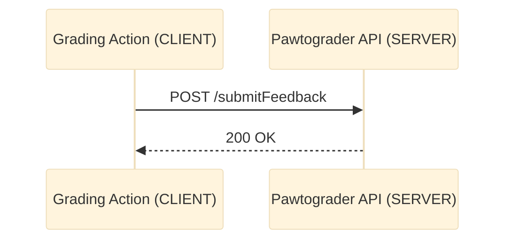
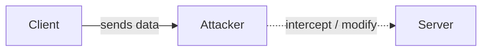
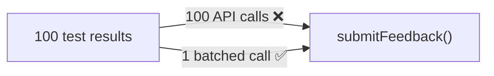
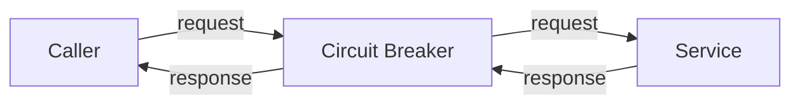
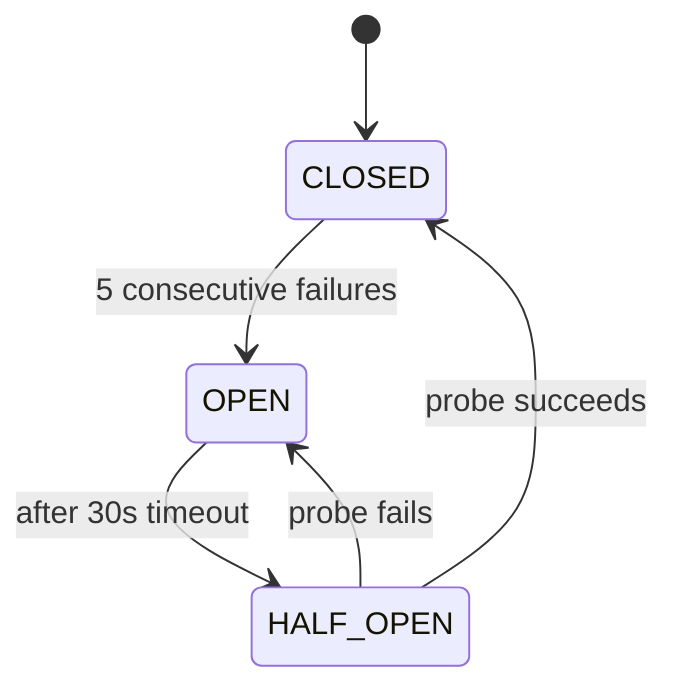
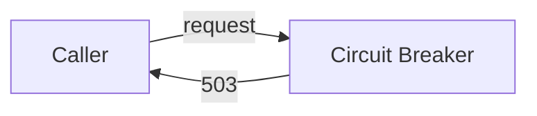
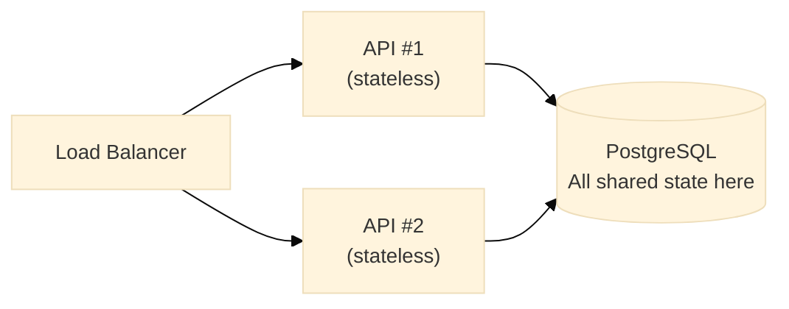

import Img from '@site/src/components/Img';
import RevealJS, { Slide } from '@site/src/components/RevealJS';
import PollSlide from "@site/src/components/PollSlide";

<RevealJS transition="slide">

{/* ============================================ */}
{/* COVER IMAGE */}
{/* ============================================ */}

<Slide>
  

<aside className="notes">
**Lecture overview:**
- **Total time:** ~65 MINUTES
- **Prerequisites:** L19 (monoliths, modular monoliths, microservices intro, Conway's Law preview)
- **Connects to:** L21 (serverless — pushing these concerns to the platform), L22 (teams and Conway's Law)

**Structure:**
- Arc 1: Motivating Example: Orkut Shortest-Path Service
- Arc 2: Client-Server Architecture, including REST
- Arc 3: The Eight Fallacies of Distributed Computing
- Arc 4: Microservices: Benefits and Costs
- Arc 5: Network-Related Quality Requirements
- **Security as an Architectural Concern** (~12 min)
- Bringing It Together (~5 min)

**Key theme:** Network communication doesn't just change HOW components talk — it invalidates assumptions programmers make constantly. Students who understand the eight fallacies will make better decisions when they inevitably work on distributed systems. Security isn't a feature you add — it shapes architecture from the start.

→ **Transition:** Let's start with the title...
</aside>

</Slide>

{/* ============================================ */}
{/* TITLE SLIDE */}
{/* ============================================ */}

<Slide>

# CS 3100: Program Design and Implementation II

## Lecture 20: Distributed Architecture — Networks, Microservices, and Security

<p style={{marginTop: '2em', fontSize: '0.8em', color: '#666'}}>
  ©2026 Jonathan Bell & Ellen Spertus, CC-BY-SA
</p>

<aside className="notes">
**Context:**
- L19 ended with a tease: the road continues into fog, "Distributed Systems Ahead, Here Be Dragons"
- Today we go into that fog
- Running examples: same as L19 — Pawtograder and Bottlenose — but now we focus on the network boundary between them

**Framing the lecture:**
- "L19 was about how we organize code INSIDE a single deployment"
- "Today is about what happens when components move to DIFFERENT deployments, connected by a network"
- "You are NOT expected to design distributed systems. The goal: understand why they're different, so you can read them, debug them, and make informed tradeoff decisions."

→ **Transition:** Here's what you'll be able to do after today...
</aside>

</Slide>

{/* ============================================ */}
{/* LEARNING OBJECTIVES */}
{/* ============================================ */}

<Slide>

## Learning Objectives

<p style={{fontSize: '0.85em', textAlign: 'left'}}>
After this lecture, you will be able to:
</p>

<ol style={{fontSize: '0.75em', textAlign: 'left'}}>
  <li>Explain why <strong>network communication</strong> fundamentally changes architectural tradeoffs compared to in-process method calls</li>
  <li>Identify and explain the <strong>Fallacies of Distributed Computing</strong> and how they affect system design</li>
  <li>Describe the <strong>client-server architecture</strong> and REST API conventions used for service communication</li>
  <li>Analyze the <strong>benefits and costs of microservices</strong> compared to monolithic architectures</li>
  <li>Apply <strong>security principles</strong> (authentication, authorization, trust boundaries, CIA triad) to distributed system analysis</li>
</ol>

<div className="fragment">
<p style={{fontSize: '0.75em', marginTop: '0.75em', fontStyle: 'italic', color: '#666'}}>
<strong>Important framing:</strong> Junior engineers read API documentation and debug network issues far more often than they design new distributed architectures. Comprehension comes first — you'll understand distributed systems well enough to work within them confidently.
</p>
</div>

<aside className="notes">
**SET EXPECTATIONS:**
- "You will NOT be tested on 'design a microservices architecture from scratch'"
- "You WILL be expected to read distributed systems, understand why things fail, and reason about security boundaries"

**Connection to L19:**
- L19 asked: "How do we organize code within one deployment?"
- L20 asks: "What changes when deployment spans multiple processes and machines?"
- The answer: nearly everything

→ **Transition:** Let's start with why we'd ever leave the monolith in the first place...
</aside>

</Slide>


<Slide>

## Announcements

<div style={{fontSize: '0.85em', textAlign: 'left'}}>

**Midterm Survey via Qualtrics, +1 participation credit if you complete it**
- Due Friday 2/27 @ 11:59 PM
- Anonymous link in your email
- Over 150 students have completed it so far

**Koury Mid-Semester Evaluations also due Friday**

**Consider answering questions from admitted students on [r/NEU](https://www.reddit.com/r/neu/).**

**Team Formation Survey Released!**
- Starting Week 10: teams of 4 for CookYourBooks GUI project
- Tell us your preferences (either Oakland section) + availability
- **Due Friday 2/27 @ 11:59 PM**
- [Complete the Survey →](https://docs.google.com/forms/d/e/1FAIpQLScP-pp6S2tP4Do1J5buWmFLDDHwO5r8dxAmjZCB5wH20UDDiQ/viewform)

**HW4 Due Thursday Night**

</div>

</Slide>

{/* ============================================ */}
{/* ARC 1: MOTIVATING EXAMPLE: ORKUT SHORTEST PATH SERVER */}
{/* ============================================ */}

<Slide>
## Motivating Example: The Orkut Team (2004-2008)

</Slide>

<Slide>

## Finding the Shortest Paths to Another User


<div style={{ fontSize: '.8em' }}>
Why do you think no social networks provide this feature?
</div>

<aside className="notes">
- I wanted users to be able to see how they were connected to other users
- No other social network had (or has) this feature.
- Why not?
</aside>

</Slide>

<Slide>

## Shortest-Path Server


<div style={{ fontSize: '.7em' }}>
Incoming request: 2 node ids<br/>
Response: HTML<br/>
Latency (response time): fraction of a second<br/>
Throughput (queries/s): not great
</div>
<aside className="notes">
- Transition: How to improve throughput
</aside>

</Slide>

<Slide>
## Increasing Throughput with Load Balanced Servers


<div style={{ fontSize: '.7em' }}>
Adding servers doesn't decrease latency but does increase throughput.<br/>
Everything worked great...for a while.
</div>

</Slide>

<Slide>

## Orkut Architecture
<div style={{ fontSize: '.8em' }}>
<div className='fragment'>
* Viewed in isolation, a shortest-path server, was a monolith.
</div>
<div className='fragment'>
* The shortest path servers (behind a load balancer) were distributed monoliths.
</div>
<div className='fragment'>
* Orkut used microservices, one of which was the shortest path service.
</div>
</div>
<aside className="notes">
Transition: Let's look at some costs...
</aside>

</Slide>

<Slide>

## Poll: Rank these actions from fastest to slowest

<PollSlide username='espertus'
  choices={[
    "reading from memory",
    "reading from a solid-state drive",
    "reading from a hard drive",
    "round-trip communication within a data center",
    "round-trip communication between CA and Netherlands"
    ]}
/>

<aside className="notes">

</aside>

</Slide>

<Slide>

## Poll: How much slower is reading from disk rather than memory?

<PollSlide username='espertus'
  choices={[
    "1-10x",
    "10-100x",
    "100-1000x",
    ">1000x"
  ]}
/>

<aside className="notes">

</aside>

</Slide>

<Slide>
## Latency Numbers Every Programmer Should Know


<div style={{ fontSize: '.7em' }}>
Source: https://colin-scott.github.io/personal_website/research/interactive_latency.html
</div>

<aside className="notes">
- Most memory accesses are to the L1 cache (1 ns)
- Reading from disk takes milliseconds
- The ratio is 1,000,000
</aside>

</Slide>

<Slide>

## Why Do No Social Networks Offer Paths?


<aside className="notes">
- Eventually, the graph got too big to fit in memory
- If we had to bring it in from disk or other servers, it would have been too slow
- It also was lower priority than other tasks
</aside>

</Slide>

<Slide>

## Vertical vs. Horizontal Scaling
<div style={{ fontSize: '.7em' }}>
<div className='fragment'>
* We hit the limit of vertical scaling. We couldn't add more memory to a single server.
</div>
<div className='fragment'>
* We would have needed to create a new architecture that used horizontal scaling.
</div>

<div className='fragment'>

</div>

</div>

<aside className="notes">

</aside>

</Slide>

{/* ============================================ */}
{/* ARC 2: CLIENT-SERVER ARCHITECTURE, INCLUDING REST */}
{/* ============================================ */}

<Slide>
## Introducing Client-Server Architecture


<aside className="notes">
- Let's see what C-S architecture is and why it's hard
</aside>
</Slide>

<Slide>

## Client-Server Architecture

<p style={{fontSize: '0.78em', marginBottom: '0.3em'}}>
**Clients** make requests, **servers** respond. The most ubiquitous pattern — every web app, mobile app, and service-to-service call.
</p>

<div style={{display: 'grid', gridTemplateColumns: '1fr 1fr', gap: '0.75em', fontSize: '0.5em', marginTop: '0.3em'}}>

<div>



</div>

<div>

```java
// Client code (Grading Action) — what actually runs
HttpClient client = HttpClient.newHttpClient();
HttpRequest request = HttpRequest.newBuilder()
    .uri(URI.create(API_URL + "/submitFeedback"))
    .header("Authorization", "Bearer " + authToken)
    .header("Content-Type", "application/json")
    .POST(BodyPublishers.ofString(feedbackJson))
    .build();

HttpResponse<String> response = client.send(
    request, BodyHandlers.ofString());
```

</div>

</div>

<div style={{display: 'grid', gridTemplateColumns: '1fr 1fr', gap: '0.5em', fontSize: '0.55em', marginTop: '0.4em'}}>

<div style={{padding: '0.4em', border: '2px solid #4CAF50', borderRadius: '6px'}}>

**Benefits** — Centralized control/state, update server → all clients benefit, enforce security policies, multiple clients connect simultaneously

</div>

<div style={{padding: '0.4em', border: '2px solid #FF9800', borderRadius: '6px'}}>

**Constraints** — Server = single point of failure, network latency on every op, must handle errors/timeouts/retries, client-initiated only

</div>

</div>

<aside className="notes">
**Make this concrete with the code:**
- "You've used client-server every time you've used a browser. The browser is the client, the web server is the server."
- Walk through the Java code: HttpClient is Java's built-in HTTP client (since Java 11)
- The Grading Action calls `client.send()` — that's a BLOCKING network call. The thread waits until the server responds.
- "Communication is always client-initiated" — the server can't push to the client without polling or websockets.

**The single point of failure:**
- The API goes down? All grading actions fail — even if they're running fine on GitHub's infrastructure.
- This is one reason Pawtograder implements retry logic.

**Why does this matter?**
- Every service-to-service call in a microservices architecture is client-server
- Understanding this is the foundation for understanding REST

**Note:** Message-passing and event-driven systems (L33) enable more bi-directional communication.

→ **Transition:** We've been showing HTTP code — but that's just ONE way to implement client-server. Where does HTTP fit in the bigger picture?
</aside>

</Slide>

<Slide>

## The Network Itself Is a Layered Architecture

<p style={{fontSize: '0.72em'}}>
Client-server doesn't require HTTP — it's just one option. The <strong>OSI model</strong> shows how network communication is organized into layers, each solving one problem. <em>Sound familiar from L19?</em>
</p>


<aside className="notes">
**SET EXPECTATIONS: This is context, not testable content!**
- "You won't be asked to name all 7 OSI layers on the exam"
- "The point is: when you call `client.send()`, data passes through MANY layers"
- "Each layer can fail, add latency, or have issues — that's why network calls aren't like method calls"

**Connection to L19 — This IS Layered Architecture!**
- The OSI model is the canonical example of layered architecture
- Each layer solves ONE problem, depends only on layers below
- You can swap implementations: TCP ↔ UDP at Layer 4, HTTP ↔ gRPC at Layer 7
- Same heuristics from L19: separation of concerns, downward dependencies only
- "The internet itself is a layered architecture" — drive this home!

**HTTP is one choice at Layer 7:**
- REST/HTTP: What we'll focus on (most common for APIs)
- gRPC: Google's binary protocol (faster, stricter contracts)
- WebSockets: Persistent connections, server can push
- Raw TCP (Layer 4): Maximum control, you handle everything

**Why this explains fallibility:**
- Your code hands data to the OS, which passes it down through ALL these layers
- Each layer adds headers, does processing, can introduce failures
- Network call can fail at ANY layer — that's why the Fallacies matter

**The CS 4700 plug:**
- We're skipping congestion control, routing algorithms, DNS, BGP
- For SE, understanding "many layers, each can fail" is enough

→ **Transition:** We'll focus on HTTP at Layer 7 — the most common choice for APIs. Let's see how it works...
</aside>

</Slide>


{/* ============================================ */}
{/* REST APIs */}
{/* ============================================ */}


<Slide>

## How Services Communicate: HTTP and REST

<p style={{fontSize: '0.78em'}}>
<strong>HTTP</strong> is the foundation. <strong>REST</strong> (Representational State Transfer) is a set of conventions built on HTTP for structuring APIs. An HTTP request has: a <strong>method</strong> (verb), a <strong>URL</strong> (resource), and optionally a <strong>body</strong> (data).
</p>

<div style={{fontSize: '0.48em', marginTop: '0.4em'}}>

```java
// GET — retrieve a resource (read-only, no body)
HttpRequest get = HttpRequest.newBuilder()
    .uri(URI.create(BASE_URL + "/submissions?student_id=" + studentId))
    .GET().build();

// POST — create a resource or trigger an action
HttpRequest post = HttpRequest.newBuilder()
    .uri(URI.create(BASE_URL + "/functions/v1/createSubmission"))
    .header("Content-Type", "application/json")
    .POST(BodyPublishers.ofString("{\"repo\": \"cs3100/hw1-alice\"}")).build();

// PATCH — partial update (only fields you're changing)
HttpRequest patch = HttpRequest.newBuilder()
    .uri(URI.create(BASE_URL + "/submissions/123"))
    .method("PATCH", BodyPublishers.ofString("{\"score\": 87}")).build();

// DELETE — remove a resource
HttpRequest delete = HttpRequest.newBuilder()
    .uri(URI.create(BASE_URL + "/submissions/123"))
    .DELETE().build();
```

</div>

<div className="fragment">
<p style={{fontSize: '0.65em', marginTop: '0.4em', color: '#9370DB'}}>
<strong>REST organizing principle:</strong> Organize around <em>nouns</em> (submissions, assignments, students) and manipulate them with <em>standard verbs</em>. Once you know the pattern, every RESTful API works the same way.
</p>
</div>

<aside className="notes">
**Walk through the code:**
- GET: no request body — query params in URL. Used for reading.
- POST: body contains data to create. Used for creation and actions.
- PATCH: body contains ONLY the fields to update (vs PUT which replaces entire resource)
- DELETE: usually no body — the URL identifies what to delete

**The response half:**
- Server responds with a STATUS CODE: 200 = success, 201 = created, 404 = not found, 401 = unauthorized, 500 = server error
- And optionally a response BODY (usually JSON)

**Statelessness:**
- Key REST constraint: each request contains ALL information needed to process it
- The server doesn't remember previous requests
- This makes horizontal scaling easy: any server instance can handle any request

**Mention GraphQL briefly:**
- GraphQL lets clients specify exactly which fields they need — avoids over-fetching
- Many APIs offer GraphQL alongside REST — you should know it exists

→ **Transition:** REST also standardizes how servers communicate success and failure...
</aside>

</Slide>

<Slide>

## REST Status Codes: The Language of Failure

<p style={{fontSize: '0.78em'}}>
One of REST's great gifts: <strong>standardized error codes</strong>. The status code tells you <em>where</em> to look when debugging.
</p>

<div style={{display: 'grid', gridTemplateColumns: '1fr 1fr', gap: '0.75em', fontSize: '0.5em', marginTop: '0.4em'}}>

<div>

| Code | Meaning | Action |
|------|---------|--------|
| **2xx** | **Success** | Process response |
| `200 OK` | Request succeeded | |
| `201 Created` | Resource created | |
| **4xx** | **Client Error** | Fix your code |
| `401 Unauthorized` | Not authenticated | Refresh token |
| `403 Forbidden` | Not allowed | Check permissions |
| `429 Too Many` | Rate limited | Back off |
| **5xx** | **Server Error** | Retry with backoff |
| `503 Unavailable` | Server overloaded | Wait and retry |

</div>

<div>

```java
HttpResponse<String> response = client.send(
    request, BodyHandlers.ofString());

switch (response.statusCode() / 100) {
    case 2 -> processSuccess(response.body());
    case 4 -> {
        if (response.statusCode() == 401) {
            refreshToken();  // Auth expired
        } else if (response.statusCode() == 429) {
            sleepUntil(response.headers()
                .firstValue("Retry-After"));
        } else {
            throw new ClientError(response);
        }
    }
    case 5 -> throw new RetryableException(response);
}
```

</div>

</div>

<div className="fragment">
<p style={{fontSize: '0.65em', marginTop: '0.4em', color: '#FF9800', fontWeight: 'bold'}}>
<strong>Key insight:</strong> 4xx = your code is wrong (don't retry). 5xx = server is struggling (retry with backoff). 401 = who are you? 403 = I know you, but no.
</p>
</div>

<aside className="notes">
**Walk through the code:**
- `statusCode() / 100` gives you the category (2, 4, or 5)
- 2xx: success — process the response body
- 4xx: client error — DON'T retry (it'll fail again), fix your code
- 5xx: server error — DO retry with exponential backoff

**The 401 vs 403 distinction is critical:**
- 401 "Unauthorized" (poorly named — should be "Unauthenticated"): "I don't know who you are"
- 403 "Forbidden": "I know who you are, you just can't do this"
- In Pawtograder: 401 if auth token missing/invalid, 403 if token valid but repo not enrolled

**The 429 case:**
- Rate limiting is common in APIs
- Response usually includes `Retry-After` header
- Respect it or you'll get blocked

→ **Transition:** Now that we can read API responses, let's look at the REAL challenge of distributed systems...
</aside>

</Slide>

<Slide>

## Live Demo


https://jokeapi.dev/
</Slide>

{/* ============================================ */}
{/* ARC 3: THE FALLACIES */}
{/* ============================================ */}

<Slide>

## The Fallacies of Distributed Computing


<p style={{fontSize: '0.7em', marginTop: '0.75em'}}>
Peter Deutsch and colleagues at Sun Microsystems identified eight assumptions developers make about networks — all of which are <strong>false</strong>. These are the <em>Fallacies of Distributed Computing</em>.
</p>

<aside className="notes">
- "In a monolith, method calls don't fail. They don't take 2 seconds. They're free. You can assume whoever wrote the other module is on your team."
- "The moment you cross the network, EVERY one of these assumptions breaks."

→ **Transition:** Let's go through them one by one...
</aside>

</Slide>

<Slide>

## Fallacy 1: "The Network Is Reliable"

<p style={{fontSize: '0.82em'}}>
Networks fail. Cables get unplugged, routers crash, cloud providers have outages. Code that assumes a network call will always succeed is <strong>fragile code</strong>.
</p>

<div style={{display: 'grid', gridTemplateColumns: '1fr 1fr', gap: '1em', fontSize: '0.6em', marginTop: '0.75em'}}>

<div style={{padding: '0.75em', border: '2px solid #f44336', borderRadius: '8px'}}>

**The fragile version**

```java
// Assumes the network always works
Response response = client.send(request);
processResponse(response);
// If request fails → student never sees grade
```

</div>

<div style={{padding: '0.75em', border: '2px solid #4CAF50', borderRadius: '8px'}}>

**Better: timeout and retry**

```java
Response response = null;
int attempts = 0;
while (response == null && attempts < 3) {
  try {
    response = client.send(request, Duration.ofSeconds(10));
  } catch (TimeoutException e) {
    // This performs exponential backoff: 1s, 2s, 4s
    Thread.sleep((long) Math.pow(2, attempts) * 1000);
    attempts++;
  }
}
if (response == null) {
  logError("Failed after 3 attempts");
    // Display "grading in progress"
}
```

</div>

</div>

<div className="fragment">
<p style={{fontSize: '0.73em', marginTop: '0.5em', color: '#9370DB'}}>
<strong>Pawtograder:</strong> The Grading Action tries to submit feedback. The request times out. Retry logic with exponential backoff — wait 1s, then 2s, then 4s. Either succeeds, or the student sees "grading in progress."
</p>
</div>

<aside className="notes">
**The key insight:**
- Without retry logic, a single dropped packet means a student never sees their grade
- With retry logic, transient failures are invisible to users
- Exponential backoff prevents overwhelming a struggling server

**Exponential backoff:**
- Don't retry immediately — that'll hammer a server that's struggling
- Wait 1s, then 2s, then 4s, then 8s — or give up
- Add jitter (random offset) to avoid "thundering herd" — all retries hitting at once

**Graceful degradation:**
- Notice the last comment: "Show 'grading in progress' not a crash"
- Offering REDUCED functionality is better than NONE
- The student knows grading is happening; they'll refresh later

→ **Transition:** But if we're retrying, we need to understand the details — and a new problem retrying creates...
</aside>

</Slide>

<Slide>

## Pattern: Timeout + Retry with Exponential Backoff

<p style={{fontSize: '0.72em'}}>
<em>This pattern addresses Fallacy 1 (unreliable). Never wait forever — set a deadline, then try again, backing off between attempts.</em>
</p>

<div style={{fontSize: '0.5em', marginTop: '0.4em'}}>

```java
public Response sendWithRetry(HttpRequest request) throws Exception {
    int maxAttempts = 3;
    for (int attempt = 1; attempt <= maxAttempts; attempt++) {
        try {
            // ALWAYS set a timeout — without one, a hung server blocks this thread forever
            return client.send(request,
                HttpResponse.BodyHandlers.ofString(),
                Duration.ofSeconds(10));
        } catch (HttpTimeoutException | IOException e) {
            if (attempt == maxAttempts) throw e;
            // Exponential backoff: 1s, 2s, 4s — don't hammer a struggling service
            Thread.sleep((long) Math.pow(2, attempt) * 1000);
        }
    }
    throw new RuntimeException("unreachable");
}

public Response call(HttpRequest request) throws Exception {
    Response response = sendWithRetry(request);
    if (response.statusCode() >= 500) {
        return sendWithRetry(request);  // Server error: worth retrying
    }
    return response;  // 4xx client error: retrying won't help — fix the request
}
```

</div>
<div style={{ fontSize: '.8em' }}>
Exponential backoff + jitter (randomness) ensures retries don't happen at same time
</div>

<aside className="notes">
**The timeout is the most important part:**
- Without a timeout, `client.send()` can block indefinitely
- Always set a timeout — even if generous (30s)

**Exponential backoff rationale:**
- Imagine 100 grading actions all fail at the same moment (API restart)
- Fixed 1s retry: all 100 retry at t+1s — waves of 100 requests on top of normal load
- Exponential backoff: naturally spread out — 2s, 4s, 8s
- Add jitter: `backoffMs += random.nextLong(0, 500)` — "thundering herd" prevention
→ **Transition:** But now we have a problem: if we retry, could we run the operation twice?
</aside>

</Slide>

<Slide>

## Idempotency

<div style={{ fontSize: '.7em' }}>
An action is <em>idempotent</em> if performing it multiple times has the same result as performing it once.

<div className='fragment' style={{display: 'flex', gap: '2em'}}>

<div style={{flex: 1, border: '2px solid #4ac', borderRadius: '8px', padding: '0.5em'}}>

**Idempotent**
- `x = 5;`
- `myList.clear();`
- Pressing an elevator button
- HTTP GET, PUT, and DELETE

</div>

<div style={{flex: 1, border: '2px solid #f44336', borderRadius: '8px', padding: '0.5em'}}>

**Non-Idempotent**
- `x += 5;`
- `myList.add(1);`
- Watering a plant
- HTTP POST
</div>
</div>

<div className='fragment'>
If you ask your roommate multiple times on the same day to water the plant, will they do it more than once?
</div>
</div>


<aside className="notes">

</aside>

</Slide>

<Slide>

## Pattern: Idempotency — Making Retries Safe

<p style={{fontSize: '0.72em'}}>
<em>Over a network, "did it run?" is ambiguous — the request may have arrived but the response was lost. Design operations so retrying is <strong>safe</strong>.</em>
</p>

<div style={{fontSize: '0.5em', marginTop: '0.4em'}}>

```java
// CLIENT: attach a stable unique key — same key = same operation, don't repeat it
public void submitFeedback(String submissionId, Feedback feedback) {
    HttpRequest request = HttpRequest.newBuilder()
        .uri(URI.create(API_URL + "/functions/v1/submitFeedback"))
        .header("Idempotency-Key", submissionId)   // Stable, unique per grading run
        .POST(HttpRequest.BodyPublishers.ofString(gson.toJson(feedback)))
        .build();
    sendWithRetry(request);   // Now safe to call multiple times!
}
```

```java
// SERVER: check the key before doing any work
public Response submitFeedback(Request req) {
    String key = req.header("Idempotency-Key");

    Optional<Response> cached = db.findByIdempotencyKey(key);
    if (cached.isPresent()) {
        return cached.get();   // Already ran — return same result, don't re-grade
    }

    Feedback feedback = gson.fromJson(req.body(), Feedback.class);
    Response result = gradingService.store(feedback);
    db.storeIdempotencyResult(key, result);   // Cache so future retries are safe
    return result;
}
```
</div>

<aside className="notes">
→ **Transition:** Even when the network works, it still slows you down...
</aside>

</Slide>

<Slide>
## Latency


</Slide>

<Slide>

## Fallacy 2: "Latency Is Zero" — Chatty vs Chunky APIs

<p style={{fontSize: '0.72em'}}>
Every network call takes time. Local method calls: nanoseconds. Network calls: milliseconds to seconds. <strong>Minimize round-trips.</strong>
</p>

<div style={{display: 'grid', gridTemplateColumns: '1fr 1fr', gap: '0.75em', fontSize: '0.48em', marginTop: '0.3em'}}>

<div style={{padding: '0.5em', border: '2px solid #f44336', borderRadius: '8px', backgroundColor: '#FFEBEE'}}>

**Chatty API — 100 network round-trips**

```java
// BAD: One API call per test result
for (TestResult result : testResults) {
    api.submitSingleResult(submissionId, result);
    // 100ms latency × 100 tests = 10 SECONDS
}
```

</div>

<div style={{padding: '0.5em', border: '2px solid #4CAF50', borderRadius: '8px', backgroundColor: '#E8F5E9'}}>

**Chunky API — 1 network round-trip**

```java
// GOOD: All results in one payload
FeedbackBatch batch = FeedbackBatch.builder()
    .submissionId(submissionId)
    .results(testResults)  // All 100 results
    .build();
api.submitFeedback(batch);
// 100ms latency × 1 call = 100ms
```

</div>

</div>

<div style={{display: 'grid', gridTemplateColumns: '1fr 1fr 1fr', gap: '0.5em', fontSize: '0.52em', marginTop: '0.5em'}}>

<div style={{padding: '0.4em', border: '2px solid #4A90A4', borderRadius: '6px'}}>

**Fallacy 3: Bandwidth is infinite** — SHA hash to skip unchanged downloads (grader tarball caching)

</div>

<div style={{padding: '0.4em', border: '2px solid #FF9800', borderRadius: '6px'}}>

**Fallacy 5: Topology doesn't change** — Never hardcode URLs; use config. Servers move, DNS updates.

</div>

<div style={{padding: '0.4em', border: '2px solid #9370DB', borderRadius: '6px'}}>

**Fallacy 8: Network is homogeneous** — Same code, different behavior on different networks.

</div>

</div>

<aside className="notes">
- Does anyone remember where we've seen chunking before in the Java API?
- BufferedInputStream

→ **Transition:** The remaining fallacies touch on security and cost...
</aside>

</Slide>

<Slide>

## Fallacy 4: "The Network Is Secure"


<div style={{ fontSize: '.8em' }}>

Data crossing networks can be intercepted, modified, or spoofed. Every network boundary is a potential attack surface.

*Pawtograder:* Without the OIDC token, anyone could POST fake grades. Without HTTPS, a network observer could read or modify grades in transit.

*(We'll dive deep on security later in this lecture.)*
</div>

<aside className="notes">
- OIDC (OpenID Connect) is an authentication protocol
</aside>

</Slide>

<Slide>

## Fallacy 6: "There Is One Administrator"
<div style={{ fontSize: '.8em' }}>

Different parts of distributed systems are controlled by different organizations. You can't control what they do.

*Real NEU example:* Northeastern contracts with Palo Alto Networks to filter all campus traffic. When Palo Alto arbitrarily decides Pawtograder's dev environment is malware — learning is disrupted. NEU claimed no responsibility. **This happens all the time.**

<aside className="notes">
- Corporate firewalls, university proxies, ISP throttling, regional outages — all outside your control
- Design for this: health checks, fallback modes, clear error messages to users
</aside>
</div>
</Slide>

<Slide>

## Fallacy 7: "Transport Cost Is Zero"

<div style={{ fontSize: '.8em' }}>
Network calls have real costs: computational (serialization, encryption), monetary (API pricing, bandwidth fees), and energy (radio transmission, data center processing).

*Pawtograder:* Batching 100 test results into one `submitFeedback()` call instead of 100 calls doesn't just save latency — it saves energy. 6,000 grading runs/semester × 100 extra API calls = measurable environmental impact.
</div>
<aside className="notes">
- Where have we seen combining requests in the Java library? BufferedInputStream

→ **Transition:** The fallacies also drive system-level resilience patterns — let's see two more...
</aside>

</Slide>

<Slide>

## Pattern: Circuit Breaker — Stop Hammering a Struggling Service

<p style={{fontSize: '0.72em'}}>
<em>If a service is struggling, hammering it with retries makes it worse. The circuit breaker detects sustained failure and stops trying — giving the service time to recover.</em>
</p>

<div style={{display: 'flex', gap: '1em', marginTop: '0.3em'}}>

<div style={{fontSize: '0.47em', flex: '1'}}>
```java
// Three states: CLOSED (normal) → OPEN (failing fast) → HALF_OPEN (testing recovery)
public class CircuitBreaker {
  enum State { CLOSED, OPEN, HALF_OPEN }

  private State state = State.CLOSED;
  private int failureCount = 0;
  private Instant openedAt;

  public Response call(Supplier<Response> request) {
    if (state == State.OPEN) {
      if (Duration.between(openedAt, Instant.now()).toSeconds() < 30) {
        // Fail immediately — fast failure > slow failure
        throw new CircuitOpenException("Service unavailable, try later");
      }
      state = State.HALF_OPEN;   // After 30s, allow one probe request through
    }

    try {
      Response response = request.get();
      reset();           // Success: back to CLOSED
      return response;
    } catch (Exception e) {
      failureCount++;
      if (failureCount >= 5) {
        state = State.OPEN;    // 5 consecutive failures → trip the circuit
        openedAt = Instant.now();
      }
      throw e;
    }
  }

  private void reset() { state = State.CLOSED; failureCount = 0; }
}
```

</div>

<div style={{flex: '1', display: 'flex', flexDirection: 'column', gap: '1em', fontSize: '0.6em'}}>





</div>

</div>

<aside className="notes">
**The electrical analogy:**
- A circuit breaker in your house trips when current is too high — protecting the wiring
- This pattern trips when failure rate is too high — protecting the downstream service

**Three states:**
- CLOSED: all requests pass through (normal)
- OPEN: all requests fail immediately — don't even attempt
- HALF_OPEN: one probe through to test recovery; success → CLOSED, failure → OPEN

**Why fail fast beats fail slow:**
- Slow failures: threads pile up → thread pool exhaustion → YOUR service also goes down → cascading failure
- Fast failures: immediately tell callers "not available" → callers degrade gracefully → no cascade

**Production note:**
- Use a library: Resilience4j (Java), Polly (.NET)
- Don't roll your own — thread safety and half-open probe races are subtle

→ **Transition:** The circuit breaker fails fast. But what do we show the user when it's open?
</aside>

</Slide>

<Slide>

## Pattern: Graceful Degradation — Reduced Functionality Beats Crashing

<p style={{fontSize: '0.72em'}}>
<em>When a service is unavailable, offer <strong>reduced functionality</strong> rather than crashing. Stale data beats an error screen.</em>
</p>

<div style={{fontSize: '0.5em', marginTop: '0.4em'}}>

```java
// When grading service is unavailable, give the student useful information
public SubmissionResponse handleSubmission(String submissionId) {
    // Step 1: Record that we received the code (this succeeds even if grading is down)
    db.markSubmissionReceived(submissionId);

    try {
        return gradingApi.triggerGrading(submissionId);
    } catch (CircuitOpenException | ServiceUnavailableException e) {
        // Grading is down — but the student's code IS safe
        return SubmissionResponse.builder()
            .submissionId(submissionId)
            .status("RECEIVED_PENDING_GRADING")
            .message("Your code has been received. Grading is temporarily unavailable, " +
                     "but will run automatically once the system recovers. " +
                     "You'll receive an email when your results are ready.")
            .build();
    }
}
```

</div>

<div className="fragment">
<p style={{fontSize: '0.65em', marginTop: '0.4em', color: '#9370DB'}}>
<strong>Design your degraded state intentionally.</strong> Tell users what succeeded, what's delayed, and what to expect. A helpful message beats a stack trace. For every service call: if this fails, what should the user experience?
</p>
</div>

<aside className="notes">
**The key insight — tell users what they need to know:**
- What succeeded: "Your code has been received"
- What's delayed: "Grading is temporarily unavailable"
- What will happen: "Will run automatically once system recovers"
- What to do: "You'll receive an email"

**Stale cache is another common pattern:**
- CDNs: serve cached content when origin is down
- Browsers: show cached pages when offline
- "Stale data > no data" for most reads — users tolerate minutes-old data; they hate error screens

**Degrade intentionally:**
- Bad: catch exception, re-throw as 500
- Good: catch exception, return designed fallback with human-readable message

**All four patterns together — Pawtograder:**
1. `submitFeedback()` has a 10s timeout, retries up to 3 times (Timeout + Retry)
2. Each retry sends the same submissionId as the idempotency key (Idempotency)
3. After 5 consecutive API failures, circuit opens (Circuit Breaker)
4. Student sees "Code received, grading pending" instead of a crash (Graceful Degradation)

→ **Transition:** Now that we understand the costs AND the patterns for handling them, let's revisit microservices with fresh eyes...
</aside>

</Slide>

{/* ============================================ */}
{/* ARC 4: MICROSERVICES */}
{/* ============================================ */}

{/* Transition slide */}

<Slide>

## Transition to Microservices


<div style={{ fontSize: '.6em' }}>
Forrest Brazeal, [Good Tech Things](https://www.goodtechthings.com/) [CC BY-NC-ND 4.0](https://creativecommons.org/licenses/by-nc-nd/4.0/legalcode?ref=goodtechthings.com)
</div>

<aside className="notes">

</aside>

</Slide>

<Slide>

## Microservices Architecture: Now With Context

<p style={{fontSize: '0.82em'}}>
We introduced microservices in L19. Now we understand the cost. Let's look at why teams <em>still</em> pay it.
</p>

<p style={{fontSize: '0.78em', marginTop: '0.3em'}}>
A <strong>microservices architecture</strong> decomposes a system into small, independently deployable services, each owning a specific business capability and its own data.
</p>

<div style={{display: 'grid', gridTemplateColumns: '1fr 1fr', gap: '0.75em', fontSize: '0.6em', marginTop: '0.5em'}}>

<div style={{padding: '0.6em', border: '2px solid #4CAF50', borderRadius: '8px'}}>

**Benefits you pay for**

- **Independent scaling:** Scale the grading service without scaling the API
- **Elastic scaling:** Spin up 500 grading runners at deadline time, scale to zero at 3 AM
- **Isolated failures:** Discord bot bug can't crash grading
- **Team autonomy:** Grading Action team and API team evolve independently
- **Technology flexibility:** Different runtimes for different constraints (GitHub Actions vs Deno vs PostgreSQL)

</div>

<div style={{padding: '0.6em', border: '2px solid #f44336', borderRadius: '8px'}}>

**Costs you definitely pay**

- **All eight fallacies** apply — every call is a network call
- **Operational overhead:** Many builds, many deploys, many log streams
- **Data consistency:** No transactions across services — eventual consistency only *(more on consistency models in L33)*
- **Testing complexity:** Integration tests must spin up multiple services
- **Energy overhead:** Every inter-service call costs orders of magnitude more than a method call

</div>

</div>

<aside className="notes">
**Connect to the fallacies:**
- "We just spent 15 minutes on the fallacies. In a microservices architecture, every service-to-service call is subject to all eight."
- This is the TAX of microservices — you pay it on every interaction

**Independent scaling:**
- In a monolith: grading is slow? You must scale the entire app.
- In microservices: scale only the grading service — and only during deadline rushes.

**Elastic scaling:**
- Pawtograder example: 500 students submit in the last hour before deadline
- GitHub Actions spins up 500 parallel runners — each grading job is independent
- At 3 AM: zero runners active, zero cost
- A monolith can't do this — you'd need to keep enough servers running to handle peak load 24/7

**Team autonomy is real:**
- Pawtograder: GitHub Actions maintainers evolve the Grading Action independently of API maintainers
- They just need to agree on the interface (API contract)
- This maps to Conway's Law (L22): team structure → system structure

**Energy overhead:**
- I want to flag this again: the "chatty" microservices architecture wastes energy
- This is one reason why the design pattern of "batch operations" matters
- And why "monolith-first" is the sustainable default

→ **Transition:** There's a particularly bad outcome to watch out for...
</aside>

</Slide>

<Slide>

## The Distributed Monolith: All Costs, No Benefits


<p style={{fontSize: '0.72em', marginTop: '0.5em'}}>
The <strong>distributed monolith</strong> anti-pattern: services that are deployed separately but so tightly coupled they must be changed and deployed together. You pay all eight fallacies' costs — but get none of the benefits (independent scaling, isolated failures, team autonomy).
</p>

<aside className="notes">
**Signs you have a distributed monolith:**
- Changing one service requires changing multiple others
- Services share a database schema (the classic red flag)
- You can't deploy services independently
- Teams must coordinate every change

**How it happens:**
- Teams extract services without establishing clean boundaries
- The old shared database stays shared
- "We'll add an API in front of it later" → never happens
- Services call each other in complex chains — tight coupling over the network

**If you find yourself here:**
- Option 1: Properly decouple — establish true service contracts, separate data ownership
- Option 2: Collapse back into a monolith — seriously! A good monolith beats a bad distributed monolith.
- This is usually a symptom of premature decomposition (splitting before understanding domain boundaries)

**The message:**
- "If you're going to pay the distributed systems tax, make sure you're getting the benefits"
- "A well-designed monolith beats a poorly-designed microservices architecture every time"

→ **Transition:** Let's look at the quality attributes that become critical in distributed systems...
</aside>

</Slide>

{/* ============================================ */}
{/* ARC 5: NETWORK QUALITY REQUIREMENTS */}
{/* ============================================ */}

<Slide>

## Quality Attributes: Distribution Creates Challenges AND Opportunities

<p style={{fontSize: '0.82em'}}>
Several quality attributes become critical when components communicate over networks. Distribution makes these <strong>harder to achieve</strong> — but also enables <strong>solutions impossible in a monolith</strong>.
</p>

<div style={{display: 'grid', gridTemplateColumns: '1fr 1fr 1fr', gap: '0.75em', fontSize: '0.58em', marginTop: '0.5em'}}>

<div style={{padding: '0.6em', border: '2px solid #9370DB', borderRadius: '8px'}}>

**Performance**

*How fast is the system?*

<span style={{color: '#f44336'}}>Challenge:</span> Network adds latency to every call

<span style={{color: '#4CAF50'}}>Opportunity:</span> Parallelize work across machines; cache at edge locations near users

</div>

<div style={{padding: '0.6em', border: '2px solid #4A90A4', borderRadius: '8px'}}>

**Reliability**

*Does it stay up when things fail?*

<span style={{color: '#f44336'}}>Challenge:</span> More components = more failure points

<span style={{color: '#4CAF50'}}>Opportunity:</span> Redundancy across machines/regions; no single point of failure

</div>

<div style={{padding: '0.6em', border: '2px solid #4CAF50', borderRadius: '8px'}}>

**Scalability**

*Can it handle more load?*

<span style={{color: '#f44336'}}>Challenge:</span> Coordination overhead; distributed state complexity

<span style={{color: '#4CAF50'}}>Opportunity:</span> Add machines on demand; scale individual bottlenecks independently

</div>

</div>

<div className="fragment">
<p style={{fontSize: '0.73em', marginTop: '0.6em', color: '#FF9800', fontWeight: 'bold'}}>
The goal isn't to avoid distribution — it's to <em>distribute strategically</em> where the benefits outweigh the costs. Let's make sure you know the vocabulary.
</p>
</div>

<aside className="notes">
**Frame the dual nature:**
- "Distribution isn't just a tax you pay — it's also the key to solving problems monoliths CAN'T solve"
- "A monolith can't survive a data center fire. A distributed system across regions can."
- "A monolith can't scale one component independently. Microservices can."

**Frame expectations:**
- "This is a survey, not a deep dive"
- "CS4530 (SE), CS4700 (Networks), CS4730 (Distributed Systems) go much deeper"
- "The goal: when you see a system design doc or interview question, you know what these terms mean"

**Why these three?**
- Performance: users experience slowness directly
- Reliability: users experience downtime directly
- Scalability: users experience system collapse under load directly

**Note: We covered the strategies in the patterns section**
- Caching, batching → Fallacies 2-3
- Retry, circuit breaker → Fallacy 1
- These slides just give students the vocabulary to recognize these concepts

→ **Transition:** Here's the vocabulary you need...
</aside>

</Slide>

<Slide>

## Scaling and Reliability: The Vocabulary You Need

<p style={{fontSize: '0.78em'}}>
Distribution isn't just a tax — it's also the key to solving problems monoliths can't. Here's the vocabulary you'll encounter in system design docs and interviews.
</p>

<div style={{display: 'grid', gridTemplateColumns: '1fr 1fr', gap: '0.75em', fontSize: '0.58em', marginTop: '0.5em'}}>

<div style={{padding: '0.6em', border: '2px solid #9370DB', borderRadius: '8px'}}>

**Availability — The "Nines" Game**

*Percentage of time the system is operational*

| Availability | Downtime/year |
|-------------|---------------|
| 99% ("two nines") | 3.65 days |
| 99.9% ("three nines") | 8.76 hours |
| 99.99% ("four nines") | 52.6 minutes |
| 99.999% ("five nines") | 5.26 minutes |

Each additional nine is **exponentially** harder and more expensive. High availability is only achievable through redundancy — impossible in a monolith.

</div>

<div style={{padding: '0.6em', border: '2px solid #4A90A4', borderRadius: '8px'}}>

**Vertical vs. Horizontal Scaling**

**Vertical ("Scale Up"):** Bigger machine — more CPU, RAM, disk.
- ✓ Simple, no code changes
- ✗ Hardware limits, expensive, single point of failure

**Horizontal ("Scale Out"):** More machines + load balancer.
- ✓ Near-infinite scaling, redundancy built-in, elastic
- ✗ Requires stateless design, all 8 fallacies apply

*Pawtograder:* GitHub Actions scales horizontally — 500 grading jobs run in parallel on 500 separate runners.

</div>

</div>


<aside className="notes">
**This is a vocabulary slide, not deep dive:**
- Students will encounter these terms in interviews and design docs
- The nines table is essential vocabulary
- Vertical vs. horizontal is a fundamental concept

**Connect back to what we've covered:**
- We already taught caching, batching, retry, circuit breaker in the patterns section
- This slide gives them the formal names and context
- Don't re-teach — reference back

**The key insight:**
- High availability requires redundancy
- Redundancy requires distribution
- Distribution requires stateless design
- It all connects

→ **Transition:** What enables horizontal scaling? Statelessness...
</aside>

</Slide>

<Slide>

## The Key to Horizontal Scaling: Statelessness

<p style={{fontSize: '0.78em'}}>
Horizontal scaling only works if <strong>any server can handle any request</strong>. This requires stateless services — each request contains all information needed to process it.
</p>

<div style={{display: 'grid', gridTemplateColumns: '1fr 1fr', gap: '0.75em', fontSize: '0.58em', marginTop: '-0.75em'}}>

<div style={{padding: '0.6em', border: '2px solid #4CAF50', borderRadius: '8px'}}>

**Stateless: Any server works**

```java
POST /submitFeedback
{
  "submission_id": "abc123",
  "results": [...],
  "auth_token": "..."  // Identity in request
}
// Load balancer routes to ANY available server
```

The Grading Action is completely stateless — each run is independent. GitHub can route jobs to any available runner.

</div>

<div style={{padding: '0.6em', border: '2px solid #f44336', borderRadius: '8px'}}>

**Stateful: Locked to one server**

```java
POST /submitFeedback
{
  "results": [...]
}
// Server remembers session from earlier request
// Only THIS server can handle this request
// "Sticky sessions" → can't scale freely
```

If the server dies, the session state is lost. If load spikes, you can't add servers without breaking sessions.

</div>

</div>

<div className="fragment">
<div style={{fontSize: '0.52em', marginTop: '0.5em'}}>



</div>
<p style={{fontSize: '0.6em', textAlign: 'center', marginTop: '0.25em'}}>
<strong>Externalize state:</strong> Shared state lives in the database, not in individual servers.
</p>
</div>

<aside className="notes">
**This is the key architectural insight:**
- REST's "stateless" constraint exists specifically for scalability
- Fielding knew this in 2000 — statelessness enables horizontal scaling
- "Sticky sessions" (always route user X to server Y) break horizontal scaling

**The pattern:**
- Keep services stateless
- Put all shared state in a dedicated service (database, cache)
- Now any server can handle any request → you can add servers freely

**Pawtograder example:**
- The Grading Action is the purest example of stateless
- Each run: fresh VM, no memory of previous runs
- GitHub can spin up 500 VMs in parallel without coordination

**Database becomes the bottleneck:**
- This is why database scaling (replication, sharding) is its own specialty
- More on this in L21

→ **Transition:** Now let's connect to security — because security shapes all of these decisions...
</aside>

</Slide>

{/* ============================================ */}
{/* SECURITY */}
{/* ============================================ */}

<Slide>

## Network Traffic Is Readable and Forgeable by Default

<p style={{fontSize: '0.82em'}}>
Without security, distributed systems are <strong>trivially exploitable</strong>. Here's what an attacker on the same network can do:
</p>

<div style={{display: 'grid', gridTemplateColumns: '1fr 1fr 1fr', gap: '0.6em', fontSize: '0.58em', marginTop: '0.5em'}}>

<div style={{padding: '0.5em', border: '2px solid #f44336', borderRadius: '8px', backgroundColor: '#FFEBEE'}}>

**Eavesdrop**

Read every HTTP request. See passwords, tokens, grades, personal data. *A student on coffee shop WiFi submits homework — attacker reads their GitHub token.*

</div>

<div style={{padding: '0.5em', border: '2px solid #f44336', borderRadius: '8px', backgroundColor: '#FFEBEE'}}>

**Modify**

Change requests in flight. Alter grades, redirect payments, inject code. *Grading Action reports 85% → attacker changes to 100% before API receives it.*

</div>

<div style={{padding: '0.5em', border: '2px solid #f44336', borderRadius: '8px', backgroundColor: '#FFEBEE'}}>

**Impersonate**

Send requests pretending to be someone else. *Attacker sends: "I'm student123's grading action, here are perfect scores." How does the API know it's lying?*

</div>

</div>

<div className="fragment">
<p style={{fontSize: '0.72em', marginTop: '0.6em', color: '#FF9800', fontWeight: 'bold'}}>
The network is a hostile environment. Security isn't paranoia — it's engineering for reality.
</p>
</div>

<aside className="notes">
**Make this visceral:**
- These aren't theoretical attacks — they're trivial to execute
- Wireshark + coffee shop WiFi = see everyone's unencrypted traffic
- "Man in the middle" attacks are well-automated tools
- The Palo Alto firewall we complained about? It's DOING exactly this — reading and modifying your traffic. When it's NEU doing it, they call it "security." When it's an attacker, it's a breach.

**The three attacks map to CIA:**
- Eavesdrop → violates Confidentiality
- Modify → violates Integrity
- Impersonate → violates Integrity AND potentially all three

**Why this matters for Pawtograder:**
- Students submit from everywhere — dorms, cafés, airports
- Grades are sensitive data (FERPA protected!)
- Academic integrity depends on submissions being authentic
- The Grading Action runs on GitHub's infrastructure — how do we trust it?

**This lecture's security goal:**
- Build the mental model for HOW we defend against these attacks
- Not exhaustive security training — that's a whole course
- But enough to understand architectural security decisions

→ **Transition:** Let's start with a framework for thinking about what we're protecting...
</aside>

</Slide>

{/* ============================================ */}
{/* SECURITY FRAMEWORK */}
{/* ============================================ */}

<Slide>

## Every Security Decision Trades Off Confidentiality, Integrity, and Availability


<aside className="notes">
**This is our framework for the security discussion.**

Walk through each with Pawtograder examples:

**Confidentiality:**
- Student A can't see Student B's grades
- Students can't see the instructor's solution before the deadline
- OIDC tokens must not be logged (they're short-lived but still sensitive)

**Integrity:**
- Grades should actually reflect test results — not be tampered with in transit
- The grader tarball SHA hash ensures the tarball hasn't been modified in transit
- Pawtograder's use of HTTPS ensures grades can't be modified mid-flight (MITM attack)

**Availability:**
- If students can't submit before the deadline because the API is down, that's an Availability violation
- A DDoS attack that takes down the API is an availability attack
- Note that "availability" is also one of the eight fallacies (Fallacy 1 — the network is reliable) — they connect!

**The tradeoffs:**
- Confidentiality vs Availability: more access controls = harder for authorized users to access
- Sometimes you have to prioritize: for Pawtograder, Integrity (accurate grades) might trump Availability (slightly delayed grading)

→ **Transition:** The most actionable concept: trust boundaries...
</aside>

</Slide>

<Slide>

## Draw Lines Where Trust Ends — Validate Everything That Crosses


<div className="fragment">
<p style={{fontSize: '0.68em', marginTop: '0.25em', color: '#FF9800', fontWeight: 'bold'}}>
The API must not trust the action to report: its own repository name, accurate test results, or the submission time. All derived from cryptographically verified sources or computed server-side.
</p>
</div>

<aside className="notes">
**The "fork attack" scenario:**
- A student forks the grading action repository
- Modifies it to report perfect scores regardless of test results
- Submits their homework — the modified action runs on their fork
- BUT: the OIDC token says which REPO the action is running from
- If the API checks "is this an authorized version of the action?" → attack fails

**Trust boundary principle:**
- NEVER trust data that came from across a trust boundary without validation
- The trust boundary is the API endpoint: everything from GitHub Actions is "untrusted input"
- The API re-derives all sensitive info: who submitted, when, from which repo

**Apply this pattern broadly:**
- Client-side apps (web apps or desktop apps): any input from the app = untrusted (user could modify code)
- APIs: any data in the request body = untrusted (caller could lie)
- Databases: even your own database could be compromised — defense in depth

→ **Transition:** But what does it mean to "verify" something across a network?
</aside>

</Slide>

<Slide>

## Knowing WHO You Are Is Different from What You're ALLOWED to Do

<div style={{display: 'grid', gridTemplateColumns: '1fr 1fr', gap: '0.75em', fontSize: '0.62em', marginTop: '0.5em'}}>

<div style={{padding: '0.6em', border: '2px solid #9370DB', borderRadius: '8px'}}>

**Authentication** — "Who are you?"

Proving identity. *The Grading Action authenticates using a GitHub OIDC token — a cryptographically signed assertion from GitHub proving the workflow is running in a specific repository.*

Example: I show my Northeastern ID card — I've proven I'm Jon Bell.

</div>

<div style={{padding: '0.6em', border: '2px solid #4A90A4', borderRadius: '8px'}}>

**Authorization** — "What are you allowed to do?"

Checking permissions after identity is proven. *The API authorizes: Is this repository allowed to submit to this assignment? Is the deadline open? Is this student enrolled?*

Example: The library system checks — is Jon Bell allowed to access this database?

</div>

</div>

<div className="fragment" style={{marginTop: '0.5em'}}>
<div style={{display: 'grid', gridTemplateColumns: '1fr 1fr', gap: '0.75em', fontSize: '0.58em'}}>

<div style={{padding: '0.5em', border: '2px solid #f44336', borderRadius: '8px', backgroundColor: '#FFEBEE'}}>

**Authentication without authorization:**

"I know who you are" — but anyone can do anything.

HTTP 401 "Unauthorized" = actually authentication failure (bad name!)

</div>

<div style={{padding: '0.5em', border: '2px solid #f44336', borderRadius: '8px', backgroundColor: '#FFEBEE'}}>

**Authorization without authentication:**

"You're allowed" — but we don't know you're who you claim to be.

HTTP 403 "Forbidden" = authorization failure (you're known, but not allowed)

</div>

</div>
</div>

<aside className="notes">
**Authentication vs Authorization — crucial distinction:**
- You can succeed at authentication but fail authorization (valid OIDC token, but repo not enrolled in the course)
- You can be authorized for something IF your identity is verified, but fail at authentication

**HTTP status codes:**
- HTTP 401 Unauthorized = authentication failure (misleadingly named — should be "Unauthenticated")
- HTTP 403 Forbidden = authorization failure (you're known, but not allowed)

**The key question:**
- HOW do you authenticate across a network?
- In a monolith: method calls within the same process — implicit trust
- Across a network: anyone can send bytes claiming to be anyone
- This is where cryptography comes in...

→ **Transition:** How do you prove identity over a network?
</aside>

</Slide>

{/* ============================================ */}
{/* CRYPTOGRAPHY — THE HOW */}
{/* ============================================ */}

<Slide>

## Proving Identity Over a Network Is Harder Than It Sounds

<p style={{fontSize: '0.82em'}}>
In a monolith, method calls within the same process have implicit trust. Over a network? Anyone can send bytes claiming to be anyone.
</p>

<div style={{display: 'grid', gridTemplateColumns: '1fr 1fr', gap: '0.75em', fontSize: '0.58em', marginTop: '0.5em'}}>

<div style={{padding: '0.6em', border: '2px solid #4CAF50', borderRadius: '8px'}}>

**Monolith: Implicit Trust**

```java
// Within the same process
grader.submitFeedback(studentId, score);
// We KNOW this is our grader — it's our code
```

The call happens in memory. No one can intercept or forge it.

</div>

<div style={{padding: '0.6em', border: '2px solid #f44336', borderRadius: '8px', backgroundColor: '#FFEBEE'}}>

**Distributed: Anyone Can Lie**

```http
POST /api/feedback HTTP/1.1
Authorization: "trust me, I'm the grader"
{"studentId": "alice", "score": 100}
```

How do you know this request is really from the Grading Action — and not a student faking it from their laptop?

</div>

</div>

<div className="fragment">
<p style={{fontSize: '0.72em', marginTop: '0.5em', color: '#FF9800', fontWeight: 'bold'}}>
We need a way to prove identity that: (1) Can't be forged by attackers, (2) Doesn't require sharing secrets over the network, (3) Can be verified without calling back to the identity provider.
</p>
</div>

<aside className="notes">
**The fundamental problem:**
- Network traffic can be eavesdropped, modified, replayed
- You can't just "trust" what a request claims to be
- Password/API key approaches require sharing a secret — which can be stolen

**What we need:**
- Proof of identity that CAN'T be forged
- That DOESN'T require sharing secrets
- That CAN be verified by anyone without network round-trips

**This is what cryptographic signatures provide:**
- Only the holder of the private key can create a valid signature
- Anyone with the public key can verify it
- No secrets transmitted over the network

→ **Transition:** Let's see how this works...
</aside>

</Slide>

{/* ============================================ */}
{/* WHAT DO WE TRUST - SYNTHESIS */}
{/* ============================================ */}

<Slide>

## Security Is a Chain: Every Link Is Something You Trust

<p style={{fontSize: '0.72em'}}>
Pawtograder's security depends on a chain of trust. If any link breaks, the whole system is compromised.
</p>

<div style={{fontSize: '0.52em', marginTop: '0.3em'}}>

| What We Trust | What Could Go Wrong | Mitigation |
|---------------|---------------------|------------|
| **Certificate Authorities** (DigiCert, Let's Encrypt) | CA compromise → fake certificates for any domain | Certificate Transparency logs, browser vendor audits |
| **GitHub's Infrastructure** | GitHub's private key stolen → forged OIDC tokens | GitHub's security team, HSMs, incident response |
| **GitHub's OIDC Claims** | GitHub lies about which repo is running | Trust GitHub's incentives (reputation, contracts) |
| **HTTPS on github.com/.well-known** | DNS hijack + rogue certificate → fake public keys | DNSSEC, certificate pinning (advanced) |
| **The Grading Action Code** | Student forks action, modifies to report fake grades | Workflow validation, tarball only to authorized workflows |
| **The Student's Repository** | Student manipulates code to pass tests dishonestly | Code review, plagiarism detection, test design |
| **NEU's Network** *(on NEU devices)* | Palo Alto firewall blocks legitimate traffic arbitrarily | Use personal devices; complain loudly |
| **NEU's CA** *(on NEU devices)* | NEU's CA compromised → attacker forges any certificate | Use personal devices for sensitive data |

</div>

<div className="fragment">
<p style={{fontSize: '0.65em', marginTop: '0.35em', color: '#9370DB', fontWeight: 'bold'}}>
Security isn't about eliminating trust — it's about understanding <em>what</em> you trust and <em>why</em>. Every trust decision is an attack surface.
</p>
</div>

<aside className="notes">
**Walk through the chain:**
- Start at the bottom: CAs are the root of web trust
- GitHub's security is the root of OIDC trust
- Each layer depends on the layer below

**The uncomfortable truth about NEU:**
- On NEU devices, you're trusting NEU's IT department not to be compromised
- The Palo Alto firewall that blocked our API? It's reading ALL your HTTPS traffic
- NEU's root CA means they COULD issue fake certificates for any domain
- This isn't hypothetical — it's how enterprise "security" works

**Practical advice:**
- Don't do personal banking on university computers
- Don't log into personal accounts on university networks if you can avoid it
- If you must, use a VPN (which NEU's firewall might also block...)
- This isn't paranoia — it's understanding the trust model you're operating in

**The deeper point:**
- Security is about RISK MANAGEMENT, not perfection
- You can't eliminate trust — you can only choose WHAT to trust
- Distributed systems make trust decisions EXPLICIT (which is actually good)
- The alternative (implicit trust) is worse — you just don't see the risks

→ **Transition:** Let's bring it all together — what's changed from monolith to distributed?
</aside>

</Slide>

{/* ============================================ */}
{/* BRINGING IT TOGETHER */}
{/* ============================================ */}

<Slide>

## Bringing It Together: Monolith → Distributed

<div style={{fontSize: '0.62em', marginTop: '0.5em'}}>

| Concept | Monolith (L19) | Distributed (L20) |
|---------|---------------|-------------------|
| **Communication** | Method calls (nanoseconds) | Network calls (milliseconds+) |
| **Failure modes** | Process crash → everything fails | Partial failures, network partitions |
| **Consistency** | DB transactions span all operations | Eventual consistency, no cross-service transactions *(L33)* |
| **Debugging** | Single stack trace, single log file | Distributed tracing, multiple log streams |
| **Deployment** | All-or-nothing | Independent service deploys |
| **Scaling** | Scale everything together | Scale services independently |
| **Security** | Internal method calls (implicit trust) | Every call across network (explicit auth) |

</div>

<div className="fragment">
<div style={{padding: '0.6em', border: '2px solid #9370DB', borderRadius: '8px', marginTop: '0.5em', fontSize: '0.65em'}}>

**The monolith-first principle still holds.** Don't distribute until you need to. When you do need to — for isolation, scaling, team autonomy, or platform leverage — you now understand what you're signing up for.

</div>
</div>

<aside className="notes">
**This is the synthesis slide:**
- Every row in this table represents real complexity that teams accept when they go distributed
- None of these are insurmountable — but ALL of them require explicit design

**The key takeaway:**
- You now have a mental model for WHY distributed systems are hard
- The eight fallacies explain most distributed system bugs
- Authentication, authorization, and trust boundaries explain most distributed system security issues
- This mental model will serve you in every job where you work with distributed systems — which is most software jobs

**Conway's Law preview (connects to L22):**
- Distributed systems and team structure are deeply connected
- We'll explore this next time

→ **Transition:** Conway's Law revisited...
</aside>

</Slide>

<Slide>

## Conway's Law: Even More True for Distributed Systems

<p style={{fontSize: '0.82em'}}>
In L19, we introduced Conway's Law:
</p>

<div style={{padding: '0.75em', border: '2px solid #9370DB', borderRadius: '8px', marginTop: '0.5em', fontSize: '0.78em', textAlign: 'center', fontStyle: 'italic'}}>
"Organizations which design systems are constrained to produce designs which are copies of the communication structures of those organizations."
<br/>
<span style={{fontSize: '0.8em', color: '#666'}}>— Melvin Conway, 1967</span>
</div>

<div className="fragment">
<p style={{fontSize: '0.8em', marginTop: '0.75em'}}>
For distributed systems, this cuts both ways:
</p>
<div style={{display: 'grid', gridTemplateColumns: '1fr 1fr', gap: '0.75em', fontSize: '0.62em', marginTop: '0.5em'}}>

<div style={{padding: '0.6em', border: '2px solid #4CAF50', borderRadius: '8px'}}>

**If your teams are siloed → your services will be siloed**

Pawtograder: separate teams for the Grading Action, API, and Discord bot → separate services with clean interfaces.

</div>

<div style={{padding: '0.6em', border: '2px solid #f44336', borderRadius: '8px'}}>

**If teams must coordinate constantly → services will be tightly coupled**

Distributed monolith! Teams that can't deploy independently → services that can't deploy independently.

</div>

</div>
</div>

<p style={{fontSize: '0.73em', marginTop: '0.75em', fontStyle: 'italic', color: '#666'}}>
We'll explore this further in L22 (Teams and Collaboration).
</p>

<aside className="notes">
**Connect the whole arc:**
- L18: "Where do boundaries go?" → the four heuristics
- L19: "How do we organize code?" → architectural styles
- L20: "What changes when we cross the network?" → distributed system challenges
- L22: "How do teams shape architecture?" → Conway's Law in depth

**The "Inverse Conway Maneuver":**
- The inverse: you can deliberately organize your TEAMS to produce the system structure you want
- Want independently deployable services? Create independently operating teams.
- Amazon's "two-pizza teams" and API mandate: Jeff Bezos famously required all Amazon teams to expose their data via APIs — this wasn't an accident, it was deliberately using Conway's Law

→ **Transition:** What's coming next?
</aside>

</Slide>

<Slide>

## What's Next: Serverless

<p style={{fontSize: '0.82em'}}>
In <strong>L21</strong>, we'll explore <strong>Serverless Architecture</strong> — an architectural style that pushes many of today's concerns to the platform level.
</p>

<div style={{display: 'grid', gridTemplateColumns: '1fr 1fr', gap: '1em', fontSize: '0.65em', marginTop: '1em'}}>

<div style={{padding: '0.75em', border: '2px solid #4A90A4', borderRadius: '8px'}}>

**What serverless does:**
- Infrastructure management → platform's job
- Scaling, availability → platform's job
- Some security concerns → platform's job
- **You** focus on business logic

</div>

<div style={{padding: '0.75em', border: '2px solid #9370DB', borderRadius: '8px'}}>

**The tradeoffs:**
- You STILL deal with all eight fallacies
- You gain elasticity and scale-to-zero
- You lose control over runtime environment
- New constraints: cold starts, execution time limits

*Pawtograder uses serverless extensively — Supabase Edge Functions, GitHub Actions.*

</div>

</div>

<p style={{fontSize: '0.73em', marginTop: '1em', fontStyle: 'italic', color: '#666'}}>
Serverless is the natural continuation of today's lesson: it's distributed computing with operational complexity offloaded to the cloud provider.
</p>

<aside className="notes">
**Preview L21:**
- Supabase Edge Functions: Deno-based serverless functions — the Pawtograder API
- GitHub Actions: the Grading Action is itself a form of serverless
- The key questions for L21: What do you give up by going serverless? What do you gain? When does it make sense?

**The thread connecting L19-L20-L21:**
- L19: How do we organize code?
- L20: What changes when code crosses the network?
- L21: What changes when the cloud manages the infrastructure?

**End-of-lecture homework:**
- If students want to go deeper: Fundamentals of Software Architecture, Chapter 17 on Microservices
- The eight fallacies are worth memorizing — they'll come up in interviews

→ **Wrap up.**
</aside>

</Slide>


<Slide>
## Bonus Slide


</Slide>


</RevealJS>
