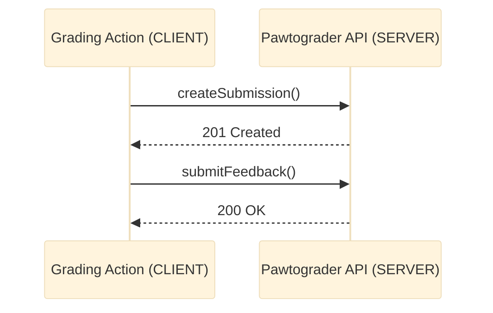
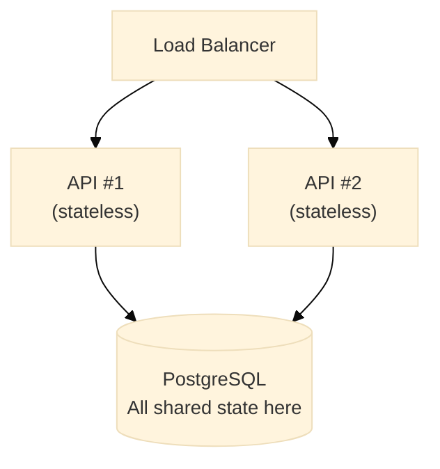

import Img from '@site/src/components/Img';
import RevealJS, { Slide } from '@site/src/components/RevealJS';

<RevealJS transition="slide">

{/* ============================================ */}
{/* COVER IMAGE */}
{/* ============================================ */}

<Slide>
  

<aside className="notes">
**Lecture overview:**
- **Total time:** ~65 MINUTES
- **Prerequisites:** L19 (monoliths, modular monoliths, microservices intro, Conway's Law preview)
- **Connects to:** L21 (serverless — pushing these concerns to the platform), L22 (teams and Conway's Law)

**Structure:**
- Recap: Why Leave the Monolith? (~3 min)
- **Client-Server Architecture** (~7 min)
- **REST APIs — How Services Communicate** (~8 min)
- **★ The Eight Fallacies of Distributed Computing ★** (~15 min) — the heart of the lecture
- **Microservices: Benefits and Costs** (~10 min)
- **Network-Related Quality Requirements** — perf, reliability, scalability (~8 min)
- **Security as an Architectural Concern** (~12 min)
- Bringing It Together (~5 min)

**Key theme:** Network communication doesn't just change HOW components talk — it invalidates assumptions programmers make constantly. Students who understand the eight fallacies will make better decisions when they inevitably work on distributed systems. Security isn't a feature you add — it shapes architecture from the start.

→ **Transition:** Let's start with the title...
</aside>

</Slide>

{/* ============================================ */}
{/* TITLE SLIDE */}
{/* ============================================ */}

<Slide>

# CS 3100: Program Design and Implementation II

## Lecture 20: Distributed Architecture — Networks, Microservices, and Security

<p style={{marginTop: '2em', fontSize: '0.8em', color: '#666'}}>
  ©2026 Jonathan Bell, CC-BY-SA
</p>

<aside className="notes">
**Context:**
- L19 ended with a tease: the road continues into fog, "Distributed Systems Ahead, Here Be Dragons"
- Today we go into that fog
- Running examples: same as L19 — Pawtograder and Bottlenose — but now we focus on the network boundary between them

**Framing the lecture:**
- "L19 was about how we organize code INSIDE a single deployment"
- "Today is about what happens when components move to DIFFERENT deployments, connected by a network"
- "You are NOT expected to design distributed systems. The goal: understand why they're different, so you can read them, debug them, and make informed tradeoff decisions."

→ **Transition:** Here's what you'll be able to do after today...
</aside>

</Slide>

{/* ============================================ */}
{/* LEARNING OBJECTIVES */}
{/* ============================================ */}

<Slide>

## Learning Objectives

<p style={{fontSize: '0.85em', textAlign: 'left'}}>
After this lecture, you will be able to:
</p>

<ol style={{fontSize: '0.75em', textAlign: 'left'}}>
  <li>Explain why <strong>network communication</strong> fundamentally changes architectural tradeoffs compared to in-process method calls</li>
  <li>Identify and explain the <strong>Fallacies of Distributed Computing</strong> and how they affect system design</li>
  <li>Describe the <strong>client-server architecture</strong> and REST API conventions used for service communication</li>
  <li>Analyze the <strong>benefits and costs of microservices</strong> compared to monolithic architectures</li>
  <li>Apply <strong>security principles</strong> (authentication, authorization, trust boundaries, CIA triad) to distributed system analysis</li>
</ol>

<div className="fragment">
<p style={{fontSize: '0.75em', marginTop: '0.75em', fontStyle: 'italic', color: '#666'}}>
<strong>Important framing:</strong> Junior engineers read API documentation and debug network issues far more often than they design new distributed architectures. Comprehension comes first — you'll understand distributed systems well enough to work within them confidently.
</p>
</div>

<aside className="notes">
**SET EXPECTATIONS:**
- "You will NOT be tested on 'design a microservices architecture from scratch'"
- "You WILL be expected to read distributed systems, understand why things fail, and reason about security boundaries"

**Connection to L19:**
- L19 asked: "How do we organize code within one deployment?"
- L20 asks: "What changes when deployment spans multiple processes and machines?"
- The answer: nearly everything

→ **Transition:** Let's start with why we'd ever leave the monolith in the first place...
</aside>

</Slide>

{/* ============================================ */}
{/* RECAP: WHY LEAVE THE MONOLITH? */}
{/* ============================================ */}

<Slide>

## Recap: Why Would We Ever Leave the Monolith?

<p style={{fontSize: '0.82em'}}>
In L19, we saw that monoliths are <strong>simple, fast, and transactionally consistent</strong>. So why distribute at all?
</p>

<div style={{display: 'grid', gridTemplateColumns: '1fr 1fr', gap: '1em', fontSize: '0.62em', marginTop: '0.75em'}}>

<div style={{padding: '0.75em', border: '2px solid #9370DB', borderRadius: '8px'}}>

**Bottlenose → Orca**

Grading needs **isolation** — you can't run arbitrary student code inside your main web process.

*What crosses the network:* Grading requests → Orca; results ← Orca

</div>

<div style={{padding: '0.75em', border: '2px solid #4A90A4', borderRadius: '8px'}}>

**Pawtograder (true microservices)**

- Leverages **GitHub's infrastructure** (Actions) to eliminate infrastructure management
- **Team autonomy** — action maintainers and API maintainers can evolve independently
- **Platform leverage** — different components have different runtime needs

*What crosses the network:* Submission registration, feedback submission, grader download

</div>

</div>

<div className="fragment">
<p style={{fontSize: '0.78em', marginTop: '0.75em', color: '#FF9800', fontWeight: 'bold'}}>
Both systems <em>could</em> be monoliths. The question is never "monolith vs. distributed" in the abstract — it's whether the specific benefits of distribution outweigh the costs for your situation.
</p>
</div>

<aside className="notes">
**Connect to L19:**
- Students ended L19 with the "two big families" slide — monolith vs. distributed
- This recap ground-truths that distinction with concrete examples they know

**The key framing:**
- Bottlenose distributes for ISOLATION (security: don't trust student code in your web process)
- Pawtograder distributes for PLATFORM LEVERAGE and TEAM AUTONOMY
- Neither does it because "microservices are the cool thing" — there's a real reason

**Foreshadow:**
- "But distribution comes with a price. Let's see what that price is — starting with the most basic thing: how do services actually talk to each other?"

→ **Transition:** But before we get into how services communicate, let's understand the physical reality they operate in...
</aside>

</Slide>

{/* ============================================ */}
{/* WHY NETWORKS ARE HARD: PHYSICAL REALITY */}
{/* ============================================ */}

<Slide>

## The Price of Distribution: Hard Physical Limits

<p style={{fontSize: '0.82em'}}>
Some network constraints aren't design choices or wrong assumptions — they're <strong>physics</strong>. No software engineering can fix them. This is what you're signing up for when you leave the monolith.
</p>

<div style={{display: 'grid', gridTemplateColumns: '1fr 1fr', gap: '0.75em', fontSize: '0.6em', marginTop: '0.5em'}}>

<div style={{padding: '0.6em', border: '2px solid #4A90A4', borderRadius: '8px'}}>

**The Speed of Light: ~1 foot per nanosecond**

Light (and electrical signals in fiber) travels roughly **1 ns/ft** — slower in copper wire.

| Distance | Min. round-trip |
|----------|-----------------|
| Across a server rack (~10 ft) | ~20 ns |
| Across a data center (~1,000 ft) | ~1,000 ns |
| Boston → New York (~200 mi) | ~2,000,000 ns |
| Boston → London (~3,300 mi) | ~33,000,000 ns |
| Boston → Tokyo (~6,700 mi) | ~67,000,000 ns |

*(Actual latency is always higher — routing, switching, queuing add more.)*

</div>

<div style={{padding: '0.6em', border: '2px solid #9370DB', borderRadius: '8px'}}>

**Compare: Memory access in a monolith**

| Operation | Latency |
|-----------|---------|
| L1 CPU cache hit | ~0.5 ns |
| L2 CPU cache hit | ~3 ns |
| L3 CPU cache hit | ~10 ns |
| RAM access | ~100 ns |

An NYC-London call takes **~66,000,000×** longer than an L1 cache hit.

A method call in a monolith? Essentially free by comparison.

</div>

</div>

<aside className="notes">
**The "1 foot per nanosecond" rule:**
- Grace Hopper famously handed out 11.8-inch pieces of wire at talks to illustrate this: "That's a nanosecond"
- In fiber optic cable it's closer to 2 ns/ft due to the refractive index of glass
- The point: the speed of light is a hard ceiling no engineering can break through

**Working through the table:**
- Boston → New York: ~330 km, speed of light gives ~2 ms round-trip. Real latency: ~7-10 ms
- Boston → London: ~5,300 km, ~35 ms minimum one-way. Real: ~70-80 ms
- Boston → Tokyo: ~10,800 km, ~72 ms minimum. Real: ~140-160 ms
- The minimums are never achieved — routing takes non-straight paths, every switch adds queuing delay

**The memory comparison is the key insight:**
- Students who've only worked in monoliths have never had to think about this
- A method call touches L1/L2 cache: nanoseconds
- Even a localhost network call: microseconds (1000× slower)
- Cross-datacenter: milliseconds (1,000,000× slower)
- This is pure physics — no clever code fixes it

**Connect to Pawtograder:**
- Grading Action (GitHub servers) → Pawtograder API (Supabase servers): likely in same US region, but still 1-5ms round trips
- 100 individual API calls × 5ms = 500ms overhead from physics alone, before any application work
- This is why batching all results into one `submitFeedback()` call isn't just nice-to-have — it's necessary

→ **Transition:** Physics is one constraint. The other is even more surprising: components can be disconnected by things you never anticipated...
</aside>

</Slide>

<Slide>

## Shared Fate vs. Independent Failure

<p style={{fontSize: '0.82em'}}>
In a monolith, all components share the same process — they <strong>cannot be partially disconnected by accident</strong>. Distributed systems introduce a new failure mode that simply doesn't exist in a monolith.
</p>

<div style={{display: 'flex', flexDirection: 'column', gap: '0.75em', fontSize: '0.6em', marginTop: '0.5em'}}>

<div style={{padding: '0.6em', border: '2px solid #4CAF50', borderRadius: '8px'}}>

**Monolith: Shared fate**

If the process is running, all components can talk to each other. Always.

No one can trip over a cable and disconnect the grading logic from the database — they're in the same memory space.

A server crash takes everything down together, but there's no such thing as a *partial* disconnection between components.

</div>

<div style={{padding: '0.6em', border: '2px solid #f44336', borderRadius: '8px'}}>

**Distributed system: Independent failure**

Things that can disconnect two services that would never affect a monolith:

- A cloud provider's switch fails in one availability zone
- A university contracts with a network filter that **decides your service is malware**
- A student's ISP throttles GitHub traffic during grading
- A **ship anchor** cuts a submarine fiber cable in the Pacific

</div>

</div>

<div className="fragment">
<p style={{fontSize: '0.75em', marginTop: '0.5em', color: '#FF9800', fontWeight: 'bold'}}>
A "network partition" — two parts of a system that can't reach each other — is <strong>impossible</strong> in a monolith and <strong>inevitable</strong> in a distributed system. You must design for it.
</p>
</div>

<aside className="notes">
**The "ship anchor" example is real:**
- Submarine fiber cables get cut by ship anchors, fishing trawlers, and earthquakes regularly
- The SEA-ME-WE 4 cable cut in 2008 severely disrupted internet traffic across South Asia
- No retry logic helps when the cable is on the ocean floor

**BGP incidents:**
- BGP (Border Gateway Protocol) is how internet routers tell each other how to reach destinations
- 2010: China Telecom accidentally advertised routes for ~15% of the internet, redirecting traffic through China for ~18 minutes
- 2021: A Facebook BGP misconfiguration took down Facebook, Instagram, and WhatsApp globally for ~6 hours — Facebook employees couldn't even badge into their buildings because the badge readers needed the network
- These aren't bugs in your code. They're failures in infrastructure you don't control.

**The Palo Alto / NEU example:**
- This will come up again in Fallacy 6
- It perfectly illustrates the "someone else makes decisions that affect your network path" problem

**The design implication:**
- Every distributed system must answer: "What do we do when we can't reach the other service?"
- This isn't an edge case to handle later — it's the central design question
- Pawtograder: retry with backoff → show "grading in progress" → don't crash
- The answer shapes your entire error-handling architecture

**CAP theorem (optional mention if time):**
- This physical reality is exactly what the CAP theorem addresses
- When a partition happens, you must choose: stay Consistent (refuse requests) or stay Available (accept requests that might diverge)
- We won't go deep on CAP, but it flows directly from the fact that partitions are inevitable

→ **Transition:** So: physics limits how fast data can move, and the network can be severed by things outside your control. Given all that — how do distributed services actually communicate? That's client-server architecture...
</aside>

</Slide>

{/* ============================================ */}
{/* CLIENT-SERVER ARCHITECTURE */}
{/* ============================================ */}

<Slide>

## Client-Server Architecture

<p style={{fontSize: '0.78em', marginBottom: '0.3em'}}>
**Clients** make requests, **servers** respond. The most ubiquitous pattern — every web app, mobile app, and service-to-service call.
</p>

<div style={{fontSize: '0.55em'}}>



</div>

<div style={{display: 'grid', gridTemplateColumns: '1fr 1fr', gap: '0.5em', fontSize: '0.58em', marginTop: '0.3em'}}>

<div style={{padding: '0.4em', border: '2px solid #4CAF50', borderRadius: '6px'}}>

**Benefits** — Centralized control/state, update server → all clients benefit, enforce security policies, multiple clients connect simultaneously

</div>

<div style={{padding: '0.4em', border: '2px solid #FF9800', borderRadius: '6px'}}>

**Constraints** — Server = single point of failure, network latency on every op, must handle errors/timeouts/retries, client-initiated only

</div>

</div>

<div className="fragment">
<p style={{fontSize: '0.6em', marginTop: '0.4em', fontStyle: 'italic', color: '#666'}}>
<strong>Not the only pattern:</strong> Message-passing and event-driven systems enable more bi-directional communication — services publish events, others subscribe. We'll cover this in L33 (Event Systems).
</p>
</div>

<aside className="notes">
**Make this concrete:**
- "You've used client-server every time you've used a browser. The browser is the client, the web server is the server."
- Pawtograder: The Grading Action calls `createSubmission()` — that's a METHOD in the action code, but it's actually an HTTP request to the API. The API never calls the action.
- "Communication is always client-initiated" — important! The server can't push to the client without a polling or websocket setup.

**The single point of failure:**
- The API goes down? All grading actions fail — even if they're running fine on GitHub's infrastructure.
- This is one reason Pawtograder implements retry logic.

**Why does this matter?**
- Every service-to-service call in a microservices architecture is client-server
- Understanding this is the foundation for understanding REST

**Foreshadow L33:**
- Client-server is request-response: client asks, server answers
- Event-driven is publish-subscribe: services publish events, others react
- L33 covers message queues, event buses, eventual consistency
- Different tradeoffs: decoupling vs. complexity, latency vs. throughput

→ **Transition:** OK, the client talks to the server. But HOW? What does that HTTP conversation look like?
</aside>

</Slide>

{/* ============================================ */}
{/* REST APIs */}
{/* ============================================ */}

<Slide>

## How Services Communicate: HTTP and REST

<p style={{fontSize: '0.82em'}}>
<strong>HTTP</strong> is the foundation — the protocol your browser uses, mobile apps use, and services use to talk to each other. <strong>REST</strong> (Representational State Transfer) is a set of conventions built on HTTP for structuring APIs.
</p>

<p style={{fontSize: '0.78em', marginTop: '0.3em'}}>
An HTTP request has three key parts:
</p>

<div style={{display: 'grid', gridTemplateColumns: '1fr 1fr 1fr', gap: '0.5em', fontSize: '0.6em', marginTop: '0.3em'}}>

<div style={{padding: '0.5em', border: '2px solid #9370DB', borderRadius: '8px', textAlign: 'center'}}>

**Method (Verb)**

What action you want

`GET`, `POST`, `PUT`, `PATCH`, `DELETE`

</div>

<div style={{padding: '0.5em', border: '2px solid #4A90A4', borderRadius: '8px', textAlign: 'center'}}>

**URL (Resource)**

Which thing you're targeting

`/submissions/123`

</div>

<div style={{padding: '0.5em', border: '2px solid #4CAF50', borderRadius: '8px', textAlign: 'center'}}>

**Body (optional)**

Data you're sending

`{"score": 87, "feedback": "..."}`

</div>

</div>

<div className="fragment">
<div style={{fontSize: '0.6em', marginTop: '0.75em'}}>

| Method | Purpose | Pawtograder Example |
|--------|---------|-------------------|
| `GET` | Retrieve a resource | `GET /rest/v1/submissions?student_id=X` |
| `POST` | Create a new resource | `POST /functions/v1/createSubmission` |
| `POST` | Trigger an action | `POST /functions/v1/submitFeedback` |
| `PATCH` | Update part of a resource | `PATCH /submissions/123` (just the score) |
| `DELETE` | Remove a resource | `DELETE /submissions/123` |

</div>
</div>

<aside className="notes">
**The response half:**
- Server responds with a STATUS CODE: 200 = success, 201 = created, 404 = not found, 401 = unauthorized, 500 = server error
- And optionally a response BODY (usually JSON)

**REST organizing principle: resources and verbs**
- REST organizes around NOUNS (submissions, assignments, students)
- Clients manipulate resources using STANDARD VERBS
- Once you know the pattern, every RESTful API works the same way

**Statelessness:**
- Key REST constraint: each request contains ALL information needed to process it
- The server doesn't remember previous requests
- This makes horizontal scaling easy: any server instance can handle any request

**Mention GraphQL briefly:**
- GraphQL lets clients specify exactly which fields they need — avoids over-fetching
- Powerful for complex frontends, adds complexity on the backend
- Many APIs offer GraphQL alongside REST — you should know it exists

→ **Transition:** Now we know HOW services communicate. But what happens when that communication FAILS?
</aside>

</Slide>

<Slide>

## Sidebar: REST Was Itself an Architectural Discovery

<p style={{fontSize: '0.8em'}}>
REST didn't come from a committee. Roy Fielding co-authored the <strong>HTTP/1.0 spec</strong>, then asked: <em>why does this work so well?</em> His 2000 PhD thesis reverse-engineered HTTP into a set of architectural constraints. REST is the name he gave that style.
</p>

<div style={{display: 'grid', gridTemplateColumns: '1fr 1fr', gap: '0.75em', fontSize: '0.58em', marginTop: '0.5em'}}>

<div style={{padding: '0.6em', border: '2px solid #9370DB', borderRadius: '8px'}}>

**REST's Six Architectural Constraints** *(Fielding, 2000)*

- **Client-Server** — separate UI concerns from data storage
- **Stateless** — each request contains all info needed; no session state on the server
- **Cacheable** — responses must declare whether they can be cached
- **Uniform Interface** — standard verbs + resource URLs + self-describing messages
- **Layered System** — clients don't know if they're talking to the real server or a proxy

</div>

<div style={{padding: '0.6em', border: '2px solid #4A90A4', borderRadius: '8px'}}>

**Connection to L18: Drivers → Style**

Each constraint maps to a **quality attribute driver**:

| Constraint | Quality Attribute |
|-----------|-----------------|
| Stateless | **Scalability** — any server handles any request |
| Cacheable | **Performance** — skip redundant fetches |
| Uniform Interface | **Changeability** — swap server implementations |
| Layered System | **Security + Deployability** — add proxies/CDNs transparently |

The same process we used for Pawtograder — identify quality attributes, apply heuristics, let the style *emerge* — is how REST was discovered.

</div>

</div>

<div className="fragment">
<p style={{fontSize: '0.73em', marginTop: '0.5em', fontStyle: 'italic', color: '#666'}}>
REST is not a standard, a spec, or a protocol. It's an <strong>architectural style</strong> — a set of constraints that, when applied, produce a system with desirable properties. Fielding studied what made HTTP work, then named the pattern.
</p>
</div>

<aside className="notes">
**The origin story:**
- Fielding was one of the principal authors of HTTP/1.0 and HTTP/1.1
- After building it, he wanted to formally capture WHY the web's architecture was so successful
- His 2000 PhD dissertation at UC Irvine is "Architectural Styles and the Design of Network-based Software Architectures"
- Chapter 5 is REST — one of the most influential chapters in CS history
- The dissertation is free online; it's surprisingly readable

**The stateless constraint — most important for this lecture:**
- "No session state on server" → any server instance can handle any request
- This is exactly why GitHub Actions can spin up thousands of parallel grading runners — no runner needs to remember any state from previous runs
- Contrast: PHP session files or sticky sessions on a load balancer — now every request must go to the SAME server → you lose horizontal scalability

**Uniform Interface — the key insight:**
- Once you know GET/POST/PUT/DELETE and URL conventions, you can interact with ANY REST API
- The Grading Action's developer could read the Pawtograder API docs and know exactly how to call it without special libraries or training
- Contrast with SOAP: you need a WSDL file, a code generator, and a specific library for each API

**The L18 connection — drive this home:**
- L18 showed: quality attribute (testability) → heuristic (separate what from how) → hexagonal architecture emerges
- Fielding: quality attribute (scalability) → constraint (stateless) → REST emerges
- "Architecture is discovered, not invented" applies to REST too — Fielding studied the web and discovered the pattern already present in HTTP

**Interesting footnote:**
- Most "REST" APIs today violate some of Fielding's constraints (especially HATEOAS/hypermedia)
- Fielding himself has complained about this on his blog
- But the core stateless + uniform interface constraints are what matter in practice

→ **Transition:** One artifact of that uniform interface: standardized status codes...
</aside>

</Slide>

<Slide>

## REST Status Codes: The Language of Failure

<p style={{fontSize: '0.82em'}}>
One of REST's great gifts: <strong>standardized error codes</strong>. When you read API documentation or debug network issues, these are the codes you'll encounter constantly.
</p>

<div style={{display: 'grid', gridTemplateColumns: '1fr 1fr 1fr', gap: '0.75em', fontSize: '0.6em', marginTop: '0.75em'}}>

<div style={{padding: '0.6em', border: '2px solid #4CAF50', borderRadius: '8px'}}>

**2xx — Success**

- `200 OK` — request succeeded
- `201 Created` — resource created
- `204 No Content` — success, nothing to return

</div>

<div style={{padding: '0.6em', border: '2px solid #FF9800', borderRadius: '8px'}}>

**4xx — Client Error**

- `400 Bad Request` — malformed request
- `401 Unauthorized` — not authenticated
- `403 Forbidden` — authenticated but not allowed
- `404 Not Found` — resource doesn't exist
- `429 Too Many Requests` — rate limited

</div>

<div style={{padding: '0.6em', border: '2px solid #f44336', borderRadius: '8px'}}>

**5xx — Server Error**

- `500 Internal Server Error` — generic failure
- `502 Bad Gateway` — upstream service failed
- `503 Service Unavailable` — overloaded or down
- `504 Gateway Timeout` — upstream too slow

</div>

</div>

<div className="fragment">
<p style={{fontSize: '0.75em', marginTop: '0.75em', fontStyle: 'italic', color: '#666'}}>
<strong>Practical skill:</strong> When debugging a distributed system, the status code tells you <em>where</em> to look. 4xx → your code sent the wrong request. 5xx → the server has a problem. 401 vs 403 → authentication vs authorization bug.
</p>
</div>

<aside className="notes">
**Why this matters:**
- Status codes are the FIRST thing you check when debugging a distributed system
- 401 vs 403 is a critical distinction: 401 means "I don't know who you are," 403 means "I know who you are, you just can't do this"
- In Pawtograder: submitFeedback returns 401 if the OIDC token is missing/invalid, 403 if the token is valid but the repo isn't authorized for that assignment

**4xx vs 5xx:**
- 4xx = the client made a mistake — fix your code
- 5xx = the server is broken — retry later (but not immediately — exponential backoff)
- This distinction drives retry logic: you SHOULD retry on 5xx, you should NOT retry on 4xx (it'll fail again)

**The "429 Too Many Requests" case:**
- Rate limiting is common in APIs
- The server is basically saying "slow down, you're sending too many requests"
- The response usually includes a `Retry-After` header

→ **Transition:** Now that we can read API responses, let's look at the REAL challenge of distributed systems...
</aside>

</Slide>

{/* ============================================ */}
{/* THE FALLACIES */}
{/* ============================================ */}

<Slide>

## The Fallacies of Distributed Computing


<p style={{fontSize: '0.78em', marginTop: '0.75em'}}>
Peter Deutsch and colleagues at Sun Microsystems identified eight assumptions developers make about networks — all of which are <strong>false</strong>. These are the <em>Fallacies of Distributed Computing</em>.
</p>

<aside className="notes">
**Why this is the heart of the lecture:**
- These aren't theoretical — every distributed system bug can be traced to one of these fallacies
- Students who have only worked in monoliths LIVE in a world where all eight are true
- Moving to distributed systems means unlearning all of them

**Framing:**
- "In a monolith, method calls don't fail. They don't take 2 seconds. They're free. You can assume whoever wrote the other module is on your team."
- "The moment you cross the network, EVERY one of these assumptions breaks."

**Approach:**
- Go through each fallacy with a Pawtograder example
- Keep it concrete — "Here's how this fallacy burned Pawtograder"

→ **Transition:** Let's go through them one by one...
</aside>

</Slide>

<Slide>

## Fallacy 1: "The Network Is Reliable"

<p style={{fontSize: '0.82em'}}>
Networks fail. Cables get unplugged, routers crash, cloud providers have outages. Code that assumes a network call will always succeed is <strong>fragile code</strong>.
</p>

<div style={{display: 'grid', gridTemplateColumns: '1fr 1fr', gap: '1em', fontSize: '0.6em', marginTop: '0.75em'}}>

<div style={{padding: '0.75em', border: '2px solid #f44336', borderRadius: '8px'}}>

**The fragile version**

```java
// Assumes the network always works
Response response = client.send(request);
processResponse(response);
// If request fails → student never sees grade
```

</div>

<div style={{padding: '0.75em', border: '2px solid #4CAF50', borderRadius: '8px'}}>

**Better: timeout and retry**

```java
Response response = null;
int attempts = 0;
while (response == null && attempts < 3) {
  try {
    response = client.send(request,
        Duration.ofSeconds(10));
  } catch (TimeoutException e) {
    // Exponential backoff: 1s, 2s, 4s
    Thread.sleep((long) Math.pow(2, attempts) * 1000);
    attempts++;
  }
}
if (response == null) {
  logError("Failed after 3 attempts");
  // Show "grading in progress" not a crash
}
```

</div>

</div>

<div className="fragment">
<p style={{fontSize: '0.73em', marginTop: '0.5em', color: '#9370DB'}}>
<strong>Pawtograder:</strong> The Grading Action tries to submit feedback. The request times out. Retry logic with exponential backoff — wait 1s, then 2s, then 4s. Either succeeds, or the student sees "grading in progress."
</p>
</div>

<aside className="notes">
**The key insight:**
- Without retry logic, a single dropped packet means a student never sees their grade
- With retry logic, transient failures are invisible to users
- Exponential backoff prevents overwhelming a struggling server

**Exponential backoff:**
- Don't retry immediately — that'll hammer a server that's struggling
- Wait 1s, then 2s, then 4s, then 8s — or give up
- Add jitter (random offset) to avoid "thundering herd" — all retries hitting at once

**Graceful degradation:**
- Notice the last comment: "Show 'grading in progress' not a crash"
- Offering REDUCED functionality is better than NONE
- The student knows grading is happening; they'll refresh later

→ **Transition:** But if we're retrying, we need to understand the details — and a new problem retrying creates...
</aside>

</Slide>

<Slide>

## Pattern: Timeout + Retry with Exponential Backoff

<p style={{fontSize: '0.72em'}}>
<em>Addresses Fallacy 1 (unreliable). Never wait forever — set a deadline, then try again, backing off between attempts.</em>
</p>

<div style={{fontSize: '0.5em', marginTop: '0.4em'}}>

```java
public Response sendWithRetry(HttpRequest request) throws Exception {
    int maxAttempts = 3;
    for (int attempt = 1; attempt <= maxAttempts; attempt++) {
        try {
            // ALWAYS set a timeout — without one, a hung server blocks this thread forever
            return client.send(request,
                HttpResponse.BodyHandlers.ofString(),
                Duration.ofSeconds(10));
        } catch (HttpTimeoutException | IOException e) {
            if (attempt == maxAttempts) throw e;
            // Exponential backoff: 2s, 4s, 8s — don't hammer a struggling service
            Thread.sleep((long) Math.pow(2, attempt) * 1000);
        }
    }
    throw new RuntimeException("unreachable");
}

public Response call(HttpRequest request) throws Exception {
    Response response = sendWithRetry(request);
    if (response.statusCode() >= 500) {
        return sendWithRetry(request);  // Server error: worth retrying
    }
    return response;  // 4xx client error: retrying won't help — fix the request
}
```

</div>

<div className="fragment">
<div style={{display: 'grid', gridTemplateColumns: '1fr 1fr', gap: '0.75em', fontSize: '0.55em', marginTop: '0.5em'}}>

<div style={{padding: '0em', border: '2px solid #f44336', borderRadius: '8px'}}>

**Fixed 1s retry — the thundering herd**

100 clients all fail at t=0 (API restart). All retry at t=1s. Server gets slammed again. All fail. All retry at t=2s…
The server never gets a chance to recover.

</div>

<div style={{padding: '0em', border: '2px solid #4CAF50', borderRadius: '8px'}}>

**Exponential backoff + jitter — spreading the load**
Load arrives in waves the server can absorb.

</div>

</div>
</div>

<div className="fragment">
<p style={{fontSize: '0.62em', marginTop: '0.4em', color: '#FF9800'}}>
<strong>Only retry 5xx and timeouts.</strong> A 400 Bad Request won't fix itself. A 401 Unauthorized won't either. Retrying a 409 Conflict might make things worse.
</p>
</div>

<aside className="notes">
**The timeout is the most important part:**
- Without a timeout, `client.send()` can block indefinitely
- One blocked thread is fine; a service that accumulates 100 blocked threads per second will exhaust its thread pool and die
- Always set a timeout — even if generous (30s)

**Exponential backoff rationale:**
- Imagine 100 grading actions all fail at the same moment (API restart)
- Fixed 1s retry: all 100 retry at t+1s — waves of 100 requests on top of normal load
- Exponential backoff: naturally spread out — 2s, 4s, 8s
- Add jitter: `backoffMs += random.nextLong(0, 500)` — "thundering herd" prevention

**The 4xx vs 5xx distinction:**
- 429 Too Many Requests: IS worth retrying — check the Retry-After header
- 401 Unauthorized: don't retry, your token is wrong
- 503 Service Unavailable: retry with backoff
- Key question: "Is the problem on my side (4xx) or the server's side (5xx)?"

→ **Transition:** But now we have a problem: if we retry, could we run the operation twice?
</aside>

</Slide>

<Slide>

## Pattern: Idempotency — Making Retries Safe

<p style={{fontSize: '0.72em'}}>
<em>Over a network, "did it run?" is ambiguous — the request may have arrived but the response was lost. Design operations so retrying is <strong>safe</strong>.</em>
</p>

<div style={{fontSize: '0.5em', marginTop: '0.4em'}}>

```java
// CLIENT: attach a stable unique key — same key = same operation, don't repeat it
public void submitFeedback(String submissionId, Feedback feedback) {
    HttpRequest request = HttpRequest.newBuilder()
        .uri(URI.create(API_URL + "/functions/v1/submitFeedback"))
        .header("Idempotency-Key", submissionId)   // Stable, unique per grading run
        .POST(HttpRequest.BodyPublishers.ofString(gson.toJson(feedback)))
        .build();
    sendWithRetry(request);   // Now safe to call multiple times!
}

// SERVER: check the key before doing any work
public Response submitFeedback(Request req) {
    String key = req.header("Idempotency-Key");

    Optional<Response> cached = db.findByIdempotencyKey(key);
    if (cached.isPresent()) {
        return cached.get();   // Already ran — return same result, don't re-grade
    }

    Feedback feedback = gson.fromJson(req.body(), Feedback.class);
    Response result = gradingService.store(feedback);
    db.storeIdempotencyResult(key, result);   // Cache so future retries are safe
    return result;
}
```

</div>

<div className="fragment">
<p style={{fontSize: '0.65em', marginTop: '0.4em', color: '#9370DB'}}>
<strong>HTTP verb idempotency:</strong> GET always idempotent (read-only). DELETE idempotent (deleting twice = 404, no harm). PUT idempotent (replace whole resource). POST NOT idempotent by default — that's why you need the Idempotency-Key header.
</p>
</div>

<aside className="notes">
**The core ambiguity:**
- Client POSTs. Network drops the RESPONSE (not the request — the request got through).
- Client times out and retries.
- Without idempotency: two grade records for the same submission.
- With idempotency: server recognizes the key, returns same result — one grade.

**"At-least-once" vs "exactly-once":**
- Retry without idempotency → at-least-once (might run multiple times)
- No retry → at-most-once (might not run at all)
- Retry + idempotency → exactly-once semantics

→ **Transition:** Even when the network works, it still slows you down...
</aside>

</Slide>

<Slide>

## Fallacy 2: "Latency Is Zero" — and its friends

<div style={{display: 'grid', gridTemplateColumns: '1fr 1fr', gap: '0.75em', fontSize: '0.62em', marginTop: '0.5em'}}>

<div style={{padding: '0.6em', border: '2px solid #9370DB', borderRadius: '8px'}}>

**Fallacy 2: Latency is zero**

Every network call takes time. Local method calls: nanoseconds. Network calls: milliseconds to seconds.

*Pawtograder:* 100 tests × 100ms per API call = 10 seconds of pure network overhead. Solution: batch all results into ONE `submitFeedback()` call.

</div>

<div style={{padding: '0.6em', border: '2px solid #4A90A4', borderRadius: '8px'}}>

**Fallacy 3: Bandwidth is infinite**

Networks have limited capacity. Large payloads over constrained connections cause problems.

*Pawtograder:* Grader tarball can be megabytes. Solution: SHA hash to check if unchanged — skip the download entirely if the grader hasn't changed.

</div>

<div style={{padding: '0.6em', border: '2px solid #FF9800', borderRadius: '8px'}}>

**Fallacy 5: Topology doesn't change**

IP addresses change. Servers move. DNS updates. Cached network locations can break.

*Pawtograder:* API URL is a configuration parameter per assignment — allows migration to different hosts without code changes.

</div>

<div style={{padding: '0.6em', border: '2px solid #4CAF50', borderRadius: '8px'}}>

**Fallacy 8: The network is homogeneous**

Different network paths have different characteristics. Same code behaves differently on different networks.

*Pawtograder:* Self-hosted runners across data centers. Same assignment: 30 seconds on warm cache, 3 minutes on cold. We don't control which runner gets the job.

</div>

</div>

<aside className="notes">
**On latency (Fallacy 2):**
- This is the big one for API design granularity
- "Chatty" APIs — many small calls — are a latency disaster
- The rule of thumb: "minimize network round-trips" → batch when possible
- "Chunky" vs "chatty" APIs

**On bandwidth (Fallacy 3):**
- SHA-based caching is elegant: if the hash matches, skip the download
- This is content-addressable caching — also used by Docker image layers, git objects
- Saves both latency AND bandwidth (and cost)

**On topology (Fallacy 5):**
- Config over code: never hardcode network addresses
- Pawtograder: per-assignment API URL config
- In production: service discovery (Kubernetes DNS, AWS service mesh) handles this automatically

**On homogeneity (Fallacy 8):**
- Your careful local testing might not reproduce production behavior
- Network conditions: mobile vs wifi vs corporate firewall vs data center
- Same code, different timing: could trigger different code paths (race conditions!)

→ **Transition:** Let me group the remaining fallacies...
</aside>

</Slide>

<Slide>

## Fallacy 4: "The Network Is Secure" (and Fallacies 6–7)

<div style={{display: 'grid', gridTemplateColumns: '1fr 1fr 1fr', gap: '0.75em', fontSize: '0.6em', marginTop: '0.5em'}}>

<div style={{padding: '0.6em', border: '2px solid #f44336', borderRadius: '8px'}}>

**Fallacy 4: The network is secure**

Data crossing networks can be intercepted, modified, or spoofed. Every network boundary is a potential attack surface.

*Pawtograder:* Without the OIDC token, anyone could POST fake grades. Without HTTPS, a network observer could read or modify grades in transit.

*(We'll dive deep on security later in this lecture.)*

</div>

<div style={{padding: '0.6em', border: '2px solid #9370DB', borderRadius: '8px'}}>

**Fallacy 6: There is one administrator**

Different parts of distributed systems are controlled by different organizations. You can't control what they do.

*Real NEU example:* Northeastern contracts with Palo Alto Networks to filter all campus traffic. When Palo Alto arbitrarily decides Pawtograder's dev environment is malware — learning is disrupted. NEU claimed no responsibility. **This happens all the time.**

</div>

<div style={{padding: '0.6em', border: '2px solid #FF9800', borderRadius: '8px'}}>

**Fallacy 7: Transport cost is zero**

Network calls have real costs: computational (serialization, encryption), monetary (API pricing, bandwidth fees), and energy (radio transmission, data center processing).

*Pawtograder:* Batching 100 test results into one `submitFeedback()` call instead of 100 calls doesn't just save latency — it saves energy. 6,000 grading runs/semester × 100 extra API calls = measurable environmental impact.

</div>

</div>

<aside className="notes">
**Fallacy 6 is worth a moment:**
- This is a real thing that happened at NEU
- The lesson: in distributed systems, you don't control the whole network path
- Corporate firewalls, university proxies, ISP throttling, regional outages — all outside your control
- Design for this: health checks, fallback modes, clear error messages to users

**Fallacy 7 — the sustainability angle:**
- Every API call: serialize to JSON → transmit → deserialize → process → serialize response → transmit → deserialize
- In a monolith: that's a method call (nanoseconds)
- Multiply by thousands of calls/minute, thousands of services — real energy cost
- Sustainability is becoming a quality attribute: the "Green Software" movement

**Energy calculation for Pawtograder:**
- 6,000 grading runs/semester
- 100 tests per assignment
- Batching saves ~99 API calls per run
- 594,000 fewer API calls per semester
- That's not nothing

**The architectural takeaway:**
- "Monolith-first" isn't just about simplicity — it's about not paying distributed-system costs until you have distributed-system benefits

→ **Transition:** The fallacies also drive system-level resilience patterns — let's see two more...
</aside>

</Slide>

<Slide>

## Pattern: Circuit Breaker — Stop Hammering a Struggling Service

<p style={{fontSize: '0.72em'}}>
<em>If a service is struggling, hammering it with retries makes it worse. The circuit breaker detects sustained failure and stops trying — giving the service time to recover.</em>
</p>

<div style={{fontSize: '0.47em', marginTop: '0.3em'}}>

```java
// Three states: CLOSED (normal) → OPEN (failing fast) → HALF_OPEN (testing recovery)
public class CircuitBreaker {
    enum State { CLOSED, OPEN, HALF_OPEN }

    private State state = State.CLOSED;
    private int failureCount = 0;
    private Instant openedAt;

    public Response call(Supplier<Response> request) {
        if (state == State.OPEN) {
            if (Duration.between(openedAt, Instant.now()).toSeconds() < 30) {
                // Fail immediately — fast failure > slow failure
                throw new CircuitOpenException("Service unavailable, try later");
            }
            state = State.HALF_OPEN;   // After 30s, allow one probe request through
        }

        try {
            Response response = request.get();
            reset();           // Success: back to CLOSED
            return response;
        } catch (Exception e) {
            failureCount++;
            if (failureCount >= 5) {
                state = State.OPEN;    // 5 consecutive failures → trip the circuit
                openedAt = Instant.now();
            }
            throw e;
        }
    }

    private void reset() { state = State.CLOSED; failureCount = 0; }
}
```

</div>

<aside className="notes">
**The electrical analogy:**
- A circuit breaker in your house trips when current is too high — protecting the wiring
- This pattern trips when failure rate is too high — protecting the downstream service

**Three states:**
- CLOSED: all requests pass through (normal)
- OPEN: all requests fail immediately — don't even attempt
- HALF_OPEN: one probe through to test recovery; success → CLOSED, failure → OPEN

**Why fail fast beats fail slow:**
- Slow failures: threads pile up → thread pool exhaustion → YOUR service also goes down → cascading failure
- Fast failures: immediately tell callers "not available" → callers degrade gracefully → no cascade

**Production note:**
- Use a library: Resilience4j (Java), Polly (.NET)
- Don't roll your own — thread safety and half-open probe races are subtle

→ **Transition:** The circuit breaker fails fast. But what do we show the user when it's open?
</aside>

</Slide>

<Slide>

## Pattern: Graceful Degradation — Reduced Functionality Beats Crashing

<p style={{fontSize: '0.72em'}}>
<em>When a service is unavailable, offer <strong>reduced functionality</strong> rather than crashing. Stale data beats an error screen.</em>
</p>

<div style={{fontSize: '0.5em', marginTop: '0.4em'}}>

```java
// When grading service is unavailable, give the student useful information
public SubmissionResponse handleSubmission(String submissionId) {
    // Step 1: Record that we received the code (this succeeds even if grading is down)
    db.markSubmissionReceived(submissionId);
    
    try {
        return gradingApi.triggerGrading(submissionId);
    } catch (CircuitOpenException | ServiceUnavailableException e) {
        // Grading is down — but the student's code IS safe
        return SubmissionResponse.builder()
            .submissionId(submissionId)
            .status("RECEIVED_PENDING_GRADING")
            .message("Your code has been received. Grading is temporarily unavailable, " +
                     "but will run automatically once the system recovers. " +
                     "You'll receive an email when your results are ready.")
            .build();
    }
}
```

</div>

<div className="fragment">
<p style={{fontSize: '0.65em', marginTop: '0.4em', color: '#9370DB'}}>
<strong>Design your degraded state intentionally.</strong> Tell users what succeeded, what's delayed, and what to expect. A helpful message beats a stack trace. For every service call: if this fails, what should the user experience?
</p>
</div>

<aside className="notes">
**The key insight — tell users what they need to know:**
- What succeeded: "Your code has been received"
- What's delayed: "Grading is temporarily unavailable"
- What will happen: "Will run automatically once system recovers"
- What to do: "You'll receive an email"

**Stale cache is another common pattern:**
- CDNs: serve cached content when origin is down
- Browsers: show cached pages when offline
- "Stale data > no data" for most reads — users tolerate minutes-old data; they hate error screens

**Degrade intentionally:**
- Bad: catch exception, re-throw as 500
- Good: catch exception, return designed fallback with human-readable message

**All four patterns together — Pawtograder:**
1. `submitFeedback()` has a 10s timeout, retries up to 3 times (Timeout + Retry)
2. Each retry sends the same submissionId as the idempotency key (Idempotency)
3. After 5 consecutive API failures, circuit opens (Circuit Breaker)
4. Student sees "Code received, grading pending" instead of a crash (Graceful Degradation)

→ **Transition:** Now that we understand the costs AND the patterns for handling them, let's revisit microservices with fresh eyes...
</aside>

</Slide>

{/* ============================================ */}
{/* MICROSERVICES */}
{/* ============================================ */}

<Slide>

## Microservices Architecture: Now With Context

<p style={{fontSize: '0.82em'}}>
We introduced microservices in L19. Now we understand the cost. Let's look at why teams <em>still</em> pay it.
</p>

<p style={{fontSize: '0.78em', marginTop: '0.3em'}}>
A <strong>microservices architecture</strong> decomposes a system into small, independently deployable services, each owning a specific business capability and its own data.
</p>

<div style={{display: 'grid', gridTemplateColumns: '1fr 1fr', gap: '0.75em', fontSize: '0.6em', marginTop: '0.5em'}}>

<div style={{padding: '0.6em', border: '2px solid #4CAF50', borderRadius: '8px'}}>

**Benefits you pay for**

- **Independent scaling:** Scale the grading service without scaling the API
- **Elastic scaling:** Spin up 500 grading runners at deadline time, scale to zero at 3 AM
- **Isolated failures:** Discord bot bug can't crash grading
- **Team autonomy:** Grading Action team and API team evolve independently
- **Technology flexibility:** Different runtimes for different constraints (GitHub Actions vs Deno vs PostgreSQL)

</div>

<div style={{padding: '0.6em', border: '2px solid #f44336', borderRadius: '8px'}}>

**Costs you definitely pay**

- **All eight fallacies** apply — every call is a network call
- **Operational overhead:** Many builds, many deploys, many log streams
- **Data consistency:** No transactions across services — eventual consistency only *(more on consistency models in L33)*
- **Testing complexity:** Integration tests must spin up multiple services
- **Energy overhead:** Every inter-service call costs orders of magnitude more than a method call

</div>

</div>

<aside className="notes">
**Connect to the fallacies:**
- "We just spent 15 minutes on the fallacies. In a microservices architecture, every service-to-service call is subject to all eight."
- This is the TAX of microservices — you pay it on every interaction

**Independent scaling:**
- In a monolith: grading is slow? You must scale the entire app.
- In microservices: scale only the grading service — and only during deadline rushes.

**Elastic scaling:**
- Pawtograder example: 500 students submit in the last hour before deadline
- GitHub Actions spins up 500 parallel runners — each grading job is independent
- At 3 AM: zero runners active, zero cost
- A monolith can't do this — you'd need to keep enough servers running to handle peak load 24/7

**Team autonomy is real:**
- Pawtograder: GitHub Actions maintainers evolve the Grading Action independently of API maintainers
- They just need to agree on the interface (API contract)
- This maps to Conway's Law (L22): team structure → system structure

**Energy overhead:**
- I want to flag this again: the "chatty" microservices architecture wastes energy
- This is one reason why the design pattern of "batch operations" matters
- And why "monolith-first" is the sustainable default

→ **Transition:** There's a particularly bad outcome to watch out for...
</aside>

</Slide>

<Slide>

## The Distributed Monolith: All Costs, No Benefits


<p style={{fontSize: '0.72em', marginTop: '0.5em'}}>
The <strong>distributed monolith</strong> anti-pattern: services that are deployed separately but so tightly coupled they must be changed and deployed together. You pay all eight fallacies' costs — but get none of the benefits (independent scaling, isolated failures, team autonomy).
</p>

<aside className="notes">
**Signs you have a distributed monolith:**
- Changing one service requires changing multiple others
- Services share a database schema (the classic red flag)
- You can't deploy services independently
- Teams must coordinate every change

**How it happens:**
- Teams extract services without establishing clean boundaries
- The old shared database stays shared
- "We'll add an API in front of it later" → never happens
- Services call each other in complex chains — tight coupling over the network

**If you find yourself here:**
- Option 1: Properly decouple — establish true service contracts, separate data ownership
- Option 2: Collapse back into a monolith — seriously! A good monolith beats a bad distributed monolith.
- This is usually a symptom of premature decomposition (splitting before understanding domain boundaries)

**The message:**
- "If you're going to pay the distributed systems tax, make sure you're getting the benefits"
- "A well-designed monolith beats a poorly-designed microservices architecture every time"

→ **Transition:** Let's look at the quality attributes that become critical in distributed systems...
</aside>

</Slide>

{/* ============================================ */}
{/* NETWORK QUALITY REQUIREMENTS */}
{/* ============================================ */}

<Slide>

## Quality Attributes: Distribution Creates Challenges AND Opportunities

<p style={{fontSize: '0.82em'}}>
Several quality attributes become critical when components communicate over networks. Distribution makes these <strong>harder to achieve</strong> — but also enables <strong>solutions impossible in a monolith</strong>.
</p>

<div style={{display: 'grid', gridTemplateColumns: '1fr 1fr 1fr', gap: '0.75em', fontSize: '0.58em', marginTop: '0.5em'}}>

<div style={{padding: '0.6em', border: '2px solid #9370DB', borderRadius: '8px'}}>

**Performance**

*How fast is the system?*

<span style={{color: '#f44336'}}>Challenge:</span> Network adds latency to every call

<span style={{color: '#4CAF50'}}>Opportunity:</span> Parallelize work across machines; cache at edge locations near users

</div>

<div style={{padding: '0.6em', border: '2px solid #4A90A4', borderRadius: '8px'}}>

**Reliability**

*Does it stay up when things fail?*

<span style={{color: '#f44336'}}>Challenge:</span> More components = more failure points

<span style={{color: '#4CAF50'}}>Opportunity:</span> Redundancy across machines/regions; no single point of failure

</div>

<div style={{padding: '0.6em', border: '2px solid #4CAF50', borderRadius: '8px'}}>

**Scalability**

*Can it handle more load?*

<span style={{color: '#f44336'}}>Challenge:</span> Coordination overhead; distributed state complexity

<span style={{color: '#4CAF50'}}>Opportunity:</span> Add machines on demand; scale individual bottlenecks independently

</div>

</div>

<div className="fragment">
<p style={{fontSize: '0.73em', marginTop: '0.6em', color: '#FF9800', fontWeight: 'bold'}}>
The goal isn't to avoid distribution — it's to <em>distribute strategically</em> where the benefits outweigh the costs. Let's make sure you know the vocabulary.
</p>
</div>

<aside className="notes">
**Frame the dual nature:**
- "Distribution isn't just a tax you pay — it's also the key to solving problems monoliths CAN'T solve"
- "A monolith can't survive a data center fire. A distributed system across regions can."
- "A monolith can't scale one component independently. Microservices can."

**Frame expectations:**
- "This is a survey, not a deep dive"
- "CS4530 (SE), CS4700 (Networks), CS4730 (Distributed Systems) go much deeper"
- "The goal: when you see a system design doc or interview question, you know what these terms mean"

**Why these three?**
- Performance: users experience slowness directly
- Reliability: users experience downtime directly
- Scalability: users experience system collapse under load directly

**Note: We covered the strategies in the patterns section**
- Caching, batching → Fallacies 2-3
- Retry, circuit breaker → Fallacy 1
- These slides just give students the vocabulary to recognize these concepts

→ **Transition:** Here's the vocabulary you need...
</aside>

</Slide>

<Slide>

## Scaling and Reliability: The Vocabulary You Need

<p style={{fontSize: '0.78em'}}>
Distribution isn't just a tax — it's also the key to solving problems monoliths can't. Here's the vocabulary you'll encounter in system design docs and interviews.
</p>

<div style={{display: 'grid', gridTemplateColumns: '1fr 1fr', gap: '0.75em', fontSize: '0.58em', marginTop: '0.5em'}}>

<div style={{padding: '0.6em', border: '2px solid #9370DB', borderRadius: '8px'}}>

**Availability — The "Nines" Game**

*Percentage of time the system is operational*

| Availability | Downtime/year |
|-------------|---------------|
| 99% ("two nines") | 3.65 days |
| 99.9% ("three nines") | 8.76 hours |
| 99.99% ("four nines") | 52.6 minutes |
| 99.999% ("five nines") | 5.26 minutes |

Each additional nine is **exponentially** harder and more expensive. High availability is only achievable through redundancy — impossible in a monolith.

</div>

<div style={{padding: '0.6em', border: '2px solid #4A90A4', borderRadius: '8px'}}>

**Vertical vs. Horizontal Scaling**

**Vertical ("Scale Up"):** Bigger machine — more CPU, RAM, disk.
- ✓ Simple, no code changes
- ✗ Hardware limits, expensive, single point of failure

**Horizontal ("Scale Out"):** More machines + load balancer.
- ✓ Near-infinite scaling, redundancy built-in, elastic
- ✗ Requires stateless design, all 8 fallacies apply

*Pawtograder:* GitHub Actions scales horizontally — 500 grading jobs run in parallel on 500 separate runners.

</div>

</div>

<div className="fragment">
<p style={{fontSize: '0.65em', marginTop: '0.5em', color: '#FF9800', fontWeight: 'bold'}}>
<strong>Strategies we've already covered:</strong> Caching and batching (Fallacies 2-3), retry + circuit breaker (Fallacy 1), redundancy + failover (reliability). These aren't separate topics — they're all responses to distribution's challenges.
</p>
</div>

<aside className="notes">
**This is a vocabulary slide, not deep dive:**
- Students will encounter these terms in interviews and design docs
- The nines table is essential vocabulary
- Vertical vs. horizontal is a fundamental concept

**Connect back to what we've covered:**
- We already taught caching, batching, retry, circuit breaker in the patterns section
- This slide gives them the formal names and context
- Don't re-teach — reference back

**The key insight:**
- High availability requires redundancy
- Redundancy requires distribution
- Distribution requires stateless design
- It all connects

→ **Transition:** What enables horizontal scaling? Statelessness...
</aside>

</Slide>

<Slide>

## The Key to Horizontal Scaling: Statelessness

<p style={{fontSize: '0.78em'}}>
Horizontal scaling only works if <strong>any server can handle any request</strong>. This requires stateless services — each request contains all information needed to process it.
</p>

<div style={{display: 'grid', gridTemplateColumns: '1fr 1fr', gap: '0.75em', fontSize: '0.58em', marginTop: '0.5em'}}>

<div style={{padding: '0.6em', border: '2px solid #4CAF50', borderRadius: '8px'}}>

**Stateless: Any server works**

```java
POST /submitFeedback
{
  "submission_id": "abc123",
  "results": [...],
  "auth_token": "..."  // Identity in request
}
// Load balancer routes to ANY available server
```

The Grading Action is completely stateless — each run is independent. GitHub can route jobs to any available runner.

</div>

<div style={{padding: '0.6em', border: '2px solid #f44336', borderRadius: '8px'}}>

**Stateful: Locked to one server**

```java
POST /submitFeedback
{
  "results": [...]
}
// Server remembers session from earlier request
// Only THIS server can handle this request
// "Sticky sessions" → can't scale freely
```

If the server dies, the session state is lost. If load spikes, you can't add servers without breaking sessions.

</div>

</div>

<div className="fragment">
<div style={{fontSize: '0.52em', marginTop: '0.5em'}}>



</div>
<p style={{fontSize: '0.6em', textAlign: 'center', marginTop: '0.25em'}}>
<strong>Externalize state:</strong> Shared state lives in the database, not in individual servers.
</p>
</div>

<aside className="notes">
**This is the key architectural insight:**
- REST's "stateless" constraint exists specifically for scalability
- Fielding knew this in 2000 — statelessness enables horizontal scaling
- "Sticky sessions" (always route user X to server Y) break horizontal scaling

**The pattern:**
- Keep services stateless
- Put all shared state in a dedicated service (database, cache)
- Now any server can handle any request → you can add servers freely

**Pawtograder example:**
- The Grading Action is the purest example of stateless
- Each run: fresh VM, no memory of previous runs
- GitHub can spin up 500 VMs in parallel without coordination

**Database becomes the bottleneck:**
- This is why database scaling (replication, sharding) is its own specialty
- More on this in L21

→ **Transition:** Now let's connect to security — because security shapes all of these decisions...
</aside>

</Slide>

{/* ============================================ */}
{/* SECURITY */}
{/* ============================================ */}

<Slide>

## Network Traffic Is Readable and Forgeable by Default

<p style={{fontSize: '0.82em'}}>
Without security, distributed systems are <strong>trivially exploitable</strong>. Here's what an attacker on the same network can do:
</p>

<div style={{display: 'grid', gridTemplateColumns: '1fr 1fr 1fr', gap: '0.6em', fontSize: '0.58em', marginTop: '0.5em'}}>

<div style={{padding: '0.5em', border: '2px solid #f44336', borderRadius: '8px', backgroundColor: '#FFEBEE'}}>

**Eavesdrop**

Read every HTTP request. See passwords, tokens, grades, personal data. *A student on coffee shop WiFi submits homework — attacker reads their GitHub token.*

</div>

<div style={{padding: '0.5em', border: '2px solid #f44336', borderRadius: '8px', backgroundColor: '#FFEBEE'}}>

**Modify**

Change requests in flight. Alter grades, redirect payments, inject code. *Grading Action reports 85% → attacker changes to 100% before API receives it.*

</div>

<div style={{padding: '0.5em', border: '2px solid #f44336', borderRadius: '8px', backgroundColor: '#FFEBEE'}}>

**Impersonate**

Send requests pretending to be someone else. *Attacker sends: "I'm student123's grading action, here are perfect scores." How does the API know it's lying?*

</div>

</div>

<div className="fragment">
<p style={{fontSize: '0.72em', marginTop: '0.6em', color: '#FF9800', fontWeight: 'bold'}}>
The network is a hostile environment. Security isn't paranoia — it's engineering for reality.
</p>
</div>

<aside className="notes">
**Make this visceral:**
- These aren't theoretical attacks — they're trivial to execute
- Wireshark + coffee shop WiFi = see everyone's unencrypted traffic
- "Man in the middle" attacks are well-automated tools
- The Palo Alto firewall we complained about? It's DOING exactly this — reading and modifying your traffic. When it's NEU doing it, they call it "security." When it's an attacker, it's a breach.

**The three attacks map to CIA:**
- Eavesdrop → violates Confidentiality
- Modify → violates Integrity
- Impersonate → violates Integrity AND potentially all three

**Why this matters for Pawtograder:**
- Students submit from everywhere — dorms, cafés, airports
- Grades are sensitive data (FERPA protected!)
- Academic integrity depends on submissions being authentic
- The Grading Action runs on GitHub's infrastructure — how do we trust it?

**This lecture's security goal:**
- Build the mental model for HOW we defend against these attacks
- Not exhaustive security training — that's a whole course
- But enough to understand architectural security decisions

→ **Transition:** Let's start with a framework for thinking about what we're protecting...
</aside>

</Slide>

{/* ============================================ */}
{/* SECURITY FRAMEWORK */}
{/* ============================================ */}

<Slide>

## Every Security Decision Trades Off Confidentiality, Integrity, and Availability


<aside className="notes">
**This is our framework for the security discussion.**

Walk through each with Pawtograder examples:

**Confidentiality:**
- Student A can't see Student B's grades
- Students can't see the instructor's solution before the deadline
- OIDC tokens must not be logged (they're short-lived but still sensitive)

**Integrity:**
- Grades should actually reflect test results — not be tampered with in transit
- The grader tarball SHA hash ensures the tarball hasn't been modified in transit
- Pawtograder's use of HTTPS ensures grades can't be modified mid-flight (MITM attack)

**Availability:**
- If students can't submit before the deadline because the API is down, that's an Availability violation
- A DDoS attack that takes down the API is an availability attack
- Note that "availability" is also one of the eight fallacies (Fallacy 1 — the network is reliable) — they connect!

**The tradeoffs:**
- Confidentiality vs Availability: more access controls = harder for authorized users to access
- Sometimes you have to prioritize: for Pawtograder, Integrity (accurate grades) might trump Availability (slightly delayed grading)

→ **Transition:** The most actionable concept: trust boundaries...
</aside>

</Slide>

<Slide>

## Draw Lines Where Trust Ends — Validate Everything That Crosses


<div className="fragment">
<p style={{fontSize: '0.68em', marginTop: '0.25em', color: '#FF9800', fontWeight: 'bold'}}>
The API must not trust the action to report: its own repository name, accurate test results, or the submission time. All derived from cryptographically verified sources or computed server-side.
</p>
</div>

<aside className="notes">
**The "fork attack" scenario:**
- A student forks the grading action repository
- Modifies it to report perfect scores regardless of test results
- Submits their homework — the modified action runs on their fork
- BUT: the OIDC token says which REPO the action is running from
- If the API checks "is this an authorized version of the action?" → attack fails

**Trust boundary principle:**
- NEVER trust data that came from across a trust boundary without validation
- The trust boundary is the API endpoint: everything from GitHub Actions is "untrusted input"
- The API re-derives all sensitive info: who submitted, when, from which repo

**Apply this pattern broadly:**
- Client-side apps (web apps or desktop apps): any input from the app = untrusted (user could modify code)
- APIs: any data in the request body = untrusted (caller could lie)
- Databases: even your own database could be compromised — defense in depth

→ **Transition:** But what does it mean to "verify" something across a network?
</aside>

</Slide>

<Slide>

## Knowing WHO You Are Is Different from What You're ALLOWED to Do

<div style={{display: 'grid', gridTemplateColumns: '1fr 1fr', gap: '0.75em', fontSize: '0.62em', marginTop: '0.5em'}}>

<div style={{padding: '0.6em', border: '2px solid #9370DB', borderRadius: '8px'}}>

**Authentication** — "Who are you?"

Proving identity. *The Grading Action authenticates using a GitHub OIDC token — a cryptographically signed assertion from GitHub proving the workflow is running in a specific repository.*

Example: I show my Northeastern ID card — I've proven I'm Jon Bell.

</div>

<div style={{padding: '0.6em', border: '2px solid #4A90A4', borderRadius: '8px'}}>

**Authorization** — "What are you allowed to do?"

Checking permissions after identity is proven. *The API authorizes: Is this repository allowed to submit to this assignment? Is the deadline open? Is this student enrolled?*

Example: The library system checks — is Jon Bell allowed to access this database?

</div>

</div>

<div className="fragment" style={{marginTop: '0.5em'}}>
<div style={{display: 'grid', gridTemplateColumns: '1fr 1fr', gap: '0.75em', fontSize: '0.58em'}}>

<div style={{padding: '0.5em', border: '2px solid #f44336', borderRadius: '8px', backgroundColor: '#FFEBEE'}}>

**Authentication without authorization:**

"I know who you are" — but anyone can do anything. 

HTTP 401 "Unauthorized" = actually authentication failure (bad name!)

</div>

<div style={{padding: '0.5em', border: '2px solid #f44336', borderRadius: '8px', backgroundColor: '#FFEBEE'}}>

**Authorization without authentication:**

"You're allowed" — but we don't know you're who you claim to be.

HTTP 403 "Forbidden" = authorization failure (you're known, but not allowed)

</div>

</div>
</div>

<aside className="notes">
**Authentication vs Authorization — crucial distinction:**
- You can succeed at authentication but fail authorization (valid OIDC token, but repo not enrolled in the course)
- You can be authorized for something IF your identity is verified, but fail at authentication

**HTTP status codes:**
- HTTP 401 Unauthorized = authentication failure (misleadingly named — should be "Unauthenticated")
- HTTP 403 Forbidden = authorization failure (you're known, but not allowed)

**The key question:**
- HOW do you authenticate across a network?
- In a monolith: method calls within the same process — implicit trust
- Across a network: anyone can send bytes claiming to be anyone
- This is where cryptography comes in...

→ **Transition:** How do you prove identity over a network?
</aside>

</Slide>

{/* ============================================ */}
{/* CRYPTOGRAPHY — THE HOW */}
{/* ============================================ */}

<Slide>

## Proving Identity Over a Network Is Harder Than It Sounds

<p style={{fontSize: '0.82em'}}>
In a monolith, method calls within the same process have implicit trust. Over a network? Anyone can send bytes claiming to be anyone.
</p>

<div style={{display: 'grid', gridTemplateColumns: '1fr 1fr', gap: '0.75em', fontSize: '0.58em', marginTop: '0.5em'}}>

<div style={{padding: '0.6em', border: '2px solid #4CAF50', borderRadius: '8px'}}>

**Monolith: Implicit Trust**

```java
// Within the same process
grader.submitFeedback(studentId, score);
// We KNOW this is our grader — it's our code
```

The call happens in memory. No one can intercept or forge it.

</div>

<div style={{padding: '0.6em', border: '2px solid #f44336', borderRadius: '8px', backgroundColor: '#FFEBEE'}}>

**Distributed: Anyone Can Lie**

```http
POST /api/feedback HTTP/1.1
Authorization: "trust me, I'm the grader"
{"studentId": "alice", "score": 100}
```

How do you know this request is really from the Grading Action — and not a student faking it from their laptop?

</div>

</div>

<div className="fragment">
<p style={{fontSize: '0.72em', marginTop: '0.5em', color: '#FF9800', fontWeight: 'bold'}}>
We need a way to prove identity that: (1) Can't be forged by attackers, (2) Doesn't require sharing secrets over the network, (3) Can be verified without calling back to the identity provider.
</p>
</div>

<aside className="notes">
**The fundamental problem:**
- Network traffic can be eavesdropped, modified, replayed
- You can't just "trust" what a request claims to be
- Password/API key approaches require sharing a secret — which can be stolen

**What we need:**
- Proof of identity that CAN'T be forged
- That DOESN'T require sharing secrets
- That CAN be verified by anyone without network round-trips

**This is what cryptographic signatures provide:**
- Only the holder of the private key can create a valid signature
- Anyone with the public key can verify it
- No secrets transmitted over the network

→ **Transition:** Let's see how this works...
</aside>

</Slide>

<Slide>

## Asymmetric Crypto: Prove Identity Without Sharing Secrets


<aside className="notes">
**The key insight:**
- Private key = can CREATE valid signatures (only GitHub has this)
- Public key = can VERIFY signatures (anyone can have this)
- The claims (payload) are NOT encrypted — anyone can read them
- The SIGNATURE proves only GitHub could have created the token

**Why OIDC uses signing, not encrypting:**
- The claims aren't secret: "This is repo cs3100-sp26/hw1-student123"
- Anyone can read the token — that's fine!
- What matters is AUTHENTICITY: only GitHub could have made this assertion

**Trade-off:**
- Asymmetric crypto is slower than symmetric (10-100x)
- That's why HTTPS uses asymmetric to exchange a symmetric key, then symmetric for bulk data
- OIDC tokens are small enough that the overhead is fine

**The remaining question:**
- How does the API know the public key at github.com is really GitHub's?
- Answer: HTTPS and Certificate Authorities — trust flows from CAs

→ **Transition:** Let's trace that chain of trust...
</aside>

</Slide>

<Slide>

## HTTPS Solves Eavesdropping but Creates a New Trust Question


<div className="fragment">
<p style={{fontSize: '0.55em', marginTop: '0.15em', color: '#FF9800'}}>
⚠️ <strong>The catch:</strong> Employers can add their own CA to devices they control. NEU-owned laptops have Northeastern's root CA installed (cannot remove) — they can intercept ALL your HTTPS traffic. If that CA is compromised, attackers can forge certificates for any domain. <strong>Use personal devices for anything sensitive.</strong>
</p>
</div>

<aside className="notes">
**How the chain of trust works:**
1. Your OS/browser ships with ~100 trusted CA root certificates
2. CAs vouch for domain ownership before issuing certificates
3. When you connect to github.com, browser verifies certificate chain
4. If valid → encrypted connection, and you trust github.com's public keys

**Risk 1 — Employer interception:**
- NEU-owned laptops have Northeastern's root CA installed — you cannot remove it
- iOS devices with MDM profiles add employer CAs
- With their CA trusted, they can proxy and decrypt all HTTPS traffic
- The lock icon still appears green — but your employer sees everything
- This is legal: "It's our device, it's in the acceptable use policy"

**Risk 2 — CA compromise:**
- If ANY CA in your trust store is compromised, attackers can issue fake certificates
- DigiCert has dedicated security teams, HSMs, audits
- A university IT department running a CA? Probably less secure
- If NEU's CA private key is stolen, attacker could issue "github.com" certificate
- This has happened: DigiNotar (2011), Comodo (2011), WoSign (2016)

**Practical advice:**
- Personal banking, medical info, private communications → PERSONAL device
- Assume anything on a work/university device can be monitored

→ **Transition:** Now let's see this all come together in OIDC...
</aside>

</Slide>

<Slide>

## Self-Verifying Tokens Eliminate the Authentication Bottleneck

<p style={{fontSize: '0.75em'}}>
When a student pushes code, here's how the Grading Action proves its identity to the Pawtograder API — without the API ever contacting GitHub:
</p>

<div style={{fontSize: '0.5em', marginTop: '0.3em'}}>

| Step | What Happens | Why It Matters |
|------|--------------|----------------|
| 1. **Action requests token** | Grading Action asks GitHub: "Give me an OIDC token for this workflow" | GitHub knows which repo is running |
| 2. **GitHub signs token** | `sign({repo: "cs3100-sp26/hw1-student123", ...}, PRIVATE_KEY)` | Only GitHub can create valid signatures |
| 3. **Action sends token** | HTTP header: `Authorization: Bearer eyJhbG...` | Token travels over network |
| 4. **API fetches public key** | First request only: fetch from `github.com/.well-known/jwks` (cached) | Trust via HTTPS + CA chain |
| 5. **API verifies signature** | `verify(claims, signature, GITHUB_PUBLIC_KEY)` → ✓ | Local computation, no network call |
| 6. **API extracts claims** | Reads `repo` from token — ignores what Action *claims* to be | Trust boundary enforced |
| 7. **API authorizes** | Is this repo enrolled? Is deadline open? | Authorization is separate step |

</div>

<div className="fragment">
<p style={{fontSize: '0.65em', marginTop: '0.35em', color: '#4CAF50', fontWeight: 'bold'}}>
The API never contacts GitHub to verify. The signature is self-verifying — GitHub's public key is all that's needed. This is why OIDC scales: verification is local math, not a network dependency.
</p>
</div>

<aside className="notes">
**Why this design is brilliant:**
- Every verification being a network call would add latency
- It would also create a dependency on GitHub being up
- Self-verifying tokens (via asymmetric signatures) eliminate both problems
- The API only fetches the public key once (and caches it)

**What the API learns from the token:**
- Which repository triggered the workflow (can't be spoofed)
- Which workflow file ran (can detect if student modified it)
- When the workflow ran (timestamp in token)
- All cryptographically guaranteed by GitHub's signature

**What the API does NOT trust:**
- Anything in the request body that the Action could have fabricated
- The Action's claimed identity (extracted from verified token instead)
- Test results (logged for audit, but action could lie about these)

**The remaining vulnerability:**
- The Action COULD lie about test results — crypto can't prevent this
- Pawtograder mitigates: workflow validation, instructor review, log preservation
- Some attacks are detected after the fact, not prevented cryptographically

→ **Transition:** Let's step back and see the full picture of what we trust...
</aside>

</Slide>

{/* ============================================ */}
{/* WHAT DO WE TRUST - SYNTHESIS */}
{/* ============================================ */}

<Slide>

## Security Is a Chain: Every Link Is Something You Trust

<p style={{fontSize: '0.72em'}}>
Pawtograder's security depends on a chain of trust. If any link breaks, the whole system is compromised.
</p>

<div style={{fontSize: '0.52em', marginTop: '0.3em'}}>

| What We Trust | What Could Go Wrong | Mitigation |
|---------------|---------------------|------------|
| **Certificate Authorities** (DigiCert, Let's Encrypt) | CA compromise → fake certificates for any domain | Certificate Transparency logs, browser vendor audits |
| **GitHub's Infrastructure** | GitHub's private key stolen → forged OIDC tokens | GitHub's security team, HSMs, incident response |
| **GitHub's OIDC Claims** | GitHub lies about which repo is running | Trust GitHub's incentives (reputation, contracts) |
| **HTTPS on github.com/.well-known** | DNS hijack + rogue certificate → fake public keys | DNSSEC, certificate pinning (advanced) |
| **The Grading Action Code** | Student forks action, modifies to report fake grades | Workflow validation, tarball only to authorized workflows |
| **The Student's Repository** | Student manipulates code to pass tests dishonestly | Code review, plagiarism detection, test design |
| **NEU's Network** *(on NEU devices)* | Palo Alto firewall blocks legitimate traffic arbitrarily | Use personal devices; complain loudly |
| **NEU's CA** *(on NEU devices)* | NEU's CA compromised → attacker forges any certificate | Use personal devices for sensitive data |

</div>

<div className="fragment">
<p style={{fontSize: '0.65em', marginTop: '0.35em', color: '#9370DB', fontWeight: 'bold'}}>
Security isn't about eliminating trust — it's about understanding <em>what</em> you trust and <em>why</em>. Every trust decision is an attack surface.
</p>
</div>

<aside className="notes">
**Walk through the chain:**
- Start at the bottom: CAs are the root of web trust
- GitHub's security is the root of OIDC trust
- Each layer depends on the layer below

**The uncomfortable truth about NEU:**
- On NEU devices, you're trusting NEU's IT department not to be compromised
- The Palo Alto firewall that blocked our API? It's reading ALL your HTTPS traffic
- NEU's root CA means they COULD issue fake certificates for any domain
- This isn't hypothetical — it's how enterprise "security" works

**Practical advice:**
- Don't do personal banking on university computers
- Don't log into personal accounts on university networks if you can avoid it
- If you must, use a VPN (which NEU's firewall might also block...)
- This isn't paranoia — it's understanding the trust model you're operating in

**The deeper point:**
- Security is about RISK MANAGEMENT, not perfection
- You can't eliminate trust — you can only choose WHAT to trust
- Distributed systems make trust decisions EXPLICIT (which is actually good)
- The alternative (implicit trust) is worse — you just don't see the risks

→ **Transition:** Let's bring it all together — what's changed from monolith to distributed?
</aside>

</Slide>

{/* ============================================ */}
{/* BRINGING IT TOGETHER */}
{/* ============================================ */}

<Slide>

## Bringing It Together: Monolith → Distributed

<div style={{fontSize: '0.62em', marginTop: '0.5em'}}>

| Concept | Monolith (L19) | Distributed (L20) |
|---------|---------------|-------------------|
| **Communication** | Method calls (nanoseconds) | Network calls (milliseconds+) |
| **Failure modes** | Process crash → everything fails | Partial failures, network partitions |
| **Consistency** | DB transactions span all operations | Eventual consistency, no cross-service transactions *(L33)* |
| **Debugging** | Single stack trace, single log file | Distributed tracing, multiple log streams |
| **Deployment** | All-or-nothing | Independent service deploys |
| **Scaling** | Scale everything together | Scale services independently |
| **Security** | Internal method calls (implicit trust) | Every call across network (explicit auth) |

</div>

<div className="fragment">
<div style={{padding: '0.6em', border: '2px solid #9370DB', borderRadius: '8px', marginTop: '0.5em', fontSize: '0.65em'}}>

**The monolith-first principle still holds.** Don't distribute until you need to. When you do need to — for isolation, scaling, team autonomy, or platform leverage — you now understand what you're signing up for.

</div>
</div>

<aside className="notes">
**This is the synthesis slide:**
- Every row in this table represents real complexity that teams accept when they go distributed
- None of these are insurmountable — but ALL of them require explicit design

**The key takeaway:**
- You now have a mental model for WHY distributed systems are hard
- The eight fallacies explain most distributed system bugs
- Authentication, authorization, and trust boundaries explain most distributed system security issues
- This mental model will serve you in every job where you work with distributed systems — which is most software jobs

**Conway's Law preview (connects to L22):**
- Distributed systems and team structure are deeply connected
- We'll explore this next time

→ **Transition:** Conway's Law revisited...
</aside>

</Slide>

<Slide>

## Conway's Law: Even More True for Distributed Systems

<p style={{fontSize: '0.82em'}}>
In L19, we introduced Conway's Law:
</p>

<div style={{padding: '0.75em', border: '2px solid #9370DB', borderRadius: '8px', marginTop: '0.5em', fontSize: '0.78em', textAlign: 'center', fontStyle: 'italic'}}>
"Organizations which design systems are constrained to produce designs which are copies of the communication structures of those organizations."
<br/>
<span style={{fontSize: '0.8em', color: '#666'}}>— Melvin Conway, 1967</span>
</div>

<div className="fragment">
<p style={{fontSize: '0.8em', marginTop: '0.75em'}}>
For distributed systems, this cuts both ways:
</p>
<div style={{display: 'grid', gridTemplateColumns: '1fr 1fr', gap: '0.75em', fontSize: '0.62em', marginTop: '0.5em'}}>

<div style={{padding: '0.6em', border: '2px solid #4CAF50', borderRadius: '8px'}}>

**If your teams are siloed → your services will be siloed**

Pawtograder: separate teams for the Grading Action, API, and Discord bot → separate services with clean interfaces.

</div>

<div style={{padding: '0.6em', border: '2px solid #f44336', borderRadius: '8px'}}>

**If teams must coordinate constantly → services will be tightly coupled**

Distributed monolith! Teams that can't deploy independently → services that can't deploy independently.

</div>

</div>
</div>

<p style={{fontSize: '0.73em', marginTop: '0.75em', fontStyle: 'italic', color: '#666'}}>
We'll explore this further in L22 (Teams and Collaboration).
</p>

<aside className="notes">
**Connect the whole arc:**
- L18: "Where do boundaries go?" → the four heuristics
- L19: "How do we organize code?" → architectural styles
- L20: "What changes when we cross the network?" → distributed system challenges
- L22: "How do teams shape architecture?" → Conway's Law in depth

**The "Inverse Conway Maneuver":**
- The inverse: you can deliberately organize your TEAMS to produce the system structure you want
- Want independently deployable services? Create independently operating teams.
- Amazon's "two-pizza teams" and API mandate: Jeff Bezos famously required all Amazon teams to expose their data via APIs — this wasn't an accident, it was deliberately using Conway's Law

→ **Transition:** What's coming next?
</aside>

</Slide>

<Slide>

## What's Next: Serverless

<p style={{fontSize: '0.82em'}}>
In <strong>L21</strong>, we'll explore <strong>Serverless Architecture</strong> — an architectural style that pushes many of today's concerns to the platform level.
</p>

<div style={{display: 'grid', gridTemplateColumns: '1fr 1fr', gap: '1em', fontSize: '0.65em', marginTop: '1em'}}>

<div style={{padding: '0.75em', border: '2px solid #4A90A4', borderRadius: '8px'}}>

**What serverless does:**
- Infrastructure management → platform's job
- Scaling, availability → platform's job
- Some security concerns → platform's job
- **You** focus on business logic

</div>

<div style={{padding: '0.75em', border: '2px solid #9370DB', borderRadius: '8px'}}>

**The tradeoffs:**
- You STILL deal with all eight fallacies
- You gain elasticity and scale-to-zero
- You lose control over runtime environment
- New constraints: cold starts, execution time limits

*Pawtograder uses serverless extensively — Supabase Edge Functions, GitHub Actions.*

</div>

</div>

<p style={{fontSize: '0.73em', marginTop: '1em', fontStyle: 'italic', color: '#666'}}>
Serverless is the natural continuation of today's lesson: it's distributed computing with operational complexity offloaded to the cloud provider.
</p>

<aside className="notes">
**Preview L21:**
- Supabase Edge Functions: Deno-based serverless functions — the Pawtograder API
- GitHub Actions: the Grading Action is itself a form of serverless
- The key questions for L21: What do you give up by going serverless? What do you gain? When does it make sense?

**The thread connecting L19-L20-L21:**
- L19: How do we organize code?
- L20: What changes when code crosses the network?
- L21: What changes when the cloud manages the infrastructure?

**End-of-lecture homework:**
- If students want to go deeper: Fundamentals of Software Architecture, Chapter 17 on Microservices
- The eight fallacies are worth memorizing — they'll come up in interviews

→ **Wrap up.**
</aside>

</Slide>

</RevealJS>
