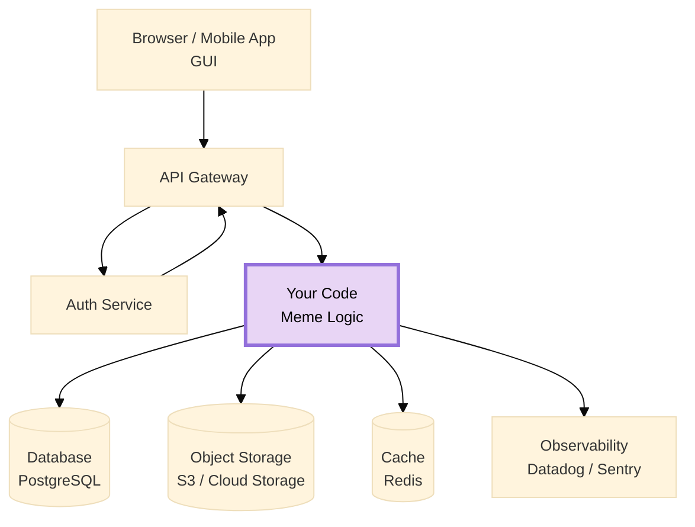

import Img from '@site/src/components/Img';
import RevealJS, { Slide } from '@site/src/components/RevealJS';
import PollSlide from "@site/src/components/PollSlide";

<RevealJS transition="slide">

{/* ============================================ */}
{/* COVER IMAGE */}
{/* ============================================ */}

<Slide>
  

<aside className="notes">
**Lecture overview:**
- **Total time:** ~65-70 MINUTES
- **Prerequisites:** L19 (monoliths, modular monoliths, architectural styles), L20 (distributed systems, eight fallacies, REST, security)
- **Connects to:** L22 (teams and collaboration), L31-33 (concurrency, event architecture)

**Structure:**
- **Warm-up: Image Resize Example** (~8 min) — concrete feature → server code → infrastructure iceberg
- Recap: From Distributed to Serverless (~3 min) — connects L19/L20 arc
- **The Cloud Deployment Spectrum** (~5 min) — builds on the "iceberg" foundation
- **What Does Your App Need?** (~3 min) — bridge: problems that lead to building blocks
- **Infrastructure Building Blocks** (~10 min) — databases, storage, queues, caches, observability
- **Defining Serverless + FaaS** (~8 min) — includes Lambda code examples with S3 triggers
- **Energy Efficiency** (~3 min) — sustainability tradeoffs
- **Requirements Fit** (~3 min) — good fit vs poor fit
- **Connection to Course Concepts** (~5 min) — information hiding at scale, same questions every scale
- Bringing It Together + L22 Preview (~5 min)

**Key theme:** Serverless is technical partitioning with a vendor — you write functions, they operate infrastructure. It's not magic; it's a point on a spectrum with real tradeoffs. The same architectural principles (information hiding, hexagonal architecture) apply at this scale.

**Important pedagogical note:** Many students have never deployed code to anything other than their own laptop. The foundational section bridges this gap before diving into cloud deployment models.

→ **Transition:** Let's start with the title...
</aside>

</Slide>

{/* ============================================ */}
{/* TITLE SLIDE */}
{/* ============================================ */}

<Slide>

# CS 3100: Program Design and Implementation II

## Lecture 21: Serverless Architecture

<p style={{marginTop: '2em', fontSize: '0.8em', color: '#666'}}>
  ©2026 Jonathan Bell & Ellen Spertus, CC-BY-SA
</p>

<aside className="notes">
**Context:**
- L20 ended with the preview: "Serverless pushes many of today's concerns to the platform level"
- Today we explore what that means concretely

→ Here's what you'll be able to do after today...
</aside>

</Slide>

<Slide>

## Announcements

<div style={{fontSize: '0.85em', textAlign: 'left'}}>

**Late tokens CAN be used on group assignments.**
- See details in link from syllabus.

**Due Friday**
- Midterm survey via Qualtrics
- Team formation survey
- Khoury mid-semester evaluation

</div>

</Slide>

{/* ============================================ */}
{/* LEARNING OBJECTIVES */}
{/* ============================================ */}

<Slide>

## Learning Objectives

<p style={{fontSize: '0.85em', textAlign: 'left'}}>
After this lecture, you will be able to:
</p>

<ol style={{fontSize: '0.75em', textAlign: 'left'}}>
  <li>Recognize common <strong>infrastructure building blocks</strong> (databases, queues, caches, object storage, observability) and their architectural roles</li>
  <li>Define <strong>"serverless"</strong> architecture and <strong>Functions as a Service (FaaS)</strong> concepts</li>
  <li>Compare serverless to <strong>traditional and container-based</strong> architectures, identifying tradeoffs</li>
  <li>Identify requirements that are <strong>well-suited or poorly-suited</strong> for serverless</li>
  <li>Apply a <strong>decision framework</strong> for choosing between architectural styles based on team size, scaling needs, and operational capacity</li>
</ol>

<div className="fragment">
<p style={{fontSize: '0.75em', marginTop: '0.75em', fontStyle: 'italic', color: '#666'}}>
<strong>Important framing:</strong> You will encounter serverless systems in internships and jobs. The goal is to <em>understand why teams choose serverless</em> and reason about whether it fits a given problem — not to become a serverless architect overnight.
</p>
</div>

<aside className="notes">
→ Let's start with a thought experiment...
</aside>

</Slide>

{/* ============================================ */}
{/* MOTIVATION */}
{/* ============================================ */}

<Slide>

## Poll: What's the fun part?

<div style={{ fontSize: '.8em' }}>
Imagine memes haven't been invented, and you decide to create the first meme
generator and server. What will you want to spend your time on?
</div>

<PollSlide username='espertus'
  choices={[
    "the GUI, including the meme editor",
    "keeping search and retrieval fast with 10M memes",
    "handling traffic when a meme goes viral",
    "authenticating users securely",
    "scrambling to fix production problems at 2 AM",
    "diagnosing why memes randomly fail in Asia"
  ]}
/>

<aside className="notes">
- Multiple select
→ Most of us find the app, rather than the infrastructure, the fun part
</aside>

</Slide>

<Slide>

## DIY or Cloud


<aside className="notes">
→ Our app is only the tip of the iceberg
</aside>

</Slide>

<Slide>

## The Infrastructure Iceberg


<aside className="notes">
→ Let's see how this plays out with our meme app.
</aside>

</Slide>

<Slide>

## Storing Memes: We Need a Database and Object Storage

<p style={{fontSize: '0.78em'}}>
Every meme has metadata and an image that need to outlive your server process. A database gives you <strong>persistent storage for metadata</strong>.
</p>

<div style={{display: 'grid', gridTemplateColumns: '1fr 1fr', gap: '0.75em', fontSize: '0.55em', marginTop: '0.5em'}}>

<div style={{padding: '0.6em', border: '2px solid #9370DB', borderRadius: '8px'}}>

**PostgreSQL (relational)**
```
memes
─────────────────────────────────────
id          | 4821
template_id | 12
top_text    | 'Me'
bottom_text | 'A new programming language'
author_id   | 99
rating      | 4.7
image_url   | 'memes/4821.jpg'
```

Rows, columns, strict schema. Supports joins, aggregations, transactions,
making it more suitable for our meme server.

</div>

<div style={{padding: '0.6em', border: '2px solid #4A90A4', borderRadius: '8px'}}>

**Firestore (NoSQL)**
```json
{
  "id": "meme_4821",
  "template": "distracted-boyfriend",
  "text": {
    "top": "Me",
    "bottom": "A new programming language"
  },
  "author": 99,
  "rating": 4.7,
  "image_url": "memes/4821.jpg"
}
```

Flexible JSON documents. Easy to add fields. No joins.

</div>

</div>

<p style={{fontSize: '0.68em', marginTop: '0.5em', color: '#FF9800'}}>
Images are stored separately in cheaper object storage.
</p>

<aside className="notes">
- Relational: "find all memes by this author with rating above 4, sorted by date" — easy with SQL
- Firestore: "store this meme quickly with whatever fields I have right now" — easy with documents

→ Now that we can store memes, how do we find them quickly?
</aside>

</Slide>

<Slide>

## Indexing: Finding Memes Without Reading Everything

<p style={{fontSize: '0.78em'}}>
With 10 million memes, you can't scan every row on every search. A database <strong>index</strong> is a pre-computed lookup structure — like a book's index, but rebuilt automatically as data changes.
</p>

<div style={{display: 'grid', gridTemplateColumns: '1fr 1fr', gap: '0.75em', fontSize: '0.55em', marginTop: '0.5em'}}>

<div style={{padding: '0.6em', border: '2px solid #f44336', borderRadius: '8px'}}>

**Without index: full table scan**
```sql
SELECT * FROM memes
WHERE top_text LIKE '%programming%'
  OR bottom_text LIKE '%programming%';
```

Reads all 10M rows. Every search. Gets slower as library grows. Response time: seconds.

</div>

<div style={{padding: '0.6em', border: '2px solid #4CAF50', borderRadius: '8px'}}>

**With index: direct lookup**
```sql
-- Create a composite index over both text fields
CREATE INDEX memes_text_search
  ON memes
  USING gin(to_tsvector('english', top_text || ' ' || bottom_text));

-- Query using the index
SELECT * FROM memes
WHERE to_tsvector('english', top_text || ' ' || bottom_text)
   @@ to_tsquery('english', 'programming');
```

Index narrows to matching rows instantly. Response time: milliseconds at any scale.

</div>

</div>

<div className="fragment">
<p style={{fontSize: '0.68em', marginTop: '0.5em', color: '#FF9800'}}>
<strong>The database builds and maintains the index automatically.</strong> You declare what to index; it handles the rest.
</p>
</div>

<aside className="notes">
**Make the analogy concrete:**
- "Imagine finding every mention of 'distracted boyfriend' in a 10,000-page book"
- "Without an index: read every page. With an index: turn to page 847."
→ Indexes help with search. But what if thousands of users search for the same thing simultaneously?
</aside>

</Slide>

<Slide>

## Caching

<p style={{fontSize: '0.78em'}}>
When the same data is requested repeatedly, <strong>caching</strong> stores the result so you don't recompute it. Trade a little memory for a lot of speed.
</p>

<div style={{display: 'grid', gridTemplateColumns: '1fr 1fr', gap: '0.75em', fontSize: '0.58em', marginTop: '0.5em'}}>

<div style={{padding: '0.6em', border: '2px solid #9370DB', borderRadius: '8px'}}>

**Without cache**
```
User → App → Database → App → User
         ↑ repeated 10,000×
         for "drake meme" results
```

Each request pays the full query cost. Popular searches hammer the database.

</div>

<div style={{padding: '0.6em', border: '2px solid #4CAF50', borderRadius: '8px'}}>

**With cache (Redis)**
```
search:"drake meme" → [4821, 4799, 4755, ...]
template:12         → "templates/drake.jpg"
meme:4821           → { top_text: "Me", ... }
```
<p>
Results stored by key. First request hits the database; the next 9,999 are served from memory.
</p>
<p>
Select images (such as the most popular templates)
can also be stored in memory.
</p>
</div>

</div>

<aside className="notes">
- Redis (RED-us) is an in-memory key-value store — extremely fast
- Hit rate matters: 99% hit rate means the database sees 1% of the traffic

→ Fast search and retrieval covered. What about sudden traffic spikes?
</aside>

</Slide>

<Slide>

## Handling Traffic When a Meme Goes Viral

<p style={{fontSize: '0.78em'}}>
Your meme generator handles 100 requests/second on a normal day. Then your <em>distracted boyfriend</em> meme gets posted on Reddit. Suddenly: 100,000 requests/second. <strong>How do you not crash?</strong>
</p>

<div style={{display: 'grid', gridTemplateColumns: '1fr 1fr', gap: '0.75em', fontSize: '0.58em', marginTop: '0.5em'}}>

<div style={{padding: '0.6em', border: '2px solid #f44336', borderRadius: '8px'}}>

**Without a queue: direct processing**
```
100,000 users
      ↓
   Your server
   (built for 100)
      ↓
   💥 crash
```

Requests pile up, server runs out of memory, everyone gets an error.

</div>

<div style={{padding: '0.6em', border: '2px solid #4CAF50', borderRadius: '8px'}}>

**With a queue: buffered processing**
```
100,000 users
      ↓
   Message queue
   (holds requests)
      ↓
   Workers process
   at sustainable pace
```

Requests are accepted immediately. Workers drain the queue as fast as they can. No crashes, no lost requests.

</div>

</div>

<div className="fragment">
<p style={{fontSize: '0.68em', marginTop: '0.5em', color: '#FF9800'}}>
<strong>Common services:</strong> AWS SQS, Google Pub/Sub, RabbitMQ. Queues usually provide <em>at-least-once delivery</em> with retries/visibility timeouts; handlers should be idempotent, and poison messages should go to a dead-letter queue.
</p>
</div>

<aside className="notes">
- The queue decouples accepting requests from processing them
- Users get an immediate "your meme is being generated" response rather than a timeout
- Workers can be scaled up independently to drain the queue faster

→ What about authentication? Didn't we say that was hard?
</aside>

</Slide>

<Slide>

## Authenticating Users Securely

<p style={{fontSize: '0.78em'}}>
Your meme generator needs to know who's who. <strong>Authentication is deceptively hard to get right</strong> — and the consequences of getting it wrong are severe.
</p>

<div style={{display: 'grid', gridTemplateColumns: '1fr 1fr', gap: '0.75em', fontSize: '0.58em', marginTop: '0.5em'}}>

<div style={{padding: '0.6em', border: '2px solid #f44336', borderRadius: '8px'}}>

**What could go wrong?**

- Passwords stored in plain text — one breach exposes everyone
- Weak session tokens — attackers can impersonate users
- No rate limiting — brute-force login attacks
- Forgotten password reset flaws — account takeover
- No MFA — stolen password = full access

</div>

<div style={{padding: '0.6em', border: '2px solid #4A90A4', borderRadius: '8px'}}>

**What you actually need**

- Secure password hashing (bcrypt, Argon2)
- Short-lived, signed session tokens (JWT)
- Rate limiting on login attempts
- Secure password reset flows
- Multi-factor authentication support
- OAuth ("Sign in with Google")

</div>

</div>

<div className="fragment">
<p style={{fontSize: '0.68em', marginTop: '0.5em', color: '#FF9800'}}>
<strong>This is why teams use managed auth services.</strong> The attack surface is large, the stakes are high, and the requirements are well-understood. This is exactly the kind of problem best outsourced to specialists.
</p>
</div>

<aside className="notes">
- Auth is a solved problem — but solving it correctly from scratch is genuinely hard
- Every item on the "what could go wrong" list has caused major real-world breaches

→ Even with everything running smoothly, things will eventually break...
</aside>

</Slide>

<Slide>

## Monitoring and Alerting

<p style={{fontSize: '0.78em'}}>
Your meme generator is running in production. <strong>How do you catch problems before they blow up?</strong>
</p>

<div style={{display: 'grid', gridTemplateColumns: '1fr 1fr', gap: '0.75em', fontSize: '0.58em', marginTop: '0.5em'}}>

<div style={{padding: '0.6em', border: '2px solid #f44336', borderRadius: '8px'}}>

**Without alerting**

- Users notice before you do
- You find out via angry tweets
- You have no idea when it started
- You don't know how many users are affected
- You're guessing at the cause

</div>

<div style={{padding: '0.6em', border: '2px solid #4CAF50', borderRadius: '8px'}}>

**With alerting**

- Monitor key metrics: error rate, latency, queue depth
- Set thresholds: "page me if error rate exceeds 1%"
- Get notified before users do
- Know exactly when the problem started
- On-call rotation shares the burden

</div>

</div>

<div className="fragment">
<p style={{fontSize: '0.68em', marginTop: '0.5em', color: '#FF9800'}}>
<strong>Common services:</strong> PagerDuty, Datadog, AWS CloudWatch. The goal is to be <i>proactive</i> — your monitoring catches the problem, not your users.
</p>
</div>

<div className="fragment">
<p style={{fontSize: '0.68em', marginTop: '0.5em', color: '#4A90A4'}}>
<strong>What you don't get paged about:</strong> disk failures, server reboots, OS upgrades, network outages, hardware replacements. The cloud handles these — you only get woken up for problems in <i>your</i> code.
</p>
</div>

<aside className="notes">
- Alerting is the difference between "we fixed it in 5 minutes" and "it was down for 3 hours before anyone noticed"
- On-call rotations are a real part of engineering jobs

→ Alerting wakes you up. But then what?
</aside>

</Slide>

<Slide>

## Observability: Diagnosing Why Memes Fail in Asia

<p style={{fontSize: '0.78em'}}>
Alerting tells you <i>something</i> is wrong. <strong>Observability</strong> tells you <i>why</i> — even when the problem only affects some users, in some regions, some of the time.
</p>

<div style={{display: 'grid', gridTemplateColumns: '1fr 1fr 1fr', gap: '0.75em', fontSize: '0.55em', marginTop: '0.5em'}}>

<div style={{padding: '0.6em', border: '2px solid #9370DB', borderRadius: '8px'}}>

**Logs**

A record of what happened
```
[ERROR] meme:4821 failed to load
  region: ap-northeast-1
  latency: 8200ms
  cause: storage timeout
```

</div>

<div style={{padding: '0.6em', border: '2px solid #4A90A4', borderRadius: '8px'}}>

**Metrics**

Aggregated measurements over time
```
error_rate{region="asia"} 12%
error_rate{region="us"}    0.1%
p99_latency{region="asia"} 8s
p99_latency{region="us"}  120ms
```

</div>

<div style={{padding: '0.6em', border: '2px solid #FF9800', borderRadius: '8px'}}>

**Traces**

The path of a single request
```
User request (8200ms total)
 ├─ Auth check       12ms
 ├─ Database query   45ms
 └─ Image fetch    8100ms ⚠
      └─ CDN miss → origin
            (wrong region)
```

</div>

</div>

<div className="fragment">
<p style={{fontSize: '0.68em', marginTop: '0.5em', color: '#4CAF50'}}>
Without the trace, you might spend hours guessing. With it, the problem is obvious: images are being fetched from the wrong region. <strong>Common services:</strong> Datadog, Sentry, AWS CloudWatch.
</p>
</div>

<div className="fragment">
<p style={{fontSize: '0.68em', marginTop: '0.5em', color: '#4A90A4'}}>
<strong>Who configures this?</strong> The platform automatically captures infrastructure logs (server restarts, network errors, scaling events). <i>You</i> add application logs — the lines in your code that record what your meme generator is actually doing.
</p>
</div>

<aside className="notes">
- The Asia example is realistic — CDN misconfiguration is a common cause of regional latency
- Without observability, distributed systems are essentially undebuggable

→ What else might you want?
</aside>

</Slide>

<Slide>

## Offering an API: You Need a Gateway

<p style={{fontSize: '0.78em'}}>
Your meme generator is a hit. Developers want to build mobile apps, bots, and integrations on top of it. You decide to offer a public API. <strong>Every request needs auth, routing, and rate limiting — but you don't have to write any of it yourself.</strong>
</p>

<div style={{fontSize: '0.55em', marginTop: '0.5em'}}>
```
Client request
      ↓
 API Gateway
  ├─ Authenticate: is this a valid API key?
  ├─ Rate limit: has this client exceeded 100 requests/min?
  ├─ Route: /memes/* → meme service
  │         /users/* → user service
  │         /templates/* → template service
  └─ Forward to your code
```

</div>

<div style={{display: 'grid', gridTemplateColumns: '1fr 1fr', gap: '0.75em', fontSize: '0.55em', marginTop: '0.5em'}}>

<div style={{padding: '0.6em', border: '2px solid #f44336', borderRadius: '8px'}}>

**Without a gateway**

Every service reimplements auth, rate limiting, and routing. Changes must be made everywhere. One misconfiguration exposes your entire backend.

</div>

<div style={{padding: '0.6em', border: '2px solid #4CAF50', borderRadius: '8px'}}>

**With a gateway**

One place to enforce policies. Backend services only see authenticated, routed requests. Add a new service without changing client code.

</div>

</div>

<div className="fragment">
<p style={{fontSize: '0.68em', marginTop: '0.5em', color: '#FF9800'}}>
<strong>Common services:</strong> AWS API Gateway, Kong, Supabase. Configure policies in one place — your backend code never sees an unauthenticated or over-limit request.
</p>
</div>

<aside className="notes">
- API gateways are a single entry point — clients never talk directly to backend services
- They handle authentication and rate limiting.

→ We've now covered all the infrastructure behind your meme generator. Let's review the building blocks.
</aside>

</Slide>


{/* ============================================ */}
{/* INFRASTRUCTURE BUILDING BLOCKS */}
{/* ============================================ */}

<Slide>

## Summary: Infrastructure Building Blocks

<p style={{fontSize: '0.82em'}}>
Cloud platforms provide standardized components that solve these recurring problems. Just as we have <strong>design patterns</strong> in code, these "building blocks" appear across architectural styles.
</p>

<div style={{display: 'grid', gridTemplateColumns: 'repeat(3, 1fr)', gap: '0.6em', fontSize: '0.55em', marginTop: '0.75em'}}>

<div style={{padding: '0.5em', border: '2px solid #9370DB', borderRadius: '8px', textAlign: 'center'}}>

**Databases**

Structured data persistence

*PostgreSQL, MongoDB, DynamoDB*

</div>

<div style={{padding: '0.5em', border: '2px solid #4A90A4', borderRadius: '8px', textAlign: 'center'}}>

**Object Storage**

Files and binary data at scale

*S3, Cloud Storage, Supabase Storage*

</div>

<div style={{padding: '0.5em', border: '2px solid #FF9800', borderRadius: '8px', textAlign: 'center'}}>

**Message Queues**

Async communication, buffering

*SQS, Pub/Sub, RabbitMQ, pgmq*

</div>

<div style={{padding: '0.5em', border: '2px solid #4CAF50', borderRadius: '8px', textAlign: 'center'}}>

**Caches**

Fast access to hot data

*Redis, Memcached, Upstash*

</div>

<div style={{padding: '0.5em', border: '2px solid #f44336', borderRadius: '8px', textAlign: 'center'}}>

**API Gateways**

Unified entry point, auth, routing

*AWS API Gateway, Kong*

</div>

<div style={{padding: '0.5em', border: '2px solid #666', borderRadius: '8px', textAlign: 'center'}}>

**Observability**

Logs, metrics, traces

*Sentry, Datadog, CloudWatch*

</div>

</div>

<div className="fragment">
<p style={{fontSize: '0.73em', marginTop: '0.6em', fontStyle: 'italic', color: '#666'}}>
Serverless architecture is fundamentally about <strong>composing these managed services</strong>: you write functions containing business logic; the cloud provider operates the infrastructure.
</p>
</div>

<aside className="notes">
- "Each of these solves one of the problems we just identified"
- "These aren't serverless-specific — they appear in monoliths, microservices, everywhere"
- "But in serverless, you COMPOSE these services rather than deploying your own"
→ Let's see how that works for our meme generator
</aside>

</Slide>
<Slide>

## Your Meme Generator: Composed from Managed Services

<p style={{fontSize: '0.78em'}}>
You wrote the meme generation logic. Everything else? <strong>Managed services you composed together.</strong>
</p>

<div style={{fontSize: '0.5em', marginTop: '0.5em'}}>


</div>

<div className="fragment">
<p style={{fontSize: '0.68em', marginTop: '0.5em', color: '#4CAF50'}}>
The purple box is what <i>you</i> write. Everything else is managed infrastructure — operated by specialists, scaled automatically, billed by usage.
</p>
</div>

<aside className="notes">
- This is the key insight of serverless: your code is a small piece of a larger composed system
- You didn't write the database, the cache, the queue, or the auth service — you just connected to them

→ There's a range of choices in how much you manage for yourself...
</aside>

</Slide>

{/* ============================================ */}
{/* THE CLOUD DEPLOYMENT SPECTRUM */}
{/* ============================================ */}

<Slide>

## The Cloud Deployment Spectrum


<div className="fragment">
<p style={{fontSize: '0.65em', marginTop: '0.4em', fontStyle: 'italic', color: '#666'}}>
<strong>Not shown:</strong> SaaS (Software as a Service) — even further right.
</p>
</div>

<aside className="notes">
**Connect to the iceberg:**
- "Remember the iceberg? All those layers beneath your code?"
- "This spectrum shows WHO manages each layer"
- "Each step to the right trades CONTROL for OPERATIONAL SIMPLICITY"
- "The 8 fallacies don't disappear — the responsibility shifts"

→ Is serverless really serverless?
</aside>

</Slide>

{/* ============================================ */}
{/* SERVERLESS DEFINED */}
{/* ============================================ */}

<Slide>

## What Is Serverless?

<p style={{fontSize: '0.78em'}}>
"Serverless" doesn't mean no servers. It means <strong>someone else manages them</strong>. You write code and compose managed services; the cloud provider handles everything beneath.
</p>

<div style={{display: 'grid', gridTemplateColumns: '1fr 1fr', gap: '0.75em', fontSize: '0.58em', marginTop: '0.5em'}}>

<div style={{padding: '0.6em', border: '2px solid #f44336', borderRadius: '8px'}}>

**Traditional**

- You provision servers
- You configure the OS and runtime
- You handle scaling and restarts
- You pay for idle time
- You get paged when hardware fails

</div>

<div style={{padding: '0.6em', border: '2px solid #4CAF50', borderRadius: '8px'}}>

**Serverless**

- Vendor provisions servers
- Vendor configures OS and runtime
- Vendor handles scaling and restarts
- You pay only for execution time
- Vendor gets paged when hardware fails

</div>

</div>

<div className="fragment">
<p style={{fontSize: '0.68em', marginTop: '0.5em', color: '#9370DB'}}>
Your meme generator is already largely serverless — managed database, object storage, cache, queue, auth, and API gateway. The last piece: your own code. That's where <strong>Functions as a Service</strong> comes in.
</p>
</div>

<aside className="notes">
- "Serverless" is a marketing term — there are always servers, just not yours
- The key shift: operational responsibility moves to the vendor
- Students have already seen this with Supabase, Firebase, etc.

→ **Transition:** So how do you deploy your own code in a serverless world?
</aside>

</Slide>

<Slide>

## Functions as a Service (FaaS)

<p style={{fontSize: '0.78em'}}>
Instead of a server running 24/7, you deploy <strong>functions</strong> that execute in response to events. No <code>main()</code>, no server setup — just your logic.
</p>

<div style={{display: 'grid', gridTemplateColumns: '1fr 1fr', gap: '0.75em', fontSize: '0.55em', marginTop: '0.5em'}}>

<div style={{padding: '0.6em', border: '2px solid #9370DB', borderRadius: '8px'}}>

**Meme generation function**
```java
public class GenerateMemeHandler
    implements RequestHandler<APIGatewayProxyRequestEvent,
                              APIGatewayProxyResponseEvent> {

  public APIGatewayProxyResponseEvent handleRequest(
      APIGatewayProxyRequestEvent request,
      Context context) {

    MemeRequest body = parseJson(request.getBody());
    byte[] template = storage.get(body.templateId());
    byte[] meme = MemeUtils.addText(
        template, body.topText(), body.bottomText());
    String url = storage.put("memes/", meme);
    db.insert(new Meme(body, url));
    return ok(new MemeResponse(url));
  }
}
```

</div>

<div style={{padding: '0.6em', border: '2px solid #4A90A4', borderRadius: '8px'}}>

**Four key properties**

**① Event-driven**
Platform calls your function when an event arrives. You don't listen for requests.

**② Stateless**
No state persists between calls. All state lives in external services.

**③ Clear contract**
Request in, response out. Keep side effects explicit (e.g., DB/storage writes) and bounded.

**④ Pay per invocation**
No requests? No cost. 1M requests? Billed for exactly that.

</div>

</div>

<aside className="notes">
- No main(), no port binding, no health checks — the platform handles all of that
- The function only contains business logic: fetch template, add text, store result, record in DB
- Students have seen the Strategy pattern — this is the same idea at infrastructure scale

→ **Transition:** Now let's look at where serverless fits — and where it doesn't.
</aside>

</Slide>

<Slide>

## Event-Driven Execution

<p style={{fontSize: '0.78em'}}>
Serverless functions are triggered by <strong>events</strong> — not just HTTP requests. This enables reactive architectures where functions respond to changes in the system.
</p>


<aside className="notes">
**The event-driven paradigm:**
- Traditional servers: "listen on port 8080, handle whatever comes"
- Serverless: "when THIS event happens, run THIS function"
- More declarative, more focused

**Event sources in practice:**
- HTTP: most common, what we'll show in the code example
- File upload: "when a file lands in this bucket, process it"
- Database change: "when a row is inserted, trigger downstream actions"
- Schedule: "every night at 2 AM, run this cleanup job"
- Message queue: "when a message arrives, process it"

**Pawtograder examples:**
- HTTP: POST /submissions (student submits work), POST /feedback (grader reports results)
- File upload: Test files for assignments stored in cloud storage
- Schedule: could use for nightly grade exports (not currently implemented)
- Database triggers: handled by PostgreSQL itself, not Edge Functions

**The scaling insight:**
- 100 students submit at once? 100 function instances spin up
- You don't configure this — it just happens
- This is the "elastic" in "elastic computing"

→ **Transition:** Now let's see what the code looks like...
</aside>

</Slide>


{/* ============================================ */}
{/* BROADER CONSIDERATIONS */}
{/* ============================================ */}

<Slide>

## Energy Efficiency Considerations

<p style={{fontSize: '0.82em'}}>
Serverless architecture has interesting <strong>sustainability implications</strong> that cut both ways.
</p>

<div style={{display: 'grid', gridTemplateColumns: '1fr 1fr', gap: '1em', fontSize: '0.6em', marginTop: '0.75em'}}>

<div style={{padding: '0.75em', border: '2px solid #4CAF50', borderRadius: '8px'}}>

**Potential Energy Savings**

- **No idle power:** Monolith runs 24/7 even at 3 AM. Serverless consumes energy only when executing.

- **Shared infrastructure:** Cloud providers achieve high utilization across thousands of customers. 80% utilization > 10%.

- **Right-sized execution:** Functions get exactly the resources needed (modulo startup overhead).

</div>

<div style={{padding: '0.75em', border: '2px solid #f44336', borderRadius: '8px'}}>

**Potential Energy Costs**

- **Cold start overhead:** Spinning up new containers has energy costs warm monoliths avoid.

- **Per-request overhead:** Each invocation goes through routing, logging, billing infrastructure.

- **Distributed chattiness:** Many small functions calling each other = network energy costs.

</div>

</div>

<div className="fragment">
<p style={{fontSize: '0.7em', marginTop: '0.5em', fontStyle: 'italic', color: '#666'}}>
The architectural lesson: <strong>batch operations when possible</strong>. Pawtograder's <code>submitFeedback()</code> sends all test results in one call, not 100 separate calls. This saves latency, cost, AND energy.
</p>
</div>

<aside className="notes">
**The "Green Software" movement:**
- Sustainability is becoming a quality attribute
- Companies are tracking carbon footprint of their software
- Architecture choices have real environmental impact

→ When SHOULD you use serverless?
</aside>

</Slide>

{/* ============================================ */}
{/* REQUIREMENTS FIT */}
{/* ============================================ */}

<Slide>

## When Does Serverless Fit?


<aside className="notes">
**Connect to examples from today:**

**GREEN SIDE — we built these!**
- "Image resize: Remember the Lambda code? S3 event triggers function, no server running."
- "Welcome emails: From our architecture comparison — database trigger fires function."
- "Webhook handlers: GitHub sends push event, function processes it, done. Quick, stateless."
- "Bursty traffic: 1000 profile uploads at deadline? 1000 Lambda instances. $0 at 3 AM."

**RED SIDE — these need different solutions:**
- "Video encoding: 30 minutes to transcode. Lambda times out at 15. Use containers."
- "Multiplayer games: Cold start of 2 seconds = player dies waiting. Need always-warm."
- "In-memory cache: Function memory disappears between calls. Need external storage."
- "High-frequency trading: Sustained 1M requests/sec. Per-invocation pricing gets expensive fast."

**The three questions in the center:**
- "These are the same three questions from our decision framework"
- "Scaling pattern, latency needs, ops capacity"
- "If your workload is on the green side for all three → serverless is a great fit"

**Key message:**
- "This isn't about 'serverless good' or 'serverless bad'"
- "It's about matching the tool to the problem"
- "Now you have concrete examples to pattern-match against"

→ **Transition:** Let's connect this back to course concepts...
</aside>

</Slide>

{/* ============================================ */}
{/* BRINGING IT TOGETHER */}
{/* ============================================ */}

<Slide>

## Bringing It Together: L19 → L20 → L21

<div style={{fontSize: '0.6em', marginTop: '0.5em'}}>

| Lecture | Question | Key Insight |
|---------|----------|-------------|
| **L19** | How do we organize code? | Architectural styles emerge from quality attribute requirements. Monolith-first is usually right. |
| **L20** | What changes over networks? | The eight fallacies. Every network call can fail, be slow, or be intercepted. |
| **L21** | What if someone else manages infra? | Serverless = technical partitioning with a vendor. Same principles, different operational model. |

</div>

<div className="fragment">
<div style={{display: 'grid', gridTemplateColumns: '1fr 1fr', gap: '0.75em', fontSize: '0.55em', marginTop: '0.75em'}}>

<div style={{padding: '0.6em', border: '2px solid #9370DB', borderRadius: '8px'}}>

**The thread connecting all three:**

Same design principles at every scale:
- Information hiding (L6)
- Coupling and cohesion (L7)
- Hexagonal architecture (L16)
- Quality attribute tradeoffs (L19)

</div>

<div style={{padding: '0.6em', border: '2px solid #4A90A4', borderRadius: '8px'}}>

**The practical takeaway:**

No single architecture is right for everything. Pawtograder's hybrid approach demonstrates this — serverless API, managed compute for grading, PostgreSQL for domain logic.

</div>

</div>
</div>

<aside className="notes">
**Synthesis:**
- This is the end of our "architecture trilogy" (L19-L20-L21)
- Each lecture built on the previous
- The principles are consistent; the scale changes

→ These same questions work at every scale...
</aside>

</Slide>

{/* ============================================ */}
{/* SAME QUESTIONS, EVERY SCALE */}
{/* ============================================ */}

<Slide>

## Same Questions, Every Scale

<p style={{fontSize: '0.82em'}}>
At every level — class, module, service, system — you ask the same four questions:
</p>

<div style={{fontSize: '0.62em', marginTop: '0.75em'}}>

| Question | What It Determines |
|----------|-------------------|
| **What changes independently?** | Where to draw boundaries |
| **Who needs to know?** | What the interface should hide |
| **What can fail?** | How explicit your error handling must be |
| **What are you trading?** | Whether the tradeoff is worth it |

</div>

<div className="fragment">
<div style={{display: 'grid', gridTemplateColumns: '1fr 1fr 1fr 1fr', gap: '0.5em', fontSize: '0.5em', marginTop: '0.75em'}}>

<div style={{padding: '0.5em', border: '2px solid #9370DB', borderRadius: '8px', textAlign: 'center'}}>

**L6-L7**

Classes & methods

*Private fields, cohesive modules*

</div>

<div style={{padding: '0.5em', border: '2px solid #4A90A4', borderRadius: '8px', textAlign: 'center'}}>

**L16-L18**

Services & boundaries

*Ports, adapters, APIs*

</div>

<div style={{padding: '0.5em', border: '2px solid #FF9800', borderRadius: '8px', textAlign: 'center'}}>

**L20**

Network boundaries

*Fallacies, failures, security*

</div>

<div style={{padding: '0.5em', border: '2px solid #4CAF50', borderRadius: '8px', textAlign: 'center'}}>

**L21**

Vendor boundaries

*Managed infra, tradeoffs*

</div>

</div>
</div>

<aside className="notes">
**The progression across lectures:**
- Same questions, different consequences
- At class level: failure = exception, cost = complexity

- At vendor level: failure = outage, cost = lock-in/flexibility

→ This is what thinking like an architect means...
</aside>

</Slide>

<Slide>

## The Architect's Toolkit

<p style={{fontSize: '0.82em'}}>
You now have a framework for approaching any system:
</p>

<div style={{display: 'grid', gridTemplateColumns: '1fr 1fr', gap: '1em', fontSize: '0.6em', marginTop: '0.75em'}}>

<div style={{padding: '0.75em', border: '2px solid #9370DB', borderRadius: '8px'}}>

**When you see a boundary, ask:**
- What's hiding behind it?
- Who owns each side?
- What happens when communication fails?

</div>

<div style={{padding: '0.75em', border: '2px solid #4A90A4', borderRadius: '8px'}}>

**When you're drawing a boundary, ask:**
- What changes independently?
- Who needs to know about what?
- Is this a one-way door or two-way door?

</div>

<div style={{padding: '0.75em', border: '2px solid #FF9800', borderRadius: '8px'}}>

**When evaluating an architecture, ask:**
- What quality attributes drove these choices?
- What tradeoffs were accepted?
- What would break if requirements changed?

</div>

<div style={{padding: '0.75em', border: '2px solid #4CAF50', borderRadius: '8px'}}>

**When choosing complexity, ask:**
- Do I have a specific problem this solves?
- Can I start simpler and evolve?
- What's the cost of being wrong?

</div>

</div>

<p className="fragment" style={{fontSize: '0.78em', marginTop: '0.75em', fontWeight: 'bold', color: '#9370DB'}}>
The principles scale. The details change. The questions stay the same.
</p>

<aside className="notes">
- Architecture isn't about memorizing style names
- It's about asking the right questions consistently
- The answers differ based on context — but the questions are universal

→ After break, we'll start looking at teams.
</aside>

</Slide>

<Slide>

## What's Next: Teams and Collaboration

<p style={{fontSize: '0.82em'}}>
We've been implicitly assuming a single developer making all decisions. Real software is built by <strong>teams</strong> — and team structure has a big impact on how software gets built.
</p>

<div style={{display: 'grid', gridTemplateColumns: '1fr 1fr', gap: '1em', fontSize: '0.65em', marginTop: '1em'}}>

<div style={{padding: '0.75em', border: '2px solid #9370DB', borderRadius: '8px'}}>

**L22: Teams and Collaboration**

- How teams organize, communicate, coordinate
- Why org structure shapes system structure
- Architectural boundaries often become team boundaries
- Strategies for effective collaboration

</div>

<div style={{padding: '0.75em', border: '2px solid #4A90A4', borderRadius: '8px'}}>

**The connection:**

Today we saw serverless as outsourcing infrastructure to a specialist vendor — your team focuses on domain logic, they focus on infra.

That's an organizational decision as much as a technical one.

</div>

</div>

</Slide>

<Slide>
## Bonus Slide


</Slide>

</RevealJS>
