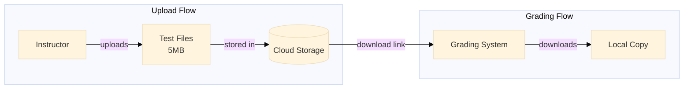
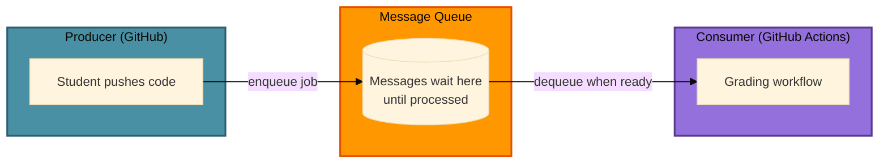
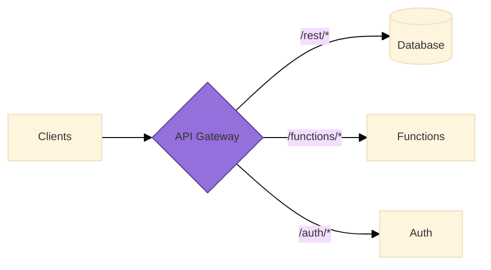

import Img from '@site/src/components/Img';
import RevealJS, { Slide } from '@site/src/components/RevealJS';
import PollSlide from "@site/src/components/PollSlide";

<RevealJS transition="slide">

{/* ============================================ */}
{/* COVER IMAGE */}
{/* ============================================ */}

<Slide>
  

<aside className="notes">
**Lecture overview:**
- **Total time:** ~65-70 MINUTES
- **Prerequisites:** L19 (monoliths, modular monoliths, architectural styles), L20 (distributed systems, eight fallacies, REST, security)
- **Connects to:** L22 (teams and collaboration), L31-33 (concurrency, event architecture)

**Structure:**
- **Warm-up: Image Resize Example** (~8 min) — concrete feature → server code → infrastructure iceberg
- Recap: From Distributed to Serverless (~3 min) — connects L19/L20 arc
- **The Cloud Deployment Spectrum** (~5 min) — builds on the "iceberg" foundation
- **What Does Your App Need?** (~3 min) — bridge: problems that lead to building blocks
- **Infrastructure Building Blocks** (~10 min) — databases, storage, queues, caches, observability
- **Defining Serverless + FaaS** (~8 min) — includes Lambda code examples with S3 triggers
- **Energy Efficiency** (~3 min) — sustainability tradeoffs
- **Requirements Fit** (~3 min) — good fit vs poor fit
- **Connection to Course Concepts** (~5 min) — information hiding at scale, same questions every scale
- Bringing It Together + L22 Preview (~5 min)

**Key theme:** Serverless is technical partitioning with a vendor — you write functions, they operate infrastructure. It's not magic; it's a point on a spectrum with real tradeoffs. The same architectural principles (information hiding, hexagonal architecture) apply at this scale.

**Important pedagogical note:** Many students have never deployed code to anything other than their own laptop. The foundational section bridges this gap before diving into cloud deployment models.

→ **Transition:** Let's start with the title...
</aside>

</Slide>

{/* ============================================ */}
{/* TITLE SLIDE */}
{/* ============================================ */}

<Slide>

# CS 3100: Program Design and Implementation II

## Lecture 21: Serverless Architecture

<p style={{marginTop: '2em', fontSize: '0.8em', color: '#666'}}>
  ©2026 Jonathan Bell, CC-BY-SA
</p>

<aside className="notes">
**Context:**
- L20 ended with the preview: "Serverless pushes many of today's concerns to the platform level"
- Today we explore what that means concretely
- Running examples: same as L19-L20 — Pawtograder and Bottlenose

**Framing the lecture:**
- "L20 was about what happens when components communicate over networks"
- "Today is about what happens when someone ELSE manages the infrastructure those components run on"
- "You're NOT expected to design serverless architectures from scratch. The goal: understand the tradeoffs so you can evaluate when serverless makes sense."

→ **Transition:** Here's what you'll be able to do after today...
</aside>

</Slide>

{/* ============================================ */}
{/* LEARNING OBJECTIVES */}
{/* ============================================ */}

<Slide>

## Learning Objectives

<p style={{fontSize: '0.85em', textAlign: 'left'}}>
After this lecture, you will be able to:
</p>

<ol style={{fontSize: '0.75em', textAlign: 'left'}}>
  <li>Recognize common <strong>infrastructure building blocks</strong> (databases, queues, caches, object storage, observability) and their architectural roles</li>
  <li>Define <strong>"serverless"</strong> architecture and <strong>Functions as a Service (FaaS)</strong> concepts</li>
  <li>Compare serverless to <strong>traditional and container-based</strong> architectures, identifying tradeoffs</li>
  <li>Identify requirements that are <strong>well-suited or poorly-suited</strong> for serverless</li>
  <li>Apply a <strong>decision framework</strong> for choosing between architectural styles based on team size, scaling needs, and operational capacity</li>
</ol>

<div className="fragment">
<p style={{fontSize: '0.75em', marginTop: '0.75em', fontStyle: 'italic', color: '#666'}}>
<strong>Important framing:</strong> You will encounter serverless systems in internships and jobs. The goal is to <em>understand why teams choose serverless</em> and reason about whether it fits a given problem — not to become a serverless architect overnight.
</p>
</div>

<aside className="notes">
**SET EXPECTATIONS:**
- "You will NOT be tested on 'design a serverless architecture from scratch'"
- "You WILL be expected to understand tradeoffs, recognize when serverless fits, and read systems that use it"

**Connection to L19-L20:**
- L19: How do we organize code? (architectural styles)
- L20: What changes when code crosses the network? (distributed systems)
- L21: What changes when someone else manages the infrastructure?

**The progression:**
- Same principles at different scales
- Information hiding, hexagonal architecture, quality attributes — all still apply
- Serverless is one point in a design space, not a silver bullet

→ **Transition:** But first — let's make sure we're all on the same page about what "infrastructure" even means...
</aside>

</Slide>

{/* ============================================ */}
{/* WARM-UP: A SIMPLE FEATURE */}
{/* ============================================ */}

<Slide>

## Warm-Up: A Simple Feature

<p style={{fontSize: '0.82em'}}>
You're building an app that lets users upload photos. You need a feature: <strong>resize images to create thumbnails</strong>. The core logic is straightforward — we will use an image processing library.
</p>

<div style={{fontSize: '0.5em', marginTop: '0.5em'}}>

```java
public class ImageUtils {
    public static byte[] resize(byte[] imageData, int width, int height) {
        BufferedImage original = ImageIO.read(new ByteArrayInputStream(imageData));
        BufferedImage thumbnail = new BufferedImage(width, height, original.getType());

        Graphics2D g = thumbnail.createGraphics();
        g.drawImage(original, 0, 0, width, height, null);
        g.dispose();

        ByteArrayOutputStream out = new ByteArrayOutputStream();
        ImageIO.write(thumbnail, "jpg", out);
        return out.toByteArray();
    }
}
```

</div>

<div className="fragment">
<p style={{fontSize: '0.75em', marginTop: '0.5em', color: '#4CAF50'}}>
<strong>This is the easy part.</strong> ~15 lines of code. You could write this in an hour.
</p>
</div>

<div className="fragment">
<p style={{fontSize: '0.75em', marginTop: '0.3em', color: '#f44336'}}>
<strong>But how do users actually send you an image?</strong> This code runs on your laptop. Your users are... not on your laptop.
</p>
</div>

<aside className="notes">
**Start with something concrete:**
- "Let's say you're building an app — Instagram clone, e-commerce site, whatever"
- "Users upload photos. You need thumbnails."
- "The image processing itself? Not that hard."

**Walk through the code:**
- Read image bytes into a BufferedImage
- Create a new smaller image
- Draw the original into the smaller canvas
- Write it back to bytes

**The twist:**
- "This code works great... on your laptop"
- "But your users aren't on your laptop"
- "How do they send you an image to resize?"

→ **Transition:** You need to expose this as a service...
</aside>

</Slide>

<Slide>

## Now Make It a Service

<p style={{fontSize: '0.8em'}}>
For users to access your image resizer, you need an <strong>HTTP server</strong> that listens for requests:
</p>

<div style={{fontSize: '0.7em', marginTop: '-1em', marginBottom: '-1em'}}>
```java
public class ImageResizeServer {
    private static final int PORT = 8080; // hope it's available
    private static volatile boolean running = true;

    public static void main(String[] args) throws Exception {
        // YOU set up the server
        HttpServer server = HttpServer.create(new InetSocketAddress(PORT), 0);
        server.createContext("/resize", exchange -> {
            byte[] imageData = parseMultipartUpload(exchange);  // Parsing uploads is painful
            byte[] thumbnail = ImageUtils.resize(imageData, 200, 200);  // ← Your actual logic
            exchange.sendResponseHeaders(200, thumbnail.length);
            exchange.getResponseBody().write(thumbnail);
            exchange.close();
        });
        server.createContext("/health", ex -> {  // Load balancers need this
            ex.sendResponseHeaders(200, 2);
            ex.getResponseBody().write("OK".getBytes());
            ex.close();
        });

        // YOU handle graceful shutdown
        Runtime.getRuntime().addShutdownHook(new Thread(() -> {
            running = false;
            server.stop(5);
        }));

        server.start();
        System.out.println("Server running on port " + PORT);
        while (running) { Thread.sleep(1000); }  // Runs FOREVER until killed
    }
}
```

</div>


<aside className="notes">
**Walk through what got added:**
Your <strong>15 lines of business logic</strong> are now buried in <strong>30+ lines of server boilerplate</strong>. And we haven't even talked about where this server runs...

- main() method: YOU start the server
- Port binding: pick 8080, hope nothing else uses it
- Health check endpoint: load balancers ping this to know you're alive
- Shutdown hook: stop gracefully so in-flight requests complete
- while(running) loop: keep the JVM alive forever

**What we're NOT showing (even more work):**
- Multipart form parsing (notoriously painful)
- SSL/TLS certificate configuration
- Request logging and metrics
- Rate limiting
- Error handling

**The key observation:**
- "Your actual business logic? One line: ImageUtils.resize()"
- "Everything else is ceremony to make it accessible"

→ **Transition:** And this server needs to run somewhere...
</aside>

</Slide>

<Slide>

## Where Does This Server Run?

<p style={{fontSize: '0.78em'}}>
You can run <code>java ImageResizeServer</code> on your laptop. But your laptop sleeps when you sleep. <strong>Your users are in different time zones.</strong>
</p>


<aside className="notes">
**The laptop limitation:**
- "You can demo this on your laptop"
- "But production? Your laptop closes. You sleep. You go to class."
- "Someone in Tokyo wants to resize an image at 3 AM Boston time"

**The 24/7 reality:**
- "Real services run on computers that NEVER sleep"
- "Those computers need to be reachable from anywhere"
- "This is fundamentally different from running code locally"

**The question:**
- "So where do you PUT this server?"
- "What does it take to run code 24/7?"

→ **Transition:** Let's trace what's actually needed...
</aside>

</Slide>

<Slide>

## The Infrastructure Iceberg

<p style={{fontSize: '0.78em'}}>
Your <code>ImageResizeServer</code> requires *infrastructure* to be available to users.
</p>


<aside className="notes">
**Walk through each layer (bottom to top):**

**Physical space:**
- "Someone needs a building. With doors that lock."
- "Fire suppression systems. Security guards. Insurance."

**Power and cooling:**
- "Computers need electricity. Constant electricity."
- "They generate heat — a lot of it. Need AC running 24/7."
- "Power goes out? Your app goes down."

**Network:**
- "Need an internet connection. A FAST one."
- "Not your home WiFi — enterprise-grade networking"
- "Multiple redundant connections so one failure doesn't kill you"

**The computer:**
- "Actual physical hardware. CPUs, RAM, hard drives."
- "Hard drives fail. RAM goes bad. CPUs overheat."
- "Someone needs to notice and replace them."

**Operating system:**
- "Linux, Windows Server — manages the hardware"
- "Security patches. Updates. Configuration."

**Runtime:**
- "Java needs a JVM. Python needs an interpreter."
- "These need to be installed, configured, kept up to date."

**Your app (finally!):**
- "All that infrastructure... just so YOUR code can run"
- "The iceberg visual: your code is the tiny visible tip"
- "Your ImageResizeServer with its 15 lines of business logic... sits on top of ALL of this"

**Key insight:**
- "Infrastructure = everything beneath your code"
- "Someone has to manage ALL of these layers"
- "The question is: who manages this for your image resize service?"

→ **Transition:** You have two choices for who manages this...
</aside>

</Slide>

<Slide>

## Two Choices: Own It or Rent It

<p style={{fontSize: '0.82em'}}>
You have a fundamental choice about who manages all that infrastructure. This is the core tradeoff that defines cloud computing — and it's exactly like choosing between <strong>owning a car</strong> and <strong>taking the T</strong>.
</p>

<div style={{display: 'grid', gridTemplateColumns: '1fr 1fr', gap: '1em', fontSize: '0.6em', marginTop: '0.75em'}}>

<div className='fragment' style={{padding: '0.75em', border: '2px solid #9370DB', borderRadius: '8px'}}>

**Own Your Infrastructure**

Buy servers. Rent data center space. Hire ops engineers. Configure everything yourself.

- **Total control** — choose any hardware, any software
- **Predictable costs** at high scale
- **You're responsible** for everything: uptime, security, maintenance
- When something breaks at 3 AM, **your phone rings**

</div>

<div className='fragment' style={{padding: '0.75em', border: '2px solid #4A90A4', borderRadius: '8px'}}>

**Rent from a Cloud Provider**

AWS, Google Cloud, Azure, Supabase — they own the data centers, you use their services.

- **Less control** — work within their constraints
- **Pay-per-use** pricing (can be cheaper... or more expensive)
- **They handle** most operational concerns
- When their stuff breaks at 3 AM, **their phone rings**

</div>

</div>

<aside className="notes">
**The ownership tradeoff:**
- "This is a fundamental decision in software engineering"
- "Own vs. rent — it applies to infrastructure just like cars"

**Own it:**
- "Companies like Google and Amazon own their data centers"
- "They have tens of thousands of servers, teams of engineers"
- "When you're at that scale, it makes sense"
- "But for a small team or a class project? Probably not."

**Rent it:**
- "Cloud providers own massive infrastructure"
- "They spread the cost across thousands of customers"
- "You rent a small slice"
- "Like an apartment vs. owning a house"

**The Boston analogy:**
- "This should feel familiar to any of you who've debated bringing a car to Boston"
- "Parking at Northeastern: $2,200/semester"
- "CharlieCard: $2.40/ride"
- "If you only need to go somewhere occasionally, the math is obvious"
- "But if you need to go somewhere the T doesn't go... you're stuck"

**Foreshadowing serverless:**
- "Serverless is like ONLY paying for the rides you take"
- "No monthly parking fee. No insurance. Just per-trip cost."
- "But you REALLY have to follow their rules."

→ **Transition:** Let's see this as a spectrum...
</aside>

</Slide>

{/* ============================================ */}
{/* RECAP: FROM DISTRIBUTED TO SERVERLESS */}
{/* ============================================ */}

<Slide>

## Recap: From Distributed Systems to Serverless

<p style={{fontSize: '0.82em'}}>
In <strong>L19</strong>, we explored architectural styles — monoliths, modular monoliths, and the tradeoffs between them. In <strong>L20</strong>, we crossed the network boundary and discovered the <strong>Eight Fallacies of Distributed Computing</strong>.
</p>

<div style={{display: 'grid', gridTemplateColumns: '1fr 1fr 1fr', gap: '0.75em', fontSize: '0.6em', marginTop: '0.75em'}}>

<div style={{padding: '0.6em', border: '2px solid #9370DB', borderRadius: '8px'}}>

**L19: How do we organize code?**

Architectural styles emerge from quality attribute requirements. Monolith-first is usually right.

</div>

<div style={{padding: '0.6em', border: '2px solid #4A90A4', borderRadius: '8px'}}>

**L20: What changes over networks?**

The eight fallacies. Latency, failures, security boundaries. Every call needs timeout + retry.

</div>

<div style={{padding: '0.6em', border: '2px solid #FF9800', borderRadius: '8px'}}>

**L21: What if someone else manages it?**

Serverless = technical partitioning with a vendor. You write functions; they operate infrastructure.

</div>

</div>

<div className="fragment">
<p style={{fontSize: '0.78em', marginTop: '0.75em', fontWeight: 'bold', color: '#4CAF50'}}>
Today's key insight: Serverless doesn't eliminate distributed systems complexity — it shifts <em>who deals with it</em>. The eight fallacies still apply. You just don't write the retry logic yourself.
</p>
</div>

<aside className="notes">
**Connect to what we just covered:**
- "We just saw the iceberg — all that infrastructure beneath your code"
- "The 'own it vs. rent it' choice"
- "Now let's connect this to our architectural journey from L19 and L20"

**Connect the arc:**
- L19: Inside a single deployment — how do we structure code?
- L20: Across deployments — what changes when components talk over networks?
- L21: Who operates the infrastructure those deployments run on?

**The key framing:**
- "Serverless" sounds like magic — "no servers!"
- Reality: there ARE servers, you just don't manage them — it's the "rent it" extreme
- All eight fallacies still apply to YOUR code
- The vendor handles retry logic, scaling, availability — but you pay for that in other ways

→ **Transition:** The "own vs. rent" choice isn't binary — it's a spectrum. Let's map it out...
</aside>

</Slide>

{/* ============================================ */}
{/* THE CLOUD DEPLOYMENT SPECTRUM */}
{/* ============================================ */}

<Slide>

## The Cloud Deployment Spectrum


<div className="fragment">
<p style={{fontSize: '0.65em', marginTop: '0.4em', fontStyle: 'italic', color: '#666'}}>
<strong>Not shown:</strong> SaaS (Software as a Service) — even further right. For image resizing, you could outsource entirely to a vendor: call their API, pay per transformation, write zero image code. Maximum convenience, zero customization.
</p>
</div>

<aside className="notes">
**Connect to the iceberg:**
- "Remember the iceberg? All those layers beneath your code?"
- "This spectrum shows WHO manages each layer"
- "Each step to the right trades CONTROL for OPERATIONAL SIMPLICITY"

**Walk through the spectrum (reference the iceberg layers):**

**Left side — you manage the entire iceberg:**
- Own data center: you manage ALL layers (facility, power, network, hardware, OS, runtime, app)
- Real companies do this! Google, Amazon, large banks — when scale justifies it
- Most of you will never need to think about power and cooling

**Middle — the cloud IaaS era (2006-2015):**
- EC2 launched 2006 — revolutionary! No more buying hardware
- The cloud provider handles the bottom of the iceberg (physical stuff)
- But you still patch the OS, configure the firewall, scale manually
- Bottlenose lives here (VMs + containers)

**Right side — serverless territory:**
- PaaS (Heroku, 2007) was the first "just deploy your code"
- FaaS (Lambda, 2014) went further: just deploy FUNCTIONS
- Almost the entire iceberg is managed FOR you
- Pawtograder lives here (Supabase Edge Functions)

**Not shown: SaaS (the extreme right):**
- "There's actually one more step we didn't show"
- SaaS = you don't even write code, you just USE someone else's service
- Image resize example: Cloudinary, imgix, Cloudflare Images
- You call their API: "resize this image to 200x200" — done
- You pay per transformation, they handle everything
- Trade-off: maximum convenience, but zero customization

**The key insight:**
- "Serverless" isn't one thing — it's the rightmost portion of this spectrum
- The vendor handles more of the iceberg; you handle less
- But you're not getting something for nothing — you pay in flexibility, vendor lock-in, and sometimes cost at scale
- SaaS is even further right: you don't write ANY code, but you're locked into their exact feature set

**Connect to L20:**
- "Remember the eight fallacies? They apply at EVERY level except 'own data center'"
- "But as you move right, the VENDOR deals with more of the retry logic, scaling, and availability"
- "The fallacies don't disappear — the responsibility shifts"

→ **Transition:** But wait — just having compute isn't enough. Real apps need more than just somewhere to run code...
</aside>

</Slide>

{/* ============================================ */}
{/* BRIDGE: WHAT ELSE DOES YOUR APP NEED? */}
{/* ============================================ */}

<Slide>

## Beyond Compute: What Else Does Your Application Need?

<p style={{fontSize: '0.78em'}}>
Okay, you've got a server (or a function) running your code. But code alone isn't enough. Real applications have <strong>needs</strong> that go beyond just executing instructions.
</p>


<aside className="notes">
**Frame this as universal problems:**
- "So you've got your code running somewhere. Great!"
- "But immediately you hit problems that EVERY web application faces"
- "These aren't unique to your app — they're so common that the industry has standardized solutions"

**Walk through each problem:**

**Data persistence:**
- "Your app tracks user accounts. Where does that data GO?"
- "If the server restarts, is that data gone?"
- "You need somewhere to STORE data permanently"

**Large files:**
- "A user uploads a profile picture. Or a video. Or a 50MB PDF."
- "You can't just keep that in memory. Where does it live?"

**Traffic spikes:**
- "Your app is quiet most of the day. Then everyone submits at 11:59 PM."
- "How do you handle 1000 requests when you were handling 10?"

**Repeated work:**
- "Every request asks 'what's the course name?' — same answer every time"
- "Why fetch it from the database 1000 times?"

**Routing:**
- "Your code is running somewhere. How does a user's browser FIND it?"
- "How do you handle authentication before requests even reach your code?"

**Debugging:**
- "Something broke. You can't SSH in (especially with serverless). Now what?"
- "How do you even know something is broken?"

**Key insight:**
- "These problems are so universal that cloud platforms provide standard SOLUTIONS"
- "Let's give names to those solutions..."

→ **Transition:** Cloud platforms solve these with standardized building blocks...
</aside>

</Slide>

{/* ============================================ */}
{/* INFRASTRUCTURE BUILDING BLOCKS */}
{/* ============================================ */}

<Slide>

## Infrastructure Building Blocks

<p style={{fontSize: '0.82em'}}>
Cloud platforms provide standardized components that solve these recurring problems. Just as we have <strong>design patterns</strong> in code, these "building blocks" appear across architectural styles.
</p>

<div style={{display: 'grid', gridTemplateColumns: 'repeat(3, 1fr)', gap: '0.6em', fontSize: '0.55em', marginTop: '0.75em'}}>

<div style={{padding: '0.5em', border: '2px solid #9370DB', borderRadius: '8px', textAlign: 'center'}}>

**Databases**

Structured data persistence

*PostgreSQL, MongoDB, DynamoDB*

</div>

<div style={{padding: '0.5em', border: '2px solid #4A90A4', borderRadius: '8px', textAlign: 'center'}}>

**Object Storage**

Files and binary data at scale

*S3, Cloud Storage, Supabase Storage*

</div>

<div style={{padding: '0.5em', border: '2px solid #FF9800', borderRadius: '8px', textAlign: 'center'}}>

**Message Queues**

Async communication, buffering

*SQS, Pub/Sub, RabbitMQ, pgmq*

</div>

<div style={{padding: '0.5em', border: '2px solid #4CAF50', borderRadius: '8px', textAlign: 'center'}}>

**Caches**

Fast access to hot data

*Redis, Memcached, Upstash*

</div>

<div style={{padding: '0.5em', border: '2px solid #f44336', borderRadius: '8px', textAlign: 'center'}}>

**API Gateways**

Unified entry point, auth, routing

*AWS API Gateway, Kong*

</div>

<div style={{padding: '0.5em', border: '2px solid #666', borderRadius: '8px', textAlign: 'center'}}>

**Observability**

Logs, metrics, traces

*Sentry, Datadog, CloudWatch*

</div>

</div>

<div className="fragment">
<p style={{fontSize: '0.73em', marginTop: '0.6em', fontStyle: 'italic', color: '#666'}}>
Serverless architecture is fundamentally about <strong>composing these managed services</strong>: you write functions containing business logic; the cloud provider operates the infrastructure.
</p>
</div>

<aside className="notes">
**Connect to the problems we just saw:**
- "Each of these solves one of the problems we just identified"
- "Databases → data persistence"
- "Object Storage → large files"
- "Message Queues → traffic spikes"
- "Caches → repeated work"
- "API Gateways → routing and access"
- "Observability → debugging"

**Frame this section:**
- "These aren't serverless-specific — they appear in monoliths, microservices, everywhere"
- "But in serverless, you COMPOSE these services rather than deploying your own"
- "Let's look at each one and see how Pawtograder uses them"

**The key insight:**
- Traditional: you deploy PostgreSQL on your own server
- Serverless: you use Supabase (managed PostgreSQL) and just connect to it
- Same database, different operational model

**Why this matters:**
- When you read system architecture diagrams, you'll see these components
- Knowing what they do helps you understand the system's capabilities and constraints

→ **Transition:** Let's start with the most fundamental: databases...
</aside>

</Slide>

<Slide>

## Databases: Structured Data Persistence

<p style={{fontSize: '0.78em'}}>
When your application needs to remember something across restarts — user accounts, submissions, grades — that data lives in a database. The "right" choice depends on <strong>query patterns</strong>.
</p>

<div style={{display: 'grid', gridTemplateColumns: '1fr 1fr 1fr', gap: '0.75em', fontSize: '0.58em', marginTop: '0.5em'}}>

<div style={{padding: '0.6em', border: '2px solid #9370DB', borderRadius: '8px'}}>

**Relational (SQL)**

Complex queries, relationships, transactions

*PostgreSQL, MySQL*

```sql
SELECT s.*, a.name
FROM submissions s
JOIN assignments a ON s.assignment_id = a.id
WHERE s.student_id = ?
```

</div>

<div style={{padding: '0.6em', border: '2px solid #4A90A4', borderRadius: '8px'}}>

**Document (NoSQL)**

Flexible schemas, JSON-like storage, no schema enforcement, limited query power

*MongoDB, Firestore*

```javascript
{
  student: "alice",
  scores: [85, 92, 78],
  metadata: { ... }
}
```

</div>

<div style={{padding: '0.6em', border: '2px solid #FF9800', borderRadius: '8px'}}>

**Key-Value**

Simple lookups by ID, extremely fast, no schema enforcement, no query power (just fetch by key)

*DynamoDB, Redis*

```
GET user:12345
SET session:abc123 {...}
```

</div>

</div>

<div className="fragment">
<p style={{fontSize: '0.68em', marginTop: '0.5em', color: '#4CAF50'}}>
<strong>Pawtograder:</strong> Uses PostgreSQL — we need queries like "find all submissions by this student across all assignments" and "calculate average scores grouped by section." Relational databases shine here.
</p>
</div>

<aside className="notes">
**Query patterns drive the choice:**
- Pawtograder queries: "submissions by student," "average scores by assignment," "students who haven't submitted"
- These involve RELATIONSHIPS between students, courses, assignments, submissions
- Document databases would struggle — you'd fetch all data and filter in code

**The tradeoff:**
- Relational: powerful queries, ACID transactions, but rigid schema
- Document: flexible schema, rapid iteration, but limited query power
- Key-Value: blazing fast for simple lookups, useless for complex queries

**Both Bottlenose and Pawtograder use PostgreSQL:**
- Autograding platforms inherently involve complex relationships
- The query patterns demand relational capabilities

**Looking ahead:**
- We'll explore consistency tradeoffs more in L31-32 (Concurrency)
- "What happens when two students submit at the exact same moment?"

→ **Transition:** But not everything belongs in a database...
</aside>

</Slide>

<Slide>

## Object Storage: Files and Binary Data

<div style={{fontSize: '0.55em', marginTop: '0.5em'}}>



</div>

<div style={{display: 'grid', gridTemplateColumns: '1fr 1fr', gap: '0.75em', fontSize: '0.58em', marginTop: '0.5em'}}>

<div style={{padding: '0.5em', border: '2px solid #4CAF50', borderRadius: '8px'}}>

**Object Storage Characteristics**

- **Cheap** for large amounts of data
- **Durable** (replicated across locations)
- **Simple** (put, get, delete by key)

</div>

<div style={{padding: '0.5em', border: '2px solid #9370DB', borderRadius: '8px'}}>

**Common Services**

| Provider | Service |
|----------|---------|
| AWS | S3 |
| Google | Cloud Storage |
| Azure | Blob Storage |
| Supabase | Storage (built on S3) |

</div>

</div>

<div className="fragment">
<p style={{fontSize: '0.68em', marginTop: '0.4em', color: '#FF9800'}}>
<strong>Pawtograder:</strong> Test files for grading can be several MB. They go to cloud storage; the grading system downloads them when needed. You wouldn't put a 5MB file in a database column.
</p>
</div>

<aside className="notes">
**Why not just use the database?**
- Databases are expensive per GB — object storage is pennies
- Databases are optimized for queries, not serving large files
- A 5MB test file doesn't need SQL queries — just "give me this file"

**Signed URLs (time-limited download links):**
- Object storage can generate URLs that expire after a set time
- "This link works for 1 hour, then stops working"
- Security without complex auth — knowing the URL IS the permission
- Pawtograder generates these links so the grading system can download test files

**The architectural pattern:**
- Store metadata (file name, size, owner) in the database
- Store the actual file in object storage
- Link them with a storage key or URL

→ **Transition:** What about communication between components?
</aside>

</Slide>

<Slide>

## Message Queues: Asynchronous Communication

<p style={{fontSize: '0.78em'}}>
A <strong>message queue</strong> lets components communicate without being online at the same time. Producer puts a message; consumer picks it up later. This decouples producers from consumers and buffers work during spikes.
</p>

<div style={{fontSize: '0.5em', marginTop: '0.3em'}}>



</div>

<div style={{display: 'grid', gridTemplateColumns: '1fr 1fr', gap: '0.75em', fontSize: '0.55em', marginTop: '0.4em'}}>

<div style={{padding: '0.5em', border: '2px solid #4A90A4', borderRadius: '8px'}}>

**Pawtograder: Grading**

Student pushes to GitHub → GitHub enqueues an Actions workflow → grading runs when a runner is available.

Student sees "grading started" immediately. If the runner crashes, GitHub re-queues the job — no submissions lost.

</div>

<div style={{padding: '0.5em', border: '2px solid #9370DB', borderRadius: '8px'}}>

**Pawtograder: Repo Creation**

Creating repos for 200 students → enqueue "create repo" tasks → background process works through at GitHub's rate limit (60/min).

Instructor sees immediate confirmation; repos appear over minutes.

</div>

</div>

<div className="fragment">
<p style={{fontSize: '0.65em', marginTop: '0.4em', color: '#4CAF50'}}>
<strong>Key property:</strong> Once the queue confirms receipt, it <strong>guarantees eventual delivery</strong>. The producer moves on; work happens even if consumers crash and restart. This is the <em>retry + graceful degradation</em> pattern from L20, built into infrastructure.
</p>
</div>

<aside className="notes">
**Connect to L20:**
- Remember the retry pattern? Queues BUILD THAT IN
- Producer doesn't need to implement retry — the queue handles it
- "At-least-once delivery" is the default guarantee

**Why queues matter for serverless:**
- Serverless functions are stateless and ephemeral
- You can't hold work "in memory" waiting
- Queues provide durable storage for pending work

**The grading example:**
- Student pushes code to GitHub
- GitHub Actions has a queue of pending workflow runs
- When a runner is free, it picks up the next job
- If runner crashes mid-job, GitHub re-queues it automatically

**The repo creation example:**
- GitHub rate limits: 60 API calls/minute
- 200 students × 1 repo each = 200 calls needed
- Without queue: fail at student 61, lose progress
- With queue: work through at sustainable pace, guaranteed completion

**Examples:**
- AWS SQS, Google Pub/Sub, RabbitMQ, Apache Kafka
- GitHub Actions itself uses queues internally!

→ **Transition:** What about speeding up repeated access?
</aside>

</Slide>

<Slide>

## Caches and API Gateways

<div style={{display: 'grid', gridTemplateColumns: '1fr 1fr', gap: '1em', fontSize: '0.6em', marginTop: '0.5em'}}>

<div style={{padding: '0.75em', border: '2px solid #4CAF50', borderRadius: '8px'}}>

**Caches: Fast Access to Hot Data**

Store copies of frequently-accessed data in memory. Serve directly instead of querying the database every time.

| Service | Use Case |
|---------|----------|
| Redis | Session data, fast lookups |
| Memcached | Distributed cache |
| CDN | Static files at edge |

<p style={{fontSize: '0.9em', marginTop: '0.5em', color: '#FF9800'}}>
**Tradeoff:** Speed vs. staleness. When should the cache refresh?
</p>

</div>

<div style={{padding: '0.75em', border: '2px solid #9370DB', borderRadius: '8px'}}>

**API Gateways: Unified Entry Point**

Single entry point for your APIs. Routes requests, handles auth, enforces rate limits.



*Pawtograder example:* Supabase Gateway routes
- `/auth/*` → authentication
- `/rest/v1/*` → PostgREST (database)
- `/functions/v1/*` → Edge Functions

</div>

</div>

<div className="fragment">
<p style={{fontSize: '0.68em', marginTop: '0.5em', fontStyle: 'italic', color: '#666'}}>
<strong>Connection to L20:</strong> Caching addresses Fallacies 2-3 (latency, bandwidth). API gateways centralize the authentication and security concerns we discussed.
</p>
</div>

<aside className="notes">
**Caching patterns:**
- Content-addressable: cache key IS the content hash (SHA)
- If content changes, SHA changes, cache automatically invalidates
- This is how Docker image layers work, how Git stores objects

**API Gateway benefits:**
- One place to enforce security policies
- Clients don't need to know which backend handles what
- Can add features (caching, logging) without changing backends

**The serverless pattern:**
- Your functions don't handle auth directly
- Gateway verifies JWT before request reaches your code
- Separation of concerns at the infrastructure level

→ **Transition:** What about when things go wrong?
</aside>

</Slide>

<Slide>

## Observability: Seeing Inside Distributed Systems

<p style={{fontSize: '0.78em'}}>
In a monolith, debugging is (relatively) straightforward: one log file, one stack trace. In serverless, a single user action might trigger multiple functions across different machines that <strong>may not even exist anymore</strong>.
</p>


<div className="fragment">
<p style={{fontSize: '0.68em', marginTop: '0.3em', color: '#f44336', fontWeight: 'bold'}}>
Serverless functions are ephemeral — they spin up, execute, and disappear. You can't SSH in and look around. You <em>must</em> invest in observability, or debugging becomes impossible.
</p>
</div>

<aside className="notes">
**Why this is critical for serverless:**
- Functions are ephemeral — no persistent process to inspect
- Can't "SSH into the server" because there's no server
- If you don't capture logs BEFORE the function terminates, they're gone

**Pawtograder example:**
- Grading run fails → instructor asks "why did my student get 0?"
- We need to see: Did the build fail? Tests timeout? API call fail?
- Structured logs capture this; instructors can pull up the grading log

**The hidden cost:**
- When you split a monolith into serverless functions, debuggability decreases
- You MUST invest in observability tooling to compensate
- This is one of the hidden costs teams often underestimate

**Services:**
- Sentry: error tracking with stack traces, breadcrumbs
- Datadog: full observability (logs, metrics, traces, dashboards)
- CloudWatch: AWS's built-in, basic but functional

→ **Transition:** You've used logging before — let's see how it changes in serverless...
</aside>

</Slide>

<Slide>

## The Request ID: Finding Your Logs in the Chaos

<p style={{fontSize: '0.78em'}}>
You've used SLF4J — a <strong>facade</strong> that lets you write <code>logger.info()</code> without knowing where logs go. Serverless platforms tag every log line with a <strong>Request ID</strong>. This seems minor until you see the alternative.
</p>

<div style={{display: 'grid', gridTemplateColumns: '1fr 1fr', gap: '0.75em', fontSize: '0.44em', marginTop: '0.5em'}}>

<div style={{padding: '0.5em', border: '2px solid #f44336', borderRadius: '8px'}}>

**Without Request IDs: Interleaved chaos**

```text
[INFO] Processing submission for alice
[INFO] Processing submission for bob
[INFO] Running tests...
[INFO] Processing submission for carol
[ERROR] Test failed: NullPointerException
[INFO] Running tests...
[INFO] Completed in 847ms
[INFO] Running tests...
[ERROR] Timeout after 30s
[INFO] Completed in 234ms
```

*Which error belongs to which student? Good luck.*

</div>

<div style={{padding: '0.5em', border: '2px solid #4CAF50', borderRadius: '8px'}}>

**With Request IDs: Filter by one request**

```text
Filter: RequestId = "3f1e..."

START RequestId: 3f1e...
[INFO] 3f1e Processing submission for bob
[INFO] 3f1e Running tests...
[ERROR] 3f1e Test failed: NullPointerException
END RequestId: 3f1e...
REPORT Duration: 892ms Status: 500
```

*One student's entire request, start to finish.*

</div>

</div>

<div className="fragment">
<p style={{fontSize: '0.65em', marginTop: '0.5em', color: '#4CAF50'}}>
<strong>Key insight:</strong> When 100 students submit at once, you get 100 concurrent function instances writing to the same log stream. The Request ID is how you untangle them. The platform adds it automatically — you just filter by it when debugging.
</p>
</div>

<div className="fragment">
<div style={{fontSize: '0.52em', marginTop: '0.4em', padding: '0.4em', backgroundColor: '#f5f5f5', borderRadius: '8px'}}>

**Beyond filtering:** Error collection services (Sentry, Datadog) also provide **alerting** (Slack when errors spike), **error grouping** (100 identical stack traces → 1 issue), **dashboards** (error rate over time), and **distributed tracing** (follow a request across multiple services).

</div>
</div>

<aside className="notes">
**The problem with concurrent logs:**
- "Imagine 100 students submit at the deadline"
- "100 function instances start running simultaneously"
- "All of them write to the same log stream"
- "Without Request IDs, the logs are interleaved — completely unreadable"

**Show the left side first:**
- "Look at this mess. Which NullPointerException goes with which student?"
- "Which 'Completed' message matches which 'Processing' message?"
- "This is what logs look like without correlation IDs"

**The platform solution:**
- Every log line is tagged with the Request ID
- When debugging: filter by that ID
- You see ONLY the logs from that one invocation
- Start, your logs, end, report — all together

**The facade pattern still applies:**
- Your code still just calls logger.info()
- Platform injects the Request ID automatically
- Different platforms (AWS, Google, Azure) all do this
- SLF4J with Logback → SLF4J with LambdaLogger — code doesn't change

**Pawtograder example:**
- Student says "my submission failed"
- Find the Request ID from the error notification
- Filter CloudWatch: see exactly what happened to THEIR request
- No need to scroll through thousands of interleaved log lines

**Beyond basic logging — what observability services provide:**
- **Alerting:** "Send a Slack message if error rate exceeds 5%"
- **Error grouping:** 100 students hit the same bug → shows as 1 issue with count
- **Stack traces:** Full stack trace with source code context
- **Dashboards:** Visualize error rates, latency percentiles over time
- **Distributed tracing:** Follow one request across API → Database → External service
- **Anomaly detection:** "Error rate is 10x higher than usual"

**Services to know:**
- Sentry: Error tracking, great for catching exceptions with context
- Datadog: Full observability platform (logs, metrics, traces, APM)
- AWS CloudWatch: Built-in, basic but functional
- Grafana + Loki: Open-source alternative

→ **Transition:** With this vocabulary, let's define what "serverless" actually means...
</aside>

</Slide>

{/* ============================================ */}
{/* SERVERLESS DEFINED */}
{/* ============================================ */}

<Slide>

## Defining "Serverless"

<p style={{fontSize: '0.82em'}}>
"Serverless" is a bit of a misnomer — there are still servers, you just don't manage them. The key insight is <strong>organizational</strong>: serverless is <em>technical partitioning with a vendor</em>.
</p>

<div style={{display: 'grid', gridTemplateColumns: '1fr 1fr', gap: '1em', fontSize: '0.6em', marginTop: '0.75em'}}>

<div style={{padding: '0.75em', border: '2px solid #9370DB', borderRadius: '8px'}}>

**Remember L19: Technical vs. Domain Partitioning?**

- **Technical:** Organize by role (controllers, services, repositories)
- **Domain:** Organize by business capability (users, grading, submissions)

Serverless takes technical partitioning to the **organizational level**: a cloud vendor operates infrastructure *as a service*.

</div>

<div style={{padding: '0.75em', border: '2px solid #4A90A4', borderRadius: '8px'}}>

**Specialization Through Outsourcing**

The vendor specializes in infrastructure — container orchestration, auto-scaling, security patching.

You specialize in your domain — courses, assignments, grading.

Each side focuses on what they do best.

</div>

</div>

<div className="fragment">
<p style={{fontSize: '0.73em', marginTop: '0.6em', color: '#FF9800', fontWeight: 'bold'}}>
You gain operational simplicity and elasticity. You lose control: vendor abstractions constrain how you build, pricing determines costs at scale, and switching vendors means rewriting infrastructure code.
</p>
</div>

<aside className="notes">
**The "technical partitioning with a vendor" framing:**
- This connects directly to L19's discussion of partitioning
- In L19: do you organize CODE by technical role or domain?
- In serverless: you outsource the technical layers to a vendor who specializes in them
- The vendor serves thousands of clients → economies of scale you can't achieve alone

**The tradeoffs are real:**
- Vendor abstractions: Edge Functions have timeouts, cold starts, memory limits
- Pricing: cheap at low scale, can be expensive at high sustained load
- Lock-in: Supabase Edge Functions → moving to AWS Lambda requires rewrites
- But Hexagonal Architecture helps! Domain logic behind ports can stay the same

→ **Transition:** Before we look at code, let's see what triggers these functions...
</aside>

</Slide>

<Slide>

## Event-Driven Execution

<p style={{fontSize: '0.78em'}}>
Serverless functions are triggered by <strong>events</strong> — not just HTTP requests. This enables reactive architectures where functions respond to changes in the system.
</p>


<aside className="notes">
**The event-driven paradigm:**
- Traditional servers: "listen on port 8080, handle whatever comes"
- Serverless: "when THIS event happens, run THIS function"
- More declarative, more focused

**Event sources in practice:**
- HTTP: most common, what we'll show in the code example
- File upload: "when a file lands in this bucket, process it"
- Database change: "when a row is inserted, trigger downstream actions"
- Schedule: "every night at 2 AM, run this cleanup job"
- Message queue: "when a message arrives, process it"

**Pawtograder examples:**
- HTTP: POST /submissions (student submits work), POST /feedback (grader reports results)
- File upload: Test files for assignments stored in cloud storage
- Schedule: could use for nightly grade exports (not currently implemented)
- Database triggers: handled by PostgreSQL itself, not Edge Functions

**The scaling insight:**
- 100 students submit at once? 100 function instances spin up
- You don't configure this — it just happens
- This is the "elastic" in "elastic computing"

→ **Transition:** Now let's see what the code looks like...
</aside>

</Slide>

<Slide>

## The AWS Lambda SDK: A Programming Model

<p style={{fontSize: '0.78em'}}>
AWS Lambda provides a Java library that defines how your code interacts with the platform. The key abstraction is the <code>RequestHandler</code> interface — a <strong>generic interface</strong> you implement.
</p>

<div style={{fontSize: '0.5em', marginTop: '0.4em'}}>

```java
// From the AWS Lambda Java SDK (aws-lambda-java-core)
public interface RequestHandler<I, O> {
    O handleRequest(I input, Context context);
}
```

</div>

<div style={{display: 'grid', gridTemplateColumns: '1fr 1fr', gap: '0.75em', fontSize: '0.55em', marginTop: '0.5em'}}>

<div style={{padding: '0.6em', border: '2px solid #9370DB', borderRadius: '8px'}}>

**The Generic Types**

- **`I` (Input):** What triggers your function
  - `S3Event` — file uploaded to S3
  - `APIGatewayProxyRequestEvent` — HTTP request
  - `SQSEvent` — message from a queue
  - `ScheduledEvent` — schedule/timer trigger

- **`O` (Output):** What your function returns
  - `APIGatewayProxyResponseEvent` — HTTP response
  - `String` — simple text output
  - `void` — fire-and-forget

</div>

<div style={{padding: '0.6em', border: '2px solid #4A90A4', borderRadius: '8px'}}>

**The Context Object**

AWS passes metadata about the invocation:

```java
context.getFunctionName();     // "ImageResizer"
context.getRemainingTimeInMillis(); // 29000
context.getAwsRequestId();     // unique ID
context.getMemoryLimitInMB();  // 512
context.getLogger();           // CloudWatch logger
```

Useful for logging, timeouts, debugging.

</div>

</div>

<div className="fragment">
<p style={{fontSize: '0.65em', marginTop: '0.4em', color: '#FF9800'}}>
<strong>Notice:</strong> No <code>main()</code> method. No server setup. No port binding. You implement ONE method — AWS handles the rest.
</p>
</div>

<aside className="notes">
**Frame this as a library/SDK:**
- "Just like JUnit has @Test annotations, Lambda has RequestHandler"
- "You implement an interface, the framework calls your code"
- "This is Dependency Inversion at the platform level"

**The generic types pattern:**
- "You've seen generics before — List of String, Map of K to V"
- "RequestHandler of I and O — I is input type, O is output type"
- "Different event sources have different input types"
- "The SDK provides pre-built types for common triggers"

**Event types in the SDK:**
- S3Event: contains bucket name, object key, event type
- APIGatewayProxyRequestEvent: contains headers, body, path, query params
- SQSEvent: contains message body, attributes, receipt handle
- ScheduledEvent: contains scheduled time, rule name

**The Context object:**
- "AWS gives you metadata about THIS invocation"
- "getRemainingTimeInMillis() is crucial — check before long operations"
- "getLogger() writes to CloudWatch — how you debug serverless"

**Connection to course concepts:**
- "This is the Strategy pattern! Your handler is the strategy, AWS is the context."
- "Also Dependency Injection — AWS injects the event and context"

→ **Transition:** Let's see this in action with a real example...
</aside>

</Slide>

<Slide>

## Functions as a Service (FaaS)

<p style={{fontSize: '0.78em'}}>
Instead of deploying an application that runs continuously, you deploy <strong>functions</strong> that execute in response to events. Focus on the principles, not the syntax:
</p>

<div style={{fontSize: '0.44em', marginTop: '0.3em'}}>

```java
public class CreateSubmissionHandler
        implements RequestHandler<APIGatewayProxyRequestEvent, APIGatewayProxyResponseEvent> {

    public APIGatewayProxyResponseEvent handleRequest(
            APIGatewayProxyRequestEvent request, Context context) {
        // Create clients for this request (platform provides connection details via environment)
        var db = new PostgresClient(System.getenv("DATABASE_URL"));
        var storage = new S3Client(System.getenv("BUCKET_NAME"));

        SubmissionRequest body = parseJson(request.getBody());                      // Parse input
        OIDCClaims claims = verifyGitHubOIDC(request.getHeaders().get("Authorization")); // Verify
        Submission sub = db.insertSubmission(body.assignmentId(), claims.repo());   // Do the work

        return new APIGatewayProxyResponseEvent()
            .withStatusCode(200)
            .withBody(toJson(new SubmissionResponse(sub.id(), storage.getUrl(...))));
    }
}
```

</div>

<div style={{display: 'grid', gridTemplateColumns: '1fr 1fr 1fr 1fr', gap: '0.5em', fontSize: '0.48em', marginTop: '0.5em'}}>

<div style={{padding: '0.4em', border: '2px solid #9370DB', borderRadius: '6px'}}>
<strong>① Event-Driven</strong><br/>
Platform calls you when event arrives. No main(), no server.
</div>

<div style={{padding: '0.4em', border: '2px solid #4A90A4', borderRadius: '6px'}}>
<strong>② Stateless</strong><br/>
No state persists between calls. Create what you need fresh.
</div>

<div style={{padding: '0.4em', border: '2px solid #FF9800', borderRadius: '6px'}}>
<strong>③ Input → Output</strong><br/>
Request in, response out. Pure transformation.
</div>

<div style={{padding: '0.4em', border: '2px solid #4CAF50', borderRadius: '6px'}}>
<strong>④ Platform Lifecycle</strong><br/>
Container spins up, handler runs, recycles. Pay per call.
</div>

</div>

<aside className="notes">
**Four key FaaS principles (the boxes):**

**① Event-Driven:**
- "Notice what's MISSING: no main(), no server startup, no port binding"
- "The platform calls YOUR code when an event happens"
- "You don't listen for requests — you respond to them"

**② Stateless:**
- "Notice we create the database and storage clients inside the handler — fresh each time"
- "You can't rely on anything persisting between calls"
- "This is why we need external state (databases, KV stores)"

**③ Input → Output:**
- "Request comes in, response goes out"
- "Like a pure function at the infrastructure level"
- "Same principle as functional programming — minimize side effects"

**④ Platform Lifecycle:**
- Request arrives → AWS routes it
- Cold start: spin up new container, load runtime (100ms-5s)
- Warm container: reuse existing (fast!)
- Execute your handler
- Return response, maybe recycle container
- You pay ONLY for the time your code runs

**What you DON'T write:**
- Server startup code, health checks, graceful shutdown
- Process management, scaling logic, load balancing

→ **Transition:** Let's compare traditional vs serverless...
</aside>

</Slide>

<Slide>

## Traditional Server: Image Resize (Revisited)

<p style={{fontSize: '0.78em'}}>
Remember our warm-up? With a traditional server, YOU manage the infrastructure. Let's summarize what that <code>ImageResizeServer</code> requires:
</p>

<div style={{display: 'grid', gridTemplateColumns: '1fr 1fr', gap: '1em', fontSize: '0.55em', marginTop: '0.5em'}}>

<div style={{padding: '0.75em', border: '2px solid #9370DB', borderRadius: '8px'}}>

**Your code responsibilities:**

- `main()` method to start the server
- Port binding and configuration
- Health check endpoints for load balancers
- Graceful shutdown handling
- Multipart form parsing
- Error handling and logging

</div>

<div style={{padding: '0.75em', border: '2px solid #f44336', borderRadius: '8px'}}>

**Infrastructure responsibilities:**

- Server runs 24/7 (even at 3 AM with zero requests)
- YOU restart it when it crashes
- YOU scale horizontally (more instances)
- YOU configure load balancing
- YOU handle SSL certificates
- YOU pay for idle time

</div>

</div>

<div className="fragment">
<p style={{fontSize: '0.68em', marginTop: '0.5em', color: '#FF9800'}}>
<strong>The 15 lines of image resize logic</strong> are buried under all this operational work. What if you could just write the resize function and let someone else handle the rest?
</p>
</div>

<aside className="notes">
**Reference back to warm-up:**
- "Remember at the start — we had 15 lines of actual business logic"
- "Then 30+ lines of server boilerplate"
- "Then the whole infrastructure iceberg beneath it"

**The economic reality:**
- This server runs 24/7
- Most of the time, nobody's uploading images
- You're paying for idle CPU and memory
- 3 AM on a Tuesday? Server's running. Zero requests.

**The operational burden:**
- Server crashes? YOU need to restart it (or configure systemd)
- Need more capacity? YOU spin up more instances
- Need to deploy new version? YOU handle zero-downtime deployment

→ **Transition:** Now let's see the same thing with Lambda...
</aside>

</Slide>

<Slide>

## Lambda: Same Feature, Less Code

<p style={{fontSize: '0.78em'}}>
Same image resize, but with Lambda. No <code>main()</code>, no health checks, no shutdown hooks. Just implement the handler — AWS runs it when a file arrives.
</p>

<div style={{fontSize: '0.44em', marginTop: '0.3em'}}>

```java
// Triggered automatically when a file is uploaded to the "uploads" S3 bucket
public class ImageResizeHandler implements RequestHandler<S3Event, String> {

    // Optimization: reuse across "warm" invocations (see note below)
    private final S3Client s3 = S3Client.create();

    @Override
    public String handleRequest(S3Event event, Context context) {
        // S3 tells us which file was uploaded
        var record = event.getRecords().get(0).getS3();
        String bucket = record.getBucket().getName();
        String key = record.getObject().getKey();  // e.g., "uploads/profile-123.jpg"

        // Download the original image
        byte[] original = s3.getObjectAsBytes(r -> r.bucket(bucket).key(key)).asByteArray();

        // Resize it (using any image library)
        byte[] thumbnail = ImageUtils.resize(original, 200, 200);

        // Save the thumbnail to a different location
        String thumbKey = key.replace("uploads/", "thumbnails/");
        s3.putObject(r -> r.bucket(bucket).key(thumbKey), RequestBody.fromBytes(thumbnail));

        return "Resized: " + key + " → " + thumbKey;
    }
}
```

</div>

<div className="fragment">
<p style={{fontSize: '0.62em', marginTop: '0.2em', color: '#4CAF50'}}>
<strong>What you didn't write:</strong> No polling loop checking for new files. No server listening. No scaling config. Upload 1000 images? 1000 functions run in parallel.
</p>
</div>

<aside className="notes">
**Walk through the code:**
- S3Event: AWS automatically passes info about the uploaded file
- Context: metadata about this invocation (request ID, time remaining, etc.)
- The function downloads, resizes, and uploads — that's it

**Why is S3Client a field instead of created inside handleRequest?**
- AWS recommends reusing SDK clients across "warm" invocations for performance
- Lambda may reuse the same container for multiple requests — the field survives between calls
- This is an optimization: creating an S3Client is expensive (DNS lookup, TLS handshake)
- But it creates a debugging trap: if you store REQUEST-SPECIFIC state in a field, it leaks between invocations
- Rule of thumb: SDK clients in fields = OK. Business state in fields = bug.

**The trigger configuration (not shown in code):**
- In AWS Console or infrastructure-as-code: "When a file is PUT in bucket X, invoke this function"
- You configure which events trigger which functions
- The function itself doesn't know about the trigger — it just receives the event

**Why this is powerful:**
- No server running 24/7 waiting for uploads
- Scales automatically — 1000 uploads = 1000 parallel invocations
- Pay only for execution time (typically milliseconds per image)

**Real-world usage:**
- Instagram, TikTok, any app with user uploads
- Also: video transcoding, PDF generation, log processing

→ **Transition:** There are also some broader considerations worth discussing...
</aside>

</Slide>

{/* ============================================ */}
{/* BROADER CONSIDERATIONS */}
{/* ============================================ */}

<Slide>

## Energy Efficiency Considerations

<p style={{fontSize: '0.82em'}}>
Serverless architecture has interesting <strong>sustainability implications</strong> that cut both ways.
</p>

<div style={{display: 'grid', gridTemplateColumns: '1fr 1fr', gap: '1em', fontSize: '0.6em', marginTop: '0.75em'}}>

<div style={{padding: '0.75em', border: '2px solid #4CAF50', borderRadius: '8px'}}>

**Potential Energy Savings**

- **No idle power:** Monolith runs 24/7 even at 3 AM. Serverless consumes energy only when executing.

- **Shared infrastructure:** Cloud providers achieve high utilization across thousands of customers. 80% utilization > 10%.

- **Right-sized execution:** Functions get exactly the resources needed (modulo startup overhead).

</div>

<div style={{padding: '0.75em', border: '2px solid #f44336', borderRadius: '8px'}}>

**Potential Energy Costs**

- **Cold start overhead:** Spinning up new containers has energy costs warm monoliths avoid.

- **Per-request overhead:** Each invocation goes through routing, logging, billing infrastructure.

- **Distributed chattiness:** Many small functions calling each other = network energy costs.

</div>

</div>

<div className="fragment">
<p style={{fontSize: '0.7em', marginTop: '0.5em', fontStyle: 'italic', color: '#666'}}>
The architectural lesson: <strong>batch operations when possible</strong>. Pawtograder's <code>submitFeedback()</code> sends all test results in one call, not 100 separate calls. This saves latency, cost, AND energy.
</p>
</div>

<aside className="notes">
**The "Green Software" movement:**
- Sustainability is becoming a quality attribute
- Companies are tracking carbon footprint of their software
- Architecture choices have real environmental impact

**The calculation:**
- 6,000 grading runs/semester
- 100 tests per assignment
- Batching saves ~99 API calls per run
- 594,000 fewer API calls per semester
- Real energy savings

**The design principle:**
- "Chatty" APIs waste energy (and money, and latency)
- Batch when possible
- This is the same principle as L20's "minimize network round-trips"

**Monolith-first, again:**
- A monolith's method calls are essentially free
- Distributed calls have overhead
- Don't pay distributed costs until you need distributed benefits

→ **Transition:** When SHOULD you use serverless?
</aside>

</Slide>

{/* ============================================ */}
{/* REQUIREMENTS FIT */}
{/* ============================================ */}

<Slide>

## When Does Serverless Fit?


<aside className="notes">
**Connect to examples from today:**

**GREEN SIDE — we built these!**
- "Image resize: Remember the Lambda code? S3 event triggers function, no server running."
- "Welcome emails: From our architecture comparison — database trigger fires function."
- "Webhook handlers: GitHub sends push event, function processes it, done. Quick, stateless."
- "Bursty traffic: 1000 profile uploads at deadline? 1000 Lambda instances. $0 at 3 AM."

**RED SIDE — these need different solutions:**
- "Video encoding: 30 minutes to transcode. Lambda times out at 15. Use containers."
- "Multiplayer games: Cold start of 2 seconds = player dies waiting. Need always-warm."
- "In-memory cache: Function memory disappears between calls. Need external storage."
- "High-frequency trading: Sustained 1M requests/sec. Per-invocation pricing gets expensive fast."

**The three questions in the center:**
- "These are the same three questions from our decision framework"
- "Scaling pattern, latency needs, ops capacity"
- "If your workload is on the green side for all three → serverless is a great fit"

**Key message:**
- "This isn't about 'serverless good' or 'serverless bad'"
- "It's about matching the tool to the problem"
- "Now you have concrete examples to pattern-match against"

→ **Transition:** Let's connect this back to course concepts...
</aside>

</Slide>

{/* ============================================ */}
{/* CONNECTION TO EARLIER CONCEPTS */}
{/* ============================================ */}

<Slide>

## Information Hiding at Scale


<div className="fragment">
<p style={{fontSize: '0.68em', marginTop: '0.3em', color: '#4CAF50'}}>
GitHub Actions calls <code>POST /submissions</code> and <code>POST /feedback</code>. It doesn't know — or care — whether these are Edge Functions, Lambda, or a traditional server. <strong>That's information hiding at the architectural level.</strong>
</p>
</div>

<aside className="notes">
**The fractal nature of information hiding:**
- L6: classes hide implementation behind public methods
- L16: hexagonal architecture hides adapters behind ports
- L21: serverless hides infrastructure behind API endpoints

**Walk through the table:**

**Hexagonal Architecture:**
- Domain logic (deadline enforcement, grade calculation) stays in the core
- Edge Functions are just adapters — thin wrappers around the domain
- The hexagon's domain core doesn't know it's "serverless"

**Dependency Injection:**
- Edge Functions receive configured clients (database, storage) from the runtime
- Environment variables inject connection strings
- Same pattern as L17 (Dependency Injection), at infrastructure scale

**Information Hiding:**
- GitHub Actions code just calls POST /submissions and POST /feedback
- It doesn't mention "Supabase" or "Edge Functions" — just HTTP endpoints
- If we migrated to AWS Lambda, the grading workflow wouldn't change

**Fallacies (L20):**
- Edge Functions still deal with network unreliability
- Supabase's client libraries include retry logic
- The fallacies don't disappear — they're handled at the infrastructure level

**Quality Attributes:**
- We chose serverless for SCALABILITY (deadline spikes) and COST (pay-per-use)
- We accepted LATENCY tradeoff (cold starts)
- Same quality attribute reasoning as L19

→ **Transition:** Let's bring it all together...
</aside>

</Slide>

{/* ============================================ */}
{/* BRINGING IT TOGETHER */}
{/* ============================================ */}

<Slide>

## Bringing It Together: L19 → L20 → L21

<div style={{fontSize: '0.6em', marginTop: '0.5em'}}>

| Lecture | Question | Key Insight |
|---------|----------|-------------|
| **L19** | How do we organize code? | Architectural styles emerge from quality attribute requirements. Monolith-first is usually right. |
| **L20** | What changes over networks? | The eight fallacies. Every network call can fail, be slow, or be intercepted. |
| **L21** | What if someone else manages infra? | Serverless = technical partitioning with a vendor. Same principles, different operational model. |

</div>

<div className="fragment">
<div style={{display: 'grid', gridTemplateColumns: '1fr 1fr', gap: '0.75em', fontSize: '0.55em', marginTop: '0.75em'}}>

<div style={{padding: '0.6em', border: '2px solid #9370DB', borderRadius: '8px'}}>

**The thread connecting all three:**

Same design principles at every scale:
- Information hiding (L6)
- Coupling and cohesion (L7)
- Hexagonal architecture (L16)
- Quality attribute tradeoffs (L19)

</div>

<div style={{padding: '0.6em', border: '2px solid #4A90A4', borderRadius: '8px'}}>

**The practical takeaway:**

No single architecture is right for everything. Pawtograder's hybrid approach demonstrates this — serverless API, managed compute for grading, PostgreSQL for domain logic.

</div>

</div>
</div>

<aside className="notes">
**Synthesis:**
- This is the end of our "architecture trilogy" (L19-L20-L21)
- Each lecture built on the previous
- The principles are consistent; the scale changes

**The common thread:**
- L6: Hide implementation behind interfaces
- L16: Hexagonal architecture — domain core doesn't know about adapters
- L19: Service boundaries follow the same principle at larger scale
- L20: Network boundaries require explicit handling of failure
- L21: Vendor boundaries let you outsource infrastructure concerns

**Pawtograder as a case study:**
- We used the same autograding example across all three lectures
- Different perspectives on the same system
- Shows how these concepts work together in practice

**What you should remember:**
- Architecture is about tradeoffs, not "best practices"
- Start simple, add complexity when you have a reason
- The eight fallacies always apply (unless you own the data center)
- Hexagonal architecture makes architectural decisions more reversible

→ **Transition:** These same questions work at every scale...
</aside>

</Slide>

{/* ============================================ */}
{/* SAME QUESTIONS, EVERY SCALE */}
{/* ============================================ */}

<Slide>

## Same Questions, Every Scale

<p style={{fontSize: '0.82em'}}>
At every level — class, module, service, system — you ask the same four questions:
</p>

<div style={{fontSize: '0.62em', marginTop: '0.75em'}}>

| Question | What It Determines |
|----------|-------------------|
| **What changes independently?** | Where to draw boundaries |
| **Who needs to know?** | What the interface should hide |
| **What can fail?** | How explicit your error handling must be |
| **What are you trading?** | Whether the tradeoff is worth it |

</div>

<div className="fragment">
<div style={{display: 'grid', gridTemplateColumns: '1fr 1fr 1fr 1fr', gap: '0.5em', fontSize: '0.5em', marginTop: '0.75em'}}>

<div style={{padding: '0.5em', border: '2px solid #9370DB', borderRadius: '8px', textAlign: 'center'}}>

**L6-L7**

Classes & methods

*Private fields, cohesive modules*

</div>

<div style={{padding: '0.5em', border: '2px solid #4A90A4', borderRadius: '8px', textAlign: 'center'}}>

**L16-L18**

Services & boundaries

*Ports, adapters, APIs*

</div>

<div style={{padding: '0.5em', border: '2px solid #FF9800', borderRadius: '8px', textAlign: 'center'}}>

**L20**

Network boundaries

*Fallacies, failures, security*

</div>

<div style={{padding: '0.5em', border: '2px solid #4CAF50', borderRadius: '8px', textAlign: 'center'}}>

**L21**

Vendor boundaries

*Managed infra, tradeoffs*

</div>

</div>
</div>

<aside className="notes">
**The four questions are universal:**
- They work when you're designing a class
- They work when you're drawing service boundaries
- They work when you're choosing between serverless and containers
- The SCALE changes. The QUESTIONS don't.

**Walk through each:**
1. "What changes independently?" → This is L6's information hiding, L18's rate-of-change heuristic, L21's "what can you outsource?"
2. "Who needs to know?" → This is interfaces at every level — method signatures, API contracts, vendor abstractions
3. "What can fail?" → This becomes MORE critical as scale increases (L20's fallacies)
4. "What are you trading?" → L19's quality attributes — every choice has costs and benefits

**The progression across lectures:**
- Same questions, different consequences
- At class level: failure = exception, cost = complexity
- At network level: failure = timeout/retry, cost = latency/reliability
- At vendor level: failure = outage, cost = lock-in/flexibility

→ **Transition:** This is what thinking like an architect means...
</aside>

</Slide>

<Slide>

## The Architect's Toolkit

<p style={{fontSize: '0.82em'}}>
You now have a framework for approaching any system:
</p>

<div style={{display: 'grid', gridTemplateColumns: '1fr 1fr', gap: '1em', fontSize: '0.6em', marginTop: '0.75em'}}>

<div style={{padding: '0.75em', border: '2px solid #9370DB', borderRadius: '8px'}}>

**When you see a boundary, ask:**
- What's hiding behind it?
- Who owns each side?
- What happens when communication fails?

</div>

<div style={{padding: '0.75em', border: '2px solid #4A90A4', borderRadius: '8px'}}>

**When you're drawing a boundary, ask:**
- What changes independently?
- Who needs to know about what?
- Is this a one-way door or two-way door?

</div>

<div style={{padding: '0.75em', border: '2px solid #FF9800', borderRadius: '8px'}}>

**When evaluating an architecture, ask:**
- What quality attributes drove these choices?
- What tradeoffs were accepted?
- What would break if requirements changed?

</div>

<div style={{padding: '0.75em', border: '2px solid #4CAF50', borderRadius: '8px'}}>

**When choosing complexity, ask:**
- Do I have a specific problem this solves?
- Can I start simpler and evolve?
- What's the cost of being wrong?

</div>

</div>

<p className="fragment" style={{fontSize: '0.78em', marginTop: '0.75em', fontWeight: 'bold', color: '#9370DB'}}>
The principles scale. The details change. The questions stay the same.
</p>

<aside className="notes">
**This is the synthesis of L18-L21:**
- Not just facts to memorize, but a WAY OF THINKING
- These questions work in interviews, code reviews, architecture discussions
- They work whether you're looking at a monolith or a distributed system

**The meta-lesson:**
- Architecture isn't about memorizing style names
- It's about asking the right questions consistently
- The answers differ based on context — but the questions are universal

**For their careers:**
- When they join a company and see an existing architecture, these questions help them understand WHY
- When they're asked to make architectural decisions, these questions guide them
- When they're debugging distributed systems, "what can fail?" becomes critical

**Final thought:**
- L22 adds one more dimension: the PEOPLE who build these systems
- Conway's Law says team structure shapes architecture
- The questions expand: "Who will build this? Who will maintain it?"

→ **Transition:** One more thought before we move on...
</aside>

</Slide>

<Slide>

## The Quality Without a Name

<p style={{fontSize: '0.82em'}}>
In L18, we mentioned <strong>Christopher Alexander</strong> — the architect whose work inspired software design patterns.
</p>

<div style={{display: 'grid', gridTemplateColumns: '1fr 1fr', gap: '1em', fontSize: '0.62em', marginTop: '0.75em'}}>

<div style={{padding: '0.75em', border: '2px solid #9370DB', borderRadius: '8px'}}>

**Alexander's insight:**

The most livable, enduring structures emerge through *gradual, adaptive growth* — not grand master plans.

You don't design the perfect building. You create the conditions for one to emerge.

</div>

<div style={{padding: '0.75em', border: '2px solid #4A90A4', borderRadius: '8px'}}>

**The same is true for software:**

- Start with good boundaries (L18)
- Let styles emerge from understanding (L19)
- Respect what networks add (L20)
- Choose vendors consciously (L21)

Then let the system *grow* within those constraints.

</div>

</div>

<div className="fragment">
<p style={{fontSize: '0.78em', marginTop: '0.75em', fontStyle: 'italic', color: '#666'}}>
Alexander called this ineffable quality that makes spaces feel <em>alive</em> the <strong>"Quality Without a Name."</strong> You can't define it precisely — but you know it when you see it. Well-designed software has it too.
</p>
</div>

<aside className="notes">
**Why end with Alexander?**
- He's the intellectual ancestor of everything we've discussed
- "Design Patterns" (GoF) explicitly cites his work
- His philosophy connects architecture (buildings) to architecture (software)

**The Timeless Way of Building (1979):**
- Alexander argued against top-down master planning
- The best buildings, neighborhoods, cities emerge through gradual growth
- But NOT random growth — growth guided by patterns and principles
- Sound familiar? That's exactly what we've been saying about software.

**Quality Without a Name (QWAN):**
- Alexander's term for what makes a space feel "alive"
- He couldn't define it precisely — but devoted his career to understanding it
- Some software has this quality: it feels *right*, it's pleasant to work with
- You can't achieve QWAN through checklists — but the principles we've discussed create conditions for it

**The connection to this module:**
- L18: "Just enough architecture" — decide what's hard to reverse, defer the rest
- L19: Styles emerge from understanding, not from picking off a menu
- L20-L21: Respect constraints, work with them rather than against them
- Together: create conditions for good software to emerge

**Easter egg:**
- "QWAN Coffee" in the Pawtograder example (L18) = Quality Without A Name
- Students who noticed it get the reference now

→ **Transition:** Speaking of conditions for emergence — teams are one of those conditions...
</aside>

</Slide>

<Slide>

## What's Next: Teams and Collaboration

<p style={{fontSize: '0.82em'}}>
We've been implicitly assuming a single developer making all decisions. Real software is built by <strong>teams</strong> — and team structure has a big impact on how software gets built.
</p>

<div style={{display: 'grid', gridTemplateColumns: '1fr 1fr', gap: '1em', fontSize: '0.65em', marginTop: '1em'}}>

<div style={{padding: '0.75em', border: '2px solid #9370DB', borderRadius: '8px'}}>

**L22: Teams and Collaboration**

- How teams organize, communicate, coordinate
- Why org structure shapes system structure
- Architectural boundaries often become team boundaries
- Strategies for effective collaboration

</div>

<div style={{padding: '0.75em', border: '2px solid #4A90A4', borderRadius: '8px'}}>

**The connection:**

Today we saw serverless as outsourcing infrastructure to a specialist vendor — your team focuses on domain logic, they focus on infra.

That's an organizational decision as much as a technical one.

</div>

</div>

<aside className="notes">
**Preview L22:**
- We've focused on technical architecture — how code is organized
- L22 looks at human architecture — how teams are organized
- The two are deeply connected

**What students should think about:**
- Your team project is coming up
- How you divide work among team members will shape your architecture
- If two people can't communicate, their code won't integrate well

**End-of-lecture recommendations:**
- Review the Pawtograder architecture diagram in the lecture notes
- Look at the decision flowchart when making your own architectural choices
- Remember: start simple, add complexity when you need it

→ **End of lecture.**
</aside>

</Slide>

</RevealJS>
