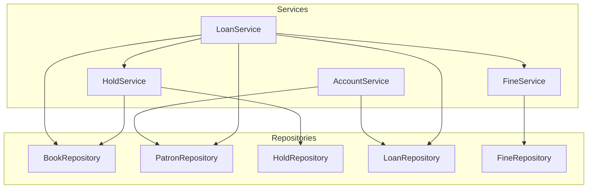
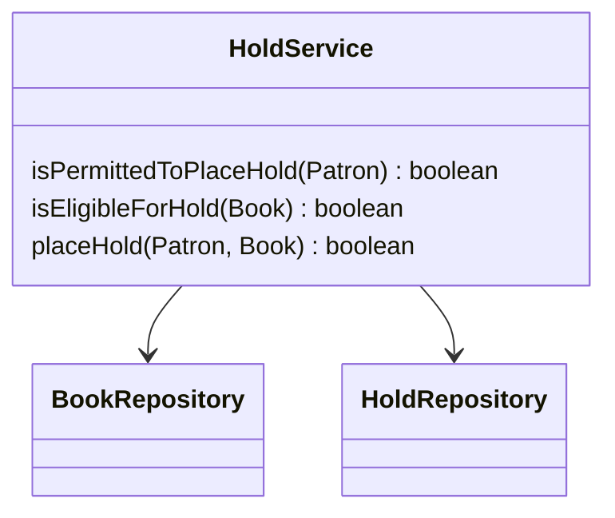
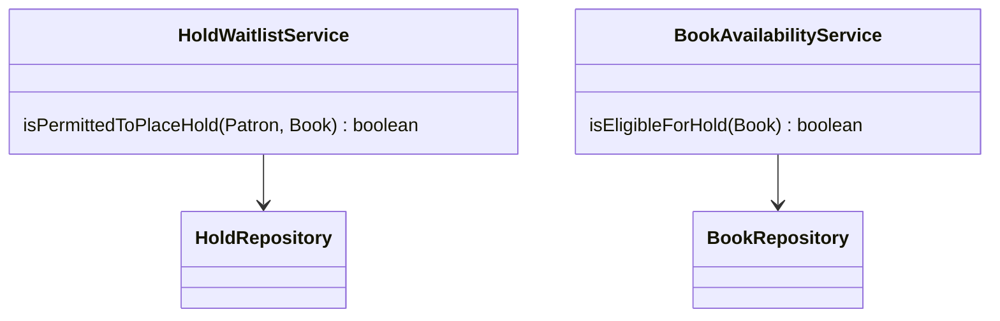
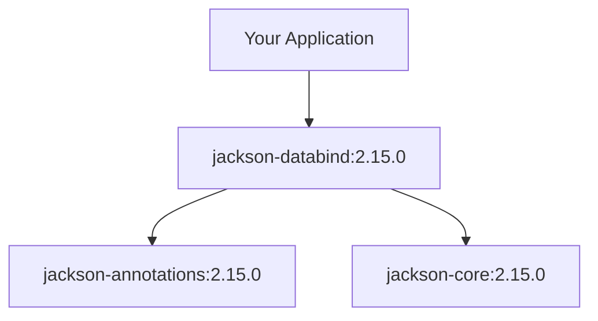
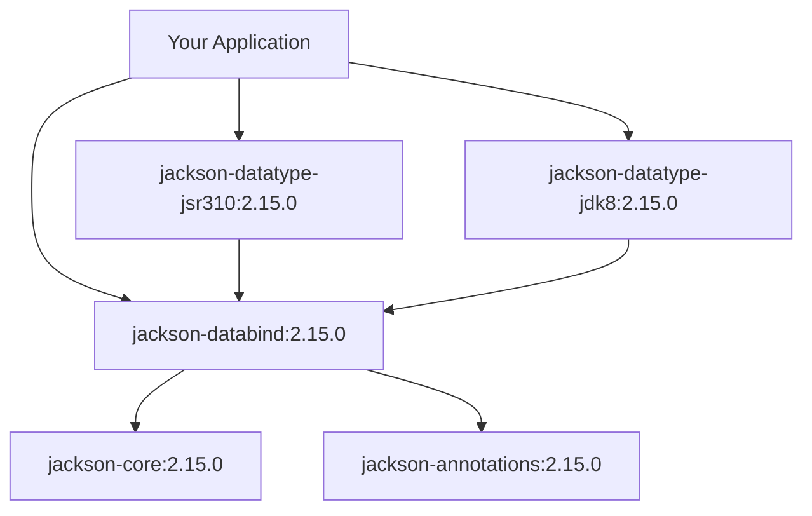
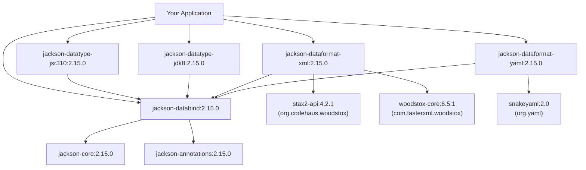

import RevealJS, { Slide } from '@site/src/components/RevealJS';
import Img from '@site/src/components/Img';
import PollSlide from '@site/src/components/PollSlide';

<RevealJS transition="slide">

{/* ============================================ */}
{/* COVER IMAGE */}
{/* ============================================ */}

<Slide>
  

<aside className="notes">
**Lecture overview:**
- **Total time:** ~40 minutes
- **Prerequisites:** L17 (dependency injection), L18-L19 (architectural thinking)
- **Connects to:** L24 (security), future lectures on supply chain and teams

**Structure:**
- Component Reuse & OSS Ecosystems (~15 min)
- Licensing: Copyleft vs. Permissive (~10 min)
- Evaluating Dependencies (~15 min)

**Key theme:** Modern software is built on open source foundations. Understanding how to evaluate, adopt, and manage dependencies is a critical professional skill.

→ **Transition:** Let's start with the title...
</aside>

</Slide>

{/* ============================================ */}
{/* TITLE SLIDE */}
{/* ============================================ */}

<Slide>

# CS 3100: Program Design and Implementation II

## Lecture 23: Open Source Frameworks

<p style={{marginTop: '2em', fontSize: '0.8em', color: '#666'}}>
  ©2026 Jonathan Bell & Ellen Spertus, CC-BY-SA
</p>

<aside className="notes">
**Context:**
- We've been building systems with components wired together (L17-L19)
- Today: where do those components come from? How do we evaluate them?
- Running theme: modern software is not written from scratch

**Key message:** "Your code depends on thousands of developers you've never met. Today we learn how to be a responsible participant in that ecosystem."

→ **Transition:** Here's what you'll be able to do after today...
</aside>

</Slide>

{/* ============================================ */}
{/* ARC 0: Getting Started with Assignment 5 */}
{/* ============================================ */}

<Slide>

## Poll: Have you had a chance to look at Assignment 5?

<PollSlide username='espertus'
  choices={[
    'Not yet',
    "I've glanced at it",
    "I started reading it but didn't finish",
    "I read it all but haven't started working",
    'I read it and have started working',
  ]}
/>

</Slide>

<Slide>

## Introducing A5: Designing Services for Your Team (Individual Assignment)

<div style={{ fontSize: '.7em' }}>
A4's <code>RecipeService</code> bundled everything into one interface—scaling, conversion, import, search.
That was intentionally problematic. <strong>A5 asks you to fix it</strong> by designing services aligned
with <strong>actors</strong>:

<div style={{fontSize: '0.7em', marginTop: '0.5em'}}>

| Actor | A5 Service Responsibility | Group Project GUI Component |
|-------|---------------------------|-------------------------|
| **Librarian** | Collections, import, search | Library View, Import Interface, Search |
| **Cook** | Step-by-step navigation | Recipe Details/Editor |
| **Planner** | Shopping lists, scaling, export | (Feature Buffet options) |

</div>

<div className='fragment'>
You are required to use the first service boundary heuristic and at least one of the other heuristics:

1. **Actor**: Things used by different actors should be separate.
2. **Rate of Change**: Things that change at different speeds should be separate.
3. **Interface Segregation**: Clients that need different things should get different interfaces.
4. **Testability**: Things that need independent testing should be separable.
</div>
</div>

<aside className="notes">
- A4's `RecipeService` was a giant interface that did too much
- Problem: tight coupling, hard to test in isolation
- A5 asks: "Now that you see why that's bad, design something better"
- A good division will help with the team project...
</aside>

</Slide>

<Slide>

## In-Class Exercise: LibTrack
<div style={{ fontSize: '.8em' }}>
Read [Assignment 5 Prep Exercise](https://neu-pdi.github.io/cs3100-public-resources/lecture-slides-spertus/l23-exercise).

Begin thinking about and discussing how many services there should be for **patron**.
Consider:
* rate of change
* interface segregation principle
* testability

</div>
<aside className="notes">

</aside>

</Slide>

<Slide>

## Consider Repositories Used and Rate of Change

<div style={{ fontSize: '.8em' }}>

| Command | Description | Repositories |
|---|---|---|
| `hold <book>` 🏎️ | Place a hold on a book for the current patron | `BookRepository`, `HoldRepository` |
| `holds` | List the current patron's active holds | `BookRepository`, `HoldRepository` |
| `history`🐢 | Show the current patron's borrowing history | `LoanRepository`, `BookRepository` |
| `my account` 🐢 | Show the current patron's account details and borrowing status | `LoanRepository`, `BookRepository` |
| `my fines` 🏎️ | Show all outstanding fines for the current patron | `FineRepository` |
| `pay fine <fine>` 🏎️ | Pay an outstanding fine | `FineRepository` |

Tip: Have AI generate the table for you.
</div>
<aside className="notes">

</aside>

</Slide>

<Slide>

## What's the difference between ISP and Actor?
<div style={{ fontSize: '.7em' }}>
<div className='fragment'>
The Actor heuristic says to split things used by different actors.

Interface Segregation says to split things used by different clients.

What's the difference between an Actor and a client?
</div>
<div className='fragment'>
Different clients used by a single Actor (Patron or Librarian) could be:
* the Holds screen vs. the Fines screen
* a mobile app vs. a web app
</div>
</div>

<aside className="notes">

</aside>

</Slide>

<Slide>

## One Possible Patron Service Layer

<div style={{ fontSize: '.7em' }}>
Note: This diagram does not separate interfaces from implementations.
</div>

<aside className="notes">

</aside>

</Slide>

<Slide>

## Where does testability fit in?

<div style={{ fontSize: '.6em' }}>
The single `HoldService` requires mocking two classes to test `isPermittedToPlaceHold()`.
</div>

<div style={{display: 'flex', gap: '2rem'}}>
<div style={{flex: 1}}>



</div>
<div className='fragment' style={{flex: 2, borderLeft: '2px solid #888', paddingLeft: '2rem'}}>


</div>
</div>

<div className='fragment' style={{ textAlign: 'right', fontSize: '.6em' }}>
A separate `HoldWaitlistService` requires mocking only one class to test
`isPermittedToPlaceHold()`.

(We'd have to add a facade to call the two services.)
</div>

<aside className="notes">
→ Now let's star the ADR...
</aside>

</Slide>

<Slide>

## ADR-001: Patron Service Boundaries
<div style={{ fontSize: '.8em' }}>
<div className='fragment'>
**Context**: The client used by the Patron needs to be able to make requests of
a service layer that applies business logic to repositories. We were
constrained to prioritize the Actor service boundary heuristic.
</div>
<div className='fragment'>
**Decision**: We will have these separate service interfaces supporting these commands:
* `HoldService`
  * `hold book`
  * `holds`
[remainder omitted]

We separated `HoldService` from other services, such as `AccountService` because of the former's greater rate of change.
</div>

<div className='fragment'>
**Consequences**:
* ✅ Decoupling: Changes to hold policy affect only `HoldService` and its implementations,
not other services, such as `AccountService`.
* ⚠️ Testability: We need to mock `BookRepository` to test the method `isPermittedToPlaceHold()`,
even though that method does not reference `BookRepository`.
</div>
</div>
<aside className="notes">

</aside>

</Slide>

<Slide>
## Poll: Was the exercise helpful?

<PollSlide username='espertus'
  choices={["Yes, I now understand what to do", "Somewhat", "I'm still lost", "I understood what to do already"]}
/>
</Slide>

{/* ============================================ */}
{/* LEARNING OBJECTIVES */}
{/* ============================================ */}

<Slide>

## Learning Objectives

<p style={{fontSize: '0.85em', textAlign: 'left'}}>
After this lecture, you will be able to:
</p>

<ol style={{fontSize: '0.75em', textAlign: 'left'}}>
  <li>Explain how <strong>component reuse</strong> simplifies software development and the role of OSS ecosystems in distributing reusable components</li>
  <li>Describe the role and impact of <strong>copyleft licenses</strong> on OSS</li>
  <li>Describe <strong>tradeoffs</strong> that should be considered when adopting a library or framework</li>
  <li>Evaluate a dependency's <strong>community health</strong>, governance model, and long-term viability</li>
</ol>

<aside className="notes">
**Time allocation:**
- Objective 1: Component Reuse (~15 min)
- Objective 2: Licensing (~10 min)
- Objectives 3-4: Evaluating Dependencies (~15 min)

**Connection to prior lectures:**
- L17: We injected dependencies — but where do they come from?
- L18-19: We drew service boundaries — but many components are open source libraries

→ **Transition:** Let's start with a simple example...
</aside>

</Slide>

{/* ============================================ */}
{/* ARC 1: COMPONENT REUSE AND OSS ECOSYSTEMS */}
{/* ============================================ */}

<Slide>

## One Line of Code...

<p style={{fontSize: '0.85em'}}>
Modern software is not written from scratch. Consider adding JSON support to your project:
</p>

<div style={{fontSize: '0.7em', marginTop: '1em'}}>

```gradle
// build.gradle
dependencies {
    implementation 'com.fasterxml.jackson.core:jackson-databind:2.15.0'
}
```

</div>

<div className="fragment" style={{marginTop: '1.5em'}}>



</div>

<div className="fragment">
<p style={{fontSize: '0.82em', marginTop: '1em', color: '#9370DB'}}>
Three JARs for one "dependency." But this is just the beginning...
</p>
</div>

<aside className="notes">

- One line in build.gradle brings in Jackson
- Run `gradle dependencies` and you see the tree
- Three JARs for one "dependency"
- But that's just the beginning...

→ What if we want the full Jackson ecosystem?
</aside>

</Slide>

<Slide>

## ...But Real Apps Need More

<p style={{fontSize: '0.85em'}}>
Most apps need Java 8 date/time support and <code>Optional</code> handling. Add two more modules:
</p>

<div style={{fontSize: '0.55em', marginTop: '0.5em'}}>



</div>

<div className="fragment">
<p style={{fontSize: '0.78em', marginTop: '0.5em'}}>
Notice the <strong>diamond dependencies</strong> — multiple paths to jackson-databind. Maven/Gradle resolves these, but version conflicts can cause subtle bugs.
</p>
</div>

<aside className="notes">
**The diamond problem:**
- If jackson-datatype-jsr310 wants databind 2.14.0 but you specified 2.15.0...
- Build tool picks one (usually newest), but this doesn't always work...
</aside>

</Slide>

<Slide>

## Dependency Hell


<aside className="notes">
- "It worked on my machine" often traces back to dependency version differences

→ What if you need XML and YAML support too?
</aside>


</Slide>

<Slide>

## Third-Party Dependencies Appear

<p style={{fontSize: '0.85em'}}>
Add XML and YAML format support — now <strong>third-party libraries</strong> enter the picture:
</p>

<div style={{fontSize: '0.48em', marginTop: '0.5em'}}>



</div>

<div className="fragment">
<p style={{fontSize: '0.75em', marginTop: '0.5em', color: '#FF9800'}}>
<strong>Three different organizations</strong> now contribute to your project: FasterXML (Jackson), Codehaus (Stax2), and org.yaml (SnakeYAML).
</p>
</div>

<aside className="notes">
**The third-party explosion:**
- Jackson XML support needs a Stax XML parser
- Woodstox is a popular Stax implementation — maintained by FasterXML but separate project
- stax2-api is from Codehaus — a DIFFERENT organization
- SnakeYAML is from org.yaml — yet another organization

**Real output from `mvn dependency:tree`:**
```
jackson-dataformat-xml:2.15.0
├── stax2-api:4.2.1 (org.codehaus.woodstox)
└── woodstox-core:6.5.1 (com.fasterxml.woodstox)
jackson-dataformat-yaml:2.15.0
└── snakeyaml:2.0 (org.yaml)
```

→ **Transition:** Let's count what we've accumulated...
</aside>

</Slide>

<Slide>

## Thousands of Shoulders

<p style={{fontSize: '0.85em'}}>
Five lines in your build file. <strong>Ten JAR files</strong> from <strong>four organizations</strong>.
</p>

<div style={{fontSize: '0.58em', marginTop: '0.75em', padding: '0.75em', backgroundColor: 'rgba(147, 112, 219, 0.1)', borderRadius: '8px'}}>

```
$ mvn dependency:tree
com.example:jackson-deps:jar:1.0-SNAPSHOT
├── jackson-databind:2.15.0
│   ├── jackson-annotations:2.15.0
│   └── jackson-core:2.15.0
├── jackson-datatype-jsr310:2.15.0
├── jackson-datatype-jdk8:2.15.0
├── jackson-dataformat-xml:2.15.0
│   ├── stax2-api:4.2.1           ← org.codehaus.woodstox
│   └── woodstox-core:6.5.1       ← com.fasterxml.woodstox
└── jackson-dataformat-yaml:2.15.0
    └── snakeyaml:2.0             ← org.yaml
```

</div>

<div style={{display: 'grid', gridTemplateColumns: '1fr 1fr', gap: '1em', marginTop: '0em', fontSize: '0.7em'}}>

<div style={{padding: '0.5em', border: '2px solid #4CAF50', borderRadius: '4px'}}>

**What you wrote:**
- 5 dependency declarations
- ~20 lines of Java

</div>

<div style={{padding: '0.5em', border: '2px solid #9370DB', borderRadius: '4px'}}>

**What you're running:**
- 10 JAR files
- 4 different organizations
- Dozens of maintainers

</div>

</div>

<div className="fragment">
<p style={{fontSize: '0.7em', marginTop: '1em', fontWeight: 'bold', color: '#FF9800'}}>
Your JSON/XML/YAML handling stands on the shoulders of developers you've never met, at organizations you may not have heard of.
</p>
</div>

<aside className="notes">
**The numbers are real:**
- Run `mvn dependency:tree` on any Java project
- You'll see transitive dependencies from organizations you've never heard of
- Each one maintained by someone, somewhere

**The key insight:**
- You didn't write any of this code
- You're trusting maintainers at four different organizations
- SnakeYAML is maintained by ONE person (Andrey Somov)
- What happens if he stops maintaining it?

**Bridge to next section:**
- Who ARE these developers?
- Why do they give away their code?
- This leads us to the economics of open source...

→ **Transition:** This leads to a key insight about infrastructure...
</aside>

</Slide>

<Slide>

## Infrastructure Code Gravitates Toward Open Source

<p style={{fontSize: '0.85em'}}>
Your competitive advantage isn't your JSON parser — it's your recommendation algorithm, your UX, your content.
</p>

<div style={{fontSize: '0.7em', marginTop: '1em'}}>

| Layer | Examples | Who Builds It |
|-------|----------|---------------|
| **Differentiation** | Recommendation algorithms, UX, business logic | You (proprietary) |
| **Infrastructure** | JSON parsing, web servers, encryption, databases | Industry (open source) |

</div>

<div className="fragment" style={{marginTop: '1em'}}>
<p style={{fontSize: '0.8em'}}>
Why would Netflix, Spotify, and Airbnb each employ engineers to independently build the same JSON parser? It makes far more sense to:
</p>
<ol style={{fontSize: '0.7em'}}>
  <li>Share the cost of development across the industry</li>
  <li>Benefit from bug fixes and security patches contributed by everyone</li>
  <li>Focus proprietary effort on what actually differentiates your product</li>
</ol>
</div>

<aside className="notes">
**The economic argument:**
- Infrastructure is a shared problem with a shared solution
- IBM committed over $1 billion to Linux development
- Microsoft — once calling Linux "communism" — now runs it across Azure and acquired GitHub

**Companies contribute to open source because it's cheaper than going it alone.**

**Historical note (if time):**
- The 1956 AT&T consent decree prevented them from selling Unix
- Bell Labs shared it freely with researchers — accidental open source!

→ **Transition:** This collaborative model has a name...
</aside>

</Slide>

<Slide>

## The Cathedral and the Bazaar


<aside className="notes">
**Eric S. Raymond's 1997 essay:**
- **Cathedral:** Small group works in isolation, polished releases infrequently. Traditional proprietary software.
- **Bazaar:** Development in the open, frequent releases, users as co-developers, democratic governance.

**The bazaar model powers most successful OSS today:**
- Release early and often to get feedback
- Treat users as co-developers
- Modularize and reuse components

**GitHub is the modern bazaar:**
- Developer in Tokyo publishes Monday
- By Friday: teams in São Paulo, Berlin, Boston are using it, filing issues, submitting PRs
- This global collaboration was unimaginable when software shipped on CDs

→ **Transition:** And this model won...
</aside>

</Slide>

<Slide>

## Eric Raymond on the Cathedral and the Bazaar


https://youtu.be/69ZyX5sN2NA?si=htuNoh9toixDxim8&t=106
<aside className="notes">
- play until end (about 1:20)
</aside>

</Slide>

<Slide>

## The Ecosystem: Package Registries

<p style={{fontSize: '0.85em'}}>
Open source ecosystems depend on <strong>package registries</strong> to distribute reusable components:
</p>

<div style={{fontSize: '0.7em', marginTop: '1em'}}>

| Registry | Ecosystem | Examples |
|----------|-----------|----------|
| **Maven Central** | Java/JVM | JUnit, Spring, Jackson |
| **npm** | JavaScript | React, Express, lodash |
| **PyPI** | Python | pandas, tensorflow, requests |
| **crates.io** | Rust | serde, tokio |
| **NuGet** | .NET | Newtonsoft.Json, Entity Framework |

</div>

<div className="fragment">
<p style={{fontSize: '0.82em', marginTop: '1em', color: '#9370DB'}}>
These registries make it trivial to declare a dependency and have it automatically downloaded — along with all of its transitive dependencies.
</p>
</div>

<aside className="notes">
**Each ecosystem has its registry:**
- Maven Central for Java — you've been using this with Gradle
- npm for JavaScript — 2+ million packages
- PyPI for Python — the `pip install` command

**The magic:**
- Declare what you need
- Build tool downloads it automatically
- Transitive dependencies resolved for you

→ **Transition:** But libraries evolve. How do we know if an update will break our code?
</aside>

</Slide>

<Slide>

## Semantic Versioning Encodes Promises

<p style={{fontSize: '0.85em'}}>
Libraries evolve. <strong>Semantic Versioning</strong> (SemVer) encodes compatibility promises in version numbers:
</p>

<div style={{fontSize: '0.8em', textAlign: 'center', marginTop: '1em', padding: '0.75em', backgroundColor: 'rgba(147, 112, 219, 0.1)', borderRadius: '8px'}}>

**MAJOR . MINOR . PATCH**

**2 . 15 . 0**

</div>

<div style={{fontSize: '0.72em', marginTop: '1em'}}>

| Change | Example | Meaning | Safe to Update? |
|--------|---------|---------|-----------------|
| **PATCH** | 2.15.0 → 2.15.1 | Bug fixes only | ✅ Yes |
| **MINOR** | 2.15.0 → 2.16.0 | New features, backwards compatible | ✅ Usually |
| **MAJOR** | 2.15.0 → 3.0.0 | Breaking changes | ⚠️ Review needed |

</div>

<div className="fragment" style={{fontSize: '0.65em', marginTop: '1em'}}>

```gradle
// Exact version — reproducible but requires manual updates
implementation 'com.fasterxml.jackson.core:jackson-databind:2.15.0'

// Any 2.x version — automatic patches but risk of breakage
implementation 'com.fasterxml.jackson.core:jackson-databind:2.+'
```

</div>

<aside className="notes">
**The tradeoff:**
- Strict versions: reproducible builds, but you must manually update
- Flexible ranges: automatic security patches, but risk unexpected breakage

**Real-world complications:**
- Not everyone follows SemVer perfectly
- "Breaking change" is sometimes subjective
- Hyrum's Law: "With sufficient users, every observable behavior becomes a dependency"

→ **Transition:** This ecosystem brings enormous benefits — and risks...
</aside>

</Slide>

<Slide>

## The Double-Edged Sword of Dependency

<div style={{display: 'grid', gridTemplateColumns: '1fr 1fr', gap: '1.5em', marginTop: '1em', fontSize: '0.75em'}}>

<div style={{padding: '1em', border: '2px solid #4CAF50', borderRadius: '8px'}}>

**Benefits**

- **Speed:** Don't reinvent the wheel; use battle-tested solutions
- **Quality:** Popular libraries debugged by millions of users
- **Security:** Vulnerabilities found and patched quickly (when maintained)

</div>

<div style={{padding: '1em', border: '2px solid #FF9800', borderRadius: '8px'}}>

**Risks**

- **Supply chain attacks:** Compromised dependency compromises your app
- **Abandonment:** What happens when a maintainer stops updating?
- **License compatibility:** Can you legally use this code?

</div>

</div>

<div className="fragment">
<p style={{fontSize: '0.85em', marginTop: '1.5em', fontWeight: 'bold', color: '#9370DB'}}>
We'll explore the risks — licensing and evaluation — in the rest of this lecture.
</p>
</div>

<aside className="notes">
**The benefits are real:**
- Jackson is better than anything you'd write for JSON
- Spring Security is better than rolling your own auth
- TensorFlow is better than implementing neural nets from scratch

**But the risks are real too:**
- left-pad: 11-line npm package deleted, broke thousands of builds
- Log4Shell: critical vulnerability in ubiquitous logging library
- License surprises: GPL code in your proprietary product

**These risks are manageable — if you're aware of them.**

→ **Transition:** Let's start with licensing...
</aside>

</Slide>

{/* ============================================ */}
{/* ARC 2: LICENSING */}
{/* ============================================ */}

<Slide>

## Every Line of Code Is Copyrighted by Default

<p style={{fontSize: '0.85em'}}>
To understand open source licensing, we first need to understand <strong>copyright</strong>.
</p>

<div style={{fontSize: '0.75em', marginTop: '1em'}}>

**Copyright** is automatic. The moment you write code, you own exclusive rights to:
- **Copy** the work
- **Modify** it (create "derivative works")
- **Distribute** copies to others
- **Display** or perform it publicly

</div>

<div className="fragment" style={{marginTop: '1em', padding: '0.75em', border: '2px solid #FF9800', borderRadius: '8px', fontSize: '0.8em'}}>

**Key insight:** A GitHub repo with no `LICENSE` file means "all rights reserved."

You legally **cannot** use it — even if the author clearly intended to share it.

</div>

<aside className="notes">
**Copyright is the foundation:**
- You don't need to register — it's automatic
- Without explicit permission, the default is "you can't use this"
- This is why licenses exist: to grant specific permissions

**Common misconception:**
- "It's on GitHub, so I can use it" — NO!
- "The author meant to share it" — doesn't matter legally
- Always check for a LICENSE file

→ **Transition:** Licenses grant permissions — but with different conditions...
</aside>

</Slide>

<Slide>

## From BSD to GPL: A Values Fork

<p style={{fontSize: '0.85em'}}>
The two licensing philosophies grew from the <strong>same code lineage</strong> — but diverged on a fundamental question about freedom.
</p>

<div style={{fontSize: '0.75em', marginTop: '0em'}}>

| Year | Event | Philosophy |
|------|-------|------------|
| **1969** | Bell Labs shares Unix freely (AT&T consent decree prevents selling it) | Accidental openness |
| **1977** | Berkeley builds on Unix, creates BSD license: "Do whatever you want, just credit us" | **Maximum individual freedom** |
| **1983** | Stallman sees companies closing BSD-derived source code. Launches GNU and GPL: "Share alike, forever" | **Protect the commons** |

</div>

<div className="fragment" style={{marginTop: '0em', fontSize: '0.75em'}}>

**Both philosophies shaped the modern world:**

| BSD lineage (permissive) | GPL lineage (copyleft) |
|--------------------------|------------------------|
| FreeBSD → **macOS, iOS** | GNU/Linux → **Android, Cloud** |
| Companies took the code and closed it — *as intended* | Companies must share kernel changes — *as intended* |

</div>

<div className="fragment" style={{marginTop: '0.5em', padding: '0.5em', border: '2px solid #9370DB', borderRadius: '8px', fontSize: '0.78em'}}>

**The irony:** BSD's freedom *enabled* companies to close the source — which is exactly what motivated Stallman to create a license that *prevented* it. Same code heritage, fundamentally different values.

</div>

<aside className="notes">
**The historical arc:**
- Unix was shared freely because AT&T legally couldn't sell it (1956 DOJ antitrust consent decree)
- Berkeley researchers built on it, created BSD — their license reflected academic culture: share freely, credit the university
- Companies took BSD code, made proprietary products, and never shared back
- Stallman saw this and said: "This defeats the purpose. If code can be closed, the commons erodes."
- GPL was his answer: you can use it, but you must share your modifications

**The naming is intentional:** GNU = "GNU's Not Unix!" — Stallman's explicit break from Unix's model

**Bridge to next slide:** Both philosophies produced enormously successful projects. Let's see what they look like in practice...

→ **Transition:** These two philosophies still shape every licensing decision today...
</aside>

</Slide>

<Slide>

## Two Philosophies: Maximize Adoption vs. Protect the Commons


<aside className="notes">
**The BSD/MIT philosophy:**
- Maximum freedom for individual users
- Even the freedom to close the source
- "Do whatever you want, just don't blame us"

**The GPL philosophy (Stallman, 1983):**
- Software should be "free as in speech, not as in beer"
- Four freedoms: run, study, redistribute, distribute modified versions
- Copyleft: if you distribute, you must share your source too

**The key insight:**
- This is a VALUES choice embedded in code
- When you choose a license — or adopt a dependency — you're making a statement
- Neither is objectively "correct"

→ **Transition:** Let's see the practical differences...
</aside>

</Slide>

<Slide>

## Permissive vs. Copyleft: Quick Reference

<div style={{fontSize: '0.75em', marginTop: '1em'}}>

| Question | Permissive (MIT, Apache, BSD) | Copyleft (GPL, LGPL, AGPL) |
|----------|-------------------------------|----------------------------|
| **Can I use it in proprietary software?** | Yes | Usually requires open-sourcing your code |
| **Must I share my modifications?** | No | Yes, if you distribute |
| **Philosophy** | Maximize adoption | Protect the commons |
| **Popular examples** | React, Jackson, Spring | Linux kernel, GCC, WordPress |

</div>

<div className="fragment" style={{marginTop: '1.5em'}}>
<p style={{fontSize: '0.8em'}}>
<strong>Most popular libraries use permissive licenses:</strong> React (MIT), Jackson (Apache 2.0), Spring (Apache 2.0), TensorFlow (Apache 2.0)
</p>
<p style={{fontSize: '0.8em', marginTop: '0.5em'}}>
<strong>GPL powers critical infrastructure:</strong> Linux kernel, many Linux utilities (maintained by GNU), forces community participation
</p>
</div>

<aside className="notes">
**Why permissive licenses dominate libraries:**
- Companies can adopt without legal review
- Startups can use without worrying about open-sourcing
- Maximizes adoption → maximizes maintainers

**Why GPL for operating systems:**
- Ensures the commons stays open
- Companies CAN'T embrace-extend-extinguish
- Linux wouldn't be what it is without GPL protection

**The SaaS loophole:**
- GPL requires sharing if you DISTRIBUTE
- Running software as a service isn't "distribution"
- This is why MongoDB moved to SSPL — to close that loophole

→ **Transition:** Practical guidance...
</aside>

</Slide>

<Slide>

## Eric Raymond on Open Source and Free Software


https://youtu.be/69ZyX5sN2NA?si=htuNoh9toixDxim8

<div style={{ fontSize: '.6em' }}>
Image CC BY-SA 2.0 [Bilby](https://commons.wikimedia.org/wiki/File:Eric_S_Raymond_portrait.jpg), [jerone2](https://commons.wikimedia.org/wiki/File:Erc_S_Raymond_and_company.jpg)
</div>

<aside className="notes">
- 1:40 until start of previous slide
</aside>

</Slide>

<Slide>

## Richard Stallman (RMS) on Open Source and Free Software


https://youtu.be/Ag1AKIl_2GM?si=21E_IZFYRm_flMBY&t=525
<div style={{ fontSize: '.5em' }}>
Image: 'Open Source', xkcd.com/225, Randall Munroe, CC BY-NC 2.5
</div>

<aside className="notes">
- Play until "So say, 'free software,' and you're helping us every time"
- about a minute
</aside>

</Slide>

<Slide>

## Practical Licensing Guidance

<p style={{fontSize: '0.85em'}}>
For most developers using open source libraries:
</p>

<ol style={{fontSize: '0.78em', marginTop: '1em'}}>
  <li><strong>Check the license</strong> before adding a dependency. It's usually in a <code>LICENSE</code> file or package metadata.</li>
  <li><strong>Permissive licenses are low-risk</strong> for most commercial projects.</li>
  <li><strong>GPL requires careful attention</strong> if you're building proprietary software — consult your legal team.</li>
</ol>


<aside className="notes">
**The philosophical debate continues:**
- Should open source FORCE participation in the commons?
- Or ENCOURAGE it through permissive terms?
- No single right answer — both have produced wildly successful projects

**Modern complications:**
- SaaS loophole: Amazon runs MongoDB without sharing code
- Companies changing licenses mid-stream (we'll discuss this)
- "Source available" vs "open source" distinction

→ **Transition:** Some projects get creative with licenses...
</aside>

</Slide>

<Slide>

## Licenses as Values: The Unusual Cases

<div style={{position: 'relative', width: '100%'}}>
  
  {/* Mask over middle + right panels + callout — fades out to reveal middle panel */}
  <div className="fragment fade-out" data-fragment-index="1" style={{position: 'absolute', top: 0, left: '31%', width: '70%', height: '85%', backgroundColor: 'white', zIndex: 2}} />
  {/* Mask over right panel + callout — fades out to reveal right panel and callout together */}
  <div className="fragment fade-out" data-fragment-index="2" style={{position: 'absolute', top: 0, left: '63%', width: '37%', height: '100%', backgroundColor: 'white', zIndex: 1}} />
  {/* Mask over bottom callout under left + middle panels — fades out with right panel */}
  <div className="fragment fade-out" data-fragment-index="2" style={{position: 'absolute', bottom: 0, left: 0, width: '63%', height: '15%', backgroundColor: 'white', zIndex: 3}} />
</div>

<aside className="notes">
**These edge cases reveal:**
- Licensing is never purely technical
- It's always about what kind of world you want to build

**The IBM story is real:**
- Crockford confirmed it in a talk
- "I give permission to IBM, its customers, partners, and minions to use JSLint for evil"

**The SSPL controversy:**
- MongoDB moved from AGPL to SSPL
- SSPL: if you offer the software as a service, open-source your ENTIRE stack, including any related tools or infrastructure that you use to MANAGE that software-as-a-service operation!
- OSI says this isn't "open source" — it's "source available"

→ **Transition:** Now let's talk about evaluating dependencies...
</aside>

</Slide>

{/* ============================================ */}
{/* ARC 3: EVALUATING DEPENDENCIES */}
{/* ============================================ */}

<Slide>

## Every Dependency Is a Commitment

<p style={{fontSize: '0.85em'}}>
Adding a dependency is easy — one line in <code>build.gradle</code>. But every dependency is a commitment.
</p>

<div style={{fontSize: '0.78em', marginTop: '1em'}}>

Before adopting a library or framework, ask yourself:

- **Who maintains this, and will they still be maintaining it in two years?**
- **What happens if I need to switch away from it later?**
- **Am I comfortable with the license terms?**
- **How much will this shape the rest of my code?**

</div>

<div className="fragment" style={{marginTop: '1em', padding: '0.75em', border: '2px solid #FF9800', borderRadius: '8px', fontSize: '0.78em'}}>

**The last question matters most:** A utility library for string formatting has minimal impact — swap it out easily. A web framework influences your entire application structure. Migrating away could mean a rewrite.

</div>

<aside className="notes">
**The commitment you're making:**
- Trusting someone else's code to work correctly
- Trusting them to maintain it
- Trusting them not to introduce vulnerabilities
- Trusting them to keep the license stable

**Library vs. Framework:**
- Library: you call it (Jackson, lodash)
- Framework: it calls you (Spring, React, Rails)
- Frameworks are much harder to switch away from

→ **Transition:** The most important factor in evaluation...
</aside>

</Slide>

<Slide>

## Community Health: The Most Important Factor

<p style={{fontSize: '0.85em'}}>
Before adopting a library, investigate who's behind it and how active they are:
</p>

<div style={{fontSize: '0.72em', marginTop: '1em'}}>

| Indicator | What to Look For | Red Flags |
|-----------|------------------|-----------|
| **Recent activity** | Last commit? Last release? | No updates in 2+ years |
| **Issue responsiveness** | Are bugs acknowledged? PRs reviewed? | 500 ignored issues |
| **Bus factor** | How many core maintainers? | Single maintainer |
| **Documentation** | Up-to-date? Comprehensive? | Outdated or missing docs |

</div>

<div className="fragment" style={{marginTop: '1em', padding: '0.75em', backgroundColor: 'rgba(255, 152, 0, 0.1)', borderRadius: '8px', fontSize: '0.75em'}}>

**Sobering reality:** OpenSSL — securing most of the internet — was maintained by a handful of volunteers until the Heartbleed vulnerability exposed how underfunded critical infrastructure can be.

</div>

<aside className="notes">
**A library with no updates might be:**
- Stable and complete (rare)
- Abandoned (more common)

**The bus factor:**
- If one person maintains a critical library in their spare time...
- What happens when they burn out? Move on? Get hired by a company that doesn't allow OSS work?

**Heartbleed (2014):**
- Critical vulnerability in OpenSSL
- Affected ~17% of "secure" web servers
- Maintained by 2 people, one full-time
- Led to creation of Core Infrastructure Initiative

→ **Transition:** Different governance models have different risks...
</aside>

</Slide>

<Slide>

## Governance Models Shape Long-Term Risk

<div style={{fontSize: '0.7em', marginTop: '0.5em'}}>

| Model | Examples | Pros | Cons |
|-------|----------|------|------|
| **Corporate-backed** | Chromium (Google), React (Meta), TensorFlow (Google) | Well-funded, full-time devs | Priorities may shift; may change license |
| **Foundation-governed** | Apache projects, Linux Foundation, Python SF | Community governance, stable long-term | May move slower |
| **Community/Individual** | Many small libraries and utilities | Innovative, responsive | High abandonment risk; may lack security audits |

</div>

<div className="fragment" style={{marginTop: '1em'}}>
<p style={{fontSize: '0.8em', fontWeight: 'bold', color: '#FF9800'}}>
Watch out for license changes:
</p>
<ul style={{fontSize: '0.72em'}}>
  <li>MongoDB: AGPL → Server Side Public License (SSPL)</li>
  <li>HashiCorp: Terraform from MPL → Business Source License (BSL)</li>
  <li>Redis: BSD → dual-license with SSPL</li>
</ul>
</div>

<aside className="notes">
**Corporate-backed risks:**
- Google killed Google Reader, Stadia, etc. — they could deprioritize a project
- Meta could change React's license if business needs change
- Corporate priorities ≠ your priorities

**Foundation-governed advantages:**
- Apache, Linux Foundation have processes for succession
- No single company can make unilateral changes
- But: some "foundations" are just fronts for one company

**The license change pattern:**
- Company open-sources project to gain adoption
- Project becomes successful, competitors use it
- Company changes license to monetize
- Community must decide: accept or fork?

**The three cases in detail:**

1. **MongoDB (2018): AGPL → SSPL**
   - AGPL required sharing source if you distributed modifications
   - BUT cloud providers (AWS, etc.) ran MongoDB as-a-service without contributing back — the "SaaS loophole"
   - SSPL closes the loophole: if you offer it as a service, you must open-source your ENTIRE stack (management, orchestration, monitoring — everything)
   - Effectively blocks cloud providers from competing without paying MongoDB or open-sourcing their cloud infrastructure
   - OSI ruled SSPL is NOT open source — it's "source available"

2. **HashiCorp/Terraform (2023): MPL → BSL**
   - Terraform was Mozilla Public License — permissive, widely adopted
   - Cloud providers offered Terraform-compatible services, competing with HashiCorp's commercial offerings
   - BSL (Business Source License): you can VIEW the code, but can't use it to compete with HashiCorp
   - Community immediately forked as **OpenTofu** under Linux Foundation
   - This is the Terraform→OpenTofu fork we'll see on the next slide

3. **Redis (2024): BSD → dual SSPL**
   - Redis was BSD — one of the most permissive licenses
   - Same cloud provider concern: AWS ElastiCache, etc. competed without contributing
   - Changed to dual license: SSPL for new versions, or pay for commercial license
   - Led to fork: **Valkey** under Linux Foundation

**The pattern:** Open source to gain adoption → success attracts competitors → change license to capture value → community forks

→ **Transition:** When governance fails, communities fork...
</aside>

</Slide>

<Slide>

## When Governance Fails: The Fork

<div style={{fontSize: '0.7em', marginTop: '0.5em'}}>

| Original | Fork | What Happened |
|----------|------|---------------|
| **MySQL** | MariaDB | Oracle acquired Sun (2009). Community worried about stewardship. |
| **OpenOffice** | LibreOffice | Oracle fired developers (2010). Community forked. LibreOffice won. |
| **Terraform** | OpenTofu | HashiCorp changed to restrictive license (2023). Linux Foundation hosts the fork. |

</div>

<div className="fragment" style={{marginTop: '1em', padding: '0.75em', border: '2px solid #FF9800', borderRadius: '8px', fontSize: '0.8em'}}>

**The code can live on — but the disruption is painful for everyone.** Forks are possible because the source is open. The only thing original creators keep is the trademark.

</div>

<aside className="notes">
**A fork is possible because:**
- Source code is available under open license
- Anyone can take it and develop independently
- The only thing original creators keep: the trademark

**The OpenOffice story:**
- Sun open-sourced StarOffice as OpenOffice (1999)
- Oracle acquired Sun (2010), fired core developers
- Community forked as LibreOffice immediately
- Oracle donated remnants to Apache — too late, LibreOffice had won

**The lesson:**
- Governance matters more than code quality
- A project with healthy community governance is more resilient
- If governance fails, code can live on — but disruption is painful

→ **Transition:** Behind every dependency is a person...
</aside>

</Slide>

<Slide>

## The Human Side of Open Source

<p style={{fontSize: '0.85em'}}>
Behind every dependency in your <code>build.gradle</code> is a person — often unpaid, often alone.
</p>

<div style={{display: 'grid', gridTemplateColumns: '1fr 1fr', gap: '1.5em', marginTop: '1em', fontSize: '0.72em'}}>

<div style={{padding: '0.75em', border: '2px solid #FF9800', borderRadius: '8px'}}>

**The reality of OSS maintenance:**
- Most critical infrastructure runs on **volunteer labor**
- OpenSSL (secures the internet): 2 maintainers pre-Heartbleed
- Burnout is the #1 cause of project abandonment

</div>

<div style={{padding: '0.75em', border: '2px solid #9370DB', borderRadius: '8px'}}>

**L22's bus factor — at ecosystem scale:**
- Your team has 4 people. What if one leaves?
- SnakeYAML has **one** maintainer. What if *they* leave?
- The consequences ripple across thousands of projects
- This isn't a team problem — it's an industry problem

</div>

</div>

<div className="fragment" style={{marginTop: '1em', padding: '0.75em', backgroundColor: 'rgba(255, 152, 0, 0.1)', borderRadius: '8px', fontSize: '0.8em'}}>

**The paradox:** We trust billion-dollar systems to maintainers we've never met, often without paying them. The same HRT principles from L22 apply here — except the "team" is the entire open source community.

</div>

<aside className="notes">
**Connect to L22:**
- L22 introduced bus factor for your team (4 people)
- Today: bus factor for the ECOSYSTEM — one maintainer controls a library used by millions
- Same HRT principles apply, but the stakes are higher

**core-js story:**
- core-js provides JavaScript polyfills used by ~75% of top websites
- Maintained by one person, Denis Pushkarev
- He was imprisoned after a car accident — and the project nearly died
- Millions of websites depended on one person's freedom

**The xkcd 2347 problem:**
- "All modern digital infrastructure depends on a project some random person in Nebraska has been thanklessly maintaining since 2003"
- This isn't a joke — it's literally how the industry works

→ **Transition:** So what can we do about it?
</aside>

</Slide>

<Slide>

## A Well-Maintained Library Beats DIY for Security

<p style={{fontSize: '0.85em'}}>
Is it safer to use a popular library or write your own? <strong>Almost always use the library</strong> — if it's well-maintained.
</p>

<div style={{display: 'grid', gridTemplateColumns: '1fr 1fr', gap: '1.5em', marginTop: '1em', fontSize: '0.7em'}}>

<div style={{padding: '0.75em', border: '2px solid #4CAF50', borderRadius: '8px'}}>

**Why well-maintained libraries win:**
- Battle-tested by thousands of users
- Security researchers scrutinize popular projects
- Vulnerabilities get reported and patched
- You benefit from specialists' expertise

</div>

<div style={{padding: '0.75em', border: '2px solid #FF9800', borderRadius: '8px'}}>

**When dependencies introduce risk:**
- Every dependency is an attack surface
- Transitive dependencies multiply the risk
- Unmaintained dependencies don't get patches
- You're trusting code you've never read

</div>

</div>

<div className="fragment" style={{marginTop: '1em'}}>
<p style={{fontSize: '0.8em', color: '#9370DB'}}>
<strong>The key insight:</strong> You're unlikely to out-engineer the Jackson team at JSON parsing, or the Spring Security team at authentication. But you DO need to keep your dependencies updated.
</p>
</div>

<aside className="notes">
**The math:**
- Your implementation: tested by you, maybe your team
- Jackson: tested by millions of users, security researchers, enterprise customers
- Who's more likely to catch edge cases?

**But dependencies DO introduce risk:**
- Your app might include libraries you've never heard of (transitive deps)
- One compromised package can compromise everything downstream
- The left-pad incident, Log4Shell — these are real

→ **Transition:** Let's look at supply chain attacks...
</aside>

</Slide>

<Slide>

## Supply Chain Attacks: When Dependencies Become Vectors

<p style={{fontSize: '0.85em'}}>
An attacker compromises a package deep in the dependency tree. Your app pulls it in transitively — you never knew it existed. Now the attacker's code runs in your application.
</p>

<div style={{fontSize: '0.72em', marginTop: '1em'}}>

| Incident | What Happened | Impact |
|----------|---------------|--------|
| **left-pad (2016)** | Developer unpublished an 11-line npm package | Thousands of builds broke — Facebook, Spotify, others |
| **Log4Shell (2021)** | Critical remote code execution in Log4j | Millions of apps affected; months to remediate |

</div>

<div className="fragment" style={{marginTop: '1em', padding: '0.75em', border: '2px solid #FF9800', borderRadius: '8px', fontSize: '0.8em'}}>

**A chain is only as strong as its weakest link.** The risks compound when you adopt a library and never update it, the library is abandoned, or a malicious actor compromises it.

</div>

<aside className="notes">
**The supply chain attack model:**
- Attacker compromises a package deep in the dependency tree
- Your app pulls it in transitively — you never knew it existed
- Attacker's code now runs in your application

**left-pad (2016):**
- Developer unpublished an 11-line npm package
- Thousands of builds broke — including Facebook, Spotify
- Not malicious, but showed the fragility

**Log4Shell (2021):**
- Critical remote code execution in Log4j
- Log4j is EVERYWHERE — Java logging is ubiquitous
- Affected millions of applications worldwide
- Took months to fully remediate across the industry

**The risks come when:**
1. You adopt a library and never update it
2. The library is abandoned and stops receiving patches
3. A malicious actor compromises the library or its dependencies

→ **Transition:** So what can YOU do about this?
</aside>

</Slide>

<Slide>

## The Internet Was Weeks Away from Disaster and No One Knew (Veritasium)


https://www.youtube.com/watch?v=aoag03mSuXQ

<aside className="notes">
- Play from start to "So, how could we ever let ourselves get this vulnerable?"
First link: https://youtu.be/aoag03mSuXQ?si=yw_MPh60uOLTdAV7
- Play from 8:47 to "one that could give him access to almost every computer on the internet" (12:02)
Second link: https://youtu.be/aoag03mSuXQ?si=mkmCwU0NiEAxfCby&t=527
</aside>

</Slide>


<Slide>

## Being a Good OSS Citizen

<p style={{fontSize: '0.85em'}}>
You're not just a consumer of open source — you're a participant. L22's HRT principles apply to the global community, not just your team.
</p>

<div style={{display: 'grid', gridTemplateColumns: '1fr 1fr', gap: '1.5em', marginTop: '0em', fontSize: '0.72em'}}>

<div style={{padding: '0.75em', border: '2px solid #4CAF50', borderRadius: '8px'}}>

**Apply L22's practices to OSS:**
- **File good issues** — you learned this in L22. Same template: steps to reproduce, expected vs. actual, environment.
- **Look for "good first issue" labels** — many projects tag beginner-friendly tasks. This is your on-ramp.
- **Contribute docs**, not just code — the most impactful first contribution is often a typo fix or a clearer example
- **Respect maintainer time** — they owe you nothing. A polite, well-researched issue gets answered; "fix this!" gets ignored.

</div>

<div style={{padding: '0.75em', border: '2px solid #9370DB', borderRadius: '8px'}}>

**Apply L22's HRT:**
- **Humility:** You're new to their codebase. Ask before assuming.
- **Respect:** Read the CONTRIBUTING.md before submitting a PR. Follow their conventions, not yours.
- **Trust:** If a maintainer closes your issue, assume good faith. Ask why, don't demand.

</div>

</div>

<div className="fragment" style={{marginTop: '1em', padding: '0.75em', border: '2px solid #FF9800', borderRadius: '8px', fontSize: '0.8em'}}>

**Start now:** Every one of you uses open source daily. You can contribute today — report a bug, improve docs, answer a question on Stack Overflow. You don't need permission to participate in the bazaar.

</div>

<aside className="notes">
**The L22 connection:**
- L22 taught GitHub issues, PRs, code review, HRT — ALL of these apply to OSS participation
- The difference: your team has 4 people who know each other. An OSS project has strangers worldwide.
- Written communication matters even MORE here (L22's scalable knowledge sharing)

**Practical starting points for students:**
- Found a confusing error message? File an issue with context.
- Documentation wrong or unclear? Submit a PR fixing it.
- Answer questions in project discussions — you don't have to be an expert to help someone newer than you.

**The culture matters:**
- Some projects are welcoming (look for "good first issue" labels)
- Some are hostile — that's a signal about governance health (connects back to earlier slides)
- A project's community culture IS an evaluation criterion

→ **Transition:** Let's tie everything back to architecture...
</aside>

</Slide>

{/* ============================================ */}
{/* CLOSING - SYNTHESIS WITH ARCHITECTURE */}
{/* ============================================ */}

<Slide>

## Architectural Decisions About Dependencies

<p style={{fontSize: '0.85em'}}>
The same heuristics from L18 apply to dependency decisions:
</p>

<div style={{fontSize: '0.7em', marginTop: '1em'}}>

| L18 Heuristic | Applied to Dependencies |
|---------------|------------------------|
| **Rate of Change** | Does this library's release cadence match your needs? Will breaking changes disrupt you? |
| **Actor / Ownership** | Who maintains this? One person? A foundation? A company that might change the license? |
| **Interface Segregation** | Does the library do ONE thing well, or is it a bloated framework you'll never escape? |
| **Testability** | Can you mock/stub this dependency? Or does it couple you to infrastructure? |

</div>

<div className="fragment" style={{marginTop: '1em', padding: '0.75em', border: '2px solid #9370DB', borderRadius: '8px', fontSize: '0.8em'}}>

**The key insight:** Adopting a dependency is an architectural decision. It affects coupling, changeability, testability, and security — the same qualities we've been optimizing for all semester.

</div>

<aside className="notes">
**Apply the L18 heuristics:**

1. **Rate of Change:** Jackson releases every few months. Is that compatible with your release cycle? What if they make a breaking change right before your deadline?

2. **Actor:** SnakeYAML is maintained by ONE person. What's your plan if they stop? This is the "bus factor" — an architectural risk.

3. **ISP:** Jackson-databind does JSON well. Spring Boot does EVERYTHING — once you adopt it, you're coupled to their way of doing things. Library vs. framework is an architectural choice.

4. **Testability:** Can you test your code without the real Jackson? If ObjectMapper is injected (L17!), yes. If it's hardcoded, no.

**Final message:** Next time you type `implementation 'some:library:1.0'`, you're making an architectural decision. Evaluate it like one.
</aside>

</Slide>

<Slide>
## Bonus cartoon


</Slide>

</RevealJS>
