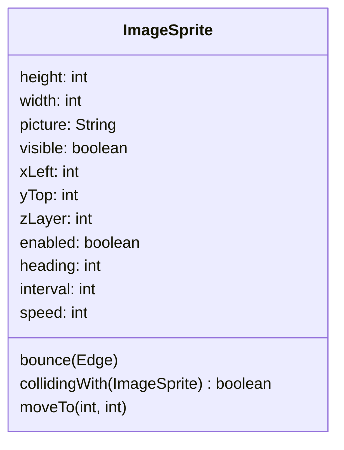

import RevealJS, { Slide } from '@site/src/components/RevealJS';
import Img from '@site/src/components/Img';
import PollSlide from '@site/src/components/PollSlide';
import useBaseUrl from '@docusaurus/useBaseUrl';

<RevealJS transition="slide">

{/* ============================================ */}
{/* BACKGROUND */}
{/* ============================================ */}

<Slide>

## App Inventor Team
  
<aside className="notes">
- Ellen was part of the App Inventor team at Google
- App Inventor is a block programming system for making Android apps.
- Tens of millions of people have used it.
</aside>

</Slide>

<Slide>

## Sprites


<aside className="notes">
- Ellen designed and implemented the sprite system.
- Sprites are 2D images used in video games.
- The moving game elements, such as cars, are sprites.
</aside>

</Slide>

<Slide>

## ImageSprite

<div style={{display: 'flex', gap: '2em', alignItems: 'center'}}>
<div style={{flex: 1}}>



</div>
<div style={{flex: 1}}>


</div>
</div>
<aside className="notes">
- Properties are shown in the class diagram.
- xLeft and yTop refer to the top-level corner of the image.
- Properties heading, interval, and speed have to do with movement
- Right side shows App Inventor method blocks
- Point out the moveTo() method
- (The mole diagram was created by Yun Miao when she was a Mills student. She now works at Google.)
</aside>

</Slide>

<Slide>

## Ball


<div style={{display: 'flex', gap: '2em', alignItems: 'center'}}>
<div style={{flex: 1}}>


</div>
<div style={{flex: 1}}>

<p style={{marginTop: '2em', fontSize: '0.8em'}}>
How would you implement `Ball`, which is also a type of sprite?

How should the type hierarchy be organized?

What code from `ImageSprite` can be reused?
</p>

</div>
</div>
<aside className="notes">
- Do think-pair-share with students.
- Ideally have them draw UML.
</aside>

</Slide>

<Slide>

## One Solution
```mermaid
classDiagram
    class Sprite {
        <<abstract>>
        height: int
        width: int
        visible: boolean
        xLeft: int
        yTop: int
        zLayer: int
        enabled: boolean
        heading: int
        interval: int
        speed: int
        bounce(Edge)
        moveTo(int, int)
        collidingWith(Sprite) boolean
    }
    class ImageSprite {
        picture: String
    }
    class Ball {
        radius: int
        color: Color
    }

    Sprite <|.. ImageSprite
    Sprite <|.. Ball
    ```


<aside className="notes">
- This was Ellen's solution.
- Almost all of ImageSprite was moved to a new abstract class Sprite.
- That made implementing `Ball` trivial.
- She considers it the worst mistake of her programming career.
</aside>
</Slide>

<Slide>

## The Overflow Article (part 1)


Source: [The Overflow (Stack Overflow Blog)](https://stackoverflow.blog/2019/10/29/my-most-embarrassing-mistakes-as-a-programmer-so-far/)

<aside className="notes">
- Ellen wrote an article for the Stack Overflow blog.
- She described her 3 most embarrassing mistakes.
- She considered this the worst.
</aside>

</Slide>

<Slide>
## A Reasonable Decision

<p style={{marginTop: '2em', fontSize: '0.8em'}}>
The main difference between a ball and an image sprite is what is drawn:
a filled-in circle or a bitmap. Since I implemented image sprites first,
it was natural to make the x- and y-coordinates specify the upper-left
corner of where the image was placed on the enclosing canvas.
</p>

<div style={{textAlign: 'center'}}>
  
  <p style={{marginTop: '.25em', fontSize: '0.7em'}}>
    <em>The image sprite's x- and y-coordinates specify its upper left corner. This is a reasonable design decision.</em>
  </p>
</div>
</Slide>

<Slide>
## A Terrible Decision

<p style={{marginTop: '2em', fontSize: '0.8em'}}>
Once I got sprites working, I realized that it would be simple to implement a
ball object with very little code. The problem was that I did so in the simplest
way (from the point of view of the implementer): having the x- and y-coordinates
specify the upper-left corner of the bounding box containing the ball.
</p>

<div style={{textAlign: 'center'}}>
  
  <p style={{marginTop: '.25em', fontSize: '0.7em'}}>
    <em>The ball’s x- and y-coordinates specify the upper left corner of its bounding box. This is a terrible design decision.</em>
  </p>
</div>
</Slide>

<Slide>
## The Right Decision

<p style={{marginTop: '2em', fontSize: '0.8em'}}>
What I should have done is have the x- and y-coordinates specify
the center of the circle, as is done in every single math book and
everywhere else circles are specified.
</p>

<div style={{textAlign: 'center'}}>
  
  <p style={{marginTop: '.25em', fontSize: '0.7em'}}>
    <em>The ball’s x- and y-coordinates specify its center. This is the right design decision.</em>
  </p>
</div>
</Slide>

<Slide>

## Aftermath

<div style={{marginTop: '2em', fontSize: '0.8em'}}>

<p className="fragment">
Millions of users had to do extra work in every app they created that used the Ball component.
</p>

<p className="fragment">
I patched the problem 10 years later (2019).
</p>

<p className="fragment">
I couldn't fully fix it because APIs are forever (Josh Bloch).
</p>

<p className="fragment">
We had to add a property <code>OriginAtCenter</code>, which defaults to <code>false</code> in old programs and to <code>true</code> going forward.
</p>

<p className="fragment">
Users will be right to wonder why on earth the origin would ever be anywhere but the center.
</p>

<p className="fragment">
Answer: Ten years ago, one programmer was lazy and didn't create the obvious API.
</p>

</div>

</Slide>
<Slide>

## What is the Moral of the Story?

<PollSlide />

</Slide>

<Slide>

## Some Morals

<p className="fragment">
Put some thought into design and implementation.
</p>

<p className="fragment">
Try programming to the API before implementing/freezing it.
</p>

<p className="fragment">
Do what's best for the users, not the programmer.
</p>

</Slide>

<Slide>

## Meta-Morals

<p className="fragment">
Programmers make mistakes every day, big and little.
</p>

<p className="fragment">
Follow processes to minimize mistakes.
</p>

<p className="fragment">
Learn to recognize and laugh about your mistakes.
</p>

</Slide>

<Slide>

## Bonus Slide


</Slide>

</RevealJS>