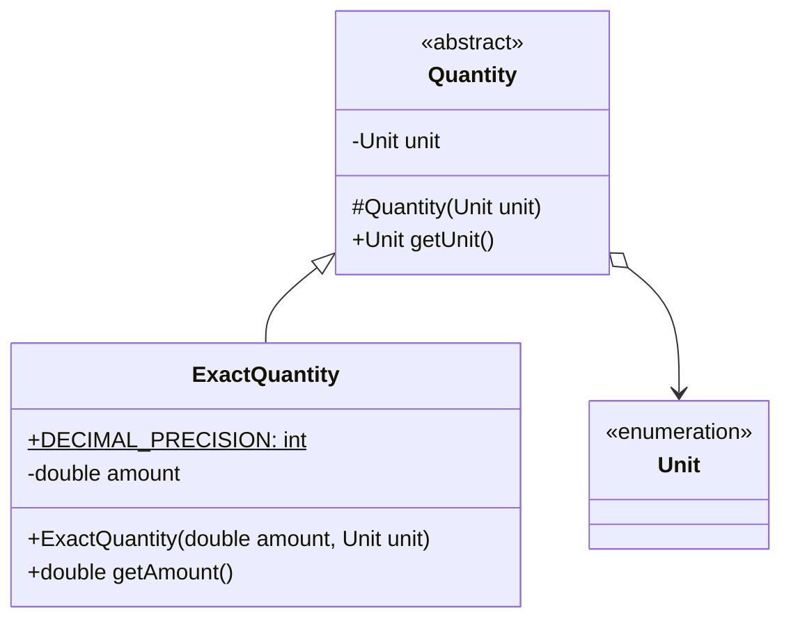
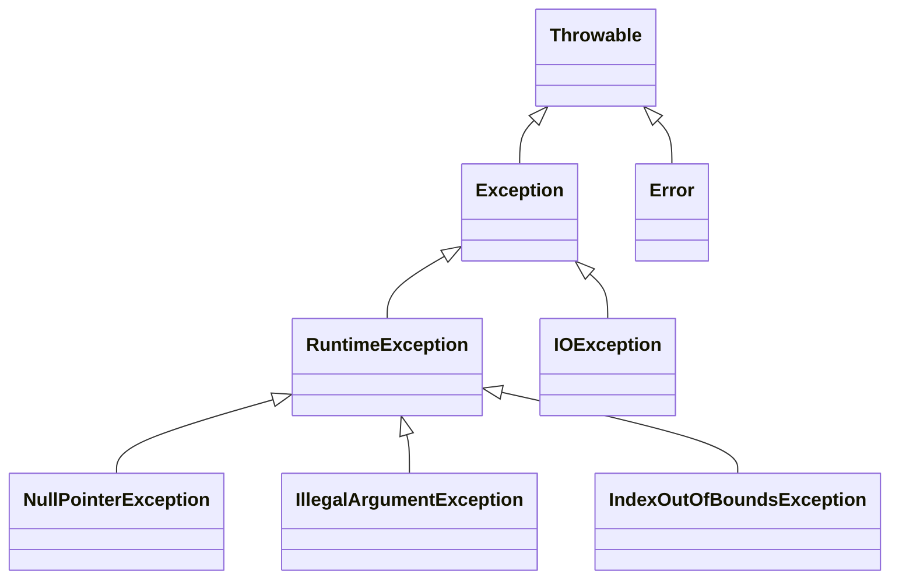

import RevealJS, { Slide } from '@site/src/components/RevealJS';
import Img from '@site/src/components/Img';
import PollSlide from '@site/src/components/PollSlide';
import QuizSlide from '@site/src/components/QuizSlide';

<style>
{`
  .reveal {
    font-size: 32px;
  }
`}
</style>

<RevealJS transition="slide">

<Slide>

</Slide>

<Slide>

## How much of the practice quiz did you do?

<PollSlide choices=
  {["None yet", "I've skimmed it", "A few problems", "Many problems", "All problems"]}
/>
</Slide>

<Slide>

## How hard do you think it is?

<PollSlide image="/img/lectures/poll-ev/pollev-smiles.png"
/>
<p>
Click below the faces if you haven't tried it yet.
</p>
</Slide>

<Slide>

## Cover Sheet
<p>
Write your roster name and your NUID neatly for OCR.
</p>


</Slide>

<Slide>

## Question 1: Write Once Run Anywhere
<QuizSlide
  question='Which statement best describes how Java achieves "write once, run anywhere"?'
  answers={[
    "Java source code is directly interpreted by the operating system",
    "Java source code is compiled to bytecode, which runs on the JVM available for each platform",
    "Java programs must be recompiled for each target operating system",
    "Java uses only ahead-of-time compilation to native machine code"
  ]}
/>
</Slide>

<Slide>

### Different CPUs and OSes Require Different Code

- CPUs have different instruction sets
- OS's have different APIs
- How do you run a program on *any* machine?

<aside class="notes">
**The fundamental problem:**
- Intel CPUs ≠ ARM CPUs (different instruction sets)
- Windows ≠ Linux ≠ macOS (different APIs)
- Traditional solution: platform-specific code or recompile → expensive, error-prone

**Java's solution:** Compile to intermediate representation → virtual machine runs it anywhere

**But:** How do you make that fast?

→ **Transition:** Enter bytecode...
</aside>

</Slide>

{/* ============================================ */}
{/* BYTECODE & JIT */}
{/* ============================================ */}

<Slide>
### Bytecode Provides Platform Independence
  

<aside class="notes">
**Bytecode = intermediate representation:**
- Java source → bytecode
- JVM on each platform executes bytecode
- You write once; JVM handles platform differences

**Both Python and Java use this approach** (in principle)

**Discussion:** "Is it really that easy?" Anyone compiled native Python extensions? That's when platform differences bite back.

→ **Transition:** But interpretation is slow...
</aside>

</Slide>
<Slide>
### Java compilation/execution

  

</Slide>
<Slide>

### Compilation Enables Optimization

<div style={{display: 'grid', gridTemplateColumns: '1fr 1fr', gap: '1.5em', fontSize: '0.85em'}}>
  <div>
    <p style={{fontWeight: 'bold'}}>Interpreted</p>
    <ul style={{marginTop: '0.3em'}}>
      <li>Reads & executes line by line</li>
      <li>100s of instructions per statement</li>
      <li>Executes every branch, every time</li>
    </ul>
  </div>
  <div>
    <p style={{fontWeight: 'bold'}}>Native Compiled</p>
    <ul style={{marginTop: '0.3em'}}>
      <li>Already in machine code</li>
      <li>Direct CPU execution</li>
      <li>Dead code eliminated, functions inlined</li>
    </ul>
  </div>
</div>

<aside class="notes">
**Why interpretation is slower:**
- Interpreter: decode instruction → look up action → execute (100s of extra instructions)
- Native: CPU executes machine code directly

**Compiler optimizations interpreters can't do:**
- Dead code elimination, function inlining, loop optimizations

**Key difference:** Interpreter checks every branch every time. Compiler analyzes whole program and removes unnecessary work ahead of time.

→ **Transition:** Java's innovation: combine both approaches...
</aside>

</Slide>

<Slide>

### JIT Combines Interpretation with Native Compilation

<p >
  <strong>Just-In-Time (JIT)</strong> compilation
</p>
<p style={{marginTop: '1em'}}>
  Dynamically compiles bytecode <em>as it executes</em>
</p>
<p style={{marginTop: '1em'}}>
  The program that runs Java code: <strong>JVM</strong> (Java Virtual Machine)
</p>

<aside class="notes">
**JIT = Java's innovation:**
- JVM starts interpreting, monitors "hot" code (frequently run)
- Hot code → compiled to native on the fly
- Combines: bytecode portability + native speed

**Bonus:** JVM optimizes based on runtime behavior (ahead-of-time compilers can't!)

**Sidebar:** Other JVM languages: Kotlin (Android), Scala (big data), Clojure (functional), Groovy (scripting)—all benefit from JIT

→ **Transition:** Here's a concrete example of JIT optimization...
</aside>

</Slide>

<Slide>
### Question 1 Answer
<QuizSlide
  question='Which statement best describes how Java achieves "write once, run anywhere"?'
  answers={[
    "Java source code is directly interpreted by the operating system",
    "Java source code is compiled to bytecode, which runs on the JVM available for each platform",
    "Java programs must be recompiled for each target operating system",
    "Java uses only ahead-of-time compilation to native machine code"
  ]}
  correct={1}
/>
</Slide>

<Slide>

## Java Evolution

 and Map<String, Bean>. A ghost label reads 'Type Erasure Inside' with a knowing wink.
Lambda expressions (Java 8, 2014): Sleek arrow-shaped pipes (->) bypassing the original plumbing, with a 'Functional Interface Adapter' junction box.
Streams API (Java 8): A conveyor belt running parallel to the main mechanism, with .filter(), .map(), .collect() stations.
Records (Java 16, 2021): A compact, minimalist module snapped onto the side labeled 'Just the data, please.'
Sealed Classes (Java 17, 2021): A padlock and permit list attached to the class hierarchy chamber. Tags reading permits Espresso, Latte, Americano.
Pattern Matching (Java 21, 2023): A sophisticated sorting mechanism with instanceof patterns and switch arrows, looking almost alien compared to the original hardware.
Virtual Threads (Java 21): Hundreds of tiny lightweight threads (depicted as gossamer strands) replacing a few heavy ropes.
Characters:

An old-timer developer in a Sun Microsystems t-shirt gazes nostalgically at the ghostly original, coffee mug in hand.
A younger developer enthusiastically attaches yet another module labeled 'String Templates (Preview).'
James Gosling's portrait hangs on the wall, expression ambiguous—pride? bewilderment?
Speech bubbles:

Old-timer: 'I remember when we had to unbox Integers into ints'
Young developer: 'Wait until you see what's in Java 25!'
Bottom banner:
'Still backward compatible. Still brewing. Still Java?'"
alt="Cartoon of Java as a coffee maker evolving from 1995 to today. A simple original machine labeled 'Write Once, Run Anywhere' appears ghosted in the corner. The modern version is covered with bolted-on features: Generics funnel, Lambda arrow pipes, Streams conveyor belt, Records module, Sealed Classes padlock, and Pattern Matching tubes. An old developer in a Sun shirt reminisces while a young developer adds String Templates. Banner reads: 'Still backward compatible. Still brewing. Still Java?'"
/>

</Slide>

<Slide>

## How were new keywords be added to Java?

<p className="fragment">Why didn't adding keywords (<code>record</code>, <code>sealed</code>, etc.) break existing programs?</p>

<p className="fragment">They are <em>contextual keywords</em> (or "restricted identifiers").</p>

<p className="fragment">These words only have special meaning in specific syntactic contexts—so <code>int sealed = 42;</code> still compiles fine.</p>

</Slide>

<Slide>

## Question 2: Type Checking

Consider this code:

`Quantity q = new ExactQuantity(2.5, Unit.CUP);`

The compiler verifies that `ExactQuantity` is assignable to `Quantity`. This is an example of:
<QuizSlide
  answers={[
    "Dynamic typing - the type is checked when the program runs",
    "Static typing - the type is checked at compile time before the program runs",
    "Duck typing - any object with similar methods would work",
    "No type checking occurs"
  ]}
/>

</Slide>

<Slide>

### Why This is Legal

`Quantity q = new ExactQuantity(2.5, Unit.CUP);`


Declaration uses abstract supertype.

Liskov Substitution Principle tells us assignment is legal.

</Slide>
<Slide>

### Kinds of Type Checking

* **Static Typing** (compile-time, Java)
  → Assignment is legal because `ExactQuantity extends Quantity`
* **Dynamic Typing** (run-time)
  * **Duck Typing** is a specific kind of dynamic typing (Python)

</Slide>

<Slide>

### Duck Typing vs Static Typing

<div className="fragment">

**Python (duck typing):** Type checked at runtime
```python
def make_sound(animal):
    animal.quack()  # No compile-time check—just tries it at runtime

make_sound(Duck())    # works because duck has quack()
make_sound(Person())  # works if Person has quack(), crashes otherwise
```

</div>
<div className="fragment">

**Java (static typing):** Type checked at compile time
```java
void makeSound(Quackable animal) {
    animal.quack();  // Compiler verifies animal implements Quackable
}
```

</div>

<p className="fragment">"If it walks like a duck and quacks like a duck, it's a duck."</p>

</Slide>

<Slide>
### Duck Typing (meme)


</Slide>

<Slide>

### Question 2 Answer

Consider this code:

`Quantity q = new ExactQuantity(2.5, Unit.CUP);`

The compiler verifies that `ExactQuantity` is assignable to `Quantity`. This is an example of:
<QuizSlide
  answers={[
    "Dynamic typing - the type is checked when the program runs",
    "Static typing - the type is checked at compile time before the program runs",
    "Duck typing - any object with similar methods would work",
    "No type checking occurs"
  ]}
  correct={1}
/>

</Slide>
<Slide>
## Question 3: Liskov Substitution Principle

In CookYourBooks, `ExactQuantity`, `FractionalQuantity`, and `RangeQuantity` all extend `Quantity`.

According to the Liskov Substitution Principle:

<QuizSlide
  answers={[
    "Each subclass can implement toDecimal() to return any value it wants",
    "Each subclass must be usable anywhere a Quantity is expected without breaking the program",
    "Subclasses must have identical implementations of all methods",
    "Only ExactQuantity can be used where Quantity is expected"
  ]}
/>

</Slide>

<Slide>

### UML
In CookYourBooks, `ExactQuantity`, `FractionalQuantity`, and `RangeQuantity` all extend `Quantity`.

```mermaid
classDiagram
    class Quantity {
        <<abstract>>
        double toDecimal()*
    }

    class ExactQuantity {
        double toDecimal()
    }

    class FractionalQuantity {
        double toDecimal()
    }

    class RangeQuantity {
        double toDecimal()
    }

    Quantity <|-- ExactQuantity
    Quantity <|-- FractionalQuantity
    Quantity <|-- RangeQuantity
    ```
<p className="fragment">
What does the Liskov Substitution Principle tell us?
</p>
 <p className="fragment" style={{marginTop: '0em'}}>
An instance of the subtype can be passed where an instance of the supertype is expected.
</p>
</Slide>

<Slide>
### Superman is Above the Submarine


</Slide>

<Slide>

### Question 3 Answer

Consider this code:

`Quantity q = new ExactQuantity(2.5, Unit.CUP);`

The compiler verifies that `ExactQuantity` is assignable to `Quantity`. <br/>This is an example of:
<QuizSlide
  answers={[
    "Dynamic typing - the type is checked when the program runs",
    "Static typing - the type is checked at compile time before the program runs",
    "Duck typing - any object with similar methods would work",
    "No type checking occurs"
  ]}
  correct={1}
/>

</Slide>

<Slide>

## Question 4: Abstract Classes

Why is `Quantity` declared as an `abstract class` rather than a regular class?

<QuizSlide
  answers={[
    "Abstract classes use less memory",
    "It has abstract methods like toDecimal() that subclasses must implement, and it should not be instantiated directly",
    "Java requires all parent classes to be abstract",
    "It makes the class immutable"
  ]}
/>

</Slide>

<Slide>
### A Closer Look at Quantity

```mermaid
classDiagram
    class Quantity {
        <<abstract>>
        -Unit unit
        #Quantity(Unit unit)
        +Unit getUnit()
        +double toDecimal()*
        +String toString()
    }

    class ExactQuantity {
        double toDecimal()
    }

    class FractionalQuantity {
        double toDecimal()
    }

    class RangeQuantity {
        double toDecimal()
    }

    Quantity <|-- ExactQuantity
    Quantity <|-- FractionalQuantity
    Quantity <|-- RangeQuantity
    ```

```
public abstract class Quantity {
  public Quantity(Unit unit) { ... }

  public abstract double toDecimal();

  @Override public toString() { ... }
}
```
</Slide>

<Slide>

### Abstract vs Concrete Classes

<table style={{ fontSize: '0.85em' }}>
  <thead>
    <tr>
      <th></th>
      <th style={{ textAlign: 'center' }}>Abstract Class</th>
      <th style={{ textAlign: 'center' }}>Concrete Class</th>
    </tr>
  </thead>
  <tbody>
    <tr className="fragment">
      <td>Can contain concrete methods</td>
      <td><div style={{ textAlign: 'center' }}>✓</div></td>
      <td><div style={{ textAlign: 'center' }}>✓</div></td>
    </tr>
    <tr className="fragment">
      <td>Can contain abstract methods</td>
      <td><div style={{ textAlign: 'center' }}>✓</div></td>
      <td><div style={{ textAlign: 'center' }}>✗</div></td>
    </tr>
    <tr className="fragment">
      <td>Can be instantiated</td>
      <td><div style={{ textAlign: 'center' }}>✗</div></td>
      <td><div style={{ textAlign: 'center' }}>✓</div></td>
    </tr>
    <tr className="fragment">
      <td>Can be extended</td>
      <td><div style={{ textAlign: 'center' }}>✓</div></td>
      <td><div style={{ textAlign: 'center' }}>✓</div></td>
    </tr>
  </tbody>
</table>

</Slide>

<Slide>
### Question 4 Answer

Why is `Quantity` declared as an `abstract class` rather than a regular class?

<QuizSlide
  correct={1}
  answers={[
    "Abstract classes use less memory",
    "It has abstract methods like toDecimal() that subclasses must implement, and it should not be instantiated directly",
    "Java requires all parent classes to be abstract",
    "It makes the class immutable"
  ]}
/>

</Slide>

<Slide>
### Abstract Classes (meme)


</Slide>

<Slide>

## Question 5: Exceptions

What distinguishes checked exceptions (e.g., `IOException`) from unchecked exceptions (e.g., `IllegalArgumentException`)?

<QuizSlide
  answers={[
    "Checked exceptions are faster to throw",
    "Checked exceptions must be declared in the method signature or caught; unchecked exceptions do not",
    "Unchecked exceptions cannot be caught",
    "Checked exceptions extend RuntimeException"
  ]}
/>

</Slide>

<Slide>

### Checked and Unchecked Exceptions

  

</Slide>

<Slide>

### Java's Exception Hierarchy Distinguishes Error Types

<p style={{fontSize: '1.1em'}}>
  All exceptions extend <code>Throwable</code>
</p>


Subclasses of `Error` and `RuntimException` are unchecked.

</Slide>

<Slide>

### Parameter Validation

* Validate constructor and method parameters as early as possible
* Throw `IllegalArgumentException`
* Document requirements and exceptions in Javadoc

```java
  /**
   * Creates an ingredient with the given name, preparation, and notes.
   *
   * @param name the ingredient name (must not be null or blank)
   * @param preparation the preparation instructions (may be null)
   * @param notes additional notes (may be null)
   * @throws IllegalArgumentException if name is blank (empty or whitespace-only)
   */
  protected Ingredient(@NonNull String name, @Nullable String preparation, @Nullable String notes) {
    if (name.isBlank()) {
      throw new IllegalArgumentException("Name must not be blank.");
    }
    ...
  }
```

</Slide>

<Slide>

### Two Ways to Handle Checked Exceptions

<div style={{ display: 'flex', gap: '2em', fontSize: '0.7em' }}>

<div className="fragment">

**Option 1: Catch it**
```java
public void processFile(String path) {
    try {
        String data = readFile(path);
        // use data
    } catch (IOException e) {
        System.err.println("Could not read file: "
            + e.getMessage());
    }
}
```

Handle the problem here.

</div>

<div className="fragment">

**Option 2: Propagate it**
```java
public void processFile(String path) throws IOException {
    String data = readFile(path);
    // use data
}
```

Let the caller handle it.

</div>

</div>

</Slide>

<Slide>


</Slide>

<Slide>

### Question 5 Answer

What distinguishes checked exceptions (e.g., `IOException`) from unchecked exceptions (e.g., `IllegalArgumentException`)?

<QuizSlide
  correct={1}
  answers={[
    "Checked exceptions are faster to throw",
    "Checked exceptions must be declared in the method signature or caught; unchecked exceptions do not",
    "Unchecked exceptions cannot be caught",
    "Checked exceptions extend RuntimeException"
  ]}
/>

</Slide>

</RevealJS>