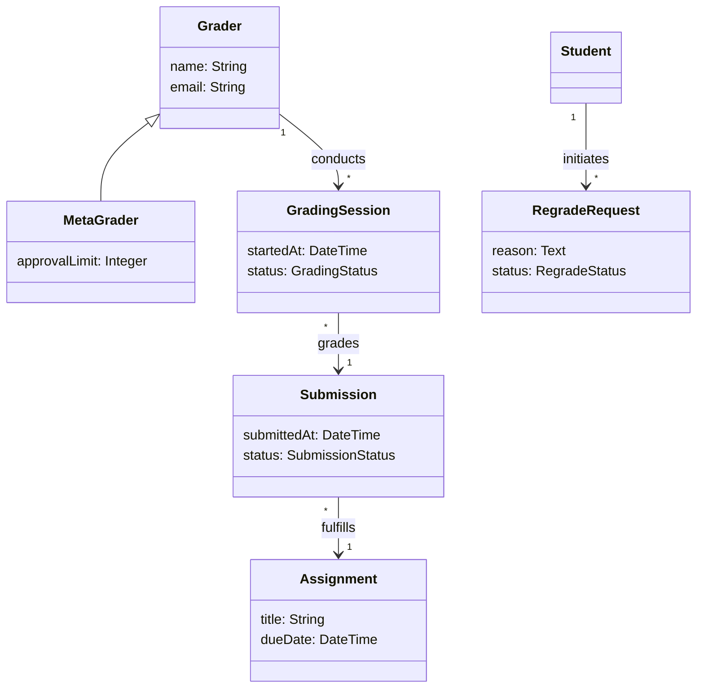
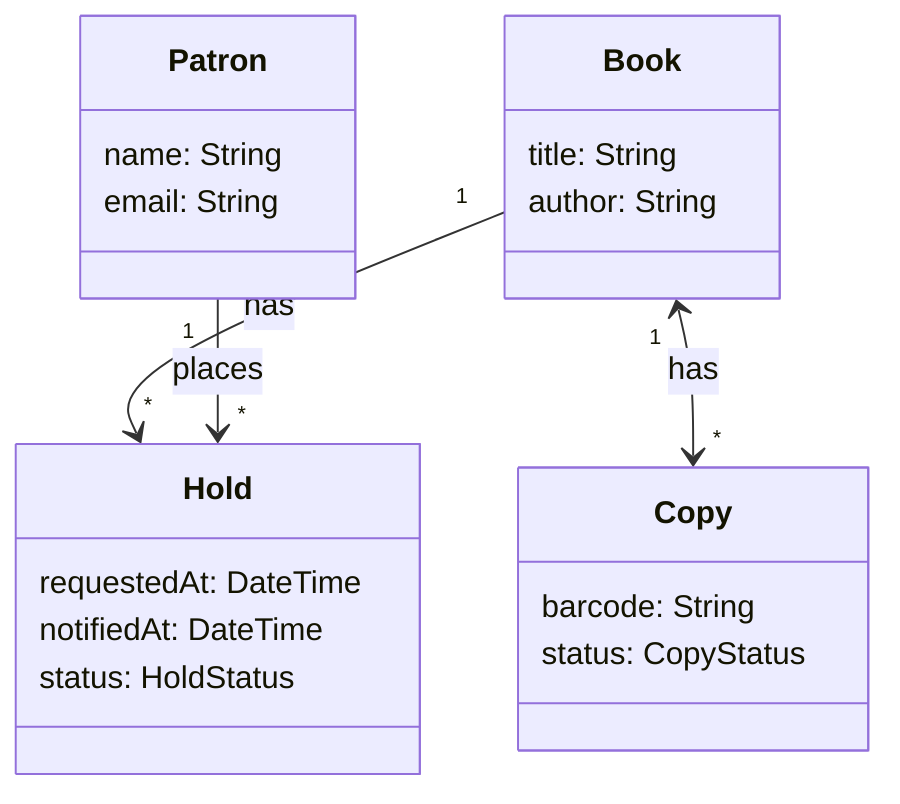
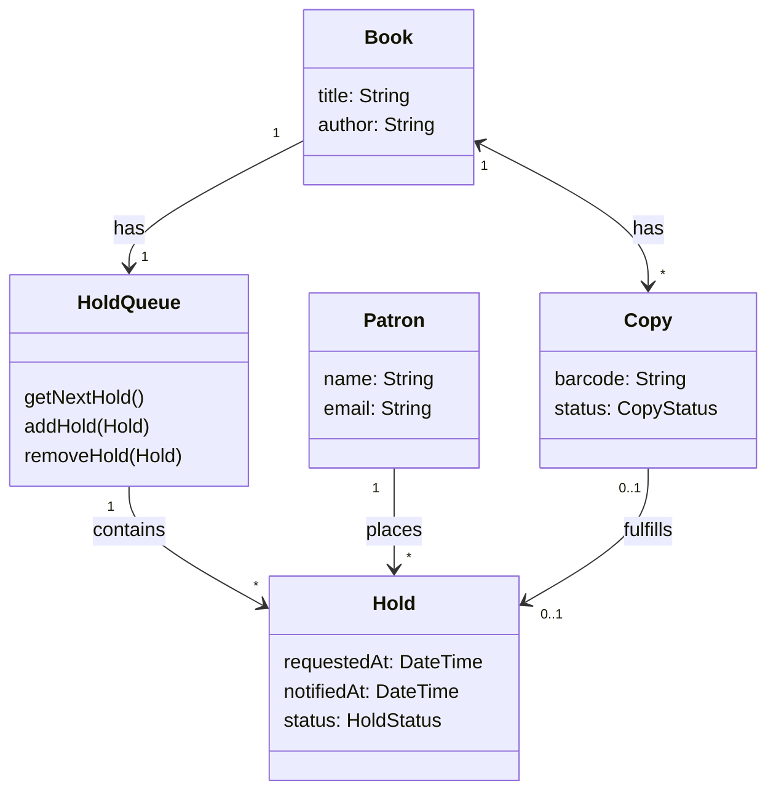
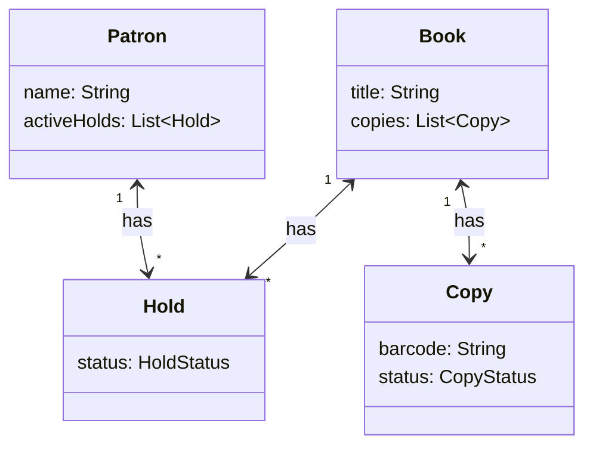
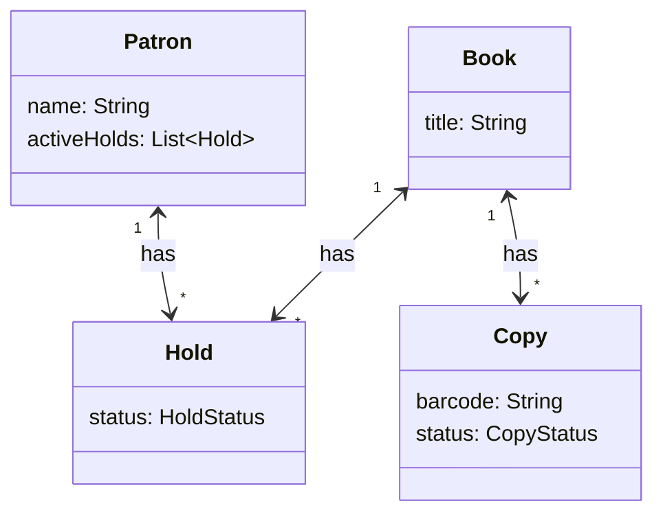
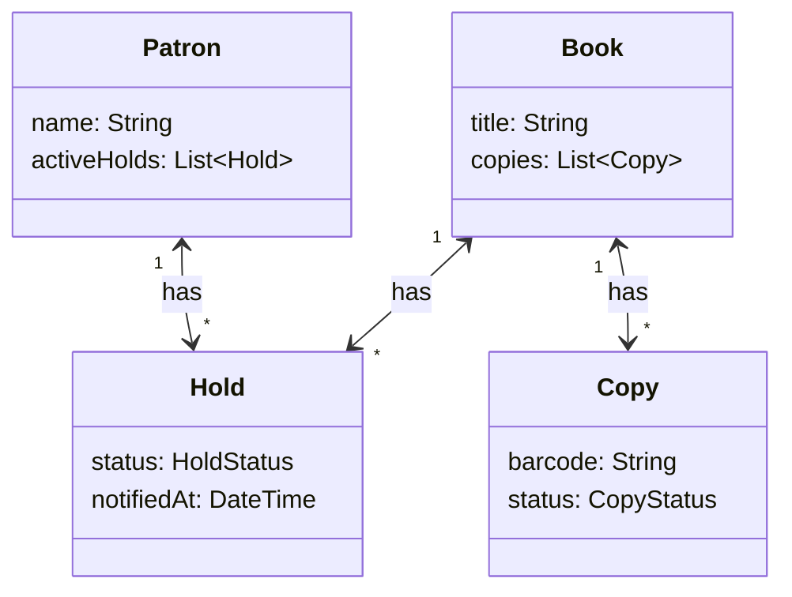

import RevealJS, { Slide } from '@site/src/components/RevealJS';
import Img from '@site/src/components/Img';
import PollSlide from '@site/src/components/PollSlide';
import QuoteSlide from '@site/src/components/QuoteSlide';

<RevealJS transition="slide">

{/* ============================================ */}
{/* COVER IMAGE */}
{/* ============================================ */}

{/* TODO: DEFINE BUSINESS LOGIC */}

<Slide>
  

<aside className="notes">
**Lecture overview:**
- **Total time:** ~55 minutes (tight pacing)
- **Prerequisites:** Students understand information hiding (L6), changeability (L7-L8), requirements analysis (L9)
- **Connects to:** L9 requirements analysis, L6 information hiding, upcoming architecture lectures

**Structure:**
- Introduction: Why domain modeling matters (~5 min)
- Formulating a domain model (~15 min)
- Validating with stakeholders (~5 min)
- Translating to OO design (~20 min)
- Representational gap (~10 min)

**Key theme:** Domain modeling bridges human understanding and code implementation. It's information hiding at the conceptual level.

→ **Transition:** Let's start with the learning objectives...
</aside>

</Slide>

{/* ============================================ */}
{/* TITLE SLIDE */}
{/* ============================================ */}

<Slide>

# CS 3100: Program Design and Implementation II

## Lecture 12: Domain Modeling

<p style={{marginTop: '2em', fontSize: '0.8em', color: '#666'}}>
  ©2026 Jonathan Bell & Ellen Spertus, CC-BY-SA
</p>

<aside className="notes">
**Context from previous lectures:**
- L6: Information hiding—modules should expose *what* they do, not *how*
- L9: Requirements analysis—understanding problems deeply before designing solutions
- Today: We apply information hiding at the conceptual level

**Key message:** A well-designed domain model hides implementation-level thinking (maps, counters, byte arrays) behind domain-level abstractions (Submissions, Students, GradingSessions).

→ **Transition:** Here's what you'll be able to do after today...
</aside>

</Slide>

{/* ============================================ */}
{/* LEARNING OBJECTIVES */}
{/* ============================================ */}

<Slide>

## Learning Objectives

<p style={{fontSize: '0.85em', textAlign: 'left'}}>
After this lecture, you will be able to:
</p>

<ol style={{fontSize: '0.75em', textAlign: 'left'}}>
  <li>Formulate a domain model given a set of requirements</li>
  <li>Validate domain models with stakeholders through scenario walkthroughs</li>
  <li>Translate a domain model into an object-oriented design using responsibility assignment heuristics</li>
  <li>Evaluate the representational gap between a domain model and an OO design</li>
</ol>

<aside className="notes">
**Time allocation:**
- Objective 1: Formulating domain models (~15 min)
- Objective 2: Validation techniques (~5 min)
- Objective 3: Responsibility assignment—Information Expert, Creator, Controller (~20 min)
- Objective 4: Representational gap and strategies (~10 min)

Plus ~5 min intro connecting to prior material.

**Why this matters:** Domain modeling is how we ensure code stays understandable and maintainable as requirements evolve.

→ **Transition:** Let's start by connecting to what we've learned...
</aside>

</Slide>

{/* ============================================ */}
{/* OPENING EXERCISE */}
{/* ============================================ */}

<Slide>

## Poll: Which code is easier to understand, and why?

**Option A:**
```java
public double process(String id, double amt, String type) {
    double curr = balances.getOrDefault(id, 0.0);
    double fee = type.equals("PREMIUM") ? 0.0 : amt * 0.02;
    double result = curr - amt - fee;
    if (result < 0) throw new RuntimeException("insufficient");
    balances.put(id, result);
    return result;
}
```

**Option B:**
```java
public Balance withdraw(Account account, Money amount) {
    Money fee = account.membership().calculateFee(amount);
    Balance newBalance = account.balance().subtract(amount).subtract(fee);
    if (newBalance.isNegative()) throw new InsufficientFundsException(account);
    account.updateBalance(newBalance);
    return newBalance;
}
```

<aside className="notes">
* Goal: Students see benefit of proper domain modeling.
* Method: Ask them to compare two versions of code.
* Their answer should include their preferred version
and why they prefer it.

**Transition:** The lower code features good domain modeling.
</aside>
</Slide>

{/* ============================================ */}
{/* ARC 1: INTRODUCTION - CONNECTING TO L9 */}
{/* ============================================ */}

<Slide>

## Requirements Are the Input—Domain Modeling Is the Output

<p style={{fontSize: '0.9em'}}>
In <strong>Lecture 9</strong>, we learned to gather and analyze requirements:
</p>

<ul style={{fontSize: '0.8em'}}>
  <li>Stakeholder interviews and observation</li>
  <li>Functional vs. non-functional requirements</li>
  <li>User stories and acceptance criteria</li>
</ul>

<p style={{fontSize: '0.9em', marginTop: '1em', color: '#9370DB'}}>
But requirements are just the <em>input</em>. Today we learn what to <strong>do</strong> with them.
</p>

<p style={{fontSize: '0.85em', marginTop: '0.5em'}}>
<strong>Domain modeling</strong> transforms messy real-world requirements into a structured understanding that guides our code.
</p>

<aside className="notes">
**Bridging the gap from L9:**
- L9 was about *gathering* requirements—listening, asking, documenting
- L12 is about *structuring* that understanding into a model
- The model becomes the bridge between stakeholders and code

**Acknowledge the break:**
- "We've had a review and quiz since L9, so let's reconnect"
- L9 gave us raw material (requirements)
- Today we shape that material into something we can implement

**The journey so far:**
- L6: Information hiding (hide *how*, expose *what*)
- L7-L8: Design for change (coupling, cohesion, SOLID)
- L9: Requirements (understanding the problem)
- L12: Domain modeling (structuring that understanding)

→ **Transition:** How does this connect to information hiding?
</aside>

</Slide>

<Slide>

## Understandability Is the Ultimate Goal of Good Design

<p style={{fontSize: '0.9em'}}>
Throughout this course, we've emphasized <strong>changeability</strong>, <strong>readability</strong>, and <strong>maintainability</strong>. But these all serve a more fundamental goal:
</p>

<p style={{fontSize: '1.3em', color: '#9370DB', textAlign: 'center', marginTop: '1em'}}>
<strong>Understandability</strong>
</p>

<p style={{fontSize: '0.85em', marginTop: '1em'}}>
Code that humans can understand is code that humans can successfully work with, modify, and trust.
</p>

<p style={{fontSize: '0.85em', marginTop: '0.5em', color: '#666'}}>
But understandability is <em>subjective</em>—it depends on context. One common approach: model the problem domain in the code.
</p>

<aside className="notes">
**The insight:**
- Changeability, readability, maintainability are means to an end
- The end is understandability
- Understandable code can be trusted, modified, evolved

**The strategy:**
- If code mirrors the problem domain...
- ...then understanding the domain means understanding the code
- Domain experts become code reviewers

→ **Transition:** Let's see a concrete example...
</aside>

</Slide>

<Slide>

## Real Scenarios Reveal Why Domain Modeling Matters

<p style={{fontSize: '0.9em'}}>
A student submits their assignment. A grader starts reviewing it. But then the student realizes they forgot something and resubmits.
</p>

<p style={{fontSize: '1em', marginTop: '1em', fontWeight: 'bold', color: '#9370DB'}}>
How should our system handle this?
</p>

<p style={{fontSize: '0.85em', marginTop: '1em'}}>
Let's look at two implementations...
</p>

<aside className="notes">
**Set up the scenario:**
- This is a real problem Pawtograder has to solve
- Involves coordination between submission, grading, and revision
- Multiple stakeholders affected: student, grader, instructor

**Ask students:** What should happen to the grader's work?

→ **Transition:** Here are two approaches...
</aside>

</Slide>

<Slide>

## Technical-Focused Design Hides Meaning in Implementation Details

```java
public class SubmissionManager {
    private Map<String, List<byte[]>> fileStorage = new HashMap<>();
    private Map<String, Integer> versionCounters = new HashMap<>();
    private Map<String, Map<String, Object>> gradeData = new HashMap<>();

    public String submitFiles(String userId, String assignmentId, List<byte[]> files) {
        String key = userId + "_" + assignmentId;

        Map<String, Object> existingGrade = gradeData.get(key);
        if (existingGrade != null && existingGrade.get("status").equals("IN_PROGRESS")) {
            int version = versionCounters.getOrDefault(key, 0) + 1;
            versionCounters.put(key, version);
            fileStorage.put(key + "_v" + version, files);

            Map<String, Object> newGradeData = new HashMap<>(existingGrade);
            newGradeData.put("status", "NEEDS_REGRADING");
            gradeData.put(key + "_v" + version, newGradeData);
            return key + "_v" + version;
        }
        fileStorage.put(key, files);
        return key;
    }
}
```

<aside className="notes">
**Walk through the code:**
- Maps everywhere: fileStorage, versionCounters, gradeData
- String concatenation for keys
- Status stored as string in nested Map
- What's "v2"? What's "NEEDS_REGRADING"?

**Questions to ask:**
- What does this code do? Can you tell at a glance?
- What happens to the grader's work?
- Is "NEEDS_REGRADING" documented anywhere?

→ **Transition:** Now let's see a domain-aligned approach...
</aside>

</Slide>

<Slide>

## Domain-Aligned Design Makes Code Read Like the Business Process

```java
public class Submission {
    private final Student student;
    private final Assignment assignment;
    private final List<SourceFile> files;
    private GradingSession activeGradingSession;

    public Submission createRevision(List<SourceFile> newFiles) {
        Submission revision = new Submission(student, assignment, newFiles);

        if (hasActiveGrading()) {
            GradingDraft draft = activeGradingSession.convertToDraft();
            revision.attachDraftGrading(draft);

            activeGradingSession.getGrader().notify(
                new RevisionSubmittedEvent(this, revision)
            );
        }
        return revision;
    }

    public boolean hasActiveGrading() {
        return activeGradingSession != null && !activeGradingSession.isComplete();
    }
}
```

<aside className="notes">
**Walk through the code:**
- Classes named after domain concepts: Submission, Student, Assignment
- Methods use domain language: createRevision, hasActiveGrading
- Behavior is explicit: converting to draft, notifying grader
- The code reads like a description of the business process

**Contrast with Approach A:**
- No mysterious keys or version counters
- The grader's work is explicitly preserved as a draft
- Notification happens—we can see it in the code

→ **Transition:** Which is more understandable?
</aside>

</Slide>

<Slide>

## Domain-Aligned Code Is Easier to Navigate, Predict, and Change

<div style={{display: 'grid', gridTemplateColumns: '1fr 1fr', gap: '1em', fontSize: '0.75em'}}>

<div style={{backgroundColor: 'rgba(255,100,100,0.1)', padding: '0.5em', borderRadius: '8px'}}>

**Approach A Problems:**
- What does "v2" mean?
- Why concatenate strings for keys?
- What happens to grader's work?
- What triggers "NEEDS_REGRADING"?

</div>

<div style={{backgroundColor: 'rgba(100,255,100,0.1)', padding: '0.5em', borderRadius: '8px'}}>

**Approach B Clarity:**
- `Submission` has a `GradingSession`
- `GradingSession` → `GradingDraft`
- Grader is notified explicitly
- Code reads like business process

</div>

</div>

<p style={{fontSize: '0.85em', marginTop: '1em'}}>
When code uses the same concepts, relationships, and vocabulary as the problem domain, it becomes easier to:
</p>

<ul style={{fontSize: '0.8em'}}>
  <li><strong>Navigate</strong> from requirement to implementation</li>
  <li><strong>Predict</strong> where functionality lives</li>
  <li><strong>Understand</strong> the impact of changes</li>
  <li><strong>Communicate</strong> with non-technical stakeholders</li>
</ul>

<aside className="notes">
**The benefits:**
- Navigate: "Where's the regrade logic?" → look in RegradeRequest
- Predict: "How do we handle deadlines?" → probably in Assignment or Submission
- Understand: Changes to grading affect GradingSession, not random Maps
- Communicate: Product managers can review domain classes

**Connection to L6-L8 (Changeability):**
- "Understand the impact of changes" is the key benefit
- Domain-aligned code makes change impact *predictable*
- "Change regrade rules" → look in RegradeRequest
- "Change how we store submissions" → look in storage layer, NOT Submission class
- Technical-focused code: changes ripple unpredictably through Maps and counters

→ **Transition:** But achieving this alignment is difficult...
</aside>

</Slide>

<Slide>

## Keep Your Reader In Mind

<QuoteSlide quote="Any fool can write code that a computer can understand. Good programmers write code that humans can understand."
 imageSrc='/img/lectures/web/l12-martin-fowler.png'
 imageAlt="Headshot of Martin Fowler"
 attribution="Webysther Nunes CC-BY-SA 4.0"/>

{/* Image source: https://commons.wikimedia.org/wiki/File:Webysther_20150414193208_-_Martin_Fowler.jpg*/}
</Slide>

<Slide>

## Stakeholders Use the Same Words to Mean Different Things

<p style={{fontSize: '0.9em'}}>
A "submission" means different things to different stakeholders:
</p>

<div style={{fontSize: '0.75em', marginTop: '0.5em'}}>

| Stakeholder | "Submission" means... |
|-------------|----------------------|
| **Student** | "My attempt at the assignment" |
| **Grader** | "Work I need to evaluate" |
| **System** | "An execution of grading script on student code" |

</div>

<p style={{fontSize: '0.85em', marginTop: '1em', color: '#9370DB'}}>
Domain modeling forces us to be <strong>explicit</strong> about our understanding <em>before</em> making implementation decisions.
</p>

<aside className="notes">
**The problem:**
- Real-world concepts are messy, full of exceptions
- Different stakeholders have different views
- Without explicit modeling, we embed implicit assumptions

**Domain modeling as a tool:**
- Forces explicit discussion of terminology
- Creates a shared vocabulary
- Becomes a map from requirements to code

→ **Transition:** Let's learn how to create domain models...
</aside>

</Slide>

{/* ============================================ */}
{/* ARC 2: FORMULATING A DOMAIN MODEL */}
{/* ============================================ */}

<Slide>

## Formulating a Domain Model: A 4-Step Process

<p style={{fontSize: '0.9em'}}>
Creating a domain model is iterative discovery and refinement:
</p>

<ol style={{fontSize: '0.85em'}}>
  <li><strong>Extract</strong> candidate concepts from requirements</li>
  <li><strong>Filter</strong> and consolidate—remove synonyms, distinguish attributes from concepts</li>
  <li><strong>Discover</strong> hidden concepts implied but not named</li>
  <li><strong>Build</strong> the initial model with relationships</li>
</ol>

<aside className="notes">
**The process:**
- Not linear—expect to iterate
- Step 3 (hidden concepts) is often the most valuable—that's where Strategy patterns hide

**For lecturers familiar with OOD but not domain modeling:**
- Classic OOD starts with "find the nouns" → but that's only Step 1
- Steps 2-4 apply *design principles* to refine the raw extraction
- Think of it as: Extract → Apply SRP (filter) → Apply Strategy/OCP (hidden concepts) → Build

**Connection to L9 (Requirements):**
- L9 taught stakeholder analysis and elicitation
- Domain modeling is what you DO with those requirements
- L9 = gathering, L12 = structuring

**Connection to L6-L8 (Design Principles):**
- Every step uses principles: SRP for filtering, Strategy for hidden policies, Liskov for inheritance decisions
- This lecture shows domain modeling as *applied* SOLID

→ **Transition:** But first, what are we actually looking for?
</aside>

</Slide>

<Slide>

## Nouns Become Classes; Heavy Verbs Become Interfaces

<div style={{display: 'grid', gridTemplateColumns: '1fr 1fr', gap: '1.5em', fontSize: '0.8em', marginTop: '0.5em'}}>

<div>

**Nouns → Classes or Fields**

| In requirements | Becomes |
|-----------------|---------|
| *"students"*, *"graders"* | **Classes** (they have identity, behavior) |
| *"email"*, *"due date"* | **Fields** (just data on something else) |
| *"score"* | Depends! Could be either. |

</div>

<div>

**Verbs → Methods... or Classes**

| In requirements | Becomes |
|-----------------|---------|
| *"submit"*, *"grade"* | Methods (usually) |
| *"request regrade"* | **A class!** (it has lifecycle, data) |
| *"ensure fair distribution"* | **Strategy object** (remember L7?) |

</div>

</div>

<p style={{fontSize: '0.85em', marginTop: '1em', color: '#9370DB'}}>
When a verb has a lifecycle, carries data, or varies in implementation → promote it to a class (or interface!).
</p>

<aside className="notes">
**For lecturers familiar with OOD but not domain modeling:**
This slide bridges classic OO thinking to domain modeling. Students know nouns→classes from intro courses, but the verb→class insight is new and powerful.

**Connection to L5/L7 (Strategy Pattern):**
- L5 introduced Strategy with Comparator—the *comparison algorithm* became an object
- L7 revisited Strategy for build systems—`JavaBuildStrategy`, `PythonBuildStrategy`
- Same pattern here: "ensure fair distribution" → `AssignmentStrategy` interface
- The requirement describes behavior that *varies*—classic Strategy territory

**Connection to L8 (Open/Closed Principle):**
- When a verb becomes a class/interface, we get Open/Closed for free
- New distribution policies = new strategy classes, not modified switch statements
- This is why L8 said "favor composition over inheritance"

**Key insight for students:**
- Nouns are obvious candidates (they learned this in CS 2500/2510)
- Verbs that "feel heavy" are the *non-obvious* candidates—this is the new skill

→ **Transition:** Let's see this in action with real requirements...
</aside>

</Slide>

<Slide>

## Example: Pawtograder Grading System Requirements

<div style={{fontSize: '0.7em', backgroundColor: 'rgba(147, 112, 219, 0.1)', padding: '0.75em', borderRadius: '8px'}}>

> The university wants to modernize how graders provide feedback on programming assignments. Graders can provide inline comments on specific lines of code, rate code quality on various dimensions (correctness, style, design), and assign scores based on a rubric. Some graders ("meta-graders") have additional privileges—they can review other graders' work and handle regrade requests.
>
> Students can request regrades if they believe their submission was scored incorrectly. The original grader handles the initial regrade request. If the student is still dissatisfied, they can escalate to a meta-grader. As a last resort, the instructor can review any grading decision.
>
> The system needs to ensure fair distribution of grading work and prevent the same grader from repeatedly grading the same student (to avoid bias). Meta-graders should review a sampling of each grader's work to ensure consistency. All grading actions must be tracked for audit purposes.

</div>

<aside className="notes">
**Notice:**
- Real requirements are dense with concepts
- Some concepts are explicit, some implied
- Business rules are embedded in prose
- Multiple stakeholders mentioned

**We'll use this throughout the lecture.**

→ **Transition:** Step 1: Extract candidate concepts...
</aside>

</Slide>

<Slide>

## Step 1: Extract Candidate Concepts

<p style={{fontSize: '0.85em'}}>
Read the requirements like a detective. Every noun could be a class:
</p>

<div style={{fontSize: '0.68em', backgroundColor: 'rgba(147, 112, 219, 0.05)', padding: '0.5em', borderRadius: '8px', lineHeight: '1.6'}}>

> The university wants to modernize how <mark>**graders**</mark> provide <mark>**feedback**</mark> on <mark>**programming assignments**</mark>. <mark>**Graders**</mark> can provide <mark>**inline comments**</mark> on specific <mark>**lines of code**</mark>, rate <mark>**code quality**</mark> on various <mark>**dimensions**</mark> (correctness, style, design), and assign <mark>**scores**</mark> based on a <mark>**rubric**</mark>. Some graders ("<mark>**meta-graders**</mark>") have additional privileges...
>
> <mark>**Students**</mark> can request <mark>**regrades**</mark> if they believe their <mark>**submission**</mark> was scored incorrectly. The <mark>**original grader**</mark> handles the initial <mark>**regrade request**</mark>. If the <mark>**student**</mark> is still dissatisfied, they can escalate to a <mark>**meta-grader**</mark>...

</div>

<p style={{fontSize: '0.8em', marginTop: '0.75em', color: '#9370DB'}}>
Don't filter yet! "Lines of code" might become a class. "Dimensions" might not. We decide later.
</p>

<aside className="notes">
**Live demo possibility:**
- Project the requirements on screen
- Highlight nouns as class suggests them
- Build the list collaboratively—students often spot things you miss

**Connection to L4 (Specifications):**
- Just as L4 taught us to read method specs carefully for preconditions/postconditions...
- Here we read *requirements* carefully for domain concepts
- Same skill: precise reading to extract meaning

**Key points:**
- Over-extract now, filter later (like brainstorming)
- Verbs matter too—they become methods, or sometimes classes (next slide)
- Some nouns will merge, some will disappear

→ **Transition:** Now we filter and consolidate...
</aside>

</Slide>

<Slide>

## Step 2: Filter and Consolidate

<p style={{fontSize: '0.85em'}}>
Now we sculpt. Not everything survives:
</p>

<div style={{fontSize: '0.72em', marginTop: '0.5em'}}>

<div style={{marginBottom: '0.5em'}}>
**Merge synonyms** — pick one name and stick with it:
<div style={{backgroundColor: 'rgba(255,200,100,0.15)', padding: '0.3em 0.5em', borderRadius: '4px', marginTop: '0.25em'}}>
<s style={{color: '#999'}}>programming assignments</s> + <s style={{color: '#999'}}>assignments</s> → **Assignment** ✓
</div>
</div>

<div style={{marginBottom: '0.5em'}}>
**Demote to attributes** — not everything deserves to be a class:
<div style={{backgroundColor: 'rgba(255,100,100,0.1)', padding: '0.3em 0.5em', borderRadius: '4px', marginTop: '0.25em'}}>
<s style={{color: '#999'}}>lines of code</s> → just an `int lineNumber` on InlineComment
</div>
</div>

<div>
**Spot variation** — where things get interesting:
<div style={{backgroundColor: 'rgba(100,255,100,0.1)', padding: '0.3em 0.5em', borderRadius: '4px', marginTop: '0.25em'}}>
Grader vs Meta-grader... inheritance? role attribute? <em>We'll decide.</em>
</div>
</div>

</div>

<aside className="notes">
**Ask the class:** "Should meta-grader be a subclass or a role?"

**Connection to L2 and L8 (Liskov Substitution):**
- If MetaGrader extends Grader, can we substitute freely? (L2)
- Does a MetaGrader do everything a Grader does, plus more? Or differently?
- If "plus more" → inheritance works. If "differently" → maybe composition (L8)

**Connection to L8 (Single Responsibility):**
- Each class should have one reason to exist
- "lines of code" isn't a concept with its own responsibility—it's just data
- "RubricItem" might be—it has behavior (max points, descriptions, scoring logic)

**The goal:** Fewer, cleaner concepts that match stakeholder vocabulary (L4's "ubiquitous language" idea).

→ **Transition:** Step 3 is where the magic happens...
</aside>

</Slide>

<Slide>

## Step 3: Discover Hidden Concepts

<p style={{fontSize: '0.85em'}}>
The requirements never mention these. But read between the lines:
</p>

<div style={{fontSize: '0.72em', marginTop: '0.5em'}}>

<div style={{backgroundColor: 'rgba(147, 112, 219, 0.1)', padding: '0.4em 0.6em', borderRadius: '6px', marginBottom: '0.4em'}}>
📝 *"ensure fair distribution of grading work"*
<br/><span style={{color: '#9370DB', fontWeight: 'bold'}}>→ Who distributes? A **GradingAssignment** or **WorkloadManager**</span>
</div>

<div style={{backgroundColor: 'rgba(147, 112, 219, 0.1)', padding: '0.4em 0.6em', borderRadius: '6px', marginBottom: '0.4em'}}>
📝 *"prevent same grader from repeatedly grading same student"*
<br/><span style={{color: '#9370DB', fontWeight: 'bold'}}>→ Someone tracks history. A **GradingHistory** or constraint object.</span>
</div>

<div style={{backgroundColor: 'rgba(147, 112, 219, 0.1)', padding: '0.4em 0.6em', borderRadius: '6px', marginBottom: '0.4em'}}>
📝 *"tracked for audit purposes"*
<br/><span style={{color: '#9370DB', fontWeight: 'bold'}}>→ An **AuditLog** or **GradingEvent** we never discussed.</span>
</div>

</div>

<p style={{fontSize: '0.8em', marginTop: '0.75em', color: '#FF9800'}}>
⚠ Hidden concepts often become the most architecturally critical classes. Miss them, and logic scatters everywhere.
</p>

<aside className="notes">
**This is the detective work:**
- Requirements describe *what* should happen
- Hidden concepts are *how* it gets enforced

**Connection to L7 (Strategy Pattern):**
- "Ensure fair distribution" is a *policy*—and policies often vary!
- Round-robin? Workload-balanced? Random? That's a Strategy interface (L7)
- The hidden concept isn't just "WorkloadManager"—it's `AssignmentStrategy`

**Connection to L6 (Information Hiding):**
- Hidden concepts often *enforce invariants*
- "Prevent same grader repeatedly grading same student" → who enforces this?
- That enforcer is a hidden concept with a clear responsibility

**Ask the class:** "What would I need to build to make this rule actually work?"

→ **Transition:** Now we assemble what we've found...
</aside>

</Slide>

<Slide>

## Step 4: Assemble the Model

<p style={{fontSize: '0.8em', marginBottom: '0.5em'}}>
From filtered concepts and hidden discoveries, our first sketch emerges:
</p>



<aside className="notes">
**Walk through the model:**
- Core entities: Grader, Assignment, Submission, GradingSession
- MetaGrader extends Grader (we chose inheritance—revisit L2's Liskov test: can we substitute?)
- Relationships show who does what to whom

**Connection to L2 (Inheritance) and L8 (Liskov):**
- We drew MetaGrader extending Grader—is this valid?
- L2/L8 test: Can a MetaGrader be used *anywhere* a Grader is expected?
- If MetaGrader has *additional* capabilities (can review others), inheritance works
- If MetaGrader *behaves differently* in core grading, maybe composition is better

**Connection to L8 (Interface Segregation):**
- Notice we didn't create one giant `Person` class with all behaviors
- Student, Grader, Instructor are separate—each has focused responsibilities
- This is ISP: clients depend only on interfaces they use

**Note:** This is simplified—full model would include RubricItem, InlineComment, etc.

→ **Transition:** A few key modeling techniques to keep in mind...
</aside>

</Slide>

<Slide>

## Actions With Lifecycles Deserve Their Own Classes

<p style={{fontSize: '0.85em'}}>
When an action carries weight, it deserves to be a class:
</p>

```java
// Starting point: "regrade" as a method
class Grader {
    void regradeSubmission(Submission s) { }
}

// Leveled up: "RegradeRequest" captures the full lifecycle
class RegradeRequest {
    Student requester;
    GradingSession originalSession;
    String reason;
    RegradeStatus status;
    List<RegradeResponse> responses;  // Can have multiple as it escalates
}
```

<p style={{fontSize: '0.8em', marginTop: '0.5em', color: '#9370DB'}}>
**Promote when:** the action has a lifecycle, carries data, or needs to be referenced later.
</p>

<aside className="notes">
**Signs a verb should become a class:**
- It has states (created → in progress → resolved)
- Multiple parties interact with it
- You need to refer to "that regrade" later
- It carries its own data (reason, responses)

**Connection to L7/L8 (Strategy and Open/Closed):**
- This is exactly what Strategy pattern does—the *algorithm* becomes an object
- Remember L7: "ensure fair distribution" → `AssignmentStrategy` interface
- L8's Open/Closed: new regrade policies = new classes, not modified switch statements

**Connection to L8 (Single Responsibility):**
- Once promoted, `RegradeRequest` has ONE job: manage a regrade's lifecycle
- The `Grader` class is relieved of that responsibility
- Each class does one thing well

**Classic examples:** "submit" → Submission, "grade" → GradingSession

→ **Transition:** Another useful technique...
</aside>

</Slide>

<Slide>

## Lifecycles

<div style={{fontSize: '0.85em'}}>

An object has a **lifecycle** if it moves through different states over time,
affecting which actions are possible and how they behave.

RegradeRequest example

* Submitted → student has requested a regrade
* UnderReview → grader, meta-grader, or instructor is looking at it
* Resolved → grader made a decision
* Escalated → student appeals decision to next level
* Closed → either
  * highest authority has performed review
  * student did not object to resolution in allowed time

</div>
</Slide>

<Slide>

## Lifecycle State Diagram
```mermaid
stateDiagram-v2
    [*] --> Submitted
    Submitted --> UnderReview : grader begins review
    UnderReview --> Resolved : grader decides
    Resolved --> Escalated : student appeals
    Escalated --> UnderReview : next level reviews
    Resolved --> Closed : accepted or timeout
    Escalated --> Closed : instructor decides (final)
    Closed --> [*]
    ```

</Slide>

<Slide>

## History Matters When the Domain Cares About the Past

<p style={{fontSize: '0.85em'}}>
Some domains care about history. Model it explicitly:
</p>

```java
// If only current state matters:
class Submission {
    Grade currentGrade;
}

// If history matters (audit, undo, analytics):
class Submission {
    List<GradingSession> gradingSessions;  // All grading attempts
    List<Submission> previousVersions;      // If student resubmitted

    GradingSession getActiveGrading() {
        return gradingSessions.stream()
            .filter(s -> s.getStatus() == GradingStatus.IN_PROGRESS)
            .findFirst().orElse(null);
    }
}
```

<p style={{fontSize: '0.8em', marginTop: '0.5em', color: '#9370DB'}}>
**Capture history when:** you need audit trails, undo, analytics, or versioning.
</p>

<aside className="notes">
**When to add temporal modeling:**
- "Track all grading actions" → audit log
- "What grade did they have before?" → version history
- "How long does grading take?" → timestamps

**Connection to L6 (Immutability):**
- Events are naturally immutable—a `GradingEvent` happened and can't un-happen
- L6 taught us: immutable objects are safer, simpler to reason about
- Audit logs are *collections of immutable events*—perfect fit

**Connection to L5 (Records):**
- Java records (L5) are ideal for immutable event types
- `record GradeChangedEvent(Submission sub, Grade oldGrade, Grade newGrade, Instant when) {}`
- Immutable by default, equals/hashCode for free

**The tradeoff:** More complex, more storage—but essential when history matters.

→ **Transition:** One more technique...
</aside>

</Slide>

<Slide>

## Not Everything Deserves to Be a Class

<p style={{fontSize: '0.85em'}}>
Not everything deserves to be a class. Find the right level:
</p>

```java
// Too fine-grained:
class LineNumber { private int value; }
class CommentText { private String value; }

// Right level: primitives for simple values, classes for real concepts
class InlineComment {
    int lineNumber;      // Just an int
    String comment;      // Just a String
    SourceFile file;     // This IS a concept worth modeling
}
```

<p style={{fontSize: '0.8em', marginTop: '0.5em', color: '#9370DB'}}>
**Make it a class when:** it has behavior, invariants to protect, or domain experts talk about it as a distinct thing.
</p>

<aside className="notes">
**Connection to L7 (Cohesion):**
- L7 warned against "coincidental cohesion"—things grouped for no good reason
- `LineNumber` class has no cohesion—it's just an int pretending to be important
- `InlineComment` has *functional cohesion*—all its parts work together for one purpose

**Connection to L6 (Information Hiding):**
- L6: classes exist to *protect invariants*
- `LineNumber` has no invariant worth protecting (any int is valid)
- `EmailAddress` DOES—must contain @, valid format → worth a class
- The L6 PhoneNumber example: class exists because digits must be 0-9

**Connection to L8 (Single Responsibility):**
- Over-modeling creates classes with *no* responsibility
- Under-modeling overloads classes with *too many* responsibilities
- Right granularity = each class has exactly one reason to exist

**The balance:** Simple enough to understand, rich enough to express the domain.

→ **Transition:** Now let's validate our model with stakeholders...
</aside>

</Slide>

{/* ============================================ */}
{/* ARC 3: VALIDATION WITH STAKEHOLDERS */}
{/* ============================================ */}

<Slide>

## Validate Early: Misunderstandings Are Cheaper to Fix Before Code

<p style={{fontSize: '0.9em'}}>
A domain model is a <strong>communication tool</strong>. Before writing code, validate your understanding with stakeholders.
</p>

<p style={{fontSize: '0.85em', marginTop: '1em'}}>
Validation exposes critical misunderstandings <em>early</em>, when they're cheap to fix.
</p>

<div style={{fontSize: '0.8em', marginTop: '1em'}}>

**Key validation techniques:**
- Scenario walkthroughs
- Terminology review
- Multiplicity verification
- Missing concepts discovery

</div>

<aside className="notes">
**Why validate:**
- Models are hypotheses about the domain
- Stakeholders are domain experts
- Early feedback prevents expensive rework

**When to validate:**
- Before significant implementation
- When adding major features
- When stakeholders change

→ **Transition:** Let's see each technique...
</aside>

</Slide>

<Slide>

## Walk Through Scenarios to Expose Hidden Assumptions

<p style={{fontSize: '0.85em'}}>
Take specific scenarios and trace them through the model:
</p>

<div style={{fontSize: '0.75em', backgroundColor: 'rgba(147, 112, 219, 0.1)', padding: '0.5em', borderRadius: '8px'}}>

> "A student is unhappy with their grade and requests a regrade. According to our model, they create a **RegradeRequest** linked to their **GradingSession**. The original **Grader** creates a **RegradeResponse**. If the student is still unsatisfied, what happens?"

</div>

<p style={{fontSize: '0.8em', marginTop: '1em'}}>
This might expose issues like:
</p>

<ul style={{fontSize: '0.75em'}}>
  <li>"Students can't escalate directly to instructors—it must go through meta-graders first"</li>
  <li>"We need a cooling-off period—students can't request a regrade within 24 hours"</li>
  <li>"Meta-graders can't handle regrades for submissions they already reviewed"</li>
</ul>

<aside className="notes">
**The technique:**
- Pick a concrete scenario (ideally a tricky edge case)
- Walk through it step by step using model terminology
- Ask stakeholders: "Is this right? What did I miss?"

**Benefits:**
- Exposes implicit assumptions
- Reveals missing states and transitions
- Creates shared understanding

→ **Transition:** Another validation technique...
</aside>

</Slide>

<Slide>

## Use the Language Stakeholders Already Use

<p style={{fontSize: '0.85em'}}>
Ensure you're using the right words:
</p>

<div style={{fontSize: '0.8em', backgroundColor: 'rgba(147, 112, 219, 0.1)', padding: '0.5em', borderRadius: '8px'}}>

> **You**: "We're calling them 'meta-graders'. Is that the right term?"
>
> **Professor**: "Actually, we call them 'head TAs' and regular graders are just 'TAs'."

</div>

<p style={{fontSize: '0.85em', marginTop: '1em'}}>
This reveals we should align our model with existing terminology.
</p>

<p style={{fontSize: '0.8em', marginTop: '0.5em', color: '#9370DB'}}>
Using unfamiliar terms creates a translation burden. Use the language stakeholders already use.
</p>

<aside className="notes">
**Why terminology matters:**
- Wrong terms create confusion in meetings
- Stakeholders won't recognize their domain
- Translation burden increases cognitive load

**The ubiquitous language (DDD concept):**
- Same terms in code, docs, and conversations
- No translation layer
- Everyone speaks the same language

→ **Transition:** What validation often reveals...
</aside>

</Slide>

<Slide>

## Validation Uncovers Business Rules You Never Knew Existed

<div style={{fontSize: '0.75em'}}>

| Category | Example discovery |
|----------|-------------------|
| **Hidden business rules** | "Regrades can only adjust scores up to 10% without instructor approval" |
| **Temporal constraints** | "Grading must be completed within one week of submission deadline" |
| **Hidden actors** | "The department administrator can override grading assignments" |
| **Complex states** | "A regrade isn't just 'pending' or 'resolved'—it can be 'awaiting-response', 'under-review', 'escalated', 'requires-meeting'" |
| **Cross-cutting concerns** | "We need to track TIME spent on grading for workload credits" |

</div>

<p style={{fontSize: '0.85em', marginTop: '1em', color: '#9370DB'}}>
The model after validation often looks quite different from the initial attempt—but it much better represents the actual problem.
</p>

<aside className="notes">
**Why this matters:**
- These discoveries would otherwise become bugs
- Or emergency feature requests
- Or architectural refactors

**The investment:**
- A few hours of validation saves weeks of rework
- Stakeholders appreciate being consulted
- Builds trust in the development process

→ **Transition:** Now let's translate our model to code...
</aside>

</Slide>

{/* ============================================ */}
{/* ARC: STUDENTS WORK THROUGH AN EXAMPLE */}
{/* ============================================ */}

<Slide>

## Example: Library Hold System

<div style={{fontSize: '0.7em', backgroundColor: 'rgba(147, 112, 219, 0.1)', padding: '0.75em', borderRadius: '8px'}}>

> The library wants to modernize how patrons request books
> that are currently checked out. Patrons can place holds on
> unavailable items, and when an item is returned, the next
> patron in the queue is notified. They have 7 days to pick
> up the item before the hold expires and the next patron is
> notified.
>
> Some books have multiple copies; when any copy is returned,
> it fulfills the next hold. Patrons can cancel holds anytime
> and can have at most 10 active holds.
</div>

</Slide>

<Slide>

### Select Candidate Concepts

<p style={{fontSize: '0.85em'}}>
Choose nouns to be classes. They could be explicit or implicit.
</p>

<div style={{fontSize: '0.68em', backgroundColor: 'rgba(147, 112, 219, 0.05)', padding: '0.5em', borderRadius: '8px', lineHeight: '1.6'}}>

> The library wants to modernize how patrons request books
> that are currently checked out. Patrons can place holds on
> unavailable items, and when an item is returned, the next
> patron in the queue is notified. They have 7 days to pick
> up the item before the hold expires and the next patron is
> notified.
>
> Some books have multiple copies; when any copy is returned,
> it fulfills the next hold. Patrons can cancel holds anytime
> and can have at most 10 active holds.

</div>

<aside className="notes">
Have students do a word cloud poll or think-pair-share.
Hide the results at first, then share and discuss the results.

**Obvious nouns**
- **Patron**
- Something to represent an individual book, such as **BookCopy** or **Copy** or **Item**
- Something to represent all copies of the same book, such as **Book** or **Title**
- **Hold**

**Less obvious nouns**
- **HoldQueue**
- **Notification** (possibly)

**Hidden concept**
- ExpirationTracker

→ **Transition:** Now we filter and consolidate...
</aside>

</Slide>

<Slide>
 ### Draw Classes and Relationships

<aside className="notes">
Use a whiteboard or software to draw out classes that students chose
and show relationships.
</aside>
</Slide>

<Slide>

### One Possible Domain Model




</Slide>

<Slide>

### Another Possible Domain Model




</Slide>

{/* ============================================ */}
{/* ARC 4: TRANSLATING TO OO DESIGN */}
{/* ============================================ */}

<Slide>

## Responsibility Assignment Determines Code Structure

<p style={{fontSize: '0.9em'}}>
Now we translate our validated domain model into working code.
</p>

<p style={{fontSize: '0.85em', marginTop: '1em'}}>
The critical question: <strong>Which classes own which behaviors?</strong>
</p>

<p style={{fontSize: '0.85em', marginTop: '0.5em'}}>
We'll use three key heuristics:
</p>

<ol style={{fontSize: '0.85em'}}>
  <li><strong>Information Expert</strong> — Who has the data needed?</li>
  <li><strong>Creator</strong> — Who should create new objects?</li>
  <li><strong>Controller</strong> — Who coordinates complex operations?</li>
</ol>

<aside className="notes">
**The challenge:**
- Domain model shows concepts and relationships
- OO design assigns behavior to classes
- Wrong assignments lead to tangled code

**Why heuristics:**
- No single "right" answer
- Heuristics guide toward good designs
- Experience refines judgment

→ **Transition:** Let's start with Information Expert...
</aside>

</Slide>

<Slide>

## Assign Behavior to the Class That Has the Data

<p style={{fontSize: '0.9em', color: '#9370DB'}}>
<strong>Assign responsibility to the class that has the information needed to fulfill it.</strong>
</p>

<p style={{fontSize: '0.85em', marginTop: '0.5em'}}>
Example: Who should determine if a regrade can be escalated?
</p>

<div style={{display: 'grid', gridTemplateColumns: '1fr 1fr', gap: '0.75em', fontSize: '0.62em'}}>

<div style={{backgroundColor: 'rgba(255,100,100,0.08)', padding: '0.4em', borderRadius: '6px'}}>

**❌ Ignoring the heuristic:**
```java
// Service must extract all data from request
class RegradeService {
  boolean canEscalate(RegradeRequest req) {
    List<RegradeResponse> responses =
        req.getResponses();       // extract
    RegradeStatus status =
        req.getStatus();          // extract
    if (responses.isEmpty()) return false;
    if (status == RESOLVED) return false;
    // ... more extraction and logic
  }
}
```
Service becomes a "logic hog" that pulls data from passive objects.

</div>

<div style={{backgroundColor: 'rgba(100,255,100,0.08)', padding: '0.4em', borderRadius: '6px'}}>

**✓ Following the heuristic:**
```java
// RegradeRequest knows its own history
class RegradeRequest {
  private List<RegradeResponse> responses;
  private RegradeStatus status;

  boolean canEscalate() {
    if (responses.isEmpty()) return false;
    if (status == RESOLVED) return false;
    // Data is RIGHT HERE—no extraction
    return coolingOffPeriodPassed();
  }
}
```
Data and behavior stay together. Self-contained.

</div>

</div>

<aside className="notes">
**The contrast:**
- Left: Service becomes a "god class" that knows everyone's business
- Right: Each class is expert on its own state

**Connection to L7 (Cohesion):**
- Left side has *low cohesion*—service does unrelated things
- Right side has *functional cohesion*—RegradeRequest manages its own lifecycle

**Why this enables changeability:**
- Escalation rules WILL change (24h → 48h, add new conditions, etc.)
- Left: hunt through service code that extracts data from multiple objects
- Right: change ONE method in ONE class
- The data needed for the decision is already there—no ripple effects

→ **Transition:** Let's see another example...
</aside>

</Slide>

<Slide>

## The Class That Knows Its Constraints Should Enforce Them

<p style={{fontSize: '0.85em'}}>
Who should check if a grader can review a regrade?
</p>

<div style={{display: 'grid', gridTemplateColumns: '1fr 1fr', gap: '0.75em', fontSize: '0.62em'}}>

<div style={{backgroundColor: 'rgba(255,100,100,0.08)', padding: '0.4em', borderRadius: '6px'}}>

**❌ Logic scattered in service:**
```java
class RegradeService {
  boolean canGraderReview(Grader g, RegradeRequest r) {
    // Pull data from grader
    GraderType type = g.getType();
    int activeCount = g.getActiveGradingCount();
    int max = g.getMaxConcurrentGradings();

    // Pull data from request
    Grader original = r.getOriginalSession()
                        .getGrader();

    // Service implements the logic
    if (original.equals(g)) return false;
    if (activeCount >= max) return false;
    return true;
  }
}
```
Service knows too much about Grader's internals.

</div>

<div style={{backgroundColor: 'rgba(100,255,100,0.08)', padding: '0.4em', borderRadius: '6px'}}>

**✓ Grader is the expert on itself:**
```java
class Grader {
  private GraderType type;
  private int activeGradingCount;

  boolean canReviewRegrade(RegradeRequest req) {
    // Can't review own work
    if (req.getOriginalSession()
           .getGrader().equals(this)) {
      return false;
    }
    // Check MY workload (I know it!)
    if (activeGradingCount >= getMax()) {
      return false;
    }
    return true;
  }
}
```
Grader knows its own constraints. Easy to test.

</div>

</div>

<aside className="notes">
**The contrast:**
- Left: Service has to know Grader's fields, how max is calculated, etc.
- Right: Grader encapsulates its own rules

**Connection to L6-L8 (Changeability via Hyrum's Law):**
- Left: Service depends on Grader's internal structure—if fields change, service breaks
- Right: Grader can change its internals freely—only `canReviewRegrade()` matters
- Example: "max concurrent gradings" changes from 5 to dynamic based on experience level
  - Left: hunt through all services that extract `maxConcurrent`
  - Right: change `getMax()` in Grader only

**Why this matters for testing:**
- Left: To test this, you need a service AND mock graders
- Right: To test this, you just create a Grader and call the method

→ **Transition:** Now let's look at Creator...
</aside>

</Slide>

<Slide>

## Containers Should Create What They Contain

<p style={{fontSize: '0.9em', color: '#9370DB'}}>
<strong>Assign class B the responsibility to create instances of class A if B aggregates, contains, or has the initializing data for A.</strong>
</p>

<p style={{fontSize: '0.85em', marginTop: '0.5em'}}>
Example: Who should create InlineComment objects?
</p>

<div style={{display: 'grid', gridTemplateColumns: '1fr 1fr', gap: '0.75em', fontSize: '0.62em'}}>

<div style={{backgroundColor: 'rgba(255,100,100,0.08)', padding: '0.4em', borderRadius: '6px'}}>

**❌ Ignoring the heuristic:**
```java
// External service creates comments
class CommentService {
  InlineComment createComment(
      GradingSession session,
      SourceFile file, int line, String text) {
    InlineComment c = new InlineComment(
        session, file, line, text, now());
    session.getComments().add(c);  // Reaches in!
    return c;
  }
}
```
Service reaches into GradingSession's internals. Session loses control of its own state.

</div>

<div style={{backgroundColor: 'rgba(100,255,100,0.08)', padding: '0.4em', borderRadius: '6px'}}>

**✓ Following the heuristic:**
```java
// Container creates what it contains
class GradingSession {
  private List<InlineComment> comments = ...;

  InlineComment addComment(
      SourceFile file, int line, String text) {
    if (!isActive()) throw new ...;
    InlineComment c = new InlineComment(
        this, file, line, text, now());
    comments.add(c);
    return c;
  }
}
```
GradingSession controls its own contents. Can enforce invariants (must be active).

</div>

</div>

<aside className="notes">
**The contrast:**
- Left: Service bypasses GradingSession, reaches into its list directly
- Right: GradingSession is gatekeeper for its own contents

**Connection to L6 (Information Hiding):**
- Left *exposes* the comments list (or needs a setter)
- Right *hides* the list—only GradingSession can modify it

**Connection to L6-L8 (Changeability):**
- Invariant "can only add comments to active sessions" is likely to evolve:
  - "Allow comments during grace period"
  - "Allow TAs to add late comments"
- Left: hunt for all places creating comments, add checks everywhere
- Right: change `addComment()` in ONE place

**When to break this heuristic:**
- Complex creation logic → Factory pattern
- Creation needs external resources (network, etc.) → Service

→ **Transition:** Sometimes services ARE the right creator...
</aside>

</Slide>

<Slide>

## Poll: Who should create Copy objects?

<div style={{display: 'grid', gridTemplateColumns: '2fr 1fr', gap: '1em', alignItems: 'center'}}>

<div>


</div>

<div>

**A.** Book

**B.** Copy

**C.** Hold

**D.** Patron

</div>

</div>

<aside className="notes">
**Answer: A (Book).** Book contains Copies, so Book is the natural creator. The Creator heuristic says: assign creation to the class that contains or aggregates the new object.
</aside>

</Slide>

<Slide>

## Creating Copy Objects

<div style={{display: 'grid', gridTemplateColumns: '1fr 1fr', gap: '1em', fontSize: '0.65em'}}>

<div>

**In Book (contains copies):**
```java
class Book {
  private List<Copy> copies;

  Copy addCopy(String barcode) {
    Copy copy = new Copy(barcode, this);
    copies.add(copy);
    return copy;
  }
}
```

</div>

<div>

**In Copy (doesn't contain copies):**
```java
class Copy {
  private String barcode;
  private Book book;

  static Copy create(String barcode, Book book) {
    Copy copy = new Copy(barcode, book);
    book.getCopies().add(copy); // reaching in!
    return copy;
  }
}
```

</div>

</div>

<p style={{fontSize: '0.85em', marginTop: '0.5em', color: '#9370DB'}}>
Copy must reach into Book's internal list.<br/>Book can manage its own collection.
</p>

<aside className="notes">
**Key point:** Copy doesn't know about other copies—it has no list to add itself to. It must reach into Book to register itself, which exposes Book's internals and splits the responsibility for managing the collection.
</aside>

</Slide>

<Slide>

## Poll: Who should check if a patron can place a hold?

<div style={{display: 'grid', gridTemplateColumns: '2fr 1fr', gap: '1em', alignItems: 'center'}}>

<div>


</div>

<div style={{fontSize: '1.0em'}}>

**A.** Book

**B.** Copy

**C.** Hold

**D.** Patron

</div>

</div>

<aside className="notes">
**Answer: D (Patron).** Patron has the data needed (their activeHolds list), so Patron is the Information Expert for questions about their own holds.
</aside>

</Slide>

<Slide>

## Checking if a Patron Can Place a Hold

<div style={{display: 'grid', gridTemplateColumns: '1fr 1fr', gap: '1em', fontSize: '0.65em'}}>

<div>

**In Patron (has the data):**
```java
class Patron {
  private List<Hold> activeHolds;

  boolean canPlaceHold(Book book) {
    if (activeHolds.size() >= 10) return false;
    for (Hold h : activeHolds) {
      if (h.getBook().equals(book)) return false;
    }
    return true;
  }
}
```

</div>

<div>

**In Hold (doesn't have the data):**
```java
class Hold {
  private HoldStatus status;

  boolean canPatronPlaceHold(Patron p, Book b) {
    // I don't know about other holds!
    // Need to ask Patron for their list
    List<Hold> holds = p.getActiveHolds();
    if (holds.size() >= 10) return false;
    for (Hold h : holds) {
      if (h.getBook().equals(b)) return false;
    }
    return true;
  }
}
```

</div>

</div>

<p style={{fontSize: '0.85em', marginTop: '0.5em', color: '#9370DB'}}>
Hold must extract data from Patron to answer the question. Patron already has it.
</p>

<aside className="notes">
**Key point:** The code is almost identical, but Hold has to reach into Patron to get the data. This is a sign the responsibility is in the wrong place. When you find yourself extracting data from another object to make a decision, ask: should that object make the decision instead?
</aside>

</Slide>
<Slide>

## Poll: Who should check if a hold is expired?

<div style={{display: 'grid', gridTemplateColumns: '2fr 1fr', gap: '1em', alignItems: 'center'}}>

<div>


</div>

<div>

**A.** Book

**B.** Copy

**C.** Hold

**D.** Patron

</div>

</div>

<aside className="notes">
**Answer: C (Hold).** Hold has the data needed (notifiedAt and status), so Hold is the Information Expert for whether it's expired.
</aside>

</Slide>

<Slide>

## Checking if a Hold is Expired

<div style={{display: 'grid', gridTemplateColumns: '1fr 1fr', gap: '1em', fontSize: '0.65em'}}>

<div>

**In Hold (has the data):**
```java
class Hold {
  private HoldStatus status;
  private Instant notifiedAt;

  boolean isExpired() {
    return status == HoldStatus.READY
        && daysBetween(notifiedAt, now()) > 7;
  }
}
```

</div>

<div>

**In Book (doesn't have the data):**
```java
class Book {
  private List<Hold> holds;

  boolean isHoldExpired(Hold hold) {
    HoldStatus status = hold.getStatus();
    Instant notified = hold.getNotifiedAt();
    return status == HoldStatus.READY
        && daysBetween(notified, now()) > 7;
  }
}
```

</div>

</div>

<p style={{fontSize: '0.85em', marginTop: '0.5em', color: '#9370DB'}}>
Book must extract data from Hold to answer the question.<br/>Hold already has it.
</p>

<aside className="notes">
**Key point:** The logic is identical, but Book has to pull status and notifiedAt out of Hold. When you're extracting data just to make a decision, the decision belongs in the class that has the data.
</aside>

</Slide>

<Slide>

## Services Create When Coordination Is Required

<div style={{fontSize: '0.85em'}}>
For complex creation involving multiple entities, a service may be the creator:

```java
public class RegradeService {
    private final NotificationService notificationService;
    private final AuditLog auditLog;

    public RegradeResponse handleRegradeRequest(
            Grader grader, RegradeRequest request,
            Decision decision, String explanation,
            List<RubricScore> adjustedScores) {

        if (!grader.canReviewRegrade(request)) {
            throw new UnauthorizedRegradeException();
        }

        // Service creates RegradeResponse with all necessary data
        RegradeResponse response = new RegradeResponse(
            grader, request, decision, explanation, adjustedScores
        );

        request.addResponse(response);
        auditLog.recordRegradeResponse(grader, request, response);
        notificationService.notifyStudent(request.getStudent(), response);
        return response;
    }
}
```
</div>
<aside className="notes">
**Why service creates here:**
- Creation involves coordination (notification, audit)
- Multiple entities need to be updated
- Transaction boundary

**The service:**
- Has all the data needed
- Coordinates the operation
- But delegates business logic to domain objects (canReviewRegrade)

→ **Transition:** Now let's look at Controller...
</aside>

</Slide>

<Slide>

## Controllers Coordinate—They Don't Implement Business Logic

<p style={{fontSize: '0.9em', color: '#9370DB'}}>
<strong>Assign responsibility for handling system events to a controller class that coordinates—not implements—the response.</strong>
</p>

<div style={{display: 'grid', gridTemplateColumns: '1fr 1fr', gap: '0.75em', fontSize: '0.58em', marginTop: '0.5em'}}>

<div style={{backgroundColor: 'rgba(255,100,100,0.08)', padding: '0.4em', borderRadius: '6px'}}>

**❌ Fat controller (logic in controller):**
```java
void escalate(RegradeRequest request) {
  // Business logic IN the controller!
  if (request.getResponses().isEmpty()) {
    throw new BadRequestException("No responses");
  }
  if (request.getStatus() == RESOLVED) {
    throw new BadRequestException("Already resolved");
  }
  RegradeResponse last = request.getResponses().getLast();
  if (hoursBetween(last.getCreatedAt(), now()) < 24) {
    throw new BadRequestException("Wait 24h");
  }

  request.setStatus(ESCALATED);  // More logic...
}
```

</div>

<div style={{backgroundColor: 'rgba(100,255,100,0.08)', padding: '0.4em', borderRadius: '6px'}}>

**✓ Thin controller (delegates to domain):**
```java
void escalate(RegradeRequest request) {
  if (!request.canEscalate()) {  // Domain decides!
    throw new EscalationNotAllowedException();
  }

  regradeService.escalateRequest(request);
}
```
Controller coordinates. Domain objects own business rules.

</div>

</div>

<aside className="notes">
**The contrast:**
- Left: Controller is full of business logic, hard to test
- Right: Controller is thin—just wiring. Business logic is in `canEscalate()`

**Connection to L7 (Coupling):**
- Left: If escalation rules change, you modify the *controller*
- Right: If rules change, you modify `RegradeRequest.canEscalate()`—controller untouched

**Why this matters:**
- Fat controllers are hard to test (need HTTP mocking)
- Domain objects are easy to test (just Java)

→ **Transition:** Let's see how these heuristics work together...
</aside>

</Slide>

<Slide>

## Each Class Has One Clear Job

```java
// Information Expert: Domain objects know about themselves
public class RegradeRequest {
    public boolean canEscalate() { /* uses its own data */ }
}

public class Grader {
    public boolean canReviewRegrade(RegradeRequest r) { /* knows constraints */ }
}

// Creator: Containers create their components
public class GradingSession {
    public InlineComment addComment(SourceFile f, int line, String text) {
        /* creates and contains comments */
    }
}

// Creator: Services create complex aggregates
public class RegradeService {
    public RegradeResponse handleRegradeRequest(...) {
        /* coordinates creation with notifications, audit */
    }
}

// Controller: Coordinates without business logic
public class RegradeController {
    public Response escalate(...) {
        /* authenticate, authorize, delegate, return JSON */
    }
}
```

<aside className="notes">
**The result:**
- Each class has clear responsibilities
- Business logic stays in domain objects
- Services coordinate complex operations
- Controllers handle external interactions

**Benefits:**
- Code structure mirrors domain understanding
- Easy to navigate from requirement to code
- Easy to test each piece in isolation

→ **Transition:** But there's always a gap...
</aside>

</Slide>

<Slide>

## Poll: Where Should This Logic Live?

<p style={{fontSize: '0.85em'}}>
"Check if a student has exceeded their maximum regrade requests for the semester"
</p>

<PollSlide choices={["Student", "RegradeRequest", "RegradeService", "RegradeController", "A new RegradePolicy class"]} />

<aside className="notes">
**Discussion after poll:**
- Student: has the student ID but not regrade history
- RegradeRequest: knows one request, not all requests
- RegradeService: has access to repository, can count
- RegradeController: should not have business logic
- RegradePolicy: encapsulates the business rule

**Best answer:** RegradeService or RegradePolicy
- Needs to query across requests (not single request's data)
- Is a business rule (not just coordination)
- Could be extracted to Policy class for testability

→ **Transition:** Now let's discuss the representational gap...
</aside>

</Slide>

{/* ============================================ */}
{/* ARC 5: REPRESENTATIONAL GAP */}
{/* ============================================ */}

<Slide>

## Some Gap Between Domain and Implementation Is Inevitable


<aside className="notes">
**The representational gap:**
- Domain model = how we understand the problem
- Implementation = how we solve it in code
- Gap = difference between the two

**Some gap is inevitable:**
- Technical requirements (storage, network)
- Performance optimizations
- Framework constraints

**Connection to L6-L8 (Changeability):**
- The gap exists because technical details WILL change
- Storage format, network protocol, caching strategy—all change
- Goal: keep domain code stable when technical code changes
- Smaller, well-contained gap = easier to change technical infrastructure

→ **Transition:** Let's see where gaps come from...
</aside>

</Slide>

<Slide>

## Technical Infrastructure Creates the Gap

<p style={{fontSize: '0.85em'}}>
Our implementation requires technical code absent from the domain model:
</p>

<div style={{display: 'grid', gridTemplateColumns: '1fr 1fr', gap: '1em', fontSize: '0.7em'}}>

<div>

**Saving and Loading Data**
```java
// Domain model has no concept of:
class RegradeStorage {
    void save(RegradeRequest request) {
        // Write to file? Send to server?
        // Domain doesn't care!
    }
    RegradeRequest load(String id) {
        // Read from somewhere...
    }
}

Map<String, Object> toJson(RegradeRequest r) {
    // Convert domain object to JSON
    // for sending over the network
}
```

</div>

<div>

**Performance Optimization**
```java
// Domain: "Grader has graded many students"
// Simple but slow:
class Grader {
    Set<Student> gradedStudents; // Thousands!
}

// Actual implementation:
class Grader {
    // Only keep recent ones in memory
    Set<String> recentStudentIds;

    boolean hasGradedStudent(String studentId) {
        if (recentStudentIds.contains(studentId))
            return true;
        return loadFromStorage(studentId);
    }
}
```

</div>

</div>

<aside className="notes">
**Infrastructure gap:**
- Saving/loading objects (files, network, etc.)
- Converting to JSON for web responses
- Handling errors and retries

**Performance gap:**
- Can't load everything into memory
- Need caching, external storage
- Trade-off between simple code and fast code

**Connection to L6-L8 (Changeability):**
- These technical concerns are *likely to change*:
  - Storage: files → database → cloud
  - Format: JSON → Protocol Buffers → new format
  - Performance: add caching, change strategy
- Goal: isolate technical code so domain code doesn't change when infra changes

**Both are necessary but should be isolated from domain.**

→ **Transition:** How do we minimize this gap?
</aside>

</Slide>

<Slide>

## Rich Domain Models Keep Business Logic Close to Data

<p style={{fontSize: '0.9em', color: '#9370DB', fontWeight: 'bold'}}>
Rich Domain Model
</p>

<p style={{fontSize: '0.8em'}}>
Put behavior in domain classes, not just data:
</p>

<div style={{display: 'grid', gridTemplateColumns: '1fr 1fr', gap: '1em', fontSize: '0.65em'}}>

<div style={{backgroundColor: 'rgba(255,100,100,0.1)', padding: '0.5em', borderRadius: '8px'}}>

**Anemic Model (larger gap)**
```java
public class RegradeRequest {
    private List<RegradeResponse> responses;
    private RegradeStatus status;

    // Just getters and setters
    public List<RegradeResponse> getResponses() {
        return responses;
    }
    public void setStatus(RegradeStatus s) {
        this.status = s;
    }
}

// Business logic lives elsewhere
class RegradeService {
    boolean canEscalate(RegradeRequest r) {
        // Logic here, far from data
    }
}
```

</div>

<div style={{backgroundColor: 'rgba(100,255,100,0.1)', padding: '0.5em', borderRadius: '8px'}}>

**Rich Model (smaller gap)**
```java
public class RegradeRequest {
    public boolean canEscalate() {
        // Business logic lives WITH the data
        return hasResponse() &&
               !isResolved() &&
               hasCoolingOffPeriodPassed();
    }

    public void escalate(Grader newReviewer) {
        if (!canEscalate()) {
            throw new EscalationNotAllowedException();
        }
        this.status = RegradeStatus.ESCALATED;
        this.currentReviewer = newReviewer;
    }
}
```

</div>

</div>

<aside className="notes">
**Anemic model problems:**
- Business logic scattered across services
- To change escalation rules: hunt through multiple files
- "Where is this rule enforced?" → good luck finding it

**Rich model enables change:**
- Business rules live in ONE place
- To change escalation: modify `canEscalate()` only
- Business rules are the most common axis of change!

**Connection to L6-L8 (Changeability):**
- This is Information Expert applied for changeability
- "24-hour cooling off" becomes "48-hour" → one method changes
- New escalation condition? → one method changes
- Compare to anemic: rule scattered in 5 services...

→ **Transition:** Another strategy...
</aside>

</Slide>

<Slide>

## Hide Storage Details to Enable Future Change

<p style={{fontSize: '0.85em'}}>
When you need to save/load data, use method names that speak domain language:
</p>

<div style={{display: 'grid', gridTemplateColumns: '1fr 1fr', gap: '1em', fontSize: '0.68em'}}>

<div style={{backgroundColor: 'rgba(255,100,100,0.08)', padding: '0.4em', borderRadius: '6px'}}>

**❌ Technical language exposed:**
```java
class RegradeService {
    void handleEscalation(String id) {
        // Caller sees storage details
        String json = fileSystem.read(
            "regrades/" + id + ".json");
        RegradeRequest r = parseJson(json);
        // ...
    }
}
```

</div>

<div style={{backgroundColor: 'rgba(100,255,100,0.08)', padding: '0.4em', borderRadius: '6px'}}>

**✓ Domain language only:**
```java
class RegradeService {
    void handleEscalation(String id) {
        // Storage is hidden
        RegradeRequest r =
            storage.findPendingRequest(id);
        // ...
    }
}
```

</div>

</div>

<p style={{fontSize: '0.8em', marginTop: '0.75em', color: '#9370DB'}}>
Domain vocabulary: `findPendingRequest`, not `readJsonFile`. <strong>Storage is a likely axis of change.</strong>
</p>

<aside className="notes">
**Connection to L6-L8 (Changeability):**
- This is information hiding *for changeability*
- Storage technology is a **common axis of change**:
  - Start with JSON files → migrate to database
  - Local storage → cloud storage
  - Single server → distributed system

**Why this enables change:**
- Domain code never mentions JSON, files, or network
- To change storage: swap ONE class, not touch domain code
- Tests use in-memory storage (fast), production uses real storage

**Real example:**
- Early Pawtograder: stored submissions as files
- Later: migrated to cloud storage
- Domain code unchanged—only storage layer rewired

→ **Transition:** How do we measure the gap?
</aside>

</Slide>

<Slide>

## A Domain Expert Should Understand Your Core Classes

<p style={{fontSize: '0.85em'}}>
Ask these questions to evaluate your representational gap:
</p>

<ol style={{fontSize: '0.8em'}}>
  <li>Can a domain expert read your core classes and understand them?</li>
  <li>Do method names use domain vocabulary or technical jargon?</li>
  <li>Is domain logic mixed with technical concerns (persistence, HTTP)?</li>
  <li>How many layers between user story and implementation?</li>
  <li>Could you explain the code structure by sketching the domain model?</li>
</ol>

<p style={{fontSize: '0.85em', marginTop: '1em', color: '#9370DB'}}>
Some gap is inevitable. The goal is not zero gap, but ensuring the gap exists only where necessary and is well-contained.
</p>

<aside className="notes">
**Practical test:**
- Show domain classes to a stakeholder
- Can they recognize the concepts?
- Can they spot missing behavior?

**Red flags:**
- Service classes longer than domain classes
- Domain classes that are just data bags
- Business terms only in comments, not code

→ **Transition:** One more consideration...
</aside>

</Slide>

<Slide>

## Domain Models Are Expensive to Change—Choose Wisely

<p style={{fontSize: '0.85em'}}>
Domain models are <strong>expensive to change</strong> once code depends on them.
</p>

<p style={{fontSize: '0.85em', marginTop: '1em'}}>
Every domain model embeds assumptions that may need revision:
</p>

<ul style={{fontSize: '0.8em'}}>
  <li><strong>Whose vocabulary?</strong> A medical system modeling "patient compliance" may shift to "patient autonomy"</li>
  <li><strong>Whose categories?</strong> A system with boolean `isMale` will need refactoring for broader gender representation</li>
  <li><strong>Whose workflows?</strong> A recipe app designed around cookbooks may struggle with video integration</li>
</ul>

<p style={{fontSize: '0.85em', marginTop: '1em', color: '#9370DB'}}>
Domain concepts propagate through the codebase—into method names, class hierarchies, database schemas, API contracts.
</p>

<aside className="notes">
**The compounding cost:**
- Changing "Submission" affects everywhere it's used
- Database migrations
- API versioning
- Client code updates

**The question isn't "is our model right?"**
- All models are simplifications
- Question: what future changes are we making easy or hard?

**Pragmatic practice:**
- Identify assumptions explicitly
- Ask "what would trigger a rewrite?"
- Design to make likely changes cheaper

→ **Transition:** A cautionary tale...
</aside>

</Slide>

<Slide>

## Small Assumptions Can Have Catastrophic Consequences

<div style={{fontSize: '0.75em', backgroundColor: 'rgba(255,200,100,0.2)', padding: '0.75em', borderRadius: '8px'}}>

In December 2004, regional airline Comair experienced a catastrophic scheduling system failure caused by a **16-bit signed integer counter** tracking crew assignments.

The counter reset annually with a maximum value of **32,767**. Bad weather combined with airline expansion meant unusually high scheduling activity. The counter overflowed.

**Result:** Three consecutive days of complete flight cancellations (December 24-26). The airline never fully recovered.

**The worst part?** An updated version fixing the overflow was already available—Comair declined to migrate because the upgrade seemed "too expensive."

</div>

<p style={{fontSize: '0.8em', marginTop: '1em', color: '#9370DB'}}>
A seemingly trivial decision—"16 bits should be plenty"—became an existential threat.
</p>

<aside className="notes">
**The lesson for domain modeling:**
- Small assumptions can have huge consequences
- What if this value grows 10x? 100x?
- What if unusual circumstances cluster?

**Connection to our course:**
- We'll revisit risk management in later lectures
- Today's point: domain models embed assumptions
- Make those assumptions explicit

→ **Transition:** Let's wrap up...
</aside>

</Slide>

<Slide>
## 16-bit Overflow
    
</Slide>

{/* ============================================ */}
{/* KEY TAKEAWAYS - CONNECTING TO PRIOR PRINCIPLES */}
{/* ============================================ */}

<Slide>

## Domain Modeling Is Where All the Principles Come Together

<div style={{fontSize: '0.72em'}}>

| Domain Modeling Step | Uses This Principle | From Lecture |
|---------------------|---------------------|--------------|
| **Extract nouns → classes** | Encapsulation, Abstraction | L1, L2 |
| **Filter with SRP** | Single Responsibility | L8 |
| **Hidden concepts → Strategy** | Strategy Pattern, Open/Closed | L5, L7, L8 |
| **Validate with stakeholders** | Requirements Analysis | L9 |
| **Information Expert** | Cohesion, Information Hiding | L6, L7 |
| **Creator heuristic** | Encapsulation, Invariant Protection | L6 |
| **Rich domain model** | Behavior with data, not anemic objects | L6, L7 |

</div>

<p style={{fontSize: '0.85em', marginTop: '0.75em', color: '#9370DB'}}>
Domain modeling isn't a new topic—it's where all the principles come together.
</p>

<aside className="notes">
**The big picture:**
- L1-L2: Basic OO (encapsulation, inheritance, polymorphism)
- L5: Strategy pattern, lambdas
- L6: Information hiding, immutability
- L7: Coupling, cohesion
- L8: SOLID principles
- L9: Requirements gathering
- **L12: Apply ALL of these to structure a real problem**

**This is the synthesis lecture.**

→ **Transition:** Quick summary of what you should remember...
</aside>

</Slide>

<Slide>

## Key Takeaways

<ul style={{fontSize: '0.78em'}}>
  <li><strong>Domain modeling</strong> transforms requirements (L9) into code structure</li>
  <li><strong>Four-step process:</strong> Extract → Filter (SRP) → Discover hidden concepts (Strategy) → Build</li>
  <li><strong>Validate early</strong> with stakeholders—cheaper than fixing later</li>
  <li><strong>Responsibility heuristics</strong> apply Information Expert (L6) and cohesion (L7)</li>
  <li><strong>Minimize the gap</strong> between domain understanding and implementation</li>
</ul>

<p style={{fontSize: '0.85em', marginTop: '1em', fontWeight: 'bold', color: '#9370DB'}}>
Good OO design creates code that reflects human understanding of the problem—not just technical machinery.
</p>

<aside className="notes">
**Summary:**
1. Domain modeling makes understanding explicit
2. The process applies principles you already know
3. Validation catches misunderstandings early
4. Heuristics are just cohesion/information hiding applied
5. Technical gap is real but manageable

→ **Transition:** Looking ahead...
</aside>

</Slide>

<Slide>

## Looking Ahead

<p style={{fontSize: '0.9em'}}>
Domain modeling connects to many upcoming topics:
</p>

<div style={{fontSize: '0.85em', marginTop: '1em'}}>

| Lecture | Connection |
|---------|------------|
| **L19: Software Architecture** | Domain models inform system boundaries |
| **L20: Design Patterns** | Patterns implement domain concepts |
| **L35: Safety and Reliability** | Domain assumptions become safety requirements |

</div>

<p style={{fontSize: '1em', marginTop: '1em', color: '#9370DB', textAlign: 'center'}}>
<strong>When we succeed, our code becomes a precise yet understandable expression of the solution to real-world problems.</strong>
</p>

<aside className="notes">
**Preview:**
- Architecture: How domain concepts map to services
- Design patterns: Standard solutions to domain challenges
- Safety: What happens when domain assumptions fail

**The big picture:**
- Domain modeling is foundational
- Every design decision reflects domain understanding
- Good domain models make everything else easier

**Questions?**
</aside>

</Slide>

<Slide>

## Bonus Slide


</Slide>

</RevealJS>
