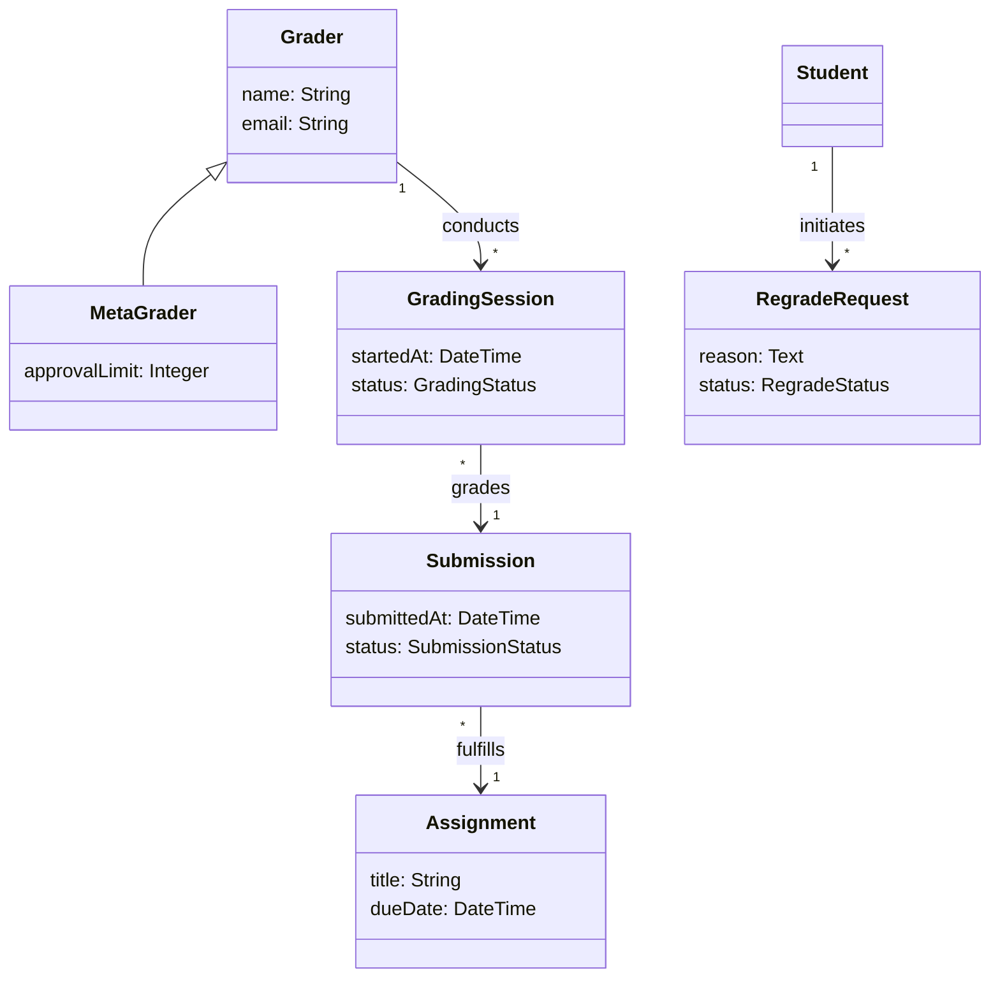

import RevealJS, { Slide } from '@site/src/components/RevealJS';
import Img from '@site/src/components/Img';
import PollSlide from '@site/src/components/PollSlide';
import QuoteSlide from '@site/src/components/QuoteSlide';

<RevealJS transition="slide">

{/* ============================================ */}
{/* COVER IMAGE */}
{/* ============================================ */}

<Slide>
  

<aside className="notes">
**Lecture overview:**
- **Total time:** ~55 minutes (tight pacing)
- **Prerequisites:** Students understand information hiding (L6), changeability (L7-L8), requirements analysis (L9)
- **Connects to:** L9 requirements analysis, L6 information hiding, upcoming architecture lectures

**Structure:**
- Introduction: Why domain modeling matters (~5 min)
- Formulating a domain model (~15 min)
- Validating with stakeholders (~5 min)
- Translating to OO design (~20 min)
- Representational gap (~10 min)

**Key theme:** Domain modeling bridges human understanding and code implementation. It's information hiding at the conceptual level.

→ **Transition:** Let's start with the learning objectives...
</aside>

</Slide>

{/* ============================================ */}
{/* TITLE SLIDE */}
{/* ============================================ */}

<Slide>

# CS 3100: Program Design and Implementation II

## Lecture 12: Domain Modeling

<p style={{marginTop: '2em', fontSize: '0.8em', color: '#666'}}>
  ©2025 Jonathan Bell, CC-BY-SA
</p>

<aside className="notes">
**Context from previous lectures:**
- L6: Information hiding—modules should expose *what* they do, not *how*
- L9: Requirements analysis—understanding problems deeply before designing solutions
- Today: We apply information hiding at the conceptual level

**Key message:** A well-designed domain model hides implementation-level thinking (maps, counters, byte arrays) behind domain-level abstractions (Submissions, Students, GradingSessions).

→ **Transition:** Here's what you'll be able to do after today...
</aside>

</Slide>

{/* ============================================ */}
{/* LEARNING OBJECTIVES */}
{/* ============================================ */}

<Slide>

## Learning Objectives

<p style={{fontSize: '0.85em', textAlign: 'left'}}>
After this lecture, you will be able to:
</p>

<ol style={{fontSize: '0.75em', textAlign: 'left'}}>
  <li>Formulate a domain model given a set of requirements</li>
  <li>Validate domain models with stakeholders through scenario walkthroughs</li>
  <li>Translate a domain model into an object-oriented design using responsibility assignment heuristics</li>
  <li>Evaluate the representational gap between a domain model and an OO design</li>
</ol>

<aside className="notes">
**Time allocation:**
- Objective 1: Formulating domain models (~15 min)
- Objective 2: Validation techniques (~5 min)
- Objective 3: Responsibility assignment—Information Expert, Creator, Controller (~20 min)
- Objective 4: Representational gap and strategies (~10 min)

Plus ~5 min intro connecting to prior material.

**Why this matters:** Domain modeling is how we ensure code stays understandable and maintainable as requirements evolve.

→ **Transition:** Let's start by connecting to what we've learned...
</aside>

</Slide>

{/* ============================================ */}
{/* ARC 1: INTRODUCTION - WHY DOMAIN MODELING */}
{/* ============================================ */}

<Slide>

## Information Hiding at the Conceptual Level

<p style={{fontSize: '0.9em'}}>
In <strong>Lecture 6</strong>, we learned that information hiding means modules should expose <em>what</em> they do, not <em>how</em>.
</p>

<p style={{fontSize: '0.9em', marginTop: '1em', color: '#9370DB'}}>
Today we apply this at the <strong>conceptual level</strong>:
</p>

<ul style={{fontSize: '0.85em'}}>
  <li>Hide <strong>implementation-level thinking</strong> (maps, counters, byte arrays)</li>
  <li>Expose <strong>domain-level abstractions</strong> (Submissions, Students, GradingSessions)</li>
</ul>

<p style={{fontSize: '0.9em', marginTop: '1em'}}>
The same principle—hide the "how," expose the "what"—operates at every scale.
</p>

<aside className="notes">
**The connection to L6:**
- L6: private fields, sealed classes, modules hide implementation details
- L12: domain models hide *implementation-level thinking* behind domain abstractions
- Both serve the same goal: understandability and changeability

**Why this matters:**
- Code that uses domain vocabulary is easier to navigate
- Developers can predict where functionality lives
- Non-technical stakeholders can understand the code structure

→ **Transition:** But what makes code understandable?
</aside>

</Slide>

<Slide>

## The Challenge of Understandability

<p style={{fontSize: '0.9em'}}>
Throughout this course, we've emphasized <strong>changeability</strong>, <strong>readability</strong>, and <strong>maintainability</strong>. But these all serve a more fundamental goal:
</p>

<p style={{fontSize: '1.3em', color: '#9370DB', textAlign: 'center', marginTop: '1em'}}>
<strong>Understandability</strong>
</p>

<p style={{fontSize: '0.85em', marginTop: '1em'}}>
Code that humans can understand is code that humans can successfully work with, modify, and trust.
</p>

<p style={{fontSize: '0.85em', marginTop: '0.5em', color: '#666'}}>
But understandability is <em>subjective</em>—it depends on context. One common approach: model the problem domain in the code.
</p>

<aside className="notes">
**The insight:**
- Changeability, readability, maintainability are means to an end
- The end is understandability
- Understandable code can be trusted, modified, evolved

**The strategy:**
- If code mirrors the problem domain...
- ...then understanding the domain means understanding the code
- Domain experts become code reviewers

→ **Transition:** Let's see a concrete example...
</aside>

</Slide>

<Slide>

## A Pawtograder Scenario

<p style={{fontSize: '0.9em'}}>
A student submits their assignment. A grader starts reviewing it. But then the student realizes they forgot something and resubmits.
</p>

<p style={{fontSize: '1em', marginTop: '1em', fontWeight: 'bold', color: '#9370DB'}}>
How should our system handle this?
</p>

<p style={{fontSize: '0.85em', marginTop: '1em'}}>
Let's look at two implementations...
</p>

<aside className="notes">
**Set up the scenario:**
- This is a real problem Pawtograder has to solve
- Involves coordination between submission, grading, and revision
- Multiple stakeholders affected: student, grader, instructor

**Ask students:** What should happen to the grader's work?

→ **Transition:** Here are two approaches...
</aside>

</Slide>

<Slide>

## Approach A: Technical-Focused Design

```java
public class SubmissionManager {
    private Map<String, List<byte[]>> fileStorage = new HashMap<>();
    private Map<String, Integer> versionCounters = new HashMap<>();
    private Map<String, Map<String, Object>> gradeData = new HashMap<>();

    public String submitFiles(String userId, String assignmentId, byte[] files) {
        String key = userId + "_" + assignmentId;

        Map<String, Object> existingGrade = gradeData.get(key);
        if (existingGrade != null && existingGrade.get("status").equals("IN_PROGRESS")) {
            int version = versionCounters.getOrDefault(key, 0) + 1;
            versionCounters.put(key, version);
            fileStorage.put(key + "_v" + version, files);

            Map<String, Object> newGradeData = new HashMap<>(existingGrade);
            newGradeData.put("status", "NEEDS_REGRADING");
            gradeData.put(key + "_v" + version, newGradeData);
            return key + "_v" + version;
        }
        fileStorage.put(key, files);
        return key;
    }
}
```

<aside className="notes">
**Walk through the code:**
- Maps everywhere: fileStorage, versionCounters, gradeData
- String concatenation for keys
- Status stored as string in nested Map
- What's "v2"? What's "NEEDS_REGRADING"?

**Questions to ask:**
- What does this code do? Can you tell at a glance?
- What happens to the grader's work?
- Is "NEEDS_REGRADING" documented anywhere?

→ **Transition:** Now let's see a domain-aligned approach...
</aside>

</Slide>

<Slide>

## Approach B: Domain-Aligned Design

```java
public class Submission {
    private final Student student;
    private final Assignment assignment;
    private final List<SourceFile> files;
    private GradingSession activeGradingSession;

    public Submission createRevision(List<SourceFile> newFiles) {
        Submission revision = new Submission(student, assignment, newFiles);

        if (hasActiveGrading()) {
            GradingDraft draft = activeGradingSession.convertToDraft();
            revision.attachDraftGrading(draft);

            activeGradingSession.getGrader().notify(
                new RevisionSubmittedEvent(this, revision)
            );
        }
        return revision;
    }

    public boolean hasActiveGrading() {
        return activeGradingSession != null && !activeGradingSession.isComplete();
    }
}
```

<aside className="notes">
**Walk through the code:**
- Classes named after domain concepts: Submission, Student, Assignment
- Methods use domain language: createRevision, hasActiveGrading
- Behavior is explicit: converting to draft, notifying grader
- The code reads like a description of the business process

**Contrast with Approach A:**
- No mysterious keys or version counters
- The grader's work is explicitly preserved as a draft
- Notification happens—we can see it in the code

→ **Transition:** Which is more understandable?
</aside>

</Slide>

<Slide>

## Poll: Which Implementation is More Understandable?

<PollSlide choices={["Approach A (Technical)", "Approach B (Domain-Aligned)", "They're equally understandable", "Neither is understandable"]} />

<aside className="notes">
**Discussion after poll:**
- Approach A might execute faster, use less memory
- But what does "v2" mean? Version? Variant?
- What happens to the grader's work in A?
- Approach B directly represents domain concepts

**Key insight:** Performance can be optimized later. Understanding can't be retrofitted.

→ **Transition:** Let's break down why domain-aligned is better...
</aside>

</Slide>

<Slide>

## Why Domain-Aligned Design Wins

<div style={{display: 'grid', gridTemplateColumns: '1fr 1fr', gap: '1em', fontSize: '0.75em'}}>

<div style={{backgroundColor: 'rgba(255,100,100,0.1)', padding: '0.5em', borderRadius: '8px'}}>

**Approach A Problems:**
- What does "v2" mean?
- Why concatenate strings for keys?
- What happens to grader's work?
- What triggers "NEEDS_REGRADING"?

</div>

<div style={{backgroundColor: 'rgba(100,255,100,0.1)', padding: '0.5em', borderRadius: '8px'}}>

**Approach B Clarity:**
- `Submission` has a `GradingSession`
- `GradingSession` → `GradingDraft`
- Grader is notified explicitly
- Code reads like business process

</div>

</div>

<p style={{fontSize: '0.85em', marginTop: '1em'}}>
When code uses the same concepts, relationships, and vocabulary as the problem domain, it becomes easier to:
</p>

<ul style={{fontSize: '0.8em'}}>
  <li><strong>Navigate</strong> from requirement to implementation</li>
  <li><strong>Predict</strong> where functionality lives</li>
  <li><strong>Understand</strong> the impact of changes</li>
  <li><strong>Communicate</strong> with non-technical stakeholders</li>
</ul>

<aside className="notes">
**The benefits:**
- Navigate: "Where's the regrade logic?" → look in RegradeRequest
- Predict: "How do we handle deadlines?" → probably in Assignment or Submission
- Understand: Changes to grading affect GradingSession, not random Maps
- Communicate: Product managers can review domain classes

**Connection to L6:**
- Information hiding at class level: hide field implementation
- Information hiding at conceptual level: hide technical implementation behind domain language

→ **Transition:** But achieving this alignment is difficult...
</aside>

</Slide>

<Slide>

## The Challenge: Same Word, Different Meanings

<p style={{fontSize: '0.9em'}}>
A "submission" means different things to different stakeholders:
</p>

<div style={{fontSize: '0.75em', marginTop: '0.5em'}}>

| Stakeholder | "Submission" means... |
|-------------|----------------------|
| **Student** | "My attempt at the assignment" |
| **Grader** | "Work I need to evaluate" |
| **System** | "An execution of grading script on student code" |

</div>

<p style={{fontSize: '0.85em', marginTop: '1em', color: '#9370DB'}}>
Domain modeling forces us to be <strong>explicit</strong> about our understanding <em>before</em> making implementation decisions.
</p>

<aside className="notes">
**The problem:**
- Real-world concepts are messy, full of exceptions
- Different stakeholders have different views
- Without explicit modeling, we embed implicit assumptions

**Domain modeling as a tool:**
- Forces explicit discussion of terminology
- Creates a shared vocabulary
- Becomes a map from requirements to code

→ **Transition:** Let's learn how to create domain models...
</aside>

</Slide>

{/* ============================================ */}
{/* ARC 2: FORMULATING A DOMAIN MODEL */}
{/* ============================================ */}

<Slide>

## Formulating a Domain Model: A 4-Step Process

<p style={{fontSize: '0.9em'}}>
Creating a domain model is iterative discovery and refinement:
</p>

<ol style={{fontSize: '0.85em'}}>
  <li><strong>Extract</strong> candidate concepts from requirements</li>
  <li><strong>Filter</strong> and consolidate—remove synonyms, distinguish attributes from concepts</li>
  <li><strong>Discover</strong> hidden concepts implied but not named</li>
  <li><strong>Build</strong> the initial model with relationships</li>
</ol>

<p style={{fontSize: '0.85em', marginTop: '1em', color: '#666'}}>
Let's work through a detailed example...
</p>

<aside className="notes">
**The process:**
- Not linear—expect to iterate
- Step 3 is often the most valuable
- Real requirements are messy—we'll use realistic ones

**Connection to L9:**
- Requirements analysis gave us the raw material
- Domain modeling structures that material into a model
- Both are about deep understanding before implementation

→ **Transition:** Here's our example requirements...
</aside>

</Slide>

<Slide>

## Example: Pawtograder Grading System Requirements

<div style={{fontSize: '0.7em', backgroundColor: 'rgba(147, 112, 219, 0.1)', padding: '0.75em', borderRadius: '8px'}}>

> The university wants to modernize how graders provide feedback on programming assignments. Graders can provide inline comments on specific lines of code, rate code quality on various dimensions (correctness, style, design), and assign scores based on a rubric. Some graders ("meta-graders") have additional privileges—they can review other graders' work and handle regrade requests.
>
> Students can request regrades if they believe their submission was scored incorrectly. The original grader handles the initial regrade request. If the student is still dissatisfied, they can escalate to a meta-grader. As a last resort, the instructor can review any grading decision.
>
> The system needs to ensure fair distribution of grading work and prevent the same grader from repeatedly grading the same student (to avoid bias). Meta-graders should review a sampling of each grader's work to ensure consistency. All grading actions must be tracked for audit purposes.

</div>

<aside className="notes">
**Notice:**
- Real requirements are dense with concepts
- Some concepts are explicit, some implied
- Business rules are embedded in prose
- Multiple stakeholders mentioned

**We'll use this throughout the lecture.**

→ **Transition:** Step 1: Extract candidate concepts...
</aside>

</Slide>

<Slide>

## Step 1: Extract Candidate Concepts

<p style={{fontSize: '0.85em'}}>
Identify all nouns and noun phrases from the requirements:
</p>

<div style={{display: 'grid', gridTemplateColumns: '1fr 1fr 1fr', gap: '0.5em', fontSize: '0.7em', marginTop: '0.5em'}}>

<div>
- graders
- meta-graders
- feedback
- inline comments
- programming assignments
</div>

<div>
- lines of code
- code quality
- dimensions
- scores
- rubric
</div>

<div>
- regrade requests
- students
- submissions
- original grader
- instructor
</div>

</div>

<div style={{display: 'grid', gridTemplateColumns: '1fr 1fr', gap: '0.5em', fontSize: '0.7em', marginTop: '0.5em'}}>

<div>
- grading work
- grading decision
</div>

<div>
- grading actions
- audit
</div>

</div>

<p style={{fontSize: '0.8em', marginTop: '1em', color: '#9370DB'}}>
This is just the raw extraction—now we need to filter and consolidate.
</p>

<aside className="notes">
**Technique:**
- Read requirements slowly
- Underline/highlight every noun and noun phrase
- Don't filter yet—capture everything

**Common mistake:**
- Filtering too early
- Missing subtle concepts
- Assuming you know what's important

→ **Transition:** Step 2: Filter and consolidate...
</aside>

</Slide>

<Slide>

## Step 2: Filter and Consolidate

<p style={{fontSize: '0.85em'}}>
Apply several filters to clean up the raw list:
</p>

<div style={{fontSize: '0.75em'}}>

**Remove synonyms—choose canonical names:**
- "programming assignments" and "assignments" → **Assignment**
- "grading work" and "grading decision" → **GradingSession**

**Distinguish attributes from concepts:**
- "lines of code" → attribute of SourceFile (not a separate concept)
- "correctness, style, design" → values of a `QualityDimension` attribute

**Identify what varies:**
- Graders vs Meta-graders → might need role attribute or inheritance
- Regrade requests have stages → need status tracking

</div>

<aside className="notes">
**The filters:**
- Synonyms create confusion—pick one term and use it consistently
- Not everything is a class—some things are just attributes
- Variation often signals important design decisions

**Discussion:**
- Should meta-grader be a subclass or a role?
- This is a design decision we'll revisit

→ **Transition:** Step 3 is where the magic happens...
</aside>

</Slide>

<Slide>

## Step 3: Discover Hidden Concepts

<p style={{fontSize: '0.85em'}}>
Requirements often <em>imply</em> concepts without <em>naming</em> them:
</p>

<div style={{fontSize: '0.75em', marginTop: '0.5em'}}>

| Requirement phrase | Hidden concept |
|-------------------|----------------|
| "ensure fair distribution" | **WorkloadDistributor** or **GradingAssignment** |
| "prevent same grader from repeatedly grading same student" | **GradingConstraints** or **GradingHistory** |
| "review a sampling" | **QualityReview** |
| "based on a rubric" | **Rubric** and **RubricItem** |
| "tracked for audit purposes" | **AuditLog** or **GradingEvent** |

</div>

<p style={{fontSize: '0.8em', marginTop: '1em', color: '#9370DB'}}>
Hidden concepts are often the most architecturally significant—they represent cross-cutting concerns and business rules.
</p>

<aside className="notes">
**Why this matters:**
- Hidden concepts often become critical classes
- They represent business rules that cut across features
- Missing them leads to scattered, duplicated logic

**Technique:**
- Look for verbs that imply process
- Look for constraints that need enforcement
- Ask "how would this be implemented?"

→ **Transition:** Step 4: Build the model...
</aside>

</Slide>

<Slide>

## Step 4: Build the Initial Domain Model



<aside className="notes">
**Walk through the model:**
- Core entities: Grader, Assignment, Submission, GradingSession
- MetaGrader extends Grader (chosen inheritance over role)
- Relationships show who does what to whom
- This is a starting point—will evolve

**Note:** This is simplified—full model would include RubricItem, InlineComment, etc.

→ **Transition:** Let's look at common problems in domain modeling...
</aside>

</Slide>

<Slide>

## Common Problem 1: Modeling Verbs as Nouns

<p style={{fontSize: '0.85em'}}>
Sometimes an action is so important it becomes a concept:
</p>

```java
// Wrong: Thinking of "regrade" as just a method
class Grader {
    void regradeSubmission(Submission s) { }
}

// Right: "RegradeRequest" is important enough to be a concept
class RegradeRequest {
    Student requester;
    GradingSession originalSession;
    String reason;
    RegradeStatus status;
    List<RegradeResponse> responses;  // Can have multiple as it escalates
}
```

<p style={{fontSize: '0.8em', marginTop: '0.5em', color: '#9370DB'}}>
Ask: Does this action have a lifecycle? Can it be referenced later? Does it have its own data?
</p>

<aside className="notes">
**When verbs become nouns:**
- The action has a lifecycle (created, in progress, resolved)
- The action needs to be referenced later
- The action carries data (reason, responses)
- Multiple parties interact with it

**Examples:**
- "submit" → Submission
- "grade" → GradingSession
- "request regrade" → RegradeRequest

→ **Transition:** Another common problem...
</aside>

</Slide>

<Slide>

## Common Problem 2: Missing Temporal Aspects

<p style={{fontSize: '0.85em'}}>
Real domains often involve history and change over time:
</p>

```java
// Naive: Only current state
class Submission {
    Grade currentGrade;
}

// Better: Capturing history
class Submission {
    List<GradingSession> gradingSessions;  // All grading attempts
    List<Submission> previousVersions;      // If student resubmitted

    GradingSession getActiveGrading() {
        return gradingSessions.stream()
            .filter(s -> s.getStatus() == GradingStatus.IN_PROGRESS)
            .findFirst().orElse(null);
    }
}
```

<p style={{fontSize: '0.8em', marginTop: '0.5em', color: '#9370DB'}}>
Ask: Do we need to know what happened before? Can this change over time?
</p>

<aside className="notes">
**When to capture history:**
- Audit requirements ("track all grading actions")
- Undo/rollback needs
- Analytics ("how long does grading take?")
- Multiple versions (resubmissions, regrades)

**The cost:**
- More complex data model
- More storage
- Worth it when history matters to the domain

→ **Transition:** One more common problem...
</aside>

</Slide>

<Slide>

## Common Problem 3: Over-Modeling

<p style={{fontSize: '0.85em'}}>
Not everything needs to be a class:
</p>

```java
// Over-modeled: Making everything a class
class LineNumber {
    private int value;
}

class CommentText {
    private String value;
}

// Appropriate: Using primitives for simple values
class InlineComment {
    int lineNumber;      // Just an int
    String comment;      // Just a String
    SourceFile file;     // This IS a concept
}
```

<p style={{fontSize: '0.8em', marginTop: '0.5em', color: '#9370DB'}}>
Ask: Does this have behavior? Does it have invariants to protect? Would a domain expert recognize it as a distinct concept?
</p>

<aside className="notes">
**Avoid over-modeling when:**
- The "concept" is just a primitive wrapper
- No behavior or invariants
- Domain experts wouldn't recognize it as distinct

**Do model when:**
- The concept has behavior
- The concept has invariants (e.g., EmailAddress must be valid)
- The concept appears in domain conversations

**Balance:** Simple enough to understand, rich enough to express the domain.

→ **Transition:** Now let's validate our model...
</aside>

</Slide>

{/* ============================================ */}
{/* ARC 3: VALIDATION WITH STAKEHOLDERS */}
{/* ============================================ */}

<Slide>

## Validating Domain Models

<p style={{fontSize: '0.9em'}}>
A domain model is a <strong>communication tool</strong>. Before writing code, validate your understanding with stakeholders.
</p>

<p style={{fontSize: '0.85em', marginTop: '1em'}}>
Validation exposes critical misunderstandings <em>early</em>, when they're cheap to fix.
</p>

<div style={{fontSize: '0.8em', marginTop: '1em'}}>

**Key validation techniques:**
- Scenario walkthroughs
- Terminology review
- Multiplicity verification
- Missing concepts discovery

</div>

<aside className="notes">
**Why validate:**
- Models are hypotheses about the domain
- Stakeholders are domain experts
- Early feedback prevents expensive rework

**When to validate:**
- Before significant implementation
- When adding major features
- When stakeholders change

→ **Transition:** Let's see each technique...
</aside>

</Slide>

<Slide>

## Validation Technique: Scenario Walkthroughs

<p style={{fontSize: '0.85em'}}>
Take specific scenarios and trace them through the model:
</p>

<div style={{fontSize: '0.75em', backgroundColor: 'rgba(147, 112, 219, 0.1)', padding: '0.5em', borderRadius: '8px'}}>

> "A student is unhappy with their grade and requests a regrade. According to our model, they create a **RegradeRequest** linked to their **GradingSession**. The original **Grader** creates a **RegradeResponse**. If the student is still unsatisfied, what happens?"

</div>

<p style={{fontSize: '0.8em', marginTop: '1em'}}>
This might expose issues like:
</p>

<ul style={{fontSize: '0.75em'}}>
  <li>"Students can't escalate directly to instructors—it must go through meta-graders first"</li>
  <li>"We need a cooling-off period—students can't request a regrade within 24 hours"</li>
  <li>"Meta-graders can't handle regrades for submissions they already reviewed"</li>
</ul>

<aside className="notes">
**The technique:**
- Pick a concrete scenario (ideally a tricky edge case)
- Walk through it step by step using model terminology
- Ask stakeholders: "Is this right? What did I miss?"

**Benefits:**
- Exposes implicit assumptions
- Reveals missing states and transitions
- Creates shared understanding

→ **Transition:** Another validation technique...
</aside>

</Slide>

<Slide>

## Validation Technique: Terminology Review

<p style={{fontSize: '0.85em'}}>
Ensure you're using the right words:
</p>

<div style={{fontSize: '0.8em', backgroundColor: 'rgba(147, 112, 219, 0.1)', padding: '0.5em', borderRadius: '8px'}}>

> **You**: "We're calling them 'meta-graders'. Is that the right term?"
>
> **Professor**: "Actually, we call them 'head TAs' and regular graders are just 'TAs'."

</div>

<p style={{fontSize: '0.85em', marginTop: '1em'}}>
This reveals we should align our model with existing terminology.
</p>

<p style={{fontSize: '0.8em', marginTop: '0.5em', color: '#9370DB'}}>
Using unfamiliar terms creates a translation burden. Use the language stakeholders already use.
</p>

<aside className="notes">
**Why terminology matters:**
- Wrong terms create confusion in meetings
- Stakeholders won't recognize their domain
- Translation burden increases cognitive load

**The ubiquitous language (DDD concept):**
- Same terms in code, docs, and conversations
- No translation layer
- Everyone speaks the same language

→ **Transition:** What validation often reveals...
</aside>

</Slide>

<Slide>

## What Validation Typically Reveals

<div style={{fontSize: '0.75em'}}>

| Category | Example discovery |
|----------|-------------------|
| **Hidden business rules** | "Regrades can only adjust scores up to 10% without instructor approval" |
| **Temporal constraints** | "Grading must be completed within one week of submission deadline" |
| **Hidden actors** | "The department administrator can override grading assignments" |
| **Complex states** | "A regrade isn't just 'pending' or 'resolved'—it can be 'awaiting-response', 'under-review', 'escalated', 'requires-meeting'" |
| **Cross-cutting concerns** | "We need to track TIME spent on grading for workload credits" |

</div>

<p style={{fontSize: '0.85em', marginTop: '1em', color: '#9370DB'}}>
The model after validation often looks quite different from the initial attempt—but it much better represents the actual problem.
</p>

<aside className="notes">
**Why this matters:**
- These discoveries would otherwise become bugs
- Or emergency feature requests
- Or architectural refactors

**The investment:**
- A few hours of validation saves weeks of rework
- Stakeholders appreciate being consulted
- Builds trust in the development process

→ **Transition:** Now let's translate our model to code...
</aside>

</Slide>

{/* ============================================ */}
{/* ARC 4: TRANSLATING TO OO DESIGN */}
{/* ============================================ */}

<Slide>

## From Domain Model to Object-Oriented Design

<p style={{fontSize: '0.9em'}}>
Now we translate our validated domain model into working code.
</p>

<p style={{fontSize: '0.85em', marginTop: '1em'}}>
The critical question: <strong>Which classes own which behaviors?</strong>
</p>

<p style={{fontSize: '0.85em', marginTop: '0.5em'}}>
We'll use three key heuristics:
</p>

<ol style={{fontSize: '0.85em'}}>
  <li><strong>Information Expert</strong> — Who has the data needed?</li>
  <li><strong>Creator</strong> — Who should create new objects?</li>
  <li><strong>Controller</strong> — Who coordinates complex operations?</li>
</ol>

<aside className="notes">
**The challenge:**
- Domain model shows concepts and relationships
- OO design assigns behavior to classes
- Wrong assignments lead to tangled code

**Why heuristics:**
- No single "right" answer
- Heuristics guide toward good designs
- Experience refines judgment

→ **Transition:** Let's start with Information Expert...
</aside>

</Slide>

<Slide>

## Heuristic 1: Information Expert

<p style={{fontSize: '0.9em', color: '#9370DB'}}>
<strong>Assign responsibility to the class that has the information needed to fulfill it.</strong>
</p>

<p style={{fontSize: '0.85em', marginTop: '1em'}}>
Example: Who should determine if a regrade can be escalated?
</p>

```java
public class RegradeRequest {
    private final List<RegradeResponse> responses;
    private RegradeStatus status;

    // RegradeRequest knows its own history
    public boolean canEscalate() {
        if (responses.isEmpty()) return false;
        if (status == RegradeStatus.RESOLVED) return false;

        // Business rule: 24-hour cooling-off period
        RegradeResponse lastResponse = responses.get(responses.size() - 1);
        return ChronoUnit.HOURS.between(
            lastResponse.getCreatedAt(),
            LocalDateTime.now()
        ) >= 24;
    }
}
```

<aside className="notes">
**Why RegradeRequest is the expert:**
- It has the list of responses
- It has the current status
- It has the timestamps needed for cooling-off

**Alternative (wrong):**
- RegradeService.canEscalate(request) → service has to extract all data
- GraderController.checkEscalation() → controller shouldn't have business logic

**The pattern:**
- Data and behavior stay together
- Reduces coupling (no need to pass data around)
- Makes the class cohesive

→ **Transition:** Another example...
</aside>

</Slide>

<Slide>

## Information Expert: Another Example

<p style={{fontSize: '0.85em'}}>
Who should check if a grader can review a regrade?
</p>

```java
public class Grader {
    private final GraderType type;
    private final Set<String> previouslyGradedStudentIds;
    private int activeGradingCount;

    // Grader knows its own constraints
    public boolean canReviewRegrade(RegradeRequest request) {
        // Can't review own work
        if (request.getOriginalSession().getGrader().equals(this)) {
            return false;
        }

        // Check workload
        if (activeGradingCount >= getMaxConcurrentGradings()) {
            return false;
        }

        return true;
    }
}
```

<p style={{fontSize: '0.8em', marginTop: '0.5em', color: '#9370DB'}}>
The Grader knows its type, workload, and history—it's the expert on its own constraints.
</p>

<aside className="notes">
**Why Grader is the expert:**
- Knows its own type (regular vs meta)
- Knows its workload
- Can check conflict of interest

**Benefits:**
- Self-contained validation
- Easy to test in isolation
- Business rules live with the entity they govern

→ **Transition:** Now let's look at Creator...
</aside>

</Slide>

<Slide>

## Heuristic 2: Creator

<p style={{fontSize: '0.9em', color: '#9370DB'}}>
<strong>Assign class B the responsibility to create instances of class A if B aggregates, contains, records, or has the initializing data for A.</strong>
</p>

<p style={{fontSize: '0.85em', marginTop: '1em'}}>
Example: Who should create InlineComment objects?
</p>

```java
public class GradingSession {
    private final List<InlineComment> comments = new ArrayList<>();

    // GradingSession contains comments, so it creates them
    public InlineComment addComment(SourceFile file, int lineNumber, String text) {
        InlineComment comment = new InlineComment(
            this,           // The session context
            file,
            lineNumber,
            text,
            LocalDateTime.now()
        );
        comments.add(comment);
        return comment;
    }
}
```

<aside className="notes">
**Why GradingSession creates comments:**
- It contains/aggregates comments
- It has the context needed (this session)
- It can enforce invariants (e.g., session must be active)

**Alternative creators:**
- Factory: when creation is complex or varies by type
- Service: when creation requires external resources

**The pattern:**
- Container creates contained objects
- Keeps creation logic close to usage
- Maintains encapsulation

→ **Transition:** Sometimes services are the creator...
</aside>

</Slide>

<Slide>

## Creator: Service as Creator

<p style={{fontSize: '0.85em'}}>
For complex creation involving multiple entities, a service may be the creator:
</p>

```java
public class RegradeService {
    private final NotificationService notificationService;
    private final AuditLog auditLog;

    public RegradeResponse handleRegradeRequest(
            Grader grader, RegradeRequest request,
            Decision decision, String explanation,
            List<RubricScore> adjustedScores) {

        if (!grader.canReviewRegrade(request)) {
            throw new UnauthorizedRegradeException();
        }

        // Service creates RegradeResponse with all necessary data
        RegradeResponse response = new RegradeResponse(
            grader, request, decision, explanation, adjustedScores
        );

        request.addResponse(response);
        auditLog.recordRegradeResponse(grader, request, response);
        notificationService.notifyStudent(request.getStudent(), response);

        return response;
    }
}
```

<aside className="notes">
**Why service creates here:**
- Creation involves coordination (notification, audit)
- Multiple entities need to be updated
- Transaction boundary

**The service:**
- Has all the data needed
- Coordinates the operation
- But delegates business logic to domain objects (canReviewRegrade)

→ **Transition:** Now let's look at Controller...
</aside>

</Slide>

<Slide>

## Heuristic 3: Controller

<p style={{fontSize: '0.9em', color: '#9370DB'}}>
<strong>Assign responsibility for handling system events to a controller class that coordinates the response.</strong>
</p>

<p style={{fontSize: '0.85em', marginTop: '1em'}}>
Controllers manage flow without implementing business logic:
</p>

```java
@RestController
public class RegradeController {
    private final RegradeService regradeService;
    private final AuthenticationService authService;

    @PostMapping("/regrade-requests/{id}/escalate")
    public ResponseEntity<RegradeRequestDto> escalate(
            @PathVariable String id, @RequestHeader("Authorization") String token) {

        Student student = authService.authenticateStudent(token);
        RegradeRequest request = regradeService.findById(id);

        if (!request.getStudent().equals(student)) {
            throw new UnauthorizedException();
        }

        if (!request.canEscalate()) {  // Delegates to domain object
            throw new EscalationNotAllowedException();
        }

        request = regradeService.escalateRequest(request);
        return ResponseEntity.ok(RegradeRequestDto.fromDomain(request));
    }
}
```

<aside className="notes">
**What controller does:**
- Authenticates (delegates to authService)
- Validates authorization (owns this request?)
- Checks business rule (canEscalate—delegates to domain)
- Orchestrates the operation (delegates to service)
- Transforms for API (DTO)

**What controller does NOT do:**
- Implement business logic
- Know about persistence details
- Make complex decisions

**The pattern:**
- Thin controller, rich domain
- Easy to test business logic separately
- Easy to change API without changing logic

→ **Transition:** Let's see how these work together...
</aside>

</Slide>

<Slide>

## Putting It All Together

```java
// Information Expert: Domain objects know about themselves
public class RegradeRequest {
    public boolean canEscalate() { /* uses its own data */ }
}

public class Grader {
    public boolean canReviewRegrade(RegradeRequest r) { /* knows constraints */ }
}

// Creator: Containers create their components
public class GradingSession {
    public InlineComment addComment(SourceFile f, int line, String text) {
        /* creates and contains comments */
    }
}

// Creator: Services create complex aggregates
public class RegradeService {
    public RegradeResponse handleRegradeRequest(...) {
        /* coordinates creation with notifications, audit */
    }
}

// Controller: Coordinates without business logic
public class RegradeController {
    public ResponseEntity<RegradeRequestDto> escalate(...) {
        /* authenticate, authorize, delegate, transform */
    }
}
```

<aside className="notes">
**The result:**
- Each class has clear responsibilities
- Business logic stays in domain objects
- Services coordinate complex operations
- Controllers handle external interactions

**Benefits:**
- Code structure mirrors domain understanding
- Easy to navigate from requirement to code
- Easy to test each piece in isolation

→ **Transition:** But there's always a gap...
</aside>

</Slide>

<Slide>

## Poll: Where Should This Logic Live?

<p style={{fontSize: '0.85em'}}>
"Check if a student has exceeded their maximum regrade requests for the semester"
</p>

<PollSlide choices={["Student class", "RegradeRequest class", "RegradeService", "RegradeController", "A new RegradePolicy class"]} />

<aside className="notes">
**Discussion after poll:**
- Student: has the student ID but not regrade history
- RegradeRequest: knows one request, not all requests
- RegradeService: has access to repository, can count
- RegradeController: should not have business logic
- RegradePolicy: encapsulates the business rule

**Best answer:** RegradeService or RegradePolicy
- Needs to query across requests (not single request's data)
- Is a business rule (not just coordination)
- Could be extracted to Policy class for testability

→ **Transition:** Now let's discuss the representational gap...
</aside>

</Slide>

{/* ============================================ */}
{/* ARC 5: REPRESENTATIONAL GAP */}
{/* ============================================ */}

<Slide>

## The Representational Gap


<aside className="notes">
**The representational gap:**
- Domain model = how we understand the problem
- Implementation = how we solve it in code
- Gap = difference between the two

**Some gap is inevitable:**
- Technical requirements (persistence, transactions)
- Performance optimizations
- Framework constraints

**Goal:** Minimize the gap, contain it well.

→ **Transition:** Let's see where gaps come from...
</aside>

</Slide>

<Slide>

## Sources of Representational Gap

<p style={{fontSize: '0.85em'}}>
Our implementation requires technical classes absent from the domain model:
</p>

<div style={{display: 'grid', gridTemplateColumns: '1fr 1fr', gap: '1em', fontSize: '0.7em'}}>

<div>

**Technical Infrastructure**
```java
// Domain model has no concept of:
public interface RegradeRepository {
    void save(RegradeRequest request);
    Optional<RegradeRequest> findById(String id);
}

public class RegradeRequestDto {
    // JSON representation for API
}

public class DatabaseTransaction {
    // Transaction management
}
```

</div>

<div>

**Performance Optimization**
```java
// Domain: "Grader has graded many students"
// Simple but slow:
class Grader {
    Set<Student> gradedStudents; // Thousands!
}

// Actual implementation:
class Grader {
    Set<String> recentlyGradedStudentIds;
}

// Full history in database
class GradingHistoryService {
    @Cacheable
    boolean hasGradedStudent(String graderId,
                            String studentId);
}
```

</div>

</div>

<aside className="notes">
**Infrastructure gap:**
- Repositories for persistence
- DTOs for serialization
- Transactions for consistency

**Performance gap:**
- Can't load everything into memory
- Need caching, lazy loading
- Database queries instead of object traversal

**Both are necessary but obscure the domain.**

→ **Transition:** How do we minimize this gap?
</aside>

</Slide>

<Slide>

## Strategies to Minimize the Gap

<p style={{fontSize: '0.9em', color: '#9370DB', fontWeight: 'bold'}}>
Rich Domain Model
</p>

<p style={{fontSize: '0.8em'}}>
Put behavior in domain classes, not just data:
</p>

<div style={{display: 'grid', gridTemplateColumns: '1fr 1fr', gap: '1em', fontSize: '0.65em'}}>

<div style={{backgroundColor: 'rgba(255,100,100,0.1)', padding: '0.5em', borderRadius: '8px'}}>

**Anemic Model (larger gap)**
```java
public class RegradeRequest {
    private List<RegradeResponse> responses;
    private RegradeStatus status;

    // Just getters and setters
    public List<RegradeResponse> getResponses() {
        return responses;
    }
    public void setStatus(RegradeStatus s) {
        this.status = s;
    }
}

// Business logic lives elsewhere
class RegradeService {
    boolean canEscalate(RegradeRequest r) {
        // Logic here, far from data
    }
}
```

</div>

<div style={{backgroundColor: 'rgba(100,255,100,0.1)', padding: '0.5em', borderRadius: '8px'}}>

**Rich Model (smaller gap)**
```java
public class RegradeRequest {
    public boolean canEscalate() {
        // Business logic lives WITH the data
        return hasResponse() &&
               !isResolved() &&
               hasCoolingOffPeriodPassed();
    }

    public void escalate(Grader newReviewer) {
        if (!canEscalate()) {
            throw new EscalationNotAllowedException();
        }
        this.status = RegradeStatus.ESCALATED;
        this.currentReviewer = newReviewer;
    }
}
```

</div>

</div>

<aside className="notes">
**Anemic model:**
- Domain objects are just data containers
- Business logic scattered in services
- Hard to find where rules are enforced

**Rich model:**
- Domain objects have behavior
- Business logic close to data
- Code reads like domain description

**This is Information Expert applied consistently.**

→ **Transition:** Another strategy...
</aside>

</Slide>

<Slide>

## Strategies: Repository Pattern

<p style={{fontSize: '0.85em'}}>
Repositories provide an abstraction over data access using domain language:
</p>

```java
// Repository speaks domain language
public interface RegradeRepository {
    List<RegradeRequest> findPendingRequestsForGrader(Grader grader);
    List<RegradeRequest> findEscalatedRequestsNeedingMetaGrader();
    Optional<RegradeRequest> findBySubmissionAndStudent(
        Submission sub, Student student
    );

    // NOT: executeSQL("SELECT * FROM regrade_requests WHERE...")
}
```

<p style={{fontSize: '0.8em', marginTop: '1em'}}>
The repository hides persistence details while using domain vocabulary.
</p>

<p style={{fontSize: '0.8em', color: '#9370DB'}}>
Compare to raw SQL: domain concepts vs. table names and columns.
</p>

<aside className="notes">
**What repository provides:**
- Domain-language interface
- Hides database schema
- Can change persistence without changing domain

**Connection to L6:**
- This is information hiding for persistence
- Interface shows *what*, implementation hides *how*
- Clients don't know if it's SQL, NoSQL, or in-memory

→ **Transition:** How do we measure the gap?
</aside>

</Slide>

<Slide>

## Measuring the Gap

<p style={{fontSize: '0.85em'}}>
Ask these questions to evaluate your representational gap:
</p>

<ol style={{fontSize: '0.8em'}}>
  <li>Can a domain expert read your core classes and understand them?</li>
  <li>Do method names use domain vocabulary or technical jargon?</li>
  <li>Is domain logic mixed with technical concerns (persistence, HTTP)?</li>
  <li>How many layers between user story and implementation?</li>
  <li>Could you explain the code structure by sketching the domain model?</li>
</ol>

<p style={{fontSize: '0.85em', marginTop: '1em', color: '#9370DB'}}>
Some gap is inevitable. The goal is not zero gap, but ensuring the gap exists only where necessary and is well-contained.
</p>

<aside className="notes">
**Practical test:**
- Show domain classes to a stakeholder
- Can they recognize the concepts?
- Can they spot missing behavior?

**Red flags:**
- Service classes longer than domain classes
- Domain classes that are just data bags
- Business terms only in comments, not code

→ **Transition:** One more consideration...
</aside>

</Slide>

<Slide>

## The Cost of Representational Choices Over Time

<p style={{fontSize: '0.85em'}}>
Domain models are <strong>expensive to change</strong> once code depends on them.
</p>

<p style={{fontSize: '0.85em', marginTop: '1em'}}>
Every domain model embeds assumptions that may need revision:
</p>

<ul style={{fontSize: '0.8em'}}>
  <li><strong>Whose vocabulary?</strong> A medical system modeling "patient compliance" may shift to "patient autonomy"</li>
  <li><strong>Whose categories?</strong> A system with boolean `isMale` will need refactoring for broader gender representation</li>
  <li><strong>Whose workflows?</strong> A recipe app designed around cookbooks may struggle with video integration</li>
</ul>

<p style={{fontSize: '0.85em', marginTop: '1em', color: '#9370DB'}}>
Domain concepts propagate through the codebase—into method names, class hierarchies, database schemas, API contracts.
</p>

<aside className="notes">
**The compounding cost:**
- Changing "Submission" affects everywhere it's used
- Database migrations
- API versioning
- Client code updates

**The question isn't "is our model right?"**
- All models are simplifications
- Question: what future changes are we making easy or hard?

**Pragmatic practice:**
- Identify assumptions explicitly
- Ask "what would trigger a rewrite?"
- Design to make likely changes cheaper

→ **Transition:** A cautionary tale...
</aside>

</Slide>

<Slide>

## A Cautionary Tale: The 16-Bit Counter

<div style={{fontSize: '0.75em', backgroundColor: 'rgba(255,200,100,0.2)', padding: '0.75em', borderRadius: '8px'}}>

In December 2004, regional airline Comair experienced a catastrophic scheduling system failure caused by a **16-bit signed integer counter** tracking crew assignments.

The counter reset annually with a maximum value of **32,767**. Bad weather combined with airline expansion meant unusually high scheduling activity. The counter overflowed.

**Result:** Three consecutive days of complete flight cancellations (December 24-26). The airline never fully recovered.

**The worst part?** An updated version fixing the overflow was already available—Comair declined to migrate because the upgrade seemed "too expensive."

</div>

<p style={{fontSize: '0.8em', marginTop: '1em', color: '#9370DB'}}>
A seemingly trivial decision—"16 bits should be plenty"—became an existential threat.
</p>

<aside className="notes">
**The lesson for domain modeling:**
- Small assumptions can have huge consequences
- What if this value grows 10x? 100x?
- What if unusual circumstances cluster?

**Connection to our course:**
- We'll revisit risk management in later lectures
- Today's point: domain models embed assumptions
- Make those assumptions explicit

→ **Transition:** Let's wrap up...
</aside>

</Slide>

{/* ============================================ */}
{/* KEY TAKEAWAYS */}
{/* ============================================ */}

<Slide>

## Key Takeaways

<ul style={{fontSize: '0.8em'}}>
  <li><strong>Domain modeling</strong> bridges human understanding and code implementation</li>
  <li><strong>Four-step process:</strong> Extract → Filter → Discover hidden concepts → Build model</li>
  <li><strong>Validate early</strong> with stakeholders through scenario walkthroughs</li>
  <li><strong>Responsibility heuristics:</strong> Information Expert, Creator, Controller</li>
  <li><strong>Representational gap</strong> is inevitable but should be minimized and contained</li>
</ul>

<p style={{fontSize: '0.85em', marginTop: '1em', fontWeight: 'bold', color: '#9370DB'}}>
The key insight: Object-oriented design isn't just about classes and inheritance—it's about creating code that reflects human understanding of the problem space.
</p>

<aside className="notes">
**Summary:**
1. Domain modeling makes understanding explicit
2. Systematic process produces better models
3. Validation catches misunderstandings early
4. Heuristics guide responsibility assignment
5. Technical gap is manageable with good patterns

**Connection to course themes:**
- Information hiding at conceptual level (L6)
- Design for change (L7-L8)
- Requirements → domain model → code (L9 → L12)

→ **Transition:** Questions?
</aside>

</Slide>

<Slide>

## Looking Ahead

<p style={{fontSize: '0.9em'}}>
Domain modeling connects to many upcoming topics:
</p>

<div style={{fontSize: '0.85em', marginTop: '1em'}}>

| Lecture | Connection |
|---------|------------|
| **L19: Software Architecture** | Domain models inform system boundaries |
| **L20: Design Patterns** | Patterns implement domain concepts |
| **L35: Safety and Reliability** | Domain assumptions become safety requirements |

</div>

<p style={{fontSize: '1em', marginTop: '1em', color: '#9370DB', textAlign: 'center'}}>
<strong>When we succeed, our code becomes a precise yet understandable expression of the solution to real-world problems.</strong>
</p>

<aside className="notes">
**Preview:**
- Architecture: How domain concepts map to services
- Design patterns: Standard solutions to domain challenges
- Safety: What happens when domain assumptions fail

**The big picture:**
- Domain modeling is foundational
- Every design decision reflects domain understanding
- Good domain models make everything else easier

**Questions?**
</aside>

</Slide>

</RevealJS>
