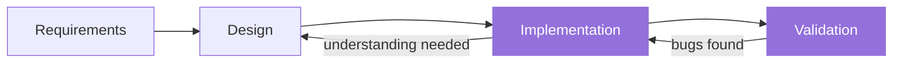
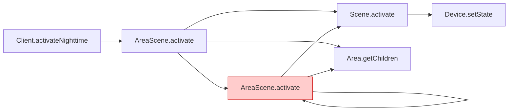
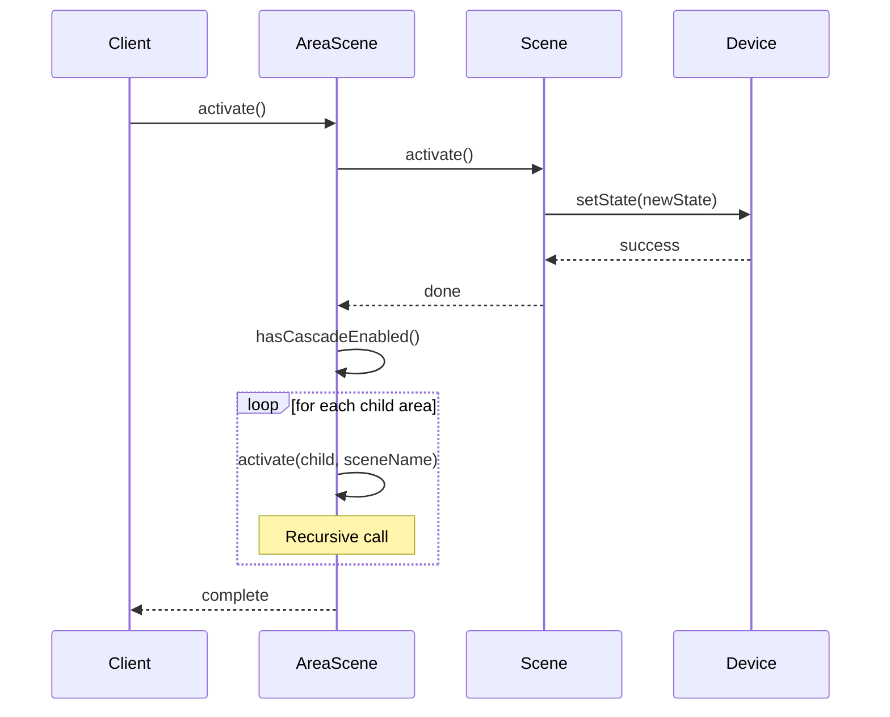
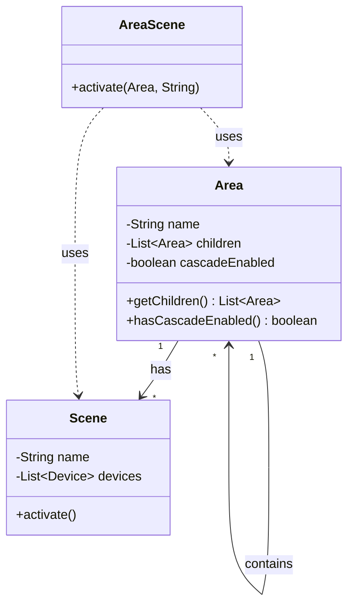
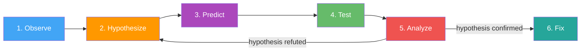
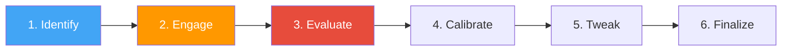
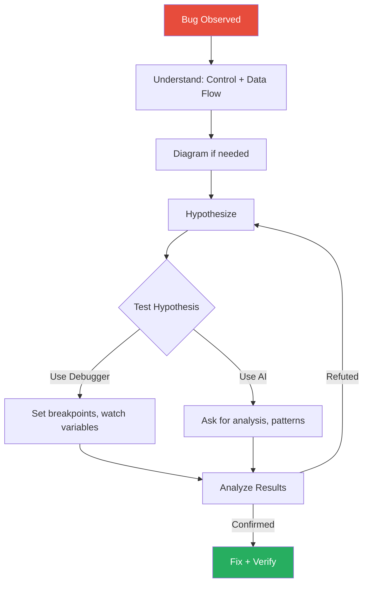

import RevealJS, { Slide } from '@site/src/components/RevealJS';
import Img from '@site/src/components/Img';
import PollSlide from '@site/src/components/PollSlide';
import QuoteSlide from '@site/src/components/QuoteSlide';

<RevealJS transition="slide">

{/* ============================================ */}
{/* COVER IMAGE */}
{/* ============================================ */}

<Slide>
  

<aside className="notes">
**Lecture overview:**
- **Total time:** ~55 minutes (tight)
- **Theme:** Debugging as detective work—systematic investigation, not random guessing
- **Prerequisites:** L5 readability (naming, code clarity), L13 AI coding assistants (workflow)
- **Connects to:** All future assignments (debugging is constant), final project

**Key connections to prior lectures:**
- **L5 Readability:** Good names and clear code make program understanding MUCH easier
- **L13 AI Assistants:** The 6-step workflow applies directly to debugging with AI

**The narrative:**
- Understanding code requires tracing control flow and data flow
- Diagrams help visualize complex relationships
- Debugging is the scientific method applied to code
- Debuggers accelerate hypothesis testing
- AI can assist, but you must understand the code yourself

→ **Transition:** Let's start with the learning objectives...
</aside>

</Slide>

{/* ============================================ */}
{/* TITLE SLIDE */}
{/* ============================================ */}

<Slide>

# CS 3100: Program Design and Implementation II

## Lecture 14: Program Understanding & Debugging

<p style={{marginTop: '2em', fontSize: '0.8em', color: '#666'}}>
  ©2025 Jonathan Bell, CC-BY-SA
</p>

<aside className="notes">
**Context from prior lectures:**
- L5: Students learned that readability is the primary goal—code is read far more than written
- L13: Students learned a systematic workflow for using AI coding assistants
- This lecture applies both: readable code is easier to debug, and AI can help debug systematically

**Key message:** Debugging isn't about being smart—it's about being systematic.

→ **Transition:** Here's what you'll be able to do after today...
</aside>

</Slide>

{/* ============================================ */}
{/* LEARNING OBJECTIVES */}
{/* ============================================ */}

<Slide>

## Learning Objectives

<p style={{fontSize: '0.85em', textAlign: 'left'}}>
After this lecture, you will be able to:
</p>

<ol style={{fontSize: '0.75em', textAlign: 'left'}}>
  <li>Situate debugging within the software development lifecycle</li>
  <li>Utilize control flow and data flow analysis to understand a program</li>
  <li>Utilize diagrams (call graphs, sequence diagrams) to visualize program behavior</li>
  <li>Describe the scientific method of debugging</li>
  <li>Utilize a debugger to step through a program and inspect state</li>
  <li>Utilize an AI programming agent to assist with debugging</li>
</ol>

<aside className="notes">
**Time allocation:**
- Objective 1: Debugging in SDLC (~5 min)
- Objective 2: Control/data flow analysis (~10 min)
- Objective 3: Diagrams and Mermaid (~8 min)
- Objective 4: Scientific method of debugging (~15 min)
- Objective 5: Debugger usage (~8 min)
- Objective 6: AI for debugging (~9 min)

**The thread:** Build from understanding code → visualizing it → systematically debugging it → using tools to accelerate the process.

→ **Transition:** Let's start by situating debugging in the bigger picture...
</aside>

</Slide>

{/* ============================================ */}
{/* ARC 1: DEBUGGING IN THE SDLC (5 min) */}
{/* ============================================ */}

<Slide>

## Debugging Is Not a Separate Phase

<p style={{fontSize: '0.9em'}}>
Debugging is an integral part of <strong>Implementation</strong> and <strong>Validation</strong>:
</p>



<p style={{fontSize: '0.85em', marginTop: '0.5em'}}>
When we encounter unexpected behavior, we need to understand:
</p>

<ul style={{fontSize: '0.8em'}}>
  <li><strong>What the program is actually doing</strong> (Program Understanding)</li>
  <li><strong>What the program should be doing</strong> (Requirements & Design)</li>
  <li><strong>Why there's a mismatch</strong> (Debugging)</li>
</ul>

<aside className="notes">
**The key insight:**
- Debugging isn't something you do "after" development
- It's woven throughout implementation and validation
- Every bug is a gap between actual and expected behavior

**Connection to prior lectures:**
- Requirements (L9): You need to know what "correct" means
- Design (L6-L8): Good design makes bugs easier to find and fix
- Testing (L10): Tests reveal bugs; debugging finds the root cause

**Why this matters:** Treating debugging as a "phase" leads to panic when bugs appear. Treating it as a skill leads to calm, systematic problem-solving.

→ **Transition:** Before we can debug, we need to understand what the code is doing...
</aside>

</Slide>

<Slide>

## Poll: When You Encounter a Bug, What's Your First Instinct?

<PollSlide
  choices={[
    "Add print statements everywhere",
    "Start changing code to see what happens",
    "Read the code carefully to understand it",
    "Ask AI to fix it",
    "Panic and consider dropping the class"
  ]}
/>

<aside className="notes">
**Discussion points:**
- No judgment—we've all done each of these
- Print statements: Can help, but scattered prints are hard to follow
- Changing code: "Vibe debugging"—dangerous without understanding
- Reading carefully: Good start, but may need more systematic approach
- Ask AI: Can help, but AI can't run your code or understand your context
- Panic: Normal! But we'll give you better tools today

**Key message:** The goal is to move from reactive (panic, random changes) to proactive (systematic investigation).

→ **Transition:** Let's learn systematic techniques for understanding code...
</aside>

</Slide>

{/* ============================================ */}
{/* ARC 2: CONTROL FLOW AND DATA FLOW (10 min) */}
{/* ============================================ */}

<Slide>

## Two Lenses for Understanding Code


<aside className="notes">
**The two-lens metaphor:**
- Same code, two different ways to see it
- Control flow: Where does execution GO?
- Data flow: What VALUES exist?
- Most bugs require seeing BOTH

**Why two lenses?**
- Control flow alone misses: "the right path, but wrong value"
- Data flow alone misses: "right value at wrong time"
- Combining them reveals the full picture

**Connection to L5 Readability:**
- Good naming makes both lenses clearer
- `isConnected` immediately tells you what the branch means
- `brightnessPercent` tells you what the data represents

→ **Transition:** Let's look at each lens in detail...
</aside>

</Slide>

<Slide>

## Two Fundamental Questions About Any Code

<div style={{display: 'grid', gridTemplateColumns: '1fr 1fr', gap: '1.5em', marginTop: '1em'}}>

<div style={{backgroundColor: 'rgba(66, 165, 245, 0.1)', padding: '1em', borderRadius: '8px', borderLeft: '4px solid #42A5F5'}}>

### Control Flow
**"What path does execution take?"**

- Which statements execute?
- Which branches are taken?
- How many loop iterations?
- What's the call sequence?

</div>

<div style={{backgroundColor: 'rgba(255, 152, 0, 0.1)', padding: '1em', borderRadius: '8px', borderLeft: '4px solid #FF9800'}}>

### Data Flow
**"How do values change?"**

- Where are variables assigned?
- Where are they read?
- What transformations occur?
- What are possible values here?

</div>

</div>

<p style={{fontSize: '0.85em', marginTop: '1em', color: '#9370DB'}}>
Most bugs involve <strong>both</strong>: wrong path taken due to wrong data, or wrong data due to wrong path.
</p>

<aside className="notes">
**The two lenses:**
- Control flow: The ORDER of execution
- Data flow: The VALUES being computed
- Both are essential for understanding behavior

**Connection to L5 Readability:**
- Good naming makes BOTH easier to follow
- `isConnected` tells you the branch condition's meaning
- `brightnessPercent` tells you the data's meaning and units
- Bad names force you to trace implementations

**Real bugs often combine both:**
- "The loop runs one too many times" (control) → "and overwrites the wrong value" (data)
- "The null check is missing" (control) → "so we get NPE" (data)

→ **Transition:** Let's see control flow analysis in action...
</aside>

</Slide>

<Slide>

## Control Flow: Tracing Execution Paths

```java
public void processLights(List<Light> lights, boolean useDefaults) {
    for (Light light : lights) {           // Loop entry point
        if (light.isConnected()) {          // Branch point 1
            if (useDefaults) {              // Branch point 2
                light.setBrightness(50);
                // Only executes if BOTH conditions true
            } else {
                light.setBrightness(getUserPreference());
            }
        } else {
            logDisconnectedDevice(light);
            // Only executes if light is NOT connected
        }
    }
}
```

<p style={{fontSize: '0.8em', marginTop: '0.5em'}}>
<strong>Questions to ask:</strong> Which paths are possible? Are there paths that never execute? What are the loop termination conditions?
</p>

<aside className="notes">
**Reading control flow:**
- Identify branch points (if/else, switch)
- Identify loops (for, while, recursion)
- Trace paths for different inputs

**Common control flow bugs:**
- Off-by-one errors in loops
- Incorrect boolean logic (`&&` vs `||`)
- Early returns preventing cleanup
- Missing else branches for edge cases
- Infinite loops or recursion without base case

**The skill:** Before debugging, ask "what paths are POSSIBLE?" Then ask "which path did THIS execution take?"

→ **Transition:** Now let's look at data flow...
</aside>

</Slide>

<Slide>

## Data Flow: Tracking How Values Change

```java
public int calculateAverageBrightness(List<Light> lights) {
    int total = 0;   // Defined
    int count = 0;   // Defined

    for (Light light : lights) {
        if (light.isConnected()) {
            total += light.getBrightness();  // total modified
            count++;                          // count modified
        }
    }

    return total / count;  // Both read - potential divide by zero!
}
```

<p style={{fontSize: '0.8em', marginTop: '0.5em'}}>
<strong>Questions to ask:</strong> Where is each variable assigned? Where is it read? What values are possible at each point?
</p>

<aside className="notes">
**Reading data flow:**
- Track where variables are DEFINED (assigned)
- Track where they are USED (read)
- Consider ALL possible values at each point

**The bug in this code:**
- If no lights are connected, count stays 0
- Division by zero!
- Data flow analysis reveals: count can be 0 at return

**Common data flow bugs:**
- Uninitialized variables
- Divide by zero from unchecked denominators
- Null pointer from missing null checks
- Off-by-one from incorrect index math
- Unintended mutation of shared state

→ **Transition:** Let's see how control and data flow combine...
</aside>

</Slide>

<Slide>

## Combining Control and Data Flow Analysis

```java
public void activateAreaScene(Area area, String sceneName) {
    Scene scene = findScene(sceneName);  // Data: scene assigned (could be null!)

    if (scene != null) {                  // Control: branch point
        scene.activate();

        if (area.hasCascadeEnabled()) {   // Control: nested branch
            for (Area child : area.getChildren()) {  // Control: loop
                activateAreaScene(child, sceneName); // Recursive call
            }
        }
    }
    // Bug: What if scene is null? Silent failure - no error, no logging!
    // Bug: What if child areas don't have this scene? Could fail silently too.
}
```

<p style={{fontSize: '0.8em', marginTop: '0.5em', color: '#e74c3c'}}>
Real bugs often involve <strong>both</strong> control and data flow issues interacting.
</p>

<aside className="notes">
**The interplay:**
- Data: `scene` might be null (from `findScene`)
- Control: We check for null, but...
- What happens if it IS null? Silent failure!
- No logging, no error, just... nothing happens

**Questions this raises:**
- Should we throw an exception?
- Should we log a warning?
- Is silent failure intentional?

**Connection to L5:**
- If `findScene` were named `findSceneOrNull`, the potential null would be clearer
- Good naming is documentation for data flow

→ **Transition:** For complex code, we need visualization tools...
</aside>

</Slide>

<Slide>

## Interprocedural Analysis: Following Calls Across Methods

<p style={{fontSize: '0.9em'}}>
When examining control flow, you may need to trace across method boundaries:
</p>

<div style={{display: 'grid', gridTemplateColumns: '1fr 1fr', gap: '1em', fontSize: '0.85em', marginTop: '0.5em'}}>

<div>

**IDE Tools:**
- **Find All References**: Where is this method called?
- **Go to Definition**: What does this method do?
- **Call Hierarchy**: Who calls whom?

</div>

<div>

**Visualization:**
- **Call graphs**: Static view of what CAN call what
- **Sequence diagrams**: Dynamic view of what DID happen

</div>

</div>

<p style={{fontSize: '0.85em', marginTop: '1em', color: '#9370DB'}}>
These tools become essential as codebases grow beyond what you can hold in your head.
</p>

<aside className="notes">
**Why interprocedural matters:**
- Bug might be in the CALLER, not the method you're looking at
- State might be set elsewhere and just manifests here
- Understanding requires seeing the bigger picture

**IDE tools are your friends:**
- IntelliJ: Ctrl+Click for definition, Alt+F7 for usages
- VS Code: F12 for definition, Shift+F12 for references
- These should become muscle memory

**When to use visualization:**
- When you can't hold the call structure in your head
- When explaining to others
- When debugging complex interactions

→ **Transition:** But there's a catch with OO code...
</aside>

</Slide>

<Slide>

## Don't Forget: Dynamic Dispatch Affects Control Flow

```mermaid
classDiagram
    class Device {
        <<interface>>
        +setState(State)*
    }
    class DimmableLight {
        +setState(State)
    }
    class SmartPlug {
        +setState(State)
    }
    class Thermostat {
        +setState(State)
    }
    Device <|.. DimmableLight
    Device <|.. SmartPlug
    Device <|.. Thermostat

    style Device fill:#2d4a5a,stroke:#4ac,stroke-width:2px,stroke-dasharray: 5 5
```

<p style={{fontSize: '0.9em'}}>
When you see <code>device.setState()</code>, which <code>setState</code> runs?
</p>



<p style={{fontSize: '0.85em', marginTop: '0.5em', color: '#FF9800'}}>
⚠️ <strong>Recall from Quiz 1:</strong> The runtime type determines which method executes, not the declared type!
</p>

<aside className="notes">
**This was tricky on Quiz 1!**
- Many students struggled with dynamic dispatch questions
- Static analysis shows what COULD be called
- Runtime behavior depends on actual object type

**When tracing control flow:**
- `Device device = getDevice();` — declared type is Device
- `device.setState(...)` — but which setState?
- Depends on runtime type: DimmableLight? SmartPlug? Thermostat?

**Debugging implication:**
- Can't always know statically which method runs
- May need to use debugger to see actual runtime type
- Or add logging to identify which implementation executed

**Key skill:** When "Go to Definition" shows an interface, remember to check which implementation is actually being used at runtime.

→ **Transition:** Diagrams can help visualize these relationships...
</aside>

</Slide>

{/* ============================================ */}
{/* ARC 3: DIAGRAMS AND MERMAID (8 min) */}
{/* ============================================ */}

<Slide>

## Diagrams Help You See the Big Picture

<p style={{fontSize: '0.9em'}}>
Reading code line-by-line works for simple methods. Complex systems require <strong>higher-level abstractions</strong>.
</p>

<div style={{fontSize: '0.85em', marginTop: '1em'}}>

| Diagram Type | Shows | Use When |
|--------------|-------|----------|
| **Call Graph** | Which methods call which | Understanding static structure |
| **Sequence Diagram** | Order of calls over time | Understanding dynamic behavior |
| **Class Diagram** | Relationships between types | Understanding data model |

</div>

<p style={{fontSize: '0.85em', marginTop: '1em'}}>
<strong>Mermaid</strong> lets you create these diagrams in plain text—perfect for documentation, notes, and AI collaboration.
</p>

<aside className="notes">
**Why diagrams matter:**
- Code is linear; systems are not
- Diagrams show relationships at a glance
- Essential for communication with others
- Great for rubber-duck debugging

**Mermaid advantages:**
- Text-based: version control friendly
- Simple syntax: quick to write
- Renders nicely: Markdown, GitHub, IDEs
- AI can generate and modify: great for collaboration

→ **Transition:** Let's see each diagram type...
</aside>

</Slide>

<Slide>

## Call Graphs: Static View of Method Relationships



<p style={{fontSize: '0.85em', marginTop: '0.5em'}}>
The recursive call (<code>AreaScene.activate</code> → itself) is immediately visible. Recursion bugs are easier to spot in diagrams than in code.
</p>

<aside className="notes">
**What call graphs reveal:**
- Entry points and dependencies
- Recursive calls (highlighted in red)
- Potential for infinite loops
- Which methods are "hubs" (called by many)

**How to create:**
1. Start with the entry point you're investigating
2. Add direct calls as arrows
3. Expand selectively—focus on the path you care about
4. Highlight suspicious patterns (recursion, cycles)

**The Mermaid syntax:**
- `graph LR` = left-to-right flow
- `A[text]` = node with label
- `A --> B` = arrow from A to B
- `style F fill:#ffcccc` = highlight node F

→ **Transition:** Sequence diagrams show the ORDER of execution...
</aside>

</Slide>

<Slide>

## Sequence Diagrams: Dynamic View Over Time



<aside className="notes">
**What sequence diagrams reveal:**
- The ORDER of method calls (top to bottom = time)
- Which object is active at each point
- Loops and conditionals in the interaction
- Return values and how they affect flow
- Where bugs might occur in the chain

**When to use sequence diagrams:**
- Debugging issues involving multiple objects
- Understanding asynchronous operations
- Clarifying callback sequences
- Documenting complex workflows

**The Mermaid syntax:**
- `participant X` = declare an actor
- `A->>B: message` = synchronous call
- `A-->>B: response` = return/response
- `loop` / `alt` / `opt` = control flow

→ **Transition:** Class diagrams show data relationships...
</aside>

</Slide>

<Slide>

## Class Diagrams: Understanding the Data Model



<aside className="notes">
**What class diagrams reveal:**
- Fields and their types
- Methods and their signatures
- Relationships between classes
- Inheritance and composition

**When to use class diagrams:**
- Understanding data models
- Seeing how objects relate
- Finding where data lives
- Planning refactoring

**Key relationships:**
- `-->` = association (has-a)
- `--|>` = inheritance (is-a)
- `..>` = dependency (uses)
- `"1" --> "*"` = multiplicity (one-to-many)

→ **Transition:** Let's talk about practical Mermaid usage...
</aside>

</Slide>

<Slide>

## Mermaid: Practical Tips for Debugging

<div style={{fontSize: '0.85em'}}>

**VS Code Setup:**
- Install the **"Markdown Preview Mermaid Support"** extension
- Or use **"Mermaid Editor"** for live preview
- Write diagrams in `.md` files and preview instantly

**Online Tools:**
- [mermaid.live](https://mermaid.live) — Live editor with instant preview
- GitHub/GitLab render Mermaid in Markdown automatically

**Quick Reference:**
```
graph LR          <!-- Flowchart, left-to-right -->
graph TD          <!-- Flowchart, top-down -->
sequenceDiagram   <!-- Sequence diagram -->
classDiagram      <!-- Class diagram -->
```

</div>

<p style={{fontSize: '0.8em', marginTop: '0.5em', color: '#9370DB'}}>
<strong>Pro tip:</strong> Ask AI to generate Mermaid diagrams from code, then verify and tweak them yourself.
</p>

<aside className="notes">
**Recommended workflow:**
1. Paste code into AI, ask for a Mermaid diagram
2. Review the diagram—is it accurate?
3. Tweak the diagram manually (add highlights, simplify)
4. Use the diagram to guide your debugging

**Common tweaks:**
- `style NodeName fill:#color` — highlight a node
- Add `Note over X: text` — annotate important points
- Remove unnecessary details—focus on what matters

**Resources:**
- Official docs: mermaid.js.org/syntax
- Cheat sheet: Search "mermaid cheat sheet"
- AI is great at generating starter diagrams

**Key message:** Don't memorize syntax—use references and AI. Focus on WHAT to diagram, not HOW.

→ **Transition:** Now that we can visualize, let's learn systematic debugging...
</aside>

</Slide>

<Slide>

## Hand-Sketching Is Faster for Debugging

<p style={{fontSize: '0.9em'}}>
You don't need perfect Mermaid syntax while actively debugging. A quick sketch works:
</p>

<div style={{backgroundColor: 'rgba(147, 112, 219, 0.1)', padding: '1em', borderRadius: '8px', fontFamily: 'monospace', fontSize: '0.8em'}}>

```
Client → AreaScene.activate()
  AreaScene → Scene.activate()
    Scene → Device.setState()
  AreaScene → Area.getChildren() → [child1, child2]
  AreaScene → AreaScene.activate(child1)  ⚠️ RECURSIVE
    ...
```

</div>

<p style={{fontSize: '0.85em', marginTop: '1em'}}>
<strong>When to formalize:</strong> Convert sketches to Mermaid when you need to share with others, document for the future, or think through complex interactions.
</p>

<aside className="notes">
**The debugging workflow:**
1. **Sketch quickly** while investigating
2. **Formalize later** if worth preserving
3. **Share with AI** to get help generating proper diagrams

**Hand-sketching advantages:**
- Faster than looking up syntax
- Forces you to understand the flow
- Easy to annotate with hypotheses
- Can be done on paper/whiteboard

**When to use Mermaid:**
- Committing to documentation
- Sharing in pull requests/issues
- Complex diagrams worth preserving
- When AI can help generate/refine

→ **Transition:** Now let's talk about the scientific method of debugging...
</aside>

</Slide>

{/* ============================================ */}
{/* ARC 4: SCIENTIFIC METHOD OF DEBUGGING (15 min) */}
{/* ============================================ */}

<Slide>

## Two Approaches to Debugging


<aside className="notes">
**The contrast:**
- Left side: We've ALL been there. Random changes, desperation, hours lost.
- Right side: What experts do. Systematic, calm, convergent.
- The difference isn't intelligence—it's METHOD.

**Why random fails:**
- You might find A fix, but not understand WHY
- Same bug class will hit you again
- Time to solution is unpredictable (could be hours, could be days)
- Emotionally draining

**Why systematic works:**
- Each step narrows the search space
- You build understanding as you go
- Time is bounded—you're always making progress
- You learn from the process

**Key message:** This isn't about being "smart enough." It's about having a method.

→ **Transition:** Let's see what this systematic approach looks like...
</aside>

</Slide>

<Slide>

## Debugging Is Critical Thinking Applied to Code

<QuoteSlide
  quote="Debugging is twice as hard as writing the code in the first place. Therefore, if you write the code as cleverly as possible, you are, by definition, not smart enough to debug it."
  attribution="Brian Kernighan"
  accentColor="#9370DB"
/>

<aside className="notes">
**The Kernighan quote:**
- Debugging requires understanding what you wrote
- Plus understanding what went wrong
- If code is at your limit, debugging exceeds it

**Connection to L5 Readability:**
- This is WHY readability matters so much
- Readable code is debuggable code
- "Clever" code becomes debugging nightmare

**The mindset shift:**
- Debugging isn't about being "smart enough"
- It's about being SYSTEMATIC
- Same skills as scientific inquiry: hypothesize, test, learn

→ **Transition:** Let's see what the scientific method looks like for debugging...
</aside>

</Slide>

<Slide>

## The Scientific Method Applied to Debugging

<div style={{fontSize: '0.85em'}}>



</div>

<ol style={{fontSize: '0.75em', marginTop: '0.5em'}}>
  <li><strong>Observe:</strong> Notice unexpected behavior or test failure</li>
  <li><strong>Hypothesize:</strong> Form a theory about the cause</li>
  <li><strong>Predict:</strong> What evidence would support or refute this?</li>
  <li><strong>Test:</strong> Gather evidence (debugger, logging, tests)</li>
  <li><strong>Analyze:</strong> Does the evidence support the hypothesis?</li>
  <li><strong>Iterate:</strong> Refine hypothesis or implement fix</li>
</ol>

<aside className="notes">
**Why this matters:**
- Random changes = "vibe debugging" = slow and error-prone
- Systematic approach = faster convergence to root cause
- Creates a record of what you tried

**The key discipline:**
- Don't skip to fixing before understanding
- Each hypothesis should be TESTABLE
- Record your hypotheses and results

**When you can skip this:**
- Simple bugs you can fix in one or two tries
- If you're not quickly converging, slow down and get systematic
- Open a text file as a debugging log

→ **Transition:** Let's work through a concrete example...
</aside>

</Slide>

<Slide>

## Quick Background: What Is HTML?

<p style={{fontSize: '0.9em'}}>
HTML uses <strong>tags</strong> (text in angle brackets) to format web pages:
</p>

<div style={{display: 'grid', gridTemplateColumns: '1fr 1fr', gap: '1.5em', fontSize: '0.85em', marginTop: '0.5em'}}>

<div style={{backgroundColor: 'rgba(66, 165, 245, 0.1)', padding: '1em', borderRadius: '8px'}}>

**HTML (what you write):**
```html
<b>Hello</b> world
<p class="intro">Welcome!</p>
```

</div>

<div style={{backgroundColor: 'rgba(76, 175, 80, 0.1)', padding: '1em', borderRadius: '8px'}}>

**Rendered (what users see):**

**Hello** world

Welcome!

</div>

</div>

<p style={{fontSize: '0.85em', marginTop: '1em'}}>
<strong>The task:</strong> Write a function that extracts just the text, removing all tags.
</p>

<div style={{fontSize: '0.8em'}}>

| Input | Expected Output |
|-------|-----------------|
| `<b>Hello</b>` | `Hello` |
| `Click <a href="url">here</a>` | `Click here` |

</div>

<aside className="notes">
**Quick HTML primer:**
- Tags are surrounded by `<` and `>`
- Opening tag: `<b>` (start bold)
- Closing tag: `</b>` (end bold)
- Tags can have attributes: `<a href="url">` — note the quotes inside!

**Why this matters for the example:**
- We need to recognize when we're INSIDE a tag (between `<` and `>`)
- We need to handle quotes in attributes (don't treat `<` inside quotes as a tag start)
- The bug we'll find is subtle but common

**If students aren't familiar with HTML:**
- That's fine! The key is: `<stuff>` = tag to remove, everything else = keep
- The complexity comes from quotes inside tags

→ **Transition:** Now let's see the code that tries to do this...
</aside>

</Slide>

<Slide>

## Example: Debugging HTML Markup Removal

<p style={{fontSize: '0.9em'}}>
Here's a function that attempts to remove HTML tags:
</p>

```java
public static String removeHtmlMarkup(String s) {
    boolean tag = false;
    boolean quote = false;
    StringBuilder out = new StringBuilder();

    for (int i = 0; i < s.length(); i++) {
        char c = s.charAt(i);
        if (c == '<' && !quote) {
            tag = true;
        } else if (c == '>' && !quote) {
            tag = false;
        } else if (c == '"' || c == '\'' && tag) {  // Handle quotes in tags
            quote = !quote;
        } else if (!tag) {
            out.append(c);
        }
    }
    return out.toString();
}
```

<p style={{fontSize: '0.75em', color: '#888'}}>
Adapted from Andreas Zeller's <a href="https://www.debuggingbook.org/html/Intro_Debugging.html">"Introduction to Debugging"</a> (CC-BY-NC-SA).
</p>

<aside className="notes">
**The task:**
- Remove HTML tags like `<b>`, `</b>`, `<p class="foo">`
- Keep the text content
- Handle quotes in attributes (don't treat `<` inside quotes as tag start)

**Let's test it:**
- We'll build an observation table
- Form hypotheses
- Test them systematically

**Why this example:**
- Small enough to understand
- Subtle bug that's not obvious
- Demonstrates the full scientific method

→ **Transition:** Step 1—let's observe what happens...
</aside>

</Slide>

<Slide>

## Step 1: Observe — Build an Observation Table


<div style={{fontSize: '0.8em'}}>

| Input | Expected | Actual | Result |
|-------|----------|--------|--------|
| `<b>foo</b>` | `foo` | `foo` | ✓ |
| `<b>"foo"</b>` | `"foo"` | `foo` | ✗ |
| `"<b>foo</b>"` | `"foo"` | `<b>foo</b>` | ✗ |
| `<b id="bar">foo</b>` | `foo` | `foo` | ✓ |

</div>

<p style={{fontSize: '0.8em', marginTop: '0.5em'}}>
Both failures involve quotes. Pattern emerging!
</p>

<aside className="notes">
**Building the table:**
- Test with simple cases first
- Include edge cases (quotes in content, quotes around tags)
- Record EXACTLY what happens

**What we observe:**
- Basic tag removal works: `<b>foo</b>` → `foo`
- But quotes cause problems in two different ways
- These might be related or separate bugs

**Key practice:** Write down observations before forming theories. Our brains want to jump to conclusions—resist!

→ **Transition:** Step 2—let's form hypotheses...
</aside>

</Slide>

<Slide>

## Step 2: Hypothesize — Form Theories

<p style={{fontSize: '0.9em'}}>
Based on our observations, we form two hypotheses:
</p>

<div style={{fontSize: '0.85em', marginTop: '1em'}}>

| Hypothesis | Based On |
|------------|----------|
| **H1:** Double quotes are stripped from output | `<b>"foo"</b>` → `foo` (quotes missing) |
| **H2:** Quotes outside tags break tag parsing | `"<b>foo</b>"` → `<b>foo</b>` (tags kept) |

</div>

<p style={{fontSize: '0.85em', marginTop: '1em'}}>
Let's focus on <strong>H1</strong> first—it's simpler. We'll refine it:
</p>

<p style={{fontSize: '0.9em', marginTop: '0.5em', color: '#9370DB', fontWeight: 'bold'}}>
H1 (refined): Double quotes are stripped from input, even without tags.
</p>

<aside className="notes">
**Why start with H1:**
- Simpler to test
- May explain H2 as well (related to quote handling)
- Start simple, add complexity if needed

**The refinement:**
- Original: "quotes stripped from tagged input"
- Refined: "quotes stripped from ALL input"
- This is a stronger, more testable claim

**Key practice:** Make hypotheses SPECIFIC and TESTABLE.

→ **Transition:** Step 3—let's test this hypothesis...
</aside>

</Slide>

<Slide>

## Step 3 & 4: Predict and Test

<p style={{fontSize: '0.9em'}}>
<strong>Prediction:</strong> If H1 is correct, even <code>"foo"</code> (no tags) should lose its quotes.
</p>

```java
@Test
public void testPlainQuotes() {
    assertEquals("\"foo\"", removeHtmlMarkup("\"foo\""));
}
// Result: FAILS! Output is "foo" - quotes stripped
```

<div style={{fontSize: '0.85em', marginTop: '1em'}}>

| Input | Expected | Actual | Result |
|-------|----------|--------|--------|
| `"foo"` | `"foo"` | `foo` | ✗ |

</div>

<p style={{fontSize: '0.9em', marginTop: '0.5em', color: '#27ae60', fontWeight: 'bold'}}>
H1 CONFIRMED: Double quotes are stripped even without any HTML tags.
</p>

<aside className="notes">
**The test:**
- We predicted quotes would be stripped without tags
- We tested with just `"foo"` (no tags at all)
- The prediction was correct—quotes ARE stripped

**Why this matters:**
- We now know the bug isn't about tag handling specifically
- It's about quote handling in general
- This narrows our focus

**Key practice:** Make predictions that could REFUTE your hypothesis. If you can only confirm, you're not testing rigorously.

→ **Transition:** Let's dig deeper into WHY this happens...
</aside>

</Slide>

<Slide>

## Step 5: Analyze — Narrow Down the Cause

<p style={{fontSize: '0.9em'}}>
Where is quote-stripping happening? The only quote-handling code is:
</p>

```java
else if (c == '"' || c == '\'' && tag) {
    quote = !quote;
}
```

<p style={{fontSize: '0.85em', marginTop: '0.5em'}}>
This should only trigger when <code>tag</code> is true. But for input <code>"foo"</code>, there are no tags, so <code>tag</code> should always be false...
</p>

<p style={{fontSize: '0.9em', marginTop: '1em', fontWeight: 'bold'}}>
New hypothesis H3: The error is due to <code>tag</code> being set incorrectly.
</p>

```java
// Let's add an assertion to test H3:
for (int i = 0; i < s.length(); i++) {
    char c = s.charAt(i);
    assert !tag;  // For "foo", tag should NEVER be true
    // ... rest of code
}
// Result: Assertion PASSES! tag is never true.
```

<p style={{fontSize: '0.85em', marginTop: '0.5em', color: '#e74c3c'}}>
H3 REFUTED: <code>tag</code> is always false, yet quotes are still stripped.
</p>

<aside className="notes">
**The investigation:**
- We identified the suspicious code
- We formed hypothesis H3: tag is being set wrong
- We tested with an assertion
- H3 was REFUTED—tag is never true

**What this tells us:**
- The bug isn't in tag-setting logic
- The quote condition is triggering when it shouldn't
- But HOW? If tag is false, shouldn't the condition be false?

**Key practice:** Use assertions to test assumptions. When they pass/fail, you learn something.

→ **Transition:** If tag is false, why does the condition trigger?
</aside>

</Slide>

<Slide>

## Step 5 (continued): The Root Cause Revealed

<p style={{fontSize: '0.9em'}}>
New hypothesis <strong>H4</strong>: The quote condition evaluates to true even when <code>tag</code> is false.
</p>

```java
else if (c == '"' || c == '\'' && tag) {
    assert false;  // This should never execute for "foo"
    quote = !quote;
}
// Result: Assertion FAILS! The condition IS being triggered.
```

<p style={{fontSize: '0.9em', marginTop: '0.5em', color: '#27ae60', fontWeight: 'bold'}}>
H4 CONFIRMED. But wait—let's test with single quotes:
</p>

```java
removeHtmlMarkup("'foo'");  // Returns "'foo'" - quotes preserved!
```

<p style={{fontSize: '0.85em', marginTop: '0.5em'}}>
Double quotes are stripped. Single quotes are preserved. The difference?
</p>

<p style={{fontSize: '1em', marginTop: '0.5em', color: '#e74c3c', fontWeight: 'bold'}}>
Operator precedence! <code>c == '"' || c == '\'' && tag</code> is parsed as<br/>
<code>(c == '"') || (c == '\'' && tag)</code>
</p>

<aside className="notes">
**The breakthrough:**
- Condition triggers for `"` but not `'`
- `&&` has higher precedence than `||`
- So: `c == '"'` alone makes it true!
- For single quotes: `c == '\'' && tag` is false (tag is false)

**The bug:**
- Missing parentheses around the OR expression
- Should be: `(c == '"' || c == '\'') && tag`

**Lessons:**
- Operator precedence bugs are subtle
- Testing with variations (single vs double quotes) revealed the pattern
- Understanding WHY the bug happens enables the fix

→ **Transition:** Now we can fix it...
</aside>

</Slide>

<Slide>

## Step 6: Fix — Implement and Verify

<div style={{display: 'flex', gap: '1em', fontSize: '0.8em'}}>
<div style={{flex: 1}}>

**Before (buggy):**
```java
else if (c == '"' || c == '\'' && tag) {
    quote = !quote;
}
```

Parsed as:
```
(c == '"') || (c == '\'' && tag)
```

</div>
<div style={{flex: 1}}>

**After (fixed):**
```java
else if ((c == '"' || c == '\'') && tag) {
    quote = !quote;
}
```

Parsed as:
```
(c == '"' || c == '\'') && tag
```

</div>
</div>

<p style={{fontSize: '0.9em', marginTop: '1em', color: '#27ae60'}}>
✓ All tests now pass. The bug was operator precedence—parentheses fix it.
</p>

<aside className="notes">
**The fix:**
- Add parentheses to group the OR expression
- Now quotes only toggle the flag when INSIDE a tag
- Which was the original intent

**Verification:**
- Run all original test cases
- All pass now
- Consider adding the `"foo"` test case permanently

**What we learned:**
1. Build observation tables
2. Test simpler hypotheses first
3. Use assertions to test assumptions
4. Refute hypotheses systematically
5. Generalize findings (test single quotes too)
6. Understand before fixing

→ **Transition:** Let's visualize what we just did...
</aside>

</Slide>

<Slide>

## The Hypothesis Funnel: How We Narrowed Down the Bug


<p style={{fontSize: '0.85em', marginTop: '0.5em', textAlign: 'center'}}>
4 targeted tests took us from "something is wrong" to "operator precedence bug."
</p>

<aside className="notes">
**The power of systematic debugging:**
- We didn't guess randomly
- Each test ELIMINATED possibilities
- H1: Confirmed it's a quote issue (not tags)
- H3: Ruled out tag variable (refuted)
- H4: Confirmed the condition is wrong
- Generalization: Single vs double quotes revealed precedence

**Why this is faster:**
- 4 targeted tests vs potentially dozens of random changes
- Each test gives INFORMATION even when it fails
- We converged on the exact bug

**The takeaway:**
- Systematic doesn't mean slow
- It means efficient—maximum information per test

→ **Transition:** Let's talk about when to use this approach...
</aside>

</Slide>

<Slide>

## When to Use Systematic Debugging

<div style={{display: 'grid', gridTemplateColumns: '1fr 1fr', gap: '1.5em', fontSize: '0.85em'}}>

<div style={{backgroundColor: 'rgba(76, 175, 80, 0.1)', padding: '1em', borderRadius: '8px'}}>

**Quick Fixes (1-2 tries):**
- Obvious typos
- Simple logic errors
- Familiar patterns

*Just fix it.*

</div>

<div style={{backgroundColor: 'rgba(147, 112, 219, 0.1)', padding: '1em', borderRadius: '8px'}}>

**Systematic Approach:**
- Bug persists after a few attempts
- You don't understand the root cause
- Complex interactions involved

*Open a debugging log.*

</div>

</div>

<p style={{fontSize: '0.85em', marginTop: '1em'}}>
<strong>Rule of thumb:</strong> If you can't fix it in two tries, start writing down your hypotheses. The log helps when you think "but I already checked that!"
</p>

<aside className="notes">
**Tighten feedback loops:**
- If you keep reproducing the bug, create a minimal test case
- Don't spend more time reproducing than debugging
- But don't over-engineer the test case either

**The debugging log:**
- Plain text file
- Record hypotheses and outcomes
- Prevents going in circles
- Helps you resume after breaks

**When systematic pays off:**
- Complex bugs that span multiple sessions
- Bugs in unfamiliar code
- When you're confused and frustrated

→ **Transition:** Let's see how debuggers accelerate this process...
</aside>

</Slide>

{/* ============================================ */}
{/* ARC 5: DEBUGGER USAGE (8 min) */}
{/* ============================================ */}

<Slide>

## The Debugger: Your Time-Control Interface


<aside className="notes">
**The debugger superpower:**
- You can PAUSE time (breakpoints)
- You can INSPECT the frozen moment (variables, call stack)
- You can STEP through time one moment at a time
- You can JUMP to the next interesting moment (continue)

**Why this matters:**
- Print statements: You guess what to print, run, hope you guessed right
- Debugger: You freeze, look at EVERYTHING, then decide what matters
- It's reactive (print) vs. exploratory (debugger)

**Common excuse: "I never learned to use the debugger"**
- Now is the time to learn!
- 15 minutes of learning saves HOURS of print-statement debugging
- The IDE does most of the work—you just click

→ **Transition:** Let's see the specific features...
</aside>

</Slide>

<Slide>

## Debuggers Accelerate the Scientific Method

<p style={{fontSize: '0.9em'}}>
In our HTML example, we added assertions and print statements. A <strong>debugger</strong> lets you do this interactively, without modifying code:
</p>

<div style={{fontSize: '0.85em', marginTop: '1em'}}>

| Manual Approach | Debugger Equivalent |
|-----------------|---------------------|
| Add `assert !tag;` | Set conditional breakpoint: `tag == true` |
| Add `System.out.println(quote);` | Watch the `quote` variable |
| Add `assert false;` to check if line runs | Set breakpoint on that line |
| Re-run test after each change | Step through execution interactively |

</div>

<aside className="notes">
**The debugger advantage:**
- No code changes needed
- Interactive exploration
- See ALL variables, not just what you printed
- Step through execution in real-time

**The debugger doesn't replace the scientific method:**
- You still form hypotheses
- You still test them
- The debugger just makes testing FASTER

**Key insight:** Debugger is a tool for hypothesis testing, not a replacement for thinking.

→ **Transition:** Let's review the core debugger concepts...
</aside>

</Slide>

<Slide>

## Core Debugger Concepts

<div style={{display: 'grid', gridTemplateColumns: '1fr 1fr', gap: '1.5em', fontSize: '0.8em'}}>

<div>

**Breakpoints:**
- **Line breakpoint:** Pause at specific line
- **Conditional:** Pause only when condition is true
- **Exception:** Pause when exception thrown

</div>

<div>

**Stepping Commands:**
- **Step Over (F10):** Execute line, go to next
- **Step Into (F11):** Enter method call
- **Step Out (Shift+F11):** Finish current method
- **Continue (F5):** Run to next breakpoint

</div>

</div>

<div style={{fontSize: '0.8em', marginTop: '1em'}}>

**Inspection:**
- **Variables pane:** See all values at current point
- **Watch expressions:** Track specific expressions
- **Call stack:** How did execution get here?
- **Evaluate expression:** Test hypotheses interactively

</div>

<aside className="notes">
**The key features:**
- Breakpoints let you STOP and look around
- Stepping lets you follow execution path
- Inspection lets you test hypotheses about data

**Keyboard shortcuts vary:**
- IntelliJ, VS Code, Eclipse all slightly different
- Learn your IDE's shortcuts—they become muscle memory

**The call stack is crucial:**
- Shows the chain of method calls
- Bug might be in CALLER, not current method
- Don't ignore it!

→ **Transition:** Let's see effective debugger workflow...
</aside>

</Slide>

<Slide>

## Effective Debugger Workflow

<ol style={{fontSize: '0.85em'}}>
  <li><strong>Reproduce reliably</strong> — Write a failing test if possible</li>
  <li><strong>Form hypothesis</strong> — Use control/data flow analysis to guess location</li>
  <li><strong>Set strategic breakpoints</strong> — Start broad, narrow down</li>
  <li><strong>Step through systematically</strong> — Watch for unexpected values/paths</li>
  <li><strong>Note when values first become wrong</strong> — That's where the bug manifests</li>
  <li><strong>Verify understanding before fixing</strong> — Can you explain the bug?</li>
</ol>

<p style={{fontSize: '0.85em', marginTop: '1em', color: '#e74c3c'}}>
<strong>Common pitfall:</strong> Stepping through every line. Use conditional breakpoints instead!
</p>

<aside className="notes">
**Strategic breakpoints:**
- Don't set a breakpoint and hit F10 100 times
- Use conditional breakpoints: `i == 47`
- Use breakpoints at KEY locations, not everywhere

**The "first wrong" principle:**
- Values are correct at some point
- Then they become wrong
- Finding that transition point finds the bug

**Verify before fixing:**
- Can you explain WHY the bug happens?
- If not, you might fix the symptom, not the cause
- The scientific method demands understanding

→ **Transition:** Finally, let's talk about using AI for debugging...
</aside>

</Slide>

{/* ============================================ */}
{/* ARC 6: AI FOR DEBUGGING (9 min) */}
{/* ============================================ */}

<Slide>

## AI Can Accelerate Debugging (When Used Right)

<p style={{fontSize: '0.9em'}}>
Remember the workflow from <strong>L13</strong>? It applies directly to debugging:
</p>

<div style={{fontSize: '0.8em', marginTop: '0.5em'}}>



</div>

<div style={{display: 'grid', gridTemplateColumns: '1fr 1fr', gap: '1em', fontSize: '0.75em', marginTop: '0.5em'}}>

<div>

**What AI is good at:**
- Spotting common bug patterns
- Generating test cases
- Explaining unfamiliar code
- Suggesting hypotheses
- Creating diagrams from code

</div>

<div>

**What AI struggles with:**
- Runtime state (can't run your code)
- Your specific domain rules
- Environmental issues
- Root cause vs symptoms

</div>

</div>

<aside className="notes">
**Connection to L13:**
- Same 6-step workflow
- Same critical evaluation
- Same "learning tax" principle

**AI's limitations for debugging:**
- AI can't run your code
- AI doesn't know your runtime state
- AI might suggest fixing symptoms, not causes
- YOU must verify everything

**AI's strengths:**
- Pattern recognition across many codebases
- Generating test cases quickly
- Explaining complex code
- Mermaid diagrams from code!

→ **Transition:** Let's see effective vs ineffective prompts...
</aside>

</Slide>

<Slide>

## Effective Prompts for Debugging

<div style={{fontSize: '0.8em'}}>

<div style={{backgroundColor: 'rgba(244, 67, 54, 0.1)', padding: '0.75em', borderRadius: '8px', marginBottom: '1em'}}>

**❌ Ineffective:**
> "This code doesn't work. Fix it."

</div>

<div style={{backgroundColor: 'rgba(76, 175, 80, 0.1)', padding: '0.75em', borderRadius: '8px'}}>

**✓ Effective:**
> "I'm debugging an HTML tag removal function. When I pass `"foo"` (just quotes, no tags), the quotes are removed. Expected: `"foo"`. Actual: `foo`.
>
> Here's the code: [paste code]
>
> My hypothesis: the quote-handling condition triggers incorrectly. Can you analyze whether operator precedence could cause `c == '"' || c == '\'' && tag` to behave unexpectedly when `tag` is false?"

</div>

</div>

<aside className="notes">
**Why the second prompt is better:**
- Specific behavior (not "doesn't work")
- Expected vs actual
- Includes the code
- States YOUR hypothesis
- Asks for analysis, not just a fix

**Key principle:**
- AI should support YOUR debugging
- Not replace your thinking
- You're still the detective; AI is a tool

→ **Transition:** Let's talk about when NOT to use AI...
</aside>

</Slide>

<Slide>

## When NOT to Use AI for Debugging

<ul style={{fontSize: '0.85em'}}>
  <li>You don't understand the codebase enough to <strong>evaluate</strong> AI's suggestions</li>
  <li>The bug involves <strong>environment</strong> issues (config, dependencies, hardware)</li>
  <li>You find yourself in a <strong>"vibe debugging" loop</strong> — trying AI suggestions without understanding</li>
  <li>The domain requires <strong>expertise</strong> the AI doesn't have</li>
</ul>

<p style={{fontSize: '0.9em', marginTop: '1em', color: '#9370DB'}}>
<strong>The learning tax:</strong> Sometimes debug manually even when AI could help. This builds the expertise that makes you effective WHEN using AI.
</p>

<aside className="notes">
**The "vibe debugging" trap:**
- AI suggests a change
- You try it without understanding
- It doesn't work
- You ask AI again
- Repeat forever...

**When to step back:**
- If you can't evaluate AI's suggestions, STOP
- Go back to program understanding
- Ask AI to EXPLAIN, not fix
- Build understanding first

**The learning tax:**
- Debugging skill comes from practice
- Sometimes do it manually
- The intuition you build helps you use AI better later

→ **Transition:** There's a RIGHT way and a WRONG way to use AI for debugging...
</aside>

</Slide>

<Slide>

## The Right Way to Use AI for Debugging


<aside className="notes">
**The key distinction:**
- WRONG: "AI, find and fix my bug" → You learn nothing
- RIGHT: "AI, help me understand this code" → You learn AND get useful artifacts

**Why diagrams are perfect for AI:**
- Drawing is tedious, not educational
- Understanding is educational, not tedious
- Let AI do the tedious part
- YOU do the understanding part

**The verification step is crucial:**
- AI might hallucinate incorrect diagrams
- Checking the diagram against code = learning
- You either confirm understanding or catch AI errors
- Either way, you win

**The artifact value:**
- You now have a diagram you can reference
- You can share it with teammates
- You didn't spend 30 minutes in Mermaid syntax
- Time saved on drawing → more time for understanding

→ **Transition:** Let's put all these tools together...
</aside>

</Slide>

<Slide>

## AI + Debugger + Scientific Method = Powerful Combination

<div style={{fontSize: '0.85em'}}>



</div>

<p style={{fontSize: '0.85em', marginTop: '0.5em'}}>
Each tool serves a purpose. The scientific method ties them together.
</p>

<aside className="notes">
**The integration:**
- Scientific method provides the FRAMEWORK
- Understanding provides the FOUNDATION
- Diagrams provide VISUALIZATION
- Debugger provides EXECUTION INSIGHT
- AI provides PATTERN RECOGNITION

**The key:**
- Don't use tools randomly
- Use them purposefully within the scientific method
- Each serves a specific role in hypothesis testing

→ **Transition:** Let's summarize...
</aside>

</Slide>

{/* ============================================ */}
{/* SUMMARY */}
{/* ============================================ */}

<Slide>

## Summary: Program Understanding & Debugging

<ol style={{fontSize: '0.75em'}}>
  <li><strong>Debugging is integral</strong> to implementation and validation — not a separate phase</li>
  <li><strong>Control flow + data flow</strong> — trace execution paths AND how values change</li>
  <li><strong>Diagrams</strong> (call graphs, sequence, class) — visualize what code can't show linearly</li>
  <li><strong>Mermaid</strong> — text-based diagrams, AI-friendly, great for documentation</li>
  <li><strong>Scientific method</strong> — observe, hypothesize, predict, test, analyze, iterate</li>
  <li><strong>Debuggers</strong> — accelerate hypothesis testing without modifying code</li>
  <li><strong>AI assistants</strong> — pattern recognition and analysis, but YOU must verify</li>
</ol>

<p style={{fontSize: '0.85em', marginTop: '0.5em', color: '#9370DB'}}>
<strong>Connection to L5:</strong> Readable code is debuggable code. Good names = faster understanding.
</p>

<aside className="notes">
**Key takeaways:**
- Debugging is a skill, not a talent
- Systematic approach beats random guessing
- Tools (debugger, AI) accelerate but don't replace thinking
- Readable code pays dividends during debugging

**Looking ahead:**
- Every assignment involves debugging
- These skills will serve you throughout your career
- Practice the scientific method until it's automatic

→ **Transition:** Questions?
</aside>

</Slide>

<Slide>

## Tools and Resources

<div style={{fontSize: '0.85em'}}>

**VS Code Extensions for Mermaid:**
- **Markdown Preview Mermaid Support** — Renders Mermaid in preview
- **Mermaid Editor** — Live editing with preview pane

**Online Tools:**
- [mermaid.live](https://mermaid.live) — Interactive editor
- [Mermaid Documentation](https://mermaid.js.org) — Official syntax reference

**Debugging Book:**
- [The Debugging Book](https://www.debuggingbook.org/) by Andreas Zeller — Free online textbook

**IDE Debugger Guides:**
- IntelliJ: Help → Find Action → "Debug"
- VS Code: Run → Start Debugging (F5)

</div>

<aside className="notes">
**Practical next steps:**
- Install the Mermaid VS Code extension today
- Try creating a sequence diagram from your assignment code
- Practice using the debugger on a simple bug

**The Debugging Book:**
- Free, online, excellent
- Goes much deeper than we could today
- Highly recommended for complex debugging

→ **End of lecture.**
</aside>

</Slide>

</RevealJS>
