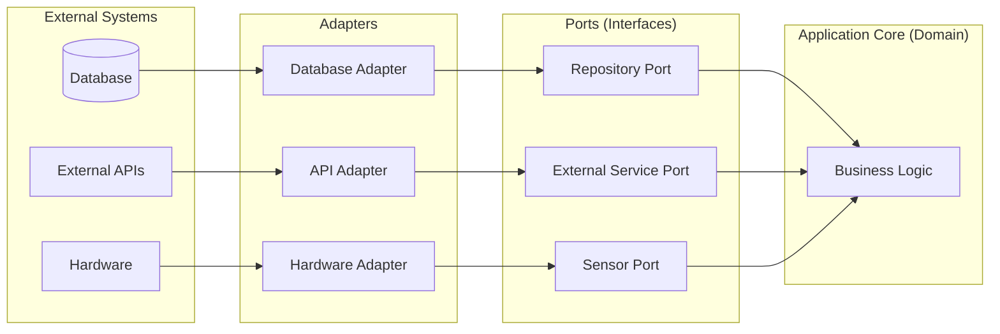

import RevealJS, { Slide } from '@site/src/components/RevealJS';
import Img from '@site/src/components/Img';
import QuoteSlide from '@site/src/components/QuoteSlide';
import PollSlide from '@site/src/components/PollSlide';

<RevealJS transition="slide">

{/* ============================================ */}
{/* COVER IMAGE */}
{/* ============================================ */}

<Slide>
  

<aside className="notes">
**Lecture overview:**
- **Total time:** ~55 minutes
- **Prerequisites:** Students understand coupling/cohesion (L7), SOLID principles (L8), test doubles (L15)
- **Connects to:** L6 (information hiding), L7 (coupling/cohesion), L8 (Dependency Inversion)

**Structure:**
- Testability as a design choice (~10 min)
- Hexagonal Architecture / Ports and Adapters (~20 min)
- Properties of good test suites (~10 min)
- Anti-patterns that kill testability (~15 min)

**Key theme:** Testability is not an afterthought—it's a first-class design concern. The same principles that reduce coupling also make code easier to test.

-> **Transition:** Let's start with the learning objectives...
</aside>

</Slide>

{/* ============================================ */}
{/* TITLE SLIDE */}
{/* ============================================ */}

<Slide>

# CS 3100: Program Design and Implementation II

## Lecture 16: Designing for Testability

<p style={{marginTop: '2em', fontSize: '0.8em', color: '#666'}}>
  ©2025 Jonathan Bell & Ellen Spertus, CC-BY-SA
</p>

<aside className="notes">
**Context from L15:**
- Students learned about test doubles: stubs, fakes, spies, and mocks
- They can substitute dependencies to test code in isolation
- But we glossed over: *why was ThermostatController so easy to test?*

**Key theme:** This lecture answers that question. Testability isn't an accident—it's a consequence of intentional design choices.

-> **Transition:** Here's what you'll be able to do after today...
</aside>

</Slide>

{/* ============================================ */}
{/* LEARNING OBJECTIVES */}
{/* ============================================ */}

<Slide>

## Learning Objectives

<p style={{fontSize: '0.85em', textAlign: 'left'}}>
After this lecture, you will be able to:
</p>

<ol style={{fontSize: '0.75em', textAlign: 'left'}}>
  <li>Evaluate the testability of a software module using the concepts of <strong>observability</strong> and <strong>controllability</strong></li>
  <li>Explain <strong>Hexagonal Architecture</strong> (Ports and Adapters) and its relationship to testability</li>
  <li>Describe properties of <strong>good test suites</strong>: fast, deterministic, independent, readable</li>
  <li>Recognize <strong>anti-patterns</strong> that lead to untestable code and how to fix them</li>
</ol>

<aside className="notes">
**Time allocation:**
- Objective 1: Testability fundamentals (~10 min)
- Objective 2: Hexagonal Architecture (~20 min)
- Objective 3: Good test suite properties (~10 min)
- Objective 4: Anti-patterns (~15 min)

**Connection to prior lectures:**
- These concepts build directly on information hiding (L6) and coupling/cohesion (L7)
- Testability is a *consequence* of following SOLID principles (L8)

-> **Transition:** Let's start by understanding what makes code testable...
</aside>

</Slide>

{/* ============================================ */}
{/* ARC 1: TESTABILITY AS DESIGN */}
{/* ============================================ */}

<Slide>

## Testability is a Design Choice

<p style={{fontSize: '0.9em', marginTop: '0.5em'}}>
  Some systems are more testable than others. Imagine testing a feature that requires:
</p>

<ul style={{fontSize: '0.8em'}}>
  <li>Setting up three different web services</li>
  <li>Creating five files in specific directories</li>
  <li>Putting a database in a specific state</li>
  <li>Then verifying all of those were modified correctly</li>
</ul>

<p style={{fontSize: '0.9em', marginTop: '1em', color: '#9370DB'}}>
  All of this is *doable*... but couldn't it be simpler?
</p>

<p style={{fontSize: '0.85em', marginTop: '0.5em'}}>
  <strong>Testability isn't luck—it's the result of design decisions.</strong>
</p>

<aside className="notes">
**The reality check:**
- Complex test setup is a sign of poor testability
- If tests are painful to write, they won't get written
- If tests are slow to run, they won't get run

**The key insight:**
- Testability is a quality attribute, like changeability
- You can design for it intentionally
- Or you can ignore it and pay the price later

-> **Transition:** Two properties determine testability...
</aside>

</Slide>

<Slide>

## Two Properties Determine Testability


<aside className="notes">
**The two key properties:**
1. **Observability:** Can we see what happened after running the code?
2. **Controllability:** Can we set up the exact scenario we want to test?

**Connection to L7 (coupling):**
- High coupling reduces controllability—dependencies are hardwired
- Information hiding (L6) can reduce observability if overdone
- Balance is key

-> **Transition:** Let's look at observability first...
</aside>

</Slide>

<Slide>

## Observability: Can We See What Happened?

<p style={{fontSize: '0.9em'}}>
  Observability is about how easily we can <strong>inspect the results</strong> of executing code.
</p>

```java
public class TemperatureLogger {
    public void logReading(String zoneId, double temperature) {
        String timestamp = LocalDateTime.now().toString();
        String logEntry = String.format("[%s] Zone %s: %.1f°F",
            timestamp, zoneId, temperature);
        System.out.println(logEntry);  // Where does this go?
    }
}
```

<p style={{fontSize: '0.85em', marginTop: '1em', color: '#f44336'}}>
  How would you test this? The method returns `void` and the output goes to `System.out`.
</p>

<aside className="notes">
**The problem:**
- Method returns `void`—nothing to assert on
- Output goes to `System.out`—need to capture stdout
- Uses `LocalDateTime.now()`—timestamp changes every run

**To verify correct behavior:**
- Must capture System.out (possible but awkward)
- Can't verify exact output because of timestamp

-> **Transition:** How can we make this more observable?
</aside>

</Slide>

<Slide>

## Increase Observability by Exposing State

```java
public class TemperatureLogger {
    private final List<String> logEntries = new ArrayList<>();

    public void logReading(String zoneId, double temperature, Instant timestamp) {
        String logEntry = String.format("[%s] Zone %s: %.1f°F",
            timestamp, zoneId, temperature);
        logEntries.add(logEntry);
    }

    public List<String> getLogEntries() {
        return Collections.unmodifiableList(logEntries);
    }
}
```

<p style={{fontSize: '0.85em', marginTop: '1em', color: '#4CAF50'}}>
  ✓ Now we can call `getLogEntries()` to verify what was logged.
</p>

<p style={{fontSize: '0.75em', marginTop: '0.5em', color: '#666'}}>
  Note: We also moved the timestamp to a parameter—that's controllability!
</p>

<aside className="notes">
**What changed:**
- Store entries instead of just printing
- Expose read-only access via `getLogEntries()`
- Move timestamp to parameter (controllability bonus)

**Other ways to increase observability:**
- Return values instead of void
- Fire events that tests can listen to
- Use a test-friendly logging framework

-> **Transition:** Now let's look at controllability...
</aside>

</Slide>

<Slide>

## Controllability: Can We Set Up the Test Scenario?

<p style={{fontSize: '0.9em'}}>
  Controllability is about how easily we can <strong>put the system into a specific state</strong> for testing.
</p>

<div style={{display: 'grid', gridTemplateColumns: '1fr 1fr', gap: '1em', marginTop: '0.5em'}}>

<div>

**Low Controllability**

```java
public double getCurrentPrice() {
    // Creates its own client!
    HttpClient client =
        HttpClient.newHttpClient();
    // Can't substitute test version
}

public boolean isOffPeakHours() {
    // Uses system clock!
    int hour = LocalTime.now()
                       .getHour();
    // Can't test 3 AM at 2 PM
}
```

</div>

<div>

**High Controllability**

```java
private final EnergyPriceApi api;
private final Clock clock;

public EnergyPriceService(
    EnergyPriceApi api, Clock clock) {
    this.api = api;
    this.clock = clock;
}

public double getCurrentPrice() {
    return api.fetchCurrentPrice();
}

public boolean isOffPeakHours() {
    int hour = LocalTime.now(clock)
                       .getHour();
    return hour >= 22 || hour < 6;
}
```

</div>

</div>

<aside className="notes">
**The key insight:**
- Dependencies that are *created* inside methods can't be controlled
- Dependencies that are *injected* can be substituted with test doubles

**Connection to L8:**
- This is the **Dependency Inversion Principle** in action!
- "Depend on abstractions, not concretions"

-> **Transition:** Let's see how coupling affects controllability...
</aside>

</Slide>

<Slide>

## Coupling Affects Controllability

<p style={{fontSize: '0.85em'}}>
  Remember from L7: <strong>data coupling</strong> passes only what's needed, while <strong>stamp coupling</strong> passes entire objects.
</p>

<div style={{display: 'grid', gridTemplateColumns: '1fr 1fr', gap: '1em', marginTop: '0.5em'}}>

<div>

**Stamp Coupling (Low Controllability)**

```java
// Must create full Submission object
public void notifyStudent(
    Submission submission) {
  String email = submission
      .getStudent().getEmail();
  String msg = "Grade: " +
      submission.getGrade();
  emailService.send(email, msg);
}
```

</div>

<div>

**Data Coupling (High Controllability)**

```java
// Only needs the data it uses
public void notifyStudent(
    String email,
    int grade) {
  String msg = "Grade: " + grade;
  emailService.send(email, msg);
}
```

</div>

</div>

<p style={{fontSize: '0.8em', marginTop: '0.5em', color: '#4CAF50'}}>
  ✓ Data coupling requires less test setup—no need to construct complex object graphs.
</p>

<aside className="notes">
**Connection to L7:**
- Data coupling: pass only what's needed
- Stamp coupling: pass entire objects
- For testability, data coupling is usually better

**Why this matters:**
- Stamp coupling forces you to create full object graphs for tests
- Data coupling lets you pass just the values needed
- Less setup = more focused tests

-> **Transition:** Let's look at observability through the same lens...
</aside>

</Slide>

<Slide>

## Observability in Pawtograder

<p style={{fontSize: '0.85em'}}>
  Consider testing a grading service. How do we observe what happened?
</p>

```java
// Low Observability: modifies external state, returns void
public class GradingService {
    private final SubmissionRepository repo;

    public void gradeSubmission(Submission submission) {
        int score = calculateScore(submission);
        submission.setGrade(score);  // Mutates input!
        repo.save(submission);       // Side effect!
    }
}

// High Observability: returns result, no side effects on input
public class GradingService {
    public GradingResult gradeSubmission(Submission submission) {
        int score = calculateScore(submission);
        return new GradingResult(submission.getId(), score);
    }
}
```

<p style={{fontSize: '0.8em', marginTop: '0.5em', color: '#9370DB'}}>
  The second version is easier to test: call the method, check the return value. No need to inspect mutated objects or mock repositories.
</p>

<aside className="notes">
**Why the second is more observable:**
- Returns a value we can assert on
- Doesn't mutate the input object
- Separates calculation from persistence

**Connection to L6 (immutability):**
- Immutable inputs = no hidden mutations
- Return values = explicit outputs
- Same principles that prevent bugs also enable testing

-> **Transition:** Let's talk about separating infrastructure from domain...
</aside>

</Slide>

<Slide>

## Separating Infrastructure from Domain

<p style={{fontSize: '0.85em'}}>
  The most important principle for testability: <strong>separate infrastructure from domain code</strong>.
</p>

<div style={{display: 'grid', gridTemplateColumns: '1fr 1fr', gap: '1.5em', marginTop: '0.5em', fontSize: '0.75em'}}>

<div>

**Domain Code**
- Business rules and calculations
- Decisions that define what your system does
- Pure functions, no side effects
- *Easy to test*

</div>

<div>

**Infrastructure Code**
- Databases, APIs, file systems
- Hardware, network, external services
- I/O, persistence, communication
- *Requires test doubles*

</div>

</div>

<p style={{fontSize: '0.85em', marginTop: '1em', color: '#9370DB'}}>
  When these are mixed together, testing becomes painful because you can't exercise business logic without involving infrastructure.
</p>

<aside className="notes">
**This is information hiding from L6 applied at the architecture level:**
- Just as a class hides its fields behind methods
- A well-designed system hides infrastructure behind abstractions
- The domain code doesn't know or care *how* data is stored

**The separation enables:**
- Testing domain logic without real infrastructure
- Changing infrastructure without affecting domain logic
- This is low coupling applied at the architecture level

-> **Transition:** Let's see a concrete example of mixing concerns...
</aside>

</Slide>

<Slide>

## Mixed Concerns Make Testing Painful

```java
public class SmartThermostat {
    public void adjustForComfort(String zoneId, double targetTemp) {
        // Infrastructure: database access
        Connection conn = DriverManager.getConnection(
            "jdbc:mysql://localhost/iot", "root", "");
        PreparedStatement ps = conn.prepareStatement(
            "SELECT temperature FROM sensors WHERE zone_id = ?");
        ps.setString(1, zoneId);
        ResultSet rs = ps.executeQuery();
        rs.next();
        double currentTemp = rs.getDouble("temperature");

        // Domain: business logic (buried in the middle!)
        double delta = targetTemp - currentTemp;
        String action = Math.abs(delta) <= 0.5 ? "NONE"
                      : delta > 0 ? "HEAT" : "COOL";

        // Infrastructure: web service call
        HttpClient client = HttpClient.newHttpClient();
        HttpRequest request = HttpRequest.newBuilder()
            .uri(URI.create("http://hvac-service/zones/" + zoneId + "/" + action))
            .POST(HttpRequest.BodyPublishers.noBody()).build();
        client.send(request, HttpResponse.BodyHandlers.discarding());
    }
}
```

<aside className="notes">
**The testing nightmare:**
- Need a real MySQL database running
- Need a real HVAC web service running
- The business rule (when to heat vs cool) is buried in the middle!

**The root cause:**
- Infrastructure and domain logic are mixed together
- Can't test the "heat vs cool" decision without all the infrastructure

-> **Transition:** This pattern has a name and a solution...
</aside>

</Slide>

{/* ============================================ */}
{/* ARC 2: HEXAGONAL ARCHITECTURE (EXPANDED) */}
{/* ============================================ */}

<Slide>

## Hexagonal Architecture (Ports and Adapters)

<p style={{fontSize: '0.9em'}}>
  The solution is formalized as <strong>Hexagonal Architecture</strong>, proposed by Alistair Cockburn in 2005.
</p>


<aside className="notes">
**The three layers:**
1. **Application Core (the hexagon):** Business logic, domain rules
2. **Ports:** Interfaces that define what the domain needs
3. **Adapters:** Technology-specific implementations

**Why "hexagonal"?**
- The shape emphasizes that there's no "top" or "bottom"
- All external systems connect through ports
- The domain doesn't know which adapters are plugged in

-> **Transition:** But wait—why a hexagon?
</aside>

</Slide>

<Slide>

## Why "Hexagonal"? (Not Just Layers)

<p style={{fontSize: '0.85em'}}>
  Traditional layered architecture has a <strong>top-down flow</strong>: UI → Business Logic → Data.
</p>

<div style={{display: 'grid', gridTemplateColumns: '1fr 1fr', gap: '1.5em', marginTop: '0.5em', fontSize: '0.75em'}}>

<div>

**Layered Architecture**
- Implies hierarchy (UI on top)
- Data layer at the bottom
- Flow goes one direction
- Web UI and CLI are "different layers"
- Database and external API are "same layer"

</div>

<div>

**Hexagonal Architecture**
- No top or bottom—domain is center
- All external things are "outside"
- Web UI, CLI, database, APIs are all adapters
- Each connects through a port
- Tests are just another adapter!

</div>

</div>

<p style={{fontSize: '0.8em', marginTop: '1em', color: '#9370DB'}}>
  The hexagon has no privileged direction. Each edge is a potential connection point. The shape is arbitrary—the <strong>insight</strong> is that everything external (including tests!) connects the same way.
</p>

<aside className="notes">
**Why this matters for testability:**
- In layered architecture, tests often mock "lower layers"
- In hexagonal, tests are just adapters—they plug in the same way
- This mental model makes test doubles feel natural, not like "cheating"

**The key insight:**
- A test that stubs `EnergyPricePort` is doing exactly what production does
- Production plugs in `GridPriceApiAdapter`
- Tests plug in `StubPriceAdapter`
- Both are valid adapters for the same port

-> **Transition:** Let's look at the three layers...
</aside>

</Slide>

<Slide>

## The Three Layers



<p style={{fontSize: '0.8em', marginTop: '0.5em'}}>
  <strong>Core:</strong> Knows nothing about databases, APIs, or hardware—only the domain.<br/>
  <strong>Ports:</strong> Interfaces that describe *what* the domain needs, not *how* to get it.<br/>
  <strong>Adapters:</strong> Know how to talk to specific technologies.
</p>

<aside className="notes">
**The dependency direction:**
- Adapters depend on Ports
- Domain depends only on Ports (interfaces)
- Domain never depends on Adapters

**This is DIP from L8:**
- High-level modules (domain) don't depend on low-level modules (infrastructure)
- Both depend on abstractions (ports)

-> **Transition:** Let's see ports in code...
</aside>

</Slide>

<Slide>

## Ports Define What the Domain Needs

<p style={{fontSize: '0.85em'}}>
  Ports are <strong>interfaces</strong> defined by the domain, describing what it needs from the outside world.
</p>

```java
// Port: How we get energy prices (technology-agnostic)
public interface EnergyPricePort {
    double getCurrentPricePerKWh();
    List<PriceForecast> getForecast(Duration window);
}

// Port: How we control devices (technology-agnostic)
public interface DeviceControlPort {
    List<ControllableDevice> getDevices();
    void setDevicePower(String deviceId, int powerPercent);
}

// Port: How we persist user preferences (technology-agnostic)
public interface UserPreferencesPort {
    EnergyPreferences getPreferences(String homeId);
}
```

<p style={{fontSize: '0.8em', marginTop: '0.5em', color: '#9370DB'}}>
  Notice: These interfaces say nothing about HTTP, SQL, or any specific technology.
</p>

<aside className="notes">
**Key insight:**
- Ports are defined by the *domain*, not by technology
- The domain says "I need price data" not "I need HTTP calls"
- This is Dependency Inversion at the architecture level

**Connection to L8:**
- Ports are the "abstractions" that both sides depend on
- Domain depends on ports, adapters implement ports

-> **Transition:** The domain uses these ports...
</aside>

</Slide>

<Slide>

## The Domain Uses Ports, Not Technologies

```java
public class EnergyOptimizer {
    private final EnergyPricePort priceService;
    private final DeviceControlPort deviceControl;
    private final UserPreferencesPort preferences;

    public EnergyOptimizer(EnergyPricePort priceService,
                           DeviceControlPort deviceControl,
                           UserPreferencesPort preferences) {
        this.priceService = priceService;
        this.deviceControl = deviceControl;
        this.preferences = preferences;
    }

    public void optimizeForPrice(String homeId) {
        double currentPrice = priceService.getCurrentPricePerKWh();
        EnergyPreferences prefs = preferences.getPreferences(homeId);

        if (currentPrice > prefs.highPriceThreshold()) {
            reduceNonEssentialDevices();
        } else if (currentPrice < prefs.lowPriceThreshold()) {
            preconditionHome();
        }
    }
}
```

<p style={{fontSize: '0.8em', marginTop: '0.5em', color: '#4CAF50'}}>
  ✓ No `HttpClient`, no `Connection`, no `DataSource`—only interfaces.
</p>

<aside className="notes">
**Notice:**
- No technology-specific code
- Only references to ports (interfaces)
- The domain doesn't know if it's talking to real APIs or test stubs

**This is testable by design:**
- Inject any implementation of the ports
- Test with in-memory stubs
- No infrastructure needed for domain tests

-> **Transition:** Adapters implement the ports...
</aside>

</Slide>

<Slide>

## Adapters Connect to Real Infrastructure

```java
// Adapter: Gets prices from a real API
public class GridPriceApiAdapter implements EnergyPricePort {
    private final HttpClient httpClient;
    private final String apiKey;

    @Override
    public double getCurrentPricePerKWh() {
        HttpRequest request = HttpRequest.newBuilder()
            .uri(URI.create("https://api.gridprices.com/current"))
            .header("Authorization", "Bearer " + apiKey)
            .build();
        // ... parse response and return price
    }
}

// Adapter: Controls devices via Zigbee protocol
public class ZigbeeDeviceAdapter implements DeviceControlPort {
    private final ZigbeeGateway gateway;

    @Override
    public void setDevicePower(String deviceId, int powerPercent) {
        // Zigbee protocol commands
    }
}
```

<p style={{fontSize: '0.8em', marginTop: '0.5em'}}>
  Adapters know the technology. Domain says *what* it needs; adapters know *how* to get it.
</p>

<aside className="notes">
**Adapters contain all the messy details:**
- HTTP clients, SQL queries, hardware protocols
- But they implement domain-defined interfaces

**The separation:**
- Domain is clean and testable
- Infrastructure knowledge is isolated in adapters

-> **Transition:** The magic happens in testing...
</aside>

</Slide>

<Slide>

## Testing with Hexagonal Architecture

```java
@Test
void reducesNonEssentialDevicesWhenPriceIsHigh() {
    // Simple in-memory implementations — no real infrastructure!
    EnergyPricePort stubPrices = () -> 0.35;  // High price (lambda!)

    List<ControllableDevice> devices = List.of(
        new ControllableDevice("light-1", true, 100),   // non-essential
        new ControllableDevice("fridge", false, 100)    // essential
    );
    SpyDeviceControl spyDevices = new SpyDeviceControl(devices);

    UserPreferencesPort stubPrefs = (homeId) ->
        new EnergyPreferences(0.25, 0.10);  // high=0.25, low=0.10

    EnergyOptimizer optimizer = new EnergyOptimizer(
        stubPrices, spyDevices, stubPrefs);

    optimizer.optimizeForPrice("home-123");

    // Verify only non-essential devices were reduced
    assertEquals(50, spyDevices.getPowerLevel("light-1"));
    assertEquals(100, spyDevices.getPowerLevel("fridge"));  // unchanged
}
```

<aside className="notes">
**Notice what's NOT here:**
- No database setup
- No HTTP mock server
- No waiting for network calls
- No flaky test failures from external services

**This test is:**
- Fast (milliseconds)
- Deterministic (no external dependencies)
- Focused (tests one business rule)

-> **Transition:** Let's look at a simpler example...
</aside>

</Slide>

<Slide>

## Extracted Domain Logic is Trivially Testable

```java
// Domain: pure business logic, easily testable
public class ComfortCalculator {
    public HVACAction calculateAction(double currentTemp, double targetTemp) {
        double delta = targetTemp - currentTemp;
        if (Math.abs(delta) <= 0.5) {
            return HVACAction.NONE;
        } else if (delta > 0) {
            return HVACAction.HEAT;
        } else {
            return HVACAction.COOL;
        }
    }
}
```

```java
@Test void heatsWhenBelowTarget() {
    ComfortCalculator calc = new ComfortCalculator();
    assertEquals(HVACAction.HEAT, calc.calculateAction(68.0, 72.0));
}

@Test void coolsWhenAboveTarget() {
    ComfortCalculator calc = new ComfortCalculator();
    assertEquals(HVACAction.COOL, calc.calculateAction(76.0, 72.0));
}

@Test void doesNothingWithinThreshold() {
    ComfortCalculator calc = new ComfortCalculator();
    assertEquals(HVACAction.NONE, calc.calculateAction(72.3, 72.0));
}
```

<aside className="notes">
**No database. No HTTP. No exceptions. Tests run in milliseconds.**

The domain logic is:
- Pure (no side effects)
- Deterministic (same inputs = same outputs)
- Easy to understand and test

-> **Transition:** How do you design this way?
</aside>

</Slide>

<Slide>

## Ports as a Design Technique

<p style={{fontSize: '0.9em'}}>
  When developing with Hexagonal Architecture, let ports <strong>emerge</strong> from the domain.
</p>

<ol style={{fontSize: '0.8em', marginTop: '1em'}}>
  <li>Start with the business logic you're trying to implement</li>
  <li>When you notice it needs something from the outside world, define an interface</li>
  <li>The interface describes <em>what you need</em>, not how to get it</li>
  <li>Implement adapters later (or use test doubles)</li>
</ol>

<p style={{fontSize: '0.85em', marginTop: '1em', color: '#9370DB'}}>
  This approach keeps you focused on the business problem without getting distracted by infrastructure details.
</p>

<aside className="notes">
**The process:**
- "I need current temperature" → `TemperatureSensor` interface
- "I need to store preferences" → `PreferencesRepository` interface
- The domain defines contracts; adapters fulfill them

**Benefits:**
- You think about what you need, not how to get it
- Infrastructure decisions can be deferred
- Different adapters for different environments (prod, test, dev)

-> **Transition:** How does this connect to coupling?
</aside>

</Slide>

<Slide>

## Hexagonal Architecture Minimizes Coupling

<p style={{fontSize: '0.85em'}}>
  Remember the coupling types from L7? Hexagonal Architecture addresses each one:
</p>

| Coupling Type | How Hexagonal Architecture Addresses It |
|---------------|----------------------------------------|
| **Data** | Ports pass only the data needed—`getCurrentPricePerKWh()` returns a `double`, not `HttpResponse` |
| **Stamp** | Domain types (`EnergyPreferences`) are defined by the domain, not dictated by external APIs |
| **Control** | Adapters don't pass flags that control domain logic |
| **Common** | No shared global state between domain and infrastructure |
| **Content** | Impossible—adapters can't access domain internals |

<aside className="notes">
**Consider what happens without this architecture:**
- If `EnergyOptimizer` directly used `HttpClient`:
  - Stamp coupling to `HttpResponse` objects
  - Common coupling if using shared `HttpClient` instance
  - Lower cohesion mixing HTTP concerns with business rules

**The key insight:**
- Low coupling = easy to substitute test doubles
- High cohesion = clear what each test should cover

-> **Transition:** Let's summarize the connection to prior lectures...
</aside>

</Slide>

<Slide>

## Hexagonal Architecture = Modularity at Scale

<p style={{fontSize: '0.85em'}}>
  This is the same modularity principle from L6 applied at the system level:
</p>

<table style={{fontSize: '0.75em', marginTop: '0.5em'}}>
<thead>
<tr><th>L6 Principle</th><th>Hexagonal Application</th></tr>
</thead>
<tbody>
<tr><td>Modules have well-defined interfaces</td><td>Ports are interfaces defined by domain</td></tr>
<tr><td>Implementation is hidden</td><td>Adapters hide technology details</td></tr>
<tr><td>Modules don't depend on other modules' internals</td><td>Domain doesn't know about adapters</td></tr>
</tbody>
</table>

<p style={{fontSize: '0.9em', marginTop: '1em', color: '#4CAF50', textAlign: 'center'}}>
  <strong>Low coupling and high cohesion don't just make code easier to change—they make it easier to test.</strong>
</p>

<aside className="notes">
**The connection:**
- Ports are modules with well-defined interfaces
- Adapters hide implementation details
- Domain is independent of infrastructure implementation

**This is why good design leads to testability:**
- Same principles, same benefits
- Changeability and testability are two sides of the same coin

-> **Transition:** Let's see how testability aligns with our design principles...
</aside>

</Slide>

<Slide>

## Testability Aligns with Good Design

<p style={{fontSize: '0.85em'}}>
  Testability isn't a separate concern—it's a natural consequence of following the principles from L6-L8:
</p>

<div style={{fontSize: '0.7em'}}>

| Design Principle | Testability Benefit |
|------------------|---------------------|
| **Low Coupling (L7)** | Dependencies can be substituted with test doubles |
| **High Cohesion (L7)** | Each class has a clear purpose → focused tests |
| **Information Hiding (L6)** | Implementation changes don't break tests |
| **Dependency Inversion (L8)** | Inject test doubles instead of real dependencies |
| **Single Responsibility (L8)** | Fewer behaviors to test per class |
| **Interface Segregation (L8)** | Smaller interfaces → simpler test doubles |

</div>

<p style={{fontSize: '0.85em', marginTop: '1em', color: '#9370DB', textAlign: 'center'}}>
  <strong>If your code is hard to test, it probably violates one of these principles.</strong>
</p>

<aside className="notes">
**The key insight:**
- Testability is an indicator of design quality
- Hard-to-test code often has:
  - High coupling (can't substitute dependencies)
  - Low cohesion (too many behaviors to test)
  - Hidden dependencies (surprising test setup requirements)

**Practical implication:**
- Use testability as a design feedback signal
- If tests are painful, consider refactoring

-> **Transition:** But there are also tensions to be aware of...
</aside>

</Slide>

<Slide>

## Testability Can Be in Tension with Other Goals

<p style={{fontSize: '0.85em'}}>
  Designing for testability sometimes involves tradeoffs:
</p>

<div style={{fontSize: '0.7em'}}>

| Goal | Tension with Testability |
|------|-------------------------|
| **Simplicity** | Testability may require more interfaces, abstractions, and indirection |
| **Encapsulation** | Observability sometimes requires exposing internal state |
| **Performance** | Dependency injection adds indirection; interfaces prevent inlining |
| **Reduced Boilerplate** | Constructor injection requires more code than `new` |

</div>

<p style={{fontSize: '0.75em', marginTop: '1em'}}>
  These tensions are usually worth it for non-trivial systems, but not every class needs hexagonal architecture!
</p>

<aside className="notes">
**Practical guidance:**
- Not every class needs to be highly testable
- Simple data classes, value objects → direct instantiation is fine
- Complex business logic, external dependencies → invest in testability

**The balance:**
- Over-engineering: Interfaces for everything, mocks everywhere
- Under-engineering: Can't test critical business logic
- Sweet spot: Testable where it matters, simple where it doesn't

-> **Transition:** Let's talk about test suite properties...
</aside>

</Slide>

<Slide>

## When to Invest in Testability

<p style={{fontSize: '0.85em'}}>
  Not all code needs the same level of testability investment:
</p>

<div style={{display: 'grid', gridTemplateColumns: '1fr 1fr', gap: '1.5em', marginTop: '0.5em', fontSize: '0.75em'}}>

<div>

**High Investment**
- Complex business rules
- Code with many edge cases
- Integration points with external systems
- Code that changes frequently
- Code where bugs are expensive

</div>

<div>

**Low Investment**
- Simple data transfer objects
- Straightforward delegation
- Configuration and wiring code
- Stable, well-tested libraries
- Code that rarely changes

</div>

</div>

<p style={{fontSize: '0.85em', marginTop: '1em', color: '#9370DB', textAlign: 'center'}}>
  Apply hexagonal architecture where it provides value. Don't over-abstract simple code.
</p>

<aside className="notes">
**The pragmatic approach:**
- Testability has a cost (complexity, indirection)
- That cost should be justified by value
- Critical business logic: worth the investment
- Simple CRUD: probably not

**Connection to L7 (coupling):**
- We said "low coupling is good" but also "some coupling is necessary"
- Same with testability: "testable is good" but "over-abstracting is wasteful"

-> **Transition:** Let's talk about test suite properties...
</aside>

</Slide>

{/* ============================================ */}
{/* ARC 3: PROPERTIES OF GOOD TEST SUITES */}
{/* ============================================ */}

<Slide>

## Properties of Good Test Suites


<aside className="notes">
**Why these properties matter:**
- Fast: Developers run tests constantly
- Deterministic: Tests can be trusted
- Independent: Tests can run in any order
- Readable: Tests serve as documentation

**The connection to testability:**
- Hexagonal Architecture enables all of these
- Domain tests are fast (no I/O)
- Injected dependencies are deterministic
- No shared infrastructure means independence

-> **Transition:** Let's examine each property...
</aside>

</Slide>

<Slide>

## Fast, Deterministic, Independent, Readable

<div style={{fontSize: '0.7em'}}>

| Property | What It Means | How Hexagonal Enables It |
|----------|---------------|-------------------------|
| **Fast** | Tests run in milliseconds | Domain tests have no I/O |
| **Deterministic** | Same result every time | Injectable `Clock`, `Random`, etc. |
| **Independent** | Tests don't affect each other | No shared infrastructure state |
| **Readable** | Tests document behavior | Given/When/Then structure |

</div>

<p style={{fontSize: '0.85em', marginTop: '1em'}}>
  If tests take 30 minutes, developers won't run them often.<br/>
  If tests take 30 seconds, they'll run them after every change.
</p>

<p style={{fontSize: '0.8em', marginTop: '0.5em', color: '#9370DB'}}>
  Separating domain from infrastructure means most tests can be fast.
</p>

<aside className="notes">
**The test pyramid:**
- Many fast domain tests (base)
- Fewer integration tests (middle)
- Few end-to-end tests (top)

**The payoff:**
- Fast feedback catches bugs earlier
- Earlier bugs are cheaper to fix
- Developers stay in flow

-> **Transition:** Now let's look at anti-patterns...
</aside>

</Slide>

{/* ============================================ */}
{/* ARC 4: ANTI-PATTERNS (EXPANDED) */}
{/* ============================================ */}

<Slide>

## Anti-Patterns That Kill Testability


<aside className="notes">
**These patterns consistently make testing painful:**
1. Static methods can't be substituted
2. Singletons are globally accessible and can't be replaced
3. Hidden dependencies surprise you during testing
4. Tight coupling requires massive setup

**The common thread:**
- All violate Dependency Inversion
- All create invisible coupling
- All make substitution impossible

-> **Transition:** Let's examine each one in detail...
</aside>

</Slide>

<Slide>

## Anti-Pattern: Static Methods

<p style={{fontSize: '0.9em'}}>
  Static methods are <strong>globally accessible</strong>, which means you can't substitute test implementations.
</p>

<div style={{display: 'grid', gridTemplateColumns: '1fr 1fr', gap: '1em', marginTop: '0.5em'}}>

<div>

**Hard to test**

```java
public class ScheduledTask {
    public void runIfDue() {
        // Static call - can't stub!
        if (TimeUtils.isBusinessHours()) {
            doWork();
        }
    }
}
```

</div>

<div>

**Testable**

```java
public class ScheduledTask {
    private final BusinessHoursChecker
        hoursChecker;

    public ScheduledTask(
        BusinessHoursChecker hoursChecker) {
        this.hoursChecker = hoursChecker;
    }

    public void runIfDue() {
        if (hoursChecker.isBusinessHours()) {
            doWork();
        }
    }
}
```

</div>

</div>

<aside className="notes">
**The problem with static:**
- No object to replace
- No interface to implement
- Globally accessible = globally coupled

**The solution:**
- Wrap static calls in injectable interfaces
- Inject the dependency via constructor

-> **Transition:** What about unavoidable static methods like time?
</aside>

</Slide>

<Slide>

## Wrapping Static Methods: The TimeProvider Pattern

<p style={{fontSize: '0.85em'}}>
  If you must use code that relies on static methods (like `LocalDateTime.now()`), wrap it in an abstraction you control:
</p>

```java
public interface TimeProvider {
    Instant now();
}

public class SystemTimeProvider implements TimeProvider {
    public Instant now() {
        return Instant.now();  // Real system time
    }
}

public class FixedTimeProvider implements TimeProvider {
    private final Instant fixedTime;

    public FixedTimeProvider(Instant fixedTime) {
        this.fixedTime = fixedTime;
    }

    public Instant now() {
        return fixedTime;  // Always returns the same time
    }
}
```

<p style={{fontSize: '0.8em', marginTop: '0.5em', color: '#4CAF50'}}>
  ✓ Production uses `SystemTimeProvider`. Tests use `FixedTimeProvider`.
</p>

<aside className="notes">
**This pattern works for any static dependency:**
- Time → TimeProvider / Clock
- Random → RandomGenerator
- Environment variables → EnvironmentProvider

**The key insight:**
- Wrap the static call in an interface
- Inject the interface
- Provide different implementations for prod vs test

-> **Transition:** Another common anti-pattern...
</aside>

</Slide>

<Slide>

## Anti-Pattern: Singletons

<p style={{fontSize: '0.9em'}}>
  Singletons are globally accessible state that can't be replaced per-test.
</p>

```java
// Singleton - only one instance, globally accessible
public class DatabaseConnection {
    private static DatabaseConnection instance;

    public static DatabaseConnection getInstance() {
        if (instance == null) {
            instance = new DatabaseConnection();
        }
        return instance;
    }
}

// Code that uses the singleton
public class UserService {
    public User findUser(String id) {
        // Can't substitute this for tests!
        return DatabaseConnection.getInstance().query("SELECT ...");
    }
}
```

<p style={{fontSize: '0.85em', marginTop: '0.5em', color: '#f44336'}}>
  ⚠ Every test uses the same connection. State leaks between tests.
</p>

<aside className="notes">
**Problems with singletons:**
- Global state leaks between tests
- Can't run tests in parallel
- Can't substitute test implementation

**The fix:**
- Inject the dependency instead
- Let a dependency injection framework manage lifecycle
- Each test can provide its own instance

-> **Transition:** Another smell...
</aside>

</Slide>

<Slide>

## Anti-Pattern: Private Methods That Want Testing

<p style={{fontSize: '0.85em'}}>
  If you feel the urge to test a private method directly, it's often a sign that it should be its own class.
</p>

<div style={{display: 'grid', gridTemplateColumns: '1fr 1fr', gap: '1em', marginTop: '0.5em'}}>

<div style={{fontSize: '0.65em'}}>

**Hard to test**

```java
public class DeviceHealthChecker {
    public HealthReport checkAll(
            List<IoTDevice> devices) {
        HealthReport report = new HealthReport();
        for (IoTDevice device : devices) {
            report.add(device.getId(),
                assessHealth(device));
        }
        return report;
    }

    // Complex logic we want to test!
    private HealthStatus assessHealth(
            IoTDevice device) {
        // Battery, signal, contact time...
        // Many branches to test
    }
}
```

</div>

<div style={{fontSize: '0.65em'}}>

**Testable**

```java
// Extracted to its own class
public class DeviceHealthAssessor {
    public HealthStatus assess(
            double batteryPercent,
            int signalStrength,
            long minutesSinceContact) {
        if (minutesSinceContact > 60)
            return HealthStatus.OFFLINE;
        if (batteryPercent < 10)
            return HealthStatus.CRITICAL;
        if (batteryPercent < 25 ||
            signalStrength < 20)
            return HealthStatus.WARNING;
        return HealthStatus.HEALTHY;
    }
}
```

</div>

</div>

<p style={{fontSize: '0.75em', marginTop: '0.5em', color: '#9370DB'}}>
  Connection to SRP (L8): DeviceHealthChecker was doing two things. Health assessment deserves its own class.
</p>

<aside className="notes">
**The smell:**
- "I want to test this private method"
- Private methods should be tested through public API
- If that's hard, the class is doing too much

**The refactoring:**
- Extract to its own class
- Now it's public and testable
- Original class delegates

-> **Transition:** One more anti-pattern...
</aside>

</Slide>

<Slide>

## Anti-Pattern: Tight Coupling

<p style={{fontSize: '0.9em'}}>
  If tests require setting up many dependencies just to test one behavior, the class is doing too much.
</p>

```java
// Requires 5 dependencies just to test notification formatting!
public class SubmissionProcessor {
    public SubmissionProcessor(
        TestRunner tests,
        Linter linter,
        Grader grader,
        Repository repo,
        NotificationService notifier) { ... }

    public void process(Submission submission) {
        // Uses all 5 dependencies in a single method
    }
}
```

<p style={{fontSize: '0.85em', marginTop: '1em', color: '#FF9800'}}>
  A sign of this problem: you write a test for class A, but when it fails, the bug is actually in class B.
</p>

<aside className="notes">
**The symptom:**
- Setting up 5+ mocks for one test
- Can't tell what the test is actually testing
- Bugs in dependencies show up as failures here

**The cause:**
- Low cohesion (class does too much)
- High coupling (knows too many details)

**The fix:**
- Split responsibilities into smaller classes
- Each class has fewer dependencies
- Tests become focused

-> **Transition:** One more anti-pattern...
</aside>

</Slide>

<Slide>

## Anti-Pattern: Complex Boolean Conditions

<p style={{fontSize: '0.9em'}}>
  Complex conditions require many test cases to cover all branches.
</p>

<div style={{display: 'grid', gridTemplateColumns: '1fr 1fr', gap: '1em', marginTop: '0.5em'}}>

<div>

**Hard to test**

```java
// How many tests to cover this?
if ((device.isOnline() &&
     device.batteryLevel() > 20) ||
    (device.isPowered() &&
     !device.isInSleepMode()) ||
    (device.isEssential() &&
     emergencyMode)) {
    // ...
}
```

</div>

<div>

**Testable**

```java
private boolean canReceiveCommands(
        IoTDevice device) {
    return hasSufficientBattery(device)
        || hasReliablePower(device)
        || isRequiredInEmergency(device);
}

private boolean hasSufficientBattery(
        IoTDevice device) {
    return device.isOnline() &&
           device.batteryLevel() > 20;
}
// Each predicate tested individually
```

</div>

</div>

<p style={{fontSize: '0.8em', marginTop: '0.5em', color: '#4CAF50'}}>
  Breaking conditions into named methods doesn't reduce complexity, but it spreads out the testing burden and improves readability.
</p>

<aside className="notes">
**The problem:**
- One giant boolean = exponential test cases
- Hard to know what each branch means
- Easy to miss edge cases

**The fix:**
- Extract to named predicates
- Test each predicate in isolation
- Main condition is clear and readable

-> **Transition:** Let's summarize...
</aside>

</Slide>

<Slide>

## Anti-Pattern Summary

<div style={{fontSize: '0.75em'}}>

| Anti-Pattern | Problem | Solution |
|--------------|---------|----------|
| **Static methods** | Can't substitute | Wrap in injectable interface |
| **Singletons** | Global state, can't replace | Inject dependency instead |
| **Private methods wanting tests** | Class doing too much | Extract to own class |
| **Tight coupling** | Too many dependencies | Split into focused classes |
| **Complex booleans** | Too many branches | Extract named predicates |

</div>

<p style={{fontSize: '0.9em', marginTop: '1em', color: '#9370DB', textAlign: 'center'}}>
  <strong>Common thread: All violate Dependency Inversion Principle.</strong>
</p>

<aside className="notes">
**The pattern:**
- All anti-patterns create hidden, uncontrollable dependencies
- All make substitution difficult or impossible
- All violate the principles from L6, L7, L8

**The solution:**
- Follow DIP: depend on abstractions
- Inject dependencies
- Keep classes focused (SRP)

-> **Transition:** Key takeaways...
</aside>

</Slide>

{/* ============================================ */}
{/* KEY TAKEAWAYS */}
{/* ============================================ */}

<Slide>

## Key Takeaways


<aside className="notes">
**The key insight:**
- Testability isn't separate from good design
- It's a *consequence* of good design
- Low coupling, high cohesion, Dependency Inversion → testability

-> **Transition:** Let's review the specific points...
</aside>

</Slide>

<Slide>

## Summary

<ul style={{fontSize: '0.75em'}}>
  <li><strong>Testability is a design choice</strong>—not an afterthought</li>
  <li><strong>Observability</strong> = can we see what happened? (return values, accessible state)</li>
  <li><strong>Controllability</strong> = can we set up the scenario? (dependency injection)</li>
  <li><strong>Hexagonal Architecture</strong> separates domain logic from infrastructure</li>
  <li><strong>Ports</strong> are interfaces defined by domain; <strong>Adapters</strong> implement them</li>
  <li>Good tests are <strong>fast, deterministic, independent, and readable</strong></li>
  <li><strong>Avoid</strong> static methods, singletons, hidden dependencies, tight coupling</li>
</ul>

<p style={{fontSize: '0.9em', marginTop: '1em', color: '#9370DB', textAlign: 'center'}}>
  <strong>The same principles that make code easy to change make it easy to test.</strong>
</p>

<aside className="notes">
**Connection to prior lectures:**
- Information hiding (L6) → isolate infrastructure behind interfaces
- Coupling/cohesion (L7) → low coupling enables test double substitution
- SOLID (L8) → Dependency Inversion is key to testability

**For assignments:**
- Design for testability from the start
- Inject dependencies instead of creating them
- Keep domain logic pure and simple

**Questions?**
</aside>

</Slide>

</RevealJS>
