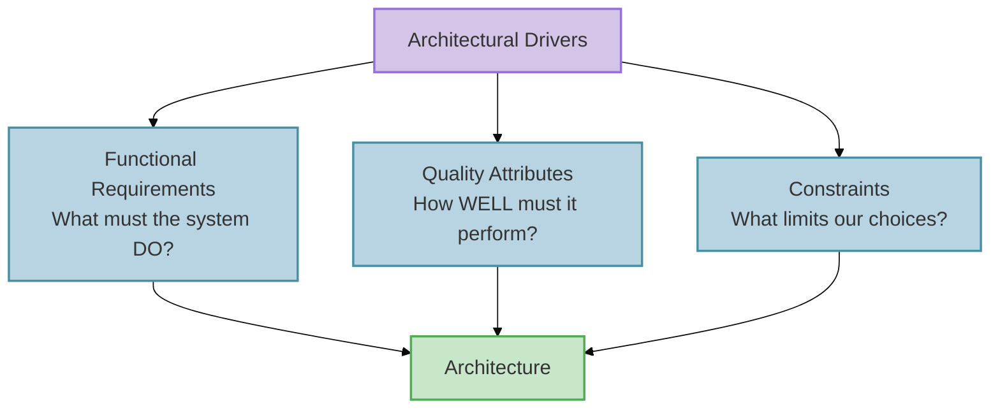
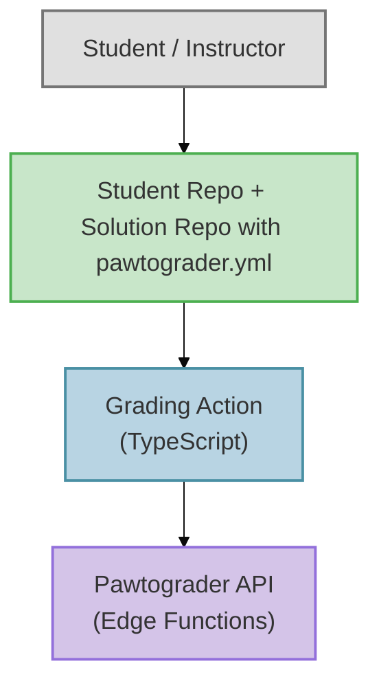
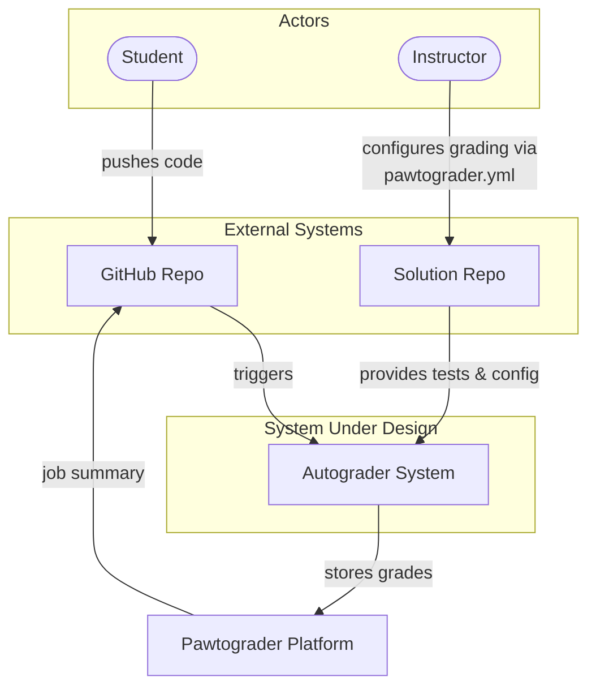
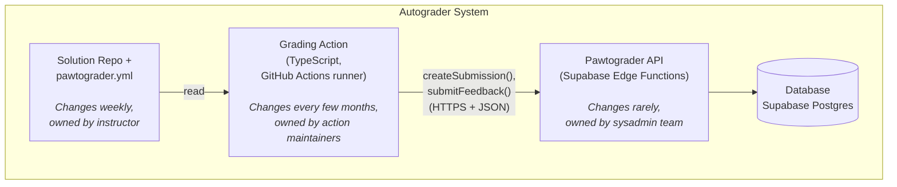
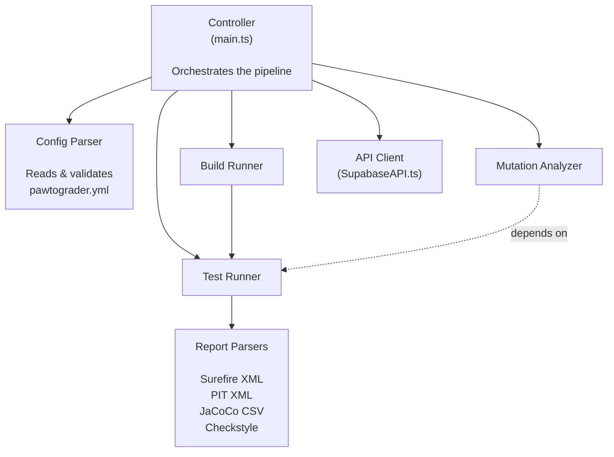
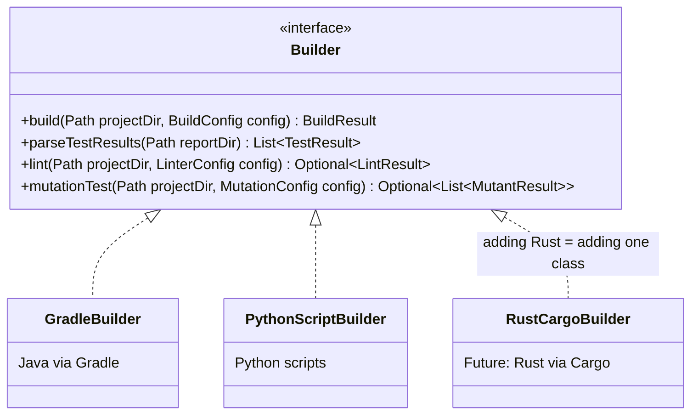

import RevealJS, { Slide } from '@site/src/components/RevealJS';
import Img from '@site/src/components/Img';

<RevealJS transition="slide">

{/* ============================================ */}
{/* COVER IMAGE */}
{/* ============================================ */}

<Slide>
  

<aside className="notes">
**Lecture overview:**
- **Total time:** ~50 minutes
- **Prerequisites:** L17 (creation patterns, DI, service wiring), L16 (testability), L6-L7 (information hiding, coupling)
- **Connects to:** L19 (Architectural Qualities), L20 (Networks & Security), L36 (Sustainability)

**Structure:**
- Architecture vs. Design (~8 min)
- Architectural Drivers (~10 min)
- Finding Service Boundaries (~20 min)
- Communicating Architecture: C4 & ADRs (~12 min)
- Upfront vs. Piecemeal Growth (~10 min — if time)

**Key theme:** We've been building objects and wiring them into services. Now we step back and ask: where do those service boundaries come from? We'll use Pawtograder's autograder — the system that grades YOUR assignments — as our running example.

→ **Transition:** Let's start with the title...
</aside>

</Slide>

{/* ============================================ */}
{/* TITLE SLIDE */}
{/* ============================================ */}

<Slide>

# CS 3100: Program Design and Implementation II

## Lecture 18: Thinking Architecturally

<p style={{marginTop: '2em', fontSize: '0.8em', color: '#666'}}>
  ©2026 Jonathan Bell, CC-BY-SA
</p>

<aside className="notes">
**Context:**
- L17 ended with creation patterns and DI — how do we wire services together?
- Today: how do we decide what those services should BE?
- Running example: Pawtograder's autograder — the system they use every day

**Key message:** "Same principles you already know — information hiding, coupling, cohesion — but applied at a bigger scale."

→ **Transition:** Here's what you'll be able to do after today...
</aside>

</Slide>

{/* ============================================ */}
{/* LEARNING OBJECTIVES */}
{/* ============================================ */}

<Slide>

## Learning Objectives

<p style={{fontSize: '0.85em', textAlign: 'left'}}>
After this lecture, you will be able to:
</p>

<ol style={{fontSize: '0.75em', textAlign: 'left'}}>
  <li>Define <strong>software architecture</strong> and distinguish it from design</li>
  <li>Identify <strong>architectural drivers</strong> (functional requirements, quality attributes, constraints) that shape decisions</li>
  <li>Apply heuristics to determine <strong>service/module boundaries</strong> and design good interfaces</li>
  <li>Use the <strong>C4 model</strong> to communicate architecture at different levels of detail</li>
  <li>Write <strong>Architecture Decision Records</strong> (ADRs) to capture the <em>why</em> behind decisions</li>
</ol>

<aside className="notes">
**Time allocation:**
- Objective 1: Architecture vs Design (~8 min)
- Objective 2: Architectural Drivers (~10 min)
- Objective 3: Finding Boundaries (~20 min)
- Objective 4-5: C4 + ADRs (~12 min)

**Connection to L17:**
- L17: How do we wire objects into services? (creation patterns, DI)
- L18: How do we decide what those services should BE?

→ **Transition:** Let's start by defining what we mean by "architecture"...
</aside>

</Slide>

{/* ============================================ */}
{/* ARC 1: ARCHITECTURE vs DESIGN (8 min) */}
{/* ============================================ */}

<Slide>

## Architecture vs. Design: A Continuum

<p style={{fontSize: '0.9em', marginTop: '0.5em'}}>
Architecture and design exist on a continuum. They ask different questions at different scales.
</p>

<div style={{display: 'grid', gridTemplateColumns: '1fr 1fr', gap: '1.5em', fontSize: '0.7em', marginTop: '1em'}}>

<div style={{padding: '1em', border: '2px solid #FF9800', borderRadius: '8px'}}>

**Architecture — The Big Picture**

- What are the major components?
- How do they communicate?
- What are the quality requirements?
- Which decisions are hard to change later?

</div>

<div style={{padding: '1em', border: '2px solid #4CAF50', borderRadius: '8px'}}>

**Design — The Details**

- How is this class organized?
- What data structures should we use?
- How do these methods collaborate?
- Which pattern fits this problem?

</div>

</div>

<div className="fragment">
<p style={{fontSize: '0.85em', marginTop: '1em', fontWeight: 'bold', color: '#9370DB'}}>
A useful heuristic: architectural decisions are the ones that are <strong>expensive to change</strong>.
</p>
</div>

<aside className="notes">
**The boundary is fuzzy:**
- Ralph Johnson (Gang of Four): "Architecture is about the important stuff. Whatever that is."
- The "important stuff" varies by project
- Usually = decisions that constrain many other decisions downstream

**Examples:**
- **Architectural:** Run grading on GitHub Actions vs. own server (months to reverse)
- **Design:** HashMap vs. TreeMap in test result storage (an afternoon to change)
- **Gray area:** How to structure the `pawtograder.yml` config format

**Don't worry about unfamiliar terms!**
- We'll cover networks, authentication, deployment in L20-L21
- Today: the *thinking process* — how do we identify which decisions matter most?

→ **Transition:** Let's see what this means for a system you already know...
</aside>

</Slide>

<Slide>

## Case Study: Pawtograder Autograder Requirements

<p style={{fontSize: '0.85em'}}>
Before we see how Pawtograder is architected, let's think about what it needs to do:
</p>

<ul style={{fontSize: '0.75em'}}>
  <li>Accept student code submissions from GitHub repositories</li>
  <li>Copy student files into the instructor's solution repo and build the project</li>
  <li>Run instructor test suites and report results per graded unit</li>
  <li>Run mutation analysis on student tests (Pitest)</li>
  <li>Report grading results back to Pawtograder for students to see</li>
</ul>

<div className="fragment">
<div style={{padding: '0.75em', border: '2px solid #FF9800', borderRadius: '8px', marginTop: '0.75em', fontSize: '0.8em'}}>

**Discussion: What decisions would be "expensive to change"?**

Think about: Where should tests run? Who can see the test code? How do instructors configure grading? What happens when 200 students submit at once?

</div>
</div>

<aside className="notes">
**PAUSE FOR DISCUSSION (2-3 min):**

Prompt students to think before revealing the answers:
- "If we wanted to switch from GitHub Actions to our own servers later, how hard would that be?"
- "What if we want to add support for a new language like Rust?"
- "What if we want instructors to configure grading differently?"

**Common student responses to watch for:**
- **Where tests run:** Some may say "doesn't matter" — push back: switching from GitHub Actions to dedicated servers would require rewriting the entire deployment model
- **Test visibility:** Security concern — students can't see instructor tests, but how do we enforce that?
- **Configuration:** Will instructors use a config file? A web UI? This affects who can change what and how quickly

**Key insight to plant:**
"Your instincts about what's 'easy' or 'hard' to change — those instincts ARE architectural thinking. We're going to see how Pawtograder actually made these decisions, and compare it to Bottlenose which made different choices."

→ **Transition:** Let's see what decisions Pawtograder actually made, and compare them to Bottlenose...
</aside>

</Slide>

<Slide>

## Architecture: Pawtograder vs. Bottlenose

<p style={{fontSize: '0.85em'}}>
Two systems, same problem — different architectural choices:
</p>

<div style={{fontSize: '0.65em', marginTop: '0.5em'}}>

| Decision | Pawtograder | Bottlenose |
|----------|-------------|------------|
| **Where does grading run?** | GitHub Actions (rented) | Custom job queue + Orca (owned) |
| **Where does business logic live?** | "Grading action" component — parses, scores, normalizes | Platform — `Grader` subclasses per language |
| **How do instructors configure?** | `pawtograder.yml` in assignment repo | Web UI forms |

</div>

<div className="fragment" style={{marginTop: '1em'}}>
<p style={{fontSize: '0.8em', fontWeight: 'bold'}}>Why these are architectural:</p>
<ul style={{fontSize: '0.7em'}}>
  <li><strong>Execution:</strong> Own vs. rent infrastructure — months to reverse</li>
  <li><strong>Business logic:</strong> Determines where complexity lives - crucial for changeability</li>
  <li><strong>Config:</strong> Shapes who can change behavior and how fast</li>
</ul>
</div>

<aside className="notes">
**Make this concrete — you use this system!**
- "When you push code and see the autograder run, GitHub Actions is executing the grading action"
- "The reason you can't see our test cases? That's an architectural decision — the private grader is downloaded at runtime"

**Caveat about speculation:**
- We're comparing these systems to illustrate architectural thinking
- We didn't interview the Bottlenose creators — we're inferring from the code and documentation
- The point is to see *types* of architectural differences, not to claim we know exactly why they chose what they chose

**Expand on each row:**
1. **Execution:** GitHub Actions = zero ops burden but less control; custom scheduler = full control but you build and maintain it
2. **Business logic:** Thick grader enables richer feedback; centralizing in platform is simpler per-grader but platform grows complex
3. **Config:** Config file in repo = instructors iterate independently; web UI = platform must support every pattern

→ **Transition:** So what drives these decisions?
</aside>

</Slide>

<Slide>

## The Key Insight

<p style={{fontSize: '0.9em', marginTop: '0.5em'}}>
Neither architecture is "wrong" — they reflect <strong>different requirements in different contexts</strong>.
</p>

<div style={{fontSize: '0.8em', marginTop: '1em'}}>

| | Bottlenose (then) | Pawtograder (now) |
|--|-------------------|-------------------|
| **Grading needs** | Simpler, per-language | Structured feedback, mutation testing |
| **Instructor flexibility** | Platform defines patterns | Instructors iterate independently |
| **Infrastructure** | Owned servers, full control | Rented (GitHub Actions), zero ops |

</div>

<div className="fragment" style={{marginTop: '1.5em'}}>
<p style={{fontSize: '0.9em', color: '#9370DB', fontWeight: 'bold'}}>
This raises a question: What forces <em>might</em> push a system toward a particular architecture?
</p>
<p style={{fontSize: '0.75em', color: '#888', marginTop: '0.25em'}}>
(We're speculating here — we didn't interview the original creators!)
</p>
</div>

<aside className="notes">
**Important caveat:**
- We're using these systems as *examples* to illustrate architectural thinking
- We didn't interview the original Bottlenose creators — we're speculating based on the artifacts
- The goal is to learn the *types* of forces that shape architecture, not to definitively explain these specific systems

**The point to land:**
- Neither system is "wrong" — different contexts lead to different choices
- The computing landscape changed: GitHub Actions didn't exist when Bottlenose was built
- Requirements likely differed: richer feedback, more instructor control, multi-language support

**Bridge to next section:**
- "So what ARE the kinds of forces that shape architecture?"
- "Let's look at architectural drivers — the things that push us toward particular solutions"

→ **Transition:** Let's examine what drives these decisions...
</aside>

</Slide>

{/* ============================================ */}
{/* ARC 2: ARCHITECTURAL DRIVERS (10 min) */}
{/* ============================================ */}

<Slide>

## What Drives Architectural Decisions?

<p style={{fontSize: '0.9em', marginTop: '0.5em'}}>
Architecture doesn't happen in a vacuum. Decisions are shaped by <strong>architectural drivers</strong>:
</p>

<div style={{fontSize: '0.8em', marginTop: '1em'}}>



</div>

<aside className="notes">
**Three categories of forces:**
1. **Functional requirements:** What the system must do
2. **Quality attributes:** How well it must do it (the "-ilities")
3. **Constraints:** Fixed boundaries we can't change

**Key insight:**
- Functional requirements tell you WHAT capabilities exist
- But they don't dictate HOW to structure them
- Quality attributes and constraints shape the structure

→ **Transition:** Let's look at each driver for Pawtograder...
</aside>

</Slide>

<Slide>

## Driver 1: Functional Requirements

<p style={{fontSize: '0.85em'}}>
What must the Pawtograder autograder do?
</p>

<ul style={{fontSize: '0.75em'}}>
  <li>Accept student code submissions from GitHub repositories</li>
  <li>Copy student files into the instructor's solution repo and build the project</li>
  <li>Run instructor test suites and report results per graded unit</li>
  <li>Run mutation analysis on student tests</li>
  <li>Report grading results back to Pawtograder for students to see</li>
</ul>

<div className="fragment">
<p style={{fontSize: '0.85em', marginTop: '1em', color: '#FF9800'}}>
A single monolithic script COULD do all of this. But should it? The functional requirements alone don't tell us how to structure it.
</p>
</div>

<aside className="notes">
**The point:**
- A bash script that does everything sequentially COULD work
- But would it be testable? Maintainable? Extensible to new languages?
- That's where quality attributes come in

→ **Transition:** Quality attributes shape the structure...
</aside>

</Slide>

<Slide>

## Driver 2: Quality Attributes (the "-ilities")

<p style={{fontSize: '0.85em'}}>
How <em>well</em> must the system perform? Quality attributes shape structure more than features do.
</p>

<div style={{display: 'grid', gridTemplateColumns: '1fr 1fr', gap: '1em', fontSize: '0.7em', marginTop: '0.5em'}}>

<div style={{padding: '0.75em', border: '2px solid #4CAF50', borderRadius: '8px'}}>

**You already know these:**

- **Changeability** (L6-L7): New assignment = swap `pawtograder.yml`. New language = add one `Builder` class. No need to change API or affect other courses.
- **Testability** (L16): Run grading locally without GitHub, API, or database.

*Same principles from class design — now at service scale!*

</div>

<div style={{padding: '0.75em', border: '2px solid #FF9800', borderRadius: '8px'}}>

**Coming up:**

- **Security** (L20): Students must NEVER see test cases
- **Scalability** (L21): 200 students submit at once
- **Maintainability** (L36): Small team, many courses

</div>

</div>

<div className="fragment" style={{marginTop: '0.75em'}}>
<p style={{fontSize: '0.8em', color: '#9370DB'}}>
Quality attributes often <strong>conflict</strong>. Security (download grader at runtime) creates a network dependency that hurts reliability. Architecture = making these tradeoffs consciously.
</p>
</div>

<aside className="notes">
**Connect to prior knowledge:**
- "You already know how to design for change at the class level — information hiding, low coupling, high cohesion"
- "You already know testability — observability, controllability, separating 'what to do' from 'how to connect'"
- "Today we're applying those SAME principles at a bigger scale"

**Pawtograder examples:**
- Changeability → `pawtograder.yml` is the ONLY thing instructors touch; adding Rust = one new Builder class
- Testability → `npx tsimp src/grading/main.ts -s /solution -u /submission` runs locally, no network needed

**Preview future lectures:**
- L20: How do we authenticate? How do we hide test cases? (Security)
- L21: How does GitHub Actions handle 200 concurrent submissions? (Scalability)
- L36: How do we keep this maintainable over years? (Sustainability)

→ **Transition:** Constraints also shape what's possible...
</aside>

</Slide>

<Slide>

## Driver 3: Constraints

<p style={{fontSize: '0.85em'}}>
Constraints are non-negotiable boundaries. They limit our design space:
</p>

<div style={{fontSize: '0.75em', marginTop: '0.5em'}}>

| Source | Pawtograder Constraint |
|--------|----------------------|
| **Platform** | "Must run inside GitHub Actions runners" |
| **Security** | "Student code is untrusted — cannot access instructor tests directly" |
| **Authentication** | "GitHub OIDC tokens are the only identity source" |
| **Compatibility** | "Must support Java (Gradle) and Python assignments" |

</div>

<div className="fragment">
<p style={{fontSize: '0.85em', marginTop: '0.5em', color: '#9370DB'}}>
Constraints aren't negotiable the way quality attributes are. They're the fixed boundaries within which we architect. Sometimes constraints <strong>ARE</strong> the architecture — the GitHub Actions sandbox essentially dictates the deployment model.
</p>
</div>

<aside className="notes">
**Constraints vs. quality attributes:**
- Quality attributes are things we WANT (security, scalability)
- Constraints are things we MUST accept (GitHub Actions, OIDC, untrusted code)
- Together they shape WHAT architectures are even possible

**Platform constraints shaping architecture:**
- We'll see more examples in L21: Serverless — platform constraints often dictate the deployment model
- GitHub Actions constrains how Pawtograder works; Bottlenose had different constraints (dedicated servers, Docker, PostgreSQL)

→ **Transition:** Now that we know the drivers, how do we find the right boundaries?
</aside>

</Slide>

{/* ============================================ */}
{/* ARC 3: FINDING BOUNDARIES (20 min) */}
{/* ============================================ */}

<Slide>

## Drivers Tell Us What; Heuristics Help Us Find Where


<aside className="notes">
**Bridge from drivers to heuristics:**
- We just identified WHAT we care about: functional requirements, quality attributes, constraints
- But knowing we need "changeability" or "testability" doesn't tell us WHERE to draw the lines
- These four heuristics are *lenses* for examining a system to find natural boundaries

**The four lenses (preview):**
1. **Rate of Change:** Things that change at different speeds should be separate
2. **Actor:** Things owned by different people should be separate
3. **Interface Segregation:** Clients that need different things should get different interfaces
4. **Testability:** Things that need independent testing should be separable

**How they connect to drivers:**
- Changeability driver → Rate of Change heuristic helps us isolate fast-changing parts
- Maintainability driver → Actor heuristic helps us give each team a clear slice
- Testability driver → Testability heuristic helps us design components that can be tested alone

**Coming up:**
We'll apply each heuristic to Pawtograder and see how the same boundaries emerge from multiple angles — that's a sign we've found a natural seam.

→ **Transition:** Let's start with rate of change...
</aside>

</Slide>

<Slide>

## Heuristic 1: Group by Rate of Change

<p style={{fontSize: '0.85em'}}>
Things that change at different rates should live in different components:
</p>

<div style={{fontSize: '0.7em', marginTop: '0.5em'}}>

| Component | How Often It Changes | Who Changes It |
|-----------|---------------------|----------------|
| **`pawtograder.yml`** | Every assignment (weekly) | Instructor |
| **Grading Action code** | Every few months | Action maintainers |
| **Pawtograder API** | Rarely — endpoints are stable | Sysadmin team |
| **`PawtograderConfig` interface** | Very rarely — breaking change | Action maintainers (carefully!) |

</div>

<div className="fragment">
<p style={{fontSize: '0.85em', marginTop: '0.5em', color: '#4CAF50'}}>
✓ The config file (`pawtograder.yml`) changes weekly → it SHOULD be separate from the action code that changes monthly. And both should be separate from the API that changes rarely.
</p>
</div>

<aside className="notes">
**Four things, four rates of change:**
- `pawtograder.yml` (the config) — changes per assignment (weekly)
- Grading Action (the engine) — changes per semester
- Pawtograder API (the platform) — changes very rarely
- `PawtograderConfig` interface — the contract between action and API, changes almost NEVER

**The interface is the most stable:**
- The `PawtograderConfig` interface defines what the API expects from the action
- If we change this interface, BOTH the action AND the API must change together
- That's why it changes "very rarely — breaking change" — it's the stable contract that lets the other pieces evolve independently

**If they were all one thing:**
- Changing a test case configuration would mean re-deploying the entire platform
- Updating the action to support Python would risk breaking the API
- Rate of change tells us: keep them apart!

→ **Transition:** What does this config file actually look like?
</aside>

</Slide>

<Slide>

## What's in a `pawtograder.yml`?

<p style={{fontSize: '0.8em'}}>
<strong>YAML</strong> (Yet Another Markup Language) is a human-readable data format — like JSON but with less punctuation. Here's a simplified example:
</p>

<div style={{fontSize: '0.5em', marginTop: '0.5em'}}>

```yaml
grader: 'overlay'
build:
  preset: 'java-gradle'           # How to build: Java with Gradle
  student_tests:
    run_tests: true               # Run student's tests against instructor impl
    run_mutation: true            # Check if student tests catch buggy versions

gradedParts:
  - name: "Domain Model"
    gradedUnits:
      - name: "Cookbook"
        tests: ["Cookbook addRecipe", "Cookbook removeRecipe"]
        points: 4
      - name: "UserLibrary"
        tests: ["UserLibrary findRecipesByTitle"]
        points: 3

submissionFiles:
  files: ['src/main/**/*.java']   # Which student files to grade
  testFiles: ['src/test/**/*.java']
```

</div>

<p style={{fontSize: '0.75em', marginTop: '0.5em', color: '#9370DB'}}>
This file IS the interface between instructor and grading action — it changes weekly, the action code doesn't.
</p>

<aside className="notes">
**YAML basics:**
- Indentation shows structure (like Python)
- Key-value pairs with colons
- Lists with dashes
- Comments with #
- Much more readable than JSON for config files

**Walk through the example:**
- `grader: 'overlay'` — the grading strategy (copy student files over instructor solution)
- `build.preset` — which language/build tool (Java + Gradle)
- `gradedParts` — what to grade: names, which tests, how many points
- `submissionFiles` — which student files to copy

**The key insight:**
- Instructor changes THIS FILE every week — new tests, new point values, new graded parts
- They never touch the TypeScript action code
- The action reads this file and does what it says

→ **Transition:** Different people care about different parts...
</aside>

</Slide>

<Slide>

## Heuristic 2: Each Actor Gets Their Own Slice


<aside className="notes">
**Walk through the graphic — four actors, four slices:**
- **Student:** Pushes code, sees grades — never touches config or action
- **Instructor:** Writes `pawtograder.yml` — never modifies TypeScript
- **Sysadmin:** Maintains API infrastructure — doesn't write grading configs
- **Intrepid Instructor:** Can change how grading works by modifying the action — without touching the API!

**Key insight: changes from one actor shouldn't ripple to another's code.**
- When instructor changes pawtograder.yml → action and API unchanged
- When sysadmin updates API → instructor config unchanged
- When intrepid instructor adds LLM feedback → API unchanged

**Connection to L8 (SOLID):** This is Single Responsibility Principle at architectural scale — each component has one reason to change, corresponding to one actor.

→ **Transition:** What if we forced all clients to use one fat interface?
</aside>

</Slide>

<Slide>

## Heuristic 3: Apply Interface Segregation

<p style={{fontSize: '0.85em'}}>
Don't force clients to depend on interfaces they don't use. What if we had one fat interface?
</p>

<div style={{fontSize: '0.65em'}}>

```java
// BAD: One monolithic interface for everything
public interface AutograderSystem {
    // Instructor concerns
    PawtograderConfig parseConfig(String yaml);
    void validateGradedParts(PawtograderConfig config);

    // Action engine concerns
    void copySubmissionFiles(Path src, Path dest);
    BuildResult buildProject(BuildPreset preset);
    List<TestResult> runTests(PawtograderConfig config);
    List<MutantResult> runMutationAnalysis(List<String> locations);

    // API concerns
    SubmissionRegistration registerSubmission(String oidcToken);
    void submitFeedback(String submissionId, AutograderFeedback results);
}
```

</div>

<div className="fragment">
<p style={{fontSize: '0.8em', marginTop: '0.5em', color: '#FF9800'}}>
An instructor configuring a YAML file shouldn't need to know about OIDC tokens. The API shouldn't need to know how tests are run.
</p>
</div>

<aside className="notes">
**What's wrong with this?**
- Instructor only cares about config structure — they don't need `registerSubmission`
- The API only cares about receiving results — it doesn't need `buildProject`
- Coupling everything together means changing ANY part risks breaking ALL parts

→ **Transition:** Split into focused interfaces...
</aside>

</Slide>

<Slide>

## Better: Segregated Interfaces

<div style={{fontSize: '0.62em'}}>

```java
// The contract between instructor and action (pawtograder.yml)
public interface PawtograderConfig {
    String getGrader();           // "overlay"
    BuildConfig getBuild();       // How to build: preset, timeouts, linter
    List<GradedPart> getGradedParts();  // What to grade: tests, points, visibility
    SubmissionFiles getSubmissionFiles(); // Which student files to copy
}

// The contract between action and Pawtograder API
public interface SubmissionAPI {
    SubmissionRegistration register(String oidcToken);
}

public interface FeedbackAPI {
    void submit(String submissionId, AutograderFeedback feedback);
}
```

</div>

<p style={{fontSize: '0.8em', marginTop: '0.5em', color: '#4CAF50'}}>
✓ Instructor only sees `PawtograderConfig` — their "interface" is a YAML file.<br/>
✓ Action talks to API through two narrow endpoints.<br/>
✓ Each interface has <strong>one reason to change</strong>.
</p>

<aside className="notes">
**Notice the data types flowing between components:**
- Instructor → Action: `PawtograderConfig` (parsed from YAML)
- Action → API: `AutograderFeedback` (test results, scores, output)
- API → Action: `submissionId` + `graderUrl` (one-time download URL)

**The YAML file IS an interface** — it's the contract between instructor and action. This is ISP applied at the configuration level!

→ **Transition:** What do the data types flowing across the API boundary look like?
</aside>

</Slide>

<Slide>

## The Data Types Behind the Interfaces

<p style={{fontSize: '0.85em'}}>
What do the records that flow across the API boundary actually look like?
</p>

<div style={{fontSize: '0.55em'}}>

```java
// What the API returns when the action registers a submission
public record SubmissionRegistration(
    String submissionId,     // Unique ID for this grading run
    String graderUrl,        // One-time URL to download instructor's test code
    String graderSha         // SHA to verify the download wasn't tampered with
) {}

// What the action sends back after grading
public record AutograderFeedback(
    List<TestFeedback> tests,          // Results per graded part
    LintResult lint,                    // Style check results (if configured)
    VisibilityOutput output,            // Console output tagged by visibility level
    Optional<Double> score,             // Overall score (if computable)
    List<Artifact> artifacts,           // Build logs, coverage reports, etc.
    List<FeedbackComment> annotations   // Line-level comments on student code
) {}

// One graded part (e.g., "HW3 - Part 1: Basic Tests")
public record TestFeedback(
    String name,                // Graded part name from pawtograder.yml
    double score,               // Points earned
    double maxScore,            // Points available
    List<TestCase> testCases,   // Individual test results
    String visibility           // "visible", "hidden", "after_due_date", "after_published"
) {}

// A comment attached to a specific line of student code
public record FeedbackComment(
    String file,        // e.g., "src/main/java/Student.java"
    int line,           // Line number
    String message,     // The feedback text
    String severity     // "error", "warning", "info", "bonus"
) {}
```

</div>

<aside className="notes">
**Notice how much information flows through `AutograderFeedback`:**
- This is the "thick action" paying off: the action has already parsed JUnit XML, Pitest reports, and linter output into a clean, structured format. The API just stores it.
- If this format were poorly designed—say, if `TestFeedback` didn't support visibility levels, or `FeedbackComment` couldn't reference specific lines—every future grading action implementation would have to work around those limitations.
- This is why we said the `AutograderFeedback` interface deserves careful specification: it's the contract that all current and future grading implementations must speak.

→ **Transition:** Can we test each piece independently?
</aside>

</Slide>

<Slide>

## Heuristic 4: Optimize for Testability

<p style={{fontSize: '0.85em'}}>
Can you test a component <em>without</em> deploying the whole system?
</p>

<div style={{fontSize: '0.7em', marginTop: '0.5em'}}>

| Component | Testable in Isolation? | How? |
|-----------|----------------------|------|
| **Grading logic** | ✅ Yes | `npx tsimp src/grading/main.ts -s /path/to/solution -u /path/to/submission` — runs locally, no API needed |
| **Config parsing** | ✅ Yes | Parse a `pawtograder.yml` file and validate — no network, no GitHub |
| **API endpoints** | ✅ Yes | Edge functions tested independently with mock OIDC tokens |
| **Full pipeline** | ⚠️ Integration | Requires GitHub Actions runner + API — regression test suite |

</div>

<div className="fragment">
<p style={{fontSize: '0.82em', marginTop: '0.5em', color: '#9370DB'}}>
The grading action can run locally without Pawtograder. That's not an accident — it's an architectural choice that enables fast development iteration.
</p>
</div>

<aside className="notes">
**Connection to L16 (Testability):**
- Same principle: separate "what to do" from "how to connect"
- The action doesn't need a real API to test grading logic
- The API doesn't need a real GitHub runner to test submission handling

**The local testing command is key:**
```
npx tsimp src/grading/main.ts -s /path/to/solution -u /path/to/submission
```
- No GitHub Actions, no Pawtograder API, no network
- Just: "here's a solution repo and a student repo — grade it"

→ **Transition:** Putting the four heuristics together...
</aside>

</Slide>


{/* ============================================ */}
{/* ARC 3 CONTINUED: EMERGING ARCHITECTURE */}
{/* ============================================ */}

<Slide>

## Emerging Architecture: Three Components

<p style={{fontSize: '0.85em'}}>
Applying our four heuristics, a natural structure emerges:
</p>



<aside className="notes">
**How we got here:**
- Rate of change → config changes fast, action medium, API slow
- Actor → instructor touches config, maintainer touches action, sysadmin touches API
- ISP → config is simple interface for instructor; API is simple interface for action
- Testability → action testable locally without API

**The components:**
- **Solution Repo:** Config source + test cases
- **Grading Action:** The engine (builds, tests, parses, reports)
- **Pawtograder API:** The platform (auth, submission tracking, persistence)

→ **Transition:** How do Pawtograder's boundaries compare to Bottlenose's?
</aside>

</Slide>

<Slide>

## Comparing Boundaries: Two approaches for grading student code

<div style={{display: 'grid', gridTemplateColumns: '1fr 1fr', gap: '1em', fontSize: '0.7em', marginTop: '1em'}}>

<div style={{padding: '1em', border: '2px solid #4CAF50', borderRadius: '8px'}}>

**Pawtograder: "Smart Action"**

- Action parses, scores, normalizes
- Sends structured `AutograderFeedback` to API
- API just stores it — language-agnostic

</div>

<div style={{padding: '1em', border: '2px solid #FF9800', borderRadius: '8px'}}>

**Bottlenose: "Platform-Driven"**

- `Grader` subclasses per language
- Platform interprets raw output
- Orca is a thin execution layer

</div>

</div>

<div className="fragment" style={{marginTop: '1em'}}>

| | Pawtograder | Bottlenose |
|--|-------------|------------|
| **Data coupling** | Narrow API (2 endpoints) | Shared Database |
| **Adding a language** | One new `Builder` class | New `Grader` + views + Docker image |

</div>

<aside className="notes">
**The fundamental difference:**
- Pawtograder: intelligence in the action → simple API
- Bottlenose: intelligence in the platform → simple worker

**Why data coupling matters (next slide goes deeper):**
- Bottlenose: application, job queue, and Orca all share PostgreSQL — schema changes ripple everywhere
- Pawtograder: action NEVER touches database — only two API endpoints
- This is information hiding at the data layer

**Pattern connection (L17):**
- Bottlenose's `Grader.find_by_type()` is Service Locator at architecture scale
- Pawtograder's `Builder` interface is Dependency Injection — explicit, testable

→ **Transition:** Let's see how data coupling affects testability...
</aside>

</Slide>

<Slide>

## Data Coupling Affects Testability

<div style={{display: 'grid', gridTemplateColumns: '1fr 1fr', gap: '1em', fontSize: '0.65em', marginTop: '0.5em'}}>

<div style={{padding: '0.75em', border: '2px solid #4CAF50', borderRadius: '8px'}}>

**Pawtograder (narrow API)**

Test the entire grading pipeline on your laptop:

```bash
npx tsimp src/grading/main.ts \
  -s /path/to/solution \
  -u /path/to/submission
```

No network, no database, no GitHub runner needed.

</div>

<div style={{padding: '0.75em', border: '2px solid #FF9800', borderRadius: '8px'}}>

**Bottlenose (shared database)**

You *could* test a `Grader` subclass by feeding it canned TAP output, but you'd need to:
- Stub ActiveRecord (Grader inherits from it)
- Mock Backburner job dispatch
- Simulate Orca's Docker execution responses

Possible, but the architecture works against you.

</div>

</div>

<div className="fragment">
<p style={{fontSize: '0.82em', marginTop: '0.75em', color: '#9370DB'}}>
Coupling makes itself felt at test time: isolated testing isn't impossible in Bottlenose, but the architecture makes it unnatural—you're working against the grain instead of with it.
</p>
</div>

<aside className="notes">
**Connection to L16 (Testability):**
- Same principle: the more dependencies a component has, the harder it is to test
- Pawtograder's narrow API boundary means: no DB dependency → easy local testing
- Bottlenose's shared database means: you *can* test a Grader with canned output, but you're fighting ActiveRecord inheritance, job dispatch coupling, etc.

**Connection to L17 (Service Locator vs DI):**
- Bottlenose's Service Locator approach means: grader code implicitly depends on the platform's registry
- Testing a `JavaGrader` in isolation requires mocking the lookup mechanism, the ActiveRecord base class, etc.
- Pawtograder's DI approach means: `GradleBuilder` depends only on what's in its constructor—easy to test by passing mocks
- This is exactly L17's point: "DI makes dependencies explicit... Service Locator hides them"

**Neither is wrong — different tradeoffs:**
- Bottlenose's shared DB simplified the architecture (components just read/write the same tables)
- But it made testing harder and changes more expensive — a schema change ripples everywhere
- Pawtograder's narrow API adds normalization complexity but gains testability and independent deployment

→ **Transition:** There's still a big decision inside the action...
</aside>

</Slide>

<Slide>

## A Design Decision: Where Does Language Logic Live?

<p style={{fontSize: '0.85em'}}>
We need to support multiple languages (Java, Python). Where should the language-specific build/test logic live?
</p>

<div style={{display: 'flex', flexDirection: 'column', gap: '1em', fontSize: '0.65em', marginTop: '1em'}}>

<div style={{padding: '0.75em', border: '2px solid #4CAF50', borderRadius: '8px'}}>

**Option A: Logic in the Action**

The action knows how to build Java (Gradle) and Python. It normalizes results before sending to API.

- **Pros:** API stays language-agnostic (simple!)
- **Cons:** Action grows with every new language support
- **Example:** `preset: 'java-gradle' | 'python-script'` strategy pattern

</div>

<div style={{padding: '0.75em', border: '2px solid #FF9800', borderRadius: '8px'}}>

**Option B: Logic in the API**

Action sends raw logs/XML to API. API parses and normalizes.

- **Pros:** Action is very thin ("dumb pipe")
- **Cons:** API becomes coupled to every language toolchain; hard to test locally
- **Risk:** Scaling issues if parsing is heavy

</div>

</div>

<div className="fragment">
<p style={{fontSize: '0.85em', marginTop: '1em', color: '#9370DB'}}>
Pawtograder chooses <strong>Option A</strong>. The action normalizes everything into a standard `AutograderFeedback` format. The API remains simple and scalable.
</p>
</div>

<aside className="notes">
**Bottlenose's architecture is closer to Option B:**
- Orca (the Docker execution service) is a thin pipe that returns raw output
- Bottlenose's `Grader` subclasses interpret everything — each language has its own parsing logic
- This worked because Bottlenose already had deep knowledge of assignment structure for each language

**Pawtograder chose Option A because:**
- The action runs in the build environment where parsing tools are available
- Keeping the API simple enables it to serve many courses with minimal changes
- Adding Rust support = adding a new Builder implementation, not changing the API

**Reflection questions:**
1. If we added Rust support, which components would need to change?
2. Can you test language-specific parsing without a running API?
3. What if we wanted to support a course platform other than Pawtograder (e.g., Canvas)?

→ **Transition:** How do we wire the internal steps?
</aside>

</Slide>

<Slide>
# This decision is expensive to change


<aside className="notes">
**Why is this "expensive to change"?**

Once you take the orange path (logic in API), coupling spreads like a web:
- API now knows about JUnit XML format → tied to Java
- Add Python? API learns pytest format → more parsing code
- Add Rust? More formats, more coupling
- Database schema stores language-specific fields
- UI displays language-specific results
- Every new language touches EVERY layer

**The extraction question:**
- Six months later, you realize the API is bloated and hard to test
- You think: "Let's extract the parsing into a separate service"
- But now parsing code is intertwined with storage, with the UI, with the job queue...
- You ask yourself: "Can I even extract this? Or should I just start from scratch?"

**THAT question — "should I throw it away and start over?" — is the definition of an expensive decision.**

The green path (normalize early) avoids this:
- Action handles all language complexity
- API just stores `AutograderFeedback` — same shape for every language
- Adding Rust? One new `Builder` class. API unchanged. Database unchanged.

**This is why we said earlier:** architectural decisions are the ones that are expensive to change. This fork is architectural.

→ **Transition:** So we've found our boundaries and made the big structural decisions. But how do we design the interfaces BETWEEN these components? Turns out, the same principles from class design apply at this scale too...
</aside>

</Slide>

{/* ============================================ */}
{/* INTERFACE DESIGN AT THE SERVICE LEVEL */}
{/* ============================================ */}

<Slide>

## Interface Design at the Service Level

<p style={{fontSize: '0.85em'}}>
Once we've identified components, we need to design their interfaces. The same principles from class design apply—and so do the same patterns from L17.
</p>

<div style={{fontSize: '0.6em', marginTop: '0.5em'}}>

**Dependency Injection at service scale:**

```java
// Good: GradingAction depends on abstractions
public class GradingAction {
    private final SubmissionAPI submissionApi;
    private final FeedbackAPI feedbackApi;

    public GradingAction(SubmissionAPI submissionApi, FeedbackAPI feedbackApi) {
        this.submissionApi = submissionApi;
        this.feedbackApi = feedbackApi;
    }
}
```

**Use the Strategy pattern for extensibility:**

```java
// Builder is an interface—we can add new language support
public interface Builder {
    BuildResult build(Path projectDir, BuildConfig config);
    List<TestResult> parseTestResults(Path reportDir);
    Optional<LintResult> lint(Path projectDir, LinterConfig config);
    Optional<List<MutantResult>> mutationTest(Path projectDir, MutationConfig config);
}

// GradleBuilder for Java, PythonScriptBuilder for Python
// Adding Rust support = adding a new Builder implementation
```

</div>

<div className="fragment">
<p style={{fontSize: '0.8em', marginTop: '0.5em', color: '#9370DB'}}>
**Make contracts clear:** What does `register` promise? What happens if the OIDC token is invalid? What format does `AutograderFeedback` use? These details belong in the interface's documentation.
</p>
</div>

<aside className="notes">
**Connection to L17:**
- In L17, we passed a `ConversionRegistry` to `Recipe.convert()`. At the service level, the same principle applies—but now we're injecting entire collaborating services.
- The `GradingAction` depends on `SubmissionAPI` and `FeedbackAPI` abstractions, not concrete implementations.
- For testing, we can inject mock implementations that don't require a real API.

**The Strategy pattern for extensibility:**
- `Builder` is the extension point for new languages
- Adding Rust = new `RustCargoBuilder` class, nothing else changes
- This is exactly what we saw in the "Adding Rust Support" comparison

→ **Transition:** What do these contracts actually look like?
</aside>

</Slide>

<Slide>

## The Contracts: Data Types That Cross Boundaries

<p style={{fontSize: '0.8em'}}>
The interface isn't just method signatures — it's the <strong>data types</strong> that flow across. These are the contracts that must remain stable:
</p>

<div style={{fontSize: '0.5em', marginTop: '0.5em'}}>

```java
// What the API returns when the action registers a submission
public record SubmissionRegistration(
    String submissionId,     // Unique ID for this grading run
    String graderUrl,        // One-time URL to download instructor's test code
    String graderSha         // SHA to verify the download wasn't tampered with
) {}

// What the action sends back after grading — THE KEY CONTRACT
public record AutograderFeedback(
    List<TestFeedback> tests,          // Results per graded part
    LintResult lint,                    // Style check results
    Optional<Double> score,             // Overall score
    List<FeedbackComment> annotations   // Line-level comments on student code
) {}

// A comment attached to a specific line of student code
public record FeedbackComment(
    String file, int line, String message, String severity
) {}
```

</div>

<div className="fragment">
<p style={{fontSize: '0.8em', marginTop: '0.5em', color: '#FF9800'}}>
If `AutograderFeedback` were poorly designed — no visibility levels, no line-level comments — every future grading implementation would have to work around those limitations. <strong>This contract deserves careful design.</strong>
</p>
</div>

<aside className="notes">
**Why these records matter:**
- `SubmissionRegistration`: What the action receives — a one-time URL to download the private grader
- `AutograderFeedback`: What the action sends back — ALL the grading results in one structured format
- `FeedbackComment`: Enables line-level feedback on student code

**This is the "thick action" paying off:**
- The action has already parsed JUnit XML, Pitest reports, linter output
- Normalized everything into this clean, structured format
- The API just stores it — doesn't need to know about JUnit or Pitest

**The stability requirement:**
- If we change `AutograderFeedback`, EVERY grading action implementation must change
- That's why this interface changes "very rarely — breaking change"
- Same principle as L7's stable interfaces — but now at the API level

→ **Transition:** How do we communicate all of this architecture to others?
</aside>

</Slide>

{/* ============================================ */}
{/* ARC 4: COMMUNICATING ARCHITECTURE (12 min) */}
{/* ============================================ */}

<Slide>

## Architecture in Your Head Is Folklore


<aside className="notes">
**The communication challenge with Pawtograder:**
- We just covered: three components, four heuristics, data coupling decisions, interface contracts, record types...
- How would you explain all of that to a new team member?
- How would you explain it to an instructor who just wants to configure grading?
- How would you explain it to a sysadmin who needs to debug the API?

**The problem:**
- If this architecture only exists in one person's head, it degrades like a game of telephone
- Six months later, everyone has a DIFFERENT mental model
- New contributors make changes that violate boundaries they didn't know existed
- "Why doesn't the action just write directly to the database?" — because they never saw the ADR

**Structured approaches help:**
1. **C4 Diagrams** — Show the system at different zoom levels (different audiences need different detail)
2. **ADRs** — Capture WHY we made decisions, not just WHAT we built

→ **Transition:** Let's look at C4 first — four levels of zoom...
</aside>

</Slide>

<Slide>

## The C4 Model: Four Levels of Zoom

<div style={{fontSize: '0.7em', marginTop: '0.5em'}}>

| Level | Shows | Pawtograder Example |
|-------|-------|---------------------|
| **1. System Context** | System + Users + External | Student ↔ GitHub ↔ **Autograder** ↔ Instructor |
| **2. Container** | Deployable Units | **Grading Action** (TypeScript), **API** (Edge Functions), **Database** (Supabase) |
| **3. Component** | Internals of one Container | Inside Action: `ConfigParser`, `Builder`, `TestRunner`, `FeedbackClient` |
| **4. Code** | Classes / Interfaces | `PawtograderConfig` interface, `Builder` class |

</div>

<div className="fragment">
<p style={{fontSize: '0.85em', marginTop: '1em'}}>
Let's walk through all four levels for Pawtograder's autograder, so you can see how each level zooms in on a different scale of the same system.
</p>
</div>

<aside className="notes">
**The C4 model**, created by Simon Brown, provides four levels of abstraction for architectural diagrams.

→ **Transition:** Let's start at the widest zoom level...
</aside>

</Slide>

<Slide>

## C4 Level 1: System Context

<p style={{fontSize: '0.85em'}}>
Who uses the system, and what external systems does it talk to? This is the "napkin sketch" level.
</p>



<p style={{fontSize: '0.8em', marginTop: '0.5em'}}>
At this level, the autograder is a single box. We don't care what's inside—only what it interacts with.
</p>

<aside className="notes">
**The "elevator pitch" diagram:**
- A student or TA could read this and understand the system's role
- No internal details—just actors and external systems

→ **Transition:** Zoom in to see the deployable units...
</aside>

</Slide>

<Slide>

## C4 Level 2: Container

<p style={{fontSize: '0.85em'}}>
Zoom into the "Autograder System" box. What are the major deployable units?
</p>



<p style={{fontSize: '0.8em', marginTop: '0.5em'}}>
The narrow API boundary between the Grading Action and Pawtograder API is a deliberate choice—the action never touches the database directly.
</p>

<aside className="notes">
**What this reveals:**
- The three components we identified earlier, plus the database
- Communication mechanism: HTTPS + JSON through two API endpoints
- This is the level where architectural decisions become visible

**Bottlenose comparison:**
- Bottlenose's Level 2 has four containers (Bottlenose application, Backburner job queue, Orca Docker execution, PostgreSQL)
- This reflects the additional infrastructure required for Bottlenose's dedicated-server approach

→ **Transition:** Zoom into the Grading Action...
</aside>

</Slide>

<Slide>

## C4 Level 3: Component (Grading Action)



<p style={{fontSize: '0.8em', marginTop: '0.5em'}}>
This view shows how `main.ts` orchestrates the internal components. **Mutation Analysis** depends on **Tests** being run first, and multiple report parsers normalize tool-specific output into `AutograderFeedback`.
</p>

<aside className="notes">
**What this reveals:**
- The central role of the Controller (`Main`)
- Dependency direction: deeper components don't know about the controller
- Separation of concerns: Builder doesn't know about API Client
- Report Parsers normalize Surefire XML, PIT XML, JaCoCo CSV, and Checkstyle output
- This is the view a developer needs to fix a bug in result reporting

→ **Transition:** Zoom into the Build Runner to see actual code...
</aside>

</Slide>

<Slide>

## C4 Level 4: Code (Build Runner)

<p style={{fontSize: '0.85em'}}>
Zoom into the "Build Runner" component. What are the actual classes and interfaces?
</p>



<p style={{fontSize: '0.8em', marginTop: '0.5em'}}>
Level 4 shows actual code structure. You'd rarely draw this for the whole system—it's useful for specific extension points or critical interfaces.
</p>

<aside className="notes">
**When to use Level 4:**
- Documenting extension points (like the `Builder` interface)
- Critical interfaces where getting the design right matters (like `AutograderFeedback`)
- NOT for the entire system—too much detail

→ **Transition:** Choosing the right level for your audience...
</aside>

</Slide>

<Slide>

## Choosing the Right Level

<p style={{fontSize: '0.85em'}}>
Use the right level of detail for your audience:
</p>

<div style={{fontSize: '0.7em', marginTop: '0.5em'}}>

| Audience | Useful Levels | Why |
|----------|--------------|-----|
| Students and TAs | Level 1 | Need to understand what the system does, not how |
| Instructors configuring grading | Levels 1–2 | Need to see where `pawtograder.yml` fits in the pipeline |
| Action maintainers | Levels 2–3 | Need to understand component responsibilities and dependencies |
| Contributors adding a new Builder | Levels 3–4 | Need to see the extension point and its interface |

</div>

<div className="fragment">
<p style={{fontSize: '0.8em', marginTop: '0.75em', color: '#9370DB'}}>
For comparison, Bottlenose's C4 Level 2 has four containers (Bottlenose application, Backburner job queue, Orca's Docker execution service, and PostgreSQL) compared to Pawtograder's three—reflecting Bottlenose's dedicated-server approach.
</p>
</div>

<aside className="notes">
**Key insight:** Match the diagram to the audience. Don't show Level 4 code diagrams to non-technical stakeholders.

In L20 and L21, we'll see how network boundaries and serverless platforms influence container topology.

→ **Transition:** Diagrams show WHAT. ADRs show WHY.
</aside>

</Slide>

<Slide>

## Architecture Decision Records (ADRs)

<p style={{fontSize: '0.85em'}}>
Diagrams show <em>what</em>. <strong>ADRs capture <em>why</em></strong>. An ADR documents: <strong>Context</strong>, <strong>Decision</strong>, and <strong>Consequences</strong>.
</p>

<div style={{fontSize: '0.62em', padding: '0.75em', backgroundColor: 'rgba(147, 112, 219, 0.1)', borderRadius: '8px', border: '1px solid rgba(147, 112, 219, 0.3)'}}>

**ADR-001: Thick Grading Action with Narrow API vs. Thin Action with Shared Database**

**Context:** The grading action needs to communicate results to the Pawtograder platform. We could have the action access the database directly (as Bottlenose's components share PostgreSQL), or we could put a narrow API in between.

**Decision:** The grading action will **communicate exclusively through two API endpoints** (`createSubmission` and `submitFeedback`). It will never access the database directly.

**Consequences:**
- ✅ **Testability:** The action can run locally without a database, network, or GitHub runner
- ✅ **Changeability:** Database schema can evolve freely without touching the action
- ✅ **Decoupling:** Action and API can be developed and deployed independently
- ⚠️ **Complexity:** The action must normalize all results into a standard `AutograderFeedback` format
- ⚠️ **Duplication:** Some validation happens in both the action and the API

</div>

<aside className="notes">
**Why is this an ADR?**
- This is the most fundamental boundary decision in Pawtograder
- Six months from now, someone will ask: "Why doesn't the action just write grades directly to the database? It would be so much simpler!"
- The ADR answers: "Because we prioritize testability and independent deployment over simplicity — and we know tight data coupling makes every component harder to change and test independently."

**ADRs create institutional memory** — they prevent re-litigating settled decisions.

→ **Transition:** Here's another ADR example...
</aside>

</Slide>

<Slide>

## ADR Example: Security Decision

<div style={{fontSize: '0.62em', padding: '0.75em', backgroundColor: 'rgba(147, 112, 219, 0.1)', borderRadius: '8px', border: '1px solid rgba(147, 112, 219, 0.3)'}}>

**ADR-002: Dynamic Grader Download vs. Embedded Tests**

**Context:** We need to run instructor tests against student code. We could embed tests in the student repo (hidden folder?) or download them at runtime.

**Decision:** The action will **download the private grader at runtime** using an authenticated one-time URL.

**Consequences:**
- ✅ **Security:** Students strictly cannot see test code (it's never in their repo). Student code *does* run alongside instructor code, but the design ensures that a student who submits a trojan horse to exfiltrate the secret grader is trivially detected.
- ✅ **Changeability:** Instructors can update tests after assignment release without student pull.
- ⚠️ **Reliability:** Grading requires active network connection to Pawtograder API, adding more points of failure.
- ⚠️ **Complexity:** Needs a complex auth flow to get the download URL and ensure that student code is immutably recorded before receiving access to the grader code.

</div>

<div className="fragment">
<p style={{fontSize: '0.8em', marginTop: '0.75em', color: '#9370DB'}}>
ADRs create <strong>institutional memory</strong>. Without this record, someone might ask "Just put the tests in the repo!" — the ADR explains why we don't.
</p>
</div>

<aside className="notes">
**Two ADRs, two types of tradeoffs:**
- ADR-001: Testability & changeability vs. complexity (data coupling decision)
- ADR-002: Security vs. reliability (grader visibility decision)

**Key point:** Both could have gone the other way with different requirements. The ADR captures WHY we chose this path.

→ **Transition:** How much of this do we decide upfront?
</aside>

</Slide>

{/* ============================================ */}
{/* ARC 5: UPFRONT vs PIECEMEAL (10 min) */}
{/* ============================================ */}

<Slide>

## Plan the Infrastructure, Let the System Emerge


<aside className="notes">
**The city planning metaphor:**
- **Left (Master Plan):** Beautiful blueprints, but nothing built. Years of planning, no city.
- **Right (No Plan):** Buildings thrown up wherever, roads to nowhere, infrastructure chaos.
- **Center (Living City):** Key infrastructure was planned (roads, utilities, zoning), but neighborhoods grew organically within those constraints.

**The key insight:**
"Plan the infrastructure. Let the neighborhoods emerge."
- In Pawtograder: we planned the component boundaries (action, API, config) and the key interfaces (`AutograderFeedback`)
- But we didn't plan every feature — line-level comments, mutation hints, dependency scoring all emerged from use

**Christopher Alexander connection:**
- Alexander was a real architect who influenced software patterns deeply
- His book *The Timeless Way of Building* (1979) argues: the most livable spaces emerge through gradual, adaptive growth, not master plans
- The same is true for software — we discover what the architecture should be by building and using the system

**Easter egg for the curious:**
- "QWAN Coffee" = "Quality Without A Name" — Alexander's term for the ineffable quality that makes spaces feel alive
- He couldn't quite define it, but you know it when you see it
- If students ask: "It's a reference to Christopher Alexander — look him up!"

→ **Transition:** Let's see how Pawtograder grew this way...
</aside>

</Slide>

<Slide>

## Piecemeal Growth: Features That Emerged

<p style={{fontSize: '0.85em'}}>
Pawtograder's first version could build Java, run JUnit tests, and report a score. Features were added as real needs emerged:
</p>

<div style={{fontSize: '0.65em', marginTop: '0.5em'}}>

| Feature | When it was added | What prompted it |
|---------|------------------|------------------|
| **Line-level feedback comments** | After instructors asked for richer feedback | A `comment_script` hook lets any external script attach comments to specific lines of student code |
| **Detailed hints for mutants not detected** | After mutation testing revealed that students struggled to understand why certain mutants weren't caught | The `mutationTest()` method returns detailed feedback on each mutant (configured via `pawtograder.yml`), not just a score |
| **Dependency-based scoring** | After multi-part assignments revealed the need | If Part 2 depends on Part 1 and Part 1 fails, Part 2 shouldn't run—avoids cascading confusing failures |

</div>

<div className="fragment">
<p style={{fontSize: '0.82em', marginTop: '0.5em', color: '#9370DB'}}>
None of these were in the original design. But the <strong>architecture made each addition cheap</strong> because the right boundaries were in place from the start.
</p>
</div>

<aside className="notes">
**Christopher Alexander** — architect (the real-buildings kind) — argued in *The Timeless Way of Building* (1979) that the most livable, enduring structures emerge through gradual, adaptive growth rather than grand master plans. Software has the same property — we discover what the architecture should be by building and using the system.

**Key insight:** Each new feature was contained within the grading action. The API didn't change. Instructor configs grew new optional fields. The narrow API boundary meant new features didn't ripple across components.

→ **Transition:** So how much do we decide upfront?
</aside>

</Slide>

<Slide>

## Just Enough Architecture

<p style={{fontSize: '0.85em'}}>
Decide what's **hard to reverse**; defer what's **easy to change**; design the system so deferred decisions stay cheap.
</p>

<div style={{fontSize: '0.55em', marginTop: '0.5em'}}>

| Decision | Why it was decided early | Cost of getting it wrong |
|----------|------------------------|--------------------------|
| Narrow API boundary (`createSubmission`, `submitFeedback`) | Decouples action from platform—each evolves independently | Every grading action and the entire API would need rewriting |
| Thick action / thin API | Action normalizes results; API just stores them | Changing who interprets results means rearchitecting both sides |
| Config-driven grading (`pawtograder.yml`) | Instructors iterate independently without touching action code | Every instructor's workflow would break; action would need a UI |
| Strategy pattern for builders (`Builder` interface) | New languages = new class, not new architecture | Adding a language would require forking the entire grading pipeline |

</div>

<div className="fragment">
<div style={{fontSize: '0.65em', marginTop: '0.5em'}}>

| Decision | Why it was safe to defer | Where it lives |
|----------|-------------------------|----------------|
| Which linter rules to enforce | Contained in a config file within the solution repo | `checkstyle.xml` in grader tarball |
| How artifacts are stored and uploaded | Behind the `SupabaseAPI` client—action just calls `uploadArtifact()` | Can switch from Supabase Storage to S3 without touching grading logic |
| Specific report parsing formats | Each parser is a self-contained module | `surefire.ts`, `pitest.ts`, `jacoco.ts`—add or replace without rippling |

</div>
</div>

<aside className="notes">
**The "decide now" items are all about separation:**
- How components talk to each other (narrow API vs. shared database)
- Where intelligence lives (thick action vs. thin pipe)
- Getting these wrong means rewriting the action, the API, and every instructor's config

**The "defer" items are contained within a single component:**
- They can change without rippling across boundaries
- Data coupling and thick/thin grader decisions are exactly the kind of choices that are expensive to reverse once courses depend on the system

**Bottlenose context:**
- Bottlenose's architecture reflects a context where simpler grading was sufficient — centralizing grading logic in the platform with UI-driven config was a natural fit
- Pawtograder was designed when instructors needed richer capabilities
- Those richer requirements drove the decision to put a narrow API between components instead of a shared database

→ **Transition:** Summary...
</aside>

</Slide>

{/* ============================================ */}
{/* LOOKING FORWARD */}
{/* ============================================ */}

<Slide>

## Looking Forward: Where These Ideas Go Next

<div style={{fontSize: '0.72em'}}>

| Concept from Today | Where It Goes |
|-------------------|---------------|
| **Quality Attributes** (testability, changeability...) | **L19:** Deep dive into architectural qualities — hexagonal architecture applied to CookYourBooks, tradeoffs between -ilities |
| **Component Boundaries & APIs** | **L20-21:** What happens when boundaries cross networks? Distributed architecture, fallacies of distributed computing, serverless |
| **Data Coupling Decisions** | **L20-21:** Distributed data is even harder — consistency, latency, the CAP theorem |
| **Architecture Communication** (C4, ADRs) | **L22:** Conway's Law — how team structure affects (and is affected by) architecture |

</div>

<p style={{fontSize: '0.85em', marginTop: '1em', fontWeight: 'bold', color: '#9370DB'}}>
The vocabulary you learned today — drivers, boundaries, coupling, expensive decisions — will be your lens for the rest of the course.
</p>

<aside className="notes">
**The arc ahead:**
- **L19 (Architectural Qualities):** We'll apply hexagonal architecture to CookYourBooks, seeing how ports and adapters create testable, changeable systems. Deep dive into how architectural choices affect the -ilities.
- **L20 (Networks):** When your components communicate over a network, everything gets harder. The Fallacies of Distributed Computing. Client-server architecture.
- **L21 (Serverless):** Infrastructure building blocks — databases, blob storage, queues. Serverless as an architectural style.
- **L22 (Teams):** Conway's Law — "Organizations design systems that mirror their communication structure." Architecture isn't just technical; it's social.

**The throughline:** Today's question was "what boundaries should we draw?" The next lectures ask "what happens at those boundaries?" — first within a process, then across networks, then across teams.

**Final thought:** Next time Pawtograder grades your submission, think about the architecture making it happen. The narrow API boundary means the grading action can change independently. The data contracts (`AutograderFeedback`, `FeedbackComment`) cross that boundary cleanly. Every choice was made for a reason — and now you have vocabulary to discuss why.
</aside>

</Slide>

</RevealJS>
