import RevealJS, { Slide } from '@site/src/components/RevealJS';
import Img from '@site/src/components/Img';
import PollSlide from '@site/src/components/PollSlide';

<RevealJS transition="slide">

{/* ============================================ */}
{/* COVER IMAGE */}
{/* ============================================ */}

<Slide>
  

<aside className="notes">
**Lecture overview:**
- **Total time:** ~50 minutes (tight!)
- **Prerequisites:** Students built Builder, Factory methods, registries in A1-A4; SOLID principles from L8
- **Connects to:** Assignment 5 (service layer architecture), L19 (Thinking Architecturally)

**Structure:**
- Review creation patterns you've built (~5 min)
- Evaluate tradeoffs in creation patterns (~15 min)
- Dependency Injection as the fix for Singleton (~10 min)
- Service Locator vs. DI (~10 min)
- Scaling up: from objects to systems (~10 min)

**Key theme:** The patterns you already know don't just apply to objects — they scale to entire systems. The shift is from "how do I create this object?" to "how do I wire up this whole system?"

→ **Transition:** Let's start with the title...
</aside>

</Slide>

{/* ============================================ */}
{/* TITLE SLIDE */}
{/* ============================================ */}

<Slide>

# CS 3100: Program Design and Implementation II

## Lecture 18: From Code Patterns to Architecture Patterns

<p style={{marginTop: '2em', fontSize: '0.8em', color: '#666'}}>
  ©2025 Jonathan Bell & Ellen Spertus, CC-BY-SA
</p>

<aside className="notes">
**Context:**
- Students have built RecipeBuilder, used StandardConversions factories, created ConversionRegistry
- They know SOLID principles and information hiding from L6 and L8
- This lecture formalizes what they've done and shows where it leads

**Key message:** "What you learned, formalized — and where it leads."

→ **Transition:** Here's what you'll be able to do after today...
</aside>

</Slide>

{/* ============================================ */}
{/* LEARNING OBJECTIVES */}
{/* ============================================ */}

<Slide>

## Learning Objectives

<p style={{fontSize: '0.85em', textAlign: 'left'}}>
After this lecture, you will be able to:
</p>

<ol style={{fontSize: '0.75em', textAlign: 'left'}}>
  <li>Review the creation patterns you have already implemented</li>
  <li>Evaluate the tradeoffs in readability, reusability, and changeability between object creation patterns in Java</li>
  <li>Describe Dependency Injection as a solution to the problems of Singleton</li>
  <li>Compare Service Locator and Dependency Injection patterns</li>
  <li>Recognize how code-level patterns manifest at larger architectural scales</li>
</ol>

<aside className="notes">
**Time allocation:**
- Objective 1: Review creation patterns (~5 min)
- Objective 2: Creation pattern tradeoffs (~15 min)
- Objective 3: Dependency Injection (~10 min)
- Objective 4: Service Locator vs DI (~10 min)
- Objective 5: Scaling up (~10 min)

**Why this matters:** Students are about to implement a service layer in A5. They need to understand how the patterns they know scale up.

→ **Transition:** Let's review what you've already built...
</aside>

</Slide>

{/* ============================================ */}
{/* ARC 1: REVIEW CREATION PATTERNS (5 min) */}
{/* ============================================ */}

<Slide>

## You've Already Implemented Three Creation Patterns


<aside className="notes">
**Quick recap — don't linger here:**
- Builder: `RecipeBuilder` — step-by-step construction of complex objects
- Factory methods: `StandardConversions.getRule()` — hide how objects are created
- Registry: `ConversionRegistry` — centralized lookup, passed to methods that need it

**Frame:** These are all *information hiding applied to object construction*. The client doesn't know or care HOW the object gets made.

**Connect to earlier lectures:**
- L6: Information hiding behind interfaces
- L8: DIP — depend on abstractions, not concretions

→ **Transition:** Today we formalize these and evaluate their tradeoffs...
</aside>

</Slide>

<Slide>

## Creation Patterns Are Information Hiding for Construction

<p style={{fontSize: '0.9em', marginTop: '0.5em'}}>
In Lecture 6, we learned to hide implementation details behind interfaces.
</p>

<p style={{fontSize: '0.9em', marginTop: '0.5em'}}>
Creation patterns hide <strong>how objects are created</strong> — the constructors, the validation, the wiring of dependencies — behind factory methods and builders.
</p>

<p style={{fontSize: '0.9em', marginTop: '1em', fontWeight: 'bold', color: '#9370DB'}}>
The client says "give me a Recipe" without knowing the 15 steps required to construct one correctly.
</p>

<aside className="notes">
**Key insight:** This is the same principle (information hiding) applied to a different phase (construction vs. usage).

**Why this framing matters:** It sets up the rest of the lecture. Every pattern we discuss today is about hiding some complexity behind a clean boundary.

→ **Transition:** Let's evaluate the tradeoffs of each pattern...
</aside>

</Slide>

{/* ============================================ */}
{/* ARC 2: TRADEOFFS IN CREATION PATTERNS (15 min) */}
{/* ============================================ */}

<Slide>

## Static Factory Methods Replace Constructors With Named Intent

<p style={{fontSize: '0.9em', fontWeight: 'bold', color: '#9370DB'}}>
  Effective Java Item 1: "Consider static factory methods instead of constructors"
</p>

```java
// Constructor — what does "true" mean?
ConversionRule rule = new ConversionRule("cups", "mL", 236.588, true);

// Static factory method — intent is clear
ConversionRule rule = StandardConversions.getRule("cups", "mL");
```

<div className="fragment">
<p style={{fontSize: '0.8em', marginTop: '0.5em'}}>
<strong>Advantages over constructors:</strong>
</p>

<ul style={{fontSize: '0.75em'}}>
  <li><strong>Naming:</strong> <code>of()</code>, <code>from()</code>, <code>create()</code>, <code>getRule()</code> — intent in the name</li>
  <li><strong>Caching:</strong> Can return the same instance for repeated calls</li>
  <li><strong>Subtypes:</strong> Can return different implementations without exposing them</li>
</ul>
</div>

<aside className="notes">
**This is Bloch Item 1 — one of the most practical items in the book.**

**Example from HW2:**
- `StandardConversions.getRule()` hides how rules are stored
- Could be computed, cached, loaded from a file — caller doesn't know

**Not the same as Factory Pattern:**
- Factory Pattern is a GoF design pattern with interfaces
- Static factory methods are a simpler technique

→ **Transition:** How does this compare to the Builder you built?
</aside>

</Slide>

<Slide>

## Poll: Which is more readable?

<PollSlide
  code={`// A
Recipe r = new Recipe("Pasta", ingredients, instructions,
    notes, null, true, ConversionMode.STRICT);

// B
Recipe r = RecipeBuilder.forDish("Pasta")
    .addIngredients(ingredients)
    .addInstructions(instructions)
    .addNotes(notes)
    .withStrictConversions()
    .build();`}
  language="java"
  choices={["A: Constructor", "B: Builder", "About the same", "Depends on context"]}
/>

</Slide>

<Slide>

## The Builder Pattern Makes Construction Self-Documenting

<p style={{fontSize: '0.9em', fontWeight: 'bold', color: '#9370DB'}}>
  Effective Java Item 2: "Consider a builder when faced with many constructor parameters"
</p>

```java
Recipe recipe = new RecipeBuilder("Pasta Carbonara")
    .addIngredient(new Ingredient("spaghetti", 400, "g"))
    .addIngredient(new Ingredient("guanciale", 200, "g"))
    .addInstruction("Boil pasta in salted water")
    .addInstruction("Crisp guanciale in a cold pan")
    .addNote("Do NOT add cream. This is not alfredo.")
    .build();
```

<p style={{fontSize: '0.8em', marginTop: '0.5em', color: '#4CAF50'}}>
  ✓ Each method call documents what it does. Optional parameters are obvious. The built object is immutable.
</p>

<aside className="notes">
**Students built this in HW2.**

**Ask:** How did your implementation handle notes? Some builders store notes as a list, others as a single string. This is a design decision the builder hides from the caller.

**Tradeoffs:**
- *Readability*: Fluent API is self-documenting
- *Reusability*: Builders can be reused to create similar objects
- *Changeability*: New optional parameters don't break existing code

→ **Transition:** Let's compare the two patterns side by side...
</aside>

</Slide>

<Slide>

## Tradeoffs: Factory Methods vs. Builder

<div style={{fontSize: '0.75em'}}>

| | Static Factory Methods | Builder Pattern |
|---|---|---|
| **Readability** | Named methods clearer than `new` | Fluent API is self-documenting |
| **Reusability** | Can return cached instances or subtypes | Builders can create families of similar objects |
| **Changeability** | Can change implementation without changing call sites | New optional parameters don't break existing callers |
| **Best for** | Simple creation with few parameters | Complex objects with many optional parts |

</div>

<p style={{fontSize: '0.8em', marginTop: '0.5em'}}>
Both hide construction details. The question is: <strong>how complex is the construction?</strong>
</p>

<aside className="notes">
**The common thread:** Both are information hiding. Both decouple the client from the construction process.

**When to use which:**
- Few parameters, possibly caching → Factory method
- Many parameters, optional fields, immutable result → Builder

→ **Transition:** Now for the controversial pattern...
</aside>

</Slide>

<Slide>

## The Singleton Pattern Hides Dependencies

<p style={{fontSize: '0.9em', fontWeight: 'bold', color: '#9370DB'}}>
  Effective Java Items 3-4: The Singleton
</p>

```java
public class ConversionRegistry {
    private static final ConversionRegistry INSTANCE = new ConversionRegistry();

    private ConversionRegistry() {
        // Load standard conversion rules
    }

    public static ConversionRegistry getInstance() {
        return INSTANCE;
    }

    public ConversionRule getRule(String from, String to) { /* ... */ }
}
```

```java
// Usage — looks simple, but...
Recipe recipe = parseRecipe(file);
recipe.convert("cups", "mL", ConversionRegistry.getInstance());
```

<aside className="notes">
**Why it exists:** Expensive resources, configuration, coordination — "I need exactly one of these."

**The appeal:** Simple access. No need to pass the registry around. Just call `getInstance()` anywhere.

**But...**

→ **Transition:** Let's see why this is problematic...
</aside>

</Slide>

<Slide>

## Poll: What's wrong with Singleton here?

<PollSlide
  code={`public class RecipeConverter {
    public Recipe convert(Recipe recipe, String toUnit) {
        ConversionRule rule = ConversionRegistry
            .getInstance()
            .getRule(recipe.getUnit(), toUnit);
        return recipe.scaleTo(rule);
    }
}`}
  language="java"
  choices={[
    "Nothing, it works fine",
    "Hidden dependency on ConversionRegistry",
    "Can't test with different registries",
    "Both B and C"
  ]}
/>

</Slide>

<Slide>

## Singleton Creates Three Problems


<div style={{fontSize: '0.8em'}}>

1. **Hidden dependencies**: Not visible in the constructor — you discover them by reading every line
2. **Untestable**: Can't substitute a mock registry for testing
3. **Global state**: Every caller shares the same instance — "action at a distance"

</div>

<aside className="notes">
**This connects to L7 coupling discussion:**
- Singleton is common coupling — sharing global state
- The dependency is invisible to callers and tools like "Find Usages"

**The question becomes:** How do we get "one shared instance" without these problems?

→ **Transition:** Dependency Injection solves all three...
</aside>

</Slide>

{/* ============================================ */}
{/* ARC 3: DEPENDENCY INJECTION (10 min) */}
{/* ============================================ */}

<Slide>

## Dependency Injection Makes Dependencies Explicit

<p style={{fontSize: '0.9em', marginTop: '0.5em'}}>
The fix: <strong>pass dependencies in through the constructor</strong>.
</p>

<div style={{display: 'grid', gridTemplateColumns: '1fr 1fr', gap: '1em', fontSize: '0.65em'}}>

<div>

**Singleton: dependencies hidden**

```java
public class RecipeConverter {
    // No hint of what this depends on!

    public Recipe convert(Recipe recipe,
                          String toUnit) {
        ConversionRule rule =
            ConversionRegistry.getInstance()
                .getRule(recipe.getUnit(),
                         toUnit);
        return recipe.scaleTo(rule);
    }
}
```

</div>

<div>

**DI: dependencies explicit**

```java
public class RecipeConverter {
    private final ConversionRegistry registry;

    // Constructor tells you everything
    public RecipeConverter(
            ConversionRegistry registry) {
        this.registry = registry;
    }

    public Recipe convert(Recipe recipe,
                          String toUnit) {
        ConversionRule rule =
            registry.getRule(
                recipe.getUnit(), toUnit);
        return recipe.scaleTo(rule);
    }
}
```

</div>

</div>

<aside className="notes">
**This is what students already did!**
- When you passed `ConversionRegistry` to `Recipe.scaleToIngredient()` or `Recipe.convert()`, that was manual DI.
- The recipe doesn't know *which* registry it gets — it just depends on the abstraction.

**The DIP from L8 in action:** Depend on abstractions, inject implementations.

→ **Transition:** Let's see the concrete benefits...
</aside>

</Slide>

<Slide>

## DI Solves All Three Singleton Problems

```java
// Production code
ConversionRegistry realRegistry = new StandardConversionRegistry();
RecipeConverter converter = new RecipeConverter(realRegistry);

// Test code — swap in a mock!
ConversionRegistry mockRegistry = new MockConversionRegistry();
RecipeConverter testConverter = new RecipeConverter(mockRegistry);
```

<div style={{fontSize: '0.8em', marginTop: '1em'}}>

| Problem | Singleton | Dependency Injection |
|---------|-----------|---------------------|
| **Hidden dependencies** | Buried in implementation | Visible in constructor |
| **Testability** | Stuck with real instance | Inject mocks freely |
| **Global state** | Shared by everyone | Each caller gets what it needs |

</div>

<aside className="notes">
**The key shift:**
- Singleton: the class *reaches out* to get what it needs
- DI: the caller *hands in* what the class needs

**This is "inversion of control"** — the object doesn't control its own dependencies.

→ **Transition:** There are different types of injection...
</aside>

</Slide>

<Slide>

## Constructor Injection Is Almost Always the Right Choice

<div style={{display: 'grid', gridTemplateColumns: '1fr 1fr 1fr', gap: '0.5em', fontSize: '0.6em'}}>

<div>

**Constructor injection ✓**

```java
public class ImportService {
    private final LibraryService lib;

    public ImportService(
            LibraryService lib) {
        this.lib = lib;
    }
}
```

Dependencies clear, immutable, always valid.

</div>

<div>

**Setter injection**

```java
public class ImportService {
    private LibraryService lib;

    public void setLibrary(
            LibraryService lib) {
        this.lib = lib;
    }
}
```

For optional dependencies. Object might be in an invalid state.

</div>

<div>

**Field injection ✗**

```java
public class ImportService {
    @Inject
    private LibraryService lib;

    // No constructor needed!
    // But... how do I test this?
}
```

Convenient but hides dependencies — same problem as Singleton.

</div>

</div>

<p style={{fontSize: '0.8em', marginTop: '0.5em', color: '#4CAF50'}}>
  Constructor injection is preferred: dependencies are <strong>explicit</strong>, <strong>immutable</strong>, and <strong>required</strong>.
</p>

<aside className="notes">
**In this course, we use constructor injection:**
- Makes dependencies visible and explicit
- Object is always in a valid state after construction
- Easy to test — just pass mocks to the constructor

**Field injection (with @Inject):**
- Convenient in frameworks like Spring
- But hides dependencies just like Singleton
- Can't construct objects in tests without the framework

→ **Transition:** There's an alternative to DI — the Service Locator...
</aside>

</Slide>

{/* ============================================ */}
{/* ARC 4: SERVICE LOCATOR VS DI (10 min) */}
{/* ============================================ */}

<Slide>

## Service Locator: A Centralized Registry for Dependencies

<p style={{fontSize: '0.85em'}}>
  Instead of injecting dependencies, look them up from a central registry:
</p>

```java
public class ServiceLocator {
    private static final Map<Class<?>, Object> services = new HashMap<>();

    public static <T> void register(Class<T> type, T instance) {
        services.put(type, instance);
    }

    public static <T> T get(Class<T> type) {
        return type.cast(services.get(type));
    }
}
```

```java
// Usage
public class ImportService {
    public void importRecipe(Path file) {
        Recipe recipe = parseRecipe(file);
        // Look up the dependency at runtime
        ServiceLocator.get(LibraryService.class).addRecipe(recipe);
    }
}
```

<aside className="notes">
**What it is:** A global registry of services. Instead of `Singleton.getInstance()`, you call `ServiceLocator.get(Type.class)`.

**The appeal:** Simple to use. One place to configure everything.

**But notice:** The dependency on `LibraryService` is still hidden in the implementation, just like Singleton.

→ **Transition:** Let's compare directly...
</aside>

</Slide>

<Slide>

## Service Locator vs. DI: The Dependencies Tell the Story

<div style={{display: 'grid', gridTemplateColumns: '1fr 1fr', gap: '1em', fontSize: '0.65em'}}>

<div>

**Service Locator**

```java
public class ImportService {
    // What does this depend on?
    public void importRecipe(Path file) {
        Recipe recipe = parseRecipe(file);
        ServiceLocator
            .get(LibraryService.class)
            .addRecipe(recipe);
        ServiceLocator
            .get(ConversionRegistry.class)
            .validate(recipe);
    }
}
```

</div>

<div>

**Dependency Injection**

```java
public class ImportService {
    private final LibraryService library;
    private final ConversionRegistry conv;

    // Dependencies ARE the constructor
    public ImportService(
            LibraryService library,
            ConversionRegistry conv) {
        this.library = library;
        this.conv = conv;
    }

    public void importRecipe(Path file) {
        Recipe recipe = parseRecipe(file);
        library.addRecipe(recipe);
        conv.validate(recipe);
    }
}
```

</div>

</div>

<aside className="notes">
**The critical difference:**
- Service Locator: You must read the entire class to discover its dependencies
- DI: The constructor is a complete dependency manifest

**"Find Usages" test:**
- With DI, your IDE can trace every dependency
- With Service Locator, the dependency is a runtime lookup — invisible to static analysis

→ **Transition:** Let's summarize the tradeoffs...
</aside>

</Slide>

<Slide>

## DI Wins for Application Code

<div style={{fontSize: '0.7em'}}>

| | Service Locator | Dependency Injection |
|---|---|---|
| **Readability** | Dependencies hidden in method bodies | Dependencies visible in constructor |
| **Reusability** | Components coupled to the locator | Components are standalone |
| **Changeability** | Swap implementations in registry | Swap at construction time |
| **Testability** | Must set up global locator state | Just pass mocks to constructor |
| **Best for** | Plugin architectures, frameworks | Application code (almost everything) |

</div>

<p style={{fontSize: '0.8em', marginTop: '0.5em', color: '#FF9800'}}>
  ⚠ Service Locator has its place — plugin systems, framework internals — but for application code, DI makes dependencies explicit and testable.
</p>

<aside className="notes">
**When Service Locator is appropriate:**
- Framework internals (e.g., plugin loading)
- When you genuinely don't know at compile time what dependencies exist
- Legacy code migration (sometimes easier to introduce than full DI)

**When DI is appropriate:**
- Almost everything else
- Any code that needs to be tested
- Any code where dependencies should be documented

→ **Transition:** Now the big question — how does all this scale up?
</aside>

</Slide>

{/* ============================================ */}
{/* ARC 5: FROM OBJECTS TO SYSTEMS (10 min) */}
{/* ============================================ */}

<Slide>

## The Same Patterns Work at Every Scale


<aside className="notes">
**This is the pivotal moment of the lecture.**

**Key insight:** Every pattern you've used at the object level has a direct analog at the service level. The principles don't change — the scale does.

→ **Transition:** Let's see the concrete parallels...
</aside>

</Slide>

<Slide>

## What If Services Used Singletons?

```java
public class ImportService {
    public void importRecipe(Path file) {
        Recipe recipe = parseRecipe(file);
        LibraryService.getInstance().addRecipe(recipe);  // Hidden dependency!
    }
}
```

<div className="fragment">
<p style={{fontSize: '0.85em', marginTop: '0.5em', color: '#f44336'}}>
  ✗ Testing is painful — you can't substitute a mock LibraryService.<br/>
  ✗ The dependency graph is invisible.<br/>
  ✗ Changing the library implementation affects everything that calls getInstance().
</p>
</div>

<div className="fragment">

```java
public class ImportService {
    private final LibraryService library;
    private final ConversionRegistry conversions;

    public ImportService(LibraryService library, ConversionRegistry conversions) {
        this.library = library;
        this.conversions = conversions;
    }

    public void importRecipe(Path file) {
        Recipe recipe = parseRecipe(file);
        library.addRecipe(recipe);  // Dependency is explicit
    }
}
```

<p style={{fontSize: '0.85em', marginTop: '0.5em', color: '#4CAF50'}}>
  ✓ Dependencies visible. Tests can inject mocks. Implementations swappable.
</p>
</div>

<aside className="notes">
**This is the A5 preview.**

**Services need to collaborate:**
- `ImportService` needs `LibraryService` to store imported recipes
- Both might need `ConversionRegistry` for unit conversion
- The CLI controller needs all three services

**Same problem, bigger scale:** Hidden dependencies are even worse when they're between entire services, not just objects.

→ **Transition:** Let's see the direct parallels in a table...
</aside>

</Slide>

<Slide>

## Same Principles, Bigger Scope

<div style={{fontSize: '0.7em'}}>

| Object Level (A1-A4) | Service Level (A5+) |
|---|---|
| `RecipeBuilder` creates a `Recipe` | A "composition root" wires up services |
| `ConversionRegistry` abstracts conversion rules | `LibraryService` abstracts cookbook storage |
| Pass registry to `Recipe.convert()` | Pass services to controllers |
| Test recipes with stub registries | Test controllers with mock services |

</div>

<p style={{fontSize: '0.85em', marginTop: '1em', fontWeight: 'bold', color: '#9370DB'}}>
The question shifts from "how do I create this object?" to "how do I wire up this whole system?" — but the answer is the same: <strong>depend on abstractions, inject implementations, keep coupling loose</strong>.
</p>

<aside className="notes">
**Drive this home:** The patterns don't disappear. They're the building blocks. Architecture is about deciding *which* buildings to construct and *how* they relate.

**Key vocabulary shift:**
- "Builder" → "composition root"
- "Registry" → "service"
- "Pass to method" → "inject into constructor"
- "Stub" → "mock service"

→ **Transition:** Let's visualize this at the service level...
</aside>

</Slide>

<Slide>

## Services Connect Through Interfaces, Not Implementations

```mermaid
classDiagram
    class ImportService {
        -LibraryService library
        -ConversionRegistry conversions
        +importRecipe(Path file)
    }
    class ExportService {
        -LibraryService library
        +exportRecipe(Recipe recipe, String format)
    }
    class LibraryService {
        <<interface>>
        +addRecipe(Recipe recipe)*
        +getRecipe(String name)*
        +listRecipes()*
    }
    class ConversionRegistry {
        <<interface>>
        +getRule(String from, String to)*
    }
    class CLIController {
        -ImportService importService
        -ExportService exportService
        -LibraryService libraryService
    }

    CLIController o-- ImportService
    CLIController o-- ExportService
    CLIController o-- LibraryService
    ImportService o-- LibraryService
    ImportService o-- ConversionRegistry
    ExportService o-- LibraryService

    style LibraryService fill:#2d4a5a,stroke:#4ac,stroke-width:2px,stroke-dasharray: 5 5
    style ConversionRegistry fill:#2d4a5a,stroke:#4ac,stroke-width:2px,stroke-dasharray: 5 5
```



<p style={{fontSize: '0.8em', marginTop: '0.5em'}}>
Dashed borders are <strong>interfaces</strong>. Every dependency points to an abstraction. <strong>No service knows how any other service is implemented.</strong>
</p>

<aside className="notes">
**Key observation:** The dependency arrows all point to interfaces (dashed borders).

**This is the DIP at the system level:**
- ImportService depends on LibraryService the *interface*, not a concrete class
- You can swap in-memory storage for database storage without touching ImportService
- You can test ImportService with a mock LibraryService

**This is what we mean by "architecture"** — the connections between components matter more than their internals.

→ **Transition:** So who creates all these objects and wires them together?
</aside>

</Slide>

<Slide>

## Someone Has to Wire It All Together

```java
public class Application {
    public static void main(String[] args) {
        // Create implementations
        ConversionRegistry conversions = new StandardConversionRegistry();
        LibraryService library = new InMemoryLibraryService();

        // Wire services together
        ImportService importService = new ImportService(library, conversions);
        ExportService exportService = new ExportService(library);

        // Wire the controller
        CLIController controller = new CLIController(
            importService, exportService, library
        );

        controller.run(args);
    }
}
```

<p style={{fontSize: '0.8em', marginTop: '0.5em'}}>
This is the <strong>"composition root"</strong> — the one place that knows about concrete implementations. Everything else depends on abstractions.
</p>

<aside className="notes">
**The composition root:**
- The *only* place in the codebase that creates concrete implementations
- `main()` or a startup class
- In frameworks like Spring, the framework IS the composition root

**Notice:** `ImportService` never knows it's using `InMemoryLibraryService`. It just sees `LibraryService`. You could swap to `DatabaseLibraryService` by changing ONE line in `main()`.

**This is RecipeBuilder at a system scale** — constructing the whole application step by step, choosing implementations, wiring them together.

→ **Transition:** Let's preview what comes next...
</aside>

</Slide>

<Slide>

## Preview: Where Do Service Boundaries Come From?

<p style={{fontSize: '0.85em'}}>
We said <code>ImportService</code>, <code>ExportService</code>, <code>LibraryService</code> — but <strong>how did we decide those were the right boundaries?</strong>
</p>

<p style={{fontSize: '0.85em', marginTop: '0.5em'}}>
Next lecture, we step back to ask:
</p>

<ul style={{fontSize: '0.8em'}}>
  <li>What distinguishes "architecture" from "design"?</li>
  <li>How do you identify the natural seams in a problem domain?</li>
  <li>How do you communicate and document architectural decisions?</li>
</ul>

<p style={{fontSize: '0.85em', marginTop: '1em', fontWeight: 'bold', color: '#9370DB'}}>
The patterns you've learned — Builder, Factory, DI — don't disappear at larger scales. They're the building blocks. Architecture is about deciding <em>which</em> buildings to construct and <em>how</em> they relate.
</p>

<aside className="notes">
**Set up L19:**
- L18 showed that patterns scale up
- L19 will show how to decide what the services should BE
- We'll look at heuristics for finding boundaries, the C4 model, and ADRs

**The journey:**
- A1-A4: Build objects well (code patterns)
- L18: Wire objects into services (creation + DI patterns)
- L19: Design service boundaries (architecture)
- A5+: Build systems well

→ **Transition:** Let's wrap up...
</aside>

</Slide>

{/* ============================================ */}
{/* KEY TAKEAWAYS */}
{/* ============================================ */}

<Slide>

## Key Takeaways

<ul style={{fontSize: '0.8em'}}>
  <li><strong>Creation patterns</strong> are information hiding applied to object construction</li>
  <li><strong>Static factories</strong> name intent; <strong>Builders</strong> handle complexity; both hide construction details</li>
  <li><strong>Singleton hides dependencies</strong> and hurts testability — prefer Dependency Injection</li>
  <li><strong>Constructor injection</strong> makes dependencies explicit, immutable, and visible</li>
  <li><strong>DI beats Service Locator</strong> for application code — dependencies belong in signatures, not method bodies</li>
  <li><strong>These patterns scale:</strong> the same principles that wire objects also wire entire systems</li>
</ul>

<p style={{fontSize: '0.85em', marginTop: '1em', fontWeight: 'bold', color: '#9370DB'}}>
Depend on abstractions. Inject implementations. Keep coupling loose. At every scale.
</p>

<aside className="notes">
**For A5:**
- You'll implement services with DI
- You'll see the composition root wiring pattern
- The patterns from A1-A4 scale directly

**The big idea:** You're not learning new principles — you're applying the ones you already know at a bigger scale.
</aside>

</Slide>

</RevealJS>
