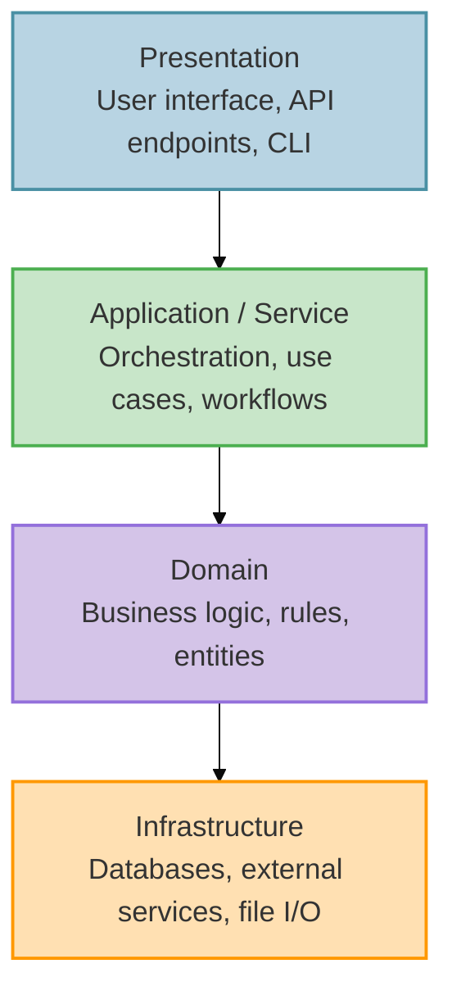
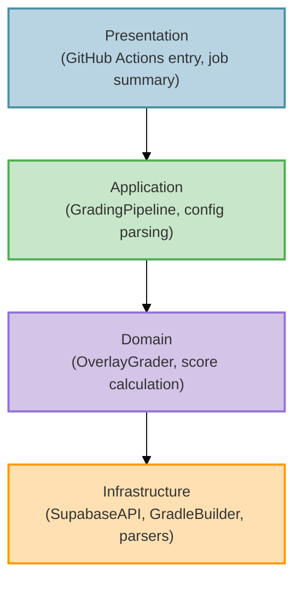
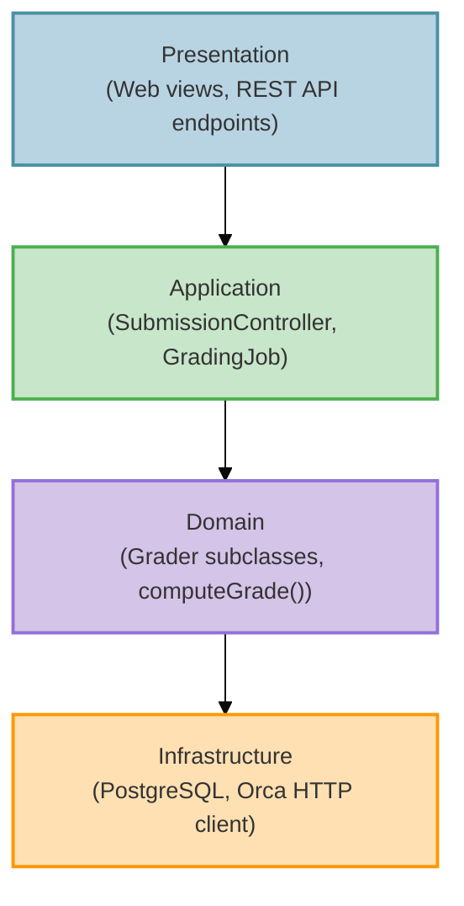
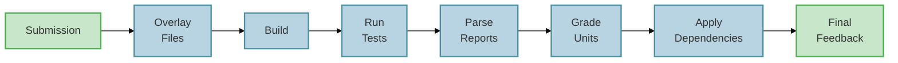
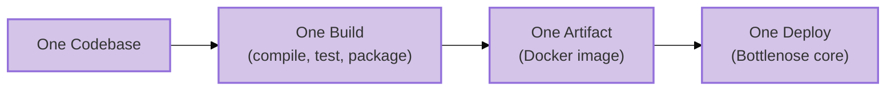
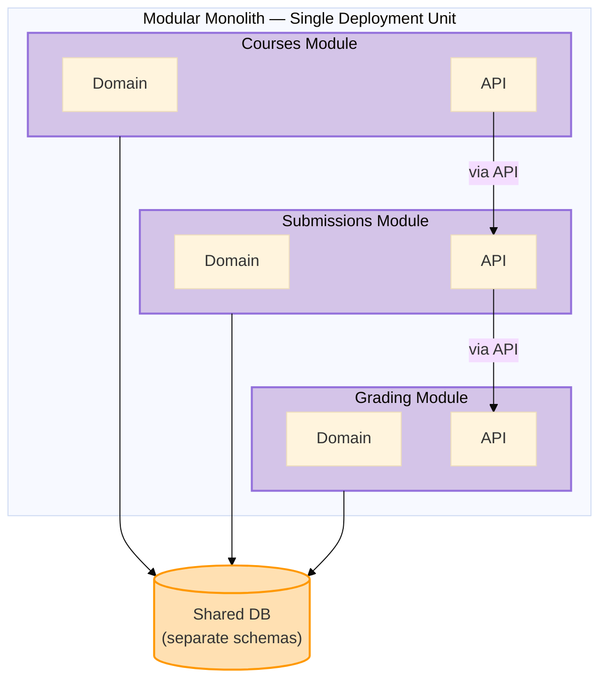

import RevealJS, { Slide } from '@site/src/components/RevealJS';
import Img from '@site/src/components/Img';

<RevealJS transition="slide">

{/* ============================================ */}
{/* COVER IMAGE */}
{/* ============================================ */}

<Slide>
  

<aside className="notes">
**Lecture overview:**
- **Total time:** ~60 minutes
- **Prerequisites:** L16 (testability, hexagonal intro), L17 (creation patterns, DI), L18 (architectural thinking, boundaries, C4, ADRs, Pawtograder/Bottlenose)
- **Connects to:** L20–L21 (distributed architecture, networks, client-server, serverless), L22 (Conway's Law, teams), L29–L30 (MVC/GUI)

**Structure:**
- Motivating Question: "How do we organize our code?" + Big Ball of Mud (~3 min)
- Quality Attributes vocabulary + scenarios (~10 min)
- Architectural Styles vs. Patterns (~3 min)
- Running Examples Recap: Pawtograder & Bottlenose (~5 min)
- Hexagonal in Pawtograder (review from L16, applied) (~8 min)
- Layered & Pipelined Styles (~10 min)
- Monolithic Architecture: Bottlenose (~10 min)
- Modular Monolith & Microservices Teaser (~8 min)
- Quality Attributes Applied & Tradeoffs (~8 min)
- Partitioning: Technical vs. Domain (~5 min)

**Key theme:** Architecture is about tradeoffs. Every style affects quality attributes differently. We use Pawtograder and Bottlenose — two real systems solving the same problem differently — to see these tradeoffs in action.

→ **Transition:** Let's start with the title...
</aside>

</Slide>

{/* ============================================ */}
{/* TITLE SLIDE */}
{/* ============================================ */}

<Slide>

# CS 3100: Program Design and Implementation II

## Lecture 19: Architectural Styles — From Hexagons to Monoliths

<p style={{marginTop: '2em', fontSize: '0.8em', color: '#666'}}>
  ©2026 Jonathan Bell, CC-BY-SA
</p>

<aside className="notes">
**Context:**
- L18 ended with C4 diagrams, ADRs, and "just enough architecture" — applied to Pawtograder
- Today: we continue with Pawtograder and Bottlenose to explore architectural styles
- Running examples: Pawtograder (the grading system from L18) and Bottlenose (its predecessor)

**Key message:** "Hexagonal architecture is one of several architectural styles. Today we learn to recognize them, compare them, and evaluate how each affects quality attributes — using two real systems that solve the same problem differently."

→ **Transition:** Here's what you'll be able to do after today...
</aside>

</Slide>

{/* ============================================ */}
{/* LEARNING OBJECTIVES */}
{/* ============================================ */}

<Slide>

## Learning Objectives

<p style={{fontSize: '0.85em', textAlign: 'left'}}>
After this lecture, you will be able to:
</p>

<ol style={{fontSize: '0.75em', textAlign: 'left'}}>
  <li>Define <strong>quality attributes</strong> that architectural styles affect: maintainability, scalability, deployability, fault tolerance, and more</li>
  <li>Distinguish between <strong>architectural styles</strong> and <strong>architectural patterns</strong></li>
  <li>Recognize and compare styles: <strong>Hexagonal</strong> (review from L16), <strong>Layered</strong>, <strong>Pipelined</strong>, and <strong>Monolithic</strong></li>
  <li>Explain the tradeoffs of <strong>monoliths</strong>, <strong>modular monoliths</strong>, and <strong>microservices</strong></li>
  <li>Analyze how architectural choices <strong>affect quality attributes differently</strong> using Pawtograder and Bottlenose</li>
</ol>

<aside className="notes">
**Time allocation:**
- Objective 1: Quality Attributes vocabulary (~8 min)
- Objective 2: Styles vs. Patterns (~3 min)
- Objective 3: Hex recap + Layered + Pipelined (~20 min)
- Objective 4: Monolith + Modular Monolith + Microservices teaser (~18 min)
- Objective 5: Applying quality attributes to our examples (~10 min)

**Connection to L16 and L18:**
- L16: Hexagonal Architecture introduced for testability (they already know ports, adapters, domain core)
- L18: Where do service boundaries go? (Pawtograder case study, comparison with Bottlenose)
- L19: What quality attributes matter? What styles exist? How does each style affect those attributes?

→ **Transition:** Let's start with a question you'll face every time you write software...
</aside>

</Slide>

{/* ============================================ */}
{/* MOTIVATING QUESTION: CODE ORGANIZATION */}
{/* ============================================ */}

<Slide>

## How Do We Organize Our Code?

<p style={{fontSize: '0.85em'}}>
This is the question at the heart of every architectural decision — from your first class project to production systems serving millions of users. Every pattern and style we study today is an answer to this question.
</p>


<aside className="notes">
**This is the MOTIVATING QUESTION for the entire lecture.**
- "How do we organize our code?" is a question you face at EVERY scale
- A 500-line homework assignment? You still choose how to split it into classes and packages.
- A 50,000-line autograder? The question is the same, but the stakes are higher.
- A million-line enterprise system? The question can make or break the project.

**Read the Foote & Yoder quote — it's vivid!**
- "Haphazardly structured, sprawling, sloppy, duct-tape-and-baling-wire, spaghetti-code jungle"
- "Information is shared promiscuously among distant elements"
- This isn't a theoretical concern — it's what ACTUALLY HAPPENS when teams don't think about organization

**The Big Ball of Mud is the DEFAULT outcome:**
- Nobody designs a Big Ball of Mud on purpose
- It emerges from thousands of small decisions made under pressure: "just put it here for now," "we'll refactor later," "it's faster to copy-paste"
- Every pattern we study today — layered, hexagonal, pipelined, monolith, modular monolith — is a strategy to PREVENT this

**The real cost isn't aesthetics — it's every quality attribute we'll discuss:**
- Changeability: "Where does this feature go?" → "Everywhere and nowhere"
- Testability: Can't test in isolation when everything depends on everything
- Deployability: Can't deploy safely when any change might break anything
- Eventually: cheaper to REWRITE than to maintain

**Through-line for the lecture:**
- As we discuss each style, we'll ask: "How does this style help us organize our code?"
- Hexagonal: organize around ports and adapters
- Layered: organize into horizontal strata
- Monolith vs. microservices: organize within one process or across many
- Modular monolith: organize with enforced boundaries inside one deployment
- Partitioning: organize by technical role or by domain capability

→ **Transition:** To evaluate these answers, we need a vocabulary for what "good organization" means...
</aside>

</Slide>

{/* ============================================ */}
{/* ARC 0: QUALITY ATTRIBUTES (8 min) */}
{/* ============================================ */}

<Slide>

## Quality Attributes: The "-ilities"

<p style={{fontSize: '0.82em'}}>
How do we decide if an architecture is "good"? Not by how it looks — by how it behaves. <strong>Quality attributes</strong> are the measurable properties of a system that stakeholders care about.
</p>

<p style={{fontSize: '0.8em', marginTop: '0.5em'}}>
You've already met some of these. Today we'll define a full vocabulary and use it throughout the lecture to evaluate every architectural style we encounter.
</p>

<div className="fragment">
<div style={{display: 'grid', gridTemplateColumns: '1fr 1fr 1fr', gap: '0.5em', fontSize: '0.55em', marginTop: '0.75em'}}>

<div style={{padding: '0.5em', border: '2px solid #4CAF50', borderRadius: '8px', textAlign: 'center'}}>

**Simplicity** · **Modularity** · **Testability**

</div>

<div style={{padding: '0.5em', border: '2px solid #4A90A4', borderRadius: '8px', textAlign: 'center'}}>

**Maintainability** · **Changeability** · **Deployability**

</div>

<div style={{padding: '0.5em', border: '2px solid #FF9800', borderRadius: '8px', textAlign: 'center'}}>

**Scalability** · **Responsiveness** · **Fault Tolerance**

</div>

</div>
</div>

<aside className="notes">
**Frame this clearly:**
- "We've been talking about design principles (SOLID, coupling, cohesion) at the class level"
- "Quality attributes are the SYSTEM-level version of that question: what properties does our architecture need to have?"
- "Different stakeholders care about different attributes: developers care about maintainability, ops cares about deployability, users care about responsiveness"

**Some of these are review:**
- Testability: L16 (hex arch was motivated by testability)
- Modularity and changeability: L7-L8 (coupling, cohesion, SOLID)
- Some are NEW: deployability, fault tolerance, scalability at the architectural level

**The key insight we're building toward:**
- Every architectural style makes DIFFERENT tradeoffs among these attributes
- There's no style that maximizes all of them — that's why architecture is hard

→ **Transition:** But how do we make these precise?
</aside>

</Slide>

<Slide>

## Specifying Quality Attributes: Scenarios

<p style={{fontSize: '0.82em'}}>
In L9, we learned that vague requirements are dangerous. Quality attributes have the same problem — "the system should be scalable" is as useless as "the system should be fair."
</p>

<p style={{fontSize: '0.78em', marginTop: '0.3em'}}>
We use a common form — a <strong>quality attribute scenario</strong> — to make every attribute testable and unambiguous.
</p>


<aside className="notes">
**Connection to L9 (Requirements Analysis):**
- In L9, we saw that "the system should be fair" needed to be unpacked into concrete, testable requirements
- Quality attributes have the EXACT same problem: "the system should be scalable" means nothing without a scenario
- The three risk dimensions from L9 apply directly:
  - Understanding: What does "scalable" mean for THIS system?
  - Scope: How much load? How many users? What's the growth curve?
  - Volatility: Will the load patterns change? Will infrastructure change?

**Walk through the six-part framework:**
- **Source:** Who or what generates the stimulus? A user, an external system, a developer, an attacker. The source matters — a request from a trusted user may be treated differently than one from an untrusted source.
- **Stimulus:** The event that arrives — a spike in submissions, a component crash, a change request, a security probe. For runtime qualities this is a system event; for development-time qualities it's a project event (like "completion of a unit of development" for testability, or "a request for a modification" for changeability).
- **Environment:** The conditions — normal operation, peak load, degraded mode, during development, during deployment. The environment sets the context: a change request after code freeze is treated differently than one before. And environment includes your DEPENDENCIES: if GitHub itself is on fire, Pawtograder has a very bad day — grading actions can't run at all. Bottlenose doesn't depend on GitHub, so it keeps grading just fine. This is a fault tolerance scenario where the environment (GitHub outage) changes everything about which architecture wins.
- **Artifact:** What part of the system is affected? The whole system, the grading pipeline, the API, a single adapter? Being specific matters: a failure in the data store may be treated differently than a failure in the grading engine.
- **Response:** What the system (or the developers) should do in response. For runtime: process requests, isolate failures, maintain service. For development-time: implement the change without side effects, then test and deploy.
- **Measure:** The quantifiable threshold — latency, throughput, time to implement a change, number of files touched, data exposed. This is what makes the scenario TESTABLE.

**The "common form" insight is powerful:**
- Students struggle with quality attributes because different communities use different vocabulary
- Performance people talk about "events" and "latency"; Security people talk about "attacks" and "vulnerabilities"; Modifiability people talk about "change requests" and "effort"
- But they're ALL describing the same six-part structure!
- This common form cuts through vocabulary confusion

→ **Transition:** Let's see this in action with our running examples...
</aside>

</Slide>

<Slide>

## Same Scenario, Different Architecture


<div className="fragment">
<div style={{display: 'grid', gridTemplateColumns: '1fr 1fr', gap: '0.75em', fontSize: '0.52em', marginTop: '0.5em'}}>

<div style={{padding: '0.5em', border: '2px solid #4CAF50', borderRadius: '8px'}}>

**Scalability scenario (Pawtograder)**

Source: 200 students · Stimulus: submit near deadline · Environment: normal ops · Artifact: grading pipeline · Response: all graded, **API stays responsive** · **Measure: &lt; 30 min**

</div>

<div style={{padding: '0.5em', border: '2px solid #FF9800', borderRadius: '8px'}}>

**Scalability scenario (Bottlenose)**

Source: 200 students · Stimulus: submit near deadline · Environment: 15-job limit, shared process · Artifact: grading queue **+ web app** · Response: all graded, but **platform slows for everyone** · **Measure: 60+ min, degraded UX**

</div>

</div>
</div>

<aside className="notes">
**Walk through the comparison:**

**Scalability (runtime):**
- Same stimulus: 200 near-deadline submissions
- Pawtograder: GitHub Actions spins up 200 parallel runners — each one handles building, testing, parsing results, computing scores. All that heavy work happens OFF the main API. The API just receives normalized feedback. It stays fast and responsive throughout.
- Bottlenose: Even if you raised the limit above 15 concurrent jobs, every grading job shares the same process — parsing test output, computing grades, running linters, writing to the database. That work competes with students checking their grades, instructors managing courses, TAs browsing submissions. The whole platform slows to a crawl.
- This is the deeper scalability insight: it's not just "can we grade 200 submissions?" It's "does the system REMAIN RESPONSIVE while grading 200 submissions?" Pawtograder: yes. Bottlenose: no.
- The scenario REVEALS this — "the system should be scalable" would have hidden it.

**This works for development-time qualities too:**
- Changeability scenario: instructor requests Rust language support
- Pawtograder: Add one `RustCargoBuilder` class implementing the `Builder` port. One developer, one day.
- Bottlenose: New `RustGrader` subclass + views + Docker image + registration. Multiple developers, multiple days.
- Same stimulus, same desired response — architecture determines the measure.

**The key takeaway:**
- Scenarios make quality attributes concrete and comparable
- The same scenario applied to two architectures reveals EXACTLY where each one excels and struggles
- This is how we'll evaluate every style in this lecture — not with vague labels, but with specific scenarios
- The star ratings we'll see on each style's quality attribute card are shorthand for these scenarios

→ **Transition:** Now let's define each attribute...
</aside>

</Slide>

<Slide>

## Defining the Quality Attributes

<div style={{display: 'grid', gridTemplateColumns: '1fr 1fr', gap: '0.75em', fontSize: '0.55em', marginTop: '0.5em'}}>

<div style={{padding: '0.75em', border: '2px solid #4CAF50', borderRadius: '8px'}}>

**Simplicity**

How easy is the system to understand and reason about? Fewer moving parts, fewer deployment units, fewer technologies. *Simple doesn't mean easy — it means less to go wrong.*

</div>

<div style={{padding: '0.75em', border: '2px solid #4CAF50', borderRadius: '8px'}}>

**Modularity**

How well is the system divided into independent, interchangeable components? High cohesion within modules, low coupling between them. *Recall L7-L8: this is coupling and cohesion at system scale.*

</div>

<div style={{padding: '0.75em', border: '2px solid #4A90A4', borderRadius: '8px'}}>

**Testability**

How easily can we verify the system behaves correctly? Can components be tested in isolation? Do we need real infrastructure to run tests? *Recall L16: hex arch was motivated by this.*

</div>

<div style={{padding: '0.75em', border: '2px solid #4A90A4', borderRadius: '8px'}}>

**Deployability**

How easily and frequently can we release changes to production? One deploy for the whole system, or independent deploys per component? How risky is each deploy?

</div>

<div style={{padding: '0.75em', border: '2px solid #FF9800', borderRadius: '8px'}}>

**Responsiveness**

How quickly does the system respond to user requests? Includes latency (how long until the first byte?) and throughput (how many requests per second?).

</div>

<div style={{padding: '0.75em', border: '2px solid #FF9800', borderRadius: '8px'}}>

**Fault Tolerance**

How does the system behave when something fails? Does a bug in one component take down everything, or can the rest keep running?

</div>

</div>

<aside className="notes">
**Walk through each briefly — don't belabor, we'll revisit each one as we discuss styles:**

**Simplicity:**
- The most underrated quality attribute
- A monolith is SIMPLE: one thing to build, deploy, monitor
- Simplicity has real value — it reduces cognitive load, onboarding time, and operational mistakes
- "The simplest thing that could possibly work" is a legitimate architectural choice

**Modularity:**
- This is L7-L8 scaled up: coupling and cohesion at the system level
- A system with good modularity lets you change one module without affecting others
- Hex arch achieves this through ports/adapters; layered through strata

**Testability:**
- L16 already covered this in depth — hex arch separates domain from infrastructure for testing
- At the architectural level: can you test the grading engine without a real database? Without GitHub Actions?

**Deployability:**
- NEW concept for most students
- "How often can you ship? How risky is each ship?"
- A monolith deploys everything at once — simple but all-or-nothing
- Microservices deploy independently — flexible but complex to coordinate

**Responsiveness:**
- How fast does the system respond?
- In-process calls (monolith) are nanoseconds; network calls are milliseconds to seconds
- This directly affects user experience

**Fault Tolerance:**
- What happens when something breaks?
- In a monolith: a bug in one module can crash the entire process
- In a distributed system: a failed service can be isolated (but the network adds new failure modes)

→ **Transition:** Three more to define...
</aside>

</Slide>

<Slide>

## Maintainability, Changeability, and Scalability

<div style={{display: 'grid', gridTemplateColumns: '1fr 1fr 1fr', gap: '0.75em', fontSize: '0.55em', marginTop: '0.5em'}}>

<div style={{padding: '0.75em', border: '2px solid #9370DB', borderRadius: '8px'}}>

**Maintainability**

The umbrella term. How easily can the system be changed over time? Maintainability *decomposes* into the other attributes:

- **Modularity** makes changes local
- **Testability** gives confidence changes work
- **Simplicity** makes the system understandable
- **Changeability** makes modifications safe

*A system is maintainable when all these work together.*

</div>

<div style={{padding: '0.75em', border: '2px solid #4A90A4', borderRadius: '8px'}}>

**Changeability**

How safely can we modify existing behavior? Can we add a feature without breaking unrelated ones? How many files must we touch?

Changeability depends on:
- Clean interfaces between components
- Low coupling (L7)
- The Open/Closed Principle (L8)
- Good test coverage (L16)

*Different from deployability: a change can be easy to make but hard to deploy, or vice versa.*

</div>

<div style={{padding: '0.75em', border: '2px solid #FF9800', borderRadius: '8px'}}>

**Scalability**

How does the system handle growth in load, data, or users? Not just "can it finish?" but "does the rest of the system stay responsive while it works?"

<div style={{marginTop: '0.5em'}}>

**Vertical scaling:** bigger hardware — more CPU, more RAM. *Simple but has a ceiling, and heavy work still competes for shared resources.*

**Horizontal scaling:** more instances — offload work so the core stays responsive. *No ceiling in theory, but requires architecture that supports it.*

</div>

*We'll return to scaling in depth in L20-21.*

</div>

</div>

<div className="fragment">
<p style={{fontSize: '0.78em', marginTop: '0.75em', fontWeight: 'bold', color: '#9370DB'}}>
These attributes often <strong>conflict</strong>. Maximizing simplicity hurts scalability. Maximizing deployability adds complexity. Architecture is choosing which attributes matter most for <em>your</em> system.
</p>
</div>

<aside className="notes">
**Maintainability as the umbrella:**
- Students often use "maintainability" loosely. Unpack it!
- "When someone says 'this system is hard to maintain,' WHICH of these is the problem?"
- Is it hard to understand? (simplicity)
- Is it hard to change safely? (changeability)
- Is it hard to test? (testability)
- Is it hard to deploy? (deployability)
- Decomposing "maintainability" into component attributes gives us precision

**Changeability vs. deployability:**
- A monolith can be highly changeable (easy refactoring, IDE support) but poorly deployable (every change requires full redeploy)
- A microservices system can be highly deployable (independent deploys) but poorly changeable (cross-service changes require coordination)
- These are DIFFERENT attributes even though they're often conflated

**Scalability — introduce horizontal vs vertical:**
- Vertical: "buy a bigger server" — works until you hit the biggest server available. But even with a bigger server, in a monolith ALL the work happens in one process. Grading jobs compete with web requests for CPU, memory, and database connections. More grading = slower everything.
- Horizontal: "offload work" — Pawtograder does this naturally. Each GitHub Actions runner handles building, testing, parsing, scoring independently. The API just receives the final result. It stays fast even during a near-deadline spike.
- Bottlenose can't do this — all that parsing/grading work runs in the same process as the web app. Even Orca only offloads the container execution, not the result processing.
- We'll go much deeper in L20-21 when we discuss distributed architecture

**The conflict callout is the KEY TAKEAWAY:**
- Architecture is about tradeoffs, not maximizing everything
- "If someone tells you their architecture is the best at everything, they're selling something"
- This is why quality attribute SCENARIOS (the previous slide) matter — when you write competing scenarios, you can see the tension concretely

→ **Transition:** Now we have the vocabulary. Let's clarify what "styles" and "patterns" mean...
</aside>

</Slide>

{/* ============================================ */}
{/* ARC 1: STYLES vs PATTERNS (3 min) */}
{/* ============================================ */}

<Slide>

## Architectural Styles vs. Patterns

<p style={{fontSize: '0.9em', marginTop: '0.5em'}}>
Architects use two terms that sound similar but mean different things:
</p>

<div style={{display: 'grid', gridTemplateColumns: '1fr 1fr', gap: '1.5em', fontSize: '0.7em', marginTop: '1em'}}>

<div style={{padding: '1em', border: '2px solid #9370DB', borderRadius: '8px'}}>

**Architectural Style — The Shape**

A bundle of characteristics about a system:
- How components are organized
- How they communicate
- How the system is deployed
- Where data lives

*"Microservices" or "monolith" — a name for a whole worldview*

</div>

<div style={{padding: '1em', border: '2px solid #4CAF50', borderRadius: '8px'}}>

**Architectural Pattern — The Solution**

A contextualized solution to a recurring problem:
- Circuit Breaker for failure handling
- Repository for data access abstraction
- Strategy for extensible behavior

*Patterns are used WITHIN a style*

</div>

</div>

<div className="fragment">
<p style={{fontSize: '0.85em', marginTop: '1em', fontWeight: 'bold', color: '#9370DB'}}>
Styles describe the overall shape; patterns are reusable solutions you apply within that shape.
</p>
</div>

<aside className="notes">
**Why this distinction matters:**
- When someone says "we use microservices," they're naming a style — it implies deployment, communication, team structure, etc.
- When someone says "we use Circuit Breaker," they're naming a pattern — a specific solution to a specific problem within whatever style they chose
- You might use many patterns within a single style

**Where do styles come from?**
- Not from a committee — they emerge from practice
- Microservices: the name emerged as a reaction to "big service" architectures
- Made possible by better DevOps, containers, API design
- This is piecemeal growth (L18) applied to the profession itself!

→ **Transition:** Let's continue with the systems we introduced in L18...
</aside>

</Slide>

{/* ============================================ */}
{/* ARC 2: RUNNING EXAMPLES (5 min) */}
{/* ============================================ */}

<Slide>

## Continuing from L18: Two Systems, Same Problem

<p style={{fontSize: '0.85em'}}>
In L18, we identified component boundaries for <strong>Pawtograder</strong> and compared them to <strong>Bottlenose</strong>. Both solve the same problem — grade student code — but make different architectural choices.
</p>

<div style={{display: 'grid', gridTemplateColumns: '1fr 1fr', gap: '1em', fontSize: '0.65em', marginTop: '1em'}}>

<div style={{padding: '0.75em', border: '2px solid #9370DB', borderRadius: '8px'}}>

**Pawtograder**

- "Thick action" architecture
- Grading Action normalizes results
- Sends through a narrow API
- Leverages GitHub Actions infrastructure

</div>

<div style={{padding: '0.75em', border: '2px solid #FF9800', borderRadius: '8px'}}>

**Bottlenose**

- Web application monolith
- Platform-driven grading logic
- Delegates execution to Orca (Docker)
- All-in-one deployment

</div>

</div>

<div className="fragment">
<p style={{fontSize: '0.8em', marginTop: '0.75em'}}>
Both must: accept submissions, run tests, compute scores, report feedback. Today we'll see how <strong>architectural styles</strong> help us understand WHY they made different choices — and what those choices cost.
</p>
</div>

<aside className="notes">
**Recap from L18 (don't re-teach, just remind):**
- Pawtograder: Solution Repo, Grading Action, Pawtograder API — three components with narrow interfaces
- Bottlenose: Rails app + Orca — tightly coupled, shared database
- The boundary heuristics from L18 (rate of change, actors, interface segregation) led to these designs

**What's new today:**
- In L18, we asked "where do the boundaries go?"
- Today: "what architectural STYLES describe these systems, and how do those styles affect quality attributes?"

**The key insight we're building toward:**
- Same problem, different styles, different tradeoffs
- Neither is "right" — they're better or worse fits for particular constraints

→ **Transition:** Let's start with a style you already know — Hexagonal Architecture...
</aside>

</Slide>

{/* ============================================ */}
{/* ARC 3: HEXAGONAL IN PAWTOGRADER (10 min) */}
{/* ============================================ */}

<Slide>

## Recall: Hexagonal Architecture (L16)

<p style={{fontSize: '0.85em'}}>
In L16, you learned Hexagonal Architecture with the smart home energy optimizer. Quick recap:
</p>

<div style={{display: 'grid', gridTemplateColumns: '1fr 1fr 1fr', gap: '0.75em', fontSize: '0.7em', marginTop: '0.5em'}}>

<div style={{padding: '0.75em', border: '2px solid #9370DB', borderRadius: '8px'}}>

**Domain Core**

Pure business logic. No infrastructure imports. Testable with zero mocks.

*L16: `EnergyOptimizer`*

</div>

<div style={{padding: '0.75em', border: '2px solid #4A90A4', borderRadius: '8px'}}>

**Ports**

Interfaces defined by the domain. Say WHAT is needed, not HOW.

*L16: `EnergyPricePort`*

</div>

<div style={{padding: '0.75em', border: '2px solid #4CAF50', borderRadius: '8px'}}>

**Adapters**

Technology-specific. Swappable. Multiple per port.

*L16: `StubPriceAdapter`*

</div>

</div>

<div className="fragment">
<p style={{fontSize: '0.82em', marginTop: '0.75em', color: '#9370DB'}}>
Now let's see how this same pattern manifests in a <strong>real system</strong> — Pawtograder's Grading Action.
</p>
</div>

<aside className="notes">
**This is a REVIEW — don't re-teach!**
- Students learned domain/port/adapter in L16 with the smart home example
- They saw DI wiring in L17 (creation patterns)
- They found service boundaries in L18 (Pawtograder)
- Today: see hex arch applied to real production code

**Quick check for understanding:**
- "Can someone remind me: what's a port? What's an adapter?"
- If they're solid, move quickly. If shaky, spend an extra minute.

→ **Transition:** Here's what hexagonal looks like in Pawtograder...
</aside>

</Slide>

<Slide>

## Hexagonal Architecture in Pawtograder

<p style={{fontSize: '0.8em'}}>
The Grading Action's domain doesn't care <em>how</em> results are sent or <em>where</em> the grader comes from:
</p>

<div style={{display: 'grid', gridTemplateColumns: '1fr 1fr', gap: '0.75em', fontSize: '0.5em', marginTop: '0.5em'}}>

<div style={{padding: '0.75em', border: '2px solid #9370DB', borderRadius: '8px'}}>

**Domain: Pure Grading Logic**

```java
public class OverlayGrader implements Grader {
    private final Builder builder;

    public AutograderFeedback grade(
            Path solutionDir, Path submissionDir,
            PawtograderConfig config) {
        // Build and run tests
        BuildResult result = builder.build(
            gradingDir, config.getBuild());
        // Parse results and compute scores
        List<TestResult> testResults =
            builder.parseTestResults(gradingDir);
        return new AutograderFeedback(
            feedback, lintResult, output, score);
    }
}
```

*Knows nothing about GitHub, HTTP, or databases*

</div>

<div style={{padding: '0.75em', border: '2px solid #4A90A4', borderRadius: '8px'}}>

**Ports: What the Domain Needs**

```java
// How do we build and test?
public interface Builder {
    BuildResult build(Path projectDir,
        BuildConfig config);
    List<TestResult> parseTestResults(
        Path reportDir);
    Optional<LintResult> lint(
        Path projectDir, LinterConfig config);
}

// How do we submit feedback?
public interface FeedbackAPI {
    void submit(String submissionId,
        AutograderFeedback feedback);
}
```

*Say WHAT, not HOW*

</div>

</div>

<aside className="notes">
**Walk through the code:**
- **OverlayGrader**: Takes a solution and submission, grades it. Pure domain logic — no HTTP, no GitHub, no Supabase.
- **Builder port**: Says "I need to build and test" without specifying Gradle vs. Python vs. anything else
- **FeedbackAPI port**: Says "I need to submit results" without specifying where they go

**The key point (connecting to L16):**
- Same pattern as EnergyOptimizer — domain at center, ports as interfaces
- But now in a REAL system, not a textbook example
- Students should see: "Oh, this is what it looks like in production code"

→ **Transition:** Now let's see the adapters...
</aside>

</Slide>

<Slide>

## Adapters Connect to Real Infrastructure

<div style={{display: 'grid', gridTemplateColumns: '1fr 1fr', gap: '0.75em', fontSize: '0.5em', marginTop: '0.5em'}}>

<div style={{padding: '0.75em', border: '2px solid #4CAF50', borderRadius: '8px'}}>

**GradleBuilder (Java adapter)**

```java
public class GradleBuilder implements Builder {
    @Override
    public BuildResult build(Path projectDir,
            BuildConfig config) {
        ProcessResult result = runGradle(
            projectDir, "test",
            config.getTimeouts());
        return new BuildResult(
            result.exitCode() == 0,
            result.output());
    }

    @Override
    public List<TestResult> parseTestResults(
            Path reportDir) {
        return SurefireParser.parse(
            reportDir.resolve(
                "build/test-results"));
    }
}
```

</div>

<div style={{padding: '0.75em', border: '2px solid #FF9800', borderRadius: '8px'}}>

**SupabaseAPI (platform adapter)**

```java
public class SupabaseAPI
        implements SubmissionAPI, FeedbackAPI {

    @Override
    public SubmissionRegistration register(
            String oidcToken) {
        // POST to createSubmission endpoint
        // Returns submission ID + grader URL
    }

    @Override
    public void submit(String submissionId,
            AutograderFeedback feedback) {
        // POST normalized feedback
        // Includes retry with backoff
    }
}
```

</div>

</div>

<div className="fragment">
<div style={{padding: '0.5em', border: '2px solid #9370DB', borderRadius: '8px', fontSize: '0.7em', marginTop: '0.5em'}}>

**The payoff:** Adding Python support = add a `PythonScriptBuilder`. The grading domain **never changes**. Testing locally = swap in mock APIs. The grader doesn't know the difference.

</div>
</div>

<div className="fragment">
<div style={{display: 'grid', gridTemplateColumns: '1fr 1fr 1fr 1fr', gap: '0.4em', fontSize: '0.48em', marginTop: '0.5em'}}>

<div style={{padding: '0.4em', border: '2px solid #4CAF50', borderRadius: '6px', textAlign: 'center'}}>

**Testability** ★★★

Test domain with zero infrastructure

</div>

<div style={{padding: '0.4em', border: '2px solid #4CAF50', borderRadius: '6px', textAlign: 'center'}}>

**Changeability** ★★★

Swap adapters, domain untouched

</div>

<div style={{padding: '0.4em', border: '2px solid #4A90A4', borderRadius: '6px', textAlign: 'center'}}>

**Modularity** ★★★

Ports enforce clean boundaries

</div>

<div style={{padding: '0.4em', border: '2px solid #FF9800', borderRadius: '6px', textAlign: 'center'}}>

**Simplicity** ★☆☆

More interfaces, more indirection

</div>

</div>
</div>

<aside className="notes">
**Two adapters implementing the same port pattern:**
- GradleBuilder: runs `./gradlew test`, parses Surefire XML — adapter for Java builds
- PythonScriptBuilder: runs configured Python test command — adapter for Python builds
- SupabaseAPI: implements BOTH SubmissionAPI and FeedbackAPI — adapter for Pawtograder's backend

**The critical "why this matters" moment:**
- The grading action can run LOCALLY: `java -jar grader.jar -s /path/to/solution -u /path/to/submission`
- No dependency on GitHub Actions or Pawtograder API — those are just adapters
- This is why hex arch isn't just academic — it enables practical local development and testing

**Quality attribute connection:**
- Testability: THE original motivation from L16. Domain tested with zero mocks of real infrastructure.
- Changeability: Adding a language = one adapter class. Open/Closed Principle at the architectural level.
- Modularity: Ports create explicit contracts. Coupling is low because the domain doesn't import infrastructure.
- Simplicity: The cost — more interfaces, more abstraction layers, more files. Worth it for Pawtograder, might be overkill for a small script.

**Don't linger — this sets up the styles comparison ahead.**

→ **Transition:** Hexagonal is one lens. Let's see how other styles describe these same systems...
</aside>

</Slide>

{/* ============================================ */}
{/* ARC 4: LAYERED & PIPELINED (12 min) */}
{/* ============================================ */}

<Slide>

## Layered Architecture

<p style={{fontSize: '0.82em'}}>
The <strong>layered architecture</strong> organizes code into horizontal strata, each with a distinct responsibility. The classic formulation has four layers:
</p>

<div style={{fontSize: '0.8em', marginTop: '0.5em'}}>



</div>

<div className="fragment">
<p style={{fontSize: '0.8em', marginTop: '0.5em'}}>
<strong>The key rule:</strong> dependencies flow <strong>downward</strong>. Presentation can call Application, Application can call Domain, Domain can call Infrastructure — but <strong>never the reverse</strong>.
</p>
</div>

<aside className="notes">
**Define each layer clearly:**
- **Presentation:** What the user (or external system) sees. Web views, CLI commands, REST endpoints, GraphQL resolvers. Its job is to translate user actions into calls to the Application layer.
- **Application / Service:** Orchestrates use cases. "When a student submits, register the submission, trigger grading, and send a notification." No business rules here — just coordination.
- **Domain:** The heart of the system. Business rules, entities, value objects. "How do we compute a grade? What are the dependencies between graded parts?" This layer should have ZERO knowledge of databases, HTTP, or file systems.
- **Infrastructure:** The technology-specific implementations. PostgreSQL, Redis, Supabase API, file parsers. This layer adapts the outside world to what the Domain and Application layers need.

**Why this ordering?**
- The top layers change most frequently (UI redesigns, new API versions)
- The bottom layers change less often (business rules are more stable than UIs)
- The dependency direction means changes in volatile layers don't cascade downward

→ **Transition:** What quality attributes does this serve?
</aside>

</Slide>

<Slide>

## Layered Architecture: Quality Attributes

<p style={{fontSize: '0.82em'}}>
Why organize into layers? Because it directly serves several quality attributes:
</p>

<div style={{display: 'grid', gridTemplateColumns: '1fr 1fr 1fr', gap: '0.75em', fontSize: '0.6em', marginTop: '0.75em'}}>

<div style={{padding: '0.75em', border: '2px solid #4CAF50', borderRadius: '8px'}}>

**Separation of Concerns**

Each layer has one job. The Domain layer doesn't know if it's being called from a web UI, a CLI, or a test harness. You can swap your database without touching business rules.

</div>

<div style={{padding: '0.75em', border: '2px solid #4A90A4', borderRadius: '8px'}}>

**Testability**

Test each layer in isolation. Domain logic can be tested with no database. Application logic can use stub infrastructure. Presentation can be tested against a mock service layer.

</div>

<div style={{padding: '0.75em', border: '2px solid #9370DB', borderRadius: '8px'}}>

**Replaceability**

Change your UI framework without rewriting business logic. Swap PostgreSQL for MongoDB at the Infrastructure layer. Add a REST API alongside your web UI — both call the same Application layer.

</div>

</div>

<div className="fragment">
<div style={{padding: '0.5em', border: '2px solid #FF9800', borderRadius: '8px', marginTop: '0.75em', fontSize: '0.72em'}}>

**The pitfall:** Changes that span layers — adding a new field that flows from the UI through services into the database — require touching **every layer**. This "layer tax" is the cost of separation. It's worth it for large systems, but can feel heavy for small ones.

</div>
</div>

<aside className="notes">
**Separation of concerns is the fundamental benefit:**
- "Imagine you're debugging a scoring bug. In a layered system, you know it's in the Domain layer — not tangled up with HTTP handling or database queries."
- "Imagine swapping from PostgreSQL to a different database. In a layered system, only the Infrastructure layer changes. Domain and Application are untouched."

**Testability follows directly from separation:**
- Test the Domain layer with plain objects — no database, no network, no file system
- Test the Application layer with stub Infrastructure — verify orchestration without real services
- This should sound familiar from L16 — hexagonal architecture achieves the same thing through a different lens

**The layer tax is real:**
- "Add a 'late penalty' field: create a database column (Infrastructure), add it to the grade calculation (Domain), expose it in the service (Application), display it in the UI (Presentation) — four layers touched for one concept"
- This is the main criticism of strict layering
- In practice, many teams relax strict layering — allowing occasional shortcuts where the cost of indirection outweighs the benefit

**How does this relate to Hexagonal?**
- Both achieve separation of domain from infrastructure
- Layered emphasizes horizontal strata with strict downward dependencies
- Hexagonal emphasizes the domain at the center, with adapters at the edges
- In practice, you'll often see BOTH perspectives applied to the same system

→ **Transition:** Let's see how both Pawtograder and Bottlenose exhibit layers...
</aside>

</Slide>

<Slide>

## Layers in Our Running Examples

<p style={{fontSize: '0.82em'}}>
Both Pawtograder and Bottlenose exhibit layers — with different technologies at each level:
</p>

<div style={{display: 'grid', gridTemplateColumns: '1fr 1fr', gap: '1em', fontSize: '0.55em', marginTop: '0.5em'}}>

<div style={{padding: '0.75em', border: '2px solid #9370DB', borderRadius: '8px'}}>

**Pawtograder's Grading Action**



</div>

<div style={{padding: '0.75em', border: '2px solid #FF9800', borderRadius: '8px'}}>

**Bottlenose (Monolith)**



</div>

</div>

<div className="fragment">
<p style={{fontSize: '0.75em', marginTop: '0.5em', color: '#FF9800'}}>
<strong>Layered vs. Hexagonal:</strong> Both separate domain from infrastructure. Layered emphasizes horizontal strata; Hexagonal emphasizes dependency direction (domain at center). You'll often see both lenses applied to the same system.
</p>
</div>

<aside className="notes">
**Side-by-side comparison reveals:**
- Same four layers, different technologies at each level
- Pawtograder: `Main.java` → `GradingPipeline` → `OverlayGrader` → `SupabaseAPI`/`GradleBuilder`
- Bottlenose: Web views → `SubmissionController` → `Grader` subclasses → PostgreSQL + Orca

**Many web frameworks loosely follow layered architecture by convention:**
- Views (Presentation) → Controllers (Application) → Models (Domain) → Database layer (Infrastructure)
- But frameworks often make it easy to violate layers — models may contain database queries AND business logic
- Discipline is needed to keep the layers clean

**The relationship between layered and hexagonal:**
- Hexagonal Architecture's adapters map roughly to the Infrastructure and Presentation layers
- Hexagonal's ports map to the interfaces between layers
- Hexagonal's domain core IS the Domain layer
- The difference is emphasis: layered says "these are the strata"; hexagonal says "the domain is the center and everything else adapts to it"

→ **Transition:** What about data flowing in one direction?
</aside>

</Slide>

<Slide>

## Pipelined Architecture (Pipes and Filters)

<p style={{fontSize: '0.82em'}}>
Data flows through stages. Each stage transforms its input into output for the next. Pawtograder's grading pipeline is a perfect example:
</p>

<div style={{fontSize: '0.8em', marginTop: '0.5em'}}>



</div>

<div style={{display: 'grid', gridTemplateColumns: '1fr 1fr', gap: '1em', fontSize: '0.7em', marginTop: '0.5em'}}>

<div style={{padding: '0.75em', border: '2px solid #4CAF50', borderRadius: '8px'}}>

**Benefits**
- Each stage testable independently
- Adding mutation testing = insert a stage between "Run Tests" and "Grade Units"
- Classic examples: compilers, Unix pipes, ETL

</div>

<div style={{padding: '0.75em', border: '2px solid #FF9800', borderRadius: '8px'}}>

**Constraints**
- Works best when data flows one direction
- Awkward for interactive/bidirectional workflows
- Cross-cutting concerns may touch every stage

</div>

</div>

<div className="fragment">
<div style={{display: 'grid', gridTemplateColumns: '1fr 1fr 1fr 1fr', gap: '0.4em', fontSize: '0.48em', marginTop: '0.5em'}}>

<div style={{padding: '0.4em', border: '2px solid #4CAF50', borderRadius: '6px', textAlign: 'center'}}>

**Testability** ★★★

Each stage tested in isolation

</div>

<div style={{padding: '0.4em', border: '2px solid #4CAF50', borderRadius: '6px', textAlign: 'center'}}>

**Changeability** ★★★

Insert, remove, or reorder stages

</div>

<div style={{padding: '0.4em', border: '2px solid #4A90A4', borderRadius: '6px', textAlign: 'center'}}>

**Simplicity** ★★☆

Linear flow, easy to follow

</div>

<div style={{padding: '0.4em', border: '2px solid #FF9800', borderRadius: '6px', textAlign: 'center'}}>

**Fault Tolerance** ★☆☆

Stage failure stops the pipeline

</div>

</div>
</div>

<aside className="notes">
**Pawtograder's real pipeline:**
- Two passes: Pass 1 grades all units, Pass 2 applies dependencies (if Part 1 failed, Part 2 doesn't run)
- Adding mutation testing meant inserting a stage — the rest of the pipeline was unchanged
- Each stage is independently testable

**Classic examples beyond grading:**
- Compilers: source → tokens → AST → typed AST → optimized IR → machine code
- Unix pipes: `cat file | grep pattern | sort | uniq`
- Data processing: ETL (Extract, Transform, Load) jobs

**Quality attribute connection:**
- Testability: Feed known input to one stage, check output — no need to run the entire pipeline
- Changeability: Added mutation testing by inserting a stage. Existing stages unchanged.
- Simplicity: Data flows in one direction — easy to trace, easy to reason about
- Fault tolerance: If the Build stage fails, everything downstream stops. No partial results. This is actually a FEATURE for grading (don't grade what doesn't compile), but a limitation in other contexts.

**When to use vs. when to avoid:**
- Use when data truly flows in one direction through transformations
- Avoid when you need interactive back-and-forth or complex state

→ **Transition:** So far, all these styles describe code within a single deployment unit. Let's name that...
</aside>

</Slide>

{/* ============================================ */}
{/* ARC 5: MONOLITHIC ARCHITECTURE (15 min) */}
{/* ============================================ */}

<Slide>

## The Monolith

<p style={{fontSize: '0.85em'}}>
Every style we've seen so far — Hexagonal, Layered, Pipelined — is an answer to our opening question: <em>how do we organize our code?</em> But they all organize code <strong>within a single deployment unit</strong>. This is the world of the <strong>monolith</strong>.
</p>

<p style={{fontSize: '0.82em', marginTop: '0.5em'}}>
A <strong>monolith</strong> is a system deployed as a single unit. All functionality — user interface, business logic, data access — lives in one codebase, compiles into one artifact, and runs in one process.
</p>

<div className="fragment">
<div style={{display: 'grid', gridTemplateColumns: '1fr 1fr 1fr 1fr', gap: '0.5em', fontSize: '0.6em', marginTop: '1em'}}>

<div style={{padding: '0.5em', border: '2px solid #9370DB', borderRadius: '8px', textAlign: 'center'}}>

**Single Deployment**

One build. One deploy. One running process.

</div>

<div style={{padding: '0.5em', border: '2px solid #4CAF50', borderRadius: '8px', textAlign: 'center'}}>

**Shared Memory**

Components talk via method calls, not networks.

</div>

<div style={{padding: '0.5em', border: '2px solid #4A90A4', borderRadius: '8px', textAlign: 'center'}}>

**Single Database**

All data in one schema, one set of tables.

</div>

<div style={{padding: '0.5em', border: '2px solid #FF9800', borderRadius: '8px', textAlign: 'center'}}>

**Unified Codebase**

One repo, one build system, one language.

</div>

</div>
</div>

<aside className="notes">
**This is a BIG concept — take your time here.**
- Students have been building monoliths their whole lives without knowing the name
- Every Java project they've written? A monolith. Every Python script? A monolith.
- The term only becomes meaningful in CONTRAST to systems that AREN'T monoliths

**"Monolith" isn't an insult:**
- It's a description of deployment topology
- Many successful systems are monoliths — GitHub was a monolith for years, Shopify still is
- The question isn't "is it a monolith?" but "should it be?"

**Bottlenose as our monolith example:**
- The core Bottlenose application is our monolith example — controllers, models, views, grader subclasses, background jobs
- Note: Bottlenose ALSO has Orca, a separate service that runs Docker containers for grading. So Bottlenose isn't a *pure* monolith — but the core Rails app is, and that's what we'll focus on.
- Even Bottlenose couldn't stay fully monolithic — running untrusted student code in the main web process is too dangerous. We'll come back to this when we discuss microservices.

**We're going to unpack each of these four characteristics...**

→ **Transition:** Let's dig into what each of these means concretely...
</aside>

</Slide>

<Slide>

## What "Single Deployment Unit" Really Means

<p style={{fontSize: '0.82em'}}>
In a monolith, everything ships together. One <code>git push</code>, one CI pipeline, one artifact, one deploy.
</p>

<div style={{fontSize: '0.65em', marginTop: '0.5em'}}>



</div>

<div style={{display: 'grid', gridTemplateColumns: '1fr 1fr', gap: '1em', fontSize: '0.65em', marginTop: '0.5em'}}>

<div style={{padding: '0.75em', border: '2px solid #4CAF50', borderRadius: '8px'}}>

**This means:**
- Fix a typo in the grading UI? Redeploy the whole app.
- Update a dependency for course management? Redeploy the whole app.
- Every change goes through the same pipeline.

</div>

<div style={{padding: '0.75em', border: '2px solid #FF9800', borderRadius: '8px'}}>

**The consequence:**
- You can't deploy grading fixes without also deploying whatever else changed
- A broken test in course management blocks a grading deploy
- Deployment frequency is limited by the slowest-moving part

</div>

</div>

<div className="fragment">
<p style={{fontSize: '0.78em', marginTop: '0.5em', color: '#9370DB'}}>
Bottlenose's core application: <strong>controllers, models, views, grader subclasses, background jobs, migrations</strong> — all one deploy. The grading <em>orchestration</em> lives in the same deployment as user authentication, course management, and the admin interface. (Orca, the service that actually <em>executes</em> student code in Docker containers, is a separate deployment — even Bottlenose couldn't keep everything in one process.)
</p>
</div>

<aside className="notes">
**Make this visceral for students:**
- "You fixed a one-line bug in how grading jobs are queued. To get that fix to students, you have to redeploy the ENTIRE application — user management, course creation, admin dashboards, everything."
- "Your CI pipeline takes 20 minutes. Every change — no matter how small — waits 20 minutes."
- "Someone merged a broken migration for courses. Your grading fix can't deploy until that's fixed too."

**The Orca exception is instructive:**
- Even Bottlenose couldn't stay purely monolithic
- Running untrusted student code in the same process as the web app is too dangerous
- So Orca runs separately — it's a Docker-based service that executes grading containers
- But the grading LOGIC (which grader to use, how to compute scores, where to store results) still lives in the monolith
- This is a very common pattern: monolith + one extracted service for isolation/safety

**Contrast with Pawtograder:**
- The Grading Action and the API deploy independently
- Fix grading logic? Deploy just the action. Fix the API? Deploy just the API.
- But that independence comes with its own costs (we'll see later)

**The positive spin:**
- One deploy means ONE thing to monitor, ONE rollback strategy, ONE set of health checks
- You always know exactly what's running in production — the latest build

→ **Transition:** What about shared memory?
</aside>

</Slide>

<Slide>

## What "Shared Memory" Really Means

<p style={{fontSize: '0.82em'}}>
In a monolith, components communicate by calling methods on objects that live in the <strong>same process</strong>. This is so natural you've never had to think about it:
</p>

<div style={{display: 'grid', gridTemplateColumns: '1fr 1fr', gap: '1em', fontSize: '0.55em', marginTop: '0.75em'}}>

<div style={{padding: '0.75em', border: '2px solid #4CAF50', borderRadius: '8px'}}>

**What a monolith feels like** *(illustrative, not actual Bottlenose code)*

```java
// All in one process, one memory space
Course course = courseRepo.findById(courseId);
Assignment assignment = course.createAssignment(
    name, dueDate);

// This is a method call — nanoseconds, guaranteed
Grader grader = GraderFactory.buildFor(
    assignment, config);

// One database transaction wraps everything
transaction(() -> {
    assignment.setGrader(grader);
    for (Registration reg : course.getRegistrations())
        notificationService.notifyNewAssignment(
            reg, assignment);
});
// If ANY step fails, ALL steps roll back
```

</div>

<div style={{padding: '0.75em', border: '2px solid #FF9800', borderRadius: '8px'}}>

**What you get for free:**
- **Speed:** Method calls take nanoseconds
- **Reliability:** If you call a method, it runs
- **Transactions:** Wrap multiple operations in one atomic unit — all succeed or all roll back
- **Objects by reference:** Pass an `Assignment` object around; everyone sees the same data
- **Debugging:** Set a breakpoint, step through the entire flow in one debugger session

</div>

</div>

<div className="fragment">
<p style={{fontSize: '0.78em', marginTop: '0.5em', color: '#FF9800'}}>
These guarantees are <strong>invisible until you lose them</strong>. When components move to different processes or different machines, every one of these guarantees disappears.
</p>
</div>

<aside className="notes">
**This is the most important point to internalize:**
- Students take shared memory for granted because it's all they've experienced
- "When you call `GraderFactory.buildFor(assignment, config)`, have you ever worried that the method might not run? That it might take 30 seconds to start? That it might run TWICE?"
- "No? That's because you're in a monolith. Those guarantees come from shared memory."

**The transaction point is crucial:**
- In Bottlenose: create the assignment, configure the grader, and notify students — all in one transaction
- If notifications fail, the assignment creation AND grader config roll back
- In a distributed system, there's no way to do this across services — you need sagas, compensating transactions, eventual consistency
- Note: even Bottlenose breaks out of shared memory for grading EXECUTION — that's why Orca exists as a separate service. But the orchestration, scoring, and data management all stay in-process.

**Foreshadow the "Network Changes Everything" slide:**
- "We'll see later exactly what happens when you lose these guarantees"
- "Spoiler: it's why distributed systems are hard"

→ **Transition:** And what about working in one codebase?
</aside>

</Slide>

<Slide>

## What "Unified Codebase" Really Means

<p style={{fontSize: '0.82em'}}>
In a monolith, everyone works in the <strong>same repository</strong>, with the <strong>same language</strong>, the <strong>same build system</strong>, and the <strong>same dependency tree</strong>.
</p>

<div style={{display: 'grid', gridTemplateColumns: '1fr 1fr', gap: '1em', fontSize: '0.65em', marginTop: '0.75em'}}>

<div style={{padding: '0.75em', border: '2px solid #4CAF50', borderRadius: '8px'}}>

**Benefits of one codebase**
- **Refactoring is easy:** rename a method and your IDE finds every caller
- **Code sharing is free:** import any class from any package
- **Consistency:** one style guide, one set of linters, one test framework
- **Onboarding:** new developers learn ONE system, not twelve

</div>

<div style={{padding: '0.75em', border: '2px solid #FF9800', borderRadius: '8px'}}>

**Costs of one codebase**
- **Merge conflicts:** 20 developers pushing to the same repo
- **Slow builds:** the whole app rebuilds even for small changes
- **Technology lock-in:** The whole system uses one language, one framework, one set of dependencies
- **Blast radius:** a bad commit affects everything

</div>

</div>

<div className="fragment">
<div style={{padding: '0.5em', border: '2px solid #9370DB', borderRadius: '8px', fontSize: '0.72em', marginTop: '0.5em'}}>

**Bottlenose** is one language, one framework, top to bottom. Graders, controllers, views, background jobs — all in one repo, one build system, one dependency file. That's a monolith.

</div>
</div>

<aside className="notes">
**Make the benefits tangible:**
- "In Bottlenose, if you want to understand how grading works, you grep one codebase. Every caller, every test, every reference — it's all right there."
- "Rename `Grader.grade()` to `Grader.evaluate()`? Your IDE handles it. Every caller updates. One commit."
- "Compare that to Pawtograder: renaming an API field requires coordinating changes across the action AND the API, deploying both, and hoping nothing breaks in between."

**Make the costs tangible:**
- "If 20 developers are all pushing to the same repo, merge conflicts are a daily occurrence"
- "Your CI runs ALL the tests — even if you only changed one file — because in a monolith, anything could affect anything"
- "Want to use a different language for a new feature? Too bad — the monolith is locked in"

**The big picture:**
- A monolith gives you simplicity at the cost of flexibility
- This is a VALID tradeoff for many, many systems
- Most successful software started as a monolith

→ **Transition:** Let's summarize the benefits and drawbacks...
</aside>

</Slide>

<Slide>

## Monolith: Quality Attribute Profile

<div style={{display: 'grid', gridTemplateColumns: '1fr 1fr', gap: '1em', fontSize: '0.65em', marginTop: '0.5em'}}>

<div style={{padding: '0.75em', border: '2px solid #4CAF50', borderRadius: '8px'}}>

**Where Monoliths Excel**

- **Simplicity** ★★★ — One thing to build, test, deploy, monitor
- **Responsiveness** ★★★ — In-process calls are orders of magnitude faster than network calls
- **Testability** ★★☆ — One environment to set up, but may need full infrastructure
- **Changeability** ★★☆ — IDE refactoring across entire codebase, but changes may ripple

</div>

<div style={{padding: '0.75em', border: '2px solid #FF9800', borderRadius: '8px'}}>

**Where Monoliths Struggle**

- **Scalability** ★☆☆ — Must scale the entire app; heavy work (grading) competes with everything else for CPU and DB connections
- **Deployability** ★☆☆ — Every deploy is all-or-nothing; a bug in one feature can take down everything
- **Fault Tolerance** ★☆☆ — A crash in any component takes down the entire process
- **Modularity** ★☆☆ — Boundaries are conventions, not enforcement (without discipline → Big Ball of Mud)

</div>

</div>

<div className="fragment">
<div style={{padding: '0.75em', border: '2px solid #4A90A4', borderRadius: '8px', marginTop: '0.5em', fontSize: '0.75em'}}>

**The Monolith-First Approach (Fowler):**
Start with a monolith. You can understand the whole system. You can refactor freely. You can deploy with confidence. Only break it apart when you have specific scaling, team, or deployment problems that a monolith can't solve.

</div>
</div>

<aside className="notes">
**This slide summarizes using our quality attribute vocabulary — the previous three slides unpacked the mechanics.**

**Walk through the ratings — connect each to what we just learned:**
- Simplicity ★★★: One thing to build, deploy, monitor. The defining strength of a monolith.
- Responsiveness ★★★: Method calls in nanoseconds, database transactions, full stack traces.
- Testability ★★☆: One environment, but you may need a database, Docker, Orca to run integration tests.
- Changeability ★★☆: IDE refactoring is powerful across one codebase, but changes in shared code ripple.
- Scalability ★☆☆: Vertical only — bigger hardware. Can't scale grading independently from course management. Even if you could run more grading jobs, they'd compete with the web app for CPU, memory, and database connections — the whole platform degrades under load.
- Deployability ★☆☆: All-or-nothing. Broken migration in courses blocks grading deploy.
- Fault Tolerance ★☆☆: Bug in course management crashes grading too — one process, one fate.
- Modularity ★☆☆: Boundaries exist only as conventions. Without discipline, you get a Big Ball of Mud.

**Make it concrete with Bottlenose:**
- "Bottlenose limits concurrent grading jobs to 15 because background jobs share database connections with the web process" → scalability
- "A bug in the course management code could take down grading" → fault tolerance
- "You can't deploy a grading fix without redeploying everything else" → deployability

**Fowler's advice:**
- Many experienced architects recommend starting monolithic
- The alternative (microservices) adds significant complexity
- We'll see exactly what that complexity looks like shortly

→ **Transition:** Is there a middle ground?
</aside>

</Slide>

{/* ============================================ */}
{/* ARC 6: MODULAR MONOLITH & MICROSERVICES (8 min) */}
{/* ============================================ */}

<Slide>

## The Modular Monolith: A Middle Ground

<p style={{fontSize: '0.82em'}}>
Remember our opening question: <em>how do we organize our code?</em> The modular monolith is perhaps the most direct answer — maintain a <strong>single deployment unit</strong> but enforce <strong>strict module boundaries</strong> within the codebase. All the simplicity of a monolith, with intentional structure to prevent the Big Ball of Mud.
</p>

<div style={{fontSize: '0.75em', marginTop: '0.5em'}}>



</div>

<div className="fragment">
<div style={{display: 'grid', gridTemplateColumns: '1fr 1fr 1fr 1fr', gap: '0.4em', fontSize: '0.48em', marginTop: '0.5em'}}>

<div style={{padding: '0.4em', border: '2px solid #4CAF50', borderRadius: '6px', textAlign: 'center'}}>

**Simplicity** ★★★

Still one deploy, one build

</div>

<div style={{padding: '0.4em', border: '2px solid #4CAF50', borderRadius: '6px', textAlign: 'center'}}>

**Modularity** ★★★

Enforced internal boundaries

</div>

<div style={{padding: '0.4em', border: '2px solid #4A90A4', borderRadius: '6px', textAlign: 'center'}}>

**Changeability** ★★☆

Changes isolated to modules

</div>

<div style={{padding: '0.4em', border: '2px solid #FF9800', borderRadius: '6px', textAlign: 'center'}}>

**Scalability** ★☆☆

Still one process to scale

</div>

</div>
</div>

<div className="fragment">
<p style={{fontSize: '0.72em', marginTop: '0.5em', color: '#9370DB'}}>
<strong>Optionality:</strong> If the Grading module needs independent scaling later, the boundaries are already clean. But you don't pay the distributed systems tax until you need to.
</p>
</div>

<aside className="notes">
**Key characteristics:**
- Still one build, one deploy — operationally simple
- Modules communicate through explicit public APIs, not by reaching into each other's internals
- Each module owns its database tables; cross-module queries go through APIs
- Build tools or linters prevent modules from importing private code

**Quality attribute connection — the "best of both worlds" pitch:**
- Simplicity ★★★: Keeps the monolith's operational simplicity — one thing to deploy and monitor
- Modularity ★★★: This is the big upgrade over a plain monolith — enforced boundaries prevent the Big Ball of Mud
- Changeability ★★☆: Changes stay within a module boundary. Better than a monolith, but cross-module changes still require coordination.
- Scalability ★☆☆: Still one process — can't scale modules independently. This is the main limitation that might eventually push you toward microservices.
- Responsiveness ★★★: Still in-process calls — no network overhead
- Fault tolerance ★☆☆: Still one process — a crash affects everything

**The tradeoff:**
- Enforcing boundaries within a monolith requires discipline
- Nothing stops a developer from bypassing the API and querying another module's tables directly
- Microservices enforce boundaries through network calls; modular monoliths enforce them through convention and tooling

**Many teams discover they NEVER need to extract to microservices:**
- The module boundaries solve their maintainability and team ownership problems
- Without the complexity of network communication

→ **Transition:** But what about microservices?
</aside>

</Slide>

<Slide>

## But What About Microservices?

<p style={{fontSize: '0.82em'}}>
A microservices architecture decomposes a system into small, independently deployable services. Where do our running examples fall?
</p>

<div style={{fontSize: '0.65em', marginTop: '0.5em'}}>

| Aspect | Bottlenose | Pawtograder |
|--------|------------|-------------|
| **Core application** | Monolith (web framework) | Multiple independent services |
| **Grading execution** | Separate service (Orca) | Leverages GitHub Actions |
| **Data ownership** | Shared PostgreSQL database | API owns data; action is stateless |
| **Deployment** | Single deploy (mostly) | Each service deploys independently |
| **Communication** | Method calls + one HTTP boundary | HTTP APIs between all components |

</div>

<div className="fragment">
<div style={{display: 'grid', gridTemplateColumns: '1fr 1fr', gap: '0.75em', fontSize: '0.7em', marginTop: '0.5em'}}>

<div style={{padding: '0.5em', border: '2px solid #FF9800', borderRadius: '8px'}}>

**Bottlenose** is a monolith with a microservice bolted on. Orca exists because student code can't run in the main process.

</div>

<div style={{padding: '0.5em', border: '2px solid #9370DB', borderRadius: '8px'}}>

**Pawtograder** is a distributed system. The Grading Action calls the API over HTTP. There's a network in between.

</div>

</div>
</div>

<aside className="notes">
**The key observation:**
- Neither system is purely one style
- Bottlenose is MOSTLY a monolith — but even it couldn't stay entirely monolithic
- Orca exists because you can't run untrusted student code in your main web process
- This is a common pattern: monolith + one extracted service for a specific concern

**Pawtograder is more distributed:**
- The Grading Action runs on GitHub's infrastructure
- It calls the Pawtograder API over HTTP
- There's a network in between — and that changes EVERYTHING

→ **Transition:** Let's talk about that network...
</aside>

</Slide>

<Slide>

## The Network Changes Everything

<p style={{fontSize: '0.82em'}}>
In a monolith, method calls are <strong>instant</strong>, <strong>reliable</strong>, and <strong>traceable</strong>. Over a network:
</p>

<div style={{display: 'grid', gridTemplateColumns: '1fr 1fr', gap: '1em', fontSize: '0.65em', marginTop: '0.75em'}}>

<div style={{padding: '0.75em', border: '2px solid #4CAF50', borderRadius: '8px'}}>

**Monolith (Bottlenose)**

```java
submission.computeGrade();
// ✅ Executes in nanoseconds
// ✅ Always succeeds or throws
// ✅ Full stack trace on error
// ✅ Wrapped in a DB transaction
```

</div>

<div style={{padding: '0.75em', border: '2px solid #FF9800', borderRadius: '8px'}}>

**Distributed (Pawtograder)**

```java
feedbackApi.submit(submissionId, feedback);
// ⚠️ Might take ms... or seconds... or ∞
// ⚠️ Server might be down or overloaded
// ⚠️ Request succeeds, response lost
// ⚠️ Retry = accidentally grade twice?
// ⚠️ No cross-system transactions
```

</div>

</div>

<div className="fragment">
<div style={{padding: '0.5em', border: '2px solid #9370DB', borderRadius: '8px', marginTop: '0.5em', fontSize: '0.78em'}}>

Pawtograder's `SupabaseAPI` actually implements **retry logic with exponential backoff** — complexity that simply doesn't exist in a monolith. "Microservices" really means "distributed systems" — and distributed systems are *hard*.

</div>
</div>

<aside className="notes">
**Make this visceral:**
- "When Bottlenose calls `submission.computeGrade()`, it KNOWS it will execute. If it fails, you get an exception with a full stack trace."
- "When Pawtograder calls `feedbackApi.submit()`: What if the API times out? What if it returns an error? What if the request succeeds but the RESPONSE never arrives?"
- "The grading action actually implements retry with exponential backoff. That code doesn't need to exist in a monolith."

**Preview for L20:**
- In the NEXT lecture, we'll explore what makes distributed systems so challenging
- The Fallacies of Distributed Computing (eight assumptions about networks that are all false)
- Client-server architecture and its variants
- Security implications of components communicating across trust boundaries

**The throughline:**
- We'll see how both Pawtograder and Bottlenose handle these challenges
- And why even Bottlenose couldn't stay entirely monolithic

→ **Transition:** So what does each style BUY you — and what does it COST?
</aside>

</Slide>

<Slide>

## Monolith vs. Microservices: Quality Attribute Tradeoffs

<p style={{fontSize: '0.78em'}}>
These are <strong>general</strong> tradeoffs — not specific to Pawtograder or Bottlenose. Any time you're deciding between these styles, this is the tension:
</p>

<div style={{fontSize: '0.52em', marginTop: '0.5em'}}>

| Quality Attribute | Monolith | Microservices |
|-------------------|----------|---------------|
| **Simplicity** | ★★★ One process, one deploy, one mental model | ★☆☆ Many services, network complexity, distributed debugging |
| **Modularity** | ★☆☆ Boundaries are conventions — easy to violate | ★★★ Boundaries enforced by network — can't cheat |
| **Testability** | ★★☆ One environment, but need full infrastructure | ★★★ Each service testable in isolation |
| **Deployability** | ★☆☆ All-or-nothing deploy, slowest part limits frequency | ★★★ Independent deploys per service |
| **Changeability** | ★★☆ IDE refactoring is powerful; but changes can ripple | ★★☆ Isolated changes easy; cross-service changes expensive |
| **Responsiveness** | ★★★ In-process calls: nanoseconds | ★☆☆ Network calls: milliseconds, retries, timeouts |
| **Scalability** | ★☆☆ Vertical only — heavy work competes with everything else | ★★★ Horizontal — offload work to independent services |
| **Fault Tolerance** | ★☆☆ One crash takes down everything | ★★☆ Failures can be isolated (but new failure modes) |

</div>

<div className="fragment">
<p style={{fontSize: '0.75em', marginTop: '0.5em', fontWeight: 'bold', color: '#9370DB'}}>
Notice the pattern: almost every row is a <strong>direct tradeoff</strong>. What monoliths win on simplicity and responsiveness, microservices win on modularity and scalability. This is why "which is better?" is the wrong question.
</p>
</div>

<aside className="notes">
**This is the GENERAL comparison — not yet about our specific systems.**
- Walk through each row briefly, but let the table speak for itself
- The key insight: the ratings are nearly INVERSE of each other
- Monoliths trade modularity, deployability, and scalability for simplicity and responsiveness
- Microservices trade simplicity and responsiveness for modularity, deployability, and scalability

**Row by row:**
- **Simplicity**: The defining advantage of monoliths. One thing to build, deploy, debug. Microservices have N things — N deployment pipelines, N log streams, N things that can fail independently.
- **Modularity**: This is the defining advantage of microservices. You CAN'T accidentally call another service's internal method — the network enforces boundaries. In a monolith, it's one `import` statement away.
- **Testability**: Microservices can spin up one service with mocks for the rest. Monoliths need the whole environment — database, background jobs, etc.
- **Deployability**: Microservices can ship a fix to one service in minutes. Monoliths must deploy everything together.
- **Changeability**: Mixed! Monoliths win for cross-cutting changes (IDE refactoring across one codebase). Microservices win for isolated changes (one service, one deploy).
- **Responsiveness**: Method calls are nanoseconds. Network calls are milliseconds at best, seconds at worst, infinite on timeout.
- **Scalability**: The most dramatic difference. Monolith: buy a bigger server — but even then, grading competes with everything else for CPU and database connections. The whole platform degrades. Microservices: offload heavy work to independent services that scale separately. The core platform stays responsive.
- **Fault Tolerance**: Microservices CAN isolate failures — but they also introduce NEW failure modes (network partitions, cascading timeouts, split brain). The ★★☆ rating reflects this complexity.

**The modular monolith (which we just saw) tries to get modularity ★★★ while keeping simplicity ★★★ — but it can't help with scalability or fault tolerance.**

**Foreshadow L20-21:**
- We'll go much deeper into distributed system tradeoffs
- Fallacies of Distributed Computing, CAP theorem, eventual consistency
- For now: just understand that this is a REAL tradeoff, not a clear winner

→ **Transition:** Now let's apply this to our specific systems...
</aside>

</Slide>

{/* ============================================ */}
{/* ARC 7: QUALITY ATTRIBUTES APPLIED (10 min) */}
{/* ============================================ */}

<Slide>

## Applying Quality Attributes: Pawtograder vs. Bottlenose

<p style={{fontSize: '0.82em'}}>
Those were general tradeoffs. Now let's see how they play out <strong>concretely</strong> in our two running examples:
</p>

<div style={{fontSize: '0.58em', marginTop: '0.75em'}}>

| Quality Attribute | Pawtograder | Bottlenose |
|-------------------|-------------|------------|
| **Simplicity** | Multiple services, HTTP boundaries | Single deployment (mostly) — easier to reason about |
| **Modularity** | High — hex arch, clean port/adapter boundaries | Lower — monolith couples concerns |
| **Testability** | Grading runs locally without infrastructure | Needs database, Orca for integration tests |
| **Deployability** | Action and API deploy independently | All-or-nothing deploy of core app |
| **Changeability** | Add a language = one adapter class | Add a language = changes across layers |
| **Scalability** | Heavy work offloaded to GitHub Actions runners; API stays responsive | All work in one process — grading eats CPU/DB connections, whole platform slows |
| **Fault Tolerance** | API down? Action retries. Action fails? API unaffected. | Bug in grading can affect course management |

</div>

<div className="fragment">
<p style={{fontSize: '0.78em', marginTop: '0.5em', fontWeight: 'bold', color: '#9370DB'}}>
Neither system "wins" — they optimize for different priorities. Pawtograder optimizes for modularity, testability, and scalability. Bottlenose optimizes for simplicity and responsiveness.
</p>
</div>

<aside className="notes">
**Walk through the table row by row:**
- **Simplicity**: Bottlenose wins — one codebase, one deploy, one mental model. Pawtograder has 3+ services to understand.
- **Modularity**: Pawtograder wins — hex arch means clean boundaries. Bottlenose's monolith couples grading to course management.
- **Testability**: Pawtograder wins — `java -jar grader.jar` runs locally. Bottlenose needs a full Rails environment + database + Orca.
- **Deployability**: Pawtograder wins — fix grading without touching the API. Bottlenose requires full redeploy.
- **Changeability**: Pawtograder wins for language-specific changes (one adapter). Bottlenose wins for cross-cutting changes (one codebase, IDE refactoring).
- **Scalability**: Pawtograder wins — all the heavy work (building, testing, parsing, scoring) happens on ephemeral GitHub Actions runners. The API just receives normalized feedback and stays fast. Bottlenose does ALL of that work in the main process — parsing test output, computing grades, running linters — competing with the web app for CPU, memory, and DB connections. Even if you lifted the 15-job limit, you'd just make the contention worse.
- **Fault tolerance**: Mixed — Pawtograder isolates failures between components, but introduces network failure modes. Bottlenose's failures are simpler but more catastrophic.

**Connection to L8 (SOLID at system scale):**
- Single Responsibility → Solution Repo, Grading Action, API each have one reason to change
- Open/Closed → new Builder implementations without modifying existing code
- Dependency Inversion → domain depends on abstractions (ports), not concrete adapters

→ **Transition:** Let's zoom into maintainability with specific change scenarios...
</aside>

</Slide>

<Slide>

## Comparing Maintainability: Change by Change

<p style={{fontSize: '0.82em'}}>
The same change hits these two architectures <strong>very differently</strong>:
</p>

<div style={{fontSize: '0.65em', marginTop: '0.5em'}}>

| Change | Pawtograder Impact | Bottlenose Impact |
|--------|-------------------|-------------------|
| **Add Rust language support** | Add one `RustCargoBuilder` class; no API changes | Add `RustGrader` subclass + UI views + Docker image + registration |
| **Change scoring calculation** | Modify `OverlayGrader`; no API or config changes | Modify `Submission.computeGrade()`; affects all graders |
| **Add new feedback format** | Modify `AutograderFeedback` record; requires API coordination | Add fields to `InlineComment`; database migration |

</div>

<div className="fragment">
<div style={{padding: '0.75em', border: '2px solid #9370DB', borderRadius: '8px', marginTop: '0.75em', fontSize: '0.75em'}}>

**The tradeoffs are real:**
- Pawtograder's "thick action, narrow API" **isolates most changes** to a single component
- Bottlenose's monolith **can optimize across components** but changes **ripple more widely**
- Neither is inherently better — the tradeoffs depend on which changes are most frequent and which teams own which components

</div>
</div>

<aside className="notes">
**Walk through each row:**
1. "Add Rust support" — In Pawtograder, it's one class that implements Builder. In Bottlenose, it's a new grader subclass, new views for configuration, a new Docker image, and registration in the grader registry. The hex arch CONTAINS the change.
2. "Change scoring" — In Pawtograder, only OverlayGrader changes. In Bottlenose, computeGrade() is shared logic that affects all grader types.
3. "Add feedback format" — This is where Pawtograder pays a cost: the API boundary means both the action AND the API need to agree on the new format. Cross-service changes are expensive.

**The key insight:**
- No architecture eliminates ALL change cost
- Architecture CHOOSES which changes are cheap and which are expensive
- The architect's job: make the MOST FREQUENT changes cheap

→ **Transition:** Quality attributes often conflict with each other...
</aside>

</Slide>

<Slide>

## The Tradeoffs Are Real


<aside className="notes">
**Quality attributes often conflict:**
- Pawtograder's narrow API is highly maintainable but requires the action to do more work (less energy-efficient per run)
- Bottlenose's monolith is harder to change but can optimize across components
- GitHub Actions' horizontal scaling is effortless but potentially wasteful; Bottlenose's controlled queue is efficient but creates bottlenecks

**For Pawtograder, the priorities are:**
- Testability (run grading locally without infrastructure)
- Maintainability (instructors iterate on config without touching the action)
- Scalability (handle near-deadline spikes)

**For Bottlenose, the priorities were different:**
- Centralized control, institutional integration, comprehensive course management
- Simplicity of a single deployment

**The architect's job:** match the architecture to the constraints. Not every system needs microservices. Not every system needs hexagonal architecture.

→ **Transition:** Beyond choosing a style, how do we organize the code?
</aside>

</Slide>

{/* ============================================ */}
{/* ARC 8: PARTITIONING (5 min) */}
{/* ============================================ */}

<Slide>

## Partitioning: Technical or Domain?

<p style={{fontSize: '0.82em'}}>
We opened with "how do we organize our code?" We've seen styles that answer the big-picture question. But <em>within</em> a style, there's still a choice: group code by <strong>technical role</strong> or by <strong>domain capability</strong>?
</p>

<div style={{display: 'grid', gridTemplateColumns: '1fr 1fr', gap: '1em', fontSize: '0.5em', marginTop: '0.5em'}}>

<div style={{padding: '0.75em', border: '2px solid #FF9800', borderRadius: '8px'}}>

**Technical Partitioning**

```
autograder/
├── api/
│   └── SupabaseAPI.java
├── grading/
│   ├── OverlayGrader.java
│   └── GradingService.java
├── builders/
│   ├── GradleBuilder.java
│   └── PythonScriptBuilder.java
├── parsers/
│   ├── SurefireParser.java
│   ├── PitestParser.java
│   └── CheckstyleParser.java
└── config/
    └── PawtograderConfig.java
```

*Organized by technical role*

</div>

<div style={{padding: '0.75em', border: '2px solid #4CAF50', borderRadius: '8px'}}>

**Domain Partitioning**

```
autograder/
├── grading/
│   ├── OverlayGrader.java
│   ├── GradingService.java
│   └── PawtograderConfig.java
├── languages/
│   ├── java/
│   │   ├── GradleBuilder.java
│   │   ├── SurefireParser.java
│   │   ├── PitestParser.java
│   │   └── CheckstyleParser.java
│   └── python/
│       ├── PythonScriptBuilder.java
│       └── PytestParser.java
└── platform/
    └── SupabaseAPI.java
```

*Organized by business capability*

</div>

</div>

<aside className="notes">
**Two ways to organize the same autograder code:**
- Technical: all builders together, all parsers together
- Domain: everything for Java grading together, everything for Python together

**The practical questions (next slide) reveal which is better for which situation.**

**Bottlenose uses technical partitioning (common web framework convention):**
- controllers/, models/graders/, views/graders/, jobs/
- Adding a RustGrader requires changes in models, views, and potentially controllers
- This convention prioritizes consistency across the app over isolation of features

→ **Transition:** Let's compare on practical questions...
</aside>

</Slide>

<Slide>

## Partitioning Tradeoffs

<div style={{fontSize: '0.68em', marginTop: '0.5em'}}>

| Question | Technical | Domain |
|----------|-----------|--------|
| **"How does Java grading work?"** | Jump between `builders/`, `parsers/`, and `grading/` | Everything in `languages/java/` |
| **Adding Rust support?** | New files in `builders/`, `parsers/`, changes to `grading/` | All changes in `languages/rust/` |
| **Team independence?** | Every language needs coordination between "builder team," "parser team" | "Rust support team" owns their vertical slice |

</div>

<div className="fragment">
<div style={{padding: '0.75em', border: '2px solid #9370DB', borderRadius: '8px', marginTop: '0.75em', fontSize: '0.72em'}}>

**Conway's Law** (L22 preview):
> "Organizations which design systems are constrained to produce designs which are copies of the communication structures of these organizations."

Pawtograder has clear ownership: **Instructor** owns config (changes weekly), **Action maintainers** own the grading code (changes monthly), **Sysadmin team** owns the API (changes rarely). Architecture mirrors team structure.

</div>
</div>

<aside className="notes">
**The key insight:**
- Domain partitioning keeps related changes together
- Technical partitioning scatters related changes across packages
- Pawtograder's architecture reflects its team structure:
  - Instructors change solution repos weekly — they never touch the Action code
  - Action maintainers add new language support monthly — they never touch the API
  - Sysadmin team manages the API — stable, changes rarely
  - Each team works independently because the interfaces are narrow and stable

**Conway's Law is REAL:**
- If you have a "frontend" team and "backend" team → you'll get a layered architecture
- If you have a "Java grading" team and "Python grading" team → you'll get domain boundaries
- Architecture and team structure MUST be aligned

→ **Transition:** Let's wrap up and look ahead...
</aside>

</Slide>

{/* ============================================ */}
{/* LOOKING FORWARD */}
{/* ============================================ */}

<Slide>

## Looking Forward: Where These Ideas Go Next

<div style={{fontSize: '0.72em'}}>

| Concept from Today | Where It Goes |
|-------------------|---------------|
| **"The Network Changes Everything"** | **L20:** Fallacies of Distributed Computing, client-server architecture, security across trust boundaries |
| **Monolith vs. Microservices** | **L20-21:** Distributed architecture styles, when to break the monolith, serverless |
| **Quality Attribute Tradeoffs** | **L21:** How platform constraints (serverless, containers) shape architecture — like GitHub Actions shaped Pawtograder |
| **Domain Partitioning & Conway's Law** | **L22:** Conway's Law in depth — how team structure affects (and is affected by) architecture |

</div>

<p style={{fontSize: '0.85em', marginTop: '1em', fontWeight: 'bold', color: '#9370DB'}}>
We opened with "how do we organize our code?" — and now you have styles, quality attributes, and tradeoff vocabulary to answer it. Next: what happens when your boundaries cross a network.
</p>

<aside className="notes">
**The arc ahead:**
- **L20 (Networks & Security):** When components communicate over a network, everything gets harder. Fallacies of Distributed Computing. Client-server architecture. Security.
- **L21 (Serverless):** Infrastructure building blocks — databases, blob storage, queues. Serverless as an architectural style.
- **L22 (Teams):** Conway's Law — architecture isn't just technical, it's social.

**The throughline:**
- L16: "How do we design for testability?" (Hexagonal Architecture)
- L18: "Where do the boundaries go?" (Pawtograder vs. Bottlenose)
- **L19: "What styles exist? What are the tradeoffs? What's a monolith — and when should we break it?"**
- L20-21: "What happens when boundaries cross networks?"
- L22: "What happens when boundaries cross teams?"

**Final thought:** The vocabulary from these lectures — styles, quality attributes, tradeoffs, partitioning, monolith, modular monolith — is the language architects use every day. You're learning to speak it.
</aside>

</Slide>

</RevealJS>
