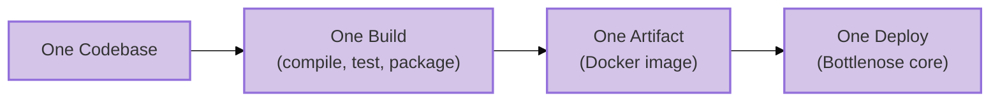
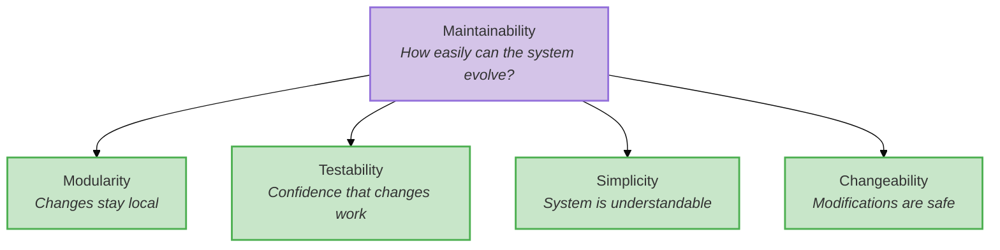
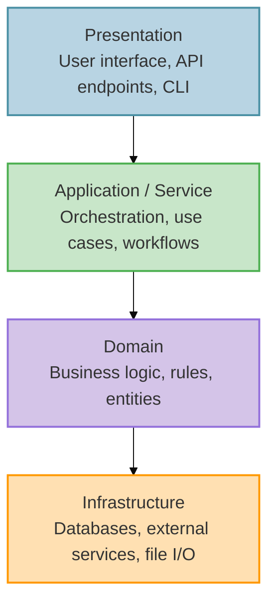
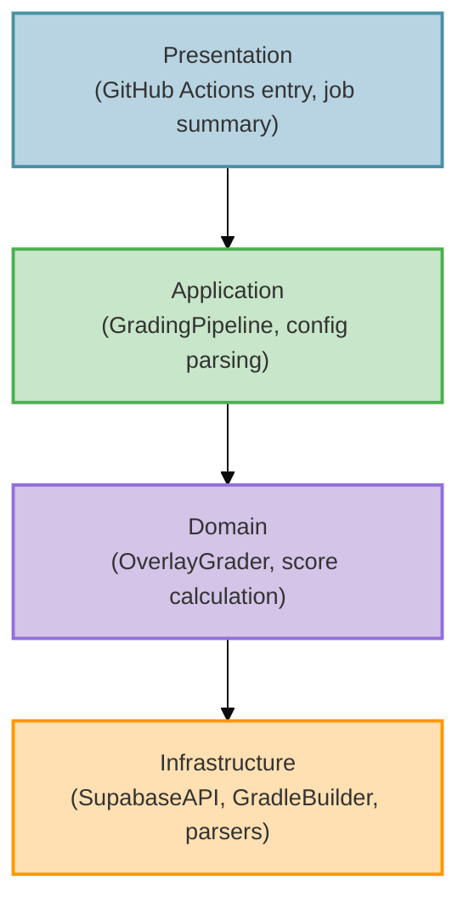
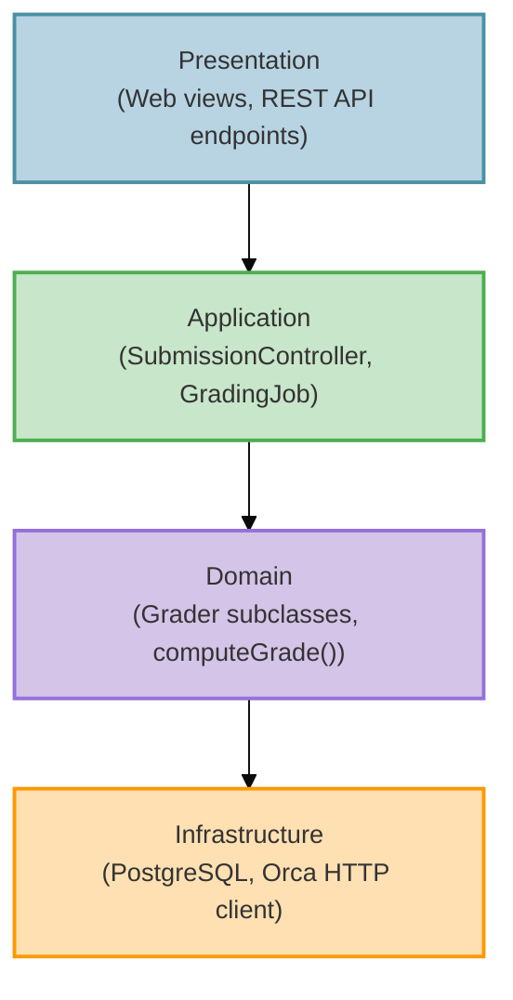
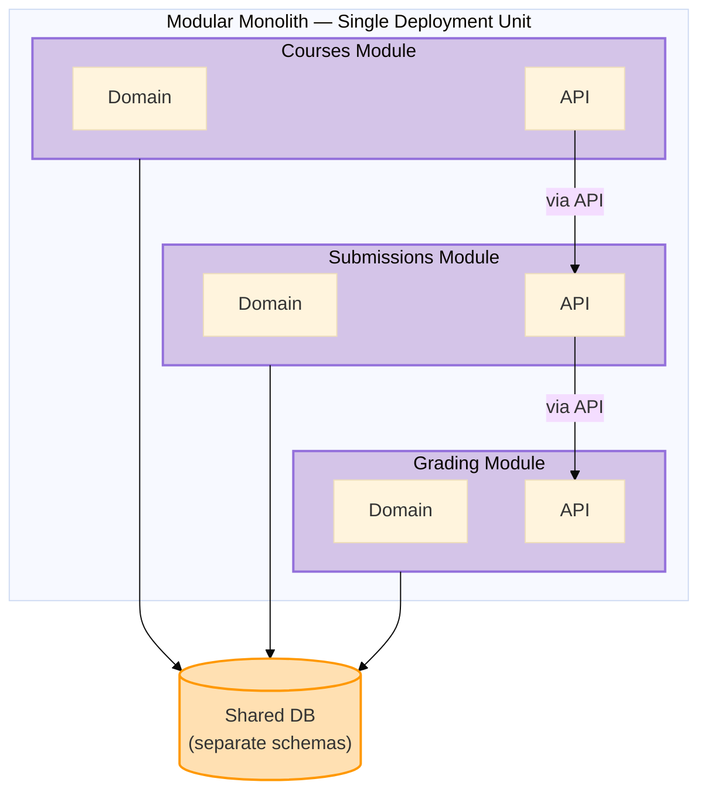

import RevealJS, { Slide } from '@site/src/components/RevealJS';
import Img from '@site/src/components/Img';

<RevealJS transition="slide">

{/* ============================================ */}
{/* COVER IMAGE */}
{/* ============================================ */}

<Slide>
  

<aside className="notes">
**Lecture overview:**
- **Total time:** ~65 MINUTES
- **Prerequisites:** L16 (testability, hexagonal intro), L17 (creation patterns, DI), L18 (architectural thinking, boundaries, C4, ADRs, Pawtograder/Bottlenose, **four heuristics**)
- **Connects to:** L20–L21 (distributed architecture, networks, client-server, serverless), L22 (Conway's Law, teams), L29–L30 (MVC/GUI)

**Structure:**
- Motivating Question: "How do we organize our code?" + Big Ball of Mud (~3 min)
- Quality Attributes vocabulary + scenarios (~10 min)
- Styles vs. Patterns (~3 min)
- Running Examples Recap: Pawtograder & Bottlenose (~5 min)
- Hexagonal in Pawtograder — with heuristics emergence lens (~10 min)
- Layered & Pipelined Styles — each with emergence explanation (~12 min)
- **Styles Emerge from Heuristics + Pawtograder Worked Example (~8 min) — synthesis after all styles introduced**
- Monolithic Architecture: Bottlenose (~10 min)
- Modular Monolith & Microservices Teaser (~8 min)
- Quality Attributes Applied & Tradeoffs (~8 min)
- **Domain Understanding Guides Flexibility (L12 reference) (~3 min)**
- Partitioning: Technical vs. Domain (~5 min)
- Key Takeaway: Architecture Is Discovered, Not Chosen (~3 min)

**Key theme:** Architectural styles EMERGE from applying principled heuristics (L18), but only when grounded in domain understanding (L12). This lecture shows how the same four heuristics — Rate of Change, Actor, ISP, Testability — lead to different styles depending on the problem. Architecture is about tradeoffs — but without understanding your domain, you might invest flexibility in axes of change that will never occur.

→ **Transition:** Let's start with the title...
</aside>

</Slide>

{/* ============================================ */}
{/* TITLE SLIDE */}
{/* ============================================ */}

<Slide>

# CS 3100: Program Design and Implementation II

## Lecture 19: Architectural Styles — From Hexagons to Monoliths

<p style={{marginTop: '2em', fontSize: '0.8em', color: '#666'}}>
  ©2026 Jonathan Bell, CC-BY-SA
</p>

<aside className="notes">
**Context:**
- L18 ended with C4 diagrams, ADRs, and "just enough architecture" — applied to Pawtograder
- Today: we continue with Pawtograder and Bottlenose to explore architectural styles
- Running examples: Pawtograder (the grading system from L18) and Bottlenose (its predecessor)

**Key message:** "Hexagonal architecture is one of several architectural styles. Today we learn to recognize them, compare them, and evaluate how each affects quality attributes — using two real systems that solve the same problem differently."

→ **Transition:** Here's what you'll be able to do after today...
</aside>

</Slide>

{/* ============================================ */}
{/* LEARNING OBJECTIVES */}
{/* ============================================ */}

<Slide>

## Learning Objectives

<p style={{fontSize: '0.85em', textAlign: 'left'}}>
After this lecture, you will be able to:
</p>

<ol style={{fontSize: '0.75em', textAlign: 'left'}}>
  <li>Define <strong>quality attributes</strong> that architectural styles affect: maintainability, scalability, deployability, fault tolerance, and more</li>
  <li>Distinguish between <strong>architectural styles</strong> and <strong>architectural patterns</strong></li>
  <li><strong>Recognize and compare</strong> architectural styles like <strong>Hexagonal</strong>, <strong>Layered</strong>, <strong>Pipelined</strong>, and <strong>Monolithic</strong></li>
  <li>Explain the tradeoffs of <strong>monoliths</strong>, <strong>modular monoliths</strong>, and <strong>microservices</strong></li>
  <li>Analyze how architectural choices <strong>affect quality attributes differently</strong> for specific scenarios</li>
</ol>

<div className="fragment">
<p style={{fontSize: '0.75em', marginTop: '0.75em', fontStyle: 'italic', color: '#666'}}>
<strong>Important framing:</strong> You are NOT expected to become master architects by the end of this lecture. The goal is to <em>understand systems that use these styles</em> and reason about how architectural decisions impact quality attributes. When you encounter a hexagonal or layered architecture in the wild, you'll be able to read it — not necessarily design it from scratch.
</p>
</div>

<aside className="notes">
**SET EXPECTATIONS VERY CLEARLY — this is critical framing:**
- "You will NOT be tested on 'design a hexagonal architecture from scratch'"
- "You WILL be expected to READ and UNDERSTAND systems that use these styles"
- Real systems rarely fit neatly into one style — they're hybrids, compromises, and evolved messes
- The ACTUAL skill we're building: reasoning about quality attributes when you SEE different architectures
- "Given this system's architecture, which quality attributes does it prioritize? What are the tradeoffs?"

**Why teach styles at all if we're not expecting mastery?**
- They give us VOCABULARY for discussing what we observe
- You'll encounter these patterns in codebases you join — knowing the names helps you understand intent
- Like learning art history: you can appreciate a painting without being able to paint it yourself
- Once you understand the principles, you can reason about systems you encounter

**The "reading vs writing" distinction:**
- Junior engineers READ existing architectures far more than they DESIGN new ones
- Understanding why a system is structured a certain way is 90% of the skill
- Design skills come later with experience — comprehension comes first

**Time allocation:**
- Objective 1: Quality Attributes vocabulary (~8 min)
- Objective 2: Styles vs. Patterns (~3 min)
- Objective 3: Hex recap + Layered + Pipelined (~20 min)
- Objective 4: Monolith + Modular Monolith + Microservices teaser (~18 min)
- Objective 5: Applying quality attributes to scenarios (~10 min)

**Connection to L16 and L18:**
- L16: Hexagonal Architecture introduced for testability (they already know ports, adapters, domain core)
- L18: Where do service boundaries go? (Pawtograder case study)
- L19: What quality attributes matter? What styles exist? How does each style affect those attributes?

→ **Transition:** Let's start with a question you'll face every time you write software...
</aside>

</Slide>

{/* ============================================ */}
{/* MOTIVATING QUESTION: CODE ORGANIZATION */}
{/* ============================================ */}

<Slide>

## How Do We Organize Our Code?

<p style={{fontSize: '0.85em'}}>
This is the question at the heart of every architectural decision — from your first class project to production systems serving millions of users. Every pattern and style we study today is an answer to this question.
</p>


<aside className="notes">
**This is the MOTIVATING QUESTION for the entire lecture.**
- "How do we organize our code?" is a question you face at EVERY scale
- A 500-line homework assignment? You still choose how to split it into classes and packages.
- A 50,000-line autograder? The question is the same, but the stakes are higher.
- A million-line enterprise system? The question can make or break the project.

**Read the Foote & Yoder quote — it's vivid!**
- "Haphazardly structured, sprawling, sloppy, duct-tape-and-baling-wire, spaghetti-code jungle"
- "Information is shared promiscuously among distant elements"
- This isn't a theoretical concern — it's what ACTUALLY HAPPENS when teams don't think about organization

**The Big Ball of Mud is the DEFAULT outcome:**
- Nobody designs a Big Ball of Mud on purpose
- It emerges from thousands of small decisions made under pressure: "just put it here for now," "we'll refactor later," "it's faster to copy-paste"
- Every pattern we study today — layered, hexagonal, pipelined, monolith, modular monolith — is a strategy to PREVENT this

**The real cost isn't aesthetics — it's every quality attribute we'll discuss:**
- Changeability: "Where does this feature go?" → "Everywhere and nowhere"
- Testability: Can't test in isolation when everything depends on everything
- Deployability: Can't deploy safely when any change might break anything
- Eventually: cheaper to REWRITE than to maintain

**Through-line for the lecture:**
- As we discuss each style, we'll ask: "How does this style help us organize our code?"
- Hexagonal: organize around ports and adapters
- Layered: organize into horizontal strata
- Monolith vs. microservices: organize within one process or across many
- Modular monolith: organize with enforced boundaries inside one deployment
- Partitioning: organize by technical role or by domain capability

→ **Transition:** Before we discuss how to evaluate these answers, let's preview the two big architectural families...
</aside>

</Slide>

<Slide>

## The Two Big Families: Monolith vs. Microservices

<p style={{fontSize: '0.82em'}}>
At the highest level, systems fall into two broad categories based on how they're deployed:
</p>

<div style={{display: 'grid', gridTemplateColumns: '1fr 1fr', gap: '1.5em', fontSize: '0.62em', marginTop: '1em'}}>

<div style={{padding: '1em', border: '3px solid #4CAF50', borderRadius: '8px', background: 'rgba(76, 175, 80, 0.05)'}}>

**Monolith** — One Deployment Unit

- All code lives in a single codebase
- Deployed as a single artifact (JAR, binary, container)
- Components communicate via method calls
- One database, one process, one server (typically)

*This is what you've been building so far — and it's the focus of THIS lecture.*

</div>

<div style={{padding: '1em', border: '3px solid #2196F3', borderRadius: '8px', background: 'rgba(33, 150, 243, 0.05)'}}>

**Microservices** — Many Deployment Units

- Code split across separate services
- Each service deployed independently
- Services communicate via network (HTTP, messages)
- Separate databases, processes, servers

*This is where industry has been moving — and it's the focus of L20-L21.*

</div>

</div>

<div className="fragment">
<p style={{fontSize: '0.78em', marginTop: '1em', fontStyle: 'italic', color: '#666'}}>
Most architectural styles are <strong>variations within the monolith family</strong>: layered, hexagonal, modular monolith, pipelined. They differ in how they organize code <em>within</em> the single deployment unit. Microservices is the leap to <em>multiple</em> deployment units.
</p>
</div>

<aside className="notes">
**This slide frames the entire lecture series on architecture:**

**The key distinction:**
- Monolith = ONE thing to deploy, run, monitor
- Microservices = MANY things to deploy, run, monitor, coordinate

**Why start with monoliths:**
- It's what students know! Every project they've built is a monolith.
- Most companies still run monoliths (even large ones)
- Understanding monolith variations helps you understand WHY microservices exist
- You can't appreciate the tradeoffs of microservices until you understand what monoliths give you

**The fragment makes an important point:**
- Layered, Hexagonal, Modular Monolith — all still ONE deployment
- They differ in internal organization, not deployment topology
- Microservices is a fundamentally different choice with different tradeoffs

**Lecture roadmap:**
- L19 (today): Monolith variations — layered, hexagonal, modular
- L20-L21: Microservices — when and why to make the leap, and the complexity that comes with it

→ **Transition:** Let's unpack what "monolith" actually means — since that's what you've been building all along...
</aside>

</Slide>

{/* ============================================ */}
{/* MONOLITH DEEP DIVE (moved from later) */}
{/* ============================================ */}

<Slide>

## The Monolith: Where Most Projects Start

<p style={{fontSize: '0.85em'}}>
Here's a secret: <strong>you've been building monoliths your entire programming career</strong>. Every Java project, every Python script, every web application you've written in a single codebase — all monoliths. The term only becomes meaningful in contrast to systems that <em>aren't</em> monoliths.
</p>

<p style={{fontSize: '0.82em', marginTop: '0.5em'}}>
A <strong>monolith</strong> is a system deployed as a single unit. All functionality — user interface, business logic, data access — lives in one codebase, compiles into one artifact, and runs in one process. This is where we start — and for many successful systems, where we stay.
</p>

<div className="fragment">
<div style={{display: 'grid', gridTemplateColumns: '1fr 1fr 1fr 1fr', gap: '0.5em', fontSize: '0.6em', marginTop: '1em'}}>

<div style={{padding: '0.5em', border: '2px solid #9370DB', borderRadius: '8px', textAlign: 'center'}}>

**Single Deployment**

One build. One deploy. One running process.

</div>

<div style={{padding: '0.5em', border: '2px solid #4CAF50', borderRadius: '8px', textAlign: 'center'}}>

**Shared Memory**

Components talk via method calls, not networks.

</div>

<div style={{padding: '0.5em', border: '2px solid #4A90A4', borderRadius: '8px', textAlign: 'center'}}>

**Single Database**

All data in one schema, one set of tables.

</div>

<div style={{padding: '0.5em', border: '2px solid #FF9800', borderRadius: '8px', textAlign: 'center'}}>

**Unified Codebase**

One repo, one build system, one language.

</div>

</div>
</div>

<aside className="notes">
**Start with what's familiar:**
- Students have been building monoliths their whole lives without knowing the name
- Every Java project they've written? A monolith. Every Python script? A monolith.
- The term only becomes meaningful in CONTRAST to systems that AREN'T monoliths

**"Monolith" isn't an insult:**
- It's a description of deployment topology
- Many successful systems are monoliths — GitHub was a monolith for years, Shopify still is
- The question isn't "is it a monolith?" but "should it be?"

**We're going to unpack each of these four characteristics, then see how other styles improve on specific weaknesses...**

→ **Transition:** Let's dig into what each of these means concretely...
</aside>

</Slide>

<Slide>

## What "Single Deployment Unit" Really Means

<p style={{fontSize: '0.82em'}}>
In a monolith, everything ships together. One <code>git push</code>, one CI pipeline, one artifact, one deploy.
</p>

<div style={{fontSize: '0.65em', marginTop: '0.5em'}}>



</div>

<div style={{display: 'grid', gridTemplateColumns: '1fr 1fr', gap: '1em', fontSize: '0.65em', marginTop: '0.5em'}}>

<div style={{padding: '0.75em', border: '2px solid #4CAF50', borderRadius: '8px'}}>

**This means:**
- Fix a typo in the grading UI? Redeploy the whole app.
- Update a dependency for course management? Redeploy the whole app.
- Every change goes through the same pipeline.

</div>

<div style={{padding: '0.75em', border: '2px solid #FF9800', borderRadius: '8px'}}>

**The consequence:**
- You can't deploy grading fixes without also deploying whatever else changed
- A broken test in course management blocks a grading deploy
- Deployment frequency is limited by the slowest-moving part

</div>

</div>

<aside className="notes">
**Make this visceral for students:**
- "You fixed a one-line bug in how grading jobs are queued. To get that fix to students, you have to redeploy the ENTIRE application."
- "Your CI pipeline takes 20 minutes. Every change — no matter how small — waits 20 minutes."
- "Someone merged a broken migration for courses. Your grading fix can't deploy until that's fixed too."

**The positive spin:**
- One deploy means ONE thing to monitor, ONE rollback strategy, ONE set of health checks
- You always know exactly what's running in production — the latest build

→ **Transition:** What about shared memory?
</aside>

</Slide>

<Slide>

## What "Shared Memory" Really Means

<p style={{fontSize: '0.82em'}}>
In a monolith, components communicate by calling methods on objects that live in the <strong>same process</strong>. This is so natural you've never had to think about it:
</p>

<div style={{display: 'flex', flexDirection: 'column', gap: '1em', fontSize: '0.55em', marginTop: '0.75em'}}>

<div style={{padding: '0.75em', border: '2px solid #4CAF50', borderRadius: '8px'}}>

**What a monolith feels like** *(illustrative)*

```java
// All in one process, one memory space
Course course = courseRepo.findById(courseId);
Assignment assignment = course.createAssignment(
    name, dueDate);

// This is a method call — nanoseconds, guaranteed
Grader grader = GraderFactory.buildFor(
    assignment, config);

// One database transaction wraps everything
transaction(() -> {
    assignment.setGrader(grader);
    for (Registration reg : course.getRegistrations())
        notificationService.notifyNewAssignment(
            reg, assignment);
});
// If ANY step fails, ALL steps roll back
```

</div>

<div style={{padding: '0.75em', border: '2px solid #FF9800', borderRadius: '8px'}}>

**What you get for free:**
- **Speed:** Method calls take nanoseconds
- **Reliability:** If you call a method, it runs
- **Transactions:** Wrap multiple operations in one atomic unit — all succeed or all roll back
- **Objects by reference:** Pass an `Assignment` object around; everyone sees the same data
- **Debugging:** Set a breakpoint, step through the entire flow in one debugger session

</div>

</div>

<div className="fragment">
<p style={{fontSize: '0.78em', marginTop: '0.5em', color: '#FF9800'}}>
These guarantees are <strong>invisible until you lose them</strong>. When components move to different processes or different machines, every one of these guarantees disappears.
</p>
</div>

<aside className="notes">
**This is the most important point to internalize:**
- Students take shared memory for granted because it's all they've experienced
- "When you call `GraderFactory.buildFor(assignment, config)`, have you ever worried that the method might not run? That it might take 30 seconds to start? That it might run TWICE?"
- "No? That's because you're in a monolith. Those guarantees come from shared memory."

**The transaction point is crucial:**
- In a monolith: create the assignment, configure the grader, and notify students — all in one transaction
- If notifications fail, the assignment creation AND grader config roll back
- In a distributed system, there's no way to do this across services — you need sagas, compensating transactions, eventual consistency

→ **Transition:** And what about working in one codebase?
</aside>

</Slide>

<Slide>

## What "Unified Codebase" Really Means

<p style={{fontSize: '0.82em'}}>
In a monolith, everyone works in the <strong>same repository</strong>, with the <strong>same language</strong>, the <strong>same build system</strong>, and the <strong>same dependency tree</strong>.
</p>

<div style={{display: 'flex', flexDirection: 'column', gap: '1em', fontSize: '0.65em', marginTop: '0.75em'}}>

<div style={{padding: '0.75em', border: '2px solid #4CAF50', borderRadius: '8px'}}>

**Benefits of one codebase**
- **Refactoring is easy:** rename a method and your IDE finds every caller
- **Code sharing is free:** import any class from any package
- **Consistency:** one style guide, one set of linters, one test framework
- **Onboarding:** new developers learn ONE system, not twelve

</div>

<div style={{padding: '0.75em', border: '2px solid #FF9800', borderRadius: '8px'}}>

**Costs of one codebase**
- **Merge conflicts:** Unless there's a strong enforcement of modularity, it's easy to step on each other's toes
- **Slow builds:** the whole app rebuilds even for small changes
- **Technology lock-in:** The whole system uses one language, one framework
- **Blast radius:** a bad commit affects everything

</div>

</div>

<aside className="notes">
**Make the benefits tangible:**
- "If you want to understand how grading works, you grep one codebase. Every caller, every test, every reference — it's all right there."
- "Rename a method? Your IDE handles it. Every caller updates. One commit."

**Make the costs tangible:**
- "If 20 developers are all pushing to the same repo, merge conflicts are a daily occurrence"
- "Your CI runs ALL the tests — even if you only changed one file"
- "Want to use a different language for a new feature? Too bad — the monolith is locked in"

**The big picture:**
- A monolith gives you simplicity at the cost of flexibility
- This is a VALID tradeoff for many, many systems

→ **Transition:** Now that we understand what a monolith IS, let's build vocabulary for evaluating architectural choices...
</aside>

</Slide>

<Slide>

## Quality Attributes: The "-ilities"

<p style={{fontSize: '0.82em'}}>
How do we decide if an architecture is "good"? Not by how it looks — by how it behaves. <strong>Quality attributes</strong> are the measurable properties of a system that stakeholders care about.
</p>

<p style={{fontSize: '0.8em', marginTop: '0.5em'}}>
You've already met some of these. Today we'll define a full vocabulary and use it throughout the lecture to evaluate every architectural style we encounter.
</p>

<div className="fragment">
<div style={{display: 'grid', gridTemplateColumns: '1fr 1fr 1fr', gap: '0.5em', fontSize: '0.55em', marginTop: '0.75em'}}>

<div style={{padding: '0.5em', border: '2px solid #4CAF50', borderRadius: '8px', textAlign: 'center'}}>

**Simplicity** · **Modularity** · **Testability**

</div>

<div style={{padding: '0.5em', border: '2px solid #4A90A4', borderRadius: '8px', textAlign: 'center'}}>

**Maintainability** · **Changeability** · **Deployability**

</div>

<div style={{padding: '0.5em', border: '2px solid #FF9800', borderRadius: '8px', textAlign: 'center'}}>

**Scalability** · **Responsiveness** · **Fault Tolerance**

</div>

</div>
</div>

<aside className="notes">
**Frame this clearly:**
- "We've been talking about design principles (SOLID, coupling, cohesion) at the class level"
- "Quality attributes are the SYSTEM-level version of that question: what properties does our architecture need to have?"
- "Different stakeholders care about different attributes: developers care about maintainability, ops cares about deployability, users care about responsiveness"

**Some of these are review:**
- Testability: L16 (hex arch was motivated by testability)
- Modularity and changeability: L7-L8 (coupling, cohesion, SOLID)
- Some are NEW: deployability, fault tolerance, scalability at the architectural level

**The key insight we're building toward:**
- Every architectural style makes DIFFERENT tradeoffs among these attributes
- There's no style that maximizes all of them — that's why architecture is hard

→ **Transition:** But how do we make these precise?
</aside>

</Slide>

<Slide>

## Specifying Quality Attributes: Scenarios

<p style={{fontSize: '0.82em'}}>
In L9, we learned that vague requirements are dangerous. Quality attributes have the same problem — "the system should be scalable" is as useless as "the system should be fair."
</p>

<p style={{fontSize: '0.78em', marginTop: '0.3em'}}>
We use a common form — a <strong>quality attribute scenario</strong> — to make every attribute testable and unambiguous.
</p>


<aside className="notes">
**Connection to L9 (Requirements Analysis):**
- In L9, we saw that "the system should be fair" needed to be unpacked into concrete, testable requirements
- Quality attributes have the EXACT same problem: "the system should be scalable" means nothing without a scenario
- The three risk dimensions from L9 apply directly:
  - Understanding: What does "scalable" mean for THIS system?
  - Scope: How much load? How many users? What's the growth curve?
  - Volatility: Will the load patterns change? Will infrastructure change?

**Walk through the six-part framework:**
- **Source:** Who or what generates the stimulus? A user, an external system, a developer, an attacker. The source matters — a request from a trusted user may be treated differently than one from an untrusted source.
- **Stimulus:** The event that arrives — a spike in submissions, a component crash, a change request, a security probe. For runtime qualities this is a system event; for development-time qualities it's a project event (like "completion of a unit of development" for testability, or "a request for a modification" for changeability).
- **Environment:** The conditions — normal operation, peak load, degraded mode, during development, during deployment. The environment sets the context: a change request after code freeze is treated differently than one before. And environment includes your DEPENDENCIES: if GitHub itself is on fire, Pawtograder has a very bad day — grading actions can't run at all. Bottlenose doesn't depend on GitHub, so it keeps grading just fine. This is a fault tolerance scenario where the environment (GitHub outage) changes everything about which architecture wins.
- **Artifact:** What part of the system is affected? The whole system, the grading pipeline, the API, a single adapter? Being specific matters: a failure in the data store may be treated differently than a failure in the grading engine.
- **Response:** What the system (or the developers) should do in response. For runtime: process requests, isolate failures, maintain service. For development-time: implement the change without side effects, then test and deploy.
- **Measure:** The quantifiable threshold — latency, throughput, time to implement a change, number of files touched, data exposed. This is what makes the scenario TESTABLE.

**The "common form" insight is powerful:**
- Students struggle with quality attributes because different communities use different vocabulary
- Performance people talk about "events" and "latency"; Security people talk about "attacks" and "vulnerabilities"; Modifiability people talk about "change requests" and "effort"
- But they're ALL describing the same six-part structure!
- This common form cuts through vocabulary confusion

→ **Transition:** Let's see this in action with our running examples...
</aside>

</Slide>

<Slide>

## Why "Scalable" Isn't Specific Enough

<p style={{fontSize: '0.82em'}}>
Imagine someone says: "The grading system should be scalable." What does that actually mean? Consider three very different situations Pawtograder might face:
</p>

<div style={{display: 'grid', gridTemplateColumns: '1fr 1fr 1fr', gap: '0.6em', fontSize: '0.52em', marginTop: '0.5em'}}>

<div style={{padding: '0.6em', border: '2px solid #FF5722', borderRadius: '8px'}}>

**Scenario A: Spike**

200 students submit **all at once** at 11:59pm deadline

*What happens?*
- 200 parallel GitHub Actions runners spin up
- Each builds, tests, parses, scores independently
- All are accepted before the deadline, complete in ~30 minutes
- **API receives 200 results simultaneously**

*Very different from Scenario B or C!*

</div>

<div style={{padding: '0.6em', border: '2px solid #FF9800', borderRadius: '8px'}}>

**Scenario B: Sustained**

1800 students submit **over 1 hour** during an exam

*What happens?*
- ~30 new runners start every minute
- ~30 complete every minute (steady state)
- Load is spread over time
- **API handles ~30 results/min continuously**

*Very different from Scenario A or C!*

</div>

<div style={{padding: '0.6em', border: '2px solid #4CAF50', borderRadius: '8px'}}>

**Scenario C: Trickle**

1800 students submit **over 24 hours** for a homework

*What happens?*
- ~1-2 runners at any time
- Never more than a handful concurrent
- Minimal system stress
- **API barely notices**

*Very different from Scenario A or B!*

</div>

</div>

<div className="fragment">
<p style={{fontSize: '0.75em', marginTop: '0.5em', fontWeight: 'bold', color: '#9370DB'}}>
All three scenarios involve "grading many submissions" — but they place <strong>completely different demands</strong> on the system. A system that handles Scenario C perfectly might completely fail at Scenario A. This is why we need a vocabulary for being <em>specific</em> about what we mean.
</p>
</div>

<aside className="notes">
**The pedagogical goal: motivate WHY we need quality attribute vocabulary.**

**The problem with vague requirements:**
- "The system should be scalable" — which scenario are we optimizing for?
- A system designed for Scenario C might fail catastrophically at Scenario A
- A system over-engineered for Scenario A might be wasteful for Scenario C

**Walk through each scenario — make them vivid:**

**Scenario A (Spike):**
- "200 students all hit submit at 11:59pm. What happens?"
- This is a BURST — everything at once
- Questions: What if 10 runners fail? Can the API handle 200 simultaneous writes? Race conditions?

**Scenario B (Sustained):**
- "An exam where students have 1 hour, 1800 students in the class"
- This is CONTINUOUS PRESSURE — not a spike, but sustained load
- Questions: Can we maintain throughput for an hour? Database connection pools? Memory leaks?

**Scenario C (Trickle):**
- "Homework due in a week, students submit throughout"
- This is the EASY case — most systems handle this fine
- BUT: testing only under Scenario C gives false confidence!

**The key insight:**
- The word "scalable" hides these distinctions
- We need SPECIFIC vocabulary to discuss what we actually mean
- That's what quality attributes give us — precision instead of hand-waving

**Discussion prompt:**
- "Which scenario do you think CS3100 assignment deadlines look like?" (Usually A or B)
- "If you tested only during office hours (Scenario C), would you catch problems?"

→ **Transition:** Now that we understand the two big families, let's build vocabulary to compare them...
</aside>

</Slide>

<Slide>

## Review: Quality Attributes You Already Know

<p style={{fontSize: '0.82em'}}>
You've already encountered these quality attributes in earlier lectures. They're foundational — and they apply at the architectural level too:
</p>

<div style={{display: 'grid', gridTemplateColumns: '1fr 1fr 1fr', gap: '0.75em', fontSize: '0.55em', marginTop: '0.75em'}}>

<div style={{padding: '0.75em', border: '2px solid #4CAF50', borderRadius: '8px'}}>

**Simplicity**

How easy is the system to understand and reason about? Fewer moving parts, fewer deployment units, fewer technologies.

*L7: Low coupling and high cohesion make code easier to understand. Readable code is understandable code. These principles scale up to architecture.*

</div>

<div style={{padding: '0.75em', border: '2px solid #4CAF50', borderRadius: '8px'}}>

**Modularity**

How well is the system divided into independent, interchangeable components? High cohesion within modules, low coupling between them.

*L7: Coupling and cohesion at the class level. Now we scale it up to system components and deployment boundaries.*

</div>

<div style={{padding: '0.75em', border: '2px solid #4CAF50', borderRadius: '8px'}}>

**Testability**

How easily can we verify the system behaves correctly? Can components be tested in isolation? Do we need real infrastructure to run tests?

*L16: Hexagonal architecture was motivated by this — domain logic testable without real databases or APIs.*

</div>

</div>

<div className="fragment">
<p style={{fontSize: '0.78em', marginTop: '0.75em', fontStyle: 'italic', color: '#666'}}>
We've already seen a tension between simplicity and modularity: adding interfaces and abstractions increases modularity but decreases simplicity. This tension continues at the architectural level.
</p>
</div>

<aside className="notes">
**This is a REVIEW slide — students should recognize these from L7:**

**Simplicity — connect to L7 concepts:**
- Low coupling contributes to simplicity: when components don't depend on each other's internals, the system is easier to understand
- High cohesion contributes to simplicity: when related things are grouped together, you don't have to hunt across the codebase
- Readability contributes to simplicity: clear names, consistent style, self-documenting code
- At the architectural level: a monolith is SIMPLE (one thing to deploy/monitor). Microservices add complexity.
- "The simplest thing that could possibly work" is a legitimate architectural choice

**Modularity — also from L7:**
- High cohesion within modules, low coupling between them
- This is coupling/cohesion scaled UP to system components
- Architectural version: Can we change the grading pipeline without touching the course management module?
- Hex arch achieves this through ports/adapters; modular monolith through enforced boundaries

**Testability — from L16:**
- Hexagonal architecture separates domain from infrastructure
- Architectural version: Can you test the grading engine without a real database? Without GitHub Actions?

**The tension callout:**
- This previews the tradeoffs we'll discuss after defining all attributes
- Adding an interface (modularity ↑) means adding code (simplicity ↓)
- Low coupling between modules might require MORE code (adapters, interfaces) — a tradeoff!
- This isn't a flaw — it's a conscious tradeoff

→ **Transition:** Now let's introduce the vocabulary for NEW quality attributes...

**IMPORTANT FRAMING for the next few slides:**
- We're building VOCABULARY first, not deep understanding
- Students need to know these terms exist and roughly what they mean
- The deep exploration of how architectural choices affect these attributes comes LATER in this lecture (when we examine styles) and in L20
- Don't get bogged down in details — keep it brisk, definitional
</aside>

</Slide>

<Slide>

## New Attributes: Deployability, Responsiveness, Fault Tolerance

<p style={{fontSize: '0.78em', fontStyle: 'italic', color: '#666', marginBottom: '0.75em'}}>
These three attributes become critical when comparing monoliths vs. distributed systems. We'll explore them in depth in L20 — for now, just the vocabulary:
</p>

<div style={{display: 'grid', gridTemplateColumns: '1fr 1fr 1fr', gap: '0.75em', fontSize: '0.52em'}}>

<div style={{padding: '0.75em', border: '2px solid #2196F3', borderRadius: '8px'}}>

**Deployability**

*How easily can we release changes to production?*

- **High:** Independent deploys, small blast radius, quick rollback
- **Low:** All-or-nothing deployment, coordinate across teams

*Monoliths: one deploy = everything. Distributed: deploy pieces independently.*

</div>

<div style={{padding: '0.75em', border: '2px solid #2196F3', borderRadius: '8px'}}>

**Responsiveness**

*How quickly does the system respond to requests?*

- **High:** In-process calls (nanoseconds), shared memory
- **Lower:** Network calls (milliseconds), serialization overhead

*Monoliths win here — no network between components.*

</div>

<div style={{padding: '0.75em', border: '2px solid #2196F3', borderRadius: '8px'}}>

**Fault Tolerance**

*How does the system behave when something fails?*

- **High:** Failed component doesn't crash others, graceful degradation
- **Low:** One crash = entire system down

*Distributed systems isolate failures — but introduce NEW failure modes.*

</div>

</div>

<div className="fragment">
<p style={{fontSize: '0.75em', marginTop: '1em', fontWeight: 'bold', color: '#9370DB'}}>
Notice the pattern: Monoliths tend to have <strong>better responsiveness</strong> but <strong>worse deployability and fault tolerance</strong>. Distributed systems flip this. These tradeoffs are central to L20.
</p>
</div>

<aside className="notes">
**This is a PREVIEW slide — keep it brisk:**

These three attributes are where monoliths and microservices diverge most sharply. We're just planting vocabulary seeds here.

**Deployability:**
- Monolith: fix a typo → redeploy everything
- Distributed: fix a typo → redeploy just that service

**Responsiveness:**
- Method call: ~1-10 nanoseconds
- Network call: ~1-100 milliseconds (5-7 orders of magnitude slower!)
- Monoliths win on raw speed

**Fault Tolerance:**
- Monolith: one bad component poisons the whole process
- Distributed: failures are isolated... but network adds new failure modes (timeouts, partial failures)

**The fragment reveals the core tradeoff:**
- This is the heart of the monolith vs. microservices debate
- L20 will unpack this in detail with real examples

→ **Transition:** Now the umbrella term that ties these together...
</aside>

</Slide>

<Slide>

## Umbrella Attribute: Maintainability

<p style={{fontSize: '0.82em'}}>
<strong>Maintainability</strong> is the umbrella term for how easily a system can be changed over time. It <em>decomposes</em> into the other attributes:
</p>

<p style={{fontSize: '0.65em', fontStyle: 'italic', color: '#666', marginTop: '-0.25em', marginBottom: '0.5em'}}>
This is the "big picture" attribute — we'll see how styles affect it throughout this lecture and L20.
</p>

<div style={{fontSize: '0.8em', marginTop: '0.5em'}}>



</div>

<div className="fragment">
<p style={{fontSize: '0.78em', marginTop: '0.5em', fontStyle: 'italic', color: '#666'}}>
When someone says "this system is hard to maintain," ask: Is it hard to <em>understand</em> (simplicity)? Hard to <em>change safely</em> (changeability)? Hard to <em>test</em> (testability)? Hard to <em>modify without affecting other parts</em> (modularity)? Decomposing "maintainability" gives us precision.
</p>
</div>

<aside className="notes">
**Maintainability as the umbrella:**
- Students often use "maintainability" loosely. Unpack it!
- "When someone says 'this system is hard to maintain,' WHICH of these is the problem?"
- Is it hard to understand? (simplicity)
- Is it hard to change safely? (changeability)
- Is it hard to test? (testability)
- Is it modular enough that changes don't ripple? (modularity)

**Why decomposition matters:**
- A system can be highly modular but hard to understand (complexity from abstraction)
- A system can be simple but hard to change safely (no tests)
- A system can be testable but hard to deploy (monolith)
- "Maintainability" hides which problem you actually have

**This connects to root cause analysis:**
- Don't say "we have a maintainability problem"
- Say "we have a testability problem" or "we have a modularity problem"
- Then you know what to fix

→ **Transition:** Two more attributes to define...
</aside>

</Slide>

<Slide>

## Review: Changeability

<p style={{fontSize: '0.82em'}}>
How safely can we modify existing behavior?
</p>

<p style={{fontSize: '0.65em', fontStyle: 'italic', color: '#666', marginTop: '-0.5em', marginBottom: '0.5em'}}>
You've seen this at the code level (L7-L8: OCP, low coupling). Now we scale it to architecture.
</p>

<div style={{display: 'grid', gridTemplateColumns: '1fr 1fr', gap: '1em', fontSize: '0.65em', marginTop: '0.75em'}}>

<div style={{padding: '0.75em', border: '2px solid #4CAF50', borderRadius: '8px'}}>

**High Changeability**

- Clean interfaces between components
- Low coupling — changes don't ripple
- Open/Closed Principle (L8) applied
- Good test coverage gives confidence

*Hex arch: Add Rust support = one new `RustCargoBuilder` adapter. Domain untouched.*

</div>

<div style={{padding: '0.75em', border: '2px solid #FF9800', borderRadius: '8px'}}>

**Low Changeability**

- Components tightly coupled
- Changes ripple across many files
- No clear interfaces to program against
- Fear of breaking unrelated features

*Big Ball of Mud: Add Rust support = touch files throughout the codebase.*

</div>

</div>

<div className="fragment">
<p style={{fontSize: '0.78em', marginTop: '0.75em', fontWeight: 'bold', color: '#9370DB'}}>
<strong>Changeability ≠ Deployability:</strong> A change can be <em>easy to make</em> (high changeability — one file) but <em>hard to deploy</em> (low deployability — requires full system redeploy). Or vice versa: easy to deploy (independent service) but hard to change (requires coordinating multiple services).
</p>
</div>

<aside className="notes">
**Changeability = how safely can we modify:**

**The distinction from deployability is crucial:**
- Changeability: How many files do I touch? Do changes ripple? Is refactoring safe?
- Deployability: How do I get those changes to production? How risky is the deploy?

**A monolith can have HIGH changeability:**
- IDE refactoring works across the entire codebase
- Rename a method → all callers updated automatically
- But LOW deployability — every change requires full redeploy

**A microservices system can have HIGH deployability:**
- Each service deploys independently
- But LOW changeability for cross-service features — coordinate multiple repos, multiple teams

**The Pawtograder example:**
- Adding Rust = one `RustCargoBuilder` class
- The port interface is stable, the domain is untouched
- This is HIGH changeability because of architectural boundaries

→ **Transition:** Finally, scalability...
</aside>

</Slide>

<Slide>

## New Attribute: Scalability

<p style={{fontSize: '0.82em'}}>
How does the system handle growth in load, data, or users?
</p>

<p style={{fontSize: '0.65em', fontStyle: 'italic', color: '#666', marginTop: '-0.5em', marginBottom: '0.5em'}}>
Scaling strategies vary by architecture — we'll explore this in depth in L20.
</p>

<div style={{display: 'grid', gridTemplateColumns: '1fr 1fr', gap: '1em', fontSize: '0.65em', marginTop: '0.75em'}}>

<div style={{padding: '0.75em', border: '2px solid #FF9800', borderRadius: '8px'}}>

**Vertical Scaling**

"Buy a bigger server" — more CPU, more RAM.

- Simple to implement
- No code changes required
- Has a ceiling (biggest server available)
- Heavy work STILL competes for shared resources

</div>

<div style={{padding: '0.75em', border: '2px solid #4CAF50', borderRadius: '8px'}}>

**Horizontal Scaling**

"Add more instances" — offload work to independent workers.

- No theoretical ceiling
- Heavy work happens elsewhere
- Core system stays responsive
- Requires architecture that supports it

</div>

</div>

<div className="fragment">
<p style={{fontSize: '0.78em', marginTop: '0.75em', fontWeight: 'bold', color: '#9370DB'}}>
Key insight: Scalability isn't just "can the system handle more load?" It's "does the <em>rest</em> of the system stay responsive while handling that load?" We'll return to this distinction in L20-21.
</p>
</div>

<aside className="notes">
**Scalability = handling growth:**

**Vertical scaling:**
- The intuitive approach: "slow? buy more hardware"
- But there's a ceiling — you can only buy so big a server
- More importantly: even with a huge server, in a monolith ALL work shares resources
- Grading jobs compete with web requests for CPU, memory, DB connections
- Adding more grading jobs just makes contention worse

**Horizontal scaling:**
- The distributed approach: "slow? add more workers"
- Pawtograder naturally does this — GitHub Actions spins up N runners
- The API never touches the heavy work — it just receives normalized feedback
- So the API stays fast even during a near-deadline spike

**The "rest of the system" insight:**
- This connects back to our Scenario A (200 at once) from earlier
- The question isn't just "can we grade 200 submissions?"
- It's "does the web UI stay responsive WHILE we grade 200 submissions?"
- Pawtograder: yes. Monolith: no (without architectural changes).

**Foreshadow L20-21:**
- We'll go much deeper into distributed architecture
- Horizontal scaling requires infrastructure: queues, workers, coordination
- There's no free lunch — distributed systems add complexity

→ **Transition:** Now that we've defined all attributes, let's talk tradeoffs...
</aside>

</Slide>

<Slide>

## Quality Attributes Trade Off Against Each Other

<p style={{fontSize: '0.82em'}}>
Here's the uncomfortable truth: <strong>you can't maximize every quality attribute</strong>. They're in tension with each other.
</p>

<div style={{display: 'grid', gridTemplateColumns: '1fr 1fr', gap: '0.75em', fontSize: '0.58em', marginTop: '0.75em'}}>

<div style={{padding: '0.75em', border: '2px solid #FF9800', borderRadius: '8px'}}>

**Simplicity vs. Modularity**

Adding interfaces and abstractions → more modular → less simple

*We saw this in L7-L8: ISP means more interfaces to understand.*

</div>

<div style={{padding: '0.75em', border: '2px solid #FF9800', borderRadius: '8px'}}>

**Simplicity vs. Scalability**

Horizontal scaling requires workers, queues, coordination → more complexity

*A monolith is simple but hits a ceiling. Distributed systems scale but aren't simple.*

</div>

<div style={{padding: '0.75em', border: '2px solid #FF9800', borderRadius: '8px'}}>

**Deployability vs. Responsiveness**

Independent services → independent deploys → network calls → more latency

*High deployability often means more service boundaries = more network overhead.*

</div>

<div style={{padding: '0.75em', border: '2px solid #FF9800', borderRadius: '8px'}}>

**Fault Tolerance vs. Simplicity**

Isolation requires boundaries → boundaries add complexity

*A monolith is simpler but a single point of failure. Distributed systems isolate failures but add coordination complexity.*

</div>

</div>

<div className="fragment">
<p style={{fontSize: '0.78em', marginTop: '0.75em', fontWeight: 'bold', color: '#9370DB'}}>
Architecture is choosing which attributes matter most for <em>your</em> system. If someone tells you their architecture maximizes everything, they're selling something.
</p>
</div>

<aside className="notes">
**This is the KEY INSIGHT for the lecture:**

**Every decision has costs:**
- Adding modularity = adding abstractions = reducing simplicity
- Adding scalability = adding workers = adding coordination complexity
- Adding deployability = adding service boundaries = adding network latency
- Adding fault isolation = adding boundaries = adding complexity

**The role of the architect:**
- NOT to find the "best" architecture (there isn't one)
- TO understand the priorities for THIS system
- TO make conscious tradeoffs based on those priorities
- TO communicate those tradeoffs to the team

**Connect to domain understanding (L12):**
- Domain modeling tells you WHICH quality attributes matter most
- A grading system needs scalability at deadline time
- A banking system needs fault tolerance and consistency
- A startup MVP might just need simplicity

**The "selling something" callout:**
- Vendors often promise architectures that do everything well
- In practice, every architectural style makes tradeoffs
- Understanding the tradeoffs is the skill — not finding the magic solution

→ **Transition:** Now we have the vocabulary. Let's clarify what "styles" and "patterns" mean...
</aside>

</Slide>

{/* ============================================ */}
{/* ARC 1: STYLES vs PATTERNS (3 min) */}
{/* ============================================ */}

<Slide>

## Architectural Styles vs. Patterns

<p style={{fontSize: '0.9em', marginTop: '0.5em'}}>
Architects use two terms that sound similar but mean different things:
</p>

<div style={{display: 'grid', gridTemplateColumns: '1fr 1fr', gap: '1.5em', fontSize: '0.7em', marginTop: '1em'}}>

<div style={{padding: '1em', border: '2px solid #9370DB', borderRadius: '8px'}}>

**Architectural Style — The Shape**

A bundle of characteristics about a system:
- How components are organized
- How they communicate
- How the system is deployed
- Where data lives

*"Microservices" or "monolith" — a name for a whole worldview*

</div>

<div style={{padding: '1em', border: '2px solid #4CAF50', borderRadius: '8px'}}>

**Architectural Pattern — The Solution**

A contextualized solution to a recurring problem:
- Service Locator for dependency resolution
- Repository for data access abstraction
- Strategy for extensible behavior

*Patterns are used WITHIN a style*

</div>

</div>

<div className="fragment">
<p style={{fontSize: '0.85em', marginTop: '1em', fontWeight: 'bold', color: '#9370DB'}}>
Styles describe the overall shape; patterns are reusable solutions you apply within that shape.
</p>
</div>

<aside className="notes">
**Why this distinction matters:**
- When someone says "we use microservices," they're naming a style — it implies deployment, communication, team structure, etc.
- When someone says "we use Circuit Breaker," they're naming a pattern — a specific solution to a specific problem within whatever style they chose
- You might use many patterns within a single style

**Where do styles come from?**
- Not from a committee — they emerge from practice
- Microservices: the name emerged as a reaction to "big service" architectures
- Made possible by better DevOps, containers, API design
- This is piecemeal growth (L18) applied to the profession itself!

→ **Transition:** Let's continue with the systems we introduced in L18...
</aside>

</Slide>

{/* ============================================ */}
{/* ARC 2: RUNNING EXAMPLES (5 min) */}
{/* ============================================ */}

<Slide>

## Continuing from L18: Two Systems, Same Problem

<p style={{fontSize: '0.85em'}}>
In L18, we identified component boundaries for <strong>Pawtograder</strong> and compared them to <strong>Bottlenose</strong>. Both solve the same problem — grade student code — but make different architectural choices.
</p>

<div style={{display: 'grid', gridTemplateColumns: '1fr 1fr', gap: '1em', fontSize: '0.65em', marginTop: '1em'}}>

<div style={{padding: '0.75em', border: '2px solid #9370DB', borderRadius: '8px'}}>

**Pawtograder**

- "Thick action" architecture
- Grading Action normalizes results
- Sends through a narrow API
- Leverages GitHub Actions infrastructure

</div>

<div style={{padding: '0.75em', border: '2px solid #FF9800', borderRadius: '8px'}}>

**Bottlenose**

- Web application monolith
- Platform-driven grading logic
- Delegates execution to Orca (Docker)
- All-in-one deployment

</div>

</div>

<div className="fragment">
<p style={{fontSize: '0.8em', marginTop: '0.75em'}}>
Both must: accept submissions, run tests, compute scores, report feedback. Today we'll see how <strong>architectural styles</strong> help us understand WHY they made different choices — and what those choices cost.
</p>
</div>

<aside className="notes">
**Recap from L18 (don't re-teach, just remind):**
- Pawtograder: Solution Repo, Grading Action, Pawtograder API — three components with narrow interfaces
- Bottlenose: Rails app + Orca — tightly coupled, shared database
- The boundary heuristics from L18 (rate of change, actors, interface segregation) led to these designs

**What's new today:**
- In L18, we asked "where do the boundaries go?"
- Today: "what architectural STYLES describe these systems, and how do those styles affect quality attributes?"

**The key insight we're building toward:**
- Same problem, different styles, different tradeoffs
- Neither is "right" — they're better or worse fits for particular constraints

→ **Transition:** Let's start with what you already know — the monolith...
</aside>

</Slide>

{/* ============================================ */}
{/* ARC 3: MONOLITH QUALITY PROFILE */}
{/* (Conceptual slides moved earlier) */}
{/* ============================================ */}

<Slide>

## Monolith: Quality Attribute Profile

<div style={{display: 'grid', gridTemplateColumns: '1fr 1fr', gap: '1em', fontSize: '0.65em', marginTop: '0.5em'}}>

<div style={{padding: '0.75em', border: '2px solid #4CAF50', borderRadius: '8px'}}>

**Where Monoliths Excel**

- **Simplicity** ★★★ — One thing to build, test, deploy, monitor
- **Responsiveness** ★★★ — In-process calls are orders of magnitude faster than network calls
- **Testability** ★★☆ — One environment to set up, but may need full infrastructure
- **Changeability** ★★☆ — IDE refactoring across entire codebase, but changes may ripple

</div>

<div style={{padding: '0.75em', border: '2px solid #FF9800', borderRadius: '8px'}}>

**Where Monoliths Struggle**

- **Scalability** ★☆☆ — Must scale the entire app; heavy work competes with everything else
- **Deployability** ★☆☆ — Every deploy is all-or-nothing; a bug anywhere blocks everything
- **Fault Tolerance** ★☆☆ — A crash in any component takes down the entire process
- **Modularity** ★☆☆ — Boundaries are conventions, not enforcement (without discipline → Big Ball of Mud)

</div>

</div>

<div className="fragment">
<div style={{padding: '0.75em', border: '2px solid #4A90A4', borderRadius: '8px', marginTop: '0.5em', fontSize: '0.75em'}}>

**The Monolith-First Approach (Fowler):**
Start with a monolith. You can understand the whole system. You can refactor freely. You can deploy with confidence. Only break it apart when you have specific scaling, team, or deployment problems that a monolith can't solve.

</div>
</div>

<aside className="notes">
**Walk through the ratings:**
- Simplicity ★★★: One thing to build, deploy, monitor. The defining strength.
- Responsiveness ★★★: Method calls in nanoseconds, database transactions, full stack traces.
- Scalability ★☆☆: Vertical only — bigger hardware. Heavy work competes for shared resources.
- Deployability ★☆☆: All-or-nothing. A broken test anywhere blocks everything.
- Fault Tolerance ★☆☆: Bug in one module crashes everything — one process, one fate.
- Modularity ★☆☆: Boundaries exist only as conventions. Without discipline → Big Ball of Mud.

**Fowler's advice is key:**
- Many experienced architects recommend starting monolithic
- The alternative (microservices) adds significant complexity
- Only decompose when you have specific, concrete problems

→ **Transition:** Is there a middle ground?
</aside>

</Slide>

{/* ============================================ */}
{/* ARC 4: LAYERED & PIPELINED (12 min) */}
{/* ============================================ */}

<Slide>

## Layered Architecture

<p style={{fontSize: '0.82em'}}>
The <strong>layered architecture</strong> organizes code into horizontal strata, each with a distinct responsibility. The classic formulation has four layers:
</p>

<div style={{fontSize: '0.8em', marginTop: '0.5em'}}>



</div>

<div className="fragment">
<p style={{fontSize: '0.8em', marginTop: '0.5em'}}>
<strong>The key rule:</strong> dependencies flow <strong>downward</strong>. Presentation can call Application, Application can call Domain, Domain can call Infrastructure — but <strong>never the reverse</strong>.
</p>
</div>

<aside className="notes">
**Define each layer clearly:**
- **Presentation:** What the user (or external system) sees. Web views, CLI commands, REST endpoints, GraphQL resolvers. Its job is to translate user actions into calls to the Application layer.
- **Application / Service:** Orchestrates use cases. "When a student submits, register the submission, trigger grading, and send a notification." No business rules here — just coordination.
- **Domain:** The heart of the system. Business rules, entities, value objects. "How do we compute a grade? What are the dependencies between graded parts?" This layer should have ZERO knowledge of databases, HTTP, or file systems.
- **Infrastructure:** The technology-specific implementations. PostgreSQL, Redis, Supabase API, file parsers. This layer adapts the outside world to what the Domain and Application layers need.

**Why this ordering?**
- The top layers change most frequently (UI redesigns, new API versions)
- The bottom layers change less often (business rules are more stable than UIs)
- The dependency direction means changes in volatile layers don't cascade downward

→ **Transition:** This style also emerges from heuristics...
</aside>

</Slide>

<Slide>

## Layered Architecture Emerges from Heuristics

<p style={{fontSize: '0.82em'}}>
The same L18 heuristics that led to hexagonal architecture can also lead to layered — depending on what they reveal:
</p>

<div style={{display: 'grid', gridTemplateColumns: '1fr 1fr', gap: '0.75em', fontSize: '0.6em', marginTop: '0.5em'}}>

<div style={{padding: '0.75em', border: '2px solid #4A90A4', borderRadius: '8px'}}>

**Rate of Change → Layers Separate Volatility**

| Layer | Stability |
|-------|-----------|
| Presentation | Changes often (UI redesigns) |
| Application | Changes moderately (new workflows) |
| Domain | Changes rarely (core rules are stable) |
| Infrastructure | Changes when tech changes |

*Dependency direction protects stable layers from volatile ones*

</div>

<div style={{padding: '0.75em', border: '2px solid #4CAF50', borderRadius: '8px'}}>

**Actor Ownership → Layers Map to Roles**

| Actor | Primary Layer |
|-------|---------------|
| UI/UX designer | Presentation |
| Product owner | Application (use cases) |
| Domain expert | Domain |
| DevOps | Infrastructure |

*Different expertise naturally falls into different layers*

</div>

</div>

<div className="fragment">
<div style={{padding: '0.5em', border: '2px solid #9370DB', borderRadius: '8px', marginTop: '0.5em', fontSize: '0.72em'}}>

**When do heuristics lead to layers vs. hexagons?**

- **Layered** emerges when responsibilities stack vertically (UI → logic → data) and teams map to technical roles
- **Hexagonal** emerges when the domain needs multiple entry points (web, CLI, tests) and multiple exit points (DB, API, files)
- They're not mutually exclusive — many systems exhibit BOTH perspectives

</div>
</div>

<aside className="notes">
**The key insight: same heuristics, different contexts, different emergent structures**

**When Rate of Change leads to layers:**
- If your volatility pattern is "top changes most, bottom changes least"
- UI redesigns happen every sprint; database schema changes once a year
- The dependency direction (down only) protects stable lower layers from rippling changes

**When Actor Ownership leads to layers:**
- If your team structure maps to technical roles: frontend team, backend team, DBA
- Each team owns a layer; the interfaces between layers are their contracts
- This is Conway's Law in action (preview for L22)

**Layers vs. Hexagons — when each emerges:**
- **Layers:** When data flows through a clear stack, and volatility decreases as you go down
- **Hexagons:** When the domain is the stable center and needs to connect to multiple volatile technologies (different UIs, different databases, different external services)

**The both/and insight:**
- Pawtograder has BOTH perspectives
- Hexagonal: domain core (grading logic) with ports (Builder, FeedbackAPI) and adapters (GradleBuilder, SupabaseAPI)
- Layered: Main.ts (presentation) → GradingPipeline (application) → OverlayGrader (domain) → parsers (infrastructure)
- These aren't contradictory — they're different lenses on the same structure

→ **Transition:** What quality attributes does layering serve?
</aside>

</Slide>

<Slide>

## Layered Architecture: Quality Attributes

<p style={{fontSize: '0.82em'}}>
Why organize into layers? Because it directly serves several quality attributes:
</p>

<div style={{display: 'grid', gridTemplateColumns: '1fr 1fr 1fr', gap: '0.75em', fontSize: '0.6em', marginTop: '0.75em'}}>

<div style={{padding: '0.75em', border: '2px solid #4CAF50', borderRadius: '8px'}}>

**Separation of Concerns**

Each layer has one job. The Domain layer doesn't know if it's being called from a web UI, a CLI, or a test harness. You can swap your database without touching business rules.

</div>

<div style={{padding: '0.75em', border: '2px solid #4A90A4', borderRadius: '8px'}}>

**Testability**

Test each layer in isolation. Domain logic can be tested with no database. Application logic can use stub infrastructure. Presentation can be tested against a mock service layer.

</div>

<div style={{padding: '0.75em', border: '2px solid #9370DB', borderRadius: '8px'}}>

**Replaceability**

Change your UI framework without rewriting business logic. Swap PostgreSQL for MongoDB at the Infrastructure layer. Add a REST API alongside your web UI — both call the same Application layer.

</div>

</div>

<div className="fragment">
<div style={{padding: '0.5em', border: '2px solid #FF9800', borderRadius: '8px', marginTop: '0.75em', fontSize: '0.72em'}}>

**The pitfall:** Changes that span layers — adding a new field that flows from the UI through services into the database — require touching **every layer**. This "layer tax" is the cost of separation. It's worth it for large systems, but can feel heavy for small ones.

</div>
</div>

<aside className="notes">
**Separation of concerns is the fundamental benefit:**
- "Imagine you're debugging a scoring bug. In a layered system, you know it's in the Domain layer — not tangled up with HTTP handling or database queries."
- "Imagine swapping from PostgreSQL to a different database. In a layered system, only the Infrastructure layer changes. Domain and Application are untouched."

**Testability follows directly from separation:**
- Test the Domain layer with plain objects — no database, no network, no file system
- Test the Application layer with stub Infrastructure — verify orchestration without real services
- This should sound familiar from L16 — hexagonal architecture achieves the same thing through a different lens

**The layer tax is real:**
- "Add a 'late penalty' field: create a database column (Infrastructure), add it to the grade calculation (Domain), expose it in the service (Application), display it in the UI (Presentation) — four layers touched for one concept"
- This is the main criticism of strict layering
- In practice, many teams relax strict layering — allowing occasional shortcuts where the cost of indirection outweighs the benefit

**How does this relate to Hexagonal?**
- Both achieve separation of domain from infrastructure
- Layered emphasizes horizontal strata with strict downward dependencies
- Hexagonal emphasizes the domain at the center, with adapters at the edges
- In practice, you'll often see BOTH perspectives applied to the same system

→ **Transition:** Let's see how both Pawtograder and Bottlenose exhibit layers...
</aside>

</Slide>

<Slide>

## Layers in Our Running Examples

<p style={{fontSize: '0.82em'}}>
Both Pawtograder and Bottlenose exhibit layers — with different technologies at each level:
</p>

<div style={{display: 'grid', gridTemplateColumns: '1fr 1fr', gap: '1em', fontSize: '0.55em', marginTop: '0.5em'}}>

<div style={{padding: '0.75em', border: '2px solid #9370DB', borderRadius: '8px'}}>

**Pawtograder's Grading Action**



</div>

<div style={{padding: '0.75em', border: '2px solid #FF9800', borderRadius: '8px'}}>

**Bottlenose (Monolith)**



</div>

</div>

<div className="fragment">
<p style={{fontSize: '0.75em', marginTop: '0.5em', color: '#FF9800'}}>
<strong>Layered vs. Hexagonal:</strong> Both separate domain from infrastructure. Layered emphasizes horizontal strata; Hexagonal emphasizes dependency direction (domain at center). You'll often see both lenses applied to the same system.
</p>
</div>

<aside className="notes">
**Side-by-side comparison reveals:**
- Same four layers, different technologies at each level
- Pawtograder: `Main.java` → `GradingPipeline` → `OverlayGrader` → `SupabaseAPI`/`GradleBuilder`
- Bottlenose: Web views → `SubmissionController` → `Grader` subclasses → PostgreSQL + Orca

**Many web frameworks loosely follow layered architecture by convention:**
- Views (Presentation) → Controllers (Application) → Models (Domain) → Database layer (Infrastructure)
- But frameworks often make it easy to violate layers — models may contain database queries AND business logic
- Discipline is needed to keep the layers clean

**The relationship between layered and hexagonal:**
- Hexagonal Architecture's adapters map roughly to the Infrastructure and Presentation layers
- Hexagonal's ports map to the interfaces between layers
- Hexagonal's domain core IS the Domain layer
- The difference is emphasis: layered says "these are the strata"; hexagonal says "the domain is the center and everything else adapts to it"

→ **Transition:** What about data flowing in one direction?
</aside>

</Slide>

<Slide>

## Pipelined Architecture (Pipes and Filters)

<p style={{fontSize: '0.82em'}}>
Data flows through stages. Each stage transforms its input into output for the next. Pawtograder's grading pipeline is a perfect example:
</p>

<div style={{fontSize: '0.8em', marginTop: '0.5em'}}>


</div>

<div style={{display: 'grid', gridTemplateColumns: '1fr 1fr', gap: '1em', fontSize: '0.7em', marginTop: '0.5em'}}>

<div style={{padding: '0.75em', border: '2px solid #4CAF50', borderRadius: '8px'}}>

**Benefits**
- Each stage testable independently
- Adding mutation testing = insert a stage between "Run Tests" and "Grade Units"
- Classic examples: compilers, Unix pipes, ETL

</div>

<div style={{padding: '0.75em', border: '2px solid #FF9800', borderRadius: '8px'}}>

**Constraints**
- Works best when data flows one direction
- Awkward for interactive/bidirectional workflows
- Cross-cutting concerns may touch every stage

</div>

</div>

<div className="fragment">
<div style={{display: 'grid', gridTemplateColumns: '1fr 1fr 1fr 1fr', gap: '0.4em', fontSize: '0.48em', marginTop: '0.5em'}}>

<div style={{padding: '0.4em', border: '2px solid #4CAF50', borderRadius: '6px', textAlign: 'center'}}>

**Testability** ★★★

Each stage tested in isolation

</div>

<div style={{padding: '0.4em', border: '2px solid #4CAF50', borderRadius: '6px', textAlign: 'center'}}>

**Changeability** ★★★

Insert, remove, or reorder stages

</div>

<div style={{padding: '0.4em', border: '2px solid #4A90A4', borderRadius: '6px', textAlign: 'center'}}>

**Simplicity** ★★☆

Linear flow, easy to follow

</div>

<div style={{padding: '0.4em', border: '2px solid #FF9800', borderRadius: '6px', textAlign: 'center'}}>

**Fault Tolerance** ★☆☆

Stage failure stops the pipeline

</div>

</div>
</div>

<aside className="notes">
**Pawtograder's real pipeline:**
- Two passes: Pass 1 grades all units, Pass 2 applies dependencies (if Part 1 failed, Part 2 doesn't run)
- Adding mutation testing meant inserting a stage — the rest of the pipeline was unchanged
- Each stage is independently testable

**Classic examples beyond grading:**
- Compilers: source → tokens → AST → typed AST → optimized IR → machine code
- Unix pipes: `cat file | grep pattern | sort | uniq`
- Data processing: ETL (Extract, Transform, Load) jobs

**Quality attribute connection:**
- Testability: Feed known input to one stage, check output — no need to run the entire pipeline
- Changeability: Added mutation testing by inserting a stage. Existing stages unchanged.
- Simplicity: Data flows in one direction — easy to trace, easy to reason about
- Fault tolerance: If the Build stage fails, everything downstream stops. No partial results. This is actually a FEATURE for grading (don't grade what doesn't compile), but a limitation in other contexts.

**When to use vs. when to avoid:**
- Use when data truly flows in one direction through transformations
- Avoid when you need interactive back-and-forth or complex state

→ **Transition:** This style also emerges from heuristics...
</aside>

</Slide>

<Slide>

## Pipelined Architecture Emerges from Heuristics

<p style={{fontSize: '0.82em'}}>
When does applying heuristics lead to a pipeline? When the problem has a natural <strong>transformation flow</strong>:
</p>

<div style={{display: 'grid', gridTemplateColumns: '1fr 1fr', gap: '0.75em', fontSize: '0.6em', marginTop: '0.5em'}}>

<div style={{padding: '0.75em', border: '2px solid #4A90A4', borderRadius: '8px'}}>

**Rate of Change → Stage Independence**

| Stage | When It Changes |
|-------|-----------------|
| File overlay | Rarely (mechanism stable) |
| Build runner | Per language (Gradle → Cargo) |
| Test runner | Rarely (JUnit is JUnit) |
| Report parsers | When tool versions change |
| Scoring logic | When rubric structure changes |

*Each stage changes for different reasons — natural seams for separation*

</div>

<div style={{padding: '0.75em', border: '2px solid #9370DB', borderRadius: '8px'}}>

**Testability → Stage-Level Testing**

```
testOverlay()    → known input → expected output
testBuild()      → sample project → BuildResult
testParser()     → sample XML → TestResult[]
testScoring()    → TestResult[] → GradedPart[]
```

*Each stage is a pure function: input → output. Perfect for unit testing.*

</div>

</div>

<div className="fragment">
<div style={{padding: '0.5em', border: '2px solid #4CAF50', borderRadius: '8px', marginTop: '0.5em', fontSize: '0.72em'}}>

**When does a pipeline emerge?**

Apply heuristics and ask: "Does data flow one direction? Is each transformation independently testable? Do stages change for different reasons?"

If yes → pipeline structure emerges naturally.

</div>
</div>

<aside className="notes">
**The pipeline emerged because the problem has transformation structure:**
- Input: student code + solution repo + config
- Output: graded feedback
- The transformation is a series of steps, each taking the previous output as input

**Rate of Change reveals stage boundaries:**
- The overlay mechanism changes rarely (just "copy files")
- The build runner changes when we add languages (Gradle → Maven → Cargo)
- The parsers change when tool versions update (JUnit 4 → JUnit 5 format)
- The scoring logic changes when we add features (dependencies, mutation hints)
- Each has its own reason to change → each becomes a stage

**Testability is PERFECT for pipelines:**
- Each stage is a pure function (mostly): given this input, produce that output
- No shared mutable state between stages
- Test each stage with sample inputs/outputs — no need for full integration
- This is why compilers are pipelines — each pass is testable in isolation

**The emergence pattern:**
- We didn't say "let's use pipes and filters"
- We asked: what changes independently? What can we test independently?
- A linear flow of transformations emerged
- The name "pipeline" describes what we discovered

→ **Transition:** Now that we've seen all three styles, let's step back and see the pattern...
</aside>

</Slide>

{/* ============================================ */}
{/* SYNTHESIS: STYLES EMERGE FROM HEURISTICS */}
{/* ============================================ */}

<Slide>

## Styles Emerge from Heuristics

<p style={{fontSize: '0.85em'}}>
We've now seen three styles: Hexagonal, Layered, and Pipelined. Here's the key insight: <strong>these styles aren't arbitrary choices — they emerge naturally when you apply the L18 heuristics consistently</strong>.
</p>


<aside className="notes">
**This is the synthesis insight:**
- In L18, we asked "where do the boundaries go?" and used four heuristics to find them
- We DIDN'T say "let's use hexagonal architecture" and then force boundaries to fit
- Instead, we applied Rate of Change, Actor, ISP, and Testability heuristics — and structures EMERGED
- The same heuristics, applied to different problems, lead to different styles

**Critical prerequisite: Domain Understanding (L12)**
- These heuristics only work if you understand your domain first
- "Rate of Change" requires knowing ACTUAL rates of change from domain analysis
- "Actor Ownership" requires understanding who actually uses the system and what they care about
- Without L12 domain modeling, you might apply heuristics to imaginary scenarios

**The four heuristics from L18 (review):**
1. **Rate of Change:** Things that change at different speeds should be separate
2. **Actor Ownership:** Different people/teams should own different components
3. **Interface Segregation:** Clients that need different things should get different interfaces
4. **Testability:** Things that need independent testing should be separable

**The emergence insight:**
- Hexagonal emerges when: domain changes rarely, infrastructure changes often, you need to test domain without infrastructure
- Layered emerges when: responsibilities stack naturally (UI → logic → data), each layer has different stability
- Pipelined emerges when: data flows in one direction through transformations, each stage is independently testable

→ **Transition:** Let's see this concretely with Pawtograder...
</aside>

</Slide>

<Slide>

## How Pawtograder's Style Emerged

<p style={{fontSize: '0.82em'}}>
We didn't start by saying "let's use hexagonal architecture." We applied L18's heuristics — and the style emerged:
</p>

<div style={{display: 'grid', gridTemplateColumns: '1fr 1fr', gap: '0.75em', fontSize: '0.58em', marginTop: '0.5em'}}>

<div style={{padding: '0.75em', border: '2px solid #4A90A4', borderRadius: '8px'}}>

**Rate of Change** → Domain/Adapter Split

| Component | Change Frequency |
|-----------|-----------------|
| `pawtograder.yml` | Weekly |
| Grading Action | Monthly |
| Builder interface | Rarely |
| API endpoints | Very rarely |

*Things that change at different rates ended up in different components — domain (stable) separated from adapters (volatile)*

</div>

<div style={{padding: '0.75em', border: '2px solid #4CAF50', borderRadius: '8px'}}>

**Actor Ownership** → Port Boundaries

| Actor | Owns |
|-------|------|
| Instructor | Config (yaml) |
| Action maintainer | Grading logic |
| Sysadmin | API/platform |

*Each actor's changes stay within their component — ports emerged as the contracts between them*

</div>

<div style={{padding: '0.75em', border: '2px solid #FF9800', borderRadius: '8px'}}>

**Interface Segregation** → Narrow Ports

- Instructors only see `PawtograderConfig`
- API only sees `SubmissionAPI`, `FeedbackAPI`
- Builders only see `BuildConfig`

*No fat "AutograderSystem" interface — each client gets exactly what it needs*

</div>

<div style={{padding: '0.75em', border: '2px solid #9370DB', borderRadius: '8px'}}>

**Testability** → Adapters as Seams

- Test grading locally without API
- Test config parsing without network
- Mock builders for fast unit tests

*The places we needed test seams became the adapter boundaries*

</div>

</div>

<div className="fragment">
<p style={{fontSize: '0.78em', marginTop: '0.5em', fontWeight: 'bold', color: '#9370DB'}}>
Apply the heuristics → boundaries emerge → name the pattern afterward. We call it "hexagonal" because that's the name the community gave to this shape.
</p>
</div>

<aside className="notes">
**Walk through each quadrant:**

**Rate of Change → Domain/Adapter Split:**
- Config changes weekly (instructor iterations)
- Grading logic changes monthly (new features)
- The Builder interface changes rarely (stable contract)
- API endpoints change very rarely (stability for all grading actions)
- Result: fast-changing things (config, adapters) separated from slow-changing things (domain, interfaces)

**Actor Ownership → Port Boundaries:**
- Instructor owns config — their changes shouldn't touch TypeScript
- Action maintainer owns grading logic — their changes shouldn't touch API
- Sysadmin owns API — their changes shouldn't touch grading
- Result: each actor works independently — ports are the contracts between them

**Interface Segregation → Narrow Ports:**
- We showed the "bad" fat interface in L18 — `AutograderSystem` with everything
- Instead, each client gets a narrow interface: instructors see config schema, API sees feedback format
- Result: changes to what the API needs don't affect what instructors see

**Testability → Adapters as Seams:**
- We need to test grading without deploying to GitHub Actions
- We need to test config parsing without hitting the API
- The places where we need to inject test doubles became our adapter boundaries
- Result: `GradleBuilder` can be stubbed, `SupabaseAPI` can be mocked

**The meta-insight:**
- We didn't start with "hexagonal architecture"
- We asked: what changes together? Who owns what? What do clients need? Where do we need test seams?
- The answers formed a shape — and that shape has a name

→ **Transition:** Let's see all three styles side by side...
</aside>

</Slide>

<Slide>

## The Styles Overview: Same Heuristics, Different Shapes


<aside className="notes">
**This is the synthesis slide — bring it all together:**

**The key insight:**
- We've now seen three styles: Hexagonal, Layered, Pipelined
- Each emerged from applying the same four heuristics to different problem characteristics
- You don't pick a style from a menu — you discover it by asking the L18 questions

**When each style emerges:**

**Hexagonal emerges when:**
- Rate of Change: Domain is stable, but technologies around it change (databases, UIs, APIs)
- Testability: You need to test the domain without real infrastructure
- ISP: Different clients (web, CLI, tests) need different entry points
- Actor: Domain experts vs. infrastructure experts have different concerns
- RESULT: Domain at center, ports as interfaces, adapters as swappable technology connections

**Layered emerges when:**
- Rate of Change: Volatility decreases as you go from UI to data (top changes most)
- Actor: Teams map to technical roles (frontend, backend, DBA)
- RESULT: Horizontal strata with downward-only dependencies, protecting stable lower layers

**Pipelined emerges when:**
- Rate of Change: Each transformation stage has its own reason to change
- Testability: Each stage is a pure function (input → output)
- Data flows one direction through transformations
- RESULT: Linear sequence of independent, testable stages

**The meta-lesson:**
- Architecture isn't about memorizing style names
- It's about asking the right questions and letting structure emerge
- The vocabulary (hexagonal, layered, pipelined) lets us COMMUNICATE what we discovered

→ **Transition:** We've seen how styles emerge from heuristics. Now let's look at middle ground between a basic monolith and full distribution...
</aside>

</Slide>

{/* ============================================ */}
{/* ARC 5: MODULAR MONOLITH */}
{/* ============================================ */}

<Slide>

## The Modular Monolith: A Middle Ground

<p style={{fontSize: '0.82em'}}>
Remember our opening question: <em>how do we organize our code?</em> The modular monolith is perhaps the most direct answer — maintain a <strong>single deployment unit</strong> but enforce <strong>strict module boundaries</strong> within the codebase. All the simplicity of a monolith, with intentional structure to prevent the Big Ball of Mud.
</p>

<div style={{fontSize: '0.75em', marginTop: '0.5em'}}>



</div>

<div className="fragment">
<div style={{display: 'grid', gridTemplateColumns: '1fr 1fr 1fr 1fr', gap: '0.4em', fontSize: '0.48em', marginTop: '0.5em'}}>

<div style={{padding: '0.4em', border: '2px solid #4CAF50', borderRadius: '6px', textAlign: 'center'}}>

**Simplicity** ★★★

Still one deploy, one build

</div>

<div style={{padding: '0.4em', border: '2px solid #4CAF50', borderRadius: '6px', textAlign: 'center'}}>

**Modularity** ★★★

Enforced internal boundaries

</div>

<div style={{padding: '0.4em', border: '2px solid #4A90A4', borderRadius: '6px', textAlign: 'center'}}>

**Changeability** ★★☆

Changes isolated to modules

</div>

<div style={{padding: '0.4em', border: '2px solid #FF9800', borderRadius: '6px', textAlign: 'center'}}>

**Scalability** ★☆☆

Still one process to scale

</div>

</div>
</div>

<div className="fragment">
<p style={{fontSize: '0.72em', marginTop: '0.5em', color: '#9370DB'}}>
<strong>Optionality:</strong> If the Grading module needs independent scaling later, the boundaries are already clean. But you don't pay the distributed systems tax until you need to.
</p>
</div>

<aside className="notes">
**Key characteristics:**
- Still one build, one deploy — operationally simple
- Modules communicate through explicit public APIs, not by reaching into each other's internals
- Each module owns its database tables; cross-module queries go through APIs
- Build tools or linters prevent modules from importing private code

**Quality attribute connection — the "best of both worlds" pitch:**
- Simplicity ★★★: Keeps the monolith's operational simplicity — one thing to deploy and monitor
- Modularity ★★★: This is the big upgrade over a plain monolith — enforced boundaries prevent the Big Ball of Mud
- Changeability ★★☆: Changes stay within a module boundary. Better than a monolith, but cross-module changes still require coordination.
- Scalability ★☆☆: Still one process — can't scale modules independently. This is the main limitation that might eventually push you toward microservices.
- Responsiveness ★★★: Still in-process calls — no network overhead
- Fault tolerance ★☆☆: Still one process — a crash affects everything

**The tradeoff:**
- Enforcing boundaries within a monolith requires discipline
- Nothing stops a developer from bypassing the API and querying another module's tables directly
- Microservices enforce boundaries through network calls; modular monoliths enforce them through convention and tooling

**Many teams discover they NEVER need to extract to microservices:**
- The module boundaries solve their maintainability and team ownership problems
- Without the complexity of network communication

→ **Transition:** But what about microservices?
</aside>

</Slide>

<Slide>

## But What About Microservices?

<p style={{fontSize: '0.82em'}}>
A microservices architecture decomposes a system into small, independently deployable services. Where do our running examples fall?
</p>

<div style={{fontSize: '0.65em', marginTop: '0.5em'}}>

| Aspect | Bottlenose | Pawtograder |
|--------|------------|-------------|
| **Core application** | Monolith (web framework) | Multiple independent services |
| **Grading execution** | Separate service (Orca) | Leverages GitHub Actions |
| **Data ownership** | Shared PostgreSQL database | API owns data; action is stateless |
| **Deployment** | Single deploy (mostly) | Each service deploys independently |
| **Communication** | Method calls + one HTTP boundary | HTTP APIs between all components |

</div>

<div className="fragment">
<div style={{display: 'grid', gridTemplateColumns: '1fr 1fr', gap: '0.75em', fontSize: '0.7em', marginTop: '0.5em'}}>

<div style={{padding: '0.5em', border: '2px solid #FF9800', borderRadius: '8px'}}>

**Bottlenose** is a monolith with a microservice bolted on. Orca exists because student code can't run in the main process.

</div>

<div style={{padding: '0.5em', border: '2px solid #9370DB', borderRadius: '8px'}}>

**Pawtograder** is a distributed system. The Grading Action calls the API over HTTP. There's a network in between.

</div>

</div>
</div>

<aside className="notes">
**The key observation:**
- Neither system is purely one style
- Bottlenose is MOSTLY a monolith — but even it couldn't stay entirely monolithic
- Orca exists because you can't run untrusted student code in your main web process
- This is a common pattern: monolith + one extracted service for a specific concern

**Pawtograder is more distributed:**
- The Grading Action runs on GitHub's infrastructure
- It calls the Pawtograder API over HTTP
- There's a network in between — and that changes EVERYTHING

→ **Transition:** Let's talk about that network...
</aside>

</Slide>

<Slide>

## The Network Changes Everything

<p style={{fontSize: '0.82em'}}>
In a monolith, method calls are <strong>instant</strong>, <strong>reliable</strong>, and <strong>traceable</strong>. Over a network:
</p>

<div style={{display: 'grid', gridTemplateColumns: '1fr 1fr', gap: '1em', fontSize: '0.65em', marginTop: '0.75em'}}>

<div style={{padding: '0.75em', border: '2px solid #4CAF50', borderRadius: '8px'}}>

**Monolith (Bottlenose)**

```java
submission.computeGrade();
// ✅ Executes in nanoseconds
// ✅ Always succeeds or throws
// ✅ Full stack trace on error
// ✅ Wrapped in a DB transaction
```

</div>

<div style={{padding: '0.75em', border: '2px solid #FF9800', borderRadius: '8px'}}>

**Distributed (Pawtograder)**

```java
feedbackApi.submit(submissionId, feedback);
// ⚠️ Might take ms... or seconds... or ∞
// ⚠️ Server might be down or overloaded
// ⚠️ Request succeeds, response lost
// ⚠️ Retry = accidentally grade twice?
// ⚠️ No cross-system transactions
```

</div>

</div>

<div className="fragment">
<div style={{padding: '0.5em', border: '2px solid #9370DB', borderRadius: '8px', marginTop: '0.5em', fontSize: '0.78em'}}>

Pawtograder's `SupabaseAPI` actually implements **retry logic with exponential backoff** — complexity that simply doesn't exist in a monolith. "Microservices" really means "distributed systems" — and distributed systems are *hard*.

</div>
</div>

<aside className="notes">
**Make this visceral:**
- "When Bottlenose calls `submission.computeGrade()`, it KNOWS it will execute. If it fails, you get an exception with a full stack trace."
- "When Pawtograder calls `feedbackApi.submit()`: What if the API times out? What if it returns an error? What if the request succeeds but the RESPONSE never arrives?"
- "The grading action actually implements retry with exponential backoff. That code doesn't need to exist in a monolith."

**Preview for L20:**
- In the NEXT lecture, we'll explore what makes distributed systems so challenging
- The Fallacies of Distributed Computing (eight assumptions about networks that are all false)
- Client-server architecture and its variants
- Security implications of components communicating across trust boundaries

**The throughline:**
- We'll see how both Pawtograder and Bottlenose handle these challenges
- And why even Bottlenose couldn't stay entirely monolithic

→ **Transition:** So what does each style BUY you — and what does it COST?
</aside>

</Slide>

<Slide>

## Monolith vs. Microservices: Quality Attribute Tradeoffs

<p style={{fontSize: '0.78em'}}>
These are <strong>general</strong> tradeoffs — not specific to Pawtograder or Bottlenose. Any time you're deciding between these styles, this is the tension:
</p>

<div style={{fontSize: '0.52em', marginTop: '0.5em'}}>

| Quality Attribute | Monolith | Microservices |
|-------------------|----------|---------------|
| **Simplicity** | ★★★ One process, one deploy, one mental model | ★☆☆ Many services, network complexity, distributed debugging |
| **Modularity** | ★☆☆ Boundaries are conventions — easy to violate | ★★★ Boundaries enforced by network — can't cheat |
| **Testability** | ★★☆ One environment, but need full infrastructure | ★★★ Each service testable in isolation |
| **Deployability** | ★☆☆ All-or-nothing deploy, slowest part limits frequency | ★★★ Independent deploys per service |
| **Changeability** | ★★☆ IDE refactoring is powerful; but changes can ripple | ★★☆ Isolated changes easy; cross-service changes expensive |
| **Responsiveness** | ★★★ In-process calls: nanoseconds | ★☆☆ Network calls: milliseconds, retries, timeouts |
| **Scalability** | ★☆☆ Vertical only — heavy work competes with everything else | ★★★ Horizontal — offload work to independent services |
| **Fault Tolerance** | ★☆☆ One crash takes down everything | ★★☆ Failures can be isolated (but new failure modes) |

</div>

<div className="fragment">
<p style={{fontSize: '0.75em', marginTop: '0.5em', fontWeight: 'bold', color: '#9370DB'}}>
Notice the pattern: almost every row is a <strong>direct tradeoff</strong>. What monoliths win on simplicity and responsiveness, microservices win on modularity and scalability. This is why "which is better?" is the wrong question.
</p>
</div>

<aside className="notes">
**This is the GENERAL comparison — not yet about our specific systems.**
- Walk through each row briefly, but let the table speak for itself
- The key insight: the ratings are nearly INVERSE of each other
- Monoliths trade modularity, deployability, and scalability for simplicity and responsiveness
- Microservices trade simplicity and responsiveness for modularity, deployability, and scalability

**Row by row:**
- **Simplicity**: The defining advantage of monoliths. One thing to build, deploy, debug. Microservices have N things — N deployment pipelines, N log streams, N things that can fail independently.
- **Modularity**: This is the defining advantage of microservices. You CAN'T accidentally call another service's internal method — the network enforces boundaries. In a monolith, it's one `import` statement away.
- **Testability**: Microservices can spin up one service with mocks for the rest. Monoliths need the whole environment — database, background jobs, etc.
- **Deployability**: Microservices can ship a fix to one service in minutes. Monoliths must deploy everything together.
- **Changeability**: Mixed! Monoliths win for cross-cutting changes (IDE refactoring across one codebase). Microservices win for isolated changes (one service, one deploy).
- **Responsiveness**: Method calls are nanoseconds. Network calls are milliseconds at best, seconds at worst, infinite on timeout.
- **Scalability**: The most dramatic difference. Monolith: buy a bigger server — but even then, grading competes with everything else for CPU and database connections. The whole platform degrades. Microservices: offload heavy work to independent services that scale separately. The core platform stays responsive.
- **Fault Tolerance**: Microservices CAN isolate failures — but they also introduce NEW failure modes (network partitions, cascading timeouts, split brain). The ★★☆ rating reflects this complexity.

**The modular monolith (which we just saw) tries to get modularity ★★★ while keeping simplicity ★★★ — but it can't help with scalability or fault tolerance.**

**Foreshadow L20-21:**
- We'll go much deeper into distributed system tradeoffs
- Fallacies of Distributed Computing, CAP theorem, eventual consistency
- For now: just understand that this is a REAL tradeoff, not a clear winner

→ **Transition:** Now let's apply this to our specific systems...
</aside>

</Slide>

{/* ============================================ */}
{/* ARC 7: QUALITY ATTRIBUTES APPLIED (10 min) */}
{/* ============================================ */}

<Slide>

## Applying Quality Attributes: Pawtograder vs. Bottlenose

<p style={{fontSize: '0.82em'}}>
Those were general tradeoffs. Now let's see how they play out <strong>concretely</strong> in our two running examples:
</p>

<div style={{fontSize: '0.58em', marginTop: '0.75em'}}>

| Quality Attribute | Pawtograder | Bottlenose |
|-------------------|-------------|------------|
| **Simplicity** | Multiple services, HTTP boundaries | Single deployment (mostly) — easier to reason about |
| **Modularity** | High — hex arch, clean port/adapter boundaries | Lower — monolith couples concerns |
| **Testability** | Grading runs locally without infrastructure | Needs database, Orca for integration tests |
| **Deployability** | Action and API deploy independently | All-or-nothing deploy of core app |
| **Changeability** | Add a language = one adapter class | Add a language = changes across layers |
| **Scalability** | Heavy work offloaded to GitHub Actions runners; API stays responsive | All work in one process — grading eats CPU/DB connections, whole platform slows |
| **Fault Tolerance** | API down? Action retries. Action fails? API unaffected. | Bug in grading can affect course management |

</div>

<div className="fragment">
<p style={{fontSize: '0.78em', marginTop: '0.5em', fontWeight: 'bold', color: '#9370DB'}}>
Neither system "wins" — they optimize for different priorities. Pawtograder optimizes for modularity, testability, and scalability. Bottlenose optimizes for simplicity and responsiveness.
</p>
</div>

<aside className="notes">
**Walk through the table row by row:**
- **Simplicity**: Bottlenose wins — one codebase, one deploy, one mental model. Pawtograder has 3+ services to understand.
- **Modularity**: Pawtograder wins — hex arch means clean boundaries. Bottlenose's monolith couples grading to course management.
- **Testability**: Pawtograder wins — `java -jar grader.jar` runs locally. Bottlenose needs a full Rails environment + database + Orca.
- **Deployability**: Pawtograder wins — fix grading without touching the API. Bottlenose requires full redeploy.
- **Changeability**: Pawtograder wins for language-specific changes (one adapter). Bottlenose wins for cross-cutting changes (one codebase, IDE refactoring).
- **Scalability**: Pawtograder wins — all the heavy work (building, testing, parsing, scoring) happens on ephemeral GitHub Actions runners. The API just receives normalized feedback and stays fast. Bottlenose does ALL of that work in the main process — parsing test output, computing grades, running linters — competing with the web app for CPU, memory, and DB connections. Even if you lifted the 15-job limit, you'd just make the contention worse.
- **Fault tolerance**: Mixed — Pawtograder isolates failures between components, but introduces network failure modes. Bottlenose's failures are simpler but more catastrophic.

**Connection to L8 (SOLID at system scale):**
- Single Responsibility → Solution Repo, Grading Action, API each have one reason to change
- Open/Closed → new Builder implementations without modifying existing code
- Dependency Inversion → domain depends on abstractions (ports), not concrete adapters

→ **Transition:** Let's zoom into maintainability with specific change scenarios...
</aside>

</Slide>

<Slide>

## Comparing Maintainability: Change by Change

<p style={{fontSize: '0.82em'}}>
The same change hits these two architectures <strong>very differently</strong>:
</p>

<div style={{fontSize: '0.65em', marginTop: '0.5em'}}>

| Change | Pawtograder Impact | Bottlenose Impact |
|--------|-------------------|-------------------|
| **Add Rust language support** | Add one `RustCargoBuilder` class; no API changes | Add `RustGrader` subclass + UI views + Docker image + registration |
| **Change scoring calculation** | Modify `OverlayGrader`; no API or config changes | Modify `Submission.computeGrade()`; affects all graders |
| **Add new feedback format** | Modify `AutograderFeedback` record; requires API coordination | Add fields to `InlineComment`; database migration |

</div>

<div className="fragment">
<div style={{padding: '0.75em', border: '2px solid #9370DB', borderRadius: '8px', marginTop: '0.75em', fontSize: '0.75em'}}>

**The tradeoffs are real:**
- Pawtograder's "thick action, narrow API" **isolates most changes** to a single component
- Bottlenose's monolith **can optimize across components** but changes **ripple more widely**
- Neither is inherently better — the tradeoffs depend on which changes are most frequent and which teams own which components

</div>
</div>

<aside className="notes">
**Walk through each row:**
1. "Add Rust support" — In Pawtograder, it's one class that implements Builder. In Bottlenose, it's a new grader subclass, new views for configuration, a new Docker image, and registration in the grader registry. The hex arch CONTAINS the change.
2. "Change scoring" — In Pawtograder, only OverlayGrader changes. In Bottlenose, computeGrade() is shared logic that affects all grader types.
3. "Add feedback format" — This is where Pawtograder pays a cost: the API boundary means both the action AND the API need to agree on the new format. Cross-service changes are expensive.

**The key insight:**
- No architecture eliminates ALL change cost
- Architecture CHOOSES which changes are cheap and which are expensive
- The architect's job: make the MOST FREQUENT changes cheap

→ **Transition:** Quality attributes often conflict with each other...
</aside>

</Slide>

<Slide>

## The Tradeoffs Are Real


<aside className="notes">
**Quality attributes often conflict:**
- Pawtograder's narrow API is highly maintainable but requires the action to do more work (less energy-efficient per run)
- Bottlenose's monolith is harder to change but can optimize across components
- GitHub Actions' horizontal scaling is effortless but potentially wasteful; Bottlenose's controlled queue is efficient but creates bottlenecks

**For Pawtograder, the priorities are:**
- Testability (run grading locally without infrastructure)
- Maintainability (instructors iterate on config without touching the action)
- Scalability (handle near-deadline spikes)

**For Bottlenose, the priorities were different:**
- Centralized control, institutional integration, comprehensive course management
- Simplicity of a single deployment

**The architect's job:** match the architecture to the constraints. Not every system needs microservices. Not every system needs hexagonal architecture.

→ **Transition:** But there's a crucial question beneath these tradeoffs: how do we KNOW which axes of change matter?
</aside>

</Slide>

<Slide>

## Domain Understanding Guides Flexibility (L12)

<p style={{fontSize: '0.85em'}}>
Recall from L12: <strong>domain modeling isn't just about naming classes — it reveals which changes are likely and which are fantasy</strong>.
</p>

<div style={{display: 'grid', gridTemplateColumns: '1fr 1fr', gap: '1em', fontSize: '0.65em', marginTop: '0.75em'}}>

<div style={{padding: '0.75em', border: '2px solid #FF5722', borderRadius: '8px'}}>

**Building Flexibility for Unlikely Changes**

"We might need to support multiple databases someday..."
- Adds abstraction layers now
- Increases cognitive overhead
- Makes simple queries harder to optimize
- Testing complexity grows

*But if that change never comes, you've traded real simplicity for imaginary flexibility.*

</div>

<div style={{padding: '0.75em', border: '2px solid #4CAF50', borderRadius: '8px'}}>

**Understanding What Actually Changes**

Pawtograder's domain analysis revealed:
- **Config files change weekly** → make them declarative YAML
- **Grading logic changes monthly** → isolate it in adapters  
- **Unlikely to want to change database vendors** → tight coupling with PostgreSQL is fine

*The L18 heuristics only work if you understand your domain first.*

</div>

</div>

<div className="fragment">
<p style={{fontSize: '0.8em', marginTop: '0.75em', fontWeight: 'bold', color: '#9370DB'}}>
Flexibility along unlikely axes adds complexity that makes <em>everything else</em> harder. Domain understanding tells you where to invest.
</p>
</div>

<aside className="notes">
**Connection to L12 (Domain Modeling):**
- L12 taught: "Small assumptions can have catastrophic consequences" — the flip side is also true
- Making something easy to change when it will NEVER change is also a catastrophic assumption
- Every abstraction has a cost: indirection, cognitive load, testing overhead
- Domain modeling is how you figure out which changes are REAL and which are hypothetical

**The flexibility trap:**
- Junior architects often think "more flexibility = better architecture"
- Reality: flexibility has a cost, and you pay that cost EVERY DAY
- If you add a Repository pattern because "we might switch databases" but you never will — you've made every data access harder for no benefit
- Pawtograder uses Supabase directly because the domain analysis showed database changes are rare and well-isolated

**The L12 → L18 → L19 pipeline:**
1. **L12 (Domain Modeling):** Understand the domain — what changes, what doesn't, who cares about what
2. **L18 (Heuristics):** Apply Rate of Change, Actor, ISP, Testability — but these questions only work if you understood the domain first
3. **L19 (Styles):** Recognize the pattern that emerged — the style is an OUTPUT of domain understanding + heuristics

**Concrete Pawtograder example:**
- We COULD have built an abstract "GradingPlatform" interface to support "any grading system"
- But domain understanding said: this is tightly coupled to GitHub Actions and Supabase by design
- Building for imaginary flexibility would have made the real code harder to understand and test
- Instead, we invested flexibility where it matters: config files (high rate of change) and parsing adapters (different languages)

→ **Transition:** Now let's look at how we organize code within a style...
</aside>

</Slide>

{/* ============================================ */}
{/* ARC 8: PARTITIONING (5 min) */}
{/* ============================================ */}

<Slide>

## Partitioning: Technical or Domain?

<p style={{fontSize: '0.82em'}}>
We opened with "how do we organize our code?" We've seen styles that answer the big-picture question. But <em>within</em> a style, there's still a choice: group code by <strong>technical role</strong> or by <strong>domain capability</strong>?
</p>

<div style={{display: 'grid', gridTemplateColumns: '1fr 1fr', gap: '1em', fontSize: '0.5em', marginTop: '0.5em'}}>

<div style={{padding: '0.75em', border: '2px solid #FF9800', borderRadius: '8px'}}>

**Technical Partitioning**

```
autograder/
├── api/
│   └── SupabaseAPI.java
├── grading/
│   ├── OverlayGrader.java
│   └── GradingService.java
├── builders/
│   ├── GradleBuilder.java
│   └── PythonScriptBuilder.java
├── parsers/
│   ├── SurefireParser.java
│   ├── PitestParser.java
│   └── CheckstyleParser.java
└── config/
    └── PawtograderConfig.java
```

*Organized by technical role*

</div>

<div style={{padding: '0.75em', border: '2px solid #4CAF50', borderRadius: '8px'}}>

**Domain Partitioning**

```
autograder/
├── grading/
│   ├── OverlayGrader.java
│   ├── GradingService.java
│   └── PawtograderConfig.java
├── languages/
│   ├── java/
│   │   ├── GradleBuilder.java
│   │   ├── SurefireParser.java
│   │   ├── PitestParser.java
│   │   └── CheckstyleParser.java
│   └── python/
│       ├── PythonScriptBuilder.java
│       └── PytestParser.java
└── platform/
    └── SupabaseAPI.java
```

*Organized by business capability*

</div>

</div>

<aside className="notes">
**Two ways to organize the same autograder code:**
- Technical: all builders together, all parsers together
- Domain: everything for Java grading together, everything for Python together

**The practical questions (next slide) reveal which is better for which situation.**

**Bottlenose uses technical partitioning (common web framework convention):**
- controllers/, models/graders/, views/graders/, jobs/
- Adding a RustGrader requires changes in models, views, and potentially controllers
- This convention prioritizes consistency across the app over isolation of features

→ **Transition:** Let's compare on practical questions...
</aside>

</Slide>

<Slide>

## Partitioning Tradeoffs

<div style={{fontSize: '0.68em', marginTop: '0.5em'}}>

| Question | Technical | Domain |
|----------|-----------|--------|
| **"How does Java grading work?"** | Jump between `builders/`, `parsers/`, and `grading/` | Everything in `languages/java/` |
| **Adding Rust support?** | New files in `builders/`, `parsers/`, changes to `grading/` | All changes in `languages/rust/` |
| **Team independence?** | Every language needs coordination between "builder team," "parser team" | "Rust support team" owns their vertical slice |

</div>

<div className="fragment">
<div style={{padding: '0.75em', border: '2px solid #9370DB', borderRadius: '8px', marginTop: '0.75em', fontSize: '0.72em'}}>

**Conway's Law** (L22 preview):
> "Organizations which design systems are constrained to produce designs which are copies of the communication structures of these organizations."

Pawtograder has clear ownership: **Instructor** owns config (changes weekly), **Action maintainers** own the grading code (changes monthly), **Sysadmin team** owns the API (changes rarely). Architecture mirrors team structure.

</div>
</div>

<aside className="notes">
**The key insight:**
- Domain partitioning keeps related changes together
- Technical partitioning scatters related changes across packages
- Pawtograder's architecture reflects its team structure:
  - Instructors change solution repos weekly — they never touch the Action code
  - Action maintainers add new language support monthly — they never touch the API
  - Sysadmin team manages the API — stable, changes rarely
  - Each team works independently because the interfaces are narrow and stable

**Conway's Law is REAL:**
- If you have a "frontend" team and "backend" team → you'll get a layered architecture
- If you have a "Java grading" team and "Python grading" team → you'll get domain boundaries
- Architecture and team structure MUST be aligned

→ **Transition:** Let's wrap up and look ahead...
</aside>

</Slide>

{/* ============================================ */}
{/* KEY TAKEAWAY: EMERGENCE */}
{/* ============================================ */}

<Slide>

## Key Takeaway: Architecture Is Discovered, Not Chosen

<p style={{fontSize: '0.85em'}}>
Domain understanding (L12) + heuristics (L18) + style recognition (L19) = a complete approach:
</p>

<div style={{display: 'grid', gridTemplateColumns: '1fr 1fr', gap: '0.75em', fontSize: '0.6em', marginTop: '0.5em'}}>

<div style={{padding: '0.75em', border: '2px solid #4A90A4', borderRadius: '8px'}}>

**The Heuristics (L18)**

*Questions that reveal structure*

1. **Rate of Change:** What changes together? What changes independently?
2. **Actor:** Who owns what? Whose changes should stay isolated?
3. **ISP:** What does each client actually need?
4. **Testability:** Where do we need seams for testing?

</div>

<div style={{padding: '0.75em', border: '2px solid #9370DB', borderRadius: '8px'}}>

**The Emergent Styles (L19)**

*Patterns that have names*

- **Hexagonal:** Domain isolation with swappable adapters
- **Layered:** Stacked responsibilities, downward dependencies
- **Pipelined:** Transformation flow, stage independence
- **Monolithic:** Single deployment, shared memory
- **Modular Monolith:** Enforced boundaries in one deployment

</div>

</div>

<div className="fragment">
<div style={{padding: '0.5em', border: '2px solid #4CAF50', borderRadius: '8px', marginTop: '0.5em', fontSize: '0.72em'}}>

**The Process:**

Understand the domain (L12) → Apply heuristics (L18) → Boundaries emerge → Recognize the style (L19) → Communicate it

*You don't pick "hexagonal" from a menu. You discover it by understanding what actually matters.*

</div>
</div>

<aside className="notes">
**This is the synthesis of L12, L18, and L19:**

**The unified approach:**
1. **L12 (Domain Modeling):** Understand your domain — what concepts matter, what changes, what's stable, who cares about what. This prevents building flexibility for imaginary changes.
2. **L18 (Heuristics):** Apply Rate of Change, Actor, ISP, Testability — but these questions only produce GOOD answers if you understood the domain first.
3. Let boundaries emerge from the answers
4. Recognize the pattern that emerged (is it hexagonal? layered? pipelined?)
5. Use the vocabulary to communicate what you discovered

**Why domain understanding comes first:**
- Without L12, you might add flexibility for changes that will NEVER happen
- Every abstraction has a cost: indirection, cognitive load, testing overhead
- Domain modeling tells you which abstractions will PAY OFF and which are waste
- "Rate of Change" heuristic requires knowing ACTUAL rates of change, not hypothetical ones

**Why this matters:**
- Students often think "pick a style and follow it"
- Reality: you discover architecture by understanding your domain and asking the right questions
- The style names are vocabulary for communication, not a menu of choices
- Different problems → same heuristics → different emergent structures

**The Pawtograder example:**
- We started with domain understanding: grading systems, instructors, students, what changes when
- We DIDN'T build a "GradingPlatformAdapter" because domain analysis showed platform changes are unlikely
- We DID build parsing adapters because domain analysis showed language support changes often
- We asked: What changes at different rates? (config weekly, action monthly, API rarely)
- We asked: Who owns what? (instructor, maintainer, sysadmin)
- We asked: Where do we need test seams? (domain testable without API)
- The hexagonal structure EMERGED from those answers
- We call it "hexagonal" because that's the vocabulary that lets us communicate it

→ **Transition:** Let's look at where these ideas go next...
</aside>

</Slide>

{/* ============================================ */}
{/* LOOKING FORWARD */}
{/* ============================================ */}

<Slide>

## Looking Forward: Where These Ideas Go Next

<div style={{fontSize: '0.72em'}}>

| Concept from Today | Where It Goes |
|-------------------|---------------|
| **"The Network Changes Everything"** | **L20:** Fallacies of Distributed Computing, client-server architecture, security across trust boundaries |
| **Monolith vs. Microservices** | **L20-21:** Distributed architecture styles, when to break the monolith, serverless |
| **Quality Attribute Tradeoffs** | **L21:** How platform constraints (serverless, containers) shape architecture — like GitHub Actions shaped Pawtograder |
| **Heuristics → Emergent Styles** | **L22:** Conway's Law — team structure is another heuristic that shapes architecture |

</div>

<p style={{fontSize: '0.85em', marginTop: '1em', fontWeight: 'bold', color: '#9370DB'}}>
We opened with "how do we organize our code?" — and now you have styles, quality attributes, and tradeoff vocabulary to answer it. Next: what happens when your boundaries cross a network.
</p>

<aside className="notes">
**The arc ahead:**
- **L20 (Networks & Security):** When components communicate over a network, everything gets harder. Fallacies of Distributed Computing. Client-server architecture. Security.
- **L21 (Serverless):** Infrastructure building blocks — databases, blob storage, queues. Serverless as an architectural style.
- **L22 (Teams):** Conway's Law — team structure is ANOTHER heuristic. "Organizations design systems that mirror their communication structure."

**The throughline with heuristics:**
- L16: "How do we design for testability?" → Hexagonal Architecture emerges
- L18: "Where do the boundaries go?" → Four heuristics: Rate of Change, Actor, ISP, Testability
- **L19: "What styles emerge from those heuristics?" → Hexagonal, Layered, Pipelined, Monolith**
- L20-21: "What happens when boundaries cross networks?" → Distributed styles emerge
- L22: "What happens when boundaries cross teams?" → Conway's Law as another heuristic

**The meta-lesson:**
- Architecture isn't about memorizing style names
- It's about asking the right questions (the heuristics)
- The styles are patterns that the community has NAMED
- When you apply heuristics consistently, recognizable patterns emerge
- The vocabulary lets you communicate with other architects

**Final thought:** The vocabulary from these lectures — styles, quality attributes, tradeoffs, heuristics, emergence — is how architects think. You're not just learning terms; you're learning a way of analyzing systems.
</aside>

</Slide>

</RevealJS>
